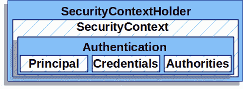
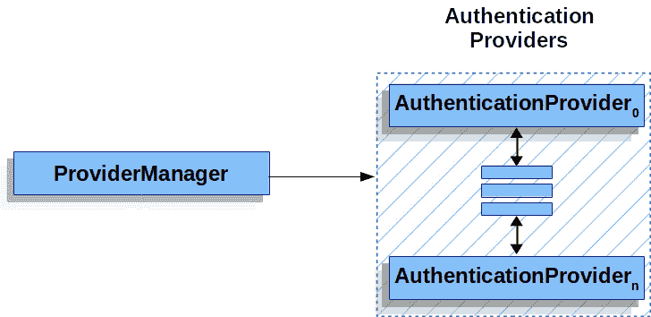
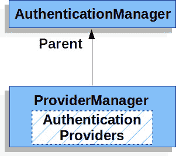
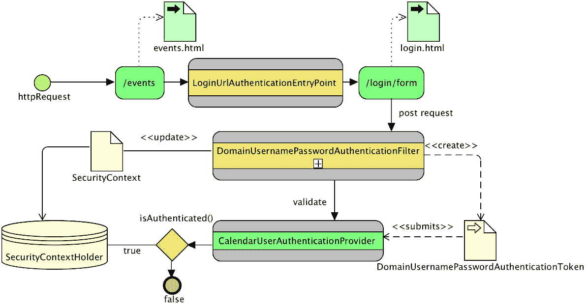

# 自定义认证

在 *第二章* 中，*Spring Security 入门*，我们展示了如何使用内存数据存储来认证用户。在本章中，我们将探讨通过扩展 Spring Security 的认证支持来使用我们现有的 API 集合来解决一些常见、现实世界的问题。通过这次探索，我们将了解 Spring Security 用于认证用户的每个构建块。

在本章中，我们将涵盖以下主题：

+   利用 Spring Security 的注解和基于 Java 的配置

+   发现如何获取当前登录用户的详细信息

+   在创建新账户后添加登录功能

+   学习向 Spring Security 表明用户已认证的最简单方法

+   创建自定义的 `UserDetailsService` 和 `AuthenticationProvider` 实现，以正确地将应用程序的其余部分与 Spring Security 解耦

+   添加基于域的认证以展示如何使用不仅仅是用户名和密码进行认证

本章的代码示例链接在此：[`packt.link/5tPFD`](https://packt.link/5tPFD)。

# Spring Security 的认证架构

应用程序安全领域基本上涉及解决两个在很大程度上独立的问题：认证（识别 *你是谁*）和授权（确定 *你被允许做什么*）。

有时，个人可能会将术语 *访问控制* 与 *授权* 互换使用，增加了一层潜在的混淆。

然而，将其视为 *访问控制* 可以提供清晰度，考虑到在其他地方术语 *授权* 的多方面使用。

Spring Security 采用了一种故意设计的架构，将认证与授权分离，为每个提供不同的策略和扩展点。在本节中，我们将揭示 Spring Security 用于认证的主要架构组件。

## `SecurityContextHolder` 类

Spring Security 的认证模型的核心是 `SecurityContextHolder`。它包含 `SecurityContext`。



图 3.1 – Spring Security 的 SecurityContextHolder

## `SecurityContext` 接口

`SecurityContextHolder` 是 Spring Security 存储谁已认证的细节的地方。Spring Security 不关心 `SecurityContextHolder` 如何被填充。如果它包含一个值，它就被用作当前已认证的用户。

## `Authentication` 接口

Spring Security 中的 `Authentication` 接口具有双重用途：

+   它作为 `AuthenticationManager` 的输入，为认证提供用户提供的凭据。在这个上下文中，`isAuthenticated()` 方法返回 false。

+   它作为当前已认证用户的表示，可以从 `SecurityContext` 中检索。

**认证**接口中的关键组件包括以下内容：

+   `UserDetails`，尤其是在用户名/密码认证中。

+   **凭证**：这通常包括密码。在许多情况下，认证后清除这些信息以防止意外泄露。

+   表示授予用户高级权限的`GrantedAuthority`实例。例如包括角色和范围。

## `AuthenticationManager`接口

`AuthenticationManager`充当 API，指定 Spring Security 的过滤器如何执行认证。随后，由调用控制器（即 Spring Security 的`Filters`实例）在`SecurityContextHolder`上建立认证结果。

如果你没有与 Spring Security 的`Filters`实例集成，你可以直接设置`SecurityContextHolder`，无需`AuthenticationManager`。

虽然`AuthenticationManager`的实现可以不同，但常见的选择通常是`ProviderManager`。

## `ProviderManager`类

`ProviderManager`是`AuthenticationManager`经常使用的实现方式。它将责任委托给一系列`AuthenticationProvider`实例。每个`AuthenticationProvider`都有能力表达认证是否成功、失败或委托决策给后续的`AuthenticationProvider`。如果配置的任何`AuthenticationProvider`实例都无法进行认证，认证过程将导致`ProviderNotFoundException`。这种特定的`AuthenticationException`表示`ProviderManager`缺乏配置以支持其提供的特定**认证**类型。



图 3.2 – Spring Security SecurityContextHolder

在实际应用中，每个`AuthenticationProvider`都配备有执行特定认证方法的能力。例如，一个`AuthenticationProvider`可能用于验证用户名/密码，而另一个则能够认证`SAML Assertion`。这种设置使得每个`AuthenticationProvider`能够处理特定形式的认证，适应各种认证类型，并只提供一个单一的`AuthenticationManager` bean。



图 3.3 – Spring Security SecurityContextHolder

此外，`ProviderManager`允许配置一个可选的父`AuthenticationManager`。当没有`AuthenticationProvider`能够执行认证时，将咨询这个父`AuthenticationManager`。父`AuthenticationManager`可以采取任何形式的`AuthenticationManager`，其中`ProviderManager`通常是选择类型。

多个 `ProviderManager` 实例可以共享一个父级 `AuthenticationManager`。这种情况在多个 `SecurityFilterChain` 实例共享一个共同的认证过程（由共享的父级 `AuthenticationManager` 表示）时相当典型。然而，这些实例也可能采用不同的认证机制，每个机制由不同的 `ProviderManager` 实例管理。


图 3.4 – Spring Security 的 `SecurityContextHolder`

默认情况下，`ProviderManager` 会尝试在成功认证请求返回的 `Authentication` 对象中移除任何敏感凭证信息。这种预防措施确保敏感细节，如密码，不会在 `HttpSession` 中存储超过必要的时间。

## `AuthenticationProvider` 接口

可以将多个 `AuthenticationProviders` 实例注入到 `ProviderManager` 中。每个 `AuthenticationProvider` 负责一种特定的认证形式。例如，`DaoAuthenticationProvider` 设计用于基于用户名/密码的认证，而 `JwtAuthenticationProvider` 专门用于认证 JSON Web Tokens。

# 探索 JBCP 日历架构

我们将从这个章节开始，分析 JBPC **日历**架构中的领域模型。

在 *第一章*，“不安全应用程序的解剖”和 *第二章*，“Spring Security 入门”中，我们使用了 Spring **物料清单**（**BOM**）来帮助依赖关系管理，但项目中的其余代码使用了核心 Spring 框架，并需要手动配置。从本章开始，我们将使用 Spring Boot 来简化应用程序配置过程。我们将为 Spring Boot 和非 Boot 应用程序创建相同的 Spring Security 配置。我们将在 *附录*，“附加参考材料”中详细介绍 Spring IO 和 Spring Boot。 

在接下来的章节中，我们将深入研究 JBCP 日历应用程序的领域模型。我们的目标是了解将 Spring Security 与个性化用户配置和 API 集成的过程。

## `CalendarUser` 对象

我们的日历应用程序使用一个名为 `CalendarUser` 的领域对象，其中包含有关用户的信息，如下所示：

```java
//src/main/java/com/packtpub/springsecurity/domain/CalendarUser.java
public class CalendarUser implements Serializable {
    private Integer id;
    private String firstName;
    private String lastName;
    private String email;
    private String password;
... accessor methods omitted ..
}
```

## `Event` 对象

我们的应用程序有一个包含每个事件信息的 `Event` 对象，如下所示：

```java
//src/main/java/com/packtpub/springsecurity/domain/Event.java
public record Event(
       Integer id,
       @NotEmpty(message = "Summary is required") String summary,
       @NotEmpty(message = "Description is required") String description,
       @NotNull(message = "When is required") Calendar dateWhen,
       @NotNull(message = "Owner is required") CalendarUser owner,
       CalendarUser attendee
) {}
```

## `CalendarService` 接口

我们的应用程序包含一个 `CalendarService` 接口，可以用来访问和存储我们的领域对象。`CalendarService` 的代码如下：

```java
//src/main/java/com/packtpub/springsecurity/service/CalendarService.java
public interface CalendarService {
    CalendarUser getUser(int id);
    CalendarUser findUserByEmail(String email);
    List<CalendarUser> findUsersByEmail(String partialEmail);
    int createUser(CalendarUser user);
    Event getEvent(int eventId);
    int createEvent(Event event);
    List<Event> findForUser(int userId);
    List<Event> getEvents();
}
```

我们不会详细介绍`CalendarService`中使用的函数，但它们应该是相当直接的。如果您想了解每个函数的作用，请参阅示例代码中的 Javadoc。

## UserContext 接口

与大多数应用程序一样，我们的应用程序需要我们与当前登录的用户进行交互。我们创建了一个非常简单的界面，称为`UserContext`，用于管理当前登录的用户，如下所示：

```java
//src/main/java/com/packtpub/springsecurity/service/UserContext.java
public interface UserContext {
    CalendarUser getCurrentUser();
    void setCurrentUser(CalendarUser user);
}
```

这意味着我们的应用程序可以调用`UserContext.getCurrentUser()`来获取当前登录用户的详细信息。它还可以调用`UserContext.setCurrentUser(CalendarUser)`来指定哪个用户已登录。在本章的后面部分，我们将探讨如何编写一个使用 Spring Security 访问我们的当前用户并使用`SecurityContextHolder`获取其详细信息的接口实现。

Spring Security 提供了多种不同的方法来验证用户。然而，最终结果是 Spring Security 将`o.s.s.core.context.SecurityContext`填充为`o.s.s.core.Authentication`。`Authentication`对象代表我们在认证时收集的所有信息（用户名、密码、角色等）。然后，`SecurityContext`接口被设置在`o.s.s.core.context.SecurityContextHolder`接口上。这意味着 Spring Security 和开发人员可以使用`SecurityContextHolder`来获取当前登录用户的信息。以下是如何获取当前用户名的示例：

```java
String username = SecurityContextHolder.getContext()
       .getAuthentication()
       .getName();
```

重要提示

应该注意的是，在`Authentication`对象上始终应该进行`null`检查，因为如果用户未登录，它可能是`null`。

## SpringSecurityUserContext 接口

当前`UserContext`实现`UserContextStub`是一个存根，总是返回相同的用户。这意味着无论谁登录，**我的事件**页面都会显示相同的用户。让我们更新我们的应用程序，以便利用当前的 Spring Security 用户名，以确定在**我的****事件**页面上显示哪些事件。

重要提示

您应该从`chapter03.00- calendar`中的示例代码开始。

看一下以下步骤：

1.  第一步是注释掉`UserContextStub`上的`@Component`属性，这样我们的应用程序就不再使用我们的扫描结果。

重要提示

`@Component`注解与在`com/packtpub/springsecurity/web/configuration/WebMvcConfi g.java`中找到的`@Configuration`注解一起使用，用于自动创建 Spring bean，而不是为每个 bean 创建显式的 XML 或 Java 配置。您可以在[`docs.spring.io/spring-framework/reference/core/beans/classpath-scanning.xhtml`](https://docs.spring.io/spring-framework/reference/core/beans/classpath-scanning.xhtml)了解更多关于 Spring 扫描类路径的信息。

看一下下面的代码片段：

```java
...
@Component
public class UserContextStub implements UserContext {
...
```

1.  下一步是利用`SecurityContext`来获取当前登录的用户。我们已经在本章的代码中包含了`SpringSecurityUserContext`，它与必要的依赖项连接，但没有任何实际的功能。

1.  打开`SpringSecurityUserContext.java`文件，并添加`@Component`注解。接下来，替换`getCurrentUser`实现，如下面的代码片段所示：

    ```java
    //src/main/java/com/packtpub/springsecurity/service/ SpringSecurityUserContext.java
    @Component
    public class SpringSecurityUserContext implements UserContext {
        private final CalendarService calendarService;
        private final UserDetailsService userDetailsService;
        public SpringSecurityUserContext(final CalendarService calendarService,
              final UserDetailsService userDetailsService) {
           if (calendarService == null) {
              throw new IllegalArgumentException("calendarService cannot be null");
           }
           if (userDetailsService == null) {
              throw new IllegalArgumentException("userDetailsService cannot be null");
           }
           this.calendarService = calendarService;
           this.userDetailsService = userDetailsService;
        }
        @Override
        public CalendarUser getCurrentUser() {
           SecurityContext context = SecurityContextHolder.getContext();
           Authentication authentication = context.getAuthentication();
           if (authentication == null) {
              return null;
           }
           User user = (User) authentication.getPrincipal();
           String email = user.getUsername();
           if (email == null) {
              return null;
           }
           CalendarUser result = calendarService.findUserByEmail(email);
           if (result == null) {
              throw new IllegalStateException(
                    "Spring Security is not in synch with CalendarUsers. Could not find user with email " + email);
           }
           return result;
        }
        @Override
        public void setCurrentUser(CalendarUser user) {
           throw new UnsupportedOperationException();
        }
    }
    ```

    我们的代码从当前的 Spring Security `Authentication`对象中获取用户名，并利用它通过电子邮件地址查找当前的`CalendarUser`对象。由于我们的 Spring Security 用户名是电子邮件地址，我们可以使用电子邮件地址将`CalendarUser`与 Spring Security 用户关联起来。请注意，如果我们要将账户关联起来，我们通常会希望使用我们生成的键来完成，而不是可能发生变化的东西（即电子邮件地址）。我们遵循良好的实践，只将我们的域对象返回给应用程序。这确保了我们的应用程序只知道我们的`CalendarUser`对象，因此不会与 Spring Security 耦合。

    这段代码看起来可能与我们在*第二章*“Spring Security 入门”中使用的`sec:authorize=` **"isAuthenticated()"** 标签属性时非常相似。实际上，Spring Security 标签库以与我们这里相同的方式使用`SecurityContextHolder`。我们可以使用我们的`UserContext`接口将当前用户放置在`HttpServletRequest`上，从而消除对 Spring Security 标签库的依赖。

1.  启动应用程序，访问`http://localhost:8080/`，并使用`admin1@example.com`作为用户名和`admin1`作为密码进行登录。

1.  访问**我的事件**页面，您将看到只显示当前用户的事件，该用户是事件的所有者或参与者。

1.  尝试创建一个新事件；您将观察到事件的所有者现在与登录用户相关联。

1.  从应用程序中注销，并使用`user1@example.com`作为用户名和`user1`作为密码重复这些步骤。

重要提示

您的代码现在应该看起来像`chapter03.01-calendar`。

在本节中，我们介绍了 JBCP 日历架构。在下一节中，我们将看到如何使用`SecurityContextHolder`来管理新用户。

# 使用 SecurityContextHolder 登录新用户

一个常见的需求是允许用户创建新账户，然后自动将其登录到应用程序。在本节中，我们将描述利用`SecurityContextHolder`来指示用户已认证的最简单方法。

## 在 Spring Security 中管理用户

在 *第一章*，*不安全应用程序的解剖* 中提供的应用程序提供了一个创建新的 `CalendarUser` 对象的机制，因此用户注册后创建我们的 `CalendarUser` 对象应该相当简单。然而，Spring Security 对 `CalendarUser` 一无所知。这意味着我们还需要在 Spring Security 中添加新用户。不用担心，我们将在本章的后面部分消除对用户的双重维护需求。

Spring Security 提供了一个 `o.s.s.provisioning.UserDetailsManager` 接口用于管理用户。还记得我们之前的内存中 Spring Security 配置吗？

```java
auth.inMemoryAuthentication(). withUser("user").password("user").roles("USER");
```

`SecurityConfig.userDetailsService()` 方法创建了一个内存中的 `UserDetailsManager` 实现，名为 `o.s.s.provisioning.InMemoryUserDetailsManager`，它可以用来创建新的 Spring Security 用户。

让我们通过以下步骤来了解如何在 Spring Security 中管理用户：

1.  要使用基于 Java 的配置来暴露 `UserDetailsManager`，我们需要创建 `InMemoryUserDetailsManager`：

    ```java
    //src/main/java/com/packtpub/springsecurity/configuration/SecurityConfig.java
    @Bean
    public InMemoryUserDetailsManager userDetailsService() {
           UserDetails user1 = User.withDefaultPasswordEncoder()
           .username("user1@example.com")
           .password("user1")
           .roles("USER")
           .build();
           UserDetails admin1 = User.withDefaultPasswordEncoder()
           .username("admin1@example.com")
           .password("admin1")
           .roles("USER", "ADMIN")
           .build();
           return new InMemoryUserDetailsManager(user1, admin1);
    }
    ```

1.  一旦我们在 Spring 配置中暴露了 `UserDetailsManager` 接口，我们只需要更新现有的 `CalendarService` 实现，即 `DefaultCalendarService`，以在 Spring Security 中添加用户。对 `DefaultCalendarService.java` 文件进行以下更新：

    ```java
    //src/main/java/com/packtpub/springsecurity/service/ DefaultCalendarService.java
    public int createUser(final CalendarUser user) {
           List<GrantedAuthority> authorities = AuthorityUtils.createAuthorityList("ROLE_USER");
           UserDetails userDetails = new User(user.getEmail(), user.getPassword(), authorities);
           userDetailsManager.createUser(userDetails);
           return userDao.createUser(user);
           }
    ```

1.  要利用 `UserDetailsManager`，我们首先将 `CalendarUser` 转换为 Spring Security 的 `UserDetails` 对象。

1.  之后，我们使用 `UserDetailsManager` 来保存 `UserDetails` 对象。这种转换是必要的，因为 Spring Security 不了解如何保存我们的自定义 `CalendarUser` 对象，因此我们必须将 `CalendarUser` 映射到 Spring Security 理解的对象。您将注意到 `GrantedAuthority` 对象对应于我们的 `SecurityConfig` 文件的 `authorities` 属性。我们为了简单起见并因为我们的现有系统中没有角色的概念而将其硬编码。

## 在应用程序中登录新用户

现在我们能够向系统中添加新用户，我们需要表明该用户已认证。更新 `SpringSecurityUserContext` 以在 Spring Security 的 `SecurityContextHolder` 对象上设置当前用户，如下所示：

```java
@Override
public void setCurrentUser(CalendarUser user) {
    if (user == null) {
       throw new IllegalArgumentException("user cannot be null");
    }
    UserDetails userDetails = userDetailsService.loadUserByUsername(user.getEmail());
    UsernamePasswordAuthenticationToken authentication = new UsernamePasswordAuthenticationToken(userDetails,
          user.getPassword(), userDetails.getAuthorities());
    SecurityContextHolder.getContext().setAuthentication(authentication);
}
```

我们执行的第一步是将我们的 `CalendarUser` 对象转换为 Spring Security 的 `UserDetails` 对象。这是必要的，因为正如 Spring Security 不知道如何保存我们的自定义 `CalendarUser` 对象一样，Spring Security 也不理解如何使用我们的自定义 `CalendarUser` 对象进行安全决策。我们使用 Spring Security 的 `o.s.s.core.userdetails.UserDetailsService` 接口来获取与 `UserDetailsManager` 保存的相同的 `UserDetails` 对象。`UserDetailsService` 接口提供了 Spring Security 的 `UserDetailsManager` 对象所提供功能的一个子集，我们之前已经见过。

接下来，我们创建一个`UsernamePasswordAuthenticationToken`对象，并将`UserDetails`、密码和`GrantedAuthority`放入其中。最后，我们在`SecurityContextHolder`上设置认证。在 Web 应用程序中，Spring Security 会自动将`SecurityContextHolder`中的`SecurityContext`对象与我们 HTTP 会话关联起来。

重要提示

重要的是 Spring Security 不能被指示忽略一个 URL（即使用`permitAll()`方法），如在第*2 章*“使用 Spring Security 入门”中讨论的那样，其中访问或设置了`SecurityContextHolder`。这是因为 Spring Security 将忽略请求，因此不会为后续请求持久化`SecurityContext`。会话管理支持由几个协同工作的组件组成，以提供功能，因此我们使用了`securityContext.requireExplicitSave(false)`来持久化会话。

这种方法的优点是无需再次击中数据存储。在我们的情况下，数据存储是一个内存数据存储，但它可以由数据库支持，这可能会带来一些安全影响。这种方法的缺点是我们无法大量重用代码。由于此方法调用不频繁，我们选择重用代码。一般来说，最好单独评估每种情况，以确定哪种方法最有意义。

## 更新`SignupController`

应用程序有一个`SignupController`对象，它处理创建新的`CalendarUser`对象的 HTTP 请求。最后一步是更新`SignupController`以创建我们的用户并指示他们已登录。对`SignupController`进行以下更新：

```java
//src/main/java/com/packtpub/springsecurity/web/controllers/SignupController.java
@PostMapping("/signup/new")
public String signup(final @Valid SignupForm signupForm,
final BindingResult result,
       RedirectAttributes redirectAttributes) {
       if (result.hasErrors()) {
       return "signup/form";
       }
       String email = signupForm.getEmail();
       if (calendarService.findUserByEmail(email) != null) {
       result.rejectValue("email", "errors.signup.email", "Email address is already in use. FOO");
       redirectAttributes.addFlashAttribute("error", "Email address is already in use. FOO");
       return "signup/form";
       }
       CalendarUser user = new CalendarUser(null, signupForm.getFirstName(), signupForm.getLastName(), email, signupForm.getPassword());
       int id = calendarService.createUser(user);
       user.setId(id);
       userContext.setCurrentUser(user);
       redirectAttributes.addFlashAttribute("message", "You have successfully signed up and logged in.");
       return "redirect:/";
       }
```

如果您还没有这样做，请重新启动应用程序，访问`http://localhost:8080/`，创建一个新用户，您将看到新用户会自动登录。

重要提示

您的代码现在应该看起来像`chapter03.02-calendar`。

在本节中，我们介绍了新用户注册工作流程。在下一节中，我们将创建一个自定义的`UserDetailsService`对象。

# 创建自定义`UserDetailsService`对象

虽然我们可以将我们的领域模型（`CalendarUser`）与 Spring Security 的领域模型（`UserDetails`）关联起来，但我们必须维护用户的多个表示形式。为了解决这种双重维护问题，我们可以实现一个自定义的`UserDetailsService`对象，将我们的现有`CalendarUser`领域模型转换为 Spring Security 的`UserDetails`接口的实现。通过将我们的`CalendarUser`对象转换为`UserDetails`，Spring Security 可以使用我们的自定义领域模型进行安全决策。这意味着我们不再需要管理用户的两种不同表示形式。

## `CalendarUserDetailsService`类

到目前为止，我们需要为用户提供两种不同的表示形式：一个用于 Spring Security 进行安全决策，另一个用于我们的应用程序将域对象与之关联。创建一个名为`CalendarUserDetailsService`的新类，以便 Spring Security 了解我们的`CalendarUser`对象。这将确保 Spring Security 可以根据我们的域模型做出决策。创建一个名为`CalendarUserDetailsService.java`的新文件，如下所示：

```java
//src/main/java/com/packtpub/springsecurity/service/CalendarUserDetailsService.java
@Component
public class CalendarUserDetailsService implements UserDetailsService {
    private static final Logger logger = LoggerFactory
          .getLogger(CalendarUserDetailsService.class);
    private final CalendarUserDao calendarUserDao;
    public CalendarUserDetailsService(final CalendarUserDao calendarUserDao) {
       if (calendarUserDao == null) {
          throw new IllegalArgumentException("calendarUserDao cannot be null");
       }
       this.calendarUserDao = calendarUserDao;
    }
    @Override
    public UserDetails loadUserByUsername(String username) throws UsernameNotFoundException {
       CalendarUser user = calendarUserDao.findUserByEmail(username);
       if (user == null) {
          throw new UsernameNotFoundException("Invalid username/password.");
       }
       Collection<? extends GrantedAuthority> authorities = CalendarUserAuthorityUtils.createAuthorities(user);
       return new User(user.getEmail(), user.getPassword(), authorities);
    }
}
```

在这里，我们利用`CalendarUserDao`通过电子邮件地址获取`CalendarUser`。我们注意不要返回 null 值；相反，应该抛出`UsernameNotFoundException`异常，因为返回`null`会破坏`UserDetailsService`接口。

然后，我们将`CalendarUser`转换为`UserDetails`，由用户实现，就像我们在前面的章节中所做的那样。

我们现在利用一个名为`CalendarUserAuthorityUtils`的实用工具类，我们在示例代码中提供了它。这将根据电子邮件地址创建`GrantedAuthority`，以便我们可以支持用户和管理员。如果电子邮件以`admin`开头，则用户被视为`ROLE_ADMIN`和`ROLE_USER`。否则，用户被视为`ROLE_USER`。当然，我们不会在真实的应用程序中这样做，但正是这种简单性使我们能够专注于这个课程。

## 配置 UserDetailsService

现在我们有一个新的`UserDetailsService`对象，让我们更新 Spring Security 配置以利用它。由于我们利用了`classpath`扫描和`@Component`注解，我们的`CalendarUserDetailsService`类会自动添加到 Spring 配置中。这意味着我们只需要更新 Spring Security 以引用我们刚刚创建的`CalendarUserDetailsService`类。`userDetailsService()`方法，Spring Security 的`UserDetailsService`内存实现，因为我们现在提供了自己的`UserDetailsService`实现。

更新`SecurityConfig.java`文件，如下所示以声明一个具有默认映射的`DelegatingPasswordEncoder`。可以添加额外的映射，并且编码将更新以符合最佳实践。然而，由于`DelegatingPasswordEncoder`的性质，更新不应影响用户：

```java
@Configuration
@EnableWebSecurity
public class SecurityConfig {
    @Bean
    public SecurityFilterChain filterChain(HttpSecurity http) throws Exception {
...
    }
   @Bean
   public PasswordEncoder encoder() {
       return PasswordEncoderFactories.createDelegatingPasswordEncoder();
   }
}
```

## 移除对 UserDetailsManager 的引用

我们需要移除在`DefaultCalendarService`中添加的代码，该代码使用`UserDetailsManager`来同步 Spring Security 的`o.s.s.core.userdetails.User`接口和`CalendarUser`。首先，由于 Spring Security 现在引用了`CalendarUserDetailsService`，这段代码不再必要。其次，由于我们移除了`inMemoryAuthentication()`方法，我们的 Spring 配置中没有定义`UserDetailsManager`对象。继续移除`DefaultCalendarService`中找到的所有`UserDetailsManager`引用。更新将类似于以下示例片段：

启动应用程序并查看 Spring Security 的内存 `UserDetailsManager` 对象现在不再必要（我们已从 `SecurityConfig.java` 文件中删除它）。

重要提示

您的代码现在应该看起来像 `chapter03.03-calendar`。

## CalendarUserDetails 对象

我们已经成功消除了同时管理 Spring Security 用户和我们的 `CalendarUser` 对象的需求。然而，对于我们来说，仍然需要不断地在这两个对象之间进行转换仍然很麻烦。因此，我们将创建一个 `CalendarUserDetails` 对象，它可以被称作 `UserDetails` 和 `CalendarUser`。将 `CalendarUserDetailsService` 更新为使用 `CalendarUserDetails`，如下所示：

```java
@Component
public class CalendarUserDetailsService implements UserDetailsService {
    private final CalendarUserDao calendarUserDao;
    public CalendarUserDetailsService(CalendarUserDao calendarUserDao) {
       if (calendarUserDao == null) {
          throw new IllegalArgumentException("calendarUserDao cannot be null");
       }
       this.calendarUserDao = calendarUserDao;
    }
    @Override
    public UserDetails loadUserByUsername(String username) throws UsernameNotFoundException {
        ...
       }
       return new CalendarUserDetails(user);
    }
    private final class CalendarUserDetails extends CalendarUser implements UserDetails {
       CalendarUserDetails(CalendarUser user) {
          super(user.getId(), user.getFirstName(), user.getLastName(), user.getEmail(), user.getPassword());
       }
       @Override
       public Collection<? extends GrantedAuthority> getAuthorities() {
          return CalendarUserAuthorityUtils.createAuthorities(this);
       }
       @Override
       public String getUsername() {
          return getEmail();}
       @Override
       public boolean isAccountNonExpired() {
          return true;}
       @Override
       public boolean isAccountNonLocked() {
          return true;}
       @Override
       public boolean isCredentialsNonExpired() {
          return true; }
       @Override
       public boolean isEnabled() {
         return true;   }
    }
}
```

在下一节中，我们将看到我们的应用程序现在可以引用当前 `CalendarUser` 对象上的主体认证。然而，Spring Security 可以继续将 `CalendarUserDetails` 作为 `UserDetails` 对象处理。

## SpringSecurityUserContext 简化

我们已将 `CalendarUserDetailsService` 更新为返回一个扩展 `CalendarUser` 并实现 `UserDetails` 的 `UserDetails` 对象。这意味着，我们不再需要在两个对象之间进行转换，我们可以简单地引用 `CalendarUser` 对象。按照以下方式更新 `SpringSecurityUserContext`：

```java
@Component
public class SpringSecurityUserContext implements UserContext {
    @Override
    public CalendarUser getCurrentUser() {
       SecurityContext context = SecurityContextHolder.getContext();
       Authentication authentication = context.getAuthentication();
       if (authentication == null) {
          return null;
       }
       return (CalendarUser) authentication.getPrincipal();
    }
    @Override
    public void setCurrentUser(CalendarUser user) {
       if (user == null) {
          throw new IllegalArgumentException("user cannot be null");
       }
       Collection<? extends GrantedAuthority> authorities = CalendarUserAuthorityUtils.createAuthorities(user);
       UsernamePasswordAuthenticationToken authentication = new UsernamePasswordAuthenticationToken(user,
             user.getPassword(), authorities);
       SecurityContextHolder.getContext().setAuthentication(authentication);
    }
}
```

更新不再需要使用 `CalendarUserDao` 或 Spring Security 的 `UserDetailsService` 接口。还记得我们之前章节中的 `loadUserByUsername` 方法吗？这个方法调用的结果成为认证的主体。由于我们更新的 `loadUserByUsername` 方法返回一个扩展 `CalendarUser` 的对象，我们可以安全地将 `Authentication` 对象的主体强制转换为 `CalendarUser`。在调用 `setCurrentUser` 方法时，我们可以将 `CalendarUser` 对象作为主体传递给 `UsernamePasswordAuthenticationToken` 构造函数。这允许我们在调用 `getCurrentUser` 方法时仍然将主体强制转换为 `CalendarUser` 对象。

显示自定义用户属性

现在，由于 `CalendarUser` 已填充到 Spring Security 的认证中，我们可以更新我们的 UI 以显示当前用户的姓名而不是电子邮件地址。使用以下代码更新 `header.xhtml` 文件：

```java
//src/main/resources/templates/fragments/header.xhtml
<li class="nav-item">
    <a class="nav-link" href="#">Welcome <span class="navbar-text"
                                               th:text="${#authentication.getPrincipal().getName()}"> </span></a>
</li>
```

内部，`"${#authentication.getPrincipal().getName()}"` 标签属性执行以下代码。注意，高亮显示的值与我们在 `header.xhtml` 文件中指定的 `authentication` 标签的 `property` 属性相关联：

```java
SecurityContext context = SecurityContextHolder.getContext();
Authentication authentication = context.getAuthentication();
CalendarUser user = (CalendarUser) authentication.getPrincipal();
String firstAndLastName = user.getName();
```

重新启动应用程序，访问 `http://localhost:8080/` 并登录以查看更新。现在您应该看到的是用户的首字母和姓氏，而不是当前用户的电子邮件地址。

重要提示

您的代码现在应该看起来像 `chapter03.04-calendar`。

在本节中配置 `CalendarUserDetailsService` 和 `UserDetailsService` 并简化 `SpringSecurityUserContext` 以显示自定义用户属性后，在下一节中，我们将探讨如何创建自定义的 `AuthenticationProvider`。

# 创建自定义 AuthenticationProvider 对象

Spring Security 将委托给一个`AuthenticationProvider`对象来确定用户是否已认证。这意味着我们可以编写自定义的`AuthenticationProvider`实现来告知 Spring Security 如何以不同的方式认证。好消息是，Spring Security 提供了相当多的`AuthenticationProvider`对象，所以大多数情况下您不需要创建一个。事实上，直到这一点，我们一直在使用 Spring Security 的`o.s.s.authentication.dao.DaoAuthenticationProvider`对象，该对象比较`UserDetailsService`返回的用户名和密码。

## 创建 CalendarUserAuthenticationProvider

在本节的其余部分，我们将创建一个名为`CalendarUserAuthenticationProvider`的自定义`AuthenticationProvider`对象，它将替换`CalendarUserDetailsService`。然后，我们将使用`CalendarUserAuthenticationProvider`来考虑一个额外的参数，以支持从多个域验证用户。

重要提示

我们必须使用`AuthenticationProvider`对象而不是`UserDetailsService`，因为`UserDetails`接口没有域参数的概念。

创建一个名为`CalendarUserAuthenticationProvider`的新类，如下所示：

```java
//src/main/java/com/packtpub/springsecurity/authentication/ CalendarUserAuthenticationProvider.java
@Component
public class CalendarUserAuthenticationProvider implements AuthenticationProvider {
    private final CalendarService calendarService;
    public CalendarUserAuthenticationProvider(final CalendarService calendarService) {
       if (calendarService == null) {
          throw new IllegalArgumentException("calendarService cannot be null");
       }
       this.calendarService = calendarService;
    }
    @Override
    public Authentication authenticate(final Authentication authentication) throws AuthenticationException {
       UsernamePasswordAuthenticationToken token = (UsernamePasswordAuthenticationToken) authentication;
       String email = token.getName();
       CalendarUser user = email == null ? null : calendarService.findUserByEmail(email);
       if (user == null) {
          throw new UsernameNotFoundException("Invalid username/password");
       }
       String password = user.getPassword();
       if (!password.equals(token.getCredentials())) {
          throw new BadCredentialsException("Invalid username/password");
       }
       Collection<? extends GrantedAuthority> authorities = CalendarUserAuthorityUtils.createAuthorities(user);
       return new UsernamePasswordAuthenticationToken(user, password, authorities);
    }
    @Override
    public boolean supports(final Class<?> authentication) {
       return UsernamePasswordAuthenticationToken.class.equals(authentication);
    }
}
```

重要提示

请记住，您可以使用您的`chapter03.05-calendar`。

在 Spring Security 可以调用`authenticate`方法之前，必须确保将要传入的`Authentication`类的`supports`方法返回`true`。在这种情况下，`AuthenticationProvider`可以验证用户名和密码。我们不接受`UsernamePasswordAuthenticationToken`的子类，因为可能存在我们不知道如何验证的额外字段。

`authenticate`方法接受一个表示认证请求的`Authentication`对象作为参数。在实践中，这是我们需要尝试验证的用户输入。如果认证失败，该方法应抛出`o.s.s.core.AuthenticationException`异常。如果认证成功，它应返回一个包含用户适当`GrantedAuthority`对象的`Authentication`对象。返回的`Authentication`对象将被设置在`SecurityContextHolder`中。如果无法确定认证，该方法应返回`null`。

验证请求的第一步是从`Authentication`对象中提取我们需要用于验证用户的信息。在我们的例子中，我们提取用户名并通过电子邮件地址查找`CalendarUser`，就像`CalendarUserDetailsService`所做的那样。如果提供的用户名和密码与`CalendarUser`匹配，我们将返回一个包含适当`GrantedAuthority`的`UsernamePasswordAuthenticationToken`对象。否则，我们将抛出`AuthenticationException`异常。

记得登录页面是如何利用`SPRING_SECURITY_LAST_EXCEPTION`来解释登录失败的原因吗？在`AuthenticationProvider`中抛出的`AuthenticationException`异常消息是最后一个`AuthenticationException`异常，并在登录失败的情况下显示在我们的登录页面上。

## 配置`CalendarUserAuthenticationProvider`对象

让我们执行以下步骤来配置`CalendarUserAuthenticationProvider`：

1.  更新`SecurityConfig.java`文件以引用我们新创建的`CalendarUserAuthenticationProvider`对象，并移除对`CalendarUserDetailsService`的引用，如下面的代码片段所示：

    ```java
    //src/main/java/com/packtpub/springsecurity/configuration/ SecurityConfig.java
    @EnableWebSecurity
    public class SecurityConfig {
        private final CalendarUserAuthenticationProvider cuap;
        public SecurityConfig(CalendarUserAuthenticationProvider cuap) {
           this.cuap = cuap;
        }
        @Bean
        public AuthenticationManager authManager(HttpSecurity http) throws Exception {
           AuthenticationManagerBuilder authenticationManagerBuilder =
                 http.getSharedObject(AuthenticationManagerBuilder.class);
           authenticationManagerBuilder.authenticationProvider(cuap);
           return authenticationManagerBuilder.build();
        }
    ...
    }
    ```

1.  更新`SecurityConfig.java`文件，如下所示，通过移除`PasswordEncoder`bean：

    ```java
    @Configuration
    @EnableWebSecurity
    public class SecurityConfig {
        @Bean
        public SecurityFilterChain filterChain(HttpSecurity http) throws Exception {
    ...
        }
    // We removed the PasswordEncoder
    }
    ```

1.  重新启动应用程序并确保一切仍然正常工作。作为一个用户，我们不会注意到任何不同。然而，作为一个开发者，我们知道`CalendarUserDetails`不再需要；我们仍然能够显示当前用户的姓名和姓氏，Spring Security 仍然能够利用`CalendarUser`进行认证。

重要提示

您的代码现在应该看起来像`chapter03.05-calendar`。

## 使用不同参数进行认证

`AuthenticationProvider`的一个优点是它可以使用您想要的任何参数进行认证。例如，也许您的应用程序使用随机标识符进行认证，或者它可能是一个多租户应用程序，需要用户名、密码和域。在下一节中，我们将更新`CalendarUserAuthenticationProvider`以支持多个域。

重要提示

域是我们用户范围的一种方式。例如，如果我们只部署一次应用程序，但有多个客户端使用相同的部署，每个客户端可能希望有一个用户名为`admin`的用户。通过向我们的用户对象添加域，我们可以确保每个用户都是唯一的，并且仍然支持这一要求。

### `DomainUsernamePasswordAuthenticationToken`类

当用户进行认证时，Spring Security 会将用户提供的信息提交给`AuthenticationProvider`的`Authentication`对象。当前的`UsernamePasswordAuthentication`对象仅包含用户名和密码字段。创建一个包含`domain`字段的`DomainUsernamePasswordAuthenticationToken`对象，如下面的代码片段所示：

```java
//src/main/java/com/packtpub/springsecurity/authentication/ DomainUsernamePasswordAuthenticationToken.java
public final class DomainUsernamePasswordAuthenticationToken extends
       UsernamePasswordAuthenticationToken {
    private final String domain;
    // used for attempting authentication
    public DomainUsernamePasswordAuthenticationToken(String
          principal, String credentials, String domain) {
       super(principal, credentials);
       this.domain = domain;
    }
    // used for returning to Spring Security after being
    //authenticated
    public DomainUsernamePasswordAuthenticationToken(CalendarUser
          principal, String credentials, String domain,
          Collection<? extends GrantedAuthority> authorities) {
       super(principal, credentials, authorities);
       this.domain = domain;
    }
    public String getDomain() {
       return domain;
    }
}
```

### 更新`CalendarUserAuthenticationProvider`

让我们看看更新`CalendarUserAuthenticationProvider.java`文件的以下步骤：

1.  现在，我们需要更新`CalendarUserAuthenticationProvider`以利用域字段，如下所示：

    ```java
    @Component
    public class CalendarUserAuthenticationProvider implements AuthenticationProvider {
        private static final Logger logger = LoggerFactory
              .getLogger(CalendarUserAuthenticationProvider.class);
        private final CalendarService calendarService;
        @Autowired
        public CalendarUserAuthenticationProvider(CalendarService calendarService) {
           if (calendarService == null) {
              throw new IllegalArgumentException("calendarService cannot be null");
           }
           this.calendarService = calendarService;
        }
        @Override
        public Authentication authenticate(Authentication authentication) throws AuthenticationException {
           DomainUsernamePasswordAuthenticationToken token = (DomainUsernamePasswordAuthenticationToken) authentication;
           String userName = token.getName();
           String domain = token.getDomain();
           String email = userName + "@" + domain;
           CalendarUser user = calendarService.findUserByEmail(email);
           logger.info("calendarUser: {}", user);
           if (user == null) {
              throw new UsernameNotFoundException("Invalid username/password");
           }
           String password = user.getPassword();
           if (!password.equals(token.getCredentials())) {
              throw new BadCredentialsException("Invalid username/password");
           }
           Collection<? extends GrantedAuthority> authorities = CalendarUserAuthorityUtils.createAuthorities(user);
           logger.info("authorities: {}", authorities);
           return new DomainUsernamePasswordAuthenticationToken(user, password, domain, authorities);
        }
        @Override
        public boolean supports(Class<?> authentication) {
           return DomainUsernamePasswordAuthenticationToken.class.equals(authentication);
        }
    }
    ```

1.  我们首先更新支持方法，以便 Spring Security 将`DomainUsername`**PasswordAuthenticationToken**传递到我们的`authenticate`方法中。

1.  然后，我们使用域信息来创建我们的电子邮件地址并进行认证，就像我们之前做的那样。诚然，这个例子是人为设计的。然而，这个例子可以说明如何使用额外的参数进行认证。

1.  `CalendarUserAuthenticationProvider`接口现在可以使用新的域名字段。然而，用户无法指定域名。为此，我们必须更新我们的`login.xhtml`文件。

### 将域名添加到登录页面

打开`login.xhtml`文件并添加一个名为`domain`的新输入，如下所示：

```java
//src/main/resources/templates/login.xhtml
<div class="mb-3">
<label class="form-label" for="username">Username</label>
<input autofocus="autofocus" class="form-control" id="username"
       name="username"
       type="text"/>
</div>
<div class="mb-3">
<label class="form-label" for="password">Password</label>
<input class="form-control" id="password" name="password"
       type="password"/>
</div>
<div class="mb-3">
<label class="form-label" for="domain">Domain</label>
<input class="form-control" id="domain" name="domain" type="text"/>
</div>
```

现在，当用户尝试登录时，将提交一个域名。然而，Spring Security 不知道如何使用该域名来创建`DomainUsernamePasswordAuthenticationToken`对象并将其传递给`AuthenticationProvider`。为了解决这个问题，我们需要创建`DomainUsernamePasswordAuthenticationFilter`。

### `DomainUsernamePasswordAuthenticationFilter`类

Spring Security 提供了一些`Servlet Filters`，这些过滤器充当认证用户的控制器。这些过滤器作为我们在*第二章*，“Spring Security 入门”中讨论的`FilterChainProxy`对象的一个代表被调用。之前，`formLogin()`方法指示 Spring Security 使用`o.s.s.web.authentication.UsernamePasswordAuthenticationFilter`作为登录控制器。该过滤器的任务是执行以下任务：

+   从 HTTP 请求中获取用户名和密码。

+   使用从 HTTP 请求中获得的信息创建一个`UsernamePasswordAuthenticationToken`对象。

+   请求 Spring Security 验证`UsernamePasswordAuthenticationToken`。

+   如果令牌被验证，它将在`SecurityContext` **持有者**上设置返回的认证，就像我们在新用户注册账户时所做的。我们需要扩展`UsernamePasswordAuthenticationFilter`以利用我们新创建的`DoainUsernamePasswordAuthenticationToken`对象。

+   创建一个`DomainUsernamePasswordAuthenticationFilter`对象，如下所示：

    ```java
    //src/main/java/com/packtpub/springsecurity/web/authentication/ DomainUsernamePasswordAuthenticationFilter.java
    public final class DomainUsernamePasswordAuthenticationFilter extends UsernamePasswordAuthenticationFilter {
        public DomainUsernamePasswordAuthenticationFilter(final AuthenticationManager authenticationManager) {
           super.setAuthenticationManager(authenticationManager);
        }
        public Authentication attemptAuthentication
              (HttpServletRequest request, HttpServletResponse response) throws
              AuthenticationException {
           if (!request.getMethod().equals("POST")) {
              throw new AuthenticationServiceException
                    ("Authentication method not supported: "
                          + request.getMethod());
           }
           String username = obtainUsername(request);
           String password = obtainPassword(request);
           String domain = request.getParameter("domain");
           DomainUsernamePasswordAuthenticationToken authRequest
                 = new DomainUsernamePasswordAuthenticationToken(username,
                 password, domain);
           setDetails(request, authRequest);
           return this.getAuthenticationManager()
                 .authenticate(authRequest);
        }
    }
    ```

新的`DomainUsernamePasswordAuthenticationFilter`对象将执行以下任务：

+   从`HttpServletRequest`方法中获取用户名、密码和域名。

+   使用从 HTTP 请求中获得的信息创建我们的`DomainUsernamePasswordAuthenticationToken`对象。

+   请求 Spring Security 验证`DomainUsernamePasswordAuthenticationToken`。这项工作委托给了`CalendarUserAuthenticationProvider`。

+   如果令牌被验证，其超类将在`SecurityContextHolder`上设置由`CalendarUserAuthenticationProvider`返回的认证，就像我们在用户创建新账户后进行认证时所做的。

### 更新我们的配置

现在我们已经创建了所需的所有代码，我们需要配置 Spring Security 以了解它。以下代码片段包括对`SecurityConfig.java`文件的必要更新，以支持我们的附加参数：

```java
//src/main/java/com/packtpub/springsecurity/configuration/ SecurityConfig.java
@Configuration
@EnableWebSecurity
public class SecurityConfig {
    private final CalendarUserAuthenticationProvider cuap;
    public SecurityConfig(CalendarUserAuthenticationProvider cuap) {
       this.cuap = cuap;
    }
    @Bean
    public SecurityFilterChain filterChain(HttpSecurity http, AuthenticationManager authManager) throws Exception {
       http.authorizeRequests((authz) -> authz
                   .requestMatchers(antMatcher("/webjars/**")).permitAll()
                   .requestMatchers(antMatcher("/css/**")).permitAll()
                   .requestMatchers(antMatcher("/favicon.ico")).permitAll()
                   // H2 console:
                   .requestMatchers(antMatcher("/admin/h2/**")).permitAll()
                   .requestMatchers(antMatcher("/")).permitAll()
                   .requestMatchers(antMatcher("/login/*")).permitAll()
                   .requestMatchers(antMatcher("/logout")).permitAll()
                   .requestMatchers(antMatcher("/signup/*")).permitAll()
                   .requestMatchers(antMatcher("/errors/**")).permitAll()
                   .requestMatchers(antMatcher("/admin/*")).hasRole("ADMIN")
                   .requestMatchers(antMatcher("/events/")).hasRole("ADMIN")
                   .requestMatchers(antMatcher("/**")).hasRole("USER"))
             .exceptionHandling(exceptions -> exceptions
                   .accessDeniedPage("/errors/403")
                   .authenticationEntryPoint(new LoginUrlAuthenticationEntryPoint("/login/form")))
             .logout(form -> form
                   .logoutUrl("/logout")
                   .logoutSuccessUrl("/login/form?logout")
                   .permitAll())
             // CSRF is enabled by default, with Java Config
             .csrf(AbstractHttpConfigurer::disable)
             // Add custom DomainUsernamePasswordAuthenticationFilter
             .addFilterAt(domainUsernamePasswordAuthenticationFilter(authManager), UsernamePasswordAuthenticationFilter.class);
       http.securityContext((securityContext) -> securityContext.requireExplicitSave(false));
       http.headers(headers -> headers.frameOptions(FrameOptionsConfig::disable));
       return http.build();
    }
    @Bean
    public DomainUsernamePasswordAuthenticationFilter domainUsernamePasswordAuthenticationFilter(AuthenticationManager authManager) {
       DomainUsernamePasswordAuthenticationFilter dupaf = new
             DomainUsernamePasswordAuthenticationFilter(authManager);
       dupaf.setFilterProcessesUrl("/login");
       dupaf.setUsernameParameter("username");
       dupaf.setPasswordParameter("password");
       dupaf.setAuthenticationSuccessHandler(new SavedRequestAwareAuthenticationSuccessHandler() {{
          setDefaultTargetUrl("/default");
       }});
       dupaf.setAuthenticationFailureHandler(new SimpleUrlAuthenticationFailureHandler() {{
          setDefaultFailureUrl("/login/form?error");
       }});
       dupaf.afterPropertiesSet();
       return dupaf;
    }
    @Bean
    public AuthenticationManager authManager(HttpSecurity http) throws Exception {
       AuthenticationManagerBuilder authenticationManagerBuilder =
             http.getSharedObject(AuthenticationManagerBuilder.class);
       authenticationManagerBuilder.authenticationProvider(cuap);
       return authenticationManagerBuilder.build();
    }
}
```

重要提示

```java
chapter03.06-calendar.
```

以下是配置更新的一些亮点：

+   我们覆盖了 `defaultAuthenticationEntryPoint` 并添加了对 `o.s.s.web.authentication.LoginUrlAuthenticationEntryPoint` 的引用，该引用确定当请求受保护资源且用户未认证时会发生什么。在我们的情况下，我们将被重定向到登录页面。

+   我们移除了 `formLogin()` 方法，并使用 `.addFilterAt()` 方法将我们的自定义过滤器插入到 `FilterChainProxy` 中。位置指示了 `FilterChain` 代理者被考虑的顺序，不能与其他过滤器重叠，但可以替换当前位置的过滤器。我们将 `UsernamePasswordAuthenticationFilter` 替换为我们的自定义过滤器。

    请参考以下图表以供参考：



图 3.5 – 自定义身份验证实现

您现在可以重新启动应用程序并尝试以下步骤，如前图所示，以了解所有部件是如何结合在一起的：

1.  访问 `http://localhost:8080/events`。

1.  Spring Security 将拦截受保护的 URL 并使用 `LoginUrlAuthentication` **EntryPoint** 对象来处理它。

1.  `LoginUrlAuthenticationEntryPoint` 对象将用户发送到登录页面。将 `admin1` 作为用户名，`example.com` 作为域，`admin1` 作为密码。

1.  `DomainUsernamePasswordAuthenticationFilter` 对象将拦截登录请求的过程。然后，它将从 HTTP 请求中获取用户名、域和密码，并创建一个 `DomainUsernamePasswordAuthenticationToken` 对象。

1.  `DomainUsernamePasswordAuthenticationFilter` 对象将 `DomainUsernamePasswordAuthenticationToken` 提交到 `CalendarUser` `AuthenticationProvider`。

1.  `CalendarUserAuthenticationProvider` 接口验证 `DomainUsername` **PasswordAuthenticationToken**，然后返回一个已认证的 `DomainUsername` **PasswordAuthenticationToken** 对象（即 `isAuthenticated()` 返回 `true`）。

1.  `DomainUserPasswordAuthenticationFilter` 对象使用 `DomainUsernamePasswordAuthenticationToken` 更新 `SecurityContext` 并将其放置在 `SecurityContextHolder` 中。

重要提示

您的代码现在应该看起来像 `chapter03.06-calendar`。

现在我们已经介绍了用户注册工作流程以及如何创建自定义 `UserDetailsService` 和 `AuthenticationProvider` 对象，我们将在下一节讨论应该使用哪种身份验证方法。

# 应该使用哪种身份验证方法？

我们已经介绍了三种主要的身份验证方法，那么哪一种是最好的呢？像所有解决方案一样，每种方法都有其优缺点。您可以通过参考以下列表来找到何时使用特定类型身份验证的总结：

+   `SecurityContextHolder`: 直接与 `SecurityContextHolder` 交互无疑是验证用户的最简单方式。当你需要验证新创建的用户或以非传统方式验证时，它工作得很好。通过直接使用 `SecurityContextHolder`，我们无需与那么多 Spring Security 层进行交互。缺点是，我们无法获得 Spring Security 自动提供的一些更高级功能。例如，如果我们想在登录后发送用户到之前请求的页面，我们必须手动将其集成到我们的控制器中。

+   `UserDetailsService`: 创建自定义的 `UserDetailsService` 对象是一种简单的机制，它允许 Spring Security 根据我们的自定义域模型做出安全决策。它还提供了一种机制来挂钩到其他 Spring Security 功能。例如，Spring Security 需要 `UserDetailsService` 使用在 *第七章* 中介绍的内置记住我（remember-me）支持，*记住我服务*。当验证不是基于用户名和密码时，`UserDetailsService` 对象不起作用。

+   `AuthenticationProvider`: 这是扩展 Spring Security 的最灵活方法。它允许用户使用他们想要的任何参数进行验证。然而，如果我们想利用像 Spring Security 的记住我（remember-me）这样的功能，我们仍然需要 `UserDetailsService`。

# 摘要

本章使用了现实世界的问题来介绍 Spring Security 中使用的基本构建块。它还向我们展示了我们如何通过扩展这些基本构建块来使 Spring Security 对我们的自定义域对象进行验证。简而言之，我们了解到 `SecurityContextHolder` 接口是确定当前用户的中心位置。它不仅可以被开发者用来访问当前用户，还可以用来设置当前登录用户。

我们还探讨了如何创建自定义的 `UserDetailsService` 和 `AuthenticationProvider` 对象，以及如何使用不仅仅是用户名和密码进行验证。

在下一章中，我们将探索基于 **Java 数据库连接**（**JDBC**）的内置验证支持。

# 第二部分：验证技术

在这部分，我们探讨了 Spring Security 提供的各种验证方法和服务。首先，我们深入探讨了使用 Spring Security 的 JDBC 支持对数据库中的用户进行验证。此外，我们还讨论了使用 Spring Security 的加密模块来保护密码以增强安全性。

接下来，我们将探索 Spring Data 与 Spring Security 的集成，利用 JPA 对关系型数据库进行验证，并使用 MongoDB 对文档数据库进行验证。

接下来，我们将介绍**轻量级目录访问协议**（**LDAP**）及其与 Spring Security 的集成。我们将探讨 LDAP 如何在启用 Spring Security 的应用程序中提供身份验证、授权和用户信息服务。

然后，我们将揭示 Spring Security 中记住我功能的特性和其配置。此外，我们还将讨论实现记住我功能时的注意事项，使应用程序能够在会话过期和浏览器关闭后仍然记住用户。

最后，我们将探讨可用的替代身份验证方法，以适应各种凭证类型。我们将超越传统的基于表单的身份验证，深入到使用受信任的客户端证书进行身份验证的领域。Spring Security 为这些多样化的身份验证需求提供了强大的支持，提供了一个框架来实施和管理使用客户端证书的身份验证，从而增强了应用程序中的安全措施。

本部分包含以下章节：

+   *第四章*，*基于 JDBC 的* *身份验证*

+   *第五章*，*使用 Spring Data 进行身份验证*

+   *第六章*，*LDAP 目录服务*

+   *第七章*，*记住我* *服务*

+   *第八章*，*使用 TLS 的客户端证书身份验证*
