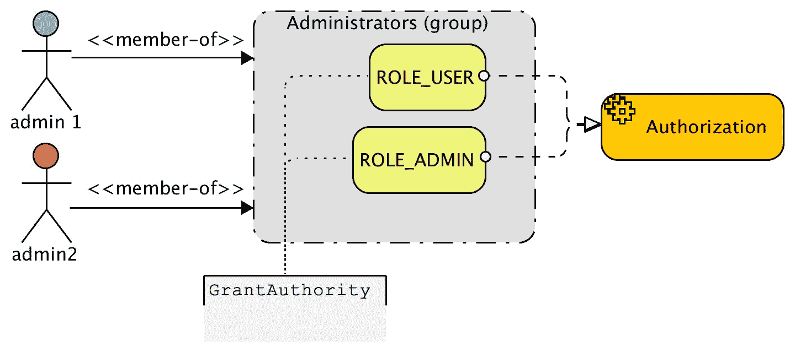
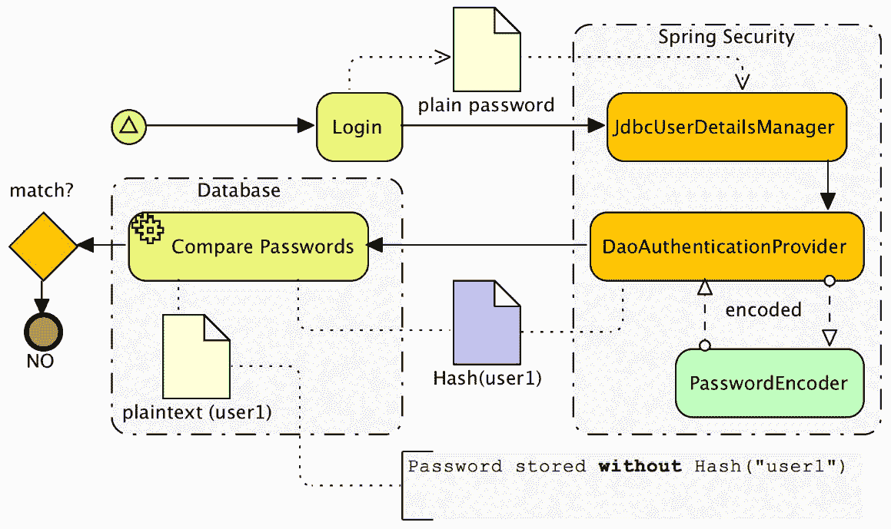
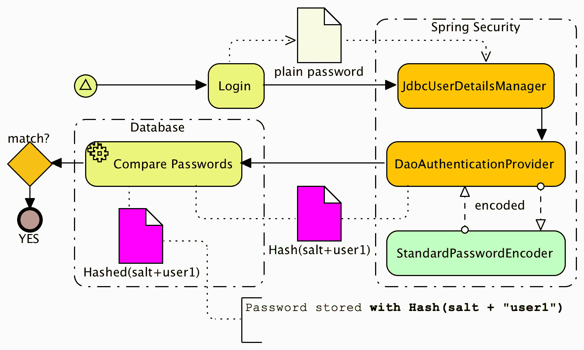

# 基于 JDBC 的认证

在上一章中，我们看到了如何扩展 Spring Security 以利用我们的`CalendarDao`接口和现有的领域模型来认证用户。在本章中，我们将看到如何使用 Spring Security 的内置 JDBC 支持。为了保持简单，本章的示例代码基于我们从*第二章*继承的 Spring Security 设置，*Spring Security 入门*。在本章中，我们将涵盖以下主题：

+   使用 Spring Security 内置的基于 JDBC 的认证支持

+   利用 Spring Security 的基于组的授权来简化用户管理

+   学习如何使用 Spring Security 的 UserDetailsManager 接口

+   配置 Spring Security 以利用现有的 CalendarUser 模式进行用户认证

+   学习如何使用 Spring Security 的新加密模块来安全地存储密码

+   使用 Spring Security 的默认 JDBC 认证

如果您的应用程序尚未实现安全功能，或者您的安全基础设施正在使用数据库，Spring Security 提供开箱即用的支持，可以简化解决您的安全需求。Spring Security 为用户、权限和组提供默认模式。如果这不符合您的需求，它允许自定义查询和管理用户。在下一节中，我们将介绍使用 Spring Security 设置 JDBC 认证的基本步骤。

本章代码的实际链接在此：[`packt.link/of0XA`](https://packt.link/of0XA)。

# 安装所需的依赖项

我们的应用程序已经定义了本章所需的所有必要依赖项。然而，如果您正在使用 Spring Security 的 JDBC 支持，您可能希望在`build.gradle`文件中列出以下依赖项。重要的是要强调，您将使用的 JDBC 驱动程序将取决于您正在使用的数据库。请咨询您的数据库供应商的文档，以获取有关您数据库所需驱动程序的详细信息。

重要注意事项

请记住，所有 Spring 版本都需要匹配，所有 Spring Security 版本也需要匹配（这包括传递依赖项版本）。如果您在自己的应用程序中遇到困难，您可能希望在`build.gradle`中定义依赖项管理部分以强制执行此操作，如*第二章*中所示，*Spring Security 入门*。如前所述，当使用示例代码时，您无需担心这一点，因为我们已经为您设置了必要的依赖项。

以下片段定义了本章所需的依赖项，包括 Spring Security 和 JDBC 依赖项：

```java
//build.gradle
dependencies {
...
    // spring-jdbc
    implementation 'org.springframework.boot:spring-boot-starter-data-jdbc'
    // H2 db
    implementation 'com.h2database:h2'
    // spring-security
    implementation 'org.springframework.boot:spring-boot-starter-security'
...
}
```

在`build.gradle`中的主要更改是添加`spring-boot-starter-data-jdbc`依赖项，以启用 Spring JDBC 支持。

# 使用 H2 数据库

本练习的第一部分涉及设置 Java 基础的 H2 实例，这是一个用 Java 编写的开源、内存和嵌入式关系型数据库。它设计得快速、轻量级且易于使用。H2 数据库将填充 Spring Security 默认的模式。我们将使用 Spring 的`EmbeddedDatabase`配置功能配置 H2 在内存中运行，这是一种比手动设置数据库显著更简单的配置方法。你可以在 H2 网站上找到更多信息：[`www.h2database.com/`](http://www.h2database.com/)。

请记住，在我们的示例应用程序中，我们主要使用 H2，因为它易于设置。Spring Security 可以与任何支持 ANSI SQL 的数据库无缝工作。我们鼓励你在跟随示例时调整配置并使用你偏好的数据库。由于我们不想让这本书的这一部分专注于数据库设置的复杂性，我们选择了便利性而不是现实性来设计练习。

在以下子节中，我们将提供我们的 JBCP 日历应用程序的示例 SQL 脚本。这些脚本将使用 H2 嵌入式数据库进行配置。

最后，我们将启用 spring-security 支持，我们需要添加一个自定义的`UserDetailsManager`实现。

## 提供的 JDBC 脚本

我们已经将用于创建 H2 数据库中模式和数据的所有 SQL 文件提供在了`src/main/resources/database/h2/`文件夹中。任何以`calendar`开头的前缀文件都是 JBCP 日历应用的定制 SQL 文件。希望这会使运行示例变得稍微容易一些。如果你正在跟随自己的数据库实例，你可能需要调整模式定义语法以适应你的特定数据库。额外的数据库模式可以在 Spring Security 参考文档中找到。你可以在书籍的*附录*中找到 Spring Security 参考的链接，*附加* *参考资料*。

## 配置 H2 嵌入式数据库

要配置 H2 嵌入式数据库，我们需要创建一个`DataSource`并运行 SQL 来创建 Spring Security 表结构。我们需要更新启动时加载的 SQL，包括 Spring Security 的基本模式定义、Spring Security 用户定义和用户的权限映射。你可以在以下代码片段中找到`DataSource`定义和相关的更新：

```java
//src/main/java/com/packtpub/springsecurity/configuration/DataSourceConfig. Java
@Bean
public DataSource dataSource() {
    return new EmbeddedDatabaseBuilder()
          .setName("dataSource")
          .setType(EmbeddedDatabaseType.H2)
          .addScript("/database/h2/calendar-schema.sql")
          .addScript("/database/h2/calendar-data.sql")
          .addScript("/database/h2/security-schema.sql")
          .addScript("/database/h2/security-users.sql")
          .addScript("/database/h2/security-user-authorities.sql")
          .build();
}
```

记住，`EmbeddedDatabaseBuilder()`方法仅在内存中创建此数据库，因此你不会在磁盘上看到任何东西，并且你无法使用标准工具来查询它。然而，你可以使用应用程序内嵌入的 H2 控制台与数据库交互。查看我们应用程序的**欢迎**页面上的说明，了解如何使用它。

## 配置 JDBC UserDetailsManager 实现

我们将修改 `SecurityConfig.java` 文件，声明我们使用的是 JDBC `User` **DetailsManager** 实现，而不是我们在*第二章*中配置的 Spring Security 内存 `User` **DetailsService** 实现，即 *Spring Security 入门*。这是通过简单更改 `UserDetailsManager` 声明来实现的，如下所示：

```java
//src/main/java/com/packtpub/springsecurity/configuration/SecurityConfig.java
@Bean
public UserDetailsManager userDetailsService(DataSource dataSource) {
    return new JdbcUserDetailsManager(dataSource);
}
```

我们用 `userDetailsService()` 方法替换了之前的 `configure(AuthenticationManagerBuilder)` 方法以及所有子元素，如前述代码片段所示。

在本节中，我们已经能够使用自定义 `UserDetailsManager` 实现配置 H2 数据库，以启用 Spring Security 支持。

# Spring Security 的默认用户模式

让我们看一下初始化数据库所使用的每个 SQL 文件。我们添加的第一个脚本包含了默认的 Spring Security 用户模式和权限定义。下面的脚本已经从 Spring Security 的参考中改编，该参考列在*附录*中，*附加参考资料*，以具有明确命名的约束，以便更容易进行故障排除：

```java
//src/main/resources/database/h2/security-schema.sql
create table users
(
    username varchar(256) not null primary key,
    password varchar(256) not null,
    enabled  boolean      not null
);
create table authorities
(
    username  varchar(256) not null,
    authority varchar(256) not null,
    constraint fk_authorities_users foreign key (username) references users (username)
);
create unique index ix_auth_username on authorities (username, authority);
```

## 定义用户

下一个脚本负责定义我们应用程序中的用户。包含的 SQL 语句创建了我们在整本书中一直使用的相同用户。该文件还添加了一个额外的用户 `disabled1@example.com`，由于我们指示该用户已被禁用，因此该用户将无法登录：

```java
//src/main/resources/database/h2/security-users.sql
insert into users (username, password, enabled)
values ('user1@example.com', '{noop}user1', 1);
insert into users (username, password, enabled)
values ('admin1@example.com', '{noop}admin1', 1);
insert into users (username, password, enabled)
values ('user2@example.com', '{noop}admin1', 1);
insert into users (username, password, enabled)
values ('disabled1@example.com', '{noop}disabled1', 0);
insert into users (username, password, enabled)
values ('admin', '{noop}admin', 1);
```

## 定义用户权限

你可能已经注意到，没有指示说明一个用户是管理员还是普通用户。下一个文件指定了用户到相应权限的直接映射。如果一个用户没有映射到任何权限，Spring Security 将不允许该用户登录：

```java
//src/main/resources/database/h2/security-user-authorities.sql
insert into authorities(username, authority)
values ('user1@example.com', 'ROLE_USER');
insert into authorities(username, authority)
values ('admin1@example.com', 'ROLE_ADMIN');
insert into authorities(username, authority)
values ('admin1@example.com', 'ROLE_USER');
insert into authorities(username, authority)
values ('user2@example.com', 'ROLE_USER');
insert into authorities(username, authority)
values ('disabled1@example.com', 'ROLE_USER');
```

在将 SQL 添加到嵌入式数据库配置之后，我们应该能够启动应用程序并登录。尝试使用 `disabled1@example.com` 作为 `username` 和 `disabled1` 作为 `password` 登录新用户。注意，Spring Security 不允许用户登录，并提供了错误信息 `原因：用户被禁用`。

重要提示

你的代码现在应该看起来像这样：`calendar04.01-calendar`。

在本节中，我们使用了默认的 Spring Security 用户模式和权限。在下一节中，我们将探讨如何定义 **基于组的访问控制**（**GBAC**）。

# 探索 UserDetailsManager 接口

我们已经在 *第三章*，*自定义认证* 中利用了 Spring Security 的 `InMemoryUserDetailsManager` 类，在我们的 `SpringSecurityUserContext` 实现 `UserContext` 中查找当前的 `CalendarUser` 应用程序。这允许我们确定在查找 `DefaultCalendarService.java` 文件的事件时应该使用哪个 `CalendarUser`，以确保在创建 `CalendarUser` 时创建一个新的 Spring Security 用户。本章重复使用完全相同的代码。唯一的不同之处在于，`UserDetailsManager` 的实现由 Spring Security 的 `JdbcUserDetailsManager` 类支持，该类使用数据库而不是内存数据存储。

`UserDetailsManager` 还提供了哪些开箱即用的功能？

虽然这些类型的函数可以通过额外的 JDBC 语句相对容易地编写，但 Spring Security 实际上提供了一些开箱即用的功能来支持在 JDBC 数据库上对用户执行许多常见的 **创建、读取、更新和删除** （**CRUD**）操作。这对于简单的系统来说可能很方便，并且是构建任何用户可能需要的自定义要求的好基础：

| **方法** | **描述** |
| --- | --- |
| `void` `createUser(UserDetails user)` | 它使用给定的 `UserDetails` 信息创建一个新用户，包括任何声明的 `GrantedAuthority` 权限。 |
| `void updateUser(final` `UserDetails user)` | 它使用给定的 `UserDetails` 信息更新一个用户。它更新 `GrantedAuthority` 并从用户缓存中删除用户。 |
| `void` `deleteUser(String username)` | 它删除具有给定用户名的用户，并从用户缓存中删除用户。 |
| `boolean` `userExists(String username)` | 它指示是否有一个具有给定用户名的用户（活动或非活动）存在。 |
| `void changePassword(String oldPassword,` `String` `newPassword)` | 它更改当前登录用户的密码。用户必须提供正确的密码才能使操作成功。 |

表 4.1 – 自定义数据库要求设置

如果 `UserDetailsManager` 没有提供您应用程序所需的所有方法，您可以扩展该接口以提供这些自定义要求。例如，如果您需要能够在管理视图中列出所有可能的用户，您可以编写自己的接口并实现一个指向您当前使用的 `UserDetailsManager` 实现相同数据存储的实现。

## 基于组的访问控制

`JdbcUserDetailsManager` 类支持通过将 `GrantedAuthority` 分组到称为组的逻辑集合中，在用户和 `GrantedAuthority` 声明之间添加一层间接性。

然后，用户被分配一个或多个组，他们的成员资格赋予了一组 `GrantedAuthority` 声明：



图 4.1 – 基于组的访问控制示例

正如您在前面的图中可以看到，这种间接性允许通过简单地将任何新用户分配到现有组来将同一组角色分配给多个用户。这与我们迄今为止看到的不同，我们之前直接将 `GrantedAuthority` 分配给单个用户。

这种将常见权限集捆绑起来的做法在以下场景中可能很有帮助：

+   您需要将用户隔离到社区中，组之间存在一些重叠的角色。

+   您想全局更改一类用户的授权。例如，如果您有一个供应商组，您可能希望启用或禁用他们对应用程序特定部分的访问。

+   您有大量用户，并且不需要用户级权限配置。

除非您的应用程序用户基数非常小，否则您很可能正在使用基于组的访问控制。虽然基于组的访问控制比其他策略稍微复杂一些，但管理用户访问的灵活性和简单性使这种复杂性变得值得。这种通过组聚合用户权限的间接技术通常被称为 GBAC。

GBAC 是市场上几乎每个受保护操作系统或软件包中常见的做法。**Microsoft Active Directory**（**AD**）是大型 GBAC 的最明显实现之一，因为它将 AD 用户放入组中并为这些组分配权限。通过使用 GBAC，大型基于 AD 的组织中的权限管理变得指数级简单。

尝试思考您使用的软件的安全模型——用户、组和权限是如何管理的？安全模型编写的方式有哪些优缺点？

让我们在 JBCP 日历应用程序中添加一层抽象，并将基于组的授权概念应用于网站。

## 配置基于组的访问控制

我们将向应用程序添加两个组：普通用户，我们将其称为 `Users`，以及管理员用户，我们将其称为 `Administrators`。我们的现有账户将通过一个额外的 SQL 脚本与适当的组关联。

### 配置 JdbcUserDetailsManager 以使用组

默认情况下，Spring Security 不使用 GBAC。因此，我们必须指示 Spring Security 启用组的使用。修改 `SecurityConfig.java` 文件以使用 `GROUP_AUTHORITIES_BY_USERNAME_QUERY`，如下所示：

```java
//src/main/java/com/packtpub/springsecurity/configuration/SecurityConfig.ja va
private static String CUSTOM_GROUP_AUTHORITIES_BY_USERNAME_QUERY = "select g.id, g.group_name, ga.authority " +
       "from groups g, group_members gm, " +
       "group_authorities ga where gm.username = ? " +
       "and g.id = ga.group_id and g.id = gm.group_id";
@Bean
public UserDetailsManager userDetailsService(DataSource dataSource) {
    JdbcUserDetailsManager jdbcUserDetailsManager = new JdbcUserDetailsManager(dataSource);
    jdbcUserDetailsManager.setEnableGroups(true);
    jdbcUserDetailsManager.setGroupAuthoritiesByUsernameQuery(CUSTOM_GROUP_AUTHORITIES_BY_USERNAME_QUERY);
    return jdbcUserDetailsManager;
}
```

### 利用 GBAC JDBC 脚本

接下来，我们需要更新启动时加载的脚本。我们需要删除 `security-user-authorities.sql` 映射，以便我们的用户不再通过直接映射获得其权限。然后我们需要添加两个额外的 SQL `脚本`。更新 `DataSource` 实例配置以加载 GBAC 所需的 SQL，如下所示：

```java
//src/main/java/com/packtpub/springsecurity/configuration/DataSourceConfig. java
@Bean
public DataSource dataSource() {
    return new EmbeddedDatabaseBuilder()
          .setName("dataSource")
          .setType(EmbeddedDatabaseType.H2)
          .addScript("/database/h2/calendar-schema.sql")
          .addScript("/database/h2/calendar-data.sql")
          .addScript("/database/h2/security-schema.sql")
          .addScript("/database/h2/security-users.sql")
          .addScript("/database/h2/security-groups-schema.sql")
          .addScript("/database/h2/security-groups-mappings.sql")
          .build();
}
```

### 基于组的模式

虽然可能很明显，但我们添加的第一个 SQL 文件包含了对模式的支持以支持基于组的授权的更新。您可以在以下代码片段中找到文件的内容：

```java
//src/main/resources/database/h2/security-groups-schema.sql
create table groups
(
    id         bigint generated by default as identity (start with 0) primary key,
    group_name varchar(256) not null
);
create table group_authorities
(
    group_id  bigint      not null,
    authority varchar(50) not null,
    constraint fk_group_authorities_group foreign key (group_id) references groups (id)
);
create table group_members
(
    id       bigint generated by default as identity (start with 0) primary key,
    username varchar(50) not null,
    group_id bigint      not null,
    constraint fk_group_members_group foreign key (group_id) references groups (id)
);
```

### 组权限映射

现在我们需要将现有用户映射到组，将组映射到权限。这是在`security-groups-mappings.sql`文件中完成的。基于组的映射可以很方便，因为组织通常已经根据各种原因有一个逻辑用户组。通过利用现有的用户分组，我们可以极大地简化我们的配置。这就是间接层如何帮助我们。我们在以下组映射中包含了组定义、组到权限映射和一些用户：

```java
//src/main/resources/database/h2/security-groups-mappings.sql
-----
-- Create the Groups
insert into groups(group_name)
values ('Users');
insert into groups(group_name)
values ('Administrators');
-----
-- Map the Groups to Roles
insert into group_authorities(group_id, authority)
select id, 'ROLE_USER'
from groups
where group_name = 'Users';
-- Administrators are both a ROLE_USER and ROLE_ADMIN
insert into group_authorities(group_id, authority)
select id, 'ROLE_USER'
from groups
where group_name = 'Administrators';
insert into group_authorities(group_id, authority)
select id, 'ROLE_ADMIN'
from groups
where group_name = 'Administrators';
-----
-- Map the users to Groups
insert into group_members(group_id, username)
select id, 'user1@example.com'
from groups
where group_name = 'Users';
insert into group_members(group_id, username)
select id, 'admin1@example.com'
from groups
where group_name = 'Administrators';
insert into group_members(group_id, username)
select id, 'user2@example.com'
from groups
where group_name = 'Users';
insert into group_members(group_id, username)
select id, 'disabled1@example.com'
from groups
where group_name = 'Users';
insert into group_members(group_id, username)
select id, 'admin'
from groups
where group_name = 'Administrators';
```

开始启动应用程序，它将表现得和以前一样；然而，用户和角色之间的额外抽象层简化了管理大量用户。

重要提示

您的代码现在应该看起来像这样：`calendar04.02-calendar`。

在本节中，我们探讨了如何定义 GBAC 之后，将在下一节中定义一个自定义数据库查询来检索用户和权限。

# 支持自定义模式

对于 Spring Security 的新用户来说，通常是通过将 JDBC 用户、组或角色映射到现有模式来开始他们的体验。即使遗留数据库不符合预期的 Spring Security 模式，我们仍然可以配置`JdbcDaoImpl`来映射到它。

现在，我们将更新 Spring Security 的 JDBC 支持，以使用我们现有的`CalendarUser`数据库以及一个新的`calendar_authorities`表。

我们可以轻松地更改`JdbcUserDetailsManager`的配置，以利用此模式并覆盖我们用于 JBCP 日历应用程序的 Spring Security 预期的表定义和列。

在以下子节中，我们将更新 SQL 用户和权限脚本以插入自定义角色。最后，我们将配置`JdbcUserDetailsManager`以使用这些自定义 SQL 查询。

## 确定正确的 JDBC SQL 查询

`JdbcUserDetailsManager`类有三个具有明确定义参数和一组返回列的 SQL 查询。我们必须根据预期的功能确定我们将分配给这些查询的 SQL。`JdbcUserDetailsManager`使用的每个 SQL 查询都以其在登录时提供的用户名作为其唯一参数：

| **命名空间查询** **属性名** | **描述** | **预期** **SQL 列** |
| --- | --- | --- |
| `users-by-username-query` | 返回一个或多个匹配用户名的用户；仅使用第一个用户。 | `Username (字符串)` `Password (字符串)` `Enabled (布尔值)` |
| `authorities-by-username-query` | 返回直接提供给用户的授权权限。通常在 GBAC 禁用时使用。 | `Username (字符串)` `GrantedAuthority (字符串)` |
| `group-authorities-by-username-query` | 返回通过组成员关系授予用户的 grantedauthorities 和组详情。当启用 GBAC 时使用。 | `Group` `主键``(``任何)``Group` `名称 (任何)``GrantedAuthority (字符串)` |

表 4.2 – Spring-security 中的 JDBC 查询

注意，在某些情况下，默认的 `JdbcUserDetailsManager` 实现可能没有使用返回的列，但仍然必须返回它们。

## 更新加载的 SQL 脚本

我们需要使用我们的自定义模式而不是 Spring Security 的默认模式来初始化 `DataSource`。按照以下方式更新 `DataSourceConfig.java` 文件：

```java
//src/main/java/com/packtpub/springsecurity/configuration/DataSourceConfig. java
@Bean
public DataSource dataSource() {
    return new EmbeddedDatabaseBuilder()
          .setName("dataSource")
          .setType(EmbeddedDatabaseType.H2)
          .addScript("/database/h2/calendar-schema.sql")
          .addScript("/database/h2/calendar-data.sql")
          .addScript("/database/h2/calendar-authorities.sql")
          .build();
}
```

注意，我们已经移除了所有以安全开头的脚本，并用 `calendar-authorities.sql` 替换它们。

## 日历用户权限 SQL

您可以在以下代码片段中查看 `CalendarUser` 权限映射：

```java
//src/main/resources/database/h2/calendar-authorities.sql
create table calendar_user_authorities
(
    id IDENTITY NOT NULL PRIMARY KEY,
    calendar_user bigint       not null,
    authority     varchar(256) not null
);
-- user1@example.com
insert into calendar_user_authorities(calendar_user, authority)
select id, 'ROLE_USER'
from calendar_users
where email = 'user1@example.com';
-- admin1@example.com
insert into calendar_user_authorities(calendar_user, authority)
select id, 'ROLE_ADMIN'
from calendar_users
where email = 'admin1@example.com';
insert into calendar_user_authorities(calendar_user, authority)
select id, 'ROLE_USER'
from calendar_users
where email = 'admin1@example.com';
-- user2@example.com
insert into calendar_user_authorities(calendar_user, authority)
select id, 'ROLE_USER'
from calendar_users
where email = 'user2@example.com';
```

重要提示

注意，我们使用 ID 作为外键，这比使用用户名作为外键（如 Spring Security 所做的那样）更好。通过使用 ID 作为外键，我们可以允许用户轻松更改他们的用户名。

## 插入自定义权限

当我们添加新的 `CalendarUser` 类时，我们需要更新 `DefaultCalendarService` 以使用我们的自定义模式插入用户的权限。这是因为虽然我们重用了用户定义的模式，但我们在现有应用程序中没有定义自定义权限。按照以下方式更新 `DefaultCalendarService`：

```java
//src/main/java/com/packtpub/springsecurity/service/DefaultCalendarService. java
@Repository
public class DefaultCalendarService implements CalendarService {
    private final EventDao eventDao;
    private final CalendarUserDao userDao;
    private final JdbcOperations jdbcOperations;
...
    public int createUser(CalendarUser user) {
        int userId = userDao.createUser(user);
        jdbcOperations.update("insert into calendar_user_authorities(calendar_user,authority) values (?,?)", userId,
              "ROLE_USER");
        return userId;
    }
}
```

重要提示

您可能已经注意到了用于插入我们的用户的 `JdbcOperations` 接口。这是 Spring 提供的一个方便的模板，有助于管理样板代码，例如连接和事务处理。有关更多详细信息，请参阅本书的 *附录*，*附加参考资料*，以找到 Spring 参考。

## 配置 JdbcUserDetailsManager 使用自定义 SQL 查询

为了使用针对非标准模式的自定义 SQL 查询，我们将简单地更新我们的 `userDetailsService()` 方法以包含新的查询。这与我们启用 GBAC 支持的方式非常相似，除了我们使用的是修改后的 SQL 而不是默认 SQL。请注意，我们移除了旧的 `setGroupAuthoritiesByUsernameQuery()` 方法调用，因为我们在这个示例中不会使用它，以保持事情简单：

```java
//src/main/java/com/packtpub/springsecurity/configuration/SecurityConfig.ja va
private static String CUSTOM_USERS_BY_USERNAME_QUERY = "select email, password, true " +
       "from calendar_users where email = ?";
private static String CUSTOM_AUTHORITIES_BY_USERNAME_QUERY = "select cua.id, cua.authority " +
       "from calendar_users cu, calendar_user_authorities " +
       "cua where cu.email = ? " +
       "and cu.id = cua.calendar_user";
@Bean
public UserDetailsManager userDetailsService(DataSource dataSource) {
    JdbcUserDetailsManager jdbcUserDetailsManager = new JdbcUserDetailsManager(dataSource);
    jdbcUserDetailsManager.setUsersByUsernameQuery(CUSTOM_USERS_BY_USERNAME_QUERY);
    jdbcUserDetailsManager.setAuthoritiesByUsernameQuery(CUSTOM_AUTHORITIES_BY_USERNAME_QUERY);
    return jdbcUserDetailsManager;
}
```

这是使用 Spring Security 从现有非默认模式读取设置所需的唯一配置！启动应用程序并确保一切运行正常。

重要提示

您的代码现在应该看起来像这样：`calendar04.03-calendar`。

请记住，使用现有模式通常需要扩展 `JdbcUserDetailsManager` 以支持更改密码、重命名用户账户和其他用户管理功能。

如果您正在使用`JdbcUserDetailsManager`执行用户管理任务，那么该类使用了超过 20 个 SQL 查询，这些查询可以通过配置访问。然而，只有三个在命名空间配置中可用。请参阅 Javadoc 或源代码以查看`JdbcUserDetailsManager`使用的查询的默认值。

# 配置安全密码

您可能还记得从*第一章*《不安全应用程序解剖》中的安全审计，密码以明文形式存储的安全性是审计员的首要任务。事实上，在任何安全系统中，密码安全都是认证主体的信任和权威性的关键方面。完全安全系统的设计者必须确保密码以恶意用户难以攻破的方式存储。

应将该以下一般规则应用于数据库中存储的密码：

+   密码不得以明文（plaintext）形式存储

+   用户提供的密码必须与数据库中记录的密码进行比较

+   用户密码不应在用户要求时提供（即使用户忘记了）

对于大多数应用程序而言，满足这些要求的最合适的方法涉及单向编码，即密码的**哈希**。使用加密哈希提供了诸如安全性和唯一性等属性，这对于正确验证用户非常重要，而且还有一个额外的优点，即一旦哈希，密码就不能从存储的值中提取出来。

在大多数安全的应用程序设计中，在请求时检索用户的实际密码既不是必需的，也不是所希望的，因为在不适当的额外凭证的情况下向用户提供密码可能会带来重大的安全风险。相反，大多数应用程序提供用户重置密码的能力，无论是通过提供额外的凭证（如他们的社会保险号码、出生日期、税务 ID 或其他个人信息），还是通过基于电子邮件的系统。

存储其他类型的敏感信息

列出的许多适用于密码的指南同样适用于其他类型的敏感信息，包括社会保险号码和信用卡信息（尽管，根据应用程序的不同，其中一些可能需要解密的能力）。存储此类信息以以多种方式表示，例如，客户的完整 16 位信用卡号可能会以高度加密的形式存储，但最后四位可能以明文形式存储。为了参考，想想任何显示`XXXX XXXX XXXX 1234`以帮助您识别存储的信用卡的互联网商业网站。

你可能已经在思考，鉴于我们承认的不切实际的方法，即使用 SQL 填充我们的 H2 数据库中的用户，我们如何对密码进行编码？H2 或其他大多数数据库都没有提供作为内置数据库功能的加密方法。

通常，引导过程（通过 SQL 加载和 Java 代码将初始用户和数据填充到系统中）是通过 SQL 加载和 Java 代码的组合来处理的。根据应用程序的复杂性，这个过程可能会变得非常复杂。

对于 JBCP 日历应用程序，我们将保留 `dataSource()` 象声明，并在相应的 SQL 代码中将 `DataSource` 作为名称，然后添加一些 SQL 语句，将密码修改为它们的散列值。

在本节中，我们看到了配置安全密码的最佳实践。

在下一节中，我们将深入探讨使用 `PasswordEncoder` 接口配置安全密码的不同选项。

# 探索 PasswordEncoder 接口

Spring Security 中的密码散列封装并由 `o.s.s.authentication.encoding.PasswordEncoder` 接口的实现定义。通过 `PasswordEncoderFactories` 元素内的 `createDelegatingPasswordEncoder()` 方法可以简单地配置密码编码器，如下所示：

```java
//src/main/java/com/packtpub/springsecurity/configuration/SecurityConfig.java
@Bean
public PasswordEncoder encoder() {
    return PasswordEncoderFactories.createDelegatingPasswordEncoder();
}
```

你会很高兴地了解到，Spring Security 随带了许多 `passwordEncoder` 的实现，这些实现适用于不同的需求和安全性要求。

下表提供了一组开箱即用的实现类及其优点。

我们可以在 Spring Security 的 `Password` **EncoderFactories** 类中找到支持的完整编码器列表。如果其中之一符合我们的要求，我们就不需要重写它。

注意，所有实现类都位于 `o.s.s.crypto` 包中：

| **编码器** | **算法** | **用途** |
| --- | --- | --- |
| `Pbkdf2PasswordEncoder` | PBKDF2 | 提供可配置迭代次数的密钥增强，适用于密码散列。适用于密码存储。 |
| `SCryptPasswordEncoder` | Scrypt | 内存硬密钥派生函数，使其对暴力攻击具有抵抗力。适用于密码存储。 |
| `StandardPasswordEncoder` | SHA-256 | 使用标准的 SHA-256 算法。请注意，由于速度原因，SHA-256 单独不推荐用于密码散列。适用于旧系统，但不推荐用于新应用。 |
| `NoOpPasswordEncoder` | 无操作 | 不进行散列或编码；密码以纯文本形式存储。不推荐用于生产环境。适用于测试和开发。 |
| `LdapShaPasswordEncoder` | SHA-1 | 可选盐的 SHA-1 散列。适用于与 LDAP 目录的兼容性。适用于与基于 LDAP 的系统集成。 |
| `BCryptPasswordEncoder` | BCrypt | 带有自适应散列的单向散列函数，适用于密码散列。推荐用于密码存储。 |
| `MessageDigest PasswordEncoder` | 可配置（例如，MD5、SHA-256、SHA-512） | 使用各种消息摘要算法，但算法的选择对于安全性至关重要。取决于所选算法。由于某些算法的弱点，不推荐用于新应用。 |

表 4.3 – 主要 PasswordEncoder 实现

与 Spring Security 的许多其他领域一样，也可以通过实现`PasswordEncoder`来引用 bean 定义，以提供更精确的配置和

允许`PasswordEncoder`通过依赖注入与其他 bean 连接。对于 JBCP 日历应用，我们需要使用这个 bean 引用方法来对新创建的用户密码进行哈希处理。

## DelegatingPasswordEncoder 实现

在 Spring Security 5.0 之前，默认的`PasswordEncoder`是`NoOpPasswordEncoder`，它需要明文密码。根据密码历史记录部分，你可能会预期默认的`PasswordEncoder`现在会是类似`BCryptPasswordEncoder`的东西。然而，这忽略了三个现实世界的问题：

+   许多应用使用旧的密码编码，难以轻松迁移。

+   密码存储的最佳实践将再次改变。

+   作为框架，Spring Security 不能频繁地进行破坏性更改。

相反，Spring Security 引入了`DelegatingPasswordEncoder`，通过以下方式解决了所有问题：

+   确保使用当前密码存储建议进行密码编码。

+   允许验证现代和旧格式中的密码。

+   允许在未来升级编码。

你可以通过使用`PasswordEncoderFactories`轻松构建`DelegatingPasswordEncoder`的实例：

```java
PasswordEncoder passwordEncoder =
PasswordEncoderFactories.createDelegatingPasswordEncoder();
```

让我们通过配置 JBCP 日历应用的基本密码编码过程来了解这个过程。

## 配置密码编码

配置基本密码编码涉及两个步骤：在 SQL 脚本执行后对加载到数据库中的密码进行哈希处理，并确保 Spring Security 配置为与`PasswordEncoder`一起工作。

## 配置 PasswordEncoder 方法

首先，我们将声明一个`PasswordEncoder`的实例作为普通的 Spring bean，如下所示：

```java
//src/main/java/com/packtpub/springsecurity/configuration/SecurityConfig.ja va
@Bean
public PasswordEncoder passwordEncoder() {
    String idForEncode = "SHA-256";
    Map<String, PasswordEncoder> encoders = new HashMap<>();
    encoders.put("SHA-256", new org.springframework.security.crypto.password.MessageDigestPasswordEncoder("SHA-256"));
    return new DelegatingPasswordEncoder(idForEncode, encoders);
}
```

## 使 Spring Security 了解 PasswordEncoder 方法

我们需要配置 Spring Security 以引用一个类型为`PasswordEncoder`的 Bean，以便它可以在用户登录期间对提供的密码进行编码和比较。

如果你此时尝试运行应用，你会注意到之前有效的登录凭证现在被拒绝。这是因为数据库中存储的密码（由`calendar-users.sql`脚本加载）并不是以与密码编码器匹配的哈希形式存储的。我们需要更新存储的密码，使其成为哈希值。

### 对存储的密码进行哈希处理

如以下图所示，当用户提交密码时，Spring Security 对提交的密码进行哈希处理，然后将其与数据库中的未哈希密码进行比较：



图 4.2 – 存储密码的哈希处理工作流程

这意味着用户无法登录我们的应用程序。为了解决这个问题，我们将更新启动时加载的 SQL，将密码更新为哈希值。更新 `DataSourceConfig.java` 文件，如下所示：

```java
//src/main/java/com/packtpub/springsecurity/configuration/DataSourceConfig. java
@Bean
public DataSource dataSource() {
    return new EmbeddedDatabaseBuilder()
          .setName("dataSource")
          .setType(EmbeddedDatabaseType.H2)
          .addScript("/database/h2/calendar-schema.sql")
          .addScript("/database/h2/calendar-data.sql")
          .addScript("/database/h2/calendar-authorities.sql")
          .addScript("/database/h2/calendar-sha256.sql")
          .build();
}
```

`calendar-sha256.sql` 文件只是将现有密码更新为其预期的哈希值，如下所示：

```java
-- original password was: user1
update calendar_users
set password = '{SHA-256}0a041b9462caa4a31bac3567e0b6e6fd9100787db2ab433d96f6d178cabfce90'
where email = 'user1@example.com';
```

我们是如何知道更新密码应该使用什么值的？我们提供了 `o.s.s.authentication.encoding.Sha256PasswordEncoderMain` 来演示如何使用配置的 `PasswordEncoder` 接口来哈希现有密码。相关代码如下：

```java
ShaPasswordEncoder encoder = new ShaPasswordEncoder(256);
String encodedPassword = encoder.encodePassword(password, null);
```

### 对新用户密码进行哈希处理

如果我们尝试运行应用程序并创建新用户，我们将无法登录。这是因为新创建的用户密码不会被哈希。我们需要更新 `DefaultCalendarService` 以哈希密码。进行以下更新以确保新创建的用户密码被哈希：

```java
//src/main/java/com/packtpub/springsecurity/service/DefaultCalendarService. java
public class DefaultCalendarService implements CalendarService {
    private final EventDao eventDao;
    private final CalendarUserDao userDao;
    private final JdbcOperations jdbcOperations;
    private final PasswordEncoder passwordEncoder;
...
    public int createUser(CalendarUser user) {
       String encodedPassword = passwordEncoder.encode(user.getPassword());
       user.setPassword(encodedPassword);
       int userId = userDao.createUser(user);
       jdbcOperations.update("insert into calendar_user_authorities(calendar_user,authority) values (?,?)", userId,
             "ROLE_USER");
       return userId;
    }
}
```

### 并不完全安全

现在开始应用程序。尝试使用 `user1` 作为密码创建一个新用户。从应用程序中注销，然后使用 `user1@example.com` 的说明。这些值是否相同？我们现在已经发现了另一个用户的密码，这有点令人不安。我们将使用一种称为 **盐分** 的技术来解决这个问题。

重要提示

您的代码现在应该看起来像这样：`calendar04.04-calendar`。

你想要为这个密码添加一些盐分吗？如果安全审计员检查数据库中的编码密码，他可能会发现一些仍然会让他对网站的安全性感到担忧的事情。让我们检查以下存储的用户名和密码值：

| **用户名** | **明文密码** | **哈希密码** |
| --- | --- | --- |
| `admin1@example.com` | `admin1` | `{``SHA-256}25f43b1486ad95a1 398e3eeb3d83bc4010015fcc9``bedb35b432e00298d5021f7` |
| `user1@example.com` | `user1` | `{``SHA-256}0a041b9462caa4a3 1bac3567e0b6e6fd9100787db``2ab433d96f6d178cabfce90` |

表 4.4 – 哈希用户密码

这看起来非常安全——加密的密码显然与原始密码没有任何相似之处。审计员可能会担心什么？如果我们添加一个恰好与我们的 `user1@example.com` 用户具有相同密码的新用户呢？

| **用户名** | **明文密码** | **哈希密码** |
| --- | --- | --- |
| `hacker@example.com` | `user1` | `{``SHA-256}0a041b9462caa4 a31bac3567e0b6e6fd91007``87db2ab433d96f6d178cabfce90` |

表 4.5 – 被破解的哈希用户密码

现在，请注意，`hacker@example.com`用户的加密密码与真实用户完全相同！因此，如果一个黑客以某种方式获得了读取数据库中加密密码的能力，他们可以将已知密码的加密表示与用户账户的未知加密表示进行比较，并发现它们是相同的！如果黑客能够访问一个自动化的工具来执行这种分析，他们可能在几小时内就能攻破用户的账户。

虽然猜测单个密码很困难，但黑客可以在事先计算出所有 hash 值并存储 hash 到原始密码的映射。然后，找出原始密码只需通过其 hash 值在常数时间内查找密码。这是一种称为**彩虹表**的攻击技术。

在加密密码中增加另一层安全性的一个常见且有效的方法是加入一个**盐**。盐是一个第二个明文组件，在执行哈希之前与明文密码连接，以确保必须使用两个因素来生成（以及比较）哈希密码值。正确选择的盐可以保证没有任何两个密码会有相同的哈希值，从而防止我们审计员所关心的场景，并避免许多常见的暴力破解密码技术。

最佳实践盐通常分为以下三个类别：

+   它们是从与用户关联的一些数据中算法生成的，例如，用户创建的时间戳

+   它们是随机生成的并以某种形式存储

+   它们是纯文本或与用户密码记录双向加密的

记住，因为给定用户的记录中的`salt`值是为了计算密码的`hash`值，并在进行身份验证时将其与存储的用户`hash`值进行比较。

# 在 Spring Security 中使用盐

`spring-security-core`模块，并在`spring-security-crypto`中单独提供。`o.s.s.crypto.password.PasswordEncoder`接口。实际上，使用此接口是编码密码的首选方法，因为它将使用随机`salt`对密码进行编码。在撰写本文时，`o.s.s.crypto.password.PasswordEncoder`有以下三种实现：

| **类** | **描述** |
| --- | --- |
| `o.s.s.crypto.bcrypt.BCryptPasswordEncoder` | 这个类使用`bcrypt`哈希函数。它支持盐和随着技术改进而减慢速度的能力。这有助于防止暴力搜索攻击。 |
| `o.s.s.crypto.password.NoOpPasswordEncoder` | 这个类不进行编码（它以明文形式返回密码）。仅用于遗留和测试目的，并且不被认为是安全的。 |
| `o.s.s.crypto.password.StandardPasswordEncoder` | 此类使用 `SHA-256` 并多次迭代，以及一个随机的 `salt` 值。仅提供用于遗留和测试目的，并不被认为是安全的。 |

表 4.6 – 常见的 PasswordEncoder 实现

重要提示

对于熟悉 `Spring Security` 的人来说，Spring Security Crypto 模块提供了对称加密、密钥生成和密码编码的支持。上述类是核心模块的一部分，并且没有依赖任何其他 Spring Security（或 Spring）代码。

## 更新 Spring Security 配置

这可以通过更新 Spring Security 配置来完成。移除旧的 `ShaPasswordEncoder` 编码器，并添加新的 `StandardPasswordEncoder` 编码器，如下所示：

```java
//src/main/java/com/packtpub/springsecurity/configuration/SecurityConfig.ja va
@Bean
public PasswordEncoder passwordEncoder() {
    return new StandardPasswordEncoder();
}
```

## 迁移现有密码

让我们看看以下步骤，了解如何迁移现有密码：

1.  我们需要更新我们的现有密码以使用由新的 `PasswordEncoder` 类生成的值。如果您想生成自己的密码，可以使用以下代码片段：

```java
StandardPasswordEncoder encoder = new StandardPasswordEncoder();
String encodedPassword = encoder.encode("password");
```

1.  删除之前使用的 `calendar-sha256.sql` 文件，并添加提供的 `saltedsha256.sql` 文件，如下所示：

```java
//src/main/java/com/packtpub/springsecurity/configuration/ DataSourceConfig.java
@Bean
public DataSource dataSource() {
    return new EmbeddedDatabaseBuilder()
          .setName("dataSource")
          .setType(EmbeddedDatabaseType.H2)
          .addScript("/database/h2/calendar-schema.sql")
          .addScript("/database/h2/calendar-data.sql")
          .addScript("/database/h2/calendar-authorities.sql")
          .addScript("/database/h2/calendar-saltedsha256.sql")
          .build();
}
```

## 更新 DefaultCalendarUserService

我们之前定义的 `passwordEncoder()` 方法足够智能，可以处理新的密码编码器接口。然而，`DefaultCalendarUserService` 需要更新到新的接口。对 `DefaultCalendarUserService` 类进行以下更新：

```java
//src/main/java/com/packtpub/springsecurity/service/DefaultCalendarService. java
@Repository
public class DefaultCalendarService implements CalendarService {
    private final EventDao eventDao;
    private final CalendarUserDao userDao;
    private final JdbcOperations jdbcOperations;
    private final PasswordEncoder passwordEncoder;
    public int createUser(CalendarUser user) {
        String encodedPassword = passwordEncoder.encode(user.getPassword());
        user.setPassword(encodedPassword);
        int userId = userDao.createUser(user);
        jdbcOperations.update("insert into calendar_user_authorities(calendar_user,authority) values (?,?)", userId,
              "ROLE_USER");
        return userId;
    }
}
```

通过前面的代码实现，我们已经能够在 Spring Security 中配置 Salt SHA256。`DefaultCalendarService` 使用此 Salt `PasswordEncoder` 插入用户的密码。

在下一节中，我们将探讨使用 `Salt` 与 `Bcrypt` 算法结合的另一种选项。

# 尝试使用加盐密码

启动应用程序，并尝试使用密码 `user1` 创建另一个用户。使用 H2 控制台比较新用户的密码，并观察它们是不同的。

重要提示

您的代码现在应该看起来像这样：`calendar04.05-calendar`。

Spring Security 现在生成一个随机的 `salt` 并将其与密码结合在一起在哈希我们的密码之前。然后，它将随机的 `salt` 添加到密码的文本开头，以便可以检查密码。存储的密码可以总结如下：

```java
salt = randomsalt()
hash = hash(salt+originalPassword)
storedPassword = salt + hash
```

这是创建新密码的伪代码。

为了验证用户，可以从存储的密码中提取 `salt` 和 `hash`，因为 `salt` 和 `hash` 都是固定长度的。然后，可以比较提取的 `hash` 与使用提取的 `salt` 和输入的密码计算出的新 `hash`：



图 4.3 – 存储密码的加盐工作流程

以下是对加盐密码进行验证的伪代码：

```java
storedPassword = datasource.lookupPassword(username) salt, expectedHash = extractSaltAndHash(storedPassword) actualHash = hash(salt+inputedPassword)
authenticated = (expectedHash == actualHash)Trying out salted passwords with StandardPasswordEncoder
```

`BCryptPasswordEncoder` 是另一种使用广泛支持的 `bcrypt` 算法来散列密码的盐实现。`Bcrypt` 使用随机的 `16 字节盐` 值，并且是一个故意设计得较慢的算法，以阻碍密码破解者。您可以通过使用强度参数来调整它所做的工作量，该参数的值从 *4* 到 *31*。值越高，计算散列所需的努力就越多。默认值是 `10`。您可以在部署的系统更改此值而不影响现有密码，因为该值也存储在编码的散列中。以下示例使用强度参数值为 `4` 的 `BCryptPasswordEncoder`：

```java
//src/main/java/com/packtpub/springsecurity/configuration/SecurityConfig.java
@Bean
public PasswordEncoder passwordEncoder() {
    return new BCryptPasswordEncoder(4);
}
```

此外，我们不得不添加提供的 `calendar-bcrypt.sql` 文件，如下所示：

```java
//src/main/java/com/packtpub/springsecurity/configuration/ DataSourceConfig.java
@Bean
public DataSource dataSource() {
    return new EmbeddedDatabaseBuilder()
          .setName("dataSource")
          .setType(EmbeddedDatabaseType.H2)
          .addScript("/database/h2/calendar-schema.sql")
          .addScript("/database/h2/calendar-data.sql")
          .addScript("/database/h2/calendar-authorities.sql")
          .addScript("/database/h2/calendar-bcrypt.sql")
          .build();
}
```

启动应用程序并尝试使用用户名 `user1@example.com` 和密码 `user1` 登录到应用程序。

重要提示

您的代码现在应该看起来像这样：`calendar04.06-calendar`。

# 摘要

在本章中，我们学习了如何使用 Spring Security 的内置 *JDBC 支持*。具体来说，我们了解到 Spring Security 为新应用程序提供了一个默认的模式。我们还探讨了如何实现 *GBAC* 以及它如何简化用户管理。

我们还学习了如何将 Spring Security 的 JDBC 支持与现有数据库集成，以及如何通过散列密码并使用随机生成的 *盐* 来保护我们的密码。

在下一章中，我们将探讨 *Spring Data* 项目以及如何配置 Spring Security 以使用 **对象关系映射** (**ORM**) 连接到 RDBMS，以及文档数据库。
