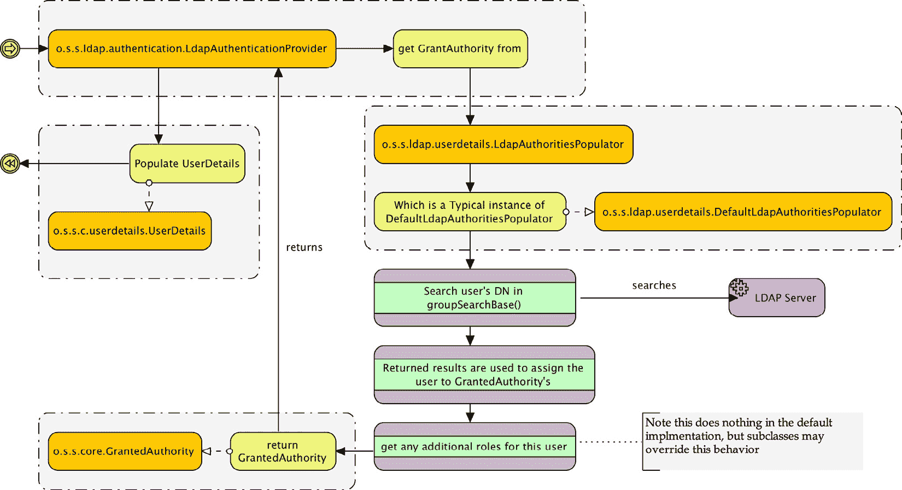

# 6

# LDAP 目录服务

在本章中，我们将回顾（**LDAP**）并学习如何将其集成到启用 Spring Security 的应用程序中，以提供身份验证、授权和用户信息。

在本章的讨论过程中，我们将涵盖以下主题：

+   学习与 LDAP 协议和服务器实现相关的一些基本概念

+   在 Spring Security 中配置一个自包含的 LDAP 服务器

+   启用 LDAP 身份验证和授权

+   理解 LDAP 搜索和用户匹配背后的模型

+   从标准 LDAP 结构中检索额外的用户详细信息

+   区分 LDAP 身份验证方法并评估每种类型的优缺点

+   使用 Spring bean 声明显式配置 Spring Security LDAP

+   连接到外部 LDAP 目录

+   探索对 Microsoft AD 的内置支持

+   我们还将探讨如何定制 Spring Security，以便在处理自定义 AD 部署时具有更大的灵活性

本章代码的实际链接在这里：[`packt.link/f2tf1`](https://packt.link/f2tf1)。

# 理解 LDAP

LDAP 的根源可以追溯到 30 多年前的逻辑目录模型，概念上类似于组织结构图和地址簿的结合。如今，LDAP 越来越多地被用于集中化企业用户信息，将成千上万的用户划分为逻辑组，并允许在许多不同的系统之间统一共享用户信息。

为了安全起见，LDAP 通常被广泛用于简化集中式的用户名和密码身份验证——用户凭据存储在 LDAP 目录中，并且可以代表用户向目录发起身份验证请求。这简化了管理员的管理工作，因为用户凭据（登录 ID、密码和其他详细信息）存储在 LDAP 目录的单个位置。此外，基于用户在目录中的位置，定义了组织信息，如组或团队分配、地理位置和公司层级成员资格。

## LDAP

到目前为止，如果你之前从未使用过 LDAP，你可能想知道它是什么。我们将通过 Apache Directory Server 示例目录的截图来展示一个样本 LDAP 模式：


图 6.1 – LDAP 目录结构示例

从`uid=admin1@example.com`（在前面的截图中被突出显示）的特定用户条目开始，我们可以通过从树中的这个节点开始向上移动来推断`admin1`的组织成员资格。我们可以看到用户`aeinstein`是`users`组织单元（`ou=users`）的成员，而`users`组织单元本身又是`example.com`域的一部分（前一个截图中的缩写`dc`代表**域组件**）。

在此之前是 LDAP 树本身的组织元素（`DIT`和`Root` `DSE`），在 Spring Security 的上下文中我们不关心这些。用户`aeinstein`在 LDAP 层次结构中的位置在语义上是明确且有意义的——你可以想象一个更复杂的层次结构，它可以很容易地说明一个大组织的组织和部门边界。

通过沿着树向下走到一个单独的叶节点形成的完整从上到下的路径，形成了一个由沿途所有中间节点组成的字符串，就像`admin1`的节点路径一样，如下所示：

```java
uid=admin1,ou=users,dc=example,dc=com
```

前一个节点路径是唯一的，被称为节点的**唯一名称**（**DN**）。DN 类似于数据库的主键，允许在复杂的树结构中唯一地识别和定位节点。我们将看到在 Spring Security LDAP 集成过程中，节点 DN 被广泛用于认证和搜索过程。

注意，在同一组织级别上还列出了几个其他用户，与`admin1`处于相同的组织位置。所有这些用户都被假定为与`admin1`处于相同的组织位置。尽管这个示例组织相对简单且扁平，但 LDAP 的结构是任意灵活的，可以有多个嵌套和逻辑组织级别。

Spring Security LDAP 支持由 Spring LDAP 模块（[`spring.io/projects/spring-ldap`](https://spring.io/projects/spring-ldap)）提供协助，该模块是 Spring 框架和 Spring Security 核心项目的独立项目。它被认为是稳定的，并提供了一组围绕标准 Java LDAP 功能的包装器。

### 常见的 LDAP 属性名称

树中的每个条目都由一个或多个对象类定义。对象类是一个逻辑组织单元，将一组语义相关的属性分组在一起。通过将树中的条目声明为特定对象类的实例，例如人员，LDAP 目录的组织者可以向目录用户提供每个目录元素代表的明确指示。

LDAP 有一套丰富的标准模式，涵盖了可用的 LDAP 对象类及其适用的属性（以及大量其他信息）。如果您计划进行大量的 LDAP 工作，强烈建议您查阅一本好的参考指南，例如书籍《Zytrax OpenLDAP》的附录（[`www.zytrax.com/books/ldap/ape/`](https://www.zytrax.com/books/ldap/ape/)）。

在上一节中，我们了解到 LDAP 树中的每个条目都有一个 DN，它在树中是唯一的。DN 由一系列属性组成，其中之一（或多个）用于唯一标识由 DN 表示的条目在树中的路径。由于 DN 描述的路径的每个部分都代表一个 LDAP 属性，因此您可以参考可用的、定义良好的 LDAP 模式和对象类来确定任何给定 DN 中的每个属性的含义。

我们在以下表中包含了某些常见属性及其含义。这些属性通常是组织属性——这意味着它们通常用于定义 LDAP 树的组织结构——并且按照从上到下的顺序排列，这可能是您在典型的 LDAP 安装中看到的结构：

| **属性名称** | **描述** | **示例** |
| --- | --- | --- |
| `dc` | 域组件：在 LDAP 层次结构中，通常是最高级别的组织。 | `dc=jbcpcalendar,dc=com` |
| `c` | 国家：一些 LDAP 层次结构在高级别上按国家结构化。 | `c=US` |
| `o` | 组织名称：这是一个用于分类 LDAP 资源的父业务组织。 | `o=Oracle Corporation` |
| `ou` | 组织单元：这是一个通常在组织内部的部分业务组织。 | `ou=Product Development` |
| `cn` | 常见名称：这是对象的常见名称或唯一或可读名称。对于人类来说，这通常是人的全名，而对于 LDAP 中的其他资源（计算机等），通常是主机名。 | `cn=Super Visor` `cn=Jim Bob` |
| `uid` | 用户 ID：尽管不是组织性质的，但`uid`属性通常是 Spring 在用户认证和搜索过程中寻找的内容。 | `uid=svisor` |
| `userPassword` | 用户密码：此属性存储与该属性关联的人对象的密码。它通常使用 SHA 或类似方法进行单向散列。 | `userPassword=plaintext userPassword={SHA}cryptval` |

表 6.1 – LDAP 目录结构示例

前面的表格中的属性实际上是目录树上的组织属性，因此它们可能会形成各种搜索表达式或映射，这些表达式或映射将用于配置 Spring Security 与 LDAP 服务器交互。

重要提示

请记住，有数百个标准 LDAP 属性——这些只是您在集成一个完全填充的 LDAP 服务器时可能看到的一小部分。

### 更新我们的依赖项

我们已经包含了本章所需的全部依赖项，因此您不需要更新您的`build.gradle`文件。但是，如果您只是向自己的应用程序添加 LDAP 支持，您需要在`build.gradle`中添加`spring-security-ldap`作为依赖项，如下所示：

```java
//build.gradle
dependencies {
...
// LDAP
    implementation 'org.springframework.security:spring-security-ldap'
...
}
```

重要提示

请记住，有数百个标准 LDAP 属性——这些只是你在与完全填充的 LDAP 服务器集成时可能看到的极小一部分。

如前所述，Spring Security 的 LDAP 支持建立在 Spring LDAP 之上。Gradle 将自动将其作为传递依赖项引入，因此无需显式列出。

### 配置嵌入式 LDAP 集成

现在我们将启用 JBCP 日历应用程序以支持基于 LDAP 的身份验证。幸运的是，这是一个相对简单的练习，使用嵌入式 LDAP 服务器和示例 `UnboundID` 服务器。这是通过在 `build.gradle` 中添加 `unboundid-ldapsdk` 依赖项来完成的，如下所示：

```java
//build.gradle
dependencies {
...
// LDAP
    implementation 'com.unboundid:unboundid-ldapsdk'
...
}
```

### 配置 LDAP 服务器引用

第一步是配置嵌入式 LDAP 服务器。Spring Boot 将自动配置一个嵌入式 LDAP 服务器，但我们需要稍微调整一下配置。请对您的 `application.yml` 文件进行以下更新：

```java
spring:
   ldap:
     base: dc=jbcpcalendar,dc=com
     embedded:
       ldif: classpath:/ldif/calendar.ldif
       baseDn: ${spring.ldap.base}
       port: 33389
```

重要提示

你应该从 `chapter06.00-calendar` 的源代码开始。

我们正在从 `classpath` 加载 `calendar.ldif` 文件，并使用它来填充 LDAP 服务器。`root` 属性使用指定的 DN 声明 LDAP 目录的根。这应该与我们使用的 LDIF 文件中逻辑根 DN 相对应。

小贴士

请注意，对于嵌入式 LDAP 服务器，`base-dn` 属性是必需的。如果没有指定或指定错误，初始化时可能会收到几个奇怪的错误。此外，请注意，`ldif` 资源应只加载单个 `ldif`，否则服务器将无法启动。Spring Security 需要单个资源，因为使用类似 `classpath*:calendar.ldif` 这样的方式并不能提供所需的确定性排序。

我们稍后会在 Spring Security 配置文件中重用这里定义的 bean ID，当我们声明 LDAP 用户服务和其他配置元素时。在嵌入式 LDAP 模式下，`<ldap-server>` 声明上的所有其他属性都是可选的。

### 启用 LDAP AuthenticationManager 接口

接下来，我们需要配置另一个 `AuthenticationManager` 接口，该接口将用户凭据与 LDAP 提供者进行校验。只需更新 Spring Security 配置以使用 `o.s.s.ldap.authentication.` `AuthenticationManager` 引用，如下所示：

```java
//src/main/java/com/packtpub/springsecurity/configuration/SecurityConfig.java
@Bean
AuthenticationManager authenticationManager(BaseLdapPathContextSource contextSource, LdapAuthoritiesPopulator authorities) {
    LdapBindAuthenticationManagerFactory factory = new LdapBindAuthenticationManagerFactory(contextSource);
    factory.setUserSearchBase("");
    factory.setUserSearchFilter("(uid={0})");
    factory.setLdapAuthoritiesPopulator(authorities);
    return factory.createAuthenticationManager();
}
```

### 配置 LdapAuthoritiesPopulator 接口

Spring Security 的 `LdapAuthoritiesPopulator` 用于确定返回给用户的权限。以下示例展示了如何配置 `LdapAuthoritiesPopulator`：

```java
//src/main/java/com/packtpub/springsecurity/configuration/SecurityConfig.java
@Bean
LdapAuthoritiesPopulator authorities(BaseLdapPathContextSource contextSource) {
    String groupSearchBase = "ou=Groups";
    DefaultLdapAuthoritiesPopulator authorities =
          new DefaultLdapAuthoritiesPopulator(contextSource, groupSearchBase);
    authorities.setGroupSearchFilter("(uniqueMember={0})");
    return authorities;
}
```

此外，我们已删除所有对 `PasswordEncoder` Bean 和 `CalendarUserDetailsService` 类的引用。

我们稍后会详细讨论这些属性。现在，请将应用程序恢复到运行状态，并尝试使用 `admin1@example.com` 作为用户名和 `admin1` 作为密码进行登录。你应该已经登录成功了！

重要提示

您应该从`chapter06.01-calendar`的源代码开始。

## 嵌入式 LDAP 故障排除

很可能您会遇到难以调试的嵌入式 LDAP 问题。如果您在浏览器中尝试访问应用程序时遇到`404`错误，那么很可能事情没有正确启动。如果您无法运行这个简单的示例，以下是一些需要再次检查的事项：

+   确保在配置文件中设置了`baseDn`属性，并确保它与启动时加载的 LDIF 文件中定义的根匹配。如果您收到关于丢失分区的错误，则可能是根属性被遗漏或与您的 LDIF 文件不匹配。

+   注意到嵌入式 LDAP 启动失败并不一定是致命的失败。为了诊断加载 LDIF 文件时的错误，您需要确保启用了适当的日志设置，包括 LDAP 服务器的日志记录，至少在错误级别。

+   如果应用程序服务器非正常关闭，您可能需要删除临时目录（Windows 系统上的`%TEMP%`或基于 Linux 的系统上的`/tmp`）中的某些文件，以便再次启动服务器。关于此的错误消息（幸运的是）相当清晰。不幸的是，嵌入式 LDAP 不像嵌入式 H2 数据库那样无缝且易于使用，但它仍然比尝试下载和配置许多免费可用的外部 LDAP 服务器要容易得多。

Apache Directory Studio 项目是一个出色的故障排除工具，可用于访问 LDAP 服务器，它提供独立和 Eclipse 插件版本。免费下载可在[`jxplorer.org/`](http://jxplorer.org/)获取。

# 理解 Spring LDAP 认证的工作原理

我们看到我们可以使用在 LDAP 目录中定义的用户名进行登录。但是，当用户对 LDAP 中的用户发起登录请求时，究竟会发生什么呢？LDAP 认证过程有三个基本步骤：

1.  将用户提供的凭据与 LDAP 目录进行认证。

1.  根据用户在 LDAP 中的信息确定用户拥有的`GrantedAuthority`对象。

1.  将用户在 LDAP 条目中的信息预先加载到自定义的`UserDetails`对象中，以便应用程序进一步使用。

## 认证用户凭据

对于第一步，即对 LDAP 目录进行认证，一个自定义认证提供程序被连接到`AuthenticationManager`。`o.s.s.ldap.authentication.LdapAuthenticationProvider`接口接受用户提供的凭据，并验证它们与 LDAP 目录，如下面的图所示：


图 6.2 – Spring Security LDAP 认证工作流程

我们可以看到，`o.s.s.ldap.authentication.LdapAuthenticator`接口定义了一个代理，允许提供者以可定制的方式发出认证请求。我们隐式配置到这一点的实现`o.s.s.ldap.authentication.BindAuthenticator`尝试使用用户的凭据绑定（登录）到 LDAP 服务器，就像用户自己建立连接一样。对于嵌入式服务器，这对我们的认证需求是足够的；然而，外部 LDAP 服务器可能更严格，在这些服务器中，用户可能不允许绑定到 LDAP 目录。幸运的是，存在一种替代的认证方法，我们将在本章后面探讨。

如前图所示，请注意，搜索是在由`DefaultSpringSecurityContextSource`引用的`baseDn`属性指定的凭据创建的 LDAP 上下文中进行的。对于嵌入式服务器，我们不使用此信息，但对于外部服务器引用，除非提供了`baseDn`，否则将使用匿名绑定。对于需要有效凭据来搜索 LDAP 目录的组织来说，保留对目录中信息公开性的某些控制是非常常见的，因此，在现实场景中，`baseDn`几乎总是必需的。`baseDn`属性代表一个具有有效访问权限以绑定目录并执行搜索的用户的完整 DN。

## 使用 JXplorer 演示认证

我们将通过使用`JXplorer`连接到我们的嵌入式 LDAP 实例并执行 Spring Security 所执行的相同步骤来演示认证过程的工作原理。在整个模拟过程中，我们将使用`user1@example.com`。这些步骤将有助于确保对幕后发生的事情有牢固的理解，并有助于你在难以确定正确配置时。

确保日历应用程序已启动并正在运行。接下来，启动`Jxplorer`。

### 匿名绑定到 LDAP

第一步是匿名绑定到 LDAP。绑定是匿名的，因为我们没有在我们的`DefaultSpringSecurityContextSource`对象上指定`baseDn`和`password`属性。在`Jxplorer`中，按照以下步骤创建一个连接：

1.  点击**文件** | **连接**。

1.  输入以下信息：

    +   主机名：`localhost`

    +   端口：`33389`

1.  我们没有指定`baseDn`，因此选择**无认证**作为**认证方法**。

1.  点击**确定**。

    你可以安全地忽略指示没有默认模式信息的消息。


图 6.3 – 匿名绑定到 LDAP

你现在应该看到你已经连接到了嵌入式 LDAP 实例。

### 搜索用户

现在我们已经建立了连接，我们可以通过以下步骤使用它来查找我们希望绑定的用户的 DN：

1.  右键点击**World**并选择**搜索**。

1.  输入搜索基`dc=jbcpcalendar,dc=com`。这对应于我们指定的`spring.ldap.base`属性的`baseDn`属性。

1.  输入过滤器`uid=user1@example.com`。这对应于我们为`AuthenticationManagerBuilder`的`userSearchFilter`方法指定的值。

1.  点击**搜索**。


图 6.4 – 搜索用户

1.  点击搜索结果中返回的单个结果的**复制 DN**。你现在可以看到我们的 LDAP 用户被显示出来。注意，这个 DN 与我们所搜索的值相匹配。记住这个 DN，因为它将在我们的下一步中使用。


图 6.5 – 搜索用户

### 作为用户绑定到 LDAP

现在我们已经找到了我们用户的完整 DN，我们需要尝试以该用户身份绑定到 LDAP 以验证提交的密码。这些步骤与我们已经做的匿名绑定相同，只是我们将指定我们正在认证的用户凭据。

在`Jxplorer`中，按照以下步骤创建连接：

1.  点击**文件** | **连接**。

1.  输入以下信息：

    +   主机名：**localhost**

    +   端口：**33389**

1.  将**安全级别**设置为**用户 +** **密码**。

1.  将搜索结果中的 DN 输入为`uid=admin1@example.com,ou=Administrators,ou=Users,dc=jbcpcalendar,dc=com`。

1.  密码应该是登录时提交的密码。在我们的例子中，我们想使用**admin1**来成功认证。如果输入了错误的密码，我们将无法连接，Spring Security 将报告错误。

1.  点击**确定**。


图 6.6 – 作为用户绑定到 LDAP

当 Spring Security 能够成功绑定提供的用户名和密码时（类似于我们能够创建连接的方式），它将确定该用户的用户名和密码是正确的。然后 Spring Security 将继续确定用户的角色成员资格。

### 确定用户的角色成员资格

在用户成功通过 LDAP 服务器认证后，接下来必须确定授权信息。授权由主体的角色列表定义，LDAP 认证用户的角色成员资格如以下图所示确定：



图 6.7 – 用户角色成员

我们可以看到，在用户通过 LDAP 进行身份验证后，`LdapAuthenticationProvider`将委托给`LdapAuthoritiesPopulator`。`DefaultLdapAuthoritiesPopulator`接口将尝试在 LDAP 层次结构中的另一个条目或以下的位置定位已验证用户的 DN。搜索用户角色分配的 DN 的位置由`groupSearchBase`方法定义；在我们的示例中，我们将此设置为`groupSearchBase("ou=Groups")`。当用户的 DN 位于`groupSearchBase`的 DN 以下的 LDAP 条目中时，找到其 DN 的条目上的属性将用于授予他们一个角色。

春节安全角色如何与 LDAP 用户关联可能会有些令人困惑，因此让我们看看 JBCP 日历 LDAP 存储库，看看用户与角色的关联是如何工作的。`DefaultLdapAuthoritiesPopulator`接口使用`AuthenticationManagerBuilder`声明的几个方法来管理为用户搜索角色的过程。这些属性按以下顺序大约使用：

1.  `groupSearchBase`：这定义了 LDAP 集成应在其中查找一个或多个与用户 DN 匹配的基 DN。默认值从 LDAP 根进行搜索，这可能很昂贵。

1.  `groupSearchFilter`：这定义了用于将用户的 DN 与位于`groupSearchBase`下的条目的属性匹配的 LDAP 搜索过滤器。此搜索过滤器使用两个参数进行参数化——第一个`({0})`是用户的 DN，第二个`({1})`是用户的用户名。默认值是`uniqueMember={0}`。

1.  `groupRoleAttribute`：这定义了匹配条目的属性，该属性将用于组成用户的`GrantedAuthority`对象。默认值是`cn`。

1.  `rolePrefix`：这是将添加到`groupRoleAttribute`中找到的值的默认前缀，以创建一个 Spring Security 的`GrantedAuthority`对象。默认值是`ROLE_`。

这可能有些抽象，对于新开发者来说可能难以理解，因为它与我们迄今为止使用 JDBC 和 JPA 的`UserDetailsService`实现所看到的内容非常不同。让我们继续通过我们的`user1@example.com`用户在 JBCP 日历 LDAP 目录中的登录过程进行操作。

# 使用 Jxplorer 确定角色

现在，我们将尝试使用`Jxplorer`确定我们的用户的角色。使用我们之前创建的连接，执行以下步骤：

1.  右键点击**世界**并选择**搜索**。

1.  输入搜索基`ou=Groups,dc=jbcpcalendar,dc=com`。这对应于我们指定的`DefaultSpringSecurityContextSource`对象的`baseDn`属性，加上我们为`AuthenticationManagerBuilder`对象指定的`groupSearchBase`属性。

1.  输入文本过滤器`uniqueMember=uid=user1@example.com,ou=Users,dc=jbcpcalendar,dc=com`。这对应于默认的`groupSearchFilter`属性`(uniqueMember={0})`。请注意，我们已经用我们在之前的练习中找到的用户的全 DN 替换了`{}`值。

1.  点击**搜索**。


图 6.8 – 角色搜索

1.  你会注意到`Jxplorer`。注意该组有一个包含我们用户和其他用户的完整 DN 的`uniqueMember`属性。

Spring Security 现在通过将找到的组名强制转换为大写并在组名前添加`ROLE_`来为每个结果创建`GrantedAuthority`对象。伪代码将类似于以下代码片段：

```java
foreach group in groups:
authority = ("ROLE_"+group).upperCase()
grantedAuthority = new GrantedAuthority(authority)
```

小贴士

Spring LDAP 与你的灰色物质一样灵活。请记住，尽管这是一种组织 LDAP 目录以与 Spring Security 兼容的方法，但典型的使用场景正好相反——已经存在一个 Spring Security 需要连接的 LDAP 目录。在许多情况下，你将能够重新配置 Spring Security 以处理 LDAP 服务器的层次结构；然而，有效地规划和理解 Spring 在查询 LDAP 时的行为是关键。运用你的大脑，规划用户搜索和组搜索，并想出你能想到的最优计划——尽量使搜索范围最小化和精确。

你能描述一下登录过程的结果将如何与我们的`admin1@example.com`用户不同吗？如果你现在感到困惑，我们建议你休息一下，并尝试使用`Jxplorer`来浏览由应用程序运行配置的嵌入式 LDAP 服务器。如果你自己按照之前描述的算法搜索目录，可能会更容易理解 Spring Security 的 LDAP 配置流程。

## 映射 UserDetails 的额外属性

最后，一旦 LDAP 查找为用户分配了一组`GrantedAuthority`对象，`o.s.s.ldap.userdetails.LdapUserDetailsMapper`将咨询`o.s.s.ldap.userdetails.UserDetailsContextMapper`以检索任何额外的详细信息，以填充用于应用程序使用的`UserDetails`对象。

使用`AuthenticationManagerBuilder`，我们到目前为止已经配置了`LdapUserDetailsMapper`将用于使用从 LDAP 目录中用户条目中获取的信息填充`UserDetails`对象：


图 6.9 – 映射 UserDetails 的额外属性

我们很快就会看到如何配置`UserDetailsContextMapper`以从标准的 LDAP `person`和`inetOrgPerson`对象中提取大量信息。使用基线`LdapUserDetailsMapper`，存储的只有`username`、`password`和`GrantedAuthority`。

虽然在 LDAP 用户认证和详细信息检索的背后涉及更多的机制，但你会注意到整个过程似乎与我们在*第四章*中学习的 JDBC 认证有些相似，即*基于 JDBC 的认证*（验证用户并填充`GrantedAuthority`）。与 JDBC 认证一样，可以执行 LDAP 集成的高级配置。让我们深入探讨一下，看看可能有哪些可能性！

## 高级 LDAP 配置

一旦我们超越了 LDAP 集成的基础知识，Spring Security LDAP 模块中还有许多额外的配置能力，这些能力仍然在安全`SecurityFilterChain`bean 中。这包括检索用户个人信息，用户认证的附加选项，以及与标准的`DaoAuthenticationProvider`类结合使用 LDAP 作为`UserDetailsService`接口。

### 示例 JBCP LDAP 用户

我们在 JBCP 日历 LDIF 文件中提供了多个不同的用户。以下快速参考图表可能有助于你进行高级配置练习，或者进行自我探索：

| **用户名/密码** | **角色(s)** | **密码编码** |
| --- | --- | --- |
| `admin1@example.com/admin1` | `ROLE_ADMIN, ROLE_USER` | `Plaintext` |
| `user1@example.com/user1` | `ROLE_USER` | `Plaintext` |
| `shauser@example.com/shauser` | `ROLE_USER` | `{``sha}` |
| `sshauser@example.com/sshauser` | `ROLE_USER` | `{``ssha}` |
| `hasphone@example.com/hasphone` | `ROLE_USER` | `Plaintext (在` `telephoneNumber` 属性中)` |

表 6.2 – LDAP 用户列表

我们将在下一节中解释为什么密码编码很重要。

### 密码比较与绑定认证

一些 LDAP 服务器将配置为不允许某些个别用户直接绑定到服务器，或者禁用匿名绑定（我们直到目前为止一直在用于用户搜索的）。这种情况通常发生在希望限制一组用户能够从目录中读取信息的大型组织中。

在这些情况下，标准的 Spring Security LDAP 认证策略将不起作用，必须使用替代策略，该策略由`o.s.s.ldap.authentication.PasswordComparisonAuthenticator`（`BindAuthenticator`的兄弟类）实现：


图 6.10 – 密码比较与绑定认证

`PasswordComparisonAuthenticator`接口绑定到 LDAP 并搜索与用户提供的用户名匹配的 DN。然后，它将用户提供的密码与匹配的 LDAP 条目上存储的`userPassword`属性进行比较。如果编码的密码匹配，则用户被认证，流程继续，就像`BindAuthenticator`一样。

### 配置基本密码比较

配置密码比较认证而不是绑定认证，就像在`AuthenticationManager`声明中添加一个方法一样简单。按照以下方式更新`SecurityConfig.java`文件：

```java
@Bean
AuthenticationManager authenticationManager(BaseLdapPathContextSource contextSource, LdapAuthoritiesPopulator authorities) {
    LdapPasswordComparisonAuthenticationManagerFactory factory = new LdapPasswordComparisonAuthenticationManagerFactory(
          contextSource, new LdapShaPasswordEncoder());
    factory.setUserSearchBase("");
    factory.setUserSearchFilter("(uid={0})");
    factory.setLdapAuthoritiesPopulator(authorities);
    factory.setPasswordAttribute("userPassword");
    return factory.createAuthenticationManager();
}
```

`PasswordCompareConfigurer`类，通过声明`passwordCompare`方法使用，使用`PlaintextPasswordEncoder`进行密码编码。要使用`SHA-1`密码算法，我们需要设置一个密码编码器，并且我们可以使用`o.s.s.a.encoding.LdapShaPasswordEncoder`来支持`SHA`（回忆我们在*第四章*，*基于 JDBC 的认证*）中广泛讨论的`SHA-1`密码算法）。

在我们的`calendar.ldif`文件中，我们将`password`字段设置为`userPassword`。`PasswordCompareConfigurer`类的默认`password`属性是`password`。因此，我们还需要使用`passwordAttribute`方法覆盖`password`属性。

服务器重启后，您可以使用`shauser@example.com`作为`用户名`，`shauser`作为`密码`尝试登录。

重要提示

您应该从`chapter06.02-calendar`的源文件开始。

## LDAP 密码编码和存储

LDAP 支持多种密码编码算法，从明文到单向哈希算法——类似于我们在上一章中探讨的那些——以及数据库支持的认证。LDAP 密码最常用的存储格式是`SHA`（`SHA-1`单向哈希）和`SSHA`（`SHA-1`单向哈希加上盐值）。许多 LDAP 实现通常支持的其它密码格式在*RFC 2307*（*An Approach to Using LDAP as a Network Information Service*）中有详细说明（[`tools.ietf.org/html/rfc2307`](http://tools.ietf.org/html/rfc2307)）。*RFC 2307*的设计者在密码存储方面做了一件非常巧妙的事情。目录中保留的密码当然是用适当的算法（`SHA`等）编码的，但随后，它们会在算法前加上前缀。这使得 LDAP 服务器能够非常容易地支持多种密码编码算法。例如，`SHA`编码的密码在目录中的存储方式如下：

```java
{SHA}5baa61e4c9b93f3f0682250b6cf8331b7ee68fd8
```

我们可以看到，密码存储算法用`{SHA}`符号非常清楚地标明，并且与密码一起存储。

`SSHA`符号是尝试将强大的`SHA-1`哈希算法与密码盐值结合，以防止字典攻击。与我们在上一章中回顾的密码盐值类似，盐值在计算哈希之前添加到密码中。当哈希密码存储在目录中时，盐值会被附加到哈希密码后面。密码前面加上`{SSHA}`，这样 LDAP 目录就知道用户提供的密码需要以不同的方式比较。大多数现代 LDAP 服务器将`SSHA`作为它们的默认密码存储算法。

### 密码比较验证器的缺点

现在你已经了解了一些关于 LDAP 如何使用密码的信息，并且我们已经设置了 `PasswordComparisonAuthenticator`，你认为如果你使用以 `SSHA` 格式存储的密码登录我们的 `sshauser@example.com` 用户会发生什么？

好吧，把书放一边，试试看，然后再回来。你的登录被拒绝了，对吧？然而，你仍然能够以 SHA 编码的密码登录为用户。为什么？当我们使用绑定认证时，密码编码和存储并不重要。你认为那是什么原因呢？

为什么在绑定认证中这并不重要是因为 LDAP 服务器负责处理用户的密码认证和验证。在密码比较认证中，Spring Security LDAP 负责以目录期望的格式对密码进行编码，然后与目录进行匹配以验证认证。

为了安全起见，密码比较认证实际上无法从目录中读取密码（读取目录密码通常会被安全策略拒绝）。相反，`PasswordComparisonAuthenticator` 在用户的目录条目处执行一个 LDAP 搜索，尝试匹配由 Spring Security 编码的密码所确定的 `password` 属性和值。

因此，当我们尝试使用 `sshauser@example.com` 登录时，`PasswordComparisonAuthenticator` 会使用配置的 `SHA` 算法对密码进行编码，并尝试进行简单的匹配，但失败了，因为该用户的目录密码是以 `SSHA` 格式存储的。

我们当前的配置，使用 `LdapShaPasswordEncoder`，已经支持 `SHA` 和 `SSHA`，所以目前仍然不起作用。让我们思考一下这可能是为什么。记住，`SSHA` 使用加盐密码，盐值存储在 LDAP 目录中与密码一起。然而，`PasswordComparisonAuthenticator` 的编码方式使得它无法从 LDAP 服务器中读取任何内容（这通常违反了不允许绑定的公司的安全策略）。因此，当 `PasswordComparisonAuthenticator` 计算散列密码时，它无法确定要使用哪个盐值。

总之，`PasswordComparisonAuthenticator` 在某些有限的情况下很有价值，在这些情况下目录本身的安全性是一个关注点，但它永远不会像直接的绑定认证那样灵活。

# 配置 `UserDetailsContextMapper` 对象

如我们之前所述，`o.s.s.ldap.userdetails.UserDetailsContextMapper` 接口的一个实例用于将用户的条目映射到 LDAP 服务器中的内存中的 `UserDetails` 对象。默认的 `UserDetailsContextMapper` 对象的行为类似于 `JpaDaoImpl`，考虑到返回的 `UserDetails` 对象上填充的详细程度——也就是说，除了用户名和密码之外，没有返回太多信息。

然而，LDAP 目录可能包含比用户名、密码和角色更多的关于个别用户的详细信息。Spring Security 随带提供两种从两个标准 LDAP 对象模式（`person` 和 `inetOrgPerson`）中提取更多用户数据的方法。

## UserDetailsContextMapper 的隐式配置

为了配置一个不同于默认的 `UserDetailsContextMapper` 实现，我们只需声明我们希望 `LdapAuthenticationProvider` 返回哪个 `LdapUserDetails` 类。安全命名空间解析器将足够智能，能够根据请求的 `LdapUserDetails` 接口类型实例化正确的 `UserDetailsContextMapper` 实现。

让我们重新配置我们的 `SecurityConfig.java` 文件以使用 `inetOrgPerson` 版本的映射器。更新 `SecurityConfig.java` 文件，如下所示：

```java
//src/main/java/com/packtpub/springsecurity/configuration/SecurityConfig.java
@Bean
LdapAuthoritiesPopulator authorities(BaseLdapPathContextSource contextSource) {
    String groupSearchBase = "ou=Groups";
    DefaultLdapAuthoritiesPopulator authorities =
          new DefaultLdapAuthoritiesPopulator(contextSource, groupSearchBase);
    authorities.setGroupSearchFilter("(uniqueMember={0})");
    return authorities;
}
```

重要提示

如果我们删除 `passwordEncoder` 方法，那么使用 `SHA` 密码的 LDAP 用户将无法通过身份验证。

如果您重新启动应用程序并尝试以 LDAP 用户身份登录，您会发现没有任何变化。实际上，`UserDetailsContextMapper` 在幕后已经更改，以便在用户目录条目中可用 `inetOrgPerson` 架构的属性时读取额外的详细信息。

## 查看更多用户详情

为了帮助您在这个领域，我们将向 JBCP 日历应用程序添加查看当前账户的功能。我们将使用此页面来说明更丰富的个人和 `inetOrgPerson` LDAP 架构如何为您的启用 LDAP 的应用程序提供额外的（可选）信息。

您可能已经注意到，本章附带了一个名为 `AccountController` 的额外控制器。您可以看到相关代码，如下所示：

```java
//src/main/java/com/packtpub/springsecurity/web/controllers/AccountControll er.java
@Controller
public class AccountController {
    @RequestMapping("/accounts/my")
    public String view(Model model) {
        Authentication authentication = SecurityContextHolder.getContext().getAuthentication();
        if(authentication == null) {
            throw new IllegalStateException("authentication cannot be null. Make sure you are logged in.");
        }
        Object principal = authentication.getPrincipal();
        model.addAttribute("user", principal);
        model.addAttribute("isLdapUserDetails", principal instanceof LdapUserDetails);
        model.addAttribute("isLdapPerson", principal instanceof Person);
        model.addAttribute("isLdapInetOrgPerson", principal instanceof InetOrgPerson);
        return "accounts/show";
    }
}
```

上述代码将检索由 `LdapAuthenticationProvider` 存储在 `Authentication` 对象中的 `UserDetails` 对象（主体），并确定它是哪种类型的 `LdapUserDetailsImplinterface`。页面代码本身将根据已绑定到用户认证信息的 `UserDetails` 对象的类型显示各种详细信息，如下面的 JSP 代码所示。我们已包含 JSP：

```java
//src/main/resources/templates/accounts/show.xhtml
<dl>
    <dt>Username</dt>
    <dd id="username" th:text="${user.username}">ChuckNorris</dd>
    <dd>&nbsp;</dd>
    <dt>DN</dt>
    <dd id="dn" th:text="${user.dn}"></dd>
    <dd>&nbsp;</dd>
    <span th:if="${isLdapPerson}">
        <dt>Description</dt>
        <dd id="description" th:text="${user.description}"></dd>
        <dd>&nbsp;</dd>
        <dt>Telephone</dt>
        <dd id="telephoneNumber" th:text="${user.telephoneNumber}"></dd>
        <dd>&nbsp;</dd>
        <dt>Full Name(s)</dt>
        <span th:each="cn : ${user.cn}">
            <dd th:text="${cn}"></dd>
        </span>
        <dd>&nbsp;</dd>
    </span>
    <span th:if="${isLdapInetOrgPerson}">
        <dt>Email</dt>
        <dd id="email" th:text="${user.mail}"></dd>
        <dd>&nbsp;</dd>
        <dt>Street</dt>
        <dd id="street" th:text="${user.street}"></dd>
        <dd>&nbsp;</dd>
    </span>
</dl>
```

实际上需要完成的工作是在我们的 `header.xhtml` 文件中添加一个链接，如下面的代码片段所示：

```java
//src/main/resources/templates/fragments/header.xhtml
<li class="nav-item">
    <a class="nav-link" th:href="@{/accounts/my}">Welcome <span class="navbar-text"
                                      th:text="${#authentication.name}"></span></a>
</li>
```

我们添加了以下两个用户，您可以使用它们来检查可用数据元素之间的差异：

| **用户名** | **密码** | **类型** |
| --- | --- | --- |
| `shainet@example.com` | `shainet` | `inetOrgPerson` |
| `shaperson@example.com` | `shaperson` | `person` |

表 6.3 – 新增 LDAP 用户列表

重要提示

您的代码应类似于 `chapter06.03-calendar`。

重新启动服务器，通过点击右上角的`username`来检查每种类型用户的`Account Details`页面。你会注意到，当`UserDetails`类配置为使用`inetOrgPerson`时，尽管返回的是`o.s.s.ldap.userdetails.InetOrgPerson`，但字段是否填充取决于目录条目中可用的属性。

实际上，`inetOrgPerson`有许多我们在这个简单页面上展示的属性。你可以在*RFC 2798*，*inetOrgPerson LDAP 对象类定义*中查看完整的列表（[`tools.ietf.org/html/rfc2798`](http://tools.ietf.org/html/rfc2798)）。

你可能会注意到，没有提供支持在对象条目上指定的额外属性的功能，但这些属性并不符合标准模式。标准的`UserDetailsContextMapper`接口不支持任意属性列表，但仍然可以通过使用`userDetailsContextMapper`方法，通过引用你自己的`UserDetailsContextMapper`接口来自定义它。

### 使用替代密码属性

在某些情况下，可能需要使用替代 LDAP 属性而不是`userPassword`来进行认证。这种情况可能发生在公司部署了自定义 LDAP 模式或不需要强密码管理（虽然这绝对不是一个好主意，但在现实世界中确实会发生）的时候。

`PasswordComparisonAuthenticator`接口还支持验证用户的密码与替代 LDAP 条目属性（而不是标准的`userPassword`属性）的能力。这非常容易配置，我们可以通过使用明文`telephoneNumber`属性来演示一个简单的例子。按照以下方式更新`SecurityConfig.java`：

```java
//src/main/java/com/packtpub/springsecurity/configuration/SecurityConfig.java
@Bean
AuthenticationManager authenticationManager(BaseLdapPathContextSource contextSource, LdapAuthoritiesPopulator authorities) {
    LdapPasswordComparisonAuthenticationManagerFactory factory = new LdapPasswordComparisonAuthenticationManagerFactory(
          contextSource, new LdapShaPasswordEncoder());
    factory.setUserSearchBase("");
    factory.setUserDetailsContextMapper(new InetOrgPersonContextMapper());
    factory.setUserSearchFilter("(uid={0})");
    factory.setLdapAuthoritiesPopulator(authorities);
    factory.setPasswordAttribute("telephoneNumber");
    return factory.createAuthenticationManager();
}
```

我们可以重新启动服务器，并尝试使用`hasphone@example.com`作为`username`属性和`0123456789`作为`password`（电话号码）属性进行登录。

重要提示

你的代码应该看起来像`chapter06.04-calendar`。

当然，这种认证方式具有我们之前讨论过的基于`PasswordComparisonAuthenticator`认证的所有风险；然而，了解它总归是好的，以防万一它出现在 LDAP 实现中。

### 使用 LDAP 作为 UserDetailsService

需要注意的一点是，LDAP 也可以用作`UserDetailsService`。正如我们将在本书后面讨论的，`UserDetailsService`是启用 Spring Security 基础设施中各种其他功能所必需的，包括记住我功能和 OpenID 认证功能。

我们将修改我们的`AccountController`对象，使用`LdapUserDetailsService`接口来获取用户。在这样做之前，请确保删除`passwordCompare`方法，如下面的代码片段所示：

```java
//src/main/java/com/packtpub/springsecurity/configuration/SecurityConfig.java
@Bean
AuthenticationManager authenticationManager(BaseLdapPathContextSource contextSource, LdapAuthoritiesPopulator authorities) {
    LdapBindAuthenticationManagerFactory factory = new LdapBindAuthenticationManagerFactory(contextSource);
    factory.setUserSearchBase("");
    factory.setUserSearchFilter("(uid={0})");
    factory.setLdapAuthoritiesPopulator(authorities);
    factory.setUserDetailsContextMapper(new InetOrgPersonContextMapper());
    return factory.createAuthenticationManager();
}
```

## 配置 LdapUserDetailsService

将 LDAP 配置为`UserDetailsService`功能的配置与配置 LDAP `AuthenticationProvider`非常相似。类似于 JDBC `UserDetailsService`，LDAP `UserDetailsService`接口被配置为`<http>`声明的兄弟元素。请在`SecurityConfig.java`文件中进行以下更新：

```java
//src/main/java/com/packtpub/springsecurity/configuration/SecurityConfig.java
@Bean
public UserDetailsService userDetailsService(BaseLdapPathContextSource contextSource, LdapAuthoritiesPopulator authorities) {
    return new LdapUserDetailsService(new FilterBasedLdapUserSearch("", "(uid={0})", contextSource), authorities);
}
```

在功能上，`o.s.s.ldap.userdetails.LdapUserDetailsService`的配置几乎与`LdapAuthenticationProvider`完全相同，唯一的区别是它没有尝试使用主体的用户名来绑定到 LDAP。相反，凭证由`DefaultSpringSecurityContextSource`引用提供，并用于执行用户查找。

重要提示

如果你打算对 LDAP 本身进行用户认证，不要犯配置`AuthenticationManagerBuilder`时使用指向`LdapUserDetailsService`的`UserDetailsService`的非常常见的错误！如前所述，由于安全原因，`password`属性通常无法从 LDAP 中检索，这使得`UserDetailsService`对认证无济于事。如前所述，`LdapUserDetailsService`使用`DefaultSpringSecurityContextSource`声明中提供的`baseDn`属性来获取其信息——这意味着它不会尝试将用户绑定到 LDAP，因此可能不会按预期工作。

# 更新 AccountController 以使用 LdapUserDetailsService

我们现在将更新`AccountController`对象以使用`LdapDetailsUserDetailsService`接口来查找它显示的用户：

```java
//src/main/java/com/packtpub/springsecurity/web/controllers/AccountControll er.java
@Controller
public class AccountController {
    private final UserDetailsService userDetailsService;
    public AccountController(UserDetailsService userDetailsService) {
       if (userDetailsService == null) {
          throw new IllegalArgumentException("userDetailsService cannot be null");
       }
       this.userDetailsService = userDetailsService;
    }
    @RequestMapping("/accounts/my")
    public String view(Model model) {
       Authentication authentication = SecurityContextHolder.getContext().getAuthentication();
       if(authentication == null) {
          throw new IllegalStateException("authentication cannot be null. Make sure you are logged in.");
       }
       Object principal = userDetailsService.loadUserByUsername(authentication.getName());
       model.addAttribute("user", principal);
       model.addAttribute("isLdapUserDetails", principal instanceof LdapUserDetails);
       model.addAttribute("isLdapPerson", principal instanceof Person);
       model.addAttribute("isLdapInetOrgPerson", principal instanceof InetOrgPerson);
       return "accounts/show";
    }
}
```

显然，这个例子有点愚蠢，但它演示了`LdapUserDetailsService`的使用。请继续重启应用程序，并使用`username`为`admin1@example.com`和`password`为`admin1`进行尝试。你能想出如何修改控制器以显示任意用户的信息吗？

你能想出应该如何修改安全设置以限制管理员访问吗？

重要提示

你的代码应类似于`chapter06.05-calendar`。

## 将 Spring Security 与外部 LDAP 服务器集成

一旦你测试了与嵌入式 LDAP 服务器的基本集成，你可能会想与外部 LDAP 服务器进行交互。幸运的是，这非常简单，可以使用稍微不同的语法以及相同的

将 Spring Security 配置更新为连接到外部 LDAP 服务器，端口号为`33389`，如下所示：

```java
//src/main/java/com/packtpub/springsecurity/configuration/SecurityConfig.java
@Bean
AuthenticationManager authenticationManager(LdapAuthoritiesPopulator authorities) {
    BaseLdapPathContextSource contextSource=  new DefaultSpringSecurityContextSource(
          List.of("ldap://localhost:" + LDAP_PORT + "/"), "dc=jbcpcalendar,dc=com"){{
       setUserDn("uid=admin,ou=system");
       setPassword("secret");
    }};
    LdapPasswordComparisonAuthenticationManagerFactory factory = new LdapPasswordComparisonAuthenticationManagerFactory(
          contextSource, new LdapShaPasswordEncoder());
    factory.setUserSearchBase("");
    factory.setUserDetailsContextMapper(new InetOrgPersonContextMapper());
    factory.setUserSearchFilter("(uid={0})");
    factory.setLdapAuthoritiesPopulator(authorities);
    factory.setPasswordAttribute("userPassword");
    return factory.createAuthenticationManager();
}
```

这里值得注意的差异（除了 LDAP URL 之外）是提供了账户的 DN 和密码。账户（实际上是可选的）应允许绑定到目录，并在所有相关的 DN 上执行用户和组信息的搜索。将这些凭证应用于 LDAP 服务器 URL 产生的绑定用于 LDAP 安全系统中的剩余 LDAP 操作。

请注意，许多 LDAP 服务器也支持在 LDAP 服务器 URL 开头使用 `ldaps://`。LDAPS 通常在 TCP 端口 `636` 上运行。请注意，有许多商业和非商业的 LDAP 实现。

您将使用的确切配置参数将完全取决于供应商和目录的结构，用于连接、用户绑定以及 `GrantedAuthoritys` 的填充。我们将在下一节中介绍一个非常常见的 LDAP 实现，即 Microsoft AD。

如果您没有现成的 LDAP 服务器，但想尝试一下，请将以下代码添加到您的 `SecurityConfig.java` 文件中，该代码启动了我们一直在使用的嵌入式 LDAP 服务器：

```java
//src/main/java/com/packtpub/springsecurity/configuration/SecurityConfig.java
private BaseLdapPathContextSource getDefaultSpringSecurityContextSource () {
    DefaultSpringSecurityContextSource defaultSpringSecurityContextSource =     new DefaultSpringSecurityContextSource(
          List.of("ldap://localhost:" + LDAP_PORT), "dc=jbcpcalendar,dc=com");
    defaultSpringSecurityContextSource.setUserDn("uid=admin,ou=system");
    defaultSpringSecurityContextSource.setPassword("secret");
    defaultSpringSecurityContextSource.afterPropertiesSet();
    return defaultSpringSecurityContextSource;
}
@Bean
LdapAuthoritiesPopulator authorities() {
    String groupSearchBase = "ou=Groups";
    DefaultLdapAuthoritiesPopulator authorities =
          new DefaultLdapAuthoritiesPopulator(this.getDefaultSpringSecurityContextSource(), groupSearchBase);
    authorities.setGroupSearchFilter("(uniqueMember={0})");
    return authorities;
}
@Bean
AuthenticationManager authenticationManager(LdapAuthoritiesPopulator authorities) {
    LdapPasswordComparisonAuthenticationManagerFactory factory = new LdapPasswordComparisonAuthenticationManagerFactory(
          this.getDefaultSpringSecurityContextSource(), new LdapShaPasswordEncoder());
    factory.setUserSearchBase("");
    factory.setUserDetailsContextMapper(new InetOrgPersonContextMapper());
    factory.setUserSearchFilter("(uid={0})");
    factory.setLdapAuthoritiesPopulator(authorities);
    factory.setPasswordAttribute("userPassword");
    return factory.createAuthenticationManager();
}
@Bean
public UserDetailsService userDetailsService(LdapAuthoritiesPopulator authorities) {
    return new LdapUserDetailsService(new FilterBasedLdapUserSearch("", "(uid={0})", this.getDefaultSpringSecurityContextSource()), authorities);
}
```

如果这还不令人信服，请启动您的 LDAP 服务器，将其中的 `calendar.ldif` 导入。然后您可以连接到外部 LDAP 服务器。请继续重启应用程序，并使用 `username` 为 `shauser@example.com` 和 `password` 为 `shauser` 尝试。

重要提示

您的代码应类似于 `chapter06.06-calendar`。

# 显式 LDAP 实例配置

在本节中，我们将引导您了解所需的一组实例配置，以显式配置连接到外部 LDAP 服务器以及支持对外部服务器进行身份验证所需的 `LdapAuthenticationProvider` 接口。与其他显式基于实例的配置一样，除非您发现自己处于安全命名空间风格配置的能力无法满足您的业务或技术需求的情况，否则您真的想避免这样做，在这种情况下，请继续阅读！

## 配置外部 LDAP 服务器引用

为了实现此配置，我们假设我们有一个本地 LDAP 服务器在端口 `33389` 上运行，与上一节中提供的 `DefaultSpringSecurityContextSource` 接口示例具有相同的配置。所需的实例定义在 `SecurityConfig.java` 文件中。实际上，为了使事情简单，我们已经提供了整个 `SecurityConfig.java` 文件。请审查以下代码片段中的 LDAP 服务器引用：

```java
//src/main/java/com/packtpub/springsecurity/configuration/SecurityConfig.java
@Bean
public DefaultSpringSecurityContextSource contextSource() {
    DefaultSpringSecurityContextSource defaultSpringSecurityContextSource =     new DefaultSpringSecurityContextSource(
          List.of("ldap://localhost:" + LDAP_PORT), "dc=jbcpcalendar,dc=com");
    defaultSpringSecurityContextSource.setUserDn("uid=admin,ou=system");
    defaultSpringSecurityContextSource.setPassword("secret");
    return defaultSpringSecurityContextSource;
}
```

接下来，我们将探讨如何执行搜索以在 LDAP 目录中定位用户。

## 在 LDAP 目录中定位用户执行搜索

如果您已经阅读并理解了本章中关于 Spring Security LDAP 身份验证如何在幕后工作的解释，那么这个实例配置将非常容易理解，具有以下特点：

+   用户凭证绑定认证（不是密码比较）

+   在 `UserDetailsContextMapper` 中使用 `InetOrgPerson`

请查看以下步骤：

1.  为我们提供的第一个实例是 `BindAuthenticator`，以及支持 `FilterBased` **LdapUserSearch** 实例的 `FilterBased` 实例用于在绑定之前在 LDAP 目录中定位用户的 DN，如下所示：

    ```java
    //src/main/java/com/packtpub/springsecurity/configuration/ SecurityConfig.java
    @Bean
    public BindAuthenticator bindAuthenticator(FilterBasedLdapUserSearch userSearch, BaseLdapPathContextSource contextSource){
        BindAuthenticator bindAuthenticator = new BindAuthenticator(contextSource);
        bindAuthenticator.setUserSearch(userSearch);
        return bindAuthenticator;
    }
    @Bean
    public FilterBasedLdapUserSearch filterBasedLdapUserSearch(BaseLdapPathContextSource contextSource){
        return new FilterBasedLdapUserSearch("", //user-search-base
              "(uid={0})", //user-search-filter
              contextSource); //ldapServer
    }
    ```

1.  其次，`LdapAuthoritiesPopulator` 和 `UserDetailsContextMapper` 执行我们在本章前面检查过的角色：

    ```java
    //src/main/java/com/packtpub/springsecurity/configuration/ SecurityConfig.java
    @Bean
    public LdapAuthoritiesPopulator authoritiesPopulator(BaseLdapPathContextSource contextSource){
        DefaultLdapAuthoritiesPopulator defaultLdapAuthoritiesPopulator = new DefaultLdapAuthoritiesPopulator(contextSource,"ou=Groups");
        defaultLdapAuthoritiesPopulator.setGroupSearchFilter("(uniqueMember={0})");
        return defaultLdapAuthoritiesPopulator;
    }
    @Bean
    public UserDetailsContextMapper userDetailsContextMapper(){
        return new InetOrgPersonContextMapper();
    }
    ```

1.  最后，我们必须更新 Spring Security 以利用我们显式配置的 `UserDetailsService` bean，如下所示：

    ```java
    //src/main/java/com/packtpub/springsecurity/configuration/ SecurityConfig.java
    @Bean
    public UserDetailsService userDetailsService(FilterBasedLdapUserSearch filterBasedLdapUserSearch,
           LdapAuthoritiesPopulator authoritiesPopulator, UserDetailsContextMapper userDetailsContextMapper) {
        LdapUserDetailsService ldapUserDetailsService = new LdapUserDetailsService(filterBasedLdapUserSearch, authoritiesPopulator);
        ldapUserDetailsService.setUserDetailsMapper(userDetailsContextMapper);
        return ldapUserDetailsService;
    }
    ```

1.  到目前为止，我们已经完全配置了使用显式 Spring bean 符号的 LDAP 认证。在 LDAP 集成中使用这种技术在某些情况下很有用，例如当安全命名空间没有公开某些配置属性时，或者需要自定义实现类以提供针对特定业务场景定制的功能。我们将在本章后面探讨这样一个场景，当我们检查如何通过 LDAP 连接到 Microsoft AD 时。

1.  现在您可以启动应用程序，并尝试使用 `username` 为 `shauser@example.com` 和 `password` 为 `shauser` 的配置进行配置。

    假设您有一个运行的外部 LDAP 服务器，或者您保留了配置的内存中 `DefaultSpringSecurityContextSource` 对象，一切应该仍然正常工作。

重要提示

您的代码应类似于 `chapter06.07-calendar`。

## 将角色发现委托给 `UserDetailsService`

一种使用显式 bean 配置填充可用用户角色的技术是实现支持通过用户名查找用户的功能在 `UserDetailsService` 中，并从该来源获取 `GrantedAuthority` 对象。

配置很简单，只需将 `ldapAuthoritiesPopulator` ID bean 替换为更新的 `UserDetailsService` 和 `LdapAuthoritiesPopulator` 对象，并引用 `UserDetailsService`。请对 `SecurityConfig.java` 文件进行以下更新，确保您删除了之前的 `ldapAuthoritiesPopulator` bean 定义：

```java
//src/main/java/com/packtpub/springsecurity/configuration/SecurityConfig.java
@Bean
public BindAuthenticator bindAuthenticator(FilterBasedLdapUserSearch userSearch, BaseLdapPathContextSource contextSource){
    BindAuthenticator bindAuthenticator = new BindAuthenticator(contextSource);
    bindAuthenticator.setUserSearch(userSearch);
    return bindAuthenticator;
}
@Bean
public FilterBasedLdapUserSearch filterBasedLdapUserSearch(BaseLdapPathContextSource contextSource){
    return new FilterBasedLdapUserSearch("", //user-search-base
          "(uid={0})", //user-search-filter
          contextSource); //ldapServer
}
@Bean
public LdapAuthoritiesPopulator authoritiesPopulator(UserDetailsService userDetailsService){
    return new UserDetailsServiceLdapAuthoritiesPopulator(userDetailsService);
}
```

我们还需要确保我们已经定义了 `userDetailsService`。为了简化问题，添加一个内存中的 `UserDetailsService` 接口，如下所示：

```java
//src/main/java/com/packtpub/springsecurity/configuration/SecurityConfig.java
@Bean
public UserDetailsManager userDetailsService() {
    InMemoryUserDetailsManager manager = new InMemoryUserDetailsManager();
    manager.createUser(User.withUsername("user1@example.com").password("user1").roles("USER").build());
    manager.createUser(User.withUsername("admin1@example.com").password("admin1").roles("USER", "ADMIN").build());
    return manager;
}
```

最后，我们配置了一个自定义的 `LdapAuthenticationProvider` 接口，如下所示：

```java
//src/main/java/com/packtpub/springsecurity/configuration/ SecurityConfig.java
@Bean
public LdapAuthenticationProvider authenticationProvider(BindAuthenticator ba,
       LdapAuthoritiesPopulator lap,
       UserDetailsContextMapper cm){
    LdapAuthenticationProvider ldapAuthenticationProvider =  new LdapAuthenticationProvider(ba, lap);
    ldapAuthenticationProvider.setUserDetailsContextMapper(cm);
    return ldapAuthenticationProvider;
}
```

如果有，您可能希望从 `AccountController` 中移除对 `UserDetailsService` 的引用，如下所示：

```java
//src/main/java/com/packtpub/springsecurity/web/controllers/AccountController.java
@Controller
public class AccountController {
    @RequestMapping("/accounts/my")
    public String view(Model model) {
       Authentication authentication = SecurityContextHolder.getContext().getAuthentication();
       if(authentication == null) {
          throw new IllegalStateException("authentication cannot be null. Make sure you are logged in.");
       }
       Object principal = authentication.getPrincipal();
       model.addAttribute("user", principal);
       model.addAttribute("isLdapUserDetails", principal instanceof LdapUserDetails);
       model.addAttribute("isLdapPerson", principal instanceof Person);
       model.addAttribute("isLdapInetOrgPerson", principal instanceof InetOrgPerson);
       return "accounts/show";
    }
}
```

现在，您应该能够使用 `admin1@example.com` 作为 `username` 和 `admin1` 作为 `password` 进行认证。当然，我们也可以用这个内存中的 `UserDetailsService` 接口替换我们在 *第四章* 中讨论的 JDBC 或 JPA 基于的，以及在 *第五章* 中讨论的通过 *Spring Data* 进行认证。

重要提示

您的代码应类似于 `chapter06.08-calendar`。

您可能会注意到与此相关的物流和管理问题，即用户名和角色必须在 LDAP 服务器和 `UserDetailsService` 所使用的存储库中管理——这可能不是一个适用于大型用户群的可扩展模型。

这种场景的更常见用途是在需要 LDAP 身份验证以确保受保护应用程序的用户是有效企业用户，但应用程序本身想要存储授权信息时。这可以将可能的应用特定数据从 LDAP 目录中分离出来，这可以是一种有益的关注点分离。

# 通过 LDAP 与 Microsoft Active Directory 集成

Microsoft AD 的一个方便的特性不仅在于它与基于 Microsoft Windows 的网络架构的无缝集成，而且还可以配置为使用 LDAP 协议公开 AD 的内容。如果你在一个大量使用 Microsoft Windows 的公司工作，那么你做的任何 LDAP 集成很可能都是针对你的 AD 实例的。

根据你对 Microsoft AD 的配置（以及目录管理员愿意配置它以支持 Spring Security LDAP 的意愿），你可能会有困难，不是在身份验证和绑定过程中，而是在将 AD 信息映射到 Spring Security 系统中的用户的`GrantedAuthority`对象上。

在我们的 LDAP 浏览器中，JBCP 日历企业样本 AD LDAP 树看起来如下截图所示：


图 6.11 – Microsoft Active Directory 结构示例

这里没有看到的是我们在之前的样本 LDAP 结构中看到的`ou=Groups`；这是因为 AD 将组成员资格存储在用户自己的 LDAP 条目上的属性中。

我们需要更改我们的配置以支持我们的 AD 结构。假设我们是从上一节中详细说明的 bean 配置开始的，进行以下更新：

```java
//src/main/java/com/packtpub/springsecurity/configuration/SecurityConfig.java
@Bean
public AuthenticationProvider authenticationProvider(){
    ActiveDirectoryLdapAuthenticationProvider ap = new ActiveDirectoryLdapAuthenticationProvider(
          "corp.jbcpcalendar.com",
          "ldap://corp.jbcpcalendar.com");
    ap.setConvertSubErrorCodesToExceptions(true);
    return ap;
}
@Bean
public DefaultSpringSecurityContextSource contextSource() {
    DefaultSpringSecurityContextSource defaultSpringSecurityContextSource =     new DefaultSpringSecurityContextSource(
          List.of("ldap://corp.jbcpcalendar.com"), "dc=corp,dc=jbcpcalendar,dc=com");
    defaultSpringSecurityContextSource.setUserDn("CN=bnl,CN=Users,DC=corp,DC=jbcpcalendar,DC=com");
    defaultSpringSecurityContextSource.setPassword("admin123!");
    return defaultSpringSecurityContextSource;
}
@Bean
public FilterBasedLdapUserSearch filterBasedLdapUserSearch(BaseLdapPathContextSource contextSource) {
    return new FilterBasedLdapUserSearch("CN=Users", //user-search-base
          "(sAMAccountName={0})", //user-search-filter
          contextSource); //ldapServer
}
```

如果你已经定义了它，你将想要从`SecurityConfig.java`文件中移除`UserDetailsService`声明。最后，你将想要从`AccountController`中移除对`UserDetailsService`的引用。

`sAMAccountName`属性是我们在标准 LDAP 条目中使用的`uid`属性的 AD 等价物。尽管大多数 AD LDAP 集成可能比这个例子更复杂，但这应该为你提供一个起点，以便跳出来探索你对 Spring Security LDAP 集成内部工作原理的概念理解；支持甚至复杂的集成将会容易得多。

重要注意事项

如果你想运行这个样本，你需要一个与截图显示的架构相匹配的 AD 实例正在运行。另一种选择是调整配置以匹配你的 AD 架构。一个简单的方法是安装`Active Directory Lightweight Directory Services`，可以在[`www.microsoft.com/fr-FR/download/details.aspx?id=1451`](https://www.microsoft.com/fr-FR/download/details.aspx?id=1451)找到。你的代码应该看起来像`chapter06.09-calendar`。

## Spring Security 6.1 内置的 AD 支持

Active Directory 支持其自己的非标准认证选项，并且正常的用法模式与标准的`LdapAuthenticationProvider`不太吻合。通常，认证是通过使用域用户名（形式为`user@domain`）来执行的，而不是使用 LDAP 区分名称。为了使这更容易，Spring Security 有一个针对典型 Active Directory 设置的定制认证提供者。

配置`ActiveDirectoryLdapAuthenticationProvider`相当简单。你只需要提供域名和一个提供服务器地址的 LDAP URL，正如我们在前面的章节中所述。以下代码片段展示了配置的样子：

```java
//src/main/java/com/packtpub/springsecurity/configuration/SecurityConfig.ja
@Bean
public AuthenticationProvider authenticationProvider(){
    ActiveDirectoryLdapAuthenticationProvider ap = new ActiveDirectoryLdapAuthenticationProvider(
          "corp.jbcpcalendar.com",
          "ldap://corp.jbcpcalendar.com");
    ap.setConvertSubErrorCodesToExceptions(true);
    return ap;
}
```

关于提供的`ActiveDirectory` **LdapAuthenticationProvider**类，有一些需要注意的事项，如下：

+   需要认证的用户必须能够绑定到 AD（没有管理用户）

+   填充用户权限的默认方法是搜索用户的`memberOf`属性

+   用户必须包含一个名为`userPrincipalName`的属性，其格式为`username@<domain>`

由于现实世界中发生的复杂 LDAP 部署，内置支持很可能提供如何与您自定义 LDAP 模式集成的指南。

# 摘要

我们已经看到，LDAP 服务器可以信赖提供认证和授权信息，以及在请求时提供丰富的用户配置文件信息。在本章中，我们介绍了 LDAP 术语和概念，以及 LDAP 目录可能如何组织以与 Spring Security 一起工作。我们还探索了从 Spring Security 配置文件配置独立（嵌入式）和外部 LDAP 服务器。

我们介绍了针对 LDAP 存储库的用户认证和授权，以及它们随后映射到 Spring Security 角色的过程。我们还看到了认证方案、密码存储和 LDAP 中的安全机制之间的差异，以及它们在 Spring Security 中的处理方式。我们还学习了如何将 LDAP 目录中的用户详细属性映射到`UserDetails`对象，以便在 LDAP 和 Spring 启用应用程序之间进行丰富的信息交换。我们还解释了 LDAP 的 bean 配置以及这种方法的优缺点。最后，我们还涵盖了与 Microsoft AD 的集成。

在下一章中，我们将讨论 Spring Security 的`remember-me`功能，该功能允许用户的会话在关闭浏览器后安全地持久化。
