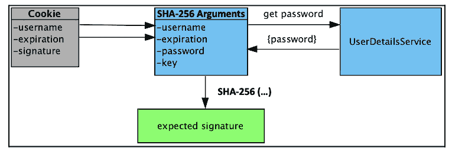

# 7

# “记住我”服务

在本章中，我们将添加一个功能，使应用程序能够在会话过期和浏览器关闭后仍然记住用户。本章将涵盖以下主题：

+   讨论什么是“记住我”

+   学习如何使用基于令牌的“记住我”功能

+   讨论如何确保“记住我”的安全性，以及各种提高其安全性的方法

+   启用基于持久的“记住我”功能，以及如何处理使用它时的额外考虑因素

+   展示“记住我”的整体架构

+   学习如何创建一个仅限于用户 IP 地址的定制“记住我”实现

本章的代码示例链接在此：[`packt.link/WEEx2`](https://packt.link/WEEx2)。

# 什么是“记住我”？

提供一个方便的功能，让网站的常客能够选择在浏览器关闭后仍然被记住。在 Spring Security 中，这是通过在用户的浏览器中存储一个“记住我”**cookie**来实现的。如果 Spring Security 识别出用户正在展示一个“记住我”cookie，那么用户将自动登录到应用程序，并且不需要输入用户名或密码。

什么是 cookie？

Cookie 是一种客户端（即，网页浏览器）持久化状态的方式。有关 Cookie 的更多信息，请参阅其他在线资源，例如维基百科([`en.wikipedia.org/wiki/HTTP_cookie`](https://en.wikipedia.org/wiki/HTTP_cookie))。

Spring Security 提供了以下两种不同的策略，我们将在本章中讨论：

+   第一种是基于令牌的“记住我”功能，它依赖于加密签名

+   第二种方法是`基于持久的记住我`功能，它需要一个数据存储（数据库）

如我们之前提到的，我们将在本章中更详细地讨论这些策略。要启用“记住我”功能，必须显式配置。让我们先尝试基于令牌的“记住我”功能，看看它如何影响登录体验的流程。

## 依赖项

基于令牌的“记住我”部分不需要除基本设置外任何额外的依赖项，基本设置来自*第二章*，*Spring Security 入门*。然而，如果您正在利用基于持久的“记住我”功能，您可能需要在您的`build.gradle`文件中包含以下额外的依赖项。我们已经在章节的示例中包含了这些依赖项，因此无需更新示例应用程序：

```java
//build.gradle
dependencies {
...
    // JPA / ORM / Hibernate:
    implementation 'org.springframework.boot:spring-boot-starter-data-jpa'
    // H2 db
    implementation 'com.h2database:h2'
...
}
```

## 基于令牌的“记住我”功能

Spring Security 提供了两种不同的“记住我”功能的实现。我们将首先探讨如何设置基于令牌的“记住我”服务。

### 配置基于令牌的“记住我”功能

完成这个练习将使我们能够提供一个简单且安全的方法，以延长用户登录时间。首先，执行以下步骤：

1.  修改`SecurityConfig.java`配置文件并添加`rememberMe`方法。

    看一下以下代码片段：

    ```java
    //src/main/java/com/packtpub/springsecurity/configuration/ SecurityConfig.java
    @Bean
    public SecurityFilterChain filterChain(HttpSecurity http) throws Exception {
    ...
        // Remember Me
        http.rememberMe(httpSecurityRememberMeConfigurer ->
            httpSecurityRememberMeConfigurer.key("jbcpCalendar"));
    ...
    }
    ```

重要提示

您应该从`chapter07.00-calendar`的源代码开始。

1.  如果我们现在尝试运行应用程序，我们会看到流程中没有不同之处。这是因为我们还需要在登录表单中添加一个字段，允许用户选择此功能。编辑`login.xhtml`文件并添加一个复选框，如下面的代码片段所示：

    ```java
    //src/main/resources/templates/login.xhtml
    <div class="mb-3">
        <label class="form-label" for="password">Password</label>
        <input class="form-control" id="password" name="password"
               type="password"/>
    </div>
    <div class="mb-3">
        <label for="remember-me">Remember Me?</label>
        <input type="checkbox" id="remember-me" name="remember-me" th:checked="true" />
    </div>
    <div class="mb-3">
        <input class="btn btn-primary" id="submit" name="submit" type="submit"
               value="Login"/>
    </div>
    ```

重要提示

您应该从`chapter07.01-calendar`的源代码开始。

1.  当我们下次登录时，如果选中了“记住我”复选框，将在用户的浏览器中设置一个“记住我”cookie。

    Spring Security 通过检查`remember-me` HTTP 参数来理解它应该通过记住用户。

重要提示

在 Spring Security 4.x 及以后版本中，默认的“记住我”表单字段是`remember-me`。这可以通过`rememberMeParameter`方法来覆盖。

1.  如果用户关闭浏览器并重新打开到 JBCP 日历网站的认证页面，他们不会再次被提示登录页面。现在就试试看——选择“记住我”选项登录，将主页添加到书签，然后重新启动浏览器并访问主页。您会看到您立即成功登录，无需再次提供登录凭证。如果这种情况发生在您身上，这意味着您的浏览器或浏览器插件正在恢复会话。

小贴士

尝试先关闭标签页，然后再关闭浏览器。

另一个有效的解决方案是使用 Chrome 开发者工具来删除`JSESSIONID`cookie。这通常可以在您网站上开发验证此类功能时节省时间和烦恼。


图 7.1 – 探索“记住我”cookie

登录并选择“记住我”后，您应该看到已经设置了两个 cookie，`JSESSIONID`和`remember-me`，如截图所示。

### 基于令牌的“记住我”功能是如何工作的

“记住我”功能在用户的浏览器中设置一个包含以下内容的 Base64 编码字符串的 cookie：

+   用户名

+   过期日期/时间

+   `expiration`日期/时间的 SHA-256 哈希值，`username`，`password`，以及`rememberMe`方法的`key`属性

这些内容合并为一个单一的 cookie 值，存储在浏览器中以供后续使用。cookie 的组成如下：

```java
base64(username + ":" + expirationTime + ":" + algorithmName + ":"
algorithmHex(username + ":" + expirationTime + ":" password + ":" + key))
username:          As identifiable to the UserDetailsService
password:          That matches the one in the retrieved UserDetails
expirationTime:    The date and time when the remember-me token expires, expressed in milliseconds
key:               A private key to prevent modification of the remember-me token
algorithmName:     The algorithm used to generate and to verify the remember-me token
```

在接下来的章节中，我们将结合 Spring Security 来探讨 SHA-256 算法。

# SHA-256 算法

默认情况下，此实现使用 SHA-256 算法对令牌签名进行编码。为了验证令牌签名，从`algorithmName`检索到的算法将被解析并使用。如果`algorithmName`不存在，将使用默认匹配算法，即`SHA-256`。您可以为签名编码和签名匹配指定不同的算法；这允许用户在仍然能够验证旧版本的情况下安全地升级到不同的编码算法。为此，您可以指定您定制的`TokenBasedRememberMeServices`作为 bean 并在配置中使用它：

```java
@Bean
SecurityFilterChain securityFilterChain(HttpSecurity http, RememberMeServices rememberMeServices) throws Exception {
    http
          .authorizeHttpRequests((authorize) -> authorize
                .anyRequest().authenticated()
          )
          .rememberMe((remember) -> remember
                .rememberMeServices(rememberMeServices)
          );
    return http.build();
}
@Bean
RememberMeServices rememberMeServices(UserDetailsService userDetailsService) {
    RememberMeTokenAlgorithm encodingAlgorithm = RememberMeTokenAlgorithm.SHA256;
    TokenBasedRememberMeServices rememberMe = new TokenBasedRememberMeServices(myKey, userDetailsService, encodingAlgorithm);
    rememberMe.setMatchingAlgorithm(RememberMeTokenAlgorithm.MD5);
    return rememberMe;
}
```

为了回顾，我们已经涵盖了 SHA-256 算法，在下一节中，我们将深入探讨记住我签名。

## 记住我签名

我们可以看到`SHA-256`如何确保我们下载了正确的文件，但这是如何应用于 Spring Security 的记住我服务呢？与下载的文件类似，cookie 是不可信的，但如果我们能够验证来自我们应用程序的签名，我们就可以信任它。当一个带有记住我 cookie 的请求到来时，其内容将被提取，预期的签名将与 cookie 中找到的签名进行比较。

计算预期签名的步骤在以下图中展示：



图 7.2 – 基于 SHA-256 散列的令牌方法

记住我 cookie 包含`用户名`、`过期时间`和`签名`。Spring Security 将从 cookie 中提取`用户名`和`过期时间`。然后，它将使用`UserDetailsService`通过`用户名`查找`密码`。`密钥`已经已知，因为它是在使用`rememberMe`方法时提供的。现在，所有参数都已知晓，Spring Security 可以使用`用户名`、`过期时间`、`密码`和`密钥`来计算预期的签名。然后，它将比较预期的`签名`与 cookie 中的`签名`。

如果两个签名匹配，我们可以相信`用户名`和`过期时间`是有效的。在没有知道记住我密钥（只有应用程序知道）和用户的密码（只有这个用户知道）的情况下伪造签名几乎是不可能的。这意味着如果签名匹配且令牌未过期，用户可以登录。

重要提示

您已经预见到，如果用户更改他们的用户名或密码，任何设置的记住我令牌将不再有效。如果您允许用户更改他们账户的这些信息，请确保您向用户提供适当的消息。在本章的后面部分，我们将探讨一种仅依赖于用户名而不是密码的替代记住我实现。

注意，仍然可以区分使用记住我 cookie 进行身份验证的用户和提交了用户名和密码（或等效）凭据的用户。我们将在稍后当我们调查记住我功能的安全性时进行实验。

### 基于 token 的记住我配置指令

通常对以下两个配置更改进行更改，以改变记住我功能的默认行为：

| **属性** | **描述** |
| --- | --- |
| `key` | 这定义了在生成记住我 cookie 签名时使用的唯一密钥。 |
| `tokenValiditySeconds` | 这定义了时间长度（以秒为单位）。记住我 cookie 将被视为有效的身份验证。它也用于设置 cookie 过期时间戳。 |

表 7.3 – 记住我 cookie 的主要配置

从对 cookie 内容哈希处理的讨论中，你可以推断出`key`属性对于记住我功能的安全性至关重要。请确保你选择的密钥对你的应用程序来说是唯一的，并且足够长，以至于不容易被猜到。

考虑到本书的目的，我们保持了`key`值的相对简单，但如果你在应用程序中使用记住我功能，建议你的密钥包含你应用程序的唯一名称，并且至少包含 36 个随机字符。密码生成工具（在谷歌上搜索`在线密码生成器`）是获取用于组成记住我密钥的伪随机字母数字和特殊字符混合的好方法。对于存在于多个环境（如开发、测试和生产）中的应用程序，记住我 cookie 值应包含这一事实。这将防止在测试期间意外地在错误的环境中使用了记住我 cookie！

在生产应用中，一个示例密钥值可能类似于以下内容：

```java
prodJbcpCalendar-rmkey- YWRtaW4xJTQwZXhhbXBsZS5jb206MTY5ODc2MTM 2ODgwNjpTSEEyNTY6YzE5ZjE2YzliN2U2ZjA xZGMyMjdkMWJmN2JlYWQzNGRhYWJiMGFmNDliMDE0ZGY5MTg4YjIzYzM1YjQzZmMzNw
```

`tokenValiditySeconds`方法用于设置记住我 token 在自动登录功能中不被接受的时间（以秒为单位），即使它是一个有效的 token。相同的属性也用于设置用户浏览器上记住我 cookie 的最大生命周期。

记住我会话 cookie 的配置

如果`tokenValiditySeconds`设置为`-1`，登录 cookie 将被设置为会话 cookie，用户关闭浏览器后不会持久保存。假设用户没有关闭浏览器，token 将有效（非配置长度为两周）。不要将此与存储用户会话 ID 的 cookie 混淆——它们是两个具有相似名称的不同事物！

你可能已经注意到我们列出的属性非常少。不用担心，我们将在本章中花费时间介绍一些其他配置属性。

# 记住我是安全的吗？

任何为了用户便利性而添加的安全相关功能都有可能使我们的精心保护网站面临安全风险。记住我功能在其默认形式下，存在用户 cookie 被恶意用户拦截和重用的风险。以下图表说明了这种情况可能发生的方式：


图 7.3 – 记住我会话 cookie 重放攻击

使用**安全套接字层**（**SSL**）（在*附录*“附加参考资料”中介绍）和其他网络安全技术可以减轻此类攻击，但请注意，还有其他技术，如**跨站脚本**（**XSS**），可以窃取或破坏记住的用户会话。虽然这对用户来说很方便，但我们不希望因误用记住的会话而导致财务或其他个人信息意外更改或被盗。

重要提示

尽管我们在这本书中没有详细讨论恶意用户行为，但在实施任何安全系统时，了解可能试图黑客攻击你的客户或员工的用户所采用的技术是很重要的。XSS 就是这样一种技术，但还有许多其他技术。强烈建议您查看*OWASP Top Ten*文章([`owasp.org/www-project-top-ten/`](https://owasp.org/www-project-top-ten/))以获取一份良好的列表，并挑选一本关于 Web 应用安全性的参考书籍，其中许多展示的技术可以应用于任何技术。

在保持便利性和安全性平衡的常见方法中，是确定网站上可能存在个人或敏感信息的功能位置。然后，你可以使用`fullyAuthenticated`表达式来确保这些位置通过授权得到保护，这种授权不仅检查用户的角色，而且还检查他们是否使用完整的用户名和密码进行了认证。我们将在下一节中更详细地探讨这个功能。

## 记住我授权规则

我们将在*第十一章*“细粒度访问控制”中全面探讨高级授权技术，然而，重要的是要认识到可以根据是否记住认证会话来区分访问规则。

假设我们想要限制尝试访问 `H2 管理员` 控制台的用户仅限于使用用户名和密码进行认证的管理员。这与在其他主要面向消费者的商业网站上找到的行为类似，这些网站在输入密码之前会限制对网站高级部分的访问。请记住，每个网站都是不同的，所以不要盲目地将此类规则应用到您的安全网站上。对于我们的示例应用程序，我们将专注于保护 H2 数据库控制台。更新 `SecurityConfig.java` 文件以使用 `fullyAuthenticated` 关键字，这确保了尝试访问 H2 数据库的已记住用户将被拒绝访问。这在上面的代码片段中显示：

```java
//src/main/java/com/packtpub/springsecurity/configuration/SecurityConfig.java
...
@Bean
public SecurityFilterChain filterChain(HttpSecurity http, PersistentTokenRepository persistentTokenRepository) throws Exception {
    http.authorizeHttpRequests( authz -> authz
                .requestMatchers("/webjars/**").permitAll()
                .requestMatchers("/css/**").permitAll()
                .requestMatchers("/favicon.ico").permitAll()
                // H2 console:
                .requestMatchers("/admin/h2/**")
                .access(new WebExpressionAuthorizationManager("isFullyAuthenticated() and hasRole('ADMIN')"))
...
    // Remember Me
    http.rememberMe(httpSecurityRememberMeConfigurer -> httpSecurityRememberMeConfigurer
        .key("jbcpCalendar").tokenRepository(persistentTokenRepository));
...
}
```

现有的规则保持不变。我们添加了一条规则，要求请求账户信息必须具有适当的 `GrantedAuthority` 为 `ROLE_ADMIN`，并且用户是完全认证的；也就是说，在此认证会话期间，他们已出示用户名和密码或其他合适的凭据。注意 `AND`、`OR` 和 `NOT` 的语法在 `SpEL` 中用作逻辑运算符。这是 `SpEL` 设计者深思熟虑的结果，因为 `&&` 运算符在 XML 中表示起来会很尴尬，尽管前面的示例使用了基于 Java 的配置！

重要提示

您应该从 `chapter07.02-calendar` 的源代码开始。

请使用用户名 `admin1@example.com` 和密码 `admin1` 登录，确保您选中了记住我功能。访问 H2 数据库控制台，您会发现访问权限已被授予。现在，删除 `JSESSIONID` Cookie（或关闭标签页然后关闭所有浏览器实例），并确保对 **所有事件** 页面的访问权限仍然被授予。

现在，导航到 H2 控制台并观察访问已被拒绝。

此方法结合了记住我功能的可用性增强，并通过要求用户出示完整的凭据来访问敏感信息，增加了一个额外的安全层。在本章的其余部分，我们将探讨其他使记住我功能更加安全的方法。

## 持久化记住我

Spring Security 提供了通过利用 `RememberMeServices` 接口的不同实现来更改验证记住我 Cookie 方法的功能。在本节中，我们将讨论如何使用数据库持久化记住我令牌，以及这如何提高我们应用程序的安全性。

### 使用基于持久化的记住我功能

在此阶段修改我们的记住我配置以持久化到数据库是出奇地简单。Spring Security 配置解析器将识别 `rememberMe` 方法上的新 `tokenRepository` 方法，并简单地切换 `RememberMeServices` 的实现类。现在，让我们回顾一下完成此操作所需的步骤。

### 添加 SQL 创建记住我架构

我们将包含预期模式的 SQL 文件放置在`src/main/resources`文件夹中，与我们在*第三章*“自定义身份验证”中放置的位置相同。您可以在以下代码片段中查看模式定义：

```java
//src/main/resources/schema.sql
create table persistent_logins
(
    username  varchar_ignorecase(50) not null,
    series    varchar(64) primary key,
    token     varchar(64) not null,
    last_used timestamp   not null
);
```

### 使用记住我模式初始化数据源

Spring Data 将自动使用`schema.sql`初始化嵌入式数据库，如前所述。然而，请注意，使用用于初始化数据库的`data.sql`文件时，我们必须确保数据源初始化延迟如下：

```java
//src/main/resources/application.yml
spring:
  jpa:
    database-platform: org.hibernate.dialect.H2Dialect
    show-sql: false
    hibernate:
      ddl-auto: create-drop
    defer-datasource-initialization: true
```

在审查了基于持久化的记住我功能，特别是使用数据库之后，下一节将介绍使用 JPA 配置此功能。

# 配置基于持久化的记住我功能

最后，我们需要对`rememberMe`声明进行一些简短的配置更改，以便将其指向我们正在使用的数据源，如下面的代码片段所示：

```java
//src/main/java/com/packtpub/springsecurity/configuration/SecurityC onfig.java
@Bean
public SecurityFilterChain filterChain(HttpSecurity http, PersistentTokenRepository persistentTokenRepository) throws Exception {
    http.authorizeRequests( authz -> authz
    ...
    // Remember Me
    http.rememberMe(httpSecurityRememberMeConfigurer -> httpSecurityRememberMeConfigurer
          .key("jbcpCalendar").tokenRepository(persistentTokenRepository));
    return http.build();
}
@Bean
public PersistentTokenRepository persistentTokenRepository(DataSource dataSource) {
    JdbcTokenRepositoryImpl db = new JdbcTokenRepositoryImpl();
    db.setDataSource(dataSource);
    return db;
}
```

这就是我们切换到使用基于持久化的记住我身份验证所需做的所有事情。启动应用程序并尝试一下。从用户的角度来看，我们没有注意到任何差异，但我们知道支持此功能的实现已更改。

重要提示

您应该从`chapter07.03-calendar`的源开始。

## 基于持久化的记住我功能是如何工作的？

基于持久化的记住我服务不是验证 cookie 中存在的签名，而是验证令牌是否存在于数据库中。每个基于持久化的记住我 cookie 包含以下内容：

+   **系列标识符**：这标识了用户的初始登录，每次用户自动登录到原始会话时都保持一致

+   **令牌值**：每次用户使用记住我功能进行身份验证时都会更改的唯一值

看一下以下图表：


图 7.4 – 探索基于持久化的记住我功能

当提交记住我 cookie 时，Spring Security 将使用`o.s.s.web.authentication.rememberme.PersistentTokenRepository`实现来查找预期的令牌值和过期时间，使用提交的系列标识符。然后，它将比较 cookie 中的令牌值与预期的令牌值。如果令牌未过期且两个令牌匹配，则认为用户已通过身份验证。将生成一个新的记住我 cookie，具有相同的系列标识符、新的令牌值和更新的过期日期。

如果提交的系列令牌在数据库中找到，但令牌不匹配，则可以假设有人偷走了记住我 cookie。在这种情况下，Spring Security 将终止这一系列的记住我令牌，并警告用户他们的登录已被破坏。

持久化的令牌可以在数据库中找到，并使用以下屏幕截图查看：


图 7.5 – 从数据库获取持久化令牌

在本章中了解了基于持久化的 remember-me 功能的工作原理之后，我们将在下一节深入探讨基于 JPA 的 `PersistentTokenRepository`。

## 基于 JPA 的 PersistentTokenRepository

正如我们在前面的章节中看到的，使用 Spring Data 项目进行我们的数据库映射可以大大简化我们的工作。因此，为了保持一致性，我们将重构我们的 `PersistentTokenRepository` 接口，该接口使用 `JdbcTokenRepositoryImpl`，改为基于 JPA 的。我们将通过以下步骤来完成：

1.  首先，让我们创建一个域对象来保存持久化登录信息，如下代码片段所示：

    ```java
    //src/main/java/com/packtpub/springsecurity/domain/ PersistentLogin.java
    @Entity
    @Table(name = "persistent_logins")
    public class PersistentLogin implements Serializable {
        @Id
        private String series;
        private String username;
        private String token;
        private Date lastUsed;
        public PersistentLogin(){}
        public PersistentLogin(PersistentRememberMeToken token){
            this.series = token.getSeries();
            this.username = token.getUsername();
            this.token = token.getTokenValue();
            this.lastUsed = token.getDate();
        }
    // getters/setters omitted for brevity
    }
    ```

1.  接下来，我们需要创建一个 `o.s.d.jpa.repository.JpaRepository` 存储库实例，如下代码片段所示：

    ```java
    //src/main/java/com/packtpub/springsecurity/repository/ RememberMeTokenRepository.java
    import java.util.Date;
    import java.util.List;
    import com.packtpub.springsecurity.domain.PersistentLogin;
    import org.springframework.data.jpa.repository.JpaRepository;
    public interface RememberMeTokenRepository extends JpaRepository<PersistentLogin, String> {
        PersistentLogin findBySeries(String series);
        List<PersistentLogin> findByUsername(String username);
        Iterable<PersistentLogin> findByLastUsedAfter(Date expiration);
    }
    ```

1.  现在，我们需要创建一个自定义的 `PersistentTokenRepository` 接口来替换 `Jdbc` 实现。我们必须重写四个方法，但代码看起来相当熟悉，因为我们将对所有操作使用 JPA：

    ```java
    //src/main/java/com/packtpub/springsecurity/web/authentication/rememberme/JpaPersistentTokenRepository.java:
    public class JpaPersistentTokenRepository implements PersistentTokenRepository {
        private final RememberMeTokenRepository rememberMeTokenRepository;
        public JpaPersistentTokenRepository(RememberMeTokenRepository rememberMeTokenRepository) {
            this.rememberMeTokenRepository = rememberMeTokenRepository;
        }
        @Override
        public void createNewToken(PersistentRememberMeToken token) {
            PersistentLogin newToken = new PersistentLogin(token);
            this.rememberMeTokenRepository.save(newToken);
        }
        @Override
        public void updateToken(String series, String tokenValue, Date lastUsed) {
            PersistentLogin token = this.rememberMeTokenRepository.findBySeries(series);
            if (token != null) {
                token.setToken(tokenValue);
                token.setLastUsed(lastUsed);
                this.rememberMeTokenRepository.save(token);
            }
        }
        @Override
        public PersistentRememberMeToken getTokenForSeries(String seriesId) {
            PersistentLogin token = this.rememberMeTokenRepository.findBySeries(seriesId);
            if(token == null){
                return null;
            } else {
                return new PersistentRememberMeToken(token.getUsername(),
                        token.getSeries(),
                        token.getToken(),
                        token.getLastUsed());
            }
        }
        @Override
        public void removeUserTokens(String username) {
            List<PersistentLogin> tokens = this.rememberMeTokenRepository.findByUsername(username);
            this.rememberMeTokenRepository.deleteAll(tokens);
        }
    }
    ```

1.  现在，我们需要在 `SecurityConfig.java` 文件中做一些修改，以声明新的 `PersistentTokenTokenRepository` 接口，但上一节中的其余配置没有变化，如下代码片段所示：

    ```java
    /src/main/java/com/packtpub/springsecurity/configuration/ SecurityConfig.java
    @Bean
    public PersistentTokenRepository persistentTokenRepository(
           RememberMeTokenRepository rmtr) {
        return new JpaPersistentTokenRepository(rmtr);
    }
    ```

1.  这就是我们切换 JDBC 到 JPA 持久化 remember-me 认证的所需全部操作。启动应用程序并尝试一下。从用户的角度来看，我们没有注意到任何差异，但我们知道支持此功能的实现已经更改。

重要提示

您应该从 `chapter07.04-calendar` 的源代码开始。

## 自定义 RememberMeServices

到目前为止，我们已经使用了一个相当简单的 `PersistentTokenRepository` 实现。我们使用了基于 JDBC 和 JPA 的实现。这提供了对 cookie 持久性的有限控制；如果我们想要更多的控制，我们将我们的 `PersistentTokenRepository` 接口包装在 `RememberMeServices` 中。Spring Security 有一个稍微修改过的版本，如前所述，称为 `PersistentTokenBasedRememberMeServices`，我们可以将其包装在我们的自定义 `PersistentTokenRepository` 接口中，并在我们的 remember-me 服务中使用。

在以下部分，我们将使用 `PersistentTokenBasedRememberMeServices` 包装我们的现有 `PersistentTokenRepository` 接口，并使用 `rememberMeServices` 方法将其连接到我们的 remember-me 声明中：

```java
//src/main/java/com/packtpub/springsecurity/configuration/SecurityConfig.java
@Bean
public SecurityFilterChain filterChain(HttpSecurity http,
       PersistentTokenRepository persistentTokenRepository, RememberMeServices rememberMeServices) throws Exception {
    http.authorizeHttpRequests( authz -> authz
                .requestMatchers("/webjars/**").permitAll()
…
    // Remember Me
    http.rememberMe(httpSecurityRememberMeConfigurer -> httpSecurityRememberMeConfigurer
          .key("jbcpCalendar")
          .rememberMeServices(rememberMeServices)
          .tokenRepository(persistentTokenRepository));
    return http.build();
}
@Bean
public RememberMeServices rememberMeServices (PersistentTokenRepository ptr, UserDetailsService  userDetailsService){
    PersistentTokenBasedRememberMeServices rememberMeServices = new
          PersistentTokenBasedRememberMeServices("jbcpCalendar",
          userDetailsService, ptr);
    rememberMeServices.setAlwaysRemember(true);
    return rememberMeServices;
}
```

重要提示

您应该从 `chapter07.05-calendar` 的源代码开始。

## 数据库支持的持久化令牌是否更安全？

就像`TokenBasedRememberMeServices`一样，持久令牌可能会因为 cookie 被盗或中间人技术而被篡改。正如在*附录*中所述，使用 SSL（安全套接字层）可以绕过中间人技术。如果您使用的是`HttpOnly`，这有助于减轻应用程序中 XSS 漏洞导致 cookie 被盗的风险。要了解更多关于`HttpOnly`属性的信息，请参阅本章前面提供的关于 cookie 的外部资源。

使用基于持久化的记住我功能的优点之一是我们能够检测 cookie 是否被篡改。如果提供了正确的系列令牌和错误的令牌，我们知道使用该系列令牌的任何记住我功能都应该被视为被篡改，并且我们应该终止与其相关的任何会话。由于验证是状态性的，我们也可以在不更改用户密码的情况下终止特定的记住我功能。

## 清理过期的记住我会话

使用基于持久化的记住我功能的缺点是，没有内置的支持来清理过期的会话。为此，我们需要实现一个后台进程来清理过期的会话。我们在本章的示例代码中包含了执行清理的代码。

为了简洁，我们在下面的代码片段中显示了一个不进行验证或错误处理的版本。您可以在本章的示例代码中查看完整版本：

```java
//src/main/java/com/packtpub/springsecurity/web/authentication/rememberme/ JpaTokenRepositoryCleaner.java
public class JpaTokenRepositoryCleaner implements Runnable {
    private Logger logger = LoggerFactory.getLogger(getClass());
    private final RememberMeTokenRepository rememberMeTokenRepository;
    private final long tokenValidityInMs;
    public JpaTokenRepositoryCleaner(RememberMeTokenRepository rememberMeTokenRepository,
                                     long tokenValidityInMs) {
        if (rememberMeTokenRepository == null) {
            throw new IllegalArgumentException("jdbcOperations cannot be null");
        }
        if (tokenValidityInMs < 1) {
            throw new IllegalArgumentException("tokenValidityInMs must be greater than 0\. Got " + tokenValidityInMs);
        }
        this.rememberMeTokenRepository = rememberMeTokenRepository;
        this.tokenValidityInMs = tokenValidityInMs;
    }
    public void run() {
        long expiredInMs = System.currentTimeMillis() - tokenValidityInMs;
        logger.info("Searching for persistent logins older than {}ms", tokenValidityInMs);
        try {
            Iterable<PersistentLogin> expired = rememberMeTokenRepository.findByLastUsedAfter(new Date(expiredInMs));
            for(PersistentLogin pl: expired){
                logger.info("*** Removing persistent login for {} ***", pl.getUsername());
                rememberMeTokenRepository.delete(pl);
            }
        } catch(Throwable t) {
            logger.error("**** Could not clean up expired persistent remember me tokens. ***", t);
        }
    }
}
```

本章的示例代码还包括一个简单的 Spring 配置，该配置将每十分钟执行一次清理器。如果您不熟悉 Spring 的任务抽象并且想了解更多，那么您可能想阅读更多关于它的内容，请参阅[`docs.spring.io/spring-framework/reference/integration/scheduling.xhtml`](https://docs.spring.io/spring-framework/reference/integration/scheduling.xhtml)。您可以在以下代码片段中找到相关配置。为了清晰起见，我们将此调度器放在`JavaConfig.java`文件中：

```java
//src/main/java/com/packtpub/springsecurity/configuration/ JavaConfig.java@Configuration
@Configuration
@EnableScheduling
public class JavaConfig {
    private RememberMeTokenRepository rememberMeTokenRepository;
    public JavaConfig(RememberMeTokenRepository rememberMeTokenRepository) {
       this.rememberMeTokenRepository = rememberMeTokenRepository;
    }
    @Scheduled(fixedRate = 600_000)
    public void tokenRepositoryCleaner(){
       Thread trct = new Thread(
             new JpaTokenRepositoryCleaner(
                   rememberMeTokenRepository,
                   100_000L));
       trct.start();
    }
}
```

重要提示

请记住，此配置不是集群感知的。因此，如果将其部署到集群中，清理器将为应用程序部署到的每个**Java 虚拟机（JVM）**执行一次。

启动应用程序并尝试更新。提供的配置将确保清理器每十分钟执行一次。您可能希望将清理任务改为更频繁地运行，并通过修改`@Scheduled`声明来清理最近使用的记住我令牌。然后您可以创建一些记住我令牌，并查看它们在 H2 数据库控制台中查询时被删除。

重要提示

您应该从`chapter07.06-calendar`的源文件开始。

# 记住我架构

我们已经讨论了`TokenBasedRememberMeServices`和`PersistentTokenBasedRememberMeServices`的基本架构，但我们还没有描述整体架构。让我们看看所有记住我组件是如何组合在一起的。

以下图表说明了验证基于令牌的“记住我”令牌过程中涉及的不同组件：


图 7.6 – 记住我架构

与 Spring Security 的任何过滤器一样，`RememberMeAuthenticationFilter`是在`FilterChainProxy`内部调用的。`RememberMeAuthenticationFilter`的工作是检查请求，如果感兴趣，则采取行动。`RememberMeAuthenticationFilter`接口将使用`RememberMeServices`实现来确定用户是否已经登录。`RememberMeServices`接口通过检查 HTTP 请求中的记住我 cookie 来完成此操作，然后使用我们之前讨论的基于令牌的验证或基于持久性的验证来验证该 cookie。如果令牌检查无误，用户将被登录。

## 记住我和用户生命周期

`RememberMeServices`的实现会在用户生命周期（已认证用户会话的生命周期）的几个点上被调用。为了帮助您理解记住我功能，了解记住我服务通知生命周期函数的时间点可能很有帮助：

| **操作** | **应该发生什么？** | **RememberMeServices 方法调用** |
| --- | --- | --- |
| 登录成功 | 如果已发送`form`参数，实现应设置记住我 cookie | `loginSuccess` |
| 登录失败 | 如果存在，实现应该取消 cookie | `loginFailed` |
| 用户注销 | 如果存在，实现应该取消 cookie | `Logout` |

表 7.8 – 记住我生命周期事件

重要提示

`logout`方法不在`RememberMeServices`接口上。相反，每个`RememberMeServices`实现也实现了`LogoutHandler`接口，该接口包含`logout`方法。通过实现`LogoutHandler`接口，每个`RememberMeServices`实现可以在用户注销时执行必要的清理工作。

了解`RememberMeServices`如何与用户生命周期结合将非常重要，当我们开始创建自定义身份验证处理器时，因为我们需要确保任何身份验证处理器都一致地处理`RememberMeServices`，以保持此功能的有用性和安全性。

## 将记住我功能限制为 IP 地址

让我们将我们对记住我架构的理解付诸实践。一个常见的要求是任何记住我令牌都应该与创建它的用户的 IP 地址相关联。这为记住我功能增加了额外的安全性。为此，我们只需要实现一个自定义的`PersistentTokenRepository`接口。我们将做出的配置更改将说明如何配置自定义的`RememberMeServices`。在本节中，我们将查看包含在本章源代码中的`IpAwarePersistentTokenRepository`。`IpAwarePersistenTokenRepository`接口确保序列标识符在内部与当前用户的 IP 地址结合，而序列标识符在外部只包含标识符。这意味着每当查找或保存令牌时，都会使用当前 IP 地址来查找或持久化令牌。在下面的代码片段中，你可以看到`IpAwarePersistentTokenRepository`是如何工作的。如果你想要更深入地了解，我们鼓励你查看章节中包含的源代码。

查找 IP 地址的技巧是使用 Spring Security 的`RequestContextHolder`。相关代码如下：

重要提示

应该注意的是，要使用`RequestContextHolder`，你需要确保你已经设置了你的`web.xml`文件以使用`RequestContextListener`。我们已经为我们的示例代码完成了这个设置。然而，当在外部应用程序中利用示例代码时，这可能很有用。有关如何设置此内容的详细信息，请参阅`IpAwarePersistentTokenRepository`的 Javadoc。

看一下下面的代码片段：

```java
//src/main/java/com/packtpub/springsecurity/web/authentication/rememberme/ IpAwarePersistentTokenRepository.java
private String ipSeries(String series) {
    ServletRequestAttributes attributes = (ServletRequestAttributes) RequestContextHolder.getRequestAttributes();
    if (attributes == null) {
        throw new IllegalStateException("RequestContextHolder.getRequestAttributes() cannot be null");
    }
    String remoteAddr = attributes.getRequest().getRemoteAddr();
    logger.debug("Remote address is {}", remoteAddr);
    return series + remoteAddr;
}
```

我们可以在此基础上构建方法，强制保存的令牌包含 IP 地址在序列标识符中，如下所示：

```java
@Override
public void createNewToken(PersistentRememberMeToken token) {
    String ipSeries = ipSeries(token.getSeries());
    PersistentRememberMeToken ipToken = tokenWithSeries(token, ipSeries);
    this.delegateRepository.createNewToken(ipToken);
}
```

你可以看到我们首先创建了一个新的序列，其中包含了附加的 IP 地址。

`tokenWithSeries`方法只是一个辅助方法，它创建了一个具有所有相同值的新令牌，除了一个新的序列。然后我们将带有序列标识符的新令牌提交给`delegateRepository`，这是`PersistentTokenRepository`的原始实现。

每当查找令牌时，我们要求将当前用户的 IP 地址附加到序列标识符中。这意味着用户无法获取具有不同 IP 地址的用户的令牌：

```java
@Override
public PersistentRememberMeToken getTokenForSeries(String seriesId) {
    String ipSeries = ipSeries(seriesId);
    PersistentRememberMeToken ipToken = delegateRepository.getTokenForSeries(ipSeries);
    return tokenWithSeries(ipToken, seriesId);
}
```

代码的其余部分相当相似。内部，我们构建序列标识符以附加到 IP 地址，外部，我们只展示原始序列标识符。通过这种方式，我们强制执行约束，只有创建记住我令牌的用户才能使用它。

让我们回顾一下本章示例代码中包含的 Spring 配置，用于`IpAwarePersistent` **令牌存储库**。在以下代码片段中，我们首先创建了一个`IpAwarePersistent` **令牌存储库**声明，该声明包装了一个新的`JpaPersistentTokenRepository`声明。然后我们通过实例化一个`OrderedRequestContextFilter`接口来初始化一个`RequestContextFilter`类：

```java
//src/main/java/com/packtpub/springsecurity/configuration/SecurityConfig.java
@Bean
public RememberMeServices rememberMeServices(PersistentTokenRepository ptr, UserDetailsService userDetailsService) {
    PersistentTokenBasedRememberMeServices rememberMeServices = new
          PersistentTokenBasedRememberMeServices("jbcpCalendar",
          userDetailsService, ptr);
    rememberMeServices.setAlwaysRemember(true);
    return rememberMeServices;
}
@Bean
public IpAwarePersistentTokenRepository tokenRepository(RememberMeTokenRepository rmtr) {
    return new IpAwarePersistentTokenRepository(new JpaPersistentTokenRepository(rmtr));
}
@Bean
public OrderedRequestContextFilter requestContextFilter() {
    return new OrderedRequestContextFilter();
}
```

现在，请启动应用程序。您可以使用第二台计算机以及一个插件，如 Firebug，来操纵您的“记住我”cookie。如果您尝试在另一台计算机上使用来自一台计算机的“记住我”cookie，Spring Security 现在将忽略“记住我”请求并删除相关的 cookie。

重要提示

您应该从`chapter07.07-calendar`的源代码开始。

注意，如果用户位于共享或负载均衡的网络基础设施之后，如多**广域网（WAN）**企业环境，基于 IP 的“记住我”令牌可能会出现意外的行为。然而，在大多数情况下，向“记住我”功能添加 IP 地址为有用的用户功能提供了额外的、受欢迎的安全层。

# 自定义 cookie 和 HTTP 参数名称

好奇的用户可能会想知道，是否可以将“记住我”表单字段复选框的预期值或 cookie 名称更改为“记住我”，以隐藏 Spring Security 的使用。这种更改可以在两个位置之一进行。请查看以下步骤：

1.  我们可以在`RememberMeServices` `bean`中简单地定义更多属性来更改复选框和 cookie 的名称，如下所示：

    ```java
    //src/main/java/com/packtpub/springsecurity/configuration/ SecurityConfig.java
    @Bean
    public RememberMeServices rememberMeServices(PersistentTokenRepository ptr, UserDetailsService userDetailsService) {
        PersistentTokenBasedRememberMeServices rememberMeServices = new
              PersistentTokenBasedRememberMeServices("jbcpCalendar",
              userDetailsService, ptr);
        rememberMeServices.setAlwaysRemember(true);
        rememberMeServices.setParameter("obscure-remember-me");
        rememberMeServices.setCookieName("obscure-remember-me");
        return rememberMeServices;
    }
    ```

1.  不要忘记将`login.xhtml`页面更改为设置`checkbox 表单字段`的名称，并匹配我们声明的参数值。请继续更新`login.xhtml`，如下所示：

    ```java
    //src/main/resources/templates/login.xhtml
    <div class="mb-3">
        <label for="remember-me">Remember Me?</label>
        <input type="checkbox" id="remember-me" name="obscure-remember-me" th:checked="true" />
    </div>
    ```

1.  我们鼓励您在这里进行实验，以确保您理解这些设置之间的关系。请继续启动应用程序并尝试一下。

重要提示

您应该从`chapter07.08-calendar`的源代码开始。

# 摘要

本章解释并演示了在 Spring Security 中使用“记住我”功能。我们从最基本的设置开始，学习了如何逐步使该功能更安全。具体来说，我们学习了基于令牌的“记住我”服务及其配置方法。我们还探讨了基于持久化的“记住我”服务如何提供额外的安全性，它们的工作原理以及在使用它们时必要的额外考虑。

我们还介绍了创建一个自定义的“记住我”实现，该实现将“记住我”令牌限制在特定的 IP 地址上。我们看到了使“记住我”功能更安全的各种其他方法。

接下来是**基于证书的认证**，我们将讨论如何使用受信任的客户端证书进行认证。
