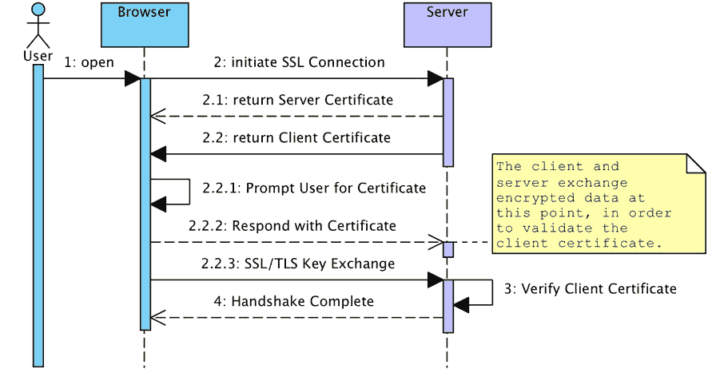
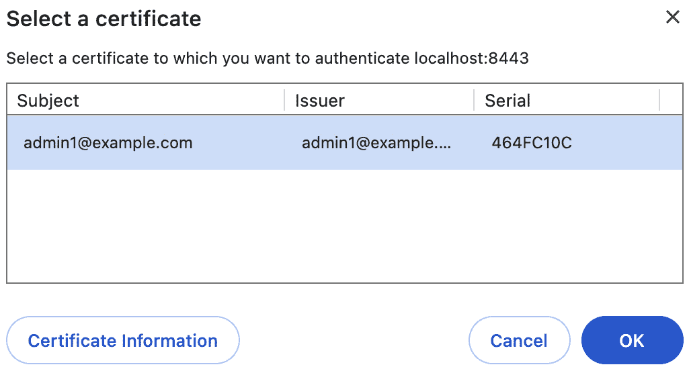
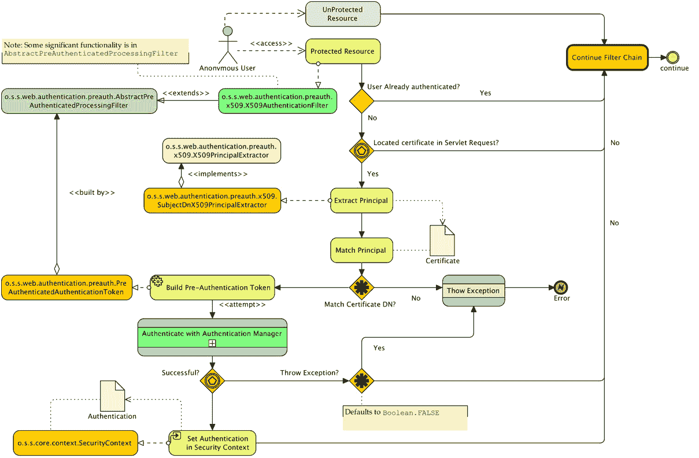
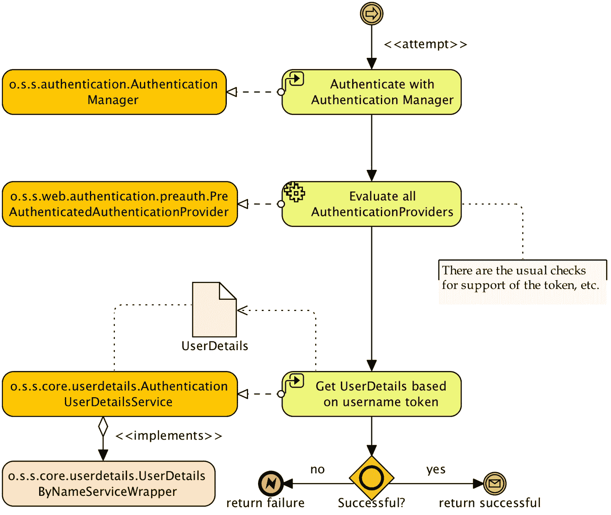
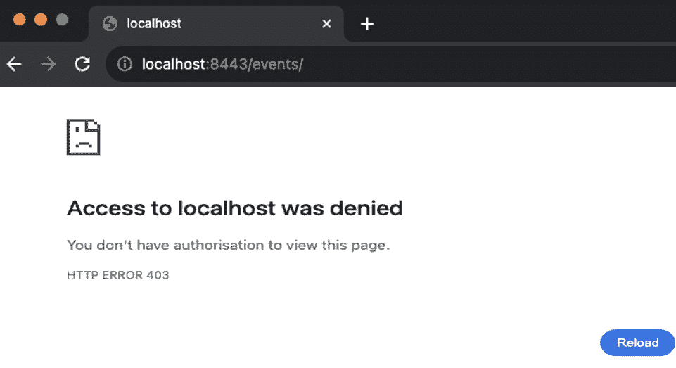

# 使用 TLS 的客户端证书认证

尽管用户名和密码认证非常常见，正如我们在*第一章*，*不安全应用程序的解剖*和*第二章*，*Spring Security 入门*中讨论的那样，存在其他认证形式，允许用户展示不同类型的凭证。Spring Security 也满足这些需求。在本章中，我们将超越基于表单的认证，探索使用可信客户端证书进行认证。

在本章的讨论过程中，我们将涵盖以下主题：

+   学习客户端证书认证如何在用户的浏览器和符合规定的服务器之间协商

+   配置 Spring Security 以使用客户端证书进行用户认证

+   理解 Spring Security 中客户端证书认证的架构

+   探索与客户端证书认证相关的高级配置选项

+   审查处理客户端证书认证时的优缺点和常见故障排除步骤

本章的代码示例链接在此：[`packt.link/XgAQ7`](https://packt.link/XgAQ7)。

# 客户端证书认证是如何工作的？

客户端证书认证需要服务器请求信息以及浏览器响应来协商客户端（即用户的浏览器）与服务器应用之间的可信认证关系。这种可信关系是通过使用交换的可信和可验证的凭证，即所谓的**证书**来建立的。

与我们迄今为止看到的大部分内容不同，在客户端证书认证中，Servlet 容器或应用程序服务器本身通常负责通过请求证书、评估它并接受其为有效来协商浏览器与服务器之间的信任关系。

客户端证书认证也称为**相互认证**，是**安全套接字层**（**SSL**）协议及其继任者**传输层安全性**（**TLS**）的一部分。由于相互认证是 SSL 和 TLS 协议的一部分，因此使用客户端证书认证需要 HTTPS 连接（由 SSL 或 TLS 加密）来使用。有关 Spring Security 中 SSL/TLS 支持的更多详细信息，请参阅*附录*中的*生成服务器证书*部分，*附加参考资料*。设置 SSL/TLS 是实施客户端证书认证所必需的。

下面的序列图展示了客户端浏览器与 Web 服务器在协商 SSL 连接并验证用于相互认证的客户端证书的可信度时的交互：



图 8.1 – 客户端证书认证

我们可以看到，交换两个证书，即服务器证书和客户端证书，提供了双方都已知并且可以信任继续安全对话的认证。为了清晰起见，我们省略了一些 SSL 握手的细节，并信任证书本身的检查；然而，我们鼓励您进一步阅读 SSL 和 TLS 协议以及证书的一般知识，因为关于这些主题存在许多优秀的参考指南。*RFC 8446*，*传输层安全性（TLS）协议版本 1.3* ([`datatracker.ietf.org/doc/html/rfc8446`](https://datatracker.ietf.org/doc/html/rfc8446))），是开始阅读客户端证书展示的好地方，如果您想深入了解，*SL 和 TLS：设计并构建安全系统，埃里克·雷斯科拉，Addison-Wesley* ([`www.amazon.com/SSL-TLS-Designing-Building-Systems/dp/0201615983`](https://www.amazon.com/SSL-TLS-Designing-Building-Systems/dp/0201615983))对协议及其实现有非常详细的回顾。

基于客户端证书认证的另一种名称是**X.509 认证**。术语 X.509 来源于 X.509 标准，最初由**国际电信联盟电信**（**ITU-T**）组织发布，用于基于 X.500 标准（如您可能从*第六章*，*LDAP 目录服务*）的目录。后来，这个标准被修改用于确保互联网通信的安全。

我们在这里提到这一点，因为 Spring Security 中与这个主题相关的许多类都引用了 X.509。请记住，X.509 本身并不定义相互认证协议，而是定义了证书的格式和结构以及包含的受信任证书颁发机构。

## 设置客户端证书认证基础设施

对于你作为一个个人开发者来说，能够实验客户端证书认证需要在相对容易的与 Spring Security 集成之前进行一些非平凡的配置和设置。由于这些设置步骤往往会给初学者带来很多问题，我们认为向您介绍这些步骤非常重要。

我们假设你正在使用本地自签名的服务器证书、自签名客户端证书和 Apache Tomcat。这在大多数开发环境中很典型；然而，你可能有权访问有效的服务器证书、**证书颁发机构**（**CA**）或另一个应用程序服务器。如果是这种情况，你可以将这些设置说明作为指南，并以类似的方式配置你的环境。请参考*附录*中的 SSL 设置说明，*附加参考资料*，以获取配置 Tomcat 和 Spring Security 以在独立环境中使用 SSL 的帮助。

### 理解公钥基础设施的目的

本章主要关注为学习和教育目的设置一个自包含的开发环境。然而，在大多数情况下，当你将 Spring Security 集成到现有的客户端证书安全环境中时，将存在大量的基础设施（通常是硬件和软件的组合），以提供诸如证书授予和管理、用户自助服务以及撤销等功能。这类环境定义了一个公钥基础设施——硬件、软件和安全策略的组合，从而形成一个高度安全的基于认证的网络生态系统。

除了用于 Web 应用程序认证外，这些环境中的证书或硬件设备还可以用于安全的、不可否认的电子邮件（使用`S/MIME`）、网络认证，甚至物理建筑访问（使用基于`PKCS 11`的硬件设备）。

尽管这种环境的运维成本可能很高（并且需要 IT 和流程的卓越表现才能有效实施），但可以说，这是技术专业人士可能拥有的最安全的操作环境之一。

### 创建客户端证书密钥对

自签名客户端证书的创建方式与自签名服务器证书的创建方式相同——通过使用`keytool`命令生成密钥对。客户端证书密钥对的不同之处在于它需要密钥库对 Web 浏览器可用，并且需要将客户端的公钥加载到服务器的信任库中（我们将在稍后解释这是什么）。

如果你现在不想生成自己的密钥，你可以跳到下一节，并使用示例章节中`./src/main/resources/keys`文件夹中的示例证书。否则，请按照以下步骤创建客户端密钥对：

```java
keytool -genkeypair -alias jbcpclient -keyalg RSA -validity 365 -keystore jbcp_clientauth.p12 -storetype PKCS12
```

重要提示

你可以在 Oracle 网站上找到有关`keytool`的更多信息，以及所有配置选项，请访问以下链接：[`docs.oracle.com/en/java/javase/17/docs/specs/man/keytool.xhtml`](https://docs.oracle.com/en/java/javase/17/docs/specs/man/keytool.xhtml)。

对于此用例，`keytool` 的大多数参数都是相当任意的。然而，当提示设置姓名和姓氏时（`admin1@example.com` 是一个合适的值，因为我们已经在 Spring Security 中设置了 `admin1@example.com` 用户。命令行交互的示例如下：

```java
What is your first and last name? [Unknown]: admin1@example.com
... etc
Is CN=admin1@example.com, OU=JBCP Calendar, O=JBCP, L=Park City, ST=UT, C=US correct?
[no]: yes
```

当我们配置 Spring Security 从证书认证用户获取信息时，我们将看到这一点的重要性。在我们可以设置 Tomcat 内部的证书认证之前，我们还有最后一个步骤，这将在下一节中解释。

### 配置 Tomcat 信任存储库

回想一下，密钥对的定义包括私钥和公钥。类似于 SSL 证书验证和保障服务器通信，客户端证书的有效性需要由创建它的认证机构进行验证。

由于我们已经使用 `keytool` 命令创建了自己的自签名客户端证书，Java 虚拟机（**JVM**）不会隐式地信任它，因为它是由受信任的证书颁发机构分配的。

让我们看看以下步骤：

1.  我们需要强制 Tomcat 识别证书为受信任证书。我们通过从密钥对中导出公钥并将其添加到 Tomcat 信任存储库来实现这一点。

    再次提醒，如果您现在不想执行此步骤，您可以使用 `.src/main/resources/keys` 中的现有信任存储库，并跳转到本节后面配置 `server.xml` 的部分。

1.  我们将导出公钥到一个名为 `jbcp_clientauth.cer` 的标准证书文件，如下所示：

    ```java
    keytool -exportcert -alias jbcpclient -keystore jbcp_clientauth.p12 -storetype PKCS12 -storepass changeit -file jbcp_clientauth.cer
    ```

1.  接下来，我们将证书导入信任存储库（这将创建信任存储库，但在典型的部署场景中，您可能已经在信任存储库中拥有其他证书）：

    ```java
    tomcat.truststore and prompt you for a password (we chose changeit as the password). You’ll also see some information about the certificate and will finally be asked to confirm that you do trust the certificate, as follows:

    ```

    持有人：CN=admin1@example.com, OU=JBCP Calendar, O=JBCP, L=Park City, ST=UT, C=US

    发行者：CN=admin1@example.com, OU=JBCP Calendar, O=JBCP, L=Park City, ST=UT, C=US

    序列号：464fc10c

    有效期从：2017 年 6 月 23 日星期五 11:10:19 MDT 至：2018 年 2 月 12 日星期四 10:10:19

    MST 2043

    //证书指纹：

    MD5: 8D:27:CE:F7:8B:C3:BD:BD:64:D6:F5:24:D8:A1:8B:50

    SHA1: C1:51:4A:47:EC:9D:01:5A:28:BB:59:F5:FC:10:87:EA:68:24:E3:1F

    SHA256: 2C:F6:2F:29:ED:09:48:FD:FE:A5:83:67:E0:A0:B9:DA:C5:3B: FD:CF:4F:95:50:3A:

    2C:B8:2B:BD:81:48:BB:EF

    签名算法名称：SHA256withRSA 版本：3

    //扩展

    #1: ObjectId: 2.5.29.14 Criticality=false SubjectKeyIdentifier [

    KeyIdentifier [

    0000: 29 F3 A7 A1 8F D2 87 4B

    EA 74 AC 8A 4B BC 4B 5D

    )

    K.t..K.K]

    0010: 7C 9B 44 4A

    ..DJ

    ]

    ]

    tomcat.truststore 文件，因为我们将在我们的 Tomcat 配置中引用它。

    ```java

    ```

密钥存储库和信任存储库之间的区别是什么？

连接器的 `keystoreFile` 和 `truststoreFile` 属性）。文件本身的格式可以完全相同。实际上，每个文件可以是任何 JSSE 支持的密钥存储格式，包括 `PKCS 12` 等。

1.  如前所述，我们假设您已经按照 *附录* 中的说明配置了 SSL 连接器，*附加参考资料*。如果您在 `server.xml` 中看不到 `keystoreFile` 或 `keystorePass` 属性，这意味着您应该访问 *附录* 中的 *附加参考资料*，以获取 SSL 设置。

1.  最后，我们需要将 Tomcat 指向信任库并启用客户端证书认证。这通过在 Tomcat 的 `server.xml` 文件中的 SSL 连接器添加三个额外的属性来完成，如下所示：

    ```java
    //sever.xml
    <Connector port="8443" protocol="HTTP/1.1" SSLEnabled="true" maxThreads="150"
              scheme="https" secure="true" sslProtocol="TLS" keystoreFile="<KEYSTORE_PATH>/tomcat.keystore"
              keystorePass="changeit" truststoreFile="<CERT_PATH>/tomcat.truststore"
              truststorePass="changeit"  clientAuth="true" />
    ```

1.  这应该是触发 Tomcat 在建立 SSL 连接时请求客户端证书所需的剩余配置。当然，您需要确保将 `<CERT_PATH>` 和 `<KEYSTORE_PATH>` 替换为完整路径。例如，在基于 Unix 的 `/home/packt/chapter8/keys/tomcat.keystore`。

1.  尝试启动 Tomcat，以确保服务器在日志中没有错误地启动。

重要提示

此外，还有一种配置 Tomcat 以可选方式使用客户端证书认证的方法——我们将在本章后面启用它。目前，我们要求使用客户端证书才能首先连接到 Tomcat 服务器。这使得诊断您是否正确设置了此功能变得更加容易！

### 在 Spring Boot 中配置 Tomcat

我们还可以配置 Spring Boot 内嵌的 Tomcat 实例，这是我们将在本章的其余部分使用 Tomcat 的方式。

将 Spring Boot 配置为使用我们新创建的证书与配置 YAML 条目的属性一样简单，如下面的代码片段所示：

```java
## Chapter 8 TLS over HTTP/1.1:
## https://localhost:8443
server:
  port: 8443
  ssl:
    key-store: classpath:keys/jbcp_clientauth.p12
    key-store-password: changeit
    keyStoreType: PKCS12
    keyAlias: jbcpclient
    protocol: TLS
    client-auth: need
    trust-store: classpath:keys/tomcat.truststore
    trust-store-password: changeit
```

最后一步是将证书导入客户端浏览器。

## 将证书密钥对导入浏览器

根据您使用的浏览器，导入证书的过程可能不同。我们将在此处提供 Firefox、Chrome 和 Internet Explorer 的安装说明，但如果您使用其他浏览器，请咨询其帮助部分或您喜欢的搜索引擎以获取帮助。

### 使用 Mozilla Firefox

执行以下步骤以在 Firefox 中导入包含客户端证书密钥对的密钥库：

1.  点击 **编辑** | **首选项**。

1.  点击 **高级** 按钮。

1.  点击 **加密** 选项卡。

1.  点击 **查看证书** 按钮。应该打开 **证书管理器** 窗口。

1.  点击 **您的** **证书** 选项卡。

1.  点击 **导入...** 按钮。

1.  浏览到您保存 `jbcp_clientauth.p12` 文件的位置并选择它。您需要输入创建文件时使用的密码（即 `changeit`）。

客户端证书应该被导入，并且您应该能在列表中看到它。

### 使用 Google Chrome

执行以下步骤以在 Chrome 中导入包含客户端证书密钥对的密钥库：

1.  点击浏览器工具栏上的扳手图标。

1.  选择**设置**。

1.  点击**显示****高级设置...**。

1.  在**HTTPS/SSL**部分，点击**管理****证书...**按钮。

1.  在**个人**选项卡中点击**导入...**按钮。

1.  浏览到保存`jbcp_clientauth.p12`文件的位置并选择它（确保使用证书的.p12 扩展名）。

1.  你需要输入你创建文件时使用的密码（即`changeit`）。

1.  点击**确定**。

### 使用 Microsoft Edge

让我们看看使用 Windows OS 的 Microsoft Edge 的步骤：

1.  在 Windows 资源管理器中双击`jbcp_clientauth.p12`文件。应该会打开**证书导入向导**窗口（确保使用证书的.p12 扩展名）。

1.  点击**下一步**并接受默认值，直到提示输入证书密码。

1.  输入证书密码（即`changeit`）并点击**下一步**。

1.  接受默认的**自动选择证书存储**选项并点击**下一步**。

1.  点击**完成**。

为了验证证书是否正确安装，你需要执行另一系列步骤：

1.  在 Microsoft Edge 中打开**设置**菜单。

1.  选择**隐私、搜索**和**服务**。

1.  滚动到**安全**并

1.  点击**管理证书**。

1.  如果个人选项卡尚未选中，请点击**个人**选项卡。你应该在这里看到证书列表。

### 测试总结

现在，你应该能够连接到`https://localhost:8443/`，注意使用**HTTPS**和**8443**。如果一切设置正确，当你尝试访问网站时，应该会提示输入证书——在 Chrome 中，证书显示如下：



图 8.2 – Chrome 中的客户端证书详情

然而，你会发现，如果你尝试访问受保护的网站部分，例如**我的事件**部分，你会被重定向到登录页面。这是因为我们还没有配置 Spring Security 来识别证书中的信息——在这个阶段，客户端和服务器之间的协商已经停止在 Tomcat 服务器本身。

重要提示

你应该从`chapter08.00-calendar`中的代码开始。

## 客户端证书认证故障排除

不幸的是，如果我们说第一次正确配置客户端证书认证——没有任何问题发生——很容易，那我们就是在对你撒谎。事实是，尽管这是一个伟大且非常强大的安全装置，但浏览器和 Web 服务器制造商的文档都做得不好，而且当错误信息出现时，它们最好时令人困惑，最坏时具有误导性。

记住，到目前为止，我们完全没有在等式中涉及 Spring Security，所以调试器可能不会帮助你（除非你手头有 Tomcat 源代码）。有一些常见的错误和需要检查的事项。

当您访问网站时不会被提示证书。这可能有多种可能的原因，这可能是最难以解决的问题之一。以下是一些需要检查的事项：

1.  确保证书已安装到您正在使用的浏览器客户端中。有时，如果您之前尝试访问该网站并被拒绝，您可能需要重新启动整个浏览器（关闭所有窗口）。

1.  确保您正在访问服务器的 SSL 端口（在开发设置中通常是 `8443`），并在您的 URL 中选择了 HTTPS 协议。客户端证书不会在不安全的浏览器连接中显示。请确保浏览器也信任服务器的 SSL 证书，即使您必须强制它信任自签名证书。

1.  确保您已将 `clientAuth` 指令添加到您的 Tomcat 配置中（或您所使用的任何应用服务器的等效配置）。

1.  如果所有其他方法都失败了，请使用网络分析器或数据包嗅探器，如 Wireshark ([`www.wireshark.org/`](http://www.wireshark.org/)) 或 Fiddler2 ([`www.fiddler2.com/`](http://www.fiddler2.com/)))，来审查网络上的流量和 SSL 密钥交换（首先与您的 IT 部门确认——许多公司不允许在其网络上使用此类工具）。

1.  如果您正在使用自签名客户端证书，请确保公钥已导入到服务器的信任存储中。如果您正在使用由 CA 分配的证书，请确保 CA 被信任的 **Java 虚拟机**（**JVM**）或 CA 证书已导入到服务器的信任存储中。

1.  尤其是 Internet Explorer，它根本不会报告客户端证书失败的具体细节（它只是报告一个通用的**页面无法显示**错误）。使用 Firefox 来诊断您遇到的问题是否与客户端证书有关。

1.  以下 JVM 选项将启用 SSL 握手级别的日志记录：`-Djavax.net.debug=ssl:handshake`。这个调试标志可能会产生大量输出，但在诊断底层 SSL 连接问题时非常有帮助。

## 在 Spring Security 中配置客户端证书身份验证

与我们迄今为止所使用的身份验证机制不同，使用客户端证书身份验证会导致用户的请求在服务器端预先进行身份验证。由于服务器（Tomcat）已经确认用户提供了有效且可信的证书，Spring Security 可以简单地信任这个有效性的声明。

安全登录过程中仍缺少一个重要组件，那就是认证用户的授权。这正是我们配置 Spring Security 的地方——我们必须向 Spring Security 添加一个组件，该组件将识别用户 HTTP 会话（由 Tomcat 填充）中的证书认证信息，然后根据 Spring Security 的 `UserDetailsService` 调用来验证提供的凭据。`UserDetailsService` 的调用将导致确定证书中声明的用户是否为 Spring Security 所知，然后根据常规登录规则分配 `GrantedAuthority`。

## 使用安全命名空间配置客户端证书认证

在 LDAP 配置的复杂性中，配置客户端证书认证是一个受欢迎的缓解。如果我们使用安全命名空间风格的配置，添加客户端证书认证只是一个简单的单行配置更改，添加在 `HttpSecurity` 声明中。请对提供的 `SecurityConfig.java` 配置进行以下更改：

```java
//src/main/java/com/packtpub/springsecurity/configuration/SecurityConfig.java
// SSL / TLS x509 support
http.x509(httpSecurityX509Configurer -> httpSecurityX509Configurer
              .userDetailsService(userDetailsService));
```

重要提示

注意到 `.x509()` 方法引用了我们现有的 `userDetailsService()` 配置。为了简化，我们使用了在 *第五章* 中介绍的 `UserDetailsServiceImpl` 实现，即 *使用 Spring Data 进行认证*。然而，我们可以轻松地将它替换为任何其他实现（即，在 *第四章* 中介绍的基于 LDAP 或 JDBC 的实现，即 *基于 JDBC 的认证*)。

在重新启动应用程序后，您将再次被提示输入客户端证书，但这次，您应该能够访问需要授权的网站区域。您可以从日志中看到（如果您已启用），您已以 `admin1@example.com` 用户登录。

重要提示

您的代码应类似于 `chapter08.01-calendar`。

### Spring Security 如何使用证书信息？

如前所述，Spring Security 在证书交换中的作用是从提供的证书中提取信息，并将用户的凭据映射到用户服务。在使用 `.x509()` 方法时，我们没有看到使这一切发生的魔法。回想一下，当我们设置客户端证书时，一个类似于 LDAP DN 的 DN 与证书相关联：

```java
Owner: CN=admin@example.com, OU=JBCP Calendar, O=JBCP, L=Park City, ST=UT, C=US
```

Spring Security 使用此 DN 中的信息来确定主体的实际用户名，它将在 `UserDetailsService` 中查找此信息。特别是，它允许指定一个正则表达式，该表达式用于匹配与证书建立的 DN 的一部分，并将此 DN 部分用作主体名称。`.x509()` 方法的隐含默认配置如下：

```java
http.x509(httpSecurityX509Configurer -> httpSecurityX509Configurer
              .subjectPrincipalRegex("CN=(.*?)(?:,|$)")
              .userDetailsService(userDetailsService));
```

我们可以看到，这个正则表达式将匹配作为主体名称的 `admin1@example.com` 值。这个正则表达式必须包含一个匹配组，但它可以被配置为支持应用程序的用户名和 DN 发行要求。例如，如果您的组织证书的 DN 包括 `email` 或 `userid` 字段，则可以将正则表达式修改为使用这些值作为认证主体名称。

### Spring Security 证书认证是如何工作的

让我们通过以下图表来回顾参与客户端证书审查和评估以及将其转换为 Spring-Security 认证会话的各种参与者：



图 8.3 – Spring Security 证书认证工作流程

我们可以看到，`o.s.s.web.authentication.preauth.x509.X509AuthenticationFilter` 负责检查未认证用户请求展示客户端证书。如果它发现请求包含有效的客户端证书，它将使用 `o.s.s.web.authentication.preauth.x509.SubjectDnX509PrincipalExtractor` 提取主体，使用与之前描述的证书所有者 DN 匹配的正则表达式。

重要提示

注意，尽管前面的图表表明证书的审查发生在未认证用户的情况下，但当展示的证书标识的用户与之前认证的用户不同时，也可以执行检查。这将导致使用新提供的凭据发起新的认证请求。这样做的原因应该是显而易见的——任何用户展示新的凭证集时，应用程序都必须意识到这一点，并通过确保用户仍然能够访问它来负责任地做出反应。

一旦证书被接受（或拒绝/忽略），就像其他认证机制一样，将构建一个 `Authentication` 令牌并将其传递给 `AuthenticationManager` 进行认证。现在我们可以回顾一下 `o.s.s.web.authentication.preauth.PreAuthenticatedAuthenticationProvider` 处理认证令牌的简要说明：



图 8.4 – Spring Security PreAuthenticatedAuthenticationProvider 工作流程

虽然我们不会详细讨论它们，但 Spring Security 支持许多其他预认证机制。一些例子包括 Java EE 角色映射（`J2eePreAuthenticatedProcessingFilter`）、WebSphere 集成（`WebSpherePreAuthenticatedProcessingFilter`）和 SiteMinder 风格的认证（`RequestHeaderAuthenticationFilter`）。如果你理解了客户端证书认证的过程流程，理解这些其他认证类型会容易得多。

### 使用 AuthenticationEntryPoint 处理未认证请求

由于 `X509AuthenticationFilter` 在认证失败时会继续处理请求，我们需要处理用户未能成功认证并请求受保护资源的情况。Spring Security 允许开发者通过插入自定义的 `o.s.s.web.AuthenticationEntryPoint` 实现来自定义这一点。在默认表单登录场景中，如果用户被拒绝访问受保护资源且未认证，`LoginUrlAuthenticationEntryPoint` 用于将用户重定向到登录页面。

相比之下，在典型的客户端证书认证环境中，不支持替代认证方法（记住，无论如何，Tomcat 都会在 Spring Security 表单登录之前期望证书）。因此，保留重定向到表单登录页面的默认行为是没有意义的。相反，我们将修改入口点以简单地返回一个 `HTTP 403 禁止` 消息，使用 `o.s.s.web.authentication.Http403ForbiddenEntryPoint`。请按照以下方式在您的 `SecurityConfig.java` 文件中进行以下更新：

```java
//src/main/java/com/packtpub/springsecurity/configuration/SecurityConfig.java
@Bean
public SecurityFilterChain filterChain(HttpSecurity http,
        PersistentTokenRepository persistentTokenRepository,
        Http403ForbiddenEntryPoint forbiddenEntryPoint) throws Exception {
    http.authorizeRequests( authz -> authz
                .requestMatchers(antMatcher("/webjars/**")).permitAll()
...
          .exceptionHandling(exceptions -> exceptions
                .authenticationEntryPoint(forbiddenEntryPoint)
                .accessDeniedPage("/errors/403"))
...
    return http.build();
}
@Bean
public Http403ForbiddenEntryPoint forbiddenEntryPoint(){
    return new Http403ForbiddenEntryPoint();
}
```

现在，如果用户尝试访问受保护资源且无法提供有效的证书，他们将看到以下页面，而不是被重定向到登录页面：



图 8.5 – Spring Security 禁止错误

重要提示

我们已删除 `admin1@example.com` 的用户名，以确保没有与证书 CN 匹配的用户。

你的代码应该看起来像 `chapter08.02-calendar`。

其他通常与客户端证书认证一起执行的配置或应用程序流程调整如下：

+   完全删除基于表单的登录页面

+   删除注销链接（因为没有理由注销，因为浏览器总是会显示用户的证书）

+   删除重命名用户账户和更改密码的功能

+   删除用户注册功能（除非你能够将其与新的证书发放关联）

### 支持双模式认证

也可能存在某些环境可能同时支持基于证书和基于表单的认证。如果你的环境是这样，使用 Spring Security 支持它也是可能的（并且是微不足道的）。我们可以简单地保留默认的 `AuthenticationEntryPoint` 接口（重定向到基于表单的登录页面）不变，并允许用户在没有提供客户端证书的情况下使用标准登录表单登录。

如果你选择以这种方式配置你的应用程序，你需要调整 Tomcat SSL 设置（根据你的应用程序服务器适当更改）：简单地将 `clientAuth` 指令更改为 `want`，而不是 `true`：

```java
<Connector port="8443" protocol="HTTP/1.1" SSLEnabled="true" maxThreads="150" scheme="https" secure="true" sslProtocol="TLS"
keystoreFile="conf/tomcat.keystore" keystorePass="password" truststoreFile="conf/tomcat.truststore" truststorePass="password" clientAuth="want"
/>
```

我们还需要删除在之前的练习中配置的`authenticationEntryPoint()`方法，以便如果用户在浏览器首次查询时无法提供有效的证书，则标准的基于表单的认证工作流程将接管。

虽然这很方便，但在双模式（基于表单和基于证书）认证方面，还有一些事情需要记住，如下所示：

+   大多数浏览器在用户一次证书认证失败后不会再次提示用户输入证书，所以请确保您的用户知道他们可能需要重新进入浏览器以再次展示他们的证书。

+   请记住，使用证书进行用户认证不需要密码；然而，如果您仍然使用`UserDetailsService`来支持您的基于表单认证的用户，这可能就是您用来向`PreAuthenticatedAuthenticationProvider`提供用户信息的同一个`UserDetailsService`对象。这可能会带来潜在的安全风险，因为您打算仅使用证书登录的用户可能会使用表单登录凭据进行认证。

解决这个问题有几种方法，以下列表中进行了描述：

+   确保使用证书进行认证的用户在您的用户存储中有一个适当的强密码。

+   考虑自定义您的用户存储，以便清楚地识别已启用基于表单登录的用户。这可以通过在包含用户账户信息的表中添加一个额外字段，以及通过调整`JpaDaoImpl`对象使用的 SQL 查询来实现。

+   完全为以证书认证用户登录的用户配置一个独立的用户详情存储，以将他们完全与允许使用基于表单登录的用户隔离开。

+   双模式认证可以成为您网站的一个强大补充，并且可以有效地安全部署，前提是您要考虑到用户将获得访问它的条件。

# 使用 Spring Bean 配置客户端证书认证

在本章早期，我们回顾了参与客户端证书认证的类的流程。因此，我们应该能够直接使用显式 Bean 来配置 JBCP 日历。通过使用显式配置，我们将有更多的配置选项可供使用。让我们看看如何使用显式配置：

```java
//src/main/java/com/packtpub/springsecurity/configuration/SecurityConfig.java
@Bean
public X509AuthenticationFilter x509Filter(){
    return new X509AuthenticationFilter(){{
        setAuthenticationManager(authenticationManager);
    }};
}
@Bean
public PreAuthenticatedAuthenticationProvider preAuthAuthenticationProvider(final AuthenticationUserDetailsService authenticationUserDetailsService){
    return new PreAuthenticatedAuthenticationProvider(){{
        setPreAuthenticatedUserDetailsService (authenticationUserDetailsService);
    }};
}
@Bean
public UserDetailsByNameServiceWrapper authenticationUserDetailsService(final UserDetailsService userDetailsService){
    return new UserDetailsByNameServiceWrapper(){{
        setUserDetailsService(userDetailsService);
    }};
}
```

我们还需要删除`x509()`方法，将`x509Filter`添加到我们的过滤器链中，并将我们的`AuthenticationProvider`实现添加到`AuthenticationManger`中：

```java
//src/main/java/com/packtpub/springsecurity/configuration/SecurityConfig.java
@Bean
public AuthenticationManager authManager(HttpSecurity http) throws Exception {
    AuthenticationManagerBuilder authenticationManagerBuilder =
          http.getSharedObject(AuthenticationManagerBuilder.class);
    http.authenticationProvider(preAuthAuthenticationProvider);
    return authenticationManagerBuilder.build();
}
```

现在，尝试一下应用程序。从用户的角度来看，没有太多变化，但作为开发者，我们已经打开了许多额外的配置选项的大门。

重要提示

您的代码应类似于`chapter08.03-calendar`。

## 基于 Bean 的配置的附加功能

基于 Spring-bean 的配置通过暴露通过安全命名空间样式配置未暴露的 bean 属性，为我们提供了额外的能力。

`X509AuthenticationFilter` 上可用的其他属性如下：

| **属性** | **描述** | **默认** |
| --- | --- | --- |
| `continueFilterChainOn` `UnsuccessfulAuthentication` | 如果为假，失败的认证将抛出异常而不是允许请求继续。这通常会在预期并需要有效证书才能访问受保护站点的情况下设置。如果为真，即使有失败的认证，过滤器链也会继续。 | `true` |
| `checkForPrincipalChanges` | 如果为真，过滤器将检查当前认证的用户名是否与客户端证书中提供的用户名不同。如果是，将执行对新证书的认证，并将 HTTP 会话作废（可选，见下一个属性）。如果为假，一旦用户认证成功，即使他们提供不同的凭据，他们也将保持认证状态。 | `false` |
| `invalidateSessionOn` `PrincipalChange` | 如果为真，并且请求中的主体发生变化，则在重新认证之前将使用户的 HTTP 会话作废。如果为假，会话将保持不变——请注意，这可能会引入安全风险。 | `true` |

表 8.1 – `X509AuthenticationFilter` 上可用的属性

`PreAuthenticatedAuthenticationProvider` 实现提供了一些有趣的属性，如下表所示：

| **属性** | **描述** | **默认** |
| --- | --- | --- |
| `preAuthenticated UserDetailsService` | 此属性用于从证书中提取的用户名构建完整的 `UserDetails` 对象。 | 无 |
| `throwExceptionWhen` `TokenRejected` | 如果为真，当令牌构建不正确（不包含用户名或证书）时，将抛出 `BadCredentialsException` 异常。通常在仅使用证书的环境中设置为 `true`。 | 无 |

表 8.2 – `PreAuthenticatedAuthenticationProvider` 上可用的属性

除了这些属性之外，还有许多其他机会来实现接口或扩展参与证书认证的类，以进一步自定义您的实现。

## 实施客户端证书认证时的注意事项

尽管客户端证书认证非常安全，但它并不适合每个人，也不适合所有情况。

客户端证书认证的优点如下列出：

+   证书建立了一个相互信任和可验证的框架，确保双方（客户端和服务器）都是他们所声称的身份

+   如果正确实施，基于证书的认证比其他形式的认证更难伪造或篡改

+   如果使用并正确配置了支持良好的浏览器，客户端证书认证可以有效地充当单点登录解决方案，使所有证书保护的应用程序登录透明化。

客户端证书认证的缺点如下：

+   证书的使用通常要求整个用户群体都拥有它们。这可能导致用户培训负担和行政负担。大多数在大规模部署基于证书的认证的组织必须为证书维护、到期跟踪和用户支持提供足够的自助和帮助台支持。

+   证书的使用通常是一种全有或全无的事情，这意味着由于网络服务器配置的复杂性或应用支持不佳，不支持混合模式认证和为非证书用户提供支持。

+   证书的使用可能不会得到您用户群体中所有用户的良好支持，包括使用移动设备的用户。

+   正确配置支持基于证书的认证所需的基础设施可能需要高级 IT 知识。

正如你所见，客户端证书认证既有优点也有缺点。当正确实施时，它可以成为用户非常方便的访问模式，并且具有非常吸引人的安全和不可否认属性。你需要确定你的具体情况，看看这种认证方式是否合适。

# 摘要

在本章中，我们探讨了基于客户端证书的认证的架构、流程和 Spring Security 支持。我们涵盖了客户端证书（相互）认证的概念和整体流程。我们探讨了配置 Apache Tomcat 以实现自签名 SSL 和客户端证书场景所需的重要步骤。

我们还学习了如何配置 Spring Security 以了解客户端提供的基于证书的凭证。我们涵盖了与证书认证相关的 Spring Security 类架构。我们还知道了如何配置 Spring bean 风格的客户端证书环境。我们还讨论了这种认证方式的优缺点。

对于不熟悉客户端证书的开发者来说，这种环境中的许多复杂性可能会让他们感到困惑。我们希望这一章能让这个复杂主题更容易理解和实施！

在下一章中，我们将讨论**开放授权**（**OAuth 2**）协议以及如何使用**OpenID** **连接**（**OIDC**）实现单点登录。

# 第三部分：探索 OAuth 2 和 SAML 2

本部分重点介绍 OAuth 2，这是一种广泛采用的可信身份管理方法，使用户能够通过单个可信提供者集中管理他们的身份。用户可以从使用可信的 OAuth 2 提供者安全存储他们的密码和个人信息中受益，同时保留在需要时披露个人信息的选项。实施 OAuth 2 身份验证的网站可以信任展示 OAuth 2 凭证的用户是经过身份验证的个人。

在探索 SAML 2 支持的过程中，我们深入探讨了将**安全断言标记语言**（**SAML 2.0**）集成到 Spring Security 应用程序的复杂性。SAML 2.0 是一种基于 XML 的标准，它促进了**身份提供者**（**IdP**）和**服务提供者**（**SP**）之间认证和授权数据的交换，在 Spring Security 框架内提供无缝集成。

本部分包含以下章节：

+   *第九章*, *开启 OAuth 2*

+   *第十章*, *SAML 2 支持*
