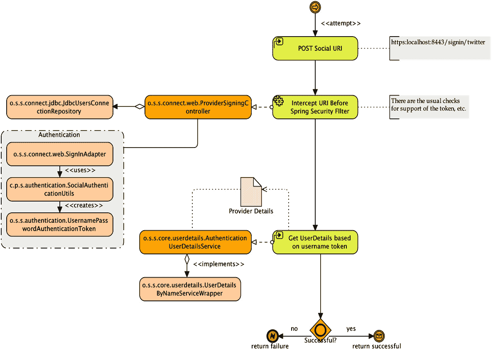
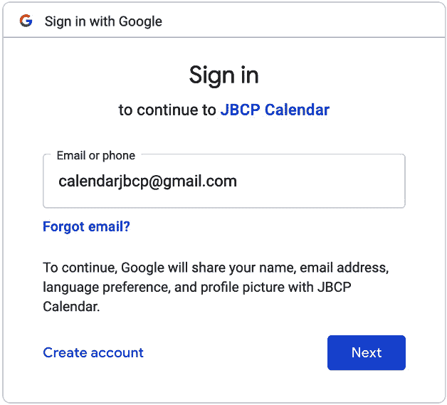
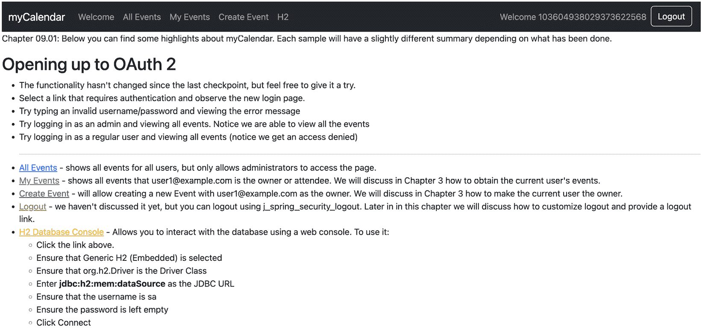
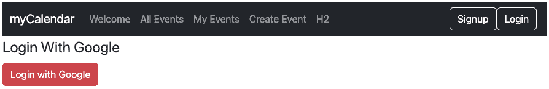
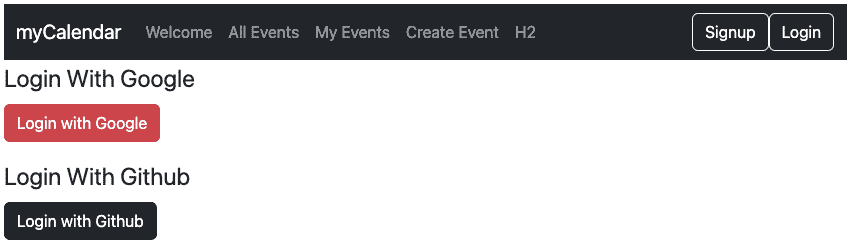
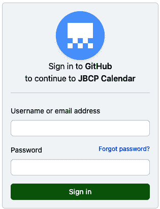
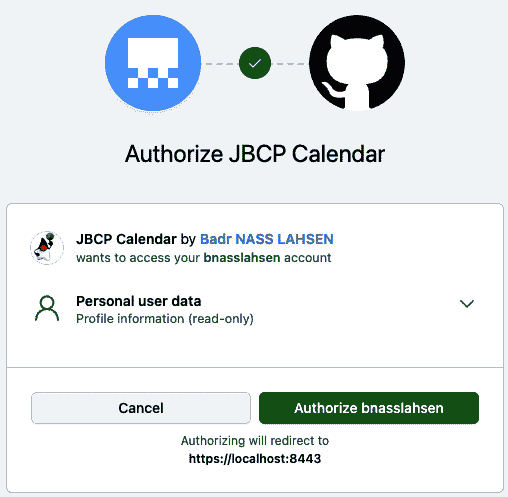
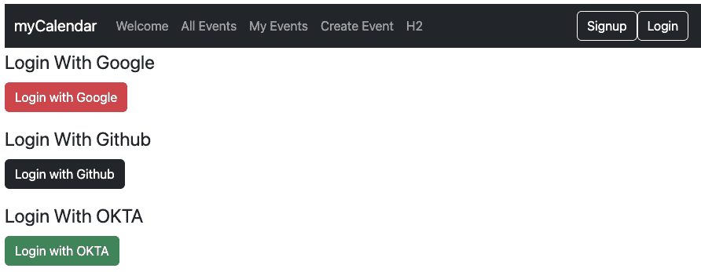
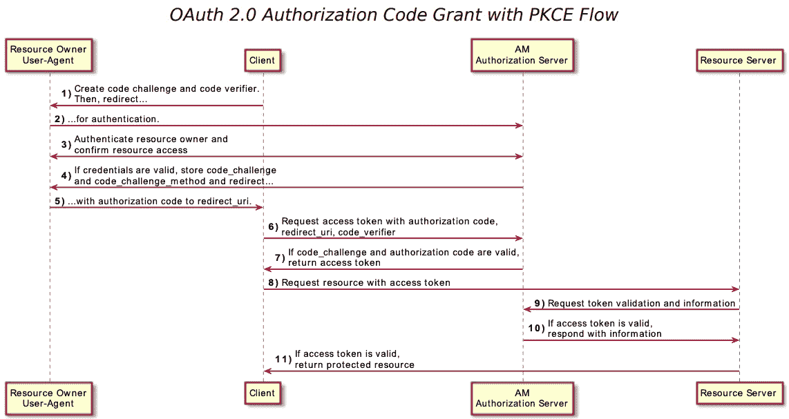

# 开放 OAuth 2

**OAuth 2**是一种非常流行的受信任身份管理形式，它允许用户通过单个受信任的提供者来管理他们的身份。这个便捷的功能为用户提供将密码和个人信息存储在受信任的 OAuth 2 提供者的安全性，并在请求时可选地披露个人信息。此外，OAuth 2 启用网站提供信心，即提供 OAuth 2 凭证的用户就是他们所说的那个人。

在本章中，我们将涵盖以下主题：

+   在 5 分钟内学习如何设置自己的 OAuth 2 应用程序

+   使用非常快速的实施方式配置`JBCP 日历`应用程序的 OAuth 2

+   学习 OAuth 2 的概念架构以及它是如何为您的网站提供可信用户访问的

+   实现基于 OAuth 2 的用户注册

+   尝试 OAuth 2 属性交换以实现用户配置文件功能

+   在`Spring Security`中配置 OAuth 2 支持

+   执行 OAuth 2 提供者连接工作流程

+   将 OpenID Connect 提供者与`Spring Security`集成

本章代码的实际链接在这里：[`packt.link/ejucD`](https://packt.link/ejucD)。

# OAuth 2 的充满希望的世界

作为应用程序开发者，你可能经常听到 OAuth 2 这个术语。OAuth 2 已被全球的互联网服务和软件公司广泛采用，并且对于这些公司如何互动和共享信息至关重要。但究竟是什么呢？简单来说，OAuth 2 是一种协议，允许不同的实体以安全和可靠的方式共享信息和资源。

那么，OAuth 1.0 呢？

建立在相同动机的基础上，OAuth 1.0 于 2007 年设计和批准。然而，它因过于复杂而受到批评，并且存在不精确的规范问题，这导致了不安全的实现。所有这些问题都导致了 OAuth 1.0 的较差采用，并最终导致了 OAuth 2 的设计和创建。

OAuth 2 是 OAuth 1.0 的后继者。

还需要注意的是，OAuth 2 与 OAuth 1.0 不向后兼容，因此 OAuth 2 应用程序不能与 OAuth 1.0 服务提供商集成。

这种类型的登录——通过受信任的第三方——已经存在很长时间了，以许多不同的形式（例如，*Google 身份提供者*或*Microsoft Entra ID*曾一度成为网络上较著名的中央登录服务之一）。

这里是 OAuth 2.0 的关键概念和组件：

*角色*：

+   **资源所有者 (RO)**：可以授予访问受保护资源的实体。通常，这是最终用户。

+   **客户端**: 代表资源所有者请求访问受保护资源的应用程序。

+   **授权服务器 (AS)**：在获得适当的授权后，验证资源所有者并颁发访问令牌的服务器。

+   **资源服务器 (RS)**：托管正在访问的保护资源的服务器。

*授权许可*:

+   OAuth 2.0 定义了多种授权许可类型，例如授权代码、隐式、资源所有者密码凭证和客户端凭证。许可类型决定了流程和客户端获取访问令牌的方式。

*访问令牌*:

+   访问令牌是代表授予客户端的授权的凭证。它用于代表资源所有者访问受保护的资源。

*作用域*:

+   作用域定义了客户端请求的访问范围。它指定了客户端打算在资源服务器上执行的操作。

*授权端点和* *令牌端点*:

+   `授权端点`便于与资源所有者沟通以获得授权许可，而`令牌端点`便于将此许可交换为访问令牌。

*重定向 URI*:

+   在资源所有者授予权限后，`授权服务器`使用重定向 URI 将用户重定向回客户端应用程序。

重要提示

您可以参考 OAuth 2.0 规范[`tools.ietf.org/html/rfc6749`](https://tools.ietf.org/html/rfc6749)。

以下图示说明了在登录过程中集成 OAuth 2 的网站与 Facebook OAuth 2 提供者之间的高级关系，例如：



图 9.1 – 登录过程中 OAuth 2 和 Facebook OAuth 2 提供者

我们可以看到，提交表单将启动对 OAuth 提供者的请求，导致提供者显示一个授权对话框，要求用户允许`jbcpcalendar`从您的 OAuth 提供者账户获取特定信息的权限。此请求包含一个名为`code`的`uri`参数。一旦获得授权，用户将被重定向回`jbcpcalendar`，并且`code`参数包含在

`uri`参数。然后，请求再次重定向到 OAuth 提供者，以授权`jbcpcalendar`。OAuth 提供者随后响应一个`access_token`，该令牌可用于访问`jbcpcalendar`被授权访问的用户 OAuth 信息。

不要无保留地信任 OAuth 2！

在这里，您可以看到一个可能会欺骗系统用户的根本假设。我们有可能注册 OAuth 2 提供者账户，这会让我们看起来像是詹姆斯·高斯林，尽管我们显然不是。不要错误地假设，仅仅因为用户有一个听起来令人信服的 OAuth 2（或 OAuth 2 代表提供者），他们就是他们所说的那个人，而不需要额外的身份识别形式。从另一个角度来看，如果有人来到你家门口，只声称他是詹姆斯·高斯林，你会不验证他的身份就让他进去吗？

OAuth 2.0 启用的应用然后将用户重定向到 OAuth 2.0 提供者，用户向提供者出示其凭证，提供者随后负责做出访问决定。一旦提供者做出访问决定，提供者将用户重定向回原始网站，此时原始网站可以确信用户的真实性。一旦你尝试过 OAuth 2.0，它就会变得容易理解。现在让我们将 OAuth 2.0 添加到`JBCP 日历`登录界面！

## 我们为什么需要 OpenID Connect？

`RFC 6749` ([`datatracker.ietf.org/doc/html/rfc6749`](https://datatracker.ietf.org/doc/html/rfc6749)) 和 `RFC 6750` ([`datatracker.ietf.org/doc/html/rfc6750`](https://datatracker.ietf.org/doc/html/rfc6750))。其主要目标是简化通过`授权服务器`执行的认证来验证用户身份的过程，允许以既互操作又符合 REST 原则的方式检索用户配置文件信息。

此协议赋予应用和网站的开发者启动登录过程并接收关于用户的可信断言的权力，确保在各种平台（包括基于 Web 的、移动的和 JavaScript 客户端）之间的一致性。该规范套件是可定制的，支持各种可选功能，如身份数据的加密、`OpenID 提供者`的发现和会话注销。

对于开发者来说，OpenID Connect 提供了一种安全和可验证的方式来回答关键问题：“目前使用连接的浏览器或移动应用的是哪位个人？”值得注意的是，它通过消除设置、存储和管理密码的需要，减轻了处理密码——通常与数据泄露相关——的负担。

## OpenID Connect 是如何工作的

OpenID Connect 通过提供无缝集成、强大的支持、安全性和隐私保护配置，促进了互联网身份生态系统的建立。它强调互操作性，扩展了对广泛客户端和设备的支持，并允许任何实体作为**OpenID 提供者**（**OP**）运行。

下面是`OpenID Connect`的关键概念和组件：

+   **RP**，即**信赖方**，指的是将用户身份验证功能委托给**身份提供者**（**IDP**）的应用或网站。

+   **OP**或**IDP**：OP 是一个实现了 OpenID Connect 和 OAuth 2.0 协议的实体。有时，OPs 会根据其扮演的角色来表示，例如**安全令牌服务**（**STS**）、**IDP**或**授权服务器（AS**）。

+   **身份令牌**：作为身份验证过程的成果，身份令牌至少包括用户标识符（称为*sub*或主题声明）以及关于用户何时以及如何进行身份验证的详细信息。还可以包括其他身份数据。

+   **客户端**：客户端是请求令牌的软件，无论是用于用户身份验证还是资源访问（**RP**）。客户端需要在 OP 上注册，并且可以采取各种形式，如 Web 应用程序、原生移动和桌面应用程序等。

+   **用户**：用户是利用已注册客户端访问资源的个人。

在强调 OpenID Connect 原则是建立在 OAuth 2 协议之上的协议之后，我们将学习如何使用一些流行的提供商在我们的 `JBCP 日历` 应用程序中设置 OAuth 2。

## 注册 OAuth 2 应用程序

为了充分利用本节中的练习（并能够测试登录），您需要创建一个服务提供商的应用程序。目前，Spring Social 支持 Twitter、Facebook、Google、LinkedIn 和 GitHub，并且这个列表还在增长。

为了充分利用本章中的练习（并能够测试登录），我们建议您至少拥有 Google 账户。我们已经为 `jbcpcalendar` 应用程序设置了账户，我们将在本章的剩余部分使用它。

如果您正在使用 **OAuth** **2** 功能，请在您的 `build.gradle` 文件中包含以下附加依赖项：

```java
//build.gradle
dependencies {
...
    // OAuth2 Configuration:
    implementation 'org.springframework.boot:spring-boot-starter-oauth2-client'
...
}
```

重要提示

您应该从 `chapter09.00-calendar` 中的源代码开始。

除了 `Spring Security OAuth 2` 依赖项之外，我们现在将探索 `JBCP` `Calendar` 应用程序。

## 使用 Spring Security 启用 OAuth 2.0 登录

在接下来的几章中，我们可以看到外部身份验证提供商中存在的一个共同主题。`Spring Security` 提供了全面的 OAuth 2 支持。本节讨论了如何将 OAuth 2 集成到您的基于 servlet 的应用程序中。

`OAuth 2.0 登录` 功能允许应用程序让用户使用他们现有的 OAuth 2.0 提供商（如 GitHub）或 `OpenID Connect 1.0 提供商`（如 Google）的账户登录到应用程序。

重要提示

`OAuth 2.0 登录` 通过使用 `授权码授权` 实现，如 `OAuth 2.0 授权框架` 中指定，您可以在[`tools.ietf.org/html/rfc6749#section-4.1`](https://tools.ietf.org/html/rfc6749#section-4.1)找到，以及 `OpenID Connect Core 1.0`，您可以在[`openid.net/specs/openid-connect-core-1_0.xhtml#CodeFlowAuth`](https://openid.net/specs/openid-connect-core-1_0.xhtml#CodeFlowAuth)找到。

### 初始设置

本节展示了如何通过使用 Google 作为 `身份验证提供者` 来配置 `OAuth 2.0 登录` 示例，并涵盖了以下主题：

+   请遵循此处 OpenID Connect 页面上的说明：[`developers.google.com/identity/openid-connect/openid-connect`](https://developers.google.com/identity/openid-connect/openid-connect)，从 *设置 OAuth* *2.0* 部分开始。

+   完成获取 OAuth 2.0 凭据的说明后，您应该有一个新的 `OAuth 客户端`，其凭据由一个 **客户端 ID** 和一个 **客户端密钥** 组成。

此配置对于将我们的应用程序配置为**OAuth 2**客户端非常重要。

### 设置重定向 URI

重定向 URI 是在用户通过 Google 进行身份验证并授予对在**同意**页面上的`OAuth Client`（在上一步骤中创建）的访问权限后，最终用户的用户代理被重定向回应用程序中的路径。

在本小节中，请确保授权重定向 URI 字段设置为`https://localhost:8443/login/oauth2/code/google`。

重要提示

默认的重定向 URI 模板是`{baseUrl}/login/oauth2/code/{registrationId}`。`registrationId`是`ClientRegistration`的唯一标识符。

如果`OAuth Client`运行在代理服务器后面，您应该检查代理服务器配置（请参阅此链接：[`docs.spring.io/spring-security/reference/features/exploits/http.xhtml#http-proxy-server`](https://docs.spring.io/spring-security/reference/features/exploits/http.xhtml#http-proxy-server)），以确保应用程序配置正确。同时，请参阅此处支持的 URI 模板变量：[`docs.spring.io/spring-security/reference/servlet/oauth2/client/authorization-grants.xhtml#oauth2Client-auth-code-redirect-uri`](https://docs.spring.io/spring-security/reference/servlet/oauth2/client/authorization-grants.xhtml#oauth2Client-auth-code-redirect-uri)关于`redirect-uri`。

一旦建立了重定向 URI，我们将继续设置`application.yml`配置。

### 配置 application.yml

现在您已经有一个新的带有 Google 的`OAuth Client`，您需要配置应用程序以使用`OAuth Client`进行身份验证流程。为此，请转到`application.yml`并设置以下配置：

```java
spring:
  security:
    oauth2:
      client:
        registration:
          google:
            client-id: google-client-id
            client-secret: google-client-secret
```

我们在此配置了以下客户端属性：

+   `spring.security.oauth2.client.registration`是`OAuth` `Client`属性的基属性前缀。

+   在基属性前缀之后是`ClientRegistration`的 ID，例如 Google。

在配置 OAuth 2 客户端属性后，我们需要注册一个`SecurityFilterChain` bean。

### 注册 SecurityFilterChain Bean

以下示例显示了如何使用`@EnableWebSecurity`注册`SecurityFilterChain` bean 并通过`httpSecurity.oauth2Login()`启用`OAuth 2.0`登录：

```java
//src/main/java/com/packtpub/springsecurity/configuration/ SecurityConfig.java
@Configuration
@EnableWebSecurity
public class SecurityConfig {
    @Bean
    public SecurityFilterChain filterChain(HttpSecurity http, PersistentTokenRepository persistentTokenRepository) throws Exception {
       http.authorizeRequests( authz -> authz
                    .requestMatchers(antMatcher("/webjars/**")).permitAll()
                    .requestMatchers(antMatcher("/css/**")).permitAll()
                    .requestMatchers(antMatcher("/favicon.ico")).permitAll()
                    // H2 console:
                    .requestMatchers(antMatcher("/admin/h2/**")).access("isFullyAuthenticated()")
                    .requestMatchers(antMatcher("/")).permitAll()
                    .requestMatchers(antMatcher("/login/*")).permitAll()
                    .requestMatchers(antMatcher("/logout")).permitAll()
                    .requestMatchers(antMatcher("/signup/*")).permitAll()
                    .requestMatchers(antMatcher("/errors/**")).permitAll()
                    .requestMatchers(antMatcher("/events/")).hasRole("ADMIN")
                    .requestMatchers(antMatcher("/**")).hasAnyAuthority("OIDC_USER", "OAUTH2_USER", "ROLE_USER"))
              .exceptionHandling(exceptions -> exceptions
                    .accessDeniedPage("/errors/403"))
              .formLogin(form -> form
                    .loginPage("/login/form")
                    .loginProcessingUrl("/login")
                    .failureUrl("/login/form?error")
                    .usernameParameter("username")
                    .passwordParameter("password")
                    .defaultSuccessUrl("/default", true)
                    .permitAll())
              .logout(form -> form
                    .logoutUrl("/logout")
                    .logoutSuccessUrl("/login/form?logout")
                    .permitAll())
              // CSRF is enabled by default, with Java Config
              .csrf(AbstractHttpConfigurer::disable);
        // OAuth2 Config
        http
              .oauth2Login(withDefaults());
        // For H2 Console
        http.headers(headers -> headers.frameOptions(FrameOptionsConfig::disable));
        return http.build();
    }
... Omitted for brevity
}
```

配置`SecurityFilterChain` bean 之后的下一步是更新`SpringSecurityUserContext`类。

### 更新 SpringSecurityUserContext 类

在`SpringSecurityUserContext`中的`getCurrentUser`需要引用新的已认证用户，类型为`DefaultOidcUser`。

以下示例显示了如何将当前实现适配以引用`DefaultOidcUser`用户类型：

```java
//src/main/java/com/packtpub/springsecurity/service/ SpringSecurityUserContext.java
@Component
public class SpringSecurityUserContext implements UserContext {
    private static final Logger logger = LoggerFactory
            .getLogger(SpringSecurityUserContext.class);
    private final CalendarService calendarService;
    public SpringSecurityUserContext(final CalendarService calendarService) {
      this.calendarService = calendarService;
    }
    @Override
    public CalendarUser getCurrentUser() {
       SecurityContext context = SecurityContextHolder.getContext();
       Authentication authentication = context.getAuthentication();
       if (authentication == null) {
          return null;
       }
       String email;
       if(authentication.getPrincipal() instanceof DefaultOidcUser oidcUser ) {
          email = oidcUser.getEmail();
       } else if (authentication.getPrincipal() instanceof DefaultOAuth2User oauth2User) {
          email = oauth2User.getAttribute("email");
       } else {
          User user = (User) authentication.getPrincipal();
          email = user.getUsername();
       }
       if (email == null) {
          return null;
       }
       CalendarUser result = calendarService.findUserByEmail(email);
       if (result == null) {
          throw new IllegalStateException(
                "Spring Security is not in synch with CalendarUsers. Could not find user with email " + email);
       }
       logger.info("CalendarUser: {}", result);
       return result;
    }
}
```

完成前一步骤后，我们将测试应用程序。

### 启动应用程序

1.  启动示例应用程序并访问`https://localhost:8443/oauth2/authorization/google`。您将被重定向到默认登录页面，该页面显示一个 Google 链接。

1.  点击 Google 链接，然后您将被重定向到 Google 进行认证。

1.  `OAuth Client`从`UserInfo Endpoint`（了解更多信息：https://openid.net/specs/openid-connect-core-1_0.xhtml#UserInfo）检索您的电子邮件地址和基本个人资料信息，并建立认证会话。

1.  到目前为止，您应该能够使用 Google OAuth 2 提供者完成完整的登录。发生的重定向如下。首先，我们启动 OAuth 2 提供者登录，如下截图所示：



图 9.2 – 使用 Google 的 OAuth 2 社交登录

1.  填写登录详细信息后，用户将被重定向到`JBCP Calendar`应用程序，并使用提供者显示名称自动登录：



图 9.3 – 认证成功后的欢迎页面

到目前为止，用户存在于应用程序中并且已经认证，但在所有网页上尚未授权。`创建事件`页面只能由认证用户访问。

重要提示

您的代码现在应该看起来像`chapter09.01-calendar`中的那样。

## 自定义登录页面

默认情况下，OAuth 2.0 登录页面由`DefaultLoginPageGeneratingFilter`自动生成。默认登录页面显示每个配置的`OAuth Client`，其`ClientRegistration.clientName`作为链接，能够启动`授权请求`（或 OAuth 2.0 登录）。

重要提示

为了使`DefaultLoginPageGeneratingFilter`显示配置的`OAuth Clients`的链接，注册的`ClientRegistrationRepository`也需要实现`Iterable<ClientRegistration>`。请参考`InMemoryClientRegistrationRepository`。

每个`OAuth Client`的链接默认目的地如下：

```java
OAuth2AuthorizationRequestRedirectFilter.DEFAULT_AUTHORIZATION_REQUEST_BASE_URI + "/{registrationId}"
```

以下代码展示了如何适配`login.xhtml`表单：

```java
//src/main/resources/templates/login.xhtml
<div class="mb-3">
    <legend>Login With Google</legend>
    <div class="mb-3">
        <a class="btn btn-danger"
           role="button" th:href="@{/oauth2/authorization/google}">Login with Google</a>
    </div>
</div>
```

现在，您可以使用登录社交按钮使用 Google 作为`身份提供者`来认证您的用户。

我们还需要确保用户被重定向到`jbcpcalendar`应用程序，并且自动登录。以下示例展示了如何将`SecurityConfig.java`适配以在认证成功后进行适当的重定向：

```java
//src/main/java/com/packtpub/springsecurity/configuration/ SecurityConfig.java
@Configuration
@EnableWebSecurity
public class SecurityConfig {
    @Bean
    public SecurityFilterChain filterChain(HttpSecurity http, GrantedAuthoritiesMapper grantedAuthoritiesMapper) throws Exception {
... omitted for brevity
        // OAuth2 Login
        http
                .oauth2Login(oauth2 -> oauth2
                        .loginPage("/login/form")
                        .defaultSuccessUrl("/default", true));
        return http.build();
    }
}
```

到目前为止，您应该能够使用 Google 的 OAuth 2 提供者完成完整的登录。发生的重定向如下。首先，我们启动 OAuth 2 提供者登录。



图 9.4 – 认证成功后的登录屏幕

然后，我们被重定向到`JBCP` `Calendar`应用程序。

重要提示

您的代码现在应该看起来像`chapter09.02-calendar`中的那样。

# 其他 OAuth 2 提供者

我们已经成功集成了一个 OAuth 2 提供者，使用了一个流行的 OAuth 2 提供者。还有其他几个提供者可供选择；我们将添加更多提供者，以便我们的用户有多个选项。`Spring Security`目前原生支持**Google**、**GitHub**、**Facebook**和**Okta**提供者。包括额外的提供者将需要配置自定义提供者属性。

`CommonOAuth2Provider`预先定义了一组默认客户端属性，适用于 Spring Security 原生支持的多个知名提供者，如前所述。

例如，对于提供者，`authorization-uri`、`token-uri`和`user-info-uri`通常不会经常改变。因此，提供默认值是有意义的，可以减少所需的配置。

如前所述，当我们配置 Google 客户端时，只需要`client-id`和`client-secret`属性。

为了将 GitHub 提供者添加到`JBCP`日历应用程序中：

1.  按照以下步骤在 GitHub 上注册您的应用程序：[`docs.github.com/en/apps/oauth-apps/building-oauth-apps/creating-an-oauth-app`](https://docs.github.com/en/apps/oauth-apps/building-oauth-apps/creating-an-oauth-app)。最后，保存`client-id`和`client-secret`。

    `https://localhost:8443/login/oauth2/code/github`。

1.  需要设置额外的应用程序属性，并且每个配置的提供者将自动使用提供者应用程序的`client-id`和`client-secret`键进行注册，如下所示：

    ```java
    //src/main/resources/application.yml
    spring:
      security:
        oauth2:
          client:
            registration:
              google:
                client-id: google-client-id
                client-secret: google-client-secret
              github:
                client-id: github-client-id
                client-secret: github -client-secret
    ```

1.  我们现在可以将新的登录选项添加到我们的`login.xhtml`文件中，包括新的提供者`GitHub`：

    ```java
    //src/main/resources/templates/login.xhtml
    <div class="mb-3">
        <legend>Login With Google</legend>
        <div class="mb-3">
            <a class="btn btn-danger"
               role="button" th:href="@{/oauth2/authorization/google}">Login with Google</a>
        </div>
        <legend>Login With Github</legend>
        <div class="mb-3">
            <a class="btn btn-dark"
               role="button" th:href="@{/oauth2/authorization/github}">Login with Github</a>
        </div>
    </div>
    ```

1.  现在我们有了连接到 JBCP 日历的额外提供者的必要详细信息，我们可以重新启动`JBCP 日历`应用程序并测试使用其他 OAuth 2 提供者进行登录。

重要提示

您的代码现在应该看起来像`chapter09.03-calendar`中的那样。

当现在登录时，我们应该看到额外的提供者选项，如下面的截图所示：



图 9.5 – 使用 Google 和 GitHub 的社交登录选项

到目前为止，您应该能够使用 Google OAuth 2 提供者完成完整的登录。发生的重定向如下。首先，我们启动 OAuth 2 提供者登录，如下面的截图所示：



图 9.6 – 使用 GitHub 的 OAuth 2 社交登录

1.  然后，我们将被重定向到提供者授权页面，请求用户授予对`jbcpcalendar`应用程序的权限，如下面的截图所示：



图 9.7 – OAuth 2 GitHub 同意屏幕

在授权`jbcpcalendar`应用程序后，用户将被重定向到`jbcpcalendar`应用程序，并使用提供者显示名称自动登录。

## 配置自定义提供者属性

有些 OAuth 2.0 提供者支持多租户，这导致每个租户（或子域）有不同的协议端点。

例如，在`OKTA`注册的`OAuth 客户端`被分配给一个特定的子域，并且有自己的协议端点。

要开始，你需要一个**Okta 开发者账户**。你可以通过访问[`developer.okta.com/signup`](https://developer.okta.com/signup)来设置一个账户。

对于这些情况，`Spring Boot 2.x`提供了以下基础属性来配置自定义提供者属性：`spring.security.oauth2.client.provider.[providerId]`。

下面的代码片段显示了一个示例：

```java
security:
  oauth2:
    client:
      registration:
        okta:
          client-id: okta-client-id
          client-secret: okta-client-secret
          scope: openid,profile,email
      provider:
        okta:
          issuer-uri: https://your-subdomain.okta.com
          authorization-uri: https://your-subdomain.okta.com/oauth2/v1/authorize
          token-uri: https://your-subdomain.okta.com/oauth2/v1/token
          user-info-uri: https://your-subdomain.okta.com/oauth2/v1/userinfo
          user-name-attribute: sub
          jwk-set-uri: https://your-subdomain.okta.com/oauth2/v1/keys
```

基础属性（`spring.security.oauth2.client.provider.okta`）允许自定义配置协议端点位置。

我们现在可以将新的登录选项添加到我们的`login.xhtml`文件中，包括新的`OKTA`提供者：

```java
//src/main/resources/templates/login.xhtml
... omitted for brevity
<div class="mb-3">
    <legend>Login With Google</legend>
    <div class="mb-3">
        <a class="btn btn-danger"
           role="button" th:href="@{/oauth2/authorization/google}">Login with Google</a>
    </div>
    <legend>Login With Github</legend>
    <div class="mb-3">
        <a class="btn btn-dark"
           role="button" th:href="@{/oauth2/authorization/github}">Login with Github</a>
    </div>
    <legend>Login With OKTA</legend>
    <div class="mb-3">
        <a class="btn btn-success"
           role="button" th:href="@{/oauth2/authorization/okta}">Login with OKTA</a>
    </div>
</div>
```

现在我们有了连接到 JBCP 日历的附加提供者的必要详细信息，我们可以重新启动`JBCP 日历`应用程序并测试使用自定义 OAuth 2 `OKTA`提供者进行登录。

重要提示

你的代码现在应该看起来像`chapter09.04-calendar`中的那样。

现在登录时，我们应该会看到额外的提供者选项，如下面的截图所示：



图 9.8 – 使用 Google、GitHub 和 OKTA 的社会登录选项

## 启用代码交换证明密钥（PKCE）支持

**PKCE**代表**代码交换证明密钥**。它是在 OAuth 2.0 授权流程中用于减轻某些类型攻击的安全功能，尤其是针对授权代码流的攻击。

传统的 OAuth 2.0 授权代码流，客户端应用程序将用户重定向到`授权服务器`，用户进行身份验证并提供同意，然后`授权服务器`向客户端颁发授权代码。然后客户端用这个代码交换访问令牌。

PKCE 旨在防止授权代码截获攻击。在这些攻击中，恶意行为者截获授权代码，当它被返回给客户端时，然后使用它来获取访问令牌。PKCE 为这个过程增加了额外的安全层。

下面的序列图描述了 PKCE 的工作原理：



图 9.9 – 使用 Google、GitHub 和 OKTA 的社会登录选项

公共客户端通过利用 PKCE 获得支持。有关 PKCE 的更多信息，请参阅此链接：[`datatracker.ietf.org/doc/html/rfc7636`](https://datatracker.ietf.org/doc/html/rfc7636)。当客户端在不受信任的环境中运行（例如，原生或基于 Web 浏览器的应用程序）时，PKCE 会自动使用，在这种情况下，当以下条件成立时，它无法保持其凭证的秘密：

+   `client-secret`被省略（或为空）

+   `client-authentication-method`设置为`ClientAuthenticationMethod.NONE`)

如果 OAuth 2.0 提供者支持为机密客户端使用 PKCE（了解更多关于机密客户端的信息：[`datatracker.ietf.org/doc/html/rfc6749#section-2.1`](https://datatracker.ietf.org/doc/html/rfc6749#section-2.1)），你可以（可选地）使用`DefaultServerOAuth2AuthorizationRequestResolver.setAuthorizationRequestCustomizer(OAuth2AuthorizationRequestCustomizers.withPkce())`来配置它。

以下示例展示了如何通过注册自己的`OAuth2AuthorizationRequestResolver`来适配`SecurityConfig.java`以使用 PKCE：

```java
//src/main/java/com/packtpub/springsecurity/configuration/ SecurityConfig.java
@Configuration
@EnableWebSecurity
public class SecurityConfig {
    @Bean
    public SecurityFilterChain filterChain(HttpSecurity http, OAuth2AuthorizationRequestResolver pkceResolver) throws Exception {
... omitted for brevity
        // OAuth2 Login
        http
                .oauth2Login(oauth2 -> oauth2
                        .loginPage("/login/form")
                        .authorizationEndpoint(authorization -> authorization.authorizationRequestResolver(pkceResolver))
                        .defaultSuccessUrl("/default", true)
                .userInfoEndpoint(userInfo -> userInfo
                        .userAuthoritiesMapper(grantedAuthoritiesMapper)));
        return http.build();
    }
    @Bean
    public OAuth2AuthorizationRequestResolver pkceResolver(ClientRegistrationRepository clientRegistrationRepository) {
       DefaultOAuth2AuthorizationRequestResolver resolver = new DefaultOAuth2AuthorizationRequestResolver(clientRegistrationRepository, OAuth2AuthorizationRequestRedirectFilter.DEFAULT_AUTHORIZATION_REQUEST_BASE_URI);
       resolver.setAuthorizationRequestCustomizer(OAuth2AuthorizationRequestCustomizers.withPkce());
       return resolver;
    }
}
```

重要提示

你的代码现在应该看起来像`chapter09.05-calendar`中的那样。

## OpenID Connect 1.0 注销

`RP-Initiated Logout`，详细说明见[`openid.net/specs/openid-connect-rpinitiated-1_0.xhtml`](https://openid.net/specs/openid-connect-rpinitiated-1_0.xhtml)。

在`OpenID 提供者`支持从*OpenID 提供者的发现元数据*中的`end_session_endpoint` URL 的情况下。你可以通过配置`ClientRegistration`使用`issuer-uri`来实现这一点，如[`openid.net/specs/openid-connect-session-1_0.xhtml#OPMetadata`](https://openid.net/specs/openid-connect-session-1_0.xhtml#OPMetadata)中概述的那样：

```java
spring:
  security:
    oauth2:
      client:
        registration:
          okta:
            client-id: okta-client-id
            client-secret: okta-client-secret
            ...
        provider:
          okta:
            issuer-uri: https://dev-1234.oktapreview.com
```

此外，你可以配置`OidcClientInitiatedLogoutSuccessHandler`，它实现了 RP-Initiated Logout，如下所示：

```java
//src/main/java/com/packtpub/springsecurity/configuration/ SecurityConfig.java
@Configuration
@EnableWebSecurity
public class SecurityConfig {
    private ClientRegistrationRepository clientRegistrationRepository;
    public SecurityConfig(ClientRegistrationRepository clientRegistrationRepository) {
       this.clientRegistrationRepository = clientRegistrationRepository;
    }
    @Bean
    public SecurityFilterChain filterChain(HttpSecurity http, OAuth2AuthorizationRequestResolver pkceResolver) throws Exception {
       http.authorizeRequests(authz -> authz
... omitted for brevity
       // OAuth2 Login
       http
             .oauth2Login(oauth2 -> oauth2
                   .loginPage("/login/form")
                   .authorizationEndpoint(authorization -> authorization.authorizationRequestResolver(pkceResolver))
                   .defaultSuccessUrl("/default", true))
             .logout(logout -> logout
                   .logoutSuccessHandler(oidcLogoutSuccessHandler()));
       return http.build();
    }
    private LogoutSuccessHandler oidcLogoutSuccessHandler() {
       OidcClientInitiatedLogoutSuccessHandler oidcLogoutSuccessHandler =
             new OidcClientInitiatedLogoutSuccessHandler(this.clientRegistrationRepository);
       // Sets the location that the End-User's User Agent will be redirected to
       // after the logout has been performed at the Provider
       oidcLogoutSuccessHandler.setPostLogoutRedirectUri("{baseUrl}");
       return oidcLogoutSuccessHandler;
    }
}
```

重要提示

你的代码现在应该看起来像`chapter09.06-calendar`中的那样。

## 自动用户注册

许多应用程序需要在其本地保存有关其用户的数据，即使身份验证已委派给外部提供者。这可以通过以下两个步骤完成：

1.  为你的数据库选择一个后端，并为一个适合你需求的自定义`User`对象设置一些仓库（例如使用 Spring Data），该对象可以从外部身份验证完全或部分填充。对于我们的`JBCP 日历`应用程序，我们将适配`CalendarUser`以添加提供者信息，如下所示：

    ```java
    @Entity
    @Table(name = "calendar_users")
    public class CalendarUser implements Principal, Serializable {
    ... getter / setter omitted for brevity
        @Id
        @SequenceGenerator(name = "EntityTwoSequence", initialValue = 1000)
        @GeneratedValue(generator = "EntityTwoSequence")
        private Integer id;
        private String firstName;
        private String lastName;
        private String email;
        private String provider;
        private String externalId;
        @ManyToMany(fetch = FetchType.EAGER)
        @JoinTable(name = "user_role",
              joinColumns = @JoinColumn(name = "user_id"),
              inverseJoinColumns = @JoinColumn(name = "role_id"))
        private Set<Role> roles;
        /**
    }
    ```

1.  实现`OAuth2UserService`并公开调用`CalendarUser`对象，实现`OAuth2User`。

    ```java
    @Component
    public class CalendarOAuth2UserService implements OAuth2UserService {
        private final CalendarService calendarService;
        public CalendarOAuth2UserService(CalendarService calendarService) {
           this.calendarService = calendarService;
        }
        @Override
        public OAuth2User loadUser(OAuth2UserRequest userRequest) throws OAuth2AuthenticationException {
           DefaultOAuth2UserService delegate = new DefaultOAuth2UserService();
           OAuth2User user = delegate.loadUser(userRequest);
           String email = user.getAttribute("email");
           CalendarUser calendarUser = calendarService.findUserByEmail(email);
           if (calendarUser ==null) {
              calendarUser = new CalendarUser();
              calendarUser.setEmail(email);
              calendarUser.setProvider(userRequest.getClientRegistration().getRegistrationId());
              if ("github".equals(userRequest.getClientRegistration().getRegistrationId())) {
                 calendarUser.setExternalId(user.getAttribute("id").toString());
                 calendarUser.setFirstName( user.getAttribute("name"));
                 calendarUser.setLastName(user.getAttribute("name"));
              }
           calendarService.createUser(calendarUser);
           }
           return user;
        }
    }
    ```

1.  实现`OidcUserService`以调用`授权服务器`以及你的数据库。你的实现应该返回一个扩展你的自定义用户对象并实现`OidcUser`的对象。

    ```java
    @Component
    public class CalendarOidcUserService extends OidcUserService {
        private final CalendarService calendarService;
        public CalendarOidcUserService(CalendarService calendarService) {
           this.calendarService = calendarService;
        }
        @Override
        public OidcUser loadUser(OidcUserRequest userRequest) throws OAuth2AuthenticationException {
           OidcUser user = super.loadUser(userRequest);
           String email = user.getEmail();
           CalendarUser calendarUser = calendarService.findUserByEmail(email);
           if (calendarUser == null) {
              calendarUser = new CalendarUser();
              calendarUser.setEmail(email);
              calendarUser.setProvider(userRequest.getClientRegistration().getRegistrationId());
              calendarUser.setExternalId(user.getAttribute("sub"));
              calendarUser.setFirstName(user.getGivenName());
              calendarUser.setLastName(user.getFamilyName());
           calendarService.createUser(calendarUser);
           }
           return user;
        }
    }
    ```

提示

在用户对象中包含一个新属性，以与外部提供者的唯一标识符建立连接（与用户名不同，但与外部平台上的账户唯一关联）。

如果支持多个提供者，需要解决的一个问题是返回的各种提供者详情之间的用户名冲突。

如果你使用列出的每个提供者登录到`JBCP 日历`应用程序——然后查询存储在`H2 数据库`中的数据——你会发现数据可能是相似的，如果不是完全相同的话，这取决于用户的账户详情。

在`CALENDAR_USERS`表中，我们有两个可能的问题：

1.  首先，我们使用`UserDetails`对象的电子邮件属性作为`用户 ID`来查找`JBCP 日历`用户。但`用户 ID`可能对于某些其他提供者来说与电子邮件不同。

1.  第二，仍然有可能两个不同提供者的用户标识符是相同的。

我们不会深入探讨检测和纠正这一可能问题的各种方法，但值得将来参考。

重要提示

您的代码现在应该看起来像`chapter09.07-calendar`中的那样。

## 映射用户权限

`GrantedAuthoritiesMapper`接收一组已授予的权限，包括具有对应字符串标识符`OAUTH2_USER`（或具有字符串标识符`OIDC_USER`的`OidcUserAuthority`）的唯一权限的`OAuth2UserAuthority`类型。

我们将提供一个自定义的`GrantedAuthoritiesMapper`实现，并按以下方式配置它：

```java
//src/main/java/com/packtpub/springsecurity/core/authority/ CalendarUserAuthoritiesMapper.java
@Component
public class CalendarUserAuthoritiesMapper implements GrantedAuthoritiesMapper {
    private CalendarUserRepository userRepository;
    public CalendarUserAuthoritiesMapper(CalendarUserRepository userRepository) {
       this.userRepository = userRepository;
    }
    @Override
    public Collection<? extends GrantedAuthority> mapAuthorities(Collection<? extends GrantedAuthority> authorities) {
       Set<GrantedAuthority> mappedAuthorities = new HashSet<>();
       authorities.forEach(authority -> {
          String email = null;
          if (authority instanceof OidcUserAuthority oidcUserAuthority) {
             OidcIdToken idToken = oidcUserAuthority.getIdToken();
             mappedAuthorities.add(oidcUserAuthority);
             email = idToken.getEmail();
          }
          else if (OAuth2UserAuthority.class.isInstance(authority)) {
             OAuth2UserAuthority oauth2UserAuthority = (OAuth2UserAuthority) authority;
             mappedAuthorities.add(oauth2UserAuthority);
             Map<String, Object> userAttributes = oauth2UserAuthority.getAttributes();
             email = (String) userAttributes.get("email");
          }
          if (email != null) {
             CalendarUser calendarUser = userRepository.findByEmail(email);
             List<String> roles = calendarUser.getRoles().stream().map(Role::getName).toList();
             List<GrantedAuthority> grantedAuthorityList = AuthorityUtils.createAuthorityList(roles.toArray(new String[0]));
             mappedAuthorities.addAll(grantedAuthorityList);
          }
       });
       return mappedAuthorities;
    }
}
```

以下示例展示了如何将`SecurityConfig.java`适配以使用`GrantedAuthoritiesMapper`：

```java
//src/main/java/com/packtpub/springsecurity/configuration/ SecurityConfig.java
@Configuration
@EnableWebSecurity
public class SecurityConfig {
    @Bean
public SecurityFilterChain filterChain(HttpSecurity http, PersistentTokenRepository persistentTokenRepository,
       GrantedAuthoritiesMapper grantedAuthoritiesMapper) throws Exception {
... omitted for brevity
      // OAuth2 Login
      http
            .oauth2Login(oauth2 -> oauth2
                  .loginPage("/login/form")
                  .authorizationEndpoint(authorization -> authorization.authorizationRequestResolver(pkceResolver))
                  .defaultSuccessUrl("/default", true)
            .userInfoEndpoint(userInfo -> userInfo
                  .userAuthoritiesMapper(grantedAuthoritiesMapper)))
            .logout(logout -> logout
                  .logoutSuccessHandler(oidcLogoutSuccessHandler()));
      return http.build();
    }
}
```

在此实现中，您需要确保 OIDC 用户角色已经存在于数据库中。

对于我们的`JBCP 日历`应用程序，让我们定义一个具有管理员角色的用户。

例如：

```java
//src/main/resources/data.sql
insert into calendar_users(id,email,first_name,last_name) values (1,'calendarjbcp@gmail.com','Admin','1');
insert into user_role(user_id,role_id) values (1, 1);
```

在此阶段，用户`calendarjbcp@gmail.com`具有管理员角色，并在成功认证后可以访问**所有活动**页面。

重要提示

您的代码现在应该看起来像`chapter09.08-calendar`中的那样。

# OAuth 2 是否安全？

由于 OAuth 2 的支持依赖于 OAuth 2 提供者的可信度和提供者响应的可验证性，因此为了使应用程序对基于 OAuth 2 的登录用户有信心，安全性和真实性至关重要。

幸运的是，OAuth 2 规范的设计者非常清楚这一担忧，并实施了一系列验证步骤来防止响应伪造、重放攻击和其他类型的篡改，具体解释如下：

+   **响应伪造**是通过结合共享密钥（在初始请求之前由启用 OAuth 2 的站点创建）和响应本身上的单向散列消息签名来防止的。恶意用户在没有访问共享密钥和签名算法的情况下篡改响应字段中的数据，将生成无效的响应。

+   **重放攻击**是通过包含一个 nonce（一次性使用、随机密钥）来防止的，该密钥应由启用 OAuth 2 的站点记录，以确保它永远不会被重用。这样，即使尝试重新发布响应 URL 的用户也会被挫败，因为接收站点会确定 nonce 已被先前使用，并将使请求无效。

+   最可能导致用户交互受损的攻击形式可能是**中间人攻击**，恶意用户可能会拦截用户在计算机和 OAuth 2 提供者之间的交互。在这种假设的攻击情况下，攻击者可能能够记录用户浏览器和 OAuth 2 提供者之间的对话，并记录在请求发起时使用的密钥。在这种情况下，攻击者需要非常高的复杂性和对 OAuth 2 签名规范的完整实现——简而言之，这种情况不太可能经常发生。

# 摘要

在本章中，我们回顾了 OAuth 2，这是一种相对较新的用户身份验证和凭证管理技术。OAuth 2 在互联网上具有非常广泛的应用范围，在过去一两年的时间里在可用性和接受度方面取得了巨大进步。现代网络上的大多数面向公众的网站都应该计划提供某种形式的 OAuth 2 支持，`JBCP 日历`应用程序也不例外！

我们学习了以下主题：OAuth 2 认证机制及其高级架构和关键术语。我们还学习了使用`JBCP 日历`应用程序进行 OAuth 2 登录和自动用户注册。我们还涵盖了 OAuth 2 的自动登录及其登录响应的安全性。

我们介绍了使用`Spring Security`实现的最简单的单点登录机制之一。其缺点之一是不支持标准的单点退出机制。在下一章中，我们将探讨 SAML，这是一种另一种支持单点退出的标准单点登录协议。
