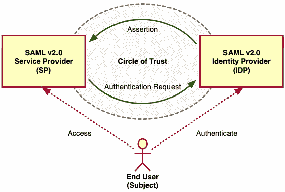
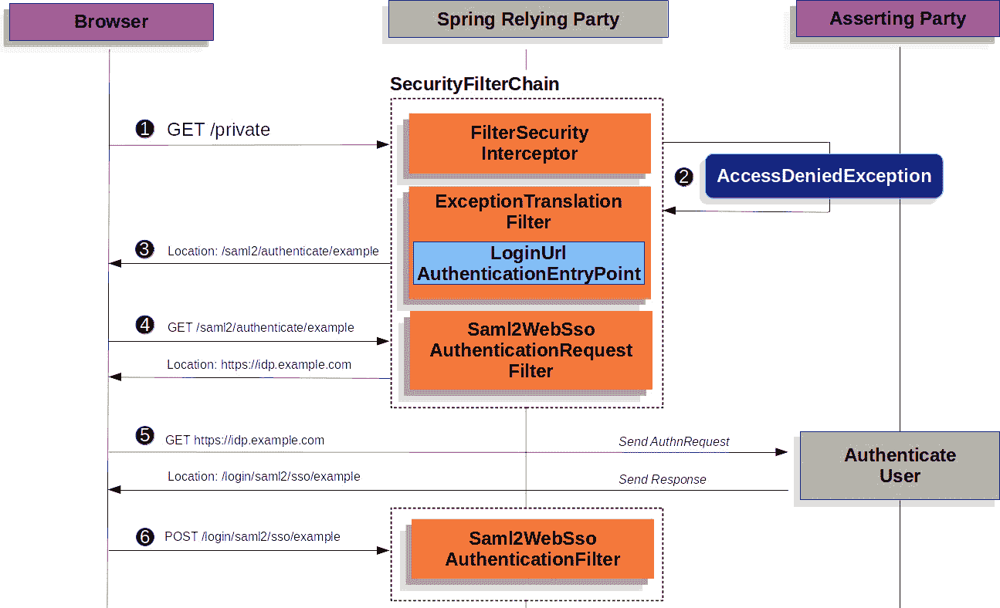
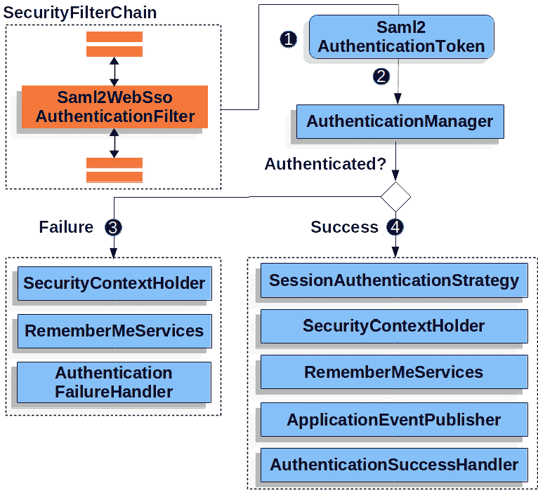
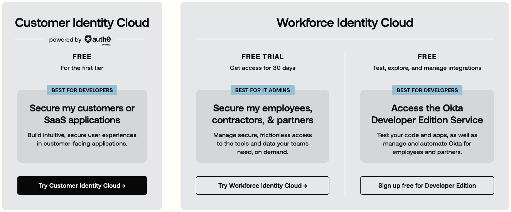
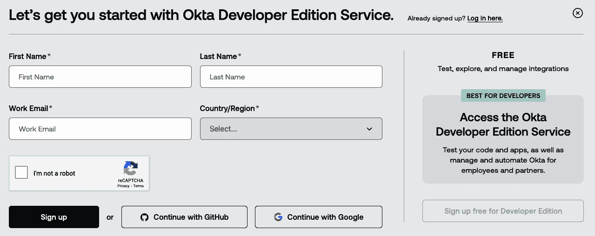
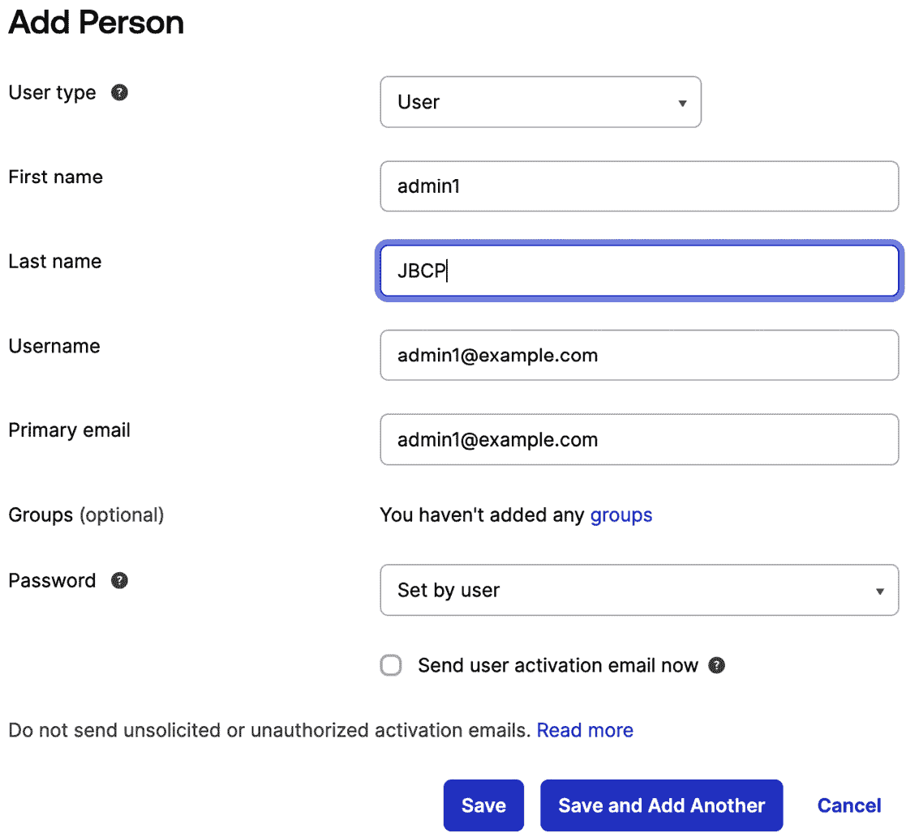
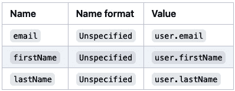
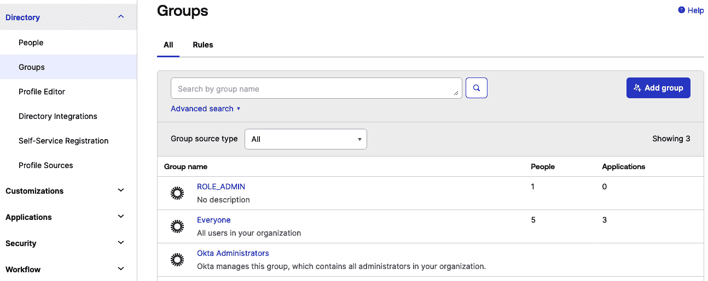
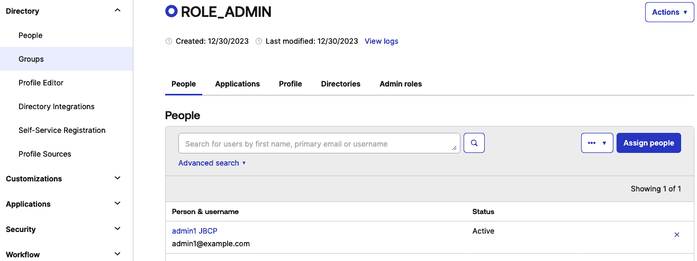
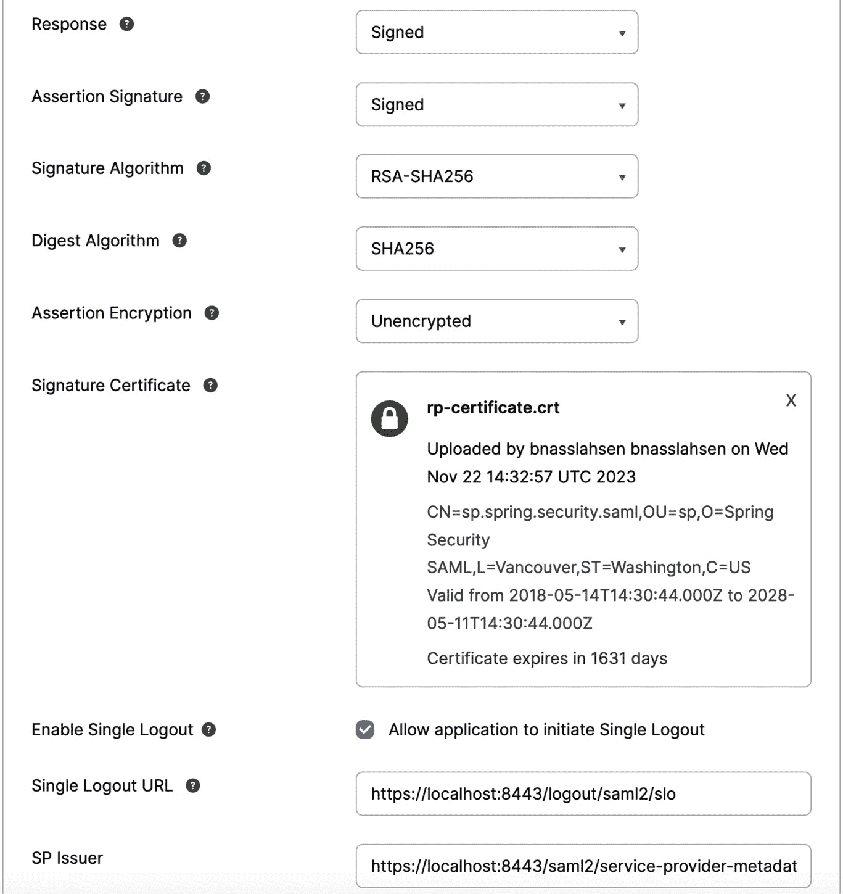

# 10

# SAML 2 支持

SAML 主要用作基于网络的认证机制，依赖于浏览器代理来促进认证过程。从广义上讲，SAML 的认证流程可以概述如下。

Spring Security 提供了全面的 SAML 2 支持。本节讨论了如何将 SAML 2 集成到基于 Servlet 的应用程序中。

从 2009 年开始，作为扩展项目的一部分，已经提供了对依赖方的支持。到 2019 年，开始努力将这项支持集成到 Spring Security 的核心中。这反映了 2017 年启动的将 Spring Security 的 OAuth 2.0 支持纳入其中的类似过程。

本章将探讨以下主题：

+   SAML 协议的基本方面

+   使用 Spring Security 建立您的 SAML 2 登录

+   获取 SAML 2 认证主体

+   解析和生成 SAML 2.0 元数据

+   使用 Spring Security SAML 定制权限

+   执行单点登出

本章的代码示例链接在此：[`packt.link/7qRvM`](https://packt.link/7qRvM)。

# 什么是 SAML？

**安全断言标记语言**（**SAML**）是一个基于 XML 的广泛采用的开放标准，专门用于在联合组织之间安全交换**认证和授权**（**AA**）信息。它用于简化基于浏览器的**单点登录**（**SSO**）功能。

SAML 2.0 于 2005 年作为 OASIS 标准建立，并由**结构化信息标准推进组织**（**OASIS**）持续维护，它结合了 SAML 1.1、**Liberty Alliance Identity Federation Framework**（**ID-FF**）1.2 和 Shibboleth 1.3 的元素。

在 SAML 2.0 规范中，三个关键实体承担不同的角色：主体、服务提供者和身份提供者。

以 Sally 访问 ucanbeamillionaire.com 上的投资账户为例。为了让她登录并访问她的账户，该网站使用 SAML 进行认证。

SAML 2.0 已被广泛采用并在各种场景中使用，例如企业应用、云服务和基于网络的认证系统，以建立一个安全和互操作的框架，用于身份和访问管理。

SAML 2.0 的关键组件和概念包括：

+   **服务提供者**（**SP**）是提供服务的实体，通常以应用程序的形式存在。

+   **身份提供者**（**IdP**）是提供身份的实体，包括验证用户的能力。通常，IdP 还包含用户资料，其中包含额外的信息，如名字、姓氏、工作代码、电话号码、地址等。SP 对用户数据的需求可能有所不同，从基本资料（用户名、电子邮件）到更全面的资料集（工作代码、部门、地址、位置、经理等），具体取决于应用程序。

+   **SAML 请求**，也称为身份验证请求，由 SP 启动，以正式请求身份验证。

+   IdP 生成一个**SAML 响应**，其中包含已认证用户的实际断言。此外，SAML 响应可能包含额外信息，例如用户配置文件细节和组/角色信息，这些信息基于 SP 支持的功能。

+   **由 SP 启动的**登录是指由 SP 启动的 SAML 登录流程。这通常发生在最终用户尝试访问资源或直接在 SP 端登录时，例如当浏览器试图访问 SP 平台上的受保护资源时。

+   **由 IdP 启动的**登录是指由 IdP 启动的 SAML 登录流程。在这种情况下，SAML 流程不是由 SP 的重定向触发的，而是 IdP 启动一个重定向到 SP 的 SAML 响应，以验证用户的身份。



图 10.1 – 探索 SAML 协议

这里有一些关键点需要考虑：

+   SP 与 IdP 之间的直接交互从未发生。所有交互都通过浏览器进行，浏览器作为所有重定向的中介。

+   在获取用户信息之前，SP 必须知道要重定向到的 IdP。

+   SP 在收到 IdP 的 SAML 断言之前，不知道用户的身份。

+   此流程的启动不仅限于 SP；IdP 也可以启动一个身份验证流程。

+   SAML 身份验证流程是异步的。SP 不确定 IdP 是否会完成整个流程。因此，SP 不会保留与身份验证请求相关的任何状态。当 SP 从 IdP 收到响应时，它必须包含所有必要的信息。

在介绍了 SAML 协议之后，我们将深入探讨 Spring Security 上下文中 SAML 2.0 登录的功能。

# SAML 2.0 使用 Spring Security 登录

SAML 2.0 登录功能使应用程序能够作为 SAML 2.0 依赖方运行。这使用户能够使用他们现有的 SAML 2.0 断言方（如 ADFS、Okta 和其他 IdP）的账户登录到应用程序。

重要提示

SAML 2.0 登录的实现使用了**Web 浏览器单点登录（SSO）配置文件**，如 SAML 2 配置文件规范所述：[`groups.oasis-open.org/higherlogic/ws/public/document?document_id=35389#page=15`](https://groups.oasis-open.org/higherlogic/ws/public/document?document_id=35389#page=15)。

要开始探索 Spring Security 上下文中的 SAML 2.0 依赖方身份验证，我们观察到 Spring Security 引导用户到第三方进行身份验证。这是通过一系列重定向来实现的：



图 10.2 – 重定向到断言方身份验证

让我们深入了解这个 SAML 重定向序列：

1.  初始时，用户在没有适当授权的情况下向 `/private` 资源提交未认证的请求。

1.  Spring Security 的 `AuthorizationFilter` 通过抛出 `AccessDeniedException` 来指示未认证请求的拒绝。

1.  由于缺乏授权，`ExceptionTranslationFilter` 触发认证的开始。配置的 `AuthenticationEntryPoint` 是 `LoginUrlAuthenticationEntryPoint` 的一个实例，它将重定向到由 `Saml2WebSsoAuthenticationRequestFilter` 管理的生成 `<saml2:AuthnRequest>` 的端点。如果配置了多个断言方，它可能首先重定向到一个选择页面。

1.  随后，`Saml2WebSsoAuthenticationRequestFilter` 使用其配置的 `Saml2AuthenticationRequestFactory` 生成、签名、序列化和编码一个 `<saml2:AuthnRequest>`。

1.  浏览器随后将 `<saml2:AuthnRequest>` 提交给断言方，启动用户认证过程。在认证成功后，断言方将 `<saml2:Response>` 返回给浏览器。

1.  浏览器继续将 `<saml2:Response>` 通过 `POST` 方式发送到断言消费者服务端点。

    以下图表说明了 Spring Security 中 `<saml2:Response>` 的认证过程：



图 10.3 – 认证 <saml2:Response>

我们可以将交互总结如下：

1.  当浏览器向应用程序提交 `<saml2:Response>` 时，该过程由 `Saml2WebSsoAuthenticationFilter` 处理。此过滤器使用其配置的 `AuthenticationConverter` 通过从 `HttpServletRequest` 中提取响应来生成 `Saml2AuthenticationToken`。此外，转换器解析 `RelyingPartyRegistration` 并将其提供给 `Saml2AuthenticationToken`。

1.  随后，过滤器将令牌传递给其配置的 `AuthenticationManager`，默认为 `OpenSamlAuthenticationProvider`。

1.  在认证失败的情况下：

    +   `SecurityContextHolder` 被清除。

    +   `AuthenticationEntryPoint` 被调用以重新启动认证过程。

1.  如果认证成功：

    +   `Authentication` 被设置在 `SecurityContextHolder` 中。

    +   `Saml2WebSsoAuthenticationFilter` 调用 `FilterChain#doFilter(request, response)` 以继续剩余的应用程序逻辑。

在引入 SAML 2.0 与 Spring Security 登录之后，我们将通过 OKTA 探索一个实际的 SAML 示例。

## 在 OKTA 上添加 SAML 应用程序

要开始，你需要一个 OKTA 开发者账户。

1.  首先，访问 OKTA 开发者网站：[`developer.okta.com/signup`](https://developer.okta.com/signup)。你将看到以下选项来创建账户：



图 10.4 – OKTA 开发者门户

1.  选择 **访问 Okta 开发者版服务**，然后创建您的开发者账户。



图 10.5 – OKTA 开发者账户创建

1.  第二步是使用您的账户登录，然后转到 **应用程序** | **创建** **应用集成**。

1.  选择 **SAML 2.0** 并点击 **下一步**。

1.  给您的应用程序起一个名字，例如 `JBCP 日历 SAML` 并点击 **下一步**。

1.  使用以下配置：

    +   单点登录 URL：`https://localhost:8443/login/saml2/sso/okta`

    +   对于接收器 URL 和目标 URL：（默认）

    +   对于受众 URI：`https://localhost:8443/saml2/service-provider-metadata/okta`

1.  之后点击 **下一步**。选择以下选项：**我是一个 Okta 客户，添加内部应用程序** 和 **这是一个我们** **创建的内部应用程序**。

1.  选择 **完成**。

1.  OKTA 将创建您的应用程序。

1.  前往 **SAML 签名证书** 并选择 **SHA-2** | **操作** | **查看 IdP 元数据**。您可以 **右键单击** 并复制此菜单项的链接或打开其 URL。

1.  将生成的链接复制到您的剪贴板。它看起来可能如下所示：`https://dev-xxxxx.okta.com/app/<随机字符>/sso/saml/metadata`。

1.  前往您应用程序的 **分配** 选项卡并将访问权限分配给 **所有人** 组。

## 在 OKTA 中创建用户主体

让我们先在 OKTA 中创建一个用户主体。

1.  登录 OKTA 并进入 OKTA 管理员控制台。

1.  导航到 **用户** 页面。

1.  登录后，导航到 **管理员** 部分。

1.  从菜单中选择 **目录**。然后选择 **人员** 子菜单。

1.  点击 **添加人员** 按钮或类似按钮。

1.  填写用户详细信息：提供新用户所需的信息，例如姓名、姓氏、电子邮件地址和任何其他必填字段。您还可以设置用户名并分配角色或组给用户。



图 10.6 – 使用 OKTA 添加用户

## 其他必需的依赖项

如果您正在使用 OAuth 2 功能，我们将在您的 `build.gradle` 文件中包含以下附加依赖项：

```java
//build.gradle
dependencies {
...
    constraints {
        implementation "org.opensaml:opensaml-core:4.2.0"
        implementation "org.opensaml:opensaml-saml-api:4.2.0"
        implementation "org.opensaml:opensaml-saml-impl:4.2.0"
    }
    implementation 'org.springframework.security:spring-security-saml2-service-provider'
...
```

## 指定 IdP 元数据

在 Spring Boot 应用程序中，通过创建以下类似的设置来配置 IdP 的元数据：

```java
spring:
  security:
    saml2:
      relyingparty:
        registration:
          okta:
            assertingparty:
              metadata-uri: https://dev-xxxxx.okta.com/app/ <random-characters>/sso/saml/metadata
```

重要提示

您的代码现在应该看起来像 `chapter10.01-calendar` 中的那样。

## 获取 SAML 2 认证主体

一旦为特定的断言方正确配置了依赖方，它就准备好接收断言。在依赖方验证断言后，结果是一个包含 `Saml2AuthenticatedPrincipal` 的 `Saml2Authentication`。因此，您可以通过 `SpringSecurityUserContext` 访问主体，如下所示：

```java
//src/main/java/com/packtpub/springsecurity/service/ SpringSecurityUserContext.java
@Component
public class SpringSecurityUserContext implements UserContext {
    private static final Logger logger = LoggerFactory
          .getLogger(SpringSecurityUserContext.class);
    private final CalendarService calendarService;
    public SpringSecurityUserContext(final CalendarService calendarService) {
       if (calendarService == null) {
          throw new IllegalArgumentException("calendarService cannot be null");
       }
       this.calendarService = calendarService;
    }
    @Override
    public CalendarUser getCurrentUser() {
       SecurityContext context = SecurityContextHolder.getContext();
       Authentication authentication = context.getAuthentication();
       if (authentication == null) {
          return null;
       }
       if(authentication.getPrincipal() instanceof DefaultSaml2AuthenticatedPrincipal saml2AuthenticatedPrincipal ) {
          String email = saml2AuthenticatedPrincipal.getName();
          CalendarUser result = calendarService.findUserByEmail(email);
          if (result == null) {
             throw new IllegalStateException(
                   "Spring Security is not in synch with CalendarUsers. Could not find user with email " + email);
          }
          logger.info("CalendarUser: {}", result);
          return result;
       }
       return null;
    }
}
```

重要提示

您的代码现在应该看起来像 `chapter10.02-calendar` 中的那样。

Spring Security 可以解析断言方元数据以生成 `AssertingPartyDetails` 实例，并从 `RelyingPartyRegistration` 实例发布依赖方元数据。

## 解析 SAML 2 元数据

通过利用 `RelyingPartyRegistrations`，可以解析断言方的元数据。如果你使用 OpenSAML 供应商支持，结果 `AssertingPartyDetails` 将以 `OpenSamlAssertingPartyDetails` 的形式存在。因此，你可以通过以下步骤访问底层的 OpenSAML XMLObject：

```java
OpenSamlAssertingPartyDetails details = (OpenSamlAssertingPartyDetails)
       registration.getAssertingPartyDetails();
EntityDescriptor openSamlEntityDescriptor = details.getEntityDescriptor();
```

## 生成 SAML 2 元数据

你可以使用 `saml2Metadata` DSL 方法公开元数据端点，如下所示：

```java
http
       // ...
       .saml2Login(withDefaults())
       .saml2Metadata(withDefaults());
```

利用元数据端点将依赖方注册到断言方。这通常涉及识别适当的表单字段以提供元数据端点。

默认元数据端点是 `/saml2/metadata`。它还响应于 `/saml2/metadata/{registrationId}` 和 `/saml2/service-provider-metadata/{registrationId}`。

你可以通过在 DSL 中调用 `metadataUrl` 方法来适配它：

```java
.saml2Metadata((saml2) -> saml2.metadataUrl("/saml/metadata"))
```

## 适配 RelyingPartyRegistration 查找

要配置自己的 `Saml2MetadataResponseResolver`，你应该使用以下描述的 `RelyingPartyRegistration`：

```java
@Bean
Saml2MetadataResponseResolver metadataResponseResolver(RelyingPartyRegistrationRepository registrations) {
    RequestMatcherMetadataResponseResolver metadata = new RequestMatcherMetadataResponseResolver(
          (id) -> registrations.findByRegistrationId("relying-party"), new OpenSamlMetadataResolver());
    metadata.setMetadataFilename("metadata.xml");
    return metadata;
}
```

现在我们已经探讨了使用 Spring Security 的 SAML 2.0 登录功能，我们将继续使用自定义的 SAML Spring Boot 自动配置。

# 覆盖 SAML Spring Boot 自动配置

Spring Boot 为依赖方生成两个 `@Bean` 对象。

第一个是配置应用程序作为依赖方的 `SecurityFilterChain`。当包含 `spring-security-saml2-service-provider` 时，`SecurityFilterChain` 看起来如下：

你会注意到每个经过身份验证的用户默认都有一个 `ROLE_USER` 角色。

```java
//src/main/java/com/packtpub/springsecurity/service/ SecurityConfig.java
@Configuration
@EnableWebSecurity
public class SecurityConfig {
    @Bean
    public SecurityFilterChain filterChain(HttpSecurity http) throws Exception {
       http.authorizeHttpRequests( authz -> authz
                   .requestMatchers("/webjars/**").permitAll()
                   .requestMatchers("/css/**").permitAll()
                   .requestMatchers("/favicon.ico").permitAll()
                   // H2 console:
                   .requestMatchers("/admin/h2/**").fullyAuthenticated()
                   .requestMatchers("/").permitAll()
                   .requestMatchers("/login/*").permitAll()
                   .requestMatchers("/logout").permitAll()
                   .requestMatchers("/signup/*").permitAll()
                   .requestMatchers("/errors/**").permitAll()
                   .requestMatchers("/events/").hasRole("ADMIN")
                   .requestMatchers("/**").hasRole("USER"))
             .exceptionHandling(exceptions -> exceptions
                   .accessDeniedPage("/errors/403"))
             .logout(form -> form
                   .logoutUrl("/logout")
                   .logoutSuccessUrl("/")
                   .permitAll())
             // CSRF is enabled by default, with Java Config
             .csrf(AbstractHttpConfigurer::disable);
       // @formatter:off
       http
             .saml2Login(withDefaults());
       // For H2 Console
       http.headers(headers -> headers.frameOptions(FrameOptionsConfig::disable));
       return http.build();
    }
...ommited for breviy
}
```

要测试应用程序，请打开网页浏览器并导航到：`https://localhost:8443`。

接下来，转到 `/events` 页面。你应该会得到一个 **访问** **被拒绝** 错误。

重要提示

你的代码现在应该看起来像 `chapter10.03-calendar` 中的那样。

## 创建自定义 RelyingPartyRegistrationRepository

Spring Boot 创建了一个 `RelyingPartyRegistrationRepository`，它代表断言方和依赖方元数据。这包括诸如依赖方在请求断言方进行身份验证时应使用的 SSO 端点位置等信息。

你可以通过发布自己的 `RelyingPartyRegistrationRepository` bean 来覆盖默认设置。你也可以通过编程方式删除现有的 `spring.security.saml2.relyingparty.registration` 配置属性。

例如，你可以通过访问其元数据端点来查找断言方的配置：

```java
//src/main/java/com/packtpub/springsecurity/service/ SecurityConfig.java
@Value("${metadata.location}")
private String assertingPartyMetadataLocation;
@Bean
public RelyingPartyRegistrationRepository relyingPartyRegistrations() {
    RelyingPartyRegistration registration = RelyingPartyRegistrations
          .fromMetadataLocation(assertingPartyMetadataLocation)
          .registrationId("okta")
          .build();
    return new InMemoryRelyingPartyRegistrationRepository(registration);
}
```

或者，你可以直接通过 DSL 连接仓库，这也会覆盖自动配置的 `SecurityFilterChain`：

```java
//src/main/java/com/packtpub/springsecurity/service/ SecurityConfig.java
@Configuration
@EnableWebSecurity
public class SecurityConfig {
    @Bean
    public SecurityFilterChain filterChain(HttpSecurity http) throws Exception {
... omitted for brevity
       http
             .saml2Login(saml2 -> saml2
                   .relyingPartyRegistrationRepository(relyingPartyRegistrations())
             );
       return http.build();
    }
}
```

重要提示

`registrationId` 是用户定义的值，用于区分不同的注册。

你的代码现在应该看起来像 `chapter10.04-calendar` 中的那样。

## 使用 Spring Security SAML 创建自定义权限

登录后，你可能观察到显示的页面指示一个 `ROLE_USER` 权限。

尽管最初授予所有用户访问权限，但您可以配置您的 **SAML** 应用程序以将用户的组作为属性传输。此外，您还可以选择包括其他属性，如姓名和电子邮件。

1.  首先选择编辑您的 OKTA 应用程序 SAML 设置部分。

1.  完成组属性声明部分。

    +   名称：`groups`

    +   过滤器：`Matches regex` 并使用 `.*` 作为值

    +   名称格式：`Unspecified`

1.  您可以添加其他属性。例如：



图 10.7 – OKTA 中的附加自定义用户属性

1.  前往 `ROLE_ADMIN`。



图 10.8 – 在 OKTA 中定义自定义组

1.  然后将用户 `admin1@example.com` 分配到该组。



图 10.9 – 在 OKTA 中分配用户到组

1.  修改 `SecurityConfig.java` 类以覆盖默认配置。然后，使用转换器将 `groups` 属性中的值映射到 Spring Security 权限。

```java
//src/main/java/com/packtpub/springsecurity/service/ SecurityConfig.java
@Configuration
@EnableWebSecurity
public class SecurityConfig {
    @Bean
    public SecurityFilterChain filterChain(HttpSecurity http) throws Exception {
       http.authorizeRequests( authz -> authz
         ... omitted for brevity
                   .requestMatchers(antMatcher("/errors/**")).permitAll()
                   .requestMatchers(antMatcher("/events/")).hasRole("ADMIN")
                   .requestMatchers(antMatcher("/**")).hasAuthority("Everyone"))
             .exceptionHandling(exceptions -> exceptions
                   .accessDeniedPage("/errors/403"))
             .logout(form -> form
                   .logoutUrl("/logout")
                  .logoutSuccessUrl("/")
                   .permitAll())
             .csrf(AbstractHttpConfigurer::disable);
       OpenSaml4AuthenticationProvider authenticationProvider = new OpenSaml4AuthenticationProvider();
       authenticationProvider.setResponseAuthenticationConverter(groupsConverter());
       // @formatter:off
       http
             .saml2Login(saml2 -> saml2
                   .authenticationManager(new ProviderManager(authenticationProvider)))
             .saml2Logout(withDefaults());
       // For H2 Console
       http.headers(headers -> headers.frameOptions(FrameOptionsConfig::disable));
       return http.build();
    }
    private Converter<OpenSaml4AuthenticationProvider.ResponseToken, Saml2Authentication> groupsConverter() {
       Converter<ResponseToken, Saml2Authentication> delegate =
             OpenSaml4AuthenticationProvider.createDefaultResponseAuthenticationConverter();
       return (responseToken) -> {
          Saml2Authentication authentication = delegate.convert(responseToken);
          Saml2AuthenticatedPrincipal principal = (Saml2AuthenticatedPrincipal) authentication.getPrincipal();
          List<String> groups = principal.getAttribute("groups");
          Set<GrantedAuthority> authorities = new HashSet<>();
          if (groups != null) {
             groups.stream().map(SimpleGrantedAuthority::new).forEach(authorities::add);
          } else {
             authorities.addAll(authentication.getAuthorities());
          }
          return new Saml2Authentication(principal, authentication.getSaml2Response(), authorities);
       };
    }
}
```

1.  现在，您应该能看到您的用户组作为权限。这来自与认证用户相关的 OKTA SAML 上下文。

    您会注意到，通过这些更改，您现在可以访问 `admin1@example.com`。

重要提示

您的代码现在应该看起来像 `chapter10.05` 中的那样。

# 执行单点登出

Spring Security 的 SAML 支持包括一个需要一些配置的登出功能。

您可以使用 `OpenSSL` 创建私钥和证书。确保在过程中至少提供一个问题的值，设置应该会成功。

```java
openssl req -newkey rsa:2048 -nodes -keyout rp-private.key -x509 -days 365 -out rp-certificate.crt
```

将生成的文件复制到您的应用程序的 `src/main/resources/credentials` 目录。

在 `application.yml` 中配置，生成的密钥、证书位置和 IdP 的登出配置类似于以下内容：

```java
spring:
  security:
    saml2:
      relyingparty:
        registration:
          okta:
            signing:
              credentials:
                - private-key-location: classpath:credentials/rp-private.key
                  certificate-location: classpath:credentials/rp-certificate.crt
            assertingparty:
              metadata-uri: https://dev-xxxxx.okta.com/app/ <random-characters>/sso/saml/metadata
            singlelogout:
              binding: POST
              url: "{baseUrl}/logout/saml2/slo"
```

在 OKTA 配置页面上：

1.  打开 OKTA 管理控制台。

1.  选择 **应用程序** | **应用程序**。

1.  前往 `https://localhost:8443/logout/saml2/slo`。

1.  设置 `https://localhost:8443/saml2/service-provider-metadata/okta`。

1.  点击您在之前步骤中创建的 `local.crt` 文件，然后点击 **上传证书**。

+   点击 **下一步**。

图 10.10 – 与 OKTA 的单点登出配置

1.  点击 **完成**。

1.  重新启动 Spring Boot 应用程序。您现在也可以从 OKTA 登出。

重要提示

由于 SAML 2.0 规范允许每个属性有多个值，您可以选择使用 `getAttribute` 来检索属性列表，或者使用 `getFirstAttribute` 来获取列表中的第一个值。当已知只有一个值时，`getFirstAttribute` 方法特别有用。

您的代码现在应该看起来像 `chapter10.06-calendar` 中的那样。

# 摘要

本章深入探讨了**SAML**领域，这是现代身份管理中实现 SSO 的强大标准。从介绍 SAML 的基础原则开始，它逐步过渡到实际实施，引导开发者在 Spring Security 框架中无缝集成**SAML 2**登录。

关键亮点包括在广泛使用的 IdP OKTA 上添加**SAML**应用程序的实用步骤，以及在 OKTA 中创建用户主体以简化用户管理。概述了成功**SAML**集成所必需的关键依赖项，强调了构建弹性认证系统所需的关键工具和库。

您已经了解了关键配置步骤的见解，例如指定 IdP 元数据以确保标准化和安全的通信通道。本章探讨了检索**SAML 2**认证主体和解析**SAML 2**元数据，以及生成**SAML 2**元数据，从而全面理解涉及的技术复杂性。

在`RelyingPartyRegistration`中具有灵活性，可以通过覆盖`RelyingPartyRegistrationRepository`进行高级定制。本章提供了在 Spring Security SAML 中自定义权限的实用指南，以实现用户角色的有效管理。

本章通过解决单点登出的关键方面结束，展示了 SAML 如何支持跨各种服务的标准化用户登出机制。本质上，本章为您提供了实施基于 SAML 的认证所需的知识和实践见解，有助于在您的应用程序中实现安全且无缝的身份管理体验。

在下一章中，我们将学习更多关于 Spring Security 授权的内容。

# 第四部分：增强授权机制

本部分深入探讨了细粒度访问控制，探讨了实现精确授权的各种方法，这可能影响应用程序页面的特定部分。最初，我们检查了两种实现细粒度授权的方法。随后，我们探讨了 Spring Security 通过方法注解来保护业务层的方法，利用基于接口的代理来实现**面向切面编程**（**AOP**）。此外，我们还研究了基于注解的安全在数据集合基于角色过滤方面的能力。最后，我们比较了基于类的代理与基于接口的代理。

在本节中，我们深入探讨了复杂的主题——**访问控制列表**（**ACLs**），提供了它们在域对象实例级授权方面的潜力概述。Spring Security 提供了一个强大但复杂的 ACL 模块，有效地满足了从小型到中型实施的需求。

此外，我们还承担了为 Spring Security 的核心授权 API 定制实现的任务。这种动手实践的方法有助于更深入地理解 Spring Security 的授权架构。

本部分包含以下章节：

+   *第十一章*, *细粒度访问控制*

+   *第十二章*, *访问控制列表*

+   *第十三章*, *自定义授权*
