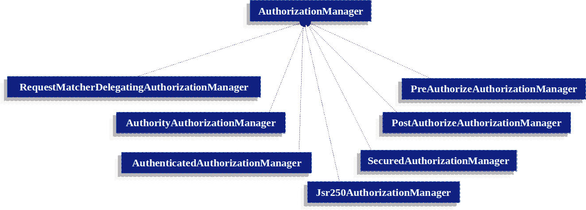
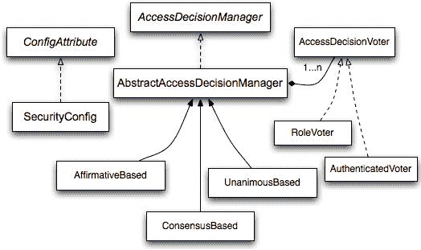
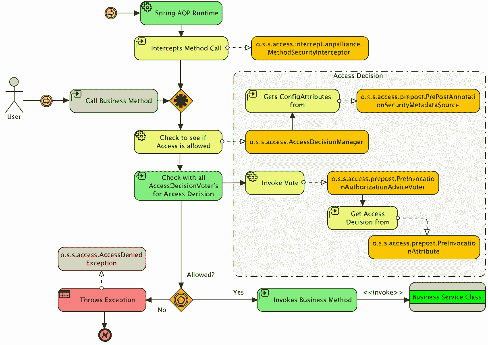
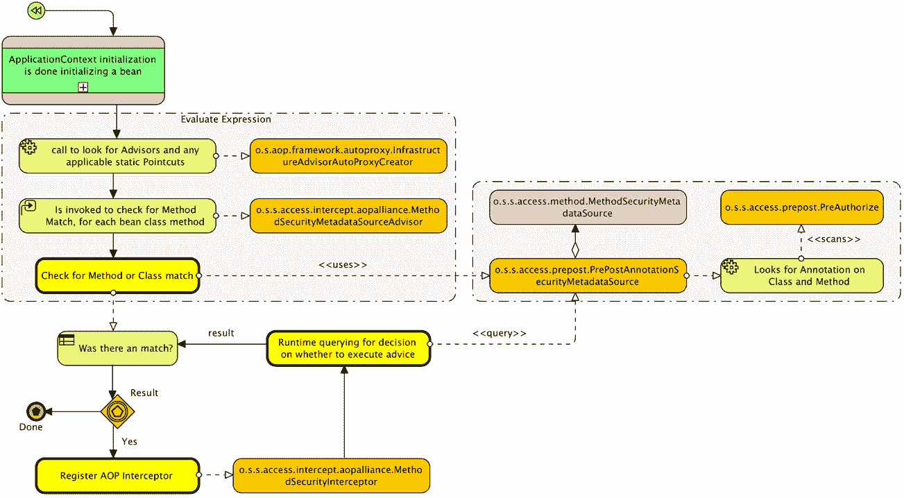

# 第十三章：自定义授权

在本章中，我们将为 `Spring Security` 的关键授权 API 编写一些自定义实现。一旦我们完成这项工作，我们将利用我们对自定义实现的理解来了解 `Spring Security` 的授权架构是如何工作的。

在本章中，我们将涵盖以下主题：

+   理解授权是如何工作的

+   编写一个基于数据库而不是 `requestMatchers()` 方法的自定义 `SecurityMetaDataSource`

+   创建自定义的 **Spring 表达式语言**（**SpEL**）表达式

+   实现一个自定义的 `PermissionEvaluator` 对象，以便封装我们的权限

+   声明一个自定义的 `AuthorizationManager`

本章代码示例链接在此：[`packt.link/e630f`](https://packt.link/e630f)。

# 授权请求

就像在认证过程中一样，`Spring Security` 提供了一个 `o.s.s.web.access.intercept.FilterSecurityInterceptor` Servlet 过滤器，该过滤器负责决定是否接受或拒绝特定的请求。当过滤器被调用时，主体已经经过认证，因此系统知道一个有效的用户已经登录；记住我们在 *第三章*，*自定义认证* 中实现了 `List<GrantedAuthority>` 的 `getAuthorities()` 方法，该方法返回主体的权限列表。一般来说，授权过程将使用此方法（由 `Authentication` 接口定义）的信息来确定，对于特定的请求，是否允许请求。

此方法作为 `AuthorizationManager` 实例获取 `GrantedAuthority` 精确字符串表示的一种方式。通过提供字符串表示，大多数 `AuthorizationManager` 实现可以轻松地 `读取` `GrantedAuthority`。如果 `GrantedAuthority` 不能准确地表示为字符串，则被视为 `复杂`，并且 `getAuthority()` 方法必须返回 `null`。

一个复杂的 `GrantedAuthority` 的主要例子是存储与各种客户账户号码相关的操作和权限阈值的实现。试图将这个复杂的 `GrantedAuthority` 表示为字符串将带来相当大的挑战。因此，`getAuthority()` 方法应该返回 `null`。这向任何 `AuthorizationManager` 发出信号，它需要支持特定的 `GrantedAuthority` 实现来理解其内容。

`Spring Security` 具有一个名为 `SimpleGrantedAuthority` 的具体 `GrantedAuthority` 实现名。此实现允许将任何用户指定的字符串转换为 `GrantedAuthority`。所有集成到安全架构中的 `AuthenticationProvider` 实例都使用 `SimpleGrantedAuthority` 来填充 `Authentication` 对象。

默认情况下，基于角色的授权规则涉及前缀 `ROLE_`。因此，如果授权规则要求安全上下文具有 `USER` 角色，`Spring Security` 将自动寻找返回 `ROLE_USER` 的 `GrantedAuthority#getAuthority`。

记住，授权是一个二元决策——用户要么可以访问受保护资源，要么不能。在授权方面没有歧义。

在 `Spring Security` 框架中，智能面向对象设计无处不在，授权决策管理也不例外。

在 `Spring Security` 中，`o.s.s.access.AccessDecisionManager` 接口定义了两个简单且逻辑上合理的函数，这些函数合理地融入了请求处理决策流程中，具体如下：

+   `supports`：这个逻辑操作实际上包含两个方法，允许 `AccessDecisionManager` 实现报告它是否支持当前请求。

+   `decide`：此方法允许 `AccessDecisionManager` 实现根据请求上下文和安全配置验证是否允许访问并接受请求。实际上，`Decide` 方法没有返回值，而是通过抛出异常来报告请求被拒绝。

特定的异常类型可以进一步指导应用程序采取哪些行动来解决授权决策。`o.s.s.access.AccessDeniedException` 接口是在授权领域中最常见的异常，并且值得过滤器链进行特殊处理。

`AccessDecisionManager` 的实现完全可以通过标准的 Spring Bean 绑定和引用进行配置。默认的 `AccessDecisionManager` 实现提供了一个基于 `AccessDecisionVoter` 和投票聚合的访问授权机制。

投票者是在授权序列中的参与者，其任务是评估以下任何一项或所有内容：

+   受保护资源的请求上下文（例如，请求 IP 地址的 URL）

+   用户提供的凭证（如果有）

+   被访问的安全资源

+   系统的配置参数以及资源本身

在演示了请求授权的过程之后，我们将深入探讨调用管理。

# 调用处理

`Spring Security` 提供了拦截器，负责管理对安全对象的访问，无论是方法调用还是网络请求。`AuthorizationManager` 实例在做出调用前的决策中起着至关重要的作用，决定调用是否被允许继续进行。此外，这些实例还参与调用后的决策，确定是否可以返回特定的值。

## `AuthorizationManager` 类

`AuthorizationManager` 优先于 `AccessDecisionManager` 和 `AccessDecisionVoter`。建议自定义 `AccessDecisionManager` 或 `AccessDecisionVoter` 的应用程序使用 `AuthorizationManager` 进行过渡。

`Spring Security` 的基于请求、方法和消息的授权组件调用 `AuthorizationManager` 实例，将做出最终访问控制决策的责任分配给它们。

`AuthorizationManager` 的 `check` 方法接收做出授权决策所需的所有相关信息。具体来说，传递安全对象允许检查安全对象实际调用中的参数。例如，如果安全对象是一个 `MethodInvocation`，查询它以获取任何客户端参数变得简单。随后，可以在 `AuthorizationManager` 中实现安全逻辑，以确保主体有权操作该客户。预期实现将在授予访问权限时返回正面的 `AuthorizationDecision`，在拒绝访问时返回负面的 `AuthorizationDecision`，在放弃做出决策时返回 null `AuthorizationDecision`。

verify 函数在达到负面的 `AuthorizationDecision` 时调用 `check` 并抛出 `AccessDeniedException`。

## 基于 Delegating 的 AuthorizationManager 实现

尽管用户有灵活性来实现自己的 `AuthorizationManager` 以管理授权的所有方面，但 `Spring Security` 提供了一个委托的 `AuthorizationManager`，旨在与单个 `AuthorizationManager` 协同工作。

`RequestMatcherDelegatingAuthorizationManager` 将请求与最合适的委托 `AuthorizationManager` 对齐。对于方法安全，可以使用 `AuthorizationManagerBeforeMethodInterceptor` 和 `AuthorizationManagerAfterMethodInterceptor`。

对于 `AuthorizationManager` 实现的相关类，在 *图 13.1* 中进行了概述供参考。1*：



图 13.1 – AuthorizationManager 的实现

采用这种方法，可以咨询一组 `AuthorizationManager` 实现来做出授权决策。

在接下来的小节中，我们将更深入地探讨一些授权管理器。

### AuthorityAuthorizationManager

`Spring Security` 提供的主要 `AuthorizationManager` 是 `AuthorityAuthorizationManager`。它配置了特定的一组权限，用于在当前的 `Authentication` 中进行检查。如果 `Authentication` 包含任何配置的权限，它将产生一个正面的 `AuthorizationDecision`；否则，将导致一个负面的 `AuthorizationDecision`。

### AuthenticatedAuthorizationManager

另一个可用的管理器是`AuthenticatedAuthorizationManager`。它在区分*匿名*、*完全认证*和*记住我*认证用户方面非常有用。一些网站在*记住我*认证下提供有限的访问权限，但需要用户通过登录来确认身份以获得完全访问权限。

### `AuthorizationManagers`

`AuthorizationManagers`还提供了将单个`AuthorizationManagers`组合成更复杂表达式的有用静态工厂。

### 自定义`AuthorizationManagers`

当然，你可以选择实现自定义的`AuthorizationManager`，以便包含几乎任何访问控制逻辑。它可以针对你的应用程序定制，与业务逻辑相关，或涉及安全管理逻辑。例如，你可以创建一个能够查询 Open Policy Agent 或你自己的授权数据库的实现。

在深入研究调用管理之后，我们将继续探讨`AccessDecisionManager`和`AccessDecisionVoter`的定制化。

# 修改`AccessDecisionManager`和`AccessDecisionVoter`

在`AuthorizationManager`引入之前，`Spring Security`引入了`AccessDecisionManager`和`AccessDecisionVoter`。

在某些场景下，例如在迁移旧应用程序时，可能更倾向于使用调用`AccessDecisionManager`或`AccessDecisionVoter`的`AuthorizationManager`。

要调用现有的`AccessDecisionManager`，你可以使用：

```java
@Component
public class AccessDecisionManagerAuthorizationManagerAdapter implements AuthorizationManager {
    private final AccessDecisionManager accessDecisionManager;
    private final SecurityMetadataSource securityMetadataSource;
    @Override
    public AuthorizationDecision check(Supplier<Authentication> authentication, Object object) {
       try {
          Collection<ConfigAttribute> attributes = this.securityMetadataSource.getAttributes(object);
          this.accessDecisionManager.decide(authentication.get(), object, attributes);
          return new AuthorizationDecision(true);
       } catch (AccessDeniedException ex) {
          return new AuthorizationDecision(false);
       }
    }
    @Override
    public void verify(Supplier<Authentication> authentication, Object object) {
       Collection<ConfigAttribute> attributes = this.securityMetadataSource.getAttributes(object);
       this.accessDecisionManager.decide(authentication.get(), object, attributes);
    }
}
```

然后，将其集成到你的`SecurityFilterChain`中。

或者，如果你只想调用`AccessDecisionVoter`，你可以使用：

```java
@Component
public class AccessDecisionVoterAuthorizationManagerAdapter implements AuthorizationManager {
    private final AccessDecisionVoter accessDecisionVoter;
    private final SecurityMetadataSource securityMetadataSource;
    @Override
    public AuthorizationDecision check(Supplier<Authentication> authentication, Object object) {
       Collection<ConfigAttribute> attributes = this.securityMetadataSource.getAttributes(object);
       int decision = this.accessDecisionVoter.vote(authentication.get(), object, attributes);
       switch (decision) {
          case ACCESS_GRANTED:
             return new AuthorizationDecision(true);
          case ACCESS_DENIED:
             return new AuthorizationDecision(false);
       }
       return null;
    }
}
```

然后，将其集成到你的`SecurityFilterChain`中。

# 旧版授权组件

在本节中，我们将更详细地研究`Spring Security`中存在但随`Spring` `Security 6`引入而弃用的某些授权组件。

## `AccessDecisionManager`

`AbstractSecurityInterceptor`会调用`AccessDecisionManager`，该组件负责做出最终的访问控制决策。`AccessDecisionManager`接口包含三个方法：

```java
void decide(Authentication authentication, Object secureObject,
       Collection<ConfigAttribute> attrs) throws AccessDeniedException;
boolean supports(ConfigAttribute attribute);
boolean supports(Class clazz);
```

`AccessDecisionManager`的`decide`方法接收做出授权决策所需的所有相关信息。具体来说，传递安全对象允许检查实际调用安全对象内的参数。例如，如果安全对象是`MethodInvocation`，你可以查询`MethodInvocation`中的任何`Customer`参数，然后在`AccessDecisionManager`中实现安全逻辑以验证主体是否有权对该客户进行操作。如果拒绝访问，实现应抛出`AccessDeniedException`。

`supports(ConfigAttribute)` 方法在启动时由 `AbstractSecurityInterceptor` 调用，以确定 `AccessDecisionManager` 是否可以处理提供的 `ConfigAttribute`。`supports(Class clazz)` 方法由安全拦截器实现调用，以确保配置的 `AccessDecisionManager` 支持安全拦截器提供的安全对象的类型。

## 基于投票的 `AccessDecisionManager` 实现

尽管用户有灵活性来实现自己的 `AccessDecisionManager` 以监督授权的所有方面，但 `Spring Security` 提供了基于投票机制的多种 `AccessDecisionManager` 实现。相关类在 **投票决策管理器** 中解释。

下图展示了 `AccessDecisionManager` 接口：



图 13.2 – 投票决策管理器

通过这种方法，将咨询一系列 `AccessDecisionVoter` 实现以进行授权决策。`AccessDecisionManager` 随后根据其对投票的评估决定是否抛出 `AccessDeniedException`。

`Spring Security` 提供了三个具体的 `AccessDecisionManager` 实现来汇总投票。`ConsensusBased` 实现基于非弃权投票的共识允许或拒绝访问。可配置属性在投票相等或所有投票者弃权的情况下控制行为。`AffirmativeBased` 实现如果收到一个或多个 `ACCESS_GRANTED` 投票（只要至少有一个授予投票，就忽略拒绝投票），则授予访问权限。类似于 `ConsensusBased`，它有一个参数控制所有投票者弃权时的行为。`UnanimousBased` 实现要求一致同意的 `ACCESS_GRANTED` 投票才能访问，忽略弃权。它对任何 `ACCESS_DENIED` 投票拒绝访问。与其他类似，它有一个参数控制所有投票者弃权时的行为。

可以实现自定义的 `AccessDecisionManager` 实例以自定义投票计数。例如，来自特定 `AccessDecisionVoter` 的投票可能具有额外的权重，而来自特定投票者的拒绝投票可能具有否决效果。

### RoleVoter

`RoleVoter` 是 `Spring Security` 提供的最常用的 `AccessDecisionVoter`，它将配置属性解释为角色名称，并在用户被分配该角色时投票授予访问权限。

如果任何 `ConfigAttribute` 以 `ROLE_` 前缀开头，则会投一票。如果存在返回字符串表示形式（通过 `getAuthority()` 方法）与一个或多个以 `ROLE_` 前缀开头的 `ConfigAttribute` 实例完全匹配的 `GrantedAuthority`，则授予访问权限。如果没有任何以 `ROLE_` 开头的 `ConfigAttribute` 与之精确匹配，`RoleVoter` 将投票拒绝访问。如果没有任何 `ConfigAttribute` 以 `ROLE_` 开头，投票者将弃权。

### AuthenticatedVoter

另一个隐式投票者是 `AuthenticatedVoter`，用于区分 *匿名*、*完全认证* 和 *记住我* 认证用户。许多网站在 *记住我* 认证下允许有限的访问，但需要用户通过登录来确认身份以获得完全访问。

为授予匿名访问而处理的 `IS_AUTHENTICATED_ANONYMOUSLY` 属性由 `AuthenticatedVoter` 处理，如前例所示。

### 自定义投票者

实现自定义的 `AccessDecisionVoter` 可以使几乎任何访问控制逻辑得以包含。它可以根据您的应用程序定制，与业务逻辑相关，或涉及安全管理逻辑。例如，Spring 网站上的一篇博客文章概述了使用投票者拒绝为被暂停账户的用户提供实时访问。

### 基于表达式的请求授权

正如您可能预料的，`Voter` 实现 `o.s.s.web.access.expression.WebExpressionVoter`，它理解如何评估 SpEL 表达式。`WebExpressionVoter` 类依赖于 `SecurityExpressionHandler` 接口来实现这一目的。`SecurityExpressionHandler` 接口负责评估表达式，并为表达式中所引用的安全特定方法提供支持。该接口的默认实现公开了在 `o.s.s.web.access.expression.WebSecurityExpressionRoot` 类中定义的方法。

这些类之间的流程和关系如下所示：


图 13.3 – `WebSecurityExpressionRoot` 和 `AccessDecisionManager` 之间的关系

既然我们已经了解了请求授权的工作原理，让我们通过实现一些关键接口的几个自定义实现来巩固我们的理解。

`Spring Security` 的授权功能通过其如何适应自定义需求来展示其实力。让我们探讨一些场景，这将有助于加强我们对整体架构的理解。

# 动态定义对 URL 的访问控制

`Spring Security` 提供了多种方法将 `ConfigAttribute` 对象映射到资源。例如，`requestMatchers()` 方法确保开发人员可以轻松地限制其 Web 应用程序中特定 HTTP 请求的访问。在幕后，`o.s.s.acess.SecurityMetadataSource` 的一个实现被填充了这些映射，并查询以确定要授权进行任何给定 HTTP 请求所需的内容。

虽然 `requestMatchers()` 方法非常简单，但有时可能希望提供一种自定义机制来确定 URL 映射。一个例子可能是如果应用程序需要能够动态提供访问控制规则。让我们演示一下将我们的 URL 授权配置移动到数据库需要做些什么。

## 配置 RequestConfigMappingService

第一步是能够从数据库中获取必要的信息。这将替换从我们的安全配置 Bean 中读取 `requestMatchers()` 方法的逻辑。为了做到这一点，本章的示例代码包含 `JpaRequestConfigMappingService`，它将从数据库中获取表示为 `RequestConfigMapping` 的 `Ant Pattern` 和表达式的映射。相当简单的实现如下：

```java
//src/main/java/com/packtpub/springsecurity/web/access/intercept/JpaRequestConfigMappingService.java
@Repository
public class JpaRequestConfigMappingService implements RequestConfigMappingService {
    private final SecurityFilterMetadataRepository securityFilterMetadataRepository;
    public JpaRequestConfigMappingService(final SecurityFilterMetadataRepository securityFilterMetadataRepository) {
          this.securityFilterMetadataRepository = securityFilterMetadataRepository;
    }
    public List<RequestConfigMapping> getRequestConfigMappings() {
          return securityFilterMetadataRepository
                .findAll()
                .stream()
                .sorted(Comparator.comparingInt(SecurityFilterMetadata::getSortOrder))
                .map(md -> new RequestConfigMapping(
                      new AntPathRequestMatcher(md.getAntPattern()),
                      new SecurityConfig(md.getExpression()))).toList();
    }
}
```

重要的是要注意，就像 `requestMatchers()` 方法一样，顺序很重要。因此，我们确保结果按 `sort_order` 列排序。该服务创建一个 `AntRequestMatcher` 并将其与 `SecurityConfig` 关联，`SecurityConfig` 是 `ConfigAttribute` 的一个实例。这将提供 HTTP 请求到 `ConfigAttribute` 对象的映射，这些对象可以被 `Spring Security` 用于保护我们的 URL。

我们需要创建一个用于映射到 **Jakarta Persistence** （**JPA**）的域对象，如下所示：

```java
//src/main/java/com/packtpub/springsecurity/domain/SecurityFilterMetadata.java
@Entity
@Table(name = "security_filter_metadata")
public class SecurityFilterMetadata implements Serializable {
    @Id
    @GeneratedValue(strategy = GenerationType.AUTO)
    private Integer id;
    private String antPattern;
    private String expression;
    private Integer sortOrder;
... setters / getters ...
}
```

最后，我们需要创建一个 Spring Data 存储库对象，如下所示：

```java
//src/main/java/com/packtpub/springsecurity/repository/ SecurityFilterMetadataRepository.java
public interface SecurityFilterMetadataRepository extends JpaRepository<SecurityFilterMetadata, Integer> {}
```

为了使新的服务能够工作，我们需要像服务实现一样初始化我们的数据库，包括模式和访问控制映射。`security_filter_metadata` 表模式可以由 `spring-data-jpa` 自动生成。

然后，我们可以使用来自 `SecurityConfig.java` 文件的相同 `requestMatchers()` 映射来生成 `data.sql` 文件：

```java
//src/main/resources/data.sql
insert into security_filter_metadata(id,ant_pattern,expression,sort_order) values (115, '/','permitAll',15);
insert into security_filter_metadata(id,ant_pattern,expression,sort_order) values (120, '/login/*','permitAll',20);
insert into security_filter_metadata(id,ant_pattern,expression,sort_order) values (130, '/logout','permitAll',30);
insert into security_filter_metadata(id,ant_pattern,expression,sort_order) values (140, '/signup/*','permitAll',40);
insert into security_filter_metadata(id,ant_pattern,expression,sort_order) values (150, '/errors/**','permitAll',50);
insert into security_filter_metadata(id,ant_pattern,expression,sort_order) values (160, '/admin/**','hasRole("ADMIN")',60);
insert into security_filter_metadata(id,ant_pattern,expression,sort_order) values (170, '/events/','hasRole("ADMIN")',70);
insert into security_filter_metadata(id,ant_pattern,expression,sort_order) values (180, '/**','hasRole("USER")',80);
```

一旦配置了 `RequestConfigMappingService`，我们将探讨自定义 `SecurityMetadataSource` 的实现。

### 自定义 SecurityMetadataSource 实现

为了让 `Spring Security` 了解我们的 URL 映射，我们需要提供一个自定义的 `FilterInvocationSecurityMetadataSource` 实现。`FilterInvocationSecurityMetadataSource` 包扩展了 `SecurityMetadataSource` 接口，该接口在给定特定的 HTTP 请求时，为 `Spring Security` 提供了确定是否应授予访问权限所需的信息。让我们看看我们如何利用我们的 `RequestConfigMappingService` 接口来实现 `SecurityMetadataSource` 接口：

```java
//src/main/java/com/packtpub/springsecurity/web/access/intercept/FilterInvocationServiceSecurityMetadataSource.java
@Component
public class FilterInvocationServiceSecurityMetadataSource implements FilterInvocationSecurityMetadataSource {
    private FilterInvocationSecurityMetadataSource delegate;
    private final RequestConfigMappingService requestConfigMappingService;
    public FilterInvocationServiceSecurityMetadataSource (RequestConfigMappingService filterInvocationService) {
          this.requestConfigMappingService = filterInvocationService;
    }
    public Collection<ConfigAttribute> getAllConfigAttributes() {
          return this.delegate.getAllConfigAttributes();
    }
    public Collection<ConfigAttribute> getAttributes(Object object) {
          if (delegate == null)
             getDelegate();
          return this.delegate.getAttributes(object);
    }
    public boolean supports(Class<?> clazz) {
         return this.delegate.supports(clazz);
    }
    public void getDelegate() {
          List<RequestConfigMapping> requestConfigMappings = requestConfigMappingService.getRequestConfigMappings();
          LinkedHashMap<RequestMatcher, Collection<ConfigAttribute>> requestMap = new LinkedHashMap<RequestMatcher, Collection<ConfigAttribute>>(requestConfigMappings.size());
          for (RequestConfigMapping requestConfigMapping : requestConfigMappings) {
             RequestMatcher matcher = requestConfigMapping.getMatcher();
             requestMap.put(matcher, requestConfigMapping.getAttributes());
          }
          this.delegate = new ExpressionBasedFilterInvocationSecurityMetadataSource(requestMap, new DefaultWebSecurityExpressionHandler());
    }
}
```

我们可以使用我们的 `RequestConfigMappingService` 接口来创建一个映射到 `ConfigAttribute` 对象的 `RequestMatcher` 对象的映射。然后，我们将工作委托给 `ExpressionBasedFilterInvocationSecurityMetadataSource` 的一个实例来完成。为了简化，当前的实现将需要重新启动应用程序以获取更改。然而，通过一些小的修改，我们可以避免这种不便。

## 注册自定义 SecurityMetadataSource

现在，我们剩下的工作就是配置 `FilterInvocationServiceSecurityMetadataSource`。唯一的问题是 `Spring Security` 不支持直接配置自定义的 `FilterInvocationServiceSecurityMetadataSource` 接口。这并不太难，所以我们将在这个 `SecurityConfig` 文件中注册这个 `SecurityMetadataSource` 到我们的 `FilterSecurityInterceptor`：

```java
//src/main/java/com/packtpub/springsecurity/configuration/ SecurityConfig.java
@Configuration
@EnableWebSecurity
@EnableMethodSecurity
public class SecurityConfig {
@Bean
public SecurityFilterChain filterChain(HttpSecurity http,
       FilterInvocationServiceSecurityMetadataSource metadataSource,
       AccessDecisionManager accessDecisionManager) throws Exception {
    http.authorizeRequests().anyRequest().authenticated();
    http.authorizeRequests().accessDecisionManager(accessDecisionManager);
    http.authorizeRequests()
          .withObjectPostProcessor(new ObjectPostProcessor<FilterSecurityInterceptor>() {
             public <O extends FilterSecurityInterceptor> O postProcess(
                   O fsi) {
                fsi.setPublishAuthorizationSuccess(true);
                fsi.setSecurityMetadataSource(metadataSource);
                return fsi;
             }
          });
...omitted for brevity
    return http.build();
}
```

这设置了我们的自定义 `SecurityMetadataSource` 接口，使用 `FilterSecurityInterceptor` 对象作为默认的元数据源。

现在数据库正在用于映射我们的安全配置，我们可以从我们的 `SecurityConfig.java` 文件中移除 `requestMatchers()` 方法。

你现在应该能够启动应用程序并测试以确保我们的 URL 是安全的，就像它们应该的那样。我们的用户不会注意到任何区别，但我们知道我们的 URL 映射现在保存在数据库中了。

重要注意事项

你的代码现在应该看起来像这样：`calendar13.01-calendar`。

# 创建自定义表达式

`o.s.s.access.expression.SecurityExpresssionHandler` 接口是 `Spring Security` 抽象创建和初始化 Spring 表达式的方式。就像 `SecurityMetadataSource` 接口一样，有一个用于创建 Web 请求表达式的实现，以及一个用于创建方法安全表达式的实现。在本节中，我们将探讨如何轻松地添加新的表达式。

## 配置自定义的 SecurityExpressionRoot

假设我们想要支持一个名为 `isLocal` 的自定义 `Web Expression`，当主机是 `localhost` 时返回 `true`，否则返回 `false`。这个新方法可以用来为我们的 SQL 控制台提供额外的安全保护，确保它只从部署 Web 应用程序的同台机器访问。

这是一个没有增加任何安全效益的人工示例，因为主机来自 HTTP 请求的头部。这意味着恶意用户可以注入一个头部，声称主机是 `localhost`，即使他们请求的是外部域名。

我们所看到的所有表达式都因为 `SecurityExpressionHandler` 接口通过一个 `o.s.s.access.expression.SecurityExpressionRoot` 的实例使它们可用。如果你打开这个对象，你会找到我们在 Spring 表达式中使用的那些方法和属性（即 `hasRole`、`hasPermission` 等），它们在 Web 和方法安全中都很常见。一个子类提供了特定于 Web 和方法表达式的那些方法。例如，`o.s.s.web.access.expression.WebSecurityExpressionRoot` 为 Web 请求提供了 `hasIpAddress` 方法。

要创建一个自定义的 Web `SecurityExpressionhandler`，我们首先需要创建一个 `WebSecurityExpressionRoot` 的子类，定义我们的 `isLocal` 方法，如下所示：

```java
//src/main/java/com/packtpub/springsecurity/web/access/expression/ CustomWebSecurityExpressionRoot.java
public class CustomWebSecurityExpressionRoot extends WebSecurityExpressionRoot {
    public CustomWebSecurityExpressionRoot(Authentication a, FilterInvocation fi) {
       super(a, fi);
    }
    public boolean isLocal() {
       return "localhost".equals(request.getServerName());
    }
}
```

重要注意事项

需要注意的是，`getServerName()`返回的是`Host`头中提供的值。这意味着恶意用户可以将不同的值注入到头中，以绕过约束。然而，大多数应用程序服务器和代理可以强制执行`Host`头的值。在利用这种方法之前，请阅读适当的文档，以确保恶意用户不会注入`Host`头值以绕过此类约束。

## 配置和使用 CustomWebSecurityExpressionHandler

为了使我们的新方法可用，我们需要创建一个自定义的`SecurityExpressionHandler`接口，该接口利用我们的新根对象。这就像扩展`WebSecurityExpressionHandler`一样简单，如下所示：

```java
//src/main/java/com/packtpub/springsecurity/web/access/expression/ CustomWebSecurityExpressionHandler.java
@Component
public class CustomWebSecurityExpressionHandler extends DefaultWebSecurityExpressionHandler {
    private final AuthenticationTrustResolver trustResolver = new AuthenticationTrustResolverImpl();
    @Override
    protected SecurityExpressionOperations createSecurityExpressionRoot(Authentication authentication, FilterInvocation fi) {
       WebSecurityExpressionRoot root = new CustomWebSecurityExpressionRoot(authentication, fi);
       root.setPermissionEvaluator(getPermissionEvaluator());
       root.setTrustResolver(trustResolver);
       root.setRoleHierarchy(getRoleHierarchy());
       return root;
    }
}
```

我们执行与超类相同的步骤，只是我们使用包含新方法的`CustomWebSecurityExpressionRoot`。

`CustomWebSecurityExpressionRoot`成为我们 SpEL 表达式的根。

重要提示

对于更多详细信息，请参阅 Spring 参考文档中的 SpEL 文档：[`docs.spring.io/spring-framework/reference/core/expressions.xhtml`](https://docs.spring.io/spring-framework/reference/core/expressions.xhtml)。

## 配置和使用自定义 SecurityExpressionHandler

我们现在需要配置`CustomWebSecurityExpressionHandler`。幸运的是，这可以通过使用`Spring Security`命名空间配置支持轻松完成。将以下配置添加到`SecurityConfig.java`文件中：

```java
// Web Expression Handler:
http.authorizeRequests()
       .expressionHandler(customWebSecurityExpressionHandler);
```

现在，让我们更新我们的初始化 SQL 查询以使用新的表达式。更新`data.sql`文件，使其要求用户必须是`ROLE_ADMIN`，并且请求来自本地机器。您会注意到，我们可以写`local`而不是`isLocal`，因为 SpEL 支持 Java Bean 约定：

```java
//src/main/resources/data.sql
insert into security_filter_metadata(id,ant_pattern,expression,sort_order) values (160, '/admin/**','local and hasRole("ADMIN")',60);
```

重新启动应用程序，并使用`localhost:8080/admin/h2`和`admin1@example.com/admin1`访问 H2 控制台，以查看管理控制台。

如果使用`127.0.0.1:8080/admin/h2`和`admin1@example.com/admin1`访问 H2 控制台，将显示**访问被拒绝**页面。

重要提示

您的代码现在应该看起来像这样：`calendar13.02-calendar`。

## `CustomWebSecurityExpressionHandler`的替代方案

在检查`CustomWebSecurityExpressionHandler`的使用后，我们将通过使用自定义`PermissionEvaluator`来增强`CalendarService`的安全性，来研究替代方法。

### 方法安全性是如何工作的？

方法安全性的访问决策机制——是否允许给定的请求——在概念上与网络请求访问的访问决策逻辑相同。`AccessDecisionManager`轮询一组`AccessDecisionVoter`实例，每个实例都可以提供一个决定授予或拒绝访问或弃权。`AccessDecisionManager`的具体实现聚合投票者的决策，并得出一个允许方法调用的总体决策。

由于 servlet 过滤器使得可安全请求的拦截（和拒绝）相对简单，因此 Web 请求访问决策较为简单。由于方法调用可能发生在任何地方，包括不是由`Spring Security`直接配置的代码区域，`Spring Security`的设计者选择使用 Spring 管理的**面向切面编程（Aspect-Oriented Programming**，**AOP**）方法来识别、评估和确保方法调用。

下面的高级流程图说明了在方法调用授权决策中涉及的主要参与者：



图 13.4 – 方法调用授权决策中涉及的主要类

我们可以看到，`Spring Security` 的 `o.s.s.access.intercept.aopalliance.MethodSecurityInterceptor` 是由标准的 Spring AOP 运行时调用来拦截感兴趣的方法调用的。从这里，是否允许方法调用的逻辑相对简单，如前所述的流程图。

在这一点上，我们可能会对方法安全特性的性能产生疑问。显然，`MethodSecurityInterceptor` 不能对应用中的每个方法调用进行调用——那么方法或类上的注解是如何导致 AOP 拦截的呢？

首先，默认情况下，AOP 代理不会对所有 Spring 管理的 bean 进行调用。相反，如果在`Spring Security`配置中定义了`@EnableMethodSecurity`，则会注册一个标准的 Spring AOP `o.s.beans.factory.config.BeanPostProcessor`，该处理器将检查 AOP 配置以查看是否有任何 AOP 顾问指示需要进行代理（和拦截）。这个工作流程是标准的 Spring AOP 处理（称为`Spring Security`。所有注册的`BeanPostProcessor`实例都在 Spring `ApplicationContext`初始化时运行；毕竟，Spring 的 bean 配置已经发生。

AOP 自动代理功能查询所有注册的`PointcutAdvisor`实例，以查看是否有 AOP 切入点可以解析应该应用 AOP 建议的方法调用。`Spring Security`实现了`o.s.s.access.intercept.aopalliance.MethodSecurityMetadataSourceAdvisor`类，该类检查所有配置的方法安全注解并设置适当的 AOP 拦截。请注意，只有声明了方法安全注解的接口或类才会被代理以进行 AOP！

重要注意事项

请注意，强烈建议在接口上声明 AOP 规则（和其他安全注解），而不是在实现类上。虽然可以使用 Spring 的 CGLIB 代理来使用类，但这可能会意外地改变应用程序的行为，并且通常不如在接口上通过 AOP 进行的安全声明（通过 AOP）语义正确。`MethodSecurityMetadataSourceAdvisor`将影响方法的 AOP 建议决策委托给一个`o.s.s.access.method.MethodSecurityMetadataSource`实例。方法安全注解的不同形式各自有自己的`MethodSecurityMetadataSource`实现，它用于依次检查每个方法、类，并在运行时添加要执行的 AOP 建议。

下面的图示说明了这个过程是如何发生的：



图 13.5 – 方法安全 AOP 拦截器

根据您应用程序中配置的 Spring bean 数量和受保护方法注解的数量，添加方法安全代理可能会增加初始化`ApplicationContext`所需的时间。然而，一旦 Spring 上下文初始化完成，对单个代理 bean 的性能影响可以忽略不计。

现在我们已经了解了如何使用 AOP 来应用`Spring Security`，让我们通过创建一个自定义的`PermissionEvaluator`来加强我们对`Spring Security`授权的理解。

### 创建自定义 PermissionEvaluator

在上一章中，我们展示了我们可以使用`Spring Security`的内置`PermissionEvaluator`实现，即`AclPermissionEvaluator`，来限制对我们的应用程序的访问。虽然功能强大，但这通常比必要的复杂。我们还发现了`SpEL`如何制定复杂的表达式，这些表达式能够保护我们的应用程序。虽然简单，但使用复杂表达式的缺点之一是逻辑没有集中化。幸运的是，我们可以轻松地创建一个自定义的`PermissionEvaluator`，它能够集中我们的授权逻辑，同时避免使用 ACLs 的复杂性。

### `CalendarPermissionEvaluator`类

如下所示的是我们自定义的`PermissionEvaluator`的简化版本，它不包含任何验证：

```java
//src/main/java/com/packtpub/springsecurity/access/CalendarPermissionEvalua tor.java
public final class CalendarPermissionEvaluator implements PermissionEvaluator {
    private final EventDao eventDao;
    public CalendarPermissionEvaluator(EventDao eventDao) {
        this.eventDao = eventDao;
    }
    @Override
    public boolean hasPermission(Authentication authentication, Object targetDomainObject, Object permission) {
        if(targetDomainObject instanceof Event) {
            return hasPermission(authentication, (Event) targetDomainObject, permission);
        }
        return targetDomainObject == null;
    }
    @Override
    public boolean hasPermission(Authentication authentication, Serializable targetId, String targetType,
                                 Object permission) {
        if(!Event.class.getName().equals(targetType)) {
            throw new IllegalArgumentException("targetType is not supported. Got "+targetType);
        }
        if(!(targetId instanceof Integer)) {
            throw new IllegalArgumentException("targetId type is not supported. Got "+targetType);
        }
        Event event = eventDao.getEvent((Integer)targetId);
        return hasPermission(authentication, event, permission);
    }
    private boolean hasPermission(Authentication authentication, Event event, Object permission) {
        if(event == null) {
            return true;
        }
        String currentUserEmail = authentication.getName();
        String ownerEmail = extractEmail(event.getOwner());
        if("write".equals(permission)) {
            return currentUserEmail.equals(ownerEmail);
        } else if("read".equals(permission)) {
            String attendeeEmail = extractEmail(event.getAttendee());
            return currentUserEmail.equals(attendeeEmail) || currentUserEmail.equals(ownerEmail);
        }
        throw new IllegalArgumentException("permission "+permission+" is not supported.");
    }
    private String extractEmail(CalendarUser user) {
        if(user == null) {
            return null;
        }
        return user.getEmail();
    }
}
```

逻辑与我们已经使用的 Spring 表达式相当相似，只是它区分了读和写访问。如果当前用户的用户名与`Event`对象的拥有者的电子邮件匹配，则授予读和写访问权限。如果当前用户的电子邮件与与会者的电子邮件匹配，则授予读访问权限。否则，拒绝访问。

重要提示

应当注意，每个域对象都使用单个 `PermissionEvaluator`。因此，在实际情况下，我们首先必须执行 `instanceof` 检查。例如，如果我们还正在保护我们的 `CalendarUser` 对象，这些对象可以传递到这个相同的实例中。有关这些细微变化的完整示例，请参阅书中包含的示例代码。

### 配置 CalendarPermissionEvaluator

然后，我们可以利用本章提供的 `CustomAuthorizationConfig.java` 配置来提供一个使用我们的 `CalendarPermissionEvaluator` 的 `ExpressionHandler`，如下所示：

```java
//src/main/java/com/packtpub/springsecurity/configuration/ CustomAuthorizationConfig.java
@Bean
public DefaultMethodSecurityExpressionHandler defaultExpressionHandler(EventDao eventDao){
    DefaultMethodSecurityExpressionHandler deh = new DefaultMethodSecurityExpressionHandler();
    deh.setPermissionEvaluator(
            new CalendarPermissionEvaluator(eventDao));
    return deh;
}
```

配置应类似于 *第十二章* *访问控制列表* 中的配置，但我们现在使用我们的 `CalendarPermissionEvalulator` 类而不是 `AclPermissionEvaluator`。

### 保护我们的 CalendarService

最后，我们可以使用 `@PostAuthorize` 注解保护我们的 `CalendarService getEvent(int eventId)` 方法。您将注意到这一步与我们之前在 *第一章* *不安全应用程序的解剖结构* 中所做的完全相同，我们只是更改了 `PermissionEvaluator` 的实现：

```java
//src/main/java/com/packtpub/springsecurity/service/CalendarService.java
@PostAuthorize("hasPermission(returnObject,'read')")
Event getEvent(int eventId);
```

如果您还没有这样做，请重新启动应用程序，使用用户名/密码 `admin1@example.com/admin1` 登录，并使用 **欢迎** 页面上的链接访问 `events/101`。将显示 **访问被拒绝** 页面。

重要提示

您的代码现在应该看起来像这样：`calendar13.03-calendar`。

然而，我们希望 `ROLE_ADMIN` 用户能够访问所有事件。

### 自定义 PermissionEvaluator 的好处

只有一个方法受到保护，更新注解以检查用户是否具有 `ROLE_ADMIN` 角色或具有权限将非常简单。然而，如果我们已经保护了所有使用事件的业务方法，这会变得相当繁琐。相反，我们只需更新我们的 `CalendarPermissionEvaluator`。进行以下更改：

```java
  private boolean hasPermission(Authentication authentication, Event event, Object permission) {
      if(event == null) {
          return true;
      }
// Custom Role verification
GrantedAuthority adminRole = new SimpleGrantedAuthority("ROLE_ADMIN");
if(authentication.getAuthorities().contains(adminRole)) {
    return true;
... omitted for brevity
}
  }
```

现在，重新启动应用程序并重复之前的练习。这次，**会议通话事件**将成功显示。

您可以看到，封装我们的授权逻辑的能力可以非常有益。然而，有时，扩展表达式本身可能是有用的。

重要提示

您的代码现在应该看起来像这样：`calendar13.04-calendar`。

### 删除 CustomWebSecurityExpressionHandler 类

定义自定义 **Web 表达式** 有一种更简单的方法。

在我们之前的示例中，您可以删除以下类：`CustomWebSecurity` **ExpressionHandler** 和 `CustomWebSecurityExpressionRoot`。

声明一个包含自定义 `Web 表达式` 的 Spring bean：

```java
//src/main/java/com/packtpub/springsecurity/access/expression/ CustomWebExpression.java
@Component
public class CustomWebExpression {
    public boolean isLocalHost(final HttpServletRequest request) {
       return "localhost".equals(request.getServerName());
    }
}
```

在 `CustomAuthorizationConfig` 类中，添加以下 bean：

```java
//src/main/java/com/packtpub/springsecurity/configuration/ CustomAuthorizationConfig.java
@Bean
public DefaultWebSecurityExpressionHandler customWebSecurityExpressionHandler (){
    return new DefaultWebSecurityExpressionHandler();
}
```

我们可以删除以下声明到 `SecurityConfig` 类中的 `CustomWebSecurityExpressionHandler`：

```java
//src/main/java/com/packtpub/springsecurity/configuration/ SecurityConfig.java
// Line of Expression Handler needs to be removed
http.authorizeRequests()
.expressionHandler(customWebSecurityExpressionHandler);
```

现在，让我们更新我们的初始化 SQL 查询以适应新表达式的语法。更新`data.sql`如下：

```java
//src/main/resources/data.sql
insert into security_filter_metadata(id,ant_pattern,expression,sort_order) values (160, '/admin/**','@customWebExpression.isLocalHost(request) and hasRole("ADMIN")',60);
```

重新启动应用程序，并使用用户`admin1@example.com/admin1`测试两个 URL 的应用程序访问：

+   `http://127.0.0.1:8080/admin/h2`：访问应该被`拒绝`

+   `http://localhost:8080/admin/h2`：访问应该被`允许`

重要提示

您的代码现在应该看起来像这样：`calendar13.05-calendar`。

## 声明自定义的 AuthorizationManager

`Spring Security 6`已弃用`AccessDecissionManager`和`AccessDecisionVoter`的使用。

建议的方法是实现一个自定义的`AuthorizationManager`，正如本章引言中所述。为了实现这一目标，您可以遵循以下步骤。

首先，我们将创建一个自定义的`AuthorizationManager`实现，该实现根据`security_filter_metadata`表的定义检查允许的权限：

```java
//src/main/java/com/packtpub/springsecurity/access/ CustomAuthorizationManager.java
@Component
public class CustomAuthorizationManager implements AuthorizationManager<RequestAuthorizationContext> {
    private final SecurityExpressionHandler<RequestAuthorizationContext> expressionHandler;
    private final RequestConfigMappingService requestConfigMappingService;
    private static final Logger logger = LoggerFactory.getLogger(CustomAuthorizationManager.class);
    public CustomAuthorizationManager(DefaultHttpSecurityExpressionHandler expressionHandler, RequestConfigMappingService requestConfigMappingService) {
       this.expressionHandler = expressionHandler;
       this.requestConfigMappingService = requestConfigMappingService;
    }
    @Override
    public AuthorizationDecision check(Supplier<Authentication> authentication, RequestAuthorizationContext context) {
       List<RequestConfigMapping> requestConfigMappings = requestConfigMappingService.getRequestConfigMappings();
       LinkedHashMap<RequestMatcher, Collection<ConfigAttribute>> requestMap = new LinkedHashMap<>(requestConfigMappings.size());
       for (RequestConfigMapping requestConfigMapping : requestConfigMappings) {
          RequestMatcher matcher = requestConfigMapping.getMatcher();
          if (matcher.matches(context.getRequest())) {
             requestMap.put(matcher, requestConfigMapping.getAttributes());
             String expressionStr = requestConfigMapping.getAttributes().iterator().next().getAttribute();
             Expression expression = this.expressionHandler.getExpressionParser().parseExpression(expressionStr);
             try {
                EvaluationContext evaluationContext = this.expressionHandler.createEvaluationContext(authentication, context);
                boolean granted = ExpressionUtils.evaluateAsBoolean(expression, evaluationContext);
                return new ExpressionAuthorizationDecision(granted, expression);
             } catch (AccessDeniedException ex) {
                logger.error("Access denied exception: {}", ex.getMessage());
                return new AuthorizationDecision(false);
             }
          }
       }
       return new AuthorizationDecision(false);
    }
}
```

然后，我们将按照以下方式将`AuthorizationManager`注入到`SecurityFilterChain`bean 中：

```java
//src/main/java/com/packtpub/springsecurity/configuration/ SecurityConfig.java
@Bean
public SecurityFilterChain filterChain(HttpSecurity http, AuthorizationManager<RequestAuthorizationContext> authorizationManager) throws Exception {
    http
          .authorizeHttpRequests(authorize -> authorize
                .anyRequest()
                .access(authorizationManager));
...omitted for brevity
    return http.build();
}
```

我们将通过用`DefaultHttpSecurityExpressionHandler`类型的 bean 替换`DefaultWebSecurityExpressionHandler`类型的 bean 来更新`CustomAuthorizationConfig`配置，因为我们选择了使用`http.authorizeHttpRequest()`而不是`http.authorizeRequests()`：

```java
//src/main/java/com/packtpub/springsecurity/configuration/ CustomAuthorizationConfig.java
@Bean
public DefaultHttpSecurityExpressionHandler defaultHttpSecurityExpressionHandler(){
    return new DefaultHttpSecurityExpressionHandler();
}
```

您可以删除`FilterInvocationServiceSecurityMetadataSource`并重新启动应用程序。您应该得到与上一个示例相同的结果。

重要提示

您的代码现在应该看起来像这样：`calendar13.06-calendar`。

# 摘要

在阅读本章后，您应该对`Spring Security`如何为 HTTP 请求和方法进行授权有一个牢固的理解。有了这些知识和提供的具体示例，您还应该知道如何扩展授权以满足您的需求。具体来说，在本章中，我们涵盖了 HTTP 请求和方法的`Spring Security`授权架构。我们还演示了如何从数据库配置受保护的 URL。

我们还看到了如何创建自定义的`AuthorizationManager`、`PermissionEvaluator`对象和自定义的`Spring` `Security`表达式。

在下一章中，我们将探讨`Spring Security`如何执行会话管理。我们还将了解如何使用它来限制对应用程序的访问。

# 第五部分：高级安全功能和部署优化

这一部分首先解释了会话固定攻击以及 Spring Security 针对它们的防御机制。然后，它探讨了管理已登录用户和限制每个用户并发会话数量的方法。Spring Security 将用户与`HttpSession`关联以及自定义此行为的技术也被详细说明。

然后，我们将深入研究常见的网络安全漏洞，如**跨站脚本攻击**（**XSS**）、**跨站请求伪造**（**CSRF**）、同步令牌和点击劫持，以及有效缓解这些风险的战略。

在此之后，我们展示了迁移到 Spring Security 6 的路径，突出了显著的配置更改、类和包迁移以及重要的新功能，包括对 Java 17 的支持以及使用 OAuth 2 增强的认证机制。

随后，我们探讨基于微服务的架构，并检查 OAuth 2 与**JSON Web 令牌**（JWTs）在 Spring 应用程序中保护微服务的作用。此外，我们讨论了使用**中央认证服务**（CAS）实现**单点登录**（SSO）的实施。

在本部分的结尾，我们深入探讨了使用 GraalVM 构建本地图像的过程，提供了在 Spring Security 应用程序中提高性能和安全的见解。

本部分包含以下章节：

+   *第十四章*, *会话管理*

+   *第十五章*, *额外的 Spring Security 功能*

+   *第十六章*, *迁移到 Spring Security 6*

+   *第十七章*, *使用 OAuth 2 和 JSON Web 令牌的微服务安全*

+   *第十八章*, *使用中央认证服务进行单点登录*

+   *第十九章*, *构建 GraalVM 本地图像*
