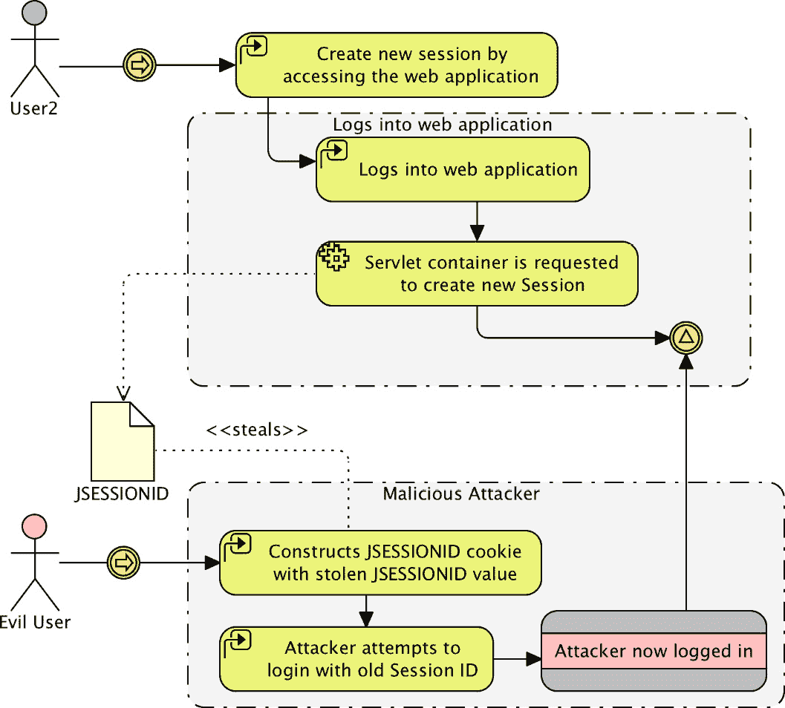
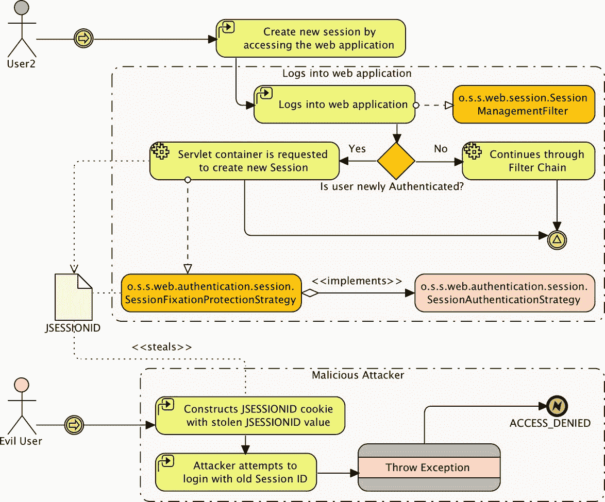
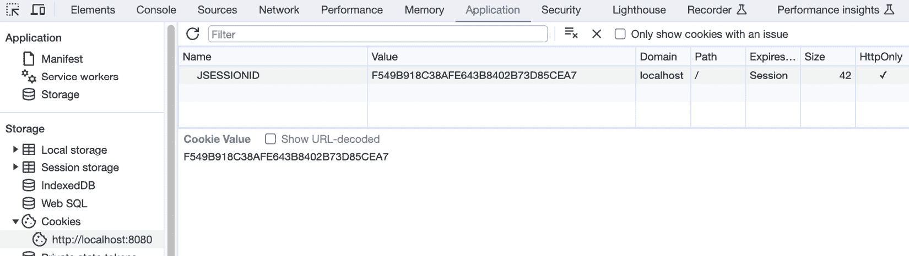
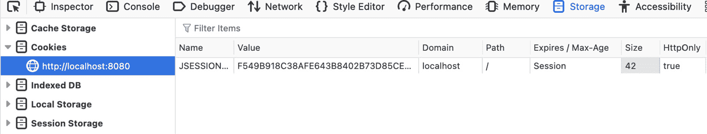
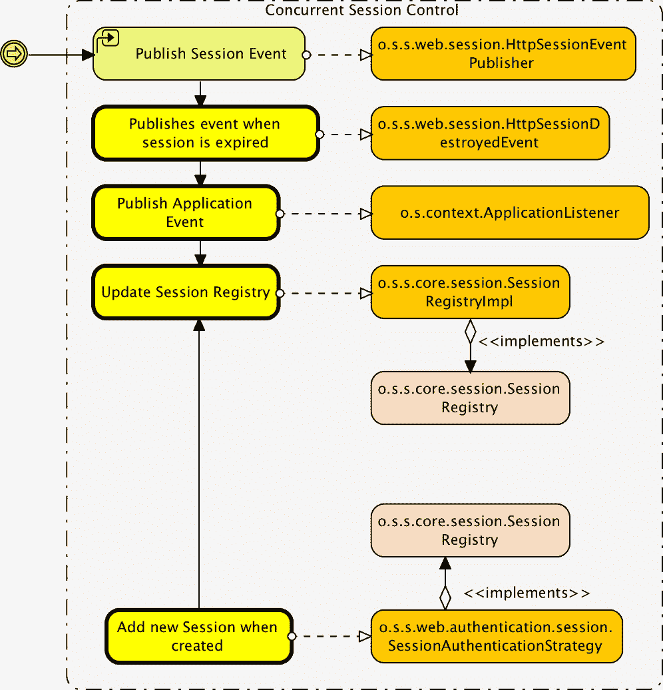
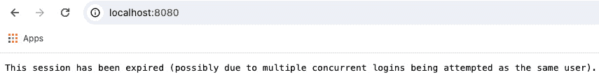
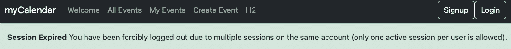
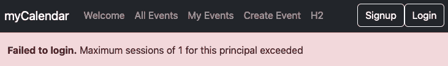
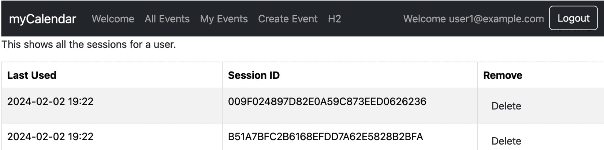
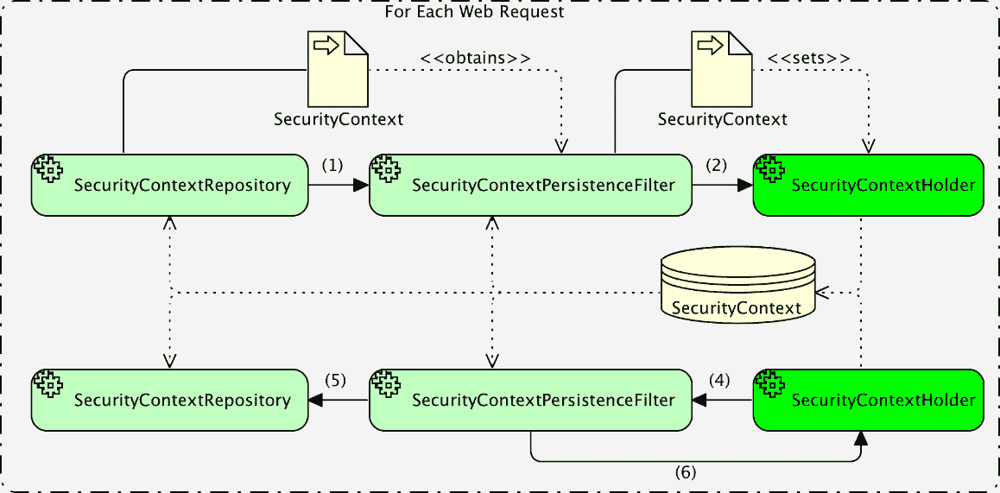

# 会话管理

本章讨论了 Spring Security 的会话管理功能。它从一个 Spring Security 如何防御会话固定的例子开始。然后我们将讨论如何利用并发控制来限制按用户许可的软件的访问。我们还将看到如何利用会话管理进行管理功能。最后，我们将探讨`HttpSession`在 Spring Security 中的使用以及如何管理会话：

以下是在本章中将要涉及的主题列表：

+   会话管理/会话固定

+   并发控制

+   管理已登录用户

+   `HttpSession`在 Spring Security 中的使用以及如何控制创建

+   如何使用`DebugFilter`类来发现`HttpSession`的创建位置

本章的代码实战链接在此：[`packt.link/qaJyz`](https://packt.link/qaJyz).

# 配置会话固定保护

由于我们使用的是安全命名空间风格的配置，会话固定保护已经为我们配置好了。如果我们想显式配置以匹配默认设置，我们将执行以下操作：

```java
http.sessionManagement(session -> session.sessionFixation().migrateSession());
```

**会话固定保护**是框架的一个特性，除非你尝试扮演恶意用户，否则你很可能不会注意到它。我们将向您展示如何模拟会话窃取攻击；在我们这样做之前，了解会话固定做什么以及它阻止的攻击类型非常重要。

## 理解会话固定攻击

会话固定是一种攻击类型，恶意用户试图窃取系统未认证用户的会话。这可以通过使用各种技术实现，导致攻击者获得用户的唯一会话标识符（例如，`JSESSIONID`）。如果攻击者创建一个包含用户`JSESSIONID`标识符的 cookie 或 URL 参数，他们就可以访问用户的会话。

虽然这显然是一个问题，但通常情况下，如果用户未认证，他们没有输入任何敏感信息。如果用户认证后继续使用相同的会话标识符，这将成为一个更严重的问题。如果认证后使用相同的标识符，攻击者现在可能无需知道用户的用户名或密码就能访问认证用户的会话！

重要提示

在这一点上，你可能会嘲笑并认为这在现实世界中极不可能发生。事实上，会话窃取攻击经常发生。我们建议你花些时间阅读由**开放网络应用安全项目**（**OWASP**）组织发布的关于该主题非常有信息量的文章和案例研究（[`www.owasp.org/`](http://www.owasp.org/)）。特别是，你将想阅读 OWASP 前 10 名列表。攻击者和恶意用户是真实存在的，如果你不了解他们常用的技术，他们可能会对你的用户、你的应用程序或你的公司造成非常真实的损害。

以下图示说明了会话固定攻击是如何工作的：



图 14.1 – 会话固定攻击

在这个图中，我们可以看到通过将会话标识符固定为已知值，攻击者绕过了正常的认证过程，并获得了对受害者账户或会话的非授权访问。这种攻击强调了正确管理和保护会话标识符以防止会话固定漏洞的重要性。

现在我们已经看到了这种攻击是如何工作的，我们将看看 Spring Security 能做些什么来预防它。

## 使用 Spring Security 预防会话固定攻击

如果我们能在用户认证之前防止使用相同的会话，那么我们就可以有效地使攻击者对会话 ID 的了解变得无用。Spring Security 会话固定保护通过在用户认证时显式创建一个新的会话并使旧的会话无效来解决这个问题。

让我们看看以下图示：



图 14.2 – 使用 Spring Security 预防会话固定攻击

我们可以看到一个新的过滤器`o.s.s.web.session.SessionManagementFilter`负责评估特定用户是否是新认证的。如果用户是新认证的，配置的`o.s.s.web.authentication.session.SessionAuthenticationStrategy`接口将决定要做什么。`o.s.s.web.authentication.session.SessionFixation ProtectionStrategy`将创建一个新的会话（如果用户已经有了），并将现有会话的内容复制到新会话中。就是这样——看起来很简单。然而，正如我们可以在前面的图中看到的，它有效地防止了恶意用户在未知用户认证后重新使用会话 ID。

## 模拟会话固定攻击

在这一点上，你可能想看看模拟会话固定攻击涉及的内容：

重要提示

你应该从`chapter14.00-calendar`中的代码开始。

1.  你首先需要在`SecurityConfig.java`文件中禁用会话固定保护，通过将`sessionManagement()`方法作为`HTTP`元素的子元素添加。

    让我们看看以下代码片段：

    ```java
    //src/main/java/com/packtpub/springsecurity/configuration/SecurityConfig.java
    http.sessionManagement(session -> session.sessionFixation().none());
    ```

重要提示

您的代码现在应该看起来像`chapter14.01-calendar`。

1.  接下来，您需要打开两个浏览器。我们将在谷歌浏览器中启动会话，从那里窃取它，我们的攻击者将使用在 Firefox 中窃取的会话登录。我们将使用*Google Chrome*和*Firefox Web Developer*插件来查看和操作 cookies。

1.  在谷歌浏览器中打开 JBCP 日历主页。

1.  接下来：

    +   **打开开发者工具**：右键点击网页并选择**检查**，或者按*Ctrl + Shift + I*（Windows/Linux）或*Cmd + Opt + I*（Mac）来打开开发者工具。

    +   **导航到应用程序标签**：在开发者工具中，您会在顶部看到一个菜单。点击**应用程序**标签。

    +   **在侧边栏中定位 Cookies**：在左侧侧边栏中，您应该看到一个**Cookies**部分。展开它以查看带有其关联 cookie 的域名列表。

    +   **选择特定域名**：点击与您感兴趣的网站相关的域名。这将显示与该域名关联的 cookie 列表。

    +   **查看 Cookie 值**：您可以看到每个 cookie 的详细信息，包括其名称、值、域名、路径等。寻找您感兴趣的特定 cookie，您将找到其值。



图 14.3 – Google Chrome 中的 Cookies 浏览器

1.  选择`JSESSIONID` cookie，登录后`JSESSIONID`的值没有改变，这使得您容易受到会话固定攻击的攻击！

1.  在 Firefox 中打开 JBCP 日历网站。您将被分配一个会话 cookie，您可以通过使用*Ctrl + F2*打开**底部：Cookie**控制台来查看它。然后，输入*cookie list [enter]*以显示当前页面的 cookies。

1.  为了完成我们的黑客攻击，我们将点击从谷歌浏览器复制到剪贴板的`JSESSIONID` cookie，如下截图所示：



图 14.4 – Firefox 中的 Cookies 黑客攻击

1.  请记住，Firefox 的新版本也包括了网页开发者工具。然而，您需要确保您使用的是扩展程序而不是内置的，因为它提供了额外的功能。

    我们的会话固定黑客攻击已经完成！如果您现在在 Firefox 中重新加载页面，您会看到您以使用谷歌浏览器登录的同一用户身份登录，但不知道用户名和密码。您对恶意用户感到害怕了吗？

1.  现在，重新启用会话固定保护并再次尝试这个练习。您会看到，在这种情况下，`JSESSIONID`在用户登录后会发生变化。根据我们对会话固定攻击发生方式的了解，这意味着我们已经降低了不知情用户成为这种攻击受害者的可能性。干得好！

谨慎的开发者应注意到有许多窃取会话 cookie 的方法，其中一些——例如`XSS`——甚至可能使会话固定保护网站变得脆弱。请参考 OWASP 网站以获取防止此类攻击的额外资源。

## 比较会话固定保护选项

`session-fixation-protection`属性有三个选项，允许您更改其行为；它们如下所示：

| **属性值** | **描述** |
| --- | --- |
| `none()` | 此选项禁用会话固定保护，并且（除非其他`sessionManagement()`属性非默认）不会配置`SessionManagementFilter`。 |
| `migrateSession()` | 当用户经过身份验证并分配新会话时，它确保将旧会话的所有属性移动到新会话中。 |
| `newSession()` | 当用户经过身份验证时，将创建新会话，并且不会从旧（未经身份验证）会话迁移任何属性。 |

表 14.1 – 会话固定保护选项

在大多数情况下，`migrateSession()` 方法的默认行为将适用于希望保留用户会话重要属性（如点击兴趣和购物车）的网站，在用户经过身份验证后。

# 限制每个用户的并发会话数量

在软件行业，软件通常按用户销售。这意味着，作为软件开发者，我们有一个确保每个用户只能存在一个会话的兴趣，以对抗账户共享。Spring Security 的并发会话控制确保单个用户不能同时拥有超过固定数量的活动会话（通常是单个）。确保实施此最大限制需要多个组件协同工作，以准确跟踪用户会话活动的变化。

让我们配置这个功能，查看它是如何工作的，然后测试一下！

## 配置并发会话控制

现在我们已经了解了并发会话控制中涉及的不同组件，设置它应该更有意义。让我们看看以下步骤来配置并发会话控制：

1.  首先，您需要按照以下方式更新您的`SecurityConfig.java`文件：

    ```java
    //src/main/java/com/packtpub/springsecurity/configuration/SecurityConfig.java
    http.sessionManagement(session -> session.maximumSessions(1));
    ```

1.  接下来，我们需要在`SecurityConfig.java`部署描述符中启用`o.s.s.web.session.HttpSessionEventPublisher`，以便 servlet 容器能够通知 Spring Security（通过`HttpSessionEventPublisher`）会话生命周期事件，如下所示：

    ```java
    //src/main/java/com/packtpub/springsecurity/configuration/SessionConfig.java
    @Configuration
    public class SessionConfig {
        @Bean
        public HttpSessionEventPublisher httpSessionEventPublisher() {
           return new HttpSessionEventPublisher();
        }
    }
    ```

在这两个配置位就绪后，并发会话控制现在将被激活。让我们看看它实际上做了什么，然后我们将演示如何对其进行测试。

## 理解并发会话控制

并发会话控制使用 `o.s.s.core.session.SessionRegistry` 来维护活动 HTTP 会话及其关联的已认证用户列表。随着会话的创建和过期，注册表会根据 `HttpSessionEventPublisher` 发布的会话生命周期事件实时更新，以跟踪每个已认证用户的活跃会话数量。

参考以下图表：



图 14.5 – 并发会话控制

`SessionAuthenticationStrategy` 的扩展 `o.s.s.web.authentication.session.ConcurrentSessionControlStrategy` 是跟踪新会话以及实际执行并发控制的方法。每次用户访问受保护网站时，`SessionManagementFilter` 都会用来检查活动会话与 `SessionRegistry` 中的活动会话列表是否匹配。如果用户的活跃会话不在 `SessionRegistry` 中跟踪的活动会话列表中，则最近最少使用的会话将被立即过期。

修改后的并发会话控制过滤器链中的次要参与者是 `o.s.s.web.session.ConcurrentSessionFilter`。这个过滤器将识别已过期的会话（通常是会话由于 servlet 容器或通过 `ConcurrentSessionControlStrategy` 接口强制过期）并通知用户他们的会话已过期。

现在我们已经了解了并发会话控制的工作原理，我们应该能够轻松地重现一个强制执行该控制器的场景。

重要提示

你的代码现在应该看起来像 `chapter14.02-calendar`。

## 测试并发会话控制

当我们验证会话固定保护时，我们需要通过执行以下步骤来访问两个网络浏览器：

1.  在 Google Chrome 中，以 `user1@example.com/user1` 登录到该网站。

1.  现在，在 Firefox 中，以相同用户登录到该网站。

1.  最后，回到 Google Chrome 并采取任何操作。你将看到一个消息指示你的会话已过期，如下面的截图所示：



图 14.6 – 测试并发会话控制

如果你使用此应用程序并收到此消息，你可能会感到困惑。这是因为这显然不是一种友好的通知方式，表明一次只能有一个用户可以访问应用程序。然而，它确实说明了会话已被软件强制过期。

重要提示

并发会话控制对于新 Spring Security 用户来说往往是一个很难理解的概念。许多用户试图在不真正理解其工作原理和好处的情况下实现它。如果你正在尝试启用这个强大的功能，但它似乎没有按预期工作，请确保你已经正确配置了一切，然后回顾本节的理论解释——希望它们能帮助你理解可能出了什么问题。

当会话过期事件发生时，我们可能需要将用户重定向到登录页面，并给他们提供一条消息来指示出了什么问题。

# 配置过期会话重定向

幸运的是，有一种简单的方法可以将用户引导到友好的页面（通常是登录页面），当并发会话控制标记他们时——只需指定 `expired-url` 属性并将其设置为应用程序中的一个有效页面。按照以下方式更新你的 `SecurityConfig.java` 文件：

```java
//src/main/java/com/packtpub/springsecurity/configuration/SecurityConfig.java
http.sessionManagement(session -> session.maximumSessions(1)
       .expiredUrl("/login/form?expired"));
```

在我们的应用程序中，这会将用户重定向到标准登录表单。然后我们将使用查询参数来显示一条友好的消息，指出我们确定他们有多个活动会话，应该重新登录。更新你的 `login.xhtml` 页面以使用此参数显示我们的消息：

```java
//src/main/resources/templates/login.xhtml
<div th:if="${param.expired != null}" class="alert alert-success">
    <strong>Session Expired</strong>
    <span>You have been forcibly logged out due to multiple
    sessions on the same account (only one active
        session per user is allowed).</span>
</div>
```

尝试登录为用户 `admin1@example.com/admin1`，使用 Google Chrome 和 Firefox 进行登录。

重要提示

你的代码现在应该看起来像 `chapter14.03-calendar`。

这次，你应该看到一个带有自定义错误信息的登录页面：



图 14.7 – 一个并发会话登录页面的自定义错误信息

在设置过期会话的重定向之后，我们将深入了解与并发控制相关的典型挑战。

# 并发控制中的常见问题

有几个常见的原因会导致使用相同用户登录不会触发注销事件。第一个原因是在使用自定义的 `UserDetails`（正如我们在 *第三章*，*自定义身份验证*）时，`equals` 和 `hashCode` 方法没有正确实现。这是因为默认的 `SessionRegistry` 实现使用内存映射来存储 `UserDetails`。为了解决这个问题，你必须确保你已经正确实现了 `hashCode` 和 `equals` 方法。

第二个问题发生在用户会话持久化到磁盘时重启应用程序容器。当容器重新启动后，已经使用有效会话登录的用户将被登录。然而，用于确定用户是否已经登录的 `SessionRegistry` 的内存映射将是空的。这意味着 Spring Security 将报告用户未登录，尽管用户实际上已经登录。为了解决这个问题，需要自定义 `SessionRegistry` 并在容器内禁用会话持久化，或者你必须实现一种特定于容器的解决方案，以确保在启动时将持久化的会话填充到内存映射中。

我们将要讨论的最后一个常见原因是，在默认的 `SessionRegistry` 实现的集群环境中，并发控制可能不起作用。默认实现使用内存映射。这意味着如果 `user1` 登录到 `应用服务器 A`，他们登录的事实将与该服务器相关联。因此，如果 `user1` 然后对 `应用服务器 B` 进行身份验证，之前关联的身份验证对 `应用服务器 B` 将是未知的。

## 阻止身份验证而不是强制注销

Spring Security 还可以防止用户在已有会话的情况下登录到应用程序。这意味着，而不是强制原始用户注销，Spring Security 将阻止第二个用户登录。配置更改如下所示：

```java
//src/main/java/com/packtpub/springsecurity/configuration/SecurityConfig.java
http.sessionManagement(session -> session.maximumSessions(1)
        .expiredUrl("/login/form?expired").maxSessionsPreventsLogin(true));
```

使用 Google Chrome 更新并登录到日历应用程序。现在，尝试使用相同的用户以 Firefox 登录到日历应用程序。您应该看到我们来自 `login.xhtml` 文件的自定义错误消息：



图 14.8 – 阻止并发会话身份验证的自定义错误消息

重要提示

您的代码现在应类似于 `chapter14.04-calendar`。

这种方法有一个缺点，如果不仔细思考可能不会很明显。尝试在不注销的情况下关闭 Google Chrome，然后再次打开它。现在，再次尝试登录到应用程序。您将观察到您无法登录。这是因为当浏览器关闭时，`JSESSIONID` cookie 被删除。然而，应用程序并不知道这一点，所以用户仍然被认为是经过身份验证的。您可以将这视为一种内存泄漏，因为 `HttpSession` 仍然存在，但没有指向它的指针（`JSESSIONID` cookie 已消失）。只有在会话超时后，我们的用户才能再次进行身份验证。幸运的是，一旦会话超时，我们的 `SessionEventPublisher` 接口将把用户从我们的 `SessionRegistry` 接口中删除。我们可以从中吸取的教训是，如果用户忘记注销并关闭浏览器，他们将在会话超时之前无法登录到应用程序。

重要提示

正如在第 *7 章* 中提到的 *Remember-me 服务*，如果浏览器决定即使在关闭浏览器后也记住一个会话，这个实验可能无法工作。通常，如果插件或浏览器被配置为恢复会话，就会发生这种情况。在这种情况下，您可能需要手动删除 `JSESSIONID` cookie 来模拟浏览器已关闭。

# 并发会话控制的其它好处

并发会话控制的另一个好处是存在 `SessionRegistry` 来跟踪活动（以及可选的已过期）会话。这意味着我们可以通过执行以下步骤来获取关于我们系统中存在哪些用户活动（至少对于认证用户）的运行时信息：

1.  即使您不想启用并发会话控制，您也可以这样做。只需将 `maximumSessions` 设置为 `-1`，会话跟踪将保持启用，尽管不会强制执行最大值。相反，我们将使用本章 `SessionConfig.java` 文件中提供的显式 bean 配置，如下所示：

    ```java
    //src/main/java/com/packtpub/springsecurity/configuration/SessionConfig.java
    @Bean
    public SessionRegistry sessionRegistry(){
        return new SessionRegistryImpl();
    }
    ```

1.  我们已经将 `SessionConfig.java` 文件的导入添加到 `SecurityConfig.java` 文件中。所以，我们只需要在我们的 `SecurityConfig.java` 文件中引用自定义配置。现在，将当前的 `sessionManagement` 和 `maximumSessions` 配置替换为以下代码片段：

    ```java
    //src/main/java/com/packtpub/springsecurity/configuration/SecurityConfig.java
    http.sessionManagement(session -> session.maximumSessions(-1)
            .sessionRegistry(sessionRegistry)
            .expiredUrl("/login/form?expired")
            .maxSessionsPreventsLogin(true));
    ```

重要提示

您的代码现在应该看起来像 `chapter14.05-calendar`。

现在，我们的应用程序将允许同一用户进行无限数量的认证。然而，我们可以使用 `SessionRegistry` 来强制注销用户。让我们看看我们如何使用这些信息来增强我们用户的安全性。

# 显示用户的活跃会话

您可能已经看到许多网站允许用户查看并强制注销其账户的会话。我们可以轻松地使用这个强制注销功能来做同样的事情。我们已经提供了 `UserSessionController`，它可以获取当前登录用户的活跃会话。您可以看到以下实现：

```java
//src/main/java/com/packtpub/springsecurity/web/controllers/UserSessionController.java
@Controller
public class UserSessionController {
    private final SessionRegistry sessionRegistry;
    public UserSessionController(SessionRegistry sessionRegistry) {
        this.sessionRegistry = sessionRegistry;
    }
    @GetMapping("/user/sessions/")
    public String sessions(Authentication authentication, ModelMap model) {
        List<SessionInformation> sessions = sessionRegistry.getAllSessions(authentication.getPrincipal(),
                false);
        model.put("sessions", sessions);
        return "user/sessions";
    }
    @PostMapping(value="/user/sessions/{sessionId}")
    public String removeSession(@PathVariable String sessionId, RedirectAttributes redirectAttrs) {
        SessionInformation sessionInformation = sessionRegistry.getSessionInformation(sessionId);
        if(sessionInformation != null) {
            sessionInformation.expireNow();
        }
        redirectAttrs.addFlashAttribute("message", "Session was removed");
        return "redirect:/user/sessions/";
    }
}
```

我们的会话方法将使用 Spring `Authentication`。如果我们没有使用 Spring MVC，我们也可以从 `SecurityContextHolder` 获取当前的 `Authentication`，如第 *3 章* 中讨论的，*自定义认证*。然后使用主体来获取当前用户的全部 `SessionInformation` 对象。信息可以通过在 `sessions.xhtml` 文件中迭代 `SessionInformation` 对象轻松显示，如下所示：

```java
//src/main/resources/templates/user/sessions.xhtml
…
<tr th:each="currentSession : ${sessions}">
    <td th:text="${#calendars.format(currentSession.lastReques, 'yyyy-MM-dd HH:mm')}">lastUsed</td>
    <td th:text="${currentSession.sessionId}"></td>
    <td>
        <form action="#" th:action="@{'/user/sessions/{id}'(id=${currentSession.sessionId)}"
              th:method="post" cssClass="form-horizon"al">
            <input type="sub"it" value="Del"te" class=""tn"/>
        </form>
    </td>
</tr>
...
```

您现在可以安全地启动 JBCP 日历应用程序，并使用 `user1@example.com/user1` 在 Google Chrome 中登录。现在，使用 Firefox 登录并点击右上角的 `user1@example.com` 链接。然后您将在显示上看到两个会话列表，如下面的截图所示：



图 14.9 – 可用会话列表

在 Firefox 中，点击 `UserSessionsController` 的 `deleteSession` 方法。这表示应该终止会话。现在，导航到 Google Chrome 中的任何页面。您将看到自定义消息，表示会话已被强制终止。虽然消息可能需要更新，但我们认为这是用户终止其他活动会话的一个很好的功能。

其他可能的用途包括允许管理员列出和管理所有活动会话，显示网站上的活动用户数量，甚至扩展信息以包括诸如 IP 地址或位置信息等内容。

## Spring Security 如何使用 HttpSession 方法？

我们已经讨论了 Spring Security 如何使用`SecurityContextHolder`来确定当前登录的用户。然而，我们还没有解释`SecurityContextHolder`是如何被 Spring Security 自动填充的。这个秘密在于`o.s.s.web.context.SecurityContextPersistenceFilter`过滤器以及`o.s.s.web.context.SecurityContextRepository`接口。让我们看一下以下图表：



图 14.10 – Spring Security 使用 HttpSession

下面是对前面图表中每个步骤的解释：

1.  在每个 Web 请求的开始，`SecurityContextPersistenceFilter`负责使用`SecurityContextRepository`获取当前的`SecurityContext`实现。

1.  紧接着，`SecurityContextPersistenceFilter`将`SecurityContext`设置在`SecurityContextHolder`上。

1.  在剩余的 Web 请求中，`SecurityContext`可以通过`SecurityContextHolder`访问。例如，如果 Spring MVC 控制器或`CalendarService`想要访问`SecurityContext`，它可以使用`SecurityContextHolder`来访问它。

1.  然后，在每个请求结束时，`SecurityContextPersistenceFilter`从`SecurityContextHolder`获取`SecurityContext`。

1.  紧接着，`SecurityContextPersistenceFilter`将`SecurityContext`保存到`SecurityContextRepository`。这确保了如果在任何时刻（即在用户创建新账户时，如在第*第三章*，*自定义身份验证*）更新了`SecurityContext`，`SecurityContext`将被保存。

1.  最后，`SecurityContextPersistenceFilter`清除`SecurityContextHolder`。

现在出现的问题：这与`HttpSession`有什么关系？这一切都由默认的`SecurityContextRepository`实现联系在一起，该实现使用`HttpSession`。

## HttpSessionSecurityContextRepository 接口

`SecurityContextRepository`的默认实现是`o.s.s.web.context.HttpSessionSecurityContextRepository`，它使用`HttpSession`来检索和存储当前的`SecurityContext`实现。没有提供其他`SecurityContextRepository`实现。然而，由于`HttpSession`的使用被`SecurityContextRepository`接口抽象化，如果我们愿意，可以轻松编写我们自己的实现。

## 配置 Spring Security 如何使用 HttpSession

Spring Security 具有配置 Spring Security 何时创建会话的能力。这可以通过`http`元素的`create-session`属性来完成。以下表格中可以看到选项的摘要：

| **属性值** | **描述** |
| --- | --- |
| `ifRequired` | Spring Security 仅在需要时才会创建会话（默认值）。 |
| `always` | 如果不存在会话，Spring Security 将主动创建会话。 |
| `never` | Spring Security 永远不会创建会话，但如果应用程序创建了它，则会使用它。这意味着如果有`HttpSession`方法，`SecurityContext`将被持久化或从中检索。 |
| `stateless` | Spring Security 不会创建会话，并且将忽略会话以获取 Spring `Authentication`。在这种情况下，使用`NullSecurityContextRepository`，它将始终声明当前`SecurityContext`为`null`。 |

表 14.2 – 会话固定保护选项

在实践中，控制会话创建可能比最初看起来更困难。这是因为属性仅控制 Spring Security 对`HttpSession`使用的一部分。它不适用于任何其他组件，例如，如果创建了`HttpSession`方法，我们可以添加 Spring Security 的`DebugFilter`。

## 使用 Spring Security 的 DebugFilter 进行调试

让我们看看以下步骤，并了解如何使用 Spring Security 的`DebugFilter`进行调试：

1.  更新您的`SecurityConfig.java`文件，使其会话策略为`NEVER`。同时，在`@EnableWebSecurity`注解上将`debug`标志设置为`true`，以便我们可以跟踪会话何时被创建。更新如下所示：

    ```java
    //src/main/java/com/packtpub/springsecurity/configuration/SecurityConfig.java
    @Configuration
    @EnableWebSecurity(debug = true)
    public class SecurityConfig {
    ...
    http.sessionManagement(session -> session
           .sessionCreationPolicy(SessionCreationPolicy.NEVER)
           .maximumSessions(-1)
           .sessionRegistry(sessionRegistry)
           .expiredUrl("/login/form?expired")
           .maxSessionsPreventsLogin(true));
    ```

1.  当您启动应用程序时，您应该看到类似以下代码被写入标准输出。如果您还没有这样做，请确保您已经在 Spring Security 调试器类别中启用了日志记录：

    ```java
    ******************************************************
    *******   Security debugging is enabled.        ******
    *******  This may include sensitive information.******
    *******  Do not use in a production system!     ******
    ```

1.  现在，清除您的 cookies（这可以在 Firefox 中使用*Shift + Ctrl + Delete*完成），启动应用程序，并直接导航到`http://localhost:8080`。当我们查看 cookies 时，就像我们在本章前面所做的那样，我们可以看到即使我们声明 Spring Security 永远不会创建`HttpSession`，`JSESSIONID`仍然被创建。再次查看日志，您将看到创建`HttpSession`的代码调用堆栈如下：

    ```java
    ******************************************************
    2024-02-02T20:17:27.859+01:00  INFO 54253 --- [nio-8080-exec-1] Spring Security Debugger                :
    ******************************************************
    New HTTP session created: 8C85C6E21D976ED6A1EDE2F8877EB227
    ```

`DebugFilter`还有其他一些用途，我们鼓励您自己探索，例如确定何时一个请求将匹配特定的 URL，Spring Security 正在调用哪些过滤器，等等。

# 摘要

在阅读本章后，您应该熟悉 Spring Security 如何管理会话并防止会话固定攻击。我们还知道如何使用 Spring Security 的并发控制来防止同一用户被多次认证。

我们探讨了利用并发控制来允许用户终止与其账户关联的会话的方法。此外，我们还了解了如何配置 Spring Security 创建会话。我们还介绍了如何使用 Spring Security 的`DebugFilter`过滤器来排查与 Spring 相关的问题。

我们还学习了关于安全性的知识，包括确定何时创建了一个`HttpSession`方法及其原因。

这就结束了我们对 Spring Security 会话管理的讨论。在下一章中，我们将讨论一些关于将 Spring Security 与其他框架集成的具体细节。
