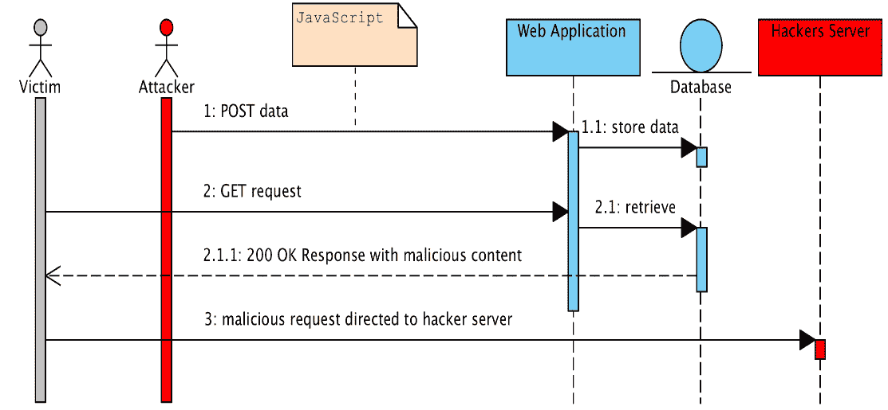
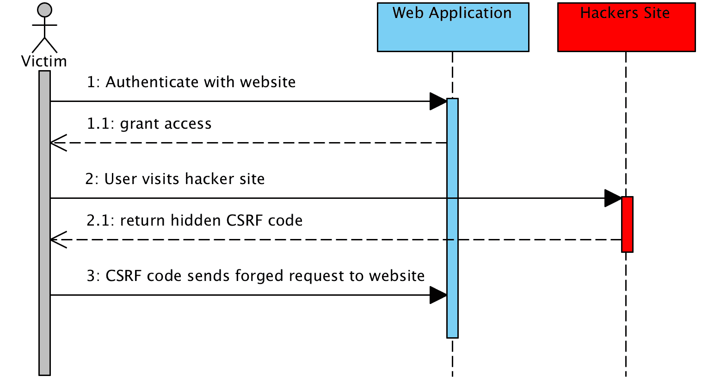
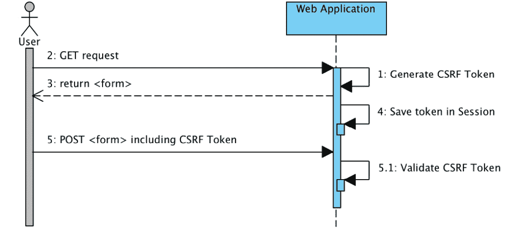

# 15

# 额外的 Spring Security 功能

在本章中，我们将探讨一些我们在这本书中尚未涵盖的额外的 `Spring Security` 功能，包括以下主题：

+   **跨站** **脚本**（**XSS**）

+   **跨站请求** **伪造**（**CSRF**）

+   同步器令牌模式

+   Clickjacking

+   测试 Spring Security 应用程序

+   反应式应用程序支持

我们将了解如何使用以下方法包括各种 HTTP 标头来防止常见的安全漏洞：

+   `Cache-Control`

+   `Content-Type Options`

+   `HTTP 严格传输安全`（`HSTS`）

+   `X-Frame-Options`

+   `X-XSS-Protection`

在阅读本章之前，你应该已经理解了 `Spring Security` 的工作原理。这意味着你应该已经能够在一个简单的网络应用程序中设置身份验证和授权。如果你无法做到这一点，你将想要确保在继续本章之前已经阅读到 *第三章*，*自定义身份验证*。

本章的代码示例链接在此：[`packt.link/aXvKi`](https://packt.link/aXvKi)。

# 安全漏洞

在互联网时代，有无数可能被利用的漏洞。了解更多关于基于 Web 的漏洞的宝贵资源是位于 [`owasp.org`](https://owasp.org) 的 **开放 Web 应用程序安全项目**（**OWASP**）。

除了是理解各种漏洞的宝贵资源外，OWASP 还根据行业趋势对前 10 大漏洞进行了分类。

# 跨站脚本

**跨站脚本**或**XSS**攻击涉及注入到受信任网站中的恶意脚本。

当攻击者利用允许未经过滤的输入发送到网站的特定网络应用程序时，就会发生 XSS 攻击，通常是以基于浏览器的脚本的形式，然后由网站的不同用户执行。

攻击者可以根据提供给网站验证或未编码的信息采取多种形式。

XSS 可以通过以下序列图来描述：



图 15.1 – 跨站脚本（XSS）

这个问题的核心是期望用户信任正在发送的网站信息。最终用户的浏览器无法知道脚本不应该被信任，因为他们在浏览的网站上存在隐含的信任。由于最终用户认为脚本来自受信任的来源，恶意脚本可以访问浏览器保留的任何 cookies、会话令牌或其他敏感信息，并用于该网站。

# 跨站请求伪造

**跨站请求伪造**（**CSRF**）是一种欺骗受害者提交恶意请求的攻击。这种攻击继承了或劫持了受害者的身份和权限，并执行未经授权的功能，代表受害者获取访问权限。

对于 Web 应用程序，大多数浏览器会自动包含与网站关联的凭据，包括用户会话、cookie、IP 地址、Windows 域凭据等。

因此，如果用户当前在一个网站上认证，该网站将无法区分受害者发送的伪造请求和合法请求。

CSRF 攻击针对的是在服务器上引起状态变化的函数，例如更改受害者的电子邮件地址或密码，或进行金融交易。

这迫使受害者检索对攻击者无益的数据，因为攻击者不会收到响应；受害者会收到。因此，CSRF 攻击针对的是会改变状态的请求。

以下序列图详细说明了 CSRF 攻击是如何发生的：



图 15.2 – CSRF

为了尝试防止 CSRF 攻击，可以采取多种不同的设计措施；然而，诸如秘密 cookie、`HTTP POST`请求、多步交易、URL 重写和`HTTPS`等措施并不能阻止此类攻击。

重要提示

OWASP 的前 10 大安全漏洞列表将 CSRF 列为第 8 大常见攻击，详情请见[`owasp.org/www-community/attacks/csrf`](https://owasp.org/www-community/attacks/csrf)。

总结来说，CSRF 是一种攻击的通用概念，即用户被诱骗执行非预期行为。在下一节中，我们将探讨`同步器令牌模式`，这是一种通过使用与每个用户会话关联的唯一令牌来减轻 CSRF 攻击的具体方法。

## 同步器令牌模式

CSRF 的解决方案是使用**同步器令牌**模式。此解决方案确保每个请求除了我们的会话 cookie 外，还需要一个随机生成的令牌作为 HTTP 参数。当请求提交时，服务器必须查找参数的预期值，并将其与请求中的实际值进行比较。如果值不匹配，则请求应失败。

重要提示

《跨站请求伪造预防技巧表》建议将`同步器令牌模式`作为 CSRF 攻击的有效解决方案：[`cheatsheetseries.owasp.org/cheatsheets/Cross-Site_Request_Forgery_Prevention_Cheat_Sheet.xhtml#General_Recommendation:_%20Synchronizer_Token_Pattern`](https://cheatsheetseries.owasp.org/cheatsheets/Cross-Site_Request_Forgery_Prevention_Cheat_Sheet.xhtml#General_Recommendation:_%20Synchronizer_Token_Pattern)。

让我们看看我们的示例将如何改变。假设随机生成的令牌存在于名为`_csrf`的 HTTP 参数中。例如，转账请求看起来如下：

```java
POST /transfer HTTP/1.1 Host: bank.example.com
Cookie: JSESSIONID=randomid; Domain=bank.example.com; Secure; HttpOnly
Content-Type: application/x-www-form-urlencoded amount=100.00&routingNumber=1234&account=9876&_csrf=<secure-random token>
```

你会注意到我们添加了一个具有随机值的 `_csrf` 参数。现在，恶意网站将无法猜测 `_csrf` 参数的正确值（必须在恶意网站上明确提供），当服务器将实际令牌与预期令牌进行比较时，传输将失败。

以下图显示了 `synchronizer` `token` 模式的标准用例：



图 15.3 – 同步器令牌模式

`Spring Security` 默认提供了 `synchronizer token` 支持。你可能已经注意到，在前面的章节中，我们在 `SecurityConfig.java` 文件中禁用了 CSRF 保护，如下面的代码片段所示：

```java
//src/main/java/com/packtpub/springsecurity/configuration/SecurityConfig.java
    @Bean
    public SecurityFilterChain filterChain(HttpSecurity http) throws Exception {
...
    http.csrf(AbstractHttpConfigurer::disable);
    return http.build();
}
```

到本书的这一部分，我们已经禁用了 `synchronizer token` 保护，以便我们可以专注于其他安全关注点。

如果我们现在启动应用程序，并且没有任何页面添加 `synchronizer token` 支持。

重要提示

你应该从 `chapter15.00-calendar` 的代码开始。

在探索了 `synchronizer token` 模式之后，我们将探讨何时使用 CSRF 保护。

## 何时使用 CSRF 保护

建议你为任何可能由浏览器或普通用户处理的请求使用 CSRF 保护。如果你只创建了一个仅供非浏览器客户端使用的服务，你很可能希望禁用 CSRF 保护。

### CSRF 保护与 JSON

一个常见的问题是，我是否需要保护由 JavaScript 发起的 JSON 请求？简短的回答是，这取决于。然而，你必须非常小心，因为存在可能影响 JSON 请求的 CSRF 漏洞。例如，恶意用户可以使用以下表单创建带有 JSON 的 CSRF：

```java
<form action="https://example.com/secureTransaction" method="post" enctype="text/plain">
    <input name='{"amount":100,"routingNumber":"maliciousRoutingNumber", "account":"evilsAccountNumber", "ignore_me":"' value='test"}' type='hidden'>
    <input type="submit" value="Win Money!"/>
</form>
```

这将产生以下 JSON 结构：

```java
{
  "amount": 100,
  "routingNumber": "maliciousRoutingNumber",
  "account": "maliciousAccountNumber",
  "ignore_me": "=test"
}
```

如果一个应用程序没有验证 `Content-Type` 方法，那么它就会暴露于这种漏洞。根据配置，一个验证 `Content-Type` 方法的 Spring MVC 应用程序仍然可能通过更新 URL 后缀以 `.json` 结尾而被利用，如下面的代码所示：

```java
<form action="https://example.com/secureTransaction.json" method="post" enctype="text/plain">
    <input name='{"amount":100,"routingNumber":"maliciousRoutingNumber", "account":"maliciousAccountNumber", "ignore_me":"' value='test"}' type='hidden'>
    <input type="submit" value="Win Money!"/>
</form>
```

在本节中，我们探讨了 CSRF 保护与 JSON。在下一节中，我们将介绍 CSRF 和无状态浏览器应用程序。

### CSRF 和无状态浏览器应用程序

如果你的应用程序是无状态的，这并不一定意味着你是安全的。事实上，如果用户对于某个请求不需要在浏览器中执行任何操作，他们仍然可能容易受到 CSRF 攻击。

例如，考虑一个使用自定义 cookie 来包含所有状态以进行身份验证而不是 `JSESSIONID` cookie 的应用程序。当 CSRF 攻击发生时，自定义 cookie 将以与我们在上一个示例中发送 `JSESSIONID` cookie 相同的方式随请求发送。

使用基本身份验证的用户也容易受到 CSRF 攻击，因为浏览器会自动将用户名和密码包含在任何请求中，就像在我们的上一个例子中发送 `JSESSIONID` cookie 一样。

### 使用 Spring Security CSRF 保护

那么，使用 `Spring Security` 保护我们的网站免受 CSRF 攻击所需的步骤是什么？使用 `Spring Security` 的 CSRF 保护步骤如下：

1.  使用正确的 HTTP 动词。

1.  配置 CSRF 保护。

1.  包含 CSRF 令牌。

让我们更好地理解这些步骤。

#### 使用正确的 HTTP 动词

防止 CSRF 攻击的第一步是确保你的网站使用正确的 `HTTP` 动词。具体来说，在 `Spring Security` 的 CSRF 支持能够发挥作用之前，你需要确定你的应用程序对于任何修改状态的操作都使用了 `PATCH`、`POST`、`PUT` 和/或 `DELETE`。

这不是 `Spring Security` 支持的限制，而是一个正确的 `CSRF` 防止的一般要求。原因是将私人信息包含在 `HTTP GET` 方法中可能会导致信息泄露。

请参阅 *RFC 2616，第 15.1.3 节*，*在 URI 中编码敏感信息*，以获取有关使用 `POST` 而不是 `GET` 来处理敏感信息的通用指导 ([`www.rfc-editor.org/rfc/rfc2616.xhtml#section-15.1.3`](https://www.rfc-editor.org/rfc/rfc2616.xhtml#section-15.1.3))。

#### 配置 CSRF 保护

下一步是在你的应用程序中包含 `Spring Security` 的 CSRF 保护。一些框架通过使无效的 CSRF 令牌失效用户会话来处理无效的 CSRF 令牌，但这会带来它自己的问题。相反，默认情况下，`Spring Security` 的 CSRF 保护将产生 `HTTP 403 访问拒绝`。这可以通过配置 `AccessDeniedHandler` 来处理 `InvalidCsrfTokenException` 的不同方式来自定义。

由于被动性原因，如果你正在使用 `XML` 配置，必须通过 `<csrf>` 元素显式启用 CSRF 保护。有关其他自定义选项，请参阅 `<csrf>` 元素的文档。

## 默认 CSRF 支持

使用 Java 配置时，CSRF 保护默认启用。有关 CSRF 保护配置的更多自定义选项，请参阅 `csrf()` 的 Java 文档。

为了使这个配置更加详细，我们将在 `SecurityConfig.java` 文件中添加 CSRF 方法，如下所示：

```java
//src/main/java/com/packtpub/springsecurity/configuration/SecurityConfig.java
    @Bean
    public SecurityFilterChain filterChain(HttpSecurity http) throws Exception {
...
    http.csrf(Customizer.withDefaults());
    return http.build();
}
```

要访问 H2 控制台，需要禁用 CSRF，如下所示：

```java
//src/main/java/com/packtpub/springsecurity/configuration/SecurityConfig.java
    @Bean
    public SecurityFilterChain filterChain(HttpSecurity http) throws Exception {
...
    http
       .csrf(csrf -> csrf
             .ignoringRequestMatchers(toH2Console())
             .disable());
    return http.build();
}
```

在配置 `Spring Security` 的 `SecurityFilterChain` bean 中的 CSRF 之后，我们将看到如何启用网页表单中的支持。

### 在 <form> 提交中包含 CSRF 令牌

最后一步是确保你在所有 `PATCH`、`POST`、`PUT` 和 `DELETE` 方法中包含 CSRF 令牌。一种方法是使用 `_csrf` 请求属性来获取当前的 `CsrfToken` 令牌。以下是一个使用 **Java Server Page** (**JSP**) 实现此操作的示例：

```java
<c:url var="logoutUrl" value="/logout"/>
<form action="${logoutUrl}"
      method="post">
    <input type="submit"
           value="Log out" />
    <input type="hidden"
           name="${_csrf.parameterName}"
           value="${_csrf.token}"/>
</form>
```

在 `<form>` 中包含 CSRF 令牌后，我们将通过包含基于 `Spring Security` JSP 标签的 CSRF 令牌来探索另一个选项。

### 使用 Spring Security JSP 标签库包含 CSRF 令牌

如果 CSRF 保护已启用，`Spring Security` 标签会插入一个带有正确名称和值的隐藏表单字段用于 CSRF 保护令牌。如果 CSRF 保护未启用，则此标签没有输出。

通常，`Spring Security` 会自动为任何 `<form:form>` 标签插入 CSRF 表单字段，但如果由于某些原因您不能使用 `<form:form>`，`csrfInput` 是一个方便的替代品。

您应该将此标签放置在 `HTML <form></form>` 块中，您通常会在其中放置其他输入字段。不要将此标签放置在 Spring `<form:form></form:form>` 块中。`Spring Security` 会自动处理 Spring 表单，如下所示：

```java
<form method="post" action="/logout">
    <sec:csrfInput />
    ...
</form>
```

### 默认 CSRF 令牌支持

如果您正在使用 Spring MVC `<form:form>` 标签，或 `Thymeleaf 2.1+`，并且您还使用了 `@EnableWebSecurity`，则 CSRF 令牌将自动为您包含（使用我们一直在处理的 `CsrfRequestDataValue` 令牌）。

因此，对于这本书，我们一直在使用 *Thymeleaf* 为我们所有的网页。如果我们在 `Spring Security` 中启用 CSRF 支持，Thymeleaf 默认启用 CSRF 支持。

`logout` 链接在 CSRF 支持启用的情况下将无法工作，需要替换为以下代码：

```java
//src/main/webapp/WEB-INF/templates/fragments/header.xhtml
<form th:action="@{/logout}" method="post">
    <input type="submit" value="Logout" class="btn btn-outline-light" />
</form></li>
```

重要注意事项

您的代码现在应该看起来像 `chapter15.01-calendar`。

如果我们启动 JBCP 日历应用程序并导航到 `http://localhost:8080/login.xhtml` 上的登录页面，我们可以查看 `login.xhtml` 页面的生成源，如下所示：

```java
<form class="form-horizontal" method="POST" action="/login">
    <input type="hidden" name="_csrf" value="eEOF9AiMgfLo353Q19oTxLz5JFiNDUwbVnp-UiIExznGwFV9HiK2xGq_4sLFvfng4fcn9oTNCTrpay82YEhLNBBhpV_x8DFM"/>
...
</form>
```

### Ajax 和 JavaScript 请求

如果您使用 JSON，那么在 HTTP 参数中提交 CSRF 令牌是不可能的。相反，您可以在 HTTP 头部中提交令牌。一个典型的模式是在您的 `<meta>` HTML 标签中包含 CSRF 令牌。以下是一个使用 JSP 的示例：

```java
<html>
<head>
    <meta name="_csrf" th:content="${_csrf.token}"/>
    <!-- default header name is X-CSRF-TOKEN -->
    <meta name="_csrf_header" th:content="${_csrf.headerName}"/>
    <!-- ... -->
</head>
```

您可以不手动创建元标签，而是使用 `Spring Security` JSP 标签库中的更简单的 `csrfMetaTags` 标签。

### `csrfMetaTags` 标签

如果 CSRF 保护已启用，此标签会插入包含 CSRF 保护令牌表单字段、头部名称和 CSRF 保护令牌值的元标签。这些元标签对于在您的应用程序中实现 CSRF 保护很有用。

您应该将 `csrfMetaTags` 标签放置在 HTML `<head></head>` 块中，您通常会在其中放置其他元标签。一旦使用此标签，您就可以使用 JavaScript 容易地访问表单字段名称、头部名称和令牌值，如下所示：

```java
<!DOCTYPE html>
<html>
<head>
    <title>CSRF Protected JavaScript Page</title>
    <meta name="description" content="This is the description for this page"/>
    <sec:csrfMetaTags/>
    <script type="text/javascript">
        var csrfParameter = $("meta[name='_csrf_parameter']").attr("content");
        var csrfHeader = $("meta[name='_csrf_header']").attr("content");
        var csrfToken = $("meta[name='_csrf']").attr("content");
        // using XMLHttpRequest directly to send an x-www-form-urlencoded request
        var ajax = new XMLHttpRequest();
        ajax.open("POST", "https://www.example.org/do/something", true);
        ajax.setRequestHeader("Content-Type", "application/x-www-form-urlencoded data");
        ajax.send(csrfParameter + "=" + csrfToken + "&name=John&...");
        // using XMLHttpRequest directly to send a non-x-www-form-urlencoded request
        var ajax = new XMLHttpRequest();
        ajax.open("POST", "https://www.example.org/do/something", true);
        ajax.setRequestHeader(csrfHeader, csrfToken);
        ajax.send("...");
    </script>
</head>>
<body>
...
</body>
</html>
```

如果 CSRF 保护未启用，`csrfMetaTags` 不输出任何内容。

### jQuery 使用

然后，您可以将令牌包含在所有的 Ajax 请求中。如果您使用 jQuery，可以使用以下代码片段完成此操作：

```java
// using JQuery to send an x-www-form-urlencoded request
var data = {};
data[csrfParameter] = csrfToken;
data["name"] = "John";
...
$.ajax({
    url: "https://www.example.org/do/something",
    type: "POST",
    data: data,
    ...
});
// using JQuery to send a non-x-www-form-urlencoded request
var headers = {};
headers[csrfHeader] = csrfToken;
$.ajax({
    url: "https://www.example.org/do/something",
    type: "POST",
    headers: headers,
    ...
});
```

在探索默认 CSRF 配置之后，我们将以一些 CSRF 注意事项结束。

## CSRF 注意事项

在实现 `Spring Security` 中的 CSRF 时，有一些需要注意的注意事项。让我们在接下来的几节中看看这些注意事项。

### 超时

一个问题是预期的 CSRF 令牌存储在 `HttpSession` 方法中，因此一旦 `HttpSession` 方法过期，您的配置的 `AccessDeniedHandler` 处理器将收到 `InvalidCsrfTokenException`。如果您使用的是默认的 `AccessDeniedHandler` 处理器，浏览器将得到 `HTTP 403` 并显示一个错误信息。

另一个缺点是，通过移除状态（超时），您将失去在令牌被泄露时强制终止令牌的能力。

一种减轻活跃用户遇到超时的简单方法是通过一些 JavaScript 让用户知道他们的会话即将过期。用户可以点击一个按钮继续并刷新会话。

或者，指定一个自定义的 `AccessDeniedHandler` 处理器允许您以任何您喜欢的方式处理 `InvalidCsrfTokenException`，正如我们可以在以下代码中看到：

```java
//src/main/java/com/packtpub/springsecurity/configuration/SecurityConfig.java
@Configuration
@EnableWebSecurity
public class SecurityConfig {
    @Bean
    public SecurityFilterChain securityFilterChain(HttpSecurity http, CustomAccessDeniedHandler accessDeniedHandler) throws Exception {
       http
             // ...
             .exceptionHandling(exceptionHandlin) -> exceptionHandling
                   .accessDeniedHandler(accessDeniedHandler);
             );
       return http.build();
    }
    @Bean
    public CustomAccessDeniedHandler accessDeniedHandler(){ return new AccessDeniedHandlerImpl();
    }
}
```

### 登录

为了防止伪造登录请求，登录表单也应该保护免受 CSRF 攻击。由于 `CsrfToken` 令牌存储在 `HttpSession` 中，这意味着一旦访问 `CsrfToken` 属性，就会创建一个 `HttpSession` 方法。

虽然在 RESTful/无状态架构中这听起来很糟糕，但现实是状态对于实现实际安全是必要的。如果没有状态，如果令牌被泄露，我们就无能为力。实际上，CSRF 令牌的大小相当小，应该对我们的架构影响微乎其微。

重要提示

攻击者可能伪造一个请求，使用攻击者的凭据将受害者登录到目标网站；这被称为登录 CSRF ([`en.wikipedia.org/wiki/Cross-site_request_forgery#Forging_login_requests`](https://en.wikipedia.org/wiki/Cross-site_request_forgery#Forging_login_requests))。

### 注销

添加 CSRF 将更新 `LogoutFilter` 过滤器，使其仅使用 `HTTP POST`。这确保了注销需要 CSRF 令牌，并且恶意用户无法强制注销您的用户。

防止 CSRF 攻击的一种方法是在注销时使用 `<form>` 标签。如果您想有一个 `HTML` 链接，可以使用 JavaScript 让链接执行 `HTTP POST`（这可以是一个隐藏的表单）。对于禁用了 JavaScript 的浏览器，您可以选择让链接将用户带到注销确认页面，该页面将执行 `HTTP POST`。

如果您想在注销时使用 `HTTP GET`，您也可以这样做，但请记住，这通常不推荐。例如，以下 Java 配置将在请求注销 URL 模式时使用任何 `HTTP` 方法执行注销：

```java
//src/main/java/com/packtpub/springsecurity/configuration/SecurityConfig.java
@Configuration
@EnableWebSecurity
public class SecurityConfig {
    @Bean
    public SecurityFilterChain securityFilterChain(HttpSecurity http) throws Exception {
       http
             // ...
             .logout(logout -> logout
                   .logoutRequestMatcher(new AntPathRequestMatcher("/logout"))
             );
       return http.build();
    }
}
```

在本节中，我们已经讨论了 CSRF，现在让我们深入了解保护 HTTP 响应头。

# 安全 HTTP 响应头

以下几节将讨论 `Spring Security` 对添加各种安全头到响应的支持。

`Spring Security` 允许用户轻松注入默认安全头，以帮助保护他们的应用程序。以下是 `Spring Security` 提供的当前默认安全头的列表：

+   Cache-Control

+   内容类型选项

+   HTTP 严格传输安全

+   X-Frame-Options

+   X-XSS-Protection

虽然每个这些头都被认为是最佳实践，但应注意的是，并非所有客户端都使用这些头，因此建议进行额外的测试。出于被动性原因，如果你正在使用 `Spring Security` 的 `XML 命名空间` 支持，你必须明确启用安全头。所有默认头都可以通过使用没有子元素的 `<headers>` 元素轻松添加。

如果你正在使用 `Spring Security` 的 Java 配置，所有默认安全头都会默认添加。它们可以通过以下方式使用 Java 配置来禁用：

```java
//src/main/java/com/packtpub/springsecurity/configuration/SecurityConfig.java
@Configuration
@EnableWebSecurity
public class SecurityConfig {
    @Bean
    public SecurityFilterChain filterChain(HttpSecurity http) throws Exception {
       http
             // ...
             .headers(headers -> headers.disable());
       return http.build();
    }
}
```

默认情况下，`Spring Security` 指示浏览器通过使用 `<headers-xss-protection,X-XSS-Protection header>` 来禁用 XSS 审计器。你可以完全禁用 `X-XSS-Protection` 头：

```java
//src/main/java/com/packtpub/springsecurity/configuration/SecurityConfig.java
@Bean
SecurityFilterChain springSecurityFilterChain(HttpSecurity http) throws Exception {
    http
          .headers(headers -> headers
                .xssProtection(XXssConfig::disable)
          );
    return http.build();
}
```

你也可以设置头值：

```java
//src/main/java/com/packtpub/springsecurity/configuration/SecurityConfig.java
@Bean
SecurityFilterChain springSecurityFilterChain(HttpSecurity http) throws Exception {
    http
          .headers(headers -> headers
                .xssProtection(xssProtection -> xssProtection.headerValue(XXssProtectionHeaderWriter.HeaderValue.ENABLED_MODE_BLOCK))
          );
    return http.build();
}
```

一旦你指定了应该包含的任何头，那么就只会包含那些头。例如，以下配置将仅包括对 `X-Frame-Options` 的支持：

```java
//src/main/java/com/packtpub/springsecurity/configuration/SecurityConfig.java
@Bean
SecurityFilterChain springSecurityFilterChain(HttpSecurity http) throws Exception {
    http
          .headers(headers -> headers
                .frameOptions(FrameOptionsConfig::sameOrigin));
    return http.build();
}
```

## Cache-Control

在过去，`Spring Security` 要求你为你的 Web 应用程序提供自己的 `Cache-Control` 方法。在当时这似乎是合理的，但浏览器缓存已经发展到包括安全连接的缓存。这意味着一个用户可能查看了一个认证页面并登出，然后一个恶意用户可以使用浏览器历史记录来查看缓存的页面。

为了帮助缓解这种情况，`Spring Security` 添加了 `Cache-Control` 支持，这将把以下头插入到你的响应中：

```java
Cache-Control: no-cache, no-store, max-age=0, must-revalidate Pragma: no-cache
Expires: 0
```

为了安全起见，`Spring Security` 默认添加这些头。然而，如果你的应用程序提供了自己的缓存控制头，`Spring Security` 将仅依赖于你自己的应用程序头。这允许应用程序确保静态资源（如 CSS 和 JavaScript）可以被缓存。

## 内容类型选项

从历史上看，包括 Internet Explorer 在内的浏览器会尝试通过内容嗅探来猜测请求的内容类型。这允许浏览器通过猜测未指定内容类型的资源的内容类型来改善用户体验。例如，如果一个浏览器遇到了一个没有指定内容类型的 JavaScript 文件，它将能够猜测内容类型然后执行它。

重要提示

在允许内容上传时，还有许多其他应该做的事情，例如只在一个特定的域名中显示文档，确保设置了 `Content-Type` 头，清理文档等等，但这些措施超出了 `Spring Security` 提供的范围。还重要的是指出，在禁用内容嗅探时，你必须指定内容类型才能使事情正常工作。

内容嗅探的问题在于，这允许恶意用户使用 *多语言文件*（一个可以作为多种内容类型有效的文件）来执行 XSS 攻击。例如，一些网站可能允许用户向网站提交一个有效的 PostScript 文档并查看它。恶意用户可能会创建一个既是有效的 PostScript 文件也是有效的 JavaScript 文件的文档，并使用它执行 XSS 攻击（[`webblaze.cs.berkeley.edu/papers/barth-caballero-song.pdf`](http://webblaze.cs.berkeley.edu/papers/barth-caballero-song.pdf)）。

通过添加以下头到我们的响应中，可以禁用内容嗅探：

```java
X-Content-Type-Options: nosniff
```

默认情况下，`Spring Security` 通过向 HTTP 响应中添加此头来禁用内容嗅探。

## HTTP 严格传输安全

当你输入你的银行网站时，你是输入 `mybank.example.com`，还是输入 `https://mybank.example.com`？如果你省略了 HTTPS 协议，你可能会容易受到 `https://mybank.example.com` 的攻击，恶意用户可能会拦截初始的 HTTP 请求并操纵响应（重定向到 `https://mibank.example.com` 并窃取你的凭证）。

许多用户省略了 HTTPS 协议，这就是为什么需要创建 `HSTS` 的原因。

根据 `RFC6797`，`HSTS` 头仅注入到 `HTTPS` 响应中。为了浏览器能够认可该头，浏览器必须首先信任签发用于建立连接的 **证书颁发机构**（**CA**），而不仅仅是 SSL 证书（[`datatracker.ietf.org/doc/html/rfc6797`](https://datatracker.ietf.org/doc/html/rfc6797)）。

一旦 `mybank.example.com` 被添加为 HSTS 主机，浏览器就可以事先知道对 `mybank.example.com` 的任何请求都应解释为 `https://mybank.example.com`。这大大减少了中间人攻击（**MitM**）发生的可能性。

一个网站被标记为 HSTS 主机的方法之一是将主机预先加载到浏览器中。另一种方法是向响应中添加 `Strict-Transport-Security` 头。例如，以下指令将指导浏览器将域名视为 HSTS 主机一年（一年大约有 `31,536,000` 秒）：

```java
Strict-Transport-Security: max-age=31536000 ; includeSubDomains ; preload
```

可选的 `includeSubDomains` 指令指示 `Spring Security` 将子域名（例如 `secure.mybank.example.com`）也视为 HSTS 域。

可选的 preload 指令指示浏览器将域名作为 HSTS 域名预先加载到浏览器中。有关 HSTS 预加载的更多详细信息，请参阅[hstspreload.org](http://hstspreload.org)。

您可以明确自定义结果。以下示例明确提供了 HSTS：

```java
//src/main/java/com/packtpub/springsecurity/configuration/SecurityConfig.java
@Configuration
@EnableWebSecurity
public class SecurityConfig {
    @Bean
    public SecurityFilterChain filterChain(HttpSecurity http) throws Exception {
       http
             // ...
             .headers(headers -> headers
                   .httpStrictTransportSecurity(hsts -> hsts
                         .includeSubDomains(true)
                         .preload(true)
                         .maxAgeInSeconds(31536000)
                   )
             );
       return http.build();
    }
}
```

## HTTP 公共密钥固定（HPKP）

`Spring Security`为 HPKP 提供 servlet 支持（见此处：[`docs.spring.io/spring-security/reference/features/exploits/headers.xhtml#headers-hpkp`](https://docs.spring.io/spring-security/reference/features/exploits/headers.xhtml#headers-hpkp)），但不再推荐（[`docs.spring.io/spring-security/reference/features/exploits/headers.xhtml#headers-hpkp-deprecated`](https://docs.spring.io/spring-security/reference/features/exploits/headers.xhtml#headers-hpkp-deprecated)）。

您可以使用以下配置启用 HPKP 标题：

```java
//src/main/java/com/packtpub/springsecurity/configuration/SecurityConfig.java
@Configuration
@EnableWebSecurity
public class SecurityConfig {
    @Bean
    public SecurityFilterChain filterChain(HttpSecurity http) throws Exception {
       http
             // ...
             .headers(headers -> headers
                   .httpPublicKeyPinning(hpkp -> hpkp
                         .includeSubDomains(true)
                         .reportUri("https://example.net/pkp-report")
                         .addSha256Pins("d6qzRu9zOECb90Uez27xWltNsj0e1Md7GkYYkVoZWmM=", "E9CZ9INDbd+2eRQozYqqbQ2yXLVKB9+xcprMF+44U1g=")
                   )
             );
       return http.build();
    }
}
```

## X-Frame-Options

允许您的网站被添加到框架中可能是一个安全问题。例如，通过使用巧妙的 CSS 样式，用户可能会被欺骗点击他们本不想点击的东西。

例如，一个登录到其银行的用户可能会点击一个按钮，允许其他用户访问。这种攻击被称为**点击劫持**。

有关 Clickjacking 的更多信息，请参阅[`owasp.org/www-community/attacks/Clickjacking`](https://owasp.org/www-community/attacks/Clickjacking)。

处理 Clickjacking 的另一种更现代的方法是使用**内容安全策略**（**CSP**）。

有多种方法可以缓解 Clickjacking 攻击。例如，为了保护旧版浏览器免受 Clickjacking 攻击，您可以使用框架破坏代码。虽然不是完美的，但框架破坏代码是针对旧版浏览器的最佳选择。

解决 Clickjacking 的一个更现代的方法是使用`X-Frame-Options`标题，如下所示：

```java
X-Frame-Options: DENY
```

如果您想更改`X-Frame-Options`标题的值，则可以使用`XFrameOptionsHeaderWriter`实例。

一些浏览器内置了对过滤反射 XSS 攻击的支持。这绝对不是万无一失的，但它确实有助于 XSS 保护。

过滤通常默认启用，因此添加该标题只是确保它已启用，并指导浏览器在检测到 XSS 攻击时应做什么。例如，过滤器可能会尝试以最不具侵入性的方式更改内容，以便仍然渲染一切。有时，这种替换可能会成为 XSS 漏洞。相反，最好阻止内容，而不是尝试修复它。为此，我们可以添加以下标题：

```java
X-XSS-Protection: 1; mode=block
```

## CSP

`Spring Security`默认不添加 CSP（https://docs.spring.io/spring-security/reference/features/exploits/headers.xhtml#headers-csp），因为在不了解应用程序上下文的情况下，无法知道合理的默认值。Web 应用程序作者必须声明要强制执行或监控受保护资源的策略（或策略）。

考虑以下安全策略：

```java
Content-Security-Policy: script-src 'self' https://trustedscripts.example.com; object-src https://trustedplugins.example.com; report-uri /csp-report-endpoint/
```

在前面的安全策略基础上，你可以启用 CSP 头部：

```java
//src/main/java/com/packtpub/springsecurity/configuration/SecurityConfig.java
@Configuration
@EnableWebSecurity
public class SecurityConfig {
    @Bean
    public SecurityFilterChain filterChain(HttpSecurity http) throws Exception {
       http
             // ...
             .headers(headers -> headers
                   .contentSecurityPolicy(csp -> csp
                         .policyDirectives("script-src 'self' https://trustedscripts.example.com; object-src https://trustedplugins.example.com; report-uri /csp-report-endpoint/")
                   )
             );
       return http.build();
    }
}
```

要启用 CSP 仅报告头部，请提供以下配置：

```java
//src/main/java/com/packtpub/springsecurity/configuration/SecurityConfig.java
@Configuration
@EnableWebSecurity
public class SecurityConfig {
    @Bean
    public SecurityFilterChain filterChain(HttpSecurity http) throws Exception {
       http
             // ...
             .headers(headers -> headers
                   .contentSecurityPolicy(csp -> csp
                         .policyDirectives("script-src 'self' https://trustedscripts.example.com; object-src https://trustedplugins.example.com; report-uri /csp-report-endpoint/")
                         .reportOnly()
                   )
             );
       return http.build();
    }
}
```

## Referrer Policy

`Spring Security`默认不添加 Referrer Policy ([`docs.spring.io/spring-security/reference/features/exploits/headers.xhtml#headers-referrer`](https://docs.spring.io/spring-security/reference/features/exploits/headers.xhtml#headers-referrer))头部。你可以通过以下配置启用`ReferrerPolicy`头部：

```java
//src/main/java/com/packtpub/springsecurity/configuration/SecurityConfig.java
@Configuration
@EnableWebSecurity
public class SecurityConfig {
    @Bean
    public SecurityFilterChain filterChain(HttpSecurity http) throws Exception {
       http
             // ...
             .headers(headers -> headers
                   .referrerPolicy(referrer -> referrer
                         .policy(ReferrerPolicy.SAME_ORIGIN)
                   )
             );
       return http.build();
    }
}
```

## 功能策略

`Spring Security`默认不添加 Feature Policy (https://docs.spring.io/spring-security/reference/features/exploits/headers.xhtml#headers-feature)头部。考虑以下`Feature-Policy`头部：

```java
Feature-Policy: geolocation 'self'
```

你可以通过以下配置启用前面的功能策略头部：

```java
//src/main/java/com/packtpub/springsecurity/configuration/SecurityConfig.java
@Configuration
@EnableWebSecurity
public class SecurityConfig {
    @Bean
    public SecurityFilterChain filterChain(HttpSecurity http) throws Exception {
       http
             // ...
             .headers(headers -> headers
                   .featurePolicy("geolocation 'self'")
             );
       return http.build();
    }
}
```

## 权限策略

`Spring Security`默认不添加 Permissions Policy ([`docs.spring.io/spring-security/reference/features/exploits/headers.xhtml#headers-permissions`](https://docs.spring.io/spring-security/reference/features/exploits/headers.xhtml#headers-permissions))头部。考虑以下`Permissions-Policy`头部：

```java
Permissions-Policy: geolocation=(self)
```

你可以通过以下配置启用前面的权限策略头部：

```java
//src/main/java/com/packtpub/springsecurity/configuration/SecurityConfig.java
@Configuration
@EnableWebSecurity
public class SecurityConfig {
    @Bean
    public SecurityFilterChain filterChain(HttpSecurity http) throws Exception {
       http
             // ...
             .headers(headers -> headers
                   .featurePolicy("geolocation 'self'")
             );
       return http.build();
    }
}
```

## 清除站点数据

`Spring Security`默认不添加`Clear-Site-Data` (https://docs.spring.io/spring-security/reference/features/exploits/headers.xhtml#headers-clear-site-data)头部。考虑以下`Clear-Site-Data`头部：

```java
Clear-Site-Data: "cache", "cookies"
```

你可以通过以下配置将前面的头部发送到注销功能：

```java
//src/main/java/com/packtpub/springsecurity/configuration/SecurityConfig.java
@Configuration
@EnableWebSecurity
public class SecurityConfig {
    @Bean
    public SecurityFilterChain filterChain(HttpSecurity http) throws Exception {
       http
       // ...
       .logout((logout) -> logout
             .addLogoutHandler(new HeaderWriterLogoutHandler(new ClearSiteDataHeaderWriter(CACHE, COOKIES)))
       );
       return http.build();
    }
}
```

## 静态头部

有时候你可能希望向你的应用程序注入自定义的安全头部，这些头部不是默认支持的。例如，你可能希望对 CSP 有早期支持，以确保资源只从同源加载。由于 CSP 的支持尚未最终确定，浏览器使用两种常见的扩展头部之一来实现该功能。这意味着我们需要注入策略两次。以下代码片段显示了头部的示例：

```java
X-Content-Security-Policy: default-src 'self' X-WebKit-CSP: default-src 'self'
```

当使用 Java 配置时，这些头部可以通过`header()`方法添加到响应中，如下所示：

```java
//src/main/java/com/packtpub/springsecurity/configuration/SecurityConfig.java
@Configuration
@EnableWebSecurity
public class SecurityConfig {
@Bean
public SecurityFilterChain filterChain(HttpSecurity http) throws Exception {
    http.headers(headers -> headers
          .addHeaderWriter(
                new StaticHeadersWriter("X-Content-Security-Policy", "default-src 'self'"))
          .addHeaderWriter(
                new StaticHeadersWriter( "X-WebKit-CSP","default-src 'self'");
    return http.build();
  }
}
```

## HeadersWriter 实例

当命名空间或 Java 配置不支持你想要的头部时，你可以创建一个自定义的`HeadersWriter`实例，甚至提供`HeadersWriter`的自定义实现。

让我们看看使用自定义`XFrameOptionsHeaderWriter`实例的例子。也许你想允许同源内容的框架。这可以通过将策略属性设置为`SAMEORIGIN`轻松实现，但让我们看看使用`ref`属性的一个更明确的例子，如下面的代码片段所示：

```java
//src/main/java/com/packtpub/springsecurity/configuration/SecurityConfig.java
@Configuration
@EnableWebSecurity
public class SecurityConfig {
    @Bean
    public SecurityFilterChain filterChain(HttpSecurity http) throws Exception {
       http
             // ...
             .headers(headers -> headers
                   .frameOptions(FrameOptionsConfig::sameOrigin
                   )
             );
       return http.build();
    }
}
```

## DelegatingRequestMatcherHeaderWriter 类

有时，您可能只想为某些请求编写标题。例如，也许您只想保护您的登录页面不被框架化。您可以使用 `DelegatingRequestMatcherHeaderWriter` 类来实现这一点。当使用 Java 配置时，可以通过以下代码完成：

```java
//src/main/java/com/packtpub/springsecurity/configuration/SecurityConfig.java
@Configuration
@EnableWebSecurity
public class SecurityConfig {
    @Bean
    public SecurityFilterChain filterChain(HttpSecurity http) throws Exception {
       RequestMatcher matcher = new AntPathRequestMatcher("/login");
       DelegatingRequestMatcherHeaderWriter headerWriter =
             new DelegatingRequestMatcherHeaderWriter(matcher,new XFrameOptionsHeaderWriter());
       http
             // ...
             .headers(headers -> headers
                   .frameOptions(frameOptions -> frameOptions.disable())
                   .addHeaderWriter(headerWriter)
             );
       return http.build();
    }
}
```

总结本节，您可以通过 `DelegatingRequestMatcherHeaderWriter`、显式 `Clear-Site-Data`、框架选项、静态标题和 `DelegatingRequestMatcherHeaderWriter` 添加 `CSRF` 保护。

重要提示

您的代码现在应类似于 `chapter15.02-calendar`。

# 测试 Spring Security 应用程序

除了 `spring-boot-starter-test`，`Spring Security` 还提供了一个专门针对测试目的的工件。其主要目的是提供实用工具和类，帮助开发者编写使用 `Spring Security` 进行身份验证和授权的应用程序的测试。

`org.springframework.security:spring-security-test` 提供的一些关键功能包括：

+   **模拟身份验证**：它允许您在测试期间轻松模拟身份验证和授权上下文，使您能够模拟不同的用户角色和权限。

+   **集成测试**：它通过提供设置测试环境中安全配置的实用工具来支持集成测试，确保您的安全配置得到正确应用和测试。

+   `Spring Security` 通常涉及配置一系列过滤器来处理身份验证和授权任务。此模块提供了测试这些过滤器单独或作为过滤器链一部分的实用工具。

要开始，您需要在您的 `Spring` `Security` 项目中包含以下依赖项：

```java
//build.gradle
dependencies {
...
testImplementation 'org.springframework.boot:spring-boot-starter-test'
testImplementation 'org.springframework.security:spring-security-test'
}!
```

通过使用 `spring-security-test`，您可以有效地测试应用程序的安全功能，确保敏感资源得到适当的保护，并且仅对授权用户可访问。

# 反应式应用程序支持

反应式编程围绕异步和非阻塞交互展开，以回调和声明式方法为特征。它包含一个背压机制来调节生产者的吞吐量，有助于消费者控制。在 Java 中，反应式编程依赖于 `Streams`、`CompletableFuture` 和背压控制。存在许多相关的用例，其中反应式编程证明是有益的，包括支持高峰工作量、微服务、避免竞争、物联网和大数据应用程序。

Spring 依赖于项目 reactor([`projectreactor.io/`](https://projectreactor.io/))，这是 `Spring` `Webflux` ([`docs.spring.io/spring-framework/reference/web/webflux.xhtml`](https://docs.spring.io/spring-framework/reference/web/webflux.xhtml)) 的基础。

要将 `Spring Security` 反应式支持添加到您的 Spring Boot 项目中，您需要在项目中包含 `spring-boot-starter-security` 和 `spring-boot-starter-webflux` 依赖项：

```java
//build.gradle
dependencies {
...
    // spring-webflux
    implementation 'org.springframework.boot:spring-boot-starter-webflux'
    // spring-security
    implementation 'org.springframework.boot:spring-boot-starter-security'...
}!
```

此表概述了关键类，以帮助从 Spring Security Servlet 实现过渡到 Spring Security 反应式实现。

| **Spring Security****Servlet implementation** | **Spring Security****Reactive implementation** |
| --- | --- |
| `o.s.s.w.SecurityFilterChain` | `o.s.s.w.s.Security WebFilterChain` |
| `o.s.s.c.u.UserDetailsService` | `o.s.s.c.u. ReactiveUserDetailsService` |
| `o.s.s.c.a.w.b.HttpSecurity` | `o.s.s.c.w.s.ServerHttpSecurity` |
| `o.s.s.c.c. SecurityContextHolder` | `o.s.s.c.c. ReactiveSecurityContextHolder` |
| `o.s.s.a.AuthenticationManager` | `o.s.s.a.ReactiveAuthentication Manager` |
| `o.s.s.c.a.w.c.EnableWebSecurity` | `o.s.s.c.a.m.r. EnableWeb``FluxSecurity` |
| `o.s.s.c.a.m.c. EnableMethodSecurity` | `o.s.s.c.a.m.c.EnableReactive MethodSecurity` |
| `o.s.s.p.InMemoryUser DetailsManager` | `o.s.s.c.u. MapReactiveUserDetailsService` |
| `o.s.s.o.c.OAuth2Authorized ClientManager` | `o.s.s.o.c.ReactiveOAuth2 AuthorizedClientManager` |
| `o.s.s.o.c. OAuth2Authorized``ClientProvider` | `o.s.s.o.c.ReactiveOAuth2 AuthorizedClientProvider` |
| `o.s.s.o.c.w.DefaultOAuth2Authorized ClientManager` | `o.s.s.o.c.w.DefaultReactiveO Auth2AuthorizedClientManager` |
| `o.s.s.o.c.r.ClientRegistration Repository` | `o.s.s.o.c.r.ReactiveClient RegistrationRepository` |
| `o.s.s.o.c.e. OAuth2Access``TokenResponseClient` | `o.s.s.o.c.e.ReactiveOAuth2 AccessTokenResponseClient` |
| `o.s.s.o.j.JwtDecoder` | `o.s.s.o.j.ReactiveJwtDecoder` |

表 15.1 – 从 Spring Security Servlet 实现过渡到反应式实现

重要提示

在本节中，我们提供了一个在 `chapter15.03-calendar` 中可用的完整功能反应式实现。

你将注意到以下主要变化以启用反应式支持：

1.  按照以下步骤配置 `Spring Security` 以使用我们的自定义 `ReactiveUserDetailsService` 对象：

    ```java
    //com/packtpub/springsecurity/service/UserDetailsServiceImpl.java
    @Service
    public class UserDetailsServiceImpl implements ReactiveUserDetailsService {
        private final CalendarUserRepository userRepository;
        public UserDetailsServiceImpl(CalendarUserRepository userRepository) {
           this.userRepository = userRepository;
        }
        @Override
        public Mono<UserDetails> findByUsername(String username) {
           return userRepository.findByEmail(username)
                 .flatMap(user -> {
                    Set<GrantedAuthority> grantedAuthorities = new HashSet<>();
                    for (Role role : user.getRoles()) {
                       grantedAuthorities.add(new SimpleGrantedAuthority(role.getName()));
                    }
                    return Mono.just(new User(user.getEmail(), user.getPassword(), grantedAuthorities));
                 });
        }
    }
    ```

1.  使用 `@EnableWebFluxSecurity` 注解，以启用 Spring Security 的反应式支持：

    ```java
    //com/packtpub/springsecurity/configuration/SecurityConfig.java
    @Configuration
    @EnableWebFluxSecurity
    public class SecurityConfig {
    ...
    }
    ```

1.  定义一个 `ReactiveAuthenticationManager` 实例：

    ```java
    //com/packtpub/springsecurity/configuration/SecurityConfig.java
    @Bean
    public ReactiveAuthenticationManager reactiveAuthenticationManager(final ReactiveUserDetailsService userDetailsService,
           final PasswordEncoder passwordEncoder) {
        UserDetailsRepositoryReactiveAuthenticationManager authenticationManager = new UserDetailsRepositoryReactiveAuthenticationManager(userDetailsService);
        authenticationManager.setPasswordEncoder(passwordEncoder);
        return authenticationManager;
    }
    ```

1.  创建 `SecurityWebFilterChain` 实例：

    ```java
    //com/packtpub/springsecurity/configuration/SecurityConfig.java
    @Bean
    public SecurityWebFilterChain filterChain(ServerHttpSecurity http)  {
        http.authorizeExchange(exchanges -> exchanges
                    .pathMatchers("/webjars/**").permitAll()
                    .pathMatchers("/css/**").permitAll()
                    .pathMatchers("/favicon.ico").permitAll()
                    // H2 console:
                    .pathMatchers("/admin/h2/**").permitAll()
                    .pathMatchers("/").permitAll()
                    .pathMatchers("/login/*").permitAll()
                    .pathMatchers("/logout").permitAll()
                    .pathMatchers("/signup/*").permitAll()
                    .pathMatchers("/errors/**").permitAll()
                    .pathMatchers("/admin/*").hasRole("ADMIN")
                    .pathMatchers("/events/").hasRole("ADMIN")
                    .pathMatchers("/**").hasRole("USER"));
        http.formLogin(Customizer.withDefaults());
        http.exceptionHandling(exceptions -> exceptions
              .accessDeniedHandler(new HttpStatusServerAccessDeniedHandler(HttpStatus.FORBIDDEN)));
        return http.build();
    }
    ```

启动应用程序并尝试通过 `http://localhost:8080` 访问它。

你应该能够使用配置的用户 `admin1@example.com/admin1` 或 `user1@example.com/user1` 登录并测试事件创建。

此外，创建新用户可以立即使用新创建的凭据登录。

总结来说，`Spring Security` 也提供了一个反应式实现。这个实现最适合需要处理大量并发连接、高可扩展性和高效资源利用的应用程序。它在涉及非阻塞 I/O 操作的场景中特别有益，例如用户流量大的 Web 应用程序或实时数据处理。

# 摘要

在本章中，我们讨论了几个安全漏洞，以及如何使用 `Spring Security` 来规避这些漏洞。阅读本章后，你应该理解 CSRF 的威胁以及使用 *同步器令牌* 模式来防止 CSRF 的方法。

你还应该了解如何使用 *Cache-Control*、*Content-Type Options*、*HSTS*、*X-Frame-Options* 和 *X-XSS-Protection* 方法来包含各种 HTTP 头，以防范常见的安全漏洞。

在下一章中，我们将讨论如何迁移到 **Spring Security 6.x**。
