# 19

# 构建 GraalVM 原生图像

本章节致力于提升关于原生图像和`GraalVM`的技能。在本章中，您将获得构建利用原生功能的 Spring Security 应用程序的指导。

`Spring Boot 3`通过`GraalVM`引入了原生图像生成支持，Spring Security 与这一功能无缝集成，使其功能与原生图像兼容。这种集成可以是一种提高 Spring Security 应用程序性能和安全的绝佳方式。

我们将深入探讨高效更新构建配置以利用`GraalVM`工具的必要步骤，从而实现原生能力与您的应用程序的无缝集成。

此外，我们还将探索`GraalVM`原生图像对 Spring Security 功能的支持，这些功能在我们这本书中尚未涉及，包括以下主题：

+   介绍`GraalVM`

+   使用`Buildpacks`创建`GraalVM`镜像

+   使用原生构建工具构建原生图像

+   在`GraalVM`原生图像中处理方法安全性

以下部分将提供关于特定`Spring Security`功能的具体指导，这些功能可能需要应用程序提供额外的提示。

本章节的代码示例链接在此：[`packt.link/fQ5AM`](https://packt.link/fQ5AM)。

# 介绍 GraalVM

**GraalVM**是一个高性能运行时，提供了在应用程序性能和效率方面的重大改进。**GraalVM**代表了一个高性能运行时的**Java 开发****工具包**（**JDK**）。

除了支持**即时**（**JIT**）编译外，**GraalVM**还使 Java 应用程序的**即时**编译成为可能。此功能促进了更快的初始化、增强的运行时性能和减少的资源消耗。然而，生成的可执行文件仅限于在编译它的平台上运行。**GraalVM**通过提供额外的编程语言和执行模式来扩展其功能。第一个生产就绪版本，**GraalVM** 19.0，于 2019 年 5 月推出。

在下一节中，我们将更深入地探讨原生图像的概念，以获得更好的理解。

## 什么是原生图像？

在**GraalVM**中的原生图像指的是从 Java 应用程序**即时**编译（**AOT**）的可执行文件。与通常编译为字节码并在**Java 虚拟机**（**JVM**）上运行的传统的 Java 应用程序不同，原生图像直接编译为特定平台的机器代码。

**GraalVM** 的原生图像利用 **GraalVM** 编译器在编译期间分析和优化 Java 应用程序的代码，从而生成针对目标环境定制的独立原生可执行文件。这些原生图像可以独立部署，无需安装单独的 JVM，这使得它们在容器化环境或无服务器平台上部署轻量级、快速启动的应用程序特别有用。

## GraalVM 的关键特性

**GraalVM** 通过几个关键特性将自己与基础 JDK 区分开来：

+   **Graal 编译器**，作为 JIT 编译器。

+   **GraalVM Native Image**，一种促进 Java 应用程序提前编译的技术。

+   `GraalVM` SDK，包括一个基于 Java 的框架和一系列针对开发高性能语言运行时的 API。

+   `JavaScript`、`Ruby`、`Python` 以及其他几种广泛使用的语言。借助 GraalVM 的多语言能力，开发人员可以在单个应用程序中无缝混合多种编程语言，而无需承担额外开销。

+   符合 `ECMAScript 2023` 的 JavaScript 运行时，以及 Node.js。

+   `LLVM` 位码。

## GraalVM 的安全优势

在安全性方面，**GraalVM** 提供了一些显著的优势：

+   它阻止在程序运行时加载新的、不熟悉的代码。

+   它只包含应用程序在其镜像内已证明可到达的路径。

+   反射默认关闭，并需要特定的包含列表来启用。

+   仅允许对预定义的类列表进行反序列化。

+   与即时编译器相关的问题，如崩溃、编译错误或通过如 **JIT 溅射**（安全漏洞）等技术创建机器代码小工具的可能性，都被消除。

在介绍完 **GraalVM** 的关键特性和安全优势后，我们将继续探讨构建 **GraalVM** 图像的实际示例。这包括利用 Buildpacks 并将其应用于我们的 JBCP 日历应用程序。

# 使用 Buildpacks 的 GraalVM 图像

通过参考 Docker 文档中的详细信息（[`docs.docker.com/get-docker/`](https://docs.docker.com/get-docker/)）确保已安装 Docker。如果您使用 Linux，请配置 Docker 以允许非 root 用户。

重要提示

对于 macOS 用户，建议将分配的 Docker 内存增加到至少 **8 GB**，并考虑添加更多 CPU。在 Microsoft Windows 上，通过启用 Docker WSL 2 后端（[`docs.docker.com/desktop/wsl/`](https://docs.docker.com/desktop/wsl/)）来确保最佳性能。

在接下来的章节中，我们将构建 `Buildpacks` 和 `Gradle`，以及制作 `Buildpacks` 和 `Maven`。

## 使用 Buildpacks 和 Gradle 构建 GraalVM 图像

AOT 任务由 `plugins` 块中的 `org.graalvm.buildtools.native` 自动配置。

对于我们的示例应用程序，我们需要将插件声明添加到 `build.gradle` 文件中：

```java
//build.gradle
plugins {
    id 'java'
    id 'org.springframework.boot' version '3.2.4'
    id 'io.spring.dependency-management' version '1.1.4'
    id 'org.graalvm.buildtools.native' version '0.10.1'
}
```

一旦应用了`org.graalvm.buildtools.native`插件，`bootBuildImage`任务将生成原生镜像而不是 JVM 镜像。使用以下命令执行任务：

```java
./gradlew bootBuildImage
```

## 使用 Buildpacks 和 Maven 构建 GraalVM 镜像

要使用`pom.xml`文件创建采用`spring-boot-starter-parent`并包含`org.graalvm.buildtools:native-maven-plugin`的原生镜像容器，请确保您的`pom.xml`中的`<parent>`部分类似于以下内容：

```java
<parent>
    <groupId>org.springframework.boot</groupId>
    <artifactId>spring-boot-starter-parent</artifactId>
    <version>3.2.4</version>
</parent>
```

此外，您应该在`pom.xml`的`<plugins>`部分包含以下`native-maven-plugin`：

```java
<build>
    <plugins>
       <plugin>
          <groupId>org.graalvm.buildtools</groupId>
          <artifactId>native-maven-plugin</artifactId>
       </plugin>
    </plugins>
</build>
```

`spring-boot-starter-parent`在命令行上包含一个`-P`标志。

```java
mvn -Pnative spring-boot:build-image
```

重要提示

您的代码现在应该看起来像`chapter19.01-calendar`中的那样。

## 从 Buildpacks 运行 GraalVM 镜像

执行**Maven**或**Gradle**的相关构建命令后，应该可以访问 Docker 镜像。通过使用`docker run`命令启动您的应用程序：

```java
docker run --rm -p 8080:8080 docker.io/library/chapter19.01-calendar:0.0.1-SNAPSHOT
```

您的应用程序可以通过`http://localhost:8080`访问。

要优雅地关闭应用程序，请按*Ctrl +* *C*。

在构建`Buildpacks`之后，我们将深入探讨使用**原生****构建工具**构建原生镜像的详细过程。

# 使用原生构建工具构建原生镜像

如果您希望在不依赖**Docker**的情况下生成原生可执行文件，**GraalVM****原生构建工具**将非常有用。这些工具由**GraalVM**作为插件提供，适用于**Maven**和**Gradle**，提供一系列**GraalVM**任务，包括生成原生镜像。

在以下章节中，我们将了解使用**原生构建工具**和**Maven**或**Gradle**构建和运行**GraalVM**镜像的过程。

## 前提条件

要使用**原生构建工具**生成原生镜像，请确保您的系统上已安装**GraalVM**发行版。

对于我们的示例，我们将使用在 Liberica Native Image Kit 下载中心可用的`bellsoft-liberica-vm-openjdk17-23.0.3`（[`bell-sw.com/pages/downloads/native-image-kit/#nik-23-(jdk-17)`](https://bell-sw.com/pages/downloads/native-image-kit/#nik-23-(jdk-17))）。

## 使用原生构建工具和 Maven 构建 GraalVM 镜像

就像对构建包的支持一样，确保使用`spring-boot-starter-parent`以继承原生配置文件至关重要。此外，请确保包含`org.graalvm.buildtools:native-maven-plugin`插件。

一旦启用原生配置文件，您就可以启动`native:compile`目标以开始原生镜像编译过程。

```java
mvn -Pnative native:compile
```

您可以在`target`目录中找到原生镜像的可执行文件。

## 使用原生构建工具和 Gradle 构建 GraalVM 镜像

对于我们的示例应用程序，我们需要添加**原生构建工具**的**Gradle 插件**。

当您将 Native Build Tools Gradle 插件集成到项目中时，Spring Boot Gradle 插件将立即激活 Spring AOT 引擎。任务依赖关系预先安排，使您可以简单地执行标准的 `nativeCompile` 任务以生成原生图像。

```java
./gradlew nativeCompile
```

您可以在名为 `build/native/nativeCompile` 的目录中找到原生图像的可执行文件。

## 从原生构建工具运行 GraalVM 图像

在这个阶段，您的应用程序应该可以正常工作。启动时间因不同机器而异，但预计会比在 JVM 上运行的 Spring Boot 应用程序快得多。

您可以直接执行应用程序来运行它：

```java
target/chapter19.01-calendar
```

通过在您的网页浏览器中导航到 `http://localhost:8080`，您应该可以访问 **JBCP** **日历**应用程序。

要优雅地关闭应用程序，请按 *Ctrl +* *C*。

在掌握构建 **GraalVM** 图像的基本配置后，我们将深入了解与 **Spring Security** 原生图像相关的特定用例。

# GraalVM 原生图像中的方法安全

虽然 **GraalVM** 原生图像支持 **方法安全**，但某些用例可能需要应用程序提供额外的提示以实现正确功能。

如果您正在使用 `UserDetails` 或身份验证类的自定义实现，并使用 `@PreAuthorize` 和 `@PostAuthorize` 注解，您可能需要额外的指示。考虑以下场景，您已经为 `UserDetailsService` 返回的 `UserDetails` 类创建了一个自定义实现：

1.  首先，创建一个自定义的 `UserDetails` 实现如下：

```java
//src/main/java/com/packtpub/springsecurity/service/ CalendarUserDetails.java
public class CalendarUserDetails extends CalendarUser implements UserDetails {
    CalendarUserDetails(CalendarUser user) {
       setId(user.getId());
       setEmail(user.getEmail());
       setFirstName(user.getFirstName());
       setLastName(user.getLastName());
       setPassword(user.getPassword());
    }
    @Override
    public Collection<? extends GrantedAuthority> getAuthorities() {
       return CalendarUserAuthorityUtils.createAuthorities(this);
    }
    public boolean hasAdminRole() {
       return getUsername().startsWith("admin");
    }
    @Override
    public String getUsername() {
       return getEmail();
    }
    @Override
    public boolean isAccountNonExpired() {
       return true;
    }
    @Override
    public boolean isAccountNonLocked() {
       return true;
    }
    @Override
    public boolean isCredentialsNonExpired() {
       return true;
    }
    @Override
    public boolean isEnabled() {
       return true;
    }
    private static final long serialVersionUID = 3384436451564509032L;
}
```

重要提示

提供的 `hasAdminRole()` 实现仅作为如何使用 `GraalVM` 原生图像管理方法安全性的示例。然而，对于生产环境，建议考虑 `hasAdminRole()` 的更安全实现。

1.  我们希望在 `CalendarService` 接口中的 `@PreAuthorize` 注解中使用 `hasAdminRole()` 方法：

```java
//src/main/java/com/packtpub/springsecurity/service/ CalendarUserDetails.java
public interface CalendarService{
... omitted for brevity
    @PreAuthorize("principal?.hasAdminRole()")
    List<Event> getEvents();
}
```

1.  确保在 `SecurityConfig.java` 中存在 `@EnableMethodSecurity` 注解以激活方法安全注解。

重要提示

您的代码现在应该看起来像 `chapter19.02-calendar` 中的那样。

1.  使用 `admin1@example.com/admin1` 登录应用程序并尝试访问 http://localhost:8080/events。您将注意到所有事件都可以显示。

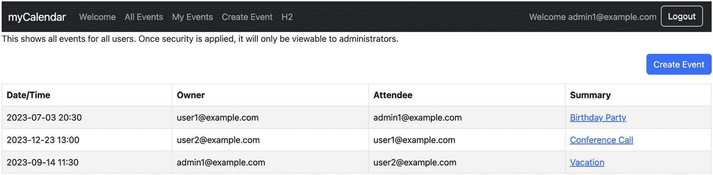

图 19.1 – 所有事件页面

1.  当您使用 `user1@example.com/user1` 登录应用程序并尝试访问 http://localhost:8080/events 时，您将得到以下访问拒绝页面：

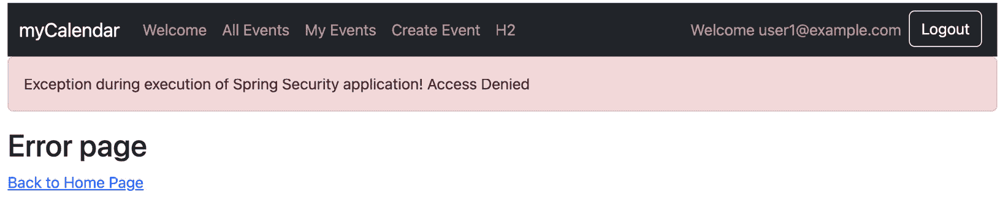

图 19.2 – 未授权用户的访问拒绝页面

1.  如果您使用提供的配置执行应用程序的原生图像，尝试调用 `hasAdminRole()` 方法将导致以下类似错误：

    ```java
    Caused by: org.springframework.expression.spel.SpelEvaluationException: EL1004E: Method call: Method hasAdminRole() cannot be found on type com.packtpub.springsecurity.service.CalendarUserDetails
    at org.springframework.expression.spel.ast.MethodReference.findAccessorForMethod(MethodReference.java:237) ~[na:na]
    at org.springframework.expression.spel.ast.MethodReference.getValueInternal(MethodReference.java:147) ~[na:na]
    at org.springframework.expression.spel.ast.MethodReference$MethodValueRef.getValue(MethodReference.java:400) ~[na:na]
    at org.springframework.expression.spel.ast.CompoundExpression.getValueInternal(CompoundExpression.java:98) ~[na:na]
    at org.springframework.expression.spel.ast.SpelNodeImpl.getTypedValue(SpelNodeImpl.java:119) ~[chapter19.02-calendar:6.1.5]
    at org.springframework.expression.spel.standard.SpelExpression.getValue(SpelExpression.java:309) ~[na:na]
    at org.springframework.security.access.expression.ExpressionUtils.evaluateAsBoolean(ExpressionUtils.java:30) ~[na:na]
    ... 113 common frames omitted
    ```

    上面的错误表明无法在`CalendarUserDetails.class`上找到`hasAdminRole()`方法。

Spring Security 依赖于反射来调用`hasAdminRole()`方法，而**GraalVM**原生镜像本身不支持反射。

要解决这个问题，您必须遵循以下步骤：

1.  向**GraalVM**原生镜像提供提示以启用`CalendarUserDetails#hasAdminRole()`方法上的反射。这可以通过提供自定义提示来实现，如下面的示例所示：

```java
//src/main/java/com/packtpub/springsecurity/configuration/ SpringSecurityHints.java
@Configuration(proxyBeanMethods = false)
@ImportRuntimeHints(SpringRuntimeHints.class)
public class SpringSecurityHints {
    static class SpringRuntimeHints implements RuntimeHintsRegistrar {
       @Override
       public void registerHints(RuntimeHints hints, ClassLoader classLoader) {
          hints.reflection()
                .registerType(CalendarUserDetails.class,
                      MemberCategory.INVOKE_DECLARED_METHODS);
       }
    }
}
```

1.  现在，您可以构建您应用程序的原生镜像，并且它应该按预期运行。

重要提示

您的代码现在应该看起来像`chapter19.03-calendar`中的那样。

# 摘要

在本章中，我们深入探讨了与 Spring Security 特性结合的**GraalVM**原生镜像支持，这些特性在此书中之前未曾涉及。我们介绍了原生镜像的概念，包括**GraalVM**的关键特性和安全优势。

探索的关键主题包括`Spring Boot 3`，它通过**GraalVM**引入了原生镜像生成支持，无缝集成 Spring Security 特性，并使它们与原生镜像兼容。我们已经看到，在某些情况下，我们需要提供**GraalVM**使用的提示。

此外，我们已经成功提高了我们应用程序的性能和安全性，与当代软件开发实践相一致。

在结束本章之前，我想向您表示衷心的祝贺，恭喜您完成了这本书的里程碑式任务。您对学习`Spring Security 6`特性的投入和承诺值得赞扬。

当您反思所涵盖的概念时，请记住，您每迈出一步，朝着掌握这些技术迈进，都让您更接近成为一名熟练的开发者。自信地迎接挑战，知道每个障碍都是成长的机会。继续探索，继续实验，永远不要低估持续学习的力量。

祝您在软件开发之旅上继续取得成功！

# 附录 – 补充参考资料

在本*附录*中，我们将涵盖一些我们认为有帮助（并且大部分未记录）但过于详尽而无法插入章节中的参考资料。

在本节中，我们将涵盖以下主题：

+   使用构建工具（`Gradle`或`Maven`）和 IDE（**IntelliJ IDEA**或**Eclipse**）

+   开始使用 JBCP 日历示例代码

+   生成服务器证书

+   补充资源

本节旨在为您提供指导，以进一步深入和清晰地理解本书中涵盖的代码。

# 构建工具

本书中的代码可以通过**Gradle**或**Maven**执行。

在随后的章节中，我们将详细说明使用`Gradle`或`Maven`作为构建工具执行项目的情况。本书中的代码可以独立于任何**集成开发环境**（**IDE**）运行。

然而，我们将提供使用 **Eclipse** 和 **IntelliJ IDEA** 的实现示例。

在下一节中，我们将演示如何使用 `Gradle` 或 `Maven` 等构建工具。

## Gradle 构建工具

本书中的所有代码都可以使用 `Gradle` 在本地构建，请访问 [`gradle.org/install/`](https://gradle.org/install/)。

由于源代码的根目录已经安装了 `Gradle` 包装器，因此不需要本地安装 `Gradle`。`Gradle` 包装器可以安装在任何子模块中。您可以在 [`docs.gradle.org/current/userguide/gradle_wrapper.xhtml`](https://docs.gradle.org/current/userguide/gradle_wrapper.xhtml) 找到有关 `Gradle` 包装器的更多信息。

## Maven 构建工具

在接下来的章节中，您将找到丰富的代码示例、实用技巧和针对熟悉 **Maven** 的读者的动手练习。

`Maven` 在 [`maven.apache.org/download.cgi`](https://maven.apache.org/download.cgi)。

下载示例代码

您可以从 [`www.packtpub.com`](https://www.packtpub.com) 购买的所有 Packt 书籍的账户中下载示例代码文件。如果您在其他地方购买了这本书，您可以访问 [`www.packtpub.com/support`](https://www.packtpub.com/support) 并注册以将文件直接通过电子邮件发送给您。

在下一节中，我们将深入探讨使用您首选的 IDE，如 **IntelliJ IDEA** 或 **Eclipse**，启动 JBCP 日历示例代码。

# 开始使用 JBCP 日历示例代码

正如我们在 *第一章* 中所描述的，*不安全应用程序的解剖结构*，我们假设您已安装 `Java 17` 作为最低要求。您可以从 Oracle 的网站 ([`www.oracle.com/java/technologies/downloads/`](https://www.oracle.com/java/technologies/downloads/)) 下载 JDK 或使用任何其他 OpenJDK 17 版本。

在本书出版时，所有代码都已使用最新的 **长期支持** (**LTS**) 版本 `Java 21` 进行了验证。

下一个部分将讨论示例代码的结构以及它在您首选的 IDE 中的使用。

## 示例代码结构

示例代码包含多模块 `Gradle` 或 `Maven` 项目的文件夹。每个文件夹命名为 `ChapterNN`，其中 `NN` 是 `章节号`。每个 `ChapterNN` 文件夹包含包含每个里程碑项目的额外文件夹，格式为 `chapterNN.mm-calendar`，其中 `NN` 是 `章节号`，`mm` 是该章节内的 `里程碑`。

为了简化，我们建议你将源代码提取到一个不包含任何空格的路径。每个里程碑都是`章节`中的一个检查点，允许你轻松地将你的代码与书中的代码进行比较。例如，`chapter02.03-calendar`包含日历应用程序*第二章*，*Spring Security 入门*中的里程碑编号`03`。前一个项目位置将是`~/` `Spring-Security-Fourth-Edition/Chapter02/chapter02.03-calendar`。

*第一章*，*不安全应用程序的解剖结构*，和*第二章*，*Spring Security 入门*，已被创建为`Spring`项目，而不是使用`Spring Boot`作为项目基础。

*第三章*，*自定义认证*，将日历项目转换为`Spring` `Boot`代码库。

为了使每个章节尽可能独立，本书中的大多数章节都是基于*第九章*，*开放 OAuth2*，或*第十五章*，*额外的 Spring Security 功能*构建的。这意味着，在大多数情况下，你可以阅读*第九章*，*开放 OAuth2*，然后跳转到书的其他部分。然而，这也意味着，开始每个章节时，重要的是使用章节的`里程碑 00`源代码，而不是继续使用上一章的代码。这确保了你的代码从与章节相同的地方开始。

虽然你可以不执行任何步骤就完成整本书，但我们建议从每个章节的`里程碑 00`开始，并按照书中的步骤进行实施。这将确保你从书中获得最大收益。你可以使用里程碑版本来复制大量代码，或者在遇到问题时比较你的代码。

## 在 IntelliJ IDEA 中使用示例

在`Tomcat`插件配置了`Gradle`或`Maven`以运行嵌入式实例的情况下，有一些事情是运行示例应用程序所必需的，这有助于你更快地开始。

### 在 IntelliJ IDEA 中导入项目

本书使用的多数图表都是从`Gradle`或`Maven`项目中提取的。

IntelliJ IDEA 将允许你导入现有项目，或者你可以直接从源代码库的根目录打开`build.gradle`或`pom.xml`，IDEA 将为你创建必要的项目文件。

1.  一旦你打开 IntelliJ IDEA，你可以使用**打开**选项打开整个项目，如下面的截图所示：

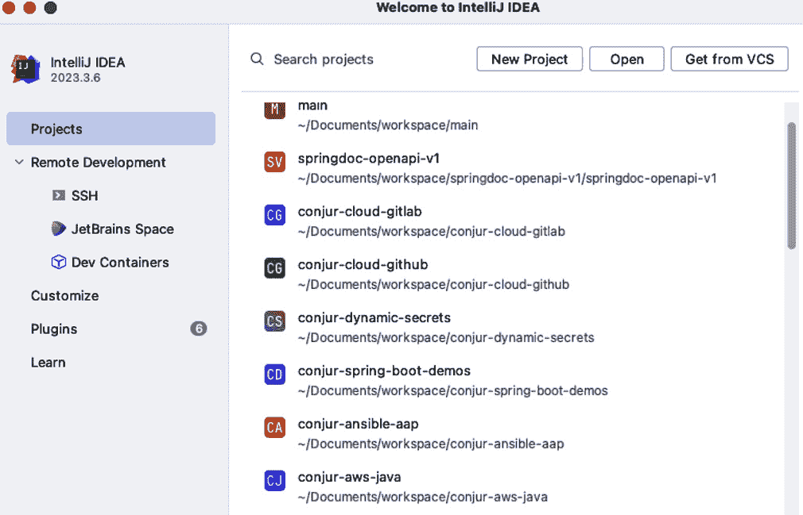

附录图 1 – JBCP 日历示例导入

1.  然后，你将需要选择 IntelliJ IDEA 如何执行此项目，是**Gradle**还是**Maven**，如下面的截图所示：

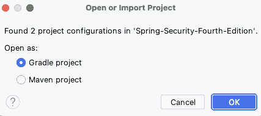

附录图 2 – Gradle 或 Maven 选项

1.  例如，一旦我们选择 **Gradle**，您将能够处理任何章节，布局将如图下截图所示：

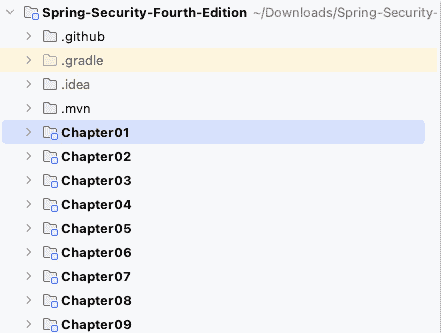

附录图 3 – IDEA 中的章节展示布局

在 **IntelliJ IDEA** 中导入项目后，您可以按照下一节提供的指导运行您的代码。

### 在 IntelliJ IDEA 中运行示例

通过为每个项目创建 **运行/调试配置** 条目来运行里程碑项目。

1.  对于每个 `spring-boot` 项目（从 *第三章**，自定义身份验证*）开始），您可以简单地点击工具栏中的绿色播放按钮，或者右键单击主类并选择 **运行 CalendarApplication**。IntelliJ IDEA 将启动 Spring Boot 应用程序，您将在 **运行** 工具窗口中看到日志。

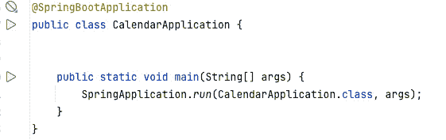

附录图 4 – 使用 IntelliJ IDEA 运行 Spring Boot 项目

1.  对于其他项目，您可以使用终端，如果使用 IntelliJ IDEA，请转到 **文件** | **运行** 并选择 **编辑配置...**，如图下截图所示：

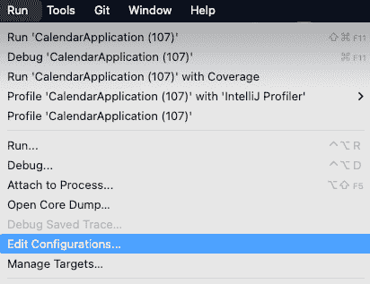

附录图 5 – 自定义应用程序，使用 IntelliJ IDEA 运行

1.  您将看到添加新配置的选项。选择左上角的加号 (**+**) 以选择新的 **Gradle** 配置，如图下截图所示：

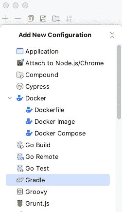

附录图 6 – 自定义应用程序，使用 IntelliJ IDEA 添加新配置

1.  现在，您可以给它起一个名字，例如 `chapter01.00 (bootRun)` 并选择此配置的实际里程碑目录。最后，在 **运行** 选项下输入 `tomcatRun` 以执行，如图下截图所示：

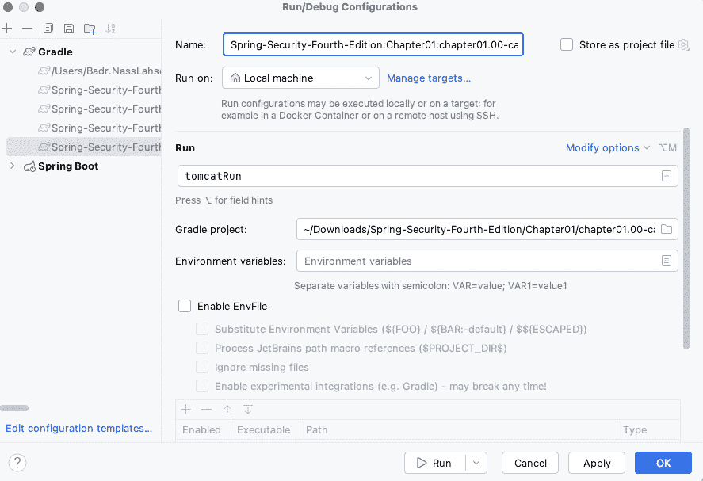

附录图 7 – 自定义项目，使用 IntelliJ IDEA 运行

1.  选择您要执行的配置；点击绿色 **运行** 按钮（如图 *附录**图 7*）。

在下一节中，我们将介绍使用 **Eclipse** 运行示例代码的方法。

## 使用 Eclipse 中的示例

在本节中，我们将介绍 Eclipse 中示例应用程序的使用。在所有项目中，已使用 `Gradle` 或 `Maven` 设置了一个 `Tomcat` 插件，以促进快速启动嵌入式实例，加快您的初始设置过程。

### 在 Eclipse 中导入项目

在您下载并安装 Eclipse IDE ([`www.eclipse.org/downloads/`](https://www.eclipse.org/downloads/)) 之后，启动 Eclipse。

1.  当你第一次打开 Eclipse 时，它将提示你输入工作空间位置。你可能需要转到**文件** | **切换工作空间** | **其他**来创建一个新的工作空间。我们建议输入不包含任何空格的工作空间位置。例如，看看下面的截图：

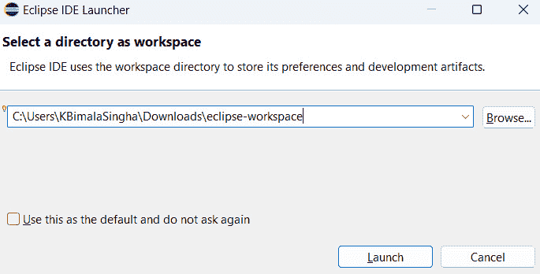

附录图 8 – Eclipse 工作空间选择

1.  一旦你创建了一个新的工作空间，选择**导入项目**。

1.  这次，我们将选择**现有** **Maven 项目**：

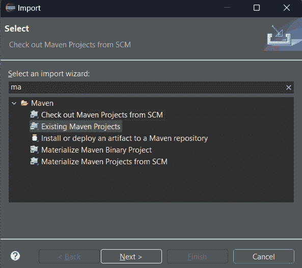

附录图 9 – 将 Eclipse 项目导入为 Maven 项目

1.  浏览到导出代码的位置，并选择代码的父文件夹。你将看到所有项目列出来。你可以选择你感兴趣的项目，或者保留所有项目被选中。如果你决定导入所有项目，你可以轻松地专注于当前章节，因为命名约定将确保项目按照在书中展示的顺序排序：

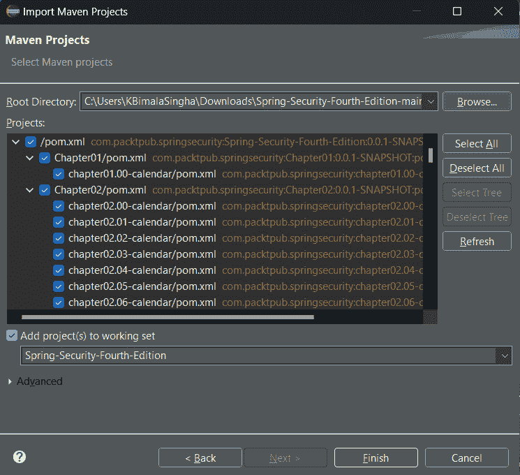

附录图 10 – Eclipse Maven 项目导入确认

1.  你将能够处理任何章节，布局将如以下截图所示：

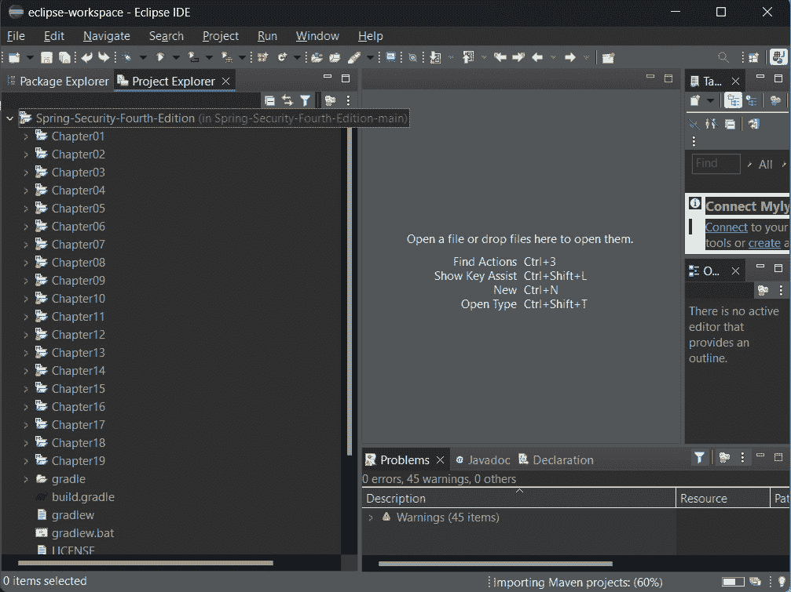

附录图 11 – 使用 Eclipse 的章节展示布局

在**Eclipse**中导入项目后，你可以按照下一节提供的指导运行你的代码。

### 在 Eclipse 内运行示例

要执行每个里程碑项目，你可以按照以下步骤进行：

1.  对于每个 spring-boot 项目（从*第三章**，自定义身份验证*）开始，你只需在 Eclipse 中点击**运行**按钮，或者右键单击你的项目并选择**运行方式** | **Java 应用程序**。

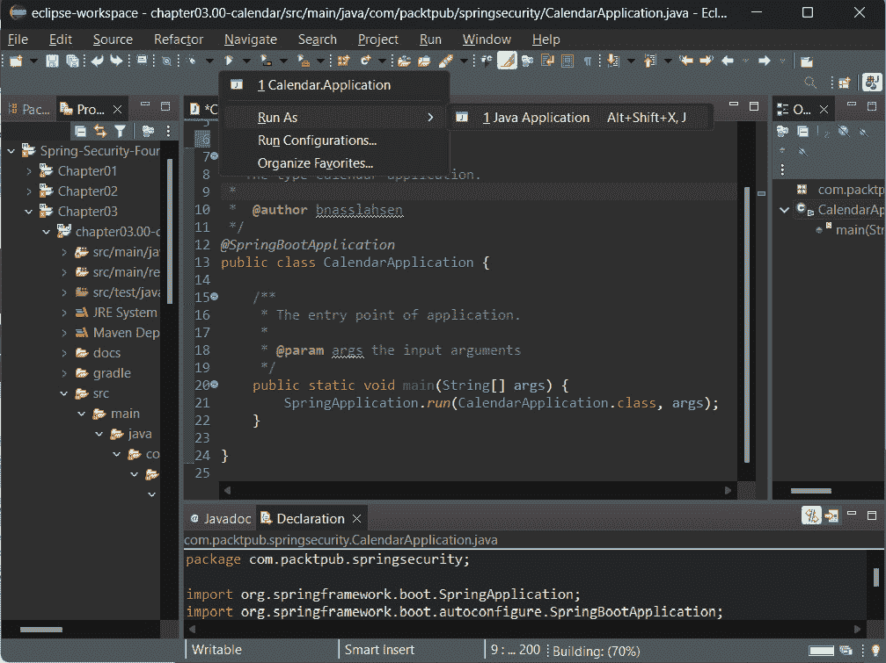

附录图 12 – 使用 Eclipse 运行 Spring Boot 项目

1.  对于其他项目，你可以使用终端，使用 **Eclipse** 中的**运行**按钮，或者右键单击你的项目并选择**运行配置**：

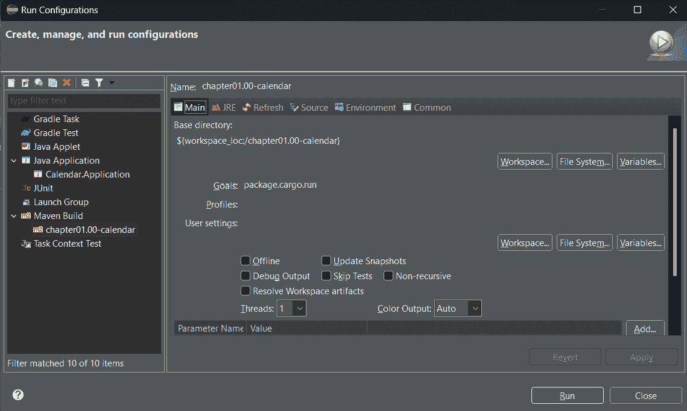

附录图 13 – 自定义应用程序，使用 Eclipse 运行

1.  在 `package cargo:run`。

## 从命令行启动示例

在*第一章*，*不安全应用程序的解剖结构*，和*第二章*，*Spring Security 入门*中，你将使用不同的任务来运行项目。

+   如果你使用 `Gradle`，运行以下命令来启动应用程序：

    ```java
    Maven, run the following command to start the application:

    ```

    ./mvnw package cargo:run

    ```java

    ```

对于本书的其余章节（从 *第三章**，自定义身份验证*）开始，使用了 Spring Boot：

+   如果你正在使用 `Gradle`，请运行以下命令来启动应用程序：

    ```java
    Maven, run the following command to start the application:

    ```

    `./mvnw spring-boot:run`

    ```java

    ```

通常，对于本书的每个章节部分，每个章节里程碑的根目录中都有一个 `README.md` 文件。此文件包括启动应用程序所需的必要命令，针对你首选的构建工具进行了定制。

在下一节中，我们将讨论生成服务器证书。

# 生成服务器证书

一些章节的示例代码（即，*第八章**，使用 TLS 的客户端证书身份验证*，*第九章**，开放 OAuth2*，*第十章**，SAML 2 支持*，以及 *第十八章**，使用中央认证服务进行单点登录*）需要使用 HTTPS 才能使示例代码正常工作。

一些项目已经配置为运行 `HTTPS`；大多数配置都在属性或 `YAML` 文件中管理。

现在，当你从 `Maven` 或 `Gradle` 运行嵌入式 Tomcat 服务器上的示例代码时，你可以连接到 `http://localhost:8080` 或 `https://localhost:8443`。

如果你还没有证书，你必须首先生成一个。

如果你愿意，你可以跳过此步骤并使用包含证书的 `tomcat.keystore` 文件，该证书位于书中示例源代码的 `src/main/resources/keys` 目录中。

在命令提示符中输入以下命令行：

```java
keytool -genkey -alias jbcpcalendar -keypass changeit -keyalg RSA \
-keystore tomcat.keystore
Enter keystore password: changeit
Re-enter new password: changeitWhat is your first and last name? [Unknown]: localhost
What is the name of your organizational unit? [Unknown]: JBCP Calendar What is the name of your organization? [Unknown]: JBCP
What is the name of your City or Locality? [Unknown]: Anywhere What is the name of your State or Province? [Unknown]: UT
What is the two-letter country code for this unit? [Unknown]: US
Is CN=localhost, OU=JBCP Calendar, O=JBCP, L=Anywhere, ST=UT, C=US correct? [no]: yes
```

大多数值都是不言自明的，但你需要确保对 **你的姓名是什么？** 的回答是你将访问 Web 应用程序的宿主。这是确保 SSL 握手成功所必需的。

你现在应该有一个名为 `tomcat.keystore` 的文件位于当前目录中。你可以使用以下命令在相同目录下查看其内容：

```java
keytool -list -v -keystore tomcat.keystore Enter keystore password: changeit
Keystore type: JKS Keystore provider: SUN
...
Alias name: jbcpcalendar
...
Owner: CN=localhost, OU=JBCP Calendar, O=JBCP, L=Anywhere, ST=UT, C=US Issuer: CN=localhost, OU=JBCP Calendar, O=JBCP, L=Anywhere, ST=UT, C=US
```

如你所猜，使用 `changeit` 作为密码是不安全的，因为这是许多 JDK 实现中使用的默认密码。在生产环境中，你应该使用一个安全的密码，而不是像 `changeit` 这样简单的密码。

关于 `keytool` 命令的更多信息，请参阅 Oracle 网站上的文档（[`docs.oracle.com/en/java/javase/17/docs/specs/man/keytool.xhtml`](https://docs.oracle.com/en/java/javase/17/docs/specs/man/keytool.xhtml)）。

如果你遇到问题，你可能还会发现 *CAS SSL 故障排除和参考指南* 有所帮助（[`apereo.github.io/cas/7.0.x/installation/Troubleshooting-Guide.xhtml`](https://apereo.github.io/cas/7.0.x/installation/Troubleshooting-Guide.xhtml)）。

# 补充材料

本节包含了一本书中使用的各种技术和概念的资源列表：

+   **Java 开发工具包下载**: 请参考 [`www.oracle.com/java/technologies/downloads/`](https://www.oracle.com/java/technologies/downloads/) 以下载 JDK。

+   **MVC 架构**: 请参考 [`en.wikipedia.org/wiki/Model%E2%80%93view%E2%80%93controller`](https://en.wikipedia.org/wiki/Model%E2%80%93view%E2%80%93controller)。

+   **Spring Security 网站地址**: 请参考 [`spring.io/projects/spring-security`](https://spring.io/projects/spring-security). 您可以通过此链接找到 Spring Security Javadoc、下载、源代码和参考链接。

+   **Spring 框架**: 请参考 [`projects.spring.io/spring-framework/`](https://projects.spring.io/spring-framework/)。您可以通过此链接找到 Spring 框架 Javadoc、下载、源代码和参考链接。

+   **Spring Boot**: 请参考 [`projects.spring.io/spring-boot/`](https://projects.spring.io/spring-boot/)。您可以通过此链接找到 Spring Boot Javadoc、下载、源代码和参考链接。

+   **Spring Data**: 请参考 [`projects.spring.io/spring-data/`](https://projects.spring.io/spring-data/)。您可以通过此链接找到 Spring Data Javadoc、下载、源代码和参考链接。在这本书中，我们涵盖了 Spring Data 的三个子项目，包括 Spring Data JPA ([`projects.spring.io/spring-data-jpa/`](https://projects.spring.io/spring-data-jpa/)) 和 Spring Data MongoDB ([`projects.spring.io/spring-data-mongodb/`](https://projects.spring.io/spring-data-mongodb/))。

+   **Maven**: 如需了解更多关于 Maven 的信息，请访问他们的网站 [`maven.apache.org`](https://maven.apache.org)。有关 Maven 传递依赖的更多信息，请参阅 *依赖机制简介* 文档，链接为 [`maven.apache.org/guides/introduction/introduction-to-dependency-mechanism.xhtml#Transitive_Dependencies`](https://maven.apache.org/guides/introduction/introduction-to-dependency-mechanism.xhtml#Transitive_Dependencies)。

+   使用 `Gradle` ([`gradle.org`](https://gradle.org)) 而不是使用 `Maven`。

+   **对象关系映射 (ORM)**: 您可以在维基百科上找到更多一般信息，链接为 [`en.wikipedia.org/wiki/Object-relational_mapping`](https://en.wikipedia.org/wiki/Object-relational_mapping)。如果您想获得更多实践指导，您可能还会对 Hibernate（一个常见的 Java ORM 框架）的文档感兴趣，链接为 [`hibernate.org/`](https://hibernate.org/)。

以下是一些 UI 技术：

+   **JSP**: 您可以在 Oracle 的网站上找到更多关于 JSP 的信息，链接为 [`www.oracle.com/technical-resources/articles/javase/servlets-jsp.xhtml`](https://www.oracle.com/technical-resources/articles/javase/servlets-jsp.xhtml)。

+   **Thymeleaf**: 这是一个现代且吸引人的框架，它为 JSP 提供了一个出色的替代方案。额外的优势是它默认提供对 Spring 和 Spring Security 的支持。你可以在[`www.thymeleaf.org/`](https://www.thymeleaf.org/)找到更多关于 Thymeleaf 的信息。
