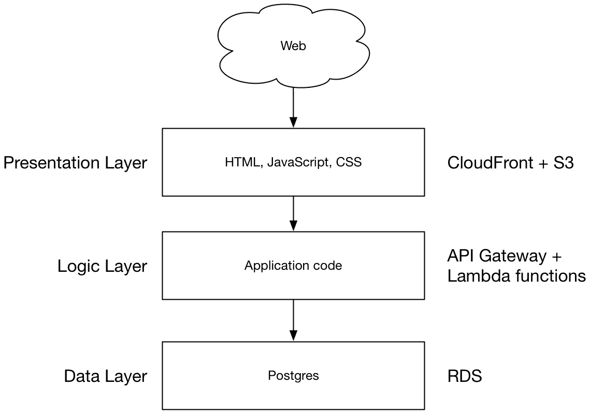
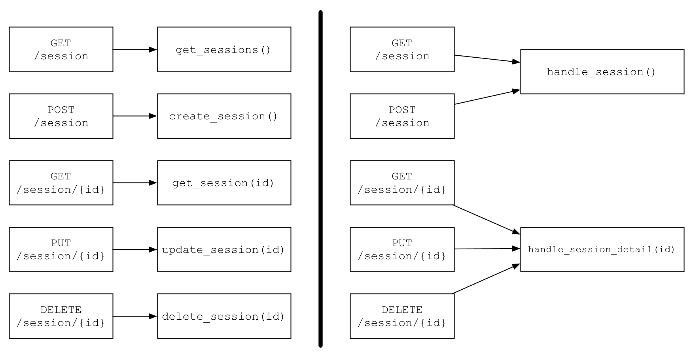
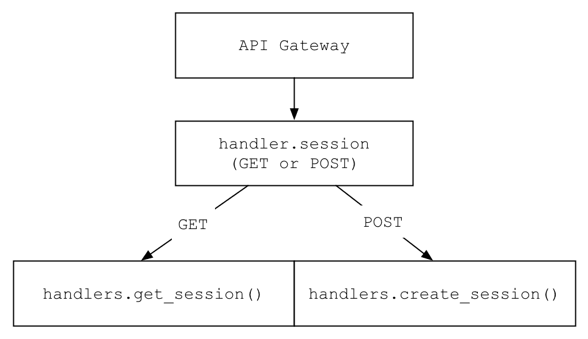
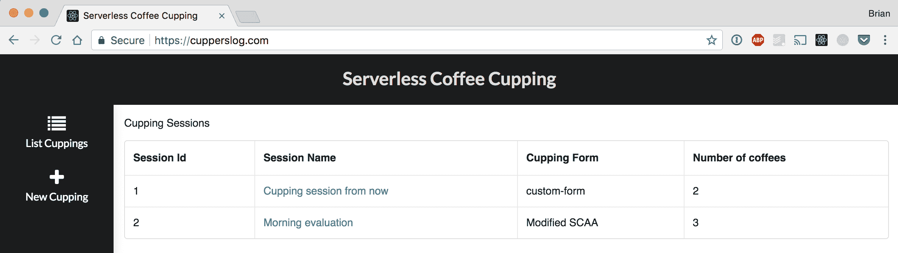
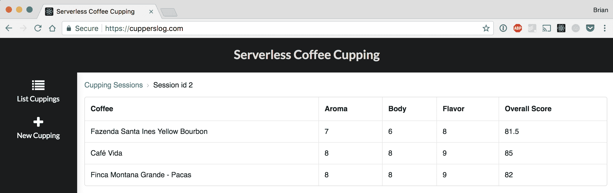
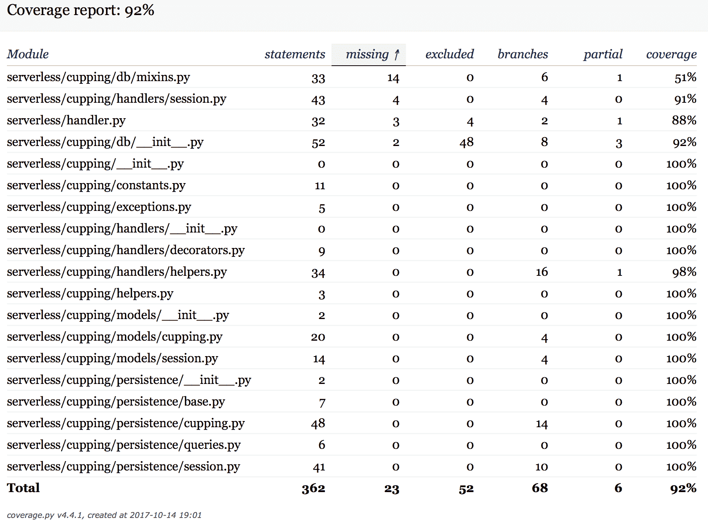

# 第二章：使用 REST 的三层网络应用

应该可以说，绝大多数开发者都知道什么是 REST。一个三层网络应用由以下组成：

+   展示层（HTML 和 CSS）

+   业务逻辑层（应用代码）

+   数据层（关系数据库管理系统或另一种类型的数据存储）

三层网络应用非常知名，并且是目前网络中最常见的架构之一。当考虑网络应用的静态内容（即 HTML、JavaScript 和 CSS）时，读者可能会熟悉这种设计，这些内容是从 **内容分发网络**（**CDN**）提供的，该网络与托管在 Web 服务器上的 RESTful API 通信，而该服务器反过来又与数据库通信。

在本章中，我们将通过使用 HTML、JavaScript 和 CSS 构建展示层，REST API 构建业务逻辑，以及 Postgres 数据库构建数据层的过程来构建一个三层网络应用。最重要的是，并且与本书保持一致，这一切都将使用无服务器技术或服务来完成，你不需要自己管理服务器。

到本章结束时，你可以期待了解以下内容：

+   如何使用 **Amazon Web Services**（**AWS**）Lambda 和 Python 编写 REST API

+   如何构建、管理和部署静态资产到 CDN

+   如何创建和维护 RDS Postgres 数据库

+   设计 RESTful API 的选项，包括不同的语言、框架和函数布局

+   静态资产生命周期管理和缓存以实现最佳性能

# 无服务器工具

由于这是第一个包含应用代码和工作示例的章节，因此讨论一些工具和系统对于本章节和后续章节的设置非常重要。在本章和以下关于网络应用的章节中，我们的工具链将包括来自 AWS 的服务：

+   AWS API Gateway 作为 HTTP 代理

+   AWS Lambda 用于计算

+   AWS S3 用于静态文件服务

+   AWS CloudFront 用于 CDN

+   AWS RDS 用于 RDBMS 管理

+   **AWS Certificate Manager**（**ACM**）用于免费证书管理

虽然 AWS 是平台即服务（PaaS）生态系统中的主导者，但绝对不是唯一的选择。在阅读本章和其他章节时，请记住，这里提出的模式应该适用于任何云提供商，尽管有时需要一定程度的调整。

你可能正在质疑讨论其他服务，如 S3 和 RDS 的理由。非常常见，也许通常是，当人们说“无服务器”时，他们是在谈论 AWS Lambda 或不同云提供商的等效服务中的函数即服务(FaaS)。这个问题是合理的，但也要记住，本书中我们对无服务器架构的定义是完整的系统，你不需要自己管理任何操作系统。你的目标不是维护单个真实或虚拟服务器，并将艰苦的工作推给最喜欢的云提供商，让你能够专注于应用程序。诚然，并非所有云提供商都像 AWS 生态系统那样拥有大量可供我们使用的服务。在选择构建无服务器应用程序的 PaaS 时，请考虑这一点。

使用作为服务(FaaS)作为业务逻辑骨干构建系统是一个正确的步骤；然而，如果你仍在管理数据库，你算无服务器吗？管理自己的 RDBMS 或用于提供静态资产的 Web 服务器会使你脱离无服务器架构的范畴，即使你的计算层是无服务器的。

在第一章“引言”中，我列出了一些流行的框架，这些框架允许我们管理、部署和维护无服务器应用程序。本书中的所有示例应用程序都将使用 Serverless Framework([`serverless.com/`](https://serverless.com/))，这将帮助我们连接各种服务和系统，使我们能够部署代码，并提供更多功能，使开发过程更快、更直接。就像云服务提供商一样，你有很多框架和工具的选择。涵盖所有选项超出了本书的范围，为了简单起见，我们将坚持使用 Serverless Framework，这是一个成熟、广泛使用且经常更新的框架。

从现在开始，当谈到框架本身时，我将使用“Serverless Framework”来区分它和一般无服务器主题。由于名称“无服务器”，在关于无服务器设计模式的书籍中，Serverless Framework 可能会有些令人困惑。从现在起，如果我们讨论的是如何在云服务提供商上部署、管理或以其他方式控制资源的细节，请留意 Serverless Framework。

我们的示例项目将是一个用于专业咖啡评价的 REST API，在咖啡领域被称为“品鉴”。咖啡品鉴在本质上不过是针对单个咖啡的评分的复杂电子表格，评分应用于一个或多个标准，例如酸度、口感、一致性等等。如果你像我一样喜欢咖啡和 API，你应该会喜欢这一章以及随后的章节。

# 系统架构

初看之下，使用 REST API 的三层网络应用程序可能是一个简单的话题和模式。毕竟，只有三层，每层都负责非常具体的工作，最终结果只是一个网络应用程序。然而，任何网络应用程序都有许多细微之处和可以调整的区域。无服务器网络应用程序也不例外。本章将尽可能涵盖更多区域，但不可能包括每个可能的配置或设计选项。

由于我们是负责的软件设计师，让我们从高层次上勾勒出我们的架构，并在处理不同层时深入更多细节：



这张图应该看起来很熟悉，因为它是当今许多客户端-服务器网络应用程序的骨干。让我们从上到下浏览不同的层，在讨论这些层的高层次概念后，我们将通过一个真实世界的示例深入了解实现细节。

你可以在以下存储库中找到本章的所有代码：

[`github.com/brianz/serverless-design-patterns/tree/master/ch2`](https://github.com/brianz/serverless-design-patterns/tree/master/ch2)

尽管这是一个常见且可以说是简单的模式，但在 AWS 上部署这种具有无服务器架构的堆栈时，存在许多可能的复杂性。虽然 AWS 是本章和后续章节的首选 PaaS，但由于 AWS 本身作为一个主题的规模，有许多主题无法深入探讨。如果你在之前的存储库中遇到困难或对任何缺失的内容感到困惑，请随时在 GitHub 上创建一个 issue 以开始对话，我会尽我所能帮助你。

# 展示层

静态文件可以从多个地方提供。在我们的案例中，我们将使用两个不同的 AWS 服务，这些服务将提供良好的性能，将资产传输到客户端，并提供容错和缓存等功能。我们的 HTML、CSS 和 JavaScript 文件都将存储在 S3 桶中。然后我们将使用 CloudFront 创建一个 CDN，这是 AWS 的 CDN 服务。CloudFront 不仅比 S3 本身提供更好的性能；我们还将获得全球分发和缓存我们内容的能力，同时还可以使用 AWS 证书管理器提供的免费 TLS 证书从我们自己的自定义域名提供服务。

# 逻辑层

逻辑层是我们应用程序的核心，也就是我们的代码。在这个和其他示例中，我们将使用 Python 作为我们的编程语言，并将我们的函数作为独立的计算单元部署到 AWS Lambda。Serverless Framework 将使这个过程变得非常简单，这将是快速迭代代码的基础。

# 数据层

虽然这本书的核心焦点不是运行数据库，但管理数据库是现代网络应用程序的一个基本组成部分。在这个模式中，我们将使用托管 PostgreSQL，AWS 的 **关系数据存储**（**RDS**）服务将为我们管理它。

# 逻辑层

应用程序代码可能是最感兴趣的领域，也是与传统托管在管理服务器上的 Web 应用程序相比变化最大的层次，所以让我们从那里开始。

# 应用程序代码和函数布局

让我们区分我们组织逻辑层的两种分类：

+   Lambda 函数在 AWS 中的组织

+   应用程序代码的组织

Lambda 函数是 Lambda 和其他 FaaS 提供商中的工作单元（为了简洁和清晰，我将从此处开始将这些称为 Lambda 函数）。单个 Lambda 函数可以独立更新或部署，而不会影响其他 Lambda 函数。

# Lambda 函数的组织

在 REST API 中，关于每个 API 端点如何映射到函数，你有几种选择。在这个设计中，主要选项是是否让单个 Lambda 函数处理单个 HTTP 动词/资源组合，或者是否让单个 Lambda 函数处理特定资源的所有 HTTP 动词。随着我们通过本章的学习，Lambda 函数的组织和应用程序代码的组织将是相关的，但并不相同：



在前面的图中，我们可以看到一个可能的 REST API 的 Lambda 函数布局。在左侧，独特的函数处理独特的 CRUD 事件和资源组合。在右侧，Lambda 函数对单个资源执行不同的操作（创建、读取、更新或删除）。在第一个模型（图的左侧）中，每个 REST 端点都映射到一个单独的 Lambda 函数。这种设计提供了对函数更新的精细控制，允许在不影响其他 API 的情况下部署单个 API 端点。

主要缺点是，随着 API 的增长，这可能会很快变得难以控制。想象一下，一个有 20 个资源（`session`、`user` 等等）的 API，每个资源有 3 到 4 个操作 `/` HTTP 动词。如果你用一些基本的乘法来跟进这个场景，你需要管理和导航的 Lambda 函数的快速增长将变得明显。

在下一个设计中，逻辑分组将 REST 端点进行分组和触发，实际上这是将请求路由到相应处理程序的主要功能。如果你想象一下这个 API 中列出 `sessions` 的简单情况，一个 HTTP `GET` 请求会进入 `/session` 端点，这将触发 `handle_sessions()` 函数。作为此有效负载的一部分，我们的应用程序代码将知道调用了 `GET` 方法，然后调用 `get_sessions()` 函数，可能和之前的设计相同。这种架构的显著优势是，与之前的设计相比，Lambda 函数的数量大幅减少。缺点是部署更新会影响所有 REST 端点，这些端点由单个函数处理。然而，这也可能是一个优势。如果有共享代码中的错误影响了所有 `/session/{id}` 端点（`GET`、`PUT` 和 `DELETE`），我们只需要更新一个函数来修复所有问题。在之前的设计中，我们需要分别更新三个函数。

对于本章，我们将使用分组设计，以便我们有一个用于 REST 端点分组的单个 Lambda 函数。每个组将共享一个公共 URL 模式，HTTP 动词将用于触发应用程序代码中的不同函数。

# 应用程序代码的组织

我们应用程序代码的组织方式与之前的讨论完全不同，尽管有一些重叠。

在无服务器项目中布局应用程序代码与传统的 Web 应用程序略有不同。虽然这些差异并不那么剧烈，但我发现无服务器项目对没有详细思考的设计或布局更为敏感和难以容忍。因为它启动起来非常容易，所以在思考并回答基本设计决策之前，很容易开始走错方向。

在过去几年里，我在编写无服务器应用程序代码时学到了一些重要的教训：

+   应该使用环境变量进行配置，而不是不同的配置文件

+   应用程序代码应该具有良好的结构，高度模块化，并且具有命名空间

+   在编码开始之前，仔细考虑你需要多少个函数

# 使用环境变量进行配置

如果你熟悉十二要素应用或与 Docker 有过合作，你会知道配置可以使用环境变量来完成，而不是管理多个不同的配置文件。根据十二要素应用([`12factor.net/config`](https://12factor.net/config))：[链接](https://12factor.net/config))

“环境变量易于在部署之间更改，而无需更改任何代码；与配置文件不同，它们被意外检查到代码库中的可能性很小；与自定义配置文件或其他配置机制（如 Java 系统属性）不同，它们是语言和操作系统无关的标准。”

使用环境变量为 FaaS 代码部署到不同的系统（开发、QA、生产等）提供了便利。更改配置可能只需更新函数配置中的变量即可。然而，为了安全和可重复性，环境变量更改应通过某些过程（如 CI/CD）进行，以最大限度地减少错误的机会。

相反，如果使用基于文件的配置，更新应用程序通常需要更新一个文件，可能还需要提交到源代码控制并重新部署整个应用程序。

在我看来，使用环境变量在创建新系统或在不同系统之间部署时，生产力有巨大的提升。要执行新的堆栈部署或现有堆栈的更新，你只需加载新的环境变量并执行一系列标准步骤，这些步骤在堆栈之间不会改变。由于你可以轻松快速地完成这些操作，这鼓励了为不同的目的（开发、测试、生产等）分离堆栈。

# 代码结构

对于任何新的应用程序，都有许多方法可以在磁盘上组织代码。以下结构在我的多个项目中都取得了很好的效果。我鼓励读者将其作为起点，并根据需要调整。如果你使用 Node.js 或其他支持的语言作为你的 FaaS 提供商，这可能会略有不同。在本章中，我们将填充我们的示例咖啡 `cupping` API，并在构建应用程序时添加更多文件：

```java
├── Makefile 
├── README.md 
├── envs/
│   ├── dev 
│   ├── qa 
│   └── production 
├── requirements.txt 
├── serverless/ 
│   ├── cupping/
│   ├── handler.py 
│   ├── lib/
│   └── serverless.yml 
└── tests/
    ├── conftest.py 
    ├── factories.py 
    ├── helpers.py 
    ├── test_session_model.py 
    └── test_session_persistence.py 
```

`Makefile` 可能是你可以跳过的部分。我使用 Docker 作为应用程序开发的宿主环境，因为这是一种在部署和测试期间管理环境变量的相对简单的方法。一个简单的 `Makefile` 可以通过隐藏在 make 目标背后的复杂性，使繁琐的任务变得不那么冗长。

关于这种 Docker 方法论的详细信息，我将指向一篇详细的博客文章 [`blog.brianz.bz/post/structuring-serverless-applications-with-python/`](http://blog.brianz.bz/post/structuring-serverless-applications-with-python/)。在主计算机上运行无服务器应用程序开发，而不需要任何额外的虚拟化（Docker、VirtualBox 等）是完全可行的。最近，这种 Docker/Makefile 模式在我的多个项目中都取得了很好的效果。我仍然使用宿主系统编辑文件，但所有运行时工作（测试、部署、构建包等）都是在 Docker 容器内完成的。

`envs` 目录包含环境变量文件，它们是简单的 `key=value` 对。每个环境都有一个同名的文件。查看前面的示例，应该很清楚每个环境的配置在哪里，以及创建新环境时你需要做什么。

我们将所有代码放入`serverless`目录中，包括我们编写的应用程序代码以及其依赖项。我们的应用程序代码被命名空间到`cupping`目录中。我们将第三方库安装到`lib`目录。当然，随着你编写应用程序，你的应用程序代码将被命名空间到适合你项目的某个名称。我建议使用有意义的名称，而不是像`code`或`app`这样的通用名称，这样可以帮助在你之后加入的新开发者导航源代码树，并且对于一般的清晰度和明确性也是有益的。

与应用程序代码并列存在两个文件——`serverless.yml`，它定义并控制 Serverless 框架，以及`handler.py`，它是任何 API 调用的主要入口点。在前面的图中，我们讨论了 API 端点的逻辑分组将由给定文件中的公共函数处理，该文件是`handler.py`，它将是这些 API 调用的入口点并将困难的工作委托给其他函数。在某种程度上，`handler.py`的工作非常直接，这一点将很快变得明显。

作为有责任心的开发者，我们将确保我们的代码经过良好的测试。在这个项目中，我们选择`pytest`作为测试框架，所有单元测试文件都位于单个`test`文件夹中，还有一些额外的辅助工具和配置实用程序。在前面的示例中，只有两个测试文件；最终项目中将添加更多。你的具体测试策略并不那么重要，重要的是拥有编写良好的测试。无服务器项目部署速度极快，可能会倾向于省略测试。当你可以直接部署并手动测试时，为什么还要编写单元测试呢？拥有健壮的单元测试的好处是无法言喻的。无论你的工具或语言如何，任何大小或复杂度适度的无服务器项目都将从测试中受益，你可以本地运行或在持续集成平台或系统上运行。测试让我们有信心快速频繁地部署，并为我们未来的持续交付做好准备，允许 CD 系统仅在测试通过后自动部署我们的代码。

# 函数布局

在我们的示例中，我们将实现一个模式，其中单个 Lambda 函数将处理单个 URL 端点分组。我们将实现的第一组端点如下：

+   列出咖啡`cupping`会话：`GET /session`

+   创建咖啡`cupping`会话：`POST /session`

+   获取咖啡`cupping`会话详情：`GET /session/{id}`

+   删除咖啡`cupping`会话：`DELETE /session/{id}`

两个独特的 URL 将映射到两个 Lambda 函数。这些 Lambda 函数将负责检查从 API Gateway 传入的 HTTP 请求，确定正在调用哪个 HTTP 方法，并调用适当的应用程序代码以满足请求：



对于`/session`端点的请求路由。应用程序代码将检查 HTTP 方法并将路由到适当的执行应用程序代码。

# 展示层

展示层不一定是最令人兴奋的领域，但事实上，它是整个网络应用的入口点，你应该仔细考虑细节。HTML、CSS 和 JavaScript 文件的简单部署可能会导致加载时间变慢，这对用户体验有显著影响。

当在 AWS 上构建无服务器系统时，有几个不同的服务使我们能够轻松托管静态资产。其他 PaaS 系统也有类似的提供，尽管可能没有与所有 AWS 服务一一对应。

# 使用 S3 的文件存储

任何前端资产都需要一个文件系统作为家。在这种情况下，自然的选择是 AWS**简单存储服务**（**S3**），这是亚马逊的高耐用性对象存储服务。S3 宣称 99.999999999%的耐用性，所以可以说我们的文件在我们需要的时候都会可用。虽然可以从 S3 作为自定义域上的网站提供内容，但这并不是这种场景的最佳选择。AWS CloudFront 将帮助我们快速有效地将文件分发给最终用户。

# 使用 CloudFront 的 CDN

CloudFront 是亚马逊的 CDN 服务。CDN 的主要关注点是提高对最终用户的静态资产交付。这项任务通常是通过在全球范围内运行多个**存在点**（**POPs**）并将内容分布在这些不同的地理位置来完成的。当地球上某个地方的用户请求一个或多个文件时，CDN 可以获取最接近用户的文件以最小化延迟。当然，这只是一个对单个 CDN 功能的简单和简化的解释。总之，CDNs 帮助我们加快内容的交付，并且应该在任何网络应用中使用。

CloudFront 有一些非常不错的功能，将允许我们与其他 AWS 服务集成。我们将创建一个 CloudFront 分发，它将从 S3 中提取我们的内容。这样，CloudFront 是一个帮助加速内容交付的层，但它本身并不拥有任何内容。我们将能够配置缓存控制以满足我们的需求，并且还可以通过 AWS 证书管理器提供的免费 TLS 证书在自定义域上提供我们的内容。所有这一切都得益于 CloudFront。

# 数据层

可以说，现在的大多数网络应用都拥有某种数据存储，无论是关系型数据库（PostgreSQL、MySQL、SQLServer 等等），非关系型数据库（MongoDB、Redis、Cassandra 等等），甚至是静态文件存储（S3、OS 文件系统等等）。

AWS RDS 服务将为我们咖啡“品鉴”应用程序管理一个 PostgreSQL 数据库。RDS 提供了不同的 RDBMS 选项，最显著的是 PostgreSQL、MySQL、Oracle 和 SQLServer。还有其他选择，我鼓励您查看各种服务。在这个练习中，我们将使用 RDS 上托管的标准 PostgreSQL 数据库。RDS 提供了许多配置选项，我们不会涉及。只需知道，使用 RDS 运行、配置和管理高可用性 RDBMS 实例是可能的，并且相当简单。其他 PaaS 提供商也提供类似的服务用于关系数据库。

# 编写我们的逻辑层

既然我们已经涵盖了整体设计和不同层级，让我们着手实现我们的应用程序代码。

# 应用程序入口点

每个应用程序，无论是网络应用程序还是其他类型的，都需要一个主要的入口点。在我们的案例中，当 Lambda 函数被调用时，我们将使用 `handler.py` 来开始应用程序的执行。Serverless Framework 应用程序在您初始化一个新项目时会生成一个 `handler.py` 文件，因此这种模式应该对任何之前使用过 Serverless 的人来说都很熟悉。如果您从未使用过 Serverless Framework，以下将是一个全面的介绍：

```java
import sys

from pathlib import Path

# Munge our sys path so libs can be found
CWD = Path(__file__).resolve().cwd() / 'lib'
sys.path.insert(0, str(CWD))

import simplejson as json

from cupping.handlers.session import (
        handle_session,
        handle_session_detail,
)

from cupping.exceptions import Http404

CORS_HEADERS = {
        'Access-Control-Allow-Origin': '*',
        'Access-Control-Allow-Credentials': True
}

def session(event, context):
    """/session endpoint for POST or GET"""
    http_method = event['httpMethod']

    status_code = 200
    response = {}

    try:
        response = handle_session(http_method, event)
    except Exception as e:
        status_code = 500
        # TODO - log error
        response = {'errors': ['Unexpected server error']}

    response = {
        'statusCode': status_code,
        'body': json.dumps(response),
        'headers': CORS_HEADERS,
    }

    return response

def session_detail(event, context):
    http_method = event['httpMethod']

    status_code = 200
    response = {}

    try:
        response = handle_session_detail(http_method, event)
    except Http404 as e:
        status_code = 404
        response = {'errors': [str(e)]}
    except Exception as e:
        status_code = 500
        # TODO - log error
        response = {'errors': ['Unexpected server error']}

    response = {
        'statusCode': status_code,
        'body': json.dumps(response),
        'headers': CORS_HEADERS,
    }

    return response
```

我们的 `handler.py` 代码并不复杂，并将大部分应用程序逻辑委托给应用程序代码的不同部分（命名空间在 `cupping` 包中）。这种为所有 Lambda 函数拥有单个入口点的模式有几个优点。

当 Lambda 函数执行时，它们只知道它们所知道的内容。也就是说，我们作为应用程序开发者习惯于在某个已知位置（默认的系统包位置）安装额外的包，或者可能创建一个 Python `virtualenv` 并配置服务器在导入周期中查找那里。在 Lambda 中，我们负责自己管理这一点。应用程序代码不知道在没有被告知要查找的地方之外如何查找包。下面的代码块显示了如何操作 Python 的 `path`，以便它可以找到我们希望使用的任何额外包。

```java
    import sys

    from pathlib import Path

    # Munge our sys path so libs can be found
    CWD = Path(__file__).resolve().cwd() / 'lib'
    sys.path.insert(0, str(CWD))
```

这四行代码完成了解析 `handler.py` 文件当前目录并在其上附加 `/lib` 的任务。结果是我们在其中安装了所有系统包的 `lib` 目录的绝对路径。在部署步骤中，Serverless Framework 将打包所有位于或低于 `serverless.yml` 文件同一目录级别的目录和文件，从而使我们的 `lib` 在运行时可供应用程序代码使用。任何第三方库的导入语句都将按预期工作，只需手动将 `lib` 的完整路径添加到系统路径中即可。在上面的示例中，有一个对第三方 `simplejson` 模块的导入。如果这个导入放在 `sys.path.insert` 调用之上，它将会失败。

当路径操作尽可能快地发生时（即，在 `handler.py` 被调用时立即发生），我们的应用代码的其他部分可以导入包，而不会出现导入失败的风险。如果仅在需要特定包时在不同文件中执行此路径操作，那么错误是不可避免的，因为你可能会在某处忘记包含此逻辑。此外，在单个位置完成这项工作意味着没有逻辑重复。

# 应用逻辑

由于我们的处理函数非常简单，让我们来看看应用代码，看看具体发生了什么。我们的咖啡品鉴 API 相对简单，目前只处理一种资源类型，即咖啡 `cupping` 会话对象。在继续之前，查看此资源类型的形状是有帮助的：

```java
    {
     "name": "Cupping session for Serverless Patterns",
     "formName": "Modified SCAA",
     "cuppings": [
     {
       "name": "Guatemala Huehuetenango",
       "overallScore": "85.5",
       "scores": {
         "Aroma": 8.6,
         "Body": 8,
         "Flavor": 10
       },
       "notes": "This was pretty good",
       "descriptors": ["woody", "berries"]
     },
     {
       "name": "Ethiopia Yirgacheffe",
       "overallScore": "90",
       "scores": {
         "Aroma": 8.6,
         "Body": 8,
         "Flavor": 10
       },
       "notes": "Nice",
       "descriptors": ["blueberry"]
     }
     ]
    }
```

该应用的大部分逻辑仅仅是 JSON 和数据库记录之间的转换。在本书的上下文中，实际的应用代码并不重要。如果你想了解更多关于实际实现的信息，我鼓励你查看 [`github.com/brianz/serverless-design-patterns`](https://github.com/brianz/serverless-design-patterns) 的源代码。

`handler.py` 中的逻辑将把 API 请求委派给 `cupping/handlers/session.py` 文件，你可以在下面的代码中看到。这里的目的是为特定的 URL 模式（即 `/session`，`/session/{id}`）和特定的 HTTP 动词（即 `GET`，`POST`，`DELETE`）提供服务，并执行相应的应用代码：

```java
from schematics.exceptions import DataError

from .decorators import decode_json
from .helpers import (
        create_session_from_json_payload,
        prettify_schematics_errors,
)

from ..models import (
        CuppingModel,
        SessionModel,
)
from ..persistence import Session, queries
from ..exceptions import Http404, InvalidInputData

def get_sessions(data):
    sessions = queries.get_sessions()
    models = [SessionModel.from_row(s) for s in queries.get_sessions()]
    return {'sessions': [m.to_native() for m in models]}

@decode_json
def create_session(json_payload):
    if not json_payload or not hasattr(json_payload, 'get'):
        return {'errors': ['Invalid input data']}

    print('Creating session', json_payload)

    try:
        session = create_session_from_json_payload(json_payload)
        print('Created session: %s' % (session.id, ))
        response = {
                'session': {
                    'id': session.id,
                    'name': session.name,
                }
        }
    except InvalidInputData as e:
        response = {'errors': e.errors}

    return response

def _get_session_from_path_parameters(data):
    try:
        session_id = int(data.get('pathParameters', {}).get('id'))
    except (AttributeError, TypeError, ValueError):
        raise Http404('Invalid session id')

    session = queries.get_session_by_id(session_id)
    if session is None:
        raise Http404('Invalid session id')

    return session

def get_session(data):
    print('Reading session', data)
    session = _get_session_from_path_parameters(data)
    model = SessionModel.from_row(session)
    return {'session': model.to_native()}

def handle_session(http_method, payload):
    method_map = {
            'GET': get_sessions,
            'POST': create_session,
    }
    method = http_method.upper()
    return method_mapmethod

def handle_session_detail(http_method, payload):
    method_map = {
            'GET': get_session,
            'DELETE': delete_session,
    }
    method = http_method.upper()
    return method_mapmethod
```

最后两个函数是进入我们应用这一部分的入口，其中 HTTP 动词映射到不同的函数。

# 将 handler.py 通过 API Gateway 连接到 Lambda

接下来，我们需要将我们的 API 端点连接到 Lambda 和 `handler.py` 入口点。在 `serverless.yml` 配置文件中，这种连接看起来是这样的：

```java
functions:
  HandleSession:
    handler: handler.session
    events:
      - http:
          path: session
          method: get
          cors: true
      - http:
          path: session
          method: post
          cors: true
  HandleSessionDetail:
    handler: handler.session_detail
    events:
      - http:
          path: session/{id}
          method: get
          cors: true
          request:
            parameters:
              paths:
                id: true
      - http:
          path: session/{id}
          method: delete
          cors: true
          request:
            parameters:
              paths:
                id: true
```

我们定义了两个具有不同配置选项的 Lambda 函数，`HandleSession` 和 `HandleSessionDetail`。

在每个函数名称下，有多个语句控制配置。查看这两个部分，你会注意到 `handler:` 语句，它指示 Lambda 在 Lambda 函数执行时调用哪个代码。对于两者，我们都会运行在前面代码片段中提到的 `handler.py` 中的一个 Python 函数。

但是什么调用这些 Lambda 函数的呢？`events:` 部分负责设置调用点和建立特定事件与我们的 Lambda 函数之间的连接。在 FaaS 生态系统中，函数是在响应事件时被调用的。在 AWS 生态系统中，可以触发 Lambda 函数的事件数量相当庞大。在这种情况下，我们正在配置事件以成为具有特定路径和 HTTP 方法的 HTTP 端点。API Gateway 是一个代理，它将为我们提供独特的 HTTPS URL，这些 URL 将根据我们的配置连接到我们的 Lambda 函数。随着你阅读配置，我们的设计和意图应该很清楚。再次强调，使用这些技术设置 API 的方法似乎无穷无尽，而这个例子只是触及了讨论整体模式的一角。

由于前端 JavaScript 代码将向托管在不同域上的无服务器后端发送 HTTP 请求，因此需要为每个 API 端点设置 CORS。通过在 `serverless.yml` 中为每个端点添加 `cors: true` 来控制 CORS 非常简单。除了这个设置之外，应用程序代码还必须明确地在响应中返回正确的头信息。

# 部署 REST API

现在是更有趣的部分，我们将使用 Serverless Framework 来部署我们的 REST API。到目前为止，我们还没有讨论在 AWS 上实现无服务器架构时的各种配置选项。我将在本章后面部分介绍不同的可能性，以及我们的特定配置。

我使用 Docker 作为构建和部署工具的模式使这个过程变得稍微容易一些。你不需要这样做，可能还有其他方法可以使这个过程更加简单。

我们将在运行中的 Docker 容器内部进行所有打包构建和部署，我使用以下 `Makefile` 目标来启动并进入该容器：

```java
brianz@gold(master=)$ ENV=dev make shell
```

这相当于以下 Docker 命令：

```java
docker run --rm -it \
 -v `pwd`:/code \
 --env ENV=$(ENV) \
 --env-file envs/$2 \
 --name=coffee-cupping-$(ENV) \
 verypossible/serverless:1.20.0-python3 bash
```

这里没有什么神奇的地方。我们正在从一个包含 Serverless Framework 以及一些其他 Python 包（用于 Python 3 运行时）的镜像启动 Docker 容器。主要的技巧是，根据容器创建时的 `ENV` 设置，我们从所需的 `envs` 文件中提取环境变量，并将它们加载到正在运行的容器中。然后可以从 `serverless.yml` 中引用这些环境变量，并将它们注入到 Lambda 函数中，从而通过从本地系统上的文件开始来控制最终应用程序的配置。详细的说明超出了本文的范围，但可以在 [`blog.brianz.bz/post/structuring-serverless-applications-with-python/`](http://blog.brianz.bz/post/structuring-serverless-applications-with-python/) 上查看。

我在这里运行的`Makefile`和命令并不复杂；然而，如果你不熟悉 Docker 或 make，它们可能看起来很复杂。我鼓励那些不熟悉它们的人阅读`Makefile`目标，并在自己的环境中进行一些探索。[`github.com/brianz/serverless-design-patterns/blob/master/ch2/Makefile`](https://github.com/brianz/serverless-design-patterns/blob/master/ch2/Makefile)。如果你遇到困难或需要更多澄清，请随时在 GitHub 上提交问题。

现在我们已经在一个容器内，所有的配置都通过环境变量设置好了，我们可以部署整个栈。我们的第一步是确保我们的库已经构建并安装到`lib`目录中。在 Python 世界中，`pip`命令可以帮助我们。有关详细信息，请查看存储库中的`Makefile`。因此，我们进行初始部署的步骤如下：

```java
root@091655eda5d0:/code# make libs
......
# packages now installed in libs
....
root@091655eda5d0:/code# make deploy 
cd serverless && sls deploy -s dev 
Serverless: Packaging service... 
Serverless: Excluding development dependencies... 
Serverless: Uploading CloudFormation file to S3... 
Serverless: Uploading artifacts... 
Serverless: Uploading service .zip file to S3 (5.27 MB)... 
Serverless: Validating template... 
Serverless: Updating Stack... 
Serverless: Checking Stack update progress... 
.............. 
Serverless: Stack update finished... 
Service Information 
service: coffee-cupping 
stage: dev 
region: us-west-2 
api keys: 
 None 
endpoints: 
 GET - https://2treukfv8j.execute-api.us-west-2.amazonaws.com/dev/session 
 POST - https://2treukfv8j.execute-api.us-west-2.amazonaws.com/dev/session 
 GET - https://2treukfv8j.execute-api.us-west-2.amazonaws.com/dev/session/{id} 
 DELETE - https://2treukfv8j.execute-api.us-west-2.amazonaws.com/dev/session/{id} 
functions: 
 HandleSession: coffee-cupping-dev-HandleSession
```

# 部署 Postgres 数据库

许多用于处理 AWS 无服务器架构的框架都公开了访问`CloudFormation`的权限，这是 AWS 用于将多个相关资源作为一个单一实体进行管理的工具。Serverless Framework 也不例外，实际上，`CloudFormation`接口是直接使用`CloudFormation`模板，并添加了一些针对变量（包括环境变量）的便捷功能。这里的一个共同主题是，这是一个非常大的主题，细节超出了本书的范围。

`CloudFormation`通过在`serverless.yml`中设置几行配置，代表我们创建 RDS 实例。细节不在此处，注意如何多次引用`${env:VPC_ID}`和其他对`${env:}`的调用。`${env}`语法是从存在于我们的容器启动过程中的 Docker 容器中的环境中提取变量的方法。如果你有管理环境变量的方法，你可以在主机系统上完成相同的事情。

这种设置的复杂性很大程度上源于 Lambda 函数默认情况下无法访问**虚拟私有云**（**VPC**）内的 AWS 资源。由于 RDS 实例需要在 VPC 内运行，Lambda 函数需要配置为在同一个 VPC 内运行，并相应地设置权限：

```java
resources:
  Resources:
    ServerlessSecurityGroup:
      Type: AWS::EC2::SecurityGroup
      Properties:
        GroupDescription: SecurityGroup for Serverless Functions
        VpcId: ${env:VPC_ID}
    RDSSecurityGroup:
      Type: AWS::EC2::SecurityGroup
      Properties:
        GroupDescription: Ingress for RDS Instance
        VpcId: ${env:VPC_ID}
        SecurityGroupIngress:
        - IpProtocol: tcp
          FromPort: '5432'
          ToPort: '5432'
          SourceSecurityGroupId:
            Ref: ServerlessSecurityGroup
    RDSSubnetGroup:
      Type: AWS::RDS::DBSubnetGroup
      Properties:
        DBSubnetGroupDescription: RDS Subnet Group
        SubnetIds:
          - ${env:SUBNET_ID_A}
          - ${env:SUBNET_ID_B}
          - ${env:SUBNET_ID_C}
    RDSPostgresInstance:
      Type: AWS::RDS::DBInstance
      Properties:
        AllocatedStorage: 100
        AutoMinorVersionUpgrade: true
        AvailabilityZone: ${self:provider.region}a
        DBInstanceClass: db.t2.micro
        DBName: ${env:CUPPING_DB_NAME}
        DBSubnetGroupName:
          Ref: RDSSubnetGroup
        Engine: postgres
        EngineVersion: 9.6.2
        MasterUsername: ${env:CUPPING_DB_USERNAME}
        MasterUserPassword: ${env:CUPPING_DB_PASSWORD}
        PubliclyAccessible: false
        VPCSecurityGroups:
          - Fn::GetAtt: RDSSecurityGroup.GroupId
```

在部署过程中，Serverless Framework 会将任何定义的`Resources`添加到默认的`CloudFormation`模板中，并将它们一起部署。我们的数据库描述完成后，我们可以执行`make deploy`来查看我们的专用 PostgreSQL 资源。

RDS 和其他托管数据存储并非万能的解决方案。这些系统仍然可能崩溃，并且在计算能力方面存在实际限制。然而，使用托管数据存储的一个显著好处是将管理、监控和配置的辛勤工作委托给其他人。由于各种原因，无服务器架构在这里并不准确。我将断言，托管数据库可以减轻管理系统的许多负担，并且非常适合真正的无服务器架构。

# 设置静态资源

设置 S3 存储桶和 CloudFront 分发以托管静态媒体并不复杂，从理论上讲，我们可以将此添加到 `serverless.yml` 文件的 `Resources` 部分中。Serverless 能够通过 `CloudFormation` 管理如此多的资源是一个滑梯，因为设置系统可以迅速变成学习和调试 `CloudFormation` 的练习。`serverless.yml` 文件中不断增长的 `Resources` 部分的另一个缺点是部署将变得越来越长。在开发期间，只部署应用程序代码是可能的，这会导致部署时间以秒计算；但每当更新某些系统资源，包括环境变量时，整个 `CloudFormation` 堆栈都需要更新。

我们不是通过 `serverless.yml` 创建 S3 存储桶和 CloudFront 分发，而是可以使用专为这个目的设计的单独的 `CloudFormation` 模板。将这一步骤拆分出来的另一个原因是这个层很少改变。一旦 CloudFront 分发设置完成，有很大可能性你很长时间内甚至永远都不需要更改任何东西。

以下存储库包含一个 `CloudFormation` 模板、一个辅助脚本和文档，用于在 AWS 上设置单页网络应用程序：

[`github.com/verypossible/cloudfront-single-page-app`](https://github.com/verypossible/cloudfront-single-page-app)

再次强调，你可以通过 GitHub 存储库阅读此堆栈创建的详细信息。在选择包含必要变量的此堆栈后，我们将得到以下结果：

+   一个 S3 存储桶，将托管我们所有的静态内容

+   一个 CloudFront 分发，将从 S3 拉取并缓存内容

+   为 `*.cupperslog.com` 提供免费的 TLS 证书

+   一个 Route53 记录，执行以下操作：

    +   将 [`cupperslog.com`](https://cupperslog.com) 指向 CloudFront 分发

    +   将所有 `http://` 流量重定向到 `https://`

    +   缓存静态资源 10 分钟：

```java
brianz@gold(master=)$ AWS_DEFAULT_REGION=us-east-1 ./manage-stack.sh create --domain cupperslog.com --zone-id ZNGYF5FXIUL0Z --name cupperslog 
{ 
 "StackId": "arn:aws:cloudformation:us-east-1:875406499000:stack/cupperslog/e7f15a50-b03c-11e7-97b0-5001ff34b4a6" 
} 
```

CloudFront 分发的创建可能需要几分钟到几个小时，这也是我们将此与我们的应用程序代码和数据库分开的另一个好理由。一旦完成，所需做的就是将静态资源上传到 `CloudFormation` 为你创建的 S3 存储桶。请确保访问控制策略设置为 `public-read`，因为这是一个公开可访问的网站。上传可以通过许多工具完成，AWS CLI 工具就是其中之一：

```java
brianz@gold$ aws s3 cp \
   build/ \
   --acl public-read \
   --recurisve \
   s3://cupperslog-s3bucketforstaticcontent-nswgo5ega4r1
```

我用于 S3 文件管理的其他工具包括 OS X 的 Cyberduck、Firefox 的 S3 Organizer 和常规的 AWS 网页界面。它们都或多或少地做同样的事情，所以选择适合你的工具。

对于我们的示例应用程序，前端将包括一个简单的 React 应用程序，允许用户执行以下操作：

+   列出咖啡 `杯测` 会话

+   查看咖啡 `杯测` 会话详情

+   创建一个新的咖啡 `杯测` 会话

+   删除一个咖啡 `杯测` 会话

应该很明显，这些示例中没有认证和用户的概念。这个应用程序是为了演示无服务器模式而构建的，即使是用户认证和授权这样的关键细节也不适合放在这一章中。

# 查看已部署的 Web 应用程序

一切准备就绪后，我们现在可以将前端资源上传到 S3。我们不会审查实际的 React 前端代码，但如果您感兴趣，可以在 GitHub 仓库的[`github.com/brianz/serverless-design-patterns/tree/master/ch2/ui`](https://github.com/brianz/serverless-design-patterns/tree/master/ch2/ui)中查看该 UI 代码。

使用前面的`aws s3 cp`命令，前端代码的最终生产构建被上传到 S3，并最终由 CloudFront CDN 提供所需的内容。当第一页渲染时，会向我们的无服务器后端发送请求，以获取所有咖啡`cupping`会话的列表：



一个非常常见的问题，但人们常常会忘记的是跨源资源共享（CORS），这是浏览器实施的一项安全措施。我们的无服务器后端被设置来规避这个问题，使得开发过程变得更快。对于真正的生产系统，最好只允许您自己的域进行 CORS，或者更好的做法是将无服务器后端运行在您自己的域上，而不是 API Gateway 自动生成的域。使用 AWS API Gateway 可以在自定义域上运行无服务器 API，但这超出了本章的范围。

点击单行，将加载特定会话的详细信息页面：



# 运行测试

作为负责任的开发者，我们已经为我们的应用程序编写了一套完整的单元测试。目前，测试是在我们的 Docker 容器内手动运行的。所使用的 Docker 镜像已安装`py.test`和一些覆盖率工具。

运行测试的唯一依赖是 PostgreSQL。Docker 再次使得运行 PostgreSQL 容器并将其连接到我们的应用程序容器变得非常简单。有多种策略可以实现这一点，从运行 Docker Compose 到仅使用`docker run`启动容器并手动连接容器。为了简单起见，我使用了后者。有关详细信息，请参阅仓库`Makefile`中的目标。

要运行测试，在容器内执行`make tests`。为了简洁和清晰，我已经删除了大部分输出：

```java
root@d8dd5cc4bb86:/code# make tests
py.test --cov=serverless/ --cov-report=html tests/
Connected to: postgresql://postgres:@cupping-rltest-postgres:5432/test_cupping_log
........
==== test session starts ====
platform linux -- Python 3.6.2, pytest-3.2.1, py-1.4.34, pluggy-0.4.0
rootdir: /code, inifile:
plugins: mock-1.6.2, cov-2.5.1
collected 105 items

tests/test_cupping_model.py .........
tests/test_cupping_persistence.py ......................
tests/test_handler.py ...
tests/test_helpers.py .
tests/test_session_handler.py ...........................
tests/test_session_models.py ......
tests/test_session_persistence.py .....................................

--- coverage: platform linux, python 3.6.2-final-0 ---
Coverage HTML written to dir htmlcov

==== 105 passed in 2.04 seconds ===
```

结果是一个`htmlcov/index.html`文件，它以可视化的方式显示了应用程序中的测试覆盖率，并突出显示了在测试运行期间未执行的行：



上一张图是`pytest`和覆盖率库的测试覆盖率报告

如果我们特别要求，覆盖率也可以在控制台上显示：

```java
----------- coverage: platform linux, python 3.6.2-final-0 -----------
Name Stmts Miss Branch BrPart Cover
------------------------------------------------------------------------------
serverless/cupping/__init__.py 0 0 0 0 100%
serverless/cupping/constants.py 11 0 0 0 100%
serverless/cupping/db/__init__.py 52 2 8 3 92%
serverless/cupping/db/mixins.py 33 14 6 1 51%
serverless/cupping/exceptions.py 5 0 0 0 100%
serverless/cupping/handlers/__init__.py 0 0 0 0 100%
serverless/cupping/handlers/decorators.py 9 0 0 0 100%
serverless/cupping/handlers/helpers.py 34 0 16 1 98%
serverless/cupping/handlers/session.py 43 4 4 0 91%
serverless/cupping/helpers.py 3 0 0 0 100%
serverless/cupping/models/__init__.py 2 0 0 0 100%
serverless/cupping/models/cupping.py 20 0 4 0 100%
serverless/cupping/models/session.py 14 0 4 0 100%
serverless/cupping/persistence/__init__.py 2 0 0 0 100%
serverless/cupping/persistence/base.py 7 0 0 0 100%
serverless/cupping/persistence/cupping.py 48 0 14 0 100%
serverless/cupping/persistence/queries.py 6 0 0 0 100%
serverless/cupping/persistence/session.py 41 0 10 0 100%
serverless/handler.py 32 3 2 1 88%
------------------------------------------------------------------------------
TOTAL 362 23 68 6 92%
```

# 迭代和部署

在开发此类应用程序时，不可避免地会有多次部署，甚至在第一个生产版本发布后也是如此。无服务器架构显著加快了这一过程，一旦你体验到了速度的提升，你可能很难回到以前的方式。

使用 Serverless Framework 进行部署包括一条命令和一些变体。

# 部署整个堆栈

要部署`serverless.yml`文件中的所有内容，使用`deploy`命令并指定`stage (-s)`变量（默认为`dev`）：

```java
# serverless deploy -s $ENV
```

本章示例中使用的`make deploy`目标执行了此确切命令。

当进行此类完整部署时，Serverless 会将你的 Lambda 资源上传并执行整个`CloudFormation`模板。即使是一个简单的`CloudFormation`模板，这也可能需要几秒钟。对于更大的堆栈，可能需要更长的时间。遗憾的是，有些人认为这是使用此框架部署应用程序代码的唯一方法。为了使应用程序代码部署更快，我们可以精确指定要部署的函数。

# 应用程序代码的部署

一旦你处于代码迭代和重新部署的状态，你会希望使这个循环尽可能短。为了实现这一点，在部署步骤中指定函数名称会通过上传你的 Lambda 函数的过程，但会跳过`CloudFormation`更新。根据我的经验，这会导致部署时间通常是低单数秒：

```java
# serverless deploy function -s $ENV -f $FUNCTION_NAME
```

我能听到你在想，关于将部署到正在处理实时流量的生产系统怎么办？在幕后，AWS Lambda 正在使用容器技术来响应事件。在部署期间，任何 Lambda 调用都会继续按照指示执行其工作。在某个时刻，一个新的 Lambda 函数将完成其上传和配置过程。只有在那时，新函数才会开始处理流量。简而言之，处理活跃连接和将新连接传递给新应用程序状态的复杂操作由你负责。这种行为应该是其他 FaaS 提供商的标准功能。其他平台的使用者应该自行验证这一点。

本章示例中使用的`Makefile`有一个目标，可以帮助进一步加快部署过程。可以使用`make deploy function=FunctionName`来部署单个 Lambda 函数，其中`FunctionName`应该是`serverless.yml`文件中列出的名称（例如，`make deploy function=HandleSesion`）。这是通过跳过`CloudFormation`更新，仅打包和上传单个函数来实现的。`CloudFormation`更新可能需要几秒到很多秒，而单个函数的部署或更新通常是低单数秒。

# 摘要

在本章中，我们详细介绍了使用 AWS Lambda 构建的三层无服务器 Web 应用程序的整个过程，该应用程序由视图层、数据层和应用层组成。示例 Web 应用程序中使用的所有服务均来自 AWS，且无需直接管理虚拟机或操作系统。

读者应该充分理解这种系统的优势以及如何使用这种模式开始构建他们应用程序的过程。我介绍了几个辅助工具和快捷方式，这些工具应该有助于读者加快他们的开发速度。

在第三章，“使用 GraphQL 的三层 Web 应用程序模式”，我们将通过将示例应用程序从 RESTful 接口迁移到 GraphQL 接口来处理一个类似的模式。
