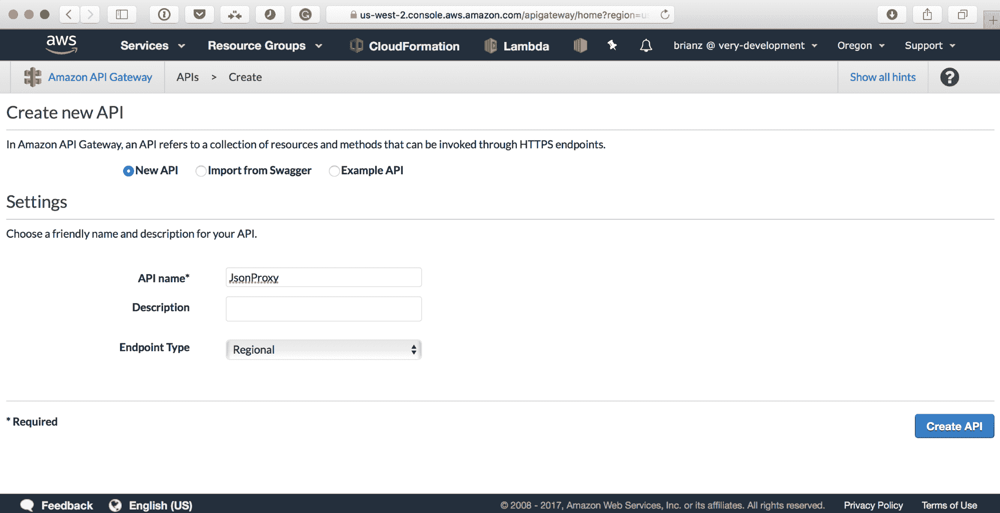
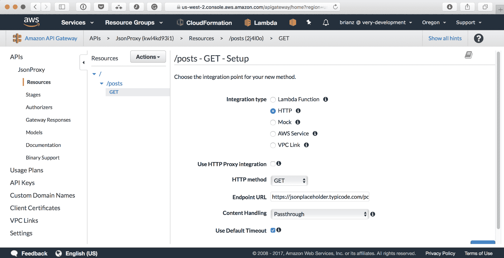
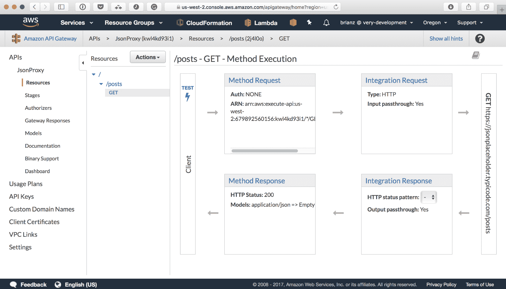
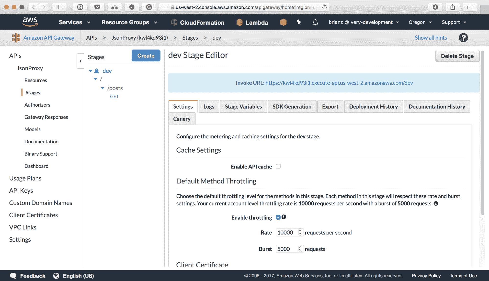
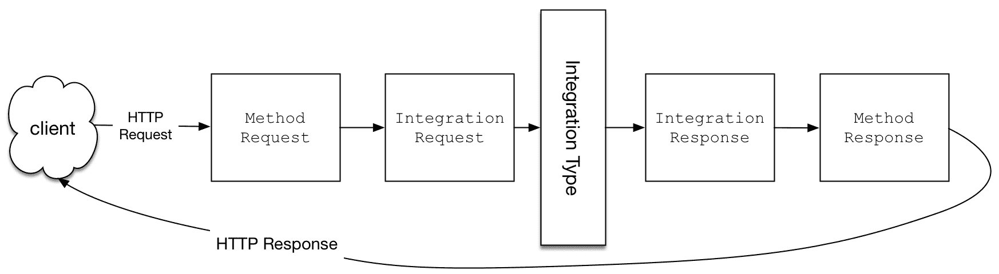
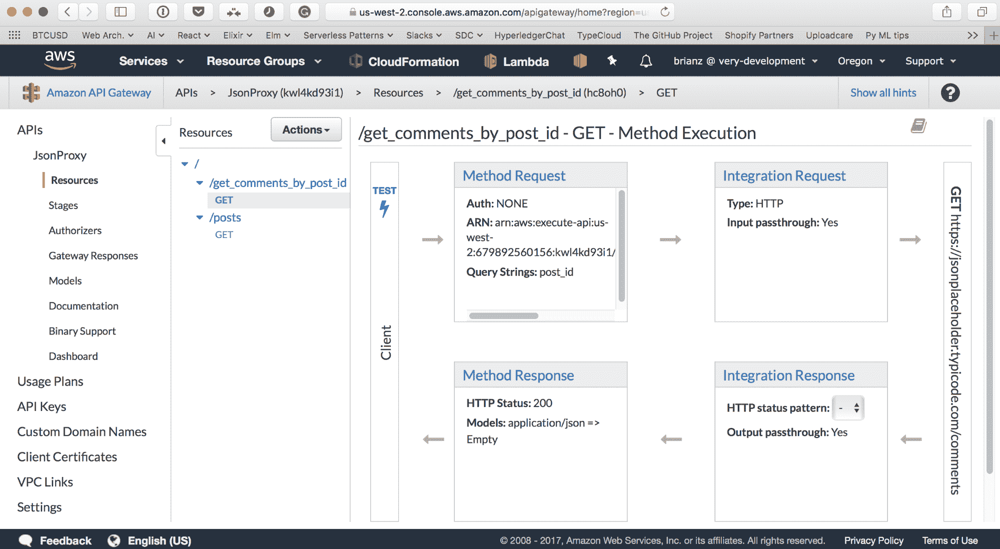
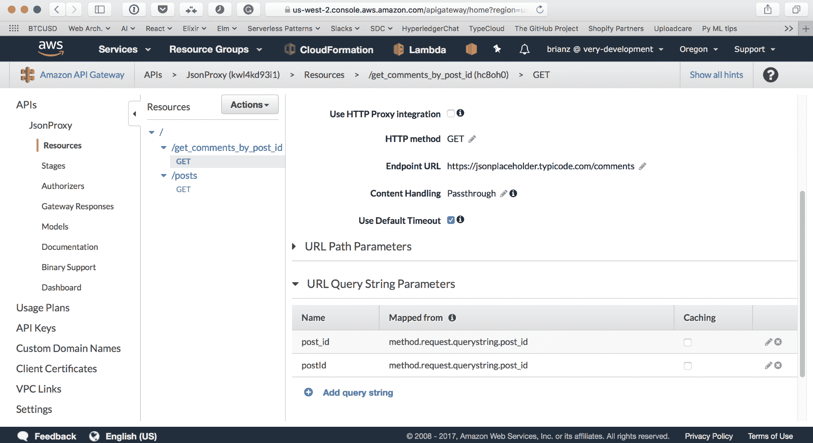
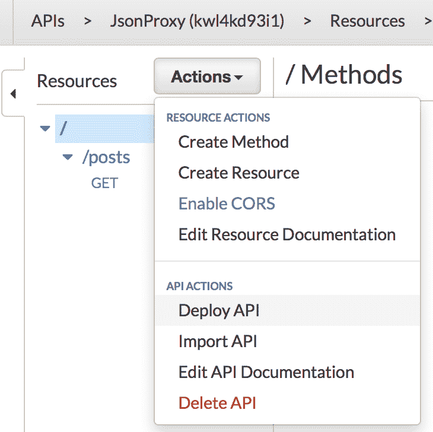
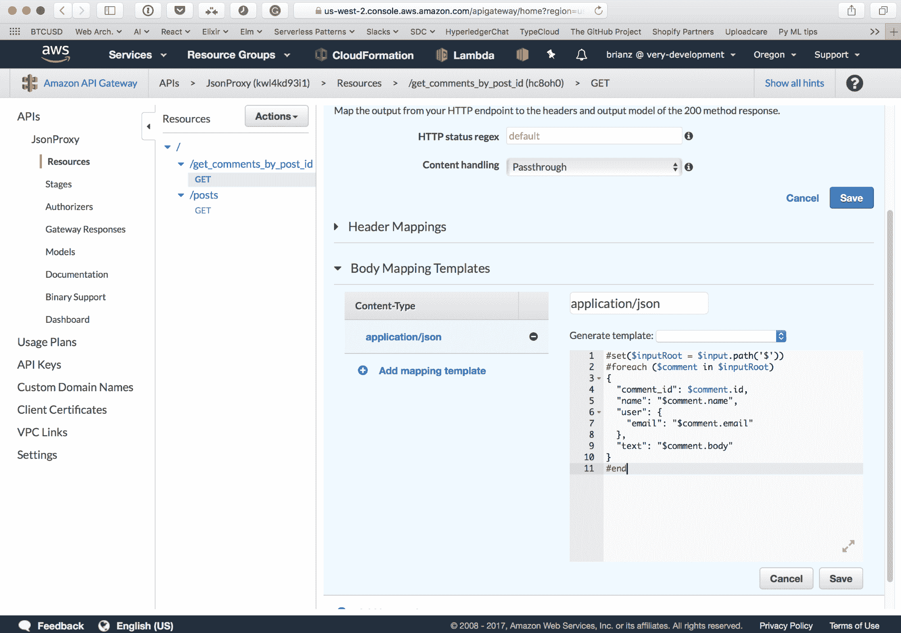
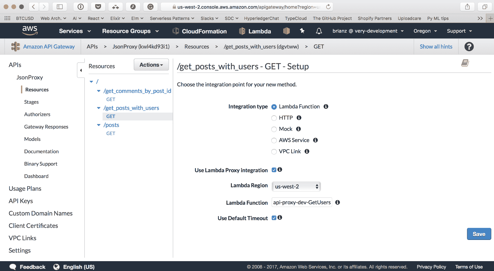

# 使用代理模式将遗留 API 集成

开发新的 API 对于开发者来说通常是一种愉快的体验。在没有遗留代码的情况下，我们工程师可以选择我们的工具，思考设计过程以确保用户有愉快的体验，在无服务器平台上构建，以及所有通过岁月学到的最佳实践。然而，公司和老板经常要求许多工程师承担将遗留 API 支持、维护或将其移植到新架构的任务。给定一个已经部署并持续使用的生产 API，将其移植到无服务器系统可能就像在比赛中更换赛车引擎一样。

幸运的是，现在可以使用代理模式，这个想法作为一个软件模式已经存在了多年，来简化这个复杂任务的执行。如果名字不够清楚，主要思想是在客户端和后端系统之间有一个层，它充当代理，代表客户端在前后端服务之间传递数据。在两个行为者（客户端和服务器）之间插入这个代理，使得在将请求数据发送到服务器之前对其进行转换成为可能，同样，在将有效负载发送到客户端之前对其进行转换也成为可能。以这种方式，可以在不修改客户端的情况下模拟遗留 API 的确切行为。这种设计允许从遗留 API 后端到较新后端系统的平稳过渡，无需担心破坏现有客户端或要求他们更新他们的应用程序。

到本章结束时，你可以期待学习以下内容：

+   代理模式的介绍以及它是如何用于迁移 API 后端或更新现有 API 的请求/响应负载

+   实现代理模式的选项，包括 AWS API 网关和自定义无服务器函数

+   将请求/响应转换为现有 API

+   将现有 API 迁移到无服务器后端

# AWS API 网关介绍

亚马逊网络服务（AWS）的 API 网关是一个功能丰富的工具，它显著简化了 API 代理模式的实现。在本章的后面部分，我们将讨论在构建不同云服务提供商时的策略；然而，如果你像我一样一直使用 AWS，API 网关可以使你的生活变得更加舒适。我个人认为，这是一个被低估的工具，它可以做比我们看到的第二章，“使用 REST 的三层 Web 应用程序”和第三章，“带有 GraphQL 的三层 Web 应用程序模式”中 Lambda 函数的 HTTP 请求更多的事情。

第一个问题可能是，*什么是 API 网关，它有什么作用？* 我不会自己回答这个问题，而是会参考[`docs.aws.amazon.com/apigateway/latest/developerguide/welcome.html`](http://docs.aws.amazon.com/apigateway/latest/developerguide/welcome.html)上的技术文档，它很好地描述了在高级别上的网关：

“Amazon API 网关是一个 AWS 服务，它使开发者能够以任何规模创建、发布、维护、监控和安全地管理 API。您可以创建访问 AWS 或其他 Web 服务以及存储在 AWS 云中的数据的 API。”

API 网关为您提供了一个公开可访问的 HTTPS URL。击中此端点的请求可能执行各种操作，包括但不限于以下操作：

+   调用 Lambda 函数

+   返回由模板构建的模拟端点

+   将代理请求发送到不同的 HTTP 端点

在第二章《使用 REST 的*三层 Web 应用程序*》和第三章《具有 GraphQL 的*三层 Web 应用程序模式*》中，我们使用了 API 网关来公开一个 HTTPS 端点，该端点将调用包含应用程序逻辑的 Lambda 函数。HTTP 有效负载数据，包括头和查询参数，将从 HTTPS 请求中提取并发送到 Lambda。我们的 Lambda 函数还通过返回可 JSON 编码的数据结构以及适当的 HTTP 状态码和头信息来控制响应有效负载。从 Lambda 管理实际的 HTTP 响应被称为**代理集成**，不要与本章节中我们将要工作的代理模式混淆。我提出这一点是为了澄清我们所做的工作以及我们将如何使用 API 网关来实现这种模式。

在大多数后续的示例中，我们不会使用 Lambda 代理集成。虽然这意味着更多的配置将代表我们工作，但也意味着我们将能够控制请求/响应有效负载，以满足我们的需求。当使用 API 网关和 AWS Lambda 构建全新的无服务器 API 时，Lambda 代理集成正是您所需要的，因为它很容易从 API 定义和应用程序代码中控制请求和响应。然而，当为现有的 HTTP 后端设置代理模式时，通常需要在将响应数据发送回客户端之前对其进行更多控制。

除了作为网页请求的接收点和将请求发送到其他地方之外，API 网关还提供了相当多的功能，包括：

+   认证和授权钩子

+   自动生成 API 文档

+   速率限制/节流

+   记录日志

+   定义多个阶段或环境及其变量，这些变量可以被传递到下游系统

说到个人观点，我对 API 网关的功能了解得越多，我就越能想出可能的应用和用例。

还有其他提供类似功能的服务。如果您更喜欢在 AWS 之外构建，请查看**Apigee** ([`apigee.com/api-management/`](https://apigee.com/api-management/))或**Kong** ([`getkong.org/`](https://getkong.org/))。

# 简单的旧版 API 代理

在这个第一个示例中，我们将通过设置与现有 API 的简单集成来展示步骤。API Gateway 的 neat 之处在于，在替换当前应用程序代码的过程中，我们可能根本不需要编写任何代码。

在这些示例中，我们将使用一个公开可用的假 API，称为`JsonPlaceholder`，为了我们的目的，我们假设它是一个我们想要替换的旧版 API：[`jsonplaceholder.typicode.com`](https://jsonplaceholder.typicode.com)。

当然，这种替换需要大量的思考和仔细的计划。认证、速率限制、DNS 条目等因素在开始这样的项目之前都必须仔细考虑。尽管如此，考虑到所有应该考虑的问题，仍然有许多工具和选项使这种模式成为许多应用程序的可行选择。

# 设置透传代理

我们旅程的第一步将是设置 API Gateway 中的新 API，该 API 将传递请求和响应到`JsonPlaceholder`。

首先，在 AWS 控制台中创建一个新的 API，如下所示。我将称这个为`JsonProxy`：



一旦我们有了我们的 API，我们就可以开始填充它并添加端点和行为。根据我的经验，大多数 AWS 服务都有一些基本概念，在构建有意义的结构之前，应该很好地理解这些概念。API Gateway 在这方面也不例外。好消息是，在 API Gateway 中理解这些概念并不特别困难。

当使用 API Gateway 时，我们将使用两个概念：资源和方法。心理模型很简单：

+   **资源**：API 端点

+   **方法**：位于资源下的 HTTP 方法

`JSONPlaceholder`为几个不同的 API 资源提供 API 端点，包括帖子、评论、专辑等。首先，我们将为`/posts`创建一个新的 API Gateway 资源。这个端点在我们的唯一 URL 上会代理到[`jsonplaceholder.typicode.com/posts`](https://jsonplaceholder.typicode.com/posts)。需要注意的是，我们可以在我们的 API Gateway 部署中设置一个名为`/posts`之外端点的端点。也就是说，可以创建一个名为`/all_posts`的资源，然后它会代理到[`jsonplaceholder.typicode.com/posts`](https://jsonplaceholder.typicode.com/posts)。

在控制台中，我们以以下方式设置：

1.  选择操作按钮→创建资源：

    1.  将资源名称设置为 posts

    1.  确保不要选中“配置为代理资源”

    1.  点击创建资源按钮

1.  确保新创建的`/posts`资源在资源列表中被选中/突出显示

1.  选择操作按钮→创建方法：

    1.  选择 GET 并点击确认复选框按钮

    1.  在下一个屏幕上，设置如下截图所示选项

    1.  确保端点 URL 指向[`jsonplaceholder.typicode.com/posts`](https://jsonplaceholder.typicode.com/posts)

    1.  点击保存按钮；请看以下截图：



前面的截图可能看起来相当混乱。我必须承认，我在相当长一段时间内都没有完全理解 API 网关的这一部分细节，直到我完成了我们现在正在进行的这个练习。我们将详细讨论方法执行屏幕的细节，但首先，让我们部署我们的新 API 并对其进行测试：



# 部署透传代理

到目前为止，我们仅仅定义了 API 的骨架和简单的结构，只有一个`/posts`的端点。我们没有查询的 URL 来测试。为此，我们需要部署我们的 API：

1.  选择操作按钮→部署 API

1.  从部署 API 屏幕：

    1.  选择新阶段

    1.  输入`dev`作为舞台名称

1.  点击部署按钮

部署后，控制台将带您进入 dev 舞台编辑器屏幕。在这里，您会注意到许多其他可以更新的功能类型。例如，可以开启/关闭 API 节流，设置阶段变量等。就我们的目的而言，我们已经完成了：



您会注意到屏幕顶部有一个高亮的 URL。这个自定义 URL 对于这次部署是唯一的，可以用来调用我们的 API。展开左侧的 dev 阶段将显示我们在先前的资源部分定义的单个 URL 端点。

现在，如果我们用浏览器加载我们的自定义 URL 或使用 cURL 调用该 URL，我们就可以看到从`JSONPlaceholder`的`/posts`端点获取的数据：

```java
$ curl https://kwl4kd93i1.execute-api.us-west-2.amazonaws.com/dev/posts
[
 {
 "userId": 1,
 "id": 1,
 "title": "sunt aut facere repellat provident occaecati excepturi optio reprehenderit",
 "body": "quia et suscipit\nsuscipit recusandae consequuntur expedita et cum\nreprehenderit molestiae ut ut quas totam\nnostrum rerum est autem sunt rem eveniet architecto"
 },
 {
 "userId": 1,
 "id": 2,
 "title": "qui est esse",
 "body": "est rerum tempore vitae\nsequi sint nihil reprehenderit dolor beatae ea dolores neque\nfugiat blanditiis voluptate porro vel nihil molestiae ut reiciendis\nqui aperiam non debitis possimus qui neque nisi nulla"
 }...
]
```

我们现在拥有自己的 HTTPS URL，虽然它目前做不了太多，但仍然非常了不起。我们没有在任何编程语言中编写一行应用程序代码，而是设置了一个代理来从现有的遗留 API 返回结果。您可能会认为这目前并不太有用。您并不完全错误。然而，即使有这样一个简单的集成，我们也可以开始利用一些 API 网关功能，例如：

+   自动化 API 文档生成

+   节流

+   在多种语言中自动生成 SDK

这仅仅是第一步。在下一节中，我们将深入了解如何开始转换我们的 API 网关 API，使其使用相同的数据源变成完全不同的东西。

# 将现代 API 的响应进行转换

接下来，我们将通过一个场景来演示，这个场景是我们需要支持现有的 API 接口，但希望完全改变后端实现。这种情况很常见，也是我个人处理过的情况。现有客户端指向特定的 API 端点。破坏许多开发者依赖的公共 API 不是任何人想要做的事情。但是，当这个 API 建立在难以维护或性能不佳的代码之上时，如何在不要求数百或数千名开发者更新他们的移动、Web 或 GUI 应用程序的情况下进行迭代呢？

在这个例子中，我将演示必要的步骤，将一个假设的遗留 API 重新实现为我们的现代 API。`JSONPlaceholder`将扮演我们新的、现代的、可扩展和性能良好的 RESTful API 的角色。我们将使用代理模式重新实现的单个 URL 是`https://$HOSTNAME/get_comments_by_post_id`。

你可以想象这个端点返回的数据类型。回顾我们关于 REST API 的讨论，很明显，这个遗留模式在许多原因上都不是 RESTful 的。具有这种 API 结构的，你可以确信，API 设计的其余部分也需要一些工作，并且可能不是作为最终用户最容易与之工作的。我们闪亮的新 RESTful API（`JSONPlaceholder`）更符合我们的口味，我们希望宣传并让开发者采用，而不是之前的旧结构。我们如何使用我们新的 RESTful API 通过相同的输入和输出有效载荷来支持现有客户端？

API 网关可以帮助我们解决这个问题。

# 方法执行流程

在*设置透明代理*部分显示的方法执行截图现在将发挥作用。在我们通过四个不同的部分进行讲解时，你可以参考那个截图。查看以下图表可能也更容易，它表示相同的请求/响应流程，但更简单易懂：



对于每个 API 网关资源/方法组合，我们可能需要配置四个步骤。这一切都是从图的最左侧的客户端开始的。这个**客户端**图标代表调用我们 API 的用户。经过一系列步骤后，创建了一个 HTTP 响应，客户端接收了一些有效载荷。使用 API 网关意味着配置这些阶段中的某些或全部，以控制 HTTP 请求和 HTTP 响应。位于这个流程中间的是**集成类型**，如前所述，它可能包括各种东西，包括 AWS Lambda 函数或现有的 HTTP 端点。在执行集成之前的前两个步骤（**方法请求**和**集成请求**）负责处理 HTTP 请求。这两个阶段执行的工作可能包括：

+   转换查询参数

+   转换输入数据（即 POST 有效载荷）

+   提取和转换头部信息

+   执行身份验证

完成这项工作后，集成请求将传递数据（可能已从原始输入有效载荷转换或未转换）到集成类型。集成类型返回一些数据，将其传递给集成响应，最后是方法响应。由于其他两个部分处理了请求有效载荷，这两个部分（集成响应和方法响应）操作的是响应有效载荷。我们可能在这里执行的操作包括：

+   转换 HTTP 主体/有效载荷

+   转换/添加 HTTP 标头

+   控制 HTTP 状态码

在“设置代理”部分的 AWS 控制台截图上，客户端以垂直方向的矩形形式位于最左侧。在同一截图的最右侧是配置此 API 通信的端点，[`jsonplaceholder.typicode.com/posts`](https://jsonplaceholder.typicode.com/posts)。同样，在其他情况下，该集成端点可能是一个 Lambda 函数、模拟集成或 API Gateway 支持的任何其他后端系统。在本章的示例中，它始终是我们的现有 `JSONPlaceholder` API。按照 AWS 控制台方法执行屏幕上的箭头，你可以看到客户端请求按照之前描述的顺序流动：

+   方法请求

+   集成请求

+   我们配置的集成端点

+   集成响应

+   方法响应

在这个数据处理流程中有很多选项和大量的排列组合。显然，我们无法逐一介绍，但我们将主要使用集成请求和集成响应进行本例。我们的任务将包括：

+   为三个单独的遗留 API 端点创建新资源

+   在这三个资源上创建 `GET` 方法

+   对于每个资源/方法组合，将请求中的查询参数映射到我们新的 API

+   对于每个资源/方法组合，设置一个集成响应体映射模板，将我们新 API 的 JSON 有效载荷转换为遗留 API 预期的结构

# 设置示例

要集成的 API 的 URL 结构为 [`jsonplaceholder.typicode.com/comments?postId=1`](https://jsonplaceholder.typicode.com/comments?postId=1)。提醒一下，这是我们的 HTTP 集成类型的端点 URL。具有这种 URL 结构，可以清楚地了解正在发生什么以及返回数据应该是什么。此请求获取特定 `postId` 的评论，作为 `GET` 参数传递。此外，这个现代 API 返回一个包含以下格式的评论资源数组：

```java
{
  "postId": 1,
  "id": 1,
  "name": "id labore ex et quam laborum",
  "email": "Eliseo@gardner.biz",
  "body": "laudantium enim quasi est quidem magnam voluptate ipsam eos\ntempora quo necessitatibus\ndolor quam autem quasi\nreiciendis et nam sapiente accusantium"
}
```

假设在这个示例中，我们的遗留系统有一个类似的 API，但具有不同的 URL 结构，`GET` 参数用于过滤评论和评论资源的表示：

`https://$HOSTNAME/get_comments_by_post_id?post_id=1`

```java
{
  "comment_id": 1,
  "name": "id labore ex et quam laborum",
  "user": {
    email": "Eliseo@gardner.biz"
  },
  "text": "laudantium enim quasi est quidem magnam voluptate ipsam eos\ntempora quo necessitatibus\ndolor quam autem quasi\nreiciendis et nam sapiente accusantium"
}
```

我们的工作是使用现代的 RESTful API（`JSONPlaceholder`作为数据源）来支持这个遗留的 URL 模式和有效负载。幸运的是，我们需要支持的所有数据我们都在新的 API 中，所以我们的工作将是让 API 网关在将其发送给客户端之前对有效负载进行转换。

# 设置新的资源和方法

首先，我们需要为`get_comments_by_post_id`端点创建一个新的 API 网关资源和方法。步骤与上一节相同。唯一的不同之处在于：

+   我们将要与之通信的端点将是[`jsonplaceholder.typicode.com/comments`](https://jsonplaceholder.typicode.com/comments)，而不是`/posts`端点

+   我们需要将初始客户端请求的查询参数映射到后端 API 所需的查询参数

在设置这个新资源和方法后，它应该看起来像以下这样：



# 设置集成请求

首先，我们需要设置 API 网关，使其将请求中期望的`GET`参数传递到我们的后端。API 网关允许在*方法请求*和*集成请求*部分控制查询参数映射。在方法执行屏幕中：

1.  点击方法请求：

    1.  点击 URL 查询字符串参数

    1.  点击添加查询字符串参数

    1.  输入`post_id`

    1.  不选中必需的和缓存

1.  返回到方法执行屏幕，点击集成请求：

    1.  展开 URL 查询字符串参数

    1.  点击添加查询字符串

    1.  对于名称输入`postId`，对于映射来自输入`method.request.querystring.post_id`

我们在这里所做的是告诉 API 网关期望一个名为`post_id`的`GET`参数，这是我们需要支持的旧参数。从那里，网关将提取这个`post_id`属性并将其注入到集成请求中。`post_id`的值在`method.request.querystring.post_id`中可访问。

通过添加一个名为`postId`的新查询字符串，其值为`method.request.querystring.post_id`，我们只是简单地将该值传递给新的 RESTful API，但使用新的参数名`postId`：



为了测试这些更改，我们需要部署 API。在控制台中，在资源部分，选择操作按钮并点击部署 API。将其部署到我们的单个`dev`阶段：



我们可以使用`curl`来调用我们的新 API 并查看结果：

```java
$ curl https://kwl4kd93i1.execute-api.us-west-2.amazonaws.com/dev/get_comments_by_post_id?post_id=10
[
 {
 "postId": 10,
 "id": 46,
 "name": "dignissimos et deleniti voluptate et quod",
 "email": "Jeremy.Harann@waino.me",
 "body": "exercitationem et id quae cum omnis\nvoluptatibus accusantium et quidem\nut ipsam sint\ndoloremque illo ex atque necessitatibus sed"
 },
 {
 "postId": 10,
 "id": 47,
 "name": "rerum commodi est non dolor nesciunt ut",
 "email": "Pearlie.Kling@sandy.com",
 "body": "occaecati laudantium ratione non cumque\nearum quod non enim soluta nisi velit similique voluptatibus\nesse laudantium consequatur voluptatem rem eaque voluptatem aut ut\net sit quam"
 },
 ...
]
```

# 设置集成响应

既然我们已经设置了 URL 和查询参数映射，现在是时候开始转换我们新 API 生成的响应了。由于旧的 JSON 结构不同，我们将使用网关的主体映射模板从 JSON 响应中提取输出并重写。API 网关使用 Velocity 模板语言和系统来完成这项工作。如果你曾经使用现代 Web 框架进行过 Web 编程，你无疑已经使用过模板库。有很多。Velocity 并非魔法；它与其他任何模板系统一样，起到相同的作用：根据特定的语法标记模板以及一些上下文数据，渲染输出字符串。

在方法执行屏幕上，点击集成响应。在我们请求/响应周期中的这个阶段，是在后端集成生成响应之后，系统开始向客户端发送数据之前。在这个阶段，我们将配置集成响应，使用以下两点来重写输出给客户端：

+   来自我们后端（`JSONPlaceholder`）的 JSON 响应

+   一个使用 Velocity 模板语言编写的主体映射模板

在本节中，可以根据 HTTP 响应代码和 content/type 设置不同的主体映射模板。为了简化，我们只需处理 HTTP 200 和单个集成响应、响应代码和 content/type。

在集成响应部分：

1.  展开表格中的单行，即默认映射

1.  展开主体映射模板部分

1.  点击内容类型表中的 application/json

1.  在文本区域中添加以下模板代码并点击保存

1.  将 API 部署到 `dev` 阶段

下面的代码块指的是步骤 #4。这是 Velocity 模板语言的语法：

```java
#set($inputRoot = $input.path('$'))
#foreach ($comment in $inputRoot)
{
  "comment_id": $comment.id,
  "name": "$comment.name",
  "user": {
    "email": "$comment.email"
  },
  "text": "$comment.body"
}
#end
```

上一代码块中的模板代码应放置在 application/json、内容类型模板部分，如图所示：



解决了这些问题之后，调用我们的 API 将导致返回负载的结构完全不同：

```java
$ curl https://kwl4kd93i1.execute-api.us-west-2.amazonaws.com/dev/get_comments_by_post_id?post_id=10
{
 "comment_id": 1,
 "name": "id labore ex et quam laborum",
 "user": {
 "email": "Eliseo@gardner.biz"
 },
 "text": "laudantium enim quasi est quidem magnam voluptate ipsam eos
tempora quo necessitatibus
dolor quam autem quasi
reiciendis et nam sapiente accusantium"
}
{
 "comment_id": 2,
 "name": "quo vero reiciendis velit similique earum",
 "user": {
 "email": "Jayne_Kuhic@sydney.com"
 },
 "text": "est natus enim nihil est dolore omnis voluptatem numquam
et omnis occaecati quod ullam at
voluptatem error expedita pariatur
nihil sint nostrum voluptatem reiciendis et"
}
```

假设后端系统包含必要的数据，可以实现一个完全不同的结构，只需编写一些 API 网关配置和 Velocity 模板。如前所述，API 网关还有许多其他可以利用的优点，这些优点在替换遗留 API 时可能非常有用。

# 使用 Lambda 函数进行复杂数值积分

我们之前的例子是一个最佳情况。因为我们的新后端系统包含了支持遗留 API 所需的所有数据，我们的工作相当简单。然而，当需要支持的遗留 API 与较新的 API 没有一对一映射时会发生什么？当然，如果您控制新的 API，则可以实施任何缺失的功能。虽然这可能可行，但这可能不是一个好主意，因为您可能需要在新的干净 RESTful API 中重新实现不完善的设计，以支持遗留系统。

在这种情况下，我们与其污染新的 API，不如使用 Lambda 函数作为集成类型，而不是 HTTP 端点。使用这种模式，Lambda 函数可以具备一定的智能，并执行所需的任何类型任务。例如，想象一下另一个遗留端点`https://$HOSTNAME/get_posts_with_users`，它返回一个包含在每个帖子记录中嵌入的`user`记录的`posts`列表。新的 API 返回的`posts`结构如下：

```java
  {
    "userId": 1,
    "id": 5,
    "title": "nesciunt quas odio",
    "body": "repudiandae veniam quaerat..."
  },
```

然而，我们的遗留 API 需要以以下形式返回负载：

```java
{
   "title" : "nesciunt quas odio",
   "id" : 5,
   "user" : {
      "id" : 1,
      "name" : "Leanne Graham",
      "phone" : "1-770-736-8031 x56442",
      "email" : "Sincere@april.biz",
      "username" : "Bret",
      "address" : {
         "suite" : "Apt. 556",
         "street" : "Kulas Light",
         "city" : "Gwenborough",
         "zipcode" : "92998-3874"
      }
   },
   "body" : "repudiandae veniam quaerat..."
}
```

新的 API 在`/users`端点提供了用户数据。使用 Lambda 函数，我们可以进行两个独立的 API 调用，并自行合并结果。

# 实现应用程序代码

首先，我们需要实现我们的应用程序逻辑。代码将非常直接，我不会详细说明。所有内容都可以用仅仅 42 行 Python 代码实现：

```java
import json

import sys
from pathlib import Path

# Munge our sys path so libs can be found
CWD = Path(__file__).resolve().cwd() / 'lib'
sys.path.insert(0, str(CWD))

import requests

def get_users(event, context):
    user_response = requests.get('https://jsonplaceholder.typicode.com/users')
    users = {}
    for user in user_response.json():
        users[user['id']] = user

    post_response = requests.get('https://jsonplaceholder.typicode.com/posts')
    posts = []
    for post in post_response.json():
        user = users[post['userId']]
        posts.append({
            "id" : post['id'],
            "body" : post['body'],
            "title" : post['title'],
            "user" : {
                "id" : user['id'],
                "name" : user['name'],
                "phone" : user['phone'],
                "email" : user['email'],
                "username" : user['username'],
                "address" : user['address'],
                }
        })

    response = {
        "statusCode": 200,
        "body": json.dumps(posts)
    }

    return response
```

现在我们应用程序逻辑正在向我们的后端发送两个 HTTP 请求并合并结果，我们最终得到了期望的输出格式，其中`user`记录嵌入在`post`记录中。

部署这一步骤包括设置一个具有单个端点的无服务器*服务*。有趣的是，我们将在`serverless.yml`中定义我们的函数，但不会使用任何事件来触发此函数。这样做的原因是我们将手动设置此函数，使其由我们现有的 API Gateway 部署触发：

```java
service: api-proxy

provider:
  name: aws
  runtime: python3.6
  region: ${env:AWS_DEFAULT_REGION}

functions:
  GetUsers:
    handler: handler.get_users
```

# 设置新的资源和方法

现在，是时候在 API Gateway 中设置一个新的资源和`GET`方法了。这次，我们将选择 Lambda Function 作为集成类型。此外，我们还将想要检查使用 Lambda Proxy 集成。选择这个的原因是我们可以控制由 Lambda 运行的应用程序代码的响应细节。如果需要更新头信息或以其他方式转换响应，我们只需更新我们的应用程序代码并重新部署 Lambda 函数：



选择已经部署的 Lambda 函数，点击保存，我们就完成了。由于我们可能从应用程序代码中执行任何转换，因此无需更新方法请求或集成。

最后，部署 API，访问新的 API 端点，查看结果：

```java

   {
      "title" : "sunt aut facere repellat provident occaecati excepturi optio reprehenderit",
      "id" : 1,
      "body" : "quia et suscipit\nsuscipit recusandae consequuntur expedita et cum\nreprehenderit molestiae ut ut quas totam\nnostrum rerum est autem sunt rem eveniet architecto",
      "user" : {
         "name" : "Leanne Graham",
         "email" : "Sincere@april.biz",
         "username" : "Bret",
         "id" : 1,
         "address" : {
            "geo" : {
               "lng" : "81.1496",
               "lat" : "-37.3159"
            },
            "suite" : "Apt. 556",
            "city" : "Gwenborough",
            "street" : "Kulas Light",
            "zipcode" : "92998-3874"
         },
         "phone" : "1-770-736-8031 x56442"
      }
   },
   ...
}
```

# 迁移技术

在这些示例中，我们查看了一些使用现有 API 后端实现新 API 的策略。另一个常见的场景是将现有的 API 迁移到无服务器架构，而不改变其任何功能。在这种情况下，我们仍然可以使用代理模式和 API 网关。所有准备工作就绪，那么如何实际部署新的代理层而不影响现有流量或破坏这些客户端呢？以下是一些在遇到这个问题时可以考虑的技术和部署策略。

# 分阶段迁移

要用基于无服务器的系统替换现有的 API，首先实现代理模式并在 API 网关中定义完整的 API 是有意义的。每个端点只需简单地代理请求和响应到要替换的系统中的相应 API。

甚至可以使用所谓的**代理资源**来开始初始测试。在这种模式下，用户在 API 网关中创建一个名为`{proxy+}`的资源。这是一个贪婪的资源，会匹配任何不存在的 URL 路径，无论是`/cats`、`/users/10/comments`等等。它也会匹配任何 HTTP 动词。简而言之，它是一个通配符，会将任何不匹配现有资源的请求发送到配置的集成后端：

。在用现有用户替换旧 API 的示例中，理想的情况是只需更新 DNS 记录。

例如，假设您正在迁移的 API 位于`https://api.mysite.io`，并且这个 URL 嵌入在数千个移动设备的应用程序中。对于数千个客户端来说，强制用户更新代码是不可行的。您知道在很长时间内都会有流量到那个子域。

API 网关提供了将自定义域名应用于 API 的能力，并提供免费的 SSL/TLS 证书。有了这两个功能，迁移过程将相对简单。假设你已经实施并彻底测试了新的 API 网关版本的 API，迁移将包括以下步骤：

+   在 API 网关中将 `api.mysite.io` 设置为自定义域名

+   从 API 网关（使用亚马逊证书管理器 ACM）为 `api.mysite.io` 创建 TLS 证书

+   更新 DNS 以指向 API 网关 URL

在 URL 不运行在子域名上的情况下，事情变得更加复杂。例如，如果你有一个运行在 `https://mysite.io` 的现有 Web 应用程序，而 API 位于 `https://mysite.io/api`，更改 DNS 将不会起作用，因为它会破坏你的 Web 应用程序用户。在这种情况下，有两种可行的选择：

+   使用或设置某种支持基于路径路由的路由器或负载均衡器

+   将应用程序代码更新为调用 `/api` 下的 API 网关端点

一个负载均衡器，如 HAProxy，在这里会工作得很好，因为它提供基于路径的路由，并且速度非常快。如果无法设置这样的系统，最终的解决方案将是手动从你的应用程序代码代理请求到 API 网关端点。这种方法并不优雅，但从技术上讲，如果将头信息和查询参数转发到 API 网关，这种方法是可行的。

# 摘要

在本章中，我们介绍了使用 AWS API 网关的代理模式。我们通过多个示例展示了如何使用现有的 RESTful URL 作为 HTTP 集成来模拟遗留 API。你学习了 API 网关方法执行的四个阶段以及围绕每个集成点的某些细节。我们还讨论了在集成 AWS Lambda 函数时使用的代理模式，这提供了一些控制，但需要更多的维护。

读者应该理解代理模式，并在本章之后对如何使用 API 网关自己实现这一模式有一个大致的了解。

在下一章中，我们将关注点从 Web 应用程序模式转移到数据处理模式。
