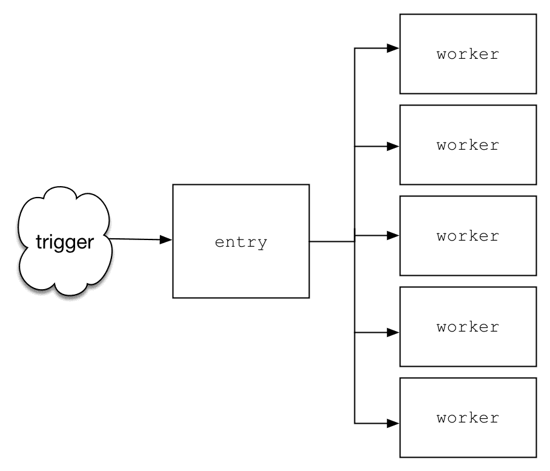
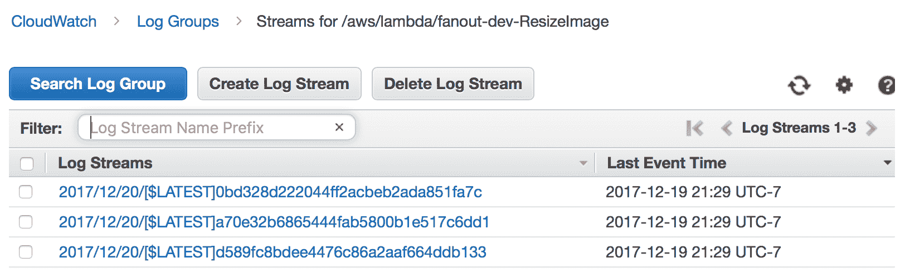
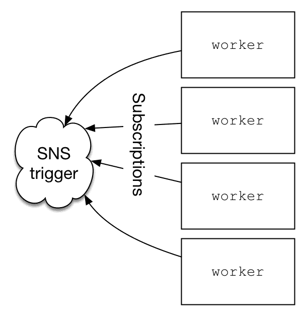
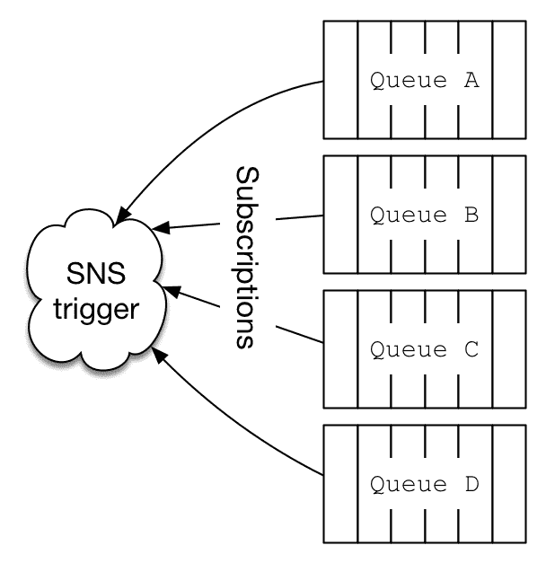

# 使用扇出模式进行横向扩展

在我们的无服务器之旅中，下一步将离开以网络为中心的模式，转向适合各种问题的模式，无论是网络还是其他。在本章中，我们将讨论扇出模式，该模式可用于许多不同的上下文，无论是作为一个独立系统还是作为更大项目的一个子单元。从概念上讲，扇出模式正是其名称所暗示的——一个无服务器入口点导致下游系统的多个调用。大数据平台和计算机科学算法已经使用了很长时间的这个技巧；通过将一个大的计算问题分解成更小的部分，系统可以通过同时处理这些较小的部分来更快地得到结果。从概念上讲，这正是 MapReduce 在映射步骤中工作的方式。

在本章中，我们将讨论如何使用扇出模式将单个工作单元拆分为多个较小的作业组。我们将探讨此模式的使用案例以及它非常适合的各种问题。

到本章结束时，你可以期待了解以下内容：

+   如何设置扇出架构以并行调整图像大小

+   如何使用扇出模式将单个大型输入文件拆分为较小的文件，并并行处理这些片段

+   扇出模式适用于哪些类型的问题？

# 系统架构

在许多方面，这是本书中涵盖的最直接的模式。一个入口点，无论是 HTTP 请求、某些事件通知还是你选择的云提供商支持的任何其他内容，都会触发对其他服务器端函数的多个并行调用。在这种架构中，你获得的是并行性和因此速度的提升。我们的第一个例子是容易理解的一个，你可以将其视为无服务器架构的`Hello World`。

想象一个系统，它接收一个图像并创建多个不同尺寸的原始图像版本，这些尺寸小于原始图像。如何以最简单的方式解决这个问题？一旦用户上传了图像，我们的系统就会注意到新的图像上传，并使用`for`循环迭代并创建各种缩略图。执行此操作的虚构代码可能如下所示：

```java
const sizes = [128, 256, 512, 1024];
const img = readSomeImage();

sizes.forEach(function(size) {
  img.resize(size, AUTO);
})
```

这可以很好地工作，但存在风险，即单个进程负责整个图像的整个管道，可能会大幅降低速度。从逻辑上讲，每个调整大小的事件都是完全独立的，仅依赖于原始图像来完成其任务。因此，这是一个并行运行的完美任务。以下图表显示了扇出模式的通用设计，其中单个入口点触发多个下游进程：



某些事件或触发器将导致调用入口函数。在图像缩放示例中，这个事件发生在图像上传到 AWS S3 存储桶时。诚然，设置这个非常简单，AWS 通过所有跨服务集成使得 Lambda 函数的调用变得非常容易。然而，可以将这种模式应用于任何云提供商，触发器可能是通过`HTTP POST`上传图像，而不是上传到 S3 存储桶。一旦入口函数被调用，它将负责触发多个`worker`函数，并将所需数据传递给它们以完成工作。这个架构的关键在于触发工作进程的方式，使得它们都能并行运行，或者尽可能接近并行。

# 同步调用与异步调用

入口函数的唯一任务是启动扇出（fan-out）并将工作分配给多个子函数。在这种设计中，记住我们的目标很重要，即并行化工作负载，使得所有工作函数都能并行运行。正如我们使用`for`循环的原始实现是同步的，完全有可能尝试构建如上图所示的架构，但最终得到的是一个同步的架构。这是如何发生的呢？

最终，入口函数必须进行多次调用以启动子任务。为此，我们将使用某种形式的循环。以 AWS 为例，入口函数可以使用 AWS API 在该循环中调用 Lambda 函数。以下代码块演示了通过 JavaScript AWS SDK 调用`lambda`函数：

```java
const sizes = [128, 256, 1024];
const lambda = new aws.Lambda();

for (var i=0; i<sizes.length; i++) {
  var params = {
    FunctionName: 'fanout-ResizeImage',
    Payload: JSON.stringify({"size": sizes[i]})
  }

  lambda.invoke(params, function(error, data) {
    if (error) {
      callback(error)
    } 
    else {
      callback(null, 'success')
    } 
  }); 
}
```

可以安全地忽略前面代码块中的许多细节。从高层次来看，我们的 Node.js 代码遍历一个包含三个项目的数组，并在每次迭代中调用一个命名的 Lambda 函数。你可能认为这段代码实现了上图所示的架构。然而，运行这段代码，你会很快发现它完全是以同步方式运行的。也就是说，循环的每次迭代都等待从`lambda.invoke`调用返回响应。之所以会这样，是因为 Lambda 调用 API 默认假设请求类型为请求/响应。更简单地说，默认的操作模式是同步的，客户端期望从被调用的函数中获取返回值。好消息是，通过调用`invoke`函数并使用正确的参数来修复这个问题，这个参数指示我们不需要返回值。只需将`InvocationType: "Event"`添加到`params`中，就完成了。

# 并行缩放图像

这个例子将使用 Node.js 实现，没有其他原因，只是为了将之前章节中的 Python 代码进行更改。在这个例子中，有一个依赖项，我们使用它来进行图像缩放，称为`jimp`。我将简要介绍使用 Serverless Framework 开始新 Node 项目的一些步骤。

# 设置项目

设置一个新的 Node.js 项目与使用任何其他支持的语言设置没有区别。我们将告诉 Serverless 使用`aws-nodejs`模板，并将我们的项目命名为`fanout`。`-p`参数只是告诉 Serverless 将所有生成的代码放置在`serverless`目录中，该目录相对于我们执行此命令的位置。考虑以下代码：

```java
root@4b26ed909d56:/code# sls create -t aws-nodejs -p serverless -n fanout
```

接下来，我们将添加我们的单个依赖项`jimp`。在这里，我使用的是`yarn`，但`npm`同样可以正常工作：

```java
root@4b26ed909d56:/code/serverless# yarn add jimp
yarn add v1.3.2 
info No lockfile found. 
[1/4] Resolving packages... 
[2/4] Fetching packages... 
[3/4] Linking dependencies... 
[4/4] Building fresh packages... 
success Saved lockfile. 
success Saved 88 new dependencies.
....
Done in 4.33s.

```

一旦完成所有这些，我们的代码布局看起来如下所示：

```java
$ tree -L 1 .
.
├── handler.js
├── node_modules
├── package.json
├── serverless.yml
└── yarn.lock
```

# 设置触发器和工作函数

接下来，让我们连接`trigger`函数并定义`worker`函数。如前所述，整个过程将在上传图像到 S3 时开始。Serverless Framework 通过`serverless.yml`中的`events`部分使这种类型的连接变得简单：

```java
functions:
  UploadImage:
    handler: handler.uploadImage
    events:
      - s3:
          bucket: brianz-image-resize-fanout
          event: s3:ObjectCreated:*
  ResizeImage:
    handler: handler.resizeImage
```

这意味着每当在命名的 S3 桶中创建对象时，都会调用`uploadImage`函数。就是这样。再次强调，这个事件可以是 AWS 支持的其他任何事件，只要触发器提供了需要调整大小的图像的访问权限。如果你使用的是除 AWS 之外的云服务提供商，你需要找出对你平台有意义的触发器。

你还会注意到`ResizeImage`函数的定义。奇怪的是，没有列出`events`。这是因为，在我们的案例中，`uploadImage`函数将作为触发器，通过`aws-sdk`手动调用这个 Lambda 函数。

# 设置权限

与所有 AWS 相关的事物一样，我们需要确保 IAM 权限设置正确。`UploadImage`函数将与其自身之外的单一 AWS 资源交互，那就是`ResizeImage`函数。为了使`UploadImage`能够调用`ResizeImage`，我们需要授予它明确的权限。

此外，`ResizeImage`需要访问写入调整大小后照片的最终存储位置。我们将将这些图像放置在不同的 S3 桶中，并通过`iamRoleStatements`部分再次授予访问权限。

你可以在下面的代码中看到这两个语句，以及`serverless.yml`文件中的其他配置：

```java
service: fanout

provider:
  name: aws
  runtime: nodejs4.3
  region: ${env:AWS_REGION}
  timeout: 30
  iamRoleStatements:
    - Effect: Allow
      Action:
        - lambda:InvokeFunction
      Resource: "arn:aws:lambda:${env:AWS_REGION}:*:function:fanout-${opt:stage}-ResizeImage"
    - Effect: Allow
      Action:
        - s3:PutObject
      Resource:
        - "arn:aws:s3:::brianz-image-resize-fanout-results/*"

functions:
  UploadImage:
    handler: handler.uploadImage
    events:
      - s3:
          bucket: brianz-image-resize-fanout
          event: s3:ObjectCreated:*
  ResizeImage:
    handler: handler.resizeImage

plugins:
  - serverless-prune-plugin
```

从安全角度来看，我们上面的 IAM 角色中存在一个小缺陷，因为这两个函数被授予了相同的权限。也就是说，`ResizeImage`允许调用自己，而`uploadImage`允许访问结果 S3 桶。理想情况下，只有需要权限的函数才会被授予这些权限。使用 Serverless Framework 可以设置每个函数的 IAM 访问权限，但这有点冗长，并且超出了本书的范围。

# 实现应用程序代码

设置完成后，我们现在可以专注于应用程序代码。让我们看看`uploadImage`函数，因为那是整个过程的入口。

我们首先需要在`handler.js`文件顶部初始化我们的两个依赖项，如下所示：

+   `aws-sdk`，它在 Lambda 运行时自动可用

+   用于图像操作的`jimp`库

从上到下，我们的`uploadImage`函数定义了一些东西。首先，我们的`params`对象包含 Lambda 调用参数的基础。注意这里我们使用的是`InvocationType`为`"Event"`，这对于获得前面描述的异步扇出至关重要。接下来，我们将硬编码一些图像宽度，我们将将这些宽度用于调整原始图像。`jimp`能够接受一个单维（高度或宽度），并自动计算另一个维度以保留原始的宽高比。

当`uploadImage`函数被调用时，它在`event`参数中接收有关调用的相当多的元数据。在我们的情况下，上传的图像信息将包含在这个`event`对象中。所有这些数据最终都结束在一个`Records`数组中。实际上，应该只有一个记录需要处理。为了安全起见，我们将继续假设这里有一个可变数量的项目，并获取它们所有。

最后，此函数将遍历不同大小的数组，多次调用适当的回调，每次调用都带有略微不同的负载。每次迭代的`S3Objects`列表都是相同的，但每次`resizeImage`调用的尺寸字段将不同。以下代码块显示了`uploadImage`函数的完整实现，该函数异步调用`ResizeImage` Lambda 函数：

```java
'use strict'; 

const aws = require('aws-sdk');
const Jimp = require("jimp");

module.exports.uploadImage = (event, context, callback) => {
  var params = { 
    FunctionName: 'fanout-dev-ResizeImage'
    , InvocationType: "Event"
  }

  var sizes = [128, 256, 1024];

  const s3Objects = event['Records'].map(function(r) {
    return r["s3"]
  }) 

  const lambda = new aws.Lambda({
    region: 'us-west-2'
  }); 

  for (var i=0; i<sizes.length; i++) {
    params['Payload'] = JSON.stringify({
      "size": sizes[i]
      , "s3Objects": s3Objects
    }); 

    lambda.invoke(params, function(error, data) {
      if (error) {
        callback(error)
      } else {
        callback(null, 'success')
      } 
    }); 
  }

};
```

有了这个，我们可以将注意力转向实际调整图像大小的工作。就像在`uploadImage`中一样，`resizeImage`接收一个包含在`event`参数中的数据负载，该参数是一个对象类型。记住，传递给此函数的`S3Objects`属性是一个 S3 图像数组。可以肯定的是，在这个例子中这将是一个长度为 1 的数组。

当此函数遍历`S3Objects`列表时，它将提取执行以下任务所需的相关数据：

1.  从 S3 获取原始图像

1.  调整内存中的图像内容

1.  将调整大小的图像写入本地缓冲区

1.  将调整大小的图像上传到带有更新名称的目标存储桶

以下代码块显示了`resizeImage`函数的完整实现，该函数负责缩小图像：

```java
module.exports.resizeImage = (event, context, callback) => { 

  const size = event.size;
  const S3 = new aws.S3();

  event.s3Objects.map(function(s3Object) {
    var bucket = s3Object.bucket.name;
    var key = s3Object.object.key;
    var parts = key.split('.');
    var name = parts[0];
    var suffix = parts[1];

    function uploadToS3(err, buffer) {
      const keyName = name + "-" + size + "." + suffix
      var params = { 
        Body: buffer,
        Bucket: bucket + '-results',
        Key: keyName
      } 

      S3.putObject(params, function(err, data) {
        if ( err ) { 
          callback(err);
        } else {
          console.log('successfully uploaded resized image: ' + 
          keyName)
          callback(null, "success");
        } 
      })
    }

    S3.getObject({Bucket: bucket, Key: key}, function(err, data) {
      if ( err ) {
        console.log('Error reading S3 item: ' + bucket + ' ' + key);
      } else {
        Jimp.read(data.Body, function(err, buffer) {
          buffer
            .resize(size, Jimp.AUTO)
            .getBuffer( Jimp.MIME_JPEG, uploadToS3 )
        })
      }
    });

    callback(null, "success");

  });

};
```

# 测试我们的代码

要测试这一点，只需将一张图片上传到我们的目标目录即可。我将使用我在加利福尼亚州希拉里拉山的一张照片，以及 AWS 命令行界面。原始照片的分辨率为 2,816 × 2,112 像素：


```java
$ aws s3 cp 1186218980_878902b096_o.jpg s3://brianz-image-resize-fanout/ --acl public-read
upload: ./1186218980_878902b096_o.jpg to s3://brianz-image-resize-fanout/1186218980_878902b096_o.jpg

```

让我们检查 `ResizeImage` 函数的日志。我们期望看到的是大约在同一时间的三次调用。请注意，由于它们之间的工作负载可能不同，这些调用可能完全在不同的时间完成；然而，它们的开始时间应该非常接近。查看 CloudWatch 日志结果，我们可以看到我们希望看到的内容：



成功！这些日志流中的每一个都对应于 `ResizeImage` 的一个唯一调用。此外，最后一次事件时间在所有三个调用中都是精确相同的。

在这种情况下，每个日志流对应于一个单独的调用，但这并不总是必然的。随着越来越多的请求到来，CloudWatch 将将日志语句组合到现有的流中。在这里，为了清晰起见，我一开始没有任何日志流。

您可以在 AWS 控制台中查看日志，或使用 `sls logs` 命令将它们全部一起查看。不幸的是，当使用 AWS API（`sls` 命令最终使用的是这个）时，开始时间不会自动添加到 `CloudWatch`、`Log` 语句中。然而，我们可以看到任何 `console.log` 语句的结果，以及结束时间：

```java
root@39152c09a5f4:/code/serverless# sls logs -f ResizeImage -s $ENV 
START RequestId: 5cc66bc4-e53e-11e7-ba30-f5d23778d6cb 
 Version: $LATEST
START RequestId: 5cc5f6f2-e53e-11e7-8ff7-c3f67f0d5aef 
 Version: $LATEST
START RequestId: 5cc6e173-e53e-11e7-9de2-85f253c2cf2b
 Version: $LATEST

2017-12-20 04:29:34.608 (+00:00) 5cc6e173-e53e-11e7-9de2-85f253c2cf2b
 successfully uploaded resized image: 1186218980_878902b096_o.jpg-128.jpg
END RequestId: 5cc6e173-e53e-11e7-9de2-85f253c2cf2b
REPORT RequestId: 5cc6e173-e53e-11e7-9de2-85f253c2cf2b
 Duration: 6059.70 ms Billed Duration: 6100 ms
 Memory Size: 1024 MB Max Memory Used: 424 MB

2017-12-20 04:29:34.696 (+00:00) 5cc66bc4-e53e-11e7-ba30-f5d23778d6cb
 successfully uploaded resized image: 1186218980_878902b096_o.jpg-256.jpg
END RequestId: 5cc66bc4-e53e-11e7-ba30-f5d23778d6cb
REPORT RequestId: 5cc66bc4-e53e-11e7-ba30-f5d23778d6cb 
 Duration: 6302.95 ms Billed Duration: 6400 ms
 Memory Size: 1024 MB Max Memory Used: 426 MB

2017-12-20 04:29:35.456 (+00:00) 5cc5f6f2-e53e-11e7-8ff7-c3f67f0d5aef
 successfully uploaded resized image: 1186218980_878902b096_o.jpg-1024.jpg
END RequestId: 5cc5f6f2-e53e-11e7-8ff7-c3f67f0d5aef
REPORT RequestId: 5cc5f6f2-e53e-11e7-8ff7-c3f67f0d5aef
 Duration: 6980.45 ms Billed Duration: 7000 ms
 Memory Size: 1024 MB Max Memory Used: 481 MB
```

这些结果也是有意义的。最小的缩放作业使用的内存最少，并且首先完成。最大的缩放作业使用的内存最多，最后完成。我们需要承认，128 像素的作业开始得早，并且有一个小小的领先优势。然而，从持续时间来看，当缩放后的文件更大时，总执行时间也更高。我怀疑这是由于上传到 S3 而不是缩放过程本身。无论如何，对于这个例子来说，哪个耗时更长以及为什么并不重要。重要的是，我们现在有一个系统，它接收单个输入并并行调用多个工作进程。如果这项工作是以同步方式完成的，执行时间将大约是 20 秒，这是三个缩放持续时间的总和。使用扇出模式，这缩短到 7 秒，这是最长运行任务完成所需的时间。

查看结果 S3 存储桶，我们可以看到三个新图像，其名称中嵌入的新宽度。此外，您还可以看到图像大小不同，其中最小的图像文件大小最小，最大的图像文件大小最大：

```java
$ aws s3 ls s3://brianz-image-resize-fanout-results/1186218980_878902b096_o
2017-12-20 04:29:36 1027150 1186218980_878902b096_o-1024.jpg
2017-12-20 04:29:35 20795 1186218980_878902b096_o-128.jpg
2017-12-20 04:29:35 78093 1186218980_878902b096_o-256.jpg
```

# 交替实现

上述示例仅是一个，尽管是常见的，但展示了您如何实现扇出模式。有许多方法可以将一个事件或触发器转换为多个并行过程。其中一些选项特定于您使用的云服务。由于我的大部分云经验都是与 AWS 相关，我将介绍一些替代架构。这些可能可以移植到其他云提供商，在具有不同名称的相关服务下。

# 使用带有订阅的通知

我之前的示例是由一个主接收器函数控制的，该函数在某个触发器上被调用，然后手动执行调用工作进程的工作。一个替代方案是将入口点函数替换为**简单通知服务**（**SNS**）主题。如果您不熟悉 SNS，它就像它的名字一样——一个系统，当被触发时，会通知订阅者发生了某些事情。

因为我们的示例专注于以多种方式转换图像，所以在新文件添加时设置一个触发器是有意义的。然而，当我们想要在另一个类型的事件发生时开始进行一些处理时会发生什么？例如，一位新用户通过他们的 Facebook 账户在我们的网站上注册，我们想要执行以下操作：

+   给他们发送欢迎邮件

+   设置他们的账户

+   拉取他们的 Facebook 社交图

这个工作流程完全是虚构的，但主要思想是相同的——一个事件导致多个作业，这些作业可能并行运行。

在这种情况下，一个感兴趣的事件会触发特定主题上的 SNS 通知。SNS 有效载荷可以包含您的应用程序代码决定发送的任何内容。在下游，零个或多个订阅者可能正在监听该主题，并在收到新的通知时选择执行一些工作。在 AWS 上，Lambda 函数可以通过 SNS 通知触发。

如果使用 SNS 触发一个或多个 Lambda 工作进程，我们的扇出架构看起来略有不同：



现在我们已经摆脱了在有趣事件发生时跟踪需要调用哪些工作进程的负担。使用 SNS 设计，单个工作进程订阅 SNS 主题，并在接收到 SNS 通知时触发。重要的是要注意，这些工作进程中的每一个都是一个独特的 Lambda 函数，具有独立的应用程序代码。在所有并行作业都执行不同的任务的情况下，没有问题，因为这些始终需要分离出来并作为独立函数进行管理。当要并行化的工作可以根据单一事件发生时，这种设计非常适合，但每个作业都是独特的，可以独立存在。爬取用户的 Facebook 社交图和在您的数据库中插入一些记录是完全可分离的。因此，这种架构是一个非常好的选择。当基于同一事件需要运行新的作业时，涉及的工作包括实现应用程序代码和订阅现有的 SNS 主题。

如果所有的工作者都在执行相同的任务，这种模型可能工作得不是很好。原因在于 SNS 触发是在单个主题上发生的，并将相同的负载发送给所有订阅者。在图像缩放示例中，`UploadImage`函数调用了三次`ResizeImage`，分别使用了三个不同的负载。如果我们用 SNS 设计构建图像缩放示例，每个缩放工作者都需要是一个独立管理的 Lambda 函数，并且知道在缩放图像时使用什么大小。更明确地说，会有三个不同的 Lambda 函数，对应于我们想要缩放的三个不同图像大小：

+   `ResizeImage256`

+   `ResizeImage512`

+   `ResizeImage1024`

如果我们想要添加一个新的图像大小，这意味着需要实现一个新的函数。这很快就会变得难以控制，而且像这样的问题不适合这种设计。

# 使用队列进行通知

另一种方法是使用 SNS 通知将消息发送到多个队列。当 SNS 事件被触发时，该通知会相当快地发生（最多几秒钟）。如果有 100 个订阅者附加到该主题，所有 100 个订阅者都会唤醒并开始并行工作。这种行为可能正是你在某些场景下所需要的。然而，在那些你可能不希望系统全速运行的情况下，可以将 SNS 数据发送到一个或多个**简单队列服务**（**SQS**）队列：



在这里，SNS 主题的订阅者是 SQS 队列而不是 Lamba 函数。这种设计在你不一定要，或者不需要跟上大量事件时可能工作得很好。通过将数据投放到队列中，更容易控制数据的消费速率。

SQS 的行为就像人们预期队列应该表现的那样；也就是说，放入队列中的数据会留在队列中，直到某个进程过来消费它，最终将其标记为已消费。这种模式会是一个很好的设计，用于保护某些后端服务，例如关系型数据库。考虑这种情况，大量事务同时到达，最终需要写入数据库。使用之前的示例，这可能导致同样数量的数据库写入，因为一旦 SNS 事件被触发，就没有什么可以减缓被调用的工作者。为了缓冲这项工作，SNS 通知触发写入到 SQS 队列，导致所有数据排队等待未来的处理。工作者以某种可接受和已知的速率轮询队列，这样就不会压倒数据库，既不会饱和打开连接的数量，也不会给它带来过多的负载。

# 摘要

本章介绍了扇出模式，并讨论了在使用无服务器平台时其整体优点和基本架构。我们详细讨论了一个示例无服务器应用程序的实现，该应用程序使用此模式并行创建多个调整大小的图像。在这个例子中，我们还学习了如何使用 AWS 上的 Serverless Framework 部署 Node.js 应用程序的基础知识。我们还讨论了使用不同 AWS 服务实现扇出模式的不同方法，以及何时这些替代设计可能适用。

读者应该很好地理解扇出模式，并准备好在本书的后续章节中将此模式作为更复杂模式的一部分使用。

接下来，我们将使用队列和消息模式来处理数据。
