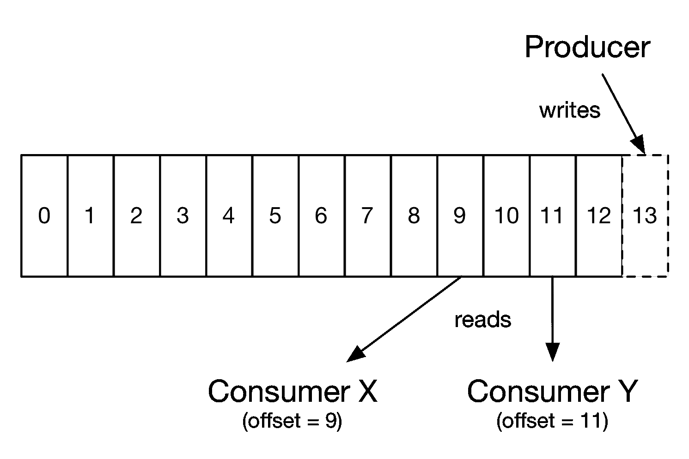
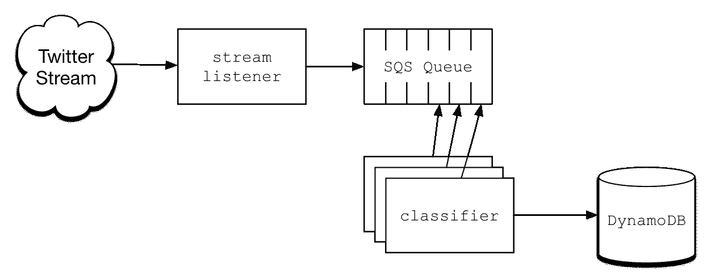
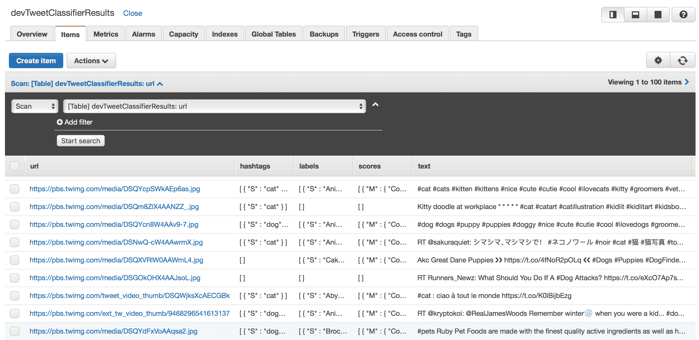
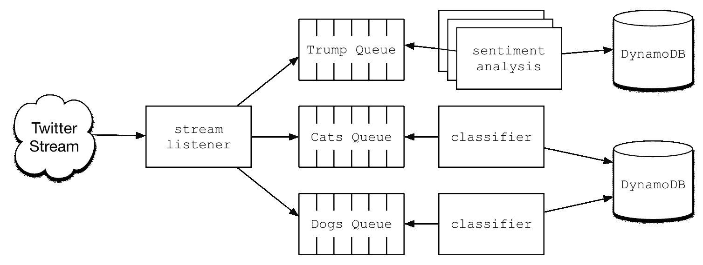
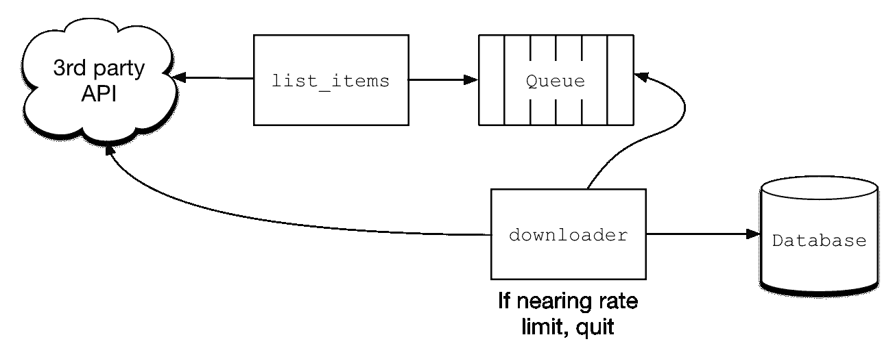

# 使用消息模式进行异步处理

在上一章中，我们讨论了 Fan-out 模式，我们可以使用不同的策略来实现它。在该部分的末尾，我们回顾了一个 Fan-out 模式的实现，它使用了 AWS 的简单队列服务（SQS）作为事件触发的目标。像 SQS 这样的队列系统提供了一定程度的安全性和安全性，因为它们旨在成为一个主要持久存储的地方，数据会一直保留，直到某个进程有机会将其取出，执行一些工作，并删除该条目。如果一个下游工作进程完全崩溃，并且处理停止了一段时间，队列只会备份，大大降低了数据丢失的风险。如果一个工作进程在处理过程中遇到一些无法恢复的问题，队列中的条目通常会留在队列上，以便将来由另一个处理器重试。

在本章中，我们将介绍如何使用队列作为消息系统来连接多个无服务器组件。读者可能已经熟悉诸如 RabbitMQ、ActiveMQ 或 SQS 之类的队列系统。我们将学习如何使用队列在无服务器系统之间传递消息，以提供持久性和容错性强的分布式系统，适用于数据密集型应用程序。

在本章结束时，你可以期待理解以下主题：

+   在无服务器架构中可用的队列系统及其合理性

+   使用无服务器函数处理消息的选项（轮询和扇出）

+   队列和流系统之间的区别以及何时使用其中一个而不是另一个

+   死信队列以确保消息永远不会丢失

+   使用队列作为速率限制的方法

# 队列系统的基本原理

在软件领域，队列系统绝非新鲜事物。一般来说，队列是大多数计算机科学入门课程中涵盖的最基本的数据结构之一。在继续之前，让我们简要回顾一下队列作为计算机科学中基本数据结构的概念。

简而言之，队列是一系列项目的集合，新项目被推到后面，而项目从前面被拉出。考虑一下我们都在排队等待看电影。只要人们遵守规则，不按顺序排队，你就已经排队了（这当然也是为什么英国英语使用*queue*，这个词比美国术语*line*更准确）。正式来说，我们可以将队列定义为具有先入先出（FIFO）属性的项目集合。队列数据类型的主要操作是`enqueue`和`dequeue`。这些操作分别将新项目添加到队列的后面，并从前面弹出项目。

在软件中，如 RabbitMQ 之类的队列系统通常用于处理异步处理。触发的事件可能意味着您的系统需要执行一些不需要实时发生的重新计算或数据处理。而不是让用户坐着等待直到他们点击按钮，应用程序会将元数据放入一个包含足够信息的队列中，以便下游的工作进程执行其任务。这些工作进程的唯一责任是坐着等待直到新的项目到来，然后执行一些计算。随着消息出现在队列中，工作进程会摘取这些消息，完成工作，然后返回等待更多消息。这种架构具有多个优点：

+   **持久性**：只要客户端成功将数据写入队列，并且队列系统运行正常，消息就会在队列中持续存在，直到有足够的计算能力将它们取出、处理并最终删除。

+   **可伸缩性**：大多数队列架构都是可并行的，这意味着多个工作进程可以从队列中提取消息并并行处理单个项目。为了提高吞吐量，我们可以向系统中添加更多的工作进程，这将通过更大的并行性实现更快的处理速度。

+   **可预测的负载**：通常，工作进程需要从数据库中读取和/或写入数据。当负载异常高时，队列可以作为处理任务和数据库之间的缓冲。为了减轻对数据库的压力，我们可以扩展工作进程的数量，以便尽可能提高并行性，但不要过多，以免因过多的读取或写入而使数据库不堪重负。

读者应注意，他们可以使用队列或流系统来实现消息模式。在本章中，我们专注于队列，但稍后讨论流系统的优点以及两种类型消息代理之间的差异。在后续章节中，我们将探讨流系统的细节。

最危险的情况之一是，当队列的所有令人难以置信的优点都得到实现时，实际的队列服务器（如 RabbitMQ 等）却作为一个单节点运行。我在多家公司工作过，这些公司非常依赖 RabbitMQ 作为队列骨干，从它那里运行着非常高的业务关键型工作负载。然而，我们将这些 RabbitMQ 部署作为一个具有大量计算能力的单个 EC2 实例运行。不可避免的是，当单个实例遇到问题或由于某种原因死亡时，整个系统就会崩溃，导致消息丢失、尝试写入队列并失败的客户端，以及一个全面糟糕的一天。

# 选择队列服务

好消息是，现在多个云提供商现在提供队列系统作为服务。在以下示例中，我们将使用 AWS 的 SQS。虽然我并没有直接与他们合作，但 Google Compute Cloud 有任务队列，Azure 有队列存储。毫无疑问，其他云提供商也提供类似的服务。在评估托管队列服务时，有几个因素需要考虑：

+   支持哪种类型的数据获取模型，拉取还是推送？

+   消息的最大生命周期或队列的最大深度是多少？

+   对于持续失败的消息会发生什么？是否有死信队列选项？

+   是否有保证一次且仅一次的交付，或者消息可以被多次交付？

+   是否保证顺序，或者消息的到达顺序可以相对于发送顺序出现乱序？

这些问题的答案将因提供商而异，也因特定云提供商的服务提供而异。例如，SQS 有两大类：标准队列和 FIFO 队列。当你基于 AWS 构建时，你选择哪一种将取决于你的特定用例。如果你使用不同的云提供商，你需要深入研究他们的文档，以完全理解你所使用的队列服务的特性和语义。

# 队列与流

你可以将队列视为消息的经纪人。某些数据生产者会将消息放置到队列中，而某些数据消费者会读取这些消息。队列只是简单地作为消息传递交换的经纪人。流处理系统提供了类似的功能，但行为、特性和应用却大不相同。为了清晰起见，我将简要讨论队列和流之间的差异。

Apache Kafka 是一个非常流行的流处理系统，广泛使用，你可能已经听说过。今天，云提供商已经推出了托管流处理系统：

+   **Azure**: Event Hubs

+   **AWS**: Kinesis

+   **Google Compute Cloud**: Cloud Dataflow

那么，与队列系统相比，流处理系统究竟是什么呢？在我看来，最显著且最容易理解的区别在于项目处理或交付的方式。在队列系统中，进入队列的消息通常由单个进程一次性处理。当然，这个规则有例外，但在我所工作的所有使用队列的系统里，*正常路径*的设计是这样的：单个消息会被读取并处理一次。

另一方面，流系统可以被视为记录的集合，其中旧记录最终从后面（最旧的先过期）过期，而新记录被添加到前面。消息不是被处理和删除，而是坐在那里，不知道谁在读取它们，也不会被消费者删除。数据消费者负责使用偏移量值跟踪其在流中的位置。流服务本身负责保留消息，通常具有一些可配置的过期期限：



在使用流系统时，可能存在多个消费者读取和处理相同消息的情况。例如，一个消费者可以读取流上的项目并计算某些指标的运行平均值，而另一个消费者可以读取相同的消息并计算标准差。在队列系统中，如果没有在不同队列中复制消息或实现一些逻辑或启发式方法来仅在所有消费者完成其工作后删除消息，这是不可能的。无论如何，队列对于此类问题来说都不是一个好的选择，而流系统正是为此而专门设计的。

流系统的另一个令人兴奋的特性是，新上线的新消费者可以从流的末尾开始，并向前工作。例如，如果一个流包含一周的数据，任何新启动的系统都能回溯七天，并从那里开始处理。因为消费者跟踪其在流中的位置或偏移量，所以在失败的情况下，他们可以从中断的地方继续。

从技术上讲，你可以使用队列或流来实现消息模式，具体选择取决于手头的问题。我们将在后续章节中探讨 AWS Kinesis 和流系统。现在，我们将专注于使用队列，特别是 SQS 作为示例应用程序。在我看来，消息模式的核心在于通过某种消息代理（如队列或流系统）将不同系统之间的通信分离。

# Twitter 流的异步处理

Twitter 是一个随机数据的绝佳来源。鉴于数据的量和种类，我们可以轻松地想出（以及解决）示例（和真实）问题。在我们的案例中，我们将通过提取公共 Twitter 流来构建一个无服务器处理系统。我们的示例系统将具有以下工作流程：

1.  从 Twitter 火炬中读取包含猫或狗图像的推文

1.  将消息放置在 SQS 队列中。

1.  工作进程将从队列中读取这些图像 URL 并执行图像识别。

虽然这个例子可能有点牵强，但演示的概念是真实的。我们将使用 AWS Rekognition 服务来对找到的任何猫或狗图像进行识别和标记。Rekognition 在其工作上非常快，但很容易想象使用速度慢得多的服务处理图像。在这种情况下，将项目添加到队列中，并在我们的空闲时间通过一个或多个工作进程进行处理，这将使我们能够扩展以实现更高的处理速率。

你可以在这个章节中找到所有代码：[`github.com/brianz/serverless-design-patterns/tree/master/ch6`](https://github.com/brianz/serverless-design-patterns/tree/master/ch6)。

# 系统架构

我们图像分析示例的系统架构非常简单。推文的摄取将通过 Twitter API 的流监听器开始，使用 Python 的 `tweepy` 库，[`github.com/tweepy/tweepy`](https://github.com/tweepy/tweepy)。这个监听器将只代表我们过滤出特定的推文。从那里，监听器将消息放入 SQS 队列。一旦将消息交付到队列，我们的流监听器的任务就完成了。通过这种设计，我们实现了真正的关注点分离。如果我们列出我们的流监听器关心的事情，列表会相当短：

+   Twitter 访问

+   一些业务逻辑，关于从推文中提取哪些类型的数据

+   将提取的推文信息放在哪个队列中

就这样。一旦流监听器完成了将项目添加到队列中的最后一步，它就不再关心也不受任何下游处理或缺乏处理的影响。

从那里，工作进程将从队列中提取图像并执行它们的工作，最终调用 AWS Rekognition 并将结果存储在 DynamoDB 中以供未来审查。我们的示例将使用一个分类器处理器，它将以单级并行性运行。也就是说，在任何给定时间，只有一个分类器进程正在运行。然而，如果我们希望扩展并同时运行多个分类器，这将增加我们的并行性和系统的整体吞吐量，这只会带来很少的变化。

再次强调，与将所有这些工作作为一个单一进程实现相比，这个设计中的分类器的工作要简单得多。分类器也只关心少量项目以执行其工作：

+   从哪个队列获取数据

+   一点业务逻辑来执行图像分类

+   结果放置的位置

我们的分类器既不知道也不关心数据是如何进入队列的。从分类器的角度来看，唯一重要的是数据以正确的格式（相当简单）到来，并且它有权访问执行其工作所需的资源。

使用队列作为数据生产者（流监听器）和数据消费者（分类器）之间的经纪人，我们有一个相当好的持久性水平。如果我们的监听器死亡（按照设计，你很快就会看到）或者我们的分类器死亡，SQS 将保留我们的数据，确保我们可以在系统恢复健康时访问并处理它们。此外，我们还可以根据需要扩展它，在流监听器产生的消息多于单个分类器可以处理的情况下，添加更多的分类器：



消息由一个流监听器进程放入 SQS 队列中，该进程实现为一个 AWS Lambda 函数，并按计划运行。单个分类器 Lambda 函数也按计划运行，负责从队列中提取消息，使用 AWS Rekognition 进行分类，并将结果最终存储在 DynamoDB 中。

此外，这种设计提供了一种在其他情况下难以实现的可扩展性。我们的例子是处理带有`#cat`或`#dog`以及一些其他相关标签的推文。我们也可以修改我们的流处理器以获取更广泛的推文集，例如针对`@realDonaldTrump`的推文。这些推文可以发送到完全不同的队列中，该队列将单独处理并完全不同。由于`@realDonalTrump`的推文量远高于`#cat`和`#dog`推文，从系统架构的角度来看，将它们分开并分别处理是一个非常好的主意。

# 数据生产者

这段代码中的大多数复杂性都围绕着 Twitter API，我不会详细说明。我自己并没有太多使用 Twitter API 的经验，但 tweepy 的 GitHub 页面和网站上有很多资源和示例代码，可以帮助你开始，这正是我遵循的方法来使它工作。以下代码是整个过程的入口点，它开始读取与猫或狗相关的公共 Twitter 流，并将每条推文的子集放入 SQS 队列中：

```java
import os
import tweepy

from .queue import publish_tweet

consumer_key = os.environ['TWITTER_CONSUMER_KEY']
consumer_secret = os.environ['TWITTER_CONSUMER_SECRET']

access_token = os.environ['TWITTER_ACCESS_TOKEN']
access_token_secret = os.environ['TWITTER_ACCESS_SECRET']

class PhotoStreamListener(tweepy.StreamListener):

    def _get_media_urls(self, media):
        if not media:
            return []

        return [m['media_url_https'] for m in media if m['type'] == 
        'photo']

    def _get_hashtags(self, container):
        hashtags = [h['text'] for h in container.get('hashtags', ())]
        return [h for h in hashtags if '#' + h in self.tags]

    def on_status(self, tweet):
        container = tweet._json

        entities = container.get('entities', {}).get('media')
        extended_entities = container.get('extended_entities', 
        {}).get('media')
        extended_tweet = container.get('extended_tweet', 
        {}).get('entities', {}).get('media')

        all_urls = set()
        for media in (entities, extended_entities, extended_tweet):
            urls = self._get_media_urls(media)
            all_urls.update(set(urls))

        hashtags = self._get_hashtags(container.get('entities', {}))

        if all_urls:
            for url in all_urls:
                publish_tweet({
                    'text': tweet.text,
                    'url': url,
                    'hashtags': hashtags,
                })

    @staticmethod
    def start(tags=None):
        tags = tags or ['#dog', '#dogs', '#puppy', '#cat', '#kitty', 
        '#lolcat', '#kitten']

        auth = tweepy.OAuthHandler(consumer_key, consumer_secret)
        auth.set_access_token(access_token, access_token_secret)

        api = tweepy.API(auth)

        listener = PhotoStreamListener()
        listener.tags = tags
        stream = tweepy.Stream(auth=api.auth, listener=listener)
        try:
            stream.filter(track=tags)
        except Exception as e:
            print 'Shutting down'
            print e
```

让我们从查看`start`函数开始，它做你预期的事情。一旦监听器类被实例化并开始运行，它将作为一个长期运行的守护进程，每当遇到推文时就会调用`on_status`函数。由于我们只对某些类型的消息感兴趣，我将一个标签列表传递给`filter`函数。

我们的所有应用程序逻辑都封装在`on_status`方法中。推文是一个相当复杂的数据结构，我们感兴趣的图像 URL 可能存在于多个位置。作为一个 Twitter API 的新手，我并不完全确定查找图像 URL 的确切逻辑，但`on_status`中的少量逻辑似乎足以为我们示例获取足够的图像。在尽可能多地获取图像 URL 和一些提取的标签后，我们将使用我们的`publish_tweet`包装函数将这个数据结构发布到我们的 SQS 队列中。有关`publish_tweet`的详细信息可以在以下队列特定的代码块中找到。它并不复杂，真正重要的是要理解最终会出现在队列上的内容。在这种情况下，我们将一个 Python 字典放置在 SQS 上，它最终被序列化为 JSON 记录。这个记录包含原始推文文本、猫或狗图像的 URL 以及推文中嵌入的任何标签：

```java
publish_tweet({
    'text': tweet.text,
    'url': url,
    'hashtags': hashtags,
})
```

# 使用无服务器函数模拟守护进程进程

根据定义，无服务器函数是短暂的，并且在你选择的平台将其终止之前有一个最大生命周期。在撰写本文时，AWS Lambda 函数的当前限制是 300 秒（5 分钟）和默认的 6 秒。我们的示例依赖于一个持续读取 Twitter 流并将结果发布到队列中的长期运行的过程。那么，我们如何使用本质上短暂的系统来实现这种长期运行的行为呢？

为了模拟一个持续运行的过程，我们可以利用 Lambda 函数的定时调用。其他云提供商应该提供类似的功能。简而言之，我们可以利用 Lambda 函数的最大生命周期来达到我们的目的。这里的技巧是将我们的 Lambda 函数的`timeout`值设置为 58 秒，这正好低于 60 秒的预定调用速率。

由于该代码将无限期运行，我们可以依赖 AWS 在 58 秒后终止 Lambda 函数。一个正在运行的`Firehose` Lambda 函数被终止后，我们知道另一个将在一秒或两秒内启动，这导致`Firehose`进程持续运行。

有可能出现一秒钟或两秒钟内同时运行两个 firehose 处理实例的情况。在这种情况下，这并不是一个问题，因为数据消费者可以通过简单地忽略重复数据来优雅地处理重复数据。如果你打算使用相同的模式，确保你的数据消费者能够处理重复数据，并且其计算和处理是幂等的，这是至关重要的。这种模式可能并不适用于所有问题，但对于这种和类似系统来说效果很好：

```java
service: twitter-stream

provider:
  name: aws
  runtime: python2.7
  memorySize: 128
  region: ${env:AWS_REGION}
  iamRoleStatements:
    - Effect: Allow
      Action:
        - sqs:*
      Resource: "arn:aws:sqs:${env:AWS_REGION}:*:${env:ENV}TwitterFirehoseQueue"
    - Effect: Allow
      Action:
        - rekognition:DetectLabels
      Resource: "*"
    - Effect: "Allow"
      Action:
        - "dynamodb:*"
      Resource: "arn:aws:dynamodb:${env:AWS_REGION}:*:table/${env:DYNAMODB_RESULTS_TABLE_NAME}"
  environment:
    TWITTER_ACCESS_SECRET: ${env:TWITTER_ACCESS_SECRET}
    TWITTER_ACCESS_TOKEN: ${env:TWITTER_ACCESS_TOKEN}
    TWITTER_CONSUMER_KEY: ${env:TWITTER_CONSUMER_KEY}
    TWITTER_CONSUMER_SECRET: ${env:TWITTER_CONSUMER_SECRET}
    TWITTER_STREAM_QUEUE_NAME: ${env:ENV}TwitterFirehoseQueue
    DYNAMODB_RESULTS_TABLE_NAME: ${env:DYNAMODB_RESULTS_TABLE_NAME}

package:
  exclude:
    - .git/**
    - __pycache__/**
    - "**/__pycache__/**"
    - "*.pyc"
    - "*.swp"

resources:
  Resources:
    FirehoseSQS:
      Type: AWS::SQS::Queue
      Properties:
        QueueName: ${env:ENV}TwitterFirehoseQueue
        VisibilityTimeout: 30
    DynamoResultsTable:
      Type: AWS::DynamoDB::Table
      Properties:
        TableName: ${env:DYNAMODB_RESULTS_TABLE_NAME}
        AttributeDefinitions:
          - AttributeName: url
            AttributeType: S
        KeySchema:
          - AttributeName: url
            KeyType: HASH
        ProvisionedThroughput:
          ReadCapacityUnits: ${env:DYNAMODB_TABLE_READ_IOPS}
          WriteCapacityUnits: ${env:DYNAMODB_TABLE_WRITE_IOPS}

functions:
  Firehose:
    handler: handler.firehose
    timeout: 58
    events:
      - schedule: rate(1 minute)
  Classify:
    handler: handler.classify
    timeout: 58
    events:
      - schedule: rate(1 minute)
```

# 数据消费者

如果你曾经使用过 RabbitMQ 或其他队列系统，你可能习惯于在特定的队列或主题上注册工作进程，当感兴趣的消息到达时，这些监听器/工作进程会收到通知。与 SQS 不同，SQS 是一个纯轮询系统；也就是说，任何想要从队列中读取数据的代码都需要使用适当的 AWS API 进行轮询。此外，应用程序代码必须明确地从队列中删除消息，一旦它完成了处理。

一些其他队列系统的 API 在没有异常发生的情况下会自动`ack`一条消息，从而导致这些消息从队列中移除。务必记住，即使没有处理，也要从 SQS 队列中删除消息。

正如`Firehose`函数在每分钟执行一次一样，我们的`Classify`过程也是如此。当这个函数运行时，它首先从 SQS 队列中拉取 10 条记录的批次。你可以在下面的代码中看到有一个使用`while True:`语句的无穷循环。同样，一旦这个循环开始，它将一直运行，直到 Lambda 根据我们的 58 秒超时自行终止。如果没有可处理的消息，一切都会关闭。这种方法比处理进程休眠更简单直接，成本也更低。仅仅退出，我们就可以依赖下一次运行来获取下一批工作，而无需浪费 CPU 周期去做除了等待消息到来之外的事情：

```java
import boto3
import json
import os
import urllib2

from decimal import Decimal

TWITTER_STREAM_QUEUE_NAME = os.environ['TWITTER_STREAM_QUEUE_NAME']

from .storage import ClassiferResults

_sqs_client = None
_s3_client = None
_sqs_url = None

def get_sqs_client():
    global _sqs_client
    if _sqs_client is None:
        _sqs_client = boto3.client('sqs')
    return _sqs_client

def get_queue_url():
    global _sqs_url
    if _sqs_url is None:
        client = get_sqs_client()
        response =    
        client.get_queue_url(QueueName=TWITTER_STREAM_QUEUE_NAME)
        _sqs_url = response['QueueUrl']
    return _sqs_url

def publish_tweet(payload):
    msg = json.dumps(payload)
    client = get_sqs_client()
    sqs_url = get_queue_url()

    return client.send_message(
                QueueUrl=sqs_url,
                MessageBody=msg)

def classify_photos():
    rekognition = boto3.client('rekognition')
    sqs = get_sqs_client()
    sqs_url = get_queue_url()

    while True:
        response = sqs.receive_message(
            QueueUrl=sqs_url,
            MaxNumberOfMessages=10,
        )
        messages = response.get('Messages')
        if not messages:
            break

        for msg in messages:
            receipt = msg['ReceiptHandle']
            body = json.loads(msg['Body'])

            url = body['url']

            # first check if we already have this image
            classifier_store = ClassiferResults(url=url)
            if classifier_store.exists:
                print 'Deleting queue item due to duplicate image'
                sqs.delete_message(QueueUrl=sqs_url, 
                ReceiptHandle=receipt)
                continue

            image_response = urllib2.urlopen(url)
            results = rekognition.detect_labels(Image={'Bytes': 
            image_response.read()})

            scores = [{
                'Confidence': Decimal(l['Confidence']),
                'Name': l['Name'],
            } for l in results['Labels']]

            classifier_store.upsert(
                    text=body['text'],
                    hashtags=body['hashtags'],
                    scores=scores,
                    labels=[l['Name'] for l in results['Labels']],
            )

            sqs.delete_message(QueueUrl=sqs_url, ReceiptHandle=receipt)
```

在`classify_photos`函数找到一些消息后，处理它们并不复杂。对于推文，我们的分类器很可能遇到重复的照片。这项工作将结果存储在 DynamoDB 中，所以第一步是检查该 URL 是否已经存在。我们的 DynamoDB 表将使用 URL 作为分区键，这类似于关系数据库中的简单主键。这个 DynamoDB 模式意味着 URL 必须是唯一的。如果我们已经存储了特定的 URL，我们不会进行任何更多的处理。然而，我们还需要记住从队列中删除消息。如果没有这一步，工作进程会反复处理队列项，导致队列永远不会为空。

对于任何新的 URL，我们将下载图片并将其发送到 AWS 的 Rekognition 服务以获取标签和关联分数的列表。如果你不熟悉 Rekognition，它是一个非常出色的服务。Rekognition 提供了许多令人印象深刻的功能，例如面部识别。我们将使用图像检测或*标签*功能，该功能将检测给定图像中的对象及其相应的分数：


例如，这张猫的图片会导致 Rekognition 产生以下`Labels`：

```java
{
    "Labels": [
        {
            "Name": "Animal",
            "Confidence": 86.34986877441406
        },
        {
            "Name": "Cat",
            "Confidence": 86.34986877441406
        },
        {
            "Name": "Kitten",
            "Confidence": 86.34986877441406
        },
        {
            "Name": "Mammal",
            "Confidence": 86.34986877441406
        },
        {
            "Name": "Pet",
            "Confidence": 86.34986877441406
        },
        {
            "Name": "Manx",
            "Confidence": 82.7002182006836
        },
        {
            "Name": "Asleep",
            "Confidence": 54.48805618286133
        },
        {
            "Name": "Siamese",
            "Confidence": 52.179630279541016
        }
    ]
}
```

因此，我们的工作进程将检索推文中嵌入的图片，并将它们交给 Rekognition 进行标记。一旦 Rekognition 完成工作，工作进程将把图像和推文的分数以及其他数据存储在 DynamoDB 中。

# 查看结果

在这个例子中，我们没有自定义的用户界面来查看结果，所以必须使用 DynamoDB 控制台。正如我们可以在下面的屏幕截图中所见，我存储了图像 URL 以及原始推文中嵌入的任何标签，以及 Rekognition 查询中检测到的标签和分数：



使用 DynamoDB API，让我们使用亚马逊的`boto3`库来详细查看一条记录，以下是一个例子：

```java
>> import boto3
>>> url = 'https://pbs.twimg.com/media/DSQYcgMWAAAwfXf.jpg'
>>> dynamo = boto3.resource('dynamodb')
>>> table = dynamo.Table('devTweetClassifierResults')
>>> table.get_item(Key={'url': url})
{u'hashtags': [u'cat', u'kitten', u'kitty'],
 u'labels': [u'Animal', u'Pet', u'Cat', u'Mammal', u'Manx'],
 u'scores': [{u'Confidence': Decimal('86.49568939208984375'),
 u'Name': u'Animal'},
 {u'Confidence': Decimal('86.49568939208984375'),
 u'Name': u'Pet'},
 {u'Confidence': Decimal('79.18183135986328125'),
 u'Name': u'Cat'},
 {u'Confidence': Decimal('79.18183135986328125'),
 u'Name': u'Mammal'},
 {u'Confidence': Decimal('79.18183135986328125'),
 u'Name': u'Manx'}],
 u'text': u'#cat #cats #kitten #kittens #nice #cute #cutie #cool #ilovecats #kitty #groomers #vets #photooftheday #mycat\u2026 https://t.co/YXrs0JFb1d',
 u'url': u'https://pbs.twimg.com/media/DSQYcgMWAAAwfXf.jpg'}
```

有了这些，我们有一个相当复杂的系统，但应用程序代码行数却很少。最重要的是，在这个背景下，我们利用的每个系统都是完全管理的。亚马逊将代表我们维护和扩展 Lambda、SQS 和 DynamoDB。关于管理 DynamoDB 的读写容量有一些技巧和关键细节，我鼓励你自己去了解这些。

# 替代实现

我们的示例应用程序非常健壮，可以在几乎不需要更改的情况下处理相当大的负载和流量。尽管这种模式易于理解、实施和运行，但它并非万能药。你可能会在自己的场景中需要不同实现的消息模式。我们将回顾一些相同模式的替代应用，该模式使用队列作为不同系统之间的消息代理。

# 结合使用 Fan-out 和消息模式

在之前解释我们的系统架构时，我简要讨论了从流监听器向多个队列扇出消息的可能性。当有不同类型的工作负载需要从单个数据生产者执行时，这种设计非常有用。以下示例架构展示了一个由单个 Twitter 流数据生产者组成的系统，该生产者根据有效负载将消息扇出到多个队列：



对于这个例子，假设我们感兴趣的是处理更广泛的推文范围。这个系统仍然会像以前一样对狗和猫的图像进行分类；然而，这次我们可以通过使用单独的队列来更细致地分离处理，分别为猫图像和狗图像使用不同的队列。我们无法一开始就保证这种处理分离，但它将允许我们分别处理和扩展这些系统。

一个更好的例子是将`@realDonaldTrump`推文分割到完全不同的处理管道中，使用专门的队列。这个队列上的流量将远高于猫和狗的图片。很可能我们希望运行多个并发工作者来处理这个更高的流量。此外，我们还可以做一些与图像标记完全不同的事情，比如对这些推文进行情感分析。即使在情感分析资源不足且落后于进度的情况下，我们也可以有信心知道队列上的任何消息最终都可以通过添加更多工作进程或数据生产者最终放缓新消息的发送来得到处理。

# 使用队列作为速率限制器

许多公共 API 都有速率限制。如果你试图使用需要许多 API 调用的特定 API 来拉取大量数据，你无疑需要绕过这些速率限制，并找到一种方法以尽可能快的速度获取数据，同时不超过你的请求配额。在这种情况下，队列架构可以提供帮助：



我个人已经成功实现了这个模式。在这里，第三方 API 提供了一个到`/items`的端点。实际检索的数据对解释细节来说并不重要。在这里的挑战是，我们只能通过向`/items/${id}`端点进行另一个 API 调用来获取这些项目的所需详细信息。当有数百或数千个项目需要下载，每个项目都需要单独的 API 调用（或更多）时，我们需要小心保持在速率限制阈值以下。通常，我们更希望系统尽可能快地运行，这样检索项目细节的整体过程就不会花费数天或数周。

在这样的限制下，我们可以使用队列和检查我们的消费速率限制，尽可能快地下载项目，同时保持在分配的速率限制范围内。这里的技巧是将生成下载对象的工作与下载这些对象的行为分开。为了这个示例，假设`/items`端点一次检索最多 500 个项目，其中每个元素都包含一个唯一的数字`id`和一些元数据。我们检索每个项目完整视图的目标需要另一个对`/item/${id}`的 API 调用。数据生产者会对`/items`端点进行单个调用，并为每个需要下载和存储的项目将消息放入队列。队列上的每个消息都会相对通用，包含如`{'url': 'https://some-domain.io/item/1234'}`这样的简单数据结构。这个过程可以快速进行，因为获取整个对象列表实际上可以非常快地完成，并且可能低于任何施加的速率限制。

我将有关下载项目详情和处理速率限制的任何智能功能都放入下载器进程中。就像我们的猫和狗分类器一样，下载器作业被安排每分钟唤醒一次，尽可能多地下载消息。在从队列中获取第一个项目后，下载器将检查由第三方 API 通过 HTTP 头提供的消耗速率限制。没有标准的方式来向客户端提供使用统计信息，但我看到这种类型的数据以下列头格式返回：`X-Ratelimit-Usage: 2142,3000`。在这个例子中，API 强制执行每单位时间 3,000 个请求的限制，而客户端目前消耗了 2,142 个请求。如果你做数学计算，2,142 个消耗单位与 3,000 个阈值的比较等于 71.4%的使用率。

每次 API 调用后，下载器作业通过以下简单计算来检查其消耗的 API 使用情况。一旦接近某个上限，下载器可以简单地关闭自己并停止发出 API 请求（可能是在使用率达到 90%以上时）。当然，必须有一个 API 调用来检查这种使用情况。如果工作器/下载器进程每两分钟启动一次，最坏的情况是系统每两分钟发出一个 API 调用。只有在经过一段时间并且速率限制被重置（可能每 15 分钟一次）之后，下载器才能再次开始批量拉取项目。通过使用与我们的分类器示例相同的技巧，通过调整超时值以及计划调用时间，可以轻松地让一个或多个下载器持续不断地运行。

# 使用死信队列

在某些情况下，工作进程可能永远无法成功处理队列中等待的消息。以我们的图像分类器问题为例。工作进程除了下载图像、将其发送到 Rekognition 以及将这些结果存储在 DynamoDB 中之外，不负责其他任何事情。然而，如果在一条推文到达队列并处理该推文之间，Twitter 用户删除了原始图像或推文，会发生什么情况。在这种情况下，我们的分类器进程会严重失败。你自己看看，你会发现没有任何防护措施来防止从图像获取中返回 HTTP 404 响应代码。

这种严重的失败会导致应用程序代码完全跳过`sqs.delete_message`函数。在可配置的时间后，相同的信息将再次出现在队列中，另一个工作器将遇到相同的问题并以相同的方式失败。如果没有一些保护措施，这种循环将无限期地重复。

在应用程序代码中处理这种情况相当简单，因为处理任何非 200 HTTP 响应代码都很容易，缺少几张图片并不是一个重大问题。在更复杂的应用程序中，其中失败场景不容易预见，设置一些回退机制对于调试和使整个系统更可靠非常有帮助。特定的队列系统，包括 SQS，提供了所谓的死信队列。

死信队列是一个独立的队列，无法成功处理的消息最终会进入这个队列。我们可以设置一个死信队列，并配置我们的主队列，如果工人在尝试了十次之后仍然无法成功处理消息，就将消息放置在那里。在这种情况下，我们保证消息最终会从主队列中移除，无论是由于成功处理还是由于强制移除（由于 10 次失败）。这个好处是，我们可以捕获任何有问题的消息，并最终检查它们，根据需要修改应用程序代码。由于死信队列本身也是一个队列，我们仍然负责维护它，并确保其健康和大小得到控制。

# 摘要

在本章中，我们讨论了消息模式的细节，并通过使用 AWS SQS 作为消息代理的完整示例进行了演示。该示例应用程序包括一个 Lambda 函数作为数据生产者，SQS 作为消息代理，以及一个 Lambda 函数作为数据消费者，最终将结果存储在 DynamoDB 中。我们还讨论了队列和流系统之间的区别，并回顾了当一种系统可能比另一种系统更可取时的优点和用例。我还解释了针对特定问题的消息模式的替代架构和实现，并给出了具体的例子以供参考。

到目前为止，读者应该已经很好地理解了如何使用队列系统将数据密集型无服务器应用程序拆分，以提供可伸缩性、容错性和可靠性。我提出了替代架构，这应该让读者对如何为改进解耦和性能来结构化他们的应用程序有一些了解。

在下一章中，我们将回顾另一种在大型数据系统中有用的数据处理模式，即 Lambda 模式。
