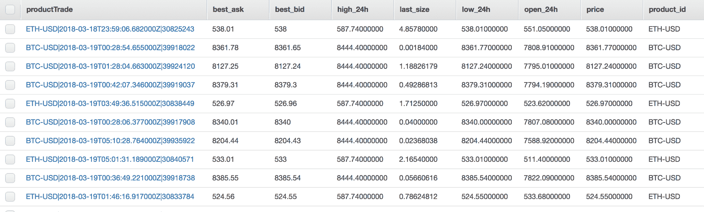

# 使用 Lambda 模式进行数据处理

本章描述了 Lambda 模式，不要与 AWS Lambda 函数混淆。Lambda 架构由两层组成，通常用于数据分析处理。这两层包括一个速度层，用于近实时计算数据，以及一个批量层，用于批量处理大量历史数据。

由于无服务器平台允许我们非常快速地进行水平扩展，并且存储大量数据很简单，因此 Lambda 模式非常适合无服务器实现。Lambda 架构相对较新，随着大数据处理的出现以及希望比以前使用 Hadoop 等批量系统更快地看到处理结果的需求而出现。这种架构或模式特别有趣，因为它涉及许多组件才能使其工作，我们将通过一个示例应用程序来演示，该应用程序将计算比特币和以太坊加密货币的平均价格。

到本章结束时，你可以期待学习以下内容：

+   对 Lambda 架构的深入理解以及何时可能适合使用

+   在无服务器环境中设计 Lambda 架构时，可用的工具和选项有哪些

+   如何为处理加密货币价格流创建速度层

+   如何开发用于处理历史价格的批量层

+   在构建无服务器 Lambda 架构时的替代实现和工具

# 介绍 Lambda 架构

根据我所知，Apache Storm 的作者 Nathan Martz 在 2011 年的一篇博客文章中首次介绍了 Lambda 架构。[`nathanmarz.com/blog/how-to-beat-the-cap-theorem.html`](http://nathanmarz.com/blog/how-to-beat-the-cap-theorem.html)。在这篇文章中，Nathan 提出了一种新的系统类型，该系统可以在实时层旁边计算大型数据集的历史视图，实时层可以回答关于真实或近实时数据的查询。他将这两个层称为批量层和实时层。

Lambda 架构是从尝试解决对持续更新的数据进行查询的问题中衍生出来的。在此背景下，我们需要牢记我们处理的数据类型。流数据是事实记录。以下是一些流事实数据的示例：

+   在特定时间和特定位置的气温

+   来自网络服务器的 HTTP 日志记录

+   在特定时间从特定交易所获取的比特币价格

你可以想象一个温度传感器在特定位置进行测量，并且每 5 秒将读数发送到某处的场景。如果 2018 年 1 月 31 日 12:00:00 的温度读数是 75.4°F，这个事实永远不会改变。5 秒后的读数可能是 75.5°F，但这并不取消之前的读数。在这种情况下和其他情况下，我们正在处理一个只追加的事实数据流。

使用我们的温度类比，想象我们需要回答关于这些数据的问题，例如以下问题：

+   自 2010 年以来平均每周气温是多少？

+   自 2000 年以来平均每月气温是多少？

+   过去一年中每天的气温最高和最低是多少？

+   过去 2 小时的温度趋势是什么？

我们不仅处理不可变数据，还需要考虑查询中需要响应的时间域。如果我们有一个简单的实现，我们可以在关系型数据库中存储每条数据，并在需要时执行查询。一年中有 31,540,000 秒。如果我们每 5 秒上传一次测量值，那么一年就是 6,308,000 次。现在，假设我们需要跟踪全球 10,000 个不同的传感器。这意味着我们的系统每年会增加 63,080,000,000 条新记录。

使用关系型数据库的初始挑战可能仅仅是找到特定位置的那些记录的子集，例如，`SELECT * FROM temperatures where location_id = 1234`。当然，我们可以通过索引快速执行此类查询，但在处理数十亿或数万亿行数据时，存在显著的局限性和权衡。

第二个挑战是执行计算以获得正确答案（即按周平均气温，每天的高低温）。如果我们的查询是从 20 年前到今天的数据，这意味着大量的磁盘访问和数据库的显著负载，假设分析查询可以用 SQL 完成。

虽然确实存在可以处理这种规模级别的系统，例如数据仓库或 NoSQL 数据存储，但数据仓库并不是为实时查询设计的。NoSQL 系统可能在存储大量数据方面做得更好，但在对数据进行计算时缺乏灵活性和能力。

当我们拥有数据仓库级别的规模、持续更新的数据流以及需要实时服务查询的要求时，我们该怎么办？这正是 Lambda 模式可以发挥作用的地方。由批处理层和速度层组成，Lambda 模式旨在解决实时响应查询的问题，从批处理层和速度层的输出中提取数据。

从技术角度讲，视图层是这个架构的一个独立组件。如本章开头所述，无服务器 lambda 模式的实现有许多移动部件和组件。因此，我将不会详细讨论视图层，以便我们可以专注于这个模式的数据部分，这部分更符合本章的主题。关于无服务器系统中的前端应用程序的讨论，请参考第二章，*使用 REST 的三层 Web 应用程序*。

架构如下所示：


# 批处理层

当 lambda 架构被提出时，Hadoop 已经被广泛采用，并被认为是一项成熟的技术。Hadoop 是一个线性可扩展的系统，可以在合理的时间内轻松处理数以兆字节的数据，以计算数据集中几乎任何内容。在这里，“合理”可能意味着一个在深夜运行几小时的工作，以便数据的新视角可以在早上第一时间准备好。

使用我们的温度监控类比，如果我们需要计算月或年的平均温度，就需要运行一个新的批处理作业。想象一下，如果我们想按日、按月或按年计算趋势。每当完成一批每日温度数据时，我们的系统就需要进行一些工作来计算预计算视图。通过预先计算所有这些数据，任何查询只需在需要时查找答案，而无需进行任何计算。

# 速度层

批处理层本身并不新鲜。我们试图解决的问题是快速回答查询，并实时查看我们的数据流。Lambda 模式中的魔力在于批处理层与速度层的结合。

速度层是一个不断更新的系统，它实时处理数据流中的新数据。这里的计算将与批处理中的相同，但它只处理从数据流中到达的小部分数据。例如，为了响应这样的查询，获取自 2015 年以来某个位置的每日最高温度，我们的系统会执行以下操作：

1.  从批处理层获取 2015 年 1 月 1 日到昨天的每日最高温度

1.  从速度层获取今天的最高温度

1.  将两个数据集合并成一个，然后呈现给用户

还要注意，在这样的系统中，我们可以更进一步。我们的视图层可以在应用程序的一个区域显示历史数据，并分别展示实时信息，这些信息可以通过 WebSocket 连接或轮询不断更新。通过分离这两个层，在应用程序开发和交互方面会打开许多选项。

# Lambda 无服务器架构

虽然 lambda 架构的整体设计和主题与传统系统相同，但我们需要进行一些变化和调整。也许更重要的是，有多种不同的方式可以使用无服务器系统或至少是托管服务来实现此模式。

# 流数据生产者

任何系统都必须从要处理的数据开始。在无服务器平台上，有多个选择用于流系统。Azure、Google Compute 和 AWS 都提供某种形式的流系统。我在第六章，“使用消息模式进行异步处理”中提到了这些，当时讨论了队列和流之间的区别：

+   **Azure**: 事件中心

+   **AWS**: Kinesis

+   **Google Compute Cloud**: 云数据流

值得再次简要提及队列与流的话题。如第六章中提到的，“使用消息模式进行异步处理”，其中一个主要区别是队列主要设计为一次处理。也就是说，一旦消息从队列中取出，其他消费者将看不到它。流中的数据具有给定的生命周期，并且不能被任何数据消费者删除。例如，流可以设置数据在 24 小时后或 30 天后过期。在任何时候，一个或多个读者可以出现并开始从流中读取数据。读者需要跟踪他们在流历史中的位置。新读者可以从流的开始、中间或末尾开始。 

# 数据存储

由于该模式中有两个不同的层级，因此存储选择可能会不同，因为这两个层的数据需求差异很大。批处理层需要极高的可扩展性，并且在批处理期间应该能够很好地处理大量并发读取。另一方面，速度层不需要存储大量数据，但应该对读取和写入都极为快速。

在许多该模式的示例中，你会看到对**Hadoop 文件系统**（**HDFS**）用于存储历史数据和 NoSQL 数据库用于实时数据的引用。虽然很难说你应该选择什么，但可以讨论一些你的选项。

云存储系统，如 AWS S3 或 Google Cloud Storage，旨在填补与 HDFS 类似的角色，即存储你需要的几乎所有数据。在类似服务上存储普通文件的优势在于，它使得以后处理数据并将其存储在不同的系统（如数据库）中成为可能。此外，还有许多无服务器或托管系统可以利用，这些系统可以从这些系统中读取数据。仅关注 AWS，以下系统可以在 S3 数据上执行批处理或分析查询：

+   **弹性 MapReduce** (**EMR**)

+   Athena

+   Redshift

DynamoDB 或其他 NoSQL 也是历史数据的选项。Azure Cosmos DB 和 Google Bigtable 是其他服务，我无法直接评价，但如果你在这些云服务提供商之上构建，它们是可行的选项。

至少在 DynamoDB 的情况下，应该特别考虑，因为需要仔细考虑读写吞吐量以保持系统可操作。

对于速度层，也有多种工具可以使用。DynamoDB 是一个可行的选择，因为它线性可扩展，你应该对所需的读写容量有一个合理的了解。AWS ElastiCache 或 Azure Redis Cache 等托管的 Redis 服务也是不错的选择，因为 Redis 性能卓越，数据集有限。

# 速度层的计算

由于我们使用的是无服务器系统，我们的无服务器函数将执行所需的任何计算，这是合乎逻辑的。到这一点，无服务器函数作为自然选择的原因应该是显而易见的。按需或在我们的流中到达新数据时运行函数非常简单。此外，FaaS 允许我们水平扩展。

在 lambda 架构中，我们可能需要同时计算许多不同的指标，来自同一数据流。从单个无服务器函数中完成这项工作可能是可能的。然而，在计算较重的情况下，我们可能需要将计算拆分为多个函数，每个函数从同一流中计算自己的指标集。多个读者允许我们水平扩展，并在数据变化或需要计算新指标时提供所需的灵活性。

虽然无服务器函数是自然的选择且易于理解，但还有其他选项。在 AWS 上，可以在 EMR 系统中使用 Spark Streaming。Spark Streaming 专为这种类型的工作负载而构建。如果你的数据流超过了云函数（如 Lambda）的限制，转向 Spark Streaming 是一个不错的选择。

# 批量层的计算

许多 lambda 架构系统将依赖于 Hadoop 或 Spark 进行批量层。由于我们不希望自行管理集群，我们必须选择其他无服务器系统，或者至少是一个托管服务。这里有多种选择。

首先，我们可以完全使用无服务器技术来实现我们的 MapReduce 系统。你将在第八章《*MapReduce 模式*》中了解到这一点。如果你不想构建 MapReduce 系统，还有其他服务可以利用。Spark 和 Hadoop 都可在 AWS EMR 中使用。Azure 的 HDInsight 提供了与 EMR 相同或类似的功能。

批量处理现在是一个已解决的问题，你应该能够找到满足你需求的解决方案。由于批量处理有许多选项，你可能会发现很难缩小选择范围。

# 使用 Lambda 架构处理加密货币价格

在本章中，我们的示例应用程序将执行一个单一的任务，即实时读取各种加密货币的价格，并按分钟、小时和日计算平均价格。当然，这在现实世界中并不那么有用，因为已经有大量关于加密货币的数据。然而，这为示例应用程序提供了一个极好的场景和数据集，以说明这种模式。正如本书惯例，我将在 AWS 上使用 Python 构建应用程序。同样重要的是要注意，这些概念并非仅限于 AWS 或 Python，并且这个示例应用程序可以移植到其他语言和云服务提供商。

你可以在[`github.com/brianz/serverless-design-patterns/tree/master/ch7`](https://github.com/brianz/serverless-design-patterns/tree/master/ch7)找到本章的代码。

# 系统架构

尽管实现本身相对简单，但这个架构可能是本书中最复杂的。正如本章前面提到的，Lambda 架构中有许多动态部分，因为它是由两个并行工作的独立系统组成的，每个系统都有自己的独特服务集。以下图表显示了高级架构：

这个设计有些牵强且过于简化。一个真正按比例缩放的系统可能无法像我在批量层中那样，通过一个按年计算历史价格的函数来逃避无服务器函数。为了将这个示例应用程序压缩到单个章节中，我不得不使系统相对简单，以便演示模式和技巧。虽然这可能是一个实际大数据系统的过度简化，但它确实表明设计可以在无服务器平台上工作，甚至适用于相当大的数据问题。


我将逐个分解并描述每一层和组件的工作原理。虽然这个设计中可能有很多内容，但每个部分都非常简单。这个系统的复杂性大部分来自系统设置和概念，而不是应用程序代码。

# 数据生产者

首先，我们需要一些要处理的数据。在一个真实系统中，如果你正在创建数据或希望从你的系统中发送一些数据*出去*，这并不是一个问题。在我们的情况下，我们需要实时地从某处拉取数据，我选择了 GDAX 的公共 API（[`www.gdax.com`](https://www.gdax.com)），这是 Coinbase 的加密货币数字交易所。这个 API 适合我们的示例应用，主要是因为有很多交易，并且有一个我们可以订阅的 WebSocket 端点。一个简单的脚本，订阅 GDAX WebSocket API 并将这些消息发布到我们的 Kinesis 流，将作为我们的数据生产者。

# 速度层

速度层也相对简单。每个发布到 Kinesis 流的消息都会触发一个 Lambda 函数。这个 Lambda 函数只是将数据写入 DynamoDB，这样我们就可以为任何查询提供实时数据。在这种设计下，我们已经为相当数量的实时负载和并发性做好了准备。数据生产者将以合理的速度交付数据，可能每秒几条消息。如果出现流量高峰，速度层开始看到每秒数十或数百条消息，这不会是问题。

由于无服务器函数和如 DynamoDB 这样的数据库是线性扩展的，速度层可以吸收几乎任何数量的实时流量。当然，还有配置和吞吐量方面的考虑，以及最大并发限制需要竞争。然而，这些问题只是你可以快速更改并按需增加的配置设置。

# 批量层

我们的批量层会变得更有趣。一些细节是 AWS 特定的，但你可以在不同的云服务提供商之间传递这个一般想法。AWS Kinesis Firehose 是 Kinesis 的另一种版本，旨在将数据批量传输到各种位置。在这个架构中，我们将设置 Kinesis Firehose 流从主 Kinesis 流中摄取数据。我还会配置 Firehose 流，使其每分钟将消息批量发送到 S3。

如果你听说过 AWS Kinesis，但对 Kinesis Firehose 这个术语感到陌生，请不要担心。Kinesis Firehose 的专业技能是将数据加载到各种服务中，例如 S3 和 Redshift。一个普通的 Kinesis 流会捕获数据并使其可供消费，但这种消费是你的责任。当你希望自动将流数据倒入 S3 或 Redshift 时，Kinesis Firehose 非常有用。

每分钟都会有一个新文件被发送到 S3，我们可以设置一个 Lambda 函数来触发这个事件并执行一些工作。这里的工作将是读取消息列表，计算每种货币的平均价格，并将新文件写回 S3。如果你跟随时间和数据的流动，你应该能够看到我们可以将这种模式扩展到不同的时间增量——分钟、小时、天、月甚至年。一般流程和触发器集合看起来像这样：

+   每分钟，一个 Lambda 函数读取存储在 S3 上的数据，并计算过去一分钟的平均价格

+   每小时，一个 Lambda 函数读取存储在 S3 上的数据，并计算过去一小时的平均价格

+   每天晚上，一个 Lambda 函数读取存储在 S3 上的数据，并计算前一天的平均价格

由于数据存储在 S3 上，这个系统没有阻止它发展成为一个全新的批量层，使用更强大的工具，如 Spark 和 Athena。

# AWS 资源

在我看来，这个整个系统最复杂的部分是设置所有各种资源以及它们之间的相互作用。如果你计算我们需要使这个系统工作的资源数量，列表会迅速增长：

+   两个 S3 桶

+   一个 Kinesis 流

+   一个 Kinesis Firehose 流

+   一个 DynamoDB 表

+   四个 Lambda 函数

+   多个 IAM 角色

我们不仅需要创建所有前面的资源，还需要确保它们可以相互通信。正如在 AWS 中构建时经常发生的那样，管理此类堆栈所涉及的大部分工作都是确保权限正确，以便 Lambda 函数可以从正确的 S3 桶、DynamoDB 表或 Kinesis 流中读取/写入。

如果你使用 `cloc` 来计算这个应用程序的代码行数，你就可以看到这个证据。查看以下输出，你会发现 `serverless.yml` 中的配置代码量高于应用程序代码，有 165 行 YAML 配置与 128 行 Python 代码：

```java
$ cloc . 
 4 text files.
 4 unique files. 
 2 files ignored.

github.com/AlDanial/cloc v 1.72 T=0.03 s (96.4 files/s, 12465.5 lines/s)
---------------------------------------------------------------------------
Language         files    blank     comment     code
---------------------------------------------------------------------------
YAML             1        6         8           157
Python           2        59        22          128
---------------------------------------------------------------------------
SUM:             3        65        30          285
---------------------------------------------------------------------------
```

我将在这里介绍 `serverless.yml` 文件的一些有趣部分：

```java
service: gdax-lambda-arch

provider:
  name: aws
  runtime: python3.6
  stage: ${env:ENV}
  region: ${env:AWS_REGION}
  iamRoleStatements:
    - Effect: "Allow"
      Action:
        - "s3:GetObject"
        - "s3:ListBucket"
        - "s3:PutObject"
      Resource:
        - "arn:aws:s3:::brianz-gdax-${env:ENV}-firehose"
        - "arn:aws:s3:::brianz-gdax-${env:ENV}-firehose/*"
        - "arn:aws:s3:::brianz-gdax-${env:ENV}-results"
        - "arn:aws:s3:::brianz-gdax-${env:ENV}-results/*"
    - Effect: "Allow"
      Action:
        - "dynamodb:PutItem"
      Resource: "arn:aws:dynamodb:${self:provider.region}:*:table/brianz-gdax-${env:ENV}-realtime"
```

首先，我们需要确保我们的 Lambda 函数将能够访问各种资源。在先前的 `iamRoleStatements` 中，我正在为这个堆栈中的所有 Lambda 函数授予对我们将使用的两个 S3 桶以及 DynamoDB 的各种权限。这 shouldn't come as a big surprise。我们的 Lambda 函数将读取和写入 S3 中的数据。同样，我们的速度层将向 DynamoDB 写入新记录。

接下来，我将介绍如何创建一个 Kinesis 流，我们可以从我们的数据生产者写入，然后它将消息转发到 Kinesis Firehose 传输流。请注意；这有点原始，可能会显得复杂。我会一点一点地分解，希望以一个可理解的方式。

第一步是创建一个 Kinesis 流。这部分使用 `serverless.yml` 文件的 `Resources` 部分非常直接，它实际上是 CloudFormation。在这种情况下，我们只需要一个分片，因为我们的应用程序吞吐量相对较小。如果你推送的数据量更大，你可以通过增加分片数量来增加额外的吞吐量。以下是从 `serverless.yml` 文件中的 `resources` 部分摘录的代码片段，展示了我是如何创建 Kinesis 流的：

```java
resources:
  Resources:
    # This is the stream which the producer will write to. Any writes  
     will trigger a lambda
    # function. The Lambda function will need read access to this 
    stream.
    GdaxKinesisStream:
      Type: AWS::Kinesis::Stream
      Properties:
        Name: brianz-gdax-${env:ENV}-kinesis-stream
        RetentionPeriodHours: 24
        ShardCount: 1
```

接下来是稍微复杂一点的部分。Kinesis Firehose 仍然是一个 Kinesis 流，但它的行为与之前提到的略有不同。在一个标准的 Kinesis 流中，您需要对生产者推送到流中的消息进行处理。另一方面，Kinesis Firehose 将自动将一批消息发送到某个目的地。您可以选择以下最终目的地：

+   AWS S3

+   AWS Redshift

+   AWS Elasticsearch 服务

+   Splunk

我们可以通过在 `Resources` 块中添加一些 CloudFormation 代码来创建一个 Kinesis Firehose 流。我们需要通过 CloudFormation 创建以下内容：

+   一个接收来自先前 Kinesis 流的数据的 Firehose 流，并且每 60 秒将数据批量写入 S3

+   一个 IAM 角色允许访问 Firehose，以便从我们的 S3 存储桶中读取/写入，并读取 Kinesis 流

这段 CloudFormation 代码有点冗长。而不是在这里放置整个代码块，我会将您引导到 GitHub 仓库。您可以在以下 URL 中阅读设置 Kinesis Firehose 流的完整细节：[`github.com/brianz/serverless-design-patterns/blob/master/ch7/serverless/serverless.yml#L47-L113`](https://github.com/brianz/serverless-design-patterns/blob/master/ch7/serverless/serverless.yml#L47-L113)。

此 Firehose 流的数据源是主要的 Kinesis 流，我将其命名为 `GdaxKinesisStream`。您可以在 `KinesisStreamSourceConfiguration` 和 `DeliveryStreamType` 键中看到使用此流作为数据源的配置。这两个设置说明我们将使用 Kinesis 流作为数据源，而不是通过 API 调用直接将数据放在此 Firehose 流上。它还通过 `KinesisStreamSourceConfiguration` 告诉 Firehose 流在哪里可以找到这个源 Kinesis 流，这可能会有些令人困惑。

在这里，`KinesisStreamSourceConfiguration` 包含两个键，`KinesisStreamARN` 和 `RoleARN`。前者，`KinesisStreamARN`，指的是我们连接到的 Kinesis 流的位置。另一方面，`RoleARN` 与权限有关。这个引用的角色必须允许读取源 Kinesis 流。这里涉及的内容有点多，但如果查看整个配置，应该能理解一些。

现在我们已经处理好了输入源，我们需要在 `S3DestinationConfiguration` 键中设置 S3 目标配置。此配置类似于源流；我们需要通过 `BucketARN` 给我们的 Firehose 流指定数据写入的位置，并给它一个具有必要访问权限的角色。

`S3DestinationConfiguration` 的另一个有趣且重要的部分是它被配置为每 60 秒或每 5 MB（以先到者为准）将数据写入 S3。由于 GDAX WebSocket 推送并不那么频繁，我们可以预计在 Firehose 缓冲区达到 5 MB 之前会先达到 60 秒的限制。

从这里，我们可以将注意力转向将运行我们的应用程序代码的 Lambda 函数。我实现了四个不同的 Lambda 函数，它们将处理以下任务：

+   来自 Kinesis 流的单个事件

+   每 60 秒从 Kinesis Firehose 创建的 S3 对象

+   从数据的聚合分钟视图创建的 S3 对象

+   从数据的聚合小时视图创建的 S3 对象

以下展示了这四个 Lambda 函数的配置：

```java
functions:
  ProcessPrice:
    handler: handler.single
    memorySize: 256
    timeout: 3
    events:
      - stream:
          type: kinesis
          arn:
            Fn::GetAtt:
              - GdaxKinesisStream
              - Arn
    environment:
      TABLE_NAME: brianz-gdax-${env:ENV}-realtime
  CalculateMinuteView:
    handler: handler.minute
    memorySize: 256
    timeout: 10
    events:
      - s3:
          bucket: brianz-gdax-${env:ENV}-firehose
          event: s3:ObjectCreated:*
    environment:
      DESTINATION_BUCKET: brianz-gdax-${env:ENV}-results
  CalculateHourlyView:
    handler: handler.hourly
    memorySize: 512
    timeout: 60
    events:
      - s3:
          bucket: brianz-gdax-${env:ENV}-results
          event: s3:ObjectCreated:*
          rules:
            - suffix: '59-minute.json'
  CalculateDailyView:
    handler: handler.daily
    memorySize: 1024
    timeout: 300
    events:
      - s3:
          bucket: brianz-gdax-${env:ENV}-results
          event: s3:ObjectCreated:*
          rules:
            - suffix: '23-hour.json'
```

您可以看到，第一个函数 `ProcessPrice` 在消息被投递到我们的 Kinesis 流上时被触发。一旦这个函数执行完毕，它的任务就完成了。这个函数与其他任何函数都没有其他交互。

接下来的三个函数协同工作。这个过程从 `CalculateMinuteView` 被触发开始，当 Firehose 流每 60 秒向 S3 交付一批新消息时。这个函数将使用所有交付的消息计算平均价格，并将一个新文件上传到 S3，文件名为 `MM-minute.json`，其中 `MM` 是计算出的分钟的数值表示（00，01...59）。

一旦我们到达一个小时的末尾，这个函数将写入一个名为 `59-minute.json` 的文件。由于该文件表示一个小时的结束，我们可以触发 `CalculateHourlyView` 函数来计算过去一个小时的平均价格。这个函数生成名为 `HH-hour.json` 的文件，其中 `HH` 代表一天中的 24 小时（00，01...23）。对于小时和天，同样的策略也是适用的。一旦收到名为 `23-hour.json` 的文件，就到了计算每日平均价格的时候，由 `CalculateDailyView` 来完成。

# 数据生产者

以下示例代码展示了如果您对比特币和以太坊的价格感兴趣，一个简单的客户端应用程序看起来是什么样的。这段代码除了从每条消息中反序列化 JSON 负载并将其打印到终端外，不做任何其他操作：

```java
from websocket import WebSocketApp
from json import dumps, loads

URL = "wss://ws-feed.gdax.com"

def on_message(_, message):
    json_message = loads(message)
    print(json_message)

def on_open(socket):
    products = ["BTC-USD", "ETH-USD"]
    channels = [
        {
            "name": "ticker",
            "product_ids": products,
        },
    ]
    params = {
        "type": "subscribe",
        "channels": channels,
    }
    socket.send(dumps(params))

def main():
    ws = WebSocketApp(URL, on_open=on_open, on_message=on_message)
    ws.run_forever()

if __name__ == '__main__':
    main()
```

执行此代码，每当我对订阅的两种货币中的任何一种进行买卖交易时，我都会看到负载打印出来：

```java
{'best_ask': '8150', 
 'best_bid': '8149.99', 
 'high_24h': '8302.73000000', 
 'last_size': '0.33846794', 
 'low_24h': '8150.00000000', 
 'open_24h': '8021.01000000', 
 'price': '8150.00000000', 
 'product_id': 'BTC-USD', 
 'sequence': 5434939366, 
 'side': 'buy', 
 'time': '2018-03-18T22:48:35.185000Z', 
 'trade_id': 39905775, 
 'type': 'ticker', 
 'volume_24h': '29375.86790154', 
 'volume_30d': '633413.03952202'}
```

为了将此数据引入我们的系统，我们需要添加几行额外的代码来将数据发布到 AWS Kinesis 流中。对前面的客户端代码的更改相当简单。在接收到一条新消息后，我会检查负载是否为正确的类型，只需查找时间键即可。我们收到的某些消息是对我们订阅的确认，并且不包含时间键，这表明除了交易之外的其他消息。以下代码展示了这些更改以及我是如何使用 `boto3` 库将数据发布到 Kinesis 流的：

```java
kinesis = boto3.client('kinesis')

def on_message(_, msg):
    json_msg = json.loads(msg)
    if 'time' in json_msg:
        print('Publishing...')
        response = kinesis.put_record(
                StreamName='brianz-gdax-bz-kinesis-stream',
                PartitionKey=json_msg['time'],
                Data=msg + '|||',
        ) 
        print(response)
    else: 
        print(json_msg)
```

我们应用程序的这一部分是完全独立的。我在一个`screen`会话中的 EC2 实例上运行了这个小脚本，所以当我登出时代码仍然在运行。这种实现不适合真正的生产系统，但在我运行它的那几天里它工作得很好。如果我要为实际的生产系统做这件事，我会使用一些守护进程管理系统，如`supervisord`、`upstart`或`runit`来运行这段代码。

# 速度层

我们的速度层是整个系统中最简单的一部分。有了配置到位——一个`single` Lambda 函数，每当有新的流消息到达时就会执行——我们唯一需要做的工作是从消息有效负载中解码数据，计算 DynamoDB 分区键，并将其写入 DynamoDB。以下代码块显示了所有这些工作都在`single`函数中完成，该函数正在处理来自 AWS Kinesis 的单个消息：

这段代码全部位于一个单独的`handler.py`函数中，这与将应用程序代码拆分和将应用程序逻辑与云特定部分解耦的最佳实践相悖。然而，这段应用程序代码仅用于演示目的，我可以为了清晰和简洁而打破一些规则。如果有一个真实系统而不是演示，我会对这个代码更加谨慎和有组织。一些导入语句将在批处理层代码中使用。

```java
import json
import os
import os.path

from base64 import b64decode
from datetime import datetime

from lambda_arch.aws import (
        get_matching_s3_keys,
        list_s3_bucket,
        read_body_from_s3,
        write_to_dynamo_table,
        write_to_s3,
)

def single(event, context):
    """Process a single message from a kinesis stream and write it to 
       DynamoDB"""
    record = event['Records'][0]
    data = record['kinesis']['data']

    # Append on a delimiter since we need to unpack messages which are 
    concatenated together when
    # receiving multiple messages from Firehose.
    data = json.loads(b64decode(data).decode().rstrip('|||'))

    # Create our partition key
    data['productTrade'] = '{product_id}|{time}|
    {trade_id}'.format(**data)

    write_to_dynamo_table(os.environ['TABLE_NAME'], data)
```

这段代码的结果是，我们感兴趣的每一个 GDAX 交易最终都会出现在我们的 DynamoDB 表中。下面的截图显示了存储数据的一个子集。有了 DynamoDB 中的数据，我们的视图层可以快速查找特定时间范围内的行集：



DynamoDB 的价格更多地取决于您对这个系统所需的读取和写入操作。尽管没有代码来删除我们不再需要的数据（即历史数据和处理批处理层的数据），但这并不是一个巨大的问题。然而，如果有一个生产系统，您会希望考虑一些关于过期不再需要的数据的技术。

# 批处理层

而我们的速度层只与 DynamoDB 交互，我们的批处理层将与 S3 交互。在这个层中有两种不同的函数——响应来自 Firehose 的 S3 对象的函数，以及响应来自 Lambda 函数的 S3 对象的函数。它们之间没有太大的区别，但重要的是要指出这两个不同的类别。

以下代码块是从`handler.py`中摘取的，显示了构成我们批处理层的应用程序代码：

```java
def _get_bucket_and_key_from_event(event): 
    record = event['Records'][0]
    s3 = record['s3'] 
    bucket = s3['bucket']['name'] 
    key = s3['object']['key'] 
    return (bucket, key)

def minute(event, context):
    """Process an S3 object uploaded to S3 from Kinesis Firehose.

    The data format from Firehose is all of the messages from the  
    `single` function above,
    concatenated together. In order to read thse messages, we need to 
    decode them and split the
    string by our own delimiter.

    """
    bucket, key = _get_bucket_and_key_from_event(event)
    data = read_body_from_s3(bucket, key).decode()

    product_prices = {}

    lines = [json.loads(l) for l in data.split('|||') if l]
    times = []

    for line in lines:
        # Only keep track of buys for the average price, since sells 
        could be sell orders which are
        # never executed.
        if line.get('side') != 'buy':
            continue

        product_id = line['product_id']
        price = float(line['price'])

        times.append(line['time'])
        if product_id not in product_prices:
            product_prices[product_id] = {'prices': [price]}
        else:
            product_prices[product_id]['prices'].append(price)

    if not product_prices:
        return

    # Calculate the average for each product
    for key in product_prices:
        prices = product_prices[key]['prices']
        product_prices[key]['average'] = sum(prices) * 1.0 / 
        len(prices)

    # Determine the most recent timestamp from the list of buys so we 
    can determine the key to
    # write.
    times.sort()
    latest_time = times[-1]
    latest_dt = datetime.strptime(latest_time, DT_FORMAT)

    destination_bucket = os.environ['DESTINATION_BUCKET']
    new_key = latest_dt.strftime('%Y/%m/%d/%H/%M-minute.json')
    new_payload = json.dumps(product_prices, indent=2)

    print('Uploading to', destination_bucket, new_key)

    write_to_s3(destination_bucket, new_key, new_payload)

def _aggregate_prices(event, period='hour'):
    """Aggregate average prices for a particular time slice"""
    bucket, key = _get_bucket_and_key_from_event(event)
    key_root = os.path.dirname(key)

    product_prices = {}

    for key in get_matching_s3_keys(bucket, prefix=key_root + '/', 
    suffix='-minute.json'):
        data = read_body_from_s3(bucket, key).decode()
        minute_prices = json.loads(data)

        for product_id, payload in minute_prices.items():
            prices = payload['prices']
            if product_id not in product_prices:
                product_prices[product_id] = {'prices': prices}
            else:
                product_prices[product_id]['prices'].extend(prices)

    for key in product_prices:
        prices = product_prices[key]['prices']
        average_price = sum(prices) * 1.0 / len(prices)
        product_prices[key]['average'] = average_price

    new_key = '%s-%s.json' % (key_root, period)
    new_payload = json.dumps(product_prices, indent=2)

    print('Uploading to', bucket, new_key)

    write_to_s3(bucket, new_key, new_payload)

def hourly(event, context):
    _aggregate_prices(event, period='hour')

def daily(event, context):
    _aggregate_prices(event, period='day')
```

批处理从`minute`函数开始。同样，这个函数在从我们的 Firehose 流到达 S3 的新文件时启动。在这个时候，我们可以确信`minute`函数根据我们的配置每分钟被调用一次。我们不需要逐行检查，但我们可以查看最终结果以及一些小技巧。

你可能会注意到使用 `split('|||')` 分割数据的行。Firehose 在将记录交付到任何数据源之前会将记录连接起来。AWS 关于 Kinesis Firehose 的文档明确指出这一点，但仍然容易忽略：

“为了将数据交付到 Amazon S3，Kinesis Firehose 根据你的交付流缓冲区配置将多个传入记录连接起来，然后将它们作为 S3 对象交付给 Amazon S3。在你将记录发送到 Kinesis Firehose 之前，你可能想在每条记录的末尾添加一个记录分隔符，这样你就可以将交付的 S3 对象分割成单个记录。”

前面的内容摘自 [`docs.aws.amazon.com/firehose/latest/dev/basic-deliver.html`](https://docs.aws.amazon.com/firehose/latest/dev/basic-deliver.html)。[链接](https://docs.aws.amazon.com/firehose/latest/dev/basic-deliver.html)

如果你回顾一下数据生产者，你可以看到我们在每条消息后面附加了 `'|||'` 字符串。有了这个分隔符，我们就可以在这个函数中拆分单个消息。

`minute` 函数上传到 S3 的最终结果具有以下形式。对于每种货币，它包括单个购买价格列表以及平均价格：

```java
{
  "BTC-USD": {
    "prices": [
      8173.59,
      8173.59,
      8173.59,
      8173.59,
      8173.59,
      8173.59,
      8173.59,
      8173.59,
      8174.99,
      8176.17,
      8176.17
    ],
    "average": 8174.186363636362
  },
  "ETH-USD": {
    "prices": [
      533.01,
      533.01,
      533.01,
      533.01,
      533.01,
      533.01
    ],
    "average": 533.0100000000001
  }
}
```

我们的 `CalculateHourlyView` 在名为 `59-minute.json` 的文件到达 S3 后执行一次。这个 S3 对象的到来标志着小时的结束，因此是计算整个小时平均价格的时候了。小时计算以及每日平均的计算都被封装在 `_aggregate_prices` 函数中。通过使用触发函数的 S3 对象的前缀，我们只会扫描用于计算平均值的 S3 记录的子集。例如，当一个新的 S3 对象以键名 `$BUCKET/2018/03/19/04/59-minute.json` 到达时，我们的应用程序代码可以解析 `$BUCKET/2018/03/19/04` 前缀，并只扫描该位置的文件。当一个名为 `$BUCKET/2018/03/19/23-hour.json` 的 S3 对象到达时，每日函数将扫描具有 `$BUCKET/2018/03/19` 前缀的文件。

# 结果

在运行这个系统几天后，我能够如预期地生成许多 S3 文件，同时还在 DynamoDB 中跟踪每一笔交易。正如我在本章前面提到的，对于这个示例系统来说，实现一些视图层是不切实际的。然而，只要设置了主键和排序键，查询 DynamoDB 就相当容易。任何需要获取历史数据的视图层都可以轻松地从 S3 中获取文件。

以下截图显示了给定小时的 S3 文件列表。每个文件都具有前面显示的格式，包括单个价格，以及每种货币的预先计算的平均值：


在 S3 层次结构中向上查看一个级别，我们可以看到包含平均价格的每小时文件：


# 摘要

在本章中，我们从概念层面以及详细层面讨论了 Lambda 模式。我通过一个使用无服务器技术计算不同时间段的平均加密货币价格的示例实现进行了说明。我们的示例应用程序由一个简单的脚本提供数据，该脚本从 GDAX WebSocket API 接收数据。这个数据生产者脚本将数据发布到单个 AWS Kinesis 流中，这反过来又触发了一系列事件，最终导致 DynamoDB 的实时更新，并触发批量作业来计算多种加密货币的分钟、小时和日平均价格的历史视图。

我讨论了 Lambda 模式可能适用的情况以及它非常适合的数据类型。我们探讨了在构建使用无服务器技术的 Lambda 架构时可能利用的各种系统和服务。我介绍了 AWS Kinesis 和 AWS Kinesis Firehose，这些是您可以用于实时应用的流式系统。

虽然 Lambda 模式实现的细节可能相当复杂，但读者应该对它的优点、缺点以及何时应该考虑使用它有一个相当好的理解。

在下一章中，我将介绍 MapReduce 模式，并通过一个示例来构建我们自己的无服务器实现。
