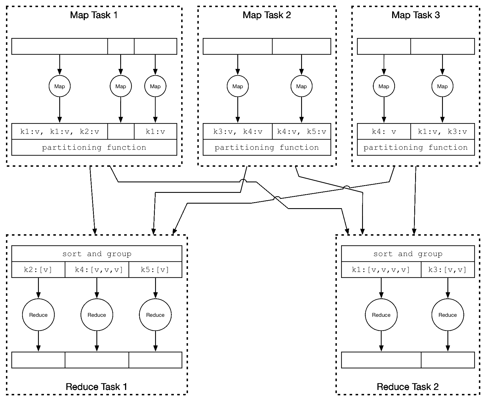
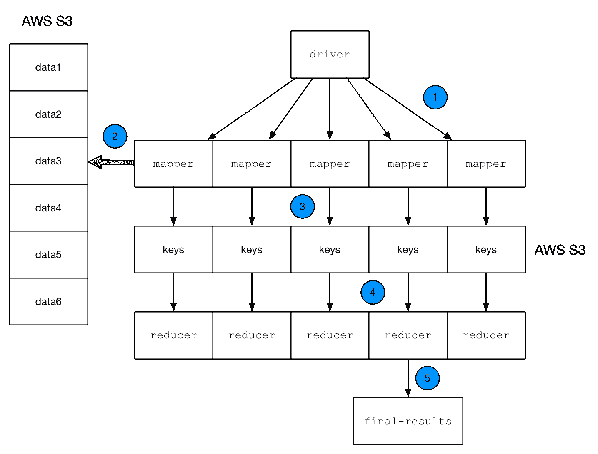
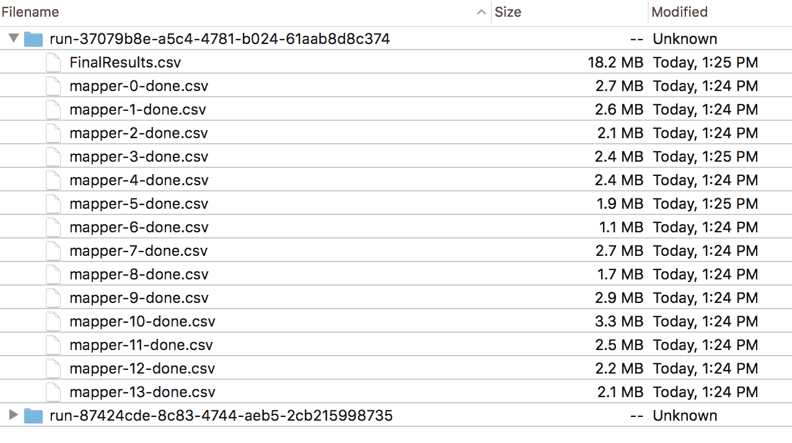
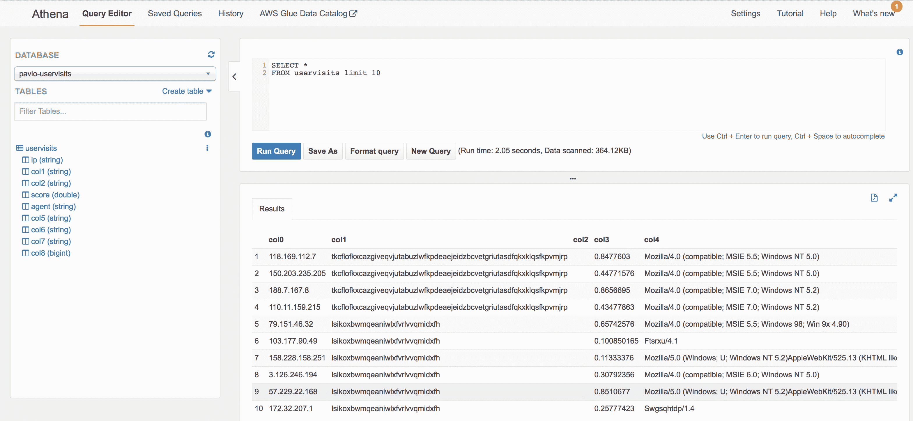
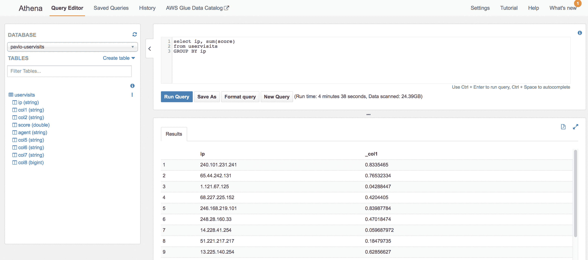
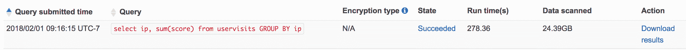

# MapReduce 模式

MapReduce 是一种由 Google 使流行起来的常见数据处理模式，现在在各种系统和框架中实现，最著名的是 Apache Hadoop。如今，这种模式在核心上是熟悉且易于理解的，但运行像 Hadoop 这样的大规模系统会带来其自身的挑战和拥有成本。在本章中，我们将展示如何使用无服务器技术实现这种模式。

在无服务器环境中实现大数据应用可能看起来与 FaaS 的计算限制相矛盾。某些类型的问题非常适合无服务器生态系统，特别是考虑到我们实际上有无限的文件存储，例如 AWS S3 这样的分布式文件系统。此外，MapReduce 的魔力不在于算法的应用，而在于计算能力的分布，使得计算可以并行执行。

在本章中，我们将讨论在无服务器环境中应用和开发 MapReduce 模式。我会介绍这种设计的用例以及何时可能或可能不适合。我还会展示这种模式在无服务器平台上的简单性以及在你开始构建系统之前应该考虑的事项。

在本章结束时，你可以期待了解以下主题：

+   MapReduce 解决的问题以及何时在无服务器环境中实现可能更合适

+   在应用此模式时设计和扩展的考虑因素

+   如何实现自己的无服务器 MapReduce 系统来统计来自电子邮件语料库中 from-to 组合的出现次数

+   如何将 Fanout 模式作为 MapReduce 模式的子组件使用

# MapReduce 简介

作为一种模式和编程模型，MapReduce 已经存在很多年了，它起源于并行计算研究和行业实施。最著名的是，MapReduce 随着 Google 在 2004 年发表的论文《MapReduce—Simplified Data Processing on Large Clusters》([`research.google.com/archive/mapreduce.html`](https://research.google.com/archive/mapreduce.html))进入了主流。Google 最初 MapReduce 实现的许多好处包括：

+   自动并行化和分布

+   容错性

+   I/O 调度

+   状态和监控

如果你退一步看看这个列表，它应该看起来很熟悉。FaaS 系统如 AWS Lambda 为我们提供了这些好处中的大多数。虽然状态和监控不是 FaaS 平台固有的，但有一些方法可以确保我们的函数正在成功执行。关于这个话题，MapReduce 系统最初，现在仍然经常在操作系统级别上进行管理，这意味着操作员负责处理崩溃或其他不健康的节点。

上述好处列表列在以下类似演示文稿的研究论文幻灯片中：[`research.google.com/archive/mapreduce-osdi04-slides/index-auto-0002.html`](https://research.google.com/archive/mapreduce-osdi04-slides/index-auto-0002.html)

在 Google 2004 年的 MapReduce 论文不久之后，Apache Hadoop 项目诞生了。Hadoop 的目标是为大数据处理实现 MapReduce 模式的开源实现。从那时起，Hadoop 可能已经成为今天最受欢迎的 MapReduce 框架。此外，术语*Hadoop*已经演变为包括许多其他用于大数据处理的框架，更多地指的是工具生态系统而不是单一框架。

尽管 Hadoop 功能强大且受欢迎，但在实践中它是一个复杂的怪物。为了运行一个具有任何重要性的 Hadoop 集群，除了运行和掌握 Zookeeper 和**HDFS**（**Hadoop 分布式文件系统**）以及 Hadoop 的主节点和工作节点本身之外，还需要做很多事情。对于那些不熟悉这些工具及其所有 DevOps 所有权的人来说，运行一个 Hadoop 集群不仅令人畏惧，而且不切实际。

# MapReduce 示例

如果你从未使用过 MapReduce 框架或系统，整体概念并不特别复杂。实际上，我们可以在几行代码中实现一个单进程和单线程的 MapReduce 系统。

总体而言，MapReduce 旨在从数据集中提取特定的信息片段，并将其提炼成某种最终结果。这听起来可能非常模糊和任意，确实如此。MapReduce 的美丽之处在于它可以应用于许多不同的问题。一些例子可以更好地说明 MapReduce 是什么以及如何使用它。

一个*Hello World* MapReduce 程序通过几行 Python 代码统计文本中特定单词的出现次数：

```java
lorem = """
Lorem ipsum dolor sit amet, consectetur adipiscing elit. Etiam ac pulvinar mi. Proin nec mollis
tellus. In neque risus, rhoncus nec tellus eu, laoreet faucibus eros. Ut malesuada dui vel ipsum
...
venenatis ullamcorper ex sed eleifend. Nam nec pharetra elit.
"""

words = (w.strip() for w in lorem.split())

def mapper(word):
    return (word, 1)

def reducer(mapper_results):
    results = {}
    for (word, count) in mapper_results:
        if word in results:
            results[word] += count
        else:
            results[word] = count
    return results

mapper_results = map(mapper, words)
reducer_results = reducer(mapper_results)
print(reducer_results)
```

首先，此代码执行一个映射阶段，为每个单词的出现生成一个包含两个元素的元组。例如，对于单词`amet`，会输出`('amet', 1)`。这个映射阶段的输出是一个`(word, 1)`对的列表，这里的`1`仅仅意味着我们遇到了这个单词。

Reducer 的职责是将 mapper 的输出聚合到某种最终格式中。在我们的例子中，我们希望得到每个单词出现次数的最终总计。阅读前面的`reducer`函数，应该很明显我是在如何做这件事。以下代码块展示了最终输出的一个片段。你可以看到，`amet`在`Lorem`, `ipsum`文本博客中只出现了一次，但`sit`出现了九次：

```java
{
  'Lorem': 1, 
  'ipsum': 4, 
  'dolor': 3,
  'sit': 9, 
  'amet,': 1,
   ...
}
```

# Mapper 的角色

`mapper` 的主要目的是发出 reducer 将后来聚合到最终结果中的数据。在这个简单的例子中，每个单词的出现都会产生一个 `(word, 1)` 对，因为我们给单词的单次出现打分是 `1`。我们完全可以只发出单词本身（即 `'amet'`）并将分数 `1` 放入 reducer；然而，这会使代码变得不那么通用。如果我们想给某些单词赋予更高的权重，我们只需更改我们的 mapper 以根据单词输出不同的数字，而我们的 `reducer` 代码保持不变。

以下代码块展示了我们如何给单词 `amet` 赋予 `10` 分，而所有其他单词计为 `1`。当然，这不再是计算单词出现次数，而是对单词进行评分：

```java
def mapper(word):
    if word == 'amet':
        return (word, 10)
    else:
        return (word, 1)
```

如果我们正在计算完全不同的事情，你现在应该看到我们需要更新 mapper 函数。基于这个 Lorem ipsum 文本，我们可以进行一些额外的计算，例如：

+   单词中的大写字母数量

+   单词中的元音字母数量

+   单词的平均长度

其中一些可能需要更改 reducer 步骤，我们将在下一节中介绍。

# reducer 的作用

虽然 mapper 的任务是提取和发出一些将被聚合的数据，但 reducer 的任务是执行聚合。在这个例子中，reducer 接收完整的 `(word, 1)` 对列表，并仅对每个单词的计数（在这种情况下是 `1`）进行求和。如果我们执行不同的聚合，`reducer` 函数就需要更改。

而不是计算出现的次数，让我们计算单词的平均长度。在这种情况下，我们的 `mapper` 和 `reducer` 都需要更新，其中 `reducer` 中的更改更为显著。以下代码块将我们的示例更改为计算文本块的平均单词长度：

```java
def mapper(word):
    return len(word)

def reducer(mapper_results):
    results = list(mapper_results)
    total_words = len(results)
    total_len = sum(results)
    return total_len / total_words
```

如前例所示，mapper 非常简单，只返回单词长度。由于这个例子不依赖于单词的任何特定内容，因此没有必要返回单词本身。`reducer` 代码变得更加简单。`reducer` 的输入现在是一个数字列表。为了计算平均值，只需将总和除以元素数量即可。

# MapReduce 架构

MapReduce 实现如 Hadoop 背后的真正魔法是计算的分布和并行化。我们的简单例子在笔记本电脑上运行良好，即使输入数据是几个兆字节。然而，想象一下，你想要在数百吉字节、太字节甚至甚至达到拍字节范围的数据上执行这种分析的情况。

实际的 MapReduce 系统使用两个基本技巧来高效地完成这项工作。一个是并行工作，正如我之前提到的。这意味着，例如，执行计算的多个实例构成了一个 Hadoop 系统或集群。另一个技巧是将数据与执行工作的 worker 节点协同放置。数据协同放置减少了网络流量并加快了整体处理速度。

Mappers 从输入数据的一个子集开始工作。你可以想象，当处理 PB 级的数据时，可能涉及数百或数千个节点。一旦 mappers 完成他们的工作，他们将数据发送到 reducers 进行最终处理。以下图从概念上展示了这个架构的细节：



图片改编自*MapReduce*:

*大规模集群上的简化数据处理*，Jeff Dean，Sanjay Ghemawat

Google, Inc. [`research.google.com/archive/mapreduce-osdi04-slides/index-auto-0008.html`](https://research.google.com/archive/mapreduce-osdi04-slides/index-auto-0008.html)

Hadoop 中的一个关键阶段是*shuffle*阶段，在之前的图中被标记为分区函数。从 Map 任务中出来的箭头表明，映射数据的一部分将被发送到不同的 reducer。在 Hadoop 中，所有特定键的输出都被发送到同一个 reducer 节点。例如，在我们的单词计数案例中，键`('amet', 1)`将发送到同一个 reducer 机器/节点，无论哪个 mapper 产生了这个键。这样做的原因是为了减少网络延迟和简化 reducer 的复杂性。通过保证 reducer 拥有执行最终 reduce 任务所需的所有数据，reducer 既快又易于实现。如果没有这个保证，框架将需要指定一个主 reducer 并水平爬行以收集所有必要的数据。这不仅复杂，而且由于网络延迟，速度也慢。

在像 Hadoop 这样复杂的系统中，有许多细节我们无法涵盖。如果你现在还有未解答的问题，我鼓励你自行进行更多调查。希望这次讨论已经足够为下一节中我们无服务器实现 MapReduce 奠定基础。

# MapReduce 无服务器架构

在无服务器平台上运行 MapReduce 与在 Hadoop 这样的系统中非常不同。大部分差异出现在操作和系统架构方面。另一个巨大的差异是我们拥有的 FaaS 有限的处理能力和内存。因为 FaaS 提供商为临时存储空间和内存都设置了硬限制，所以有些问题你无法用无服务器 MapReduce 实现来实际解决。

好消息是，MapReduce 设计中的基础思想仍然有效。如果你回顾一下 MapReduce 提供的初始好处列表，我们自然可以得到其中许多，尽管有一些限制。MapReduce 真正闪耀，很大程度上归功于计算的并行化。我们有了无服务器函数。同样，很多工作都投入到确保 Hadoop 节点健康并能够执行工作。同样，我们也可以免费获得这一点。

我们没有得到的一个显著特性是我们数据和数据处理的位置相同。在这个例子中，我们的分布式文件系统将是 AWS S3。将数据发送到我们的无服务器函数的唯一方法是通过 API 发送数据，或者让我们的函数通过网络获取数据。Hadoop 存储和计算位置相同意味着每个 mapper 节点使用 HDFS 处理它存储在本地的数据。这大大减少了通过网络传输的数据量，这是使整个系统成为可能的一个实现细节。

在你开始实现这个模式之前，问问自己你是否可以将你的数据分割到可以用 Lambda 函数处理的地步。如果你的输入数据是 100 GB，那么你可能会有 100 个函数处理每个 1 GB 的数据，即使要付出网络带宽的代价。然而，期望一个 reducer 生成 100 GB 的输出文件并不实际，因为它需要将所有这些数据加载到内存中以计算最终结果。

无论哪种方式，我们都需要考虑我们正在处理的数据的大小，无论是读取还是写入。幸运的是，扩展 Lambda 函数很容易，所以执行 10 个或 100 个 Lambda 函数几乎没有区别。

我已经在下面的框图中绘制了我们系统的整体架构。我们将详细讲解五个步骤中的每一个。对于这个图，实际的问题不如实际的架构重要：



我们的实现可以分为五个重要的步骤：

1.  我们触发一个 `driver` 函数，该函数列出 S3 上特定存储桶的内容。对于 S3 中的每个文件，driver 触发一个 SNS 事件，最终触发一个 `mapper` 函数。每个 `mapper` 函数接收一个不同的有效载荷，对应于 S3 中的一个文件。

1.  映射器从 S3 读取数据并执行第一级聚合。

1.  映射器将中间的 *键* 结果写入 S3。

1.  写入 S3 的数据触发 reducer。每次触发 reducer 时，它都会检查所有中间 *键* 数据是否已准备好。如果没有，reducer 就不执行任何操作。

1.  一旦所有的 *键* 数据都准备好了，一个 reducer 将在所有中间 *键* 文件上运行最终的聚合，并将最终结果写入 S3。

这里有很多事情在进行中，我们将在详细讨论。

# 使用无服务器 MapReduce 处理 Enron 邮件

我们的示例应用程序基于公开可用的 Kaggle 上的 Enron 电子邮件语料库。这些数据由大约 50 万封来自 Enron 公司的电子邮件组成。总而言之，这个数据集大约有 1.5 GB。我们将要做的就是计算 From-To 电子邮件的数量。也就是说，对于每个发送电子邮件的人，我们将生成他们向特定人发送的次数。

任何人都可以下载并使用这个数据集：[`www.kaggle.com/wcukierski/enron-email-dataset.`](https://www.kaggle.com/wcukierski/enron-email-dataset) Kaggle 上的原始数据以单个 CSV 格式的文件形式提供。为了使这些数据与这个示例 MapReduce 程序兼容，我将这个大约 1.4 GB 的单个文件分割成了大约 100 MB 的块。在这个示例中，重要的是要记住，我们从 S3 上的 14 个单独的文件开始。

我们数据集中的数据格式是 CSV，有两列，第一列是电子邮件消息的位置（在邮件服务器上，可能是这样），第二列是完整的电子邮件消息。由于我们只关心`From`和`To`字段，所以我们只关注电子邮件消息。

本章的代码可以在以下位置找到：[`github.com/brianz/serverless-design-patterns/tree/master/ch8`](https://github.com/brianz/serverless-design-patterns/tree/master/ch8)

# 驱动函数

为了启动整个过程，需要触发某个事件。在这里，我们将手动进行。`driver`函数负责设置整个作业并并行调用映射器。我们将使用一些简单的方法来完成这项工作。

MapReduce 作业本质上是批处理导向的，这意味着它们启动、执行工作、将结果写入某处，最后关闭。因此，按某种时间表（无论是每小时、每晚还是每周）执行此操作是有意义的。如果我们真的在处理输入数据不断变化的情况，设置这个`driver`函数按时间表运行将变得非常简单。

如同往常，所有函数的入口点是`handler.py`文件，我没有展示。`driver`函数将调用位于`mapreduce/driver.py`中的`crawl`函数。`crawl`函数包含所有逻辑，所以我们将关注这一点。我在以下代码块中展示了`mapreduce/driver.py`的完整列表：

```java
import time
import uuid

from .aws import (
        list_s3_bucket,
        publish_to_sns,
)

def crawl(bucket_name, prefix=''):
    """Entrypoint for a map-reduce job.

    The function is responsible for crawling a particular S3 bucket and 
    publishing map jobs
    asyncrhonously using SNS where the mapping is 1-to-1, file-to-sns.

    It's presumed that lambda mapper functions are hooked up to the SNS 
    topic. These Lambda
    mappers will each work on a particular file.

    """
    print('Starting at: %s: %s' % (time.time(), time.asctime(), ))

    # Unique identifer for the entire map-reduce run
    run_id = str(uuid.uuid4())
    mapper_data = [
            {
                'bucket': bucket,
                'job_id': str(uuid.uuid4()),
                'key': key,
                'run_id': run_id,
            } for (bucket, key) in list_s3_bucket(bucket_name, prefix)
    ]

    # Let's add in the total number of jobs which will be kicked off.
    num_mappers = len(mapper_data)

    for i, mapper_dict in enumerate(mapper_data):
        mapper_dict['total_jobs'] = num_mappers
        mapper_dict['job_id'] = i
        publish_to_sns(mapper_dict)
```

我们将使用的一个实现细节是使用 UUID 唯一标识每个 MapReduce 运行。这样，对于给定的运行，将很容易找到在 S3 中工作的必要文件。没有这个，确定给定的 Lambda 函数应该查看或处理哪些文件将变得非常困难或不可能。

当这个爬虫进程开始时，它会列出 S3 上我们的输入桶的内容。爬虫找到的每个文件或 S3 的`key`都被包装成一个负载，它稍后会使用这个负载来触发映射器。在前面的代码块中，你可以看到负载对象的格式。在下游，reducer 需要知道执行了多少个总映射器，以便他们知道何时开始工作。最后的`for`循环将每个负载修改为正在执行的映射器作业总数以及一个唯一的`job_id`，这只是一个从`0`到`number_of_mappers - 1`的整数。

为了并行触发映射器，爬虫发送一个 SNS 事件。我们可以通过直接调用映射器来实现，结果大致相同。我个人更喜欢在这些情况下使用 SNS，因为默认情况下其行为是异步的。如果你还记得关于扇出模式的章节，调用异步 Lambda 函数需要你向 Lambda 的`invoke` API 传递正确的参数。在这种情况下，没有什么特别需要记住的，我们的代码可以以最基本的方式触发事件。在这种情况下，两种方法之间没有太大的区别，任何一种都可以工作。

在这里重要的是要认识到，爬虫函数在 S3 中找到的每个文件都会触发一个 SNS 事件。在我们的例子中，有 14 个大约 100MB 的不同文件。14 条记录意味着我们将有 14 个映射器函数并行运行，每个处理一个特定的 S3 文件。映射器知道要处理哪个文件，因为我们通过负载中的`bucket`和`key`参数告诉了它们。

聪明的读者可能会在`crawl`函数中认出这个子模式。一个函数异步地生成多个进程正是我们在早期章节中讨论和实现的扇出模式。正如该章节中所述，你可以在其他更复杂的模式（如 MapReduce）中使用扇出。随着你继续使用无服务器系统，寻找可以重用模式的机会，当它们在构建更大、更复杂的系统时是有意义的。

# 映射器实现

现在我们有了并行调用映射器的方法，让我们来看看它们实现的逻辑。再次记住，我们的任务是统计大量电子邮件中`(From, To)`电子邮件地址的数量。

这里涉及的工作相对简单。每个映射器接收一个独特的 100MB 文件，每次调用都将执行相同的一组任务：

1.  从 S3 下载文件

1.  解析每条消息并提取`From`和`To`字段，确保考虑到群发（在这种情况下，`From`用户向多个`To`地址发送邮件）

1.  统计`(From, To)`出现的次数

1.  将结果写入 S3

我已经在下面的代码块中展示了`mapreduce/mapper.py`的完整列表：

```java
import csv
import itertools
import json
import os
import sys
import time

import email.parser

# Make sure we can read big csv files
csv.field_size_limit(sys.maxsize)

from .aws import (
        download_from_s3,
        write_csv_to_s3,
)

def _csv_lines_from_filepath(filepath, delete=True):
    with open(filepath, 'rt') as fh:
        reader = csv.DictReader(fh, fieldnames=('file', 'message'))
        for row in reader:
            yield row

    if delete:
        os.remove(filepath)

def map(event):
    message = json.loads(event['Records'][0]['Sns']['Message'])

    total_jobs = message['total_jobs']
    run_id = message['run_id']
    job_id = message['job_id']

    counts = {}

    bucket = os.environ['REDUCE_RESULTS_BUCKET']

    tmp_file = download_from_s3(message['bucket'], message['key'])

    parser = email.parser.Parser()

    for line in _csv_lines_from_filepath(tmp_file):
        msg = line['message']
        eml = parser.parsestr(msg, headersonly=True)
        _from = eml['From']

        _tos = eml.get('To')
        if not _tos:
            continue

        _tos = (t.strip() for t in _tos.split(','))

        for from_to in itertools.product([_from], _tos):
            if from_to not in counts:
                counts[from_to] = 1
            else:
                counts[from_to] += 1

    if not counts:
        return

    metadata = {
            'job_id': str(job_id),
            'run_id': str(run_id),
            'total_jobs': str(total_jobs),
    }

    key = 'run-%s/mapper-%s-done.csv' % (run_id, job_id)
    write_csv_to_s3(bucket, key, counts, Metadata=metadata)
```

就像爬虫一样，这个映射器代码的复杂性并不大。为了计算`(From, To)`组合的数量，我使用了一个基本的 Python 字典，键是一个包含`(From, To)`两个元素的元组，值是一个数字。围绕这个的其他代码块处理从 S3 下载文件、解析电子邮件消息以及计算所有`(From, To)`组合，当电子邮件包含多个收件人时。

一旦最终结果准备就绪，映射器将一个新的 CSV 文件写入 S3。使用`Metadata`参数，我们可以向我们的减少器传达任何额外信息，而无需写入文件内容。在这里，我们需要告诉减少器一些额外的事情，例如：

+   `run_id`，它用于限制扫描和处理的文件，因为我们是在 MapReduce 运行之间共享 S3 存储桶

+   `job_id`，这样我们就可以知道哪个单独的映射器作业已经完成

+   作业总数，这样减少器只有在所有映射器都完成后才会开始

# 减少器实现

在我们 MapReduce 运行的这个阶段，映射器已经运行完毕，并最终将它们的中间输出数据写入 S3。映射器是由在给定 SNS 主题上调用 SNS 事件触发的。我们将设置减少器，使其基于`s3:ObjectCreated`事件触发。查看`serverless.yml`文件，我们可以看到我是如何做到这一点的：

```java
functions:
  Reducer:
    handler: handler.reducer
    events:
      - s3:
          bucket: brianz-${env:ENV}-mapreduce-results
          event: s3:ObjectCreated:*
          rules:
            - suffix: '-done.csv'
```

在`events`块中的`s3`部分说：*每当上传到 s3 的新对象带有`-done.csv`后缀时，调用`hander.reducer`函数*。

就像映射器一样，减少器也是相当直接的。减少器中的大部分逻辑都是协调问题，确定是否是执行其工作的时候。让我们列举减少器中的步骤，以精确地展示它在做什么：

1.  由触发调用的 S3 文件提供的额外元数据。`Metadata`属性中的关键数据对于整个过程的协调是必要的。

1.  列出我们的 S3 存储桶和`run_id`前缀的内容，以确定所有映射器是否已经完成。

1.  如果还有减少器正在运行，就没有更多的事情要做。如果所有的减少器*都*已经完成，开始最终的减少步骤。

1.  向 S3 写入一个空文件，作为对最终减少步骤的锁定方式。如果没有这个，如果两个或多个减少器几乎同时被调用，它们可能会并发运行。

1.  在最终的减少步骤中，从映射器下载所有中间文件并执行最终的聚合。

1.  将最终输出写入 S3。

`mapreduce/reducer.py`的完整列表如下所示：

```java
import csv
import json
import time
import os
import uuid
import io

from .aws import (
        download_from_s3,
        list_s3_bucket,
        read_from_s3,
        s3_file_exists,
        write_to_s3,
        write_csv_to_s3,
)

def _get_final_results_key(run_id):
    return 'run-%s/FinalResults.csv' % (run_id, )

def _get_batch_job_prefix(run_id):
    return 'run-%s/mapper-' % (run_id, )

def _get_job_metadata(event):
    s3_record = event['Records'][0]['s3']
    bucket = s3_record['bucket']['name']
    key = s3_record['object']['key']

    s3_obj = read_from_s3(bucket, key)
    job_metadata = s3_obj['Metadata']

    run_id = job_metadata['run_id']
    total_jobs = int(job_metadata['total_jobs'])
    return (bucket, run_id, total_jobs)

def reduce(event):
    bucket, run_id, total_jobs = _get_job_metadata(event)

    # count up all of the final done files and make sure they equal the 
    total number of mapper jobs
    prefix = _get_batch_job_prefix(run_id)
    final_files = [
            (bucket, key) for (_, key) in \
            list_s3_bucket(bucket, prefix) \
            if key.endswith('-done.csv')
    ]
    if len(final_files) != total_jobs:
        print(
            'Reducers are still running...skipping. Expected %d done 
             files but found %s' % (
                total_jobs, len(final_files),
            )
        )
        return

    # Let's put a lock file here so we can claim that we're finishing 
    up the final reduce step
    final_results_key = _get_final_results_key(run_id)
    if s3_file_exists(bucket, final_results_key):
        print('Skipping final reduce step')
        return

    # write blank file to lock the final reduce step
    write_to_s3(bucket, final_results_key, {})

    print('Starting final reduce phase')

    s3_mapper_files = list_s3_bucket(bucket, prefix)

    final_results = {}

    for (bucket, key) in s3_mapper_files:
        print('reading', key)

        tmp_fn = download_from_s3(bucket, key)

        with open(tmp_fn, 'r') as csv_fh:
            reader = csv.DictReader(csv_fh, fieldnames=('key', 
            'count'))
            for line in reader:
                key = line['key']
                count = int(line['count'])

                if key in final_results:
                    final_results[key] += count
                else:
                    final_results[key] = count

    print('Final final_results:', len(final_results))
    print('Writing fiinal output data')
    write_csv_to_s3(bucket, final_results_key, final_results)
```

逐步执行这段代码应该是一个简单的练习。正如你所看到的，大部分工作都是协调工作，从 S3 读取数据，并确定是否是执行最终减少步骤的时候。你可以看到，当最后一个映射器完成时，中间文件的总数将等于最初调用的映射器作业的数量。

查看 S3，我们可以看到成功运行后的最终结果：



在这里，每个映射器作业创建了一个唯一的`mapper-job_id-done.csv`文件。一旦所有 14 个文件都到达 S3，最终归约步骤就开始了，它最终读取所有 14 个文件并生成`FinalResults.csv`文件。你还可以看到如何使用嵌入在 S3 键路径中的 UUID 将单个 MapReduce 运行在 S3 中隔离开来。这是必要的，以便每个运行可以独立操作并知道它应该在 S3 中扫描哪些文件。再次强调，在最终归约步骤中的一个关键检查是确定所有映射器是否已经完成工作并将结果上传到 S3。归约器将通过在 S3 扫描期间使用`run_id`作为前缀来计算 S3 中的文件数量，以确定映射器的完成状态。如果这些`-done.csv`文件的数目少于映射器的总数，则它们并未全部完成。

如果我们查看`FinalResults.csv`，我们可以看到以下计数：

```java
$ head FinalResults.csv 
"('phillip.allen@enron.com', 'tim.belden@enron.com')",31
"('phillip.allen@enron.com', 'john.lavorato@enron.com')",63
"('phillip.allen@enron.com', 'leah.arsdall@enron.com')",3
"('phillip.allen@enron.com', 'randall.gay@enron.com')",23
"('phillip.allen@enron.com', 'greg.piper@enron.com')",6
"('phillip.allen@enron.com', 'david.l.johnson@enron.com')",4
"('phillip.allen@enron.com', 'john.shafer@enron.com')",4
"('phillip.allen@enron.com', 'joyce.teixeira@enron.com')",3
"('phillip.allen@enron.com', 'mark.scott@enron.com')",3
"('phillip.allen@enron.com', 'zimam@enron.com')",4
```

令人印象深刻的是，处理所有 1.5 GB 的数据发生得相当快。在我的测试中，系统在大约 50 秒后产生了最终结果。

# 理解无服务器 MapReduce 的限制

在无服务器平台上进行 MapReduce 可以非常有效。然而，你需要记住有一些限制。首先，内存、存储和时间限制最终将决定这种模式是否适用于你的数据集。此外，像 Hadoop 这样的系统是可能用于任何分析的框架。当在无服务器环境中实现 MapReduce 时，你可能会实现一个解决特定问题的系统。

我发现，当你的最终数据集相对较小（几百兆字节）时，无服务器 MapReduce 实现是可行的，这样你的归约器就可以处理所有数据而不会超出你的 FaaS 提供商的内存限制。我将在以下内容中详细说明这一观点背后的细节。

# 内存限制

在归约阶段，来自映射器的所有数据必须在某一点被读取并存储在内存中。在我们的示例应用中，归约器按顺序读取 14 个单独的文件，并构建一个`(From, To)`地址与相应数字的映射。该数据集的独特组合数是 311,209。也就是说，我们的最终结果文件是一个包含超过 311,000 行的 CSV 文件，总大小为 18.2 MB。正如你可以想象的那样，这完全在单个 Lambda 函数的能力范围内；读取 14 个文件并保持大约 18 MB 的数据在内存中并不超出单个 Lambda 函数的能力。

想象一个场景，我们需要从大量的大型日志文件中计数 IP 地址，同时还有一些其他指标。IP 地址的形式为`192.168.1.200`，当以字符串形式表示时，其长度可能有所不同。在这个例子中，假设由 reducer 生成的行格式看起来像`176.100.206.13,0.6088772`，这是一行 CSV，其中第一列是 IP 地址，第二列是虚构的指标。这个字符串长度为 24 字节。目前，单个 Lambda 函数的最大内存为 3 GB，即 3,221,225,472 字节。以每个 IP 地址平均 24 字节长度计算，我们只能在内存中存储不到 1.35 亿个唯一的 IP 地址——`3,221,225,472 / 24 = 134,217,728`。大约有 3,706,452,992 个唯一的 IP4 地址。很明显，如果数据集中唯一的 IP 地址数量达到 1 亿或更多，用于处理 IP 地址的无服务器 MapReduce 实现将会崩溃。

# 存储限制

FaaS 系统有存储限制，就像它们有内存限制一样。如果你查看我在示例应用程序中实现的代码，你可能已经注意到我在处理之前将文件下载并存储在`/tmp`中。这种策略并不是必要的，因为可以从 S3 读取数据并将其存储在内存中。在我的测试中，我发现将文件下载到磁盘并使用标准的文件系统`open`调用读取它们时，性能有所提升。我使用的某些 CSV API 也更容易与真实的文件处理器而不是内存中的字符串一起使用。

当下载数据并将文件存储在本地时，你必须记住你的 FaaS 提供商施加的存储限制。例如，AWS Lambda 目前在`/tmp`中提供 512 MB 的临时存储。如果你需要下载大于 512 MB 的文件，你需要找到另一种解决方案，例如直接将数据读入内存并完全跳过磁盘。将大量数据读入内存将占用最终结果集的内存，因此在处理大型数据集时，正确平衡这一点可能很棘手。

# 时间限制

需要记住的最后一个限制是执行限制。即使你的 MapReduce 实现可以保持在你的 FaaS 提供商的存储和内存限制内，你仍然必须确保你的函数在给定的时间限制内完成工作。截至本文撰写时，AWS Lambda 函数的上限为 300 秒。如果你的 MapReduce 系统的任何部分需要超过 300 秒，你就没有运气了，并且必须找到解决方案。对于 mapper 来说，将工作分解成更小的部分并执行更多并发 mapper 相对简单。然而，当 reducer 运行时，它必须加载所有 mapper 数据以将其编译成最终结果集。如果这需要超过 300 秒，将无法产生最终结果。

# 探索替代实现

虽然您可能在实现无服务器 MapReduce 系统时取得巨大成功，但仍有其他替代方案仍然属于无服务器范畴或利用托管服务，这应该会给您带来很高的信心。我将讨论一些您在处理自己的数据分析时应考虑的其他系统或技术。

# AWS Athena

AWS Athena 是 AWS 相对较新的服务。当然，这仅限于 AWS，但其他云服务提供商可能提供类似的服务。Athena 让您能够编写 SQL 查询来分析存储在 S3 上的数据。在您可以使用 SQL 分析数据之前，您必须创建一个虚拟的*数据库*，并关联到您结构化或半结构化的 S3 文件中的相关*表*。您可以通过手动方式或使用另一个名为**Glue**的 AWS 服务来创建这些表。

我不会详细介绍设置新的 Athena 数据库或表的所有细节，但会在设置好这些之后向您展示结果和易用性。在这个例子中，我已经为来自**大数据基准**数据集的 Web 服务器日志创建了一个数据库和表。

这些数据在 S3 上是公开可访问的，详细信息可以在大数据基准网站上找到：[`amplab.cs.berkeley.edu/benchmark/`](https://amplab.cs.berkeley.edu/benchmark/)

下面是 AWS Athena 控制台的屏幕截图。如图所示，我已加载我的`uservisits`表，该表仅指向`uservisits`日志数据的公共 S3 存储桶。我已经创建了一个表，以便 Athena 知道存储在 S3 上的 CSV 数据的结构和数据类型。一旦完成，我就可以使用 ANSI-SQL 查询来分析数据。在下面的屏幕截图中，您可以看到我如何选择了前 10 行：



还可以将列重命名为有意义的名称，并为每个列更改数据类型。在我之前的示例表中，有几个列被命名为`colX`，我已经将其他列重命名为`ip`、`score`和`agent`。

从那里，我将运行一个查询，按 IP 地址分组计算总分。这个查询和结果可以在下面的屏幕截图中看到：



我认为这个查询的最终结果相当令人印象深刻。查询在 S3 上扫描了超过 24 GB 的数据，并且只用了不到五分钟的时间来执行。我可以在 Athena 的历史区域查看这个元数据：



考虑到 Athena 系统的简单性，我强烈建议您调查它。令人高兴的是，新数据可能定期到达 S3，并且您的查询会在运行时反映结果。此外，运行这些查询的 overhead 和价格相当低。您可以使用 ANSI-SQL 做的任何事情都可以用 Athena 做。然而，Athena 有一些限制，即您的数据需要很好地结构化，并且数据需要提前准备。在我们的示例 MapReduce 应用程序中，我们有应用逻辑从电子邮件文本中提取`To`和`From`字段。要使用 Athena 做这件事，需要数据准备步骤从源数据中提取该数据，然后将提取和结构化的信息存储在 S3 上。

# 使用数据存储结果

在我们的示例 MapReduce 系统中，我们将状态存储在 S3 上。也就是说，每个映射器都会处理数据集的一个子集，执行一些初始的减少步骤，然后将中间结果作为文件存储在 S3 上。这种技术很有帮助，因为它相对简单，在 S3 上存储静态数据并不痛苦。由于每个映射器都在向 S3 写入一个唯一的文件，所以我们也不必过多担心竞态条件或其他映射器覆盖我们的数据。

这种技术的缺点是，我们的减少器需要读取所有中间结果来完成最终的减少步骤。正如我之前解释的，这*可能*是您系统的一个限制因素，具体取决于最终结果的大小。一个替代的实现方案是使用如 Redis 这样的数据存储来存储映射器的键和值。

这种方式的工作原理是，映射器并行工作，处理初始数据集的子集。一旦映射器完成了他们的初始聚合，他们就会将结果写入 Redis，Redis 将作为所有减少数据的中心位置。映射器会为特定键插入新记录，如果该键不存在，或者更新键的数据。在某些情况下，例如计数项目，我们甚至不需要减少器，因为如果键已经存在，映射器只需增加 Redis 中存储的值。

在我们想要计算平均值或其他依赖于跟踪特定键所有值的场景中，减少步骤将包括遍历所有键并根据每个键存储的值执行最终的减少步骤。

想象一下这样一个场景，我们正在计算每个键的平均值。映射器将执行类似以下的工作：

```java
results = {}

for key, value in input_data.items():
    if key not in results:
        results[key] = [value]
    else:
        results[key].append(value)

r = redis.StrictRedis()

# Use a pipeline to ensure we don't hit a race condition
p = r.pipeline()
for key, values in results.items():
    p.lpush(key, *values)
p.execute()
```

确保使用`pipeline`技术来确保我们不会遇到竞态条件，我们的映射器将结果推送到 Redis 中，为每个键创建列表。然后，减少器将遍历所有键，对每个列表中的项目数量进行计数，以及计算整个列表的总和。例如，特定键名为`height`的平均值可能如下所示：

```java
l = len(r.lrange('height', 0, -1))
avg_height = sum((float(i) for i in r.lrange('height', 0, -1))) / l
```

虽然 Redis 的性能非常出色，但仍然很容易因为无服务器函数带来的足够并发而使单个 Redis 服务器过载。当你在无服务器 MapReduce 系统中达到内存限制时，Redis（或另一个数据存储）技术也可以作为一个很好的解决方案。还有其他一些事情需要考虑，例如，如果需要，你如何最终报告整个结果集的汇总，以及如何或何时清理 Redis 数据库？

# 使用 Elastic MapReduce

AWS 的 Elastic MapReduce (EMR) 是如果你需要 Hadoop 全部功能时的另一个选择。EMR 正如其名，是一个易于根据需要扩展或缩减的托管 Hadoop 系统。EMR 的优势在于，Hadoop 开发者应该会感到舒适，因为它是一个按需提供的托管 Hadoop 基础设施。EMR 还可以运行其他框架，如 Spark 和 Hive。

EMR 并不完全符合 *无服务器* 主题，因为你需要为集群每运行一分钟付费，无论是否运行你的作业。尽管如此，如果你有需要完全托管 Hadoop 集群的使用案例，这一点仍然非常有吸引力。EMR 的另一个美妙之处，就像所有云服务一样，是你可以按需创建集群，运行作业，然后关闭它。创建和销毁 EMR 集群需要某种形式的自动化，例如 API 调用、CloudFormation 或 Terraform，但这仍然是可能的，并且你可以放置的自动化越多，效果越好。

# 摘要

在本章中，我概述了 MapReduce 模式在一般意义上的样子，并通过一些示例代码演示了 MapReduce 的工作原理。从那里，我们回顾了 MapReduce 模式在无服务器架构中的应用。我们通过解析 1.5 GB 的电子邮件数据并计算 `From` 和 `To` 电子邮件地址的唯一出现次数来详细介绍了实现此模式的过程。我展示了可以使用此模式构建一个无服务器系统，平均在不到一分钟的时间内完成任务。

我们讨论了在无服务器平台上实现此模式时的一些局限性。最后，我们讨论了使用无服务器平台（如 AWS Athena）和托管系统（如 EMR）以及使用集中式数据存储（如 Redis）在无服务器 MapReduce 系统中的方法来解决一般数据分析问题。
