# 第九章：部署和 CI/CD 模式

无服务器架构的一个主要优势是开发、部署应用程序的简便性、速度和敏捷性。虽然现有的各种无服务器框架为你提供了管理应用程序生命周期的工具，但在管理部署和环境方面仍然有许多问题需要回答。此外，单元测试的问题有时也难以回答，因为无服务器架构通常使用数据库、队列等托管服务。

在本章中，你将学习部署工具、技术和考虑因素。我们还将讨论**持续集成**（**CI**）和**持续交付**（**CD**）系统以及它们如何与单元测试和自动化部署挂钩。

到本章结束时，你将学习以下内容：

+   无服务器应用程序的部署选项和技术

+   CI/CD 系统的格局以及它们如何与无服务器应用程序协同工作

+   设置无服务器应用程序代码进行单元测试的一般最佳实践

+   如何使用 Docker 为无服务器 Python REST 应用程序设置单元测试

+   如何使用 CircleCI 设置 CI 来运行单元测试并在每次提交时报告测试覆盖率

+   如何使用 CircleCI 设置 CI，以便在测试通过时将我们的生产应用程序部署到 `production` 分支的每次提交

# CI/CD 简介

CI 和 CD 经常在软件开发生命周期或软件工程最佳实践的讨论中被归为一类。然而，CI 和 CD 是两个不同的概念，它们各自有一套最佳实践、挑战和目标。本节不会试图涵盖 CI 和 CD 的广泛主题，但讨论一些概念和想法对于应用在无服务器架构和系统中进行讨论是至关重要的。

大多数这些想法都源于敏捷和**极限编程**（**XP**）社区。虽然这些并不是每个团队都必须遵循的硬性规则，但它们确实来自那些寻求解决现实世界问题的群体。采用这些实践可以帮助任何团队和任何项目，无论项目是否为无服务器。

# CI

CI 是将代码更改合并到主线分支（例如，如果使用 Git，通常是 `master` 分支）的早期和频繁的过程。在从开发分支合并到主分支之前，应满足一些先决条件：

1.  单元测试必须运行并通过

1.  新测试必须覆盖新添加的代码

1.  另一位团队成员必须进行代码审查或成为结对编程会话的结果

在无服务器系统中，讨论 CI 时没有太多特殊考虑。结对编程、单元测试和测试覆盖率是并非特定于任何特定架构的想法。然而，有一些设置无服务器应用程序代码的技巧可以使测试更容易甚至更有趣。我将在“设置单元测试”部分讨论一些具体的场景和技巧。

# CD

虽然 CI（持续集成）通常容易理解，但我感觉 CD（持续交付）经常与持续部署混淆。传统的 CD 是快速构建、测试和发布软件的过程。由于*测试*包含在这个定义中，因此它与 CI（持续集成）当然存在自然关系。我认为 CD 更多地体现在设置自动化系统上，以便修复错误并将修复安全可靠地部署到生产环境的过程尽可能快、尽可能容易。

持续部署是 CD（持续交付）中封装的一个特定功能，即每次将代码合并到生产分支时，都会导致对生产系统的部署。一个好的 CD 管道可以启用持续部署，但软件背后的团队是否启用或使用持续部署则取决于他们。

一个好的 CD 系统可能如下所示：

1.  团队成员结对编程，在名为`feature/xyx`的分支上实现一个功能

1.  代码被提交，CI 系统运行单元测试和代码覆盖率

1.  团队会收到测试结果通知，并获得代码覆盖率结果

1.  团队将`feature/xyz`分支合并到`master`分支

1.  在`master`分支上重新运行测试

1.  团队会收到`master`分支上的测试结果

1.  `master`分支的代码会自动部署到生产环境

再次强调，是否执行自动部署的最后一步取决于团队。然而，整个 CD 管道应该设置得使其*可能*进行。当你设置一个 CD 管道来*启用*持续部署时，你就解决了大多数难题，这使得你的软件开发生命周期更快、更高效。

就 CD（持续交付）而言，与传统的软件系统相比，无服务器系统看起来大致相同。这里的一个优点是，无服务器框架为我们提供了执行部署的工具。在非无服务器系统中，部署脚本通常被留给团队去使用各种工具执行，这些工具的选择众多且不一定明显。在无服务器领域，部署选项通常受你选择的框架限制。

# 设置单元测试

正如我在前一个部分提到的，在设置无服务器系统中的单元测试有一些技巧和提示。你可以做的最重要的事情是完全隔离你的应用程序代码，使其不受它运行在无服务器环境或特定云提供商中的事实的影响。这种策略除了使我们的测试更容易运行外，还会带来其他显著的好处，我将在本讨论中讨论这些优势。

# 代码组织

当我们尝试将应用程序代码与云服务提供商特定代码隔离时，我们的代码布局是什么样的？让我们看看以下图，它展示了我们 REST 或 GraphQL API 的高级结构，分别来自 第二章，“使用 REST 的三层 Web 应用程序”，和 第三章，“具有 GraphQL 的三层 Web 应用程序模式”。

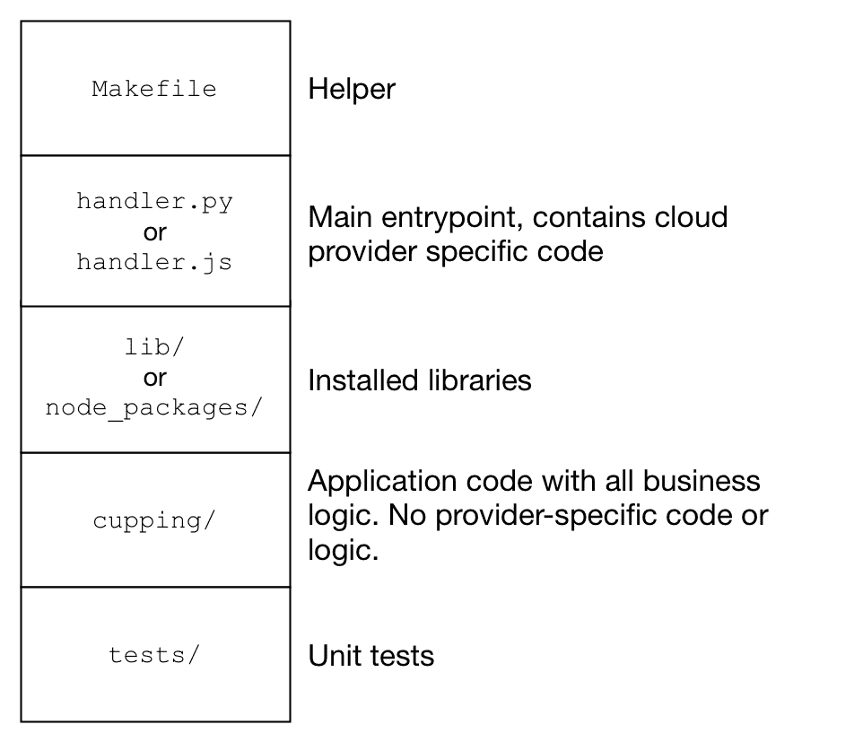

我们的示例应用程序是用 Python 编写的，但这个图展示了这种通用的代码组织如何适用于 Node、Python 或任何其他语言。除了语言无关性，这还应该是框架和云服务提供商无关的。这种布局的主要目标是使你的应用程序代码与任何供应商、框架或其他第三方系统隔离。

这段代码组织背后的主要思想如下：

+   由云服务提供商调用的主要处理程序或入口点包含任何云特定代码，并引导其余代码（例如，如果需要，管理路径）。

+   任何额外的库都与处理程序文件一起打包。

+   测试被隔离在 `tests` 目录中。只有与测试相关的代码放在这里，包括模拟或工厂。

+   所有应用程序逻辑都在一个单独的目录（在这个例子中是 `cupping`）中命名空间化。

在这种设置下，有几个优点，没有明显的缺点：

+   如果你决定更改云服务提供商，不需要更改任何应用程序代码。唯一需要更改的是 `handler` 文件。

+   测试完全与应用程序代码隔离，并且不会与应用程序代码一起部署。

+   这种结构非常简洁，易于其他开发者导航和理解。

+   如果需要任何路径操作来查找包（例如 Python 的情况），你只需要将一个目录添加到运行时路径中。

+   将任何测试运行器指向单个 `tests` 目录以运行单元测试是极其简单的。

使用 Node 编写无服务器函数的人不需要显式处理系统路径，这与 Python 所需的情况不同。Node.js 会自动解析 `node_modules`，正如你所期望的那样。因此，这些技巧仅适用于 Python 开发者或使用其他受支持语言的人，这些语言不通过惯例解析库。

# 设置单元测试

使用 `py.test`，一个名为 `conftest.py` 的单个文件控制测试设置和配置。如果你还记得我们之前在 `handler.py` 中设置运行时的讨论，我们有一些代码行将 `lib` 添加到我们的系统路径中，如下所示。下一个代码块直接来自我们的 `handler.py` 函数：

```java
from pathlib import Path

# Munge our sys path so libs can be found
CWD = Path(__file__).resolve().cwd() / 'lib'
sys.path.insert(0, str(CWD))
```

当我们使用 `py.test` 运行测试时，主要入口点将是我们的测试代码而不是 `handler.py`。因此，我们的代码的任何引导都需要在不同的位置进行，因为 `handler.py` 并非在每次测试之前都会被导入。在测试环境中，`conftest.py` 是新的入口点，其中将发生任何系统引导和配置。除了管理现在相对于 `tests/` 目录的相对系统路径外，我们的 `conftest.py` 文件还将负责设置之前由我们的无服务器框架堆栈管理的环境变量。以下来自 `conftest.py` 的代码显示了路径操作和环境变量设置，以便我们的测试可以在测试运行期间导入应用程序代码并成功执行：

```java
from pathlib import Path

CWD = Path(__file__).resolve().parent
code_dir = CWD / '../serverless'
lib_dir = CWD / '../serverless/lib'

sys.path.append(str(code_dir))
sys.path.append(str(lib_dir))

ENV = os.environ['ENV']
os.environ.update({
    'CUPPING_DB_PASSWORD': '',
    'CUPPING_DB_USERNAME': 'postgres',
    'CUPPING_DB_HOST': 'cupping-%s-postgres' % ENV,
})

if os.environ.get('CIRCLECI'):
    os.environ['CUPPING_DB_HOST'] = 'localhost'
```

我们的测试代码需要导入两种不同类型的代码：

+   我们的应用程序代码

+   第三方包

在这种情况下，我们需要向我们的系统路径中添加两个目录。我们添加到系统路径中的第一个路径（`code_dir`）对应于我们的应用程序代码的位置。我们添加到系统路径中的第二个路径（`lib_dir`）对应于第三方库的目录。在先前的代码块中，您可以查看如何手动处理路径操作。

接下来，我们需要管理环境变量。在这个项目中，要处理的环境变量并不多。上述所有环境变量都涉及我们的 PostgreSQL 数据库，它恰好作为一个链接的 Docker 容器运行。您会在最后的 `if` 语句中注意到有一个检查名为 `CIRCLECI` 的环境变量。如果存在，此设置代码将更改我们的 PostgreSQL 数据库的主机变量。我将在下一节中更详细地审查这一点。

# 使用 CircleCI 设置 CI

在托管 CI 系统方面，有一个相当广泛的领域。如果您再加上自托管系统，列表会更长。像 Jenkins 这样的工具已经存在很多年了，最初是作为自托管系统。不可避免地，来自不同公司的 Jenkins 等工具的托管版本已经出现。在本节中，我们将逐步介绍设置 CircleCI ([`circleci.com`](https://circleci.com)) 的步骤，以便在每次代码提交时运行我们的单元测试并生成代码覆盖率报告。

由于这是一本关于无服务器模式的书籍，我将鼓励您选择任何适合您目的的工具，并且强烈倾向于使用托管 CI/CD 系统。使用托管 CI/CD 系统意味着您可以更多地关注您的应用程序代码，而不是 CI/CD 系统，这只是我们完成工作所需的一个工具。

在 CircleCI 上设置一个全新的项目非常简单，并且与 GitHub 和 Bitbucket 都有易于集成的功能。设置新项目的第一步是使用其中之一的服务登录。从那里，你可以点击左侧导航菜单中的“项目”项，然后在屏幕右上角点击“添加项目”按钮。

以下截图显示了此导航；然而，我已经设置了此示例项目，这是它出现在列表中的原因：

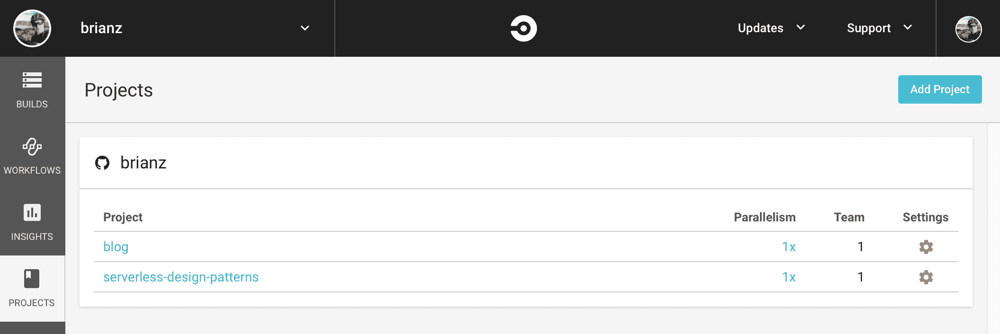

你可以看到，我还在 CircleCI 上设置了我的博客。CI 可以用于任何你希望在代码提交或分支合并时执行一些自动化步骤的仓库。在我的博客案例中，一旦检查入，一个脚本就会部署任何新的帖子或更改。

# 配置 CircleCI 构建

在 CircleCI 中，你可以配置大量选项和控制。我们只需要在 CircleCI 网页界面中控制几个设置。其他所有内容将通过 `config.yml` 配置文件进行控制，我们将将其添加到仓库中。

我们的第一步是创建一个 `.circleci/config.yml` 文件。`.circleci/` 目录位于我们仓库的根目录下。以下代码块展示了在仓库的 `ch2/` 目录中运行单元测试的配置，该目录包含我们的 REST API：

```java
version: 2 
jobs:

  build:
    docker:
      - image: verypossible/serverless:1.25.0-python3
      - image: postgres
    environment:
      - ENV: circleci
    steps:
      - checkout
      - restore_cache:
          key: dependency-cache-{{ checksum "ch2/requirements.txt" }}
      - run:
          name: Install python requirements
          working_directory: ch2 
          command: make libs
      - save_cache:
          key: dependency-cache-{{ checksum "ch2/requirements.txt" }}
          paths:
            - ch2/lib
      - run:
          name: py.test
          working_directory: ch2 
          command: make tests
      - store_artifacts:
          path: ch2/htmlcov/
          destination: coverage
```

由于我们的应用程序代码位于 `ch2/` 目录中，但命令总是从根目录开始，因此在这个设置中涉及一些额外的工作。在一个常规仓库中，代码不包含在子目录中，处理 `working_directory` 就是不必要的。

CircleCI 2.0 使用 Docker 容器进行构建。这意味着对我们来说，很容易引入应用程序代码运行测试可能需要的任何额外资源。在这种情况下，我们将引入官方的 `postgres` Docker 镜像。这个好处是，我使用 Docker 容器来构建库、运行测试和进行部署。由于所有这些功能都可以使用我构建的 `verypossible/serverless` 镜像实现，因此我们可以使用相同的镜像来运行这些测试和进行部署，就像我们在开发期间做的那样。在 `docker` 键下列出的第一个镜像将是主要的容器，代码将从中检出，任何命令都将在此容器中运行。

我在这里使用的 Docker 镜像和 Makefile 设置为使用名为 `ENV` 的变量。我将在配置文件中设置 `ENV` 变量。在环境部分开始之后，将按顺序运行一系列步骤，这些步骤构成了实际的测试运行。设置和运行测试的步骤包括：

1.  检出代码

1.  恢复缓存，以便仅在发生更改时下载支持包

1.  安装支持包，以防它们未被缓存

1.  保存缓存

1.  使用 `make tests` 命令运行单元测试

1.  存储测试覆盖率结果，以便在 CircleCI 上可查看

几个不同的命令处理保存和恢复缓存。这些缓存控制是 CircleCI 特有的，我鼓励您在 CircleCI 文档中详细了解。从高层次来看，这些步骤通过缓存之前运行中安装的任何库来节省一些 CPU 周期，而不是在每次测试运行时都进行包下载和安装。

有两个 `run` 指令，它们执行了大部分工作。`安装 Python 依赖项` 和 `py.test` 步骤都使用 `make` 目标来完成工作。我们已经设置了这些命令的实际逻辑，您可以通过检查 Makefile 来查看。这两个命令都不算特别复杂（安装包和运行测试）。由于我们已经完成了将细节封装在 Makefile 中的工作，我们可以利用这些和其他 make 快捷方式。

最后，在运行测试之后，我将设置 CircleCI 以将测试覆盖率输出文件上传到构建的工件中。构建工件是 CircleCI 特定的任务，尽管我知道其他 CI 系统也有类似的功能。在将 HTML 覆盖率输出作为 CircleCI 工件上传后，我们就能通过 CircleCI 网站查看结果。

以下截图显示了每个构建的工件选项卡中列出的所有 `coverage` 输出文件：

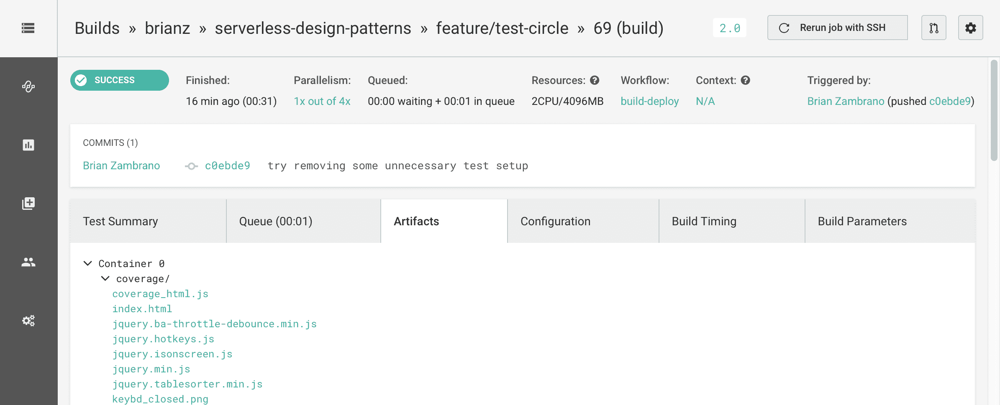

由于覆盖率报告是以 HTML 格式创建的，我可以点击 `index.html` 文件来查看完整的测试结果。以下截图显示了点击 `index.html` 后的测试覆盖率报告：

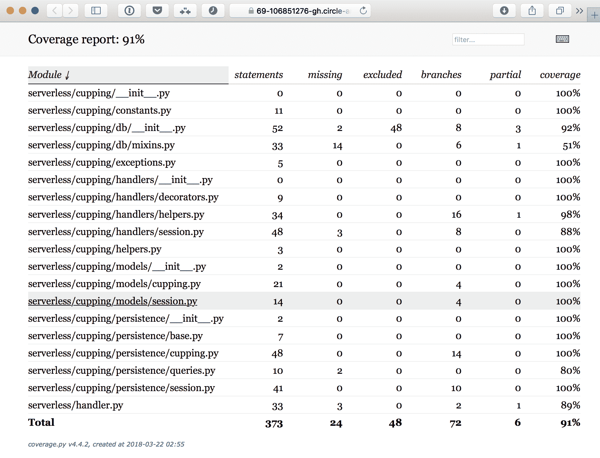

# 设置环境变量

在本章的早期部分，您可能会记得我们需要在我们的测试中处理一些环境变量。此外，我们的 `conftest.py` 文件中有一个小开关，根据特定环境变量的存在来设置 PostgreSQL 主机。CircleCI 很好地注入了几个环境变量，其中一个名为 `CIRCLECI`。使用这个变量，我们将在测试运行期间更新数据库主机，它恰好是 `localhost`。当我们使用我们管理的 Docker 容器本地测试我们的代码时，主机名将是链接的 PostgreSQL 容器的名称。

除了在 CircleCI 构建中运行时对特定环境变量进行不同的处理外，我们还需要管理任何敏感变量，以备部署之需。因为这些变量与我们的堆栈部署相关，我将在下一节关于持续部署的部分中介绍这一点。

# 使用 CircleCI 设置 CD 和部署

如我在本章引言部分所述，**CD**中的**D**代表**Delivery**。在本节中，我们将详细介绍通过 CircleCI 设置应用程序的交付和部署的细节。我必须承认，这里的交付和部署之间的界限有些模糊，并且由于术语和细节上的分歧，此类讨论可能会变得困难。就我们的目的而言，我们的 CD 管道将专注于以下方面：

+   可见性

+   反馈

+   自动部署的便捷性

为了可见性和反馈，我们将使用 Slack 和 GitHub 徽章。我们现有的从 Makefile 和 serverless 框架部署的脚本将被集成到 CircleCI 中，以使生产部署快速、简单且可靠。

# 设置 Slack 通知

CircleCI 与各种聊天系统有多个集成。设置测试结果发布到 Slack（或你选择的任何消息平台）是向团队成员传播测试结果的一种简单而有效的方法。

在 CircleCI 中，导航到“聊天通知”菜单项，点击 Slack 部分中的链接。从那里，你将完成 Slack 群组的设置过程。最终，你将获得一个 Slack webhook URL，你需要将其输入到 CircleCI 中。通知将被发送到这个 Slack webhook，它将发布到特定的频道。

以下截图显示了 CircleCI 中此存储库的项目设置以及配置聊天通知的页面：

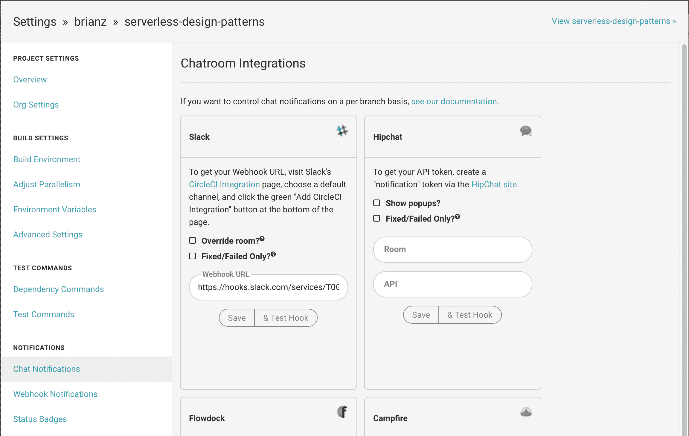

测试运行后，你会在 Slack 中看到结果。以下两个截图显示了 CircleCI 通过 Slack 发送的成功和失败消息：

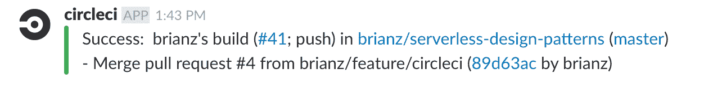

如果测试失败，消息将略有不同。以下是从我工作的另一个项目中测试失败时的消息：

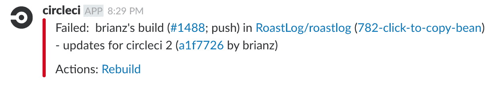

# 设置 CircleCI 徽章

当前测试结果也可以在 Markdown 文件中显示。这个徽章在 GitHub 或 Bitbucket 的`README`文件中特别有用。在 CircleCI 的“通知 | 状态徽章”部分，你可以找到一个 Markdown（或另一种格式）片段，你可以将其复制并放入你的`README.md`文件中。

将 CircleCI 生成的 Markdown 片段放入`README.md`文件后，GitHub 将显示最后一次构建的当前状态，如下截图所示：

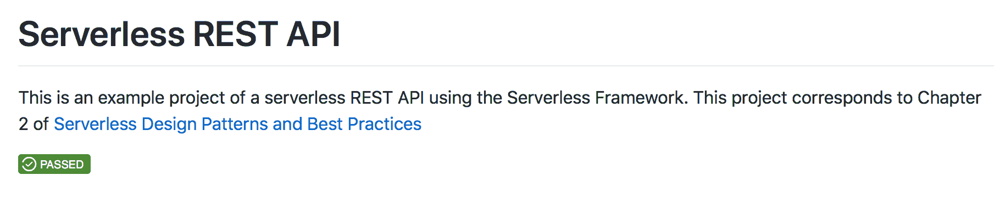

# 设置部署

现在，我们的测试正在自动运行，以及关于测试结果的通知被推送到 Slack。现在，我们可以着手让 CircleCI 自动将我们的代码部署到 AWS。我将逐步完成启用自动化部署的步骤。你可能不希望为你的每个项目都进行自动化部署。然而，你应该朝着能够执行持续部署的目标努力。即使你选择不发布像这样的生产代码，将持续部署作为最终目标意味着你将自动化大部分的构建管道。

# 设置 AWS 凭证

使用 AWS 凭证是一项如此常见的任务，以至于 CircleCI 在每个项目的配置中都有一个专门的区域。如果你导航到权限 | AWS 权限，你会找到两个字段用于你的 AWS 访问密钥 ID 和 AWS 秘密密钥。在这里设置这些确保你永远不需要将它们检查到源控制中，并且你使用的任何 AWS 库（如以下屏幕截图所示）将自动获取这些值作为环境变量。

在本节中设置这些凭证与无服务器框架的预期行为一致，允许任何`serverless`命令在附加的密钥具有正确的 IAM 权限的情况下成功执行：

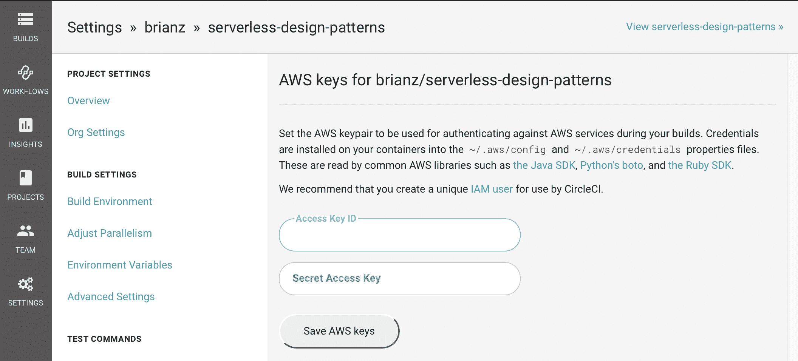

# 设置环境变量

一些非关键变量，例如测试数据库的主机和用户名，在代码或配置文件中处理起来很容易，这些文件被版本控制跟踪（如`.circleci/config.yml`）。然而，当我们转向部署时，不可避免地会有一些你希望保持秘密且永远不会提交到版本控制的变量。

在这种情况下，我们可以通过 CircleCI 的构建设置 | 环境变量部分添加变量。在下面的屏幕截图中，你可以看到我是如何设置 PostgreSQL RDS 实例的数据库密码的：

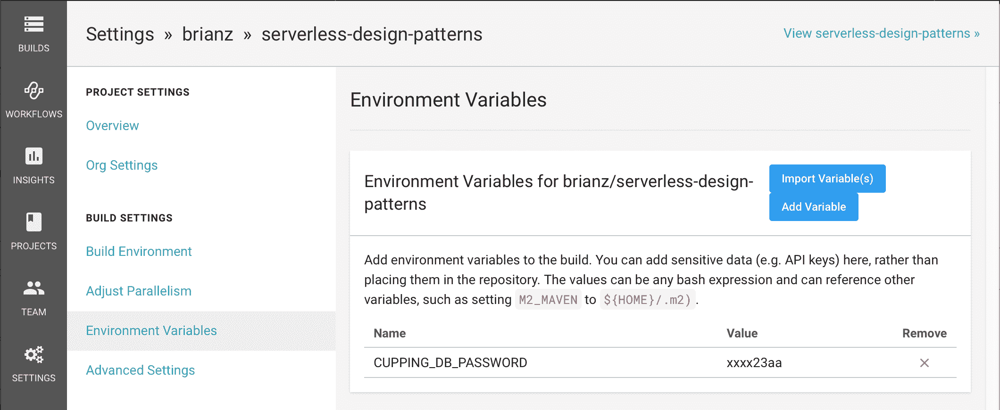

作为对这个整个系统如何工作的快速回顾，环境变量由无服务器框架拾取。在 RDS 的一些变量情况下，我们通过无服务器将值注入到我们的 Lambda 函数中，并在创建和设置 RDS 实例时使用这些变量。相关的`serverless.yml`片段如下：

```java
provider:
  environment:
    CUPPING_DB_USERNAME: ${env:CUPPING_DB_USERNAME}
    CUPPING_DB_PASSWORD: ${env:CUPPING_DB_PASSWORD}
    CUPPING_DB_NAME: ${env:CUPPING_DB_NAME}

resources:
  Resources:    
    RDSPostgresInstance:
      Type: AWS::RDS::DBInstance
      Properties:
        DBName: ${env:CUPPING_DB_NAME}
        MasterUsername: ${env:CUPPING_DB_USERNAME}
        MasterUserPassword: ${env:CUPPING_DB_PASSWORD} 
```

我们在 CircleCI 中为`CUPPING_DB_PASSWORD`设置的任何值，在执行 CircleCI 内的任何`serverless`命令时都将可用。

# 执行部署

在完成所有设置后，我们可以更新我们的 CircleCI 配置以代表我们部署代码。在 CI 任务期间，我们利用了各种`make`目标来执行我们已经在手动执行的工作。对于部署，我们将重用另一个已经设置好的预存在的`make`目标，即`make deploy`。

在`jobs`键下，我们将添加另一个名为`deploy`的步骤，它位于我们的构建步骤之后。这个新的部署作业具有与之前的构建步骤相同的配置选项。我们在这个部署步骤中的目标是实际上在我们的生产环境中执行部署。为了使其工作，我们需要设置不同的配置选项，其详细信息您可以在以下来自`.circleci/config.yml`的 YAML 片段中看到。

在 CircleCI 中，每个`jobs`键下的部分都是一个独立的工作体，您可以单独定义和配置它。这些步骤可以一起工作或并行工作，正如我们很快就会看到的。在这种情况下，我们已经有了一个`build/test`部分，我们现在正在添加一个`deploy`部分。这两个作业将一起工作，所以我们的代码只有在测试运行并通过后才会部署。

我们将使用相同的 Docker 镜像来执行我们的部署，您可以在图片部分看到它。为了我们的部署能够工作，一些环境变量需要存在，正如我在本章前面提到的。在这里，我们可以在我们的配置文件中设置这些变量。RDS 密码故意没有包含在这个列表中，因为它将由 CircleCI 在部署阶段注入，因为我们是在 CircleCI 网络应用程序中定义的。最后，部署我们的无服务器项目的步骤如下：

1.  检出代码

1.  从`ch2`目录运行`make libs`

1.  从`ch2`目录运行`make deploy`

以下代码块显示了`.circleci/config.yml`中的`deploy`步骤以及工作流程，它将测试和部署链接在一起：

```java
jobs:

  build:
    # build steps

  deploy:
    docker:
      - image: verypossible/serverless:1.25.0-python3
    environment:
      - ENV: production
      - AWS_REGION: us-west-2
      - VPC_ID: vpc-abc12345
      - SUBNET_ID_A: subnet-11111111
      - SUBNET_ID_B: subnet-22222222
      - SUBNET_ID_C: subnet-33333333
      - CUPPING_DB_USERNAME: root
      - CUPPING_DB_NAME: cupping_log
    steps:
      - checkout
      - run:
          name: Build libs
          working_directory: ch2 
          command: make libs
      - run:
          name: Production deploy if tests pass and branch is production
          working_directory: ch2 
          command: make deploy

workflows:
  version: 2
  build-deploy:
    jobs:
      - build
      - deploy:
          requires:
            - build
          filters:
            branches:
              only: production 
```

这些作业键可以命名为您喜欢的任何名称，只要对您有意义。我碰巧将它们命名为`build`和`deploy`。然而，我也可以将它们命名为`test`和`deploy`，或者`build-test`和`rollout`。

在定义了部署步骤后，我们可以通过 CircleCI 的工作流程功能在特定条件下执行我们的部署。这个功能的全部能力非常广泛，但在这个案例中，我们的目标很简单；我们只想在`production`分支上并且测试通过时进行部署。您可以在之前配置中的`workflows`部分看到所有这些逻辑。

要看到这个动作的实际效果，我执行了以下步骤：

1.  将一些更改提交到`feature/circleci`分支

1.  在`production`分支上创建了一个 GitHub 拉取请求

1.  合并了拉取请求

非常常见，这样的部署流程将基于`master`分支。在这里，我选择使用名为`production`的分支。这种命名约定上的变化是因为这本书的存储库可能有几个章节的提交，我不想每个提交到`master`的提交都触发 CircleCI 的`build-deploy`工作流程。

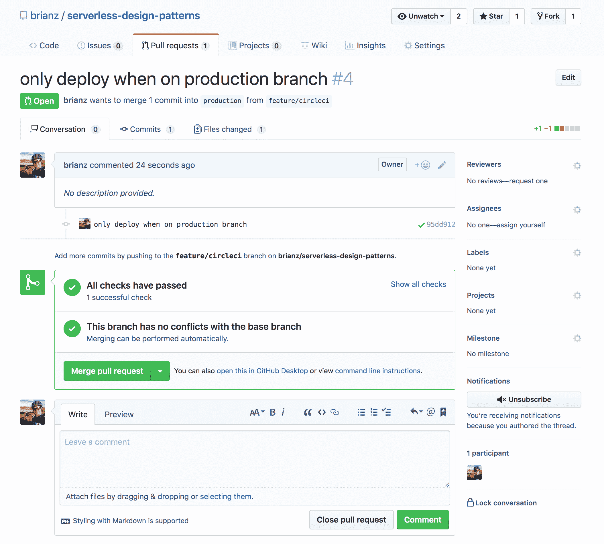

上一张截图显示了拉取请求的详细信息。在设置了 CircleCI 之后，任何拉取请求都会显示测试运行的详细信息。在这里，我们可以看到我们的测试已经成功运行。我还收到了关于测试成功的 Slack 通知。

一旦我点击合并拉取请求，另一个 CircleCI 构建就会开始。在下面的截图里，你可以看到，由于`production`分支已被更新，我们的`build-deploy`工作流程正在运行：

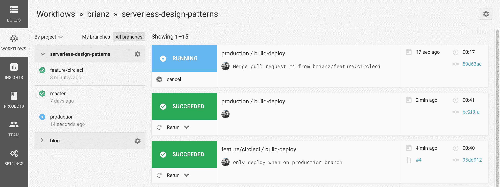

在构建作业运行并通过测试后，部署步骤将开始。我们可以在 CircleCI 的工作流程可视化中看到这一点，如下面的截图所示：

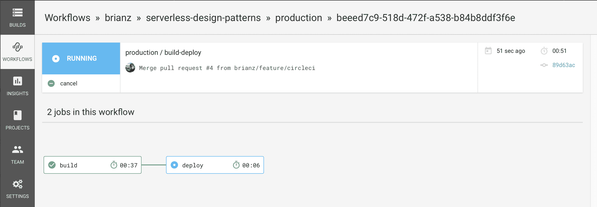

通过点击部署框，我们可以查看或看到部署阶段的详细信息：

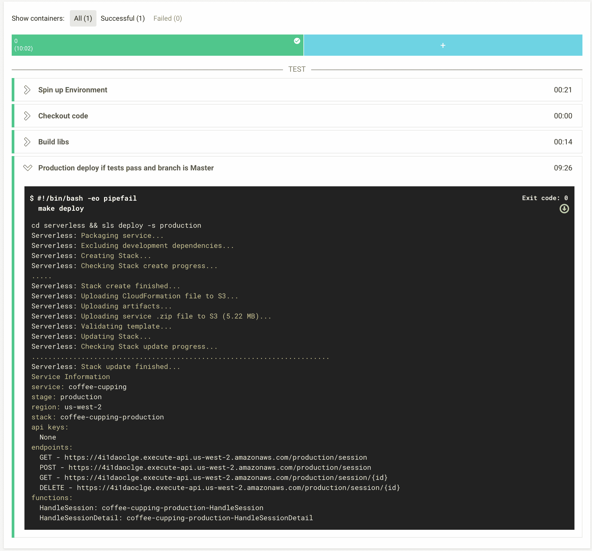

成功！由于我们的`make deploy`命令可以用于创建全新的栈或更新现有的栈，因此从现在开始我们不需要做更多的事情。对我们`production`分支的任何合并或提交都将触发此流程，我们现在已经实现了持续部署。

# 摘要

在本章中，我们回顾了 CI 和 CD 的意义和高级细节。我还讨论了一些最佳实践，关于如何在无服务器项目中组织应用程序代码，以帮助设置和运行单元测试。从那里，我介绍了如何使用 CircleCI 来设置单元测试，使其在每次提交时运行。

最后，我们完成了设置 CircleCI 以执行由`production`分支更改触发的自动化部署的整个流程。你了解了一些通过环境变量控制 CI 执行的细微差别，以及在哪里配置敏感设置，例如数据库密码和 AWS 密钥。
