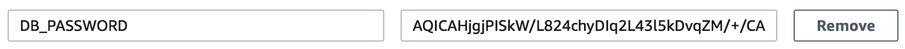

# 错误处理和最佳实践

无服务器架构的不同之处足够大，以至于需要仔细思考和评估技术及最佳实践才能成功。许多传统的调试、应用程序开发、监控等方法在基于服务器的架构中仍然适用。然而，许多你可能依赖的经过验证的技术，在处理虚拟机或真实硬件时可能并不一定适用于无服务器系统。因此，在基于 FaaS 平台构建时，你需要记住这些差异，并制定监控、调试、测试和开发无服务器应用程序的计划。

在本章中，我们将回顾一些常见的最佳实践，这些实践将帮助你专注于构建应用程序，而不是陷入组织或部署的细节。我们还将介绍可用于保持你的无服务器应用程序安全、易于本地开发以及可观察的工具和方法。我们还将讨论你需要做出的更改，以可靠地跟踪错误和监控无服务器应用程序。 

值得注意的是，可以专门写一本书来介绍无服务器应用程序的最佳实践。本章并非详尽无遗，但它将涵盖许多肯定有助于提高你的无服务器开发体验和应用程序整体质量的主题。

到本章结束时，你可以期待理解以下主题：

+   如何设置你的应用程序以使用 Sentry 和 Rollbar 跟踪意外错误

+   处理冷启动

+   监控和警报错误、异常或性能下降

+   本地开发和测试

+   如何通过环境变量在不同堆栈（开发与生产）之间管理配置

+   如何加密敏感的环境变量以保护你的应用程序安全

# 错误跟踪

从实际的角度来看，所有的软件系统最终都会崩溃。我之所以非常喜欢与无服务器系统一起工作，其中一个原因就是它们本质上使得应用程序相对较小，更接近于微服务，而不是一个庞大的单体应用程序。这个事实本身就可以极大地减少应用程序可能失败的方式。然而，在某个时刻，它终究会失败，并且会出现你未曾预料到的异常。那么，在无服务器系统中处理意外异常的最佳方法是什么呢？

好消息是，我们有多种选择，而且你可能已经熟悉的某些系统可以以与无服务器系统相同的方式工作。在接下来的章节中，我们将介绍集成两个流行的错误跟踪服务 Sentry 和 Rollbar 的步骤。这两个服务提供类似的功能，并且同样易于设置。在下面的示例中，我们将使用 Python，但 Sentry 和 Rollbar 支持包括 Node.js、Java、Golang 和 C#在内的多种语言。

# 集成 Sentry 进行错误跟踪

我已经使用了 Sentry 多年，并强烈推荐它。它具有庞大的功能集，许多知名公司都在使用这项服务。Sentry 的免费计划每月提供 10,000 个事件，一个登录账号，以及快速查看七天的历史记录。无论是用于爱好项目还是中等规模的生产系统，这个免费计划都非常适用。

要将 Sentry 集成到您的无服务器函数中，您当然需要一个 Sentry 账户。以下是一个基本的 AWS Lambda 函数的代码块。它所做的只是计算两个数字的商。我们的目标是确保任何未处理的异常都被捕获并报告到某个地方，这样我们就可以了解我们的应用程序正在做什么，并尽可能多地获取调试所需的信息：

```java
def divide(event, context):
    params = event.get('queryStringParameters') or {}
    numerator = int(params.get('numerator', 10))
    denominator = int(params.get('denominator', 2)) 
    body = { 
        "message": "Results of %s / %s = %s" % ( 
            numerator, 
            denominator,
            numerator // denominator,
        ) 
    } 

    response = { 
        "statusCode": 200,
        "body": json.dumps(body)
    } 

    return response
```

我们已经使用 API Gateway 设置了它，因此我们可以使用 `curl` 执行它，并获取两个数字的结果，如下面的片段所示：

```java
$ curl "https://5gj9zthyv1.execute-api.us-west-2.amazonaws.com/dev?numerator=12&denominator=3"
{"message": "Results of 12 / 3 = 4"}
```

让我们看看当我们除以 `0` 时会发生什么，我们知道这在数学中是未定义的：

```java
$ curl "https://5gj9zthyv1.execute-api.us-west-2.amazonaws.com/dev?numerator=10&denominator=0"
{"message": "Internal server error"}
```

作为一名应用程序开发者，我无法知道这个错误是否发生，因为没有设置监控。我唯一知道错误发生的方法是登录 AWS 控制台并查看 Lambda 函数的执行指标，或者我偶然在阅读 CloudWatch 日志。当然，你不能日夜手动监视错误。以下截图显示了 AWS Lambda 监控页面中 `divide` 函数的调用错误：


来自 Lambda 屏幕的 AWS CloudWatch 图表，显示了错误数量的计数

CloudWatch 将捕获 Lambda 函数的 `stdout` 和 `stderr`。因为未处理的异常被写入 `stderr`，所以当我们查看 CloudWatch 日志时可以看到详细信息，如下面的截图所示：


AWS CloudWatch 日志，显示了由于除以零而引发的未处理异常

集成 Sentry 将捕获意外错误，存储它们，并通过各种交付机制通知我们。为我们的 Lambda 函数获取 Sentry 报告相当简单。对于 Python，您可以使用 `raven-python-lambda` ([`github.com/Netflix-Skunkworks/raven-python-lambda`](https://github.com/Netflix-Skunkworks/raven-python-lambda)) 库，并在处理函数周围添加装饰器，如下面的片段所示：

```java
from raven_python_lambda import RavenLambdaWrapper

@RavenLambdaWrapper()
def divide(event, context):
    # Code
```

在这里我们需要处理的唯一其他配置是设置 Sentry DSN，它告诉库在发生错误时将有效载荷发送到哪里。这样做只是将主机系统的环境变量值传递到 Lambda 函数的环境变量中。使用 Serverless Framework，这相当简单，如下所示：

```java
provider:
  name: aws
  runtime: python3.6
  region: ${env:AWS_REGION}
  state: ${env:$ENV}
  environment:
    SENTRY_ENVIRONMENT: ${env:ENV}
    SENTRY_DSN: ${env:SENTRY_DSN}
```

现在 Sentry 会捕获任何未处理的异常，并且至少会将它们通过电子邮件发送给我们。在以下截图中，你可以看到各种异常的列表。很酷的是，其中一些错误甚至不是故意的。正如你在最后一行看到的，我拼写了一个变量名，这导致我的除法计算抛出了错误：


点击任何这些错误都会给我们更多关于异常触发时应用程序状态的上下文，如下面的截图所示：


`raven-python-lambda` 库的另一个出色功能是，当你的函数接近其超时值或最大分配内存时，它会发出警告。为了测试这一点，我们需要将 `divide` 函数的超时设置为 4 秒，并在应用程序代码的中间放置 `time.sleep(3)`。执行除法 Lambda 函数后，你应该得到预期的结果。你还会收到关于慢速执行速度的电子邮件，并在 Sentry 网站上看到相同的警告，如下面的截图所示：


在 Sentry 网站上，每个异常都包含大量信息，有助于你在调试时使用。此外，Sentry 还有很多我们在这里没有空间详细说明的功能；然而，以下是一些值得注意的功能：

+   聊天集成（Slack、IRC 等）

+   跟踪部署

+   问题汇总和状态跟踪

# 集成 Rollbar

Rollbar 与 Sentry 扮演相同的角色。集成同样简单。我们仍然会为我们的处理函数使用装饰器，但我们需要一个不同的库来与 Rollbar 一起使用。Rollbar 为 Python 提供了官方库 ([`github.com/rollbar/pyrollbar`](https://github.com/rollbar/pyrollbar)) 以及许多其他语言。

使用 `pyrollbar` 进行设置时，变化略有不同，但并不复杂。以下代码块展示了如何为错误跟踪设置 AWS Lambda 函数：

```java
import rollbar

token = os.getenv('ROLLBAR_KEY', 'missing_api_key')
rollbar.init(token, os.getenv('ENV', 'dev'))

@rollbar.lambda_function
def divide(event, context):
    # code
```

当我们遇到异常时，信息会被发送到 Rollbar。再次强调，应该会收到关于 `ZeroDivisionError` 的电子邮件通知。就像 Sentry 一样，Rollbar 也有很多集成。

以下截图显示了在 Rollbar 网站上显示的错误详情：


# 记录日志

跟踪应用程序中的异常和问题至关重要；然而，不可避免地会有一些情况，你希望当问题发生时能更深入地了解应用程序的状态。为此任务，你需要为自己制定一个良好的日志记录策略。日志消息是我们使用很长时间的工具——并且仍然经常使用。非常经常，日志消息会被发送到磁盘上的文件，然后被发送到日志聚合器。由于在无服务器架构中我们没有访问这些相同类型的日志系统，我们需要想出一些新的方法。

AWS Lambda 函数和其他 FaaS 提供商提供了一些跟踪`stdout`和`stderr`流的方法。在 Lambda 的情况下，任何`print`语句或其他错误消息最终都会出现在 CloudWatch 日志中。这种向 CloudWatch 的交付是自动发生的，并且特别有用，因为你可以始终知道去哪里检查错误或调试语句。虽然这是一个有用的功能，但我们可以对日志语句进行一些改进，以便它们更容易搜索、查找和分类。

# 结构化日志消息

日志消息通常通过`console.log`或`print`语句作为纯字符串使用。这些在开发期间快速且简单的添加可能很有帮助，但在生产级系统中是不够的。而不是记录平面字符串，日志语句需要被结构化，这样你就可以轻松地找到你想要的信息块。JSON 是一个很好的格式选择，因为它在许多不同的日志聚合器服务中广泛使用，并且在任何实际语言中实现起来都很简单。

让我们以我们之前的除法函数为例。在某个时候，我们可能想了解人们是如何使用我们的服务的：具体来说，他们发送给我们的分子和分母是什么。为此，我们需要构建一些日志消息，以便我们可以快速搜索它们，提取相关信息，并最终进行分析。以下代码块展示了启动`structlog`库的一些 Python 代码。这个库将负责记录结构化消息，而不是我们从标准库的`logging`模块通常得到的那种平面消息：

```java
import structlog
structlog.configure(
        processors=[structlog.processors.JSONRenderer()]
)
log = structlog.get_logger()
```

在我们的除法函数中，我们现在可以记录任何我们感兴趣的数据，如下所示，以键值对的形式：

```java
def divide(event, context):
    params = event.get('queryStringParameters') or {}
    log.msg('start', **params)

    numerator = int(params.get('numerator', 10))
    denominator = int(params.get('denominator', 2))

    # do division

    log.msg('finish',
            numerator=numerator,
            denominator=denominator,
            quotient=numerator // denominator)
```

日志消息现在将以 JSON 格式作为对象而不是 Python 字符串的形式到达 CloudWatch，如下面的截图所示：


这仅仅为我们成功奠定了基础；接下来，我们将努力将这些结构化日志消息发送到日志聚合器，以便更好地发现、分析和与其他服务的集成。

# 结构化日志解析

今天，有大量的专用日志服务，例如：

+   Loggly

+   Sumo Logic

+   Splunk

+   Papertrail

+   主机 ELK

列表可以一直继续下去。许多这些托管服务在发送 JSON 消息时可能更容易访问，也可能更强大。我在不同的应用程序中使用过 Loggly，并知道这是事实。

将日志发送到 Loggly 的方法有很多，可能还有其他服务也是如此。然而，当目标不是你的 FaaS 提供商时，发送日志可能会发生变化。CloudWatch 日志是 AWS Lambda 内置的，提供免费性能，那么我们如何将这些相同的日志输出到外部服务呢？

使用 AWS CloudWatch，当新的日志消息到达时可以触发另一个 Lambda 函数。这听起来可能有点奇怪，但这是一个很好的技巧，可以在保持你的应用程序精简并解耦任何日志服务的同时，解决将日志消息发送到更强大的服务的问题。我们在这里不会详细介绍如何设置，但 Loggly 网站上有详细的文档：[`www.loggly.com/docs/cloudwatch-logs/`](https://www.loggly.com/docs/cloudwatch-logs/)。

这种模式在 Loggly 中并不独特。如果你使用的是其他日志服务，并希望遵循相同的模式，那么这仅仅是一个实现 Lambda 函数的问题，该函数随后由 CloudWatch 事件触发，并将数据发送到你选择的日志提供商。

一旦你的日志提供商收到了 JSON 消息，你就有更多关于数据分析和服务发现的选择。在出现问题时能够快速轻松地找到信息对于任何生产级系统来说都是至关重要的，无论是无服务器还是有服务器。无论你使用的是哪种 FaaS 或日志服务，只要确保在需要的时候可以轻松找到所需的数据即可。

# 冷启动

大多数（如果不是所有）FaaS 提供商都存在冷启动问题。冷启动是指一段时间内未执行过的云函数在满足请求之前需要花费相当长的时间来初始化的行为。例如，如果你使用过 Docker，你会知道从现有镜像创建一个新的容器比启动之前运行过的容器要稍微长一些。这种 Docker 容器行为与云函数的行为类似，无论是 AWS Lambda、Google Cloud Functions 还是 Azure Cloud Functions。如果你在网上搜索关于无服务器冷启动的内容，你会找到关于这个问题的几篇博客文章和文档。

没有一种万能的解决方案可以绕过冷启动问题。然而，有一些需要注意的事项，以便你可以最小化它们对应用程序的影响。

# 保持云函数活跃

你可以采用一些技巧和窍门来绕过冷启动。最常见的建议是在定时器上实现另一个函数，比如每 5 分钟一次，然后调用你的目标函数。使用这种模式，目标函数始终处于预热状态，这意味着它可以更快地满足合法请求。这可能是一个有用的技巧；然而，它并不总是能解决问题。

记住，云函数会自动扩展。回想一下这本书中的一些模式，特别是扇出（Fanout）和映射归约（MapReduce）模式。在这些例子中，我们的函数的多个实例是并发执行的。在我们的图像缩放扇出模式中，对初始 Lambda 函数的单次调用会导致三个并发图像缩放函数。如果我们有一个 `ping` 函数来保持缩放函数活跃，那么我们就会有一个单独的函数预热并准备好处理该缩放任务。然而，当有三个同时调用发生时，单个 `ping` 函数将无济于事。在这种情况下，单个缩放函数会预热，但其他两个将承担冷启动成本。如果我们改变我们的应用程序，将图像缩放到五种不同的大小，那么我们就会有四个不同的函数，它们将从 *冷启动* 状态开始。

# AWS Lambda 函数和 VPC

如果你使用 AWS，请注意，在 VPC 内运行 Lambda 函数时，冷启动会变得更糟。原因在于 VPC 中的 Lambda 函数被分配了一个 **弹性网络接口**（**ENI**）来访问 VPC 资源，如数据库。如果你运行了示例代码 第二章，*使用 REST 的三层 Web 应用程序* 和 第三章，*带有 GraphQL 的三层 Web 应用程序模式*，你可能已经注意到第一次 API 调用花费了几秒钟。这种初始延迟主要是由于 Lambda 函数需要访问 VPC 内的 RDS 实例，这意味着 Lambda 函数本身也需要位于同一个 VPC 内。

如果可能的话，尽量避免将 Lambda 函数放在 VPC 内。如果你的函数不依赖于任何外部资源，或者非 VPC 资源，如 DynamoDB，不要将它们放在 VPC 内。然而，如果你确实需要访问 VPC 资源，可用的选项并不多。如果你运行的是一个与 VPC 资源（如 RDS 实例）通信的 API，你可以运行一个 `pinger` 函数，但我们建议将并发性从 1 提高到 10 左右。在这种情况下，你将至少有 10 个始终处于预热状态并准备好服务的函数。

# 不同语言的启动时间

每种受支持的语言在云函数中都有其独特的行为。我们在本书中并没有彻底分析所有不同的 FaaS 平台和语言，但我们确实知道，据报道，与 AWS 上的 Java 和 C# 相比，Node.js 和 Python 的冷启动时间较低。然而，也有说法称基于 .NET Core 2.0 的 C# 函数速度显著更快。AWS 最近推出了对 Golang 的支持；然而，我们目前对其相对冷启动性能尚不清楚。

我可能有点偏见，但我确实认为使用冷启动时间较短的编程语言是一个更好的选择，至少在 AWS 上是这样，因为您可以在 Node.js 和 Python 之间完成几乎所有您需要的事情。阅读一些人们所做的测试，Java 或 C# 与其他语言之间的差异是两个到三个数量级；换句话说，冷启动时间在 Java 和 C# 中为 1,000-4,000 毫秒，而 Node.js 和 Python 的得分在 1-10 毫秒之间。

# 分配更多内存

至少在 AWS Lambda 的情况下，为您的函数分配更多内存可以缩短启动时间。正如运行更大的 EC2 实例可以为您提供更多的 CPU 功率一样，为您的 Lambda 函数分配更多内存也是如此。为您的函数分配更多内存可能会提高性能，但请注意，这将影响您的账单，因为 Lambda 函数的计费是根据执行时间和分配的内存组合来计算的。

您可以在以下文档中了解与 AWS Lambda 相关的 CPU 分配：[`docs.aws.amazon.com/lambda/latest/dg/resource-model.html`](https://docs.aws.amazon.com/lambda/latest/dg/resource-model.html)。

# 本地开发和测试

作为无服务器工程师，我们面临的一个挑战是便利性。更具体地说，编写代码、部署和开始测试的过程非常快。测试实时系统通常会引发一些代码或配置问题，但这些问题很快就能得到修复并重新部署。因此，我们面临的问题是，由于问题修复和重新部署变得如此容易，我们可能会养成跳过测试或不在本地运行我们的堆栈的习惯。

# 本地开发

我经常回答的一个问题是，*我如何在本地运行这个程序？* 当编写基于服务器的应用程序时，首先要执行的任务之一是设置系统，以便在开发期间运行。然而，在构建基于无服务器的应用程序时，实际上并没有服务器可以运行。那么，我们如何开发我们的应用程序呢？

真实的答案是，这是一个挑战，而且这个挑战尚未得到完美解决；公平地说，任何基于微服务系统的这个问题都很难解决。那么，我们如何运行一个系统并确保它由多个不同的部分组成时能够完全功能正常？我的信念是，我们需要依靠基于组件架构的原则和优势，并使用使本地开发和测试更容易的通用工具。当你编写无服务器应用程序时，最好专注于服务本身，并通过单元测试确保它按预期工作。不要期望在你的本地机器上运行完整的无服务器 map-reduce 系统。

在无服务器 Web API 的情况下，我在开发过程中更依赖单元测试而不是本地服务器。毕竟，我们长期以来一直被教导单元测试是比手动测试 API 或 UI 更好的开发方法。无论你对这个话题的看法如何，当编写单元测试时，无服务器系统的本地开发可以相当快速地进行，并且在这些系统中进行测试相对简单，我们将在下一节中介绍。

你可以在这里阅读 Serverless Framework 社区插件的存储库：[`github.com/serverless/plugins`](https://github.com/serverless/plugins)。

如前所述，运行无服务器应用程序本地确实有选择；然而，我本人并未使用过这些工具，无法评论使用它们的便捷性或难度。然而，对于 Serverless Framework 来说，有一些插件名称中包含“离线”一词，它们的共性是都旨在帮助你本地运行应用程序。在这些插件之外，DynamoDB 长期以来一直提供可以在本地系统上运行的离线版本。

无服务器系统仍然相对较新，该领域正在成熟和快速变化。几乎可以肯定，供应商认识到无服务器应用程序的软件开发生命周期中存在改进的领域；如果未来几年本地开发和测试变得更加舒适，我也不会感到惊讶。

# 在本地了解测试

关于本地开发，我认为最好的策略是建立健壮和全面的单元测试。对无服务器应用程序进行单元测试与传统基于服务器的应用程序测试并无不同。只要遵循将你的无服务器代码与业务逻辑分离的箴言，实现非常高的测试覆盖率就相当简单。

但当我们的应用程序依赖于数据库、缓存等后端服务时，我们该怎么办？此外，当我们的无服务器应用程序调用本地不存在的服务时，例如 AWS、SNS 等，我们该怎么办？

我对 Postgres 或 Redis 等常见系统的方法是使用 Docker。如果你回顾一下第二章、“使用 REST 的三层 Web 应用程序”和第三章、“带有 GraphQL 的三层 Web 应用程序模式”中的单元测试，你会看到它们依赖于 PostgreSQL 数据库。在开发该应用程序时，我们运行了一个单元测试使用的 Docker 镜像。

处理那些难以在本地运行的服务或专注于无服务器特定逻辑的代码的方法之一是明智地使用模拟。以我们的消息模式为例，其中我们的处理函数向 SQS 发送消息。为了测试这段代码，我们不想调用 SQS，因为这会使我们的测试变慢，并且它们很可能会变得脆弱。在这种情况下，更好的做法是模拟对 SQS 的 API 调用，并简单地测试是否调用了 SQS 发布函数。

同样，当我们想要测试针对我们无服务器实现特定的代码时，模拟会很有用。这最好用一个例子来说明；下面的代码块展示了我们的 REST API 中的一个单个函数，位于顶层的`handler.py`函数：

```java
def session_detail(event, context):
    http_method = event['httpMethod']

    status_code = 200
    response = {}

    try:
        response = handle_session_detail(http_method, event)
    except Http404 as e:
        status_code = 404
        response = {'errors': [str(e)]}
    except Exception as e:
        status_code = 500
        response = {'errors': ['Unexpected server error']}

    response = {
        'statusCode': status_code,
        'body': json.dumps(response),
        'headers': CORS_HEADERS,
    }

    return response 
```

如您所见，这段代码比委托做得更多。在这里，`session_detail`函数正在捕获各种错误，并根据这些异常设置 HTTP 响应代码和消息，如果有任何异常被抛出。测试`handle_session_detail`函数很简单，因为它只在我们自己的应用程序上工作，不包含对 AWS Lambda 的依赖或知识。然而，我们确实需要测试`session_detail`中的错误处理。

为了做到这一点，我们使用模拟对象来修补`handle_session_detail`方法。以下代码块的目标是触发一个`Http404`异常，以便我们可以验证静态代码和错误消息是否正确。以下代码块展示了这个单元测试，其中`mocker`是一个来自`pytest-mock`库的固定装置：

```java
def test_session_detail_hanlder_404(mocker):
    mock_handler = mocker.patch('handler.handle_session_detail')
    mock_handler.side_effect = Http404('Test 404 error')

    event = {'httpMethod': 'POST'}
    response = handler.session_detail(event, None)
    assert_404(response)
    body = get_body_from_response(response)
    assert body == {'errors': ['Test 404 error']}
    mock_handler.assert_called_once_with('POST', event)
```

测试既是艺术也是科学，因此我无法过分强调在无服务器应用程序中测试的重要性。通常，你的测试做得越好，在重构代码或部署更改时你就越有信心。

# 管理不同的环境

对于大多数生产级应用程序，团队会维护多个环境以供不同目的使用。可能存在一个`QA`环境，供 QA 团队运行自动化测试；可能存在一个`staging`环境，供 DevOps 团队测试其基础设施更改；而`production`环境则用于服务实时流量。非常常见的是，构建和维护这些不同的环境可能是一项全职工作。

对于无服务器系统，我发现维护不同的环境可以更加直接。这也许部分来自于无服务器应用本质上更小的这一事实。在无服务器架构中编写单体应用并不明智——甚至不自然。那么，我们如何最好地管理和维护无服务器系统的不同环境呢？

对于这一点，转向 12-Factor App Methodology 的第三条原则有所帮助。这个原则可以在[`12factor.net/config`](https://12factor.net/config)找到，并声明：

将配置存储在环境中

一个应用的配置是所有可能在部署之间（预发布、生产、开发者环境等）发生变化的内容。

在这本书的整个过程中，我使用了 Serverless Framework 来管理和部署我的系统。这个框架内置了对环境变量的支持，我们可以利用它来高效地管理不同的系统，而无需对代码进行任何更改。以下代码块展示了来自第二章，一个使用 REST 的三层 Web 应用*用于咖啡品尝 REST API*的`serverless.yml`文件的一个小片段： 

```java
provider:
  name: aws 
  runtime: python3.6
  memorySize: 128 
  region: ${env:AWS_REGION}
  environment:
    CUPPING_DB_USERNAME: ${env:CUPPING_DB_USERNAME}
    CUPPING_DB_PASSWORD: ${env:CUPPING_DB_PASSWORD}
    CUPPING_DB_NAME: ${env:CUPPING_DB_NAME}
```

在这里，任何对`${env:NAME}`的引用都将从环境中拉取`NAME`的实际值。此外，Serverless Framework 通过使用`stage`变量来命名资源，帮助我们保持栈的分离。在部署代码时，部署步骤包括阶段变量，我们也会从环境中提取出来：

```java
sls deploy -s $ENV
```

这两种技术的结合意味着部署一个`dev`栈或`qa`栈仅仅是一个加载不同环境变量的过程。你可以使用像`dotenv`这样的工具、你的 shell 脚本或其它工具从文件中加载环境变量。我的技术使用 Docker 和 Makefile 根据我想要工作的`ENV`加载不同的变量。无论你如何解决变量管理的问题，结果都是一样的。如果你使用 Serverless Framework，你还需要处理`ENV`设置。这个变量是一个单独的设置，它将控制任何部署期间更新的栈。

# 保护敏感配置

在这本书的整个过程中，以及在前一节关于管理环境的内容中，我们严重依赖环境变量。从环境中拉取配置的一个非常好的特性是，敏感信息永远不需要被检查到源控制中。我们所有的应用程序代码以及任何框架代码（如 Serverless Framework）在需要时都可以从环境中查找变量值。

通过环境变量进行配置是很好，但我们对这些变量的使用并不完美。我们使用环境变量和 Lambda 的问题在于，从部署环境中提取的数据被上传并存储在 AWS Lambda 函数中，以明文形式。例如，看看上一节关于使用 Sentry 或 Rollbar 处理错误的`serverless.yml`：

```java
provider:
  name: aws 
  runtime: python3.6
  region: ${env:AWS_REGION}
  state: ${env:$ENV}
  environment:
    SENTRY_ENVIRONMENT: ${env:ENV}
    SENTRY_DSN: ${env:SENTRY_DSN}
    ROLLBAR_KEY: ${env:ROLLBAR_KEY}
```

环境键下的所有密钥都是在 AWS Lambda 函数上设置的。虽然我们从未将这些变量的值检查到源代码控制中，但它们在 AWS 内部持续存在。在这种情况下，我们的`SENTRY_DSN`和`ROLLBAR`值不应该与任何人共享。然而，如果你在一个团队环境中工作，任何可以访问 AWS Lambda 控制台的人都可以非常容易地查看你的 Lambda 函数并看到这些变量的值。


# 变量加密

为了解决这个问题，我们可以利用另一个 AWS 服务，称为密钥管理服务（KMS）。KMS 通过将数据加密成一个只能使用 KMS 本身解密的字符串来工作。使用 KMS 的好处是，你可以存储、共享，甚至将加密变量检查到源代码控制中，因为除非他们有权访问 KMS，否则没有人可以解密它们。因此，你的一个攻击向量变成了 AWS 和 KMS 本身。如果任何人有权使用你的 KMS 密钥或可以访问一个受权的 AWS 账户，他们就可以解密任何 KMS 管理的变量。

Azure 有一个类似的服务称为密钥保管库（Key Vault），如果你在 Azure 上构建，你应该考虑一下。我不知道 Google Compute 或其他 FaaS 提供商中是否有类似的服务。

使用 KMS 加密数据相当简单。首先，你需要创建一个 KMS 密钥。一旦生成了密钥，你需要复制你新创建的密钥的 AWS `arn`。从那里，你可以使用各种 API 来加密一个明文字符串。使用之前的示例，我将加密我的`DB_PASSWORD`变量`supersecret`。下面的代码块展示了如何使用 Python 和`boto3`库来加密密码：

```java
import boto3
import base64

key_id = "arn:aws:kms:us-west-2:9802947738:key/fc5753bd-2842-4ff8-b9a7-61299f4a88c2"
client = boto3.client('kms')

def encrypt():
    stuff = client.encrypt(KeyId=key_id, Plaintext='supersecret')
    binary_encrypted = stuff[u'CiphertextBlob']
    encrypted_password = base64.b64encode(binary_encrypted)
    print("Encrypted password:\n", encrypted_password.decode())
```

此代码的输出是一个加密的字符串，你可以在你的整个基础设施中共享：

```java
Encrypted password:
AQICAHjgjPISkW/L824chyDIq2L43l5kDvqZM/+/CA8zfz94vQGfycexNX4Jq6mbciymbUh7AAAAaTBnBgkqhkiG9w0BBwagWjBYAgEAMFMGCSqGSIb3DQEHATAeBglghkgBZQMEAS4wEQQMymQpnyP3KXAODTaZAgEQgCZ7+oORwCkkT0DUYfILp3Vg1sVGhx0acy1TU2jZAvB54IwrJg6cuA==
```

你可以使用`aws-cli`完成相同的任务，如下面的代码片段所示：

```java
$ aws kms encrypt --key-id arn:aws:kms:us-west-2:9802947738:key/fc5753bd-2842-4ff8-b9a7-61299f4a88c2 --plaintext supersecret
{
 "KeyId": "arn:aws:kms:us-west-2:679892560156:key/cc0e82fe-bf27-4362-9bf0-292546c81aa8", 
 "CiphertextBlob": "AQICAHjgjPISkW/L824chyDIq2L43l5kDvqZM/+/CA8zfz94vQEON2GSPC5mwzgXBO1bYb4CAAAAaTBnBgkqhkiG9w0BBwagWjBYAgEAMFMGCSqGSIb3DQEHATAeBglghkgBZQMEAS4wEQQMEuLd/v+4Hi4M4U6RAgEQgCY1j2xQQG3kRrrSZ2vq0l2uTuQb4GVJTb7pbVd3AbEV7U2HfWGx9A=="
}
```

# 变量解密

当然，问题是我们在应用程序中如何使用它；答案是刚才所做操作的逆操作。现在我们有了加密变量，我们的应用程序代码需要读取该值并解密它。从使用环境变量的角度来看，没有变化。现在唯一改变的是，我们的敏感变量不再存储在 AWS 的任何地方以明文形式。

在将`DB_PASSWORD`环境变量设置为这个新的加密字符串并重新部署后，我们可以验证 Lambda 控制台不再存储`supersecret`密码。以下截图显示了 AWS Lambda 页面中我函数的`DB_PASSWORD`变量的值：



为了让我们的 Lambda 函数使用 KMS 解密这些数据，我们需要明确授权它。为了实现这一点，让我们在`serverless.yml`中添加一个 IAM 权限。在以下片段中，`KMs_KEY_ARN`引用了之前解释的 KMS `arn`，此值也可以存储为环境变量，回到管理不同环境的章节，这让我们可以快速在不同的堆栈之间切换，否则我们将使用不同的 KMS 密钥。

```java
  iamRoleStatements:
    - Effect: Allow
      Action:
        - KMS:Decrypt
      Resource: ${env:KMS_KEY_ARN}
```

完成这些后，我们可以用几行代码获取数据库密码，并将其解密成明文。以下代码块显示了如何解密密码，其中加密值仍然是从环境中提取的：

```java
print("Decrypt the secret password")
client = boto3.client('kms')
binary_encrypted = base64.b64decode(os.environ['DB_PASSWORD'])
results = client.decrypt(CiphertextBlob=binary_encrypted)
db_password = results['Plaintext'].decode()
```

这样，我们现在可以使用`db_password`值像往常一样连接到数据库。

在这里有几个需要注意的事项。首先，由于每次调用`decrypt`都是一个对 AWS 的 API 调用，这会给你的代码增加一点延迟；你可以利用热函数的状态性，只有在尚未进行解密时才执行解密，使用全局变量或某些其他可以在启动时初始化的应用程序级变量。其次，一旦你解密了像这样的敏感值，责任就落在你身上，不要以明文形式记录它们，或者以其他方式公开或记录明文值。

在处理 KMS 等服务时，有许多事情需要考虑。本节仅是一个非常简短的介绍，我们只是触及了表面。我鼓励你阅读更多关于这个主题的内容，并仔细思考如何使你的应用程序尽可能安全。

# 剪切 AWS Lambda 版本

最后一条提示是针对 AWS Lambda 的。你可能已经注意到在其他章节中，`serverless.yml`文件中有以下行：

```java
plugins:
  - serverless-prune-plugin
```

默认情况下，每次你部署 AWS Lambda 函数的新版本时，AWS 都会帮忙保留旧版本。在一个可能每天部署数十次的开发系统中，这可能会变得相当浪费，尽管存储很便宜，但也不是无限的。此外，对于一个寿命为多年的生产系统，所有旧版本的成本可能会累积起来。

如果你使用 Serverless Framework，有简单的方法绕过这个问题。然而，如果你不使用 Serverless Framework，编写一个简单的脚本来为你完成这个任务不会超过一天的工作量。`serverless-prune-plugin`插件会为你保留一定数量的 Lambda 版本，并删除其余的版本。保留的版本数量是可以配置的，并且修剪操作会在你执行完整部署时发生。此外，你还获得了一些不错的 CLI 钩子，可以手动删除旧版本。你可以在其 GitHub 页面上阅读有关此插件的详细信息：[`github.com/claygregory/serverless-prune-plugin`](https://github.com/claygregory/serverless-prune-plugin)。

如果我将这个函数添加到之前写的分割函数中，配置插件自动运行，并且只保留两个版本，你可以猜到当我重新部署时会发生什么。我刚才提到的配置将会进入我的`serverless.yml`文件中的`custom`块，如下所示：

```java
custom:
  prune:
    automatic: true
    number: 2
```

接下来，我将部署我的代码以查看插件是否为我修剪了旧版本。以下代码块显示了运行完整部署后的输出，为了简洁起见，一些行已被省略：

```java
# sls deploy -s dev 
Serverless: Packaging service... 
Serverless: Excluding development dependencies... 
Serverless: Checking Stack update progress... 
.................... 
Serverless: Stack update finished... 
stack: error-handler-dev 
api keys: 
 None 
endpoints: 
 GET - https://3gz9zt2yv1.execute-api.us-west-2.amazonaws.com/dev 
 GET - https://3gz9zt2yv1.execute-api.us-west-2.amazonaws.com/dev/process 
functions: 
 divide: error-handler-dev-divide 
 process: error-handler-dev-process 
Serverless: Prune: Running post-deployment pruning 
Serverless: Prune: Querying for deployed versions 
Serverless: Prune: error-handler-dev-divide has 11 additional versions published and 0 aliases, 9 versions selected for deletion 
Serverless: Prune: Deleting error-handler-dev-divide v9... 
.....
Serverless: Prune: Deleting error-handler-dev-divide v1... 
Serverless: Prune: error-handler-dev-process has 11 additional versions published and 0 aliases, 9 versions selected for deletion 
Serverless: Prune: Deleting error-handler-dev-process v9... 
.....
Serverless: Prune: Deleting error-handler-dev-process v1... 
Serverless: Prune: Pruning complete. 
Serverless: Removing old service versions...
```

我建议始终为 AWS 和 Serverless Framework 使用此插件，因为版本化的 Lambda 函数并不很有用。另一个选项是简单地完全禁用函数版本化。这可以通过在`serverless.yml`文件中的`provider`键下添加`versionFunctions: false`来实现。

# 摘要

在本章中，我们讨论了部署无服务器应用程序和错误跟踪的一般最佳实践。我们探讨了如何在 AWS Lambda 函数中集成 Rollbar 和 Sentry 这两个错误跟踪和报告服务，以确保意外错误不会被人忽视。我们还讨论了一些关于应用程序日志记录的策略和方法，以确保你获得所需的指标和遥测数据。我们还讨论了云函数的冷启动问题，并讨论了绕过这些问题的方法。从那里，我们介绍了一些技术，帮助你进行本地测试和设置无服务器函数和系统。最后，我们回顾了使用环境变量管理不同环境或堆栈，以及使用 AWS 密钥管理服务加密敏感变量的方法。

服务器端无服务器应用程序的最佳实践可以单独填满一本书。在本章中，我们触及了许多重要的主题，帮助你朝着正确的方向前进。虽然本章不能解决你在无服务器应用程序开发中可能遇到的所有挑战，但它确实提供了一些常见问题的解决方案，并为你提供了找到解决你独特问题的背景知识。此时，读者应该有信心设置和管理他们自己的生产级无服务器应用程序。
