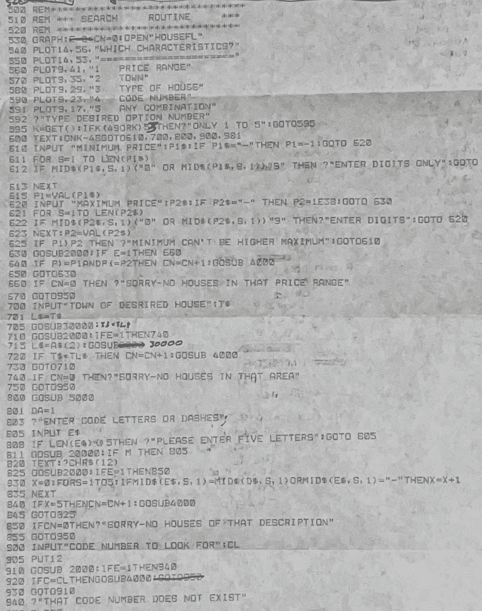
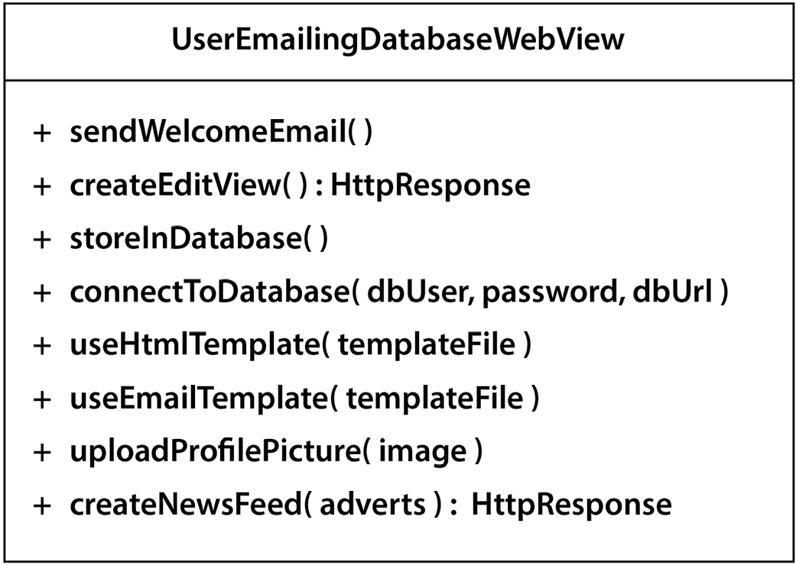
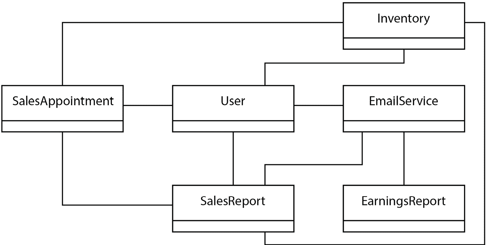
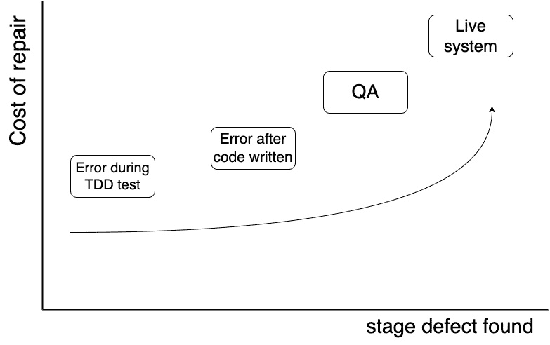

# 第一章：构建 TDD 的案例

在我们深入探讨**测试驱动开发**（**TDD**）是什么以及如何使用它之前，我们需要了解为什么我们需要它。每个经验丰富的开发者都知道，编写糟糕的代码比编写好的代码容易。即使是好的代码似乎随着时间的推移也会变得更糟。为什么？

在本章中，我们将回顾那些使源代码难以工作的技术失败。我们将考虑糟糕代码对团队和业务底线的影响。到本章结束时，我们将清楚地了解我们需要在我们的代码中避免的反模式。

在本章中，我们将讨论以下主要主题：

+   恶劣的代码编写

+   识别糟糕的代码

+   降低团队绩效

+   降低业务成果

# 恶劣的代码编写

每个开发者都知道，编写糟糕的代码似乎比编写好的代码容易得多。我们可以将好的代码定义为易于理解和安全更改的代码。因此，糟糕的代码是这种代码的对立面，它非常难以阅读代码并理解它试图解决的问题。我们害怕更改糟糕的代码——我们知道我们很可能会破坏某些东西。

我对糟糕代码的困扰可以追溯到我的第一个有意义的程序。这是一个为学校竞赛编写的程序，旨在帮助房地产经纪人帮助客户找到理想的房子。在学校使用的 8 位 Research Machines 380Z 计算机上编写，这是 1981 年对 Rightmove 的回应。

在那些互联网之前的年代，它作为一个简单的桌面应用程序存在，具有基于文本的绿色屏幕用户界面。它不需要处理数百万，更不用说数十亿的用户。它也不需要处理数百万的房屋。它甚至没有友好的用户界面。

作为一段代码，它是由几千行*Microsoft Disk BASIC 9*代码组成的。没有可说的代码结构，只有数千行带有不均匀行号和装饰着全局变量的代码。为了增加更大的挑战元素，BASIC 将每个变量限制为两个字母的名称。这使得代码中的每个名称都完全无法理解。源代码被有意写成尽可能少的空格，以节省内存。当你只有 32KB 的 RAM 来适应整个程序代码、数据和操作系统时，每个字节都很重要。

该程序仅向用户提供基本功能。用户界面是那个时代的，仅使用基于文本的表单。它比图形操作系统早了十年。程序还必须实现自己的数据存储系统，使用 5.25 英寸软盘上的文件。再次强调，可负担的数据库组件是未来的事情。该程序的主要功能是用户可以在特定的价格范围和功能集中搜索房屋。他们可以通过卧室数量或价格范围等术语进行筛选。

然而，代码本身真的非常混乱。请看以下原始列表的照片：



图 1.1 – 房地产中介代码列表

这种恐怖是其中一个开发版本的原始论文列表。正如你所见，它完全无法阅读。这不仅仅是你的问题。没有人能够轻易阅读它。我无法阅读，而且是我写的。我甚至可以说它是一团糟，*我的混乱*，是我一点一点敲击键盘创作的。

这类代码与工作噩梦无异。它不符合我们对于好代码的定义。阅读这样的列表并理解代码本应做什么并不容易。更改这样的代码是不安全的。如果我们尝试更改，我们会发现我们永远无法确定是否破坏了某些功能。我们还得手动重新测试整个应用程序。这将非常耗时。

谈到测试，我从未彻底测试过那段代码。一切都是手动测试，甚至没有遵循正式的测试计划。最多，我可能只进行了一小部分**快乐路径**的手动测试。这些测试旨在确认你可以添加或删除房屋，以及一些代表性的搜索功能正常工作，但仅此而已。我根本无法测试通过那段代码的每一条路径。我只是猜测它应该会工作。

如果数据处理失败，我就不知道发生了什么。我从未尝试过。每个可能的搜索组合都工作了吗？谁知道呢？我当然不知道。我甚至没有足够的耐心去完成所有那些繁琐的手动测试。它工作得足够好，足以赢得某种奖项，但代码仍然很糟糕。

## 理解为什么编写糟糕的代码

在我的情况下，这仅仅是知识不足。我不知道如何编写好的代码。但还有其他与技能无关的原因。没有人会故意编写糟糕的代码。开发者会尽他们所能，利用当时可用的工具，尽他们当时的能力去工作。

即使拥有正确的技能，一些常见问题也可能导致编写糟糕的代码：

+   由于项目截止日期，没有时间对代码进行精炼

+   与结构阻止新代码干净添加的遗留代码一起工作

+   为紧急的生产故障添加短期修复，然后从未重新修改

+   对代码主题领域的不熟悉

+   对当地习语和发展风格的不熟悉

+   不恰当地使用来自不同编程语言的习语

现在我们已经看到了一个难以使用的代码示例，并了解了它是如何产生的，让我们转向下一个明显的问题：我们如何识别糟糕的代码？

# 识别糟糕的代码

承认我们的代码难以使用是一回事，但要想超越这一点并编写好的代码，我们需要了解代码为什么是糟糕的。让我们确定技术问题。

## 糟糕的变量名

好的代码是自我描述的，并且可以安全地更改。糟糕的代码则不是。

名称是决定代码是否易于工作最关键的因素。好的名称清楚地告诉读者可以期待什么。不好的名称则不然。变量应该根据它们包含的内容来命名。它们应该回答“*我为什么要使用这些数据？它会告诉我什么？*”

一个被命名为`string`的字符串变量命名不当。我们只知道它是一个字符串。这并没有告诉我们变量中有什么，或者我们为什么要使用它。如果那个字符串代表姓氏，那么通过简单地称之为`surname`，我们就帮助未来的代码读者更好地理解我们的意图。他们可以轻松地看到这个变量存储的是姓氏，并且不应该用于其他任何目的。

我们在*图 1*.1 中看到的两位字母变量名代表了 BASIC 语言的局限性。在当时，我们无法做得更好，但正如我们所见，它们并不有帮助。如果变量存储的是姓氏，那么理解`sn`的含义比`surname`要困难得多。更进一步，如果我们决定用一个名为`x`的变量来存储姓氏，那么我们给代码的读者带来了真正的困难。他们现在有两个问题要解决：

+   他们必须逆向工程代码，以确定`x`是用来存储姓氏的。

+   每次他们使用`x`时，都必须在心理上将`x`与姓氏的概念相对应。

当我们为所有数据使用描述性名称时，比如局部变量、方法参数和对象字段，事情就简单多了。在更一般的指导方针方面，以下 Google 风格指南是一个很好的资源：[`google.github.io/styleguide/javaguide.html#s5-naming`](https://google.github.io/styleguide/javaguide.html#s5-naming)。

变量命名的最佳实践

描述包含的数据，而不是数据类型。

我们现在对如何命名变量有了更好的了解。现在，让我们看看如何正确地命名函数、方法和类。

## 不良的函数、方法和类名

函数、方法和类的命名都遵循类似的模式。在优秀的代码中，函数名告诉我们为什么我们应该调用该函数。它们描述了它们将为我们这些函数的用户做什么。重点是结果——函数返回时会发生什么。我们不描述该函数是如何实现的。这是很重要的。它允许我们在以后如果这样做变得有利时更改该函数的实现，并且名称仍然清楚地描述了结果。

一个名为`calculateTotalPrice`的函数清楚地说明了它将为我们做什么。它将计算总价。它不会有任何意外的副作用。它不会尝试做任何其他事情。它将做它所说的。如果我们把那个名字缩写为`ctp`，那么它就变得不那么清晰了。如果我们称之为`func1`，那么它告诉我们没有任何有用的信息。

恶劣的命名迫使我们每次阅读代码时都要重新设计每个决策。我们必须仔细阅读代码，试图找出它的用途。我们不应该不得不这样做。名字应该是抽象的。一个好的名字将通过将更大的理解浓缩成几个词来加快我们理解代码的能力。

你可以将函数名视为标题。函数内的代码是文本的主体。它的工作方式与你现在阅读的文本中的标题“识别糟糕的代码”相同，这给我们一个关于后续段落内容的一般概念。从标题中，我们期望段落是关于识别糟糕的代码，没有更多也没有更少。

我们希望能够通过其标题——函数、方法、类和变量名——快速浏览我们的软件，这样我们就可以专注于我们现在想做的事情，而不是重新学习过去做过的事情。

方法名与函数名处理方式相同。它们都描述了要执行的操作。同样，你可以将适用于函数名的相同规则应用于方法名。

方法名和函数名的最佳实践

描述结果，而不是实现过程。

再次强调，类名遵循描述性规则。一个类通常代表一个单一的概念，因此其名称应该描述该概念。如果类代表我们系统中的用户配置文件数据，那么`UserProfile`这个类名将帮助我们的代码读者理解这一点。

### 一个名字的长度取决于命名空间

以下是一些关于名字长度的进一步提示，适用于所有名字。名字应该是完全描述性的，但其长度取决于几个因素。当以下情况之一适用时，我们可以选择较短的名称：

+   命名变量有一个小的作用域，只有几行

+   类名本身提供了大部分的描述

+   名字存在于某个其他命名空间中，例如类名

让我们通过每个情况的代码示例来使这一点更加清晰。

以下代码使用简短的变量名`total`计算一系列值的总和：

```java
int calculateTotal(List<Integer> values) {
    int total = 0;
    for ( Integer v : values ) {
        total += v;
    }
    return total ;
}
```

这很好，因为很明显`total`代表所有值的总和。考虑到代码中的上下文，我们不需要一个更长的名字。也许一个更好的例子在于`v`循环变量。它有一个单行的作用域，在这个作用域内，很明显`v`代表循环中的当前值。我们可以使用一个更长的名字，如`currentValue`。然而，这增加了任何清晰度吗？实际上并没有。

在以下方法中，我们有一个名为`gc`的短参数名：

```java
private void draw(GraphicsContext gc) {
    // code using gc omitted
}
```

我们可以选择如此简短的名字的原因是`GraphicsContext`类已经包含了大部分的描述。如果这是一个更通用的类，例如`String`，那么这种简短的名字技术将不会很有帮助。

在这个最后的代码示例中，我们使用了简短的方法名`draw()`：

```java
public class ProfileImage {
    public void draw(WebResponse wr) {
        // Code omitted
    }
}
```

这里类的名字非常具有描述性。我们系统中使用的 `ProfileImage` 类名通常用来描述用户个人资料页面上的头像或照片。`draw()` 方法负责将图像数据写入 `WebResponse` 对象。我们可以选择一个更长的方法名，比如 `drawProfileImage()`，但这只是重复了已经由类名明确的信息。这样的细节正是赋予了 Java 详尽声誉的原因，我觉得这是不公平的；往往是 Java 程序员而不是 Java 本身过于详尽。

我们已经看到，合理地命名事物可以使我们的代码更容易理解。让我们看看在糟糕的代码中我们看到的下一个大问题——使用那些使逻辑错误更可能发生的结构。

## 容易出错的构造

另一个坏代码的明显迹象是它使用了容易出错的构造和设计。在代码中做同样的事情总是有几种不同的方法。其中一些方法比其他方法更容易引入错误。因此，选择能够积极避免错误的编码方式是有意义的。

让我们比较两个不同的函数版本，用于计算总和值，并分析错误可能出现的地点：

```java
 int calculateTotal(List<Integer> values) {
    int total = 0;
    for ( int i=0; i<values.size(); i++) {
        total += values.get(i);
    }
    return total ;
}
```

之前的列表是一个简单的函数，它将接受一个整数列表并返回它们的总和。这种代码自 **Java 1.0.2** 以来一直存在。它工作，但容易出错。为了使这段代码正确，我们需要做几件事情正确：

+   确保将 `total` 初始化为 `0` 而不是其他值

+   确保我们的 `i` 循环索引初始化为 `0`

+   确保我们在循环比较中使用 `<` 而不是 `<=` 或 `==`

+   确保我们将 `i` 循环索引递增正好一次

+   确保我们将列表当前索引的值添加到 `total`

经验丰富的程序员确实往往一开始就能把这些事情都做对。我的观点是，出错的可能性是存在的。我见过错误，比如使用了 `<=` 而不是 `<`，结果代码因为 `ArrayIndexOutOfBounds` 异常而失败。另一个容易犯的错误是在累加总值的行中使用 `=` 而不是 `+=`。这只会返回最后一个值，而不是总和。我甚至犯过这样的错误，纯粹是因为打字错误——我确实以为我打对了，但我打得太快了，没有注意到。

显然，完全避免这类错误对我们来说要好得多。如果一个错误不可能发生，那么它就不会发生。这是一个我称之为 *设计出错误* 的过程。这是一个基本的代码整洁实践。为了了解我们如何将这个实践应用到之前的例子中，让我们看看以下代码：

```java
int calculateTotal(List<Integer> values) {
    return values.stream().mapToInt(v -> v).sum();
}
```

这段代码做的是同样的事情，但本质上更安全。我们没有 `total` 变量，所以不能错误地初始化它，也不能忘记向它添加值。我们没有循环，所以没有循环索引变量。我们不能为循环结束使用错误的比较，因此不能得到 `ArrayIndexOutOfBounds` 异常。在这个代码实现中，出错的可能性大大减少。这通常也使得代码更容易阅读。这反过来又有助于新开发者的入职、代码审查、添加新功能和结对编程。

每当我们有选择使用更少部分且可能出错的地方时，我们应该选择那种方法。通过选择使我们的代码尽可能无错误和简单，我们可以让自己和我们的同事的生活变得更轻松。我们可以使用更健壮的结构来给错误更少的地方隐藏。

值得注意的是，代码的两个版本都存在整数溢出错误。如果我们相加的整数总和超出了允许的范围 -2147483648 到 2147483647，那么代码将产生错误的结果。然而，这个观点仍然成立：较晚的版本有更少的地方可能出错。*结构上*，这是一段更简单的代码。

现在我们已经看到了如何避免典型于糟糕代码的错误类型，让我们转向其他问题领域：耦合和内聚。

## 耦合与内聚

如果我们有许多 Java 类，**耦合**描述了这些类之间的关系，而**内聚**描述了每个类内部方法之间的关系。

当我们正确地处理耦合和内聚的数量时，我们的软件设计将更容易使用。我们将在*第七章*中学习帮助我们做到这一点的技术，*驱动设计-TDD 和 SOLID*。现在，让我们了解当我们做错时我们将面临的问题，从低内聚的问题开始。

### 类内部的低内聚

**低内聚**描述的是代码中许多不同的想法都聚集在同一个地方。下面的 UML 类图展示了具有低内聚方法的类的示例：



图 1.2 – 低内聚

这个类中的代码试图结合太多的职责。它们并不都是明显相关的——我们正在向数据库写入，发送欢迎邮件，并渲染网页。这种大量的职责使得我们的类更难以理解，也更难以更改。考虑我们可能需要更改此类的不同原因：

+   数据库技术的变更

+   网页视图布局的变更

+   网页模板引擎技术的变更

+   邮件模板引擎技术的变更

+   新闻生成算法的变更

我们有许多原因需要更改这个类中的代码。始终给类一个更精确的焦点会更好，这样就有更少的理由去更改它们。理想情况下，任何给定的代码片段只应该有一个需要更改的理由。

理解低内聚的代码很困难。我们被迫同时理解许多不同的想法。在内部，代码非常相互连接。改变一个方法通常会导致其他方法的改变，因为这种相互连接。使用这个类很困难，因为我们需要构建它时包含所有的依赖项。在我们的例子中，我们有一个模板引擎、数据库和创建网页的代码的混合。这也使得这个类非常难以测试。在我们可以对这个类运行测试方法之前，我们需要设置所有这些事情。这样的类重用性有限。这个类与它所包含的功能组合非常紧密地绑定在一起。

### 类之间的高耦合

高耦合描述的是在某个类可以使用之前，需要连接到几个其他类的情况。这使得它在独立使用时变得困难。在我们能够使用我们的类之前，我们需要确保那些支持类已经设置并正确工作。同样地，如果不理解它所具有的许多交互，我们就无法完全理解那个类。例如，以下 UML 类图显示了彼此之间具有高度耦合的类：



图 1.3 – 高耦合

在这个虚构的销售跟踪系统示例中，有几个类需要相互交互。中间的`User`类与四个其他类耦合：`Inventory`、`EmailService`、`SalesAppointment`和`SalesReport`。这使得它比与其他类耦合较少的类更难以使用和测试。这里的耦合是否过高？也许不是，但我们可以想象出其他可以减少耦合的设计。最重要的是要意识到我们设计中类的耦合程度。一旦我们注意到与其他类有许多连接的类，我们就知道我们将面临理解、维护和测试它们的问题。

我们已经看到了高耦合和低内聚的技术元素是如何使我们的代码难以工作的，但糟糕的代码也有一个社会方面。让我们考虑一下糟糕的代码对开发团队的影响。

# 降低团队绩效

评估糟糕代码的一个好方法就是代码缺乏帮助其他开发者理解其功能的那些技术实践。

当你单独编码时，这并不那么重要。糟糕的代码只会让你慢下来，有时会让人感到有点泄气。它不会影响任何人。然而，大多数专业人士是在开发团队中编码的，这是一个完全不同的游戏。糟糕的代码真的会拖慢团队的速度。

关于这一点，以下两项研究很有趣：

+   [`dl.acm.org/doi/abs/10.1145/3194164.3194178`](https://dl.acm.org/doi/abs/10.1145/3194164.3194178)

+   [`www.sciencedirect.com/science/article/abs/pii/S0164121219301335`](https://www.sciencedirect.com/science/article/abs/pii/S0164121219301335)

第一项研究表明，开发者将高达 23%的时间浪费在糟糕的代码上。第二项研究表明，在 25%的与糟糕代码合作的情况下，开发者被迫进一步增加糟糕代码的数量。在这两项研究中，使用了**技术债务**这个术语，而不是直接指代糟糕的代码。这两个术语在意图上有所不同。技术债务是指为了满足截止日期而发布的已知技术缺陷的代码。它被跟踪和管理，目的是将来替换它。糟糕的代码可能存在相同的缺陷，但它缺乏有意性的救赎品质。

检入易于编写但难以阅读的代码真是太容易了。当我这样做的时候，我实际上对团队征收了一项税。下一个拉取我更改的开发者将不得不弄清楚他们到底需要做什么，而我糟糕的代码会让这一切变得更加困难。

我们都经历过这种情况。我们开始一项工作，下载最新的代码，然后只是长时间地盯着屏幕。我们看到一些没有意义的变量名，与纠缠不清的代码混合在一起，这些代码根本无法很好地解释自己。这对我们个人来说很令人沮丧，但在编程业务中，这确实有实际的成本。我们每浪费一分钟不理解代码，就意味着我们在浪费时间，而没有任何成果。这不是我们签上成为开发者时梦寐以求的事情。

糟糕的代码会干扰每一个必须阅读代码的未来开发者，甚至包括我们，原始的作者。我们忘记了我们之前的意思。糟糕的代码意味着开发者花费更多的时间修复错误，而不是增加价值。这意味着在生产环境中修复本应轻易预防的错误的更多时间被浪费了。

更糟糕的是，这个问题会加剧。它就像银行贷款的利息。如果我们留下糟糕的代码，下一个功能将涉及为糟糕的代码添加解决方案。你可能会看到额外的条件出现，给代码带来更多的执行路径，并为错误隐藏创造更多的地方。未来的功能建立在原始糟糕代码及其所有解决方案之上。它创建的代码中，我们阅读的大部分内容仅仅是围绕一开始就不好用的东西进行工作。

这种类型的代码耗尽了开发者的动力。团队开始花更多的时间解决问题，而不是在代码中增加价值。对典型的开发者来说，这一切都不是**有趣**的。对团队中的任何人都不是有趣的事情。

项目经理们失去了对项目进度的掌控。利益相关者对团队交付能力失去了信心。成本超支。截止日期推迟。功能被悄悄削减，只是为了在日程安排上稍微松一口气。每当新开发者看到糟糕的代码时，入职过程变得痛苦，甚至尴尬。

糟糕的代码让整个团队无法发挥他们应有的水平。这反过来又不会让开发团队感到快乐。除了不快乐的开发者之外，它还会对商业成果产生负面影响。让我们了解这些后果。

# 下降的商业成果

受到糟糕代码影响的不仅仅是开发团队。这对整个企业都是有害的。

我们可怜的用户最终为不工作的软件付费，或者至少是工作不正常的软件付费。糟糕的代码有无数种方式可以破坏用户的一天，无论是由于数据丢失、无响应的用户界面，还是任何类型的间歇性故障。这些中的每一个都可能是由一些微不足道的事情引起的，比如在错误的时间设置变量，或者在某个条件中的错误计算。

用户看不到任何这些，也看不到我们正确编写的数千行代码。他们只看到他们错过的付款，他们丢失的耗时两小时打出的文档，或者那个绝妙的*最后机会*票务交易，它根本就没有发生。用户对这类事情几乎没有耐心。这种类型的缺陷很容易让我们失去一个宝贵的客户。

如果我们很幸运，用户会填写一个错误报告。如果我们非常幸运，他们会告诉我们当时在做什么，并为我们提供重现错误的正确步骤。但大多数用户只是在我们应用的错误上点击删除。他们会取消未来的订阅并要求退款。他们会去评论网站，让全世界都知道我们的应用和公司是多么的无用。

到这个时候，这不仅仅是糟糕的代码；它已经成为一种商业责任。我们代码库中的失败和诚实的人类错误已经被人遗忘。相反，我们只是在一个充满负面情绪的竞争中来去的企业。

收入下降导致市场份额下降，**净推荐者得分®™**（NPS）降低，股东失望，以及所有让您的 C 级管理层在夜晚失眠的其他事情。我们的糟糕代码已经成为企业层面的问题。

这不是假设。已经发生了几起软件故障导致企业损失的事件。Equifax、Target 以及甚至 Ashley Madison 网站的网络安全漏洞都导致了损失。Ariane 火箭导致航天器和卫星有效载荷损失，总成本数十亿美元！即使是导致电子商务系统停机的轻微事件，也会很快导致成本上升，而消费者信任也会崩溃。

在每种情况下，失败可能只是相对较少的代码行中的小错误。当然，它们在某种程度上是可以避免的。我们知道人类会犯错误，而且所有软件都是由人类编写的，但可能只需要一点额外的帮助就能阻止这些灾难的发生。

早期发现失败的优势在以下图表中体现：



图 1.4 – 缺陷发现成本

在前面的图中，缺陷修复的成本随着发现时间的延迟而增加：

+   在代码之前通过失败的测试发现的：

发现缺陷最便宜、最快的方法是在编写生产代码之前为特性编写测试。如果我们编写了预期会使测试通过的生产代码，但测试却失败了，我们就知道我们的代码中存在问题。

+   在代码之后通过失败的测试发现的：

如果我们为特性编写了生产代码，然后编写测试，我们可能会在我们的生产代码中发现缺陷。这发生在开发周期稍晚的时候。在发现缺陷之前，我们会浪费更多的时间。

+   在手动 QA 过程中发现：

许多团队包括**质量保证（QA）**工程师。在开发者编写代码之后，QA 工程师将手动测试代码。如果在这里发现缺陷，这意味着自开发者首次编写代码以来已经过去了很长时间。需要进行返工。

+   代码在生产环境中被最终用户发现：

这是最糟糕的情况。代码已经部署到生产环境中，最终用户正在使用它。一个最终用户发现了一个错误。错误必须被报告、分类，然后为开发安排修复，之后由 QA 重新测试，最后重新部署到生产环境。这是发现缺陷最慢且最昂贵的方法。

我们越早发现故障，我们纠正它所需的时间和金钱就越少。理想的情况是在我们甚至写下一行代码之前就有一个失败的测试。这种方法也有助于我们设计代码。我们越晚留出时间来发现错误，它给每个人带来的麻烦就越大。

我们已经看到低质量代码如何导致缺陷，对业务不利。我们越早检测到失败，对我们越好。将缺陷留在生产代码中既困难又昂贵，还会对我们的商业声誉产生负面影响。

# 摘要

我们现在可以从其技术特征中识别出糟糕的代码，并欣赏它给开发团队和业务结果带来的问题。

我们需要一种技术来帮助我们避免这些问题。在下一章中，我们将探讨 TDD 如何帮助我们交付干净、正确的代码，这是真正的商业资产。

# 问题和答案

1.  只有工作代码就足够了吗？

很遗憾不是。满足用户需求的代码是专业软件的入门级步骤。我们还需要我们知道可以正常工作的代码，以及团队可以轻松理解和修改的代码。

1.  用户看不到代码。为什么这对他们很重要？

这是真的。然而，用户期望事物能够可靠地工作，他们期望我们的软件能够持续更新和改进。这只有在开发者能够安全地使用现有代码时才可能实现。

1.  写好代码更容易还是写坏代码更容易？

很不幸，编写好的代码要困难得多。好的代码不仅仅是工作正确，它还必须易于阅读、易于修改，并且对同事来说是安全的。这就是为什么 TDD 等技术扮演着重要的角色。我们需要尽可能多的帮助来编写有助于同事的整洁代码。

# 进一步阅读

+   更多关于阿丽亚娜火箭损失的信息：[`www.esa.int/Newsroom/Press_Releases/Ariane_501_-_Presentation_of_Inquiry_Board_report`](https://www.esa.int/Newsroom/Press_Releases/Ariane_501_-_Presentation_of_Inquiry_Board_report)
