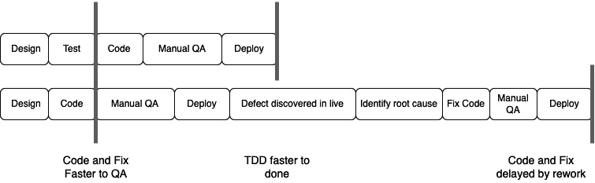

# 3

# 消除关于 TDD 的常见神话

**测试驱动开发**（**TDD**）为开发人员和业务带来了许多好处。然而，它并不总是在实际项目中使用。这让我感到惊讶。TDD 已被证明在不同工业环境中改善了内部和外部代码质量。它适用于前端和后端代码。它适用于各个行业。我亲身体验过它在嵌入式系统、网络会议产品、桌面应用程序和微服务舰队中的工作。

为了更好地理解为什么人们的看法出了问题，让我们回顾一下对 TDD 的常见反对意见，然后探讨我们如何克服它们。通过理解感知到的困难，我们可以装备自己成为 TDD 的倡导者，并帮助我们的同事重新思考。我们将检查围绕 TDD 的六个流行神话，并形成对这些神话的建设性回应。

在本章中，我们将介绍以下神话：

+   “编写测试让我慢下来”

+   “测试不能防止每一个错误”

+   “你怎么知道测试是正确的”

+   “TDD 保证编写出好代码”

+   “我们的代码太复杂了，无法测试”

+   “我不知道要测试什么，直到我写代码”

# 编写测试让我慢下来

编写测试会减慢开发速度是关于 TDD 的一个常见抱怨。这种批评有一定的道理。就我个人而言，我始终认为 TDD 让我更快，但学术研究并不认同。美国计算机协会（*Association for Computing Machinery*）对 18 项主要研究进行的元分析表明，TDD 在学术环境中提高了生产力，但在工业环境中增加了额外的时间。然而，这并不是全部的故事。

## 理解放慢速度的好处

上述研究指出，使用 TDD 多花的时间的回报是减少进入软件的缺陷数量。使用 TDD，这些缺陷比其他方法更早地被识别和消除。通过在手动 **质量保证**（**QA**）、部署和发布之前，以及在可能面对最终用户提出的错误报告之前解决这些问题，TDD 让我们能够削减大量浪费的努力。

我们可以从这张图中看到要完成的工作量的差异：

图 3.1 – 不使用 TDD 会因为返工而减慢我们

最上面一行表示使用 TDD 开发一个功能，我们有足够的测试来防止任何缺陷进入生产环境。最下面一行表示在没有 TDD 的情况下以 **代码和修复** 的风格开发相同的功能，并发现一个缺陷已经进入生产环境。没有 TDD，我们很晚才发现错误，让用户感到烦恼，并在返工上付出沉重的时间代价。请注意，代码和修复方案 *看起来* 让我们更快地进入 QA 阶段，直到我们考虑到所有由未发现的缺陷引起的返工。返工正是这个神话中没有考虑到的。

使用 TDD，我们只是将我们的设计和测试思考明确化并提前进行。我们通过可执行的测试来捕获和记录它。无论我们是否编写测试，我们仍然会花费相同的时间思考我们的代码需要覆盖的具体细节。结果证明，编写测试代码的机械性写作花费的时间非常少。当我们在*第五章**，编写我们的第一个测试*中编写第一个测试时，你可以亲自测量这一点。编写一段代码所花费的总时间是设计它的时间，加上编写代码的时间，再加上测试它的时间。即使没有编写自动化测试，设计和编码时间仍然是恒定和主导因素。

在所有这些中，方便地被忽视的一个领域是手动测试所需的时间。毫无疑问，我们的代码将被测试。唯一的问题是何时以及由谁进行测试。如果我们首先编写测试，那么就是由我们，即开发者进行。这发生在任何错误代码被检查到我们的系统之前。如果我们将测试留给手动测试同事，那么就会减慢整个开发过程。我们需要花时间帮助我们的同事理解我们代码的成功标准是什么。然后他们必须制定一个手动测试计划，这通常需要编写、审查和接受到文档中。

执行手动测试非常耗时。通常，整个系统必须构建并部署到测试环境中。数据库必须手动设置以包含已知数据。**用户界面**（**UI**）必须点击以到达一个合适的屏幕，我们的新代码可能在那里被测试。输出必须手动检查，并对其正确性做出决定。每次我们做出更改时，都必须手动执行这些步骤。

更糟糕的是，我们越晚进行测试，就越有可能在存在任何错误代码的基础上构建。因为我们还没有测试我们的代码，所以我们无法知道我们在做这件事。这通常很难解开。在一些项目中，我们与主代码分支的差距如此之大，以至于开发者开始互相发送补丁文件。这意味着我们开始在这个错误代码的基础上构建，使其更难移除。这些是不良做法，但它们确实在真实项目中发生。

与先编写 TDD 测试相比，差异可谓天差地别。在 TDD 中，设置是自动化的，步骤被捕获并自动化，结果检查也是自动化的。我们谈论的是将手动测试的时间从分钟级减少到毫秒级，使用 TDD 单元测试。这种时间节省在每次我们需要运行那个测试时都会发生。

虽然手动测试不如 TDD 高效，但仍然有一个更糟糕的选择：完全没有测试。将缺陷发布到生产意味着我们将代码的测试留给用户。在这里，可能会有财务考虑和声誉损害的风险。至少，这是一个非常缓慢地发现错误的方式。从生产日志和数据库中隔离有缺陷的代码行是非常耗时的。根据我的经验，这通常也是令人沮丧的。

很有趣，一个永远找不到时间编写单元测试的项目总是能找到时间翻查生产日志、回滚发布代码、发布营销通讯，以及停止所有其他工作来进行**优先级 1（P1）**的修复。有时，感觉对于某些管理方法来说，找到一天的时间比找到一分钟的时间还容易。

TDD 确实在编写测试时 upfront 放置了时间成本，但作为回报，我们在生产中需要修正的错误更少——与多次返工周期中在实时代码中出现的缺陷相比，这大大节省了整体成本、时间和声誉。

## 克服测试让我们减速的反对意见

建立一个案例，追踪手动质量保证和失败部署中未发现的缺陷所花费的时间。找出最近一次现场问题修复所需的大致时间。找出哪些缺失的单元测试本可以预防它。现在计算一下编写这些测试需要多长时间。将这些数字呈现给利益相关者。计算出所有这些工程时间以及任何损失的收入可能更加有效。

知道测试在减少缺陷方面确实有整体益处，让我们来审视另一个常见的反对意见，即测试没有价值，因为它们不能预防每一个错误。

# 测试无法预防每一个错误

对任何类型的测试的一个非常古老的反对意见是：你不能捕捉到每一个错误。虽然这确实是真的，但如果我们从任何方面来看，这意味着我们需要更多和更好的测试，而不是更少。让我们了解这一点的动机，以便准备一个适当的回应。

## 理解为什么人们会说测试不能捕捉到每一个错误

立刻，我们可以同意这个说法。测试不能捕捉到每一个错误。更确切地说，已经证明软件系统中的测试只能揭示缺陷的存在。它永远不能证明不存在缺陷。我们可以有很多通过测试，但缺陷仍然可能隐藏在我们没有测试的地方。

这似乎也适用于其他领域。医学扫描并不总是能揭示那些难以察觉的问题。飞机的风洞测试并不总是能在特定的飞行条件下揭示问题。巧克力工厂的批量抽样不会捕捉到每一个不合格的甜食。

就因为我们无法捕捉到每个错误，并不意味着这使我们的测试无效。我们编写的每一个测试捕捉到一个缺陷，就会减少一个缺陷在我们的工作流程中运行。TDD 给我们提供了一个过程，帮助我们开发时考虑测试，但仍然有一些领域，我们的测试将不会有效：

+   你没有想到要编写的测试

+   由于系统级交互而产生的缺陷

我们没有编写的测试是一个真正的问题。即使在 TDD 中首先编写测试，我们也必须足够自律，为每个我们希望功能化的场景编写一个测试。编写测试然后编写代码使其通过很容易。诱惑是继续添加代码，因为我们正在顺利地进行。很容易忽略一个边缘情况，因此不为其编写测试。如果我们有一个缺失的测试，我们就会打开一个缺陷存在并被后来发现的可能。

这里系统级交互的问题指的是当你将经过测试的软件单元组合在一起时出现的行为。单元之间的交互有时可能比预期的更复杂。基本上，如果我们把两个经过良好测试的东西组合在一起，新的组合本身还没有经过测试。一些交互有错误，只有在这些交互中才会出现，尽管构成它们的单元已经通过了所有测试。

这两个问题是真实且有效的。测试永远无法覆盖所有可能的错误，但这却错过了测试的主要价值。我们编写的每一个测试都会减少一个缺陷。

通过不进行任何测试，我们永远不会发现任何错误。我们不会防止任何缺陷。如果我们测试，无论测试多少，我们都会提高代码的质量。这些测试可以检测到的每一个缺陷都将被防止。我们可以看到这个论点的稻草人性质：仅仅因为我们不能覆盖所有可能性，并不意味着我们不应该做我们能做的事情。

## 克服无法捕捉到每个错误的反对意见

重新审视这个问题的方式是我们对自己有信心，认为 TDD 可以防止许多类别的错误发生。当然，并不是所有类型的错误，但成千上万的测试库将显著提高我们应用程序的质量。

为了向我们的同事解释这一点，我们可以借鉴熟悉的类比：仅仅因为一个强大的密码不能阻止每个黑客，这并不意味着我们不应该使用密码，让自己容易受到任何和每个黑客的攻击。保持健康不能防止所有类型的医疗问题，但它可以防止许多严重的医疗问题。

最终，这是一个平衡的问题。零测试显然是不够的——在这种情况下，每一个缺陷最终都会上线。我们知道测试永远不能消除缺陷。那么，我们应该在哪里停止？什么构成了*足够*？我们可以争论说 TDD 帮助我们在这个最佳时机决定这个平衡：当我们思考编写代码的时候。我们创建的自动化 TDD 测试将为我们节省手动 QA 时间。这是不再需要做的手动工作。这些时间和成本节约在代码的每一次迭代中都会累积，并回报我们。

现在我们已经理解了为什么尽可能多的测试总是胜过完全不测试，我们可以看看下一个常见的反对意见：我们怎么知道测试本身是正确编写的？

# 你怎么知道测试是正确的？

这是一个有价值的反对意见，因此我们需要深入理解其背后的逻辑。这是来自不熟悉编写自动化测试的人的常见反对意见，因为他们误解了我们如何避免错误的测试。通过帮助他们看到我们实施的保障措施，我们可以帮助他们重新思考。

## 理解编写有缺陷的测试背后的担忧

你会听到的一个反对意见是，“*如果测试本身没有测试，我们怎么知道测试是正确的呢？*”这个反对意见是在我第一次向团队介绍单元测试时提出的。它是两极分化的。一些团队成员立刻理解了其价值。其他人无动于衷，但有些人则是积极敌对的。他们认为这种新的做法暗示他们有某种缺陷。这被视为一种威胁。在这种背景下，一位开发者指出了我解释的逻辑中的一个缺陷。

我告诉团队我们不能相信我们对生产代码的视觉阅读。是的，我们所有人都擅长阅读代码，但我们都是人类，所以我们会错过一些东西。单元测试可以帮助我们避免错过。一位聪明的开发者提出了一个很好的问题：如果视觉检查对生产代码不起作用，为什么我们说它对测试代码*确实*起作用？两者之间有什么区别？

对于这个问题的正确说明是在我需要测试一些 XML 输出之后（我记得那是 2005 年）。我编写的用于检查 XML 输出的代码确实很复杂。批评是正确的。我无法直观地检查那段测试代码，并诚实地说我没有发现任何缺陷。

因此，我将 TDD 应用于这个问题。我使用 TDD 编写了一个实用类，可以比较两个 XML 字符串并报告它们是否相同或第一个差异是什么。它可以配置为忽略 XML 元素的顺序。我将这段复杂的代码从原始测试中提取出来，并用对这个新实用类的调用替换了它。我知道这个实用类没有缺陷，因为它通过了我为它编写的每一个 TDD 测试。有很多测试，覆盖了我关心的每一个快乐路径和边缘情况。之前受到批评的原始测试现在变得非常简短和直接。

我让提出这个观点的同事审查了代码。他们同意，在这个新的、更简单的形式下，他们很高兴同意测试是正确的，从视觉上看。他们补充说，“*如果工具类工作正常的话*。”当然，我们有信心它通过了我们针对它编写的每一个 TDD 测试。我们确信它做了我们特别想要它做的事情，正如这些事情的测试所证明的那样。

## 提供我们测试测试的保证

这个论点的本质是，简短、简单的代码可以直观检查。为了确保这一点，我们保持大多数单元测试简单且足够简短，以便进行推理。当测试变得过于复杂时，我们将这种复杂性提取到自己的代码单元中。我们使用 TDD 来开发它，最终使得原始测试代码足够简单以便检查，测试工具足够简单以便其测试可以检查，这是一个经典的分而治之的例子。

实际上，我们邀请我们的同事指出他们认为我们的测试代码过于复杂而无法信任的地方。我们重构它，使用简单的工具类，这些工具类本身也是使用简单的 TDD 编写的。这种方法帮助我们建立信任，尊重同事的合理担忧，并展示了我们如何找到方法将所有 TDD 测试简化为简单、可审查的代码块。

既然我们已经解决了知道我们的测试是正确的问题，另一个常见的反对意见涉及对 TDD 过度自信：简单地遵循 TDD 过程就可以保证优秀的代码。这可能吗？让我们来分析一下这些论点。

# TDD 保证优秀的代码

正如常常有对 TDD 过度悲观的反对意见一样，这里有一个相反的观点：TDD *保证* 优秀的代码。因为 TDD 是一个过程，它声称可以改进代码，所以合理地假设使用 TDD 就是保证优秀代码的全部，这是完全正确的。不幸的是，这并不完全正确。TDD 帮助开发者编写优秀的代码，并且作为反馈，它可以帮助我们发现自己的设计和逻辑错误。然而，它并不能保证代码的优秀。

## 理解问题膨胀的期望

这里的问题是一个误解。TDD 不是一套直接影响你的设计决策的技术。它是一套帮助你指定你期望代码在何时、在什么条件下执行什么操作，以及给定特定设计的技术。它让你自由地选择设计，期望它做什么，以及如何实现这段代码。

TDD 没有关于选择长变量名还是短变量名的建议。它不会告诉你是否应该选择接口或抽象类。你应该将功能拆分到两个类还是五个类中？TDD 在这方面没有建议。你应该消除重复代码吗？反转依赖关系？连接到数据库？只有你可以决定。TDD 不提供建议。它不是智能的。*它不能取代你和你的专业知识.* 它是一个简单的流程，使你能够验证你的假设和想法。

## 管理你对 TDD 的期望

在我看来，TDD 非常有用，但我们必须在特定环境中看待它。它为我们提供决策的即时反馈，但将每个重要的软件设计决策留给我们。

使用 TDD，我们可以自由地使用**SOLID**原则（本书第七章*第七章*，*驱动设计——TDD 和 SOLID*将涉及）编写代码，或者我们可以使用过程式方法、面向对象方法或函数式方法。TDD 允许我们根据需要选择算法。它使我们能够改变对如何实现某物的看法。TDD 适用于所有编程语言。它适用于每个垂直领域。

帮助我们的同事超越这个反对意见，使他们意识到 TDD 不是某种魔法系统，可以取代程序员的智慧和技能。它通过提供决策的即时反馈来利用这种技能。虽然这可能会让希望从思维不完善中产生完美代码的同事感到失望，但我们可以说 TDD 给我们思考的时间。优势在于它将思考和设计放在最前沿和中心。通过在编写使测试通过的生产代码之前编写失败的测试，我们确保我们已经考虑了代码应该做什么以及应该如何使用。这是一个巨大的优势。

既然我们明白 TDD 不会为我们设计代码，但仍然是开发者的朋友，我们如何处理复杂代码的测试？

# 我们的代码太复杂以至于无法测试

专业开发者通常要处理高度复杂的代码。这只是一个事实。这导致一个合理的反对意见：我们的代码太难编写单元测试了。我们正在处理的代码可能是非常有价值的、受信任的遗留代码，带来了显著的收入。这些代码可能很复杂。但是，它们是否“太”复杂以至于无法测试？是否可以说每一块复杂的代码都无法测试？

## 理解不可测试代码的原因

答案在于代码变得复杂和难以测试的三个原因：

+   意外的复杂性：我们意外地选择了困难的方法而不是简单的方法

+   外部系统无法控制以设置我们的测试

+   代码纠缠得如此之紧，以至于我们不再理解它

意外的复杂性使得代码难以阅读和测试。最好的思考方式是知道任何给定问题都有许多有效的解决方案。比如说，我们想要加总五个数字。我们可以写一个循环。我们可以创建五个并发任务，每个任务处理一个数字，然后将该数字报告给另一个并发任务，该任务计算总和（请耐心等待，我会解释……我见过这种情况）。我们可以有一个基于复杂设计模式的系统，每个数字都会触发一个观察者，将每个数字放入一个集合中，然后触发一个观察者来增加总和，每 10 秒触发一次最后一个输入后的观察者。

是的，我知道其中一些很愚蠢。我只是编造了它们。但让我们说实话——你之前工作过哪些愚蠢的设计？我知道我写过比需要的更复杂的代码。

五个数加法示例的关键点是它实际上应该使用一个简单的循环。其他任何东西都是偶然的复杂性，既不必要也不故意。我们为什么会这样做？有许多原因。可能有项目约束、管理指令，或者仅仅是个人偏好影响了我们的决策。无论如何，一个更简单的解决方案是可能的，但我们没有采取。

测试更复杂的解决方案通常需要更复杂的测试。有时，我们团队认为不值得花时间在这上面。代码本身很复杂，编写测试会很困难，而且我们认为它已经可以工作了。我们认为最好不要去动它。

外部系统在测试中会引起问题。假设我们的代码与第三方网络服务进行交互。为这种情况编写可重复的测试是困难的。我们的代码消耗外部服务，并且它发送给我们的数据每次都不同。我们无法编写测试并验证服务发送给我们的内容，因为我们不知道服务应该发送什么。如果我们能用一个我们可以控制的虚拟服务替换那个外部服务，那么我们可以轻松解决这个问题。但如果我们的代码不允许这样做，那么我们就陷入了困境。

混乱的代码是这一点的进一步发展。为了编写测试，我们需要了解该代码对输入条件做了什么：我们期望输出是什么？如果我们有一段我们根本不理解代码，那么我们就无法为它编写测试。

虽然这三个问题都是真实的，但它们都有一个根本原因：我们让我们的软件陷入了这种状态。我们可以安排它只使用简单的算法和数据结构。我们可以隔离外部系统，这样我们就可以在没有它们的情况下测试其余的代码。我们可以模块化我们的代码，使其不会过于混乱。

然而，我们如何说服我们的团队接受这些想法呢？

## 重新审视良好设计和简单测试之间的关系

所有的前述问题都与制作工作软件但又不遵循良好设计实践有关。根据我的经验，改变这种情况最有效的方法是**结对编程**——在相同的代码上一起工作，并互相帮助找到更好的设计理念。如果结对编程不是一个选择，那么代码审查也可以提供一个检查点来引入更好的设计。结对编程更好，因为当你到达代码审查时，可能已经太晚做重大更改了。预防不良设计比纠正它更便宜、更好、更快。

## 没有测试管理遗留代码

我们会遇到没有测试的遗留代码，我们需要维护。通常，这段代码已经变得难以管理，理想情况下需要替换，但没有人知道它做什么了。可能没有书面文档或规范来帮助我们理解它。无论有什么书面材料，可能都是完全过时且无用的。代码的原始作者可能已经转到了不同的团队或不同的公司。

在这种情况下，最好的建议是尽可能让这段代码保持原样。然而，有时我们需要添加需要更改代码的功能。鉴于我们没有现有的测试，我们很可能发现添加一个新测试几乎是不可能的。代码根本就没有以这种方式拆分，以至于我们无法挂载测试。

在这种情况下，我们可以使用**特征测试**技术。我们可以将其描述为三个步骤：

1.  运行遗留代码，向其提供所有可能的输入组合。

1.  记录每次输入运行产生的所有输出。这个输出传统上被称为黄金大师。

1.  编写一个特征测试，再次运行所有输入的代码。将每个输出与捕获的黄金大师进行比较。如果有任何不同的输出，则测试失败。

这个自动化测试将我们做出的任何代码更改与原始代码所做的内容进行比较。这将指导我们在重构遗留代码时的工作。我们可以使用标准重构技术结合 TDD。通过在黄金大师中保留有缺陷的输出，我们确保在这个步骤中我们纯粹是在重构。我们避免了在修复错误的同时重构代码的陷阱。当原始代码中存在错误时，我们分两个不同的阶段工作：首先，在不改变可观察行为的情况下重构代码。之后，将缺陷作为单独的任务修复。我们从不一起修复错误和重构。特征测试确保我们不会意外地将这两个任务混淆。

我们已经看到 TDD 如何帮助解决意外复杂性和更改遗留代码的困难。当然，在编写生产代码之前编写测试意味着我们需要在测试它之前知道代码的样子，对吧？让我们接下来回顾这个常见的反对意见。

# 我不知道要测试什么，直到我编写了代码

对于 TDD 学习者来说，一个巨大的挫折是知道要测试什么，而没有事先编写生产代码。这是另一个有价值的批评。在这种情况下，一旦我们理解了开发者面临的问题，我们就可以看到解决方案是一种我们可以应用到我们的工作流程中的技术，而不是思维方式的重新构建。

## 理解从测试开始遇到的困难

在一定程度上，考虑代码的实现方式是自然的。毕竟，这是我们学习的方式。我们编写 `System.out.println("Hello, World!");` 而不是想出一个结构来围绕著名的行。当我们以线性代码编写时，类似于购物清单的指令，小型程序和实用程序运行得很好。

当程序变得更大时，我们开始面临困难。我们需要帮助将代码组织成可理解的块。这些块需要易于理解。我们希望它们是自我文档化的，并且我们能够轻松地知道如何调用它们。代码越大，这些块内部的细节就越不有趣，而这些块的外部结构——即“外部”——就越重要。

例如，假设我们正在编写一个 `TextEditorWidget` 类，并希望即时检查拼写。我们找到一个包含 `SpellCheck` 类的库。我们并不太关心 `SpellCheck` 类是如何工作的。我们只关心如何使用这个类来检查拼写。我们想知道如何创建该类的对象，需要调用哪些方法来使其执行拼写检查任务，以及我们如何访问输出。

这种思维方式是软件设计的定义——组件如何组合在一起。如果我们想要维护它们，那么在代码库增长时强调设计是至关重要的。我们使用封装来隐藏函数和类内部数据结构和算法的细节。我们提供了一个简单易用的编程接口。

## 克服先编写生产代码的需求

TDD 框架设计决策。通过在编写生产代码之前编写测试，我们定义了想要如何创建、调用和使用待测试的代码。这有助于我们迅速了解我们的决策效果如何。如果测试显示创建我们的对象很困难，这表明我们的设计应该简化创建步骤。如果对象难以使用，我们也应该简化我们的编程接口。

然而，当我们根本不知道合理的设计应该是什么样子时，我们该如何应对呢？当我们使用新的库、与团队其他部分的某些新代码集成或处理大型用户故事时，这种情况很常见。

为了解决这个问题，我们使用一个“spike”，一段足以证明设计形状的简短代码。在这个阶段，我们并不追求最干净的代码。我们不涵盖许多边缘情况或错误条件。我们有一个具体且有限的目的是探索对象和函数的可能排列，以形成一个可信的设计。一旦我们有了这个，我们就绘制一些关于设计的笔记，然后删除它。现在我们知道了一个合理的设计看起来是什么样子，我们就更有能力知道要编写哪些测试。现在我们可以使用正常的 TDD 来驱动我们的设计。

有趣的是，当我们以这种方式重新开始时，我们往往能得出比我们的 spike 更好的设计。TDD 的反馈循环帮助我们找到新的方法和改进。

我们已经看到，在测试之前开始实现代码是多么自然，以及我们如何可以使用 TDD 和 spike 来创建更好的流程。我们在**最后责任时刻**做出决定——在我们意识到做出不可逆转、较差的决定之前，可能做出的最新决定。当有疑问时，我们可以通过使用**spike**——一段旨在学习和然后丢弃的实验性代码——来了解更多关于解决方案空间的信息。

# 摘要

在本章中，我们学习了六个常见的神话，这些神话阻止团队使用 TDD，并讨论了重新构建这些对话的正确方法。TDD 在现代软件开发中的应用范围远远超过现在。这并不是说技术不起作用。TDD 只是有一个形象问题，通常是在没有体验过其真正力量的人中。

在本书的第二部分，我们将开始将 TDD 的各种节奏和技术付诸实践，并构建一个小型 Web 应用程序。在下一章中，我们将从使用**Arrange-Act-Assert**（**AAA**）**模式**编写单元测试的基本知识开始我们的 TDD 之旅。

# 提问和回答

1.  为什么人们认为 TDD 会减慢开发者的速度？

当我们不编写测试时，我们节省了编写测试所花费的时间。这没有考虑到在生产中找到、重现和修复缺陷的额外时间成本。

1.  TDD 是否会消除人类的设计贡献？

不。恰恰相反。我们仍然使用我们所能使用的每一种设计技术来设计我们的代码。TDD 给我们的是关于我们的设计选择是否导致了易于使用、正确的代码的快速反馈循环。

1.  为什么我的项目团队不使用 TDD？

提出这样的问题真是太棒了！真的。看看他们是否有任何反对意见被本章涵盖。如果是这样，你可以利用本章提出的思想温和地引导对话。

# 进一步阅读

+   [`zh.wikipedia.org/wiki/Characterization_test`](https://zh.wikipedia.org/wiki/Characterization_test)

更详细地介绍 Characterization Test 技术，其中我们以原样捕获现有软件模块的输出，目的是在不改变其任何行为的情况下重构代码。这在原始需求变得不明确或经过多年演变而包含其他系统现在依赖的缺陷的旧代码中特别有价值。

+   [`effectivesoftwaredesign.com/2014/03/27/lean-software-development-before-and-after-the-last-responsible-moment/`](https://effectivesoftwaredesign.com/2014/03/27/lean-software-development-before-and-after-the-last-responsible-moment/)

深入探讨在最后责任时刻做出决定对软件设计意味着什么。

# 第二部分：TDD 技术

*第二部分*介绍了有效 TDD 所需的技巧。在这个过程中，我们将逐步构建一个单词猜谜游戏 Wordz 的核心逻辑，首先编写所有测试。

到这部分结束时，我们将通过先编写测试来生成高质量的代码。SOLID 原则和六边形架构将帮助我们组织代码成为易于测试的精心设计的构建块。测试替身将外部依赖项置于我们的控制之下。我们将探讨测试自动化的更大图景，以及测试金字塔、质量保证工程师和工作流程如何改善我们的工作。

本部分包含以下章节：

+   *第四章*, *使用 TDD 构建应用程序*

+   *第五章*, *编写我们的第一个测试*

+   *第六章*, *遵循 TDD 的节奏*

+   *第七章*, *驱动设计 – TDD 和 SOLID 原则*

+   *第八章*, *测试替身 – 模拟和存根*

+   *第九章*, *六边形架构 – 解耦外部系统*

+   *第十章*, *FIRST 测试和测试金字塔*

+   *第十一章*, *TDD 如何融入质量保证*

+   *第十二章*, *先测试，后测试，永不测试*
