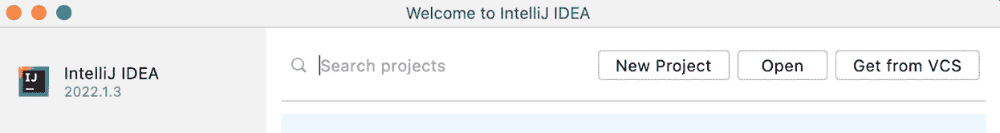
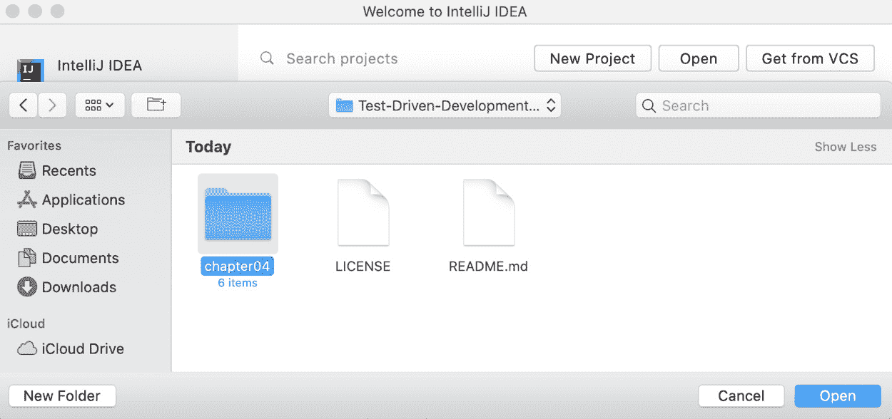
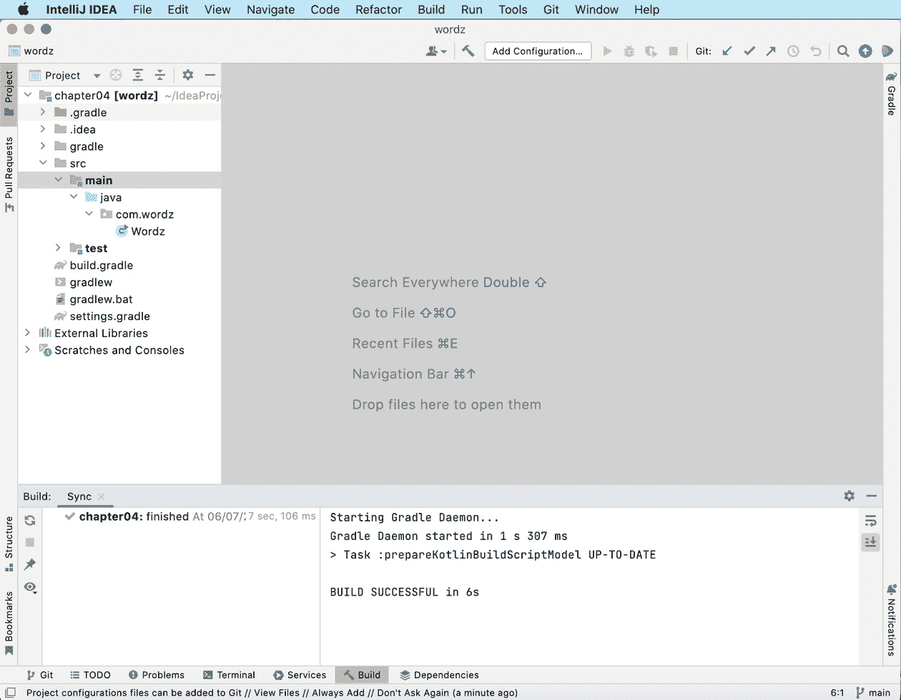
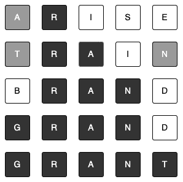

# 4

# 使用 TDD 构建应用程序

我们将通过构建应用程序测试来学习 TDD 的实践方面。在构建过程中，我们还将使用一种称为 **敏捷软件开发** 的方法。敏捷意味着我们将以小而自包含的迭代方式构建软件，而不是一次性构建所有内容。这些小步骤使我们能够在进行中更多地了解软件设计。随着时间的推移，我们会根据对良好设计的信心进行设计调整和优化。我们可以在应用程序完成之前向早期测试用户提供可工作的功能，并在此期间收到他们的反馈。这是非常有价值的。正如我们在前面的章节中看到的，TDD 是提供对自包含软件组件快速反馈的绝佳方法。它是敏捷开发的完美补充。

为了帮助我们以这种方式构建，本章将介绍 **用户故事** 技巧，这是一种适合敏捷方法的捕获需求的方式。在描述我们的应用程序将做什么之前，我们将准备我们的 Java 开发环境，以便进行测试优先开发。

在本章中，我们将涵盖以下主题：

+   介绍 Wordz 应用程序

+   探索敏捷方法

# 技术要求

本章的最终代码可以在 [`github.com/PacktPublishing/Test-Driven-Development-with-Java/tree/main/chapter04`](https://github.com/PacktPublishing/Test-Driven-Development-with-Java/tree/main/chapter04) 找到。

要一起编码——我强烈推荐这样做——我们首先需要设置我们的开发环境。这将使用优秀的 JetBrains IntelliJ Java **集成开发环境**（**IDE**），来自 Amazon 的免费 Java SDK 以及一些库来帮助我们编写测试并将库包含在我们的 Java 项目中。我们将在下一节中组装所有开发工具。

## 准备我们的开发环境

对于这个项目，我们将使用以下工具：

+   IntelliJ IDEA IDE 2022.1.3（社区版）或更高版本

+   Amazon Corretto Java 17 JDK

+   JUnit 5 单元测试框架

+   AssertJ 流畅断言框架

+   Gradle 依赖关系管理系统

我们将首先安装我们的 Java IDE，即 JetBrains IntelliJ IDE 社区版，然后再添加其余的工具。

## 安装 IntelliJ IDE

为了帮助我们与 Java 源代码一起工作，我们将使用 JetBrains IntelliJ Java IDE，使用其免费的社区版。这是一个在软件行业中流行的 IDE——而且有很好的理由。它将出色的 Java 编辑器与自动完成和代码建议相结合，以及调试器、自动重构支持、Git 源代码控制工具和出色的测试运行集成。

要安装 IntelliJ，请参阅以下步骤：

1.  前往 [`www.jetbrains.com/idea/download/`](https://www.jetbrains.com/idea/download/)。

1.  点击您操作系统的标签页。

1.  滚动到 **社区** 部分。

1.  按照您操作系统的安装说明进行操作。

完成后，IntelliJ IDE 应已安装在您的计算机上。下一步是创建一个空白的 Java 项目，使用 Gradle 包管理系统，然后设置我们希望使用的 Java 版本。Mac、Windows 和 Linux 的安装通常很简单。

## 设置 Java 项目和库

一旦安装了 IntelliJ，我们就可以导入随附 GitHub 仓库中提供的起始项目。这将设置一个使用 Amazon Corretto 17 **Java 开发工具包**（**JDK**）、JUnit 5 单元测试运行器、Gradle 构建管理系统和 AssertJ 流畅断言库的 Java 项目。

要完成此操作，请参阅以下步骤：

1.  在你的网络浏览器中，访问[`github.com/PacktPublishing/Test-Driven-Development-with-Java`](https://github.com/PacktPublishing/Test-Driven-Development-with-Java)。

1.  使用你喜欢的`git`工具在你的计算机上克隆整个仓库。如果你使用`git`命令行工具，这将如下所示：

`git clone https://github.com/PacktPublishing/Test-Driven-Development-with-Java.git`

1.  启动 IntelliJ。你应该看到欢迎屏幕：

图 4.1 – IntelliJ 欢迎屏幕

1.  点击我们刚刚克隆的仓库中的`chapter04`文件夹。点击以突出显示它：

图 4.2 – 选择代码文件夹

1.  点击**打开**按钮。

1.  等待 IntelliJ 导入文件。你应该看到以下工作空间已打开：

图 4.3 – IntelliJ 工作空间视图

现在我们已经设置了 IDE，包含了我们开始所需的所有内容的骨架项目。在下一节中，我们将描述我们将要构建的应用程序的主要功能，我们将在下一章开始构建它。

# 介绍 Wordz 应用程序

在本节中，我们将在查看我们将要使用的敏捷过程之前，从高层次上描述我们将要构建的应用程序。该应用程序称为 Wordz，它基于一个流行的猜词游戏。玩家试图猜测一个五字母单词。根据玩家猜测单词的速度来计分。玩家会收到每次猜测的反馈，以引导他们找到正确答案。我们将使用各种 TDD 技术在本书的剩余部分构建该应用程序的服务器端组件。

## 描述 Wordz 的规则

要玩 Wordz，玩家将有最多六次机会猜测一个五字母单词。每次尝试后，单词中的字母将按以下方式突出显示：

+   正确位置的正确字母具有黑色背景

+   错误位置的正确字母具有灰色背景

+   不在单词中出现的错误字母具有白色背景

玩家可以利用这个反馈来做出更好的下一个猜测。一旦玩家正确猜出单词，他们就能获得一些分数。第一次正确猜测得 6 分，第二次正确猜测得 5 分，第六次和最后一次正确猜测得 1 分。玩家在各个回合中相互竞争，以获得最高分。Wordz 是一款既有趣又能温和锻炼大脑的游戏。

虽然构建用户界面超出了本书的范围，但看到一个可能的示例非常有帮助：

图 4.4 – Wordz 游戏

技术上，我们将为这个游戏创建后端 Web 服务组件。它将公开一个**应用程序编程接口**（**API**），以便用户界面可以使用该服务，并在数据库中跟踪游戏状态。

为了专注于 TDD 的技术，我们将某些内容排除在我们的范围之外，例如用户身份验证和用户界面。当然，生产版本将包括这些方面。但为了实现这些功能，我们不需要任何新的 TDD 技术。

这种简单的设计将使我们能够通过典型 Web 应用的各个层次全面探索 TDD。

既然我们已经定义了我们要构建的内容，下一节将介绍我们将用于构建它的开发方法。

# 探索敏捷方法

在构建 Wordz 的过程中，我们将采用迭代方法，将应用程序构建为一系列用户可以使用的功能。这被称为**敏捷开发**。它非常有效，因为它允许我们更早、更规律地发布功能给用户。它允许我们作为开发者，在过程中更多地了解我们正在解决的问题以及良好的软件设计的外观。本节将比较敏捷开发与瀑布方法的优点，然后介绍一个名为用户故事的敏捷需求收集工具。

敏捷开发的前身被称为**瀑布式开发**。之所以这样称呼，是因为项目阶段像瀑布一样流动，每个阶段都完全完成之后才会开始下一个阶段。

在瀑布式项目中，我们将开发分为一系列连续的阶段：

1.  收集需求

1.  进行需求分析

1.  创建完整的软件设计

1.  编写所有代码

1.  测试代码

理论上，每个阶段都完美执行，一切正常，没有问题。实际上，总是会有问题。

我们发现了一些遗漏的需求。我们发现设计文档不能完全按照它们所写的那样编码。我们发现设计中缺少部分。编码本身可能会遇到困难。最糟糕的是，最终用户直到最后都看不到任何可工作的软件。如果他们看到的东西不是他们所想的，我们就需要进行非常昂贵的更改和返工。

原因在于*人类有有限的远见*。尽管我们尽力，但我们无法准确预测未来。我可以坐在这里，手里拿着一杯热咖啡，准确地知道它将在二十分钟后变凉。但我无法告诉你三个月后的天气。我们预测未来的能力局限于短期时间框架，对于有明确因果关系的流程。

瀑布式开发在面对不确定性和变化时表现非常糟糕。它是围绕所有事物都可以提前知道和计划的概念设计的。更好的方法是*接受*变化和不确定性，使其成为开发过程的一个积极部分。这是敏捷开发的基础。其核心是一个迭代方法，其中我们选择一个用户关心的微小特性，然后完全构建该特性，让用户尝试。如果需要变更，我们进行另一轮开发迭代。当我们的开发过程积极支持变更时，变更的成本要低得多。

专业敏捷开发流程依赖于维护一个始终经过测试的单一代码库，它代表了我们软件到目前为至的*最佳版本*。这个代码库始终准备部署给用户。我们一次增加一个特性，在前进的过程中不断改进其设计。

如 TDD（测试驱动开发）等技术在此中扮演着重要角色，通过确保我们的代码设计良好且经过彻底测试。每次我们将代码提交到主分支时，我们已经知道它已经通过了许多 TDD 测试。我们知道我们对它的设计感到满意。

为了更好地支持迭代开发，我们选择了一种迭代技术来捕捉需求。这种技术被称为用户故事，我们将在下一节中对其进行描述。

## 阅读用户故事——规划的基石

由于开发是迭代的，并接受重构和重做，因此旧的需求指定方法不再适用。我们不再被事先确定的大量需求文档所服务。我们更倾向于一次捕捉一个需求，构建它，并从中学习。随着时间的推移，我们可以优先考虑用户想要的功能，并更多地了解*良好设计*将如何呈现。

通过敏捷技术，我们不需要提前知道未来；我们可以与用户一起发现它。

支持这一变化的是一种新的需求表达方式。瀑布式项目从一份完整的需求文档开始，正式详细地描述每个特性。完整的需求集合——通常有数千个——使用如“*系统应…*”这样的正式语言表达，然后通过软件系统变更的细节进行解释。在敏捷开发中，我们不希望以这种方式捕捉需求。我们希望遵循两个关键原则来捕捉它们：

+   需求一次一个地单独呈现

+   我们强调对用户的价值，而不是对系统技术影响

实现这一技术的被称为用户故事。Wordz 首个要解决的问题的用户故事如下所示：

图 4.5 – 用户故事

用户故事的格式始终相同——它由三个部分组成：

+   作为[使用该软件的人或机器]，…

+   我想要[从这个软件中得到特定的结果]…

+   …以便[完成一个重要的任务]。

这三个部分以这种方式编写是为了强调敏捷开发围绕着系统用户获得的价值。这些不是技术需求。它们不（实际上，*必须不*）指定解决方案。它们只是陈述系统哪个用户应该从中获得哪些有价值的成果。

第一部分总是以“*作为…*”开始。然后命名这个故事将改进的用户角色。这可以是任何用户——无论是人类还是机器——的系统用户。唯一不能是的是系统本身，例如，“*作为系统*。”这是为了在我们的用户故事中强制清晰思考；它们必须始终为系统的某个用户提供一些好处。它们永远不是目的本身。

以一个拍照应用为例，作为开发者，我们可能希望有一个技术活动来优化照片存储。我们可能会写一个故事，例如，“*作为一个系统，我想压缩我的图像数据以优化存储*。”而不是从技术角度出发，我们可以重新构架这个故事，以突出对用户的益处：“*作为一个摄影师，我想快速访问我的存储照片，并最大化新照片的空间*。”

“*我想…*”部分描述了用户希望得到的结果。这部分总是使用用户术语来描述，而不是技术术语。再次强调，这有助于我们关注用户希望我们的软件为他们实现什么。这是捕捉需求最纯粹的形式。在这个阶段，我们并没有尝试提出任何实现方式。我们只是捕捉用户打算做什么。

最后的部分，“*…以便…*”，提供了上下文。在“*作为…*”部分描述了*谁*受益，在“*我想…*”部分描述了*如何*受益，而在“*…以便…*”部分描述了*为什么*需要这个功能。这形成了开发此功能所需的时间和成本的理由。它可以用来确定下一个要开发的功能的优先级。

这个用户故事是我们开始开发的地方。Wordz 应用程序的核心是其评估和评分玩家当前猜词的能力。看看这项工作将如何进行是值得的。

## 将敏捷开发与 TDD 结合

TDD 是敏捷开发的完美补充。正如我们在前面的章节中学到的，TDD 帮助我们改进设计并证明我们的逻辑是正确的。我们所做的一切都是为了尽快向用户提供无缺陷的软件，TDD 是实现这一目标的好方法。

我们将使用的流程对于敏捷 TDD 项目来说是典型的：

1.  选择一个优先级高的用户故事。

1.  仔细考虑一下要实现的设计目标。

1.  使用 TDD 编写核心中的应用逻辑代码。

1.  使用 TDD 编写代码以将核心连接到数据库。

1.  使用 TDD 编写代码以连接到 API 端点。

这个过程会重复。它形成了在单元测试下编写核心应用程序逻辑的节奏，然后向外扩展应用程序，将其连接到 API 端点、用户界面、数据库和外部网络服务。以这种方式工作，我们在代码中保留了大量的灵活性。我们还可以快速工作，一开始就专注于应用程序代码最重要的部分。

# 摘要

我们已经学到了让我们能够迭代构建应用程序的关键思想，在每一步获得价值，并避免通常令人失望的“一开始就进行大量设计”的方法。我们可以阅读用户故事，这将驱动我们以小而明确的步骤构建我们的 TDD 应用程序。现在我们也知道了我们将用于构建应用程序的过程——使用 TDD 来获得彻底测试的、干净的代码中心，然后将其扩展到现实世界。

在下一章中，我们将开始我们的应用程序。我们将通过编写第一个测试并确保它通过来学习每个 TDD 测试的三个关键组件。

# 问题和答案

1.  水晶球开发听起来应该能很好地工作——为什么它不呢？

如果我们在项目开始时就知道每个缺失的需求、每个用户变更请求、每个糟糕的设计决策以及每个编码错误，那么瀑布式开发会很好地工作。但人类的预见性有限，事先知道这些事情是不可能的。因此，瀑布项目永远不会顺利。在项目后期出现昂贵的变更——就在你没有时间处理它们的时候。

1.  我们能否在不使用 TDD 的情况下进行敏捷开发？

是的，尽管那样，我们会错过我们在前几章中涵盖的 TDD 的优势。我们还使我们的工作变得更难。敏捷开发的一个重要部分是始终展示最新的工作代码。没有 TDD，我们需要在我们的流程中添加一个大的手动测试周期。这会显著减慢我们的进度。

# 进一步阅读

+   *精通 React 测试驱动开发，ISBN 9781789133417*

如果你想为 Wordz 应用程序构建用户界面，使用流行的 React 网络 UI 框架是一个很好的方法。这本 Packt 书籍是我个人的最爱之一。它展示了如何将我们在服务器端使用的相同类型的 TDD 技术应用到前端工作中。它还以高度可读的方式解释了从零开始 React 开发。

+   *敏捷模型化系统工程食谱，ISBN 9781838985837*

本书提供了如何编写有效的用户故事以及捕捉敏捷需求、建模和分析的其他有用技术的进一步细节。
