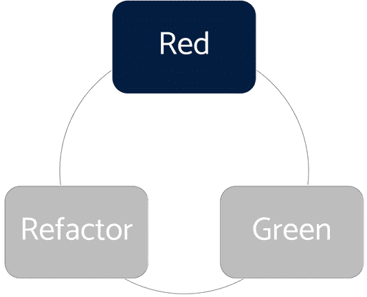
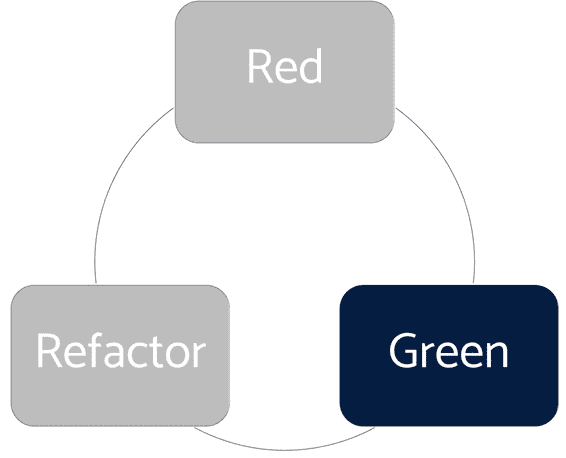
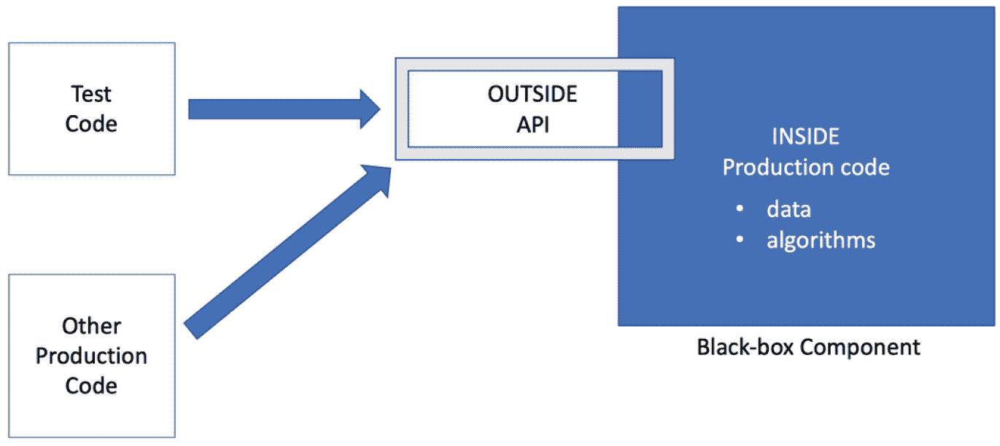
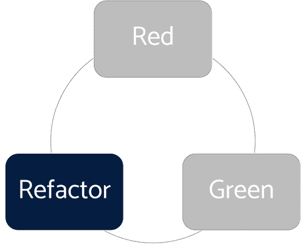
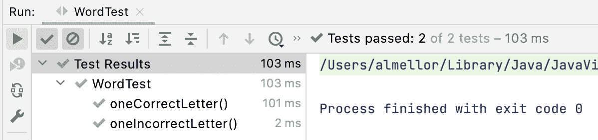

# 第六章：跟随 TDD 的节奏

我们已经看到单个单元测试如何帮助我们探索和捕捉关于代码的设计决策，并保持我们的代码无缺陷且易于使用，但这并不是它们能做的全部。TDD 有节奏可以帮助我们整个开发周期。通过遵循这些节奏，我们在每个步骤中都有一个下一步行动的指南。拥有这种技术结构，我们可以深入思考如何编写良好的代码，并捕捉结果，这非常有帮助。

上一章介绍了第一个节奏。在每个测试中，我们都有编写 Arrange、Act 和 Assert 部分的节奏。接下来，我们将对此进行一些详细的观察。我们将继续介绍一个更大的节奏，它指导我们在细化代码时进行操作，被称为**红、绿、重构**（**RGR**）循环。它们共同帮助我们编写易于集成到更广泛应用程序中的代码，并使其由简洁、易于理解的代码组成。应用这两个节奏确保我们以速度交付高质量的代码。它为我们提供了在每次编码会话期间要达到的几个小里程碑。这非常有动力，因为我们能感受到朝着构建应用程序目标稳步前进的感觉。

在本章中，我们将介绍以下主题：

+   跟随 RGR 循环

+   为 Wordz 编写下一个测试

# 技术要求

本章的最终代码可以在[`github.com/PacktPublishing/Test-Driven-Development-with-Java/tree/main/chapter06`](https://github.com/PacktPublishing/Test-Driven-Development-with-Java/tree/main/chapter06)找到。建议您亲自输入代码并思考我们在进行过程中将做出的所有决策，以跟随练习。

# 跟随 RGR 循环

在上一章中，我们看到了如何将单个单元测试分为三个部分，即 Arrange、Act 和 Assert 部分。这形成了一个简单的工作节奏，引导我们编写每个测试。它迫使我们设计代码的用法——代码的外部。如果我们把对象看作是一个封装边界，那么讨论边界内外的内容是有意义的。公共方法构成了我们对象的表面。Arrange、Act 和 Assert 节奏帮助我们设计这些内容。

我们在这里使用“节奏”这个词，几乎是在音乐意义上的。它是一个恒定、重复的主题，将我们的工作统一起来。在编写测试、编写代码、改进代码以及决定下一个要编写的测试方面，都有一个常规的工作流程。每个测试和代码片段都将不同，但工作节奏是相同的，就像一首不断变化的歌中的稳定节拍一样。

一旦我们编写了测试，我们就转向创建对象内部的代码 – 私有字段和方法。为此，我们利用另一种节奏，称为 RGR。这是一个三步过程，帮助我们建立对测试的信心，创建代码的基本实现，然后安全地对其进行改进。

在本节中，我们将学习在每个三个阶段中需要完成哪些工作。

## 从红色阶段开始



图 6.1 – 红色阶段

我们总是从第一个阶段开始，称为红色阶段。这个阶段的目标是使用 Arrange, Act 和 Assert 模板让我们的测试启动并运行，准备好测试我们接下来要编写的代码。这个阶段最重要的部分是确保测试不通过。我们称之为失败测试，或红色测试，因为大多数图形测试工具使用这种颜色来表示失败测试。

这相当反直觉，不是吗？我们通常在开发过程中力求第一次就能让事情运作正确。然而，我们希望在这个阶段测试失败，以增强我们对它正确工作的信心。如果测试在这个时候通过，那就令人担忧。为什么它会通过？我们知道我们还没有编写我们正在测试的任何代码。如果测试现在通过，这意味着我们可能不需要编写任何新代码，或者我们在测试中犯了错误。*进一步阅读*部分有一个链接，列出了八个可能导致测试无法正确运行的原因。

这里最常见的错误是断言错误。在继续之前，识别错误并修复它。我们必须有那个红色测试，这样我们才能看到它从失败变为通过，因为我们正确地添加了代码。

## 保持简单 – 转向绿色



图 6.2 – 绿色阶段

一旦我们有了失败的测试，我们就可以自由地编写使其通过的代码。我们称之为生产代码 – 将成为我们生产系统一部分的代码。我们将生产代码视为一个 *黑盒* 组件。想想电子中的集成电路，或者可能是一些机械密封单元。组件有内部和外部。内部是我们编写生产代码的地方。这是我们隐藏实现中的数据和算法的地方。我们可以使用我们选择的任何方法 – 面向对象、函数式、声明式或过程式。任何我们喜欢的方法。外部是 **应用程序编程接口** (**API**)。这是我们用来连接我们的组件并使用它来构建更大软件的部分。如果我们选择面向对象的方法，这个 API 将由对象上的公共方法组成。在 TDD 中，我们首先连接的是我们的测试，这让我们能够快速得到关于连接使用难易程度的反馈。

下面的图示显示了不同的部分 – 内部、外部、测试代码以及我们组件的其他用户：



图 6.3 – 黑盒组件的内部和外部

由于我们的实现是封装的，因此我们可以随着了解更多信息而改变主意，而不会破坏测试。

这个阶段有两个指导原则：

+   **使用最简单的代码即可工作**：使用最简单的代码非常重要。可能会有一种诱惑，想要使用过度设计的算法，或者可能仅仅为了使用它而使用最新的语言特性。抵制这种诱惑。在这个阶段，我们的目标是让测试通过，没有更多。

+   **不要过度思考实现细节**：我们不需要过度思考这一点。我们不需要在第一次尝试时就写出完美的代码。我们可以写一行代码，一个方法，几个方法，或者完全新的类。我们将在下一步改进这段代码。只需记住让测试通过，不要超出这个测试在功能上的覆盖范围。

## 重构以编写干净的代码



图 6.4 – 重构阶段

这是进入软件工程模式的阶段。我们有一些工作简单且通过测试的代码。现在是时候将其精炼成干净的代码——这意味着代码将易于阅读。有了通过测试提供的信心，我们可以自由地应用任何有效的重构技术到我们的代码中。在这个阶段，我们可以使用的重构技术示例包括以下：

+   提取一个方法以删除重复的代码

+   重命名一个方法以更好地表达其功能

+   重命名一个变量以更好地表达其内容

+   将长方法拆分成几个更小的方法

+   提取一个更小的类

+   将长参数列表组合成它自己的类

所有这些技术都有一个目标：使我们的代码更容易理解。这将使它更容易维护。记住在整个这些变化中保持绿色测试通过。到这个阶段结束时，我们将有一个单元测试覆盖了我们设计得在未来更容易工作的生产代码的一部分。这是一个很好的地方。

现在，我们已经熟悉了 RGR 循环的每个阶段应该做什么，让我们将这一点应用到我们的 Wordz 应用程序中。

# 为 Wordz 编写下一个测试

那么，我们接下来应该编写什么样的测试呢？应该采取一个有用且足够小的步骤，这样我们才不会陷入编写超出测试支持范围的陷阱？在本节中，我们将继续使用 TDD 构建 Wordz 应用程序的评分系统。我们将讨论在每个步骤中我们如何选择前进。

对于下一个测试，一个好的选择是保守行事，只向前迈出很小的一步。我们将添加一个测试来检查单个正确的字母。这将驱使我们编写第一段真正的应用程序逻辑：

1.  让我们从红色开始。编写一个针对单个正确字母的失败测试：

    ```java
    @Test
    ```

    ```java
    public void oneCorrectLetter() {
    ```

    ```java
       var word = new Word("A");
    ```

    ```java
       var score = word.guess("A");
    ```

    ```java
       assertThat(score.letter(0))
    ```

    ```java
          .isEqualTo(Letter.CORRECT);
    ```

    ```java
    }
    ```

这个测试故意与之前的测试相似。不同之处在于它测试的是字母是否正确，而不是不正确。我们故意使用了同一个单词——一个单独的字母，`"A"`。在编写测试时这一点很重要——使用有助于讲述我们正在测试的内容及其原因的测试数据。这里的情节是，同一个单词的不同猜测将导致不同的分数——这显然是我们正在解决的问题的关键。我们的两个测试案例完全覆盖了任何单字母词猜测的所有可能结果。

使用我们的 IDE 自动完成功能，我们很快对`class Word`进行了修改。

1.  现在，让我们通过添加使测试通过的生产代码来转向绿色：

    ```java
    public class Word {
    ```

    ```java
        private final String word;
    ```

    ```java
        public Word(String correctWord) {
    ```

    ```java
            this.word = correctWord;
    ```

    ```java
        }
    ```

    ```java
        public Score guess(String attempt) {
    ```

    ```java
            var score = new Score(word);
    ```

    ```java
            score.assess( 0, attempt );
    ```

    ```java
            return score;
    ```

    ```java
        }
    ```

    ```java
    }
    ```

这里的目标是让新的测试通过，同时保持现有的测试通过。我们不希望破坏任何现有的代码。我们添加了一个名为`word`的字段，用于存储我们应猜测的单词。我们添加了一个公共构造函数来初始化这个字段。我们在`guess()`方法中添加了代码来创建一个新的`Score`对象。我们决定在这个`Score`类中添加一个名为`assess()`的方法。这个方法负责评估我们的猜测应该得到多少分数。我们决定`assess()`应该有两个参数。第一个参数是我们希望评估分数的单词中字母的零基索引。第二个参数是我们对单词可能是什么的猜测。

我们使用 IDE 帮助我们编写`class Score`：

```java
public class Score {
    private final String correct;
    private Letter result = Letter.INCORRECT ;
    public Score(String correct) {
        this.correct = correct;
    }
    public Letter letter(int position) {
        return result;
    }
    public void assess(int position, String attempt) {
        if ( correct.charAt(position) == attempt.            charAt(position)){
            result = Letter.CORRECT;
        }
    }
}
```

为了覆盖`oneCorrectLetter()`测试所测试的新行为，我们添加了前面的代码。与之前`assess()`方法总是返回`Letter.INCORRECT`不同，新的测试迫使它转向一个新的方向。现在`assess()`方法必须能够在猜测的字母正确时返回正确的分数。

为了实现这一点，我们添加了一个名为`result`的字段来保存最新的分数，从`letter()`方法返回结果的代码，以及`assess()`方法中的代码来检查我们的猜测的第一个字母是否与我们的单词的第一个字母匹配。如果我们做对了，我们的两个测试现在都应该通过。

运行所有测试以查看我们的进展：



图 6.5 – 两个测试通过

这里有很多东西需要回顾。注意我们的两个测试都是通过的。通过运行到目前为止的所有测试，我们已经证明我们没有破坏任何东西。我们对代码所做的更改添加了新功能，而没有破坏任何现有功能。这是强大的。注意另一个明显的方面——我们知道我们的代码是有效的。我们不必等到手动测试阶段，也不必等到某个集成点，或者等到用户界面准备好。我们知道我们的代码现在有效。作为一个小细节，注意 0.103 秒的时间长度。两个测试在一十分之一秒内完成，比手动测试快得多。一点也不差。

在设计方面，我们已经前进了一步。我们已经超越了使用代码检测正确和错误猜测的硬编码`Letter.INCORRECT`结果。我们在`Score`类中添加了重要的设计概念`assess()`方法。这是非常重要的。我们的代码现在揭示了一个设计；`Score`对象将知道正确的`word`，并且能够使用`assess()`方法对猜测`attempt`进行评估。这里使用的术语形成了对我们要解决的问题的良好描述。我们想要评估一个猜测并返回一个单词得分。

现在测试通过了，我们可以继续前进——但 TDD 的一个重要部分是持续改进我们的代码，并朝着更好的设计努力，由测试来指导。我们现在进入了 RGR 周期的重构阶段。再次，TDD 将控制权交还给我们。我们想要重构吗？我们应该重构什么？为什么？现在做这个值得吗，还是我们可以推迟到以后的步骤？

让我们回顾一下代码，寻找**代码异味**。代码异味是表明实现可能需要改进的一个迹象。这个名称来源于食物开始变质时产生的气味。

代码异味之一是代码重复。单独来看，一点代码重复可能没问题。但它是一个早期警告，表明可能使用了过多的复制粘贴，我们没有更直接地捕捉到一个重要的概念。让我们回顾我们的代码以消除重复。我们还可以寻找其他两种常见的代码异味——不清晰的命名，以及如果将它们提取到自己的方法中会更容易阅读的代码块。显然，这是主观的，我们都会对要做什么有不同的看法。

定义代码异味

术语代码异味最初出现在 C2 维基上。阅读一下给出的代码异味示例是值得的。它有一个有用的定义，指出代码异味是需要审查的东西，但可能不一定需要改变：

[`wiki.c2.com/?CodeSmell`](https://wiki.c2.com/?CodeSmell).

让我们反思一下`assess()`方法内部。它似乎充满了太多的代码。让我们提取一个辅助方法来增加一些清晰度。如果我们觉得这个改动没有帮助，我们总是可以撤销它。

1.  让我们进行重构。为了清晰起见，提取一个`isCorrectLetter()`方法：

    ```java
    public void assess(int position, String attempt) {
    ```

    ```java
        if (isCorrectLetter(position, attempt)){
    ```

    ```java
            result = Letter.CORRECT;
    ```

    ```java
        }
    ```

    ```java
    }
    ```

    ```java
    private boolean isCorrectLetter(int position,
    ```

    ```java
                                    String attempt) {
    ```

    ```java
        return correct.charAt(position) ==
    ```

    ```java
               attempt.charAt(position);
    ```

    ```java
    }
    ```

再次，我们运行所有测试以证明这次重构没有破坏任何东西。测试通过了。在前面的代码中，我们将一个复杂的条件语句拆分成了它自己的私有方法。这样做的原因是为了在代码中引入一个方法名。这是一种有效的代码注释方式——以编译器帮助我们保持代码更新。它有助于`assess()`方法中的调用代码讲述一个更好的故事。现在的`if`语句几乎可以说成是“如果这是一个正确的字母”。这是一个强大的可读性辅助工具。

可读性发生在写作过程中，而不是阅读过程中

编程初学者常见的一个问题是“我如何提高阅读代码的能力？”

这是一个有效的问题，因为任何一行代码都将被人类程序员阅读得比它被编写时更多。可读性是在编写代码时赢得或失去的。任何一行代码都可以被编写成易于阅读或难以阅读。作为作者，我们有权选择。如果我们始终选择易于阅读而不是其他任何东西，其他人会发现我们的代码易于阅读。

写得不好的代码难以阅读。遗憾的是，编写这样的代码很容易。

在这个阶段，我还有两个区域想要重构。第一个是一个简单的提高测试可读性的方法。

让我们重构测试代码以提高其清晰度。我们将添加一个*自定义*的`assert`方法：

```java
@Test
public void oneCorrectLetter() {
    var word = new Word("A");
    var score = word.guess("A");
    assertScoreForLetter(score, 0, Letter.CORRECT);
}
private void assertScoreForLetter(Score score,
                  int position, Letter expected) {
    assertThat(score.letter(position))
          .isEqualTo(expected);
}
```

之前的代码已经将`assertThat()`断言移动到了它自己的私有方法中。我们称这个方法为`assertScoreForLetter()`，并给它一个描述所需信息的签名。这个改变提供了对测试正在做什么的更直接描述，同时减少了重复的代码。它还保护我们免受断言实现变化的影响。这似乎是朝着更全面的断言迈出的一步，一旦我们支持更多字母的猜测，我们就会需要这种断言。再一次，我们不是在源代码中添加注释，而是使用方法名来捕捉`assertThat()`代码的意图。编写*AssertJ 自定义匹配器*是另一种实现方式。

我们可能想要做的下一个重构可能有点更具争议性，因为它是一个设计变更。让我们进行重构，讨论它，然后如果我们不喜欢它，可能重新调整代码。这样就可以节省数小时的时间，去思考这个变化会是什么样子。

1.  让我们改变一下在`assess()`方法中指定要检查的字母位置的方式：

    ```java
    public class Score {
    ```

    ```java
        private final String correct;
    ```

    ```java
        private Letter result = Letter.INCORRECT ;
    ```

    ```java
        private int position;
    ```

    ```java
        public Score(String correct) {
    ```

    ```java
            this.correct = correct;
    ```

    ```java
        }
    ```

    ```java
        public Letter letter(int position) {
    ```

    ```java
            return result;
    ```

    ```java
        }
    ```

    ```java
        public void assess(String attempt) {
    ```

    ```java
            if (isCorrectLetter(attempt)){
    ```

    ```java
                result = Letter.CORRECT;
    ```

    ```java
            }
    ```

    ```java
        }
    ```

    ```java
        private boolean isCorrectLetter(String attempt) {
    ```

    ```java
            return correct.charAt(position) == attempt.        charAt(position);
    ```

    ```java
        }
    ```

    ```java
    }
    ```

我们已经从`assess()`方法中移除了`position`参数，并将其转换为名为`position`的字段。我们的意图是简化`assess()`方法的用法。它不再需要明确指出正在评估哪个位置。这使得代码更容易调用。我们刚刚添加的代码只会在位置为零的情况下工作。这是可以的，因为在这个阶段，我们的测试只需要这一点。我们将在以后使这段代码适用于非零值。

这个改变之所以有争议，是因为它要求我们更改测试代码以反映方法签名中的变化。我已经准备好接受这一点，因为我可以使用我的 IDE 自动重构支持来安全地完成这项工作。这也引入了一个风险：在我们调用`isCorrectLetter()`之前，我们必须确保位置被设置为正确的值。我们将看看这会如何发展。这可能使代码更难以理解，在这种情况下，简化的`assess()`方法可能不值得。如果我们发现这种情况，我们可以改变我们的方法。

现在我们已经到达了一个点，代码可以处理任何单个字母的单词。接下来我们应该尝试什么？看起来我们应该继续到两个字母的单词，看看这会如何改变我们的测试和逻辑。

### 使用两个字母组合推进设计

我们可以继续添加测试，目的是让代码能够处理两个字母的组合。在代码能够处理单个字母之后，这是一个明显的下一步。为了做到这一点，我们需要在代码中引入一个新概念：一个字母可以存在于单词中，但不在我们猜测的位置：

1.  让我们从编写一个测试开始，测试第二个字母是否在错误的位置：

    ```java
    @Test
    ```

    ```java
    void secondLetterWrongPosition() {
    ```

    ```java
        var word = new Word("AR");
    ```

    ```java
        var score = word.guess("ZA");
    ```

    ```java
        assertScoreForLetter(score, 1,
    ```

    ```java
                             Letter.PART_CORRECT);
    ```

    ```java
    }
    ```

让我们更改`assess()`方法内部的代码，使其通过并保持现有测试通过。

1.  让我们添加初始代码来检查我们猜测中的所有字母：

    ```java
    public void assess(String attempt) {
    ```

    ```java
        for (char current: attempt.toCharArray()) {
    ```

    ```java
            if (isCorrectLetter(current)) {
    ```

    ```java
                result = Letter.CORRECT;
    ```

    ```java
            }
    ```

    ```java
        }
    ```

    ```java
    }
    ```

    ```java
    private boolean isCorrectLetter(char currentLetter) {
    ```

    ```java
        return correct.charAt(position) == currentLetter;
    ```

    ```java
    }
    ```

这里主要的改变是评估`attempt`中的所有字母，而不是假设它只有一个字母。当然，这就是这次测试的目的——消除这种行为。通过选择将`attempt`字符串转换为`char`数组，代码看起来读起来相当顺畅。这个简单的算法遍历每个`char`，使用`current`变量来表示要评估的当前字母。这要求对`isCorrectLetter()`方法进行重构，以便它能够接受并处理`char`输入——好吧，或者将`char`转换为`String`，这看起来很丑陋。

单个字母行为的原始测试仍然通过，这是必须的。我们知道我们循环内部的逻辑不可能正确——我们只是在覆盖`result`字段，它最多只能存储一个字母的结果。我们需要改进这个逻辑，但我们不会在添加测试之前这么做。这种工作方式被称为**三角测量法**——我们通过添加更具体的测试来使代码更通用。对于我们的下一步，我们将添加代码来检测我们的尝试字母是否在单词中的其他位置出现。

1.  让我们添加代码来检测当正确字母在错误位置时：

    ```java
    public void assess(String attempt) {
    ```

    ```java
        for (char current: attempt.toCharArray()) {
    ```

    ```java
            if (isCorrectLetter(current)) {
    ```

    ```java
                result = Letter.CORRECT;
    ```

    ```java
            } else if (occursInWord(current)) {
    ```

    ```java
                result = Letter.PART_CORRECT;
    ```

    ```java
            }
    ```

    ```java
        }
    ```

    ```java
    }
    ```

    ```java
        private boolean occursInWord(char current) {
    ```

    ```java
            return
    ```

    ```java
              correct.contains(String.valueOf(current));
    ```

    ```java
        }
    ```

我们添加了对一个新私有方法`occursInWord()`的调用，如果当前字母在任何位置出现在单词中，它将返回`true`。我们已经确定当前字母不在正确的位置。这应该为我们提供一个关于正确字母不在正确位置的清晰结果。

这段代码使所有三个测试都通过。这立即引起了怀疑，因为不应该发生这种情况。我们已知我们的逻辑会覆盖单个`result`字段，这意味着许多组合将失败。发生的事情是我们的最新测试相当薄弱。我们可以回过头来加强那个测试，添加一个额外的断言。或者，我们可以保持它不变，并编写另一个测试。这种困境在开发中很常见，通常不值得花太多时间去思考它们。无论哪种方式都会推动我们前进。

让我们添加另一个测试，以完全锻炼第二个字母位置错误的行为。

1.  添加一个新的测试，以锻炼所有三种评分可能性：

    ```java
    @Test
    ```

    ```java
    void allScoreCombinations() {
    ```

    ```java
        var word = new Word("ARI");
    ```

    ```java
        var score = word.guess("ZAI");
    ```

    ```java
        assertScoreForLetter(score, 0, Letter.INCORRECT);
    ```

    ```java
        assertScoreForLetter(score, 1,
    ```

    ```java
                             Letter.PART_CORRECT);
    ```

    ```java
        assertScoreForLetter(score, 2, Letter.CORRECT);
    ```

    ```java
    }
    ```

如预期的那样，这个测试失败了。原因在检查生产代码时很明显。是因为我们一直在同一个单值字段中存储结果。现在我们有了针对这个问题的失败测试，我们可以纠正评分逻辑。

1.  为每个字母位置单独存储结果添加一个`List`：

    ```java
    public class Score {
    ```

    ```java
        private final String correct;
    ```

    ```java
        private final List<Letter> results =
    ```

    ```java
                                 new ArrayList<>();
    ```

    ```java
        private int position;
    ```

    ```java
        public Score(String correct) {
    ```

    ```java
            this.correct = correct;
    ```

    ```java
        }
    ```

    ```java
        public Letter letter(int position) {
    ```

    ```java
            return results.get(position);
    ```

    ```java
        }
    ```

    ```java
        public void assess(String attempt) {
    ```

    ```java
            for (char current: attempt.toCharArray()) {
    ```

    ```java
                if (isCorrectLetter(current)) {
    ```

    ```java
                    results.add(Letter.CORRECT);
    ```

    ```java
                } else if (occursInWord(current)) {
    ```

    ```java
    results.add(Letter.PART_CORRECT);
    ```

    ```java
                } else {
    ```

    ```java
                    results.add(Letter.INCORRECT);
    ```

    ```java
                }
    ```

    ```java
                position++;
    ```

    ```java
            }
    ```

    ```java
        }
    ```

    ```java
        private boolean occursInWord(char current) {
    ```

    ```java
            return
    ```

    ```java
             correct.contains(String.valueOf(current));
    ```

    ```java
        }
    ```

    ```java
        private boolean isCorrectLetter(char
    ```

    ```java
          currentLetter) {
    ```

    ```java
            return correct.charAt(position) ==
    ```

    ```java
                     currentLetter;
    ```

    ```java
        }
    ```

    ```java
    }
    ```

这需要尝试几次才能正确完成，因为我们刚刚添加的测试中出现了失败。前面的最终结果通过了所有四个测试，证明它能够正确地评分三字母词的所有组合。主要的变化是将单值的`result`字段替换为`results`的`ArrayList`，并将`letter(position)`实现方法更改为使用这个新的结果集合。运行这个更改导致了一个失败，因为代码不能再检测到错误的字母。之前，这已经被`result`字段的默认值处理了。现在，我们必须为每个字母显式地做这件事。然后我们需要在循环中更新位置，以跟踪我们正在评估的字母位置。

我们添加了一个测试，看到它变红并失败，然后添加了代码使测试变绿并通过，所以现在是时候重构了。测试和生产代码中都有一些看起来不太对劲的地方。

在生产代码`class Score`中，`assess()`方法的循环体看起来很笨拙。它有一个逻辑和一系列`if`-`else`-`if`块的长的循环体。感觉代码可以更清晰。我们可以将循环体提取到一个方法中。方法名然后给我们一个地方来描述每个事物正在发生什么。循环然后变得更短，更容易理解。我们还可以用更简单的结构替换`if`-`else`-`if`层。

1.  让我们将循环体内的逻辑提取到一个`scoreFor()`方法中：

    ```java
    public void assess(String attempt) {
    ```

    ```java
        for (char current: attempt.toCharArray()) {
    ```

    ```java
            results.add( scoreFor(current) );
    ```

    ```java
            position++;
    ```

    ```java
        }
    ```

    ```java
    }
    ```

    ```java
    private Letter scoreFor(char current) {
    ```

    ```java
        if (isCorrectLetter(current)) {
    ```

    ```java
            return Letter.CORRECT;
    ```

    ```java
        }
    ```

    ```java
        if (occursInWord(current)) {
    ```

    ```java
            return Letter.PART_CORRECT;
    ```

    ```java
        }
    ```

    ```java
        return Letter.INCORRECT;
    ```

    ```java
    }
    ```

这读起来更清晰。`scoreFor()`方法的主体现在是对评分每个字母的规则的简洁描述。我们用更简单的`if`-`return`结构替换了`if`-`else`-`if`结构。我们计算出得分，然后立即退出方法。

下一个任务是清理测试代码。在 TDD 中，测试代码与生产代码具有相同的优先级。它是系统文档的一部分。它需要与生产代码一起维护和扩展。我们对待测试代码的可读性与对待生产代码一样重要。

测试代码中的代码异味主要集中在断言上。有两件事可以改进。代码中有一个明显的重复，我们可以消除。还有一个关于一个测试中应该有多少断言的问题。

1.  让我们通过提取一个方法来删除重复的断言代码：

    ```java
    @Test
    ```

    ```java
    void allScoreCombinations() {
    ```

    ```java
        var word = new Word("ARI");
    ```

    ```java
        var score = word.guess("ZAI");
    ```

    ```java
        assertScoreForGuess(score, INCORRECT,
    ```

    ```java
                                   PART_CORRECT,
    ```

    ```java
                                   CORRECT);
    ```

    ```java
    }
    ```

    ```java
    private void assertScoreForGuess(Score score, Letter…
    ```

    ```java
        for (int position=0;
    ```

    ```java
                 position < expectedScores.length;
    ```

    ```java
                 position++){
    ```

    ```java
            Letter expected = expectedScores[position];
    ```

    ```java
            assertThat(score.letter(position))
    ```

    ```java
                .isEqualTo(expected);
    ```

    ```java
        }
    ```

    ```java
    }
    ```

通过提取`assertScoreForGuess()`方法，我们创建了一种检查可变数量字母分数的方法。这消除了我们之前复制的`assert`行，并提高了抽象级别。由于我们现在用`INCORRECT, PART_CORRECT, CORRECT`的顺序来描述测试，测试代码的阅读性也变得更加清晰。通过向这些`enum`添加静态导入，语法杂乱也得到了有益的减少。

现在可以手动修改早期的测试，以利用这个新的断言辅助工具。这允许我们将原始的`assertScoreForLetter()`方法内联，因为它不再增加价值。

1.  现在，让我们看看重构后的最终测试集：

    ```java
    package com.wordz.domain;
    ```

    ```java
    import org.junit.jupiter.api.Test;
    ```

    ```java
    import static com.wordz.domain.Letter.*;
    ```

    ```java
    import static org.assertj.core.api.Assertions.assertThat;
    ```

    ```java
    public class WordTest {
    ```

    ```java
        @Test
    ```

    ```java
        public void oneIncorrectLetter() {
    ```

    ```java
            var word = new Word("A");
    ```

    ```java
            var score = word.guess("Z");
    ```

    ```java
            assertScoreForGuess(score, INCORRECT);
    ```

    ```java
        }
    ```

    ```java
        @Test
    ```

    ```java
        public void oneCorrectLetter() {
    ```

    ```java
            var word = new Word("A");
    ```

    ```java
            var score = word.guess("A");
    ```

    ```java
            assertScoreForGuess(score, CORRECT);
    ```

    ```java
        }
    ```

    ```java
        @Test
    ```

    ```java
        public void secondLetterWrongPosition() {
    ```

    ```java
            var word = new Word("AR");
    ```

    ```java
            var score = word.guess("ZA");
    ```

    ```java
            assertScoreForGuess(score,  INCORRECT,
    ```

    ```java
                                        PART_CORRECT);
    ```

    ```java
        }
    ```

    ```java
        @Test
    ```

    ```java
        public void allScoreCombinations() {
    ```

    ```java
            var word = new Word("ARI");
    ```

    ```java
            var score = word.guess("ZAI");
    ```

    ```java
            assertScoreForGuess(score,  INCORRECT,
    ```

    ```java
                                        PART_CORRECT,
    ```

    ```java
                                        CORRECT);
    ```

    ```java
        }
    ```

    ```java
        private void assertScoreForGuess(Score score,
    ```

    ```java
            Letter... expectedScores) {
    ```

    ```java
            for (int position = 0;
    ```

    ```java
                  position < expectedScores.length;
    ```

    ```java
                  position++) {
    ```

    ```java
                Letter expected =
    ```

    ```java
                        expectedScores[position];
    ```

    ```java
                assertThat(score.letter(position))
    ```

    ```java
                        .isEqualTo(expected);
    ```

    ```java
            }
    ```

    ```java
        }
    ```

    ```java
    }
    ```

这看起来是一套全面的测试用例。每一行生产代码都是通过添加新的测试来探索行为的新方面而产生的直接结果。测试代码看起来易于阅读，生产代码也看起来实现清晰，调用简单。测试形成了一个可执行的评分规则规范，用于猜测单词。

这已经实现了我们在本次编码会话开始时设定的所有目标。我们使用 TDD 扩展了`Score`类的功能。我们遵循 RGR 周期，确保我们的测试代码和生产代码遵循良好的工程实践。我们有经过单元测试验证的健壮代码，以及一个使代码易于从我们的更广泛应用程序中调用的设计。

# 摘要

在本章中，我们已经将 RGR 周期应用于我们的代码。我们看到了如何将工作分解成单独的任务，这导致我们对测试的信心增强，快速通往简单的生产代码，以及减少改进代码可维护性所需的时间。我们检查了从生产代码和测试代码中移除代码异味。在本章的工作中，我们使用了帮助我们前进并决定下一步应该编写哪些测试的想法。本章的技术使我们能够编写多个测试，并逐步驱除生产代码中的详细逻辑。

在下一章中，我们将学习一些被称为 SOLID 原则的面向对象设计思想，使我们能够使用 TDD 进一步扩展我们的应用程序。

# 问题与答案

1.  TDD 的两个关键节奏是什么？

安排、行动、断言和 RGR。第一个节奏帮助我们设计生产代码的接口时编写测试的主体。第二个节奏帮助我们创建并完善该生产代码的实现。

1.  我们如何在编写代码之前编写测试？

我们不是在考虑如何实现某些代码，而是在考虑如何调用这些代码。我们通过单元测试捕捉这些设计决策。

1.  测试应该是废弃的代码吗？

No. 在 TDD 中，单元测试与生产代码具有同等的重要性。它们以同样的细心编写，并存储在相同的代码仓库中。唯一的区别是测试代码本身将不会出现在交付的可执行文件中。

1.  每次测试通过后，我们都需要重构吗？

No. 利用这段时间作为决定需要哪些重构的机会。这适用于生产代码和测试代码。有时，可能不需要任何重构，我们就继续前进。其他时候，我们可能会感觉到更大的改变会更有益。我们可能会选择将这个更大的改变推迟到我们有了更多代码之后再进行。

# 进一步阅读

+   *在红色上获得绿色*

杰夫·兰格（Jeff Langr）的文章，描述了测试可以通过错误的原因通过八种不同的方式。如果我们意识到这些问题，我们就可以在工作中避免它们。

[`medium.com/pragmatic-programmers/3-5-getting-green-on-red-d189240b1c87`](https://medium.com/pragmatic-programmers/3-5-getting-green-on-red-d189240b1c87)

+   *重构：现有代码的设计改进*，马丁·福勒（ISBN 978-0134757599）

重构代码的权威指南。本书描述了代码的逐步转换，这些转换保留了其行为但提高了清晰度。有趣的是，大多数转换都是成对出现的，例如被称为*提取方法*和*内联方法*的技术对。这反映了所涉及的权衡。

+   AssertJ 自定义匹配器的文档

本章简要介绍了*AssertJ 自定义匹配器*。这些是非常有用的创建可重用自定义断言的方法。这些断言类本身是可单元测试的，并且可以使用测试驱动开发（TDD）的测试先行方法编写。仅凭这一点，它们就优于添加一个私有方法来处理自定义断言。

以下链接提供了 AssertJ 在 GitHub 上的分发提供的许多示例。

[`github.com/assertj/assertj-examples/tree/main/assertions-examples/src/test/java/org/assertj/examples/custom`](https://github.com/assertj/assertj-examples/tree/main/assertions-examples/src/test/java/org/assertj/examples/custom)
