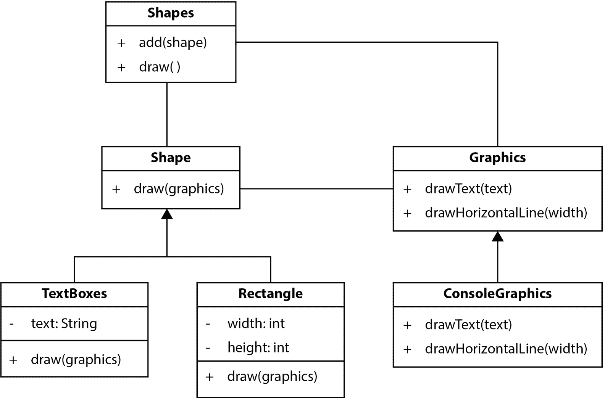
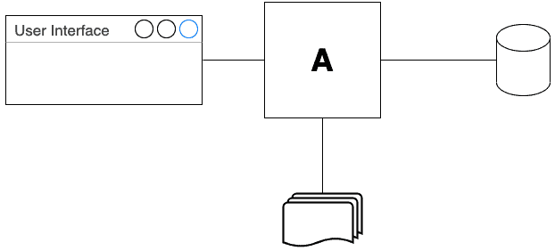
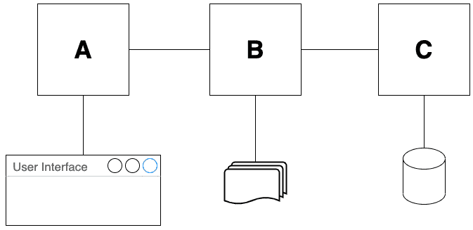
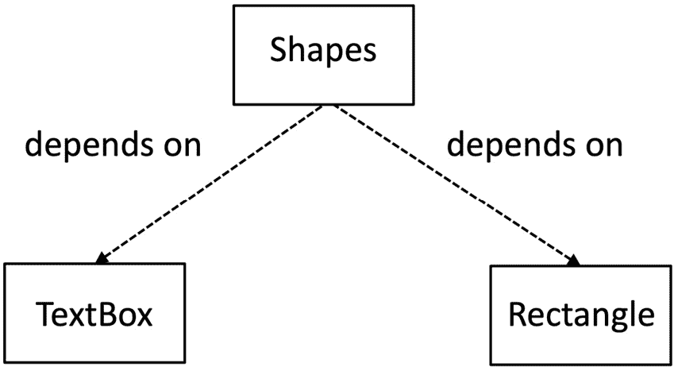
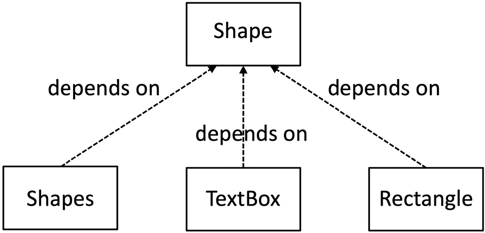

# 7

# 驱动设计 – TDD 和 SOLID

到目前为止，我们已经创建了一些基本的单元测试，这些测试驱动了几个类的简单设计。我们体验了**测试驱动开发**（**TDD**）如何使设计选择的决定变得核心。为了构建更大的应用程序，我们需要能够处理更复杂的设计。为此，我们将应用一些推荐的评估方法，以确定哪种设计比另一种设计更可取。

SOLID 原则是五个设计指南，它们引导设计变得更加灵活和模块化。单词*SOLID*是一个缩写词，其中每个字母代表一个以该字母开头的五个原则之一。这些原则在它们被这个名称所知之前就已经存在。在我的经验中，它们已被证明是有帮助的，了解每个原则带来的好处以及我们如何将它们应用到我们的代码中是值得的。为此，我们将在本章中使用一个运行代码示例。这是一个简单的程序，它使用简单的**美国信息交换标准代码**（**ASCII**）艺术在控制台上绘制各种形状。

在我们开始之前，让我们考虑学习这五个原则的最佳**顺序**。缩写词*SOLID*容易说，但并不是学习原则的最简单方式。一些原则建立在其他原则之上。经验表明，有些原则比其他原则使用得更多，尤其是在进行 TDD 时。因此，我们将按照*SDLOI*的顺序回顾这些原则。当然，它听起来并不那么好，正如您所同意的，但它构成了更好的学习顺序。

最初，SOLID 原则被构想为适用于面向对象编程（**OOP**）中类的模式，但它们的用途更广泛。它们同样适用于类中的单个方法以及类本身。它们也适用于微服务互连的设计以及函数式编程中的函数设计。在本章中，我们将看到在类级别和方法级别应用示例。

在本章中，我们将涵盖以下主要内容：

+   测试指南–我们驱动设计

+   **单一职责原则**（**SRP**）–简单的构建块

+   **依赖倒置原则**（**DIP**）–隐藏无关细节

+   **里氏替换原则**（**LSP**）–可替换的对象

+   **开放封闭原则**（**OCP**）–可扩展的设计

+   **接口隔离原则**（**ISP**）–有效的接口

# 技术要求

本章的代码可以在[`github.com/PacktPublishing/Test-Driven-Development-with-Java/tree/main/chapter07`](https://github.com/PacktPublishing/Test-Driven-Development-with-Java/tree/main/chapter07)找到。提供了一个运行示例代码，该代码使用所有五个 SOLID 原则绘制形状。

# 测试指南 – 我们驱动设计

在*第五章*，“编写我们的第一个测试”，我们编写了第一个测试。为了做到这一点，我们经历了一系列的设计决策。让我们回顾一下那个初始的测试代码，并列出我们不得不做出的所有设计决策，如下：

```java
@Test
public void oneIncorrectLetter() {
    var word = new Word("A");
    var score = word.guess("Z");
    assertThat( score.letter(0) ).isEqualTo(Letter.INCORRECT);
}
```

我们决定以下事项：

+   要测试什么

+   如何命名测试

+   如何命名待测试的方法

+   应将该方法放在哪个类上

+   该方法的签名

+   类的构造函数签名

+   哪些其他对象应该协作

+   那次协作中涉及的方法签名

+   该方法输出的形式

+   如何访问该输出并断言其已成功

这些都是我们人类大脑必须做出的设计决策。TDD 在设计和决定代码实现方式时让我们非常亲自动手。说实话，我很高兴。设计是有回报的，TDD 提供了有助的脚手架而不是规定性的方法。TDD 充当指南，提醒我们尽早做出这些设计决策。它还提供了一种将这些决策作为测试代码进行记录的方法。不多也不少。

在我们做出这些决策时，使用诸如结对编程或团队编程（也称为集体编程）等技术可能会有所帮助——然后，我们将更多的经验和想法添加到我们的解决方案中。单独工作，我们只能根据自己的经验做出最好的决定。

关键点在于，TDD 不会也不会为我们做出这些决策。我们必须自己做出。因此，有一些指导方针来引导我们做出更好的设计是有用的。一套被称为**SOLID 原则**的五个设计原则是有帮助的。SOLID 是以下五个原则的缩写：

+   SRP

+   OCP

+   LSP

+   ISP

+   DIP

在接下来的章节中，我们将学习这些原则是什么以及它们如何帮助我们编写良好设计的代码和测试。我们将从 SRP 开始，这是任何程序设计风格的基础性原则。

# SRP – 简单的构建块

在本节中，我们将检查第一个原则，即 SRP。在整个章节中，我们将使用一个单一的代码示例。这将阐明每个原则是如何应用于**面向对象**（**OO**）设计的。我们将查看一个经典的 OO 设计示例：绘制形状。以下图是**统一建模语言**（**UML**）的设计概览，描述了章节中展示的代码：



图 7.1 – 形状代码的 UML 图

此图显示了 GitHub 文件夹中本章可用的 Java 代码概览。我们将使用代码的特定部分来展示每个 SOLID 原则是如何被用来创建这个设计的。

UML 图

UML（统一建模语言）是由 Grady Booch、Ivar Jacobson 和 James Rumbaugh 在 1995 年创建的。UML 是一种在高级别可视化面向对象设计的方法。前面的图是 UML 类图。UML 还提供了许多其他有用的图表。您可以在[`www.packtpub.com/product/uml-2-0-in-action-a-project-based-tutorial/9781904811558`](https://www.packtpub.com/product/uml-2-0-in-action-a-project-based-tutorial/9781904811558)了解更多信息。

SRP 引导我们将代码分解成封装我们解决方案单一方面的片段。这可能是一种技术方面的本质——例如读取数据库表——或者可能是一种业务规则。无论如何，我们将不同的方面拆分到不同的代码片段中。每个代码片段只负责一个细节，这就是*SRP*这个名字的由来。另一种看待方式是，一个代码片段应该只有一个改变的理由。让我们在以下章节中探讨为什么这是一个优势。

## 过多的职责使代码更难处理

常见的编程错误是将过多的职责组合到一个代码块中。如果我们有一个可以生成**超文本标记语言**（**HTML**）、执行业务规则和从数据库表中获取数据的类，那么这个类将有三个改变的理由。任何对这些区域之一的更改都需要时，我们都会冒着做出破坏其他两个方面的代码更改的风险。这个术语的技术名称是代码**高度耦合**。这导致一个区域的更改会波及到其他区域。

我们可以在以下图中将这一点可视化为代码块**A**：



图 7.2 – 单个组件：多个改变的理由

块**A**处理三件事，因此对其中任何一项的更改都意味着对**A**的更改。为了改进这一点，我们应用 SRP（单一职责原则）并将负责创建 HTML、应用业务规则和访问数据库的代码分离出来。这三个代码块——**A**、**B**和**C**——现在只有一个改变的理由。更改任何单个代码块都不应该导致对其他块的连锁反应。

我们可以在以下图中可视化这一点：



图 7.3 – 多个组件：一个改变的理由

每个代码块只处理一件事，并且只有一个改变的理由。我们可以看到 SRP（单一职责原则）有助于限制未来代码更改的范围。它还使得在大型代码库中查找代码变得更加容易，因为它是逻辑上组织的。

应用 SRP（单一职责原则）带来其他好处，如下所示：

+   代码重用能力

+   简化未来的维护

## 代码重用能力

代码的重用一直是软件工程的目标。从头开始创建软件需要时间，花费金钱，并阻止软件工程师做其他事情。如果我们创建了一些通用的东西，我们尽可能再次使用它是合理的。当我们创建了大型、特定应用的软件时，这种障碍就出现了。它们高度专业化的事实意味着它们只能在原始环境中使用。

通过创建更小、更通用的软件组件，我们将在不同的环境中再次使用它们。组件旨在完成的范围越小，我们越有可能在不修改的情况下重用它。如果我们有一个只做一件事的小函数或类，那么在代码库中重用它就变得容易了。它甚至可能成为框架或库的一部分，我们可以在多个项目中重用它。

SRP 并不能保证代码可重用，但它旨在减少任何代码片段的作用范围。将代码视为一系列构建块的方式，其中每个构建块都完成整体任务的一部分，更有可能产生可重用的组件。

## 简化的未来维护

当我们编写代码时，我们意识到我们不仅仅是在解决当前的问题，而是在编写可能在未来被重新访问的代码。这可能是团队中的其他人或我们自己。我们希望使未来的工作尽可能简单。为了实现这一点，我们需要保持代码的良好工程化——使其安全且易于以后使用。

重复的代码是维护问题——它使未来的代码更改复杂化。如果我们复制粘贴一段代码三次，比如说，当时我们很清楚我们在做什么。我们有一个需要发生三次的概念，所以我们粘贴了三次。但当再次阅读代码时，那种思考过程已经丢失了。它只是看起来像三段不相关的代码。*我们通过复制粘贴丢失了工程信息*。我们需要逆向工程那段代码，以找出需要更改的三个地方。

## 反例 – 违反 SRP 的形状代码

为了看到应用 SRP 的价值，让我们考虑一个没有使用它的代码片段。以下代码片段有一个形状列表，当调用 `draw()` 方法时，所有形状都会被绘制：

```java
public class Shapes {
    private final List<Shape> allShapes = new ArrayList<>();
    public void add(Shape s) {
        allShapes.add(s);
    }
    public void draw(Graphics g) {
        for (Shape s : allShapes) {
            switch (s.getType()) {
                case "textbox":
                    var t = (TextBox) s;
g.drawText(t.getText());
                    break;
                case "rectangle":
                    var r = (Rectangle) s;
                    for (int row = 0;
                          row < r.getHeight();
                          row++) {
                        g.drawLine(0, r.getWidth());
                    }
            }
        }
    }
}
```

我们可以看到，这段代码有四个职责，如下所示：

+   使用 `add()` 方法管理形状列表

+   使用 `draw()` 方法绘制列表中的所有形状

+   在 `switch` 语句中知道每种形状的类型

+   在 `case` 语句中有绘制每种形状类型的实现细节

如果我们想添加一种新的形状类型——例如三角形——那么我们需要更改此代码。这将使它变得更长，因为我们需要在新的`case`语句中添加有关如何绘制形状的详细信息。这使得代码更难阅读。该类还必须要有新的测试。

我们能否改变此代码以使添加新类型的形状更容易？当然可以。让我们应用 SRP 并进行重构。

## 应用 SRP 以简化未来的维护

我们将逐步重构此代码以应用 SRP。首先要做的是将如何绘制每种形状的知识从该类中移出，如下所示：

```java
package shapes;
import java.util.ArrayList;
import java.util.List;
public class Shapes {
    private final List<Shape> allShapes = new ArrayList<>();
    public void add(Shape s) {
        allShapes.add(s);
    }
    public void draw(Graphics g) {
        for (Shape s : allShapes) {
            switch (s.getType()) {
                case "textbox":
                    var t = (TextBox) s;
                    t.draw(g);
                    break;
                case "rectangle":
                    var r = (Rectangle) s;
                    r.draw(g);
            }
        }
    }
}
```

之前在`case`语句块中的代码已被移动到形状类中。以下是一个例子，我们可以看到以下代码片段中的变化：

```java
public class Rectangle {
    private final int width;
    private final int height;
    public Rectangle(int width, int height){
        this.width = width;
        this.height = height;
    }
    public void draw(Graphics g) {
        for (int row=0; row < height; row++) {
            g.drawHorizontalLine(width);
        }
    }
}
```

我们可以看到`Rectangle`类现在只负责知道如何绘制矩形。它不做其他任何事情。它唯一需要改变的原因是如果我们需要改变矩形的绘制方式。这种情况不太可能发生，这意味着我们现在有一个*稳定的抽象*。换句话说，`Rectangle`类是我们可以依赖的构建块。它不太可能改变。

如果我们检查我们的重构`Shapes`类，我们会看到它也得到了改进。由于我们将它移动到了`TextBox`和`Rectangle`类中，它少了一个责任。它已经更容易阅读，也更容易测试。

SRP

做一件事，做好这件事。代码块只有一个改变的理由。

可以进行更多改进。我们注意到`Shapes`类保留了其`switch`语句，并且每个`case`语句看起来都是重复的。它们都做同样的事情，即在一个形状类上调用`draw()`方法。我们可以通过完全替换`switch`语句来改进这一点——但这将留待下一节介绍 DIP 时再进行。

在我们这样做之前，让我们考虑一下 SRP 如何应用于我们的测试代码本身。

## 组织测试以具有单一责任

SRP 还帮助我们组织我们的*测试*。每个测试应该只测试一件事情。这可能是一条单一的快乐路径或一个单一的边界条件。这使得定位任何故障变得简单。我们找到失败的测试，因为它只涉及我们代码的一个方面，所以很容易找到必须修复缺陷的代码。每个测试只有一个断言的建议自然地源于此。

分离具有不同配置的测试

有时，一组对象可以以多种不同的方式协作。如果为该组编写每个配置的单个测试，则这些测试通常更好。我们最终得到多个更小的测试，更容易处理。

这是对将 SRP 应用于那一组对象每个配置并通过为每个特定配置编写一个测试来捕获该配置的一个示例。

我们已经看到 SRP 如何帮助我们创建简单的代码构建块，这些构建块更容易测试和操作。接下来要查看的强大的 SOLID 原则是 DIP。这是一个管理复杂性的非常强大的工具。

# DIP – 隐藏无关细节

在本节中，我们将学习 DIP 如何使我们能够将代码分割成可以独立变化的单独组件。然后我们将看到这如何自然地引导到 SOLID 原则中的 OCP 部分。

应用 SRP 后的`Shapes`类：

```java
package shapes;
import java.util.ArrayList;
import java.util.List;
public class Shapes {
    private final List<Shape> allShapes = new ArrayList<>();
    public void add(Shape s) {
        allShapes.add(s);
    }
    public void draw(Graphics g) {
        for (Shape s : allShapes) {
            switch (s.getType()) {
                case "textbox":
                    var t = (TextBox) s;
                    t.draw(g);
                    break;
                case "rectangle":
                    var r = (Rectangle) s;
                    r.draw(g);
            }
        }
    }
}
```

这段代码在维护`Shape`对象列表并绘制它们方面工作得很好。问题是它对它应该绘制的形状类型了解得太多。`draw()`方法向系统提供了一个`Shape`，然后我们必须修改这个`switch`语句以及相关的 TDD 测试代码。

一个类知道另一个类的技术术语是，一个`Shapes`类*依赖于*`TextBox`和`Rectangle`类。我们可以在以下 UML 类图中直观地表示这一点：



图 7.4 – 依赖于细节

我们可以看到`Shapes`类直接依赖于`Rectangle`和`TextBox`类的细节。这可以通过 UML 类图中箭头的方向来体现。这些依赖关系使得使用`Shapes`类变得更加困难，以下是一些原因：

+   我们必须修改`Shapes`类以添加一种新的形状

+   任何对具体类如`Rectangle`的更改都将导致这段代码发生变化

+   `Shapes`类将会变得更长，也更难以阅读

+   我们最终会有更多的测试用例

+   每个测试用例都将与具体类如`Rectangle`耦合

这是一个非常过程化的创建处理多种形状的类的办法。它违反了 SRP 原则，因为它做了太多的事情，并且对每种形状对象了解得过于详细。`Shapes`类依赖于具体类如`Rectangle`和`TextBox`的细节，这直接导致了上述问题。

幸运的是，有一种更好的方法。我们可以利用接口的力量来改进它，使得`Shapes`类不依赖于这些细节。这被称为 DI。让我们看看它是什么样子。

## 将 DI 应用于形状代码

我们可以通过将`draw()`方法应用于我们的`Shape`接口来改进形状代码，如下所示：

```java
package shapes;
public interface Shape {
    void draw(Graphics g);
}
```

这个接口是我们对每个形状所具有的单个责任的抽象。每个形状必须知道当调用`draw()`方法时如何绘制自己。下一步是让我们的具体形状类实现这个接口。

以`Rectangle`类为例。你可以在这里看到它：

```java
public class Rectangle implements Shape {
    private final int width;
    private final int height;
    public Rectangle(int width, int height){
        this.width = width;
        this.height = height;
    }
    @Override
    public void draw(Graphics g) {
        for (int row=0; row < height; row++) {
            g.drawHorizontalLine(width);
        }
    }
}
```

我们现在将面向对象的多态概念引入了我们的形状类。这打破了`Shapes`类对`Rectangle`和`TextBox`类的依赖。`Shapes`类现在只依赖于`Shape`接口。它不再需要知道每种形状的类型。

我们可以将`Shapes`类重构如下：

```java
public class Shapes {
    private final List<Shape> all = new ArrayList<>();
    public void add(Shape s) {
        all.add(s);
    }
    public void draw(Graphics graphics) {
        all.forEach(shape->shape.draw(graphics));
    }
}
```

这次重构完全移除了`switch`语句和`getType()`方法，使代码更容易理解和测试。如果我们添加一种新的形状，`Shapes`类*就不再需要更改*。我们已经打破了知道形状类细节的依赖。

通过以下代码片段，我们可以看到一次小的重构将传递给`draw()`方法的`Graphics`参数移动到一个字段中，该字段在构造函数中初始化：

```java
public class Shapes {
    private final List<Shape> all = new ArrayList<>();
    private final Graphics graphics;
    public Shapes(Graphics graphics) {
this.graphics = graphics;
    }
    public void add(Shape s) {
        all.add(s);
    }
    public void draw() {
        all.forEach(shape->shape.draw(graphics));
    }
}
```

这就是 DIP 在起作用。我们在`Shape`接口中创建了一个抽象。`Shapes`类是这个抽象的消费者。实现该接口的类是提供者。这两组类只依赖于抽象；它们不依赖于彼此内部的细节。在`Shapes`类中没有对`Rectangle`类的引用，在`Rectangle`类中也没有对`Shapes`的引用。我们可以在以下 UML 类图中看到这种依赖关系的逆转——与*图 7.4*相比，看看依赖箭头的方向是如何改变的：



图 7.5 – 逆转依赖关系

在这个 UML 图的版本中，描述类之间依赖关系的箭头指向相反的方向。*依赖关系已经被逆转*——因此，这个原则的名称。现在我们的`Shapes`类依赖于我们的抽象，即`Shape`接口。同样，所有`Rectangle`类和`TextBox`类的具体实现也是如此。我们已经逆转了依赖图，并将箭头颠倒过来。DI 完全解耦了类，因此非常强大。当我们查看*第八章*，*测试替身 – 模拟和存根*时，我们将看到这如何导致 TDD 测试的关键技术。

DIP

让代码依赖于抽象而不是细节。

我们已经看到 DIP 是如何成为一个我们可以用来简化代码的主要工具。它允许我们编写处理接口的代码，然后使用这些代码与实现该接口的任何具体类。这引发了一个问题：我们能否编写一个实现接口但不会正确工作的类？这就是我们下一节的主题。

# LSP – 可交换的对象

*图灵奖*获得者芭芭拉·利斯科夫是关于继承的规则的创造者，现在这个规则通常被称为 LSP。它是由面向对象中的一个问题引起的：如果我们可以扩展一个类并在其扩展的地方使用它，我们如何确保新的类不会破坏事物？

在上一节关于 DIP（依赖倒置原则）的讨论中，我们看到了如何使用实现接口的任何类来代替接口本身。我们还看到了这些类可以为该方法提供任何喜欢的实现。接口本身对实现代码内部可能存在的内容没有任何保证。

当然，这也存在一个不好的方面——这是 LSP 试图避免的。让我们通过查看代码中的反例来解释这一点。假设我们创建了一个新的类，它实现了`interface Shape`，如下所示（警告：不要在`MaliciousShape`类中运行以下代码！）：

```java
public class MaliciousShape implements Shape {
    @Override
    public void draw(Graphics g) {
        try {
            String[] deleteEverything = {"rm", "-Rf", "*"};
            Runtime.getRuntime().exec(deleteEverything,null);
            g.drawText("Nothing to see here...");
        } catch (Exception ex) {
            // No action
        }
    }
}
```

注意到那个新类有什么奇怪的地方吗？它包含一个 Unix 命令来删除所有我们的文件！当我们对一个形状对象调用`draw()`方法时，这并不是我们所期望的。由于权限失败，它可能无法删除任何东西，但这是一个可能出错的反例。

Java 中的接口只能保护我们期望的方法调用的*语法*。它不能强制执行任何*语义*。前面`MaliciousShape`类的问题在于它没有尊重接口背后的意图。

LSP 指导我们避免这种错误。换句话说，LSP 指出，任何实现接口或扩展另一个类的类必须处理原始类/接口可能的所有输入组合。它必须提供预期的输出，它必须不忽略有效的输入，并且它必须不产生完全意外和不期望的行为。这样的类可以通过它们的接口引用安全使用。我们`MaliciousShape`类的问题在于它与 LSP 不兼容——它添加了一些完全意外和不期望的行为。

LSP 正式定义

美国计算机科学家芭芭拉·利斯科夫提出了一个正式的定义：如果*p(x)*是关于类型*T*的对象*x*的可证明属性，那么*p(y)*对于类型*S*的对象*y*也应该为真，其中*S*是*T*的子类型。

## 检查形状代码中的 LSP 使用情况

实现`Shape`的所有类都符合 LSP。这在`TextBox`类中很明显，如下所示：

```java
public class TextBox implements Shape {
    private final String text;
    public TextBox(String text) {
        this.text = text;
    }
    @Override
    public void draw(Graphics g) {
        g.drawText(text);
    }
}
```

上述代码显然可以处理提供给其构造函数的任何有效文本。它也没有带来任何惊喜。它使用`Graphics`类的基本功能绘制文本，而不会做其他任何事情。

LSP（里氏替换原则）的合规性示例可以在以下类中看到：

+   `Rectangle`

+   `Triangle`

LSP

如果一个代码块可以安全地替换为另一个代码块，它可以处理完整的输入范围并提供（至少）所有预期的输出，而没有不期望的副作用。

有一些令人惊讶的 LSP 违反情况。也许对于形状代码示例的经典违反之一是关于添加`Square`类。在数学中，正方形是一种矩形，它有一个额外的约束，即其高度和宽度相等。在 Java 代码中，我们应该让`Square`类扩展`Rectangle`类吗？或者让`Rectangle`类扩展`Square`？

让我们应用 LSP 来决定。我们将想象一些期望`Rectangle`类以便可以更改其高度但不能更改其宽度的代码。如果我们向该代码传递一个`Square`类，它是否会正常工作？答案是不会。那么你将得到一个宽度和高度不等的长方形。这*违反*了 LSP。

LSP 的要点是使类正确地符合接口。在下一节中，我们将探讨与 DI 密切相关 OCP。

# OCP – 可扩展的设计

在本节中，我们将看到 OCP 如何帮助我们编写可以添加新功能而无需更改代码本身的代码。这听起来可能首先是不可能的，但它自然地从 DIP 与 LSP 的结合中产生。

OCP 导致代码对扩展开放但对修改封闭。当我们查看 DIP 时，我们看到了这个想法是如何工作的。让我们根据 OCP 回顾我们进行的代码重构。

让我们从`Shapes`类的原始代码开始，如下所示：

```java
public class Shapes {
    private final List<Shape> allShapes = new ArrayList<>();
    public void add(Shape s) {
        allShapes.add(s);
    }
    public void draw(Graphics g) {
        for (Shape s : allShapes) {
            switch (s.getType()) {
                case "textbox":
                    var t = (TextBox) s;
                    g.drawText(t.getText());
                    break;
                case "rectangle":
                    var r = (Rectangle) s;
                    for (int row = 0;
                          row < r.getHeight();
                          row++) {
                        g.drawLine(0, r.getWidth());
                    }
            }
        }
    }
}
```

添加新的形状类型需要在`draw()`方法内部修改代码。我们将添加一个新的`case`语句来支持我们的新形状。

修改现有代码有几个缺点，如下所述：

+   我们使之前的测试无效。现在的代码与之前测试的代码不同。

+   我们可能引入一个错误，破坏了形状的一些现有支持。

+   代码将变得更长，更难以阅读。

+   我们可能有几个开发者同时添加形状，并在合并他们的工作时遇到合并冲突。

通过应用 DIP 和重构代码，我们最终得到了如下代码：

```java
public class Shapes {
    private final List<Shape> all = new ArrayList<>();
    private final Graphics graphics;
    public Shapes(Graphics graphics) {
        this.graphics = graphics;
    }
    public void add(Shape s) {
        all.add(s);
    }
    public void draw() {
        all.forEach(shape->shape.draw(graphics));
    }
}
```

我们现在可以看到，添加新的形状类型*不需要修改此代码*。这是一个 OCP 在起作用的例子。`Shapes`类对新形状的定义是*开放*的，但当添加新形状时，它是*封闭*对修改的需求。这也意味着与`Shapes`类相关的任何测试都将保持不变，因为没有这个类的行为差异。这是一个强大的优势。

OCP 依赖于 DI 来工作。这基本上是对应用 DIP 的一个后果的重申。它还为我们提供了一种支持*可替换行为*的技术。我们可以使用 DIP 和 OCP 来创建插件系统。

## 添加新的形状类型

为了了解这在实践中是如何工作的，让我们创建一个新的形状类型，即`RightArrow`类，如下所示：

```java
public class RightArrow implements Shape {
  public void draw(Graphics g) {
    g.drawText( "   \" );
    g.drawText( "-----" );
    g.drawText( "   /" );
  }
}
```

`RightArrow`类实现了`Shape`接口并定义了一个`draw()`方法。为了证明在使用此方法时`Shapes`类中没有任何东西需要改变，让我们回顾一些同时使用`Shapes`和我们的新类`RightArrow`的代码，如下所示：

```java
package shapes;
public class ShapesExample {
    public static void main(String[] args) {
        new ShapesExample().run();
    }
    private void run() {
        Graphics console = new ConsoleGraphics();
        var shapes = new Shapes(console);
        shapes.add(new TextBox("Hello!"));
        shapes.add(new Rectangle(32,1));
        shapes.add(new RightArrow());
        shapes.draw();
    }
}
```

我们看到`Shapes`类被以完全正常的方式使用，没有任何改变。实际上，要使用我们新的`RightArrow`类，唯一需要改变的是创建一个对象实例并将其传递给`Shapes`类的`add()`方法。

OCP

使代码对新行为开放，但对修改封闭。

OCP 的力量现在应该很清楚了。我们可以扩展我们代码的功能，同时保持更改有限。我们大大降低了破坏现有工作代码的风险，因为我们不再需要更改该代码。OCP 是管理复杂性的好方法。在下一节中，我们将探讨剩下的 SOLID 原则：ISP。

# ISP – 有效的接口

在本节中，我们将探讨一个帮助我们编写有效接口的原则。它被称为 ISP。

ISP 建议我们保持我们的接口小而专注于实现单一责任。通过小接口，我们指的是在任何单个接口上尽可能少的方法。这些方法都应该与某个共同的主题相关。

我们可以看出，这个原则实际上只是 SRP 的另一种形式。我们说的是，一个有效的接口应该描述一个单一的责任。它应该覆盖一个抽象，而不是几个。接口上的方法应该紧密相关，并且也与那个单一抽象相关。

如果我们需要更多的抽象，那么我们就使用更多的接口。我们将每个抽象保持在其自己的单独接口中，这就是术语*接口分离*的来源——我们将不同的抽象分开。

与此相关的**代码异味**是一个覆盖一个主题的多个不同主题的大接口。我们可以想象一个接口有数百个方法分成小群组——一些与文件管理相关，一些关于编辑文档，还有一些关于打印文档。这样的接口很快就会变得难以操作。ISP 建议我们通过将接口拆分为几个更小的接口来改进这一点。这种拆分将保留方法组——因此，你可能会看到文件管理、编辑和打印的接口，每个接口下都有相关的方法。通过将这些单独的抽象分开，我们已经使代码更容易理解。

## 在 shapes 代码中回顾 ISP 的使用

ISP 最明显的用途是在`Shape`接口中，如下所示：

```java
interface Shape {
  void draw(Graphics g);
}
```

这个接口显然有一个单一的关注点。它是一个具有非常狭窄关注点的接口，以至于只需要指定一个方法：`draw()`。这里没有因其他混合概念而产生的混淆，也没有不必要的其他方法。这个单一的方法既是必要的也是充分的。另一个主要示例是在`Graphics`接口中，如下所示：

```java
public interface Graphics {
    void drawText(String text);
    void drawHorizontalLine(int width);
}
```

`Graphics`接口只包含与在屏幕上绘制图形原语相关的方法。它有两个方法——`drawText`用于显示文本字符串，以及`drawHorizontalLine`用于绘制水平方向的线条。由于这些方法紧密相关——技术上称为具有**高内聚性**——并且数量很少，ISP 得到了满足。这是针对我们目的的图形绘制子系统的有效抽象。

为了完整性，我们可以以多种方式实现这个接口。GitHub 中的示例使用了一个简单的文本控制台实现：

```java
public class ConsoleGraphics implements Graphics {
    @Override
    public void drawText(String text) {
        print(text);
    }
    @Override
    public void drawHorizontalLine(int width) {
        var rowText = new StringBuilder();
        for (int i = 0; i < width; i++) {
            rowText.append('X');
        }
        print(rowText.toString());
    }
    private void print(String text) {
        System.out.println(text);
    }
}
```

该实现也符合 LSP 规范——它可以在期望`Graphics`接口的任何地方使用。

ISP

保持接口小且与单一理念紧密相关。

我们现在已经涵盖了所有五个 SOLID 原则，并展示了它们是如何应用于形状代码的。它们指导设计走向紧凑的代码，拥有良好的工程结构以帮助未来的维护者。我们知道如何将这些建议纳入我们的代码以获得类似的好处。

# 摘要

在本章中，我们探讨了 SOLID 原则如何帮助我们设计生产代码和测试的简单解释。我们通过一个使用所有五个 SOLID 原则的示例设计进行了工作。在未来工作中，我们可以应用 SRP 来帮助我们理解设计并限制未来更改中涉及的重工作业。我们可以应用 DIP 将代码拆分成独立的小块，让每个块隐藏我们整体程序的一些细节，从而产生分而治之的效果。使用 LSP，我们可以创建可以安全且容易互换的对象。OCP 帮助我们设计易于添加功能的软件。ISP 将保持我们的接口小且易于理解。

下一章将把这些原则应用于解决测试中的问题——我们如何测试对象之间的协作？

# 问题和答案

1.  SOLID 原则仅适用于面向对象（OO）代码吗？

不。虽然最初是应用于面向对象（OO）的上下文，但它们在函数式编程和微服务设计中也有用途。单一职责原则（SRP）几乎在所有情况下都非常有用——坚持一个主要焦点对任何事情都有帮助，即使是文档段落。SRP 的思维方式也有助于我们编写只做一件事的纯函数和只做一件事的测试。依赖倒置原则（DIP）和开闭原则（OCP）在函数式上下文中很容易实现，通过将依赖项作为纯函数传递，就像我们使用 Java lambdas 那样。SOLID 作为一个整体，为管理任何类型软件组件之间的耦合和内聚提供了一套目标。

1.  我们必须使用 SOLID 原则与 TDD 结合使用吗？

不。TDD 通过定义软件组件的结果和公共接口来工作。我们如何实现该组件对 TDD 测试来说无关紧要，但使用 SRP 和 DIP 等原则可以使编写针对该代码的测试变得容易，因为它为我们提供了所需的测试访问点。

1.  SOLID 原则是我们唯一应该使用的原则吗？

不。我们应该使用我们所能使用的每一种技术。

SOLID 原则在塑造代码方面是一个很好的起点，我们应该充分利用它们，但还有许多其他有效的技术可以设计软件。整个设计模式目录、克雷格·拉尔曼（Craig Larman）的**通用责任分配软件模式**（GRASP）的优秀体系、大卫·L·帕纳斯（David L. Parnas）的信息隐藏理念以及耦合和内聚的理念都适用。我们应该使用我们所知道或可以学习的任何和所有技术来服务于我们使软件易于阅读和安全的改变的目标。

1.  如果我们不使用 SOLID 原则，我们还能做 TDD 吗？

是的——非常相关。TDD 关注的是测试代码的行为，而不是它如何实现的细节。SOLID 原则仅仅帮助我们创建出健壮且易于测试的面向对象设计。

1.  SRP 如何与 ISP 相关？

ISP 指导我们更倾向于使用多个较短的接口而不是一个大的接口。每个较短的接口应该与类应该提供的一个单一方面相关。这通常是一种角色，或者可能是一个子系统。ISP 可以被看作是确保我们的每个接口都应用了 SRP 并且只做一件事——做好。

1.  OCP 如何与 DIP 和 LSP 相关？

OCP 指导我们创建可以添加新功能而不改变组件本身的软件组件。这是通过使用插件设计来实现的。该组件将允许插入不同的类以提供新功能。这样做的方法是在接口中创建一个插件应该做什么的抽象——DIP。然后，创建符合 LSP 的具体插件实现。之后，我们可以将这些新插件注入到我们的组件中。OCP 依赖于 DIP 和 LSP 来工作。
