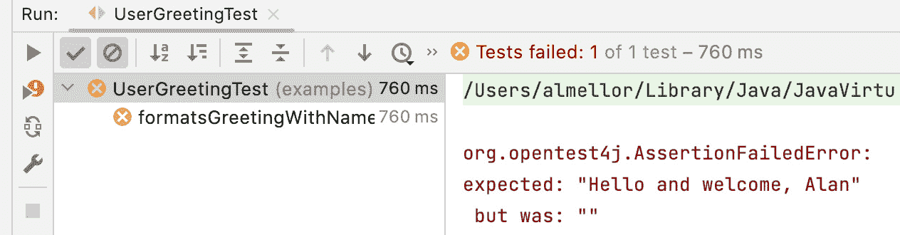
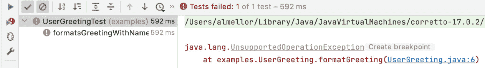
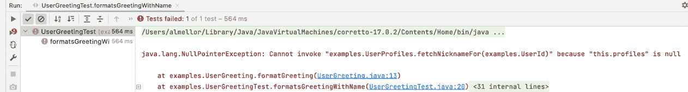
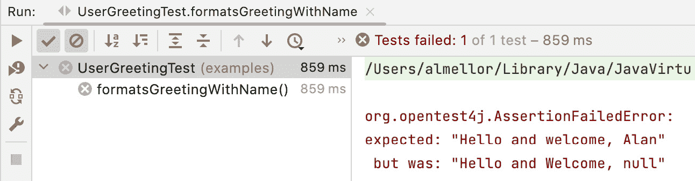
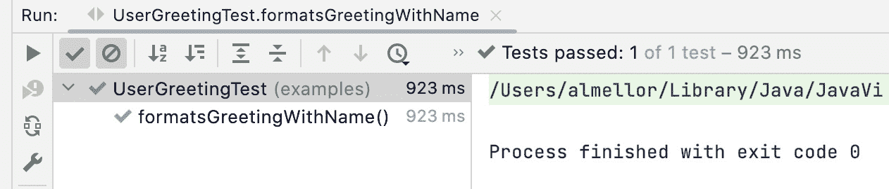

# 8

# 测试替身——存根和模拟

在本章中，我们将解决一个常见的测试挑战。如何测试依赖于另一个对象的对象？如果那个协作者难以设置测试数据，我们该怎么办？有几种技术可以帮助我们做到这一点，并且它们建立在之前学到的 SOLID 原则之上。我们可以使用依赖注入的概念，使我们能够用专门编写来帮助我们编写测试的对象替换协作对象。

这些新对象被称为测试替身，在本章中我们将了解两种重要的测试替身。我们将学习何时应用每种类型的测试替身，然后学习两种在 Java 中创建它们的方法——既可以通过自己编写代码，也可以使用流行的库 Mockito。到本章结束时，我们将拥有允许我们为难以或无法使用真实协作对象进行测试的对象编写测试的技术。这使我们能够在复杂系统中使用 TDD。

在本章中，我们将涵盖以下主要内容：

+   测试协作者的问题

+   测试替身的目的

+   使用存根来获取预定义的结果

+   使用模拟来验证交互

+   理解何时使用测试替身是合适的

+   使用 Mockito——一个流行的模拟库

+   使用存根驱动错误处理代码

+   在 Wordz 中测试错误条件

# 技术要求

本章的代码可以在`github.com/PacktPublishing/Test-Driven-Development-with-Java/tree/main/chapter08`找到。

# 协作者提出的测试问题

在本节中，我们将了解随着我们的软件发展成为更大的代码库时出现的挑战。我们将回顾协作对象的意义，然后我们将探讨两个具有挑战性的测试合作示例。

随着我们的软件系统的发展，我们很快就会超出单个类（或者函数）所能容纳的内容。我们将把代码分成多个部分。如果我们选择一个对象作为测试对象，那么它所依赖的任何其他对象都是协作者。我们的 TDD 测试必须考虑到这些协作者的存在。有时，这很简单，就像我们在前面的章节中看到的那样。

不幸的是，事情并不总是那么简单。有些协作使测试变得困难——或者不可能——编写。这类协作者引入了我们必须应对的不可重复行为，或者呈现难以触发的错误。

让我们通过一些简短的例子来回顾这些挑战。我们将从一个常见问题开始：一个表现出不可重复行为的协作者。

## 测试不可重复行为的挑战

我们已经了解到 TDD 测试的基本步骤是安排（Arrange）、行动（Act）和断言（Assert）。我们要求对象执行操作，然后断言预期的结果发生。但是，当结果不可预测时会发生什么呢？

为了说明这一点，让我们回顾一个掷骰子并显示文本字符串来说明我们掷了什么数字的类：

```java
package examples;
import java.util.random.RandomGenerator;
public class DiceRoll {
    private final int NUMBER_OF_SIDES = 6;
    private final RandomGenerator rnd =
                       RandomGenerator.getDefault();
    public String asText() {
        int rolled = rnd.nextInt(NUMBER_OF_SIDES) + 1;
        return String.format("You rolled a %d", rolled);
    }
}
```

这段代码很简单，只有几行可执行代码。遗憾的是，*编写简单并不意味着测试简单*。我们该如何为这个编写测试？具体来说——我们该如何编写断言？在之前的测试中，我们总是确切地知道在断言中期望什么。在这里，断言将是一些固定文本加上一个随机数。我们事先不知道那个随机数会是什么。

## 测试错误处理的挑战

测试处理错误条件的代码是另一个挑战。这里的困难不在于断言错误已被处理，而挑战在于如何在协作对象内部触发该错误发生。

为了说明这一点，让我们想象一段代码，当我们的便携式设备中的电池电量低时，会提醒我们：

```java
public class BatteryMonitor {
    public void warnWhenBatteryPowerLow() {
        if (DeviceApi.getBatteryPercentage() < 10) {
            System.out.println("Warning - Battery low");
        }
    }
}
```

`BatteryMonitor`中的前一段代码包含一个`DeviceApi`类，这是一个库类，它允许我们读取手机上剩余的电量。它提供了一个静态方法来完成这个操作，称为`getBatteryPercentage()`。这将返回一个介于*0*到*100*百分比的整数。我们想要为编写 TDD 测试的代码调用`getBatteryPercentage()`，如果它小于*10*百分比，将显示警告信息。但编写这个测试有一个问题：我们如何在我们的安排步骤中强制`getBatteryPercentage()`方法返回一个小于 10 的数字？我们会以某种方式放电电池吗？我们该如何做？

`BatteryMonitor`提供了一个例子，展示了与另一个对象协作的代码，其中我们无法强制该协作者给出已知响应。我们没有方法改变`getBatteryPercentage()`将返回的值。我们实际上必须等到电池放电后，这个测试才能通过。这并不是 TDD 的宗旨。

## 理解为什么这些协作具有挑战性

在进行 TDD（测试驱动开发）时，我们希望测试是*快速*和*可重复*的。任何涉及不可预测行为或需要我们控制我们无法控制的情况的场景，都会给 TDD 带来明显的问题。

在这些情况下编写测试的最佳方式是消除困难的根源。幸运的是，有一个简单的解决方案。我们可以应用我们在上一章中学到的*依赖注入原则*，以及一个新想法——*测试替身*。我们将在下一节中回顾测试替身。

# 测试替身的目的

在本节中，我们将学习允许我们测试这些具有挑战性的协作的技术。我们将介绍测试替身的概念。我们将学习如何将 SOLID 原则应用于设计足够灵活的代码，以便使用这些测试替身。

通过使用**测试替身**解决了上一节中的挑战。测试替身替换了我们测试中的协作对象之一。按照设计，这个测试替身避免了被替换对象的困难。想想电影中的替身，他们取代了真正的演员，以帮助安全地拍摄动作镜头。

软件测试替身是我们专门编写的一个对象，以便在单元测试中易于使用。在测试中，我们在安排步骤中将我们的测试替身注入到 SUT 中。在生产代码中，我们注入了测试替身所取代的生产对象。

让我们重新考虑之前的`DiceRoll`示例。我们将如何重构这段代码以使其更容易测试？

1.  创建一个抽象随机数来源的接口：

    ```java
    interface RandomNumbers {
    ```

    ```java
        int nextInt(int upperBoundExclusive);
    ```

    ```java
    }
    ```

1.  将*依赖倒置原则*应用于`class DiceRoll`以利用这个抽象：

    ```java
    package examples;
    ```

    ```java
    import java.util.random.RandomGenerator;
    ```

    ```java
    public class DiceRoll {
    ```

    ```java
        private final int NUMBER_OF_SIDES = 6;
    ```

    ```java
        private final RandomNumbers rnd ;
    ```

    ```java
        public DiceRoll( RandomNumbers r ) {
    ```

    ```java
            this.rnd = r;
    ```

    ```java
        }
    ```

    ```java
        public String asText() {
    ```

    ```java
            int rolled = rnd.nextInt(NUMBER_OF_SIDES) + 1;
    ```

    ```java
            return String.format("You rolled a %d",
    ```

    ```java
                                 rolled);
    ```

    ```java
        }
    ```

    ```java
    }
    ```

我们通过用`RandomNumbers`接口替换随机数生成器来反转了对随机数生成器的依赖。我们添加了一个构造函数，允许注入合适的`RandomNumbers`实现。我们将其分配给`rnd`字段。`asText()`方法现在调用我们传递给构造函数的任何对象的`nextInt()`方法。

1.  编写一个使用测试替身替换`RandomNumbers`来源的测试：

    ```java
    package examples;
    ```

    ```java
    import org.junit.jupiter.api.Test;
    ```

    ```java
    import static org.assertj.core.api.Assertions.assertThat;
    ```

    ```java
    class DiceRollTest {
    ```

    ```java
        @Test
    ```

    ```java
        void producesMessage() {
    ```

    ```java
            var stub = new StubRandomNumbers();
    ```

    ```java
            var roll = new DiceRoll(stub);
    ```

    ```java
            var actual = roll.asText();
    ```

    ```java
            assertThat(actual).isEqualTo("You rolled a
    ```

    ```java
                                         5");
    ```

    ```java
        }
    ```

    ```java
    }
    ```

我们在这个测试中看到了常见的安排、行动和断言部分。这里的新想法是`class StubRandomNumbers`。让我们看看这个存根代码：

```java
package examples;
public class StubRandomNumbers implements RandomNumbers {
    @Override
    public int nextInt(int upperBoundExclusive) {
        return 4;  // @see https://xkcd.com/221
    }
}
```

关于这个存根有一些需要注意的事情。首先，它实现了我们的`RandomNumbers`接口，使其成为该接口的 LSP 兼容替身。这允许我们将它注入到`DiceRoll`的构造函数中，我们的 SUT。第二个最重要的方面是，每次对`nextInt()`的调用都将*返回相同的数字*。

通过用提供已知值的存根替换真实的`RandomNumbers`来源，我们已经使测试断言变得容易编写。存根消除了随机生成器不可重复值的问题。

我们现在可以看到`DiceRollTest`是如何工作的。我们向我们的 SUT 提供一个测试替身。测试替身总是返回相同的值。因此，我们可以对已知结果进行断言。

## 制作代码的生产版本

要使`class DiceRoll`在生产中正常工作，我们需要注入一个真正的随机数来源。一个合适的类可能是以下内容：

```java
public class RandomlyGeneratedNumbers implements RandomNumbers {
    private final RandomGenerator rnd =
                       RandomGenerator.getDefault();
    @Override
    public int nextInt(int upperBoundExclusive) {
        return rnd.nextInt(upperBoundExclusive);
    }
}
```

这里没有太多工作要做——前面的代码只是简单地使用内置在 Java 中的`RandomGenerator`库类实现了`nextInt()`方法。

我们现在可以使用这个方法来创建我们的代码生产版本。我们已经将我们的`DiceRoll`类修改为允许我们注入任何适合的`RandomNumbers`接口的实现。对于我们的测试代码，我们注入了一个测试替身——`StubRandomNumbers`类的实例。对于我们的生产代码，我们将注入`RandomlyGeneratedNumbers`类的实例。生产代码将使用该对象来创建真实的随机数——并且`DiceRoll`类内部将不会有任何代码更改。我们已经使用了依赖倒置原则，通过依赖注入使`DiceRoll`类可配置。这意味着`DiceRoll`类现在遵循开放/封闭原则——它对新类型的随机数生成行为是开放的，但对类内部的代码更改是封闭的。

依赖倒置、依赖注入和控制反转

上述示例展示了这三个想法的实际应用。*依赖倒置*是一种设计技术，我们在代码中创建一个抽象。*依赖注入*是一种运行时技术，我们向依赖于它的代码提供该抽象的实现。这两个想法通常被称为**控制反转**（**IoC**）。例如，Spring 这样的框架有时被称为 IoC 容器，因为它们提供了帮助您管理在应用程序中创建和注入依赖项的工具。

以下代码是我们在生产环境中使用`DiceRoll`和`RandomlyGeneratedNumbers`的示例：

```java
public class DiceRollApp {
    public static void main(String[] args) {
        new DiceRollApp().run();
    }
    private void run() {
        var rnd = new RandomlyGeneratedNumbers();
        var roll = new DiceRoll(rnd);
        System.out.println(roll.asText());
    }
}
```

你可以从之前的代码中看到，我们将生产版本的`RandomlyGeneratedNumbers`类的实例注入到`DiceRoll`类中。创建和注入对象的过程通常被称为**对象配置**。例如，*Spring*（`spring.io/`）、*Google Guice*（`github.com/google/guice`）和内置的*Java CDI*（`docs.oracle.com/javaee/6/tutorial/doc/giwhl.html`）等框架提供了使用注解来最小化创建依赖项和配置它们所需样板代码的方法。

使用依赖倒置原则来交换生产对象和测试替身是一个非常强大的技术。这个测试替身是一种称为存根的双面实例。在下一节中，我们将介绍存根是什么以及何时使用它。

# 使用存根进行预定义结果

上一节解释了测试替身是一种可以替代生产对象的物体，这样我们就可以更容易地编写测试。在本节中，我们将更详细地研究这个测试替身并对其进行泛化。

在先前的 `DiceRoll` 示例中，测试编写起来更简单，因为我们用已知、固定的值替换了随机数生成。我们的真实随机数生成器使得编写断言变得困难，因为我们从未确定预期的随机数应该是什么。我们的测试替身是一个提供已知值的对象。然后我们可以计算出断言的预期值，使测试易于编写。

提供此类值的测试替身被称为 **存根**。存根总是用我们可以控制的测试版本替换我们无法控制的对象。它们总是为我们的测试代码提供已知的数据值。图形上，存根看起来像这样：


图 8.1 – 用存根替换协作者

在图中，我们的测试类负责在 Arrange 步骤中将我们的系统单元（SUT）连接到适当的存根对象。当 Act 步骤要求我们的 SUT 执行我们想要测试的代码时，该代码将从存根中拉取已知的数据值。Assert 步骤可以根据这些已知数据值将导致的行为来编写。

重要的是要注意为什么这行得通。对这个安排的反对意见之一是我们没有测试真实的系统。我们的 SUT 连接到一些永远不会成为我们生产系统一部分的对象。这是真的。但这是因为我们的测试只测试 SUT 内部的逻辑。这个测试**不是**测试依赖项的行为。实际上，它必须不尝试这样做。测试测试替身是单元测试的一个经典反模式。

我们的 SUT 已经使用依赖倒置原则完全隔离了自己，从存根所代表的对象中。对于 SUT 来说，它如何从其协作者那里获取数据没有区别。这就是为什么这种测试方法有效的原因。

## 何时使用存根对象

当我们的 SUT 使用与依赖项协作的 *拉模型* 时，存根是有用的。以下是一些使用存根有意义的例子：

+   **存根存储库接口/数据库**：使用存根而不是调用真实数据库进行数据访问代码

+   **存根参考数据源**：用存根数据替换包含参考数据的属性文件或网络服务

+   **为将代码转换为 HTML 或 JSON 格式的代码提供应用程序对象**：当测试将代码转换为 HTML 或 JSON 时，用存根提供输入数据

+   **存根系统时钟以测试时间依赖行为**：为了从时间调用中获得可重复的行为，用已知的时间存根调用

+   **存根随机数生成器以创建可预测性**：用一个存根的调用替换对随机数生成器的调用

+   **存根认证系统以始终允许测试用户登录**：用简单的“登录成功”存根替换对认证系统的调用

+   **从第三方网络服务（如支付提供者）中模拟响应**：将调用第三方服务的真实调用替换为对模拟的调用

+   **模拟对操作系统命令的调用**：用预制的模拟数据替换对操作系统调用，例如列出目录

在本节中，我们看到了如何使用存根来控制提供给 SUT 的数据。它支持从其他地方获取对象的*拉模型*。但这并不是唯一一种对象协作的机制。有些对象使用*推模型*。在这种情况下，当我们调用 SUT 上的方法时，我们期望它调用另一个对象上的方法。我们的测试必须确认这个方法调用确实发生了。这是存根无法帮助解决的问题，需要不同的方法。我们将在下一节中介绍这种方法。

# 使用模拟来验证交互

在本节中，我们将探讨另一种重要的测试替身：模拟对象。模拟对象解决的问题与存根对象略有不同，正如我们将在本节中看到的那样。

**模拟对象**是一种测试替身，它能够*记录交互*。与提供已知对象给 SUT 的存根不同，模拟对象将简单地记录 SUT 与模拟对象之间的交互。这是回答“*SUT 是否正确调用了方法？*”这一问题的完美工具。这解决了 SUT 与其协作者之间的*推送模型*交互问题。SUT 命令协作者做某事，而不是从它那里请求某物。模拟提供了一种验证它是否发出了该命令以及任何必要参数的方法。

下面的 UML 对象图显示了一般的安排：


图 8.2 – 用模拟替换协作者

我们看到测试代码将一个模拟对象连接到 SUT。执行步骤将使 SUT 执行我们期望与它的协作者交互的代码。我们已经用模拟对象替换了那个协作者，该模拟对象将记录某个方法被调用的事实。

让我们通过一个具体的例子来使这个问题更容易理解。假设我们的 SUT 预期向用户发送电子邮件。再次使用依赖倒置原则，将我们的邮件服务器抽象为一个接口：

```java
public interface MailServer {
    void sendEmail(String recipient, String subject,
                   String text);
}
```

上述代码显示了一个简化的接口，仅适用于发送简短的文本电子邮件。对于我们的目的来说已经足够好了。为了测试调用此接口上的`sendEmail()`方法的 SUT，我们将编写一个`MockMailServer`类：

```java
public class MockMailServer implements MailServer {
    boolean wasCalled;
    String actualRecipient;
    String actualSubject;
    String actualText;
    @Override
    public void sendEmail(String recipient, String subject,
                          String text) {
        wasCalled = true;
        actualRecipient = recipient;
        actualSubject = subject;
        actualText = text;
    }
}
```

之前的 `MockMailServer` 类实现了 `MailServer` 接口。它只有一个职责——记录 `sendEmail()` 方法被调用的事实，并捕获发送给该方法的实际参数值。它将这些值以包公共可见性的简单字段形式暴露出来。我们的测试代码可以使用这些字段来形成断言。我们的测试只需将这个模拟对象连接到系统单元（SUT），让系统单元执行我们期望调用 `sendEmail()` 方法的代码，然后检查它是否真的那样做了：

```java
@Test
public void sendsWelcomeEmail() {
    var mailServer = new MockMailServer();
    var notifications = new UserNotifications(mailServer);
    notifications.welcomeNewUser();
    assertThat(mailServer.wasCalled).isTrue();
    assertThat(mailServer.actualRecipient)
         .isEqualTo("test@example.com");
    assertThat(mailServer.actualSubject)
         .isEqualTo("Welcome!");
    assertThat(mailServer.actualText)
         .contains("Welcome to your account");
}
```

我们可以看到，这个测试将模拟对象连接到我们的系统单元（SUT），然后让系统单元执行 `welcomeNewUser()` 方法。我们期望这个方法在 `MailServer` 对象上调用 `sendEmail()` 方法。然后，我们需要编写断言来确认调用确实使用了正确的参数值。我们在这里逻辑上使用了四个断言语句，测试了一个想法——实际上是一个单独的断言。

模拟对象的力量在于我们可以记录与难以控制的对象的交互。在邮件服务器的例子中，比如前面代码块中看到的，我们不想向任何人发送实际邮件。我们也不希望编写一个等待监控测试用户邮箱的测试。这不仅速度慢且可能不可靠，而且这也不是我们想要测试的内容。系统单元只负责调用 `sendEmail()` 方法——之后发生的事情超出了系统单元的职责范围。因此，这也超出了这个测试的范围。

就像之前其他测试替身的例子一样，我们使用了使用 SMTP 协议与真实邮件服务器通信的 `MailServer`。我们很可能会寻找一个库类来为我们完成这项工作，然后我们需要创建一个非常简单的适配器对象，将库代码绑定到我们的接口上。

本节已涵盖两种常见的测试替身类型，即存根和模拟。但测试替身并不总是适合使用。在下一节中，我们将讨论使用测试替身时应注意的一些问题。

# 理解何时使用测试替身是合适的

正如我们所见，模拟对象是一种有用的测试替身。但它们并不总是正确的做法。有些情况下，我们应该积极避免使用模拟。这些情况包括过度使用模拟、使用不属于你的代码的模拟，以及模拟值对象。我们将在下一节中探讨这些情况。然后，我们将总结一般性的建议，说明模拟通常在哪些情况下有用。让我们首先考虑过度使用模拟对象所引起的问题。

## 避免过度使用模拟对象

初看之下，使用模拟对象似乎能为我们解决许多问题。然而，如果不加注意地使用，我们可能会得到质量很差的测试。为了理解原因，让我们回顾一下 TDD 测试的基本定义。它是一种验证*行为*且与*实现*无关的测试。如果我们使用模拟对象来代替一个真正的抽象，那么我们就遵守了这一点。

潜在的问题发生是因为创建一个模拟对象来代替实现细节，而不是抽象，实在太容易了。如果我们这样做，我们最终会将我们的代码锁定在特定的实现和结构上。一旦测试与特定的实现细节耦合，那么更改该实现就需要更改测试。如果新的实现与旧的一个有相同的结果，那么测试实际上应该仍然通过。依赖于特定实现细节或代码结构的测试会积极阻碍重构和添加新功能。

## 不要模拟你拥有的代码

另一个不应该使用模拟的地方是作为你团队外部编写的具体类的替代品。假设我们正在使用一个名为`PdfGenerator`的库中的类来创建 PDF 文档。我们的代码会在`PdfGenerator`类上调用方法。我们可能会认为，如果我们使用模拟对象来代替`PdfGenerator`类，测试我们的代码会很容易。

这种方法有一个问题，这个问题可能只会出现在未来。外部库中的类很可能发生变化。比如说，`PdfGenerator`类移除了我们代码中调用的一种方法。如果我们不更新库版本，那么根据我们的安全策略，我们最终被迫更新库版本。当我们引入新版本时，我们的代码将无法编译这个已更改的类——*但我们的测试仍然会通过，因为模拟对象中仍然有旧方法*。这是我们为代码的未来维护者设置的微妙陷阱。最好避免这种情况。一个合理的方法是包装第三方库，理想情况下将其放在接口后面，以反转对它的依赖，完全隔离它。

## 不要模拟值对象

**值对象**是一个没有特定身份的对象，它只由包含的数据定义。一些例子包括整数或字符串对象。我们认为两个字符串相同，如果它们包含相同的文本。它们可能在内存中是两个不同的字符串对象，但如果它们持有相同的值，我们认为它们是相等的。

在 Java 中，一个对象是值对象的线索是存在自定义的`equals()`和`hashCode()`方法。默认情况下，Java 使用对象的身份来比较两个对象的相等性——它检查两个对象引用是否指向内存中的相同对象实例。我们必须重写`equals()`和`hashCode()`方法，以根据其内容为值对象提供正确的行为。

值对象是一个简单的东西。它可能在方法内部有一些复杂的行为，但原则上，值对象应该很容易创建。创建一个模拟对象来代替这些值对象没有任何好处。相反，创建值对象并在测试中使用它。

## 没有依赖注入就无法模拟

测试替身只能在我们可以注入它们的地方使用。这并不总是可能的。如果我们想要测试的代码使用`new`关键字创建了一个具体的类，那么我们就不能用它来替换一个替身：

```java
package examples;
public class UserGreeting {
    private final UserProfiles profiles
        = new UserProfilesPostgres();
    public String formatGreeting(UserId id) {
        return String.format("Hello and welcome, %s",
                profiles.fetchNicknameFor(id));
    }
}
```

我们看到`profiles`字段已经使用具体的类`UserProfilesPostgres()`初始化。没有直接的方法可以注入测试替身。我们可以尝试使用 Java 反射来解决这个问题，但最好将其视为 TDD 对我们设计局限性的反馈。解决方案是允许依赖注入，正如我们在之前的例子中所看到的。

这通常是**遗留代码**的问题，这种代码是在我们工作之前编写的。如果这段代码创建了具体的对象——而且代码无法更改——那么我们就不能应用测试替身。

## 不要测试模拟

*测试模拟*是一个用来描述测试中在测试替身中构建了太多假设的短语。假设我们编写了一个存根来代替某些数据库访问，但这个存根包含数百行代码来模拟对数据库的详细特定查询。当我们编写测试断言时，它们都将基于我们在存根中模拟的这些详细查询。

那种方法将证明 SUT 逻辑对这些查询有响应。但我们的存根现在对真实数据访问代码的工作方式做出了很多假设。存根代码和真实数据访问代码可能会很快失去同步。这会导致一个无效的单元测试通过，但带有存根响应，这些响应在现实中已不再可能发生。

## 何时使用模拟对象

当我们的 SUT 使用推送模型并从其他组件请求操作时，其中没有明显的响应，模拟就很有用：

+   从远程服务请求操作，例如向邮件服务器发送电子邮件

+   从数据库中插入或删除数据

+   通过 TCP 套接字或串行接口发送命令

+   使缓存失效

+   将日志信息写入日志文件或分发日志端点

在本节中，我们学习了一些技术，这些技术允许我们验证是否请求了某个操作。我们看到了如何再次使用依赖倒置原则来允许我们注入一个可以查询的测试替身。我们还看到了一个手动编写代码的例子。但我们是否必须总是手动编写测试替身？在下一节中，我们将介绍一个非常有用的库，它可以为我们做大部分工作。

# 使用 Mockito – 一个流行的模拟库

前面的章节展示了使用存根和模拟来测试代码的示例。我们一直手动编写这些测试双胞胎。显然，这样做非常重复且耗时。这引发了一个问题：这种重复的样板代码是否可以自动化？幸运的是，它可以。本节将回顾在流行的 Mockito 库中可用的帮助。

Mockito 是一个免费的开源库，遵循 MIT 许可证。这个许可证意味着我们可以在商业开发工作中使用它，前提是我们工作的人同意。Mockito 提供了大量的功能，旨在用很少的代码创建测试双胞胎。Mockito 网站可在 `site.mockito.org/` 找到。

## 开始使用 Mockito

开始使用 Mockito 很简单。我们在 Gradle 文件中引入 `Mockito` 库和一个扩展库。扩展库允许 `Mockito` 与 *JUnit5* 紧密集成。

`build.gradle` 的摘录看起来像这样：

```java
dependencies {
    testImplementation 'org.junit.jupiter:junit-jupiter-api:5.8.2'
    testRuntimeOnly 'org.junit.jupiter:junit-jupiter-engine:5.8.2'
    testImplementation 'org.assertj:assertj-core:3.22.0'
    testImplementation 'org.mockito:mockito-core:4.8.0'
    testImplementation 'org.mockito:mockito-junit-jupiter:4.8.0'
}
```

## 使用 Mockito 编写存根

让我们看看 Mockito 如何帮助我们创建存根对象。我们将使用 TDD 来创建一个 `UserGreeting` 类，该类在从 `interface UserProfiles` 获取昵称后提供个性化的问候。

让我们分小步骤来写，看看 TDD 和 Mockito 如何协同工作：

1.  编写基本的 JUnit5 测试类并将其与 Mockito 集成：

    ```java
    package examples
    ```

    ```java
    import org.junit.jupiter.api.extension.ExtendWith;
    ```

    ```java
    import org.mockito.junit.jupiter.MockitoExtension;
    ```

    ```java
    @ExtendWith(MockitoExtension.class)
    ```

    ```java
    public class UserGreetingTest {
    ```

    ```java
    }
    ```

`@ExtendWith(MockitoExtension.class)` 标记这个测试使用 Mockito。当我们运行这个 JUnit5 测试时，该注解确保运行 Mockito 库代码。

1.  添加一个测试来确认预期的行为。我们将通过断言来捕捉这一点：

    ```java
    package examples;
    ```

    ```java
    import org.junit.jupiter.api.Test;
    ```

    ```java
    import org.junit.jupiter.api.extension.ExtendWith;
    ```

    ```java
    import org.mockito.junit.jupiter.MockitoExtension;
    ```

    ```java
    import static org.assertj.core.api.Assertions.assertThat;
    ```

    ```java
    @ExtendWith(MockitoExtension.class)
    ```

    ```java
    public class UserGreetingTest {
    ```

    ```java
        @Test
    ```

    ```java
        void formatsGreetingWithName() {
    ```

    ```java
            String actual = «»;
    ```

    ```java
            assertThat(actual)
    ```

    ```java
               .isEqualTo("Hello and welcome, Alan");
    ```

    ```java
        }
    ```

    ```java
    }
    ```

这是我们之前看到的标准使用 *JUnit* 和 *AssertJ* 框架的方法。如果我们现在运行这个测试，它将会失败。

1.  使用 Act 步骤驱动我们的 SUT（我们想要编写的类）：

    ```java
    package examples;
    ```

    ```java
    import org.junit.jupiter.api.Test;
    ```

    ```java
    import org.junit.jupiter.api.extension.ExtendWith;
    ```

    ```java
    import org.mockito.junit.jupiter.MockitoExtension;
    ```

    ```java
    import static org.assertj.core.api.Assertions.assertThat;
    ```

    ```java
    @ExtendWith(MockitoExtension.class)
    ```

    ```java
    public class UserGreetingTest {
    ```

    ```java
        private static final UserId USER_ID
    ```

    ```java
            = new UserId("1234");
    ```

    ```java
        @Test
    ```

    ```java
        void formatsGreetingWithName() {
    ```

    ```java
            var greeting = new UserGreeting();
    ```

    ```java
            String actual =
    ```

    ```java
                greeting.formatGreeting(USER_ID);
    ```

    ```java
            assertThat(actual)
    ```

    ```java
                .isEqualTo("Hello and welcome, Alan");
    ```

    ```java
        }
    ```

    ```java
    }
    ```

下面的步骤展示了如何驱动出两个新的生产代码类。

1.  添加一个 `UserGreeting` 类的骨架：

    ```java
    package examples;
    ```

    ```java
    public class UserGreeting {
    ```

    ```java
        public String formatGreeting(UserId id) {
    ```

    ```java
            throw new UnsupportedOperationException();
    ```

    ```java
        }
    ```

    ```java
    }
    ```

如同往常，我们只添加必要的代码来使测试编译。这里捕捉到的设计决策显示，我们的行为是由一个 `formatGreeting()` 方法提供的，该方法通过 `UserId` 类识别用户。

1.  添加一个 `UserId` 类的骨架：

    ```java
    package examples;
    ```

    ```java
    public class UserId {
    ```

    ```java
        public UserId(String id) {
    ```

    ```java
        }
    ```

    ```java
    }
    ```

再次，我们只添加了使测试编译的空壳。然后，我们运行测试，它仍然会失败：



图 8.3 – 测试失败

1.  另一个需要捕捉的设计决策是，`UserGreeting` 类将依赖于 `UserProfiles` 接口。我们需要创建一个字段，创建接口骨架，并在 SUT 的新构造函数中注入该字段：

    ```java
    package examples;
    ```

    ```java
    import org.junit.jupiter.api.Test;
    ```

    ```java
    import org.junit.jupiter.api.extension.ExtendWith;
    ```

    ```java
    import org.mockito.junit.jupiter.MockitoExtension;
    ```

    ```java
    import static org.assertj.core.api.Assertions.assertThat;
    ```

    ```java
    @ExtendWith(MockitoExtension.class)
    ```

    ```java
    public class UserGreetingTest {
    ```

    ```java
        private static final UserId USER_ID
    ```

    ```java
            = new UserId("1234");
    ```

    ```java
        private UserProfiles profiles;
    ```

    ```java
        @Test
    ```

    ```java
        void formatsGreetingWithName() {
    ```

    ```java
            var greeting
    ```

    ```java
                = new UserGreeting(profiles);
    ```

    ```java
            String actual =
    ```

    ```java
                greeting.formatGreeting(USER_ID);
    ```

    ```java
            assertThat(actual)
    ```

    ```java
                .isEqualTo("Hello and welcome, Alan");
    ```

    ```java
        }
    ```

    ```java
    }
    ```

我们继续添加最少的代码来使测试编译。如果我们运行测试，它仍然会失败。但我们已经取得了进一步进展，所以现在的失败是一个 `UnsupportedOperationException` 错误。这证实了 `formatGreeting()` 已经被调用：



图 8.4 – 失败确认方法调用

1.  向`formatGreeting()`方法添加行为：

    ```java
    package examples;
    ```

    ```java
    public class UserGreeting {
    ```

    ```java
        private final UserProfiles profiles;
    ```

    ```java
        public UserGreeting(UserProfiles profiles) {
    ```

    ```java
            this.profiles = profiles;
    ```

    ```java
        }
    ```

    ```java
        public String formatGreeting(UserId id) {
    ```

    ```java
            return String.format("Hello and Welcome, %s",
    ```

    ```java
                    profiles.fetchNicknameFor(id));
    ```

    ```java
        }
    ```

    ```java
    }
    ```

1.  将`fetchNicknameFor()`添加到`UserProfiles`接口中：

    ```java
    package examples;
    ```

    ```java
    public interface UserProfiles {
    ```

    ```java
        String fetchNicknameFor(UserId id);
    ```

    ```java
    }
    ```

1.  运行测试。它将因空指针异常而失败：



图 8.5 – 空指针异常失败

测试失败是因为我们将`profiles`字段作为依赖传递给了我们的系统单元(SUT)，但该字段从未被初始化。这就是 Mockito 发挥作用的地方（终于）。

1.  将`@Mock`注解添加到`profiles`字段：

    ```java
    package examples;
    ```

    ```java
    import org.junit.jupiter.api.Test;
    ```

    ```java
    import org.junit.jupiter.api.extension.ExtendWith;
    ```

    ```java
    import org.mockito.Mock;
    ```

    ```java
    import org.mockito.junit.jupiter.MockitoExtension;
    ```

    ```java
    import static org.assertj.core.api.Assertions.assertThat;
    ```

    ```java
    @ExtendWith(MockitoExtension.class)
    ```

    ```java
    public class UserGreetingTest {
    ```

    ```java
        private static final UserId USER_ID = new     UserId("1234");
    ```

    ```java
    @Mock
    ```

    ```java
        private UserProfiles profiles;
    ```

    ```java
        @Test
    ```

    ```java
        void formatsGreetingWithName() {
    ```

    ```java
            var greeting = new UserGreeting(profiles);
    ```

    ```java
            String actual =
    ```

    ```java
                   greeting.formatGreeting(USER_ID);
    ```

    ```java
            assertThat(actual)
    ```

    ```java
                    .isEqualTo("Hello and welcome, Alan");
    ```

    ```java
        }
    ```

    ```java
    }
    ```

现在运行测试会产生不同的失败，因为我们还没有配置 Mockito 的 mock：



图 8.6 – 添加了 mock，但未配置

1.  配置`@Mock`以返回正确的存根数据供测试使用：

    ```java
    package examples;
    ```

    ```java
    import org.junit.jupiter.api.Test;
    ```

    ```java
    import org.junit.jupiter.api.extension.ExtendWith;
    ```

    ```java
    import org.mockito.Mock;
    ```

    ```java
    import org.mockito.Mockito;
    ```

    ```java
    import org.mockito.junit.jupiter.MockitoExtension;
    ```

    ```java
    import static org.assertj.core.api.Assertions.assertThat;
    ```

    ```java
    import static org.mockito.Mockito.*;
    ```

    ```java
    @ExtendWith(MockitoExtension.class)
    ```

    ```java
    public class UserGreetingTest {
    ```

    ```java
        private static final UserId USER_ID = new     UserId("1234");
    ```

    ```java
        @Mock
    ```

    ```java
        private UserProfiles profiles;
    ```

    ```java
        @Test
    ```

    ```java
        void formatsGreetingWithName() {
    ```

    ```java
            when(profiles.fetchNicknameFor(USER_ID))
    ```

    ```java
               .thenReturn("Alan");
    ```

    ```java
            var greeting = new UserGreeting(profiles);
    ```

    ```java
            String actual =
    ```

    ```java
                   greeting.formatGreeting(USER_ID);
    ```

    ```java
            assertThat(actual)
    ```

    ```java
                    .isEqualTo("Hello and welcome, Alan");
    ```

    ```java
        }
    ```

    ```java
    }
    ```

1.  如果你再次运行测试，它将因问候文本中的错误而失败。修复这个问题然后重新运行测试，它将通过：



图 8.7 – 测试通过

我们刚刚创建了`class UserGreeting`，它通过`interface UserProfiles`访问用户的某些存储昵称。该接口使用了 DIP（依赖倒置原则）来隔离`UserGreeting`与存储实现的任何具体细节。我们使用存根实现来编写测试。我们遵循了 TDD（测试驱动开发）并利用 Mockito 为我们编写了这个存根。

你还会注意到在最后一步测试失败了。我预期这一步应该通过。它没有通过是因为我错误地输入了问候信息。再次，TDD 救了我。

## 使用 Mockito 编写 mock

Mockito 可以像创建存根一样轻松地创建 mock 对象。我们仍然可以在希望成为 mock 的字段上使用`@Mock`注解——也许最后终于理解了这个注解。我们使用 Mockito 的`verify()`方法来检查我们的 SUT 是否正确地调用了一个协作者的预期方法。

让我们看看如何使用 mock。我们将为一些预期通过`MailServer`发送电子邮件的 SUT 代码编写一个测试：

```java
@ExtendWith(MockitoExtension.class)
class WelcomeEmailTest {
    @Mock
    private MailServer mailServer;
    @Test
    public void sendsWelcomeEmail() {
        var notifications
                 = new UserNotifications( mailServer );
        notifications.welcomeNewUser("test@example.com");
        verify(mailServer).sendEmail("test@example.com",
                "Welcome!",
                "Welcome to your account");
    }
}
```

在这个测试中，我们看到`@ExtendWith(MockitoExtension.class)`注解用于初始化 Mockito，以及我们测试方法中熟悉的安排（Arrange）、行动（Act）和断言（Assert）格式。这里的新想法在于断言。我们使用 Mockito 库中的`verify()`方法来检查我们的 SUT 是否正确地调用了`sendEmail()`方法。检查还验证了它是否使用了正确的参数值。

Mockito 使用代码生成来实现所有这些。它包装了我们用`@Mock`注解标记的接口，并拦截每个调用。它为每个调用存储参数值。当我们使用`verify()`方法来确认方法是否正确调用时，Mockito 拥有完成这项工作所需的所有数据。

警惕 Mockito 的 when()和 verify()语法！

Mockito 对`when()`和`verify()`的语法有细微的差别：

* `when().thenReturn(expected value);`

* `verify().method();`

## 模糊存根和 mock 之间的区别

关于 Mockito 术语的一个需要注意的事项是，它模糊了存根和模拟对象之间的区别。在 Mockito 中，我们创建被标记为模拟对象的测试替身。但在我们的测试中，我们可以将这些替身用作存根、模拟，甚至两者的混合体。

将测试替身配置为既是存根又是模拟是一种测试代码的坏味道。这并不错，但值得停下来思考。我们应该考虑我们既模拟又存根的协作者是否混淆了一些职责。将那个对象拆分出来可能是有益的。

## 参数匹配器 - 定制测试替身的行为

到目前为止，我们已经配置了 Mockito 测试替身来响应它们所替代的方法的非常具体的输入。之前的 MailServer 示例检查了三个特定的参数值是否传递给了`sendEmail()`方法调用。但有时我们希望在测试替身中拥有更多的灵活性。

Mockito 提供了一些称为参数匹配器的库方法。这些是在`when()`和`verify()`语句内部使用的静态方法。参数匹配器用于指示 Mockito 对可能传递给被测试方法的参数值范围（包括 null 和未知值）做出响应。

以下测试使用了一个接受任何`UserId`值的参数匹配器：

```java
package examples2;
import examples.UserGreeting;
import examples.UserId;
import examples.UserProfiles;
import org.junit.jupiter.api.Test;
import org.junit.jupiter.api.extension.ExtendWith;
import org.mockito.Mock;
import org.mockito.junit.jupiter.MockitoExtension;
import static org.assertj.core.api.Assertions.assertThat;
import static org.mockito.ArgumentMatchers.any;
import static org.mockito.Mockito.when;
@ExtendWith(MockitoExtension.class)
public class UserGreetingTest {
    @Mock
    private UserProfiles profiles;
    @Test
    void formatsGreetingWithName() {
      when(profiles.fetchNicknameFor(any()))
          .thenReturn("Alan");
        var greeting = new UserGreeting(profiles);
        String actual =
          greeting.formatGreeting(new UserId(""));
        assertThat(actual)
          .isEqualTo("Hello and welcome, Alan");
    }
}
```

我们已经将`any()`参数匹配器添加到了`fetchNicknameFor()`方法的存根中。这指示 Mockito 无论传递给`fetchNicknameFor()`的参数值是什么，都返回预期的值`Alan`。这在编写测试以引导读者并帮助他们理解特定测试中什么重要、什么不重要时非常有用。

Mockito 提供了一系列参数匹配器，这些匹配器在 Mockito 官方文档中有描述。这些参数匹配器在创建用于模拟错误条件的存根时特别有用。这是下一节的主题。

# 使用测试驱动错误处理代码

在本节中，我们将探讨存根对象的一个很好的用途，即它们在测试错误条件中的作用。

在我们编写代码的过程中，我们需要确保它能够很好地处理错误条件。一些错误条件很容易测试。一个例子可能是一个用户输入验证器。为了测试它处理无效数据引起的错误，我们只需编写一个测试，向它提供无效数据，然后编写一个断言来检查它是否成功报告了数据无效。但使用它的代码怎么办呢？

如果我们的系统单元（SUT）是响应其协作者引发的错误条件的代码，我们需要测试那个错误响应。我们如何测试它取决于我们选择报告错误的方式。我们可能使用一个简单的状态码，在这种情况下，从存根返回那个错误代码将非常有效。

我们还可能选择使用 Java 异常来报告这个错误。异常是有争议的。如果误用，它们可能导致代码中的控制流非常不清楚。然而，我们需要知道如何测试它们，因为它们出现在几个 Java 库和内部编码风格中。幸运的是，编写异常处理代码的测试并不困难。

我们从创建一个存根开始，可以使用本章中介绍的任何方法。然后我们需要安排存根在调用方法时抛出适当的异常。Mockito 有一个很好的功能可以实现这一点，所以让我们看看一个使用异常的示例 Mockito 测试：

```java
    @Test
    public void rejectsInvalidEmailRecipient() {
        doThrow(new IllegalArgumentException())
            .when(mailServer).sendEmail(any(),any(),any());
        var notifications
            = new UserNotifications( mailServer );
        assertThatExceptionOfType(NotificationFailureException.class)
                .isThrownBy(()->notifications
                    .welcomeNewUser("not-an-email-address"));
    }
```

在这个测试的开始阶段，我们使用 Mockito 的 `doThrow()` 方法来配置我们的模拟对象。这会将 Mockito 模拟对象 `mailServer` 配置为在调用 `sendEmail()` 方法时抛出 `IllegalArgumentException` 异常，无论我们发送什么参数值。这反映了设计决策，即通过抛出该异常作为报告电子邮件地址无效的机制。当我们的系统单元测试（SUT）调用 `mailServer.sendEmail()` 方法时，该方法将抛出 `IllegalArgumentExeption` 异常。我们可以练习处理这个异常的代码。

对于这个例子，我们决定让 SUT 包装并重新抛出 `IllegalArgumentException`。我们选择创建一个与用户通知责任相关的新异常。我们将称之为 `NotificationFailureException`。测试的断言步骤使用 AssertJ 库的特性 `assertThatExceptionOfType()`。这同时执行了 Act 和 Assert 步骤。我们调用我们的 SUT `welcomeNewUser()` 方法，并断言它抛出了我们的 `NotificationFailureException` 错误。

我们可以看到这足以触发我们的 SUT 代码中的异常处理响应。这意味着我们可以先编写测试，然后驱动出所需的代码。我们编写的代码将包括一个用于处理 `InvalidArgumentException` 的捕获处理程序。在这种情况下，所有新的代码必须做的就是抛出一个 `NotificationFailureException` 错误。这是一个我们将创建的新类，它继承自 `RuntimeException`。我们这样做是为了通过发送通知来报告出错了。作为正常系统分层考虑的一部分，我们希望用更通用的异常替换原始异常，这对于这一层代码来说更为合适。

本节探讨了 Mockito 和 AssertJ 库的特性，这些特性帮助我们使用 TDD 来驱动异常处理行为。在下一节中，我们将将这些内容应用到 Wordz 应用程序中的错误处理上。

# 测试 Wordz 中的错误条件

在本节中，我们将通过编写一个测试来应用我们所学的知识，该测试将为玩家选择一个随机单词进行猜测，从存储的单词集中。我们将创建一个名为`WordRepository`的接口来访问存储的单词。我们将通过一个`fetchWordByNumber(wordNumber)`方法来实现，其中`wordNumber`标识一个单词。在这里的设计决策是，每个单词都存储了一个从*1*开始的顺序号，以帮助我们随机选择一个。

我们将编写一个`WordSelection`类，该类负责选择一个随机数，并使用该数从存储中检索带有该数字的单词。我们将使用之前提到的`RandomNumbers`接口。对于这个例子，我们的测试将覆盖尝试从`WordRepository`接口中检索单词，但出于某种原因，它不在那里的情况。

我们可以按如下方式编写测试：

```java
@ExtendWith(MockitoExtension.class)
public class WordSelectionTest {
    @Mock
    private WordRepository repository;
    @Mock
    private RandomNumbers random;
    @Test
    public void reportsWordNotFound() {
        doThrow(new WordRepositoryException())
                .when(repository)
                  .fetchWordByNumber(anyInt());
        var selection = new WordSelection(repository,
                                          random);
        assertThatExceptionOfType(WordSelectionException.class)
                .isThrownBy(
                        ()->selection.getRandomWord());
    }
}
```

测试捕捉了更多与如何设计`WordRepository`和`WordSelection`工作相关的决策。我们的`fetchWordByNumber(wordNumber)`存储库方法在检索单词时遇到任何问题都会抛出`WordRepositoryException`。我们的意图是让`WordSelection`抛出它自己的自定义异常来报告它无法完成`getRandomWord()`请求。

为了在测试中设置这种情况，我们首先安排存储库抛出异常。这是通过使用 Mockito 的`doThrow()`功能来完成的。每当调用`fetchWordByNumber()`方法时，Mockito 都会抛出我们请求它抛出的异常，即`WordRepositoryException`。这允许我们驱动出处理这种错误条件的代码。

我们的“安排”步骤是通过创建`WordSelection` SUT 类来完成的。我们将两个协作者传递给构造函数：`WordRepository`实例和一个`RandomNumbers`实例。我们已经要求 Mockito 通过在测试双重的`repository`和`random`字段上添加`@Mock`注解来为这两个接口创建存根。

现在 SUT 已经正确构建，我们准备编写测试的“执行”和“断言”步骤。我们正在测试是否抛出异常，因此我们需要使用`assertThatExceptionOfType()` AssertJ 功能来完成。我们可以传递我们期望抛出的异常的类，即`WordSelectionException`。我们将`isThrownBy()`方法链接到执行步骤并运行 SUT 代码。这作为 Java lambda 函数的参数传递给`isThrownBy()`方法。这将调用`getRandomWord()`方法，我们希望它失败并抛出异常。断言将确认这已经发生，并且已经抛出了预期的异常类。我们将运行测试，看到它失败，然后添加必要的逻辑使测试通过。

测试代码向我们展示了我们可以使用测试双倍和错误条件验证与测试驱动开发（TDD）相结合。它还表明，测试可以轻易地与解决方案的特定实现耦合。在这个测试中有很多设计决策，包括哪些异常会发生以及它们在哪里被使用。这些决策甚至包括使用异常来报告错误的事实。尽管如此，这仍然是一种合理的方式来划分责任和定义组件之间的契约。所有这些都包含在测试中。

# 摘要

在本章中，我们探讨了如何解决测试有问题的协作者的问题。我们学习了如何使用称为测试双倍的替代对象来测试协作者。我们了解到，这使我们能够简单地控制那些协作者在测试代码中的行为。

两种测试双倍（test double）对我们特别有用：存根（stub）和模拟（mock）。存根返回数据。模拟验证方法是否被调用。我们已经学会了如何使用 Mockito 库为我们创建存根和模拟。

我们已经使用 AssertJ 验证了 SUT 在各种测试双倍条件下的行为是否正确。我们已经学会了如何测试抛出异常的错误条件。

这些技术扩展了我们的测试工具集。

在下一章中，我们将介绍一个非常有用的系统设计技术，它允许我们在 FIRST 单元测试中获取大部分代码，同时避免测试外部系统协作时无法控制的问题。

# 问题和答案

1.  存根和模拟这两个术语可以互换使用吗？

是的，尽管它们有不同的含义。在正常对话中，我们倾向于为了流畅性而牺牲精确性，这是可以接受的。了解每种测试双倍的不同用途很重要。在说话时，通常最好是在一群人知道意思的情况下不要过于拘泥于细节。只要我们意识到测试双倍是正确的通用术语，并且具体的双倍类型有不同的角色，一切都会顺利。

1.  “测试模拟”这个问题是什么？

这发生在 SUT（系统单元）中没有实际逻辑，但我们仍然尝试编写单元测试的情况下。我们将测试双倍连接到 SUT 并编写测试。我们将发现，断言只检查测试双倍返回了正确的数据。这表明我们测试的水平不正确。这种错误可能是由设置不明智的代码覆盖率目标或强制执行一个同样不明智的按方法测试规则所驱动的。这个测试没有增加任何价值，应该被移除。

1.  测试双倍可以在任何地方使用吗？

不。这只有在您使用依赖倒置原则设计代码，以便测试双倍可以替换生产对象的情况下才有效。使用 TDD 确实迫使我们早期考虑这类设计问题。

如果无法在需要的地方注入测试替身，那么后续编写测试将变得更加困难。在这一点上，遗留代码尤其困难，我建议阅读迈克尔·费瑟斯的书籍《与遗留代码有效工作》，以获取帮助添加测试到缺乏必要测试访问点的代码的技术。（参见*进一步阅读*列表。）

# 进一步阅读

+   `site.mockito.org/`

Mockito 库主页

+   *《与遗留代码有效工作》，迈克尔·C·费瑟斯* *ISBN 978-0131177055*

这本书解释了如何处理没有为测试替身提供依赖倒置访问点的遗留代码。它展示了一系列技术，以安全地重构遗留代码，从而可以引入测试替身。
