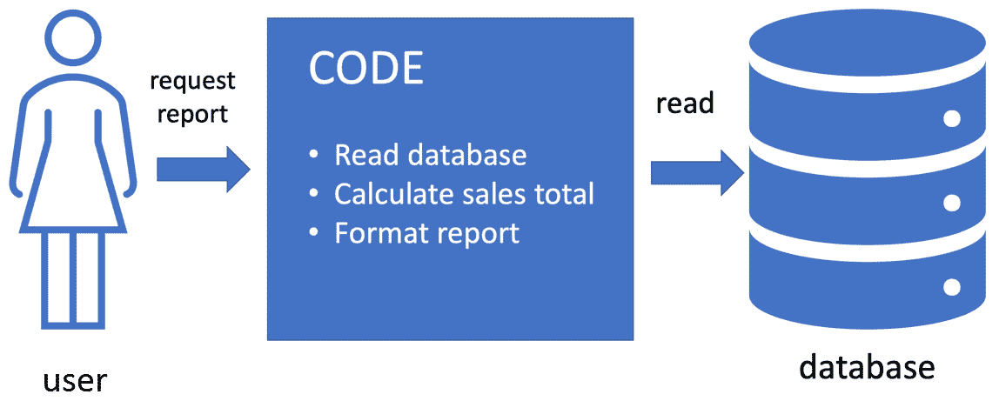
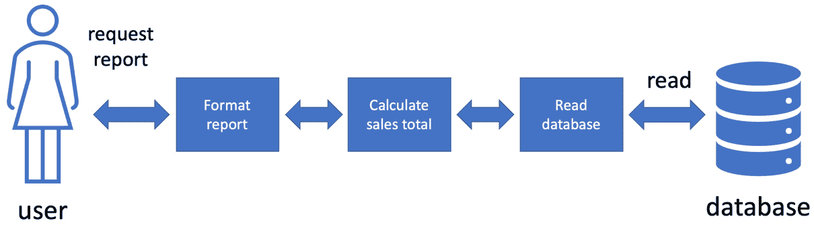
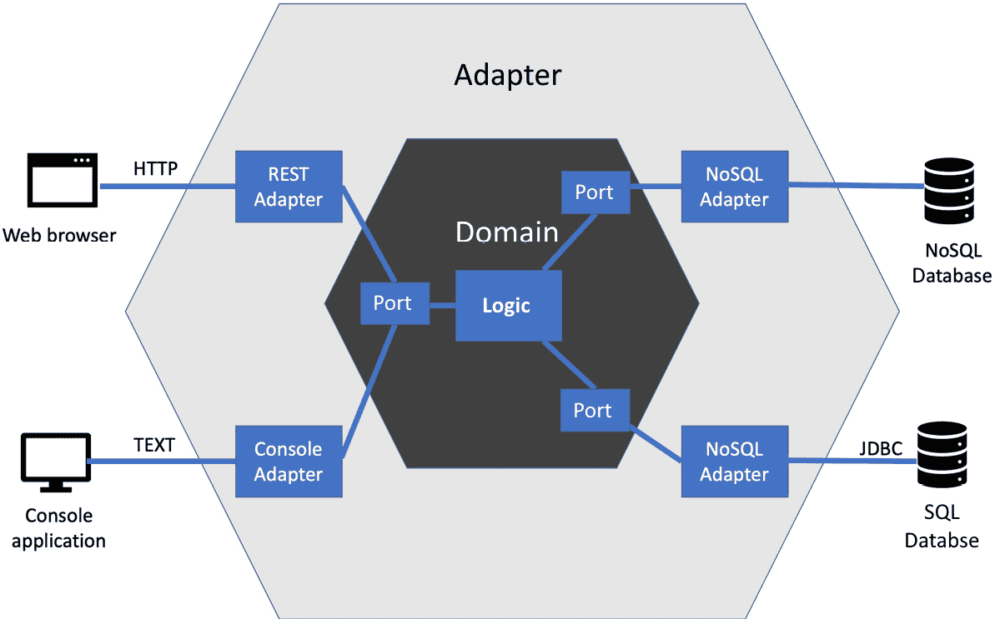
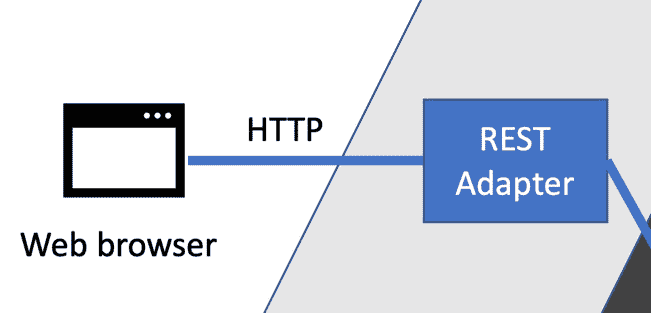
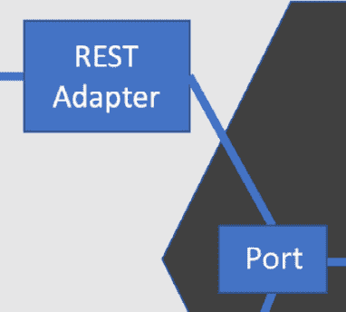
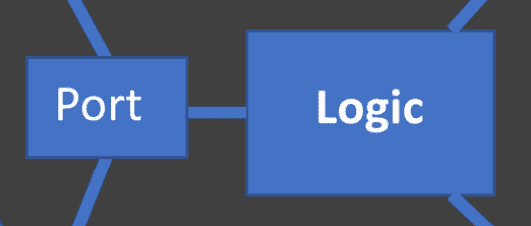
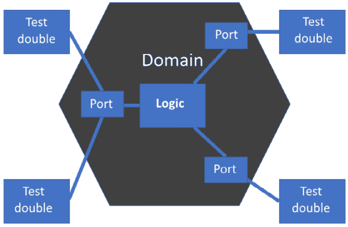

# 9

# 六边形架构——解耦外部系统

我们已经学习了如何使用 arrange、act 和 assert 模板编写测试。我们还了解了一些称为 SOLID 原则的软件设计原则，这些原则帮助我们将软件分解成更小的组件。最后，我们学习了如何使用测试替身来代替协作组件，使 FIRST 单元测试更容易编写。在本章中，我们将结合所有这些技术，形成一种称为六边形架构的强大设计方法。

使用这种方法，我们将从将更多应用程序逻辑置于单元测试中并减少所需的集成和端到端测试数量中受益。我们将构建对应用程序外部变化的自然弹性。例如，更改数据库供应商等开发任务将简化，因为我们的代码需要更改的地方更少。我们还将能够对更大的单元进行单元测试，将其他方法中需要端到端测试的一些测试纳入单元测试。

在本章中，我们将涵盖以下主要主题：

+   为什么外部系统难以处理

+   依赖反转来拯救

+   抽象化外部系统

+   编写领域代码

+   用测试替身替换外部系统

+   单元测试更大的单元

+   Wordz – 抽象化数据库

# 技术要求

本章的代码可以在[`github.com/PacktPublishing/Test-Driven-Development-with-Java/tree/main/chapter09`](https://github.com/PacktPublishing/Test-Driven-Development-with-Java/tree/main/chapter09)找到。

# 为什么外部系统难以处理

在本节中，我们将回顾推动六边形架构方法背后的驱动力——与外部系统工作的困难。对外部系统的依赖会导致开发中出现问题。解决方案导致了一种很好的设计方法。

让我们看看处理外部系统的一种简单方法。我们用户的任务是从一个数据库中拉取本月的销售报告。我们将编写一段代码来完成这项任务。软件设计如下：



图 9.1 – 一段代码完成所有工作

在这个设计中，我们以通常的方式将销售数据存储在数据库中。我们编写一些代码代表用户拉取报告。这是一段完成整个工作的单一代码步骤。它将连接到数据库，发送查询，接收结果，进行一些处理，并将结果格式化，以便用户阅读。

优点是，我们知道这种编码风格是有效的。它将实现其向用户提供销售报告的目标。缺点是，代码结合了三种不同的职责——访问数据库、执行逻辑和格式化报告。它可能会将数据库的 SQL 语句与`html5`标签混合，以生成格式化的报告。正如我们在前一章中看到的，这可能会使一个区域的未来代码更改波及到其他区域。理想情况下，这种情况不应该发生。但真正的挑战是为这段代码编写测试。我们需要解析和理解我们发送给用户报告的任何格式。我们还需要直接与该数据库交互。

在接下来的子节中，我们将回顾一些外部系统对测试提出的更广泛挑战。这包括环境问题、意外事务、不确定数据、操作系统调用和第三方库。

## 环境问题带来麻烦

我们软件运行的软件环境常常带来挑战。假设我们的代码从数据库中读取数据。即使代码是正确的，由于我们无法控制的环境问题，它可能无法读取这些数据。以下是一些可能的问题：

+   **网络连接中断**：许多原因可能导致这种情况。本地，可能是由于网络电缆被错误地拔出。也许数据库托管在互联网上的某个地方，我们的 ISP 已经断开了连接。

+   **电力故障**：数据库服务器或本地网络交换机的电力故障足以使数据库无法访问。

+   **设备限制**：可能是数据库服务器本身已经用完了磁盘空间，无法运行。也许我们编写的确切查询以某种方式触发了数据库，导致完成时间过长，可能是由于缺少索引。

无论原因是什么，如果我们的代码无法访问数据库中的数据，它将无法工作。由于这是一个可能性，为我们的报告生成代码编写测试变得更加困难。

即使我们的代码可以访问数据库中的数据，在测试中与之交互也并不容易。假设我们编写了一个测试，验证我们能否通过读取用户名来正确读取生产数据库，那么我们期望读取哪个用户名呢？我们不知道，因为测试并不控制要添加哪些数据。可用的用户名将是真实用户添加的任何名称。我们可以让测试向数据库添加一个已知的测试用户名——但这样，我们就创建了一个真实用户可以与之交互的虚假用户。这根本不是我们想要的。

数据库存储数据，这给我们的测试带来了更多问题。假设我们针对测试数据库编写了一个测试，该测试首先写入一个测试用户名。如果我们之前已经运行了这个测试，测试用户名将已经存储在数据库中。通常，数据库会报告重复项错误，测试将失败。

需要清理针对数据库的测试。测试完成后必须删除存储的所有测试数据。如果我们尝试在测试成功后删除数据，如果测试失败，删除代码可能永远不会运行。我们可以通过在测试运行之前始终删除数据来避免这种情况。这样的测试将运行缓慢。

## 测试意外触发真实交易

当我们的代码仅限于访问生产系统时，那么每次我们使用该代码，生产系统中都会发生某些事情。支付处理器可能会发出费用。真实的银行账户可能会被扣除。警报可能会被激活，导致真正的疏散。在夏威夷的一个著名例子中，一个系统测试触发了一条真实的短信，说夏威夷正在遭受导弹袭击——但实际上并没有。这是非常严重的事情。

夏威夷误报导弹袭击警告

有关测试出错此例的详细信息，请参阅[`en.wikipedia.org/wiki/2018_Hawaii_false_missile_alert`](https://en.wikipedia.org/wiki/2018_Hawaii_false_missile_alert)。

意外触发真实交易可能导致公司遭受真实损失。它们可能导致业务的三 R（收入、声誉和保留）损失。这些都不好。我们的测试必须不会意外触发来自生产系统的真实后果。

## 我们应该期待什么数据？

在我们的销售报告示例中，编写测试的最大问题是，我们需要提前知道月度销售报告的正确答案。当我们连接到生产系统时，我们如何做到这一点？答案将是销售报告所说的那样。我们没有其他方式知道。

在我们能够测试销售报告代码是否正常工作之前，必须确保销售报告代码能够正确工作，这是一个大问题！这是一个我们无法打破的循环依赖。

## 操作系统调用和系统时间

有时，我们的代码可能需要调用操作系统来完成其工作。也许它需要不时地删除目录中的所有文件，或者它可能依赖于系统时间。一个例子就是一个日志文件清理工具，它每周一凌晨 2 点运行。该工具将删除`/logfiles/`目录中的所有文件。

测试此类工具将是困难的。我们必须等到周一凌晨 2 点，并验证所有日志文件是否已被删除。虽然我们可以使这可行，但这并不非常有效。如果能找到一个更好的方法，允许我们在任何我们想测试的时候进行测试，理想情况下不需要删除任何文件，那就太好了。

## 第三方服务的挑战

商业软件中的常见任务是接受客户的付款。为此，我们不可避免地会使用第三方支付处理器，例如 PayPal 或 Stripe，仅举两个例子。除了网络连接的挑战之外，第三方 API 还给我们带来了更多的挑战：

+   **服务中断时间**：许多第三方 API 将有一段时间的预定维护，服务将暂时不可用。这对我们来说意味着“测试失败”。

+   **API 更改**：假设我们的代码使用 API 版本 1，而 API 版本 2 已上线。我们的代码仍然会使用版本 1 的调用，这可能在 API 的版本 2 上不再有效。现在，这被认为是一种相当糟糕的做法——被称为破坏已发布的接口——但它确实会发生。更糟糕的是，由于我们的一小块代码，版本 2 的更改可能会在我们的代码的各个地方引起变化。

+   **慢响应**：如果我们的代码向外部服务发出 API 调用，总有可能响应会晚于我们的代码预期返回。我们的代码通常会以某种方式失败，并导致测试失败。

当我们将外部服务和单一的大型代码块混合时，会存在许多挑战，这会复杂化维护和测试。问题是我们可以做什么？下一节将探讨**依赖倒置原则**如何帮助我们遵循一种称为六边形架构的设计方法，这使得处理外部系统变得更加容易。

# 依赖倒置来拯救

在本节中，我们将回顾一种基于我们已知的 SOLID 原则的设计方法，即六边形架构。使用这种方法可以使我们在代码库的更大范围内更有效地使用 TDD。

我们在本书中之前学习了**依赖倒置原则**。我们了解到它有助于我们将想要测试的某些代码与其合作者的细节隔离开来。我们注意到这对于测试连接到我们无法控制的外部系统的事物是有用的。我们看到了单一职责原则如何引导我们将软件拆分成更小、更专注的任务。

将这些想法应用于我们之前的销售报告示例，我们会得到一个改进的设计，如下面的图表所示：



图 9.2 – 将 SOLID 应用于我们的销售报告

上述图表显示了我们将 SOLID 原则应用于拆分我们的销售报告代码的方式。我们使用了单一职责原则，将整体任务分解为三个单独的任务：

+   格式化报告

+   计算销售总额

+   从数据库中读取销售数据

这已经使应用程序更容易使用。更重要的是，我们已经将计算销售总额的代码从用户和数据库中隔离出来。这个计算不再直接访问数据库。它通过另一段只负责这一点的代码进行。同样，计算结果也不再直接格式化并发送给用户。另一段代码负责这一点。

我们也可以在这里应用**依赖倒置原则**。通过倒置对格式化和数据库访问代码的依赖，我们的计算销售总额现在不再需要了解它们的任何细节。我们取得了重大突破：

+   计算代码现在完全与数据库和格式化隔离

+   我们可以替换任何可以访问任何数据库的代码片段

+   我们可以替换任何可以格式化报告的代码片段

+   我们可以用测试替身代替格式化和数据库访问代码

最大的好处是我们可以在不更改计算代码的情况下，替换任何可以访问任何数据库的代码片段。例如，我们可以从 Postgres SQL 数据库切换到 Mongo NoSQL 数据库，而不需要更改计算代码。我们可以使用数据库的测试替身，以便我们可以将计算代码作为一个**首次单元测试**来测试。这些优势非常显著，不仅在于 TDD 和测试方面，还在于我们代码的组织方式。考虑到这个单件销售报告解决方案，我们已经从纯代码编写过渡到软件工程。我们思考的不仅仅是让代码工作，而是让代码易于工作。接下来的几个小节将探讨我们如何将这种方法推广到六边形架构，我们将了解这种方法如何提供一种逻辑的代码组织，帮助我们更有效地应用 TDD。

## 将这种方法推广到六边形架构

这种单一责任原则和依赖倒置的组合似乎给我们带来了一些好处。我们能否将这种方法扩展到整个应用程序并得到相同的好处？我们能否找到一种方法，将所有应用程序逻辑和数据表示从外部影响的约束中分离出来？我们当然可以，这种设计的一般形式如下所示：



图 9.3 – 六边形架构

上述图表显示了当我们将依赖倒置和单一责任原则推广到整个应用程序时会发生什么。它被称为六边形架构，也称为端口和适配器，这是 Alastair Cockburn 最初描述这种方法时使用的术语。好处是它完全隔离了应用程序的核心逻辑与外部系统的细节。这有助于我们测试核心逻辑。它还为我们代码的精心设计提供了一个合理的模板。

## 六边形架构组件概述

为了提供我们核心应用程序逻辑的隔离，六边形架构将整个程序划分为四个空间：

+   外部系统，包括网络浏览器、数据库和其他计算服务

+   适配器实现了外部系统所需的特定 API

+   端口是我们应用程序从外部系统需要的抽象

+   领域模型包含我们的应用程序逻辑，不包含外部系统的细节

我们应用程序的核心是领域模型，周围是它从外部系统需要的支持。它间接使用但不由这些外部系统定义。让我们更详细地了解六边形架构中的每个组件，以了解每个组件负责什么和什么不负责。

### 外部系统连接到适配器

外部系统是我们代码库之外的所有事物。它们包括用户直接与之交互的事物，例如前面图中的网络浏览器和控制台应用程序。它们还包括数据存储，如 SQL 数据库和 NoSQL 数据库。其他常见的系统示例包括桌面图形用户界面、文件系统、下游 Web 服务 API 和硬件设备驱动程序。大多数应用程序都需要与这些系统交互。

在六边形架构中，我们应用程序代码的核心不知道任何关于如何与外部系统交互的细节。与外部系统通信的责任被赋予了一块被称为适配器的代码。

例如，以下图示展示了网络浏览器如何通过 REST 适配器连接到我们的代码：



图 9.4 – 浏览器连接到 REST 适配器

在前面的图中，我们可以看到网络浏览器连接到一个 REST 适配器。这个适配器理解 HTTP 请求和响应，这是网络的根本。它还理解 JSON 数据格式，通常使用库将 JSON 数据转换为我们的代码的一些内部表示。这个适配器还将理解我们为应用程序的 REST API 设计的特定协议——我们作为 API 提出的精确的 HTTP 动词、响应、状态码和 JSON 编码的有效负载数据。

注意

适配器封装了我们系统与外部系统交互所需的所有知识——没有其他知识。这种知识由外部系统的规范定义。其中一些可能是由我们自己设计的。

适配器有单一的责任，即知道如何与外部系统交互。如果该外部系统更改其公共接口，只有我们的适配器需要更改。

### 适配器连接到端口

向领域模型迈进，适配器连接到端口。端口是领域模型的一部分。它们抽象掉了适配器对其外部系统复杂知识的细节。端口回答了一个稍微不同的问题：我们为什么需要这个外部系统？端口使用**依赖倒置原则**来隔离我们的领域代码，使其不知道任何关于适配器的细节。它们完全用我们的领域模型来编写：



图 9.5 – 适配器连接到端口

之前描述的 REST 适配器封装了运行 REST API 的细节，使用了 HTTP 和 JSON 的知识。它连接到一个命令端口，为我们提供了从网络或其他地方传入命令的抽象。鉴于我们之前的销售报告示例，命令端口将包括一种无技术请求销售报告的方式。在代码中，它可能看起来像这样：

```java
package com.sales.domain;
import java.time.LocalDate;
public interface Commands {
    SalesReport calculateForPeriod(LocalDate start,
                                   LocalDate end);
}
```

此代码片段具有以下特点：

+   没有对 `HttpServletRequest` 或任何与 HTTP 相关的引用

+   没有对 JSON 格式的引用

+   对我们的领域模型（`SalesReport` 和 `java.time.LocalDate`）的引用

+   `public` 访问修饰符，因此可以从 REST 适配器调用

此接口是一个端口。它为我们提供了一个通用方法，可以从应用程序中获取销售报告。参照 *图 9**.3*，我们可以看到控制台适配器也连接到这个端口，为用户提供命令行界面访问我们的应用程序。原因是尽管用户可以使用不同类型的系统（如网页和命令行）访问我们的应用程序，但我们的应用程序在两种情况下都做同样的事情。它只支持一组命令，无论这些命令从哪里请求。获取 `SalesReport` 对象就是这样，无论你从哪种技术请求它。

注意

端口提供了对外部系统所需逻辑视图，而不限制如何从技术上满足这些需求。

端口是我们反转依赖的地方。端口代表领域模型需要那些外部系统的原因。如果适配器代表“如何”，端口则代表“为什么”。

### 端口连接到我们的领域模型

链接到领域模型的最终步骤。这是我们的应用程序逻辑所在之处。把它想象成解决我们应用程序所面临问题的纯逻辑。由于端口和适配器，领域逻辑不受外部系统细节的限制：



图 9.6 – 端口连接到领域模型

领域模型代表用户想要做的事情，在代码中。每个用户故事都由这里的代码描述。理想情况下，这一层的代码使用我们正在解决的问题的语言，而不是技术细节。当我们做得很好时，这段代码就变成了故事讲述——它用用户告诉我们的术语描述用户关心的动作。它使用他们的语言——用户的语言——而不是晦涩的计算机语言。

领域模型可以包含用任何范式编写的代码。它可能使用**函数式编程**（**FP**）的思想。它甚至可能使用**面向对象编程**（**OOP**）的思想。它可能是过程式的。它甚至可能使用我们通过声明性配置的现成库。我目前的风格是使用面向对象来构建程序的整体结构和组织，然后在对象方法内部使用函数式编程思想来实现它们。这对六边形架构或 TDD 来说都没有影响。只要使用端口和适配器的思想，任何适合你的编码风格都是可以的。

注意

领域模型包含描述用户问题如何被解决的代码。这是我们应用程序的必要逻辑，它创造了商业价值。

整个应用程序的中心是领域模型。它包含将用户的用例故事变为现实生活的逻辑。

## 金规则——领域从不直接连接到适配器

为了保留将领域模型从适配器和外部系统隔离的好处，我们遵循一条简单的规则：领域模型从不直接连接到任何适配器。这始终是通过端口来完成的。

当我们的代码遵循这种设计方法时，检查我们是否正确地分割了端口和适配器就变得简单直接。我们可以做出两个高级结构决策：

+   领域模型位于`domain`包（及其子包）中

+   适配器位于`adapters`包（及其子包）中

我们可以通过分析代码来检查`domain`包中是否没有任何从`adapters`包导入的语句。导入检查可以在代码审查或结对/群体编程中进行。像 SonarQube 这样的静态分析工具可以将导入检查自动化，作为构建管道的一部分。

六边形架构的金规则

领域模型从不直接连接到适配器层中的任何内容，这样我们的应用程序逻辑就不依赖于外部系统的细节。

适配器连接到端口，以便将连接到外部系统的代码隔离。

端口是领域模型的一部分，用于创建外部系统的抽象。

领域模型和适配器只依赖于端口。这是依赖倒置在起作用。

这些简单的规则使我们的设计保持一致，并保留了领域模型的隔离性。

## 为什么是六边形形状？

图中使用的六边形形状背后的思想是，每个面代表一个外部系统。在设计的图形表示中，通常表示多达六个外部系统就足够了。内六边形和外六边形代表领域模型和适配器层，图形化地显示了领域模型是如何成为我们应用程序的核心，以及它是如何通过端口和适配器层与外部系统隔离的。

六角架构背后的关键思想是端口和适配器技术。实际边数取决于有多少外部系统。这些数量并不重要。

在本节中，我们介绍了六角架构及其提供的优势，并提供了所有基本组成部分如何组合的一般概述。让我们转向下一节，具体看看我们需要做出哪些决策来抽象外部系统。

# 抽象外部系统

在本节中，我们将考虑在应用六角架构方法时需要做出的某些决策。我们将逐步处理外部系统，首先决定领域模型需要什么，然后制定合适的抽象来隐藏其技术细节。我们将考虑两个常见的外部系统：Web 请求和数据库访问。

## 决定我们的领域模型需要什么

我们设计开始的地方是领域模型。我们需要为领域模型设计一个合适的端口以与之交互。这个端口必须摆脱任何外部系统的细节，同时，它必须回答我们的应用程序为什么需要这个系统的问题。我们正在创建一个抽象。

思考抽象的一个好方法是想如果我们改变执行任务的方式，什么会保持不变。假设我们想在午餐时吃热汤。我们可能在炉灶上的平底锅里加热，或者可能在微波炉里加热。无论我们选择哪种方式，我们正在做的事情保持不变。我们在加热汤，这就是我们寻找的抽象。

我们在软件系统中很少加热汤，除非我们正在构建一个自动售汤机。但我们将使用几种常见的抽象。这是因为当构建典型的 Web 应用程序时，会使用一些常见的外部系统。第一个也是最明显的是与 Web 本身的连接。在大多数应用程序中，我们都会遇到某种类型的数据存储，通常是第三方数据库系统。对于许多应用程序，我们还会调用另一个 Web 服务。反过来，这个服务可能会调用我们公司内部的一群服务。另一个典型的 Web 服务调用是调用第三方 Web 服务提供商，例如，作为一个信用卡支付处理器的例子。

让我们看看如何抽象这些常见的外部系统。

### 抽象 Web 请求和响应

我们的应用程序将响应 HTTP 请求和响应。我们需要设计的端口代表领域模型中的请求和响应，去除 Web 技术。

我们的销售额报告示例可以作为两个简单的领域对象引入这些概念。这些请求可以通过一个`RequestSalesReport`类来表示：

```java
package com.sales.domain;
import java.time.LocalDate;
public class RequestSalesReport {
    private final LocalDate start;
    private final LocalDate end;
    public RequestSalesReport(LocalDate start,
                              LocalDate end){
        this.start = start;
        this.end = end;
    }
    public SalesReport produce(SalesReporting reporting) {
        return reporting.reportForPeriod(start, end);
    }
}
```

在这里，我们可以看到我们请求领域模型的关键部分：

+   我们请求的内容——即销售报告，体现在类名中

+   那个请求的参数——即报告期的开始和结束日期

我们可以看到响应是如何表示的：

+   `SalesReport` 类将包含所需的基本信息

我们还可以看到什么没有包含：

+   网络请求中使用的数据格式

+   HTTP 状态码，例如 200 OK

+   `HTTPServletRequest` 和 `HttpServletResponse` 或等效的框架对象

这是一个纯粹的业务模型表示，用于在两个日期之间请求销售报告。没有任何迹象表明它是从网络上来的，这是一个非常有用的事实，因为我们可以从其他输入源请求它，例如桌面 GUI 或命令行。更好的是，我们可以在单元测试中非常容易地创建这些业务模型对象。

上述示例展示了面向对象、告知而非询问的方法。我们同样可以选择函数式编程（FP）方法。如果我们这样做，我们会将请求和响应表示为纯数据结构。Java 17 中添加的记录功能非常适合表示此类数据结构。重要的是，请求和响应应完全用业务模型术语编写——不应该包含任何网络技术。

### 抽象数据库

没有数据，大多数应用程序并不特别有用。没有数据存储，它们会变得相当健忘，忘记我们提供的数据。访问数据存储，如关系数据库和 NoSQL 数据库，是网络应用程序开发中的常见任务。

在六边形架构中，我们首先设计业务模型将与之交互的端口，再次在纯业务术语中。创建数据库抽象的方法是考虑需要存储什么数据，而不是如何存储数据。

数据库端口有两个组成部分：

+   一个接口来反转对数据库的依赖。

该接口通常被称为存储库。它也被称作数据访问对象。无论名称如何，它的任务是隔离业务模型与数据库的任何部分及其访问技术。

+   用业务模型术语表示数据本身的值对象。

存在的值对象用于在各个地方传输数据。两个包含相同数据值的值对象被认为是相等的。它们非常适合在数据库和我们的代码之间传输数据。

回到我们的销售报告示例，我们仓库的一个可能的设计如下：

```java
package com.sales.domain;
public interface SalesRepository {
    List<Sale> allWithinDateRange(LocalDate start,
                                  LocalDate end);
}
```

在这里，我们有一个名为 `allWithinDateRange()` 的方法，允许我们获取特定日期范围内的一系列单独的销售交易。数据作为 `java.util.List` 的简单 `Sale` 值对象返回。这些是功能齐全的业务模型对象。它们可能包含执行某些关键应用逻辑的方法。它们可能只是基本的数据结构，可能使用 Java 17 的 `record` 结构。这种选择是我们决定在特定情况下良好设计的外观的一部分。

同样，我们可以看到什么没有包含：

+   数据库连接字符串

+   `JDBC`或`JPA` API 细节——标准的 Java 数据库连接库

+   `SQL`查询（或 NoSQL 查询）

+   数据库模式和表名

+   数据库存储过程细节

我们的数据存储库设计侧重于我们的领域模型需要数据库提供的内容，但并不限制其提供方式。因此，在设计我们的存储库时，我们必须做出一些有趣的决策，关于我们在数据库中投入多少工作量，以及我们在领域模型本身中做多少工作。这包括决定我们是否会在数据库适配器中编写复杂的查询，或者是否编写更简单的查询并在领域模型中执行额外的工作。同样，我们是否会使用数据库中的存储过程？

无论我们在这类决策中做出何种权衡，数据库适配器都是所有这些决策的所在地。适配器是我们看到数据库连接字符串、查询字符串、表名等地方。适配器封装了我们的数据模式设计细节和数据库技术。 

### 对网络服务的调用抽象

调用其他网络服务是一个常见的发展任务。这包括对支付处理器和地址查找服务的调用。有时，这些是第三方外部服务，有时它们存在于我们的网络服务舰队中。无论如何，它们通常需要从我们的应用程序中发出一些 HTTP 调用。

这些调用的抽象过程与抽象数据库类似。我们的端口由一个接口组成，它反转了对我们正在调用的网络服务的依赖，以及一些用于传输数据的价值对象。

例如，抽象对映射 API 的调用，如 Google Maps，可能看起来像这样：

```java
package com.sales.domain;
public interface MappingService {
    void addReview(GeographicLocation location,
                   Review review);
}
```

我们有一个接口代表整个`MappingService`。我们添加了一个方法，可以在我们最终使用的任何服务提供商上添加特定位置的评论。我们使用`GeographicLocation`来表示一个地方，按照我们的定义。它可能包含一对纬度和经度，或者可能基于邮政编码。这是另一个设计决策。同样，我们没有看到底层地图服务或其 API 细节的任何迹象。这段代码位于适配器中，它会连接到真正的外部映射网络服务。

这种抽象使我们能够使用测试替身来处理该外部服务，并且能够在未来更改服务提供商。你永远不知道一个外部服务何时会关闭或变得过于昂贵而无法使用。使用六边形架构来保持我们的选择是件好事。

本节提出了一些在六边形架构中处理外部系统最常见任务的思路。在下一节中，我们将讨论在领域模型中编写代码的一般方法。

# 编写领域代码

在本节中，我们将探讨我们在编写领域模型代码时需要考虑的一些事情。我们将涵盖在领域模型中我们应该使用和不应该使用哪些类型的库，我们如何处理应用程序配置和初始化，我们还将思考流行框架的影响。

## 决定我们的领域模型中应该包含什么

我们的领域模型是应用程序的核心，六边形架构将其置于最前沿和中心位置。一个好的领域模型是用用户问题域的语言编写的；这就是名字的由来。我们应该看到用户会认识到的程序元素的名字。我们应该认识到我们正在解决的问题，而不仅仅是解决它的机制。理想情况下，我们将看到用户故事中的术语在我们的领域模型中被使用。

应用六边形架构，我们选择我们的领域模型独立于那些对解决问题不是本质的东西。这就是为什么外部系统是隔离的。我们最初可能会认为创建销售报告意味着我们必须读取文件，我们必须创建一个 HTML 文档。但这并不是问题的核心。我们只需要从某个地方获取销售数据，进行一些计算以获取报告的总数，然后以某种方式格式化它。某个地方和某种方式可以改变，而不会影响我们解决方案的本质。

考虑到这个限制，我们可以采取任何标准的分析和设计方法。我们可以自由选择对象或像通常那样将它们分解成函数。我们只需要保留问题本质和实现细节之间的区别。

在这些决策中，我们需要运用判断力。在我们的销售报告示例中，销售数据的来源无关紧要。作为一个反例，假设我们正在为我们的 Java 程序文件创建一个代码检查器——在领域模型中直接表示文件的概念是相当合理的。这个问题域完全是关于处理 Java 文件，所以我们应该明确这一点。我们仍然可以将文件领域模型与读取和写入它的特定于操作系统的细节解耦，但这个概念将包含在领域模型中。

## 在领域模型中使用库和框架

领域模型可以使用任何预先编写的库或框架来帮助完成其工作。像 Apache Commons 或 Java 标准运行时库这样的流行库通常在这里不会引起问题。然而，我们需要意识到那些将我们绑定到外部系统和我们适配器层的框架。我们需要反转对这些框架的依赖，让它们只是适配器层的一个实现细节。

一个例子可能是 Spring Boot 的`@RestController`注解。乍一看，它看起来像是纯领域代码，但它将类紧密地绑定到特定于 Web 适配器的生成代码。

## 决定编程方法

领域模型可以使用任何编程范式来编写。这种灵活性意味着我们需要决定使用哪种方法。这从来不是一个纯粹的技术决策，就像软件中的许多事情一样。我们应该考虑以下因素：

+   **现有团队技能和偏好**：团队最擅长哪种范式？如果有机会，他们希望使用哪种范式？

+   **现有库、框架和代码库**：如果我们将要使用预写的代码——让我们面对现实，我们几乎肯定会这样做——那么哪种范式最适合那代码？

+   **风格指南和其他代码规范**：我们是否在与现有的风格指南或范式合作？如果我们为我们的工作付费——或者我们正在为现有的开源项目做出贡献——我们需要采用为我们设定的范式。

好消息是，无论我们选择哪种范式，我们都能够成功地编写领域模型。虽然代码可能看起来不同，但可以使用任何范式编写等效的功能。

# 用测试替身替换外部系统

在本节中，我们将讨论六边形架构为 TDD 带来的最大优势之一：高可测试性。它还带来了一些工作流程优势。

## 用测试替身替换适配器

六边形架构为 TDD 带来的关键优势是，替换所有适配器为测试替身非常容易，这使我们能够使用 FIRST 单元测试来测试整个领域模型。我们可以测试整个应用程序核心逻辑，而无需测试环境、测试数据库或 Postman 或 curl 等 HTTP 工具——只需快速、可重复的单元测试。我们的测试设置如下所示：



图 9.7 – 测试领域模型

我们可以看到所有适配器都已替换为测试替身，完全使我们摆脱了外部系统的环境。单元测试现在可以覆盖整个领域模型，减少了对集成测试的需求。

通过这样做，我们获得几个好处：

+   **我们可以轻松地首先编写 TDD 测试**：编写一个完全存在于内存中且不依赖于测试环境的简单测试替身没有任何摩擦。

+   **我们获得了 FIRST 单元测试的好处**：我们的测试确实非常快，并且是可重复的。通常，测试整个领域模型只需要几秒钟，而不是几个小时。测试将可重复地通过或失败，这意味着我们永远不会怀疑构建失败是否是由于不可靠的集成测试失败。

+   **它释放了我们的团队**：我们可以构建系统核心逻辑的有用工作，而无需等待测试环境的设计和构建。

在*第八章*“测试替身 – 模拟和存根”中概述了创建测试替身的技术。在实现这些替身方面不需要任何新的要求。

能够测试整个领域模型的一个后果是，我们可以将 TDD 和 FIRST 单元测试应用于更大的程序单元。下一节将讨论这对我们意味着什么。

# 单元测试更大的单元

上一节介绍了围绕我们的领域模型为每个端口使用测试替身的想法。这为我们提供了在本节中讨论的一些有趣的机会。我们可以测试与用户故事一样大的单元。

我们熟悉单元测试作为测试小规模事物。有很大可能性你听说过有人说单元测试应该只应用于单一函数，或者每个类应该为每个方法有一个单元测试。我们已经看到那种方式并不是使用单元测试的最佳方式。像那样的测试会错过一些优势。我们更倾向于将测试视为覆盖行为。

使用六边形架构进行设计和测试行为而不是实现细节的联合方法导致了一个有趣的结构分层。而不是像在三层架构中那样有传统层，我们有越来越高层次行为的圆圈。在我们的领域模型内部，我们将找到那些小规模测试。但随着我们向外移动，向适配器层移动，我们将找到更大的行为单元。

## 单元测试整个用户故事

领域模型中的端口构成了领域模型的自然高级边界。如果我们回顾本章学到的内容，我们会看到这个边界由以下内容组成：

+   用户请求的本质

+   我们的应用程序响应的本质

+   数据需要存储和访问的本质

+   所有使用无技术代码

这一层是我们应用程序本质的体现，不受其如何做的细节影响。这不仅仅是原始用户故事本身。这个领域模型最显著的事情是我们可以针对它编写 FIRST 单元测试。我们有所有需要用简单的测试替身替换难以测试的外部系统的工具。我们可以编写覆盖整个用户故事的单元测试，以确认我们的核心逻辑是正确的。

更快、更可靠的测试

传统上，测试用户故事涉及在测试环境中进行的较慢的集成测试。六边形架构使得单元测试可以替代一些这些集成测试，加快我们的构建速度，并提高测试的可重复性。

我们现在可以在领域模型上以三个粒度进行测试驱动：

+   与单一方法或函数相反

+   与类的公共行为及其任何协作者相反

+   与整个用户故事的核心逻辑相反

这是六边形架构的一个大好处。外部服务的隔离效果是将用户故事的基本逻辑推入领域模型，在那里它与端口交互。正如我们所看到的，那些端口——按照设计——非常容易编写测试替身。重申 FIRST 单元测试的关键好处是值得的：

+   它们非常快，所以测试我们的用户故事将会非常快

+   它们高度可重复，所以我们可以信任测试的通过和失败

随着我们通过单元测试覆盖广泛的功能区域，我们模糊了集成测试和单元测试之间的界限。通过使测试更容易，我们减少了开发者测试更多用户故事时的摩擦。使用更多的单元测试可以提高构建时间，因为测试运行得快，并且给出可靠的通过/失败结果。需要的集成测试更少，这是好事，因为它们运行得更慢，更容易出现错误结果。

在下一节中，我们将把所学知识应用到 Wordz 应用程序中。我们将编写一个端口，抽象出为用户猜测单词的检索细节。

# Wordz – 抽象数据库

在本节中，我们将把所学知识应用到 Wordz 应用程序中，并创建一个适合检索单词以展示给用户的端口。我们将在*第十四章*，“驱动数据库层”中编写适配器和集成测试。

## 设计存储库界面

设计我们的端口的第一项工作是决定它应该做什么。对于一个数据库端口，我们需要考虑我们希望领域模型负责的部分和我们将推送到数据库的部分之间的分割。我们用于数据库的端口通常被称为存储库接口。

应该有三个广泛的原则来指导我们：

+   思考领域模型需要什么——我们为什么需要这些数据？它将用于什么？

+   不要简单地重复假设的数据库实现——在这个阶段，不要从表和外键的角度思考。那是在我们决定如何实现存储时的事情。有时，数据库性能的考虑意味着我们必须重新审视我们在这里创建的抽象。如果我们这样做能让数据库运行得更好，我们可能会牺牲一些数据库实现细节。我们应该尽可能晚地做出这样的决定。

+   考虑我们应该何时更多地利用数据库引擎。也许我们打算在数据库引擎中使用复杂的存储过程。在存储库界面中反映这种行为分割。这可能表明存储库界面需要更高层次的抽象。

对于我们的运行示例应用程序，让我们考虑为用户随机检索一个单词的任务。我们应该如何在领域和数据库之间分配工作？有两种广泛的选择：

+   让数据库随机选择一个单词

+   让领域模型生成一个随机数，并让数据库提供编号的单词

通常，让数据库做更多的工作会导致更快的数据处理；数据库代码更接近数据，并且不会将数据拖过网络连接到我们的领域模型。但如何说服数据库随机选择一些内容呢？我们知道对于关系型数据库，我们可以发出一个查询，该查询将返回无保证顺序的结果。这有点像随机。但这是否足够随机？在所有可能的实现中？似乎不太可能。

替代方案是让领域模型代码通过生成一个随机数来决定选择哪个单词。然后，我们可以发出一个查询来获取与该数字关联的单词。这也暗示了每个单词都有一个与之关联的数字——这是我们可以在设计数据库模式时提供的。

这种方法意味着我们需要领域模型从与单词关联的所有数字中选择一个随机数。这意味着领域模型需要知道要选择的全部数字集合。我们可以在另一个设计决策中这样做。用于标识单词的数字将从 1 开始，每个单词增加 1。我们可以提供一个方法来获取这些数字的上限。然后，我们就准备好定义该存储库接口——并附带一个测试。

测试类以我们需要声明的包和库导入开始：

```java
package com.wordz.domain;
import org.junit.jupiter.api.BeforeEach;
import org.junit.jupiter.api.Test;
import org.junit.jupiter.api.extension.ExtendWith;
import org.mockito.Mock;
import org.mockito.MockitoAnnotations;
import static org.assertj.core.api.Assertions.*;
import static org.mockito.Mockito.when;
```

我们通过`junit-jupiter`库提供的注解启用 Mockito 集成。我们在类级别添加该注解：

```java
@ExtendWith(MockitoExtension.class)
public class WordSelectionTest {
```

这将确保在每个测试运行时初始化 Mockito。测试的下一部分定义了一些整数常量以提高可读性：

```java
    private static final int HIGHEST_WORD_NUMBER = 3;
    private static final int WORD_NUMBER_SHINE = 2;
```

我们需要两个测试替身，我们希望 Mockito 为我们生成。我们需要一个单词存储库的替身和一个随机数生成器的替身。我们必须为这些替身添加字段。我们将这些字段标记为 Mockito 的`@Mock`注解，以便 Mockito 为我们生成替身：

```java
    @Mock
    private WordRepository repository;
    @Mock
    private RandomNumbers random;
```

当我们使用`@Mock`注解时，Mockito 在模拟或替身之间没有区别。它只是创建一个可以配置为用作模拟或替身的测试替身。这是在测试代码中稍后完成的。

我们将测试方法命名为`selectsWordAtRandom()`。我们希望驱动出一个名为`WordSelection`的类，并使其负责从`WordRepository`中随机选择一个单词：

```java
    @Test
    void selectsWordAtRandom() {
        when(repository.highestWordNumber())
            .thenReturn(HIGHEST_WORD_NUMBER);
        when(repository.fetchWordByNumber(WORD_NUMBER_SHINE))
            .thenReturn("SHINE");
        when(random.next(HIGHEST_WORD_NUMBER))
            .thenReturn(WORD_NUMBER_SHINE);
        var selector = new WordSelection(repository,
                                         random);
        String actual = selector.chooseRandomWord();
        assertThat(actual).isEqualTo("SHINE");
    }
}
```

前面的测试是以常规方式编写的，通过添加行来捕获每个设计决策：

+   `WordSelection` 类封装了算法，该算法用于选择一个单词进行猜测

+   `WordSelection`构造函数接受两个依赖项：

    +   `WordRepository`是存储单词的端口

    +   `RandomNumbers` 是随机数生成的端口

+   `chooseRandomWord()`方法将返回一个随机选择的单词作为字符串

+   `arrange`部分被移动到`beforeEachTest()`方法中：

    ```java
    @BeforeEach
    ```

    ```java
    void beforeEachTest() {
    ```

    ```java
        when(repository.highestWordNumber())
    ```

    ```java
                      .thenReturn(HIGHEST_WORD_NUMBER);
    ```

    ```java
        when(repository.fetchWordByNumber(WORD_NUMBER_SHINE))
    ```

    ```java
                      .thenReturn("SHINE");
    ```

    ```java
    }
    ```

这将在每个测试的开始时设置我们的`WordRepository`的测试数据。编号为 2 的单词被定义为`SHINE`，因此我们可以在断言中检查这一点。

+   从测试代码中产生了以下两个接口方法的定义：

    ```java
    package com.wordz.domain;
    ```

    ```java
    public interface WordRepository {
    ```

    ```java
        String fetchWordByNumber(int number);
    ```

    ```java
        int highestWordNumber();
    ```

    ```java
    }
    ```

`WordRepository`接口定义了我们的应用程序对数据库的看法。根据我们的当前需求，我们只需要两个设施：

+   一个`fetchWordByNumber()`方法来获取一个单词，给定其标识编号

+   一个`highestWordNumber()`方法来说明最高的单词编号将是什么

测试还驱使出我们随机数生成器所需的接口：

```java
package com.wordz.domain;
public interface RandomNumbers {
    int next(int upperBoundInclusive);
}
```

单一的`next()`方法返回一个`int`，范围在 1 到`upperBoundInclusive`数字之间。

在定义了测试和端口接口之后，我们可以编写领域模型代码：

```java
package com.wordz.domain;
public class WordSelection {
    private final WordRepository repository;
    private final RandomNumbers random;
    public WordSelection(WordRepository repository,
                         RandomNumbers random) {
        this.repository = repository;
        this.random = random;
    }
    public String chooseRandomWord() {
        int wordNumber =
           random.next(repository.highestWordNumber());
        return repository.fetchWordByNumber(wordNumber);
    }
}
```

注意到这段代码没有从`com.wordz.domain`包外部导入任何内容。它是纯应用逻辑，仅依赖于端口接口来访问存储的单词和随机数。有了这个，我们的`WordSelection`领域模型的生成代码就完成了。

## 设计数据库和随机数适配器

下一个任务是实现`RandomNumbers`端口和数据库访问代码，该代码实现了我们的`WordRepository`接口。概述来说，我们将选择一个数据库产品，研究如何连接到它并运行数据库查询，然后使用集成测试驱动该代码。我们将把这些任务推迟到本书的第三部分，即第十三章*驱动领域层*和第十四章*驱动数据库层*。

# 摘要

在本章中，我们学习了如何将 SOLID 原则应用于完全解耦外部系统，从而产生一个被称为六边形架构的应用程序架构。我们看到了如何使用测试替身代替外部系统，使我们的测试更容易编写，并具有可重复的结果。这反过来又允许我们使用 FIRST 单元测试来测试整个用户故事。作为额外的好处，我们使自己免受那些外部系统未来变化的影响，限制了支持新技术所需的重写工作。我们看到了六边形架构与依赖注入相结合如何使我们能够支持多种不同的外部系统选择，并在运行时通过配置选择我们想要的那个。

下一章将探讨适用于六边形架构应用程序不同部分的自动化测试的不同风格。这种方法总结为测试金字塔，我们将在那里了解更多关于它的内容。

# 问题与答案

查看以下关于本章内容的问题和答案：

1.  我们能否后来添加六边形架构？

并非总是如此。我们可以重构它。挑战可能在于过多的代码直接依赖于外部系统的细节。如果这是起点，这次重构将会具有挑战性。将有很多重写工作要做。这意味着在开始工作之前，我们需要进行一定程度的前期设计和架构讨论。

1.  六边形架构是否特定于面向对象编程（OOP）？

不，这是一种在我们代码中组织依赖关系的方式。它可以应用于面向对象编程（OOP）、函数式编程（FP）、过程式编程或其他任何东西——只要这些依赖关系得到正确管理。

1.  我们在什么情况下不应该使用六边形架构？

当我们的领域模型中没有实际逻辑时。这对于通常作为数据库表前端的前端非常小的 CRUD 微服务来说很常见。没有逻辑可以隔离，放入所有这些代码没有任何好处。我们不妨只做集成测试的 TDD，并接受我们无法使用 FIRST 单元测试。

1.  我们只能为外部系统有一个端口吗？

不。如果我们有更多的端口，通常会更好。假设我们有一个连接到我们的应用程序的单个 PostgreSQL 数据库，其中包含有关用户、销售和产品库存的数据。我们可以简单地有一个单一的存储库接口，其中包含处理这三个数据集的方法。但将这个接口拆分（遵循 ISP）并拥有 `UserRepository`、`SalesRepository` 和 `InventoryRepository` 会更好。端口提供了我们的领域模型希望从外部系统获得视图。端口不是硬件的一对一映射。

# 进一步阅读

要了解更多关于本章涵盖的主题，请查看以下资源：

+   六边形架构，Alastair Cockburn: [`alistair.cockburn.us/hexagonal-architecture/`](https://alistair.cockburn.us/hexagonal-architecture/)

以端口和适配器为术语对六边形架构的原始描述。

+   [`medium.com/pragmatic-programmers/unit-tests-are-first-fast-isolated-repeatable-self-verifying-and-timely-a83e8070698e`](https://medium.com/pragmatic-programmers/unit-tests-are-first-fast-isolated-repeatable-self-verifying-and-timely-a83e8070698e)

感谢术语 FIRST 的原始发明者 Tim Ottinger 和 Brett Schuchert。

+   [`launchdarkly.com/blog/testing-in-production-for-safety-and-sanity/`](https://launchdarkly.com/blog/testing-in-production-for-safety-and-sanity/)

指导如何在生产系统上测试代码，而不会意外触发不希望的结果。
