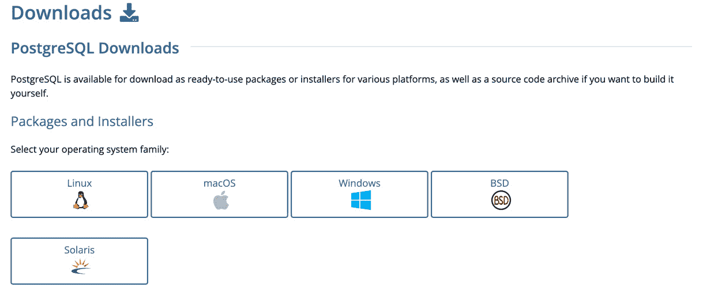
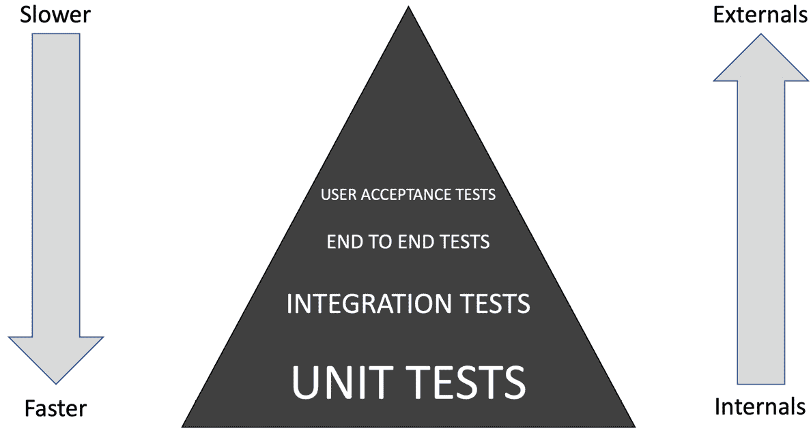
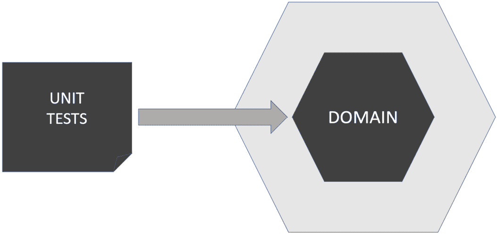
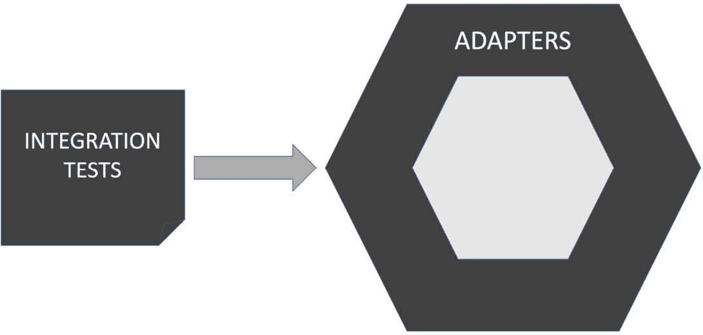
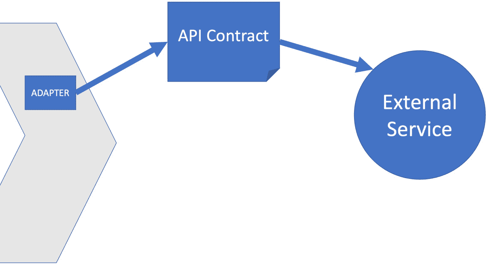
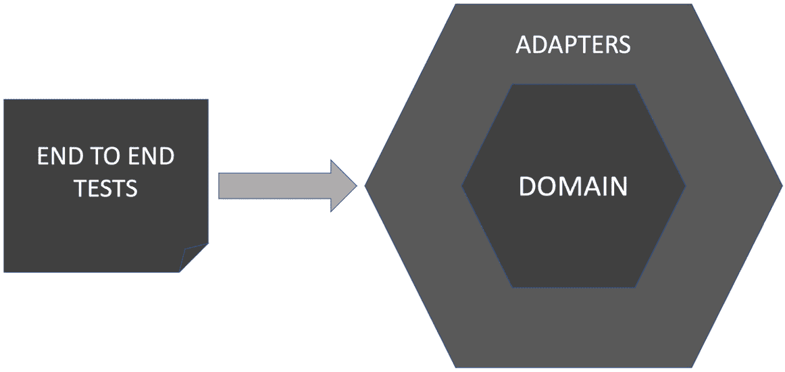
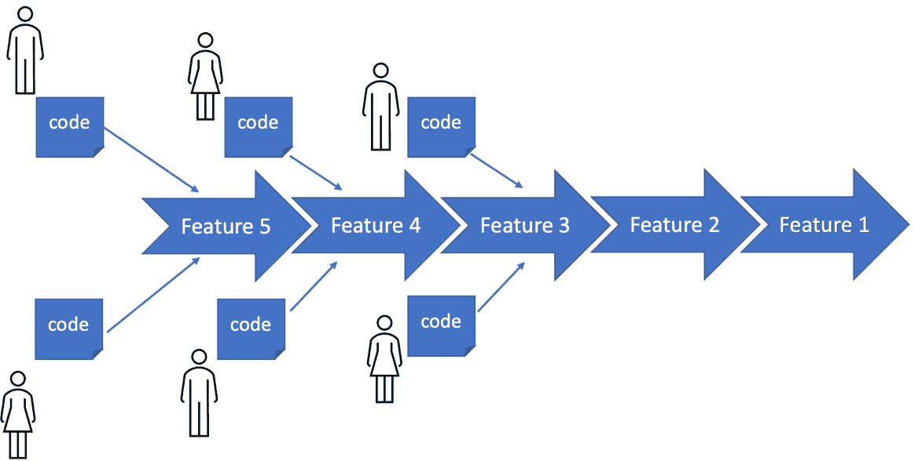
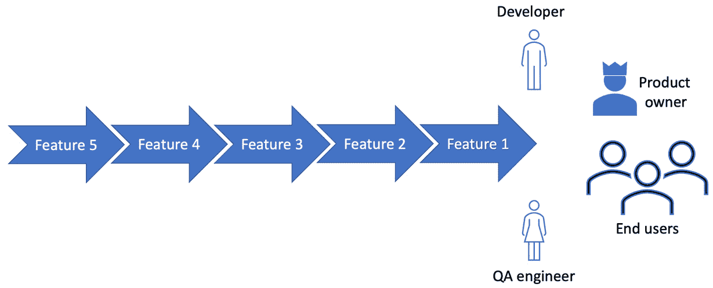
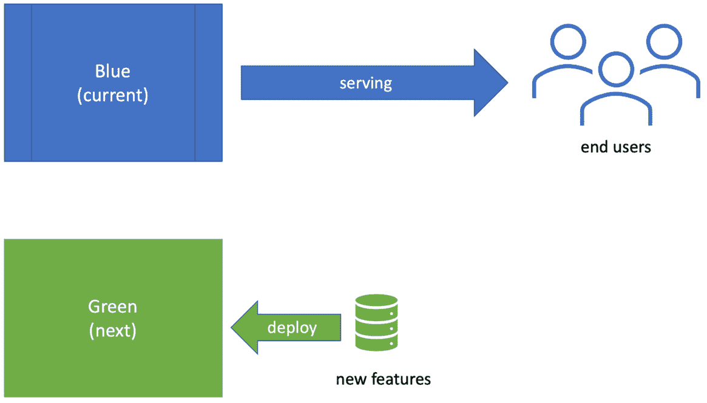
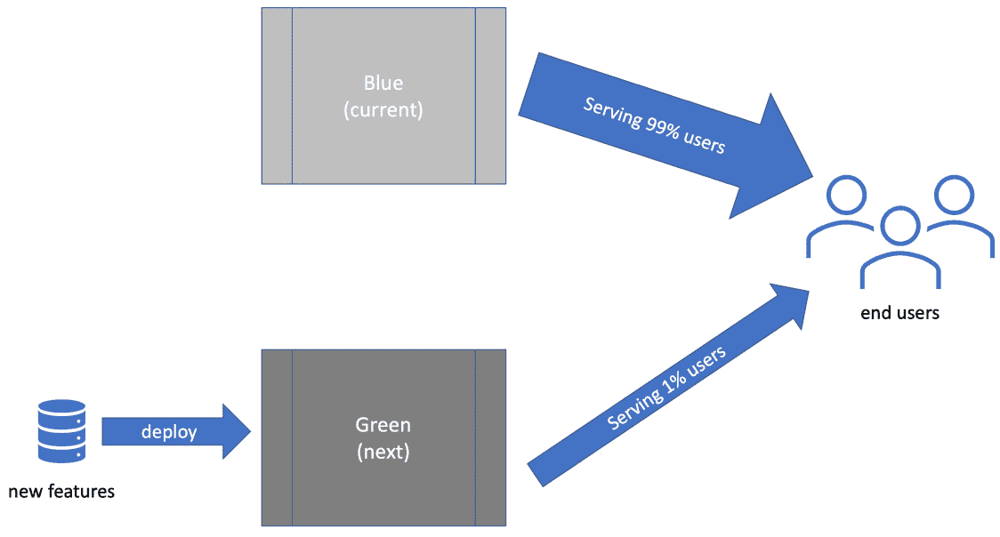

# 第十章：FIRST 测试和测试金字塔

到目前为止，在这本书中，我们已经看到了编写快速运行并给出可重复结果的单元测试的价值。被称为 FIRST 测试，这些测试为我们提供了关于设计的快速反馈。它们是单元测试的黄金标准。我们还看到了如何通过六边形架构帮助我们以最大程度地覆盖 FIRST 单元测试的方式来设计我们的代码。但我们也将自己限制在仅测试我们的领域模型——我们应用程序逻辑的核心。我们简单地没有测试覆盖领域模型连接到外部世界后的行为。

在本章中，我们将涵盖我们需要的所有其他类型的测试。我们将介绍测试金字塔，这是一种思考所需不同类型测试及其数量的方法。我们将讨论每种测试覆盖的内容以及有用的技术和工具来帮助。我们还将通过介绍 CI/CD 管道和测试环境，概述它们在将代码组件组合成最终用户系统中的关键作用。

在本章中，我们将涵盖以下主要内容：

+   测试金字塔

+   单元测试 – FIRST 测试

+   集成测试

+   端到端和用户验收测试

+   CI/CD 管道和测试环境

+   Wordz – 数据库的集成测试

# 技术要求

本章的代码可以在[`github.com/PacktPublishing/Test-Driven-Development-with-Java/tree/main/chapter10`](https://github.com/PacktPublishing/Test-Driven-Development-with-Java/tree/main/chapter10)找到。

要运行此代码，我们需要在本地安装开源的 Postgres 数据库。

要安装 Postgres，请执行以下操作：

1.  在您的浏览器中转到[`www.postgresql.org/download/`](https://www.postgresql.org/download/)。

1.  点击您操作系统的正确安装程序：



图 10.1 – Postgres 安装程序选择

1.  按照您操作系统的说明进行操作。

# 测试金字塔

通过使用**测试金字塔**来思考不同类型的测试是一种非常有用的方法。它是我们代码周围不同类型测试及其相对数量的简单图形表示。本节介绍了测试金字塔背后的关键思想。

测试金字塔的图形形式如下所示：



图 10.2 – 测试金字塔

从前面的图形中我们可以看到，测试被分为四层。我们在底部有单元测试。集成测试建立在那些之上。金字塔由顶部的端到端和用户验收测试完成。图形显示我们的系统中的单元测试数量最多，集成测试较少，验收测试最少。

这本书中的一些测试类型是新的。让我们定义它们是什么：

+   **单元测试**

这些是熟悉的。它们是我们迄今为止一直在使用的 FIRST 测试。这些测试的一个定义特征是它们不需要任何外部系统的存在，例如数据库或支付处理器。

+   **集成测试**

这些测试验证软件组件是否正确地与外部系统（如数据库）集成。这些测试速度较慢，并且关键依赖于外部环境是否可用以及是否正确设置以供我们的测试使用。

+   **端到端测试**

这些是最广泛的测试。端到端测试代表的是非常接近最终用户体验的东西。这个测试是对系统的所有真实组件进行的，可能在测试环境中使用测试数据，使用与真实用户相同的命令。

+   **用户** **验收测试**

这是在用户会使用它的方式测试真实系统的地方。在这里，我们可以确认最终系统符合用户给出的要求，适合使用。

起初并不明显，为什么减少任何类型的测试数量会是一个优势。毕竟，到目前为止，这本书中所有内容都积极赞扬了测试的价值。为什么我们不简单地进行*所有测试*呢？答案是一个实用主义的观点：并非所有测试都是平等的。它们并不都为我们作为开发者提供相同的价值。

这个金字塔形状的原因是为了反映每个测试层的实际价值。作为 FIRST 测试编写的单元测试是*快速*和*可重复的*。如果我们能够仅用这些单元测试构建一个系统，我们当然会的。但是单元测试并不测试我们代码库的每个部分。具体来说，它们并不测试我们的代码与外部世界的连接，也不以用户使用它的方式测试我们的应用程序。随着我们通过测试层级的提升，我们逐渐从测试软件的*内部*组件转向测试它与*外部*系统以及最终我们的应用程序用户的交互。

测试金字塔是关于*平衡*的。它的目标是创建能够实现以下目标的测试层：

+   尽可能快地运行

+   尽可能覆盖尽可能多的代码

+   尽可能预防尽可能多的缺陷

+   最小化测试工作的重复

在接下来的章节中，我们将查看测试金字塔每一层所涉及的测试的分解。我们将考虑每种测试的优缺点，使我们能够理解测试金字塔引导我们走向的方向。

# 单元测试 – FIRST 测试

在本节中，我们将探讨测试金字塔的基础，它由单元测试组成。我们将研究为什么这一层对成功至关重要。

到现在为止，我们对 FIRST 单元测试非常熟悉。前几章已经详细介绍了这些内容。它们是单元测试的黄金标准。它们运行速度快。它们可重复且可靠。它们相互独立运行，因此我们可以选择运行一个或多个，并且可以按任何顺序运行。FIRST 测试是 TDD 的强大动力，使我们能够在编码时拥有快速的反馈循环。理想情况下，所有代码都应包含在这个反馈循环中。它提供了一种快速、高效的工作方式。在每一步，我们都可以执行代码并证明它按预期工作。作为有益的副产品，通过编写测试来锻炼我们代码中每个可能的可取行为，我们将最终锻炼到每个可能的代码路径。当我们这样工作时，我们将获得 100%的*有意义*测试覆盖率。

由于它们的优点，单元测试构成了我们测试策略的基础。它们在测试金字塔中代表基础。

单元测试具有优点和局限性，如下表总结：

| **优点** | **局限性** |
| --- | --- |
| 这些是运行最快的测试，为我们提供了代码的最快反馈循环。 | 这些测试的范围较小，因此所有单元测试通过并不能保证整个系统运行正确。 |
| 稳定且可重复，不依赖于我们无法控制的事物。 | 可能会与实现细节过于紧密地绑定，使得未来的添加和重构变得困难。 |
| 可以提供非常详细的特定逻辑覆盖。准确定位缺陷。 | 对于测试与外部系统的交互没有帮助。 |

表 10.1 – 单元测试的优点和缺点

在任何系统中，我们都期望在单元级别拥有最多的测试。测试金字塔以图形方式表示这一点。

在现实世界中，仅使用单元测试无法实现全面覆盖，但我们可以改善我们的情况。通过将六边形架构应用于我们的应用程序，我们可以使大部分代码处于单元测试之下。我们快速运行的单元测试可以覆盖大量内容，并为我们应用程序的逻辑提供大量信心。我们可以知道，如果外部系统按我们预期的方式表现，我们的领域层代码将能够正确处理我们考虑过的每个用例。

使用单元测试单独进行测试时的测试位置如图所示：



图 10.3 – 单元测试覆盖领域模型

单元测试只测试我们的领域模型组件。它们不测试外部系统，也不使用外部系统。它们依赖于测试替身来模拟我们的外部系统。这给我们带来了开发周期速度上的优势，但缺点是那些外部系统的连接仍然未经过测试。如果我们有一段经过单元测试的代码访问存储库接口，我们知道它的逻辑与存根存储库兼容。它的内部逻辑甚至有 100%的测试覆盖率，这是有效的。但我们还不知道它是否与真实存储库兼容。

适配器层代码负责这些连接，并且它不在单元测试级别进行测试。为了测试这一层，我们需要一种不同的测试方法。我们需要测试当我们的领域层代码与实际外部系统集成时会发生什么。

下一节将探讨如何使用一种称为集成测试的测试方法来测试这些外部系统适配器。

# 集成测试

在本节中，我们将探讨测试金字塔中的下一层：集成测试。我们将了解其重要性，回顾有用的工具，并理解集成测试在整个方案中的作用。

**集成测试**存在是为了测试我们的代码能否成功与外部系统集成。我们的核心应用程序逻辑通过单元测试进行测试，而单元测试的设计原则是不与外部系统交互。这意味着我们需要在某个时候测试与那些外部系统的行为。

集成测试是测试金字塔的第二层。它们具有优点和局限性，如下表总结：

| **优点** | **局限性** |
| --- | --- |
| 测试软件组件在连接时是否正确交互 | 需要设置和维护测试环境 |
| 提供更接近实际使用软件系统的模拟 | 测试运行速度比单元测试慢 |
|  | 易受测试环境中的问题影响，例如数据错误或网络连接故障 |

表 10.2 – 集成测试的优点和缺点

集成测试的数量应该少于单元测试。理想情况下，要少得多。虽然单元测试通过使用测试替身避免了测试外部系统的许多问题，但集成测试现在必须面对这些挑战。本质上，它们更难设置。它们*可以*更不可重复。它们通常比单元测试运行得更慢，因为它们需要等待外部系统的响应。

为了让大家有一个概念，一个典型的系统可能有数千个单元测试和数百个验收测试。在这两者之间，我们有几个集成测试。许多集成测试指向设计机会。我们可以重构代码，使我们的集成测试被推到单元测试或提升为验收测试。

另一个减少集成测试数量的原因是由于**不稳定的测试**。不稳定的测试是对有时通过有时失败的测试的昵称。当它失败时，是由于与外部系统交互中存在某些问题，而不是我们正在测试的代码中的缺陷。这种失败被称为**假阴性**测试结果——一个可能会误导我们的结果。

不稳定的测试是一个麻烦，正是因为我们无法立即知道失败的根本原因。在没有深入错误日志的情况下，我们只知道测试失败了。这导致开发者学会忽略这些失败的测试，通常选择多次重新运行测试套件，直到不稳定的测试通过。这里的问题是，我们正在训练开发者对他们的测试失去信心。我们正在训练他们忽略测试失败。这并不是一个好的地方。

## 集成测试应该覆盖什么内容？

在我们目前的设计中，我们使用*依赖倒置原则*将外部系统从我们的领域代码中解耦。我们创建了一个接口，定义了我们如何使用该外部系统。将会有一些这个接口的实现，这就是我们的集成测试将要覆盖的内容。在六边形架构术语中，这被称为*适配器*。

这个适配器应该只包含与外部系统交互所需的最小代码量，以满足我们的接口。它不应该包含任何应用程序逻辑。这些逻辑应该在领域层内部，并由单元测试覆盖。我们称之为*瘦适配器*，只做足够的工作以适应外部系统。这意味着我们的集成测试在范围上得到了很好的限制。

我们可以这样表示集成测试的范围：



图 10.4 – 集成测试覆盖适配器层

集成测试只测试适配器层组件，那些直接与外部系统交互的代码片段，例如数据库和 Web 端点。集成测试将创建一个适配器实例，并安排它连接到外部服务的*一个版本*。这是很重要的。我们还没有连接到生产服务。直到集成测试通过，我们才确信我们的适配器代码工作正确。因此，我们还不希望访问真实的服务。我们还希望对这些服务有额外的控制级别。我们希望能够安全且容易地创建测试账户和伪造数据来与适配器一起使用。这意味着我们需要一组类似真实的服务和数据库来使用。这意味着它们必须存在于某个地方并运行。

**测试环境**是我们为集成测试所使用的那些外部系统的配置名称。这是一个运行 Web 服务和数据源的环境，专门用于测试。

测试环境使我们的代码能够连接到真实外部系统的测试版本。与单元测试级别相比，这更接近生产就绪状态。然而，使用测试环境涉及一些挑战。让我们来看看测试数据库和 Web 服务集成时的良好实践。

## 测试数据库适配器

测试数据库适配器的基本方法是在测试环境中设置数据库服务器，并让待测试的代码连接到它。集成测试作为其安排步骤的一部分，将预加载已知数据集到数据库中。然后，测试在行动步骤中运行与数据库交互的代码。断言步骤可以检查数据库，以查看是否发生了预期的数据库更改。

测试数据库的最大挑战是它记得数据。现在，这可能看起来有点明显，因为使用数据库的初衷就是如此。但它与测试的一个目标相冲突：拥有隔离、可重复的测试。例如，如果我们的测试为用户`testuser1`创建了一个新用户账户并将其存储在数据库中，我们再次运行该测试时就会遇到问题。它将无法创建`testuser1`，而是会收到**用户已存在**的错误。

有不同的方法可以克服这个问题，每种方法都有其权衡：

+   **在每个** **测试用例前后从数据库中删除所有数据**

这种方法保留了测试的隔离性，但速度较慢。我们必须在每次测试之前重新创建测试数据库模式。

+   **在适配器测试运行前后删除所有数据**

我们较少地删除数据，允许多个相关测试针对同一数据库运行。由于存储的数据，这会失去测试隔离性，因为数据库将不会处于下一次测试开始时预期的状态。我们必须按特定顺序运行测试，并且它们都必须通过，以避免破坏下一次测试的数据库状态。这不是一个好的方法。

+   **使用** **随机化数据**

在我们的测试中，我们不是创建`testuser1`，而是随机化名称。因此，在某一轮测试中，我们可能会得到`testuser-cfee-0a9b-931f`。在下一轮测试中，随机选择的用户名将不同。存储在数据库中的状态不会与同一测试的另一轮运行冲突。这是另一种保持测试隔离性的方法。然而，这也意味着测试可能更难阅读。它需要定期清理测试数据库。

+   **回滚事务**

我们可以在数据库事务中添加测试所需的数据。我们可以在测试结束时回滚事务。

+   **忽略** **问题**

有时，如果我们与只读数据库一起工作，我们可以添加永远不会被生产代码访问的测试数据，并将其保留在那里。如果这可行，这是一个吸引人的选项，不需要额外的工作。

例如 *database-rider* 这样的工具，可以从 [`database-rider.github.io/getting-started/`](https://database-rider.github.io/getting-started/) 获取，通过提供连接数据库和用测试数据初始化它们的库代码来协助测试。

## 测试网络服务

类似的方法用于测试与网络服务的集成。将网络服务的测试版本设置为在测试环境中运行。适配器代码被设置为连接到这个网络服务的测试版本，而不是真实版本。然后我们的集成测试可以检查适配器代码的行为。测试服务可能会有额外的网络 API，以便我们的测试中的断言进行检查。

再次强调，缺点是测试运行速度较慢，以及由于像网络拥塞这样微不足道的问题而导致测试不稳定的风险。

### 沙盒 API

有时候，托管我们自己的本地服务可能是不可能的，或者至少是不受欢迎的。第三方供应商通常不愿意发布测试版的服务供我们在测试环境中使用。相反，他们通常会提供一个 **沙盒 API**。这是第三方托管而不是我们自己的服务版本。它与他们的生产系统断开连接。这个沙盒允许我们创建测试账户和测试数据，安全地避免影响生产中的任何真实内容。它将像他们的生产版本一样对我们的请求做出响应，但不会采取任何行动，例如收取费用。把它们看作是真实服务的测试模拟器。

## 消费者驱动的合同测试

一种测试与网络服务交互的有用方法是称为 **消费者驱动的合同测试**。我们将我们的代码视为与外部服务有一个合同。我们同意在外部服务上调用某些 API 函数，并按所需的形式提供数据。我们需要外部服务以可预测的方式对我们做出响应，提供已知格式和易于理解的状态码。这形成了双方之间的 *合同* – 我们的代码和外部服务 API。

消费者驱动的合同测试涉及两个组件，基于该合同，通常使用由工具生成的代码。这在上面的图中表示：



图 10.5 – 消费者驱动的合同测试

上述图示显示，我们已经将预期与外部服务的交互捕获为 API 合同。我们为该服务编写的适配器将实现该 API 合同。当使用消费者驱动的合同测试时，我们最终得到两个测试，分别测试该合同的两侧。如果我们认为一个服务是一个黑盒，那么我们有一个由黑盒提供的公共接口，以及一个实现，其细节隐藏在黑盒内部。合同测试是两个测试。一个测试确认外部接口与我们的代码兼容。另一个测试确认该接口的实现工作正常并给出预期的结果。

一个典型的合同测试将需要两段代码：

+   **外部服务的存根**：生成外部服务的存根。如果我们正在调用支付处理器，这个存根在本地模拟支付处理器。这允许我们将其用作编写适配器代码时的测试替身。我们可以针对我们的适配器编写集成测试，配置它调用这个存根。这允许我们在不访问外部系统的情况下测试适配器代码逻辑。我们可以验证适配器是否向该外部服务发送正确的 API 调用，并正确处理预期的响应。

+   **对真实外部服务的一系列调用的回放**：合同还允许我们对真实的外部服务进行测试——可能是在沙盒模式下。在这里，我们不是测试外部服务的功能——我们假设服务提供商已经完成了这项工作。相反，我们正在验证我们对其实际 API 的理解是否正确。我们的适配器已经编写了按特定顺序进行某些 API 调用的代码。这个测试验证了这个假设的正确性。如果测试通过，我们就知道我们对外部服务 API 的理解是正确的，而且它没有发生变化。如果这个测试之前是有效的但现在失败了，那将是一个早期迹象，表明外部服务已经更改了其 API。那时，我们需要更新我们的适配器代码以适应这一变化。

用于此的一个推荐工具称为 Pact，可在[`docs.pact.io`](https://docs.pact.io)找到。阅读那里的指南以获取有关此有趣技术的更多详细信息。

我们已经看到集成测试让我们更接近生产环境。在下一节中，我们将探讨测试金字塔中的最终测试级别，这是迄今为止最接近真实环境的：用户验收测试。

# 端到端测试和用户验收测试

在本节中，我们将逐步推进到测试金字塔的顶端。我们将回顾端到端测试和用户验收测试是什么，以及它们为单元测试和集成测试增添了什么。

测试金字塔的顶端有两种类似的测试，称为**端到端测试**和**用户验收测试**。技术上，它们是同一种测试。在每种情况下，我们都启动了完全配置的软件，以在与其最相似的真实测试环境中运行，或者可能在生产环境中运行。想法是，系统从一端到另一端作为一个整体进行测试。

端到端测试的一个特定用途是进行**用户验收测试**（**UAT**）。在这里，运行了几个关键的端到端测试场景。如果它们都通过了，软件就被宣布适合使用，并被用户接受。这通常是商业开发中的一个合同阶段，其中软件的购买者正式同意开发合同已经得到满足。这仍然是使用精选测试用例进行端到端测试来决定这一点。

这些测试具有优点和局限性，如下表所示：

| **优点** | **局限性** |
| --- | --- |
| 最全面的功能测试。我们正在测试的级别与我们的系统用户 – 无论是人还是机器 – 经历我们的系统相同。 | 运行速度最慢的测试。 |
| 在这个级别的测试关注的是从系统外部观察到的纯行为。我们可以重构和重新设计系统的很大一部分，同时仍然有这些测试保护我们。 | 可靠性问题 – 我们系统设置和环境中的许多问题都可以导致假阴性测试失败。这被称为“脆弱性” – 我们的测试高度依赖于它们的环境正确工作。环境可能由于我们无法控制的情况而损坏。 |
| 合同上重要的 – 这些测试是终端用户关心的本质。 | 这些是所有测试中最具挑战性的，因为它们需要大量的环境设置要求。 |

表 10.3 – 端到端测试的优点和缺点

在金字塔顶端放置验收测试反映的是我们不需要很多这样的测试。现在，我们的大部分代码应该由单元测试和集成测试覆盖，确保我们的应用程序逻辑以及与外部系统的连接都是正确的。

显然的问题是*还需要测试什么*？我们不希望重复在单元和集成级别已经完成的测试。但我们需要某种方式来验证软件*整体*将按预期工作。这是端到端测试的工作。这是我们在配置软件时使其连接到真实数据库和真实外部服务的地方。我们的生产代码已经通过了所有单元测试和测试替身。这些测试通过表明，当我们连接这些真实的外部服务时，我们的代码*应该*能够正常工作。但*应该*是软件开发中的一个美好的狡猾词汇。现在，是时候通过端到端测试来验证这一点了。我们可以使用以下图表来表示这些测试的覆盖率：



图 10.6 – 端到端/用户验收测试覆盖整个代码库

端到端测试覆盖整个代码库，包括领域模型和适配器层。因此，它重复了单元和集成测试已经完成的工作。我们在端到端测试中想要测试的主要技术方面是，我们的软件配置和连接是正确的。在这本书的整个过程中，我们使用了*依赖倒置和注入*来隔离我们与外部系统。我们创建了测试替身并将它们注入。现在，我们必须创建实际的生成代码，即连接到生产系统的真实适配器层组件。我们在系统的初始化和配置期间将这些注入到我们的系统中。这使代码能够真正地工作。

端到端测试将复制一小部分已经被单元和集成测试覆盖的愉快路径测试。这里的目的是*不是*验证我们已经测试过的行为。相反，这些测试通过确认整个系统在连接到生产服务时表现正确，来验证我们已经注入了正确的生产对象。

用户验收测试基于这一理念，通过运行关键测试场景来接受软件作为完整产品。这些将在技术层面上进行端到端测试。但他们的目的比确保我们的系统正确配置的技术目标更广泛：*我们是否构建了我们被要求构建的内容？* 通过结合本书中的迭代方法及其技术实践，我们有更高的可能性做到了这一点。

## 验收测试工具

存在着各种测试库来帮助我们编写自动化的验收和端到端测试。连接数据库或调用 HTTP Web API 这样的任务对于这类测试来说是常见的。我们可以利用库来完成这些任务，而不是自己编写代码。

这些工具之间的主要区别在于它们与我们软件的交互方式。有些旨在模拟用户点击桌面 GUI 或基于浏览器的 Web UI。其他工具将向我们的软件发出 HTTP 请求，测试 Web 端点。

这里有一些值得考虑的流行验收测试工具：

+   **RestEasy**

一个流行的用于测试 REST API 的工具：[`resteasy.dev/`](https://resteasy.dev/)

+   **RestAssured**

另一个流行的用于测试 REST API 的工具，它采用流畅的方法来检查 JSON 响应：[`rest-assured.io/`](https://rest-assured.io/)

+   **Selenium**

一个流行的通过浏览器测试 Web UI 的工具：[`www.selenium.dev/`](https://www.selenium.dev/)

+   **Cucumber**

可从 [`cucumber.io/`](https://cucumber.io/) 获取。Cucumber 允许领域专家用类似英语的描述来编写测试。至少，这是理论。我在参与的任何项目中都没有见过除了开发者之外的人编写 Cucumber 测试。

验收测试构成了测试金字塔的最后一部分，允许我们的应用程序在类似于生产环境的情况下进行测试。所需的一切就是自动化运行所有这些测试层的方法。这就是 CI/CD 流水线发挥作用的地方，它们是下一节的主题。

# CI/CD 流水线和测试环境

CI/CD 流水线和测试环境是软件工程的重要组成部分。它们是开发工作流程的一部分，将我们从编写代码带到用户手中的系统。在本节中，我们将探讨这些术语的含义以及我们如何在项目中使用这些想法。

## 什么是 CI/CD 流水线？

让我们从定义这些术语开始：

+   CI 代表 **持续集成**

集成是指我们将单个软件组件组合在一起，形成一个整体。持续集成意味着我们在编写新代码时一直这样做。

+   CD 代表**持续交付**或**持续部署**

我们稍后会讨论两者的区别，但在两种情况下，我们的想法都是将我们集成软件的最新和最佳版本交付给利益相关者。持续交付的目标是，如果我们愿意，我们可以通过点击一个按钮将每一个代码更改部署到生产环境中。

重要的是要注意，CI/CD 是一种**工程学科**——而不是一系列工具。然而我们如何实现它，CI/CD 的目标是构建一个始终处于可用状态的单一系统。

## 我们为什么需要持续集成？

在测试金字塔的术语中，我们需要 CI/CD 的原因是将所有测试集中在一起。我们需要一个机制来构建我们软件的整体，使用最新的代码。在我们打包和部署代码之前，我们需要运行所有测试并确保它们全部通过。如果任何测试失败，我们知道代码不适合部署。为了确保我们能够快速获得反馈，我们必须按照从快到慢的顺序运行测试。我们的 CI 管道将首先运行单元测试，然后是集成测试，接着是端到端和验收测试。如果任何测试失败，构建将生成该阶段的测试失败报告，然后停止构建。如果所有测试都通过，我们将打包我们的代码，准备部署。

更普遍地说，**集成**的概念对于构建软件是基本的，无论我们是单独工作还是在开发团队中工作。当我们单独工作时，遵循本书中的实践，我们正在用几个构建块构建软件。其中一些是我们自己制作的，而对于其他一些，我们选择了合适的库组件并使用了它。我们还编写了适配器——允许我们访问外部系统的组件。所有这些都需要集成——作为一个整体组合在一起——以将我们的代码行转换成一个工作系统。

当在一个团队中工作时，集成甚至更为重要。我们不仅需要将我们编写的部分组合在一起，还需要将团队其他成员编写的所有其他部分也组合在一起。整合同事正在进行的工作是紧急的。我们最终是在别人已经编写的基础上进行构建。当我们工作在主集成代码库之外时，存在不包含最新设计决策和可重用代码片段的风险。

下图展示了持续集成的目标：



图 10.7 – 持续集成

持续集成的动机是为了避免经典的瀑布式开发陷阱，即团队作为独立的个体编写代码，遵循计划，只在最后进行集成。很多时候，这种集成无法产生可工作的软件。通常存在一些误解或缺失的部分，意味着组件无法配合。在瀑布项目的这个后期阶段，错误修复成本很高。

不仅大型团队和大型项目会受到影响。我的转折点是在为英国皇家空军红箭表演队编写飞行模拟游戏时。我们两个人共同使用我们商定的 API 来开发这款游戏。当我们第一次尝试集成我们的部分时——当然是在凌晨 3 点，在公司总经理面前——游戏运行了大约三帧然后崩溃了。哎呀！我们缺乏持续集成提供了尴尬的教训。如果早点知道会发生这种情况会更好，尤其是在总经理在场的情况下。

## 为什么我们需要持续交付？

如果持续集成是关于保持我们的软件组件作为一个不断增长的整体的统一，那么持续部署就是将这个整体交付给关心它的人。以下图示说明了持续部署：



图 10.8 – 持续交付

向最终用户交付一系列价值是敏捷开发的核心原则。无论你使用哪种敏捷方法论，将特性交付给用户始终是目标。我们希望定期、短间隔地交付可用的特性。这样做提供了三个好处：

+   **用户获得他们想要的价值**

最终用户并不关心我们的开发过程。他们只关心得到解决他们问题的方案。无论是等待优步乘车时的娱乐问题，还是跨国企业支付所有人工资的问题，我们的用户只想看到问题得到解决。将具有价值的特性带给我们的用户成为一种竞争优势。

+   **我们获得宝贵的** **用户反馈**

*是的，这就是我要求的——但这并不是我的本意!* 这是非常宝贵的用户反馈，敏捷方法可以提供。一旦最终用户看到我们实现的功能，有时，它就会变得明显，它并没有完全解决他们的问题。我们可以迅速纠正这一点。

+   **使代码库和** **开发团队** **保持一致**

要完成这项壮举，你需要让你的团队和工作流程协同一致。除非你的工作流程能够产生已知可工作的软件作为一个整体持续可用，否则你无法有效地做到这一点。

## 持续交付还是持续部署？

这些术语的确切定义似乎各不相同，但我们可以这样思考：

+   **持续交付**

我们向内部利益相关者交付软件，例如产品所有者和 QA 工程师

+   **持续部署**

我们将软件交付到生产环境和最终用户手中

在这两个中，持续**部署**设定了一个更高的标准。它要求一旦我们将代码集成到我们的流水线中，该代码就准备好上线——进入生产环境，面向真实用户。这当然是困难的。它需要顶级的测试自动化来让我们对我们的代码准备好部署有信心。它还受益于在生产环境中拥有快速的回滚系统——如果我们发现测试未覆盖的缺陷，有一些快速回滚部署的方法。持续部署是终极工作流程。对于所有实现它的人来说，周五最后部署新代码根本不会感到恐惧。嗯，也许稍微少一点恐惧。

## 实际的 CI/CD 流水线

大多数项目使用 CI 工具来处理序列任务。流行的工具由 Jenkins、GitLab、CircleCI、Travis CI 和 Azure DevOps 提供。它们都类似地工作，依次执行单独的构建阶段。这就是“流水线”这个名字的由来——它类似于一端装满下一个构建阶段，从管道的另一端出来的管道，如下面的图所示：


图 10.9 – CI 流水线中的阶段

CI 流水线包括以下步骤：

1.  **源代码控制**：有一个共同的存储代码的位置对于 CI/CD 是至关重要的。这是代码集成的地点。流水线从这里开始，通过拉取最新的源代码并执行干净的构建。这防止了由于计算机上存在代码的旧版本而引起的错误。

1.  在 JVM 上运行的 `.jar` 文件。

1.  **静态代码分析**：代码检查器和其它分析工具检查源代码中的风格违规，例如变量长度和命名约定。开发团队可以选择在静态分析检测到特定的代码问题时失败构建。

1.  **单元测试**：所有单元测试都是针对构建后的代码运行的。如果任何测试失败，则流水线停止。测试失败信息会被报告。

1.  **集成测试**：所有集成测试都是针对构建后的代码运行的。如果任何测试失败，则流水线停止，并报告错误信息。

1.  **验收测试**：所有验收测试都是针对构建后的代码运行的。如果所有测试都通过，则代码被认为是正常工作并准备好交付/部署的。

1.  包含嵌入式 Web 服务器的 `.jar` 文件。

接下来会发生什么取决于项目的需求。打包的代码可能会自动部署到生产环境，或者它可能只是放置在一些内部仓库中，供产品所有者和 QA 工程师访问。正式部署将在质量门控制之后发生。

## 测试环境

需要 CI 管道运行集成测试所引起的一个明显问题是需要一个运行这些测试的地方。通常，在生产环境中，我们的应用程序与外部系统（如数据库和支付提供商）集成。当我们运行 CI 管道时，我们不希望我们的代码处理支付或写入生产数据库。然而，我们确实希望测试代码*能够*与这些系统集成，一旦我们配置它连接到这些真实系统。

解决方案是创建一个**测试环境**。这些是我们控制下的数据库和模拟外部系统的集合。如果我们的代码需要与用户详情数据库集成，我们可以创建该用户数据库的副本并在本地运行它。在测试期间，我们可以安排我们的代码连接到这个本地数据库，而不是生产版本。外部支付提供商通常提供沙箱 API。这是他们服务的一个版本，它再次不连接到他们的任何真实客户。它具有模拟其服务的行为。实际上，它是一个外部测试替身。

这种设置被称为**类似实时**或**预发布**环境。它允许我们的代码在更真实的集成中进行测试。我们的单元测试使用存根和模拟。我们的集成测试现在可以使用这些更丰富的测试环境。

### 使用测试环境的优势和挑战

测试环境既有优势也有劣势，如下表总结：

| **优势** | **挑战** |
| --- | --- |
| **环境** **是自包含的**我们可以随意创建和销毁它。它不会影响生产系统。 | **不是** **生产环境**无论我们如何使其类似实时，这些环境都是模拟。风险是，我们的假环境给出假阳性结果——仅因为它们使用了假数据而通过的测试。这可能会给我们带来错误的信心，导致我们部署在生产环境中会失败的代码。真正的测试发生在我们设置代码为实时时。总是。 |
| **比存根更真实**环境让我们更接近在生产和条件下进行测试。 | **创建和维护需要额外努力**需要更多开发工作来设置这些环境并保持它们与测试代码同步。 |
| **检查关于** **外部系统**的假设第三方沙箱环境使我们能够确认我们的代码使用了供应商发布的最新、正确的 API。 | **隐私问题**简单地复制生产数据块并不足以用于测试环境。如果这些数据包含根据 GDPR 或 HIPAA 定义的**个人身份信息**（**PII**），那么我们无法直接合法地使用它。我们必须创建一个额外的步骤来匿名化这些数据或生成伪真实的随机测试数据。这两者都不简单。 |

表 10.4 – 测试环境的优势和挑战

## 生产环境中的测试

我已经听到了惊呼声！在生产中运行我们的测试通常是一个糟糕的想法。我们的测试可能会引入假订单，我们的生产系统会将其视为真实订单。我们可能需要添加测试用户账户，这可能会带来安全风险。更糟糕的是，因为我们处于测试阶段，我们的代码可能还没有工作。这可能会引起各种问题——所有这些都是在连接到生产系统的情况下发生的。

尽管有这些担忧，有时，某些事情必须在生产中进行测试。像谷歌和 Meta 这样的大数据公司，由于数据规模巨大，他们有一些东西只能通过实际运行来测试。无法创建一个有意义的类似真实环境的测试环境；它将太小。在这种情况下我们能做什么呢？

该方法是减轻风险。这里有两种技术很有价值：蓝绿部署和流量分区。

### 蓝绿部署

**蓝绿部署**是一种旨在快速回滚失败部署的部署技术。它通过将生产服务器分为两组来实现。它们被称为*蓝色*和*绿色*，因为它们是中性的颜色，都表示成功。我们的生产代码将随时运行在服务器组中的一组。假设我们目前正在运行在蓝色组。我们的下一个部署将是绿色组。如下面的图所示：



图 10.10 – 蓝绿部署

一旦代码已部署到绿色组，我们就切换生产配置以连接到绿色组服务器。我们在蓝色服务器上保留之前工作的生产代码。如果我们对绿色组的测试顺利，那么我们就完成了。现在生产正在使用最新的绿色组代码。如果测试失败，我们将该配置回滚以再次连接到蓝色服务器。这是一个快速回滚系统，使我们能够进行实验。

### 流量分区

除了蓝绿部署之外，我们还可以限制发送到测试服务器的流量。我们不必将生产完全切换到测试中的新代码，我们只需将一小部分用户流量发送到那里。所以，99%的用户可能会被路由到我们已知的蓝色服务器，1%可以路由到绿色服务器上正在测试的新代码，如下面的图所示：



图 10.11 – 流量分区

如果发现缺陷，在我们回滚到 100%蓝色服务器之前，只有 1%的用户会受到 影响。这使我们能够快速回滚，减轻由失败的部署在生产中引起的问题。

我们现在已经涵盖了不同类型测试的角色，并看到了它们如何融入一个被称为测试金字塔的连贯系统。在下一节中，我们将通过编写集成测试将一些知识应用到我们的 Wordz 应用程序中。

# Wordz – 我们数据库的集成测试

在本节中，我们将回顾我们的 Wordz 应用程序的集成测试，以了解它们的样子。我们将在*第十四章*，*驱动数据库层*和*第十五章*，*驱动 Web 层*中详细说明编写这些测试和设置测试工具的细节。

## 从数据库中获取一个单词

在我们之前的设计工作中，我们确定 Wordz 需要一个地方来存储要猜测的候选单词。我们定义了一个名为`WordRepository`的接口来隔离我们与存储细节。在那个迭代中，我们只定义了一个接口上的方法：

```java
public interface WordRepository {
String fetchWordByNumber( int wordNumber );
}
```

这个 WordRepository 接口的实现将访问数据库，并返回一个给定其`wordNumber`的单词。我们将推迟到*第十四章*，*驱动数据库层*中实现这一功能。现在，让我们先看看集成测试的大致样子。这个测试使用开源库来帮助编写测试，并提供数据库。我们选择了以下内容：

+   一个名为`database-rider`的开源库（可在[`database-rider.github.io/getting-started/`](https://database-rider.github.io/getting-started/)获取）作为测试工具

+   Postgres，一个流行的开源关系型数据库，用于存储我们的数据

下面是测试代码：

```java
package com.wordz.adapters.db;
import com.github.database.rider.core.api.connection.ConnectionHolder;
import com.github.database.rider.core.api.dataset.DataSet;
import com.github.database.rider.junit5.api.DBRider;
import org.junit.jupiter.api.BeforeEach;
import org.junit.jupiter.api.Test;
import org.postgresql.ds.PGSimpleDataSource;
import javax.sql.DataSource;
import static org.assertj.core.api.Assertions.assertThat;
@DBRider
public class WordRepositoryPostgresTest {
    private DataSource dataSource;
    @BeforeEach
    void beforeEachTest() {
        var ds = new PGSimpleDataSource();
        ds.setServerNames(new String[]{"localhost"});
        ds.setDatabaseName("wordzdb");
        ds.setUser("ciuser");
        ds.setPassword("cipassword");
        this.dataSource = ds;
    }
    private final ConnectionHolder connectionHolder = () ->
        dataSource.getConnection();
    @Test
    @DataSet("adapters/data/wordTable.json")
    public void fetchesWord()  {
        var adapter = new WordRepositoryPostgres(dataSource);
        String actual = adapter.fetchWordByNumber(27);
        assertThat(actual).isEqualTo("ARISE");
    }
}
```

`fetchesWord()`测试方法由`@DataSet`注解标记。这个注解由*database-rider*测试框架提供，并形成我们测试的安排步骤。它指定了一个已知测试数据文件，该框架将在测试运行之前将其加载到数据库中。数据文件位于`src/test/resources`根文件夹下。注解中的参数给出了其余路径。在我们的情况下，文件将位于`src/test/resources/adapters/data/wordTable.json`。其内容如下：

```java
{
  "WORD": [
    {
      "id": 1,
      "number": 27,
      "text": "ARISE"
    }
  ]
}
```

这个 JSON 文件告诉`database-rider`框架，我们希望向名为`WORD`的数据库表中插入一行，列值为`1`、`27`和`ARISE`。

我们现在还不打算编写适配器代码来使这个测试通过。我们需要采取几个步骤来使这个测试能够编译，包括下载各种库和启动 Postgres 数据库。我们将在*第十四章*，*驱动数据库层*中详细说明这些步骤。

这段集成测试代码的概述是，它正在测试一个名为`WordRepositoryPostgres`的新类，这是我们将要编写的。这个类将包含数据库访问代码。我们可以看到标志性的 JDBC 对象，`javax.sql.DataSource`，它代表一个数据库实例。这是我们在测试与数据库集成时的线索。我们可以看到来自数据库测试库的新注解：`@DBRider`和`@DataSet`。最后，我们可以看到一些立即可以识别的东西——测试的安排、行动和断言步骤：

1.  安排步骤创建一个`WordRepositoryPostgres`对象，它将包含我们的数据库代码。它使用`database-rider`库的`@DataSet`注解在测试运行之前将一些已知数据放入数据库中。

1.  行动步骤调用`fetchWordByNumber()`方法，传入我们想要测试的数字`wordNumber`。这个数字与`wordTable.json`文件的内容相匹配。

1.  断言步骤确认从数据库返回的预期单词，`ARISE`。

如我们所见，集成测试在本质上与单元测试并没有太大的不同。

# 摘要

在本章中，我们看到了测试金字塔是如何作为一个系统来组织我们的测试努力的，它坚定地将 FIRST 单元测试作为我们所有工作的基础，但并没有忽视其他测试关注点。首先，我们介绍了集成测试和验收测试作为测试我们系统更多部分的方法。然后，我们探讨了 CI 和 CD 技术如何保持我们的软件组件在一起，并频繁地准备好发布。我们看到了如何使用 CI 管道将整个构建过程整合在一起，可能继续到 CD。我们在 Wordz 上取得了一点点进展，通过为`WordRepositoryPostgres`适配器编写集成测试，为我们编写数据库代码本身奠定了基础。

在下一章中，我们将探讨手动测试在我们项目中的作用。现在很明显，我们将尽可能多地自动化测试，这意味着手动测试的角色不再意味着遵循庞大的测试计划。然而，手动测试仍然非常有价值。这个角色是如何变化的？我们将在下一章回顾。

# 问题与答案

以下是一些关于本章材料的问题及其答案：

1.  为什么测试金字塔被表示为金字塔形状？

形状描述了一个由许多单元测试组成的广泛基础。它显示了在那些测试更高层次集成系统的测试层。它还显示我们预计在那些更高层次的集成级别上测试较少。

1.  单元测试、集成测试和验收测试之间的权衡是什么？

    +   单元测试：快速、可重复。不要测试与外部系统的连接。

    +   集成测试：较慢，有时不可重复。它们测试与外部系统的连接。

    +   验收测试：所有测试中最慢的。它们可能不可靠，但提供了对整个系统最全面的测试。

1.  测试金字塔是否保证了正确性？

不。测试只能揭示缺陷的存在，*永远*不能揭示其不存在。广泛测试的价值在于我们避免了多少缺陷进入生产环境。

1.  测试金字塔是否仅适用于面向对象编程？

不。这种测试覆盖率策略适用于任何编程范式。我们可以使用任何范式编写代码 - 面向对象、函数式、过程式或声明式。各种类型的测试只取决于我们的代码是否访问外部系统或仅由内部组件组成。

1.  为什么我们不优先选择端到端测试，尽管它们测试整个系统？

端到端测试运行缓慢。它们直接依赖于生产数据库和 Web 服务的运行，或者运行包含那些事物测试版本的测试环境。所需的网络连接以及诸如数据库设置之类的事情可能导致测试给出错误阴性结果。它们失败是因为环境，而不是因为代码错误。由于这些原因，我们设计系统以最大限度地利用快速、可重复的单元测试。 

# 进一步阅读

要了解更多关于本章所涵盖的主题，请查看以下资源：

+   *消费者驱动测试简介*

Pact.io 在其网站上提供了一种流行的开源合同测试工具，[`docs.pact.io`](https://docs.pact.io)。该网站提供了解释视频和关于合同驱动测试益处的有用介绍。

+   *数据库-rider 数据库测试库*

一个与 JUnit5 兼容的开源数据库集成测试库。它可以从[`database-rider.github.io/getting-started/`](https://database-rider.github.io/getting-started/)获取。

+   *现代软件工程，Dave Farley*，*ISBN 978-0137314911*

本书详细解释了持续交付背后的原因以及各种技术实践，如基于主干的开发，以帮助我们实现这一目标。强烈推荐。

+   *最小化持续交付*

关于持续交付所需信息的详细信息：[`minimumcd.org/minimumcd/`](https://minimumcd.org/minimumcd/).
