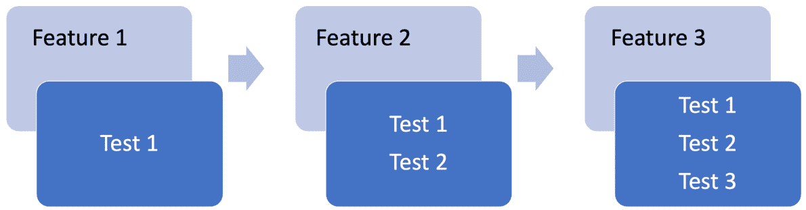
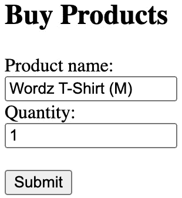
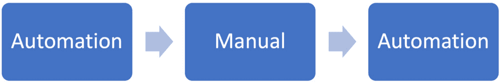
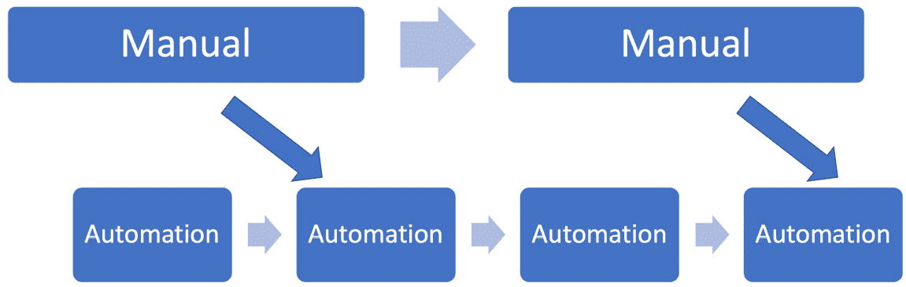

# 第十一章：与质量保证一起探索 TDD

前几章介绍了设计和测试精心设计代码所需的技术实践。所提出的方法主要是为了让开发者能够快速获得软件设计的反馈。测试几乎成了这些努力的副产品。

TDD、持续集成和管道的组合为我们提供了对代码的高度信心。但当谈到软件**质量保证**（**QA**）时，它们并不是整个图景。创建最高质量的软件需要额外的流程，包括人类接触。在本章中，我们将强调手动探索性测试、代码审查、用户体验和安全测试的重要性，以及将人类决策点添加到软件发布中的方法。

在本章中，我们将涵盖以下主要主题：

+   TDD – 在更广泛的质量图景中的位置

+   手动探索性测试 – 发现意外情况

+   代码审查和集成编程

+   用户界面和用户体验测试

+   安全测试和操作监控

+   将手动元素融入 CI/CD 工作流程

# TDD – 在更广泛的质量图景中的位置

在本节中，我们将批判性地审视 TDD 为测试表带来了什么，以及哪些仍然是人类活动。虽然 TDD 无疑作为测试策略的一部分具有优势，但它永远不能成为成功软件系统的整个策略。

## 理解 TDD 的局限性

从主流开发的角度来看，TDD 是一个相对较新的学科。TDD 的现代起源与 Kent Beck 在克莱斯勒综合薪酬系统（参见*进一步阅读*部分，其中介绍了测试优先单元测试的想法）有关。该项目始于 1993 年，Kent Beck 的参与始于 1996 年。

克莱斯勒综合薪酬项目以广泛使用单元测试驱动小型迭代和频繁发布代码为特点。希望我们能从本书前几章中认识到这些想法。自那时以来，许多事情都发生了变化——部署选项不同了，用户数量增加了，敏捷方法更为常见——但测试的目标保持不变。这些目标是为了推动正确的、精心设计的代码，并最终满足用户的需求。

测试自动化的替代方案是在没有自动化的情况下运行测试——换句话说，手动运行它们。一个更好的术语可能是人类驱动的。在测试自动化变得普遍之前，任何开发计划的一个重要部分都是测试策略文档。这些冗长的文档定义了何时进行测试，如何进行测试，以及谁将进行这些测试。

这份策略文档与详细的测试计划并存。这些也会是书面文件，描述要执行的所有测试——如何设置，要测试的确切步骤，以及预期的结果应该是什么。传统的瀑布式项目会花费大量时间来定义这些文档。在某种程度上，这些文档与我们的 TDD 测试代码类似，只是写在纸上，而不是源代码中。

执行这些手动测试计划是一项巨大的工作。运行测试需要我们手动设置测试数据，运行应用程序，然后通过用户界面进行点击。结果必须被记录。发现的缺陷必须记录在缺陷报告中。这些必须反馈到瀑布模型中，触发重新设计和重新编码。这必须发生在每个单独的版本中。*人工驱动的*测试是可重复的，但代价巨大，需要准备、更新和跟踪测试文档。这一切都花费了时间——而且很多时间。

在这个背景下，贝克的 TDD 想法似乎非常引人注目。测试文档变成了可执行的代码，可以按需运行，成本仅为人工测试的一小部分。这是一个令人信服的愿景。测试代码的责任现在成为了开发者世界的一部分。这些测试是源代码本身的一部分。这些测试是自动化的，能够在每次构建时完全运行，并且随着代码的变化而保持更新。

## 是否不再需要手动测试？

很容易认为，使用本书中描述的 TDD 可能会消除手动测试。它确实消除了某些手动过程，但绝对不是全部。我们用自动化取代的主要手动步骤是在开发期间进行的功能测试和发布前的回归测试。

当我们使用 TDD 开发新功能时，我们首先为该功能编写自动化测试。我们编写的每个自动化测试都不需要手动运行。我们节省了所有这些测试设置时间，以及通常需要通过用户界面点击来触发我们正在测试的行为的漫长过程。TDD 带来的主要区别是用在 IDE 中编写的测试代码替换了在文字处理程序中编写的测试计划。开发功能的手动测试被自动化所取代。

TDD（测试驱动开发）还为我们提供了免费的自动化回归测试：



图 11.1 – 回归测试

使用 TDD，我们在构建每个功能时添加一个或多个测试。值得注意的是，我们保留了所有这些测试。我们自然地建立了一个庞大的自动化测试套件，这些测试被捕获在源代码控制中，并在每次构建时自动执行。这被称为回归测试套件。回归测试意味着我们在每次构建时重新检查迄今为止运行的测试。这确保了当我们对系统进行更改时，我们不会破坏任何东西。快速移动且不破坏东西可能就是我们对这种方法的描述。

回归测试还包括对之前报告的缺陷的测试。这些回归测试确认它们没有被重新引入。需要强调的是，回归测试套件在每次套件执行时都节省了非自动化测试所需的全部手动工作。在整个软件生命周期中，这会导致巨大的减少。

测试自动化是好的，但自动化测试是一个软件机器。它不能自己思考。它不能视觉检查代码。它不能评估用户界面的外观。它不能判断用户体验是好是坏。它不能确定整个系统是否适合使用。

这就是人类驱动的手动测试介入的地方。以下章节将探讨我们需要人类引导测试的领域，从显而易见的一个开始：找出测试遗漏的缺陷。

# 手动探索性测试 – 发现意外情况

在本节中，我们将欣赏手动探索性测试在 TDD（测试驱动开发）中作为防御缺陷的重要防线的作用。

对我们使用 TDD 成功最大的威胁在于我们思考所有软件需要处理的条件的能力。任何合理的复杂软件都有巨大的可能输入组合、边缘情况和配置选项。

考虑使用 TDD 编写代码来限制将产品销售给 18 岁及以上买家的销售。我们必须首先编写一个 Happy-path 测试来检查销售是否允许，使其通过，然后编写一个负面测试，确认基于年龄可以阻止销售。这个测试具有以下形式：

```java
public class RestrictedSalesTest {
    @Test
    void saleRestrictedTo17yearOld() {
        // ... test code omitted
    }
    @Test
    void salePermittedTo19yearOld() {
        // ... test code omitted
    }
}
```

当我们在寻找错误时，错误是明显的：在 17 岁和 18 岁之间的边界会发生什么？一个 18 岁的成年人可以购买这个产品吗？我们不知道，因为没有针对那个年龄段的测试。我们测试了 17 岁和 19 岁的人。就那个边界而言，应该发生什么？通常，这是一个利益相关者的决定。

自动化测试无法完成两件事：

+   询问利益相关者他们希望软件做什么

+   发现遗漏的测试

这就是手动探索性测试介入的地方。这是一种充分利用人类创造力的测试方法。它利用我们的本能和智慧来确定我们可能遗漏的测试。然后，它使用科学实验来验证我们对遗漏测试的预测是否正确。如果得到证实，我们可以对这些发现提供反馈并修复缺陷。这可以通过非正式讨论或使用正式的缺陷跟踪工具来完成。在适当的时候，我们可以编写新的自动化测试来捕捉我们的发现，并为未来提供回归测试。

这种探索性测试是一项高度技术性的工作，基于对软件系统中存在哪些类型的边界的了解。它还要求对本地部署和软件系统的设置有广泛的知识，以及了解软件是如何构建的，以及缺陷可能出现的地点。在一定程度上，它依赖于了解开发者的思维方式，并预测他们可能忽略的事情。

自动化测试和探索性测试之间的一些关键差异可以总结如下：

| **自动化测试** | **手动** **探索性测试** |
| --- | --- |
| 可重复 | 创造性 |
| 对已知结果的测试 | 发现未知结果 |
| 可由机器完成 | 需要人类创造力 |
| 行为验证 | 行为调查 |
| 计划 | 机会主义 |
| 代码控制测试 | 人类思维控制测试 |

表 11.1 – 自动化与手动探索性测试

手动探索性测试始终是必要的。即使是最好的开发者也会因为时间紧迫、分心或有另一个应该通过电子邮件召开的会议而感到压力。一旦注意力分散，错误就很容易悄悄溜进来。一些遗漏的测试与我们不能单独看到的边缘情况有关。另一个人类视角常常带来我们单凭自己的能力永远不会有的新见解。手动探索性测试为防止缺陷未被发现提供了重要的一层深度防御。

一旦探索性测试确定了某些意外的行为，我们可以将其反馈到开发中。在那个时刻，我们可以使用 TDD 来编写正确行为的测试，确认缺陷的存在，然后开发修复方案。我们现在有一个修复方案和一个回归测试来确保错误得到修复。我们可以将手动探索性测试视为我们遗漏的缺陷最快可能的反馈循环。关于探索性测试的优秀指南列在*进一步阅读*部分。

从这个角度来看，自动化测试和 TDD 并没有使手动工作变得不重要。相反，它们的价值得到了放大。这两种方法共同工作，将质量融入代码库。

对我们遗漏的事情进行手动测试并不是唯一有价值的发展时间活动，不能自动化。我们还有检查我们源代码质量的任务，这是下一节的主题。

# 代码审查和集体编程

本节回顾了另一个对自动化抵抗性惊人的领域：检查代码质量。

如本书所述，TDD（测试驱动开发）主要关注我们代码的设计。当我们构建单元测试时，我们定义了我们的代码将如何被消费者使用。该设计的实现对我们测试来说无关紧要，但它确实关系到我们作为软件工程师。我们希望该实现能够高效运行，并且易于下一位读者理解。代码在其生命周期中读的次数远多于写的次数。

一些自动化工具存在，可以帮助检查代码质量。这些被称为静态代码分析工具。这个名字来源于它们不运行代码；相反，它们对源代码进行自动审查。Java 的一个流行工具是 Sonarqube（在[`www.sonarqube.org/`](https://www.sonarqube.org/)），它在一组代码库上运行一系列规则。

默认情况下，此类工具会警告以下内容：

+   不遵循变量命名约定

+   未初始化的变量可能导致可能的`NullPointerException`问题

+   安全漏洞

+   程序结构的低效或风险使用

+   违反社区公认的做法和标准

这些规则可以修改和添加，以便根据本地项目风格和规则进行定制。

当然，这种自动化评估也有局限性。与手动探索性测试一样，有些事情只有人类才能做到（至少在撰写本文时是这样）。在代码分析方面，这主要涉及到将上下文带入决策中。这里的一个简单例子是，相比于`int`这样的原始类型，更倾向于使用更长、更具描述性的变量名，例如`WordRepository`。静态工具缺乏对不同上下文的理解。

自动代码分析有其优点和局限性，如下总结：

| **自动分析** | **人工审查** |
| --- | --- |
| 严格的规则（例如，变量名长度） | 根据上下文放宽规则 |
| 应用固定的评估标准 | 应用经验学习 |
| 报告通过/失败结果 | 建议替代改进 |

表 11.2 – 自动分析与人工审查

谷歌有一个非常有趣的系统，称为**谷歌三频仪**。这是一套程序分析工具，它结合了谷歌工程师在制定良好代码规则方面的创造力以及自动化应用这些规则。更多信息，请参阅[`research.google/pubs/pub43322/`](https://research.google/pubs/pub43322/)。

人工审查代码可以以各种方式进行，以下是一些常见的方法：

+   **在** **拉取请求** **上进行代码审查**：

当开发者希望将最新的代码更改集成到主代码库中时，他们会发起一个拉取请求，也称为合并请求。这为另一位开发者提供了一个审查这项工作并提出改进的机会。他们甚至可以直观地发现缺陷。一旦原始开发者做出一致的改变，请求就会被批准，代码就会被合并。

+   **结对编程**：

结对编程是一种工作方式，其中两位开发者同时处理同一项任务。他们持续讨论如何以最佳方式编写代码。这是一个持续审查的过程。一旦任何一位开发者发现问题或提出改进建议，就会发生讨论并做出决定。代码在开发过程中不断得到纠正和改进。

+   **团队编程（****mob）**：

就像结对编程一样，整个团队都参与编写一个任务的代码。这是协作的极致，它不断地将整个团队的专业知识和意见应用于每一行代码。

这里戏剧性的区别在于代码审查发生在代码编写之后，但结对编程和团队编程发生在代码编写过程中。编写代码后的代码审查通常发生得太晚，无法进行有意义的更改。结对和团队编程通过持续审查和改进代码来避免这种情况。一旦发现更改，就会立即进行更改。这可能导致与代码后审查工作流程相比，更早地交付更高质量的输出。

不同的开发情况将采用不同的实践。在每种情况下，添加第二双（或更多）人眼提供了一个机会，进行设计层面的改进，而不是语法层面的改进。

通过这样，我们已经看到了开发者如何通过添加手动探索性测试和代码审查到他们的 TDD 工作中受益。手动技术也对我们用户有益，我们将在下一节中介绍。

# 用户界面和用户体验测试

在本节中，我们将考虑如何评估我们的用户界面对用户的影响。这是另一个自动化带来好处但无法在没有人类参与的情况下完成工作的领域。

## 测试用户界面

用户界面是我们软件系统中唯一对所有人最重要的部分：我们的用户。它们——字面意义上——是他们通向我们世界的窗口。无论我们有一个命令行界面、移动网页应用还是桌面 GUI，我们的用户都会因为我们的用户界面而得到帮助或受阻。

用户界面的成功取决于两个方面都做得很好：

+   它提供了用户需要的（和想要的）所有功能

+   它使用户能够以有效和高效的方式完成他们的最终目标

这两个中的第一个，提供功能，是两个中更程序化的一个。就像我们使用 TDD 来推动我们服务器端代码的良好设计一样，我们也可以在我们的前端代码中使用它。如果我们的 Java 应用程序生成 HTML（称为服务器端渲染）——TDD 的使用变得非常简单。我们测试 HTML 生成适配器，然后完成。如果我们正在使用在浏览器中运行的 JavaScript/TypeScript 框架，我们可以在那里使用 TDD，使用如 Jest（[`jestjs.io/`](https://jestjs.io/））这样的测试框架。

在测试了确保我们向用户提供正确的功能后，自动化变得不那么有用。使用 TDD，我们可以验证我们的用户界面中是否包含所有正确的图形元素。但我们无法判断它们是否满足用户的需求。

考虑这个与我们的 Wordz 应用程序相关的商品购买虚构用户界面：



图 11.2 – 示例用户界面

我们可以使用 TDD 来测试所有这些界面元素——框和按钮——是否存在并且工作正常。但我们的用户会在意吗？以下是我们需要提出的问题：

+   它看起来和感觉好吗？

+   它是否与公司品牌和风格指南一致？

+   对于购买 T 恤的任务，它是否易于使用？

+   它是否向用户呈现一个逻辑流程，引导他们完成任务？

在这个例子中，我们故意对所有这些问题回答“不”。坦白说，这是一个糟糕的用户界面布局。它没有风格，没有感觉，也没有品牌识别度。你必须将产品名称输入到文本字段中。没有产品图片，没有描述，也没有价格！对于电子商务产品的销售页面来说，这个用户界面真的是最糟糕的想象。然而，它将通过我们所有的自动化功能测试。

设计有效的用户界面是一项非常人类化的技能。它涉及到一点心理学，了解人类在面临任务时的行为，结合艺术眼光，并辅以创造力。这些用户界面的特性最好由人类来评估，这为我们的发展过程增加了另一个手动步骤。

## 评估用户体验

用户界面设计与用户体验设计密切相关。

用户体验超越了用户界面上任何单个元素或视图。它是我们用户从开始到结束的整个体验。当我们想要从我们的电子商务商店订购最新的 Wordz T 恤时，我们希望整个过程都很容易。我们希望每个屏幕上的工作流程都明显、无杂乱，并且比出错更容易正确。

确保用户有良好的体验是用户体验设计师的工作。这是一项结合同理心、心理学和实验的人类活动。自动化在这里的帮助有限。一些机械部分可以自动化。明显的候选者包括 Invision（[`www.invisionapp.com/`](https://www.invisionapp.com/))这样的应用程序，它允许我们制作可以交互的屏幕原型，以及 Google 表单，它允许我们在网上收集反馈，无需编写代码来设置。

在创建候选用户体验后，我们可以设计实验，让潜在用户完成一项任务，然后要求他们提供关于他们如何体验的反馈。

一个简单的手动表单足以捕捉这些反馈：

| **经验** | **1（差）-** **5（好）** | **评论** |
| --- | --- | --- |
| 我的任务很容易完成 | 4 | 在你的研究人员的提示下，我完成了任务。 |
| 我在没有说明的情况下自信地完成了我的任务 | 2 | 关于 T 恤尺寸的文本输入字段让我困惑。它能否是一个包含可用选项的下拉菜单？ |
| 界面引导我完成任务 | 3 | 最后还可以接受——但那个文本字段很烦人，所以我给这个任务打了较低的分数。 |

表 11.3 – 用户体验反馈表

用户体验设计主要是一种人类活动。测试结果的评估也是如此。这些工具只能让我们创建我们的愿景的模拟，并收集实验结果。我们必须与真实用户进行会话，征求他们对体验的看法，然后将结果反馈到改进的设计中。

虽然用户体验很重要，但下一节将讨论我们代码的一个关键任务方面：安全和运营。

# 安全测试和运营监控

本节反思了安全和运营关注的重点方面。

到目前为止，我们已经创建了一个工程良好且缺陷极低的软件应用。我们的用户体验反馈是积极的——它易于使用。但如果我们不能保持应用正常运行，所有这些潜力都可能在一瞬间消失。如果黑客攻击我们的网站并伤害用户，情况会变得更糟。

一个不运行的应用程序不存在。运营学科——如今通常被称为 DevOps——旨在保持应用程序健康运行，并在健康开始恶化时提醒我们。

安全测试——也称为**渗透测试**（**pentesting**）——是手动探索性测试的一个特殊案例。根据其本质，我们正在寻找应用中的新漏洞和未知漏洞。这种工作不适合自动化。自动化重复已知的内容；要发现未知的内容需要人类的创造力。

渗透测试是一项学科，它试图绕过软件的安全措施。安全漏洞可能对公司造成昂贵的损失、尴尬或业务中断。用于创建漏洞的攻击通常非常简单。

安全风险可以大致总结如下：

+   我们不应该看到的事情

+   我们不应该改变的事情

+   我们不应该经常使用的事情

+   我们不应该撒谎的事情

当然，这是一个过于简化的说法。但事实仍然是，我们的应用可能容易受到这些破坏性活动的影响——我们需要知道这是否属实。这需要测试。这种测试必须是适应性、创造性、狡猾的，并且需要不断更新。自动化方法不具备这些特点，这意味着安全测试必须成为我们开发过程中的一个手动步骤。

一个很好的起点是回顾最新的**OWASP Top 10 网络应用安全风险**([`owasp.org/www-project-top-ten/`](https://owasp.org/www-project-top-ten/))，并根据列出的风险开始一些基于风险的手动探索性测试。有关**欺骗、篡改、否认、信息泄露、拒绝服务和权限提升**（**STRIDE**）等威胁模型的信息，可以在[`www.eccouncil.org/threat-modeling/`](https://www.eccouncil.org/threat-modeling/)找到。OWASP 还在 https://owasp.org/www-community/Fuzzing 提供了一些关于有用工具的优秀资源。**模糊测试**是一种自动发现缺陷的方法，尽管它需要人工解释失败的测试结果。

与其他手动探索性测试一样，这些临时实验可能会导致一些未来的测试自动化。但真正的价值在于应用于调查未知事物的创造力。

前面的章节已经说明了手动干预对于补充我们的测试自动化努力的重要性。但这是如何与**持续集成/持续交付**（**CI/CD**）方法相匹配的呢？这就是下一节的重点。

# 将手动元素纳入 CI/CD 工作流程

我们已经看到，不仅手动过程在我们的整体工作流程中很重要，而且在某些事情上，它们是不可替代的。但手动步骤如何适应高度自动化的工作流程呢？这就是本节将解决的问题。

将手动流程集成到自动化的 CI/CD 管道中可能很困难。从线性、可重复的活动序列来看，这两种方法并不是天然伙伴。我们采取的方法取决于我们的最终目标。我们是否想要一个完全自动化的持续部署系统，或者我们对一些手动中断感到满意？

将手动流程纳入的最简单方法是简单地在一个合适的位置停止自动化，开始手动流程，然后在手动流程完成后恢复自动化。我们可以将这视为一个阻塞工作流程，因为在管道中的所有后续自动化步骤都必须停止，直到手动工作完成。这在下图中得到了说明：



图 11.3 – 阻塞工作流程

通过将我们的开发过程组织为一系列阶段，其中一些是自动化的，一些是手动的，我们创建了一个简单的阻塞工作流程。这里的阻塞意味着每个阶段都会阻塞价值流。自动化阶段通常比手动阶段运行得更快。

这个工作流程有一些优点，那就是它简单易懂且易于操作。我们交付的每个软件迭代都将运行所有自动化测试以及所有当前的手动流程。从某种意义上说，这个发布是我们当时能做出的最高质量。缺点是每个迭代必须等待所有手动流程完成：



图 11.4 – 双轨工作流程

为了实现非常顺畅的双轨工作流程，一个启用方法是使用整个代码库的单个主分支。所有开发者都提交到这个主分支。没有其他分支。任何正在开发中的功能都通过运行时的`true or false`进行隔离。代码检查这些标志并决定是否运行功能。然后可以进行手动测试，而无需暂停部署。在测试期间，正在开发中的功能通过相关的功能标志启用。对于一般最终用户，正在开发中的功能被禁用。

我们可以选择最适合我们的交付目标的方法。阻塞工作流程以更长的交付周期为代价，减少了返工。双轨方法允许更频繁地交付功能，但存在风险，即在手动过程发现并修复之前，生产中可能存在缺陷。

选择合适的流程涉及在功能发布周期和容忍缺陷之间进行权衡。无论我们选择什么，目标都是将整个团队的专长集中在创建低缺陷率的软件上。

在平衡自动化工作流程与人工、人类工作流程之间并不容易，但这确实能够将最多的人类直觉和经验融入产品中。这对我们的开发团队和用户都是有益的。他们从应用中获得了改进的易用性和鲁棒性。希望这一章已经向你展示了我们如何结合这两个世界，跨越传统的开发者-测试者之间的鸿沟。我们可以打造一个优秀的团队，致力于实现一个卓越的结果。

# 摘要

本章讨论了在开发过程中各种手动过程的重要性。

尽管 TDD 有其优点，但我们已经看到了 TDD 无法防止软件中所有类型的缺陷。首先，我们讨论了将人类创造力应用于手动探索性测试的好处，在那里我们可以发现我们在 TDD 中遗漏的缺陷。然后，我们强调了代码审查和分析带来的质量改进。我们还讨论了创建和验证具有令人满意的用户体验的优秀用户界面的非常手动性质。接下来，我们强调了在保持实时系统良好运行方面进行安全测试和运营监控的重要性。最后，我们回顾了将手动步骤集成到自动化工作流程中的方法，以及我们需要做出的权衡。

在下一章中，我们将回顾一些与何时何地开发测试相关的工作方式，然后进入本书的*第三部分*，在那里我们将完成我们的 Wordz 应用程序的构建。

# 问题和答案

以下是一些关于本章内容的问题和答案：

1.  TDD 和 CI/CD 管道是否消除了手动测试的需要？

不。它们已经改变了价值所在的地方。一些手动流程已经变得无关紧要，而另一些则变得更加重要。传统上，手动步骤，如遵循测试文档进行功能测试和回归测试，现在不再需要。运行功能和回归测试已经从在文字处理器中编写测试计划转变为在集成开发环境（IDE）中编写测试代码。但对于许多以人为中心的任务来说，在循环中保持人类思维对于成功至关重要。

1.  人工智能（AI）会自动化剩余的任务吗？

这是个未知数。在 2020 年代初，人工智能的进步可能会改善视觉识别和静态代码分析。可以想象，人工智能图像分析有一天可能能够提供关于可用性的良好/不良分析——但这纯粹是基于人工智能今天生成艺术作品的能力的推测。这种事情可能仍然是不可能的。就目前的实际建议而言，假设本章中推荐的手动流程在一段时间内仍将保持手动操作。

# 进一步阅读

要了解更多关于本章所涉及的主题，请查看以下资源：

+   [`dl.acm.org/doi/pdf/10.1145/274567.274574`](https://dl.acm.org/doi/pdf/10.1145/274567.274574):

Kent Beck 对现代 TDD 起源的概述。虽然这些想法确实早于这个项目，但这却是现代 TDD 实践的中央参考。这篇论文包含了关于软件开发和团队的重要见解——包括“让它运行，让它正确，让它快速”的引言，以及我们不应该总感觉像是在工作的必要性。值得一读。

+   探索它，Elizabeth Hendrickson，ISBN 978-1937785024。

+   [`trunkbaseddevelopment.com/`](https://trunkbaseddevelopment.com/).

+   [`martinfowler.com/articles/feature-toggles.html`](https://martinfowler.com/articles/feature-toggles.html).

+   受启发的：如何创造客户喜爱的科技产品，Marty Cagan，ISBN 978-1119387503：

一本关于产品管理的有趣书籍。虽然这在 TDD 开发者书籍中可能看起来有些奇怪，但本章中的许多想法都来自在双轨敏捷项目中跟随这本书的开发者经验。双敏捷意味着在功能发现上的快速反馈循环会输入到快速的敏捷/TDD 交付中。本质上，手动 TDD 是在产品需求级别进行的。这本书是关于现代产品管理的有趣读物，它采用了 TDD 原则来快速验证关于用户功能的假设。本章中的许多想法旨在提高产品级别的软件。
