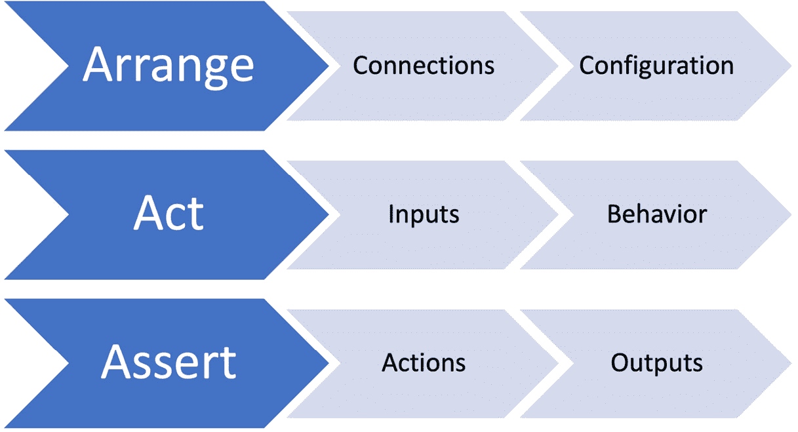
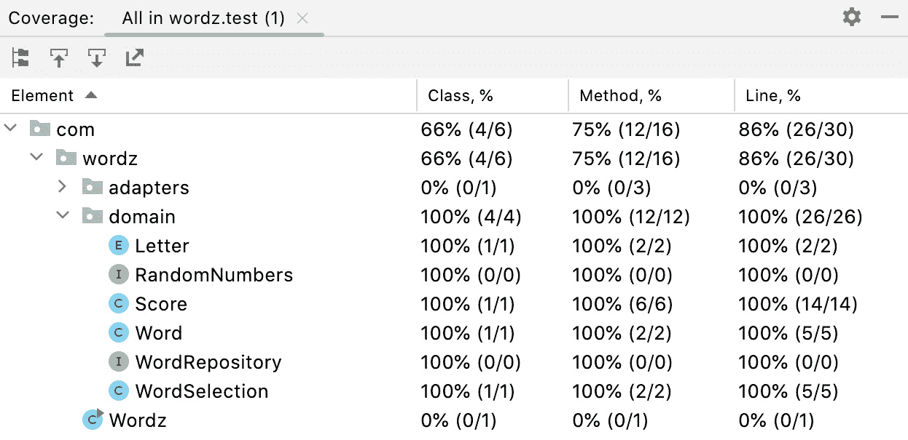
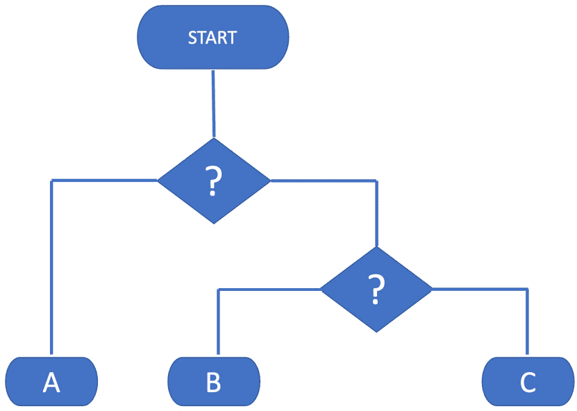
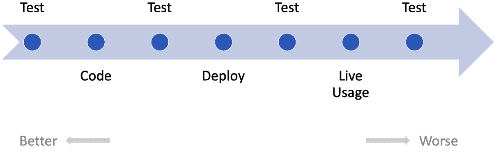
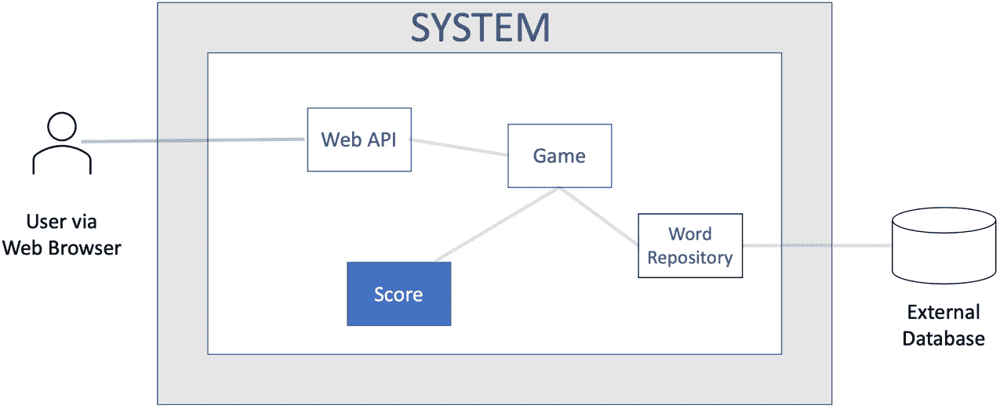
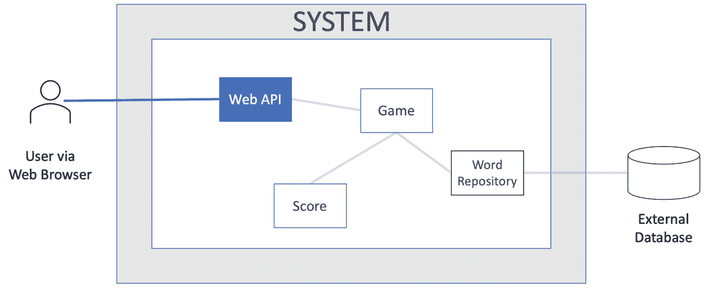
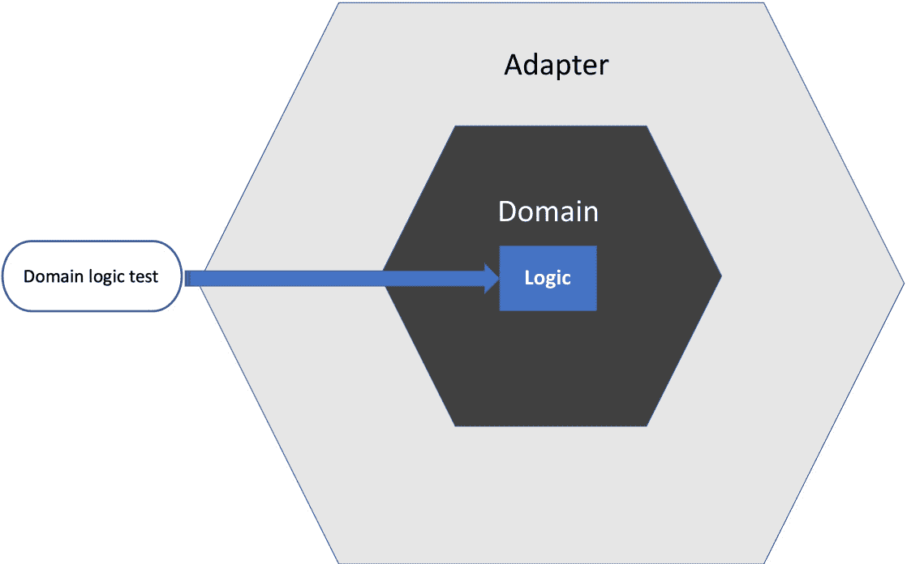
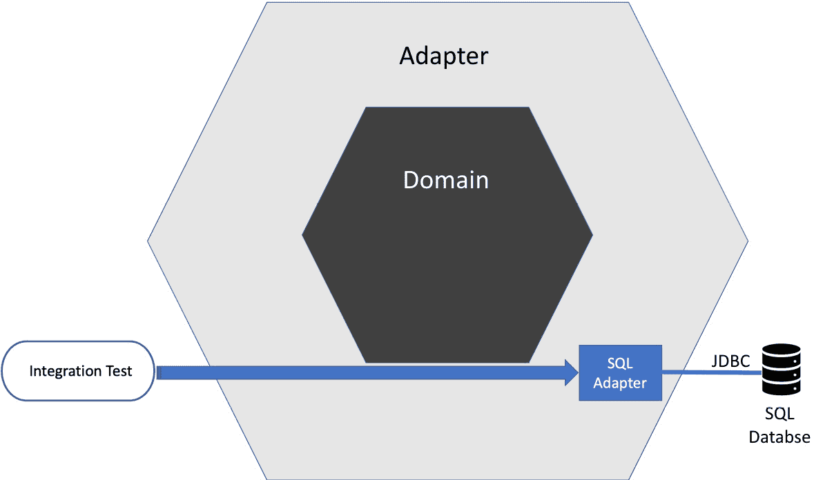
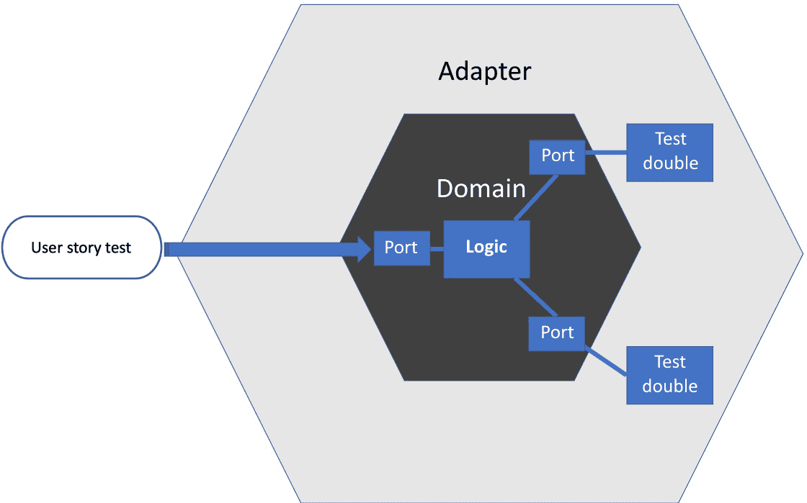

# 12

# 测试先行，测试后行，从不测试

在本章中，我们将回顾**测试驱动开发**（**TDD**）的一些细微差别。我们已经涵盖了编写单元测试的整体测试策略中的广泛技术。我们可以使用测试金字塔和六边形架构来指导测试的范围，具体来说，它们需要覆盖什么。

我们还需要决定两个额外的维度：何时以及在哪里开始测试。第一个问题是关于时间的问题。我们应该总是在编写代码之前编写测试吗？在代码之后编写测试会有什么不同？实际上，完全不测试——这有没有意义？在哪里开始测试是另一个需要决定的变量。在 TDD（测试驱动开发）方面，有两种不同的观点——从内部到外部或从外部到内部进行测试。我们将回顾这些术语的含义以及它们对我们工作的影响。最后，我们将考虑这些方法如何与六边形架构结合，形成一个自然的测试边界。

在本章中，我们将涵盖以下主要主题：

+   先添加测试

+   我们不是总能稍后测试吗？

+   测试？那是给不会写代码的人准备的！

+   从内部到外部进行测试

+   从外部到内部进行测试

+   使用六边形架构定义测试边界

# 先添加测试

在本节中，我们将回顾在编写生产代码之前先添加测试以使其通过时的权衡。

前几章遵循了测试先行的编写代码方法。我们在编写生产代码之前编写测试以使其通过。这是一个推荐的方法，但了解与之相关的某些困难以及考虑其好处同样重要。

## 测试先行是一种设计工具

编写测试先行的最重要的好处是测试可以作为*设计辅助工具*。当我们决定在测试中写什么时，我们正在设计代码的接口。以下图表展示了每个测试阶段如何帮助我们考虑软件设计的各个方面：



图 12.1 – 测试先行辅助设计

**安排**步骤帮助我们思考待测试代码与整个代码库的更大图景之间的关系。这一步骤帮助我们设计代码将如何融入整个代码库。它给我们机会做出以下设计决策：

+   需要哪些配置数据？

+   需要与其他对象或函数建立什么联系？

+   这段代码应该提供什么行为？

+   提供该行为需要哪些额外的输入？

编码行为步骤使我们能够思考我们的代码将有多容易使用。我们反思我们希望我们正在设计的代码的方法签名是什么。理想情况下，它应该是简单且明确的。以下是一些一般性建议：

+   方法名应该描述调用该方法的结果。

+   尽可能地传递尽可能少的参数。可能将参数分组到它们自己的对象中。

+   避免使用布尔标志来修改代码的行为。使用具有适当名称的单独方法。

+   避免要求多次方法调用来完成一项任务。如果我们不熟悉代码，很容易错过序列中的重要调用。

编写行为步骤允许我们看到我们的代码在首次使用时将如何调用。这为我们提供了在代码被广泛使用之前简化并澄清的机会。

我们断言步骤中的代码是我们代码结果的第一消费者。我们可以从这个步骤判断这些结果是否容易获得。如果我们对断言代码的外观不满意，这是一个审查我们的对象如何提供输出的机会。

我们编写的每个测试都提供了这种设计审查的机会。TDD（测试驱动开发）的全部意义在于帮助我们发现更好的设计，甚至比测试正确性更重要。

在其他行业，如汽车设计，拥有专门的设计工具是很常见的。**AutoCAD 3D Studio**用于在计算机上创建汽车底盘的 3D 模型。在我们制造汽车之前，我们可以使用这个工具来预览最终结果，通过旋转空间并从多个角度观看。

在主流的商业软件开发中，设计工具的支持远远落后。我们没有用于设计代码的 3D Studio 的等价物。从 20 世纪 80 年代到 2000 年代，**计算机辅助软件工程**（**CASE**）**工具**的兴起，但这些似乎已经不再使用。CASE 工具声称通过允许用户输入各种图形形式的软件结构，然后生成实现这些结构的代码来简化软件工程。今天，在编写生产代码之前编写 TDD 测试似乎是我们目前拥有的最接近软件计算机辅助设计的工具。

## 测试形成可执行的规范

测试代码的另一个优点是它可以形成一种高度准确、可重复的文档形式。为了实现这一点，测试代码需要简洁和清晰。我们不是编写测试计划文档，而是将 TDD 测试作为代码编写，这些代码可以被计算机运行。这为开发者提供了更直接的好处。这些可执行规范与它们测试的生产代码一起捕获，存储在源代码控制中，并持续提供给整个团队。

进一步的文档很有用。例如，**RAID 日志**——记录风险、行动、问题和决策——以及**KDDs**——记录关键设计决策——通常是必需的。这些是非可执行文档。它们的作用是捕捉谁、何时以及关键地*为什么*做出了重要决策。这类信息无法通过测试代码来捕捉，这意味着这类文档具有价值。

## 测试驱动提供了有意义的代码覆盖率指标

在编写生产代码之前编写测试，为每个测试赋予一个特定的目的。测试的存在是为了驱除我们代码中的特定行为。一旦我们使这个测试通过，我们就可以使用代码覆盖率工具运行测试套件，这将输出一个类似于以下报告的报表：



图 12.2 – 代码覆盖率报告

代码覆盖率工具在我们运行测试时对我们的生产代码进行仪器化。这种仪器化捕获了在测试运行期间执行了哪些代码行。这份报告可以建议我们缺少测试，通过标记出在测试运行期间从未执行过的代码行。

图像中的代码覆盖率报告显示，我们的测试运行已经执行了领域模型中的 100%的代码。拥有 100%的覆盖率完全取决于我们在编写代码之前编写 TDD 测试来使其通过。我们不会在 TDD 测试优先的工作流程中添加未经测试的代码。

## 谨防将代码覆盖率指标作为目标

高代码覆盖率指标并不总是意味着高代码质量。如果我们正在为生成的代码或从库中提取的代码编写测试，那么这种覆盖率并不能告诉我们任何新的信息。我们可能假设——通常——我们的代码生成器和库已经由它们的开发者进行了测试。

然而，代码覆盖率数字的一个真正问题是当我们将其作为指标强制执行时。一旦我们向开发者强加一个最低覆盖率目标，那么**Goodhart 定律**就适用了——*当一项指标成为目标时，它就不再是好的指标了*。在压力之下，人类有时会作弊以实现目标。当这种情况发生时，你会看到这样的代码：

```java
public class WordTest {
    @Test
    public void oneCorrectLetter() {
        var word = new Word("A");
        var score = word.guess("A");
        // assertThat(score).isEqualTo(CORRECT);
    }
}
```

注意那些在`assertThat()`之前的注释符号——`//`？这是测试案例失败的标志，无法在某个截止日期前通过。通过保留测试，我们保持测试用例的数量，并保持代码覆盖率百分比。这样的测试将执行生产代码的行，但它不会*验证*它们是否工作。代码覆盖率目标将被达到——即使代码本身并不工作。

现在，我知道你在想什么——没有开发者会像这样作弊测试代码。然而，这确实是我为一个主要国际客户工作的项目中的一个例子。客户聘请了我工作的公司和另一个开发团队来处理一些微服务。由于时区差异，另一个团队在我们团队睡觉时提交他们的代码更改。

我们在一个早上到达时看到我们的测试结果仪表板亮起了红色。夜间的代码更改导致我们的大量测试失败。我们检查了其他团队的代码管道，惊讶地看到他们的所有测试都通过了。这毫无道理。我们的测试清楚地揭示出那个夜间代码提交中的缺陷。我们甚至可以从我们的测试失败中定位到这个缺陷。这个缺陷本应该在围绕该代码的单元测试中显现出来，但那些单元测试是通过的。原因？注释掉的断言。

另一个团队面临着交付的压力。他们遵守了当天将代码更改检查入库的指示。实际上，这些更改破坏了他们的单元测试。当他们没有足够的时间修复它们时，他们选择欺骗系统，将问题推迟到另一天。我不确定我是否应该责怪他们。有时候，100%的代码覆盖率和所有测试通过实际上什么也不意味着。

## 小心一开始就编写所有测试

TDD（测试驱动开发）的一个优势是它允许*涌现式设计*。我们进行一小部分设计工作，体现在一个测试中。然后我们进行下一小部分设计，体现在一个新的测试中。我们在进行过程中执行不同程度的重构。这样，我们了解我们的方法中哪些是有效的，哪些是不有效的。测试为我们提供了关于设计的快速反馈。

这种情况只会在我们一次写一个测试时发生。对于那些熟悉瀑布式项目方法的人来说，可能会倾向于将测试代码视为一个巨大的需求文档，在开发开始之前完成。虽然这比在文字处理器中简单地编写需求文档看起来更有希望，但它也意味着开发者无法从测试反馈中学习。没有反馈循环。这种测试方法应该避免。通过采取增量方法可以获得更好的结果。我们一次写一个测试，与生产代码一起编写，以确保测试通过。

## 写测试的第一步有助于持续交付

写测试的第一大好处可能在于持续交付的情况。持续交付依赖于高度自动化的管道。一旦代码更改推送到源代码控制，就会启动构建管道，运行所有测试，最后进行部署。

在这个系统中，代码无法部署的唯一原因——假设代码可以编译——是测试失败。这表明我们现有的自动化测试是必要且充分的，以创建所需级别的信心。

写测试的第一步不能保证这一点——我们可能仍然缺少测试——但与所有使用测试的方式相比，它可能是最有可能导致我们对每个关心的应用程序行为都有一个有意义的测试。

本节提出了编写测试先于生产代码以使它们通过，从而有助于增强我们对代码的信心以及有用的可执行规范的观点。然而，这并非编写代码的唯一方式。实际上，我们将看到的一种常见方法是先编写一大块代码，然后不久后编写测试。

下一节将探讨测试后方法的优缺点。

# 我们总是可以稍后进行测试，对吧？

在编写测试代码之前编写代码的另一种方法是先编写代码，然后编写测试。本节比较和对比了在代码之后编写测试与在代码之前编写测试。

编写测试的一种方法涉及编写代码块，然后为这些代码片段添加测试。这是一种在商业编程中使用的做法，其工作流程可以如下所示：


图 12.3 – 测试后工作流程

在选择一个用户故事进行开发后，会编写一个或多个生产代码片段。然后是测试！至少可以说，学术界对于测试后是否与测试优先有所不同的研究似乎存在分歧。从 2014 年 ACM 的一项研究中提取的结论如下：

“*…静态代码分析结果在 TDD 方面具有统计学上的显著性。此外，调查结果还显示，实验中的大多数开发者更喜欢 TLD 而不是 TDD，因为 TLD 的学习曲线要求较低。*”

（来源：[`dl.acm.org/doi/10.1145/2601248.2601267`](https://dl.acm.org/doi/10.1145/2601248.2601267)）

然而，一位评论者指出，在这项研究中，以下情况适用：

“*…只有 13 位开发者中的 13 位提供了可用数据。这意味着统计分析是在使用 7 人组（TDD）和 6 人组（TLD）的群体中进行的。实验缺乏统计效力，结果并不确定的这一发现并不令人惊讶。*”

其他研究论文似乎也显示出类似乏力的结果。那么在实践中，我们应该从中吸取什么教训呢？让我们考虑一些测试后开发的实际细节。

## 测试后方法对 TDD 初学者来说更容易

研究的一个发现是，TDD 初学者发现测试后方法更容易上手。这似乎是合理的。在我们尝试 TDD 之前，我们可能会将编码和测试视为不同的活动。我们根据某些启发式方法编写代码，然后找出如何测试这些代码。采用测试后方法意味着编码阶段基本上不受测试需求的影响。我们可以像以前一样继续编码。我们不需要考虑测试对代码设计的影响。这种看似的优势是短暂的，因为我们发现需要添加测试访问点，但我们至少可以轻松地开始。

如果我们与生产代码同步编写测试，那么稍后添加测试可以合理地工作：编写一点代码，并为该代码编写一些测试——但不是为每个代码路径编写测试仍然是一个风险。

## 测试后使得测试每个代码路径变得更加困难

反对使用测试后方法的合理论点是，跟踪所有所需测试变得更加困难。表面上，这个说法可能并不完全正确。我们总能找到某种方法来跟踪所需的测试。无论何时编写，测试都是测试。

问题在于添加测试之间的时间增加。我们正在添加更多代码，这意味着在整个代码中添加更多执行路径。例如，我们编写的每个`if`语句代表两个执行路径。理想情况下，我们的代码中的每个执行路径都将有一个测试。我们添加的每个未测试的执行路径都使我们低于这个理想数量一个测试。这直接在流程图中展示：



图 12.4 – 展示执行路径

此流程图描述了一个具有嵌套决策点（菱形形状）的过程，这导致三个可能的执行路径，标记为**A**、**B**和**C**。执行路径数量的技术度量称为**圈复杂度**。复杂度得分是根据代码中存在的线性独立执行路径数量计算出的数值。流程图中的代码的圈复杂度为三。

随着我们代码的圈复杂度增加，我们需要记住所有那些需要稍后编写的测试，这增加了我们的*认知负荷*。在某个时候，我们甚至可能发现自己定期停止编码，并写下关于稍后要添加哪些测试的笔记。这听起来像是简单地边编写测试边进行的更艰难版本。

当使用测试优先开发时，避免跟踪尚未编写的测试的问题。

## 测试后使得影响软件设计变得更加困难

测试优先开发的一个好处是反馈循环非常短。我们编写一个测试，然后完成一小部分生产代码。然后根据需要重构。这从瀑布式预计划设计转变为涌现设计。我们根据对正在解决的问题的更多了解来改变我们的设计，因为我们逐步解决更多的问题。

在编写了一块代码之后，再编写测试，就难以融入反馈。我们可能会发现我们创建的代码难以集成到其余代码库中。也许由于接口不明确，这段代码难以使用。鉴于我们为创建混乱的代码所付出的所有努力，我们可能会满足于这种尴尬的设计及其同样尴尬的测试代码。

## 测试后可能永远不会发生

开发通常是一项繁忙的活动，尤其是在涉及截止日期的情况下。时间压力可能意味着我们希望用来编写测试的时间根本就没有。项目经理对新的功能比对测试更感兴趣的情况并不少见。这似乎是一种错误的经济行为 – 因为用户只关心那些*工作*的功能 – 但这是开发者有时面临的一种压力。

本节已表明，在编写代码后不久编写测试可以与先编写测试一样有效，只要我们小心行事。这也似乎是一些开发者 TDD 之旅开始时的首选 – 但如果我们达到从不测试代码的极端，又会怎样呢？让我们快速回顾一下这种方法的后果。

# 测试？那是给那些不会写代码的人准备的！

本节讨论了自动化测试的另一个明显可能性 – 简单地不编写自动化测试，甚至可能完全不测试。这是可行的吗？

完全不测试是一个我们可以做出的选择，这可能不像听起来那么愚蠢。如果我们把测试定义为*验证在目标环境中实现了某些结果*，那么像深空探测器这样的东西在地球上是无法真正测试的。在测试过程中，我们最多只能模拟目标环境。大规模的 Web 应用程序很少能够用真实的负载配置文件进行测试。拿任何一个大型 Web 应用程序，向它投放一亿用户 – 所有人都在做无效的事情 – 看看大多数应用程序的表现如何。这可能不如开发者测试所建议的好。

在某些开发领域，我们可能会期望看到更少的自动化测试：

+   **数据迁移的 ETL**（**提取、转换和加载**）**脚本**：

ETL 脚本通常是单次事件，编写来解决一些特定数据迁移问题。为这些编写自动化测试并不总是值得，而是在类似的数据源集上执行手动验证。

+   **前端用户界面工作**：

根据编程方法的不同，编写前端代码的单元测试可能具有挑战性。无论我们采取什么方法，目前都无法自动化评估视觉外观和感觉。因此，通常会对用户界面的候选版本进行手动测试。

+   **基础设施即代码脚本**：

我们的应用程序需要部署到某个地方才能运行。最近的一种部署方法是使用像 Terraform 这样的语言通过代码来配置服务器。这是一个还不太容易自动化测试的领域。

那么当我们放弃测试自动化，甚至可能完全不测试时，实际上会发生什么呢？

## 如果我们在开发过程中不进行测试会发生什么？

我们可能会认为完全不测试是一个选择，但现实中，测试总会发生在某个时刻。我们可以用一个可能发生测试的时间线来展示这一点：



图 12.5 – 测试时间线

测试优先的方法将测试尽可能提前——称为**左移**的方法——这样缺陷可以廉价且容易地得到纠正。认为我们不会测试只会将测试推迟到用户开始使用功能之后。

最终，*所有用户关心的代码最终都会被测试到*。也许开发者没有测试它。也许测试会落到另一个专门的测试团队，他们会编写缺陷报告。也许缺陷会在软件运行过程中被发现。最常见的情况是，我们将测试外包给用户自己。

让用户为我们测试代码通常是一个坏主意。用户信任我们给他们提供解决他们问题的软件。无论我们的代码中的缺陷阻止了这种情况的发生，我们都会失去这种信任。信任的丧失损害了商业的 3R：收入、声誉和保留。用户可能会转向另一个供应商，其经过更好测试的代码实际上解决了用户的问题。

如果在我们发货之前测试我们的工作有任何可能性，我们应该抓住这个机会。我们越早将测试驱动的反馈循环融入我们的工作，就越容易提高该工作的质量。

在看过我们测试软件的*何时*之后，让我们转向*哪里*测试它。考虑到一个软件的整体设计，我们应该从哪里开始测试？下一节将回顾一种从设计的内部开始并逐步展开的测试方法。

# 从内部到外部测试

在本节中，我们将回顾我们选择 TDD 活动起点的选择。首先看的地方是我们软件系统内部，从细节开始。

当开始构建软件时，我们显然需要一个起点。一个起点是细节。软件由许多相互连接的组件组成，每个组件都执行整个任务的一部分。一些组件来自库代码。许多组件是定制制作的，以提供我们应用程序所需的功能。

那么，开始构建的一个地方是软件系统的*内部*。从一个整体用户故事开始，我们可以想象一个可能对我们有用的小型组件。我们可以从这个组件开始我们的 TDD 工作，看看这会带我们到何处。这是一种自下而上的设计方法，从较小的部分组成整体。

如果考虑我们 Wordz 应用程序结构的简化版本，我们可以如下说明从内到外的方法：



图 12.6 – 从内到外开发

图表显示了突出显示的**Score**组件，这是我们打算使用从内到外的方法开始开发的地方。其他软件组件被灰色显示。我们还没有设计这些部分。我们会从一个测试开始，这个测试是为了我们希望**Score**组件具有的一些行为。我们会从这个起点向外工作。

这种自内而外的 TDD 风格也被称为**经典 TDD**或**芝加哥 TDD**。它是由 Kent Beck 在他的书《通过示例进行测试驱动开发》中最初描述的方法。基本思想是从任何地方开始创建任何有用的代码构建块。然后我们开发一个逐渐增大的单元，它包含了早期的构建块。

自内而外的方法有几个优点：

+   **快速开始开发**：在这种方法中，我们首先测试纯 Java 代码，使用 JUnit 和 AssertJ 等熟悉的工具。没有用户界面、Web 服务存根或数据库的设置。也没有用户界面测试工具的设置。我们直接跳入并使用 Java 编码。

+   **适合已知设计**：随着经验的积累，我们认识到一些问题有已知的解决方案。也许我们之前写过类似的东西。也许我们知道一组有用的设计模式，这将有效。在这些情况下，从我们代码的内部结构开始是有意义的。

+   **与六边形架构良好配合**：自内而外的 TDD 从内部六边形开始工作，即我们应用程序的领域模型。适配器层形成了一个自然的边界。自内而外的设计非常适合这种设计方法。

自然，没有什么是完美的，自内而外的 TDD 也不例外。一些挑战包括以下内容：

+   **浪费的可能性**：我们开始自内而外的 TDD 时，基于对我们认为将需要的某些组件的最佳猜测。有时，后来发现我们可能不需要这些组件，或者我们应该在其他地方重构这些功能。我们的初始努力在某种程度上是浪费的——尽管它将帮助我们达到这个阶段。

+   **实施锁定风险**：与上一个点相关，有时我们在对要解决的问题了解更多信息后，会从最初的设计中继续前进，但我们并不总是认识到沉没成本。我们总是有一种诱惑，即使我们之前写的组件不再那么合适，也要继续使用它，仅仅因为我们投入了时间和金钱去创建它。

自内而外的 TDD 是一种有用的方法，并由 Kent Beck 的书首次推广。然而，如果我们可以从内部开始，那么反过来呢？如果我们从系统的外部开始，然后逐步向内工作会怎样？下一节将回顾这种替代方法。

# 从外部进行测试

由于自内而外的 TDD 既有挑战也有优势，那么自外而内的 TDD 又有什么不同呢？本节回顾了从系统外部开始的不同方法。

自外而内的 TDD 从系统的外部用户开始。他们可能是人类用户或机器，消费我们软件提供的某些 API。这种 TDD 方法首先模拟一些外部输入，例如提交一个网页表单。

测试通常使用某种测试框架——例如 Selenium 或 Cypress 用于 Web 应用程序——允许测试调用特定的 Web 视图，模拟在字段中输入文本，然后点击提交按钮。然后我们可以以正常的方式使这个测试通过，只是这次我们将编写一些直接处理用户输入的代码。在我们的六边形架构模型中，我们将首先编写用户输入适配器。

我们可以这样说明自外向内的方法：



图 12.7 – 自外向内视图

我们可以看到，一个名为**Web API**的组件是我们关注的焦点。我们将编写一个测试，设置足够的应用程序以运行处理 Web 请求的组件。测试将形成一个 Web 请求，将其发送到我们的软件，然后断言发送了正确的 Web 响应。测试还可以对软件本身进行测试，以验证其是否采取了预期的内部操作。我们从外部开始测试，随着开发的进行，我们逐渐向内部移动。

这种 TDD 方法在 Steve Freeman 和 Nat Pryce 的书籍《通过测试引导面向对象软件增长》中有描述。这种技术也被称为**伦敦**或**模拟主义**的 TDD 学派。原因在于它最初流行的地点以及它使用模拟对象。为了测试驱动作为我们首先解决的问题的用户输入适配器，我们需要一个测试替身来代替软件的其余部分。模拟和存根是自外向内 TDD 的固有部分。

自外向内的 TDD，不出所料，有一些优点和缺点。让我们先看看优点：

+   **减少浪费**：自外向内的 TDD 鼓励一种相当最小化的方法来满足外部行为。产生的代码往往高度定制，适用于当前的应用程序。相比之下，自内向外的 TDD 侧重于构建健壮的领域模型，可能提供比最终用户使用的更多功能。

+   **快速交付用户价值**：因为我们从模拟用户请求的测试开始，所以我们编写的代码将满足用户请求。我们可以几乎立即向用户提供价值。

自外向内的 TDD 也有一些缺点，或者至少是局限性：

+   **最少抽象**：相关地，在编写使测试通过所需的最少代码时，自外向内的测试驱动开发（TDD）可能会导致应用逻辑存在于适配器层。这可以在以后重构，但可能会导致代码库组织性较差。

+   **倒置的测试金字塔**：如果我们所有的 TDD 测试努力都集中在外部响应上，那么实际上它们是端到端测试。这与推荐的测试金字塔模式相矛盾，该模式更倾向于在代码库内部使用更快的单元测试。只有较慢、可重复性较低的端到端测试可能会减慢开发速度。

两种传统的 TDD 学派在影响我们将产生的软件设计方面都提供了一定的优势。下一节将探讨六边形架构的影响。从我们将使用六边形方法的想法开始，我们可以结合两种 TDD 学派的优势。我们最终定义了自内而外和自外而内两种 TDD 方法之间的自然测试边界。

# 使用六边形架构定义测试边界

本节的主题是使用六边形架构如何影响 TDD。知道我们正在使用六边形架构为测试金字塔中的不同种类的测试提供了有用的边界。

从一个角度来看，我们如何组织代码库并不影响我们对 TDD 的使用。代码的内部结构只是一个实现细节，是许多可能中的一种，可以使我们的测试通过。尽管如此，有些代码结构比其他结构更容易使用。使用六边形架构作为基础结构确实为 TDD 提供了一些优势。原因在于端口和适配器的使用。

我们从前几章中学到，编写可以在代码运行的特定环境中控制的代码的测试更容易。我们看到了测试金字塔如何为不同种类的测试提供结构。使用端口和适配器方法为代码中的每种测试提供了清晰的边界。更好的是，它为我们提供了将更多测试带到单元测试级别的机会。

让我们回顾一下使用六边形架构编写的软件的每一层最适合哪些类型的测试。

## 自内而外的开发方法与领域模型配合良好

经典的测试驱动开发（TDD）采用自内而外的开发方法，其中我们选择一个特定的软件组件进行测试驱动。这个组件可能是一个单独的函数、一个单独的类，或者是一小群相互协作的类。我们使用 TDD 来测试这个组件作为一个整体，考虑到它提供给消费者的行为。

这种类型的组件位于领域模型中 – 内部六边形：



图 12.8 – 测试领域逻辑

关键优势在于，这些组件易于编写测试，并且这些测试运行得非常快。所有内容都存在于计算机内存中，没有外部系统需要竞争。

另一个优势是，可以在这里以非常精细的粒度对复杂行为进行单元测试。一个例子是测试用于控制工作流程的有限状态机中的所有状态转换。

一个缺点是，如果发生大规模重构，这些细粒度的领域逻辑测试可能会丢失。如果在重构过程中移除了细粒度测试下的组件，其相应的测试将会丢失——但行为仍然会由于重构而存在于其他地方。重构工具无法做到的一件事是确定哪些测试代码与正在重构的生产代码相关联，并自动重构测试代码以适应新的结构。

## 从外部到内部的工作方式与适配器配合得很好

模拟风格 TDD 从外部到内部的角度进行开发。这对于我们的六边形架构中的适配器层来说是一个很好的匹配。我们可以假设核心应用程序逻辑位于领域模型中，并且已经通过快速单元测试在这里进行了测试。这留下了外部的六边形适配器，由集成测试进行测试。

这些集成测试只需要覆盖适配器提供的行为。这应该非常有限。适配器代码仅将外部系统使用的格式映射到领域模型所需的内容。它没有其他功能。

这种结构自然遵循测试金字塔指南。需要的集成测试较少。每个集成测试只测试一小部分行为：



图 12.9 – 测试适配器

这种测试风格独立验证适配器。它将需要一些端到端快乐路径测试来证明整个系统已经正确使用了正确的适配器。

## 用户故事可以在领域模型中进行测试

拥有一个包含所有应用程序逻辑的领域模型的好处是，我们可以测试完整用户故事的逻辑。我们可以用测试替身替换适配器来模拟外部系统的典型响应。然后我们可以使用 FIRST 单元测试来执行完整的用户故事：



图 12.10 – 测试用户故事

优点是 FIRST 单元测试的速度和可重复性。在其他代码结构方法中，我们可能只能在一个测试环境中将用户故事作为端到端测试来执行，所有相关的缺点都会出现。能够在整个领域模型中测试用户故事逻辑——给我们一个高度信心，即我们的应用程序将满足用户的需求。

为了确保这种信心，我们需要适配器层的集成测试，以及一些跨选定用户故事的端到端测试，以确认整个应用程序的连接和配置是正确的。这些高级测试不需要像围绕领域模型进行的用户故事测试那样详细。

在领域模型周围有一个好的用户故事测试集，也使得在领域模型中进行大规模重构成为可能。我们可以有信心在广泛的用户故事测试指导下重构内部六边形。

本节向我们展示了如何将测试金字塔中的不同类型的测试与六边形架构的不同层联系起来。

# 摘要

本章讨论了我们可以编写测试的各个阶段——在我们编写代码之前，编写代码之后，或者甚至可能永远不编写。它提出了在编写代码之前编写测试的观点，认为这可以在有效执行路径覆盖和开发者便利性方面提供最大价值。我们继续回顾了六边形架构如何与 TDD 和测试金字塔相互作用，从而为将用户故事测试引入 FIRST 单元测试领域提供了机会。这允许快速且可重复地验证驱动我们用户故事的核心逻辑。

在下一章——以及本书的第三部分——我们将回到构建我们的 Wordz 应用程序。我们将充分利用我们迄今为止学到的所有技术。我们将从内部开始，从*第十三章*，“驱动领域层”开始。

# 问答

1.  在代码编写后不久编写测试是否与测试优先的 TDD 一样好？

一些研究似乎表明，尽管在这个领域设置具有统计学意义的受控实验非常困难。我们可以考虑的一个因素是我们自己的个人纪律。如果我们晚些时候编写测试，我们是否确信我们会覆盖所有必要的部分？我个人得出结论，我不会记住所有需要覆盖的内容，并将需要做笔记。这些笔记可能最好以测试代码的形式捕捉，从而导致对测试驱动开发（TDD）优先编写测试的偏好。

1.  六边形架构如何影响 TDD？

六边形架构在纯、内核领域逻辑和外部世界之间提供了一个清晰的分离。这使我们能够混合和匹配两种 TDD 学派，因为我们知道设计中有明确的边界，我们可以在此范围内进行编码。内部领域模型支持整个用例进行单元测试，以及任何我们认为必要的详细行为的细粒度单元测试。外部适配器自然适合集成测试，但这些测试不必覆盖太多，因为与我们的领域逻辑相关的逻辑生活在内部领域模型中。

1.  如果我们完全放弃测试，会发生什么？

我们将责任出口给最终用户，他们将为我们进行测试。我们面临收入、声誉和用户保留的损失风险。有时，我们无法完美地复制系统将使用的最终环境。在这种情况下，确保我们尽可能全面地描述和测试我们的系统似乎是明智的。我们至少可以最小化已知的风险。

# 进一步阅读

+   对循环复杂度指标的说明：[`en.wikipedia.org/wiki/Cyclomatic_complexity`](https://en.wikipedia.org/wiki/Cyclomatic_complexity)

+   《持续交付》，作者：Jez Humble 和 Dave Farley，ISBN 978-0321601919

+   《与遗留代码有效协作》，作者：Michael Feathers，ISBN 978-0131177055

+   *通过示例进行测试驱动开发*，Kent Beck 著，ISBN 978-0321146533

+   *面向对象软件增长，由测试引导*，Steve Freeman 和 Nat Pryce 著，ISBN 9780321503626

+   [`arxiv.org/pdf/1611.05994.pdf`](https://arxiv.org/pdf/1611.05994.pdf)

+   *为什么测试驱动开发的研究结果不一致？*，Ghafari, Gucci, Gross 和 Felderer：[`arxiv.org/pdf/2007.09863.pdf`](https://arxiv.org/pdf/2007.09863.pdf)

# 第三部分：现实世界的 TDD

第三部分是我们应用所学所有技术来完成应用程序的地方。Wordz 是一个猜词游戏网络服务。我们基于已经构建的核心领域逻辑进行构建，通过 SQL 访问 Postgres 数据库添加存储，并通过实现 HTTP REST API 提供网络访问。

我们将使用集成测试来测试驱动我们的数据库和 API 实现，利用简化这些任务的测试框架。在本书的最后一章，我们将把所有内容整合起来，自信地运行我们的测试驱动 Wordz 应用程序。

本部分包含以下章节：

+   *第十三章*，*驱动领域层*

+   *第十四章*，*驱动数据库层*

+   *第十五章*，*驱动网络层*
