# 第十四章：驱动数据库层

在本章中，我们将实现领域模型中的一个端口的数据库适配器，该端口由`WordRepository`接口表示。这将允许我们的领域模型从真实数据库（在这种情况下，使用流行的开源数据库**Postgres**）中检索猜测单词。我们将驱动数据库设置和访问数据库的代码的测试驱动开发。为了帮助我们做到这一点，我们将使用一个旨在简化编写数据库集成测试的测试框架，称为**DBRider**。

到本章结束时，我们将编写一个针对运行中的数据库的集成测试，实现`WordRepository`接口中的`fetchesWordByNumber()`方法，并使用**JDBI**数据库访问库来帮助我们。我们将创建一个具有对存储猜测单词的表权限的数据库用户。我们将创建该表，然后编写 JDBI 将用于检索我们正在寻找的单词的 SQL 查询。我们将使用命名参数 SQL 查询来避免由 SQL 注入引起的一些应用程序安全问题。

在本章中，我们将涵盖以下主要主题：

+   创建数据库集成测试

+   实现单词存储库适配器

# 技术要求

本章的最终代码可以在`github.com/PacktPublishing/Test-Driven-Development-with-Java/tree/main/chapter14`找到。

## 安装 Postgres 数据库

在本章中，我们将使用 Postgres 数据库，这需要安装。要安装 Postgres，请按照以下步骤操作：

1.  访问以下网页：`www.postgresql.org/download/`。

1.  按照您操作系统的安装说明进行操作。

代码已与 14.5 版本进行测试。预计将在所有版本上工作。

设置完成后，让我们开始实现数据库代码。在下一节中，我们将使用 DBRider 框架创建数据库集成测试。

# 创建数据库集成测试

在本节中，我们将使用名为 DBRider 的测试框架创建数据库集成测试的框架。我们将使用这个测试来驱动数据库表和数据库用户的创建。我们将致力于实现`WordRepository`接口，该接口将访问存储在 Postgres 数据库中的单词。

在此之前，我们为 Wordz 应用程序创建了一个领域模型，使用六边形架构来指导我们。我们的领域模型不是直接访问数据库，而是使用一个名为`WordRepository`接口的抽象，它代表用于猜测的存储单词。

在六边形架构中，端口必须始终由适配器实现。`WordRepository`接口的适配器将是一个实现接口的类，包含访问真实数据库所需的所有代码。

为了测试驱动此适配器代码，我们将编写一个集成测试，使用支持测试数据库的库。这个库叫做 DBRider，它是项目`gradle.build`文件中列出的依赖之一：

```java
dependencies {
    testImplementation 'org.junit.jupiter:junit-jupiter-api:5.8.2'
    testRuntimeOnly 'org.junit.jupiter:junit-jupiter-engine:5.8.2'
    testImplementation 'org.assertj:assertj-core:3.22.0'
    testImplementation 'org.mockito:mockito-core:4.8.0'
    testImplementation 'org.mockito:mockito-junit-jupiter:4.8.0'
testImplementation 'com.github.database-rider:rider-core:1.33.0'
    testImplementation 'com.github.database-rider:rider-junit5:1.33.0'
    implementation 'org.postgresql:postgresql:42.5.0'
}
```

DBRider 有一个配套的库叫做**rider-junit5**，它与**JUnit5**集成。有了这个新的测试工具，我们可以开始编写测试。首先要做的是设置测试，使其使用 DBRider 连接到我们的 Postgres 数据库。

## 使用 DBRider 创建数据库测试

在我们测试驱动任何应用程序代码之前，我们需要一个连接到我们的 Postgres 数据库、在本地上运行的测试。我们以通常的方式开始，编写一个 JUnit5 测试类：

1.  在新`com.wordz.adapters.db`包的`/test/`目录中创建一个新的测试类文件：

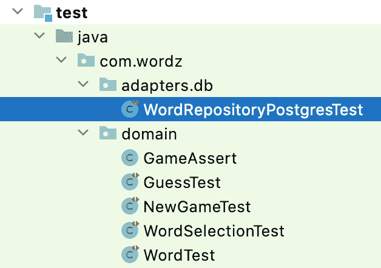

图 14.1 – 集成测试

IDE 将为我们生成空测试类。

1.  将`@DBRider`和`@DBUnit`注解添加到测试类中：

    ```java
    @DBRider
    ```

    ```java
    @DBUnit(caseSensitiveTableNames = true,
    ```

    ```java
            caseInsensitiveStrategy= Orthography.LOWERCASE)
    ```

    ```java
    public class WordRepositoryPostgresTest {
    ```

    ```java
    }
    ```

`@DBUnit` 注解中的参数减轻了 Postgres 和 DBRider 测试框架之间的一些奇怪交互，这些交互与表和列名的大小写敏感性有关。

1.  我们想测试能否检索一个单词。添加一个空测试方法：

    ```java
        @Test
    ```

    ```java
        void fetchesWord()  {
    ```

    ```java
        }
    ```

1.  运行测试。它将失败：

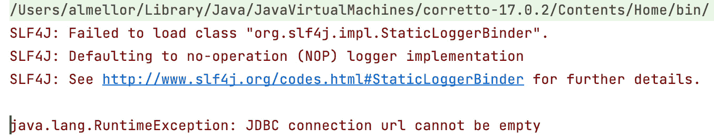

图 14.2 – DBRider 无法连接到数据库

1.  修复此问题的下一步是遵循 DBRider 文档并添加将被 DBRider 框架使用的代码。我们添加一个`connectionHolder`字段和一个`javax.sqlDataSource`字段来支持它：

    ```java
    @DBRider
    ```

    ```java
    public class WordRepositoryPostgresTest {
    ```

    ```java
        private DataSource dataSource;
    ```

    ```java
        private final ConnectionHolder connectionHolder
    ```

    ```java
                    = () -> dataSource.getConnection();
    ```

    ```java
    }
    ```

`dataSource`是创建与我们的 Postgres 数据库连接的标准**JDBC**方式。我们运行测试。它以不同的错误消息失败：

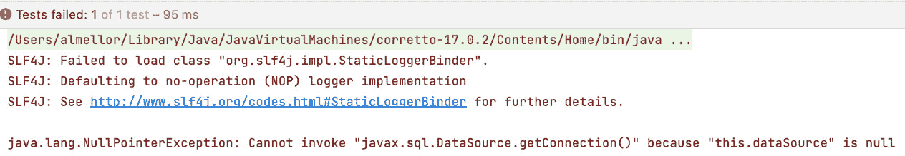

图 14.3 – dataSource 为空

1.  我们通过添加一个`@BeforeEach`方法来设置`dataSource`来纠正这个问题：

    ```java
        @BeforeEach
    ```

    ```java
        void setupConnection() {
    ```

    ```java
            var ds = new PGSimpleDataSource();
    ```

    ```java
            ds.setServerNames(new String[]{"localhost"});
    ```

    ```java
            ds.setDatabaseName("wordzdb");
    ```

    ```java
            ds.setCurrentSchema("public");
    ```

    ```java
            ds.setUser("ciuser");
    ```

    ```java
            ds.setPassword("cipassword");
    ```

    ```java
            this.dataSource = ds;
    ```

    ```java
        }
    ```

这指定了我们想要一个名为`ciuser`、密码为`cipassword`的用户连接到名为`wordzdb`的数据库，该数据库在`localhost`上以 Postgres 的默认端口（`5432`）运行。

1.  运行测试并查看它失败：

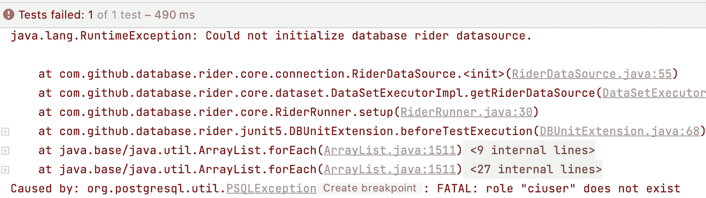

图 14.4 – 用户不存在

错误产生的原因是我们还没有在我们的 Postgres 数据库中知道名为`ciuser`的用户。让我们创建一个。

1.  打开`psql`终端并创建用户：

    ```java
    create user ciuser with password 'cipassword';
    ```

1.  再次运行测试：

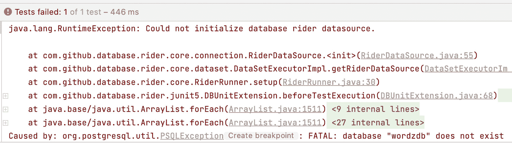

图 14.5 – 数据库未找到

测试失败，因为 DBRider 框架正在尝试将我们的新`ciuser`用户连接到`wordzdb`数据库。此数据库不存在。

1.  在`psql`终端中创建数据库：

    ```java
    create database wordzdb;
    ```

1.  再次运行测试：

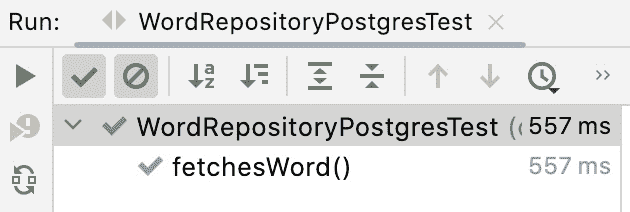

图 14.6 – 测试通过

`fetchesWord()` 测试现在通过了。我们回忆起测试方法本身是空的，但这意味着我们已经有了足够的数据库设置来继续进行测试驱动开发代码。我们很快就会回到数据库设置，但我们将让测试驱动引导我们。下一项任务是向 `fetchesWord()` 测试中添加缺失的 Arrange、Act 和 Assert 代码。

## 驱动生产代码

我们的目标是通过测试驱动代码从数据库中获取一个单词。我们希望这段代码在一个实现 `WordRepository` 接口的类中，这是我们定义在领域模型中的。我们将需要设计足够的数据库模式来支持这一点。通过从 *Assert* 步骤开始添加代码，我们可以快速实现一个实现。这是一个有用的技术——从断言开始编写测试，这样我们就从期望的结果开始。然后我们可以反向工作，包括实现它所需的一切：

1.  将断言步骤添加到我们的 `fetchesWord()` 测试中：

    ```java
        @Test
    ```

    ```java
        public void fetchesWord()  {
    ```

    ```java
            String actual = "";
    ```

    ```java
            assertThat(actual).isEqualTo("ARISE");
    ```

    ```java
        }
    ```

我们希望检查能否从数据库中获取单词 `ARISE`。这个测试失败了。我们需要创建一个类来包含必要的代码。

1.  我们希望我们的新适配器类实现 `WordRepository` 接口，因此我们在测试的 Arrange 步骤中驱动这一点：

    ```java
        @Test
    ```

    ```java
        public void fetchesWord()  {
    ```

    ```java
            WordRepository repository
    ```

    ```java
                     = new WordRepositoryPostgres();
    ```

    ```java
            String actual = "";
    ```

    ```java
            assertThat(actual).isEqualTo("ARISE");
    ```

    ```java
        }
    ```

1.  现在，我们让 IDE 工具在创建我们的新适配器类时做大部分工作。让我们称它为 `WordRepositoryPostgres`，它连接了两个事实：该类实现了 `WordRepository` 接口，并且也在实现访问 Postgres 数据库。我们使用 `com.wordz.adapters.db`：

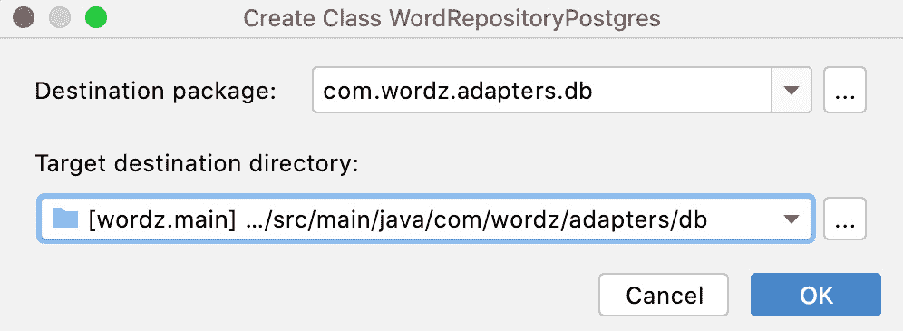

图 14.7 – 新类向导

这导致类的骨架为空：

```java
package com.wordz.adapters.db;
import com.wordz.domain.WordRepository;
public class WordRepositoryPostgres implements
                                     WordRepository {
}
```

1.  IDE 将自动生成接口的方法存根：

    ```java
    public class WordRepositoryPostgres implements WordRepository {
    ```

    ```java
        @Override
    ```

    ```java
        public String fetchWordByNumber(int number) {
    ```

    ```java
            return null;
    ```

    ```java
        }
    ```

    ```java
    @Override
    ```

    ```java
        public int highestWordNumber() {
    ```

    ```java
            return 0;
    ```

    ```java
        }
    ```

    ```java
    }
    ```

1.  返回到我们的测试，我们可以添加 act 行，这将调用 `fetchWordByNumber()` 方法：

    ```java
        @Test
    ```

    ```java
        public void fetchesWord()  {
    ```

    ```java
            WordRepository repository
    ```

    ```java
                        = new WordRepositoryPostgres();
    ```

    ```java
            String actual =
    ```

    ```java
                   repository.fetchWordByNumber(27);
    ```

    ```java
            assertThat(actual).isEqualTo("ARISE");
    ```

    ```java
        }
    ```

关于传递给 `fetchWordByNumber()` 方法的神秘常量 `27` 的解释。这是一个 *任意* 的数字，用于标识特定的单词。它的唯一硬性要求是它必须与稍后将在 JSON 文件中看到的存根测试数据中的单词编号相匹配。`27` 的实际值在匹配存根数据中的单词编号之外没有意义。

1.  将 `dataSource` 传递给 `WordRepositoryPostgres` 构造函数，以便我们的类能够访问数据库：

    ```java
        @Test
    ```

    ```java
        public void fetchesWord()  {
    ```

    ```java
            WordRepository repository
    ```

    ```java
                  = new
    ```

    ```java
                    WordRepositoryPostgres(dataSource);
    ```

    ```java
            String actual = adapter.fetchWordByNumber(27);
    ```

    ```java
            assertThat(actual).isEqualTo("ARISE");
    ```

    ```java
        }
    ```

这导致构造函数发生了变化：

```java
    public WordRepositoryPostgres(DataSource dataSource){
        // Not implemented
    }
```

1.  在我们的测试中要做的最后一点设置是将单词 `ARISE` 填充到数据库中。我们使用 DBRider 框架在测试启动时应用到我们的数据库中的 JSON 文件来完成此操作：

    ```java
    {
    ```

    ```java
      "word": [
    ```

    ```java
        {
    ```

    ```java
          "word_number": 27,
    ```

    ```java
          "word": "ARISE"
    ```

    ```java
        }
    ```

    ```java
      ]
    ```

    ```java
    }
    ```

这里的 `"word_number": 27` 代码对应于测试代码中使用的值。

1.  此文件必须保存在特定位置，以便 DBRider 可以找到它。我们称此文件为 `wordTable.json` 并将其保存在测试目录中的 `/resources/adapters/data`：

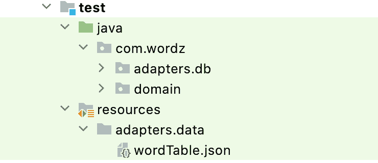

图 14.8 – wordTable.json 的位置

1.  设置我们的失败测试的最终一步是将测试数据`wordTable.json`文件链接到我们的`fetchesWord()`测试方法。我们使用 DBRider 的`@DataSet`注解来完成此操作：

    ```java
        @Test
    ```

    ```java
        @DataSet("adapters/data/wordTable.json")
    ```

    ```java
        public void fetchesWord()  {
    ```

    ```java
            WordRepository repository
    ```

    ```java
                = new WordRepositoryPostgres(dataSource);
    ```

    ```java
            String actual =
    ```

    ```java
                        repository.fetchWordByNumber(27);
    ```

    ```java
            assertThat(actual).isEqualTo("ARISE");
    ```

    ```java
        }
    ```

测试现在失败了，并且处于我们可以通过编写数据库访问代码使其通过的位置。在下一节中，我们将使用流行的库 JDBI 为我们的`WordRepository`接口实现适配器类的数据库访问。

# 实现 WordRepository 适配器

在本节中，我们将使用流行的数据库库 JDBI 来实现`WordRepository`接口的`fetchWordByNumber()`方法，并使我们的失败集成测试通过。

在*第九章*中介绍了六边形架构，*六边形架构 – 解耦外部系统*。外部系统，如数据库，通过领域模型中的端口进行访问。特定于该外部系统的代码包含在适配器中。我们的失败测试使我们能够编写数据库访问代码以获取一个要猜测的单词。

在我们开始编写代码之前，需要做一些数据库设计思考。对于当前任务，我们只需注意，我们将把所有可猜测的单词存储在名为`word`的数据库表中。这个表将有两个列。将有一个名为`word_number`的主键和一个名为`word`的五个字母的单词列。

让我们测试一下：

1.  运行测试以显示`word`表不存在：

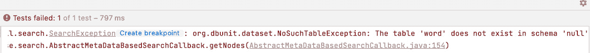

图 14.9 – 表未找到

1.  通过在数据库中创建一个`word`表来纠正这个问题。我们使用`psql`控制台运行 SQL `create` `table`命令：

    ```java
    create table word (word_number int primary key,
    ```

    ```java
    word char(5));
    ```

1.  再次运行测试。错误变为显示我们的`ciuser`用户权限不足：

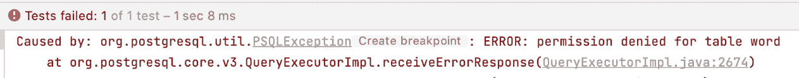

图 14.10 – 权限不足

1.  我们通过在`psql`控制台中运行 SQL `grant`命令来纠正这个问题：

    ```java
    grant select, insert, update, delete on all tables in schema public to ciuser;
    ```

1.  再次运行测试。错误变为显示`word`尚未从数据库表中读取：

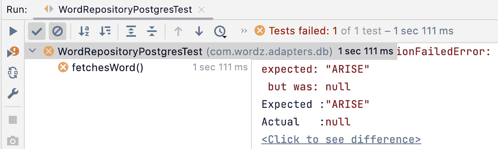

图 14.11 – 未找到单词

## 访问数据库

在设置好数据库方面的事情之后，我们可以继续添加将访问数据库的代码。第一步是添加我们将使用的数据库库。它是 JDBI，为了使用它，我们必须将`jdbi3-core`依赖项添加到我们的`gradle.build`文件中：

```java
dependencies {
    testImplementation 'org.junit.jupiter:junit-jupiter-api:5.8.2'
    testRuntimeOnly 'org.junit.jupiter:junit-jupiter-engine:5.8.2'
    testImplementation 'org.assertj:assertj-core:3.22.0'
    testImplementation 'org.mockito:mockito-core:4.8.0'
    testImplementation 'org.mockito:mockito-junit-jupiter:4.8.0'
    testImplementation 'com.github.database-rider:rider-core:1.35.0'
    testImplementation 'com.github.database-rider:rider-junit5:1.35.0'
    implementation 'org.postgresql:postgresql:42.5.0'
    implementation 'org.jdbi:jdbi3-core:3.34.0'
}
```

注意

代码本身如 JDBI 文档中所述，可在以下链接找到：`jdbi.org/#_queries`。

按照以下步骤访问数据库：

1.  首先，在我们的类构造函数中创建一个`jdbi`对象：

    ```java
    public class WordRepositoryPostgres
    ```

    ```java
                             implements WordRepository {
    ```

    ```java
        private final Jdbi jdbi;
    ```

    ```java
        public WordRepositoryPostgres(DataSource
    ```

    ```java
                                          dataSource){
    ```

    ```java
            jdbi = Jdbi.create(dataSource);
    ```

    ```java
        }
    ```

    ```java
    }
    ```

这使我们能够访问 JDBI 库。我们已经安排好，JDBI 将访问我们传递给构造函数的任何`DataSource`。

1.  我们将 JDBI 代码添加到发送 SQL 查询到数据库并获取我们作为方法参数提供的 `wordNumber` 对应的单词。首先，我们添加我们将使用的 SQL 查询：

    ```java
       private static final String SQL_FETCH_WORD_BY_NUMBER
    ```

    ```java
         = "select word from word where "
    ```

    ```java
                          + "word_number=:wordNumber";
    ```

1.  `jdbi` 访问代码可以被添加到 `fetchWordByNumber()` 方法中：

    ```java
    @Override
    ```

    ```java
    public String fetchWordByNumber(int wordNumber) {
    ```

    ```java
        String word = jdbi.withHandle(handle -> {
    ```

    ```java
            var query =
    ```

    ```java
             handle.createQuery(SQL_FETCH_WORD_BY_NUMBER);
    ```

    ```java
            query.bind("wordNumber", wordNumber);
    ```

    ```java
            return query.mapTo(String.class).one();
    ```

    ```java
        });
    ```

    ```java
        return word;
    ```

    ```java
    }
    ```

1.  再次运行测试：

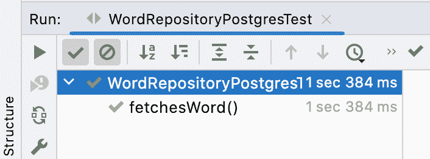

图 14.12 – 测试通过

我们现在的集成测试通过了。适配器类已从数据库中读取单词并返回。

## 实现 GameRepository

相同的过程用于测试驱动 `highestWordNumber()` 方法并为实现 `GameRepository` 接口的其它数据库访问代码创建适配器。这些代码的最终版本可以在 GitHub 上看到，其中包含了一些关于数据库测试问题的注释，例如如何避免由存储数据引起的测试失败。

需要一个手动步骤来测试驱动 `GameRepository` 接口的实现代码。我们必须创建一个 `game` 表。

在 psql 中，输入以下内容：

```java
CREATE TABLE game (
    player_name character varying NOT NULL,
    word character(5),
    attempt_number integer DEFAULT 0,
    is_game_over boolean DEFAULT false
);
```

# 摘要

在本章中，我们为我们的数据库创建了一个集成测试。我们使用它来测试驱动数据库用户的实现、数据库表以及访问我们数据的代码。此代码实现了我们六边形架构中的一个端口适配器。在这个过程中，我们使用了一些新工具。DBRider 数据库测试框架简化了我们的测试代码。JDBI 数据库访问库简化了我们的数据访问代码。

在下一章和最后一章，*第十五章*，*驱动 Web 层*，我们将向我们的应用程序添加 HTTP 接口，使其成为一个完整的微服务。我们将集成所有组件，然后使用 HTTP 测试工具 Postman 玩我们的第一次 Wordz 游戏。

# 问题和答案

1.  我们是否应该自动化创建数据库的手动步骤？

是的。这是 DevOps 的重要部分，我们开发者负责将代码部署到生产环境并保持其运行。关键技术是 **基础设施即代码**（**IaC**），这意味着将手动步骤作为代码自动化，并将其提交到主仓库。

1.  哪些工具可以帮助自动化数据库创建？

流行工具是 **Flyway** 和 **Liquibase**。两者都允许我们编写在应用程序启动时运行的脚本，并将数据库模式从一种版本迁移到另一种版本。它们在需要迁移数据跨模式更改时提供帮助。这些也超出了本书的范围。

1.  哪些工具可以帮助安装数据库？

访问运行中的数据库服务器是平台工程的一部分。对于在亚马逊网络服务、微软 Azure 或谷歌云平台运行的云原生设计，使用该平台的配置脚本。一种流行的方法是使用 Hashicorp 的 **Terraform**，它旨在成为云配置的跨提供商通用脚本语言。这超出了本书的范围。

1.  我们应该多久运行一次集成测试？

在每次向仓库提交之前。虽然单元测试运行速度快，应该一直运行，但集成测试由于本质上是慢速执行的。在编写领域代码时仅运行单元测试是合理的。我们必须始终确保我们没有意外地破坏任何东西。这就是运行集成测试的用武之地。这些测试会揭示我们是否意外地更改了影响适配器层代码的内容，或者数据库布局是否有所变化。

# 进一步阅读

+   DBRider 的文档：`github.com/database-rider/database-rider`

+   JDBI 文档：`jdbi.org/#_introduction_to_jdbi_3`

+   Flyway 是一个库，允许我们将创建和修改数据库模式的 SQL 命令作为源代码存储。这使得我们可以自动化数据库更改：`flywaydb.org/`

+   随着我们的应用程序设计不断发展，我们的数据库模式也需要进行更改。本网站和配套书籍描述了如何在管理风险的同时进行这种更改：`databaserefactoring.com/`

+   在亚马逊网络服务上托管 Postgres 数据库，使用他们的 RDS 服务：`aws.amazon.com/rds`
