# 15

# 驱动 Web 层

在本章中，我们将通过添加一个网络端点来完成我们的 Web 应用程序。我们将学习如何使用内置的 Java HTTP 客户端编写 HTTP 集成测试。我们将使用开源 HTTP 服务器框架来测试驱动运行此端点的 Web 适配器代码。这个 Web 适配器负责将 HTTP 请求转换为我们在领域层中可以执行的命令。在本章结束时，我们将把应用程序的所有部件组装成一个微服务。Web 适配器和数据库适配器将通过依赖注入与领域模型链接。我们需要运行一些手动数据库命令，安装一个名为 Postman 的网络客户端，然后我们就可以玩游戏了。

在本章中，我们将涵盖以下主要内容：

+   开始新游戏

+   玩游戏

+   集成应用程序

+   使用应用程序

# 技术要求

本章的代码可在`github.com/PacktPublishing/Test-Driven-Development-with-Java/tree/main/chapter15`找到。

在尝试运行最终应用程序之前，请执行以下步骤：

1.  确保本地运行**Postgres**数据库。

1.  确保已完成来自*第十四章*，“驱动数据库层”的数据库设置步骤。

1.  打开**Postgres pqsl**命令终端，并输入以下 SQL 命令：

    ```java
    insert into word values (1, 'ARISE'), (2, 'SHINE'), (3, 'LIGHT'), (4, 'SLEEP'), (5, 'BEARS'), (6, 'GREET'), (7, 'GRATE');
    ```

1.  按照以下说明安装**Postman**：`www.postman.com/downloads/`。

# 开始新游戏

在本节中，我们将测试驱动一个 Web 适配器，该适配器将为我们的领域模型提供一个 HTTP API。外部 Web 客户端可以向此端点发送 HTTP 请求以触发我们的领域模型中的操作，以便我们可以玩游戏。API 将返回适当的 HTTP 响应，指示提交的猜测的分数，并在游戏结束时报告。

以下开源库将被用于帮助我们编写代码：

+   `Molecule`：这是一个轻量级的 HTTP 框架

+   `Undertow`：这是一个轻量级的 HTTP 网络服务器，为 Molecule 框架提供动力

+   `GSON`：这是一个 Google 库，用于在 Java 对象和 JSON 结构化数据之间进行转换

要开始构建，我们首先将所需的库作为依赖项添加到`build.gradle`文件中。然后我们可以开始编写我们的 HTTP 端点的集成测试，并测试驱动实现。

## 向项目中添加所需库

在使用这些库之前，我们需要将 Molecule、Undertow 和 Gson 这三个库添加到`build.gradle`文件中：

将以下代码添加到`build.gradle`文件中：

```java
dependencies {
    testImplementation 'org.junit.jupiter:junit-jupiter-api:5.8.2'
    testRuntimeOnly 'org.junit.jupiter:junit-jupiter-engine:5.8.2'
    testImplementation 'org.assertj:assertj-core:3.22.0'
    testImplementation 'org.mockito:mockito-core:4.8.0'
    testImplementation 'org.mockito:mockito-junit-jupiter:4.8.0'
    testImplementation 'com.github.database-rider:rider-core:1.35.0'
    testImplementation 'com.github.database-rider:rider-junit5:1.35.0'
    implementation 'org.postgresql:postgresql:42.5.0'
    implementation 'org.jdbi:jdbi3-core:3.34.0'
    implementation 'org.apache.commons:commons-lang3:3.12.0'
implementation 'com.vtence.molecule:molecule:0.15.0'
    implementation 'io.thorntail:undertow:2.7.0.Final'
    implementation 'com.google.code.gson:gson:2.10'
}
```

## 编写失败的测试

我们将遵循正常的 TDD 周期来创建我们的 Web 适配器。在为适配器层中的对象编写测试时，我们必须专注于测试领域层中的对象与外部系统之间的通信之间的转换。我们的适配器层将使用 Molecule HTTP 框架来处理 HTTP 请求和响应。

由于我们已经使用了六边形架构并从领域层开始，我们已经知道游戏逻辑正在工作。这次测试的目标是证明网络适配器层正在履行其职责。也就是说，将 HTTP 请求和响应转换为我们的领域层中的对象。

和往常一样，我们首先创建一个测试类：

1.  首先，我们编写我们的测试类。我们将称之为 `WordzEndpointTest`，并且它属于 `com.wordz.adapters.api` 包：

    ```java
    package com.wordz.adapters.api;
    ```

    ```java
    public class WordzEndpointTest {
    ```

    ```java
    }
    ```

包含这个包的原因是作为我们六边形架构的一部分。在这个 Web 适配器中的代码允许使用领域模型中的任何东西。领域模型本身对这个 Web 适配器的存在一无所知。

我们的第一项测试将是启动一个新的游戏：

```java
@Test
void startGame() {
}
```

1.  这个测试需要捕捉围绕我们打算构建的 Web API 的设计决策。一个决策是，当游戏成功启动时，我们将返回一个简单的 `204 No Content` HTTP 状态码。我们将从断言开始来捕捉这个决策：

    ```java
    @Test
    ```

    ```java
    void startGame() {
    ```

    ```java
        HttpResponse res;
    ```

    ```java
        assertThat(res)
    ```

    ```java
           .hasStatusCode(HttpStatus.NO_CONTENT.code);
    ```

    ```java
    }
    ```

1.  接下来，我们编写行动步骤。这里的行动是为外部 HTTP 客户端发送一个请求到我们的 Web 端点。为了实现这一点，我们使用 Java 本身提供的内置 HTTP 客户端。我们安排代码发送请求，然后丢弃任何 HTTP 响应体，因为我们的设计不返回体：

    ```java
    @Test
    ```

    ```java
    void startGame() throws IOException,
    ```

    ```java
                            InterruptedException {
    ```

    ```java
        var httpClient = HttpClient.newHttpClient();
    ```

    ```java
    HttpResponse res
    ```

    ```java
    = httpClient.send(req,
    ```

    ```java
                HttpResponse.BodyHandlers.discarding());
    ```

    ```java
        assertThat(res)
    ```

    ```java
           .hasStatusCode(HttpStatus.NO_CONTENT.code);
    ```

    ```java
    }
    ```

1.  安排步骤是我们捕捉关于要发送的 HTTP 请求的决定。为了启动一个新的游戏，我们需要一个 `Player` 对象来识别玩家。我们将把这个作为 `Json` 对象发送到 `Request` 体的内容。这个请求将在我们的服务器上引起状态变化，所以我们选择 HTTP `POST` 方法来表示这一点。最后，我们选择一个路径为 `/start` 的路由：

    ```java
    @Test
    ```

    ```java
    private static final Player PLAYER
    ```

    ```java
           = new Player("alan2112");
    ```

    ```java
    void startGame() throws IOException,
    ```

    ```java
                            InterruptedException {
    ```

    ```java
        var req = HttpRequest.newBuilder()
    ```

    ```java
           .uri(URI.create("htp://localhost:8080/start"))
    ```

    ```java
           .POST(HttpRequest.BodyPublishers
    ```

    ```java
                .ofString(new Gson().toJson(PLAYER)))
    ```

    ```java
                .build();
    ```

    ```java
        var httpClient = HttpClient.newHttpClient();
    ```

    ```java
        HttpResponse res
    ```

    ```java
            = httpClient.send(req,
    ```

    ```java
                HttpResponse.BodyHandlers.discarding());
    ```

    ```java
        assertThat(res)
    ```

    ```java
           .hasStatusCode(HttpStatus.NO_CONTENT.code);
    ```

    ```java
    }
    ```

我们看到 `Gson` 库被用来将 `Player` 对象转换为它的 JSON 表示。我们还看到构建了一个 `POST` 方法并发送到 `localhost` 上的 `/start` 路径。最终，我们希望将 `localhost` 的细节移动到配置中。但，目前，它将使测试在我们的本地机器上工作。

1.  我们可以运行我们的集成测试并确认它失败：

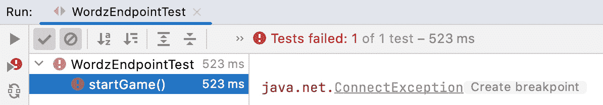

图 15.1 – 一个失败的测试 – 没有 HTTP 服务器

并非意外，这个测试失败了，因为它无法连接到 HTTP 服务器。修复这个问题是我们的下一个任务。

## 创建我们的 HTTP 服务器

失败的测试允许我们测试驱动实现 HTTP 服务器的代码。我们将使用 Molecule 库为我们提供 HTTP 服务：

1.  添加一个端点类，我们将称之为 `class WordzEndpoint`：

    ```java
        @Test
    ```

    ```java
        void startGame() throws IOException,
    ```

    ```java
                                InterruptedException {
    ```

    ```java
            var endpoint
    ```

    ```java
               = new WordzEndpoint("localhost", 8080);
    ```

传递给 `WordzEndpoint` 构造函数的两个参数定义了网络端点将运行在的主机和端口。

1.  使用 IDE，我们生成类：

    ```java
    package com.wordz.adapters.api;
    ```

    ```java
    public class WordzEndpoint {
    ```

    ```java
        public WordzEndpoint(String host, int port) {
    ```

    ```java
        }
    ```

    ```java
    }
    ```

在这种情况下，我们不会将主机和端口详情存储在字段中。相反，我们将使用 Molecule 库中的类启动一个`WebServer`。

1.  使用 Molecule 库创建`WebServer`：

    ```java
    package com.wordz.adapters.api;
    ```

    ```java
    import com.vtence.molecule.WebServer;
    ```

    ```java
    public class WordzEndpoint {
    ```

    ```java
        private final WebServer server;
    ```

    ```java
        public WordzEndpoint(String host, int port) {
    ```

    ```java
            server = WebServer.create(host, port);
    ```

    ```java
        }
    ```

    ```java
    }
    ```

上述代码足以启动一个运行的 HTTP 服务器，并允许测试连接到它。我们的 HTTP 服务器在玩游戏方面没有任何有用的功能。我们需要向这个服务器添加一些路由以及响应它们的代码。

## 向 HTTP 服务器添加路由

为了变得有用，HTTP 端点必须响应 HTTP 命令，解释它们，并将它们作为命令发送到我们的域层。作为设计决策，我们决定以下内容：

+   需要调用`/start`路由来启动游戏

+   我们将使用 HTTP `POST`方法

+   我们将识别游戏属于哪个玩家，作为`POST`体中的 JSON 数据

要向 HTTP 服务器添加路由，请执行以下操作：

1.  测试`/start`路由。为了分步工作，最初，我们将返回`NOT_IMPLEMENTED` HTTP 响应代码：

    ```java
    public class WordzEndpoint {
    ```

    ```java
        private final WebServer server;
    ```

    ```java
        public WordzEndpoint(String host, int port) {
    ```

    ```java
            server = WebServer.create(host, port);
    ```

    ```java
            try {
    ```

    ```java
                server.route(new Routes() {{
    ```

    ```java
                    post("/start")
    ```

    ```java
                      .to(request -> startGame(request));
    ```

    ```java
                }});
    ```

    ```java
            } catch (IOException ioe) {
    ```

    ```java
                throw new IllegaStateException(ioe);
    ```

    ```java
            }
    ```

    ```java
        }
    ```

    ```java
        private Response startGame(Request request) {
    ```

    ```java
            return Response
    ```

    ```java
                     .of(HttpStatus.NOT_IMPLEMENTED)
    ```

    ```java
                     .done();
    ```

    ```java
      }
    ```

    ```java
    }
    ```

1.  我们可以运行`WordzEndpointTest`集成测试：

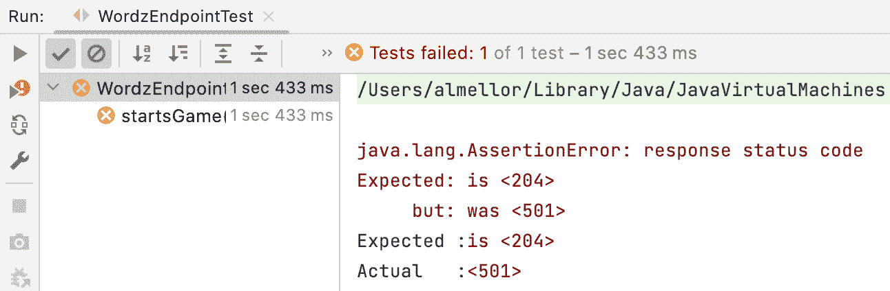

图 15.2 – 错误的 HTTP 状态

如预期的那样，测试失败了。我们已经取得了进展，因为测试现在失败的原因不同了。我们现在可以连接到网络端点，但它没有返回正确的 HTTP 响应。我们的下一个任务是连接这个网络端点到域层代码，并采取相关行动来启动一个游戏。

## 连接到域层

我们下一个任务是接收一个 HTTP 请求并将其转换为域层调用。这涉及到使用 Google Gson 库解析 JSON 请求数据，将其转换为 Java 对象，然后将响应数据发送到`Wordz`类的端口：

1.  添加调用作为`class Wordz`实现的域层端口的代码。我们将使用`Mockito`为此对象创建一个测试双胞胎。这允许我们仅测试 Web 端点代码，而无需与其他所有代码解耦：

    ```java
    @ExtendWith(MockitoExtension.class)
    ```

    ```java
    public class WordzEndpointTest {
    ```

    ```java
        @Mock
    ```

    ```java
        private Wordz mockWordz;
    ```

    ```java
        @Test
    ```

    ```java
        void startGame() throws IOException,
    ```

    ```java
                                InterruptedException {
    ```

    ```java
            var endpoint
    ```

    ```java
            = new WordzEndpoint(mockWordz,
    ```

    ```java
                                "localhost", 8080);
    ```

1.  我们需要将我们的`class Wordz`域对象提供给`class WordzEndpoint`对象。我们使用依赖注入将其注入到构造函数中：

    ```java
    public class WordzEndpoint {
    ```

    ```java
        private final WebServer server;
    ```

    ```java
        private final Wordz wordz;
    ```

    ```java
        public WordzEndpoint(Wordz wordz,
    ```

    ```java
                             String host, int port) {
    ```

    ```java
            this.wordz = wordz;
    ```

1.  接下来，我们需要添加启动游戏的代码。为此，我们首先从`request`体中的 JSON 数据中提取`Player`对象。这确定了为哪个玩家启动游戏。然后我们调用`wordz.newGame()`方法。如果成功，我们返回 HTTP 状态码`204 No Content`，表示成功：

    ```java
    private Response startGame(Request request) {
    ```

    ```java
        try {
    ```

    ```java
            Player player
    ```

    ```java
                    = new Gson().fromJson(request.body(),
    ```

    ```java
                                          Player.class);
    ```

    ```java
            boolean isSuccessful = wordz.newGame(player);
    ```

    ```java
            if (isSuccessful) {
    ```

    ```java
                return Response
    ```

    ```java
                        .of(HttpStatus.NO_CONTENT)
    ```

    ```java
                        .done();
    ```

    ```java
            }
    ```

    ```java
        } catch (IOException e) {
    ```

    ```java
            throw new RuntimeException(e);
    ```

    ```java
        }
    ```

    ```java
        throw new
    ```

    ```java
           UnsupportedOperationException("Not
    ```

    ```java
                                         implemented");
    ```

    ```java
    }
    ```

1.  现在，我们可以运行测试，然而，它失败了：

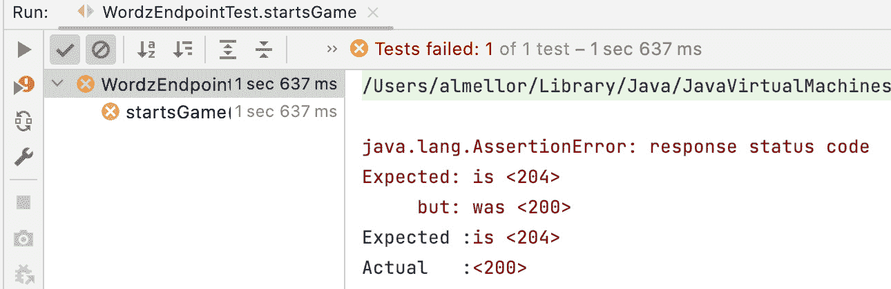

图 15.3 – 错误的 HTTP 响应

它失败了，因为`wordz.newGame()`的返回值是 false。需要设置模拟对象以返回`true`。

1.  从`mockWordz`存根返回正确的值：

    ```java
       @Test
    ```

    ```java
    void startsGame() throws IOException,
    ```

    ```java
                             InterruptedException {
    ```

    ```java
        var endpoint
    ```

    ```java
             = new WordzEndpoint(mockWordz,
    ```

    ```java
                                 "localhost", 8080);
    ```

    ```java
        when(mockWordz.newGame(eq(PLAYER)))
    ```

    ```java
              .thenReturn(true);
    ```

1.  然后，运行测试：

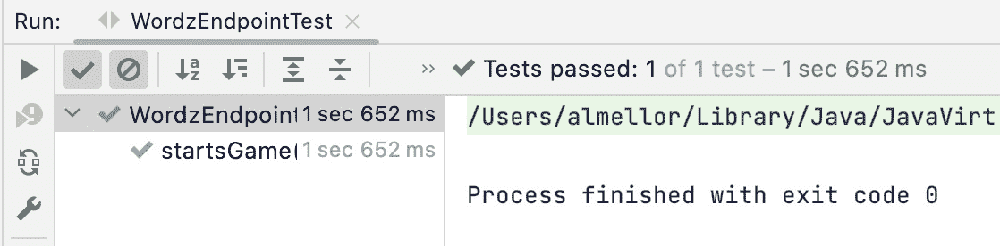

图 15.4 – 测试通过

集成测试通过了。HTTP 请求已被接收，调用了领域层代码以启动新游戏，并返回了 HTTP 响应。下一步是考虑重构。

## 重构启动游戏代码

如往常一样，一旦测试通过，我们就考虑是否需要重构。

将测试重构以简化新测试的编写，将常用代码汇总到一个地方将是有价值的：

```java
@ExtendWith(MockitoExtension.class)
public class WordzEndpointTest {
    @Mock
    private Wordz mockWordz;
    private WordzEndpoint endpoint;
    private static final Player PLAYER
                       = new Player("alan2112");
    private final HttpClient httpClient
                       = HttpClient.newHttpClient();
    @BeforeEach
    void setUp() {
        endpoint = new WordzEndpoint(mockWordz,
                                  "localhost", 8080);
    }
    @Test
    void startsGame() throws IOException,
                             InterruptedException {
        when(mockWordz.newGame(eq(player)))
                              .thenReturn(true);
        var req = requestBuilder("start")
                .POST(asJsonBody(PLAYER))
                .build();
        var res
          = httpClient.send(req,
                HttpResponse.BodyHandlers.discarding());
        assertThat(res)
             .hasStatusCode(HttpStatus.NO_CONTENT.code);
    }
    private HttpRequest.Builder requestBuilder(
        String path) {
        return HttpRequest.newBuilder()
                .uri(URI.create("http://localhost:8080/"
                                  + path));
    }
    private HttpRequest.BodyPublisher asJsonBody(
        Object source) {
        return HttpRequest.BodyPublishers
                 .ofString(new Gson().toJson(source));
    }
}
```

## 处理启动游戏时的错误

我们的设计决策之一是玩家在游戏进行中时不能开始游戏。我们需要测试驱动这种行为。我们选择返回 HTTP 状态码`409 Conflict`，以指示玩家的游戏已经开始，无法为他们启动新的游戏：

1.  编写测试以返回`409 Conflict`，如果游戏已经开始：

    ```java
        @Test
    ```

    ```java
        void rejectsRestart() throws Exception {
    ```

    ```java
            when(mockWordz.newGame(eq(player)))
    ```

    ```java
                             .thenReturn(false);
    ```

    ```java
            var req = requestBuilder("start")
    ```

    ```java
                    .POST(asJsonBody(player))
    ```

    ```java
                    .build();
    ```

    ```java
            var res
    ```

    ```java
               = httpClient.send(req,
    ```

    ```java
                    HttpResponse.BodyHandlers.discarding());
    ```

    ```java
            assertThat(res)
    ```

    ```java
                   .hasStatusCode(HttpStatus.CONFLICT.code);
    ```

    ```java
        }
    ```

1.  接下来，运行测试。它应该失败，因为我们还没有编写实现代码：

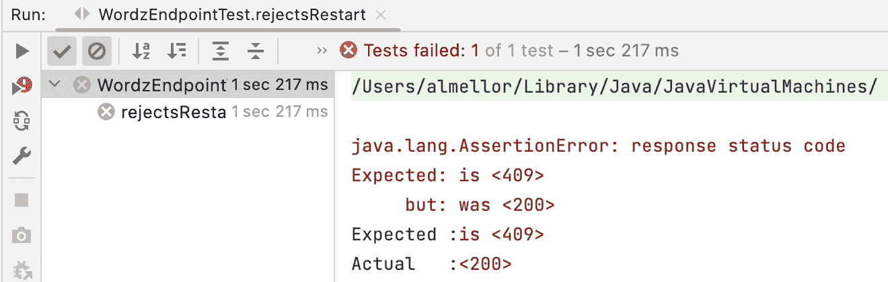

图 15.5 – 失败的测试

1.  通过测试驱动代码报告游戏无法重启：

    ```java
    private Response startGame(Request request) {
    ```

    ```java
        try {
    ```

    ```java
            Player player
    ```

    ```java
                    = new Gson().fromJson(request.body(),
    ```

    ```java
                                          Player.class);
    ```

    ```java
            boolean isSuccessful = wordz.newGame(player);
    ```

    ```java
            if (isSuccessful) {
    ```

    ```java
                return Response
    ```

    ```java
                        .of(HttpStatus.NO_CONTENT)
    ```

    ```java
                        .done();
    ```

    ```java
            }
    ```

    ```java
            return Response
    ```

    ```java
                    .of(HttpStatus.CONFLICT)
    ```

    ```java
                    .done();
    ```

    ```java
        } catch (IOException e) {
    ```

    ```java
            throw new RuntimeException(e);
    ```

    ```java
        }
    ```

    ```java
    }
    ```

1.  再次运行测试：

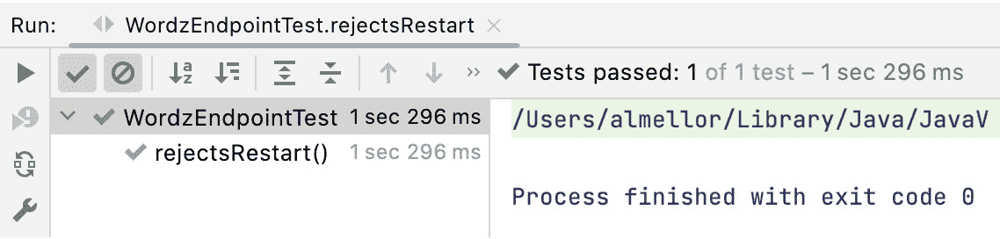

图 15.6 – 测试通过

现在实现到位后，单独运行测试时测试通过。让我们运行所有`WordzEndpointTests`测试以双重检查我们的进度。

1.  运行所有`WordzEndpointTests`：

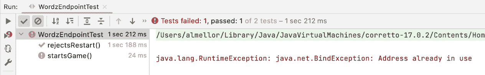

图 15.7 – 由于重启服务器导致的测试失败

意外的是，当依次运行时，测试失败了。

## 修复意外失败的测试

当我们运行所有测试时，它们现在都失败了。当单独运行时，所有测试之前都运行正确。最近的一个更改显然破坏了某些东西。我们在某个时候失去了测试隔离。这个错误信息表明，Web 服务器正在同一端口上启动两次，这是不可能的。

选项是每个测试后停止 Web 服务器，或者只为所有测试启动一次 Web 服务器。由于这是一个长期运行的微服务，这里只启动一次似乎是一个更好的选择：

1.  添加`@BeforeAll`注解以仅启动 HTTP 服务器一次：

    ```java
    @BeforeAll
    ```

    ```java
    void setUp() {
    ```

    ```java
        mockWordz = mock(Wordz.class);
    ```

    ```java
        endpoint = new WordzEndpoint(mockWordz,
    ```

    ```java
                                     "localhost", 8080);
    ```

    ```java
    }
    ```

我们将`@BeforeEach`注解更改为`@BeforeAll`注解，以便端点创建只在每个测试中发生一次。为了支持这一点，我们还必须创建模拟并使用注解在测试本身上以控制对象的生命周期：

```java
@ExtendWith(MockitoExtension.class)
@TestInstance(TestInstance.Lifecycle.PER_CLASS)
public class WordzEndpointTest {
```

`WordzEndpointTest`中的两个测试现在都通过了。

1.  在所有测试再次通过后，我们可以考虑重构代码。通过提取`extractPlayer()`方法，我们可以提高可读性。我们还可以使条件 HTTP 状态码更简洁：

    ```java
    private Response startGame(Request request) {
    ```

    ```java
        try {
    ```

    ```java
            Player player = extractPlayer(request);
    ```

    ```java
            boolean isSuccessful = wordz.newGame(player);
    ```

    ```java
            HttpStatus status
    ```

    ```java
                    = isSuccessful?
    ```

    ```java
                        HttpStatus.NO_CONTENT :
    ```

    ```java
                        HttpStatus.CONFLICT;
    ```

    ```java
                return Response
    ```

    ```java
                        .of(status)
    ```

    ```java
                        .done();
    ```

    ```java
        } catch (IOException e) {
    ```

    ```java
            throw new RuntimeException(e);
    ```

    ```java
        }
    ```

    ```java
    }
    ```

    ```java
    private Player extractPlayer(Request request)
    ```

    ```java
                                     throws IOException {
    ```

    ```java
        return new Gson().fromJson(request.body(),
    ```

    ```java
                                   Player.class);
    ```

    ```java
    }
    ```

我们现在已经完成了启动游戏所需的主要编码部分。为了处理剩余的错误条件，我们现在可以测试驱动代码，如果无法从 JSON 有效负载中读取`Player`对象，则返回`400 BAD REQUEST`。我们在这里省略了那段代码。在下一节中，我们将继续测试驱动猜测目标单词的代码。

# 游戏玩法

在本节中，我们将测试驱动代码来玩游戏。这涉及到向端点提交多个猜测尝试，直到收到游戏结束的响应。

我们首先为端点中的新`/guess`路由创建一个集成测试：

1.  第一步是编写 Arrange 步骤。我们的领域模型在`Wordz`类上提供了`assess()`方法来评估猜测的分数，并报告游戏是否结束。为了驱动测试，我们设置了`mockWordz`存根，当调用`assess()`方法时返回一个有效的`GuessResult`对象：

    ```java
    @Test
    ```

    ```java
    void partiallyCorrectGuess() {
    ```

    ```java
        var score = new Score("-U---");
    ```

    ```java
        score.assess("GUESS");
    ```

    ```java
        var result = new GuessResult(score, false, false);
    ```

    ```java
        when(mockWordz.assess(eq(player), eq("GUESS")))
    ```

    ```java
                .thenReturn(result);
    ```

    ```java
    }
    ```

1.  Act 步骤将调用我们的端点，提交一个包含猜测的 Web 请求。我们的设计决策是向`/guess`路由发送 HTTP `POST`请求。`request`体将包含猜测单词的 JSON 表示。为此，我们将使用`record GuessRequest`并使用 Gson 将其转换为 JSON：

    ```java
    @Test
    ```

    ```java
    void partiallyCorrectGuess() {
    ```

    ```java
        var score = new Score("-U---");
    ```

    ```java
        score.assess("GUESS");
    ```

    ```java
        var result = new GuessResult(score, false, false);
    ```

    ```java
        when(mockWordz.assess(eq(player), eq("GUESS")))
    ```

    ```java
                .thenReturn(result);
    ```

    ```java
        var guessRequest = new GuessRequest(player, "-U---");
    ```

    ```java
        var body = new Gson().toJson(guessRequest);
    ```

    ```java
        var req = requestBuilder("guess")
    ```

    ```java
                .POST(ofString(body))
    ```

    ```java
                .build();
    ```

    ```java
    }
    ```

1.  接下来，我们定义记录：

    ```java
    package com.wordz.adapters.api;
    ```

    ```java
    import com.wordz.domain.Player;
    ```

    ```java
    public record GuessRequest(Player player, String guess) {
    ```

    ```java
    }
    ```

1.  然后，我们通过 HTTP 将请求发送到我们的端点，等待响应：

    ```java
    @Test
    ```

    ```java
    void partiallyCorrectGuess() throws Exception {
    ```

    ```java
        var score = new Score("-U---");
    ```

    ```java
        score.assess("GUESS");
    ```

    ```java
        var result = new GuessResult(score, false, false);
    ```

    ```java
        when(mockWordz.assess(eq(player), eq("GUESS")))
    ```

    ```java
                .thenReturn(result);
    ```

    ```java
        var guessRequest = new GuessRequest(player, "-U---");
    ```

    ```java
        var body = new Gson().toJson(guessRequest);
    ```

    ```java
        var req = requestBuilder("guess")
    ```

    ```java
                .POST(ofString(body))
    ```

    ```java
                .build();
    ```

    ```java
        var res
    ```

    ```java
           = httpClient.send(req,
    ```

    ```java
                HttpResponse.BodyHandlers.ofString());
    ```

    ```java
    }
    ```

1.  然后，我们提取返回的体数据，并对其与我们的预期进行断言：

    ```java
    @Test
    ```

    ```java
    void partiallyCorrectGuess() throws Exception {
    ```

    ```java
        var score = new Score("-U--G");
    ```

    ```java
        score.assess("GUESS");
    ```

    ```java
        var result = new GuessResult(score, false, false);
    ```

    ```java
        when(mockWordz.assess(eq(player), eq("GUESS")))
    ```

    ```java
                .thenReturn(result);
    ```

    ```java
        var guessRequest = new GuessRequest(player,
    ```

    ```java
                                            "-U--G");
    ```

    ```java
        var body = new Gson().toJson(guessRequest);
    ```

    ```java
        var req = requestBuilder("guess")
    ```

    ```java
                .POST(ofString(body))
    ```

    ```java
                .build();
    ```

    ```java
        var res
    ```

    ```java
           = httpClient.send(req,
    ```

    ```java
                HttpResponse.BodyHandlers.ofString());
    ```

    ```java
        var response
    ```

    ```java
           = new Gson().fromJson(res.body(),
    ```

    ```java
                             GuessHttpResponse.class);
    ```

    ```java
        // Key to letters in scores():
    ```

    ```java
        // C correct, P part correct, X incorrect
    ```

    ```java
        Assertions.assertThat(response.scores())
    ```

    ```java
            .isEqualTo("PCXXX");
    ```

    ```java
        Assertions.assertThat(response.isGameOver())
    ```

    ```java
    .isFalse();
    ```

    ```java
    }
    ```

在这里的一个 API 设计决策是返回每个字母的分数作为一个五字符的`String`对象。单个字母`X`、`C`和`P`用来表示不正确、正确和部分正确的字母。我们在断言中捕捉这个决策。

1.  我们定义了一个记录来表示我们将作为端点响应返回的 JSON 数据结构：

    ```java
    package com.wordz.adapters.api;
    ```

    ```java
    public record GuessHttpResponse(String scores,
    ```

    ```java
                                    boolean isGameOver) {
    ```

    ```java
    }
    ```

1.  由于我们决定向新的`/guess`路由`POST`，我们需要将此路由添加到路由表中。我们还需要将其绑定到一个将采取行动的方法，我们将称之为`guessWord()`：

    ```java
    public WordzEndpoint(Wordz wordz, String host,
    ```

    ```java
                         int port) {
    ```

    ```java
        this.wordz = wordz;
    ```

    ```java
        server = WebServer.create(host, port);
    ```

    ```java
        try {
    ```

    ```java
            server.route(new Routes() {{
    ```

    ```java
                post("/start")
    ```

    ```java
                    .to(request -> startGame(request));
    ```

    ```java
                post("/guess")
    ```

    ```java
                    .to(request -> guessWord(request));
    ```

    ```java
            }});
    ```

    ```java
        } catch (IOException e) {
    ```

    ```java
            throw new IllegalStateException(e);
    ```

    ```java
        }
    ```

    ```java
    }
    ```

我们添加了一个`IllegalStateException`来重新抛出在启动 HTTP 服务器时发生的任何问题。对于这个应用程序，这个异常可能会向上传播并导致应用程序停止运行。没有工作的 Web 服务器，所有的 Web 代码都没有意义去运行。

1.  我们使用代码实现了`guessWord()`方法，用于从`POST`请求体中提取`request`数据：

    ```java
    private Response guessWord(Request request) {
    ```

    ```java
        try {
    ```

    ```java
            GuessRequest gr =
    ```

    ```java
                 extractGuessRequest(request);
    ```

    ```java
            return null ;
    ```

    ```java
        } catch (IOException e) {
    ```

    ```java
            throw new RuntimeException(e);
    ```

    ```java
        }
    ```

    ```java
    }
    ```

    ```java
    private GuessRequest extractGuessRequest(Request request) throws IOException {
    ```

    ```java
        return new Gson().fromJson(request.body(),
    ```

    ```java
                                   GuessRequest.class);
    ```

    ```java
    }
    ```

1.  现在我们有了`request`数据，是时候调用我们的领域层来完成实际工作了。我们将捕获返回的`GuessResult`对象，这样我们就可以根据端点上的 HTTP 响应来构建：

    ```java
    private Response guessWord(Request request) {
    ```

    ```java
        try {
    ```

    ```java
            GuessRequest gr =
    ```

    ```java
                 extractGuessRequest(request);
    ```

    ```java
            GuessResult result
    ```

    ```java
                    = wordz.assess(gr.player(),
    ```

    ```java
                      gr.guess());
    ```

    ```java
            return null;
    ```

    ```java
        } catch (IOException e) {
    ```

    ```java
            throw new RuntimeException(e);
    ```

    ```java
        }
    ```

    ```java
    }
    ```

1.  我们选择从我们的端点返回与从领域模型返回的`GuessResult`对象不同的数据格式。我们需要将领域模型的结果转换：

    ```java
    private Response guessWord(Request request) {
    ```

    ```java
        try {
    ```

    ```java
            GuessRequest gr =
    ```

    ```java
                extractGuessRequest(request);
    ```

    ```java
            GuessResult result = wordz.assess(gr.player(),
    ```

    ```java
                                 gr.guess());
    ```

    ```java
            return Response.ok()
    ```

    ```java
                    .body(createGuessHttpResponse(result))
    ```

    ```java
                    .done();
    ```

    ```java
        } catch (IOException e) {
    ```

    ```java
            throw new RuntimeException(e);
    ```

    ```java
        }
    ```

    ```java
    }
    ```

    ```java
    private String createGuessHttpResponse(GuessResult result) {
    ```

    ```java
    GuessHttpResponse httpResponse
    ```

    ```java
              = new
    ```

    ```java
                GuessHttpResponseMapper().from(result);
    ```

    ```java
        return new Gson().toJson(httpResponse);
    ```

    ```java
    }
    ```

1.  我们添加了一个执行转换的空版本的对象，即`class GuessHttpResponseMapper`。在这个第一步中，它将简单地返回`null`：

    ```java
    package com.wordz.adapters.api;
    ```

    ```java
    import com.wordz.domain.GuessResult;
    ```

    ```java
    public class GuessHttpResponseMapper {
    ```

    ```java
        public GuessHttpResponse from(GuessResult result) {
    ```

    ```java
    return null;
    ```

    ```java
        }
    ```

    ```java
    }
    ```

1.  这就足够编译并运行`WordzEndpointTest`测试了：

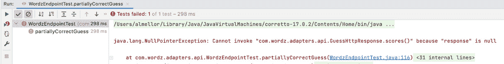

图 15.8 – 测试失败

1.  在放置了一个失败的测试之后，我们现在可以测试驱动转换类的细节。为此，我们切换到添加一个名为`class GuessHttpResponseMapperTest`的新单元测试。

注意

这些细节被省略了，但可以在 GitHub 上找到 – 它遵循本书中使用的标准方法。

1.  一旦我们通过测试驱动了`class GuessHttpResponseMapper`的详细实现，我们可以重新运行集成测试：

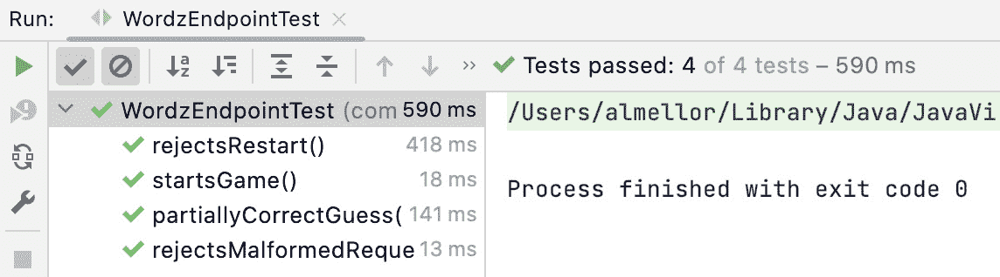

图 15.9 – 端点测试通过

正如我们在前面的图像中看到的那样，集成测试已经通过！是时候享受一杯应得的咖啡了。嗯，我的选择是美味的英式早餐茶，但那只是我个人的喜好。之后，我们可以测试驱动对发生的任何错误做出的响应。然后是时候将微服务组合在一起了。在下一节中，我们将组装我们的应用程序以运行微服务。

# 集成应用程序

在本节中，我们将汇集我们的测试驱动应用程序的组件。我们将形成一个运行端点并提供服务前端网络界面的微服务。它将使用 Postgres 数据库进行存储。

我们需要编写一个简短的`main()`方法来将我们代码的主要组件链接在一起。这涉及到创建具体对象并将依赖注入到构造函数中。`main()`方法位于`class WordzApplication`中，这是我们完全集成的网络服务的入口点：

```java
package com.wordz;
import com.wordz.adapters.api.WordzEndpoint;
import com.wordz.adapters.db.GameRepositoryPostgres;
import com.wordz.adapters.db.WordRepositoryPostgres;
import com.wordz.domain.Wordz;
public class WordzApplication {
    public static void main(String[] args) {
        var config = new WordzConfiguration(args);
        new WordzApplication().run(config);
    }
    private void run(WordzConfiguration config) {
        var gameRepository
         = new GameRepositoryPostgres(config.getDataSource());
        var wordRepository
         = new WordRepositoryPostgres(config.getDataSource());
        var randomNumbers = new ProductionRandomNumbers();
        var wordz = new Wordz(gameRepository,
                              wordRepository,
                              randomNumbers);
        var api = new WordzEndpoint(wordz,
                                    config.getEndpointHost(),
                                    config.getEndpointPort());
        waitUntilTerminated();
    }
    private void waitUntilTerminated() {
        try {
            while (true) {
                Thread.sleep(10000);
            }
        } catch (InterruptedException e) {
            return;
        }
    }
}
```

`main()`方法实例化了领域模型，并将我们适配器类的具体版本依赖注入其中。一个值得注意的细节是`waitUntilTerminated()`方法。这防止`main()`在应用程序关闭之前终止。这反过来又使 HTTP 端点能够响应请求。

应用程序的配置数据存储在`class WordzConfiguration`中。它为端点主机和端口设置以及数据库连接设置提供了默认设置。这些也可以作为命令行参数传入。该类及其关联的测试可以在本章的 GitHub 代码中找到。

在下一节中，我们将使用 Wordz 网络服务应用程序，使用流行的 HTTP 测试工具 Postman。

# 使用应用程序

要使用我们新组装的网络应用程序，首先确保*技术要求*部分中描述的数据库设置步骤和 Postman 安装已成功完成。然后在 IntelliJ 中运行`class WordzApplication`的`main()`方法。这启动了端点，准备接受请求。

一旦服务运行，我们与之交互的方式是通过向端点发送 HTTP 请求。启动 Postman，在 macOS 上，会出现一个类似这样的窗口：

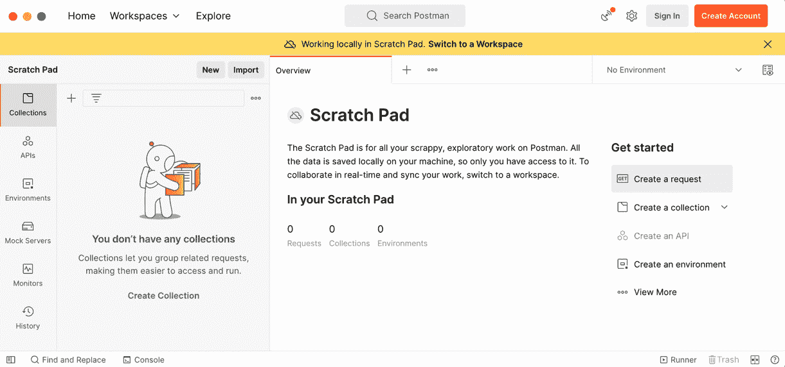

图 15.10 – Postman 主屏幕

我们首先需要开始一个游戏。为此，我们需要向端点的`/start`路由发送 HTTP `POST`请求。默认情况下，这将可在`http://localhost:8080/start`处访问。我们需要发送一个包含 JSON 文本`{"name":"testuser"}`的正文。

我们可以从 Postman 发送这个请求。我们在主页上点击**创建请求**按钮。这会带我们到一个可以输入 URL、选择**POST**方法并输入我们的 JSON 正文数据的视图：

1.  创建一个**POST**请求来开始游戏：

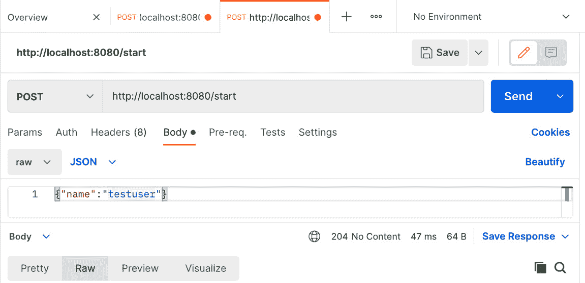

图 15.11 – 开始新游戏

点击蓝色的`testuser`。端点按预期执行并发送了 HTTP 状态码`204 No Content`。这可以在截图的底部看到响应面板中。

快速检查数据库中`game`表的内容显示，已经为这个游戏创建了一个行：

```java
wordzdb=# select * from game;
 player_name | word  | attempt_number | is_game_over
-------------+-------+----------------+--------------
 testuser    | ARISE |              0 | f
(1 row)
wordzdb=#
```

1.  我们现在可以对单词进行第一次猜测。让我们尝试一个猜测`"STARE"`。这个猜测的**POST**请求和端点的响应如下所示：

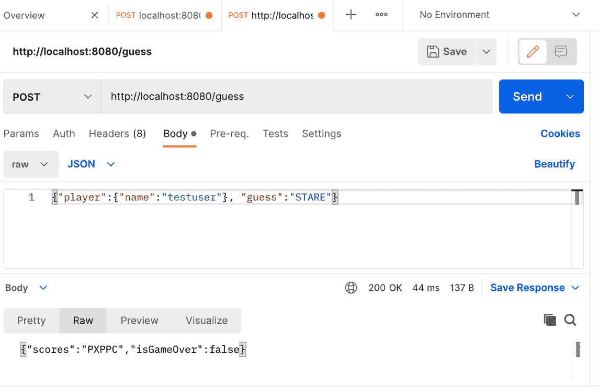

图 15.12 – 返回的分数

端点返回 HTTP 状态码`200 OK`。这次，返回了一个 JSON 格式的数据体。我们看到`"scores":"PXPPC"`表示我们的猜测的第一个字母`S`在单词的某个位置出现，但不在第一个位置。我们猜测的第二个字母`T`是错误的，并且不在目标单词中。我们在猜测中得到了两个更多部分正确的字母和一个最终正确的字母，即末尾的字母`E`。

响应还显示`"isGameOver":false`。我们还没有完成游戏。

1.  我们将再猜一次，稍微作弊一下。让我们发送一个`"ARISE"`：

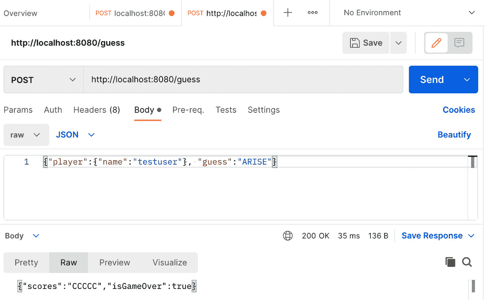

图 15.13 – 成功的猜测

胜利！我们看到`"scores":"CCCCC"`告诉我们我们猜测的所有五个字母都是正确的。`"isGameOver":true`告诉我们我们的游戏已经结束，在这种情况下，是成功结束的。

我们已经成功地使用我们的微服务玩了一局 Wordz。

# 摘要

在本节中，我们已经完成了 Wordz 应用程序。我们使用 TDD 的集成测试来驱动 Wordz 的 HTTP 端点。我们使用了开源的 HTTP 库 – Molecule、Gson 和 Undertow。我们有效地使用了六边形架构。使用端口和适配器，这些框架变成了实现细节而不是我们设计的定义特征。

我们组装了最终的应用程序，将领域层中持有的业务逻辑与 Postgres 数据库适配器和 HTTP 端点适配器结合起来。我们的应用程序一起工作，形成了一个小型微服务。

在这一章的最后一部分，我们到达了一个小型但典型的微服务，它包含一个 HTTP API 和一个 SQL 数据库。我们首先使用测试来指导我们的设计选择，开发了代码。我们应用了 SOLID 原则来改进软件的组装方式。我们学习了如何使用六边形架构的端口和适配器简化与外部系统交互的代码设计。使用六边形架构是 TDD 的自然选择，它允许我们使用 FIRST 单元测试来开发核心应用程序逻辑。我们首先创建了数据库适配器和 HTTP 适配器测试，然后使用集成测试。我们应用了 TDD 的节奏——红、绿、重构和安排、行动和断言到我们的工作中。我们使用 Mockito 库应用了测试替身，以替代外部系统，简化了开发。

在这本书中，我们涵盖了广泛的测试驱动开发（TDD）和软件设计技术。现在我们可以编写出缺陷更少的代码，这使得代码更安全且易于使用。

# 问答

1.  还可以做什么进一步的工作？

进一步的工作可以包括添加一个**持续集成（CI）**管道，这样每次我们提交代码时，应用程序都会从源代码控制中拉取，构建，并运行所有测试。我们可以考虑部署和自动化这个过程。一个例子可能是将 Wordz 应用程序和 Postgres 数据库打包成一个 Docker 镜像。添加数据库模式自动化，使用像 Flyway 这样的工具会很好。 

1.  我们能否替换 Molecule 库，并使用其他东西来构建我们的网络端点？

是的。因为网络端点位于六边形架构的适配器层，所以它不会影响领域模型中的核心功能。任何合适的网络框架都可以使用。

# 进一步阅读

+   `martinfowler.com/articles/richardsonMaturityModel.html`

关于 REST 网络接口的概述，以及一些常见的变化

+   *Java OOP Done Right*，艾伦·梅勒，ISBN 9781527284449

作者的书籍对面向对象（OO）基础和一些有用的设计模式进行了更详细的介绍

+   https://www.postman.com/

一个流行的测试工具，它发送 HTTP 请求并显示响应

+   `molecule.vtence.com/`

一个轻量级的 Java HTTP 框架

+   `undertow.io/`

与 Molecule 框架配合良好的 Java HTTP 服务器

+   `github.com/google/gson`

Google 用于在 Java 对象和 JSON 格式之间转换的库

+   `aws.amazon.com/what-is/restful-api/`

亚马逊的 REST API 指南

+   `docs.oracle.com/en/java/javase/12/docs/api/java.net.http/java/net/http/HttpClient.html`

本章中使用的测试 HTTP 客户端的官方 Java 文档
