# 2

# 编码、编译和执行

安装 Java 后，我们几乎准备好查看编码了。不过，在我们到达那里之前，我们需要学习如何编码、编译和执行 Java 应用程序。虽然**集成开发环境**（**IDE**）可能是你大部分工作的选择，但理解在没有 IDE 的指导下的编码方式，是区分 Java 爱好者与 Java 专业人士的关键。

在本章中，我们将探讨从命令行工作，然后从一些最广泛使用的 IDE 中工作。本章将不会是 IDE 教程，而是一个关于它们为程序员提供内容的回顾。任何 IDE 的基本操作都非常类似于最常用的 IDE。在我们检查 Java 的各种使用方法之前，我们将查看一个小程序，我们将使用它。这本书是一个*Hello World!*免费区，这意味着第一个示例将做一些有用的事情。

本章的目标是使您熟悉编译和执行 Java 代码的四种方法，并介绍开发者可用的 IDE 工具。我们将涵盖以下主题：

+   第一个程序

+   JShell – Java 的 REPL

+   两步编译和执行过程 – `javac` 和 `java`/`javaw`

+   启动单文件源代码程序

+   集成开发环境

# 技术要求

要跟随本章的示例，您需要以下内容：

+   已安装 Java 17

+   文本编辑器，例如记事本

您可以在 GitHub 上找到本章的代码文件，地址为[`github.com/PacktPublishing/Transitioning-to-Java/tree/chapter02`](https://github.com/PacktPublishing/Transitioning-to-Java/tree/chapter02)。

# 第一个程序

在我们学习如何编译和执行 Java 代码之前，我们需要一个 Java 程序来操作。我们的第一个程序将计算复利。有一句引用自阿尔伯特·爱因斯坦的话，据说他曾说过，“*复利是世界第八大奇迹*。”他是否真的说过这句话还有待商榷。无论如何，计算利息的利息是进行的最重要金融计算之一。以下是我们将实现的公式：

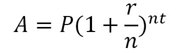

在这里，*P* 是存入复利账户的本金，*r* 是通常表示为年利率的利率，*n* 是复利期数（如果按月复利，则该值为 12），而 *t* 是资金复利的时间。这以年为单位表示，必须除以复利期数，在这种情况下，也将是 12。

在本书的*第二部分*中，我们将探讨语言的语法和结构。在那里，我们将探索这个程序的代码。因此，我们将只使用这个程序，它易于理解。您可以从这本书的 GitHub 仓库下载它。

下面是一个简单的 Java 程序的代码，该程序将计算在固定利率下，经过一段时间后固定金额的价值：

```java
import java.text.NumberFormat;
public class CompoundInterest01 {
    private final double principal = 100.0;
    private final double annualInterestRate = 0.05;
    private final double compoundPerTimeUnit = 12.0;
    private final double time = 5.0; // 
    private final NumberFormat currencyFormat;
    private final NumberFormat percentFormat;
    public CompoundInterest01() {
        currencyFormat = 
          NumberFormat.getCurrencyInstance();
        percentFormat = NumberFormat.getPercentInstance();
        percentFormat.setMinimumFractionDigits(0);
        percentFormat.setMaximumFractionDigits(5);
    }
    public void perform() {
        var result = calculateCompoundInterest();
        System.out.printf("If you deposit %s in a savings 
                account " + "that pays %s annual interest 
                compounded monthly%n" + "you will have 
                after %1.0f years %s", 
                currencyFormat.format(principal),
                percentFormat.format(annualInterestRate),
                time, currencyFormat.format(result));
    }
    private double calculateCompoundInterest() {
        var result = principal * Math.pow(1 + 
            annualInterestRate / compoundPerTimeUnit, 
            time * compoundPerTimeUnit);
        return result;
    }
    public static void main(String[] args) {
        var banker = new CompoundInterest01();
        banker.perform();
    }
}
```

所有 Java 程序都必须至少包含一个称为 **类** 的结构。而 C++ 允许你混合结构化风格和面向对象风格，Java 则要求使用后者风格。

通过这样，你已经看到了你的第一个完整的 Java 程序。如果你来自 C++ 或 C# 背景，你很可能理解它是如何工作的。如果你没有面向对象编程（**OOP**）的背景，你可以将其视为一个结构化程序。在本书的 *第二部分* 中，我们将探讨 Java 的语法。接下来，我们将从命令行以三种不同的方式运行此程序。

# JShell – Java 的 REPL

**读取-评估-打印循环**（**REPL**）是一个可以逐行执行代码的环境。REPL 从 Java 9 版本开始成为 Java 的标准部分。它通过一个名为 JShell 的工具实现。它有两个用途：

+   它提供了一个无需编程背景即可学习 Java 的环境。

+   它提供了一种快速测试概念、语法和库的方法。

因此，你可以执行 Java 代码而不需要通常的装饰。

我们可以使用 JShell 的两种方式。第一种是只需输入必要的代码来使用公式。想象一下，你想验证复利公式的正确性，如源代码所示。你可以通过仅输入执行计算所需的代码来实现这一点。

在以下代码块中，我们已输入了四个变量声明及其所需的计算值，然后是执行计算并将其分配给变量的代码行：

```java
private final double principal = 100.0;
private final double annualInterestRate = 0.05;
private final double compoundPerTimeUnit = 12.0;
private final double time = 5.0; // 
var result = principal * Math.pow(1 + annualInterestRate / compoundPerTimeUnit, time * compoundPerTimeUnit);
```

在 JShell 中按照以下步骤输入这五行代码：

1.  在 Windows 上，打开命令提示符。如果你在 macOS/Linux 系统上工作，请转到终端。如有必要，设置 `Path` 和 `JAVA_HOME` 值。然后，输入 `jshell` 命令。控制台将看起来像这样：

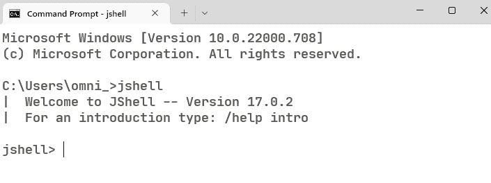

图 2.1 – 运行 JShell

1.  现在，我们可以输入以下五行代码：

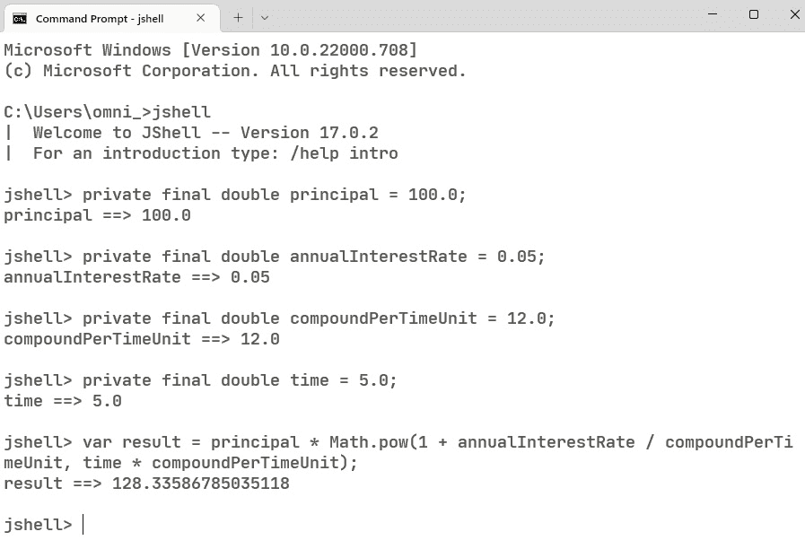

图 2.2 – 在 JShell 中逐行执行代码

注意，每行代码都是在输入时执行的，JShell 会报告分配给每个变量的值。Java 不会自动格式化值，因此结果是原始浮点数。

我们可以假设由于没有错误执行，结果就是正确的吗？绝对不行！特别是对于计算，你需要第二个结果来源。这就是电子表格如此宝贵的所在。以下是使用 Microsoft Excel 中的公式计算后的结果：

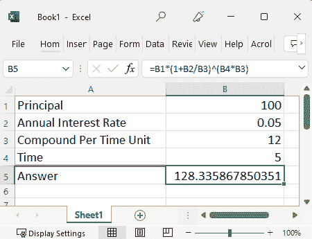

图 2.3 – Excel 中的复利计算

如果你在输入代码时出现了错误，这意味着你的代码与工作表中的结果不匹配，那么你可以使用`/reset`命令清除你在 JShell 中输入的所有内容并重新开始。JShell 总是保留你最后输入的代码，除非你重置它。JShell 还维护了你输入的所有内容的记录，当你使用`/reset`时不会丢失。**历史记录**，可以通过上下箭头访问，将仅允许你将之前使用的代码输入到你当前正在工作的内容中。

我们可以使用 JShell 的第二种方式是通过使用编辑器并将整个程序提供给工具。在我们向 JShell 提供完整的程序之前，我们必须使用`/reset`命令来删除之前输入的内容。

要执行整个程序，请按照以下步骤操作：

1.  JShell 有一个基本的编辑器，支持多行 Java 代码。使用`/edit`命令来打开编辑器。

1.  此编辑器不能打开文件，因此你需要在你自己的文本编辑器中打开`CompoundInterest01.java`文件，复制文件的内容，并将其粘贴到 JShell 编辑器中。

1.  当你点击**接受**时，JShell 编辑器中的代码将被传输到 JShell：

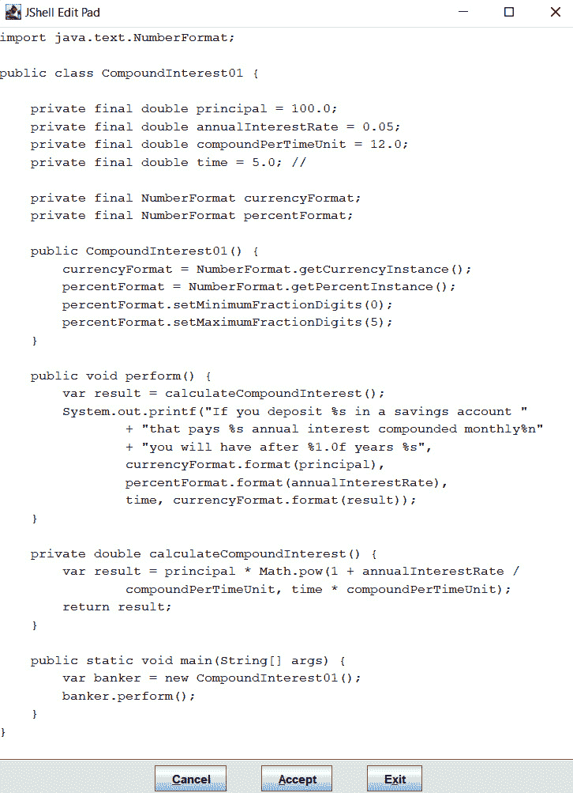

图 2.4 – 将程序粘贴到默认 JShell 编辑器后的样子

1.  现在，你必须点击**退出**以离开编辑器，这将恢复 JShell 提示符。

1.  现在，你可以在 JShell 提示符中输入`CompoundInterest01.main(null)`来运行`main`方法，这将导致程序执行。`main`方法期望一个参数。如果你没有要传递给`main`方法的参数，那么你将自动传递 null：

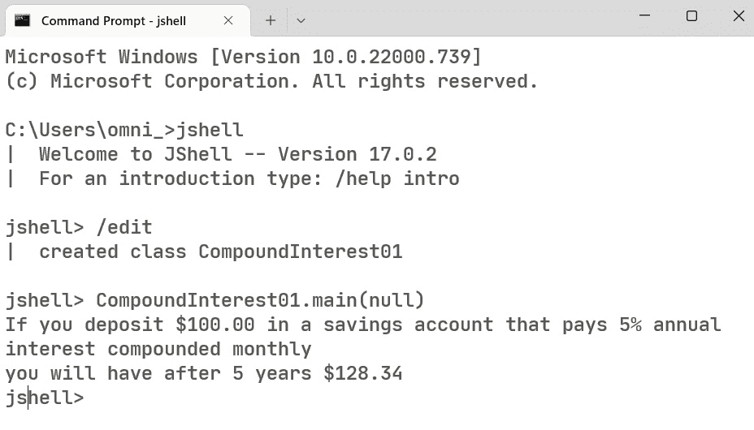

图 2.5 – 将程序从编辑器传输到 JShell 后运行

你不需要在`/set editor`命令中使用基本编辑器并包含你选择的编辑器的路径，如下面的截图所示：

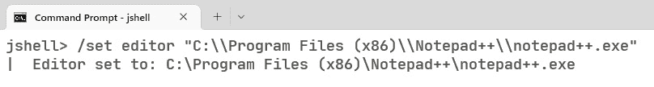

图 2.6 – 在 JShell 中更改编辑器

在这里，我已经将编辑器设置为 Windows 的 Notepad++。请注意，在 Windows 系统中输入`/set editor`命令时，路径分隔符使用了双反斜杠，因为它是被输入在一个 Windows 系统上的。在 Linux 或 Mac 系统上，路径分隔符是一个正斜杠，不需要双倍。由于路径中包含空格，因此它们必须用引号括起来。

当使用 JShell 的外部编辑器时，你必须退出编辑器以将你输入的内容传输到 JShell。这是因为没有**接受**按钮。

JShell 工具对于测试或学习 Java 的新功能或语法非常有用。它对于教授 Java 给初学者也非常有用。尽快熟悉这个工具。

# 两个步骤的编译和执行过程——javac 和 java/javaw

运行 Java 程序最常见的方法涉及两个步骤。首先，你必须使用 javac 编译代码，然后使用 Java 或在 Windows 上使用 javaw 在 **Java 虚拟机**（**JVM**）中执行代码。

准备 Java 源代码以执行的第一步是将它编译成 **字节码**。这是 JVM 的机器语言。应用程序的每个 Java 源文件都必须编译成字节码。

第二步是在 JVM 中执行字节码。与 C 或 C++ 不同，没有链接步骤。链接步骤将所有编译代码组合成一个单一的执行文件。在 Java 中，所有字节码文件都必须在类路径上，即所有字节码文件的路径，而不一定组合成一个单一的文件。这可能会让人感到困惑，因为有一个名为 **jlink** 的工具，但它的目的是将 Java 运行时与你的代码结合起来，这样最终用户就不需要在他们计算机上之前安装的 Java 版本。我们将在 *第十六章* *部署 Java 到独立包和容器* 中检查 **jlink**。

让我们编译并执行我们的 `CompoundInterest01` 程序：

1.  首先，将 `CompoundInterest01.java` 文件放置在其自己的文件夹中。这不是必需的，但如果它有自己的文件夹，代码管理起来会更方便。

1.  现在，在那个文件夹中打开一个控制台；如果你没有使用 Java 的管理员安装版本，请设置 `Path` 和 `JAVA_HOME` 属性，如前一章所示。现在，你可以使用 `javac CompoundInterest01.java` 编译程序：

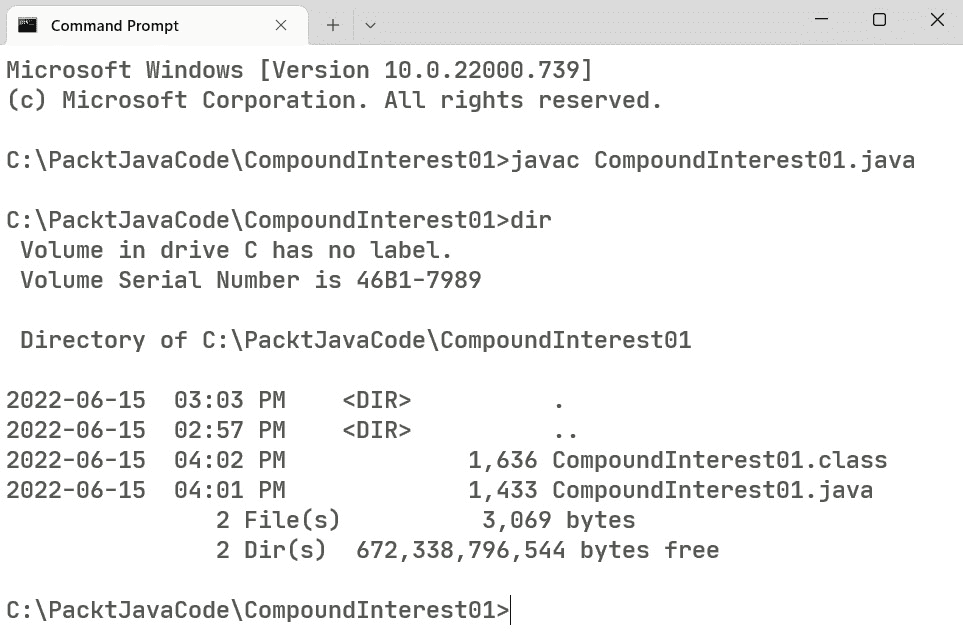

图 2.7 – 编译 Java 程序

如果编译代码没有出现任何错误，那么编译器将在控制台不显示任何内容。现在文件夹中将包含一个名为 `CompoundInterest01.class` 的新文件。注意，它比 Java 源代码文件要大。

Java 类文件包含必要的 **字节码** 和源代码。该文件中源代码的存在支持 **反射** 和 **内省** 的概念。

反射允许你编写可以在运行时检查对象类型或属性的代码，而反射允许你编写可以在运行时检查和修改对象结构的代码。这两个特性在商业编程中很少使用。

1.  代码编译完成后，我们可以运行它。在这里，我们使用 `java` 可执行文件来运行我们的程序。

一个常见的误解是认为 `java` 可执行文件是 JVM。它不是。它是 JVM 的加载器，由 JDK 安装的一部分其他文件组成。JVM 利用其 `ClassLoader` 组件来定位和执行字节码文件。

让我们运行 `CompoundInterest01` 程序。在控制台中输入 `java CompountInterest01`。不需要包含 `.class` 扩展名，因为这仅是唯一可接受的扩展名：

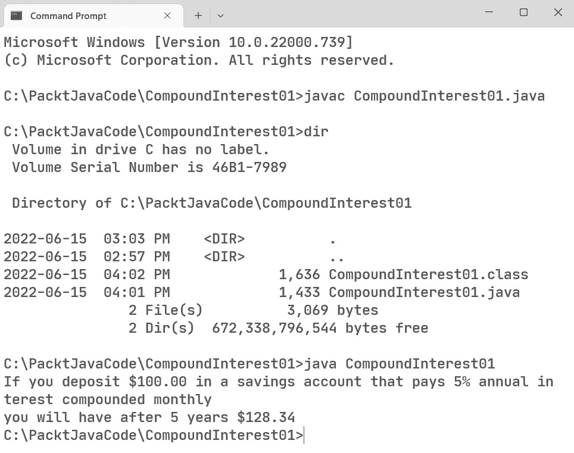

图 2.8 – 运行 Java 程序

这里，你可以看到程序的输出。

在 Windows 系统中，还有一个名为 javaw 的第二个 JVM 加载器，用于在没有打开控制台的情况下执行 GUI 应用程序。如果你创建一个 Windows 快捷方式来运行 GUI Java 程序并使用 `java.exe`，那么将打开一个控制台窗口，然后是程序的 GUI 窗口。如果你使用 `javaw.exe`，则不会出现控制台窗口。

在大多数情况下，使用 javac 然后使用 java 是在命令行中处理 Java 代码最常见的方式。可能由多个文件组成的程序需要每个文件都进行编译，但只有包含 `main` 方法的文件会被执行。让我们看看一种最后一种在单步中编译和执行 Java 程序的方法。

# 启动单文件源代码程序

在 Java 11 之前，从源代码到执行的过程是两步过程：你编译代码然后运行代码。从 Java 11 开始，引入了另一种运行 Java 程序的方法，称为 **启动单文件源代码程序**。这允许你在单行中编译、启动 JVM 并执行程序。我们将在检查 Linux 和 macOS 的独特方法之前，看看这是如何在 Windows、macOS 和 Linux 上工作的。

## 对于 Windows、macOS 和 Linux

在你想要运行的文件所在的文件夹中打开命令提示符或终端，如果需要，更新 `Path` 和 `JAVA_HOME` 属性。现在，只需输入 `java` 和源文件名：

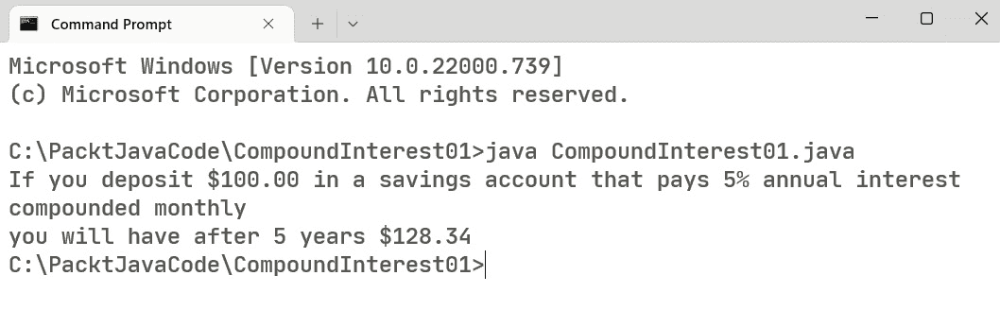

图 2.9 – 运行 Java 程序

正如这种技术的名称所暗示的，你的程序只能由一个文件组成。这个源文件可以包含多个类，并且文件中的第一个类必须有一个 `main` 方法。让我们看看一个将程序拆分为一个文件中的两个类的新版本：

```java
import java.text.NumberFormat;
public class CompoundInterest02 {
    public static void main(String[] args) {
        var banker = new CompoundInterestCalculator02();
        banker.perform();
    }
}
```

这个文件中的第一个类只包含所需的 `main` 方法。下一个类，如下面的代码块所示，也在同一个文件中；这是实际工作执行的地方：

```java
class CompoundInterestCalculator02 {
    private final double principal = 100.0;
    private final double annualInterestRate = 0.05;
    private final double compoundPerTimeUnit = 12.0;
    private final double time = 5.0; // 
    private final NumberFormat currencyFormat;
    private final NumberFormat percentFormat;
    public CompoundInterestCalculator02() {
        currencyFormat = 
                       NumberFormat.getCurrencyInstance();
        percentFormat = NumberFormat.getPercentInstance();
        percentFormat.setMinimumFractionDigits(0);
        percentFormat.setMaximumFractionDigits(5);
    }
    public void perform() {
        var result = calculateCompoundInterest();
        System.out.printf("If you deposit %s in a savings 
                account " + "that pays %s annual interest 
                compounded monthly%n" + "you will have 
                after %1.0f years %s", 
                currencyFormat.format(principal),
                percentFormat.format(annualInterestRate),
                time, currencyFormat.format(result));
    }
    private double calculateCompoundInterest() {
        var result = principal * Math.pow(1 + 
                 annualInterestRate / compoundPerTimeUnit, 
                 time * compoundPerTimeUnit);
        return result;
    }
}
```

这两个类是 `CompoundInterest02` 和 `CompoundInterestCalculator02`。在命令提示符或终端中输入 `java CompoundInterest02.java`；你会得到相同的结果：

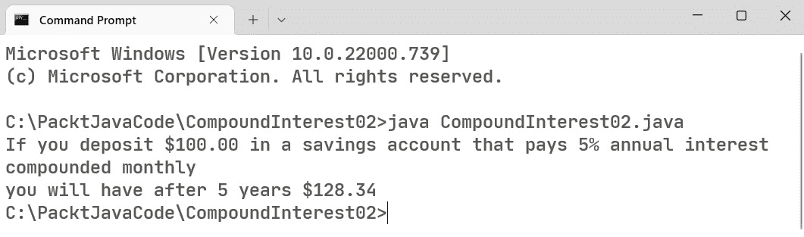

图 2.10 – 在 java 文件中运行包含两个类的 Java 程序

这种技术不会创建一个字节码 `.class` 文件；它只会在内存中创建。

## 对于 macOS 和 Linux – Shebang 文件

在 macOS 或 Linux 上，有一种独特的方式来使用启动单文件源代码程序，这是仅在 macOS 或 Linux 上可用的：`java` 命令。这使得单文件 Java 程序可以作为类似 Bash 的脚本文件使用。Shebang 是指 `#!` 字符。

让我们看看添加了 Shebang 的源代码的开始部分：

1.  在源代码中添加 `#!`，如下所示：

```java
#!//home/omniprof/jdk-17.0.3+7/bin/java --source 17
import java.text.NumberFormat;
public class CompoundInterest03 {
    public static void main(String[] args) {
        var banker = new CompoundInterestCalculator03();
        banker.perform();
    }
}
```

以 Shebang 开头的第一行包括 Java 可执行文件的路径和`–source version`开关。版本是你正在使用的 Java 的编号版本，在这个例子中是`17`。要使用这种技术，文件不能有`.java`扩展名。将 Java 源代码文件重命名以删除扩展名。

1.  下一步是使文件可执行。使用`chmod +x CompoundInterest03`来执行。

1.  最后，你必须通过输入`./CompoundInterest03`来执行文件。以下是输出：

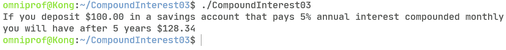

图 2.11 – 在 Linux 中使用 Shebang 运行 Java 程序

在这里，我们正在运行我们的 Java 程序，就像它是一个普通的 Linux 或 macOS 程序一样。

这就结束了我们关于使用命令行 Java 的话题。我们首先查看 JShell 中的 REPL，然后是经典的两个步骤方法，最后是启动单个文件源代码程序的方法。我们还介绍了独特的 Shebang 技术。现在，让我们了解四种最广泛使用的 IDE。

# 集成开发环境

是时候说点实话了——非常少的 Java 开发者只使用像**vi**或**记事本**这样的文本编辑器。知道如何使用独立的文本编辑器并在命令行中进行编译/执行是一个重要的技能，但当我们有选择工具的时候，我们总是会选择 IDE。本节中我们将探讨的特性将解释为什么是这样。

在本节中，我们将简要回顾四种最广泛使用的 IDE。每个 IDE 都有一个独特的构建系统，我们将在*第三章*《Maven 构建工具》中讨论，所有 IDE 都支持相同的外部构建系统。这意味着在一个团队中，每个成员都可以使用他们认为最能提高生产力的 IDE，同时能够在团队成员之间自由地移动代码，而无需为特定 IDE 进行更改。在我介绍这些 IDE 之前，让我们看看它们共有的特性。

### 特性 1 – 代码编辑器

每个 IDE 的核心是其编辑器。像任何普通的文本编辑器一样，它支持通常的功能列表，如剪切、复制和粘贴。使 IDE 编辑器与这些不同的地方在于，每个按键都被监控。如果你误输了变量或方法的名称，你将立即在你的屏幕上得知错误。

编辑器还分享了 JShell 一次执行一行代码的能力。这发生在看不见的地方。如果你正在执行会产生错误的代码——例如引用不属于项目的库——你将在输入时而不是在尝试编译和执行代码时在编辑器中得知错误。尽管不是所有的错误，但大多数错误都是在输入时被检测到的。

这些编辑器另一个非常有价值的特性被称为**代码补全**。微软称此特性为**IntelliSense**。代码补全可以意味着几件事情——例如，如果你写了一个开括号、方括号或圆括号，IDE 将会添加相应的闭括号。

在 Java 中，像其他一些面向对象的语言一样，点操作符（`.`）表示你想要调用对象的成员方法或实例变量。代码补全支持在点操作符后列出所有可能的选项。以下图显示了`percentFormat`的所有选项：

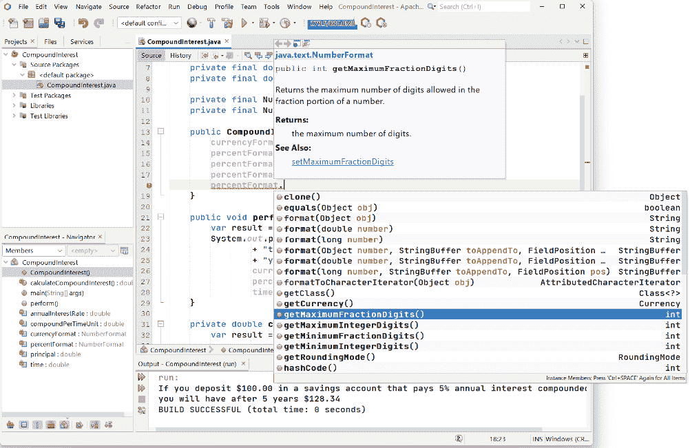

图 2.12 – NetBeans 中代码补全的示例

代码补全还可以推荐你代码中的更高效或更现代的更改。例如，原始的 Java **switch** 语句与 C 语言的 switch 语句相同。switch 语法最近的增强可以有效地消除古老的 switch 语句。如果 IDE 识别出可以使用现代语法，那么你将收到建议，并且在你同意的情况下，IDE 将会以新格式重写你的 switch 语句。

### 功能 2 – 服务器管理

**服务器**代表你的代码可能需要与之交互的外部服务。例如，包括数据库服务器如**MySQL**和**PostgreSQL**，以及 Web 服务器如**Payara**和**WildFly**。在 IDE 内部，你可以停止和启动这些服务。对于数据库服务器，你可以将 IDE 连接到服务器并编写**SQL**查询，查看结果。应用程序或 Web 服务器也可以启动和停止。你可以将编译后的代码部署或取消部署到服务器。

### 功能 3 – 调试和性能分析

单步执行代码是调试工具的一个非常有价值的特性。现代 IDE 提供了这样的调试能力；当你的代码运行但返回错误结果时，这非常有价值。在调试器运行时，你可以在源代码中跟踪程序的执行。你可以检查变量的状态。你的编码语法错误主要是由编辑器识别的。

性能分析允许你在应用程序运行时对其进行监控。性能分析器报告内存使用情况和方法消耗的 CPU 时间。这些信息在确定程序执行速度慢于预期的地方非常有价值。即使你没有怀疑程序速度存在问题，性能分析器也可以为你提供改进程序性能所需的数据。

### 功能 4 – 源代码管理

现代 IDE 支持与源代码管理工具如**Git**、**Mercurial**和**Subversion**的交互。这些工具将你的代码保存在一个仓库中。无需使用独立的客户端工具来从仓库中推送或拉取。如果推送导致冲突，IDE 可以展示当前仓库中的内容以及你想要推送的内容，并允许你决定如何解决冲突。

### 功能 5 – 构建系统

我们迄今为止看到的代码仅由一个文件组成。随着我们对 Java 了解的深入，我们将发现应用程序通常由多个文件组成。这些文件可能放在多个文件夹中。然后，还有提供不属于 Java 功能的外部库，例如与特定数据库交互所需的代码。构建系统负责确保所有组件和库可用。它还负责运行 Java 编译器，然后运行程序。

所有 IDE 都有自己的构建系统。作为独立于 IDE 的外部构建系统，Apache Maven 和 Gradle 将在下一章中介绍。本章我们将讨论的四个 IDE 都支持这些外部构建系统。这意味着，如果你用 IntelliJ 编写了一个配置为使用 Maven 的程序，那么如果 NetBeans 也被配置为使用 Maven，相同的文件也可以在 NetBeans 中打开。

现在，让我们简要地看看最广泛使用的四个 IDE。

## Eclipse 基金会 – Eclipse

Eclipse IDE 最初由 IBM 开发，作为他们现有的 Java IDE VisualAge 的替代品，后者是用 Smalltalk 编写的。2001 年，IBM 发布了用 Java 编写的 Eclipse 平台，并将其作为一个开源项目发布。由与 Java 合作的公司组成的董事会负责监督 Eclipse 的开发。随着越来越多的公司加入董事会，决定创建一个独立的开源组织。2004 年，创建了 Eclipse 基金会，其第一个开源项目是 Eclipse IDE。Eclipse 可以在 Windows、macOS 和 Linux 上运行。

你可以从[`www.eclipse.org/downloads/packages/`](https://www.eclipse.org/downloads/packages/)下载 Eclipse。这里有针对 Java 开发者的 Eclipse IDE，主要用于桌面软件开发。第二个版本称为 Eclipse IDE for enterprise Java and web developers，它增加了对服务器端编程的支持。Eclipse 支持一系列插件，增加了额外的功能。

让我们看看复利程序——我们在*第一个程序*部分编写的程序——在 Eclipse IDE 中的样子：

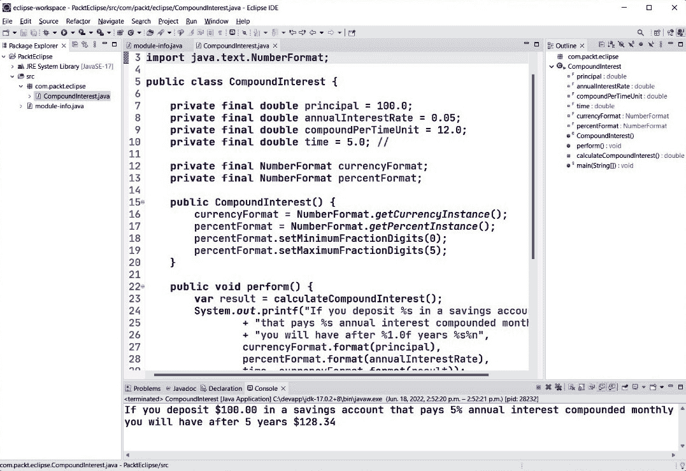

图 2.13 – Eclipse 中的复利程序

在这里，你可以看到输出，以及你在命令行编译和执行时的样子。所有 IDE 都会捕获控制台输出，并在 IDE 中的窗口中显示。

## Apache NetBeans

**NetBeans**始于 1996 年在捷克共和国的一个学生项目。当詹姆斯·高斯林在推广 Java 的过程中第一次遇到 NetBeans 时，他对其印象深刻，以至于回到公司后，他说服 Sun Microsystems 的管理层收购了 NetBeans 背后的公司。2010 年，Oracle 收购了 Sun Microsystems，2016 年，Oracle 将 NetBeans 源代码捐赠给了**Apache 基金会**。NetBeans 可以在 Windows、macOS 和 Linux 上运行。

NetBeans 采用了类似于 Java 的更新节奏，预计每 6 个月推出新版本。虽然不如一些其他 IDE 功能丰富，但它是最简单的四个之一，易于使用。因此，当教授 Java 或希望使用没有陡峭学习曲线的 IDE 时，它是理想的选择。作为一个 Apache 开源项目，它也是最易于参与和贡献的。

你可以从[`netbeans.apache.org/`](https://netbeans.apache.org/)下载 Apache NetBeans。只有一个版本，它支持桌面和服务器端开发。此外，一些插件增加了额外的功能，例如对 Spring 等框架的支持。

让我们看看我们在*第一个程序*部分编写的复利程序在 Apache NetBeans 中的样子：

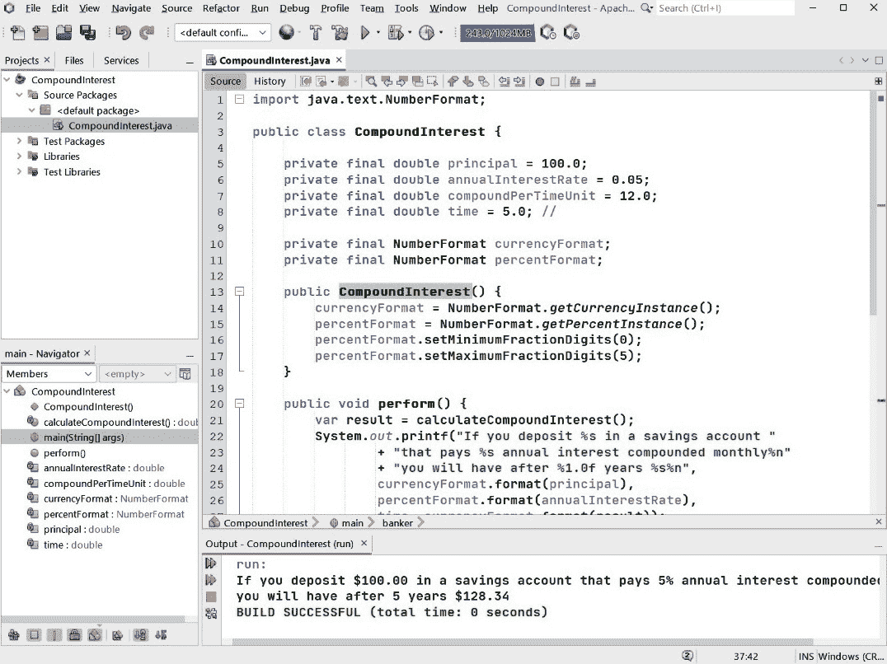

图 2.14 – NetBeans 中的复利程序

在这里，你可以看到 NetBeans 如何显示复利程序的输出。

## 微软 Visual Studio Code

**Visual Studio Code**（**VS Code**）由**微软**于 2016 年推出。它的目的是成为一个适用于 JavaScript、C++、Python 和 Java 等多种语言的开发环境。该程序由一个核心组件组成，作为开源发布。对特定语言的支持由扩展处理。主要的 Java 扩展由 Red Hat 开发，与微软编写的扩展不同，这个扩展是开源的。

VS Code 是用**TypeScript**编写的，并使用开源的 Electron 框架来创建桌面应用程序。VS Code 适用于 Windows、macOS 和 Linux，尽管并非所有扩展都能在所有操作系统上运行。

你可以从[`code.visualstudio.com/docs/languages/java`](https://code.visualstudio.com/docs/languages/java)下载 VS Code 以及几个 Java 扩展。你将想要下载包含 VS Code 和 Java 扩展的编码包。如果你已经下载了 VS Code 的基本版本，你可以通过下载 Java 扩展包来向现有安装添加 Java 支持。

下面是我们在*第一个程序*部分编写的复利程序在 VS Code 中的样子：

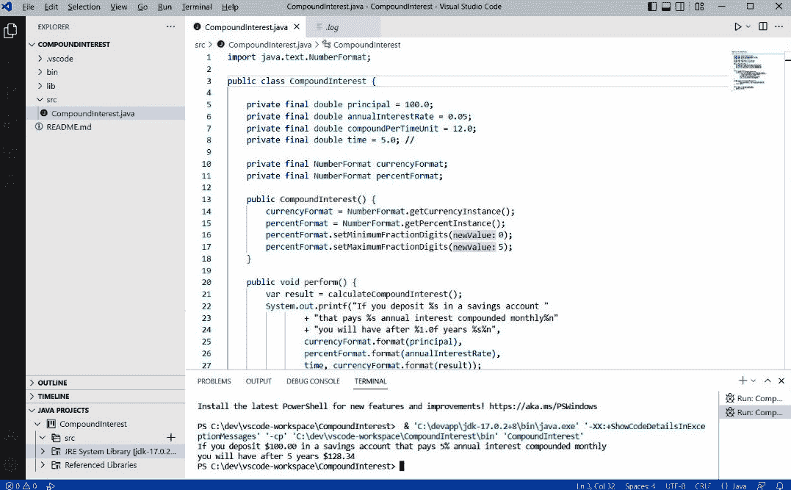

图 2.15 – VS Code 中的复利程序

在这里，你可以看到 VS Code 如何显示复利程序的输出。

## JetBrains IntelliJ IDEA

来自 JetBrains 公司的**IntelliJ IDEA**是用 Java 编写的，于 2001 年推出。它有两种版本。首先，有一个免费的社区版，具有开源许可证，用于开发桌面 Java 应用程序。第二个商业版本，称为 Ultimate，包括对 Java EE/Jakarta EE 和 Spring 等额外 Java 框架的支持。商业版本需要年度付费订阅。

IntelliJ 被认为是 Java IDE 中最功能丰富的。这并不一定意味着它是最好的，但它是所有 IDE 中最广泛使用的。您可以从[`www.jetbrains.com/idea/download/`](https://www.jetbrains.com/idea/download/)下载它。如前所述，社区版是免费的，而终极版本需要订阅。

让我们看看复利程序——我们在*第一个程序*部分编写的程序——在 IntelliJ IDEA 中的样子：

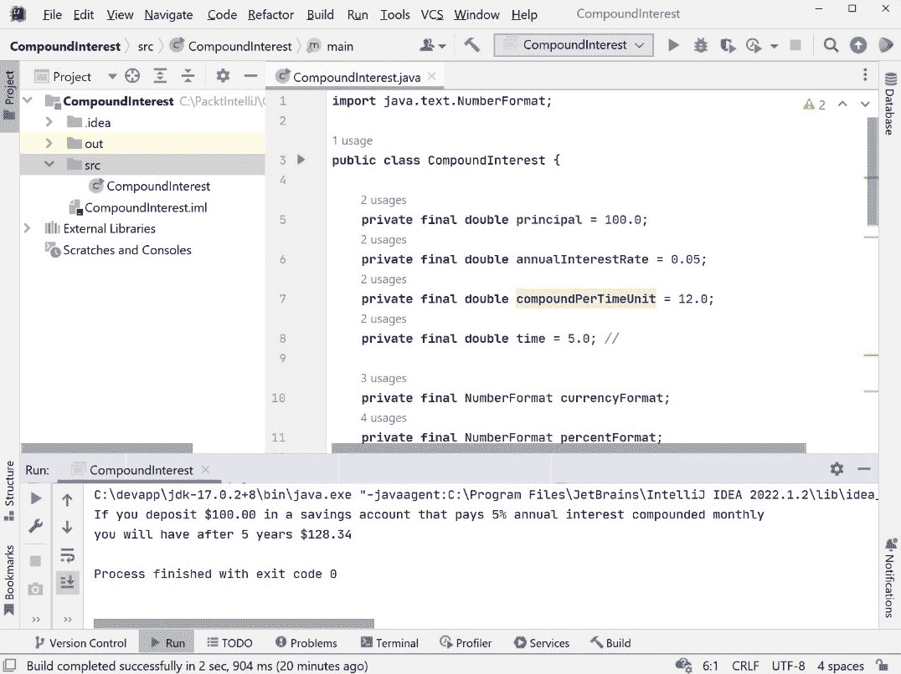

图 2.16 – IntelliJ IDEA 中的复利程序

在这里，您可以看到 IntelliJ IDEA 中的输出。这就是您在命令行编译和执行时的样子。

## 你应该使用哪个 IDE？

选择 IDE 时需要考虑两个因素：

+   第一个因素是您所在的公司是否强制要求使用特定的 IDE。如果是这样，那么选择已经为您做出了。

+   第二个因素是使用 IDE 时的感受。这里展示的所有四个 IDE 都可以支持你在 Java 中编写的任何代码。它们也可以用于其他语言，例如 C、C++、PHP 和 JavaScript。

我只能解释我的选择以及选择该选择的原因。我需要一个需要最少课堂指导的 IDE。我在魁北克省一所大学的三年计算机科学课程的最后一年教授 Java 项目课程。我需要教授高级桌面编程并介绍学生服务器端编程。我不想教授 IDE。出于这些原因，我选择了 NetBeans。如果学生使用外部 Maven 构建系统，他们可以自由选择其他三个 IDE 中的任何一个，但如果他们在 IDE 上遇到麻烦，我只能提供最基本的支持。

因此，我建议您花时间尝试每个 IDE。根据您使用时的感受选择您个人的 IDE。它们在展示完成任务的不同方法时都同样有效。本书的所有源代码，可以在本书的 GitHub 仓库中找到，都可以在这四个提到的 IDE 上运行。

# 摘要

在本章中，我们探讨了从命令行编写、编译和执行 Java 程序的各种方法。我们研究了 JShell 中的 REPL 来快速运行代码片段。然后，我们看到了 Java 在两个步骤中编译和执行的经典方式。最后，我们探讨了如何执行单个文件源代码程序来执行在单个文件中编写的 Java 程序。通过在 macOS 和 Linux 中发现的 Shebang 概念，我们看到了 Java 甚至可以用作脚本语言。最后，我们简要地回顾了四种最常用的 IDE。

现在你已经知道了如何编写、编译和执行 Java 程序，在下一章中，我们将探讨一个可以从命令行或 IDE 内部使用的外部构建系统。这个主题将帮助解释为什么你的 IDE 选择是个人化的。你将看到为什么开发者可以一起工作，而团队成员可能使用不同的 IDE。

# 进一步阅读

要了解更多关于本章所涉及主题的信息，请查看以下资源：

+   *Java 平台，标准版 – Java Shell 用户* *指南*：[`docs.oracle.com/javase/10/jshell/JSHEL.pdf`](https://docs.oracle.com/javase/10/jshell/JSHEL.pdf)

+   *JEP 330: 启动单文件源代码* *程序*：[`openjdk.org/jeps/330`](https://openjdk.org/jeps/330)

+   *Eclipse* *基金会*：[`www.eclipse.org/`](https://www.eclipse.org/)

+   *Apache* *NetBeans*：[`netbeans.apache.org/`](https://netbeans.apache.org/)

+   *Visual Studio* *Code*：[`code.visualstudio.com/`](https://code.visualstudio.com/)

+   *JetBrains IntelliJ* *IDEA*：[`www.jetbrains.com/idea`](https://www.jetbrains.com/idea)
