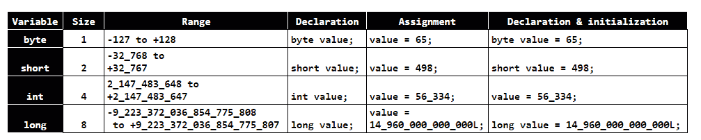
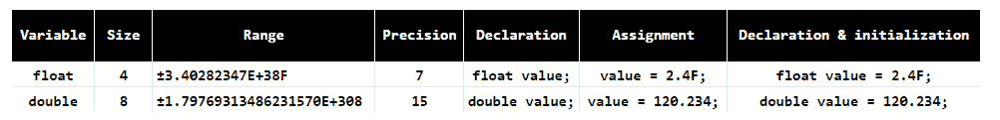
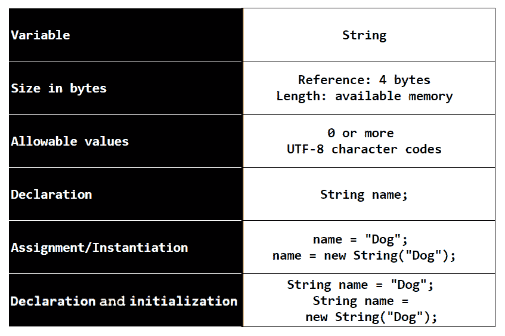

# 第四章：语言基础 – 数据类型和变量

现在我们已经对基本的 Java 工具感到舒适（希望如此），我们可以开始研究这门语言本身了。既然你已经是一名开发者，在这个章节中就没有必要再介绍低级概念，比如什么是变量。因此，这个章节将利用你已有的知识，并介绍 Java 中可用的数据类型以及我们可以对这些类型执行的操作。

在本章中，你将学习以下内容：

+   类型安全

+   八种原始数据类型

+   文字值

+   `String`数据类型

+   标识符命名

+   常量

+   数据操作

+   类型转换

+   溢出和下溢

+   数学类

# 技术要求

这里是运行本章示例所需的工具：

+   Java 17

+   文本编辑器

+   Maven 3.8.6 或更高版本

你可以在 GitHub 仓库中找到本章的代码，网址为[`github.com/PacktPublishing/Transitioning-to-Java/tree/chapter04`](https://github.com/PacktPublishing/Transitioning-to-Java/tree/chapter04)。

注意

Ubuntu 和其他 Linux 发行版可能已经安装了 Maven 的一个版本。如果它不是 3.8.6 或更高版本，你必须用最新版本替换它。

# 原始数据类型

**原始数据类型**创建值变量。这意味着一旦你在程序中声明了变量，你就可以在代码中使用它们。然而，在由引用变量表示之前，类必须被实例化为对象。但值不需要实例化。

在`CompoundInterest`程序中，我们需要在可以使用它之前实例化`CompoundInterestCalculation`类，如下所示：

```java
var banker = new CompoundInterestCalculator04();
```

另一方面，当我们需要变量来保存`principal`、`annualInterestRate`、`compoundPerTimeUnit`和`time`时，我们只需声明它们，如下面的代码行所示——我们直接将值赋给变量。我们没有添加`new`运算符，它负责将类转换为对象。原始数据类型是现成的：

```java
double principal = 100.0;
```

Java 中有八个原始类型。在我们查看它们之前，让我们快速了解一下类型安全是什么意思。

## 类型安全

根据你从 Java 路径中来的语言，类型安全的概念可能或可能不是你所熟悉的。类型安全的一种形式意味着每个变量在声明时都必须显示其类型，并且这种类型不能改变。你不能将整数变量赋值给字符串。如果你这样做，你会得到一个错误消息作为异常。这是静态类型。

静态类型的一个替代方案是动态类型。在这里，没有必要声明变量的类型。Java 会从你分配的内容中推断类型。人们经常错误地认为动态类型不安全。这并不一定正确。

你如何声明变量并不是类型安全的核心。相反，它是语言在运行时如何处理变量类型不匹配的情况。

这里有一个演示 Python 即使使用动态类型也是类型安全的 Python 脚本：

```java
def print_hi(name):
    name = name + 2
    print(f'Hi, {name}') 
if __name__ == '__main__':
    x="bob"
    print_hi(x)
```

在这个例子中，`print_hi` 函数期望接收一个名为 `name` 的变量。该函数的第一行代码使用 `name` 变量执行一个数学运算。

在调用 `print_hi` 的代码中，我们声明了一个变量 `x` 为字符串。我们知道这一点，因为我们将其赋值为字符串。在这段小代码片段中，很明显这将生成一个错误。确实如此，以下是错误信息：

```java
C:\devapp\PycharmProjects\PythonTest\venv\Scripts\python.exe C:/devapp/PycharmProjects/PythonTest/main.py
Traceback (most recent call last):
  File "C:\devapp\PycharmProjects\PythonTest\main.py", line 8, in <module>
    print_hi(x)
  File "C:\devapp\PycharmProjects\PythonTest\main.py", line 2, in print_hi
    name = name + 2
TypeError: can only concatenate str (not "int") to str
Process finished with exit code 1
```

Python 只在运行时检测这个问题，但这是一个会导致程序终止的错误。这意味着尽管动态类型语言不是类型安全的论点，但我们刚刚看到这并不是真的。Python 事实上是类型安全的。

另一方面，Java 是一种静态类型语言。以下是 Java 中的相同代码：

```java
public class TypeSafetyTest {
    private void print_hi(String x) {
        System.out.printf(x);
    }

    public void perform() {
        int x = 4;
        print_hi(x);
    }

    public static void main(String[] args) {
        var typeTest = new TypeSafetyTest();
        typeTest.perform();
    }
}
```

注意到 `print_hi` 明确期望一个字符串，但在 `perform` 方法中，我们传递了一个整数。当我们使用 Maven 运行此代码时，我们将得到以下错误信息：

```java
com/kenfogel/typesafetytest/TypeSafetyTest.java:[12,18] incompatible types: int cannot be converted to java.lang.String
```

在 Python 中，你通过变量的使用位置和方式来确定变量类型。Python 的 `print_hi` 方法没有指示 `name` 的类型。只有当我们看到函数中的数学表达式时，我们才会意识到 `name` 必须是整数才能工作。由于静态类型 Java 要求在每次声明时都必须包含类型，这使得发现类型错误更加容易。

当我们与 Python – 一种优秀的语言 – 进行比较时，请注意每种语言的编译器之间存在着显著差异。Java 编译器可以增量编译程序。IDE 中的编辑器可以通过逐行编译代码来检测你在输入时的错误。没有增量编译器的语言，如 Python，只能在 IDE 中编译或运行代码时报告错误。

哪种方法更好？这由你决定。

然而，静态类型会导致程序更加冗长。这意味着与 Python 相比，你必须在 Java 程序中输入更多的代码。另一方面，静态类型使得追踪类型错误更加容易，并增强了代码的可读性。

关于 Python 的最后一个要点 – 在 3.0 版本中，语言开发者引入了类型注解。这些注解在 Python 代码中看起来就像你在静态类型一个变量一样。但这并不是真的，因为编译器会忽略这些注解。它们的存在是为了支持类型检查器，例如 **PyCharm** IDE 可以做到的。

在我们查看声明变量时使用的数据类型之前，让我们花一点时间看看文字值。

## 文字值

Java 将 `42` 视为一个整数。如果将文字值赋给整数时超过了整数的范围，你将得到一个 `integer number to large` 编译器错误。如果你将文字值赋给 `long` 整数，必须在数字后添加字母 `L`，例如 `14960000000000L`。

当我们书写大数字时，我们经常每三位数字使用一个分隔符来提高可读性。如果你想使用分隔符使源代码更容易阅读，你只能使用下划线。你不能使用逗号或其他任何字符作为分隔符。值`14960000000000L`可以输入为`14_960_000_000_000L`。

当处理字面浮点数时，默认的原始类型是 double。如果你正在分配一个没有小数位的字面 double 值，那么添加一个，而不是像这样添加：

```java
double value = 100;
```

按以下方式输入：

```java
double value = 100.0;
```

或者，你可以使用后缀`D`表示 double 和`F`表示 float。你可以像这里一样用大写或小写写所有字面后缀：

```java
double value = 100D;
```

现在，让我们继续讨论原始数据类型。

## 整数

整数家族有四个成员 – `byte`、`short`、`int`和`long`。它们之间的区别是它们用来存储值的字节数。Java，像大多数语言一样，使用二进制补码来编码整数。这意味着任何整数类型的值范围从负值到正值。像 Python 一样，Java 没有无符号整数，而 C、C++和 C#有。

在下面的表中，你可以找到大小（以字节为单位）、允许的范围以及如何声明、分配或声明和初始化整数家族的所有成员：



](img/Table_4.1_B19088.jpg)

表 4.1 – 整数规格及其使用方法

大多数计算机上的整数数据类型与 CPU 寄存器的大小有关。JVM 是一个 32 位虚拟机，这意味着它的寄存器是 32 位或 4 字节宽。虽然 JVM 程序被实现为一个 64 位应用程序，但它仍然是 32 位计算机的实现。

## 浮点数

与大多数语言一样，Java 使用 IEEE 标准二进制浮点数的一个子集来在内存中表示浮点值。在*进一步阅读*部分，你可以找到深入探讨这种物理格式的网站链接。从我们的角度来看，我们主要感兴趣的是精度。

精度定义为精确表示一个值。我们称整数是精确的，因为每个十进制整数都可以转换成二进制数。我们称这种转换为一个**无损转换**。

并非所有十进制浮点值都能映射到固定长度的二进制值。最好的例子是十进制中的 0.1。这是 10 除以 1。如果我们用二进制的 1（1）除以二进制的 10（1010），结果将是一个无限重复的序列 0.00110011001100110011……这意味着浮点数没有整数那样的精度。IEEE 754 标准处理这个问题，但你必须始终知道浮点值是近似值。我们称之为`float`和`double`。从十进制到二进制浮点数以及返回的精度称为结果的精度。如果一个数字超过了精度，它被认为是实际结果的近似值。

在以下表中，你可以找到大小（以字节为单位）、允许的范围以及如何声明、分配或声明并初始化浮点数家族的所有成员。这些信息对于决定是否使用双精度浮点数或浮点数至关重要：




表 4.2 – 浮点数规格及其使用方法

我们通常将精度解释为小数点右边有效数字的数量。浮点数使用 23 位，双精度浮点数使用 53 位。因此，从数字的位数来定义精度是一种粗略的方法；根据 IEEE 754 标准，它是指尾数的长度。简单来说，由于双精度浮点数的尾数更长，所以它具有更大的值域和更高的精度，比浮点数要高。

你现在可能认为你应该只使用双精度浮点数而不是使用浮点数。毕竟，我们都希望我们的结果尽可能准确。但双精度浮点数在字节大小上是浮点数的两倍，64 位而不是 32 位，这会有性能损失。在决定是否使用双精度浮点数或浮点数时，考虑值域和所需的精度。例如，如果值域较小，小数点后的位数永远不会超过大约六位，那么浮点数就足够了。你可能会进行的数学运算也会影响你的选择。加法和减法不是问题，但乘法和除法可能会有影响。

Java 编译器可以识别当你将浮点值分配给整型变量时。如果你这样做，你会得到从`double`到`int`的可能丢失转换错误。在本章的后面部分，我们将探讨类型转换，以将一个数值数据类型转换为另一个。

现在，我们已经完成了数值类型——整数和浮点数。现在，让我们看看非数值类型。

## 布尔

`false`和 1 表示`true`。在 Java 中，你可以分配给布尔值的集合是`true`和`false`关键字。所有逻辑运算的结果，例如*“x 是否大于 y”？*，用`x > y`表示，总是返回一个布尔值。

在 Python 中，你可以将整数强制转换为布尔值或将布尔值强制转换为整数。C 语言没有布尔类型，因此该语言使用零表示 `false` 和非零表示 `true`。C++ 有布尔类型，但它只是整数的一个子集，其中零和一分别由 `true` 和 `false` 关键字表示。C++ 将整数视为布尔值，与 C 的处理方式相同。

在 Java 中，布尔是一个独立的数据类型。你不能用整数代替 `true` 或 `false`。这意味着你不能使用可能为零或非零的计算结果，其中你需要布尔类型。

在以下表中，你可以找到允许的值集合以及如何声明、赋值、声明和初始化布尔值。技术上，你只需要一个位来表示 `true` 或 `false`。然而，没有机器语言或字节码指令可以读取单个位。Java 语言架构师将布尔类型的字节大小留给了 Java 的具体实现：

![表 4.3 – 布尔类型的规格及其使用方法

![img/Table_4.3_B19088.jpg]

表 4.3 – 布尔类型的规格及其使用方法

CPU 以字节为单位从内存中检索数据，通常是每次 4 个字节，因为这通常是 CPU 的字大小。它不能直接读取 RAM 中的单个位。一旦检索并存储在 CPU 寄存器中，CPU 就可以确定字节中任何位的状态。这意味着布尔值不能小于一个字节。Java 没有像整数和浮点数那样定义字节的大小。布尔值使用的字节数取决于虚拟机的实现。这意味着一个组织对 Java 的实现可能使用的字节数与另一个组织不同。

布尔值是许多组织决策和迭代的核心。现在，让我们继续了解用于表示我们书面语言字符的数据类型。

## `char`

`char` 数据类型包含 2 字节 Unicode 字符的数值。Unicode UTF-8 是一种可变长度的字符编码，每个字符占用 2 到 4 个字节。目前，Java 只支持 2 字节编码。前 128 个字符与 ASCII 编码中的前 128 个字符相同。

在 C 和 C++ 中，`char` 是整数的一个子集，你可以将其用作整数。Python 没有字符类型，但使用长度为 1 的字符串来表示单个字符。在 Java 中，`char` 是一个独特的数据类型；你不能像 C 和 C++ 那样将其用作整数。你可以将 `char` 强制转换为整数或将整数强制转换为 `char`。

注意，单个字符周围的单引号表示一个 `char`。

在以下表中，你可以找到允许的值集合以及如何声明、赋值或声明并初始化 `char`：

![表 4.4 – `char` 的规格及其使用方法

![img/Table_4.4_B19088.jpg]

表 4.4 – `char` 的规格及其使用方法

还有另一个表格需要查看，那就是在声明时未初始化的变量的默认值。变量可以作为类中的字段或作为方法中的局部变量声明。以下是字段的默认值：

| **类型** | **默认值** |
| --- | --- |
| `boolean` | `false` |
| `byte` | 0 |
| `short` | 0 |
| `int` | 0 |
| `long` | 0 |
| `float` | 0.0f |
| `double` | 0.0d |
| `char` | \u0000（Unicode 等效于 null） |
| 对象引用 | null |

表 4.5 – 字段默认值

在方法中声明的变量没有默认值。任何尝试读取未分配初始值的局部变量的代码都会导致编译时错误。

我们现在已经介绍了八个原始类型，还有一个特殊类型可以使用，类似于原始类型，但它不是原始类型。让我们来认识一下`String`。

# 特殊情况 - 字符串

字符串，小写`s`，是一系列字符，通常代表我们可以书写或说出的单词。`String`，大写`S`，是一个包含零个或多个字符并可以对其执行许多操作的类。作为一个类，它通常必须实例化为一个对象。由于开发人员经常使用`String`对象，Java 可以在使用赋值运算符（`=`）与`String`变量赋值时隐式地实例化它。当我们引用这种数据类型时，我们总是将第一个字母大写。这样，我们知道我们正在引用`String`类。我们将在下一章更深入地介绍类和对象。

让我们考察`String`及其使用方法。我们首先从规范表开始：




表 4.6 – 字符串规范及其使用方法

在此表中，`String`。第一个，称为`String`对象。引用类似于其他语言中的指针，但你不能像在 C 或 C++中那样操作它。此对象在内存中的长度包括对象开销以及你实际存储的文本中的字符。

在 Java 中，通过使用`new`运算符，类在内存中成为对象，如前表所示。开发人员经常使用`String`对象，Java 通过在赋值时隐式实例化它来简化其使用。你可以像这样使用`new`，但很少这样写。相反，`String`似乎像原始值一样工作，以方便程序员。

在定义了八个原始类型和一个特殊案例之后，我们现在可以继续探讨如何在我们的代码中使用它们。

# 标识符命名

任何语言中的**标识符**只是我们分配给变量、类或方法的名称。我们首先将关注命名变量，在*第五章*“语言基础 - 类”，我们将探讨命名类和方法。

Java 关于标识符命名的规则非常少，但对于那些有的规则，编译器会强制执行。这些规则如下：

+   标识符的第一个字符可以是以下之一：

    +   美元符号 (`$`)

    +   下划线 (`_`)

    +   Alpha 字符 (`A`–`Z`, `a`–`z`)

+   后续字符可以是之前提到的任何字符和数字。

一旦你遵守了规则，命名选择就取决于你了。这是因为 Java 有命名约定。约定不是规则，编译器不会验证它们。相反，约定是编程社区为特定语言推荐的技术。在团队工作中，你的同事期望你遵循这些约定。以下是命名变量的约定：

+   变量的名称应该是名词；变量是事物而不是动作。

+   第一个字符应该是小写字母。对于类标识符的约定要求其第一个字符为大写字母。

+   当使用由多个单词组成的名称时，使用驼峰式命名。标识符中的每个单词应该小写，除了第一个单词的首字母。标识符中第一个单词之后的每个后续单词必须以大写字母开头。如果你更喜欢使用下划线在多单词标识符中表示空格而不是驼峰式命名，这是可以接受的。对于这种用法，所有字符都应该小写。

+   不要使用缩写；使用完整的单词。

+   避免使用单字符标识符。在有限的情况下，单字符是可接受的，例如用于循环索引变量。否则，使用有意义的名称。

+   此表描述了变量的命名约定：

| **约定** | **可接受** | **不可接受** |
| --- | --- | --- |
| 名词 | `double salary;` | `double receive;` |
| 第一个字符小写 | `int cars;` | `int Cars;` |
| 驼峰式命名 | `int platesOfPasta;` | `int platesofpasta;` |
| 下划线分隔符 | `int plates_of_pasta;` | `int plates_Of_Pasta;` |
| 缩写 | 从不接受 | `int lol;` 代表清漆层 |

表 4.7 – 命名约定

+   你不应该使用美元符号；编译器使用它来创建标识符。

+   你不应该像其他语言（如 C++）那样将下划线用作第一个字符，因为在 Java 中，它和美元符号作为第一个字符的含义相同。

+   一旦超过第一个字符，你可以使用字母表中的任何字母、任何数字、下划线或美元符号。

现在让我们看看以下表格中标识符长度与其他语言的比较：

| **语言** | **最大有效字符数** |
| --- | --- |
| Python | 79 |
| 标准 C | 31 |
| 标准 C++ | 1,024 |
| 微软 C++ | 2,048 |
| GNU C++ | 无限制 |
| Java | 无限制 |

表 4.8 – 标识符最大长度

虽然 Java 和 **GNU C++** 对标识符名称中的字符数没有限制，但你应该合理地使用字符数。

为标识符想出一个有意义的名字是使你的代码可读的重要任务，所以请多加思考。现在，让我们看看一旦赋值后就不能更改的数据。

## 常量

常量可以是使用`final`关键字声明的任何数据类型。它必须在声明时赋值，例如，`final double TAX_RATE =` `0.05;`。

如果你在一个类的字段中声明为`final`，那么你还可以在类构造函数中为其赋值。然而，一旦常量被赋值，它的值就不能更改。

常量的命名规则与标识符相同。不同的是约定。常量是使用大写字母书写的名词。你可以在标识符中用下划线分隔单词，如前例中的`TAX_RATE`所示。

## 运算符

Java 支持几乎在每种语言中都找到的常见运算符集合，如下表所示：

| **操作** | **运算符** | **赋值** |
| --- | --- | --- |
| 加法 | x = x + y | x += y |
| 减法 | x = x – y | x -= y |
| 乘法 | x = x * y | x *= y |
| 除法 | x = x / y | x /= y |
| 取模（余数） | x = x % y | x %= y |
| 增量 | ++x 或 x++ | N/A |
| 减量 | --x 或 x-- | N/A |

表 4.9 – 基本数学运算符

Java 遵循标准的优先级规则，除了增量或减量运算符。如果运算符在变量的左侧，那么 Java 会在其他任何操作之前执行该操作。技术上，这给了它最高的优先级。放在右侧，它具有最低的优先级，Java 会在所有其他操作完成后执行它。我们将在下一章讨论逻辑运算时回顾逻辑运算符。

### 字符串运算符

`String`没有数值，你不能在计算中使用`String`对象。正如你所期望的，`int numberOfDogs = 23;`并不意味着与`String numberOfDogs = "``23 ";`相同。

你不能在算术表达式中使用`String`变量。如果`String`中的字符与数字允许的字符匹配，那么你必须先将`String`转换为数字变量，然后再在算术表达式中使用它。

然而，加号（`+`）运算符与`String`一起使用是被允许的。当与`String`一起使用时，它意味着将多个`String`值连接或合并为一个，如下所示：

```java
String animal = "moose";
String favoriteAnimal 
    = "My favorite animal is a " + animal;
```

你还可以使用连接将`String`与任何八个原始数据类型结合。这将自动将原始数据类型转换为`String`，如下所示：

```java
int numberOfMoose = 36;
String message = "There are " + numberOfMoose 
    + " in the park. "
```

`String`消息将包含以下内容：

```java
There are 36 moose in the park.
```

你不能直接将数字类型赋值给`String`。你必须将它连接到`String`或使用`String.valueOf`方法；这是一个更简单的方法。将原始数据类型连接到任何字符串，例如这里显示的空字符串，将有效：

```java
String piecesOfSilver = "" + 23;
```

或者，你也可以使用以下方法：

```java
String piecesOfSilver = String.valueOf(23);
```

在你看到字面值的地方，你也可以使用原始数据类型，如下所示：

```java
int silverCoins = 23;
String piecesOfSilver = String.valueOf(silverCoins);
```

你可以用一个操作符与 String 一起使用，那就是用于连接而不是数学函数。

## 类型转换

类型转换提供了一种将一种数据类型转换为另一种数据类型的能力。当使用原始数据类型编码时，有两种类型的类型转换 – 隐式和显式。首先，看看这个图表，它按值范围顺序显示了原始数据类型：

| **最大值** |  |  |  |  | **最小值** |
| --- | --- | --- | --- | --- | --- |
| `double` | `float` | `long` | `int` | `short` | `byte` |

表 4.10 – 类型之间的相对字节数

这意味着当将图表中的一种类型的原始数据类型赋值给图表中更高类型的原始数据类型时，Java 将执行隐式转换，如下所示：

```java
int apples = 23;
double fruit = apples;
```

这是一个无损转换。你可以尝试反向赋值，如下所示：

```java
double apples = 34.6;
int fruit = apples;
```

你将得到以下错误：

```java
incompatible types: possible lossy conversion from double to int
```

如果你需要将一个大于目标变量数据类型的值转换，你必须进行显式转换。例如，当从浮点数转换为整数时，Java 将截断小数部分。没有四舍五入；它只是消失，如下所示：

```java
double apples = 34.6;
int fruit = (int)apples;
```

使用类型转换时没有错误，但`fruit`中的值将是`34`。

如果右侧的值超出了你要转换到的类型的范围，当它是一个整型时，就像下一节中讨论的溢出一样，它将回绕，如下所示：

```java
double apples = 67000.6;
short fruit = (short)fruit;
```

`fruit`中的值将是`1464`。

Java 类型转换的语法是将要转换的类型放在括号内。Python、C 和 C++通过将值放在括号内进行转换，而 C#遵循与 Java 相同的模式。

在*表 4.10*中，你没有看到`char`类型。在语言中，它的唯一目的是表示 Java 将渲染为屏幕上的字符的 UTF-8 代码。你可以将一个字符赋给`char`变量，或者你可以赋一个整数。如果你赋的整数超出了允许的范围，那么你需要进行类型转换，并且会发生溢出回绕。

下面是一些声明`char`变量的例子：

```java
char letterA1 = 'A';
char letterA2 = 66;
char letterA3 = (char)65601;
```

这三个都会变成字母`A`。

我们已经看到，提升（promotion）是隐式发生的，从图表中的一个数据类型移动到另一个范围更高的数据类型。要向相反方向移动，你必须进行类型转换。

## 溢出和下溢

当处理浮点类型时，可能会发生溢出和下溢。只有整数和`char`类型可能会发生溢出。以下是 Java 在这些情况下的行为。

### 整数溢出

当一个值超出允许值的范围时，会发生溢出。对于浮点值，溢出会导致特殊值无穷大，结果可以是正无穷或负无穷。

整数溢出会导致回绕。例如，在下面的代码片段中，我们正在将一个值赋给一个短整型数据类型。这个值比`short`的可允许的上限大 1：

```java
short testValue = (short)32768;
System.out.printf("testValue = %d", testValue);
```

下面的代码片段是这段代码的输出：

```java
testValue = -32768
```

### 浮点数溢出

与整型不同，浮点型在溢出时不会回绕。相反，Java 赋予特殊的值 `Infinity`。

以双精度浮点数为例，我们可以使用下一节中讨论的 `Double` 类，作为包含双精度浮点数允许的最大值的静态常量。当我们给双精度浮点数赋值超过最大允许值时：

```java
double testValue = Double.MAX_VALUE + Double.MAX_VALUE;
System.out.printf("testValue = %f", testValue);
```

以下将是输出结果：

```java
testValue = Infinity
```

浮点数的性质是这样的，即使超过最大值的一点点增加也不会导致溢出。正如前一个例子所示，超过最大值的显著增加将生成 `Infinity`。以下是一个例子：

```java
double testValue = Double.MAX_VALUE + 1.0;
double testValue = Double.MAX_VALUE ;
```

这两个表达式返回相同的答案：

```java
testValue = 179769313486231570000000000000000000000000000000000000000000000000000000000000000000000000000000000000000000000000000000000000000000000000000000000000000000000000000000000000000000000000000000000000000000000000000000000000000000000000000000000000000000000000000000000000000000000000000000000000000000000000000.000000
```

### 浮点数下溢

下溢发生在浮点值无法表示极小分数时。就像溢出一样，这种情况不会在值低于浮点数最小值后立即发生。一个有意义的变化，将值降低到最小值以下将触发下溢。在这个例子中，我们首先将允许的最小值赋给一个双精度浮点数。当我们除以 2 时，它变得更小，但现在小于最小值：

```java
double testValue = Double.MIN_VALUE;
System.out.printf("testValue = %2.16e", testValue);
```

运行后的结果是：

```java
testValue = 4.9000000000000000e-324
```

这是双精度的最小值。比如说我们尝试通过除以 2 来赋予一个更小的值，就像我们在这里做的那样：

```java
double testValue = Double.MIN_VALUE / 2;
```

然后，结果将是以下内容：

```java
testValue = 0.0000000000000000e+00
```

这是代码在浮点或双精度浮点数下溢时返回的值。

你应该始终警惕溢出，在浮点数的情况下，还要警惕下溢。现在，让我们看看一组提供基本数据类型类支持的类。

## 包装类

Java，像大多数语言一样，有一个数组数据类型——你可以有一个整数数组、布尔数组或基本类型数组。你可以有一个对象数组，例如 String。数组中的每个元素都必须是相同的类型。Java 中许多面向对象的功能需要使用对象而不是基本类型。例如，Java 有一个名为集合的数据结构库，它提供了比基本数组更强大的功能。这些集合只能存储或收集对象。你不能有一个 `int`、`double` 或其他基本类型的集合。

`String` 类，你不需要使用 `new` 来创建包装对象。包装器有从字符串转换为基本类型的方法。它们还包含有关基本类型的信息。当我使用 `Double.MIN_VALUE` 和 `Double.MAX_VALUE` 时，我们已经瞥见了这一点。

这里是所有基本类型及其匹配的包装类的一个表。除了静态变量之外，这些包装器还有将值转换为和从 `String` 转换的静态方法：

| **基本数据类型** | **包装类** |
| --- | --- |
| `byte` | 字节型 |
| `short` | 短整型 |
| `int` | 整型 |
| `long` | 长整型 |
| `float` | 单精度浮点型 |
| `double` | 双精度浮点型 |
| `boolean` | 布尔型 |
| `char` | 字符 |

表 4.11 – 基本类型和包装器

这些类，如 String，不需要显式实例化。这意味着你可以写如下：

```java
Integer number = Integer.valueOf(12);
```

但你也可以直接分配整数值，如下所示：

```java
Integer number = 12;
```

Java 将此称为**自动装箱**。第二个特性，称为**自动拆箱**，允许将包装类读取为原始类型。

在这里，我们看到一个对象`number`被分配给一个原始类型：

```java
int value = number;
```

这现在允许我们使用对象作为原始类型。每个包装类都包含几个有用的方法，我们将随着对语言的深入研究来探索这些方法。

## 数学库

在本章前面，我们检查了可用于处理原始数据类型的运算符。有许多你可能希望执行的操作没有对应的符号，例如对一个值进行幂运算。有些语言使用 caret (`^`) 或双星号 (`**`) 来表示幂运算。在 Python 中，你会写如下：

```java
value = 5.0**2.0;
```

结果将是`25`。Java 没有这个操作的符号。相反，我们必须使用属于数学类的方法，如下所示：

```java
double value = Math.pow(5.0, 2.0);
```

我们已经在计算复利的程序中看到了这一点；再看看：

```java
var result = principal * Math.pow(
              1 + annualInterestRate / compoundPerTimeUnit, 
           time * compoundPerTimeUnit);
```

数学库提供了广泛的数学运算。请参阅*进一步阅读*部分中的链接，了解所有可用的选择。

# 摘要

你将要编写的每个程序的核心是程序操作的数据。在本章中，我们学习了关于八个原始类型。有`byte`，如果你正在编写与其它设备交互的软件特别有用。`short`、`int`和`long`在需要描述没有分数时很有用。然而，当有分数时，你可以使用浮点类型——`float`和`double`。`char`类型是字符串的构建块。如果你想跟踪什么是真或假，你应该使用`boolean`类型。

在你继续学习 Java 的过程中，始终牢记可用的数据类型。同样重要的是要了解如果值超出范围会发生什么。

确定了类型之后，我们转向识别具有有意义的名称的变量。我们讨论了如何将这些数据分配给这些变量，以及如何使用它们是本章的一个重要部分。

我们简要地离开了原始类型，来看看与原始类型紧密相关的类。有`String`——包含我们可以阅读的文本的字符。包装类提供了关于其匹配原始类型的运行时信息，并且可以与原始类型自由互换，当你需要一个对象而不是原始类型时。

接下来，我们将探讨关注访问控制、包以及如何构建类的类。

# 进一步阅读

+   *IEEE 754 格式*：[`mathcenter.oxford.emory.edu/site/cs170/ieee754/`](http://mathcenter.oxford.emory.edu/site/cs170/ieee754/)

+   *揭秘浮点数* *精度*: [`blog.demofox.org/2017/11/21/floating-point-precision/`](https://blog.demofox.org/2017/11/21/floating-point-precision/)

+   *类* *数学*: [`docs.oracle.com/en/java/javase/17/docs/api/java.base/java/lang/Math.html`](https://docs.oracle.com/en/java/javase/17/docs/api/java.base/java/lang/Math.html)
