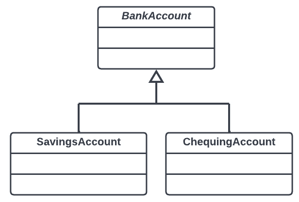
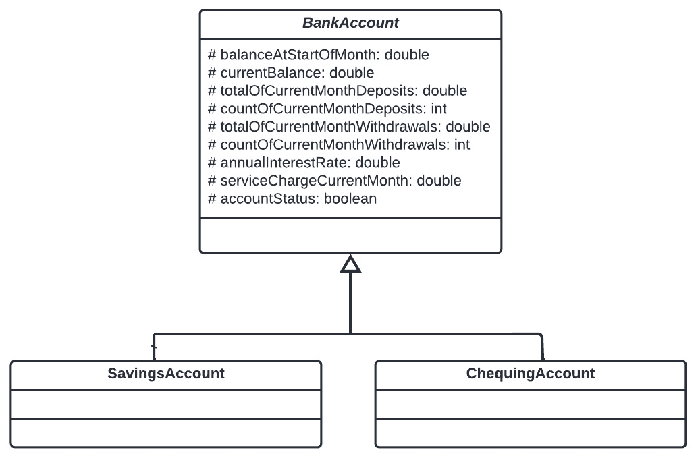
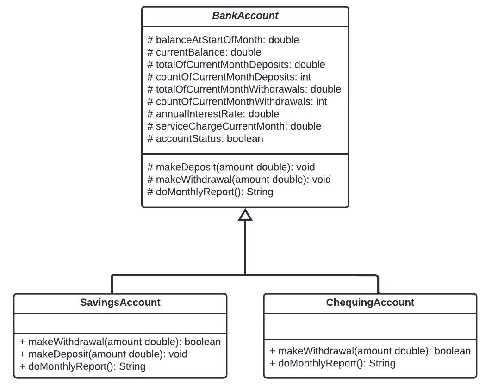

# 第六章：方法、接口、记录及其关系

在 Java 中，我们定义和组织代码的方式是语言的基础。在本章中，我们将首先检查方法在 Java 中的作用。从这里，我们将检查继承和接口提供的关系。接下来是不可变的`record`类。多态，即使用对象在类层次结构中的能力，作为继承和接口的应用，也将被覆盖。我们将通过查看对象之间的关系以及它们如何调用其他对象中的方法来结束本章。

在本章中，我们将学习以下主题：

+   理解方法

+   理解继承

+   理解类接口

+   理解`record`类

+   理解多态

+   理解类中的组合

通过理解 Java 中所有可用组件和关系，你将能够阅读或编写 Java 代码。

# 技术要求

这里是运行本章示例所需的工具：

+   已安装 Java 17

+   一个文本编辑器

+   已安装 Maven 3.8.6 或更高版本

本章的示例代码可在[`github.com/PacktPublishing/Transitioning-to-Java/tree/chapter06`](https://github.com/PacktPublishing/Transitioning-to-Java/tree/chapter06)找到。

# 理解方法

现在，我必须承认，我从 1980 年开始编码，从那时起，我们用来描述代码离散块术语已经改变。当我 1980 年开始使用**BASIC**，一种无结构语言编码时，我很快学会了将我的代码分解成子程序。从 BASIC，我转向**Pascal**，其中代码块有一个正式的指定。这些是为返回结果的**函数**和没有返回结果的**过程**。接下来是 C，然后是 C++。这些语言将它们的代码块命名为函数，因为它们所有（除了构造函数）都必须返回一个值。转向 Java，这些块被称为方法。让我们来检查方法组件。

在创建方法时，你需要考虑一些甚至所有这些组件：

+   访问控制指定

+   静态或非静态指定和`this`引用

+   重写权限

+   需要重写

+   返回类型

+   方法名

+   参数变量

+   注解

+   异常处理

+   线程设置

+   泛型参数

让我们逐一讨论。

## 访问控制指定

在上一章中，我介绍了访问控制的概念，因此让我们看看这些概念如何应用于可能为私有、公共、受保护或包的方法：

+   使用`private`指定符的私有方法只能被同一类中的非静态方法访问：

    ```java
    private void doSomething() { … }
    ```

+   公共方法可以被同一类中的非静态方法访问。它们也可以被程序中任何具有指向包含公共方法的对象的引用变量的其他对象访问：

    ```java
    public void doSomething() { … }
    ```

+   受保护的成员可以从继承它们的任何子类中像公共方法一样访问。我们将在本章后面讨论继承。类的一个受保护成员也具有包访问权限。在没有继承和不同包中的对象的情况下，`protected`的行为与`private`相同：

    ```java
    protected void doSomething() { … }
    ```

+   包含在一个对象中的方法可以被同一包中具有对其引用的其他对象访问，就像它是公共的。其他包中的对象，如果它们有适当的引用，将包方法视为私有，无法访问它们：

    ```java
    void doSomething() { … } // Package
    ```

## 静态或非静态的指定以及 this 引用

方法默认是非静态的。这意味着当方法被调用时，始终有一个未声明的第一个参数。如果存在其他参数，则这个未声明的参数始终位于第一位。

未声明的参数是对调用方法的对象的引用。它的类型是类，标识符是`this`。

为了理解这一点，让我们看看一些代码片段。这里有一个只有一个方法的类的一部分。由于字段和方法参数具有相同的名称，我们将使用`this`引用来区分它们：

```java
public class StaticTest01 {
   private int value;
   public void nonStaticMethod(int value) {
      this.value = value;
   }
}
```

`this`引用是由编译器添加的，作为非静态方法的第一个参数。让我们看看编译器添加了`this`引用后方法是如何出现的：

```java
public class StaticTest01 {
  private int value;
  public void nonStaticMethod(StaticTest01 this, int value){
     this.value = value;
  }
   …
}
```

我们实例化对象，如下所示：

```java
var sTest = new StaticTest01();
```

然后，我们调用它的方法，如下所示：

```java
sTest.nonStaticMethod(42);
```

然后，编译器将方法转换为以下形式：

```java
sTest.nonStaticMethod(sTest, 42);
```

`this`引用允许方法只有一个代码块，无论你创建了类的多少个实例。

你可以在方法体中使用`this`引用，但不能声明它。如前所述，`this`最常见的使用是区分具有相同标识符名称的字段标识符和局部方法变量。

静态方法，即通过添加`static`关键字指定的方法，没有`this`引用。这意味着你可以先不实例化它所属的对象就调用这个方法。这也意味着它不能调用同一类中声明的非静态方法，也不能访问任何非静态字段。

## 重写权限 - final

继承是从现有类创建新类的过程。我们将在本章后面详细讨论这个主题。这意味着派生类或子类中具有相同名称、相同类型和参数数量的方法会覆盖父类或超类中的相同方法。

如果`StaticTest`是一个具有继承关系的超类，则`nonStaticMethod`方法可以被重写，但如果我们将`final`关键字添加到方法声明中，我们可以防止这种情况。现在，我们不能再重写`nonStaticMethod`，如下面的代码块所示：

```java
public class StaticTest {
   private int value;
   public final void nonStaticMethod(int value) {
      this.value = value;
   }
}
```

我们也可以在声明类时使用`final`关键字。这将阻止这个类被用作超类。换句话说，你不能从一个`final`类继承：

```java
public final class StaticTest {
```

现在，我们不能再扩展这个类。这也意味着类中的所有方法实际上都是`final`的，所以没有必要在方法名中使用关键字。

## 必须重写 - 抽象

在使用或不使用`final`关键字来决定方法在涉及继承时是否可以被重写的同时，我们还可以要求方法必须被重写。我们刚刚讨论了如何控制你是否可以重写一个方法。另一个选择是强制子类化，这样你*必须*重写该方法。我们通过定义一个`abstract`类并声明没有代码的抽象方法来实现这一点，如下面的代码块所示：

```java
public abstract class ForcedOverrideTest {
   private int value;
   public abstract void nonStaticMethod(int value);
   }
}
```

包含一个或多个抽象方法的类不能被实例化。你只能将其用作继承中的超类。因此，我们必须也将该类指定为抽象的。

## 返回类型

在 Java 中，与 C 语言一样，所有方法都返回一个结果。当我们声明一个方法时，除了构造函数外，我们必须显示返回类型。返回类型可以是原始变量或引用变量。

有一种特殊的返回类型，那就是`void`。使用`void`意味着此方法没有返回值，且在方法中不能有返回值的`return`语句：

+   此方法不返回任何内容：

    ```java
    public void doSomething() { … } //
    ```

+   此方法返回一个原始类型：

    ```java
    public double doSomething() { … }
    ```

+   此方法返回一个引用：

    ```java
    public String doSomething() { … }
    ```

根据你在方法中使用的逻辑，可能会有时候你想提前返回或跳出方法。在这种情况下，当返回类型为`void`时，你可以单独使用`return`。如果方法不是`void`，那么提前返回也必须包括适当的值。

## 方法名

命名方法的规则和约定与我们讨论过的命名变量的规则和约定相同，见*第四章*，*语言基础 - 数据类型和变量*。一个区别是，根据命名约定，变量是名词，而方法则期望是动词。

## 参数变量

方法名之后跟着一个开括号和闭括号；如果为空，则此方法不接收任何数据。正如已经指出的，对于非静态方法，在参数列表的第一个位置会自动添加一个未声明的`this`引用。如果我们编写一个没有任何参数的非静态方法，则会得到这个引用。这实际上意味着所有非静态方法至少有一个参数。

参数可以是任何原始类型或类引用类型。一个方法最多可以有 255 个参数，尽管如果你有接近 255 个参数，那么你很可能在做一些错误的事情。

当你调用一个方法时，重要的是你传递的值的类型。标识符并不重要。如果你有一个名为 `bob` 的 `int` 类型参数，你可以传递任何命名的 `int` 给这个方法。

Java 没有为参数设置默认值的方法。

## 注解

注解是一个提示。它可以在编译时修改你的代码的行为，或者只是提供信息而不产生任何效果。一个方法注解必须出现在方法及其任何组件之前。

注解是一个遵循与类相同的命名约定并以下划线符号（`@`）开头的短语。它可以在括号内包含注解后的参数，但这些不是方法参数中的变量声明。它们可以是任何东西。

框架，如 `Servlet` 类，这是一个由网络应用程序服务器实例化和运行类，我们会这样注解它：

```java
@WebServlet(name = "AddToEmailList", 
                        urlPatterns = {"/AddToEmailList"})
public class AddToEmailListServlet extends HttpServlet{...}
```

在这个例子中，注解将这个类定义为名为 `AddToEmailList` 的 `WebServlet` 类，而不是使用类名 `AddToEmailListServlet`。

你可以在任何地方使用注解，而不仅仅是用于网络。

## 异常处理 – 抛出

当我们在下一章查看 Java 代码的语法时，我们会遇到在程序运行时可以预测或期望出现错误的情况。例如，你试图打开到数据库服务器的连接，但操作失败。尝试建立连接的代码将抛出一个异常。异常只是一个包含错误详情的对象。

在 Java 中，异常可以是检查型或非检查型。检查型异常期望有代码来处理异常；如果你不处理异常，它就是一个错误。非检查型异常不需要处理，可能会或可能不会结束你的程序。

你也可以决定当发生异常时，不要在发生异常的方法中处理它。相反，你希望将异常传递回调用该方法。你可以通过 `throws` 子句来完成这个操作。以下是一个连接到数据库以检索数据库中项目列表的方法片段。

在下面的代码块中，我们有一个打开数据库连接的方法：

```java
Connection connection;
private void openConnection(){
    connection = 
        DriverManager.getConnection(url, user, password);
}
```

如果连接失败，将发生 `SQLException` 类型的异常，这是一个检查型异常。这段代码将导致编译时错误，因为你没有处理检查型异常。你可以决定在调用此方法的方法中延迟处理异常。为此，我们在方法中添加一个 `throws` 子句，如下面的代码块所示：

```java
Connection connection;
private void openConnection()throws SQLException{
    connection = 
        DriverManager.getConnection(url, user, password);
}
```

编译器现在将验证这个异常将在调用此方法的地方被处理。

为什么不在异常发生时处理它？我们已经看到我们的`CompoundInterest`程序被分解为用户界面类和业务计算类。想象一下，你决定在发生错误的地方处理错误，例如请求用户的新凭据，如用户名或密码。你将如何做？你是在控制台、GUI 还是 Web 应用程序中询问？

在用户界面类中询问用户数据库凭据后，你将此信息传递给业务类中的`openConnection`方法。如果出现问题，我们抛出异常并返回到用户界面类的调用方法。数据库类不需要知道用户界面是什么。它只是返回一个结果或异常。现在，无论用户界面如何，这个业务类都是可用的。我们称之为**关注点分离**；我们将在*第十章*《在 Java 中实现软件原则和设计模式》中探讨这个主题。

## 线程设置

并发运行的代码块使用线程，正如我们将在*第九章*《在 Java 中使用线程》中看到的。在某些情况下，你希望一个线程中的代码块在另一个线程可以运行相同的代码块之前完成。我们可以强制这种情况发生的一种方法是指示一个方法必须在另一个线程可以执行相同的代码块之前运行完成。这就是`synchronized`关键字的作用，如下面的代码块所示。这个关键字并不是万无一失的，但它是我们编写线程安全代码的一部分：

```java
synchronized public int add(int num1, int num2) {
   return num1 + num2;
}
```

## 泛型参数

泛型概念存在于许多语言中。这意味着你可以编写代码，其中变量的数据类型由泛型参数确定。我们将在*第七章*《Java 语法和异常》中更详细地探讨这一点，但到目前为止，你应该能够识别泛型参数语法。

在下面的代码块中，我们声明了一个方法来返回较大列表的一部分。列表就像数组一样，当我们讨论`T`时，我们会详细探讨它，此代码确保返回的结果与传递给方法的参数类型相同：

```java
    public <T> List<T>getSubList(List<T> a, int b, int c) {
        return a.subList(b, c);
    }
```

此代码片段将返回一个在编译时确定类型的对象列表。第一个`<T>`，泛型参数，通知编译器`T`是一个类型参数，它将由调用此方法的任何代码确定。在这个例子中，它表明给定的`List`可以是任何类型的对象，并且此方法将返回相同类型的子列表。

无论你从哪种语言过渡过来，我怀疑你从未考虑过使用至少 11 个不同的概念来声明一个方法。在声明方法时，没有要求你必须使用所有 11 个。我们有这么多可用的部分是 Java 成为广泛应用的理想语言的一个方面。

我们将在下一章中查看 Java 语言的基本语法，它在方法中使用。接下来，让我们了解类和对象之间可以存在的相互关系。

# 理解继承

当你有一个几乎可以做你需要完成的几乎所有事情的课程时，你会怎么做？当你有一个在类中的方法并不完全做你需要完成的事情时，你会怎么做？如果你没有访问该类及其方法的源代码，你会如何处理这两个问题？如果你确实可以访问源代码，但你的程序的其他部分期望原始未更改的代码呢？答案是**继承**。

继承被描述为两个类之间的关系，其中一个类被称为**超类**。这个类包含处理特定任务的字段和方法。这个超类是一般化，有时你需要增强这种类。在这种情况下，你不必重写原始类，而是可以创建一个新的类，称为**子类**，通过覆盖超类中的方法或添加额外的字段和方法来继承或专门化超类。子类现在由超类的公共和受保护方法以及它所添加的内容组成。在另一些语言中，子类也可能被称为派生类或子类。

想象一下，你必须编写一个管理银行账户的程序。所有账户，如支票和储蓄，都必须执行类似但又不完全相同的任务。你必须能够存款和取款。在定义的期限结束时，例如每月，必须执行一些任务，这些任务对于我们的两种账户类型来说是类似的，但又不完全相同。这就是继承可以发挥作用的地方。

在这个程序中，我们定义了一个包含公共元素的超类。然后我们创建了两个子类，它们继承自超类的公共和受保护成员。这通常被描述为**is-a**关系，意味着子类是超类的一种类型。当我们研究**多态**时，我们将看到如何使用这种关系。

这里是一个**统一建模语言**（**UML**）图。这种图样式对于规划解决一个问题的所需类及其之间的关系非常有用。我们首先为每个类创建一个框，然后用线连接这些框。线的末端描述了关系。空心三角形表示继承。

在以下图中，我们可以看到`BankAccount`将是超类，而`SavingsAccount`和`ChequingAccount`是子类：



图 6.1 – BankAccount 继承层次结构

在这个例子中，我们使用继承在超类和子类之间共享数据和功能。将永远不会有一个`BankAccount`类型的对象，只有`SavingsAccount`和`ChequingAccount`类型的对象。这意味着`BankAccount`将是一个抽象类。抽象类，用斜体表示类名，不能实例化为对象；它只能用作超类，因此`BankAccount`将包含数据元素。这些元素必须对子类可访问，但对系统中的任何其他类都是私有的。为了在 UML 图中定义访问控制，我们使用以下前缀：

+   八角形（`#`）表示方法或字段是受保护的

+   加号（`+`）表示类、方法或字段是公共的

+   减号（`-`）表示类、方法或字段是私有的

+   没有前缀表示方法或字段是包级别的

在这里，我们展示了`BankAccount`中的所有字段都是受保护的，并且对两个子类可用：



图 6.2 – BankAccount 类字段

这个继承设计的最后一部分是确定需要哪些方法。在这里，我们可以看到超类和子类中的方法：



图 6.3 – 方法及其访问控制

在`BankAccount`的情况下，三个任务——存款、取款和报告——每个任务都有一个执行两种账户类型共同操作的方法。这些方法将由子类调用。

`SavingsAccount`由于其本质，必须重写`BankAccount`中的每个方法。重写意味着有一个具有相同名称和相同参数的方法。返回类型可以不同，但必须是原始返回类型的子类。子类中的方法可以通过在方法调用前加上`super`引用来调用超类中的重写方法，例如`super.makeDeposit(amt)`。

`ChequingAccount`类只重写了两个超类方法。它没有重写`makeDeposit`方法，因为超类处理这个方法的方式已经足够。

继承是一条单行道。子类可以调用超类的公共和受保护成员，但超类对子类一无所知。

只在子类中重写超类方法而不在子类中添加任何额外的公共方法或变量的继承模型被称为**纯继承**。在子类中添加额外的方法和变量，并且可能或可能不重写任何超类方法的继承模型被描述为**is-like-a**关系，并称为**扩展**。

我们使用`extends`关键字来编码两种类型的继承。假设我们已经定义了`BankAccount`超类，那么我们编码继承如下：

+   `public class SavingsAccount extends BankAccount { … }`

+   `public class ChequingAccount extends BankAccount { … }`

我们需要检查子类的代码，以确定采用哪种方法，纯继承还是扩展。

当实例化时，这些对象中的每一个都将从其超类中拥有自己的数据集，如果继承是扩展，那么它还将有自己的字段。

在以下示例中，`BankAccount`类将被声明为抽象。这意味着你不能如下实例化`BankAccount`：

```java
var account = new BankAcount();
```

这将被编译器标记为错误，因为`BankAccount`是抽象的。如果我们有任何抽象方法在`BankAccount`中，我们就会被要求在`SavingsAccount`和`ChequingAccount`中重写它们。

注意

C++语言支持**多重继承**。这意味着一个子类可以有一个以上的超类。Java 的设计者选择只支持单一继承。你只能用一个超类扩展一个类。

如果你不想你的类可以被继承，你可以添加`final`指定符，如下所示：

```java
public final AClass { … }
```

如果我们现在尝试创建一个继承或派生类，我们会看到以下内容：

```java
public class AnotherClass extends AClass { … }
```

当我们尝试编译此代码时，将声明错误。

## 所有对象的超类，`Object`类

在 Java 中，所有类都扩展了一个名为`Object`的特殊类，这个类始终可用。`Object`类存在的原因是什么？`Object`类定义了支持任何类中的线程和对象管理的方法。这意味着每个类都有这些方法，可以选择重写它们或按原样使用它们。有三种这些方法在类中经常被重写。以下是最先重写的一个：

```java
public boolean equals(Object obj)
```

从`Object`继承的默认实现比较调用`equals`的对象的地址与作为参数传递的对象的地址。这意味着只有当两个引用在内存中指向同一个对象的地址时，它才能为`true`。在大多数情况下，你可能想要比较一个对象字段中的值，因此你经常会想要重写它。例如，参见以下内容：

```java
public class Stuff {
    private int x;
    public Stuff(int y){
        x = y;
    }
    @Override
    public boolean equals(Object obj) {
        if (this == obj) {
            return true;
        }
        if (obj == null) {
            return false;
        }
        if (getClass() != obj.getClass()) {
            return false;
        }
        final Stuff other = (Stuff) obj;
        return this.x == other.x;
    }
```

`equals`方法执行四个测试，一个对象要等于另一个对象，必须通过所有这些测试。以下就是这些测试：

+   `this`引用和`obj`包含相同的内存地址

+   比较的`obj`不为`null`

+   两个引用都是同一类类型

+   最后，它比较字段值

下一个常见的重写方法是：

```java
public int hashCode()
```

当比较两个对象中的多个字段时，必要的代码可能相当耗时。如果你需要比较两个字符串，你需要逐个字符地比较它们。对于具有许多字段的类，你需要对每个字段进行比较。有一种优化，那就是**hashCode**。

哈希是从对象字段计算出的整数。在大多数情况下，计算哈希值比逐个比较字段要快。如果没有重写，此方法的默认值是对象在内存中的地址。你想要做的是根据对象的字段计算哈希值。

这里是一个重写 `Object` 类的 `hashCode` 方法的示例：

```java
    @Override
    public int hashCode() {
        int hash = 5;
        hash = 79 * hash + this.x;
        return hash;
    }
```

生成的值不是唯一的。可能存在两个具有不同值的对象会生成相同的哈希码。我们可以确定的是，如果两个对象的哈希码不相同，那么根据字段，这两个对象也不相等。如果两个对象的哈希码相同，那么为了确保它们相等，现在必须使用 `equals` 方法。这几乎在所有情况下都会加快比较对象的过程，因为较慢的 `equals` 方法只有在哈希码相同的情况下才会被调用。

`hashCode` 的另一个应用是在数据结构中——这些结构将数据存储为键值对的值，其中值是一个对象。`hashCode` 返回的值是一个整数，用作键。由于整数处理速度比任何其他原始数据类型都快，因此与可以使用任何类型作为键的结构相比，这些数据结构执行效率更高。

三个常用重写方法中的最后一个是这个：

```java
public String toString()
```

`Object` 类中此方法的实现返回 `hashCode` 方法返回的对象地址和类名。将其重写为返回字段的值作为字符串可能更有用。通过重载它，你可以检查对象的状态，如下所示：

```java
    @Override
    public String toString() {
        return "Stuff{" + "x=" + x + '}';
    }
```

让我们现在看看 Java 中继承的替代方案，一个 **类接口**。

# 理解类接口

在具有访问控制功能的编程语言中，公共方法被称为类的 **接口**。这些是可以从系统中的任何其他对象调用的方法。在 Java 中，我们可以创建一个合同，该合同将要求实现该合同（称为接口）的任何类将接口中列出的所有方法作为公共方法实现。

这里是一个用于读取和写入关系型数据库的接口：

```java
public interface GamingDAO {
    // Create
    int create(Gamer gamer) throws SQLException;
    int create(Games games) throws SQLException;
    // Read
    List<Gamer> findAll() throws SQLException;
    Gamer findID(int id) throws SQLException;
    // Update
    int update(Gamer gamer) throws SQLException;
    int update(Games games) throws SQLException;
    // Delete
    int deleteGamer(int ID) throws SQLException;
    int deleteGames(int ID) throws SQLException;
}
```

在接口类的代码块中，每个方法都被声明为抽象方法，因为它以分号结尾且没有代码块。默认情况下，它们都是公共的——因此，没有使用 `public` 关键字。

当我们声明类时使用接口。实现类现在必须具有接口中描述的公共方法。以下是一个实现 `GamingDAO` 的类的第一行代码。我没有包括这些方法的实现：

```java
public class GamingDAOImpl implements GamingDAO {
    @Override
    public List<Gamer> findAll() throws SQLException {…}
    @Override
    public int create(Gamer gamer) throws SQLException {…}
    @Override
    public Gamer findID(int id) throws SQLException {…}
```

每个方法都有`@Override`注解。这是一个信息性注解，在这种情况下是可选的。如果你使用这个注解，你的代码将更容易被其他开发者理解。你也在通知编译器注意任何在超类方法中的更改，如果发现更改，编译器将报错。这是 Java 接口的原始应用。

Java 8 和 Java 9 修改了接口中可以包含的内容。接口类原始定义的更改如下：

+   在接口中实现`default`接口方法。这是一个在接口中而不是在实现类中实现的`public`方法。

+   在接口类中实现`private`方法。这些`private`方法只能被`default`方法调用，或者可以被接口中声明的其他`private`方法调用。因此，正如以下代码块所示，我可以从`write2()`调用`write4()`。

+   在接口类中实现`static`方法。与所有`static`方法一样，它没有`this`引用，因此不能调用接口或类中的其他方法。它必须是一个公共方法，因此不需要`public`关键字。

这里是一个示例，展示了接口类中可能存在的这三种方法：

```java
public interface Pencil {
   void write1(); // Standard interface method
   default void write2() {
      System.out.printf("default%n");
      write4();
   }
   static void write3() {
      System.out.printf("static%n");
   }
   private void write4() {
      System.out.printf("private%n");
   }
   public void perform(); // Standard interface method
}
```

如果我们实现这个接口，那么我们唯一有合同义务实现的方法是`write1()`：

```java
public class WritingTool implements Pencil {
   @Override
   public void write1() {
      System.out.printf("standard interface");
   }
   @Override
   public void perform() {
       write1();
       write2();
       Pencil.write3();
   }
   public void write5() {
       System.out.printf("Method only in WritingTool");
   }
   public static void main(String[] args) {
       Pencil tool = new WritingTool();
       tool.perform();
       tool.write5(); 
   }
}
```

注意，在`main`方法中，我们创建的对象`WritingTool`将其引用分配给了`Pencil`类型的对象。你不能直接使用`new Pencil()`，但在创建`WritingTool`时，你使用`Pencil`作为引用类型。这将限制你在`WritingTool`类中使用代码的范围，仅限于重写的方法。`main`方法中的最后一个调用`tool.write5()`将生成编译错误，因为`write5`方法不是`Pencil`接口的一部分。

实现类，在这个例子中是`WritingTool`，可以拥有接口中未列出的任何访问控制指定的额外方法。

将类的公共方法定义在接口类中是一种最佳实践。没有必要列出每个公共方法，一个类可以有多个接口，这样你可以对类执行的操作限制在特定的任务集中。

## 抽象类与接口的区别

在一个抽象超类中，你必须实现子类中的每个抽象方法。这可能会让你认为每个方法都是抽象的抽象类与接口相同。然而，正如这里提到的，两者之间存在显著差异。

抽象类可能有以下特性：

+   抽象方法声明

+   类和实例变量（字段）

+   构造函数

+   任何访问控制的额外非抽象方法

而接口可能具有以下特性：

+   抽象方法声明

+   默认、私有或静态方法

有一个其他显著的区别——由于 Java 只支持单继承模型，你只能扩展一个超类。另一方面，你可以为单个类实现多个接口，如下所示：

```java
public class SingleInheritance extends ASuperClass { ... }
public class MultiInterface implements IFace1,IFace2 {...}
```

你也可以有一个只有一个超类和一个或多个接口的子类，如下所示：

```java
public class MultiClass extends ASuperClass implements  
                                     IFace1,IFace2 {...}
```

然而，在使用多个接口时要注意的一个问题是，如果有多个接口中有相同的抽象方法，则这是一个编译时错误。你可以在超类中有一个与接口中相同的抽象方法。

接口和抽象类都可以定义一个类必须实现的内容。一个类只能从单个类继承的事实使得接口类更有用，因为一个类可以有多个接口。

## 密封类和接口

默认情况下，任何类都可以是任何其他类的超类，就像任何接口都可以与任何类一起使用一样。然而，你可以通过使用**密封类**或**密封接口**来限制这种行为。这意味着你可以列出可能扩展或实现它的类名，如下面的代码片段所示：

```java
public sealed class SealedClass permits SubClass{ }
```

这里，我们声明了一个只能用作名为`SubClass`的类的超类的类。

现在我们已经允许`SubClass`扩展`Sealed`类，我们可以写出如下代码：

```java
public final class SubClass extends SealedClass { }
```

注意，这个子类必须定义为`final`。这样，就不可能让`SubClass`成为其他类的超类。以下是一个密封接口的类似语法：

```java
public sealed interface SealedInterface permits SubClass{ }
public final class SubClass implements SealedInterface { }
```

我们还有一个结构要检查，那就是`record`。

# 理解记录类

实例化了一个`record`对象。

在最简单的情况下，记录只需要在声明`record`类时列出的字段，如下所示：

```java
public record Employee(String name, double salary) { }
```

当我们实例化这个记录时，我们必须提供名称和薪水的值：

```java
var worker = new Employee("Bob", 43233.54);
```

所有记录都有一个默认的规范构造函数，它期望记录中每个字段的值。在一个常规类中，你需要编写一个规范构造函数方法来分配字段的值。你可以在记录中添加一个紧凑构造函数，允许你检查每个字段分配的值。

这里是一个紧凑构造函数。注意，它没有参数列表，因为它只能有参数，这些参数是类第一行中声明的每个字段：

```java
public record Employee(String name, double salary) { 
    public Employee {
        if (salary < 50000) {
            // code if this is true
        }
    }
}
```

要访问字段的值，你可以使用标识符作为方法，如下所示：

```java
var aSalary = worker.salary(); 
```

你不能改变记录中字段的值——你只能读取它的值。作为一个类，记录也扩展了`Object`。此外，`record`根据字段提供了默认的`equals`、`hashCode`和`toString`方法的覆盖。

记录可以实现接口，因此它可以出现在密封接口的列表中。由于记录是隐式最终的，它不能扩展任何其他类，因此它不能被密封为类或类。

现在，让我们来探讨多态的概念，看看它是如何允许我们重用代码的。

# 理解多态

**多态**是面向对象语言的一个定义特征。Java 通过包括接口来扩展了这个概念。让我们从一个简单的类层次结构开始，如下所示：

```java
public class SuperClass {

    protected int count;

    public void setCount(int count) {
       this.count = count;
    }

    public void displayCount() {
       System.out.printf("SuperClass count = %d%n", count);
    }
}
```

在这个简单的类中，我们有一个公共方法来分配`count`的值，以及第二个方法，它显示`count`的值以及类的名称。在下面的代码块中，我们有一个使用`SuperClass`的类：

```java
public class Polymorphism {
     private void show(SuperClass sc) {
        sc.setCount(42);
        sc.displayCount();
    }

    public void perform() {
        var superClass = new SuperClass();
        show(superClass);
    }
    public static void main(String[] args) {
        new Polymorphism().perform();
    }
}
```

当我们运行这个程序时，结果正如我们所预期：

```java
SuperClass count = 42
```

现在，让我们从`SuperClass`创建一个子类：

```java
public class SubClass extends SuperClass {
    @Override
    public void displayCount() {
        System.out.printf("SubClass count = %d%n", count);
    }
}
```

这个子类只重写了`displayCount`方法。类是关于创建新的数据类型。当我们创建一个子类时，我们通过父类名称来引用类类型。换句话说，我们可以声明`SubClass`是`SuperClass`类型。如果我们向`SubClass`添加一个`subclass`变量，那么这个类也是`SuperClass`类型。现在让我们将`Polymorphism`类更改为使用`SubClass`对象：

```java
    public void perform() {
        var subClass = new SubClass();
        show(subClass);
    }
    private void show(SuperClass sc) {
        sc.setCount(42);
        sc.displayCount();
    }
```

虽然`show`方法没有改变，仍然期望一个`SuperClass`类型的对象，但在`perform`中我们创建了一个`SubClass`对象，然后调用`show`方法，传递子类的引用。由于`SubClass`是`SuperClass`类型，多态允许将`SuperClass`的任何子类传递给`show`方法。当我们调用`sc.setCount`时，运行时确定必须使用`superclass`的计数方法，因为在子类中没有以该名称公开的方法。当它调用`sc.displayCount`时，它必须决定是使用它期望的`SuperClass`类型的方法还是传递的`SubClass`类型的方法。

多态意味着在子类中重写的方法会优先于父类版本被调用，即使传递给方法的声明类型是`SuperClass`类型。这次运行代码的结果如下：

```java
SubClass count = 42
```

具有相同接口的类也受到多态的影响。这里有一个简单的接口，它只需要一个方法：

```java
public interface Interface {
    void displayCount();
}
```

实现此接口的任何类都必须重写抽象的`displayCount`方法。现在，让我们创建一个实现此接口的类：

```java
public class Implementation implements Interface {
    protected int count;
    public void setCount(int count) {
        this.count = count;
    }
    @Override
    public void displayCount() {
        System.out.printf("Implement count = %d%n", count);
    }
}
```

现在，让我们使用接口的多态：

```java
public class PolyInterfaceExample {
    private void show(Interface face) {
        face.displayCount();
    }
    public void perform() {
        var implement = new Implementation();
        implement.setCount(42);
        show(implement);
    }
    public static void main(String[] args) {
        new PolyInterfaceExample().perform();
    }
}
```

在这个类中，我们向一个期望接口的方法传递了`Implementation`对象。当运行时，它产生了以下输出：

```java
Implementation count = 42
```

实现名为`Interface`的任何类都可以传递给任何声明参数使用接口而不是类的任何方法。

多态是一个强大的工具，它允许你编写随时间演变的代码，但不需要更改使用具有相同接口或继承自相同父类的对象的现有代码。

# 理解类中的组合

当我们创建一个使用众多类的应用程序时，我们必须决定它们将如何相互交互。在面向对象编程术语中，一个类中的方法调用另一个类的方法被称为消息传递。尽管如此，大多数开发者描述这为调用方法，正如我所做的那样。对象如何发送这些消息或调用其他对象的方法是**组合**的内容。

对象之间有两种连接方式——**关联**和**聚合**。让我们来讨论这些连接。

## 关联

在关联中，我们需要调用或发送消息的方法的对象引用是在调用对象外部创建的。让我们从一个我们想要调用的类开始：

```java
public class Receiver {
    public void displayName(String name) {
        System.out.printf("%s%n", name);
    }
}
```

这是一个简单的函数，它有一个用于显示传递给它的字符串的方法。请注意，我们在这里关注的是概念，而不是类负责的任务。现在，让我们创建一个想要调用或发送消息给 `Receiver` 的类：

```java
public class Association {

    private final Receiver receiveString;

    public Association(Receiver receiveString) {
        this.receiveString = receiveString;
    }
    public void sendMessage() {
        receiveString.displayName("Bob");
    }
}
```

在这个类中，我们声明了一个对 `Receiver` 类的引用。我们不打算在它被分配初始值时改变它，因此我们将其指定为 `final`。我们不是使用 `new` 创建这个对象的实例，而是期望这个对象在另一个类中创建，然后我们将那个引用传递给构造函数。换句话说，这个 `Association` 类不拥有 `Receiver` 的引用。

这里有一个例子，展示了在一个类中声明一个对象，然后将该对象传递给另一个类：

```java
public class Composition {
    public void perform() {
        var receive = new Receiver();
        var associate = new Association(receive);
        associate.sendMessage();
    }
    public static void main(String[] args) {
        new Composition().perform();
    }
}
```

在 `Composition` 类的 `perform` 方法中，我们正在实例化一个 `Receiver` 类型的对象。随后，我们实例化一个 `Association` 类型的对象，将其构造函数传递了我们刚刚创建的 `Receiver` 对象的引用。

当需要将 `Association` 类型的对象进行垃圾回收时，如果该对象也被另一个对象使用，则 `Receiver` 对象保持不变。换句话说，如果 `Receiver` 对象在另一个对象的作用域内，即可见且有效，那么 `Receiver` 对象不会被垃圾回收。让我们看看如何重写 `perform` 方法：

```java
    public void perform() {
        var receive = new Receiver();
        var associate = new Association(receive);
        associate.sendMessage();
        associate = null;
        associate.sendMessage(); // ERROR       
        receive.displayName("Ken");
    }
```

要显式地将对象移出作用域并使其可用于垃圾回收，你可以分配一个名为 `null` 的特殊值。这将设置该引用包含的地址为零，对象将可用于垃圾回收。如果我们尝试在分配 `null` 后调用 `sendMessage`，那么编译器将标记这为错误。如果我们删除错误行，最后一条在 `Receiver` 对象中调用 `displayName` 的行将工作，因为 `Association` 类没有拥有 `Receiver` 对象。所有权是指属于创建它的对象。`Association` 没有创建 `Receiver`。如果 `Association` 对象的 `receive` 引用在程序的其他地方没有作用域，它将进行垃圾回收。

## 聚合

在一个类中创建的对象属于或被该类拥有。当我们创建一个拥有类的对象时，该类中的所有其他对象都会在该类中实例化。当这个类超出作用域时，它所拥有的所有东西也会超出作用域。

下面是我们的使用聚合的程序：

```java
public class Aggregation {

    private final Receiver receiveString;

    public Aggregation() {
        receiveString = new Receiver();
    }

    public void sendMessage() {
        receiveString.displayName("Bob");
    }
}
```

在这个`聚合`类中，构造函数中创建了一个`Receiver`类型的对象。它不是来自另一个对象，就像在`关联`中那样。这意味着`聚合`拥有`Receiver`对象，当`聚合`对象超出作用域时，它所实例化的`Receiver`对象也会超出作用域。

# 摘要

在本章中，我们完成了对 Java 中组织代码的构建块或概念的考察，这些概念我们在*第五章*“语言基础 – 类”中开始探讨。我们探讨了编写方法时需要考虑的方法和一系列问题。从那里，我们考察了继承，这是我们重用或共享代码的一种方式。

接口引入了合同或必须由实现接口的任何类编写的列表方法的概念。接下来是用于简化不可变对象创建的专用类类型`record`。

继承和接口支持多态的概念。这允许创建期望超类或接口类实例的方法，但接收任何继承或扩展超类或实现接口的类的实例。

我们通过探讨如何将对象连接到对象来结束本章。组合意味着对象是在具有引用的对象之外创建的。引用必须通过构造函数或另一个方法传递给对象。聚合意味着我们需要使用的对象是在希望使用它的对象内部创建的。

接下来，我们将最终回顾 Java 语言的语法。
