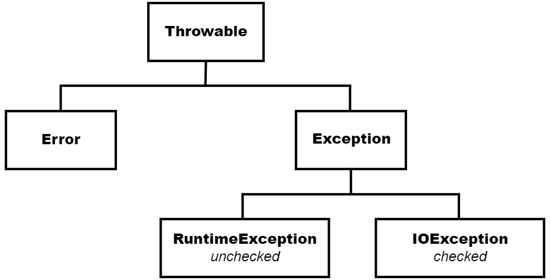
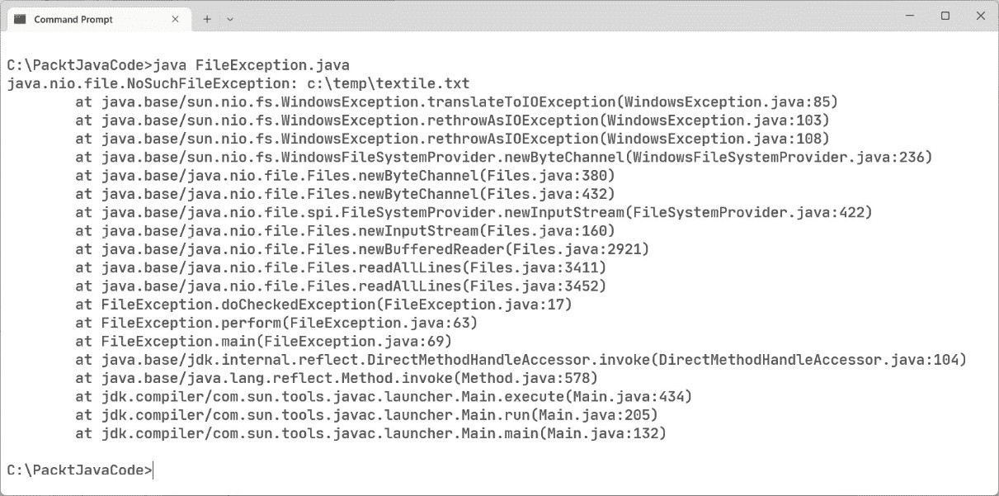

# 第七章：Java 语法和异常

在本章中，我们将从查看 Java 语言的语法开始。它可能看起来很奇怪，直到本章才查看语法。为了理解为什么，我必须告诉你一个秘密：你已经知道如何编码。这本书的受众就是这样的——你可以编程，但可能对 Java 的经验很少或没有。我毫不怀疑，你能够理解你迄今为止看到的每个代码示例中发生的事情。我们现在将正式化 Java 语法。

这里是我们将要讨论的主题：

+   理解编码结构

+   处理异常

到本章结束时，你将能够将 Java 代码组织成方法和类。Java 代码中的决策和迭代将得到介绍。当事情出错时，在许多情况下，可能需要离开导致错误的代码，执行额外的处理以解决问题或退出程序。这就是异常的作用。

# 技术要求

这里是运行本章示例所需的工具：

+   安装了 Java 17

+   文本编辑器

+   安装了 Maven 3.8.6 或更高版本

你可以在 GitHub 仓库中找到本章的代码：[`github.com/PacktPublishing/Transitioning-to-Java/tree/chapter07`](https://github.com/PacktPublishing/Transitioning-to-Java/tree/chapter07)。

# 理解编码结构

当我们在任何语言中编写代码时，我们知道它必须以非常具体的方式进行组织。你从你所知道的任何语言中熟悉这个概念，所以我们只需要检查它们在 Java 中的编码方式。我们从代码块开始。

## 代码块

每种语言都有一种组织你编写的代码行的结构，这通常被称为`begin`和`end`关键字。Java 使用开括号（`{`）和闭括号（`}`），C、C++、C#和 JavaScript 也是如此。

在 Java 中，所有类和方法都必须有开括号和闭括号。块可以嵌套，正如我们在本节稍后讨论迭代和决策时将看到的。当涉及到变量时，块也起到另一个作用。这被称为变量的作用域。让我们通过以下示例来实际看看：

```java
public class Blocks {
 2
 3     private int classScope;
 4     private static int staticVar;
 5    
 6     static {
 7        staticVar = 42;
 8        System.out.printf(
              "static block staticVar is %d%n",staticVar);
 9     }
10    
11     public Blocks() {
12        System.out.printf("constructor method block%n");
13     }
14    
15     public void perform() {
16        int methodScope;
17        
18        if (classScope > 0) {
19           int blockScope = 4;
20        }
21          
22        {
23           int classScope = 3;
24           this.classScope = classScope;
25        }
26     }
27  }
```

我们将详细讨论每一行。

*第 1 行* 声明了一个名为`Blocks`的类，并且在这一行上出现了一个开括号。C/C++程序员通常将开括号放在自己的行上，Java 对此也持开放态度。Java 的风格是将开括号放在命名块的同一行上。

*第 3 行* 声明了一个实例字段。我们知道这是因为它在类块内部声明，并且不是静态的。对于每个对象，将有一个唯一的`classScope`变量。因为这个字段在类块中，所以它对所有非静态方法都是可见的。它也可以在任何方法的任何内部块中使用。只有当从这个类实例化的对象超出作用域时，它才会超出作用域。

*第 4 行*声明了一个静态或类变量。这个变量将由类的所有实例共享。它在类的所有块中都是可见的。它不能是一个局部方法变量。静态变量只能声明在类块或作用域中。

第 6 行至第 9 行声明了一个静态块。这个块中的代码只会在创建这个对象的第一个实例时执行一次。你无法在这个块中声明字段。你无法与实例（非静态）变量交互，但你可以与类（静态）变量交互。你也可以调用静态方法，例如`System.out.print`或这个类中的任何静态方法。静态块的一个有趣特性是它们在构造函数之前执行。这就是为什么它们不能访问非静态变量和方法。这些非静态变量仅在构造函数执行后才是有效的，而不是在执行之前。

第 11 行至第 13 行只是一个构造函数。如果你向这个示例添加一个`main`方法，你将能够看到静态块总是先于构造函数执行。

第 15 行至第 26 行是一个名为`perform`的非静态方法块，它包含两个额外的块。在`method`块中，我们有一个名为`methodScope`的局部变量，它在方法和任何内部块中都是可见和可访问的。当方法的执行达到`method`块的闭合大括号时，这个变量将超出作用域。

第 18 行至第 20 行由一个`if`语句和一个随后执行的块组成。如果`if`语句为`true`，则执行这个块。在这个块中，我们声明了一个名为`blockScope`的变量。这个变量在遇到开括号并找到声明后进入作用域。当块结束时，这个变量将超出作用域。

第 22 行至第 25 行是另一个块。在这里，我们声明了一个与类作用域变量具有相同名称和类型的变量。当这种情况发生时，块版本的变量会隐藏任何在外部块（在这种情况下是类本身）中声明的变量。要访问类块变量，就像我们在讨论方法时看到的那样，我们使用`this`引用。如果你在块中创建更多的块，这实际上并不是一个好主意，你只能使用`this`来访问类级别的变量，并且任何与外部块中相同名称和类型的变量都变得不可访问。

接下来，让我们简要回顾一下 Java 中术语*语句*和*表达式*的含义。

## 语句

在 Java 中，任何执行任务并以分号结束的代码行都是语句。以下是一些示例：

```java
1  int x = 4;
2  printHeader();
3  d = Math.sqrt(aDoubleValue);
```

这些都是语句。*第 1 行*是一个声明语句，其中为整数变量分配了内存空间，并给它赋了一个值。*第 2 行*是对一个方法的调用。*第 3 行*使用了`Math`库中的平方根方法来计算一个结果，并将其赋给一个变量。

## 表达式

Java 中的表达式是指任何作为语句一部分返回结果的代码。结果可能来自赋值、一些简单的数学运算，或者来自另一个方法或 Java 构造的返回值，例如我们很快将要看到的`switch`表达式。

在*语句*部分的例子中，我们可以看到*第 1 行*的语句包含一个将值赋给变量的表达式。*第 2 行*只是一个语句，因为没有值在改变。*第 3 行*将`Math.sqrt`调用的返回值赋给一个变量。当我们给变量赋新值时，我们将其描述为改变其状态。改变变量状态的语句使用表达式来完成。

## 运算符

Java 的运算符家族与 C 语言以及大多数从 C/C++派生或基于它们构建的语言中的运算符非常相似。优先级规则得到尊重，括号内的表达式总是首先执行。所有标准逻辑运算符都存在。由于 Java 没有指针，因此处理指针的运算符，如地址运算符（`&`）和间接引用运算符（`*`），在这个语言中不存在。有一组运算符我想特别强调。

在 C/C++中，我们以两种方式之一表达组合多个布尔表达式的结果——逻辑`AND`或逻辑`OR`。它们分别表示为双与运算符（`&&`）和双或运算符（`||`）。它们使用短路计算，这意味着如果第一个比较中的条件验证或无效化语句，则不需要执行第二个比较。运算符两边的值必须是布尔值。以下是一个例子：

```java
numberOfTrees > 10 && numberOfSquirrels > 20
```

存在一组可以执行相同任务但不进行短路计算的匹配运算符。这些是单个与运算符（`&`）和单个或运算符（`|`）。当与原始类型一起使用时，它们执行位运算。对于单个与运算符（`&`），每个值中必须有一个二进制 1 在相同的位置，该位置在新值中也将变为二进制 1。否则，新值中将放置一个二进制 0。对于单个或运算符（`|`），匹配的位必须有一个位是二进制 1。

在这个家族中还有一个值得提到的运算符，那就是撇号（`^`）。这是`XOR`运算符。当与原始类型一起使用时，新值仅在比较的两个值中有一个在相同位置有二进制 1 时才取二进制 1。否则，结果是 0。

在 Java 中，数值原始类型有一个基于它们在内存中的大小和允许值范围的层次结构——如下所示。我们之前在*第四章*中看到过，*语言基础——数据类型*和*变量*：

1.  `byte`

1.  `char`

1.  `short`

1.  `int`

1.  `long`

1.  `float`

1.  `double`

赋值语句有一个右侧和一个左侧，例如：

*LHS =* *RHS*

根据这个列表，你只能在左侧有一个比右侧类型值范围更大的类型。这意味着你可以写像这样的事情：

```java
int intValue = 27;
double doubleValue = intValue;
```

这之所以有效，是因为从右侧的 `int` 到左侧的 `double` 的转换是无损的。在相反方向，如以下所示，将会出现错误，因为 `double` 的分数部分将会丢失：

```java
double doubleValue = 23.76;
int intValue = doubleValue;
```

所有这些都导致类型转换运算符——括号加类型。括号也有其他用途，但在这里使用时，它变成了一个运算符。为了使前面的例子工作，你可以将 `double` 转换为 `int`，如下所示：

```java
int intValue = (int) doubleValue;
```

这是一个有损转换，因为 `double` 值的分数部分被截断，没有四舍五入。最终在 `intValue` 中的值将是 `23`。

还有一个运算符——箭头运算符 (`->`)，我们将在检查现代 `switch` 和函数式编程时遇到。现在让我们继续前进，检查迭代，通常称为循环。

## 迭代

Java 为我们提供了两种迭代方法。第一种，我们现在将探讨，是经典的循环技术。我们将在下一章中检查如何使用流来遍历集合中的每个成员。

### `for` 循环

让我们从 C 风格的 `for` 循环开始。这是一个迭代条件在循环括号第一行的循环：

```java
        For (int x = 0; x < 10; ++x) {
            System.out.printf("Value of x is %d%n", x);
        }
```

整个 `for` 循环被视为一个块。这意味着当进入 `for` 循环时创建一个 `x` 变量，当循环结束时它将超出作用域。如果你需要在循环结束后访问 `x`，那么请在循环之前声明它，如下所示：

```java
        int x;
        for (x = 0; x < 10; ++x, doMethod()) {
            System.out.printf("Value of x is %d%n", x);
        }
```

经典循环中有两个特殊语句可用：

+   `break` 语句将在循环完成迭代之前结束循环

+   `continue` 语句结束当前迭代并继续到下一个迭代

### `foreach` 循环

`for` 循环还有一种风格，称为 `foreach` 循环。它基于这样一个事实：数组或集合中的每个元素都将被处理。我们将在下一章查看集合时检查 `foreach` 循环。

### 当 `while` 和 `do/while` 循环

当编写 `for` 循环时，最大迭代次数立即可知。对于我们的下一个循环，`while` 和 `do`/`while`，迭代次数无法预测，因为它将取决于循环体内的变化。

在使用 `while` 和 `do`/`while` 时，循环依赖于循环块内部发生的事情，这可能会改变正在逻辑上检查的变量。以下是一个具有不可预测结束的例子：

```java
        var rand = new Random();
        int x = rand.nextInt(12);
        while (x < 10) {
            x = rand.nextInt(12);
            System.out.printf("x = %d%n", x);
        }
```

第一行实例化了`java.util.Random`对象。接下来，我们实例化一个将作为逻辑测试基础的变量，并给它一个随机值。调用`rand.nextInt(12)`方法将返回一个介于 0 到 11（包含）之间的 12 个可能整数的值。这表明`while`循环可以迭代零次或多次，但无法预测迭代次数。我们在`while`语句的括号中表达逻辑测试。在循环内部，我们必须执行一些改变`x`循环变量状态的行动。在`while`块中你可以编写的内容没有任何限制。

`while`循环的一种变体是`do`/`while`循环。这个循环保证至少迭代一次，因为逻辑测试发生在循环的末尾。你可以在以下示例中看到它的作用：

```java
        Var rand = new Random();
        int x;
        do {
            x = rand.nextInt(12);
            System.out.printf("x = %d%n", x);
        } while (x < 10);
```

注意，与`while`循环不同，不需要初始化循环变量，因为它将在循环内部获得第一个值。

## 决策

Java 中的决策语法支持 C/C++和其他语言中可用的三种结构。它们是`if`/`else`语句、`switch`语句和三元运算符。

一个简单的`if`语句不需要`else`块：

```java
if (age >= 65) {
    designation = "Senior";
}
```

你可以使用`else`创建一个“要么/要么”的表达式：

```java
if (age >= 65) {
    designation = "Senior";
} else {
    designation = "Adult";
}
```

你可以通过使用三元运算符来简化这个例子，它使用问号和冒号：

```java
String designation = (age >= 65) ? "Senior" : "Adult";
```

它从逻辑测试开始。虽然在这种情况下使用括号是可选的，但我强烈建议使用它们。在问号和冒号两边是表达式将返回的值。你也可以调用一个返回适当类型值的函数。

如果你需要定义一个测试值范围的测试，你可以使用`if`/`else`/`if`语法：

```java
        if (age < 12) {
            designation = "child";
        } else if (age < 18) {
            designation = "teenager";
        } else if (age < 25) {
            designation = "young adult";
        } else if (age < 65) {
            designation = "adult";
        } else {
            designation = "senior";
        }
```

接下来是 C 风格的`switch`语句。截至 Java 17，C 风格`switch`的语法可以被认为是过时的。由于新的`switch`版本是最近添加的，因此理解 C 风格版本很重要。`switch`是一种比较`switch`变量与以下内容的逻辑结构：

+   一个字面整数

+   一个整数常量变量

+   一个字面字符串

这里是一个用于确定邮政费用的`switch`语句，这取决于邮件发送到的区域：

```java
        double postage;
        int zone = 3;
        switch (zone) {
            case 1:
                postage = 2.25;
                break;
            case 2:
                postage = 4.50;
                break;
            case 3:
                postage = 7.75;
                break;
            default:
                postage = 10.00;
        }
```

以冒号结尾的行被称为条件标签。如果`zone`变量的值与字面值匹配，则执行匹配的 case 之后的代码。当找到与 case 的匹配时，所有后续的 case 都变为`true`，无论 case 的值如何。因此，每个 case 的末尾都有一个`break`语句。你可以通过故意不在每个地方使用`break`来模拟对值范围的测试，如下面的代码片段所示：

```java
        String continent;
        String country = "Japan";

        switch (country) {
            case "UK":
            case "France":
            case "Germany":
                continent = "Europe";
                break;
            case "Canada":
            case "USA":
            case "Mexico":
                continent = "North America";
                break;
            default:
                continent = "Not found";
        }
```

截至 Java 14，引入了两种新的 switch 语法。这些是新的 `switch` 表达式和新的 `switch` 语句。这将是第一次我们看到新的箭头操作符。以下是 switch 的表达式版本：

```java
        postage = switch (zone) {
            case 1 -> 2.25;
            case 2 -> 4.50;
            case 3 -> 7.75;
            default -> 10.00;
        };
```

`break` 语句已经不存在了，因为任何匹配都将结束 `switch`。为了匹配多个项目中的一个，我们可以使用逗号操作符来创建一个列表。箭头操作符 (`->`) 指向将被分配给 `continent` 的值：

```java
        continent = switch (country) {
            case "UK", "France", "Germany" -> "Europe";
            case "Canada", "USA", "Mexico" -> "North America";
            default -> "Not found";
        };
```

与 `switch` 表达式不同，`switch` 语句不返回值，但匹配的 `case` 执行一些操作，例如调用一个方法：

```java
        switch (continent) {
           case "Europe":
                showEuropeMap();
                break;
            case "North America":
                showNorthAmericaMap();
                break;
            default:
                showNotFound();
        }
```

下面是新的 `switch` 语句：

```java
        switch (continent) {
            case "Europe" -> showEuropeMap();
            case "North America" -> showNorthAmericaMap();
            default -> showNotFound();
        }
```

到目前为止，还有一种类型的 `switch`，它只作为 Java 19 的预览功能提供，这就是模式匹配 `switch`。作为一个预览功能，它可能在其成为正式语言的一部分或甚至从语言中删除时发生变化。我认为这是一个令人兴奋的新类型的 `switch`——你可以在下面看到它的实际应用：

```java
        String designation;
        Object value = 4;
        designation = switch (value) {
            case Integer I when i < 12 ->
               "child";
            case Integer i when i < 18 ->
               "teenage";
            case Integer i when i < 25 ->
               "young adult";
            case Integer i when i < 65 ->
               "adult";
            default ->
               "senior";
        };
```

模式匹配仅适用于对象，而不是原始类型，除非它们是 Java 的原始包装类之一。当我们把值 `4` 赋给类型为 `Object` 的变量时，编译器会将 `int` 原始类型自动装箱成一个 `Integer` 类型的对象。每个 `case` 语句使用 `case` 中的类类型而不是字面值。它还允许你分配一个标识符——在我们的例子中，是 `i`。标识符之后是新 `when` 关键字，之后你可以写任何有效的布尔表达式。只有当类型匹配并且 `when` 关键字之后的逻辑表达式为 `true` 时，`case` 才为 `true`。这应该会减少你程序中 `if`/`else` `if`/ `else` `if`/ `else` 结构的数量。你需要安装 Java 19 来实验这个预览功能。

在 Java 处理决策的问题解决之后，我们现在可以看看 Java 如何处理异常。

# 处理异常

在 Java 中，当事情出错时，它们可以被分类为错误或异常。错误是一个无法恢复的问题。异常是一个可以在你的代码中检测到的错误，你可能会从中恢复。例如，一个永远不会结束的递归将导致 `StackOverflowError` 类型的错误。将 `Bob` 字符串转换为整数将导致 `NumberFormatException` 异常。

下面是主要异常类的图示：



图 7.1 – 异常层次结构

异常是命名异常类型的类的对象。在图中，你可以看到在层次结构的根处是 `Throwable` 类。从 `Throwable`，我们有两个子类：`Error` 和 `Exception`。`Error` 的子类是以程序执行期间可能发生的错误命名的。这些是通常无法恢复的错误，应该导致程序结束。

由于可能从异常中恢复，而不是从错误中恢复，这些类型的问题属于`Exception`分支。这个分支分为两个类别：`try`/`catch`。未能使用`try`/`catch`块将生成编译器错误。你必须解决这个问题；否则，你无法编译你的代码。

未检查的异常不需要`try`/`catch`块。编译器会愉快地编译可能生成未检查异常但不在`try`/`catch`块中的代码。如果你决定不处理未检查的异常，你的程序将结束。

让我们看看可能同时具有这两种异常的代码：

```java
public class FileException {
2    
3      public void doCheckedException() {
4          List<String> fileContents = null;
5          Path path2 = Paths.get("c:/temp/textfile.tx"");
6          try {
7              fileContents = Files.readAllLines(path2);
8                 System.out.printf("%s%", fileContents);
9          } catch (NoSuchFileException ex) {
10              ex.printStackTrace();
11         } catch(IOException ex) {
12              ex.printStackTrace();
13         }
14      }
15
16      public void doUncheckedException() {
17          int dividend = 8;
18          int divisor = 0;
19          int result = dividend / divisor;
20          System.out.printf("%d%", result);
21      }
22    
23      public void perform() {
24          checkedException();
25          uncheckedException();
26      }
27
28      public static void main(String[] args) {
29          new FileException().perform();
30      }
31  }
```

让我们回顾一下重要的代码行。

*第 3 行*是第一个包含可能抛出检查异常的代码的方法。

*第 4 行*声明了一个`List`变量并将其设置为`null`，这设置了`List`引用为零。局部变量未初始化，因此它们可能已经根据引用在内存中的位置包含了一个值。如果你没有正确分配`List`引用，通常使用`null`，那么在第 11 行将会有编译器错误。这将结束程序。

*第 5 行*定义了一个文件路径。`Paths.get()`方法不会验证文件是否存在，因此如果文件不存在，不会抛出异常。

*第 6 行*是我们`try`块的开始，任何可能抛出检查异常的代码都写在这里。你可以在`try`块中有不抛出异常的代码行。

在*第 7 行*，使用`Files.readAllLines()`，文件中的每一行都被添加到`List`变量中。这就是无效的文件`Path`对象可能导致名为`IOException`的检查异常的地方。

*第 8 行*是`try`块的末尾和第一个`catch`块的开始。`catch`块接受一个参数，即当在`try`块中的代码执行时检测到异常时，JVM 创建的`Exception`对象的引用。`NoSuchFileException`异常是`IOException`的子类。子类异常必须在超类异常之前处理。

*第 9 行*是`catch`块的主体，你可以在这里编写代码来处理错误，这样程序就不需要结束。所有`Exception`对象都有一个显示堆栈跟踪的方法。在生产环境中，你不会以这种方式处理错误。在我们下一章讨论日志记录时，我们将看到一种最佳实践方法。

在*第 10 行*，我们有一个第二个`catch`块。这是`IOException`类。读取文件的代码可能会抛出`NoSuchFileException`异常或`IOException`异常。一些程序员可能只捕获`IOException`。由于`NoSuchFileException`是`IOException`的子类，多态性允许你在期望`IOException`的一个`catch`块中捕获这两个异常。我的偏好是在可能的情况下使用特定的异常类。

就像在第 *9* 行一样，这里在第 *11* 行，如果在这里捕获到这个异常，我们只是打印堆栈跟踪。

在 *第 13* 行，如果 `fileContents` 变量既没有被分配 `null`，也没有从调用 `File.readAllLines` 方法分配引用，则可能会发生编译错误。

在开发过程中，在 `Exception` 对象中使用 `printStackTrace` 方法可能很有用。当我们转向生产代码时，我们永远不应该调用这个方法。在下一章中，我们将看到如何使用日志来保留这些信息，而不会出现在控制台中。

*第 16* 行是一个将执行除以零的方法。这将生成一个未检查的 `ArithmeticException` 异常。因此，你不需要使用 `try`/`catch` 块。由于代码正在除以零，所以会抛出异常，如果这是一个控制台应用程序，则会显示堆栈跟踪，并且程序将结束。GUI 程序没有地方显示堆栈跟踪，所以它看起来会突然结束。

## 堆栈跟踪

当你的程序由于异常而结束或在捕获异常后，你可以显示堆栈跟踪。堆栈跟踪将出现在控制台窗口中。它是一系列代码行，这些代码行导致了异常，在捕获之前或程序结束后。以下是当 `Path` 对象中的文件名找不到时 `doCheckedException` 方法的堆栈跟踪：



图 7.2 – 当发生异常时显式显示的堆栈跟踪

如你所见，异常已经穿越了几个方法，其中许多发生在 Java 库中而不是你的代码中。为了使用这些信息来定位可能的有问题的源代码，从跟踪的开始处遍历列表，找到来自你代码的第一个条目：

```java
at com.kenfogel.FileException.doCheckedException(FileException.java:17)
```

这一行告诉我们异常发生在第 *17* 行的 `doCheckedException` 方法中。

## 结束程序

在某些情况下，你可能希望在捕获异常后结束程序。你可以使用 `System.exit(n)` 来结束大多数程序，其中 `n` 是你分配给这个错误的数字：

```java
        } catch(IOException ex) {
            ex.printStackTrace();
            System.exit(12);
        }
```

数字——在这个例子中是 `12`——映射到一个必须结束程序的已知错误条件。在这里，在显示堆栈跟踪后，程序结束。

## 抛出和抛出语句

如果在方法中抛出异常，Java 会查找 `catch` 块。如果在抛出异常的方法中没有 `catch` 块，那么 Java 会查看调用该方法的那个方法。这个过程会一直持续到 `main` 方法，在那个点上，程序结束。有些情况下，你会在异常发生的地方捕获异常，但同时又想将其重新抛给之前有 `catch` 块的任何方法。在这个 `catch` 块中，我们将堆栈跟踪显示到控制台，然后重新抛出异常：

```java
        } catch(IOException ex) {
            ex.printStackTrace();
            throw ex;
        }
```

要能够重新抛出异常，我们必须向该方法添加一个`throws`子句：

```java
    public void doCheckedException() throws IOException {
```

当你使用`throws`时，调用`doCheckedException`的任何方法都必须像下面这样在`try`/`catch`块中执行：

```java
        try {
            checkedException();
        } catch(IOException ex) {
            ex.printStackTrace();
        }
```

我们还可以使用`throws`子句来定义一个方法有一个检查异常，但该方法不会处理它。这意味着我们可以在没有`try`/`catch`块的情况下调用`checkedException()`，因为该方法表明它将被抛出到调用此方法的另一个方法的`try`/`catch`块中。

## `finally`块

可以有一个用于处理异常的第三个块，称为`finally`块。在这个块中，你可以编写任何你希望在抛出异常或不抛出异常时执行的代码。在这个例子中，无论是否抛出异常，都会显示一条消息：

```java
public void doFinallyExample(int dividend, int divisor) {
    int result = 0;
    try {
        result = dividend / divisor;
    } catch (ArithmeticException ex) {
        ex.printStackTrace();
    } finally {
        System.out.printf(
            "Finally block is always executed%n");
    }
}
```

如果除数有效——不是零——则执行`finally`块中的代码。如果除数无效——是零——则执行`catch`块中的代码，然后执行`finally`块中的代码。

注意

不要将`finally`与`finalize`方法混淆。`finally`块是有用的。`finalize`方法没有用，不应该使用。

## 创建自己的异常类

异常类的名称是导致抛出异常的问题的描述。你可以创建自己的异常，然后在检测到代码中的严重问题时抛出自定义异常。第一步是创建一个异常类，如下所示：

```java
public class NegativeNumberException extends Exception{}
```

这是一个检查异常类。如果你不希望它被检查，那么扩展`RuntimeException`。你可以在`Exception`中添加额外的方法或覆盖方法，但这不是必要的。你创建自定义异常是为了定义你程序中独特的异常，这些异常在现有的异常类族中描述不足。

现在，我们需要一些会抛出这个异常的代码：

```java
    public void doCustomException(int value) 
                     throws NegativeNumberException {
        if (value < 0) {
            throw new NegativeNumberException();
        }
        System.out.printf("value = %d%n", value);
    }
```

现在，我们需要代码来调用这个方法。因为我们调用的方法有一个`throws`子句，我们必须将其视为检查异常，并且必须使用`try`/`catch`块：

```java
    public void makeCustomException() {
        try {
            doCustomException(-1);
        } catch (NegativeNumberException ex) {
            ex.printStackTrace();
        }
    }
```

这是代码执行时发生的堆栈跟踪：

```java
com.kenfogel.NegativeNumberException
  at com.kenfogel.FileException.doCustomException(FileException.java:39)
  at com.kenfogel.FileException.makeCustomException(FileException.java:46)
  at com.kenfogel.FileException.perform(FileException.java:69)
  at com.kenfogel.FileException.main(FileException.java:73)
```

你可以看到我们创建的异常类就是堆栈跟踪中报告的异常。

关于异常，还有一个问题需要指出。许多语言，如 C#和 JavaScript，没有检查异常。是否捕获这些异常的决定完全取决于开发者。

在 JVM 中抛出异常是一个缓慢的过程。你可能不会注意到这一点，但如果它经常发生，将会导致程序执行速度变慢。因此，永远不要将异常处理作为程序逻辑的一部分。异常是严重的问题，在大多数情况下，意味着一个错误或缺陷，可能会影响程序的输出。如果你可以在代码中检测到一个错误，通常是通过使用`if`语句测试一个值，你应该使用你编写的代码来处理它，而不是期望或抛出异常。

# 摘要

在本章中，我们学习了 Java 代码是如何根据开闭大括号组织成块的。这些块可以是一个完整的类，类中的每个方法，以及迭代和决策语句的主体。从那里，我们学习了如何将代码行分类为语句或表达式。

操作符是下一个主题。我们回顾了数学和逻辑操作符以及它们的组合方式。还展示了用于将一种类型转换为另一种类型的 `cast` 操作符。

接下来，我们讨论了两种最常见的编码结构：循环和决策。我们介绍了经典的 `for` 循环，这是一种在循环开始之前已知迭代次数的循环。第二种循环风格是 `while` 和 `do`/`while` 循环。这些循环不知道会有多少次迭代，这由重复的代码块确定。

接下来是决策。我们讨论了 `if` 和 `if`/`else` 语句。这些语句实际上与任何起源于 C 语言的编程语言中的语句相同。我们讨论的第二种决策结构是 `switch` 语句。与 `if` 一样，它几乎与其 C 语言根源没有变化。好消息是这种风格的 `switch` 已经通过三个新版本得到了增强。

我们之前讨论的最后一个主题是异常。我们探讨了异常类和对象是什么，以及它们属于哪一类，是检查型还是非检查型。我们还介绍了如何处理异常，而不是让程序直接结束。最后，我们还讨论了如何创建我们自己的命名异常以及如何使用它们。

到目前为止，你应该已经能够舒适地阅读 Java 代码了。在我们下一章中，我们将探讨语言的附加功能以及如何使用它们来编写更干净的代码。

# 进一步阅读

+   *Java* 中的异常：[`medium.com/interviewnoodle/exception-in-java-89a0b41e0c45`](https://medium.com/interviewnoodle/exception-in-java-89a0b41e0c45)
