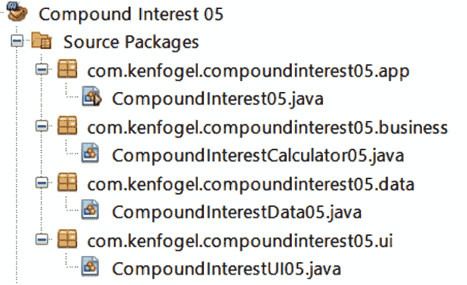

# 10

# 在 Java 中实现软件设计原则和模式

软件设计原则提供了如何构建你的类以及你的对象应该如何交互的指导。它们与特定问题无关。例如，**单一职责**原则鼓励我们编写执行单一任务的方法。软件设计模式是解决软件设计中常见问题的可重用概念。例如，如果我们需要在应用程序中有一个对象的单一实例，你将希望使用**单例**模式。这个模式与你所使用的语言无关，也不描述该模式的必需代码。这些原则和模式所做的是描述解决常见问题的方案，然后你可以将这些方案实现在你所使用的语言中。原则和模式可以应用于任何语言，并且我假设你很可能在你所使用的语言中已经应用了它们。

本章的目标是查看一些最常用的原则和模式，以及它们如何在 Java 中编码。它们如下所示：

+   SOLID 软件设计原则

+   软件设计模式

作为软件开发者，你被期望编写可重用、可理解、灵活且可维护的代码。

# 技术要求

下面是运行本章示例所需的工具：

+   安装了 Java 17

+   文本编辑器

+   安装了 Maven 3.8.6 或更高版本

本章的示例代码可在[`github.com/PacktPublishing/Transitioning-to-Java/tree/chapter10`](https://github.com/PacktPublishing/Transitioning-to-Java/tree/chapter10)找到。

# SOLID 软件设计原则

软件设计原则，应用于面向对象编程，提供了如何构建你的类的指导方针。与特定编码要求相关的模式不同，原则应该适用于你每天编写的任何代码。有许多原则，但我们将探讨五个属于缩写**SOLID**的原则。

## S – 关注点分离/单一职责

在我看来，`CompoundInterest05`程序根据功能组织了类：



图 10.1 – 基于关注点分离原则的类组织

在这个图中我们看到四个包，它们描述了包中任何类所需的功能。每个包中的单个类包含执行其任务所需的所有方法和数据结构。业务类独立于**用户界面**（**UI**）类。我们可以将 UI 类改为使用 GUI 而不是文本或控制台界面。我们可以这样做而不需要对业务类进行任何修改。我们将在*第十三章*，*使用 Swing 和 JavaFX 进行桌面图形用户界面编码*中这样做，当我们从文本改为 GUI 时。我们甚至将在*第十五章*，*Jakarta Faces 应用程序*中将这个应用程序转变为一个网络应用程序，而不会触及业务和数据类。

单一职责原则虽然在技术上不是 SOLID 的一部分，但它与关注点分离的紧密关联使其值得在这里包括。这个原则应用于方法。应该编写一个方法来负责单一的关注点。你不会编写一个执行计算然后显示结果的单个方法。这些是两个关注点，每个都应属于其自己的方法。

## O – 开放/封闭

这个原则指出，你应该能够在不更改或修改类的任何代码的情况下添加或扩展类的功能，即开放部分，而不改变或修改类的封闭部分。这可以通过继承或接口来实现。考虑我们的`CompoundInterestCalculator05.java`示例。它包含一个复利计算的单一计算。如果我想要添加另一个计算呢？我应该只是编辑这个文件并添加一个新的方法来处理新的计算吗？答案是：不。

如果我使用继承，我将创建一个新的类，它扩展了原始的单个计算并添加了新的计算。这里是一个实现计算贷款还款方法的类：

```java
public class Calculation {
    public void loanCalculator(FinancialData data) {
        var monthlyPayment = data.getPrincipalAmount() *
           (data.getMonthlyInterestRate() / (1 - Math.pow(
           (1 + data.getMonthlyInterestRate()), -
           data.getMonthlyPeriods())));
        data.setMonthlyPayment(monthlyPayment);
    }
}
```

你已经彻底测试了这个计算，并且你确信它是正确的。现在，你被要求添加两个更多的计算，一个用于储蓄目标，另一个用于定期储蓄的未来价值。开放/封闭原则告诉我们不应该修改这个类。尽管这是一个简单的例子，但在添加方法时，你仍然有可能无意中在这个类中更改某些内容。解决方案是继承：

```java
public class Calculation2 extends Calculation {
    public void futureValueCalculator(FinancialData data) {
        var futureValue = data.getMonthlyPayment() *
            ((1 - Math.pow(
            (1 + data.getMonthlyInterestRate()),
            data.getMonthlyPeriods())) /
            data.getMonthlyInterestRate());
        data.setPrincipalAmount(futureValue);
    }
    public void savingsGoalCalculator(FinancialData data) {
        double monthlyPayment = data.getPrincipalAmount() *
            (data.getMonthlyInterestRate() /
            (1 - Math.pow(
            (1 + data.getMonthlyInterestRate()),
            data.getMonthlyPeriods())));
        data.setMonthlyPayment(monthlyPayment);
    }
}
```

这个`Calculator2`类从`Calculator`超类继承了公共的`loanCalculator`方法，然后添加了两个新的计算。

第二种方法，称为多态开放/封闭原则，是使用接口类。这是一个封闭类。所有计算都必须实现这个接口：

```java
public interface FinanceCalculate {
    void determine(FinancialData data);
}
```

现在，让我们看看将要实现这个接口的三个类中的一个：

```java
 public class FutureValue implements FinanceCalculate {
    @Override
    public void determine(FinancialData data) {
        var futureValue = data.getMonthlyPayment() *
           ((1 - Math.pow(
           (1 + data.getMonthlyInterestRate()),
           data.getMonthlyPeriods())) /
           data.getMonthlyInterestRate());
        data.setPrincipalAmount(futureValue);
    }
}
```

现在，我们可以编写一个可以调用这些操作中的任何一个的类。如果我们希望添加新的财务计算，我们可以在不修改此类的情况下做到这一点，因为它期望接收一个实现`FinanceCalculate`接口的对象的引用：

```java
public class BankingServices {
    public void doCalculation(FinanceCalculate process,
                              FinancialData data) {
        process.determine(data);
    }
}
```

随着新功能被添加到应用程序中，你希望在不修改现有代码的情况下完成这一点。有一个例外，那就是纠正错误。这可能会要求修改代码。

## L – Liskov 替换

这个原则描述了如何有效地使用继承。简单来说，当你创建一个新的类来扩展一个现有类时，你可以重写超类中的方法。你必须不做的事情是重用超类方法名并更改其返回类型或参数的数量或类型。

这里是一个非常简单的显示消息的超类：

```java
public class SuperClass {
    public void display(String name) {
        System.out.printf("Welcome %s%n", name);
    }
}
```

现在，让我们创建一个子类，它显示一条略有不同的消息：

```java
public class SubClass extends SuperClass {
    @Override
    public void display(String name) {
        System.out.printf("Welcome to Java %s%n", name);
    }
}
```

当我们重写`display`方法时，我们并没有改变它的返回值或参数。这意味着在下面的代码中，我们可以使用超类或子类，并且与传递给`doDisplay`的引用类型匹配的版本将会运行：

```java
public class Liskov {
    public void doDisplay(SuperClass sc) {
        sc.display("Ken");
    }
    public static void main(String[] args) {
        new Liskov().doDisplay(new SuperClass());
    }
}
```

程序的输出将如下所示：

```java
Welcome Ken
```

现在，让我们传递一个`SubClass`的引用：

```java
        new Liskov().doDisplay(new SubClass());
```

输出现在将如下所示：

```java
Welcome to Java Ken
```

在子类中更改`display`的返回类型将导致编译错误。将返回类型保留为`void`但添加或删除参数会破坏重写。如果`display`方法的引用是`SubClass`，则只能调用超类`display`方法。以下是新的`SubClass`：

```java
public class SubClass extends SuperClass {
    public void display(String name, int age) {
        System.out.printf("Welcome to Java %s at age %d%n",
                           name, age);
    }
}
```

我们不能使用`@Override`注解，因为这被认为是重载，保持相同的方法名但更改参数。现在，如果我们传递`SubClass`给`doDisplay`，选择的方法将始终是`SuperClass`版本，从而破坏 Liskov 原则。

## I – 接口分离

这个原则为开发接口提供了指导。简单来说，不要向接口添加不是每个接口实现都需要的新的方法。让我们看看一个简单的配送服务接口。记住，为了简洁，这个和许多其他示例都不是完整的，但展示了与所解释的概念相关的部分：

```java
public interface Delivery {
    void doPackageSize(int length, int height, int width);
    void doDeliveryCharge();
}
```

现在，让我们实现这个接口：

```java
public class Courier implements Delivery {
    private double packageSize;
    private double charge;
    @Override
    public void doPackageSize(int length, int height,
                                            int width) {
       packageSize = length * width * width;
    }
    @Override
    public void doDeliveryCharge() {
        if (packageSize < 5) {
            charge = 2.0;
        } else if (packageSize < 10 ) {
            charge = 4.0;
        } else {
            charge = 10.0;        }
    }
}
```

现在，假设我们需要扩展`Courier`以处理将通过空运旅行的包裹。我们现在必须添加仅用于此类运输的方法。我们会将其添加到现有接口中吗？不，我们不会。接口分离原则告诉我们，为了特定的用途，应将接口保持为所需的最小方法数。新的接口可能看起来像这样：

```java
public interface AirDelivery extends Delivery {
    boolean isHazardous();
}
```

我们在这里使用接口继承。使用这个接口，你需要实现`Delivery`接口中的方法以及`AirDelivery`中的新方法。现在，如果我们实现一个具有`Delivery`接口的类，我们只需要实现两个方法。当我们使用`AirDelivery`时，我们需要实现三个方法。

## D – 依赖倒置

SOLID 中的最后一个原则指出，类不应该依赖于具体的类。相反，类应该依赖于抽象。抽象可以是一个抽象类，或者在 Java 中更常见的是接口。想象一个处理商店库存的程序。我们会为每个物品创建一个类。我们可能有以下情况：

```java
public class Bread {
    private String description;
    private int stockAmount;
    public String getDescription() {
        return description;
    }
    public void setDescription(String description) {
        this.description = description;
    }
    public int getStockAmount() {
        return stockAmount;
    }
    public void setStockAmount(int stockAmount) {
        this.stockAmount = stockAmount;
    }
}
```

对于另一个物品，例如`牛奶`，我们可能有以下情况：

```java
public class Milk {
    private String description;
    private int stockAmount;
    public String getDescription() {
        return description;
    }
    public void setDescription(String description) {
        this.description = description;
    }
    public int getStockAmount() {
        return stockAmount;
    }
    public void setStockAmount(int stockAmount) {
        this.stockAmount = stockAmount;
    }
}
```

使用`面包`或`牛奶`的程序被认为是高级模块，而`面包`和`牛奶`被认为是具体的低级模块。这也意味着高级模块必须依赖于具体的类。想象一下，我们需要一个程序来生成库存物品的报告。如果不遵循依赖倒置原则，我们将需要为库存中的每个物品创建一个报告类：

```java
public class MilkReport {
    private final Milk milkData;
    public MilkReport(Milk data) {
        milkData = data;
    }
    public void displayReport() {
        System.out.printf("Description: %s  Stock: %d%n",
            milkData.getDescription(),
            milkData.getStockAmount());
    }
}
```

现在，我们需要为`BreadReport`创建第二个类。一个有 100 种商品出售的商店将需要 100 个类，每个商品一个。依赖倒置解决的问题是需要 100 个报告类。我们开始使用接口来解决这个问题：

```java
public interface Inventory {
    public String getDescription();
    public void setDescription(String description);
    public int getStockAmount();
    public void setStockAmount(int stockAmount);
}
```

现在，每个物品类都将实现`Inventory`：

```java
public class MilkDI implements Inventory{ . . . }
public class BreadDI implements Inventory{ . . . }
```

现在可以只有一个报告类：

```java
public class InventoryReport {
    private final Inventory inventoryData;
    public InventoryReport(Inventory data) {
        inventoryData = data;
    }
    public void displayReport() {
        System.out.printf("Description: %s  Stock: %d%n",
            inventoryData.getDescription(),
            inventoryData.getStockAmount() );
    }
}
```

在使用依赖倒置时，你的程序可以消除冗余，同时仍然允许程序处理库存中的任何新物品。

软件设计原则有助于编写高效且易于维护的代码。这些原则，以及其他原则，每次编写代码时都应予以考虑。您可以从*进一步阅读*部分中的链接了解更多关于这些原则和其他原则的信息。

原则应该指导你写的每一行代码。即将到来的模式将指导你解决特定问题。

# 软件设计模式

软件设计模式描述了软件中特定问题的解决方案。这个概念来自建筑和工程。想象一下，你需要设计一座桥梁来跨越一条河流。你可能会首先选择桥梁的类型或模式。有七种桥梁类型：

+   拱桥

+   梁桥

+   悬臂桥

+   悬索桥

+   钢索斜拉桥

+   系杆拱桥

+   桁架桥

这些类型或模式描述了桥梁应该如何跨越你想要在其上建造桥梁的河流，但它们并不提供详细的说明或蓝图。它们指导建筑师进行桥梁设计。软件模式以类似的方式工作。让我们看看四种广泛使用的模式以及它们如何在 Java 中实现。

## 单例

单例是一个只能实例化一次的 Java 对象。它是一个**创建型**模式。无论这个对象在应用程序中的哪个地方被使用，它总是同一个对象。在一个需要通过传递令牌对象来独占访问资源的应用程序中，单例模式是你可能遵循的一种模式。在*第十一章*，“文档和日志”，我们将探讨日志记录，大多数日志框架都使用单例日志对象。否则，每个使用它的类都会有单独的日志记录器。管理线程池的对象也经常被写成单例。

在 Java 中实现单例模式可以相当简单。在接下来的示例中，这些单例除了确保只有一个实例之外，不做任何其他事情。我留给你们去添加这些单例应该执行的实际工作。

```java
public class SingletonSafe {
```

当调用`getInstance`方法时，我们使用一个静态变量来表示这个对象。因为这个方法是静态的，所以它只能访问类中的静态字段。静态字段也是对象所有实例共享的。

```java
    private static Singleton instance;
```

到目前为止，所有构造函数都是`public`的。将构造函数指定为`private`意味着你不能用`new`来实例化这个对象。

```java
    private Singleton() {}
```

在这个方法中，我们测试是否已经存在一个实例。如果存在，则返回该实例。如果不存在，则使用`new`实例化对象。但是等等，我刚刚说过你不能在具有`private`构造函数的类上使用`new`。如果这个对象在另一个对象中实例化，这是正确的。在这里，我们是在对象内部实例化对象，访问控制不适用。类中的每个方法都可以访问任何其他方法，而不管其访问权限如何。所以，虽然构造函数对`getInstance`方法是`private`的，但它可以在对象用`new`创建时运行：

```java
    public static Singleton getInstance() {
        if (instance == null) {
            instance = new Singleton();
        }
        return instance;
    }
}
```

现在，让我们测试一下这是否有效：

```java
public class SingletonExample {
    public void perform() {
```

在这里，我们通过调用`Singleton`的`getInstance`方法来实例化两个类字段：

```java
        var myInstance1 = Singleton.getInstance();
        var myInstance2 = Singleton.getInstance();
```

如果我们的`Singleton`类工作正常，两个`Singleton`实例将是相同的。当我们比较对象引用时，我们是在比较这些对象的内存地址。如果地址相同，那么我们就有了同一个对象：

```java
        if (myInstance1 == myInstance2) {
            System.out.printf(
               "Objects are the same%n");
        } else {
            System.out.printf(
              " Objects are different%n");
        }
    }
    public static void main(String[] args) {
        new SingletonExample().perform ();
    }
}
```

我们的`Singleton`类有一个问题。它不是线程安全的。可能`getInstance`方法会被线程中断，这可能导致出现两个或更多个`Singleton`实例。我们可以通过同步对象的创建来使这个类线程安全。以下是更新后的`getInstance`方法：

```java
    public static Singleton getInstance() {
```

当我们创建一个同步块时，我们确保`Singleton`类的实例化不会被中断。这确保了在实例化一次之后，所有线程都将获得相同的实例：

```java
        synchronized (Singleton.class) {
            if (instance == null) {
                instance = new Singleton();
            }
        }
        return instance;
    }
```

通过这种方式，我们现在有一个线程安全的`Singleton`类。

## 工厂

工厂，另一种创建型模式，是一个类，它从一组共享相同接口或都是同一抽象类子类的类中实例化特定的类。它是一个**创建型**模式。我们将查看一个使用接口的示例。以下是共享接口：

```java
public interface SharedInterface {
    String whatAmI();
    void perform();
}
```

现在，让我们创建两个实现相同接口的类。如前所述，我的示例只展示了演示概念的代码。你将添加必要的代码，以便类能够执行其工作：

```java
public class Version01 implements SharedInterface{
    @Override
    public String whatAmI() {
        return "Version 01";
    }
    @Override
    public void perform() {
        System.out.printf("Running perform in Version 01");
    }
}
public class Version02 implements SharedInterface {
    @Override
    public String whatAmI() {
        return "Version 02";
    }
    @Override
    public void perform() {
        System.out.printf("Running perform in Version 02");
    }
}
```

现在，我们可以看看`Factory`类本身：

```java
public class Factory {
    public static SharedInterface getInstance(
                                 String designator) {
```

根据我们传递给`getInstance`的字符串，我们将实例化相应的对象。注意`switch`中的`default`。它将返回一个`null`引用，即对无物的引用。你应该检查这一点，并在使用无效字符串作为`designator`的情况下采取适当的行动：

```java
        return switch (designator) {
            case "version01" -> new Version01();
            case "version02" -> new Version02();
            default -> null;
        };
    }
}
```

现在，让我们看看将使用`Factory`模式来实例化类的代码：

```java
public class FactoryExample {
```

我们创建的对象将实现此接口：

```java
    private SharedInterface version;
    public void perform(String versionName) {
```

这里，我们传递`Factory`模式将使用以确定要实例化哪个类的字符串：

```java
        version = Factory.getInstance(versionName);
        System.out.printf(
            "Version: %s%n",version.whatAmI());
        version.perform();
    }
    public static void main(String[] args) {
        new FactoryExample().perform("version02");
    }
}
```

使用工厂模式可以简化创建具有相同接口的类族。

## 适配器

想象一下，你正在使用具有自己独特接口的特定类的工作。有一天，你遇到了另一个执行类似任务但满足不同客户需求或优于你所使用的类的类。新类的问题在于它没有相同的接口。你是否重写代码以便调用新类的方法？你可以这样做，但当你开始修改现有代码时，就可能出现不可预见的问题。解决方案是将新类包装在一个适配器类中。适配器提供了你的代码已经熟悉的接口，但随后调用新类中的适当方法。这就是适配器，一个**结构型**模式，发挥作用的地方。

让我们从一个非常简单的应用程序开始，该应用程序计算车辆的燃油消耗量，并将结果作为每加仑英里数返回。我们从一个执行计算的类的接口开始，然后是其实现：

```java
public interface USFuelConsumption {
    String calculateUS(double distance, double volume);
}
public class USCar implements USFuelConsumption {
    @Override
    public String calculateUS(double distance,
                                   double volume) {
        return "MPG = " + distance/volume;
    }
}
```

这里是将在该类中使用的代码：

```java
public class AdapterExample {
    private USFuelConsumption consumption;
    public AdapterExample() {
        consumption = new USCar();
    }
    public void perform() {
        System.out.printf(
              "%s%n",consumption.calculateUS(350.0, 12.0));
    }
    public static void main(String[] args) {
        new AdapterExample().perform();
    }
}
```

该程序的输出如下：

```java
MPG = 29.166666666666668
```

现在想象一下，一个新客户想要使用你的系统，但需要使用公制测量方法进行计算。对于汽车，这被描述为每 100 公里升数。我们有一个接口和一个将执行此操作的类：

```java
public interface MetricFuelConsumptions {
    String calculateMetric(double distance, double volume);
}
public class MetricCar implements MetricFuelConsumptions {
    @Override
    public String calculateMetric(double distance,
                                     double volume) {
        return "l/100km = " + volume/distance * 100;
    }
}
```

为了能够使用这个新类，我们需要一个适配器，它将实现相同的接口，但在方法调用中，将使用度量计算类：

```java
public class UstoMetricAdapter implements USFuelConsumption {
    private final MetricCar metric;
    public UstoMetricAdapter() {
        metric = new MetricCar();
    }
```

这里是我们正在适配的方法。而不是在这里进行计算，它将调用`MetricCar`的方法：

```java
    @Override
    public String calculateUS(double distance,
                                     double volume) {
        return metric.calculateMetric(distance, volume);
    }
}
```

现在，让我们看看它将如何被使用：

```java
public class AdapterExample {
    private USFuelConsumption consumption;
    public AdapterExample() {
```

这里是我们需要更改的唯一一行。由于适配器共享相同的接口，它可以替代`USCar`：

```java
        consumption = new UstoMetricAdapter();
    }
    public void perform() {
        System.out.printf("%s%n",
            consumption.calculateUS(350.0, 44.0));
    }
    public static void main(String[] args) {
        new AdapterExample().perform();
    }
}
```

程序输出现在如下所示：

```java
l/100km = 12.571428571428573
```

这是一个简单的例子，但它是一个代码重用的例子。适配器允许你使用具有特定接口的新代码重用代码。新代码具有不同的接口，适配器通过向你的代码呈现原始接口来解决这个问题。

## 观察者

对于此模式，我们感兴趣的是对象状态的变化。当状态发生变化时，将调用另一个类中的方法来执行一些任务。这些任务可以是验证状态更改、将更改写入数据库，或者更新显示。Java 通过提供`PropertyChangeListener`接口和`PropertyChangeSupport`类，使使用此模式变得容易。这是一个**行为**模式的例子。

我们从一个必须通知其他类其任何或所有字段状态发生更改的类开始：

```java
public class TheProperty {
```

这是此类中我们计划监听其状态变化的字段：

```java
    private String observedValue = "unicorn";
    private final PropertyChangeSupport support;
```

构造函数正在实例化`PropertyChangeSupport`类的实例。此对象将允许我们向或从实现此类的`PropertyChangeListener`监听器的所有类的列表中添加或删除。它支持在字段更改时触发事件：

```java
    public TheProperty() {
        support = new PropertyChangeSupport(this);
    }
```

此方法允许我们将监听器列表添加到列表中：

```java
    Public void addPropertyChangeListener(
                  PropertyChangeListener listener) {
        support.addPropertyChangeListener(listener);
    }
```

此方法允许移除一个监听器：

```java
    Public void removePropertyChangeListener(
                  PropertyChangeListener listener) {
        support.removePropertyChangeListener(listener);
    }
```

这是`observedValue`变量的`set`方法。当此方法被调用时，`firePropertyMethod`将在监听器列表中的每个类中调用`propertyChange`：

```java
    public void setObservedValue(String value) {
        System.out.printf(
               "TP: observedValue has changed.%n");
        support.firePropertyChange(
               "observedValue", this.observedValue, value);
        observedValue = value;
    }
```

`observedValue`是一个`private`字段，正如它应该的那样。我们需要像之前的`set`方法这样的方法和这个`get`方法来读取字段中的值：

```java
    public String getObservedValue() {
        return observedValue;
    }
}
```

现在，我们需要一个`listener`类。可能只有一个或多个：

```java
public class TheListener implements PropertyChangeListener{
```

如果`TheProperty`字段发生变化，我们希望更改的领域是此领域。虽然这是使用此模式的一种常见方式，但在发生更改时将被调用的方法可以自由地做任何它想做的事情，而不仅仅是更新监听器中的一个字段：

```java
    private String updatedValue;
```

这里是调用每个监听器`TheProperty`的方法。当它将`TheProperty`的新值分配给其自己的`updatedValue`时，你可以在该方法中做任何事情，例如作为一个例子写入数据库。注意，`PropertyChangeEvent`对象可以访问你为属性给出的名称，通常是字段名称，以及旧值和新值。名称可以用来根据更改的字段决定不同的操作：

```java
    @Override
    public void propertyChange(PropertyChangeEvent evt) {
        System.out.printf("TL: The state has changed.%n");
        System.out.printf("TL: Observed field:%s%n",
                          evt.getPropertyName());
        System.out.printf("TL: Previous value: %s%n",
                          evt.getOldValue());
        System.out.printf("TL: New value: %s%n",
                          evt.getNewValue());
        setUpdatedValue((String) evt.getNewValue());
    }
```

此类还有一个为其私有的`updatedValue`字段设置和获取方法：

```java
    public String getUpdatedValue() {
        return updatedValue;
    }
    public void setUpdatedValue(String updatedValue) {
        this.updatedValue = updatedValue;
    }
}
```

现在，我们可以测试如果对`TheProperty`对象的字段进行了更改，那么`TheListener`将收到通知：

```java
public class PropertyListenerExample {
    public void perform() {
```

我们需要至少一个可观察对象和任意数量的观察者。它们可以是像这样的局部变量或类字段：

```java
        var observable = new TheProperty();
        var observer = new TheListener();
```

向观察对象添加了一个监听器：

```java
        observable.addPropertyChangeListener(observer);
```

现在，我们更新可观察对象中的观察字段。这也会导致观察者对象中的字段被更新：

```java
        observable.setObservedValue("moose");
        System.out.printf(
                "PLE: New value in observer is %s%n",
                observable.getObservedValue());
    }
    public static void main(String[] args) {
        new PropertyListenerExample().perform();
    }
}
```

在本节中，我们探讨了众多模式中的四种。模式本身被划分为不同的类别。单例和工厂是创建型模式。适配器是结构型模式。观察者是行为型模式。所有这些模式都可以应用于你使用的任何语言。

# 摘要

在本章中，我们仅简要介绍了 SOLID 软件设计原则以及单例、工厂、适配器和观察者设计模式。还有许多其他的原则和模式。设计原则应指导你的日常编码，而设计模式则提供了解决设计问题的方案。两者都适用于任何语言。

接下来，我们将探讨编写代码的文档化和测试。

# 进一步阅读

+   *Java 中的设计原则*：[`www.javatpoint.com/design-principles-in-java`](https://www.javatpoint.com/design-principles-in-java)

+   *Java 中的面向对象设计原则*：[`stackabuse.com/object-oriented-design-principles-in-java/`](https://stackabuse.com/object-oriented-design-principles-in-java/)

+   *什么是软件设计模式？（+7 种最受欢迎的模式）* [`www.netsolutions.com/insights/software-design-pattern/`](https://www.netsolutions.com/insights/software-design-pattern/)

+   *《可复用面向对象软件元素：设计模式》*，作者：Erich Gamma, John Vlissides, Ralph Johnson, 和 Richard Helm，ISBN 0-201-63361-2，可在图书馆或在线书店购买
