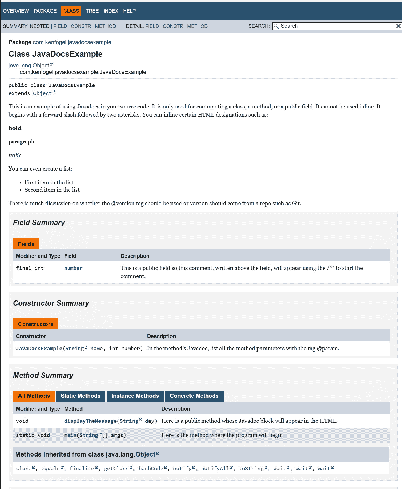
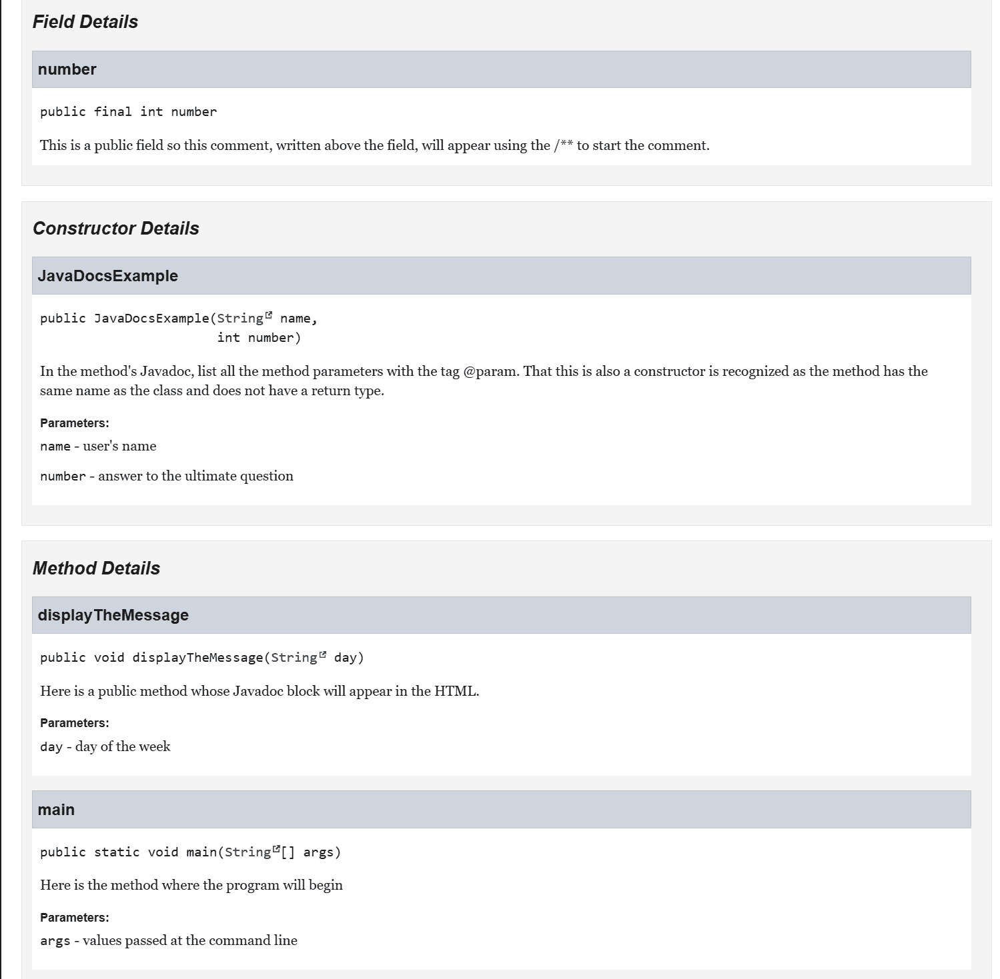

# 11

# 文档和日志记录

在本章中，我们将探讨软件开发中的两个方面，它们不会直接影响代码的运行。第一个是文档，通常称为注释。第二个是日志记录，这是一种在程序运行期间记录事件以用于监控程序所做之事的工具。我们将从代码内联注释开始。你可能已经注意到，本书迄今为止展示的所有代码都没有任何注释。这是故意为之的，因为每一章都描述了代码正在做什么。如果你查看 GitHub 仓库中的本书代码，你将在每个文件中找到注释。

你可能看到过一条消息，告诉你当程序出现问题时查看日志文件。这些日志文件从哪里来？我们将探讨我们如何显示控制台上的消息或将某些事件发生或异常抛出写入文件。

下面是本章的概述：

+   创建文档

+   使用日志记录

到本章结束时，你将了解在源代码中添加注释的各种方法。你还将学习如何使用日志记录代码中的事件。

我们将从文档开始，但在那之前，让我们快速看一下本章的先决条件。

# 技术要求

下面是运行本章示例所需的工具：

+   Java 17

+   文本编辑器

+   安装 Maven 3.8.6 或更高版本

本章的示例代码可在[`github.com/PacktPublishing/Transitioning-to-Java/tree/chapter11`](https://github.com/PacktPublishing/Transitioning-to-Java/tree/chapter11)找到。

# 创建文档

作为一名 31 年的计算机科学讲师，我可以告诉你，大多数学生最晚推迟的任务之一就是注释他们的代码。我了解到有些公司禁止他们的开发者对代码进行注释。这些公司认为代码应该是自文档化的。如果你不能从代码的编写方式中理解代码的目的，那么代码就是写得不好的。这是一个大错误。在这些公司实习的学生报告说，他们花费了大量的时间试图理解公司的代码库。

在代码中注释或评论并不是为了解释或道歉写出的糟糕代码。代码执行任务，任务应该从代码本身中显而易见。永远不明显的是代码为何以某种方式构建，以及它如何与程序的其他部分相匹配。你可以问自己一个问题：当你晋升或跳槽到另一家公司时，接手这个代码库的程序员是否理解你所编写的代码以及为什么这样做。

现在我们来看看我们如何添加注释到我们的代码，以及 Java 中独特的注释技术，称为 Javadoc。

## 注释

在 Java 中，有三种方式可以在代码中指示注释。第一种是原始的 C 风格注释标识，它使用一个开头的正斜杠，然后是一个星号，一个闭合的星号，然后是一个闭合的正斜杠作为一组字符：

```java
/* This is a single line comment */
/* This is a multiple line
    Java comment */
```

最后，还有内联注释形式：

```java
 System.out.println("Moose "/* + x */);
```

在这里，你可以使用 `/*` ... `*/` 字符来注释掉代码的一部分。

一个重要的前提是，你不能像下面这样将这些注释嵌套在彼此内部：

```java
/* Comment 1 /* Comment 2 */ end of comment 1 */
```

Java 编译器会将第一个 `/*` 符号视为在第一个 `*/` 符号处结束；注释的结尾很可能是语法错误。

你可以使用第二种字符集进行注释的是双正斜杠。这些是单行注释，它们在行结束时结束。它们可以放在任何地方，行后面的所有内容都将成为注释：

```java
// Meaningless example
int x = 4;
int z = 6;
int y = x * z; // Initializing y with x times z
```

这些注释对于注释代码行也很有用。每次我修改现有的代码行时，我都会先注释掉要替换的行，然后再写新行。除非我确定新代码能正常工作，否则很少删除代码。

我们还可以通过创建 Javadocs 来添加代码注释的另一种方式。

## Javadocs

Javadocs 是由 `Javadoc` 工具创建的 HTML 页面，该工具包含在 Java 安装中。它检查每个 Java 文件，并为每个公共类构建一个 HTML 页面。这些页面包括所有公共字段和方法。虽然我们只会查看这种默认行为，但你也可以调整它。尽管 Javadocs 会忽略私有元素，但将所有内容都注释为公共元素被认为是最佳实践。

这里是一个我们将应用 Javadocs 工具的示例程序。这些注释继续讨论 Javadocs，所以请不要快速浏览，而应该像阅读本章的每一页一样阅读它。

```java
package com.kenfogel.javadocsexample;
/**
 * This is an example of using Javadocs in your source
 * code. It is only used for commenting a class, a method,
 * or a public field. It cannot be used inline. It begins
 * with a forward slash followed by two asterisks.
 *
 * You can inline certain HTML designations as follows:
 * <p>
 * <b>bold</b></p>
 * <p>
 * paragraph</p>
 * <p>
 * <i>italic</i></p>
 *
 * You can even create a list:
 * <ul>
 * <li>First item in the list
 * <li>Second item in the list
 * </ul>
 *
 * There is a lot of discussion on whether the
 * {@literal @version} tag should be used or whether the
    version should come from a repo such as Git.
 *
 * @version 1.0
 * @author Ken Fogel
 */
public class JavaDocsExample {
    /**
     * This is a private field so this comment will
     * not appear in the HTML file.
     */
    private final String name;
    /**
     * This is a public field, so this comment, written
     * above the field, will appear using /** to start
     * the comment.
     */
    public final int number;
    /**
     * In the method's Javadocs, list all the method
     * parameters with the {@literal @param} tag. That this
     * is also a constructor and is recognized as the
     * method has the same name as the class and does not
     * have a return type.
     *
     * @param name: The user's name
     * @param number: The answer to the ultimate question
     */
    public JavaDocsExample(String name, int number) {
        this.name = name;
        this.number = number;
    }
    /**
     * While you can and should comment private methods as
     * Javadocs, they will not appear on the HTML page.
     * Only public methods appear in the Javadocs.
     *
     * @param day The day of the week that will be
     * displayed
     * @return The string to display
     */
    private String constructMessage(String day) {
        return name + " " + number + " " + day;
    }
    /**
     * Here is a public method whose Javadoc block will
     * appear in the HTML.
     *
     * @param day The day of the week
     */
    public void displayTheMessage(String day) {
        System.out.printf("%s%n", constructMessage(day));
    }
    /**
     * Here is the method where the program will begin:
     *
     * @param args values passed at the command line
     */
    public static void main(String[] args) {
        new JavaDocsExample(
                "Ken", 42).displayTheMessage("Wednesday");
    }
}
```

要运行 `javadoc` 工具，请使用以下带有开关的命令行：

```java
javadoc -d docs
```

`-d` 开关是 HTML 文件将被写入的位置。在这种情况下，假设你当前所在的文件夹中有一个名为 `docs` 的文件夹。该文件夹必须存在，因为 `javadoc` 不会创建它。如果文件夹不存在，则 HTML 文件将写入当前文件夹：

```java
javadoc -d docs -sourcepath C:\dev\PacktJava\Transitioning-to-java\JavadocsExample\src\main\java
```

`-sourcepath` 开关是包含 Java 文件或包的文件夹的路径。由于这是一个基于 Maven 的项目，包和源文件始终位于 Maven 项目的 `\src\main\java` 文件夹中：

```java
javadoc -d docs -sourcepath C:\dev\PacktJava\Transitioning-to-Java\JavaDocsExample\src\main\java -subpackages com:org
```

最后一个开关 `-subpackages` 是项目中的包的冒号分隔列表。`javadoc` 将递归地遍历每个文件夹和子文件夹，从列表中的名称开始，以找到要处理的 Java 文件。我创建了一个以 `org` 开头的第二个包。`-subpackages` 将递归搜索，并在任何以列表中名称开头的文件夹中找到的所有公共或包类都将被文档化。

当在项目上运行 `javadoc` 工具时，它将创建 HTML 网页。以下是为 `JavaDocsExample` 类创建的 Javadocs 网页。它可能相当长。请注意，只有公共方法会出现。尽管像公共方法一样注释，但私有方法不会出现在 HTML 输出中。以下是 Javadocs 的样子。



图 11.1 – 生成的 Javadocs 的前半部分



图 11.2 – 生成的 Javadocs 的后半部分

整个 Java 库都在 Javadocs 中进行了描述，并且可以在浏览器中搜索。参见 *进一步阅读* 获取这些文档的 URL。编写代码的最佳实践是编写 Javadocs 注释。这也意味着你必须描述程序的每个部分做什么，更重要的是，为什么它应该这样做。使用 `/* ... */` 和 `//` 注释来在方法中包含额外的注释或临时移除代码。

现在，让我们看看我们如何使用日志记录来记录代码中发生的特定事件。

# 使用日志记录

在你自己的代码中，你可能希望在程序运行时在控制台中显示消息。这些消息可能是通知你捕获到异常，或者记录程序执行期间发生的任何其他事件。虽然你可以使用 `System.out.print`、`println` 或我最喜欢的 `printf` 将消息写入控制台，但不要这样做。如果应用程序是基于控制台的，那么这些语句将出现在控制台用户界面中。对于 GUI 或 Web 应用程序，控制台可能可见或不可见。一旦程序进入生产阶段，最终用户可能会被你在控制台显示的消息所困惑或压倒。

解决方案是使用日志记录。这允许你将日志消息写入控制台、文件或数据库，甚至可以通过电子邮件发送给自己。我们只关注控制台或文件。Java 有一个日志框架，位于 `java.util.logging` 中。我们还将查看 Apache 基金会的一个外部日志框架，称为 **Log4j2**。

## java.util.logging

日志框架有两个部分。有一个 Java 类的框架和配置文件。对于 `java.util.logging` 的常见名称，有一个名为 `logging.properties` 的配置文件位于 Java 安装目录下的 `conf` 文件夹中。我们将看到如何使用自定义配置文件而不是使用所有应用程序共享的配置。JUL 的默认配置位置在 Java 的 `conf` 文件夹中。我们可以将我们的 JUL 自定义属性文件放在系统上的任何位置，因为我们必须在实例化记录器时提供文件的路径。

这是一个使用记录器的简单程序：

```java
public class JULDemoDefaultConfig {
```

我们使用在`Logger`类中实现的工厂软件模式来实例化`Logger`。我们传递这个类的名称，以便它可以在日志输出中显示，并且我们可以为不同的类支持不同的`Logger`项：

```java
    private static final Logger LOG =
    Logger.getLogger(JULDemoDefaultConfig.class.getName());
```

日志消息必须与一个级别相关联，这是我们使用`log`方法时的第一个参数。有六个级别，所有级别都有一个可选的第三个参数`Exception`对象。通常，`Level.INFO`参数用于记录您希望记录的程序正在做什么或谁正在做的信息。`Level.SEVERE`用于记录异常。`FINEST`、`FINER`和`FINE`参数用于调试应用程序。您可以在配置文件中决定最小级别。在开发期间，您将使用`ALL`，一旦投入生产，您将级别提升到`INFO`。这意味着您不需要删除或注释掉低于`INFO`级别的日志消息。

在这个方法中，我们只是创建日志消息：

```java
    public void perform() {
        LOG.log(Level.FINEST,
            "JUL default-Using LOG.log at Level.FINEST");
        LOG.log(Level.FINER,
            "JUL default-Using LOG.log at Level.FINER");
        LOG.log(Level.FINE,
            "JUL default-Using LOG.log at Level.FINE");
        LOG.log(Level.INFO,
            "JUL default-Using LOG.log at Level.INFO");
        LOG.log(Level.WARNING,
            "JUL default-Using LOG.log at Level.WARNING");
```

对于`SEVERE`级别，我在`try`块中强制抛出异常，并在捕获它时，通过包含`Exception`对象来记录它。

```java
        try {
```

您可以通过将`String`对象传递给构造函数来向异常添加自定义消息：

```java
            throw new Exception(
                   "JUL default config exception");
        } catch (Exception ex) {
            LOG.log(Level.SEVERE,
          "JUL default-Using LOG.log at Level.SEVERE", ex);
        }
    }
    public static void main(String[] args) {
        new JULDemoDefaultConfig().perform();
    }
}
```

如果您有一个自定义配置文件，您必须显式加载该文件；否则，将使用 Java `conf`文件夹中的默认配置`logging.properties`。更改默认配置不是一个好主意，因为它将影响您运行的每个使用 JUL 的程序。

要加载自定义配置文件，您需要找到这个：

```java
private static final Logger LOG =
    Logger.getLogger(JULDemoDefaultConfig.class.getName());
```

用以下内容替换它：

```java
private static final Logger LOG;
static {
```

当您的代码被打包成 JAR 文件时，`src/main/resources`中存在的资源文件的位置是项目的根目录。`retrieveURLOfJarResource`方法知道这一点，因此它可以加载放置在此文件夹中的配置文件。这在一个`static`初始化块中，这将确保如果存在此类的多个实例，则此`Logger`类只会被实例化一次：

```java
    try (InputStream is =
            retrieveURLOfJarResource("logging.properties").
            openStream()) {
        LogManager.getLogManager().readConfiguration(is);
    } catch (Exception e) {
        Logger.getAnonymousLogger().severe(
              "Unable to load config\nProgram is exiting");
        System.exit(1);
     }
     LOG = Logger.getLogger(
         JULDemoCustomConfig.class.getName());
    }
```

默认的`logging.properties`文件注释非常详细。以下是移除注释后的文件内容。我鼓励您检查您机器上此文件的版本。

这是控制台显示的输出：

```java
handlers= java.util.logging.ConsoleHandler
```

除非被覆盖，否则它只会显示此级别或更高级别的日志：

```java
.level= INFO
```

如果您正在将日志写入文件，那么`pattern`属性是文件夹和文件名。在这种情况下，`%h`表示将文件写入您的家目录。这是 JUL 的最佳实践。如果您希望将日志文件存储在特定的文件夹名称中，那么该文件夹必须已经存在：

```java
java.util.logging.FileHandler.pattern = %h/java%u.log
java.util.logging.FileHandler.limit = 50000
```

每次程序运行时，它都会覆盖之前的日志文件，因为只允许一个日志文件：

```java
java.util.logging.FileHandler.count = 1
```

日志记录是线程安全的。这告诉我们，可以同时使用多达 100 个日志文件锁。如果您在写入日志时遇到`IOException`错误，您可以通过增加锁的数量来解决这个问题：

```java
java.util.logging.FileHandler.maxLocks = 100
```

以 XML 格式写入日志文件：

```java
java.util.logging.FileHandler.formatter =
                java.util.logging.XMLFormatter
```

覆盖处理器级别将取代全局级别：

```java
java.util.logging.ConsoleHandler.level = INFO
```

这是日志在屏幕上显示的格式。你可以配置 `SimpleFormatter`，这已在默认配置文件的注释中解释：

```java
java.util.logging.ConsoleHandler.formatter =
                java.util.logging.SimpleFormatter
```

自定义属性文件有以下更改：

+   `FileHandler` 类已被添加，以便日志将被写入文件和控制台：

    ```java
    handlers= java.util.logging.FileHandler,
              java.util.logging.ConsoleHandler
    ```

+   两个处理器现在将显示每个级别的日志消息：

    ```java
    java.util.logging.ConsoleHandler.level = ALL
    java.util.logging.FileHandler.level = ALL
    ```

我们使用 `%h` 来表示我们希望将日志写入我们的主目录。如果你希望将它们写入特定文件夹，则该文件夹必须已经存在。如果文件夹不存在，则不会创建文件：

```java
java.util.logging.FileHandler.pattern =
                          %h/loggingdemo-JUL_%g.log
```

可以有三个日志文件，每个程序运行一个。在写入第三个日志文件后，如果需要另一个日志文件，则它将回绕并按创建顺序覆盖现有文件：

```java
java.util.logging.FileHandler.count = 3
```

Java 记录器始终可用，并且不需要添加到 Maven POM 文件中的任何依赖项。记录可能会影响你的代码性能。因此，有一些替代 JUL 的方案，它们执行时间更短或提供 JUL 中没有的功能。让我们看看最广泛使用的第三方日志记录器之一，Log4j2。

## Log4j2

Log4j2 与 JUL 非常相似。在我们能够使用它之前，我们需要向我们的 POM 文件中添加新的依赖项：

```java
        <dependency>
            <groupId>org.apache.logging.log4j</groupId>
            <artifactId>log4j-api</artifactId>
            <version>2.19.0</version>
        </dependency>
        <dependency>
            <groupId>org.apache.logging.log4j</groupId>
            <artifactId>log4j-core</artifactId>
            <version>2.19.0</version>
        </dependency>
```

在你计划使用 Log4j2 的任何文件中，你从以下 `class` 字段开始：

```java
private static final Logger LOG =
                LogManager.getLogger(Log4jDemo.class);
```

现在为了能够记录日志，你只需要以下内容。请注意，级别现在是 `LOG` 对象的方法。可选的第二个参数可以接受所有级别的 `Exception` 引用，如 `Level 5` 所示：

```java
    public void perform() {
        LOG.trace("log4j2-Level 1: I am a trace");
        LOG.debug("log4j2-Level 2: I am a debug");
        LOG.info("log4j2-Level 3: I am an info");
        LOG.warn("log4j2-Level 4: I am a warning");
        try {
            throw new Exception("log4j2 exception");
        } catch (Exception ex) {
            LOG.error("log4j2-Level 5: I am an error", ex);
        }
```

当使用 Log4j2 时，你应该创建一个配置文件，因为其默认行为有限。如果没有此文件，记录器将不执行任何操作。与 JUL 的配置一样，期望 `log4j2.xml` 配置文件位于 `src/main/resources`。

而不是审查此文件，我要求你从 GitHub 克隆此章节的仓库，并查看 `LoggingExample` 项目中的 `log4j2.xml` 文件。其注释解释了可以配置的内容。与 JUL 相比的一个改进是，如果你希望将日志存储在任意文件夹中，Log4j2 的文件处理器将创建该文件夹。

我几乎在写的每个文件中都添加了一个记录器。这允许我按需编写日志。声明一个未使用的 `Logger` 对象不会对你的程序性能产生影响。

# 摘要

在本章中，我们介绍了每个程序员都应该包括在他们的代码中的两个重要任务，无论使用哪种语言。第一个是文档。注释和 Javadoc 对于现有代码的维护或添加新功能可能是关键的。你可能认为你永远不会忘记为什么以某种方式编写代码，但 6 个月后，这种记忆可能不如所需的准确。

在软件开发过程中，一旦程序投入生产，让程序将其正在执行的操作写入控制台，或者更常见的是写入文件，可以在追踪错误方面起到很大的作用。对受监管的软件进行审计是日志可以执行的其他任务之一。永远不要使用`System.out.print`或其类似方法来显示有关程序操作的信息——使用日志记录器。无论是 Java 日志记录器还是像 Log4j2 这样的外部日志记录器，都必须部署到您的代码中。

对代码进行文档化是强制性的。使用日志记录程序中的事件也是强制性的。请记住，编程是一门工程学科，而不是一种艺术形式。工程需要这里描述的那种文档，并且需要使用日志来监控程序的性能。

接下来，我们将探讨在需要绝对精度时如何处理浮点数。在下一章中，我们还将涵盖测试我们的代码以确保其按设计运行。

# 进一步阅读

+   *如何为 Javadoc 工具编写文档注释*：[`www.oracle.com/technical-resources/articles/java/Javadoc-tool.html#styleguide`](https://www.oracle.com/technical-resources/articles/java/Javadoc-tool.html#styleguide)

+   Java 17 Javadocs：[`docs.oracle.com/en/java/javase/17/docs/api/index.html`](https://docs.oracle.com/en/java/javase/17/docs/api/index.html)

+   *Java 日志工具和框架*：[`www.java-logging.com/`](http://www.java-logging.com/)
