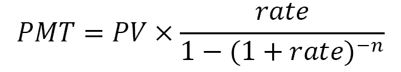
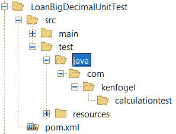
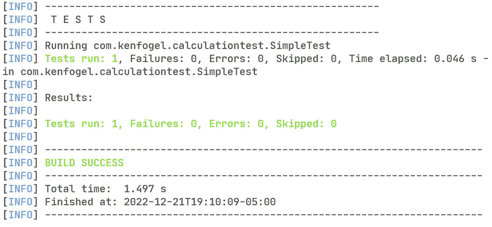

# 12

# BigDecimal 和单元测试

我们从本章开始，解决大多数语言中存在的浮点表示问题。这个问题围绕着无法将每个十进制分数表示为二进制分数，正如在*第四章*中指出的，*语言基础 – 数据类型和变量*。在大多数情况下，它已经足够准确。但如果你必须保证准确性和精度呢？你必须放弃浮点原语，并使用 `BigDecimal` 类。

你如何知道你刚刚编写的代码是否工作？编译器可以检测语法错误。无错误的编译只能告诉你编译器很高兴。但它真的工作吗？你的代码如何处理无效输入、数据库连接丢失或边缘情况？始终意识到，对于你工作的大多数项目，你编写的系统中最不可靠的组件是最终用户。你不能修复他们，但你需要设计和实现你的代码来处理意外情况。单元测试是在编写代码时验证代码的一种技术。

单元测试与**质量保证**（**QA**）不同。这是一个执行的过程，以确保程序符合其编码时的规格。QA 是关于运行的程序。单元测试是关于单个方法的性能。有时必须测试一起工作的对象和方法，这被称为集成测试，但测试技术是相似的。这种测试是程序员的职责。

在本章中，我们将探讨如何使用 JUnit 5 框架编写单元测试。这个框架的显著之处在于，你可以测试代码中的任何方法，而无需主方法。我们将涵盖以下主题：

+   使用 `BigDecimal`

+   什么是 JUnit 5？

+   使用 JUnit 5 进行测试

+   执行参数化测试

在我教授的高级 Java 课程中，单元测试是强制性的。如果一个学生不能证明他们编写的代码通过了单元测试，那么我就没有兴趣去查看代码。提交的代码在程序执行之前必须运行其测试。如果没有测试，则自动失败。我可能很严厉，但结果是，我对他们编写的代码能否工作有信心。

# 技术要求

在本章中运行示例所需的工具如下：

+   Java 17

+   文本编辑器

+   安装 Maven 3.8.6 或更高版本

本章的示例代码可在[`github.com/PacktPublishing/Transitioning-to-Java/tree/chapter12`](https://github.com/PacktPublishing/Transitioning-to-Java/tree/chapter12)找到。

# 使用 BigDecimal

`BigDecimal` 类是 `java.math` 库的一个成员，它是对浮点数的固定精度表示。这意味着以 `BigDecimal` 表示的值不会受到大多数 CPU 的硬件浮点单元（**FPU**）在执行计算时可能发生的近似问题的困扰。

`BigDecimal` 类与字符串共享一个重要的特性。它们都是不可变的。这意味着当一个值成为 `BigDecimal` 对象后，它就不能再改变了。对 `BigDecimal` 对象的任何操作都会返回一个新的 `BigDecimal` 对象。

让我们看看一个可以计算借款还款额的应用程序。这个计算的公式如下：



在这里：

+   *rate* = 每期的利率

+   *n* = 期数数量

+   *PV* = 现值（贷款金额）

+   *PMT* = 付款（每月付款）

如果我们使用双精度浮点数（doubles）来表示所有值，Java Bean 数据对象将如下所示：

```java
public class FinancialData {
    private double amountBorrowed;
    private double annualRate;
    private double term;
    private double monthlyPayment;
    public FinancialData(double amountBorrowed,
            double annualRate,
            double term) {
        this.amountBorrowed = amountBorrowed;
        this.annualRate = annualRate;
        this.term = term;
        this.monthlyPayment = 0.0;
    }
    public FinancialData() {
        this(0.0, 0.0, 0.0);
    }
    public double getAnnualRate() {
        return annualRate;
    }
    public void setAnnualRate(double annualRate) {
        this.annualRate = annualRate;
    }
// There are setters and getters for
// the other three fields.
```

`Object` 超类有一个名为 `toString` 的方法，它将返回对象存储位置的字符串表示。我们重写了它以显示所有字段的值。这在调试中非常有用，所以我建议你在任何数据类中始终包含一个 `toString` 方法：

```java
    @Override
    public String toString() {
            return "FinancialData{" + "amountBorrowed=" +
            amountBorrowed + ", annualRate=" +
            annualRate + ", term=" + term +
            ", monthlyPayment=" + monthlyPayment + '}';
    }
```

计算结果的公式如下。它被拆分成几个部分，以反映最终计算的每个部分，尽管它也可以像 `CompoundInterest` 示例中那样写成一行。注释描述了公式的每个部分：

```java
public class Calculation {
    public void loanCalculator(FinancialData data) {
        // Convert APR to monthly rate because payments are
        // monthly
        var monthlyRate = data.getAnnualRate() / 12.0;
        // (1+rate)
        var temp = 1.0 + monthlyRate;
        // (1+rate)^term
        temp = Math.pow(temp, -data.getTerm());
        // 1 - (1+rate)^-term
        temp = 1 - temp;
        // rate / (1 - (1+rate)^-term)
        temp = monthlyRate / temp;
        // pv * (rate / 1 - (1+rate)^-term)
        temp = data.getAmountBorrowed() * temp;
        data.setMonthlyPayment(Math.abs(temp));
    }
}
```

如果我们以 5% 的年利率借了 5000 美元，期限为 60 个月，答案将是 94.35616822005495 美元。所以，结果应该是 94.36 美元。这里的问题是所有计算都是到 14 位小数，而它们应该只使用具有两位小数的值，除了每月的利率。利率可能有多于两位小数。将年利率除以 12，对于一年 12 次付款，得到一个值，其前两位小数是 0。在大多数情况下，结果将是准确的，但并不总是如此。如果你在编写所谓的会计问题，这是一个严重的问题。解决方案是使用 `BigDecimal`。以下是数据对象：

```java
public class FinancialData {
    private BigDecimal amountBorrowed;
    private BigDecimal annualRate;
    private BigDecimal term;
    private BigDecimal monthlyPayment;
    public FinancialData(BigDecimal amountBorrowed,
            BigDecimal annualRate,
            BigDecimal term) {
        this.amountBorrowed = amountBorrowed;
        this.annualRate = annualRate;
        this.term = term;.
```

在 `BigDecimal` 中有一些便利的对象，其中之一是 `BigDecimal.ZERO`，它返回一个初始化为 0 的 `BigDecimal` 对象：

```java
        this.monthlyPayment = BigDecimal.ZERO;
    }
```

默认构造函数使用这个非默认构造函数，并传递三个初始化为 0 的 `BigDecimal` 对象：

```java
    public FinancialData() {
        this(BigDecimal.ZERO, BigDecimal.ZERO,
             BigDecimal.ZERO);
    }
    public BigDecimal getAnnualRate() {
        return annualRate;
    }
    public void setAnnualRate(BigDecimal annualRate) {
        this.annualRate = annualRate;
    }
// There are setters and getters for the other three
// fields along with a toString method.
```

使用 `BigDecimal` 的 `Calculation` 类现在看起来如下所示：

```java
public class Calculation {
    public void loanCalculation(FinancialData data)
                 throws ArithmeticException {
        var monthlyRate = data.getAnnualRate().
                      divide(new BigDecimal("12"),
                      MathContext.DECIMAL64);
        // (1+rate)
        var temp = BigDecimal.ONE.add(monthlyRate);
        // (1+rate)^term
        temp = temp.pow(data.getTerm().intValueExact());
        // BigDecimal pow does not support negative
        // exponents so divide 1 by the result
```

除法是一个可能产生无限循环小数序列的操作。如果检测到这种情况，则会抛出异常。为了防止这种异常，我们使用 `MathContext.DECIMAL64` 限制小数位数。这将限制数字到 16 位小数：

```java
        temp = BigDecimal.ONE.divide(
                   temp, MathContext.DECIMAL64);
        // 1 - (1+rate)^-term
        temp = BigDecimal.ONE.subtract(temp);
        // rate / (1 - (1+rate)^-term)
        temp = monthlyRate.divide(
                   temp, MathContext.DECIMAL64);
        // pv * (rate / 1 - (1+rate)^-term)
        temp = data.getAmountBorrowed().multiply(temp);
```

在这里，我们使用`setScale`将输出限制为两位小数。我们还定义了如何进行舍入。你们中许多人可能被教导 1 到 4 向下舍入，5 到 9 向上舍入。在会计中并不是这样做的。银行使用`HALF_EVEN`。例如，27.555 将舍入为 27.56。如果值是 27.565，它将舍入为 27.56。如果最后请求的小数位上的值是偶数，并且随后的值正好是 5，则向下舍入。如果是奇数，则向上舍入。随着时间的推移，你和银行将收支平衡。如果没有`HALF_EVEN`，你可能会损失给银行的钱：

```java
        temp = temp.setScale(2, RoundingMode.HALF_EVEN);
```

一些财务计算会返回一个负数。这告诉你资金的流向，是流向你还是银行。我正在使用`BigDecimal`的绝对值方法来消除符号：

```java
        data.setMonthlyPayment(temp.abs());
    }
}
```

现在的问题是，我们如何测试这段代码以确保它给出了正确的答案。我们可以在`main`方法中编写代码来测试它，如下所示：

```java
    public static void main(String[] args) {
        var data = new FinancialData(
               new BigDecimal("5000.0"),
               new BigDecimal("0.05"),
               new BigDecimal("60.0"));
        new Calculation().loanCalculation(data);
```

如同在*第八章*，“数组、集合、泛型、函数和流”中已经提到的，你不能使用+、>和==等运算符与对象一起使用。相反，你使用`equals`等方法：

```java
        if (data.getMonthlyPayment().equals(
                 new BigDecimal("94.36"))) {
            System.out.printf("Test passed%n");
        } else {
            System.out.printf("Test failed: %.2f %s%n",
                   data.getMonthlyPayment(), "94.36");
        }
    }
```

如果你想测试许多值怎么办？`loanCalculation`方法表明它可能会抛出`ArithmeticException`。我们如何测试在适当的时候抛出这个异常？答案是单元测试。

# 什么是 JUnit 5？

JUnit 5 是一个开源库，不是 Java 开发工具包库的一部分。它使用 Eclipse Public License v2.0 进行许可。这仅仅意味着你可以自由地使用这个库，并在开源或商业软件中与你的工作一起分发，而无需支付任何费用。那么，它做什么呢？

这个单元测试框架允许你实例化项目中的任何类并调用任何非私有方法。这些非私有方法，如`public`和`package`，可以在所谓的测试类中执行。这些是由 JUnit 框架实例化的类。测试类包含可以实例化项目中的任何类并调用类中方法的函数。

# 使用 JUnit 5 进行测试

测试类不是通常的源代码文件夹`src/main/java`的一部分，而是放在`src/test/java`中。它们可以也应该组织成包。你也可以有仅由测试类使用的资源，例如`logging.properties`或`log4j2.xml`。它们将被放在`src/test/resources`。

我们需要向我们的 Maven `pom.xml`文件中添加新组件。第一个是 JUnit 5 的依赖项。第一个添加的是`dependencyManagement`：

```java
    <dependencyManagement>
        <dependencies>
            <dependency>
                <groupId>org.junit</groupId>
                <artifactId>junit-bom</artifactId>
                <version>5.9.1</version>
                <type>pom</type>
                <scope>import</scope>
            </dependency>
        </dependencies>
    </dependencyManagement>
```

基于 Maven 的项目中的所有依赖项和插件都需要一个版本值。你可以确保给定库的所有依赖项的版本值正确的一种方法是在可用的情况下使用 BOM。现在，不再需要为每个库包含版本值。

接下来是针对 JUnit 5 的特定依赖项。此依赖项支持单测试方法和参数化测试。请注意，这些依赖项的范围是`test`，这意味着它们不包括在代码的最终打包中。测试类也不包括在代码的最终打包中：

```java
    <dependency>
        <groupId>org.junit.jupiter</groupId>
        <artifactId>junit-jupiter</artifactId>
        <scope>test</scope>
    </dependency>
```

下一个更改是添加 Maven 的`surefire`插件。此插件将运行所有单元测试。测试结果将显示在控制台、文本文件和 XML 文件中。这些文件可以在`target/surefire-reports`中找到。当你运行测试时，此文件夹会为你创建。当重新运行测试时，现有的测试报告将被覆盖：

```java
            <plugin>
                <groupId>org.apache.maven.plugins</groupId>
                <artifactId>
                      maven-surefire-plugin
                </artifactId>
                <version>2.22.2</version>
            </plugin>
```

示例代码没有`main`方法，因为它代表一个正在进行中的项目。它不能运行，但它可以进行单元测试。要使用`mvn`仅运行测试，请在`build`部分设置`defaultGoal`：

```java
<defaultGoal>test</defaultGoal>
```

让我们创建一个基本的单元测试。你需要做的第一件事是将`test/java`和`test/resources`文件夹添加到你要为单元测试编写的 Maven 项目中。这是我示例项目的文件夹结构。我还添加了一个名为`com.kenfogel.calculationtest`的包到`test/java`中。



图 12.1 – 单元测试的文件夹结构

现在，让我们看看我们的测试类。到目前为止，书中提供的代码示例没有显示所需的导入。它们可以在 GitHub 仓库中找到该书的代码示例。以下示例将查看导入。以下是`SimpleTest.java`类：

```java
package com.kenfogel.calculationtest;
```

这两个导入使`Calculation`和`FinancialData`类可用于此类：

```java
import
  com.kenfogel.loanbigdecimalunittest.business.Calculation;
import
  com.kenfogel.loanbigdecimalunittest.data.FinancialData;
```

这里列出了我们将从 JUnit 5 中使用的导入：

```java
import org.junit.jupiter.api.BeforeEach;
import org.junit.jupiter.api.Test;
```

最后这个`static`导入允许我们使用`assertEquals`而不需要显示这里看到的整个包结构：

```java
import
  static org.junit.jupiter.api.Assertions.assertEquals;
```

最后，我们有`BigDecimal`的导入：

```java
import java.math.BigDecimal;
public class SimpleTest {
    private Calculation calc;
    private FinancialData data;
```

`@BeforeEach`注解用于定义必须在每个测试方法之前运行的方法。它有一个配套的`@AfterEach`注解。还有`@BeforeAll`和`@AfterAll`，它们是在所有测试开始之前或所有测试结束后运行的方法。在测试中，最佳实践是始终为测试实例化你将使用的对象。避免重复使用在先前的测试中使用过的对象，因为这可能导致依赖于它的测试中出现意外的错误：

```java
    @BeforeEach
    public void init() {
        calc = new Calculation();
        data = new FinancialData();
    }
```

这里是带有`@Test`注解的测试。它设置了`FinancialData`中的三个变量，并调用`Calculation`类来计算贷款支付。它以`assertEquals`结束，以将结果与已知答案进行比较：

```java
    @Test
    public void knownValueLoanCalculationTest () {
        data.setAmountBorrowed(new BigDecimal("5000"));
        data.setAnnualRate(new BigDecimal("0.05"));
        data.setTerm(new BigDecimal("60"));
        calc.loanCalculation(data);
        assertEquals(new BigDecimal("94.36"),
            data.getMonthlyPayment());
    }
}
```

要运行默认目标设置为`test`的测试，你只需在项目的根目录下命令行中运行`mvn`。以下是控制台中的测试输出：



图 12.2 – 测试结果

你还可以测试是否抛出了预期的异常。以下是重写的方法，但将`term`设置为`0`。这将导致带有消息`Division by zero`的`ArithmeticException`。断言消息很重要，因为`ArithmeticException`有两个可能的原因。第一个是除以零。第二个发生在使用`BigDecimal`进行计算时出现无限循环序列。

首先，我们需要另一个`import`语句：

```java
import static
     org.junit.jupiter.api.Assertions.assertThrowsExactly;
```

现在我们可以编写测试：

```java
    @Test
    public void knownValueLoanExceptionTest() {
        data.setAmountBorrowed(new BigDecimal("5000"));
        data.setAnnualRate(new BigDecimal("0.05"));
        data.setTerm(new BigDecimal("0"));
```

在这里，我们正在调用我们期望在`assertThrowsExactly`中抛出异常的方法。这个方法以我们期望的异常类名开头，后面跟着一个 lambda 表达式来调用我们期望抛出`ArithmeticException`的方法。`assertThrowsExactly`方法返回抛出的异常对象，我们将其赋值给一个`ArithmeticException`对象。现在我们可以使用`assertEquals`方法来确定除以零是否是此异常的原因。如果没有抛出异常或找到不同的消息，则测试将失败：

```java
        ArithmeticException ex =
            assertThrowsExactly(ArithmeticException.class,
            () -> {calc.loanCalculation(data);});
        assertEquals("Division by zero", ex.getMessage());
    }
```

这就结束了我们对基本单元测试的探讨，其中每个测试只运行一次。理想情况下，单元测试应该使用一系列值运行，而不仅仅是单个值。这就是我们接下来要探讨的内容。

# 执行参数化测试

这还留下了一种需要查看的测试类型，即参数化测试。正如你可能已经意识到的，如果你想运行一个测试来确定结果是否对多个值准确，那么你需要为每组值创建一个方法。JUnit 5 通过允许你创建一个值列表来简化这项任务。让我们看看这是如何工作的。以下是新的参数化测试类：

```java
public class ParameterizedTests {
    private Calculation calc;
    private FinancialData data;
```

我们在这里不会像上一个例子那样实例化`FinancialData`对象。它将由一个私有辅助方法创建：

```java
    @BeforeEach
    public void init() {
        calc = new Calculation();
    }
```

第一个注解声明这将是一个参数化测试。这意味着这个方法将为`@CsvSource`中列出的每一行数据运行一次：

```java
    @ParameterizedTest
    @CsvSource({
        "5000, 0.05, 60, 94.36",
        "3000, 0.05, 24, 131.61",
        "20000, 0.05, 72, 322.10"
    })
```

`ArgumentsAccessor`参数将包含要测试的当前数据行。这个方法将为`@CsvSource`中的每一行调用：

```java
    public void knownValueLoanCalculationTest_param (
                     ArgumentsAccessor args) {
```

我们的数据类需要`BigDecimal`值。为了实现这一点，我们有一个名为`buildBean`的私有方法，它接收一个类型为`ArgumentsAccessor`的对象，并将其转换为`FinancialData`对象：

```java
        data = buildBean(args);
        calc.loanCalculation(data);
```

CSV 数据中的每一行都以答案作为最后一个元素。我们正在比较存储在`monthlyPayment`中的结果与最后一个参数：

```java
        assertEquals(new BigDecimal(args.getString(3)),
                      data.getMonthlyPayment());
    }
```

我们的辅助方法从`ArgumentsAccessor`对象的前三个元素中构建一个`FinancialData`对象：

```java
   private FinancialData buildBean(ArgumentsAccessor args){
      return
       new FinancialData(new BigDecimal(args.getString(0)),
                        new BigDecimal(args.getString(1)),
                        new BigDecimal(args.getString(2)));
    }
}
```

关于单元测试，还有更多东西要学习。如果一个测试依赖于特定对象向测试方法提供特定值，但又不被视为失败点，你可以伪造它。这被称为模拟对象。你创建模拟并指定其方法必须返回的内容。请参阅*进一步阅读*部分，以获取到广泛使用的模拟库之一，名为 Mockito 的链接。

# 摘要

本章我们首先介绍了 `BigDecimal` 类。现代 FPUs 处理的浮点值在从十进制到二进制以及反向转换时存在问题。这在会计领域尤为重要，因为每一分钱都必须平衡。作为一个类，`BigDecimal` 对象不像原语那样容易使用，但绝对精确的需求决定了它们的使用。

正如我在本章开头所述，测试是一项程序员应该做的关键任务。你应该交付几乎在所有使用情况下都能按预期工作的代码。单元测试并不能证明程序的逻辑必然是正确的。这通常由 QA 团队通过测试程序的执行来验证。

在编写这本书的过程中，我遇到了一篇关于单元测试的研究论文。你可以在*进一步阅读*部分找到链接。该论文专注于使用集成开发环境（如 Visual Studio 或 IntelliJ）的 Java 和 C# 开发者。论文发现，在研究中，不到一半的开发者进行了任何形式的软件测试，尽管在 IDE 中编写软件测试非常容易。请不要成为错误的一半。

在本章中，我们探讨了两个不同的概念。第一个是如何进行计算，例如在会计中，必须精确到特定的十进制位数。我们通过使用 `BigDecimal` 类来表示浮点数而不是 `float` 或 `double` 来实现这一点。

第二个概念介绍了使用单元测试进行软件测试。作为一名程序员，你需要能够证明你编写的公共方法按预期执行。这就是单元测试的内容。我在上一章中提到，注释和日志是强制性的。我将单元测试添加到程序员应执行的任务列表中。

接下来，让我们继续前进，看看**用户体验**，也称为**UX**。到目前为止，示例代码使用了类似打字机输出的控制台 UX。在下一章中，我们将探讨 Java 为我们提供的图形用户界面 UX。

# 进一步阅读

+   JUnit 5：[`junit.org/junit5/`](https://junit.org/junit5/)

+   *在 IDE 中进行开发者测试 – 模式、信念和行为*：[`repository.tudelft.nl/islandora/object/uuid:a63e79e0-e0e4-48cd-81ed-87f163810538/datastream/OBJ/download`](https://repository.tudelft.nl/islandora/object/uuid:a63e79e0-e0e4-48cd-81ed-87f163810538/datastream/OBJ/download)（这是一个 PDF 文件，而不是网页）

+   Mokito – Java 单元测试的诱人模拟框架：[`site.mockito.org/`](https://site.mockito.org/)

# 第三部分：Java 的 GUI 和网络编码

基础知识已经掌握，现在是时候看看一个 Java 应用程序了。在本部分，我们将看到上一节中使用的业务流程如何被用于逻辑相同但使用不同 GUI 库的程序中，从桌面应用程序到网络应用程序。

本部分包含以下章节：

+   *第十三章*, *使用 Swing 和 JavaFX 进行桌面图形用户界面编码*

+   *第十四章*, *使用 Jakarta 进行服务器端编码*

+   *第十五章*, *Jakarta Faces 应用程序*
