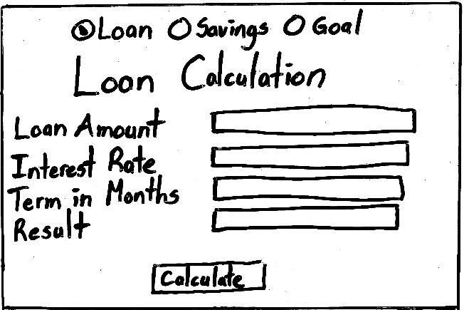
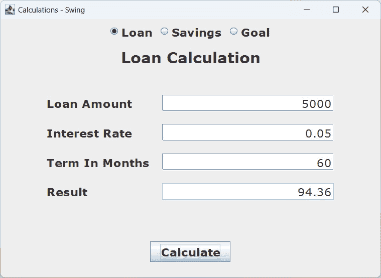
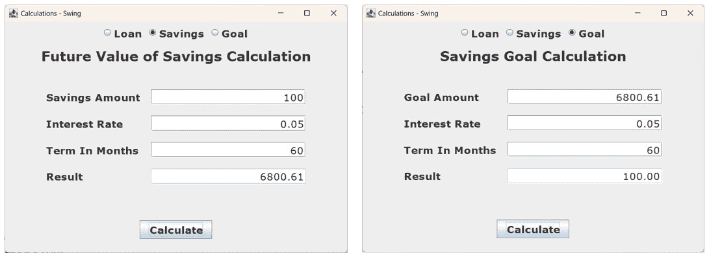
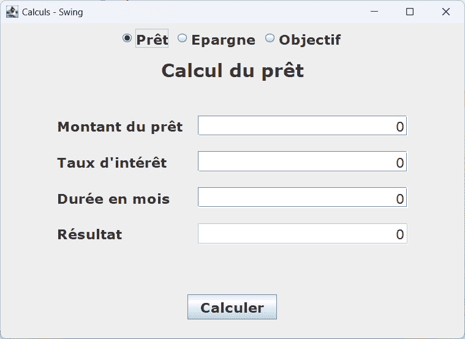
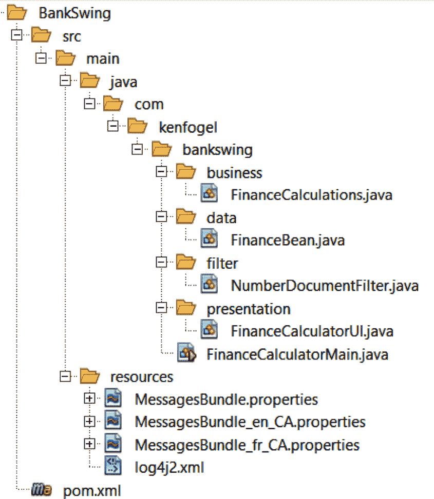
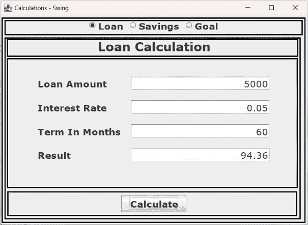
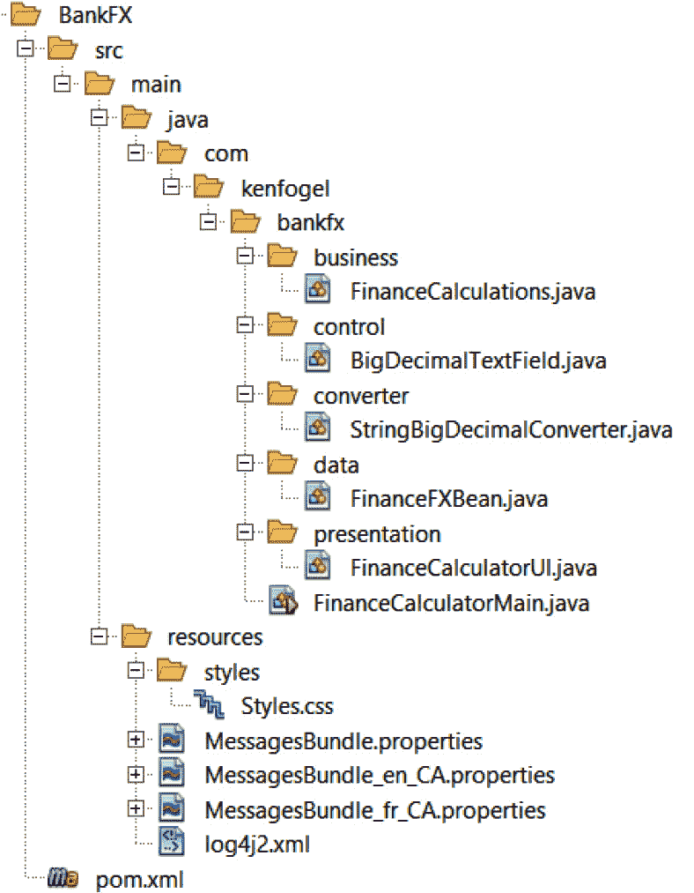

# 13

# 使用 Swing 和 JavaFX 进行桌面图形用户界面编码

本章将介绍一个简单但完整的应用程序，用于提供三种常见的财务计算。这些是贷款还款、货币的未来价值和储蓄目标。我们将查看这个应用程序的两个版本，一个使用 Swing 库编写，另一个使用 JavaFX 库编写。该应用程序的服务器端编码将在 *第十五章*，*Jakarta Faces 应用程序* 中介绍。

本章我们将涵盖以下内容：

+   Java GUIs 的简要历史

+   财务计算器程序设计

+   使用 Swing GUI 框架

+   使用 JavaFX GUI 框架

+   我应该使用哪个？

到本章结束时，您将了解使用两个最广泛使用的框架进行 GUI 编码的基础知识。

# 技术要求

下面是运行本章示例所需的工具：

+   Java 17

+   文本编辑器

+   安装 Maven 3.8.6 或更高版本

本章的示例代码可在 [`github.com/PacktPublishing/Transitioning-to-Java/tree/chapter13`](https://github.com/PacktPublishing/Transitioning-to-Java/tree/chapter13) 找到。

# Java GUIs 的简要历史

最初的个人计算机用户界面模仿了大型机或小型机的终端。苹果公司在 1984 年推出了 Mac，微软公司在一年后推出了 Windows。然而，20 世纪 80 年代销售的多数个人计算机都配备了终端界面。改变一切的是互联网的普及和蒂姆·伯纳斯-李（Tim Berners-Lee）从 1989 年开始创建的万维网技术。到 20 世纪末，我们期望使用的计算机拥有图形用户界面。在 *第十五章*，*Jakarta Faces 应用程序* 中，我们将探讨 Java 的网络编程，而本章我们将探讨桌面 GUI 编程。

当 Java 在 1995 年推出时，其原始目的是创建小程序（applets），这些小程序可以在网络浏览器内部从网页中运行。这些页面提供了在 JVM 中运行而不是在浏览器中运行的编译小程序。同时开发的 JavaScript 在浏览器内部运行。这导致了第一个 GUI 库，今天仍然包含在 Java 中，称为 **抽象窗口工具包**（**AWT**），仍然可用于桌面应用程序。小程序不再存在，因为它们已被弃用。

AWT 依赖于底层操作系统来渲染 GUI。在苹果 Mac 上运行的 AWT 程序看起来和感觉就像一个原生 Mac 应用程序。如果你在 Windows PC 上运行相同的代码，它的外观和感觉就像一个原生 Windows 应用程序。随着 Java 在应用空间而不是网络空间中的普及，一个增强的 GUI 库 Swing – 首次在 1996 年推出 – 获得了发展。与 AWT 不同，Swing 可以渲染自己的控件。现在，可以开发出在 Windows、Mac 和 Linux 上看起来几乎相同的用户界面。在*进一步阅读*列表中有一个链接到名为**Napkin**的 Swing 外观和感觉库。这是一个极端的例子，说明了你可以如何设计 Swing 应用程序。Swing 至今仍在广泛使用。它是一个标准库，包含在所有 Java 发行版中。它通过错误修复和微小增强进行维护。

2008 年，JavaFX 1.0，Swing 的替代品，被引入。我们将要查看的版本始于 2011 年的 JavaFX 2.0。JavaFX 的原始目的是为桌面、网页和移动设备上的 GUI 应用程序提供一个通用平台。像 Swing 一样，它负责自己的渲染。它还引入了一种基于 XML 语言 FXML 的声明性方法来定义用户界面。在本章中，我们将探讨定义界面的命令式或编码方法。

现在，让我们看看我们将要构建的应用程序。

# 财务计算器程序设计

在上一章中，我们将使用双精度浮点数的贷款计算改为使用 `BigDecimal`。我们将继续使用这个计算以及另外两个。一个是储蓄目标，其中你指明你希望储蓄的金额、预期的利率以及你希望达到目标的月份数。第二个是未来价值，其中你可以确定在特定月份数和预期利率下储蓄相同金额后你将拥有的金额。

我们将使用上一章中的相同的数据类和业务类。我们将向业务类添加两个新的计算。我们不会在本章中详细介绍新的计算，因为你可以从章节的源代码中看到它们。现在，我们将考虑 GUI。

应用程序将向用户提供三种计算选择。我们希望有一个单一表单，我们可以输入每个计算所需的三个值，并且结果将显示在那里。最后，我们希望有一个按钮来表示可以进行计算。我通常在纸上或白板上实际设计设计，例如这个图：



图 13.1 – 手绘设计

当我们完成时，进行计算时它将看起来像这样：



图 13.2 – Swing 版本

计算的选择由一组三个单选按钮决定。这些是可选择或不可选的控件，并且只能选择一个。当用户选择一个计算时，跟随单选按钮的标题描述将会改变，所有字段都将变为零，第一个输入字段描述将改变，并且按下**计算**按钮将使用与所选单选按钮匹配的计算。



图 13.3 – 未来价值和储蓄目标屏幕

正如您所知，用户并不总是可以信赖输入有效信息。总会有用户会将借款金额输入为`Bob`。我们可以弹出消息框通知用户他们的错误。在某些情况下，这确实是有意义的。在这个用户界面中，我们可以识别出前三个字段中唯一允许的输入必须是数字，并且只允许一个十进制点。您不能输入`Bob`。空白字段将被更改为包含零。最后一个字段不可编辑，因为它显示结果。

## 国际化 – i18n

设计的最后一个元素是国际化，通常称为 i18n。这意味着这个程序可以用多种语言展示。我住在加拿大，那里有两种官方语言 – 英语和法语。这意味着界面中所有带有文本的内容都必须有每种语言的版本。以下是法语版本：



图 13.4 – 法语版本

我们通过将所有将出现在 GUI 中的文本放入一个属性文件来实现国际化，每个语言一个。以下是英文属性文件：

```java
loan_amount=Loan Amount
savings_amount=Savings Amount
goal_amount=Goal Amount
interest_rate=Interest Rate
term_in_months=Term In Months
result=Result
calculate=Calculate
calc_error=Arithmetic Exception
calc_msg=You may not have a zero in any input field.
title=Calculations - Swing
loan_title=Loan Calculation
savings_title=Future Value of Savings Calculation
goal_title=Savings Goal Calculation
loan_radio=Loan
savings_radio=Savings
goal_radio=Goal
alert_a=The value >%s< cannot \nbe converted to a number.
format_error=Number Format Error
```

您可以在项目中看到法语版本。这些属性文件通常称为`ResourceBundle`，您必须首先加载属性文件。

使用默认的`Locale`：

```java
var form = ResourceBundle.getBundle("MessagesBundle");
```

在代码中设置`Locale`，这在测试中非常有用：

```java
Locale locale = new Locale("en", "CA");
var form = ResourceBundle.getBundle(
                         "MessagesBundle", locale);
```

国际化在 JavaFX 中工作方式相同。让我们看看这个应用程序是如何用 Swing 编写的。

# 使用 Swing GUI 框架

选择好 GUI 库后，我们现在可以决定这个应用程序需要哪些类以及它们如何打包。以下是完成的项目布局：



图 13.5 – Swing 项目布局

GitHub 上的源代码注释非常详细，我鼓励您在阅读时下载它。让我们首先看看 Swing 应用程序的基本组件和控制。我们从`JFrame`开始。

## JFrame

每个 Swing 应用程序都需要一个主或顶级容器。为此目的有四个类，但现在其中一个已被弃用并计划删除。它们是`JFrame`、`JDialog`、`JWindow`和已弃用的`JApplet`。`JWindow`类非常适合启动画面，因为它们没有装饰，如边框、标题栏或窗口控件。你通常将`JDialog`用作应用程序的一部分，以与用户交互，处理你不想在使用的顶级容器中的详细信息。它也可以用于需要与用户进行最少交互的简单应用程序，因此也可以用作顶级容器。`JApplet`将 Swing 带到了网页浏览器，但现在它正走向历史的垃圾堆。让我们来谈谈`JFrame`。

`JFrame`类是一个装饰容器，这意味着它有一个边框和标题栏。如果你想要一个菜单，它支持`JMenuBar`。它可以调整大小或固定大小。所有其他组件和控制都放入`JFrame`中。在我的示例代码中，我使用了继承在`FinanceCalculatorMain`类中扩展`JFrame`，这简化了编码。

下面是设置框架的代码。你将在*JPanel*部分看到一个额外的步骤：

```java
setDefaultCloseOperation(JFrame.EXIT_ON_CLOSE);
setTitle(form.getString("title"));
setSize(620, 450);
setVisible(true);
```

## JPanel

`JPanel`类是其他组件和控制的容器。虽然`JFrame`类已经包含了`JPanel`类，通常被称为内容面板，但我们很少用它做任何事情，而只是添加一个用户设计的`JPanel`。这正是我的示例所做的事情。还有一个名为`FinanceCalculatorUI`的第二个类，它扩展了`JPanel`。

要将控件（如按钮、文本字段或其他`JPanel`）添加到`JPanel`类中，我们首先必须决定一个`LayoutManager`类。这些对象负责在`JPanel`中放置项目。应用程序中的主要面板是`FinancialCalculatorUI`，它扩展了`JPanel`。在其构造函数中，我们编写以下内容：

```java
super(new BorderLayout());
```

在代码的后面，创建了另一个不扩展其他类的`JPanel`。我们可以通过`JPanel`构造函数传递布局管理器：

```java
var innerForm = new JPanel(new BorderLayout());
```

使用多个面板创建用户界面是非常常见的。以下图表显示了所有使用的面板：



图 13.6 – JPanel 布局

第一个`JPanel`，`FinancialCalculatorUI`，被分配到`JFrame`的内容面板。它将有一个`BorderLayout`，包括北、南、东、西和中心区域。在每个布局区域中，你可以添加另一个面板或控件。你放置在这个布局中的任何内容都将填充该区域。在北部，我们放置了一个带有`JRadioButtons`的面板。在中心，我们放置了另一个带有`BorderLayout`的`JPanel`。在这个面板的北部，我们放置了一个包含标题的面板。在南部，有一个带有计算按钮的面板。在中心，我们放置了另一个带有`GridBagLayout`的面板，这允许我们将面板视为行和列，这对于表单来说是非常理想的。

## 事件处理器

任何可以接受用户从键盘或鼠标输入的组件都可以生成事件。你可以选择忽略事件，或者你可以注册你编写的事件处理器。以下是注册与处理器同一类中的方法的代码：

```java
calculate.addActionListener(this::calculateButtonHandler);
```

`calculateButtonHandler` 方法接受一个 `ActionEvent` 对象。该对象包含有关事件的信息，但在此情况下我们不需要它。该方法验证字段是否可以是 `BigDecimal` 类型，并将它们分配给 `FinanceBean`，如果一切顺利，则调用 `FinanceCalculations` 对象进行计算。

## 文档过滤器

在我们的设计中，我们决定只允许最终用户输入一个数字。这个数字只能有一个小数点，且不带符号，因为所有值都必须是正数。在 Swing 中，`JTextField` 内部有一个 `Document` 类型的对象，我们可以从这个对象中访问并替换 `DocumentFilter` 对象。在过滤器中，有一个名为 `replace` 的方法，它在每次按键时被调用。我们将安装自己的过滤器，该过滤器继承或扩展了 `DocumentFilter`。

`replace` 方法接收你输入的字符串以及当前文本字段中该字符串插入的位置。它在文本进入文档之前被调用；在文本改变之前，我们可以访问文本字段的内容。这意味着如果用户输入无效，我们可以恢复我们在输入新字符串之前文本字段中的内容。

## 正则表达式模式匹配

*正则表达式* 或 *regex* 是对字符串中允许或不允许的内容的描述。模式匹配使用正则表达式来确定应用模式的字符串是否符合正则表达式的需求。这些表达式定义了一个将应用于用户输入字符串的模式：

```java
private final Pattern numberPattern =
            Pattern.compile("^[\\d]*[\\.]?[\\d]*$");
private final Matcher numberMatch =
            numberPattern.matcher("");
```

第一行将正则表达式编译。如果事先没有编译，每次使用正则表达式时都会进行编译。这就是创建 `Pattern` 对象的作用。

第二行创建了一个 `Matcher` 对象。在这里，我们创建了一个由 `Pattern` 对象构建的 `Matcher` 对象，它可以评估括号内的字符串并返回 `true` 或 `false`。在 `Matcher` 声明中，搜索空字符串可能看起来很奇怪，但正如我们将看到的，你可以在创建 `Matcher` 对象之后更改你想要搜索的字符串：

```java
if (numberMatch.reset(newText).matches()) {
    super.replace(fb, offset, length, string, attrs);
}
```

`Matcher` 类的 `reset` 方法允许我们将字符串更改为搜索内容。`newText` 对象是在将新字符添加到原始字符串之后得到的字符串。如果匹配失败，则文本字段中已有的字符串保持不变。如果用户将字符串粘贴到文本字段中，这里采取的方法将有效。

许多开发者认为模式匹配成本较高，这意味着它使用了大量的 CPU 时间。异常也是昂贵的。如果两者都很昂贵，那么对于大多数用户来说，简单的异常方法将具有优势。然而，使用 Java **Microbenchmark Harness**库比较模式匹配与抛出异常的性能的简单测试表明，模式匹配可以比使用异常快 8 到 10 倍。

## 控制面板

让我们看看两个放置在带有`GridBagLayout`的面板中的控件。我们首先从`JLabel`开始。我们在其构造函数中提供要显示的文本。实际的文本来自`form`对象表示的适当`ResourceBundle`。接下来，我们设置字体。这个字体在多个地方使用，因此它已经被定义为`labelFont`。最后，我们将`JLabel`添加到面板中。为此，我们需要一个`GridBagConstraints`类型的对象。关于如何添加这个控件有五个细节。数字`0`代表列，数字`2`代表行。接下来的两个数字代表这个控件在网格中将使用多少列和行。最后，我们指示控件在网格中的对齐方式：

```java
inputLabel = new JLabel(form.getString("loan_amount"));
inputLabel.setFont(labelFont);
panelForm.add(inputLabel,
     getConstraints(0, 2, 1, 1, GridBagConstraints.WEST));
```

`JTextField`控件增加了水平对齐和字段宽度的设置，宽度以列为单位：

```java
inputValue = new JTextField("0");
inputValue.setFont(textFont);
inputValue.setHorizontalAlignment(SwingConstants.RIGHT);
inputValue.setColumns(15);
```

在这里，我们提取控制器的`Document`并使用这个引用来安装我们的过滤器：

```java
var inputDocument =
    (AbstractDocument) inputValue.getDocument();
inputDocument.setDocumentFilter(filter);
```

最后，我们将`JTextField`添加到网格中：

```java
panelForm.add(inputValue,
     getConstraints(1, 2, 1, 1, GridBagConstraints.WEST));
```

你可以在源代码中找到关于这个 Swing 版本的更多细节。现在，让我们看看 JavaFX 版本。

# 使用 JavaFX GUI 框架

这个程序版本类似于 Swing 版本。用户界面的设计相同，因为它在面板中使用面板。以下是完成的项目布局：



图 13.7 – JavaFX 程序布局

让我们现在看看 JavaFX 框架中我们将需要的类。

## 应用程序

一个 JavaFX 程序必须包含一个扩展`Application`的类。在这个类中，我们可以构建用户界面或将这项工作委托给另一个类。扩展`Application`的类必须实现一个名为`start`的方法，可选地实现一个名为`init`的方法。你很少有一个构造函数。JavaFX 框架不对扩展`Application`的类的构造函数可用。这就是`init`发挥作用的地方。它在 JavaFX 运行的环境中扮演构造函数的角色。你不需要调用`init`；JavaFX 会调用。

`start`方法是 GUI 创建开始的地方。该方法在`init`之后由 JavaFX 调用。

## 主舞台

`PrimaryStage`对象类似于`JFrame`。你不需要创建它的实例。你正在扩展的`Application`类创建了一个`PrimaryStage`对象并将其传递给`start`：

```java
    @Override
    public void start(Stage primaryStage) {
```

## 面板

与 Swing 不同，在 Swing 中您定义一个面板并将其分配给布局管理器，FX 使用包含布局的面板。我们正在创建的第一个面板是`BorderPane`，它有顶部、底部、左侧、右侧和中心区域。我们在顶部添加了一个包含单选按钮的面板，并在中心添加了另一个面板：

```java
        var root = new BorderPane();
        root.setTop(gui.buildRadioButtonsBox());
        root.setCenter(gui.buildForm());
```

## 场景

据说 JavaFX 的原开发者是一位表演艺术爱好者，这使他使用剧院名称作为框架的一部分。一个`Stage`对象必须包含一个`Scene`对象，该对象反过来又包含一个面板对象。如果需要，您可以创建多个场景并在它们之间切换。对我来说，JavaFX 最引人注目的特性之一是它使用**级联样式表**（**CSS**），下一行将加载它。

```java
        var scene = new Scene(root, 620, 450);
        scene.getStylesheets().add("styles/Styles.css");
```

下四行应该是自解释的。最后一行调用`show`方法来启动程序。

```java
        primaryStage.setTitle(form.getString("title"));
        primaryStage.setScene(scene);
        primaryStage.centerOnScreen();
        primaryStage.show();
    }
```

## CSS 样式表

使用 CSS 来设置组件样式。这与在 Web 开发中使用的 CSS 类似，但并不完全相同。在*进一步阅读*部分，有一个链接到 CSS 参考文档。以下是本应用程序使用的样式表。以点开头的类名是预定义的。以井号开头的类名是您分配的：

```java
#prompt_label {
    -fx-font-size:14pt;
    -fx-font-weight:bold;
    -fx-font-family:Verdana, sans-serif;
}
#input_field {
    -fx-font-size:14pt;
    -fx-font-weight:normal;
    -fx-font-family:Verdana, sans-serif;
}
#title {
    -fx-font-size:18pt;
    -fx-font-weight:bold;
    -fx-font-family:Verdana, sans-serif
}
.button {
    -fx-font-family:Verdana, sans-serif;
    -fx-font-weight:bold;
    -fx-font-size:14pt;
}
.radio-button {
    -fx-font-family:Verdana, sans-serif;
    -fx-font-weight:bold;
    -fx-font-size:14pt;
}
```

您可以通过使用控件的`setId`方法为控件分配一个自定义类名：

```java
resultLabel.setId("prompt_label");
```

您也可以直接在源代码中输入 CSS 样式。以这种方式输入的 CSS 将覆盖外部样式表中的内容：

```java
resultLabel.setStyle("-fx-font-size:18pt; "
     + "-fx-font-weight:bold; "
     + "-fx-font-family:Verdana, sans-serif;");
```

## JavaFX Bean

JavaFX Bean 的设计是为了支持将 Bean 中的字段与控件绑定。对控件所做的任何更改都会写入 Bean，写入 Bean 的内容也会更新控件。这通常被称为观察者模式。为了实现这一点，我们必须将所有数据类型包装到一个称为属性的家族对象中。JavaFX Bean 可以在期望 JavaBean 的地方使用。这意味着不需要修改`FinancialCalculations`类，因为它将与 JavaFX Bean 一起工作，而无需对其代码进行任何更改。以下是我们的`FinanceFXBean`类作为 JavaFX Bean 的示例：

```java
public class FinanceFXBean {
```

与直接声明原始或类类型相比，它们必须被包装到适当的`Property`类中。对于所有原始数据类型，例如`DoubleProperty`或`StringProperty`，都有这样的类。在我们的示例中，我们使用`BigDecimal`，对于它没有属性。这就是`ObjectProperty`类发挥作用的地方。这允许您将任何类用作属性：

```java
private ObjectProperty<BigDecimal> inputValue;
private ObjectProperty<BigDecimal> rate;
private ObjectProperty<BigDecimal> term;
private ObjectProperty<BigDecimal> result;
```

有两个构造函数。第一个是默认构造函数，它调用非默认构造函数：

```java
public FinanceFXBean() {
   this(BigDecimal.ZERO, BigDecimal.ZERO, BigDecimal.ZERO);
}
```

默认构造函数必须实例化每个`Property`对象并对其进行初始化，传入的参数是`BigDecimal`。对于每个定义的属性都有一个简单的属性。当没有命名属性时，例如`SimpleDoubleProperty`，使用`SimpleObjectProperty`：

```java
public FinanceFXBean(BigDecimal inputValue,
                BigDecimal rate, BigDecimal term) {
    this.inputValue =
            new SimpleObjectProperty<>(inputValue);
    this.rate =
            new SimpleObjectProperty<>(rate);
    this.term =
            new SimpleObjectProperty<>(term);
    this.result =
            new SimpleObjectProperty<>(BigDecimal.ZERO);
}
```

与 JavaBean 不同，每个属性有三个方法。前两个，获取器和设置器，从属性内部检索值或更改属性中的值。这就是 JavaFX bean 可以替换 Java bean 的方式，因为获取器和设置器的命名相同，返回或接收相同的数据类型：

```java
public BigDecimal getInputValue() {
    return inputValue.get();
}
public void setInputValue(BigDecimal inputValue) {
    this.inputValue.set(inputValue);
}
```

最后三个方法之一返回属性。这用于实现绑定和观察者模式：

```java
public ObjectProperty<BigDecimal> inputValueProperty() {
    return inputValue;
}
```

## BigDecimalTextField

这是一个扩展 JavaFX `TextField` 的类。与 Swing 的 `JTextField` 不同，没有 `Document`。按下一个键将调用我们重写以满足我们需求的方法。这些方法使用正则表达式进行模式匹配。现在还有一个用于通过删除前导零来修改字符串的正则表达式。

我们重写了两种方法。第一种是 `replaceText`，用于处理键盘输入。第二种是 `replaceSelection`，用于处理从选择文本然后替换它（无论是通过键盘还是粘贴）而产生的变化。

## 控制

我们创建控制和将它们添加到面板中的方式有相似之处。你创建 `GridPane` 来保存表单：

```java
var loanGrid = new GridPane();
```

使用 `ResourceBundle` 实例化 `inputLabel`。接下来分配一个自定义的 CSS-style `id`。最后，我们将标签添加到 `financeGrid` 面板中，指示列和行：

```java
inputLabel = new Label(form.getString("loan_amount"));
inputLabel.setId("prompt_label");
financeGrid.add(inputLabel, 0, 0);
```

`inputValue` 是由我们的自定义 `BigDecimalTextField` 构造的。我们给它分配一个自定义的 CSS `id`，更改其对齐方式，并将其添加到 `financeGrid`：

```java
inputValue = new BigDecimalTextField();
inputValue.setId("input_field");
inputValue.setAlignment(Pos.CENTER_RIGHT);
financeGrid.add(inputValue, 1, 0);
```

## 绑定

将原始数据类型绑定到 JavaFX bean 中的字段需要一个转换器。有一些标准转换器，其中之一是将字符串转换为 BigDecimal 的转换器。以下是绑定方法：

```java
private void doBinding() {
```

我们正在创建一个 `BigDecimalStringConverter` 对象，我们可以在每个绑定中重用它：

```java
    var convert = new BigDecimalStringConverter();
```

对于每个绑定，我们传递每个 `TextField` 的 `textProperty`，`FinanceFXBean` 中每个字段的属性，以及我们的转换器：

```java
    Bindings.bindBidirectional(inputValue.textProperty(),
        financeData.inputValueProperty(), convert);
    Bindings.bindBidirectional(rateValue.textProperty(),
        financeData.rateProperty(), convert);
    Bindings.bindBidirectional(termValue.textProperty(),
        financeData.termProperty(), convert);
    Bindings.bindBidirectional(resultValue.textProperty(),
        financeData.resultProperty(), convert);
}
```

你应该使用哪一个？阅读以下摘要来决定。

# 摘要

Swing 是一个成熟的 GUI 框架，它是 Java 分发的一部分进行维护。由于存在了这么久，已经有很多关于如何使用它的文章。为您的 GUI 项目选择 Swing 是一个好的选择。

JavaFX 可以说是新来的孩子。两个最显著的区别是绑定和 CSS 样式表。虽然这里没有涉及，但 JavaFX 还提供了更好的图形支持。在 JavaFX 图形中，如线或矩形这样的原语与控件处于同一级别。JavaFX 有一个 `Animation` 类，它简化了创建动态图形的过程。还有一个用于创建折线图、饼图等的图表库。

今天的用户期望他们使用的软件中有一个图形用户界面。不需要使用 JavaFX 重新编写 Swing 项目，并且继续有新的项目使用 Swing 编写。那么，你应该使用哪个？在我看来，新项目应该使用 JavaFX。Swing 在很大程度上处于维护模式，以确保其正常工作，并利用核心语言的变化。另一方面，JavaFX 作为开源项目，每个版本都积极维护，并添加了维护和新功能。

在我们下一章中，我们将探讨如何使用 Java 编写运行在称为应用程序服务器的容器中的软件，用于万维网。

# 进一步阅读

+   餐巾纸外观：[`napkinlaf.sourceforge.net/`](https://napkinlaf.sourceforge.net/)

)

+   Java 微基准测试工具：[`medium.com/javarevisited/understanding-java-microbenchmark-harness-or-jmh-tool-5b9b90ccbe8d`](https://medium.com/javarevisited/understanding-java-microbenchmark-harness-or-jmh-tool-5b9b90ccbe8d)

)

+   模式匹配：[`xperti.io/blogs/pattern-matching-java-feature-spotlight/`](https://xperti.io/blogs/pattern-matching-java-feature-spotlight/)

)

+   *JavaFX CSS 参考指南* *指南*：[`openjfx.io/javadoc/17/javafx.graphics/javafx/scene/doc-files/cssref.html`](https://openjfx.io/javadoc/17/javafx.graphics/javafx/scene/doc-files/cssref.html)
