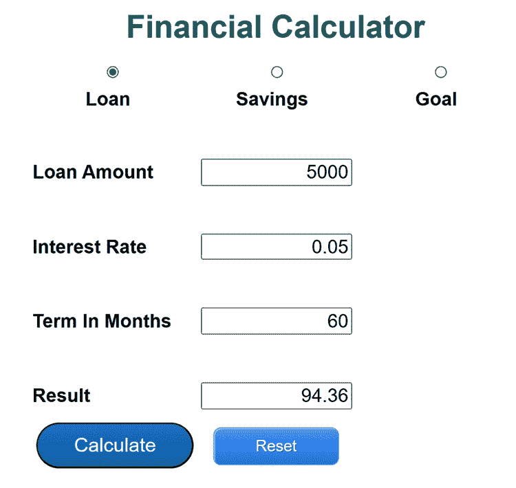
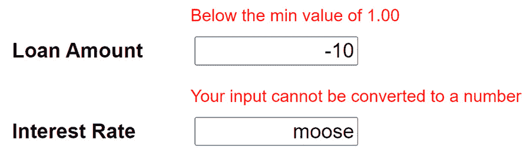
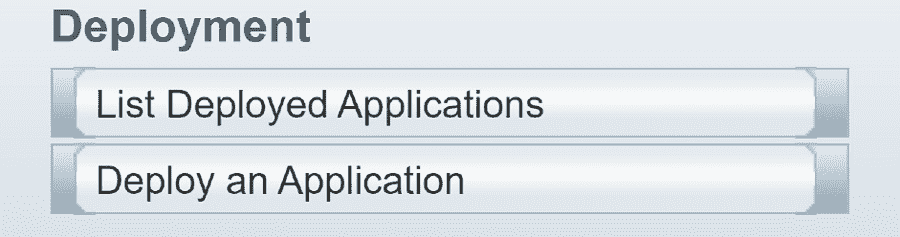
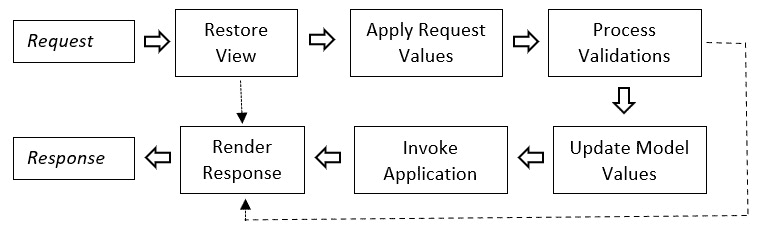

# 15

# Jakarta Faces 应用

Jakarta Faces，现在简称 Faces，是网络应用中两种客户端渲染技术之一。另一种是**Jakarta Server Pages**（**JSP**）。在本章中，我们将检查一个 Faces 网络应用，就像我们的 Swing 和 JavaFX 示例一样，允许你执行三个常见的财务计算。

JSP 渲染方法允许在 HTML 页面上放置 Java 源代码。在 JSP 页面可以渲染之前，该文件由应用服务器转换为 servlet。如果你有 50 个 JSP 页面，那么应用服务器上将有 50 个 servlets。在应用设计中的典型方法是用 JSP 进行渲染，通过混合标准 HTML、表达式语言代码来访问数据或调用 Java 方法，以及 Java 源代码。这些文件以 `.jsp` 扩展名结尾。虽然你可以在页面上进行处理，但常见的方法是让 JSP 页面调用 servlet 进行处理，并决定将哪个 JSP 页面返回给浏览器。

Faces 方法相当不同。首先，框架提供了 Faces servlet。所有对 `.jsf` 页面的请求都由这个 servlet 处理。虽然 JSP 应用通常是 `.jsp` 页面和 servlets 的组合，但 Faces 应用不需要任何 servlets，尽管它们也可以使用。在 servlets 的位置，Faces 允许你通过在代码中添加一些注解来使用来自 *第十三章*，《使用 Swing 和 JavaFX 编写桌面图形用户界面编码》，的 `Calculations` 和 `FinanceBean` 类。

一个 Faces 页面包含 Facelets 以及任何标准 HTML 标签。Facelets 是 `pom` 文件。请参阅 *进一步阅读* 部分以获取这些第三方库的示例。

我们将通过使用 `new` 来与大多数对象交互。相反，CDI 框架在首次使用时实例化一个对象，并确定是否需要垃圾回收。我们也可以使用 `if` 语句。

本章现在将带你了解我们的金融计算器是如何使用 Faces、CDI 和 BV 编写的。我们将探讨以下主题：

+   配置 Faces 应用

+   创建由 CDI 管理并通过 BV 验证的对象

+   使用 XHTML、Facelets 和 Jakarta 表达语言渲染页面

+   理解 Faces 页面的生命周期

到本章结束时，你将了解如何构建 Faces 网络应用。有了这些知识，你将能够评估其他网络应用框架，如 Spring 和 Vaadin。

# 技术要求

对于本章，你需要以下内容：

+   Java 17

+   文本编辑器

+   安装 Maven 3.8.6 或更高版本

+   GlassFish 7.0 应用服务器

+   网络浏览器

本章的示例代码可在 [`github.com/PacktPublishing/Transitioning-to-Java/tree/chapter15`](https://github.com/PacktPublishing/Transitioning-to-Java/tree/chapter15) 找到。

# 配置 Faces 应用

这是金融计算器应用的网页版本看起来是这样的：



图 15.1 – 财务计算器网页

配置 Faces 项目开始于任何基本 Web 应用程序相同的设置，例如我们在上一章中看到的。Maven 文件夹设置是相同的。在`WEB-INF`文件夹中，我们有三个必需的 XML 配置文件和一个可选的。让我们从`beans.xml`开始：

```java
<beans xmlns="https://jakarta.ee/xml/ns/jakartaee"
    xmlns:xsi=http://www.w3.org/2001/XMLSchema-instance
    xsi:schemaLocation="https://jakarta.ee/xml/ns/jakartaee
    https://jakarta.ee/xml/ns/jakartaee/beans_3_0.xsd"
       bean-discovery-mode="annotated">
</beans>
```

这看起来很奇怪，因为只有一个标签`beans`。在注解广泛使用之前，列出每个 bean 或类是必要的，以便启用 CDI。`bean-discovery-mode`标签定义了任何带有 CDI 注解的 bean 现在都受 CDI 的影响。在 Jakarta EE 10 之前，要使用的发现模式是`all`。当前的最好实践是使用`annotated`而不是`all`。

下一个配置文件是`faces-config.xml`。在此文件中，您可以定义应用程序属性。其中一些属性可以是导航规则，以确定提交请求应转到哪个页面，需要实例化的 bean 对象，以及用于 i18n 支持的消息包。在此示例中，我们只使用此文件来定义此应用程序的消息包：

```java
<faces-config version="4.0"
     xmlns="https://jakarta.ee/xml/ns/jakartaee"
     xmlns:xsi="http://www.w3.org/2001/XMLSchema-instance"
     xsi:schemaLocation=
           "https://jakarta.ee/xml/ns/jakartaee
            https://jakarta.ee/xml/ns/jakartaee/
                                web-facesconfig_4_0.xsd">
    <application>
        <resource-bundle>
            <base-name>
                com.kenfogel.bundles.MessagesBundle
            </base-name>
            <var>msgs</var>
        </resource-bundle>
    </application>
</faces-config>
```

您可以在`base-name`中看到消息包的包和基本文件名。在`var`下，您可以看到我们可以在 Faces XHTML 页面中使用的标识符的名称。Faces 中的包与我们为桌面应用程序配置的资源包的方式相同，后面跟着一个键和一个值。要引用消息包中的值，我们使用表达式语言，如`#{msgs.result}`。

最后必需的配置文件是`web.xml`文件。它可以承担我们在上一章中看到的相同职责。此外，我们还可以修改 Faces 的执行方式。为了简单起见，我已经删除了开闭标签，因为它们与上一章的版本相同。

第一个参数`PROJECT_STAGE`配置框架错误处理。使用`Development`错误消息比小段代码和较慢的性能携带更多信息。通常，代码完成后，你会将其更改为`Production`：

```java
<context-param>
    <param-name>jakarta.faces.PROJECT_STAGE</param-name>
    <param-value>Development</param-value>
</context-param>
```

下一个参数确定 Faces 页面中的注释是否在发送到浏览器的 HTML 中：

```java
<context-param>
   <param-name>
       jakarta.faces.FACELETS_SKIP_COMMENTS
   </param-name>
   <param-value>true</param-value>
</context-param>
```

如果服务器明确销毁会话对象或会话超时，则会销毁该会话对象并将其发送到垃圾回收：

```java
<session-config>
   <session-timeout>
      30
   </session-timeout>
</session-config>
```

当通过网站名称而不是特定页面来引用网站时，则此页面将被显示。在 Faces 中，它应该始终是一个`.xhtml`文件：

```java
<welcome-file-list>
   <welcome-file>index.xhtml</welcome-file>
</welcome-file-list>
```

最后一个可选的配置文件是`glassfish-web.xml`。我们可以在该文件中提供数据库连接池、安全信息以及其他应用程序服务器负责的配置信息。在我的示例项目中，我已经删除了此文件，因为我们不需要它。

在项目组织就绪并放置配置文件后，我们就可以开始我们的应用程序了。在我们关注网页设计之前，我们需要设置应用程序所需并配置它们在 CDI 的照顾下工作。

# 创建由上下文依赖注入管理的对象并使用 Bean Validation 进行验证

在这个程序中只使用了两个 Java 类，它们与我们用于*第十三章*中，*使用 Swing 和 JavaFX 进行桌面图形用户界面编码*所用的几乎相同。它们都受 CDI 控制，数据类也使用了 BV。我们不会展示这些在*第十三章*中看到的 bean 的完整代码，我们只会看看需要更改的部分。

## FinanceBean

第一个注解`@Named`定义了此类受 CDI 控制。在 CDI 广泛使用之前，JSF 有自己的 CDI-like 实现，使用了`@ManagedBean`注解。这被认为是过时的，不应再使用。括号中的名称`money`是我们可以在表达式语言中使用的别名：

```java
@Named("money")
```

## 范围

当在 Jakarta 应用程序中由 CDI 管理的对象被创建或销毁，并且其他类可能访问它时，它被称为范围。有以下几种类型：

+   `@RequestScoped`：这意味着服务器将为每个请求创建一个新的对象，并且每个用户的前一个请求对象都会被发送出去进行垃圾回收。

+   `@SessionScoped`：这意味着在第一次请求创建的对象将保持原位，并且只有当会话计时器结束时或明确销毁时，才会销毁。

+   `@ApplicationScoped`：这些对象对所有用户的每个会话都可用。

+   `@ViewScoped`：这是最终的范围。使用此范围创建的 bean 与一个 Faces 页面相关联。只要你不更改视图，例如通过有一个链接或按钮调用另一个页面，那么 bean 仍然有效。

现在回到代码：

```java
@RequestScoped
public class FinanceBean implements Serializable {
    private static final Logger LOG =
        Logger.getLogger(FinanceBean.class.getName());
```

每个 BigDecimal 变量都使用 BV 注解声明。在这个例子中，我们设置了一个最小值和最大值。`message`属性是名为`ValidationMessages`的单独消息包的键。就像普通包一样，你需要一个默认的，然后为每种支持的语言提供一个。这些验证包预计将在`resources`文件夹中找到，而不是在任何子文件夹中：

```java
    @DecimalMin(value = "1.00",
            message = "{com.kenfogel.minInput}")
    @DecimalMax(value = "100000.00",
            message = "{com.kenfogel.maxInput}")
    private BigDecimal inputValue;
    @DecimalMin(value = "0.00",
          message = "{com.kenfogel.minInput}")
    @DecimalMax(value = "1.00",
          message = "{com.kenfogel.maxInput}")
    private BigDecimal rate;
    @DecimalMin(value = "1.00",
           message = "{com.kenfogel.minInput}")
    @DecimalMax(value = "300.00",
           message = "{com.kenfogel.maxInput}")
    private BigDecimal term;
    private BigDecimal result;
```

在原始的`FinanceBean`类中找不到的两个新字段。第一个是`calculationType`字段，它定义了使用哪三个计算公式中的哪一个。它还用于更新第一个输入字段的`Label`名称：

```java
    private String calculationType;
```

当计算类型更改时，必须在第一个输入标签中显示新的文本。这将从资源包中读取：

```java
    private final ResourceBundle msgs;
    public FinanceBean() {
        result = BigDecimal.ZERO;
        inputValue = BigDecimal.ZERO;
        rate = BigDecimal.ZERO;
        term = BigDecimal.ZERO;
```

在构造函数中，我们将计算定义为`loan`并初始化`msgs`：

```java
        calculationType = "loan";
        msgs = ResourceBundle.getBundle(
              "com.kenfogel.bundles.MessagesBundle");
   }
```

此数据类中剩余的方法只是常规的 getter 和 setter。

关于 CDI 和 BV 的最后一点是，它们可以用于任何包含 CDI 和/或 BV 库的 Java 应用程序。该库是 Jakarta 的一部分，因此在`pom`文件中没有特定的引用。要在您的应用程序中使用 CDI、BV 或两者，请将以下内容添加到您的`pom`文件中：

```java
<dependency>
    <groupId>jakarta.enterprise</groupId>
    <artifactId>jakarta.enterprise.cdi-api</artifactId>
    <version>4.0.1</version>
</dependency>
<dependency>
    <groupId>jakarta.validation</groupId>
    <artifactId>jakarta.validation-api</artifactId>
    <version>3.0.2</version>
</dependency>
```

在 Faces 中，有一个称为后端 bean 的数据 bean，现在我们可以查看`Calculations`类。

## 计算

`Calculations`类也基本没有变化。所有三个计算方法中的公式都是相同的。第一个变化是`FinanceBean`对象现在是一个由 CDI 实例化的类字段，而不是传递给每个方法的参数。第二个变化是计算调用到一个方法，该方法反过来选择适当的计算方法。现在让我们看看这个。

类以定义此为 CDI 管理 bean 的注解开始。作用域为`@RequestScope`。CDI bean 是在将其注入到另一个类时实例化的，正如我们接下来将要看到的，或者是在 Faces 页面上首次使用时：

```java
@Named("calculate")
@RequestScoped
public class Calculations implements Serializable {
    private static final Logger LOG =
      Logger.getLogger(Calculations.class.getName());
```

使用`@Inject`注解，CDI 将检查此对象当前是否存在。如果存在，则将其引用分配给名为`money`的变量。如果不存在，则将在将引用传递给`money`之前实例化它：

```java
    @Inject
    FinanceBean money;
```

此方法将从 Faces 页面调用：

```java
    public String performCalculation() {
        switch (money.getCalculationType()) {
            case "loan" ->
                loanCalculation();
            case "savings" ->
                futureValueCalculation();
            case "goal" ->
                savingsGoalCalculation();
        }
        return null;
    }
```

这是使用类字段获取用户输入并将结果存储的地方的计算过程之一：

```java
    public void loanCalculation()
            throws ArithmeticException {
        // Divide APR by 12
        var monthlyRate = money.getRate().divide(
              new BigDecimal("12"), MathContext.DECIMAL64);
```

我们只是对 CDI 和 BV 的表面进行了探讨。参见*进一步阅读*以获取有关这些功能的更多信息。现在让我们继续到 Faces 的网页渲染。

# 使用 XHTML、Facelets 和表达式语言来渲染页面

Faces 应用程序使用扩展名为`xhtml`的文件。此扩展名意味着 HTML 或自定义标签（称为 Facelets）必须遵循 XML 的规则。这意味着每个标签都必须关闭。HTML 允许使用`<br>`和`<p>`等标签，而在 XHTML 中使用这些标签时，必须有一个开标签后跟一个闭标签。标签也可以通过以正斜杠结尾来自动关闭，例如`<br/>`或`<p/>`。

让我们看看负责用户界面的`index.xhtml`文件。

我们首先声明此文件是 XHTML 格式：

```java
<!DOCTYPE xhtml>
```

XML 文档将被检查以确保所有标签都是有效的。这里列出的五个命名空间代表了 Faces 中可用的常见标签集合：

```java
<html xmlns:faces="jakarta.faces"
      xmlns:ui="jakarta.faces.facelets"
      xmlns:f="jakarta.faces.core"
      xmlns:h="jakarta.faces.html"
      xmlns:pt="jakarta.faces.passthrough" >
```

在这里，我们看到我们的第一个 Facelet，即`h:head`标签。当此文件被 Faces 框架处理时，每个 Facelet 都是一个调用 Java 方法的过程，该方法返回一个有效的 HTML 字符串，如果需要，还可以返回 JavaScript：

```java
    <h:head>
```

这里我们看到我们的第一个表达式语言语句。在这种情况下，我们正在从 `faces-config.xml` 文件中定义的消息包中检索文本。请注意，我们还在使用一个 HTML 标签和一个标题，并且这些标签在处理 Faces 页面生成的 HTML 中被保留。在任何 Facelet 与 HTML 标签匹配的情况下，您都应该始终使用 Facelet：

```java
        <title>#{msgs.title}</title>
        <h:outputStylesheet library="css" name="main.css"/>
    </h:head>
    <h:body>
        <h:form>
            <h1>#{msgs.heading}</h1>
```

在这里我们可以看到单选按钮输入的 Facelets。当我们调用表达式语言中的方法而不以括号结束调用时，我们表示我们想要 `getCalculationType()` 或 `setCalculationType()`。如果不是 setter 或 getter，我们必须使用方法的全名后跟括号：

```java
            <h:selectOneRadio
                value="#{money.calculationType}"
                immediate="true" styleClass="radiocenter" >
                <f:selectItem itemValue="loan"
                    itemLabel="#{msgs.loan_radio}"
                    styleclass="radiocenter"/>
                <f:selectItem itemValue="savings"
                     itemLabel="#{msgs.savings_radio}"
                     styleclass="radiocenter"/>
                <f:selectItem itemValue="goal"
                     itemLabel="#{msgs.goal_radio}"
                     styleclass="radiocenter" />
```

单选按钮的常见用途是在表单提交时提供所需的选择。在这个应用程序的设计中，我希望字段被清除，并且表单重新渲染。这种重新渲染还将更改第一个标签的输入标签文本。`valueChange` 事件表示将发生一个 Ajax 部分提交，这将调用 `money.clear()` 方法将所有值重置为零。`render="@form"` 属性将导致页面重新渲染：

```java
                <f:ajax event="valueChange" render="@form"
                      action="#{money.clear()}"/>
            </h:selectOneRadio>
```

我们在这里使用 `panelGrid`，它创建一个 HTML 表格。您指定列数，而行数由 HTML 标签或 Facelets 的数量决定。每两行中的第一个值是一个非换行符。这将消耗一个表格单元格，但不会显示任何内容：

```java
            <h:panelGrid columns="2" >
                <h:outputLabel value="&#160;"/>
```

第二个值是 `h:message`。这个 Facelet 默认为空白条目。如果发生错误，如无效输入或值超出范围，则会在输入字段上方显示一条消息。您可以使用 `style` 属性在此属性中编写 CSS，或者使用 `styleclass` 来引用 CSS 文件中的类：

```java
                <h:message id = "inputError"
                   for="inputValue"
                   style="white-space:nowrap; color:red;
                   font-size: 100%;"/>
```

如果用户输入无效或未转换的输入，就会出现以下情况。这些消息以及 Faces 页面上的其他一切都可以使用 CSS 进行样式化：



图 15.2 – h:message 输出

这个输入标签的文本是从 `FinanceBean` 而不是直接从消息包中检索的。这就是标签可以根据单选按钮选择而改变的原因。

每个 `h:inputText` 字段包含一个 `f:ajax` Facelet。这将触发部分提交，允许将您输入的字符串转换为 `BigDecimal` 并检查它是否在范围内。否则，这些检查只有在按下 **提交** 按钮时才会发生。没有什么比填写完表格后，在按下 **提交** 按钮后才发现几个输入错误更令人烦恼的了。

Faces 框架负责将 `String` 转换为 `BigDecimal`。如果由于存在无效字符而失败，则匹配的 `h:message` 字段将显示来自消息包文件的错误消息。`converterMessage` 属性包含包的键值：

```java
                <h:outputLabel id = "inputLabel"
                    value="#{money.getInputLabel()}"
                    for="inputValue" />
                <h:inputText value="#{money.inputValue}"
                  id="inputValue"
                  converterMessage="#{msgs.invalidInput}" >
                  <f:ajax event="blur"
                    render="inputError" />
                </h:inputText>
                <h:outputLabel value="&#160;"/>
                <h:message id="interestError"
                    for="interestValue"
                    style="white-space:nowrap;
                    color:red; font-size: 100%; " />
                <h:outputLabel value="#{msgs.interest}"
                    for="interestValue"/>
                <h:inputText value="#{money.rate}"
                 id="interestValue"
                  converterMessage="#{msgs.invalidInput}" >
                     <f:ajax event="blur"
                         render="interestError" />
                </h:inputText>
```

在文本中，我移除了这个表单上的两行，因为它们几乎与上一个相同。

在我们表单的底部有两个按钮。一个调用`Calculations`类来生成答案，而另一个重置所有字段并使单选按钮中的`Load`成为选择：

```java
              <h:commandButton type="submit"
                action="#{calculate.performCalculation()}"
                value="#{msgs.submit}"  styleClass="btn" />
               <h:commandButton type="reset"
                 value="#{msgs.clear}" styleClass="btn2" >
                    <f:ajax event="click" execute="@this"
                    render="@form" />
                </h:commandButton>
            </h:panelGrid>
        </h:form>
```

这是一个基本的应用程序，但它应该能给您一个关于 Faces 应用程序如何工作的感觉。

## 部署 Faces Web 应用程序

就像本书中用 Maven 构建的每个示例程序一样，您只需要在`project`文件夹中打开一个终端/控制台窗口。在提示符下，您只需输入`mvn`。假设没有错误，您应该在目标文件夹中找到您的项目。

您可以将此文件复制并粘贴到上一章中讨论的`autodeploy`文件夹中。另一种选择是从 GlassFish 控制台部署应用程序：



图 15.3 – 从服务器部署

选择**部署应用程序**将带您到一个表单，您可以在其中上传应用程序到服务器。随着我们的应用程序运行起来，让我们更深入地了解当我们与 Faces 页面交互时会发生什么。

# 理解 Faces 页面生命周期

在*第十四章*中，我们看到了使用 servlet 的 Web 应用程序的基本生命周期。简单来说，一个提交请求被发送到 servlet，servlet 以请求对象的形式从页面接收数据，然后您编写必要的任务，然后从 servlet 或 HTML 或 JSP 页面返回响应。Faces 与这不同。

一个从`.jsf`页面请求开始的 Faces 页面生命周期有六个部分。以下是一个显示 Faces 生命周期步骤的图表：



图 15.4 – Faces 生命周期

让我们回顾每一部分：

+   **恢复视图**：当一个请求到达时，会检查查询字符串。如果不存在，那么这很可能是第一次请求这个页面。这意味着页面可以在不经过其他任何阶段的情况下渲染。

+   `String`变量。这允许在将数据分配给与请求关联的 bean 之前对其进行验证和转换。与页面关联的 bean 被称为后端 bean。

+   `String`到`BigDecimal`或`double`。您也可以编写自己的自定义转换器。如果在转换过程中出现任何问题，则忽略剩余的阶段，并调用`h:message`来显示错误消息。

转换之后是验证。有标准的验证器 facelets，以及允许您编写自定义验证器。如果使用 BV，它也会在这里被调用。如果验证失败，那么，就像失败的转换一样，生命周期会跳转到渲染响应。

+   **更新模型值**：在这个阶段，在成功转换和验证之后，值被分配给后端 bean。

+   **调用应用程序**：许多标签都有一个 action 属性，允许你调用后端 bean 中的方法。随着数据现在已在后端 bean 中，这些方法可以被调用。

+   **渲染响应**：在这里，Faces 页面被渲染为 HTML 和 JavaScript。

有可能编写一个阶段监听器类，你可以在大多数阶段添加额外的任务。理解生命周期对于开发 Faces 页面至关重要。

# 摘要

本章简要介绍了 Jakarta Faces，支持框架如 CDI 和 BV，以及如何部署应用程序。查看生命周期应该能让你了解 Faces servlet 在做什么。虽然网页渲染通常是 JavaScript 框架的领域，但应该将 Faces 视为 JavaScript 方法的替代方案。它与 CDI 和 BV 的集成使其成为 Web 应用的坚实基础。BV 可以确保所有验证都在服务器上完成。这并不妨碍在 JS 中使用验证。然而，使用像`curl`这样的简单工具，如果验证仅在 JS 客户端发生，你就可以轻松提交无效数据。

在我们接下来的最后一章中，我们将探讨如何打包 Java 应用程序以便轻松部署到服务器或作为桌面应用程序分发。

# 进一步阅读

+   PrimeFaces – Facelet 库：[`www.primefaces.org/`](https://www.primefaces.org/)

+   OmniFaces – Faces 实用方法：[`omnifaces.org/`](https://omnifaces.org/)

+   Spring：[`spring.io/`](https://spring.io/)

+   Vaadin：[`vaadin.com/`](https://vaadin.com/)

+   雅加达教程：[`eclipse-ee4j.github.io/jakartaee-tutorial/`](https://eclipse-ee4j.github.io/jakartaee-tutorial/)

# 第四部分：打包 Java 代码

这一部分是关于你如何分发你的代码。你将学习如何创建一个自定义 Java 运行时，并将其与一个应用程序打包在一个单一文件安装程序中。包括 Java、应用程序服务器和你的应用程序在内的整个环境的分发，使用 Docker 作为云部署的第一步，是本部分的最终主题。

这一部分包含以下章节：

+   *第十六章*，*在独立包和容器中部署 Java*
