# 第二章：以独立模式运行 WildFly

在本章中，我们将涵盖以下主题：

+   从自定义配置文件夹运行 WildFly

+   将 WildFly 绑定到自定义端口

+   将 WildFly 绑定到自定义 IP

+   配置多个 WildFly 实例在同一台机器上运行，具有不同的端口

+   配置多个 WildFly 实例在同一台机器上运行，具有不同的 IP 地址

+   使用部署文件夹管理应用程序

+   连接到 CLI

+   通过 CLI 检查服务器状态

+   通过 CLI 部署应用程序

+   通过 CLI 卸载应用程序

+   通过 CLI 批量执行命令

+   通过 CLI 重新加载服务器配置

+   通过 CLI 关闭和重新启动实例

+   通过 CLI 暂停和恢复实例

+   通过 CLI 备份配置文件

# 简介

在本章中，你将学习如何管理以独立模式运行的 WildFly。首先，我们将讨论哪个配置文件符合我们的需求，然后我们将介绍如何使用特定的配置文件运行 WildFly、通过 Web 控制台导航以及 CLI。

你还将学习如何在只有一个网络接口的情况下，在同一台机器上运行多个 WildFly 实例，这些实例具有不同的端口和 IP 地址。你将学习如何连接到 CLI、检索服务器信息、重新加载服务器配置以及关闭、部署和卸载应用程序。

# 从自定义配置文件夹运行 WildFly

在这个菜谱中，你将学习如何从自定义配置文件夹运行 WildFly。如果你想要使用相同的 WildFly 安装文件夹，但运行两个或更多具有不同配置的 WildFly 实例，这可能会很有用。

## 如何操作…

1.  你需要做的只是将 `standalone` 文件夹复制到你的选择路径。

1.  就这样！现在只需像往常一样运行 WildFly，通过传递 `-Djboss.server.base.dir` 指令来指定你的配置文件夹：

    ```java
    $ cd $WILDFLY_HOME
    $ ./bin/standalone.sh -Djboss.server.base.dir=/your/config/path
    ```

## 它是如何工作的…

在指定不同的 `jboss.server.base.dir` 目录时，WildFly 尝试从预期的文件夹中获取 `standalone.xml` 文件。实际上，你的配置路径必须保持相同的文件夹结构。WildFly 允许你覆盖不同的路径，如果你需要的话。

以下是一个总结所有此类路径的表格：

| 属性名称 | 用途 | 默认值 |
| --- | --- | --- |
| `java.ext.dirs` | JDK 扩展目录路径 | Null |
| `jboss.home.dir` | WildFly 安装根目录 | 由 `standalone.sh` 设置为 `$JBOSS_HOME` |
| `jboss.server.base.dir` | 服务器内容的基目录 | `jboss.home.dir/standalone` |
| `jboss.server.config.dir` | 基配置目录 | `jboss.server.base.dir/configuration` |
| `jboss.server.data.dir` | 用于持久数据文件存储的目录 | `jboss.server.base.dir/data` |
| `jboss.server.log.dir` | 包含 `server.log` 文件的目录 | `jboss.server.base.dir/log` |
| `jboss.server.temp.dir` | 用于临时文件存储的目录 | `jboss.server.base.dir/tmp` |
| `jboss.server.deploy.dir` | 用于存储已部署内容的目录 | `jboss.server.data.dir/content` |

## 更多内容...

此外，你可以通过指定`--server-config`指令来使用不同的配置文件，如下所示：

```java
$ $WILDFLY_HOME/bin/standalone.sh --server-config=standalone-ha.xml
```

# 将 WildFly 绑定到自定义端口

你为什么要将 WildFly 绑定到自定义端口？这是因为你可能在同一 IP:PORT 上运行不同的服务（即另一个 WildFly 或 JBoss 实例、Tomcat 或 GlassFish）。

## 如何操作...

只需打开你的命令行并按照以下方式启动你的 WildFly 独立实例：

```java
$ cd $WILDFLY_HOME
$ ./bin/standalone.sh
```

现在，你可以使用 Web 控制台或 CLI 来更改端口号：

### 使用 Web 控制台

1.  将你的浏览器指向以下地址：`http://127.0.0.1:8080/console`。

1.  通过输入第一章中指定的凭据登录，*欢迎来到 WildFly!*在添加管理用户时；我们输入`wildfly`作为用户名，`cookbook.2015`作为密码。

1.  选择**配置**选项卡，然后在左侧的常规配置菜单中选择**Socket 绑定**，并选择**查看**，如图所示：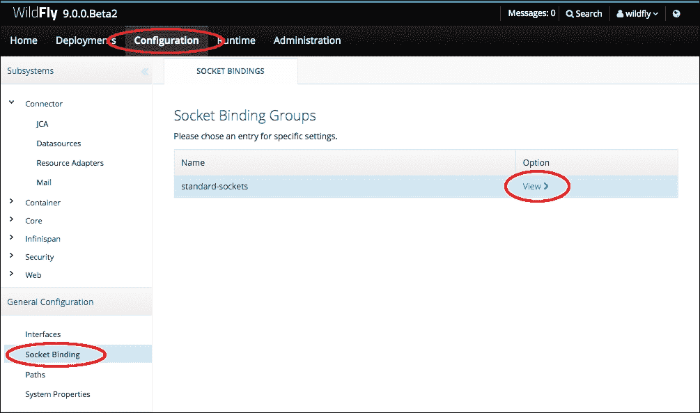

1.  选择`http`属性，然后滚动到页面底部编辑端口号，如图所示：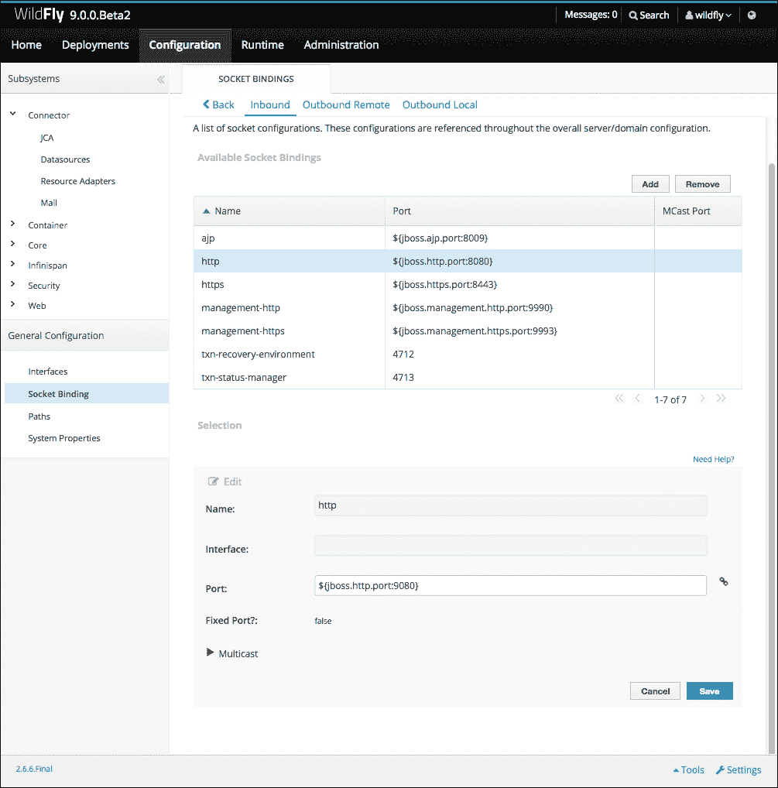

1.  现在，将端口号从`8080`更改为`9080`，然后点击标有**保存**的按钮。你会收到通知，但 GUI 会显示更新成功，并且需要重新加载服务器才能利用新的更改。使用 Web 控制台

1.  转到**运行时**选项卡。你应该看到一个标有**重新加载**的按钮，点击它并确认，如图所示：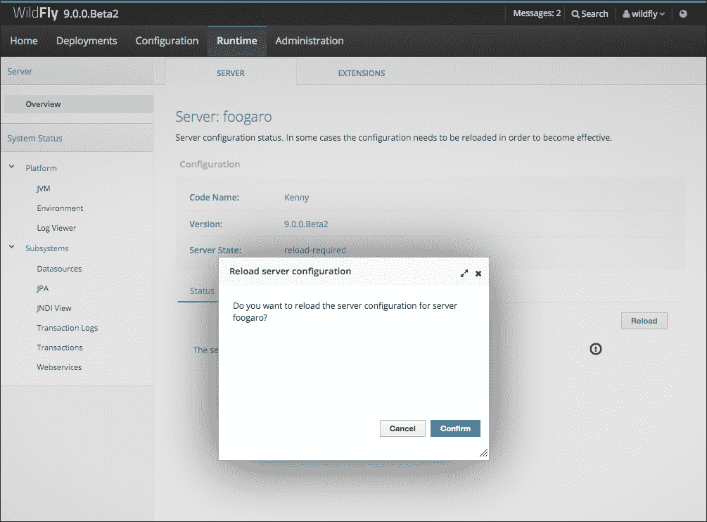

1.  现在打开你的 Web 控制台，使用新的端口号，如下所示：`http://localhost:9080/console`。

### 使用 CLI

在不同的终端中，连接到 CLI 并按照以下步骤操作：

```java
$ ./bin/jboss-cli.sh
```

你目前处于断开连接状态；输入`connect`连接到服务器或输入`help`查看支持的命令列表：

```java
[disconnected /] connect
[standalone@localhost:9990 /] /socket-binding-group=standard-sockets/socket-binding=http:read-attribute(name=port)
{
    "outcome" => "success",
    "result" => expression "${jboss.http.port:8080}"
}
[standalone@localhost:9990 /] /socket-binding-group=standard-sockets/socket-binding=http:read-attribute(name=bound-port)
{
    "outcome" => "success",
    "result" => 8080
}
[standalone@localhost:9990 /] /socket-binding-group=standard-sockets/socket-binding=http:write-attribute(name=port,value=9080)
{
    "outcome" => "success",
    "response-headers" => {
        "operation-requires-reload" => true,
        "process-state" => "reload-required"
    }
}
[standalone@localhost:9990 /] reload
[standalone@localhost:9990 /] /socket-binding-group=standard-sockets/socket-binding=http:read-attribute(name=port)            
{
    "outcome" => "success",
    "result" => 9080
}
[standalone@localhost:9990 /]
```

## 更多内容...

实际上还有另一种更改端口号的方法，即通过传递`standalone.sh`，一个 Java 参数（以大写字母"D"开头），如下所示：

```java
$ cd $WILDFLY_HOME
$ ./bin/standalone.sh -Djboss.http.port=9080
```

这将匹配`standalone.xml`中`socket-binding`标签指定的名为`http`的属性，对于`port`属性。

### 注意

如果你来自 JBoss AS 5 或 6，你可能已经使用了`port-offset`，它仍然通过将偏移量添加到默认值（即`8080`）来更改端口号，但也会更改其他端口号。在 WildFly 中，它还会更改管理端口。

因此，我们将端口号偏移量指定为`1000`，如下所示：

```java
$ ./bin/standalone.sh -Djboss.socket.binding.port-offset=1000
```

我们最终将使 WildFly 监听在端口 9080（即 8080+1000）上，而 WildFly 的管理端口将是 10990（即 9090+1000）。

# 将 WildFly 绑定到自定义 IP

至于端口号，你可能希望将 WildFly 绑定到与默认地址不同的地址；例如，你的公共 IP 地址。

## 如何操作…

要实现这种定制化，你可以同时使用 Web 控制台和 CLI。然而，通常情况下，你会对运行 WildFly 的服务器有 SSH 访问权限，或者更糟（从安全角度来说更好），你可能在到达 WildFly 服务器之前，在不同的服务器上使用 SSH。在这种情况下，你将只能使用 CLI，这就是为什么从现在开始我们将主要使用 CLI 来管理服务器。

### 小贴士

习惯使用命令行界面（CLI）将使你更深入地了解 WildFly 的配置设置，并且它将更加易于记忆，这样你就不会忘记它。

让我们按照以下方式更改 IP 地址：

```java
$ cd $WILDFLY_HOME
$ ./bin/standalone.sh -Djboss.bind.address=10.0.0.1
...
22:56:05,531 INFO  [org.wildfly.extension.undertow] (MSC service thread 1-3) WFLYUT0006: Undertow HTTP listener default listening on /10.0.0.1:8080
...
```

## 它是如何工作的…

如果你查看 `standalone.xml`，你会注意到在以下 `{}` 内部的属性，并且以美元符号 `$` 开头。这个属性将由在启动服务器时指定的同名参数的值所替换。

## 还有更多...

此外，当你想要修改管理接口地址时，相同的逻辑也适用。在这种情况下，你将需要传递 `jboss.bind.address.management` 参数。

顺便说一下，这两个参数都可以使用快捷方式指定，例如，对于 `jboss.bind.address` 参数，可以使用 `-b 10.0.0.1`，而对于 `jboss.bind.address.management`，可以使用 `-bmanagement 10.0.0.1`。

# 配置多个 WildFly 实例在同一台机器上以不同的端口运行

在某些情况下，主要是因为架构原因，你可能在单个服务器上需要运行多个 WildFly 实例。你可以通过隔离每个实例并为其分配不同的绑定端口来实现这一点。

## 准备工作

首先，我们需要为每个我们想要设置和运行的实例创建一个独立配置。我们所需做的就是复制在 *从自定义配置文件夹运行 WildFly* 菜单中解释的概念。假设我们想要两个运行节点/实例，我们使用以下命令：

```java
$ cd $WILDFLY_HOME
$ cp -a standalone node-1
$ cp -a standalone node-2
```

现在，我们已经准备好配置每个实例。

## 如何操作…

要实现这样的要求，你可以使用在 *在自定义端口绑定 WildFly* 菜单中解释的任何一种方法。让我们看看它们中的每一个。

### 使用 jboss.http.port

首先尝试的是通过传递参数 `jboss.http.port` 来运行两个 WildFly 实例，显然，它们的值是不同的。实际上，其中一个可能使用默认值：

```java
$ cd $WILDFLY_HOME
$ ./bin/standalone.sh -Djboss.server.base.dir=$WILDFLY_HOME//node-1 -Djboss.http.port=8180
...
10:30:23,924 INFO  [org.wildfly.extension.undertow] (MSC service thread 1-7) WFLYUT0006: Undertow HTTP listener default listening on /127.0.0.1:8180
...
```

现在，我们将在不同的终端窗口中通过传递不同的 `jboss.http.port` 参数来运行另一个 WildFly 实例：

```java
$ cd $WILDFLY_HOME
$ ./bin/standalone.sh -Djboss.server.base.dir=$WILDFLY_HOME$WILDFLY_HOME/node-2 -Djboss.http.port=8280
...
10:30:34,205 INFO  [org.wildfly.extension.undertow] (MSC service thread 1-6) WFLYUT0006: Undertow HTTP listener default listening on /127.0.0.1:8280
...
10:30:34,473 ERROR [org.jboss.msc.service.fail] (MSC service thread 1-8) MSC000001: Failed to start service jboss.serverManagement.controller.management.http: org.jboss.msc.service.StartException in service jboss.serverManagement.controller.management.http: WFLYSRV0083: Failed to start the http-interface service
...
10:30:34,685 INFO  [org.jboss.as] (Controller Boot Thread) WFLYSRV0054: Admin console is not enabled
10:30:34,685 ERROR [org.jboss.as] (Controller Boot Thread) WFLYSRV0026: WildFly Full 9.0.0.Beta2 (WildFly Core 1.0.0.Beta2) started (with errors) in 3252ms - Started 196 of 377 services (2 services failed or missing dependencies, 210 services are lazy, passive or on-demand)

```

哎呀！出错了！

如您从日志中看到的，由于 "地址已被占用" 的消息，`http-interface` 无法正确启动。这是因为我们更改了 `jboss.http.port`，但没有更改管理接口的类似配置，即 `standalone.xml` 中定义的 `http-interface`：

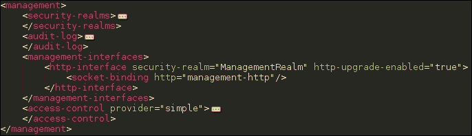

standalone.xml 中定义的 "http-interface"

每个独立实例都有自己的管理接口，因此我们需要更改其绑定。让我们修复它：

```java
$ cd $WILDFLY_HOME
$ ./bin/standalone.sh -Djboss.server.base.dir=$WILDFLY_HOME//node-1 -Djboss.http.port=8180 -Djboss.management.http.port=9991
...
11:11:05,862 INFO  [org.wildfly.extension.undertow] (MSC service thread 1-4) WFLYUT0006: Undertow HTTP listener default listening on /127.0.0.1:8180
...
11:11:06,405 INFO  [org.jboss.as] (Controller Boot Thread) WFLYSRV0060: Http management interface listening on http://127.0.0.1:9991/management
11:11:06,406 INFO  [org.jboss.as] (Controller Boot Thread) WFLYSRV0051: Admin console listening on http://127.0.0.1:9991
...
```

这是在不同的终端窗口中：

```java
$ cd $WILDFLY_HOME
$ ./bin/standalone.sh -Djboss.server.base.dir=$WILDFLY_HOME$WILDFLY_HOME/node-2 -Djboss.http.port=8280 -Djboss.management.http.port=9992
...
11:11:59,777 INFO  [org.wildfly.extension.undertow] (MSC service thread 1-3) WFLYUT0006: Undertow HTTP listener default listening on /127.0.0.1:8280
...
11:12:00,358 INFO  [org.jboss.as] (Controller Boot Thread) WFLYSRV0060: Http management interface listening on http://127.0.0.1:9992/management
11:12:00,359 INFO  [org.jboss.as] (Controller Boot Thread) WFLYSRV0051: Admin console listening on http://127.0.0.1:9992
...
```

好的！现在如果你检查操作系统级别的开放套接字，通过 java 进程进行过滤，你会看到以下内容：

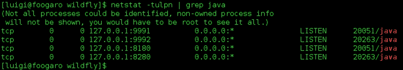

### 使用 jboss.socket.binding.port-offset

好的，让我们尝试使用 `port-offset` 指令：

```java
$ cd $WILDFLY_HOME
$ ./bin/standalone.sh -Djboss.serever.base.dir=$WILDFLY_HOME/node-1 -Djboss.socket.binding.port-offset=100
...
11:35:05,783 INFO  [org.wildfly.extension.undertow] (MSC service thread 1-3) WFLYUT0006: Undertow HTTP listener default listening on /127.0.0.1:8180
...
11:35:06,512 INFO  [org.jboss.as] (Controller Boot Thread) WFLYSRV0060: Http management interface listening on http://127.0.0.1:10090/management
11:35:06,513 INFO  [org.jboss.as] (Controller Boot Thread) WFLYSRV0051: Admin console listening on http://127.0.0.1:10090
11:35:06,513 INFO  [org.jboss.as] (Controller Boot Thread) WFLYSRV0025: WildFly Full 9.0.0.Beta2 (WildFly Core 1.0.0.Beta2) started in 3228ms - Started 202 of 379 services (210 services are lazy, passive or on-demand)
```

以下是在不同的终端窗口中输入的：

```java
$ cd $WILDFLY_HOME
$ ./bin/standalone.sh -Djboss.serever.base.dir=$WILDFLY_HOME/node-2 -Djboss.socket.binding.port-offset=200
...
11:35:23,389 INFO  [org.wildfly.extension.undertow] (MSC service thread 1-5) WFLYUT0006: Undertow HTTP listener default listening on /127.0.0.1:8280
...
11:35:24,030 INFO  [org.jboss.as] (Controller Boot Thread) WFLYSRV0060: Http management interface listening on http://127.0.0.1:10190/management
11:35:24,030 INFO  [org.jboss.as] (Controller Boot Thread) WFLYSRV0051: Admin console listening on http://127.0.0.1:10190
11:35:24,031 INFO  [org.jboss.as] (Controller Boot Thread)  WFLYSRV0025: WildFly Full 9.0.0.Beta2 (WildFly Core 1.0.0.Beta2) started in 3191ms - Started 202 of 379 services (210 services are lazy, passive or on-demand)
```

如您所注意到的，两个服务器都正常启动，无需任何额外的配置或预防措施。最后，只需在操作系统级别检查套接字：

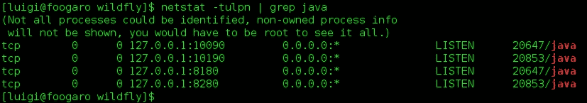

## 还有更多...

使用 `jboss.socket.binding.port-offset` 指令简化了所有配置需求，相比之下，使用 `jboss.http.port` 时需要每次单独更新配置。

此外，使用 WildFly，通过使用 `port-offset` 配置，你可以获得更多的好处，因为你还需要调整远程套接字。

# 配置多个 WildFly 实例在相同机器上以不同的 IP 运行

在某些情况下，主要是由于架构原因，你可能在单个服务器上运行多个 WildFly 实例。你可以通过隔离每个实例并为其提供不同的绑定 IP 来实现这一点。这些 IP 可能是虚拟的，或者实际上是由你系统上安装的物理网络接口提供的。两种方式都很好。

## 准备中

如果你决定使用虚拟 IP，你可以按照以下方式操作：

```java
$ sudo ifconfig YOUR_NIC:1 10.0.1.1 netmask 255.255.255.0
$ sudo ifconfig YOUR_NIC:2 10.0.1.2 netmask 255.255.255.0
```

这里 `YOUR_NIC` 可能是 `eth0`。现在，如果你列出服务器上所有可用的接口，你也会看到以下新的接口：

```java
$ ifconfig
eth0: flags=4099<UP,BROADCAST,MULTICAST>  mtu 1500
        ether f0:de:f1:99:b2:94  txqueuelen 1000  (Ethernet)
        RX packets 0  bytes 0 (0.0 B)
        RX errors 0  dropped 0  overruns 0  frame 0
        TX packets 0  bytes 0 (0.0 B)
        TX errors 0  dropped 0 overruns 0  carrier 0  collisions 0
        device interrupt 20  memory 0xf2600000-f2620000  
eth0:1: flags=4099<UP,BROADCAST,MULTICAST>  mtu 1500
        inet 10.0.1.1  netmask 255.255.255.0  broadcast 10.0.1.255
        ether f0:de:f1:99:b2:94  txqueuelen 1000  (Ethernet)
        device interrupt 20  memory 0xf2600000-f2620000
eth0:2: flags=4099<UP,BROADCAST,MULTICAST>  mtu 1500
        inet 10.0.1.2  netmask 255.255.255.0  broadcast 10.0.1.255
        ether f0:de:f1:99:b2:94  txqueuelen 1000  (Ethernet)
        device interrupt 20  memory 0xf2600000-f2620000  
```

之后，我们需要为每个我们想要设置和运行的实例创建一个独立配置。如果您已经从之前的菜谱（*配置多个 WildFly 实例在相同机器上以不同的端口运行*）中这样做，您可以直接跳转到 *如何操作...* 部分。否则，我们只需要复制 *绑定 WildFly 到自定义 IP* 菜谱中解释的概念。假设我们想要两个运行节点/实例，命令如下：

```java
$ cd $WILDFLY_HOME
$ cp -a standalone node-1
$ cp -a standalone node-2
```

现在我们已经准备好配置每个实例。

## 如何操作...

打开一个终端窗口并输入以下命令：

```java
$ cd $WILDFLY_HOME
$ ./bin/standalone.sh -Djboss.server.base.dir=$WILDFLY_HOME/node-1 -Djboss.bind.address=10.0.1.1
…
22:32:34,259 INFO  [org.wildfly.extension.undertow] (MSC service thread 1-6) WFLYUT0006: Undertow HTTP listener default listening on /10.0.1.1:8080
22:32:34,549 INFO  [org.jboss.as.server.deployment.scanner] (MSC service thread 1-3) WFLYDS0013: Started FileSystemDeploymentService for directory /home/luigi/WFC/wildfly/node-1/deployments
22:32:34,623 INFO  [org.jboss.as.connector.subsystems.datasources] (MSC service thread 1-7) WFLYJCA0001: Bound data source [java:jboss/datasources/ExampleDS]
22:32:34,729 INFO  [org.jboss.ws.common.management] (MSC service thread 1-6) JBWS022052: Starting JBoss Web Services - Stack CXF Server 5.0.0.Beta3
22:32:35,022 INFO  [org.jboss.as] (Controller Boot Thread) WFLYSRV0060: Http management interface listening on http://127.0.0.1:9990/management
22:32:35,023 INFO  [org.jboss.as] (Controller Boot Thread) WFLYSRV0051: Admin console listening on http://127.0.0.1:9990
22:32:35,024 INFO  [org.jboss.as] (Controller Boot Thread) WFLYSRV0025: WildFly Full 9.0.0.Beta2 (WildFly Core 1.0.0.Beta2) started in 3260ms - Started 202 of 379 services (210 services are lazy, passive or on-demand)
```

在不同的终端窗口中输入以下内容：

```java
$ cd $WILDFLY_HOME
./bin/standalone.sh -Djboss.server.base.dir=$WILDFLY_HOME/node-2 -Djboss.bind.address=10.0.1.2
...
22:33:02,522 INFO  [org.wildfly.extension.undertow] (MSC service thread 1-8) WFLYUT0006: Undertow HTTP listener default listening on /10.0.1.2:8080
22:33:02,735 INFO  [org.jboss.as.server.deployment.scanner] (MSC service thread 1-8) WFLYDS0013: Started FileSystemDeploymentService for directory /home/luigi/WFC/wildfly/node-2/deployments
22:33:02,830 ERROR [org.jboss.msc.service.fail] (MSC service thread 1-1) MSC000001: Failed to start service jboss.serverManagement.controller.management.http: org.jboss.msc.service.StartException in service jboss.serverManagement.controller.management.http: WFLYSRV0083: Failed to start the http-interface service
 at org.jboss.as.server.mgmt.UndertowHttpManagementService.start(UndertowHttpManagementService.java:269)
 at org.jboss.msc.service.ServiceControllerImpl$StartTask.startService(ServiceControllerImpl.java:1948)
 at org.jboss.msc.service.ServiceControllerImpl$StartTask.run(ServiceControllerImpl.java:1881)
 at java.util.concurrent.ThreadPoolExecutor.runWorker(ThreadPoolExecutor.java:1142)
 at java.util.concurrent.ThreadPoolExecutor$Worker.run(ThreadPoolExecutor.java:617)
 at java.lang.Thread.run(Thread.java:745)
Caused by: java.lang.RuntimeException: java.net.BindException: Address already in use
 at org.jboss.as.domain.http.server.ManagementHttpServer.start(ManagementHttpServer.java:160)
 at org.jboss.as.server.mgmt.UndertowHttpManagementService.start(UndertowHttpManagementService.java:235)
 ... 5 more
Caused by: java.net.BindException: Address already in use
 at sun.nio.ch.Net.bind0(Native Method)
 at sun.nio.ch.Net.bind(Net.java:436)
 at sun.nio.ch.Net.bind(Net.java:428)
 at sun.nio.ch.ServerSocketChannelImpl.bind(ServerSocketChannelImpl.java:214)
 at sun.nio.ch.ServerSocketAdaptor.bind(ServerSocketAdaptor.java:74)
 at sun.nio.ch.ServerSocketAdaptor.bind(ServerSocketAdaptor.java:67)
 at org.xnio.nio.NioXnioWorker.createTcpConnectionServer(NioXnioWorker.java:182)
 at org.xnio.XnioWorker.createStreamConnectionServer(XnioWorker.java:243)
 at org.jboss.as.domain.http.server.ManagementHttpServer.start(ManagementHttpServer.java:147)
 ... 6 more

22:33:02,858 INFO  [org.jboss.as.connector.subsystems.datasources] (MSC service thread 1-7) WFLYJCA0001: Bound data source [java:jboss/datasources/ExampleDS]
22:33:02,907 INFO  [org.jboss.ws.common.management] (MSC service thread 1-3) JBWS022052: Starting JBoss Web Services - Stack CXF Server 5.0.0.Beta3
22:33:02,911 ERROR [org.jboss.as.controller.management-operation] (Controller Boot Thread) WFLYCTL0013: Operation ("add") failed - address: ([
 ("core-service" => "management"),
 ("management-interface" => "http-interface")
]) - failure description: {"WFLYCTL0080: Failed services" => {"jboss.serverManagement.controller.management.http" => "org.jboss.msc.service.StartException in service jboss.serverManagement.controller.management.http: WFLYSRV0083: Failed to start the http-interface service
 Caused by: java.lang.RuntimeException: java.net.BindException: Address already in use
 Caused by: java.net.BindException: Address already in use"}}
22:33:02,969 INFO  [org.jboss.as.controller] (Controller Boot Thread) WFLYCTL0183: Service status report
WFLYCTL0186:   Services which failed to start:      service jboss.serverManagement.controller.management.http: org.jboss.msc.service.StartException in service jboss.serverManagement.controller.management.http: WFLYSRV0083: Failed to start the http-interface service

22:33:03,253 INFO  [org.jboss.as] (Controller Boot Thread) WFLYSRV0063: Http management interface is not enabled
22:33:03,254 INFO  [org.jboss.as] (Controller Boot Thread) WFLYSRV0054: Admin console is not enabled
22:33:03,254 ERROR [org.jboss.as] (Controller Boot Thread) WFLYSRV0026: WildFly Full 9.0.0.Beta2 (WildFly Core 1.0.0.Beta2) started (with errors) in 3277ms - Started 196 of 377 services (2 services failed or missing dependencies, 210 services are lazy, passive or on-demand)

```

哎呀！又失败了！

现在怎么了？几乎和上一个菜谱中一样的问题。我们没有更改管理接口的任何绑定参数（IP 地址或端口号）。

实际上，正如您可以从`node-1`实例的日志中看到的那样，管理和 HTTP 接口绑定到本地地址，这是默认地址。因此，`node-2`实例将具有相同的设置，因此出现错误：**地址已被占用**。

让我们修复这个错误：

```java
$ ./bin/standalone.sh -Djboss.server.base.dir=$WILDFLY_HOME/node-1 -Djboss.bind.address=10.0.1.1 -Djboss.bind.address.management=10.0.1.1
...
22:38:41,054 INFO  [org.wildfly.extension.undertow] (MSC service thread 1-6) WFLYUT0006: Undertow HTTP listener default listening on /10.0.1.1:8080
22:38:41,313 INFO  [org.jboss.as.server.deployment.scanner] (MSC service thread 1-6) WFLYDS0013: Started FileSystemDeploymentService for directory /home/luigi/WFC/wildfly/node-1/deployments
22:38:41,372 INFO  [org.jboss.as.connector.subsystems.datasources] (MSC service thread 1-2) WFLYJCA0001: Bound data source [java:jboss/datasources/ExampleDS]
22:38:41,450 INFO  [org.jboss.ws.common.management] (MSC service thread 1-8) JBWS022052: Starting JBoss Web Services - Stack CXF Server 5.0.0.Beta3
22:38:41,792 INFO  [org.jboss.as] (Controller Boot Thread) WFLYSRV0060: Http management interface listening on http://10.0.1.1:9990/management
22:38:41,793 INFO  [org.jboss.as] (Controller Boot Thread) WFLYSRV0051: Admin console listening on http://10.0.1.1:9990
22:38:41,794 INFO  [org.jboss.as] (Controller Boot Thread) WFLYSRV0025: WildFly Full 9.0.0.Beta2 (WildFly Core 1.0.0.Beta2) started in 3224ms - Started 202 of 379 services (210 services are lazy, passive or on-demand)
```

在不同的终端窗口中输入以下内容：

```java
$ ./bin/standalone.sh -Djboss.server.base.dir=$WILDFLY_HOME/node-2 -Djboss.bind.address=10.0.1.2 -Djboss.bind.address.management=10.0.1.2
…
22:39:55,815 INFO  [org.wildfly.extension.undertow] (MSC service thread 1-1) WFLYUT0006: Undertow HTTP listener default listening on /10.0.1.2:8080
22:39:56,054 INFO  [org.jboss.as.server.deployment.scanner] (MSC service thread 1-4) WFLYDS0013: Started FileSystemDeploymentService for directory /home/luigi/WFC/wildfly/node-2/deployments
22:39:56,176 INFO  [org.jboss.as.connector.subsystems.datasources] (MSC service thread 1-8) WFLYJCA0001: Bound data source [java:jboss/datasources/ExampleDS]
22:39:56,241 INFO  [org.jboss.ws.common.management] (MSC service thread 1-7) JBWS022052: Starting JBoss Web Services - Stack CXF Server 5.0.0.Beta3
22:39:56,567 INFO  [org.jboss.as] (Controller Boot Thread) WFLYSRV0060: Http management interface listening on http://10.0.1.2:9990/management
22:39:56,567 INFO  [org.jboss.as] (Controller Boot Thread) WFLYSRV0051: Admin console listening on http://10.0.1.2:9990
22:39:56,568 INFO  [org.jboss.as] (Controller Boot Thread) WFLYSRV0025: WildFly Full 9.0.0.Beta2 (WildFly Core 1.0.0.Beta2) started in 3271ms - Started 202 of 379 services (210 services are lazy, passive or on-demand)
```

就这样！我们同时运行了两个 WildFly 实例，每个实例都使用一个专用的 IP 地址，即使它们都在使用相同的端口。让我们在操作系统级别检查一下：

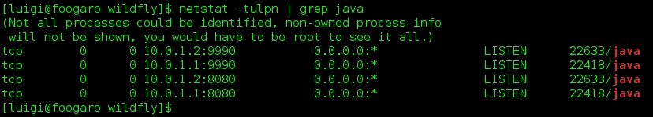

## 还有更多…

正如您在本食谱和上一个食谱中注意到的，我们可以自定义 WildFly 相对于 IP 地址和端口号的绑定，这既适用于服务组件（即您的应用程序），也适用于管理组件（即管理控制台和 CLI）。

显然，我们甚至可以混合自定义，从而更改 IP 和端口，并更改服务组件的端口号和管理接口的 IP 地址。只要您不进行等于绑定，您就可以做任何想做的事情。

典型的配置将服务组件绑定到公共接口（即外部可见的 IP 地址）和管理接口绑定到私有接口（即仅本地或网络内可见的 IP 地址）。

# 使用部署文件夹管理应用程序

配置和自定义 WildFly 独立实例后，是时候部署我们的第一个应用程序了。WildFly 提供了许多部署应用程序的方法，其中之一是通过部署扫描器（对于那些来自 JBoss AS 版本的人所熟知）。基本上，您需要做的就是将您的工件复制到独立实例的`deployments`文件夹中。

在生产环境中，您最好关闭部署扫描器，以避免意外替换部署——您会遇到很大的麻烦。请使用 CLI 或管理控制台进行适当的“部署”操作。我们将在本章中看到这两种方法。

## 准备工作

在本食谱中，我们需要一个 Java Web 应用程序。如果您愿意，可以使用我 GitHub 账户中的一个项目，地址如下：[`github.com/foogaro/wildfly-cookbook.git`](https://github.com/foogaro/wildfly-cookbook.git)。

您可以使用`git-clone`克隆仓库，或者将其作为 ZIP 存档下载。无论哪种方式，都在`WFC`文件夹中创建一个名为`github`的文件夹，并将源文件放入其中。

使用`git-clone`命令，请按照以下步骤操作：

```java
$ cd ~/WFC
$ mkdir github
$ cd github
$ git clone https://github.com/foogaro/wildfly-cookbook.git
```

一旦`git`完成了仓库的克隆，您将找到一个名为`example`的项目。要编译项目，请按照以下步骤操作：

```java
$ cd ~/WFC/github/wildfly-cookbook/example
$ mvn -e clean package
```

前面的命令编译项目并将 Web 应用程序工件生成到名为`target`的文件夹中。在那里您可以找到名为`example.awar`的应用程序，准备部署。

### 注意

此外，还有官方 WildFly 快速入门存储库，其中包含大量宝贵的资源可供参考，并且它也在此地址上可供贡献：[`github.com/wildfly/quickstart`](https://github.com/wildfly/quickstart)。

现在，假设我们将使用默认的`standalone`文件夹作为我们实例的基本配置路径。为了看到一切在行动，最好首先运行 WildFly，然后使用`deployments`文件夹开始管理应用程序本身。

## 如何操作…

1.  首先，让我们启动 WildFly：

    ```java
    $ cd $WILDFLY_HOME
    $ ./bin/standalone.sh
    ...
    WFLYSRV0025: WildFly Full 9.0.0.Beta2 (WildFly Core 1.0.0.Beta2) started in 3087ms - Started 202 of 379 services (210 services are lazy, passive or on-demand)
    ```

1.  现在，保持您的终端窗口可见，打开您喜欢的文件管理工具，并将`example.war`复制到`deployments`文件夹中。

    或者，您可以使用新终端复制 Web 应用程序，使用以下命令：

    ```java
    $ cp ~/WFC/github/wildfly-cookbook/example/target/example.war $WILDFLY_HOME/standalone/deployments
    ```

1.  几秒钟后（定时器间隔设置为每 5 秒一次，因此您可能需要等待几毫秒或 5 秒），我们将得到以下输出：

    ```java
    22:51:31,396 INFO  [org.jboss.as.repository] (DeploymentScanner-threads - 1) WFLYDR0001: Content added at location /home/luigi/WFC/wildfly/standalone/data/content/21/7dd6250d5bc4afcabdffb0b25c99db92239b5a/content
    22:51:31,447 INFO  [org.jboss.as.server.deployment] (MSC service thread 1-3) WFLYSRV0027: Starting deployment of "example.war" (runtime-name: "example.war")
    22:51:31,986 INFO  [org.wildfly.extension.undertow] (MSC service thread 1-4) WFLYUT0021: Registered web context: /example
    22:51:32,046 INFO  [org.jboss.as.server] (DeploymentScanner-threads - 1) WFLYSRV0010: Deployed "example.war" (runtime-name : "example.war")
    ```

    并且您也应该在`deployments`文件夹中获得一个名为`example.war.deployed`的新文件。这是一个标记，表示应用程序已成功部署。如果发生错误，任何操作都会回滚，并创建一个名为`example.war.failed`的新文件。

1.  现在，你能猜到如何取消部署吗？是的...将标记文件扩展名重命名为`.undeploy`，如下所示：

    ```java
    22:55:17,702 INFO  [org.wildfly.extension.undertow] (MSC service thread 1-7) WFLYUT0022: Unregistered web context: /example
    22:55:17,736 INFO  [org.hibernate.validator.internal.util.Version] (MSC service thread 1-4) HV000001: Hibernate Validator 5.1.3.Final
    22:55:17,801 INFO  [org.jboss.as.server.deployment] (MSC service thread 1-3) WFLYSRV0028: Stopped deployment example.war (runtime-name: example.war) in 109ms
    22:55:17,817 INFO  [org.jboss.as.repository] (DeploymentScanner-threads - 1) WFLYDR0002: Content removed from location /home/luigi/WFC/wildfly/standalone/data/content/21/7dd6250d5bc4afcabdffb0b25c99db92239b5a/content
    22:55:17,817 INFO  [org.jboss.as.server] (DeploymentScanner-threads - 1) WFLYSRV0009: Undeployed "example.war" (runtime-name: "example.war")
    ```

    在`deployments`文件夹中，已创建一个名为`example.war.undeployed`的新文件。现在我们如何重新部署它？删除两个标记文件，或者创建一个名为`example.war.dodeploy`的新文件。

## 它是如何工作的…

为了回顾我们迄今为止所学的内容，标记文件始终具有与应用程序相同的名称加上后缀。以下表格总结了所有可用的标记：

| 后缀 | 描述 |
| --- | --- |
| `.dodeploy` | 用户生成，以指示给定内容应部署。 |
| `.skipdeploy` | 用户生成，以指示给定内容应跳过自动部署，只要文件存在。这允许您修改展开的内容，而无需在更新过程中由扫描器启动重新部署。对于压缩内容也是如此。 |
| `.isdeploying` | 由部署扫描器服务放置，以指示它已注意到`.dodeploy`文件或新的或更新的自动部署模式内容，并正在部署内容。当部署过程完成时，此标记文件将被删除，因此您可能看不到它对于小型工件。 |
| `.deployed` | 由部署扫描器服务放置，以指示给定内容已部署。如果您删除此文件，内容将被取消部署。 |
| `.failed` | 由部署扫描器服务放置，以指示给定内容在其部署过程中失败。在文件中，您将找到有关部署过程中出现问题的信息。请注意，在自动部署模式下，删除此文件将使部署有资格再次部署。 |
| `.isundeploying` | 由部署扫描服务放置，以指示它已经注意到`.deployed`文件已被删除，内容正在被卸载。当卸载过程完成时，此标记文件将被删除，因此你可能看不到它对于小型工件。 |
| `.undeployed` | 由部署扫描服务放置，以指示给定内容已被卸载。如果你删除此文件，将没有任何影响。 |
| `.pending` | 由部署扫描服务放置，以指示它已经注意到需要部署内容，但尚未指示服务器部署它。如果扫描器检测到某些自动部署内容仍在复制过程中，或者存在阻止自动部署的问题，则会创建此文件。只要这种条件保持不变，扫描器就不会指示服务器部署或卸载任何内容（不仅仅是直接受影响的内容）。 |

# 连接到 CLI

有三种方式来管理你的 WildFly，即通过编辑 XML 文件、控制台和 CLI。

+   首先，直接编辑 XML 可能会出错，因为它可能会浪费你宝贵的几秒钟；此外，每次更改都需要重启服务器。

+   控制台为你提供了可视编辑功能，但它并不完整。Web 控制台只能执行所有可用操作的一个子集，这些操作你可以使用 CLI 执行。

+   CLI 代表命令行界面，它是一个你被推荐用来管理你的 WildFly 应用服务器的工具。

为什么选择 CLI？大多数时候，出于安全原因，你通过 SSH 连接到企业环境，因此根本无法看到 Web 控制台。CLI WildFly 在这种情况下非常有用。

CLI 是一个强大的工具，它让你完全控制 WildFly；你可以部署和卸载应用程序，创建和管理数据源，管理日志，更改系统属性，停止和启动实例，等等。使用 CLI 还可以帮助你理解 WildFly 的核心逻辑，这样你才能真正成为一个 WildFly 管理员专家。尽管如此，如果你真的还想有一个 GUI，你可以在 GUI 版本中拥有 CLI；只需在你运行 WildFly 时执行以下命令：

```java
$ cd $WILDFLY_HOME
$ ./bin/jboss-cli.sh --gui
```

以下截图展示了 CLI GUI 工具：

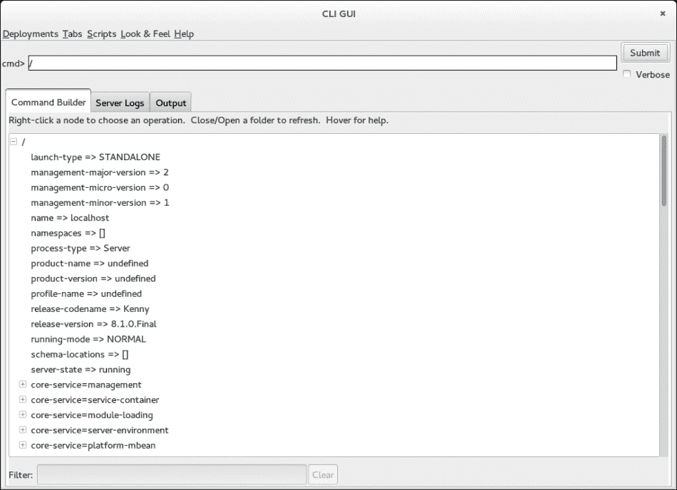

CLI GUI 工具

现在，是时候用 CLI 玩玩儿了。让我们看看你能做什么！

## 准备工作

由于 CLI 是一个管理工具，你需要确保你的 WildFly 实例正在运行。在这种情况下，我们也将使用默认的独立配置。

打开一个终端窗口并启动 WildFly：

```java
$ cd $WILDFLY_HOME
$ ./bin/standalone.sh
...
22:12:23,600 INFO  [org.jboss.as] (Controller Boot Thread) WFLYSRV0025: WildFly Full 9.0.0.Beta2 (WildFly Core 1.0.0.Beta2) started in 3087ms - Started 202 of 379 services (210 services are lazy, passive or on-demand)
```

## 如何操作…

1.  让我们打开一个终端窗口：

    ```java
    $ cd $WILDFLY_HOME
    $ ./bin/jboss-cli.sh
    You are disconnected at the moment. Type connect to connect to the server or help for the list of supported commands.
    [disconnected /]
    ```

1.  一旦进入，我们需要连接到正在运行的实例。通过输入命令`connect`，该工具使用默认参数连接到实例，即`localhost:9990`。

    ```java
    [disconnected /] connect
    [standalone@localhost:9990 /]
    ```

1.  你也可以通过命令行直接连接到 CLI，如下所示传递--connect 参数：

    ```java
    $ cd $WILDFLY_HOME
    $ ./bin/jboss-cli.sh --connect
    [standalone@localhost:9990 /]
    ```

    从现在开始，我们将直接连接到 CLI，而无需从内部连接到它。

1.  现在尝试使用`ls`命令列出（就像在 Linux 中做的那样）：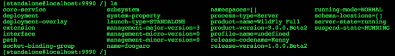

1.  列表命令为您提供了可以操作的所有组件，基本上就是您在编辑`standalone.xml`时可以看到的内容。实际上，列出子系统时，您将看到在`standalone.xml`中声明的所有子系统：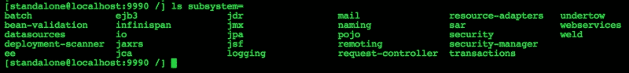

## 更多内容…

记住，您的键盘上的*Tab*键是您的朋友。如果您不记得一个命令，只需按*Tab*。如果您不记得如何完成一个命令，只需按*Tab*。按*Tab*键将显示当前上下文中的所有可能解决方案。

CLI 中有两个其他特殊字符：`/`（正斜杠）和`:`（冒号）。正斜杠用于在上下文中导航，而冒号用于在最后选定的上下文中调用方法操作。请查看下一道菜谱中的示例。

# 通过 CLI 检查服务器状态

在这个配方中，我们将学习如何检查服务器状态。WildFly 可能根据其阶段有不同的状态：启动中、停止、已启动和已停止。有时，仅通过在操作系统级别查找其进程来检查其状态可能还不够。

## 准备工作

由于 CLI 是一个管理工具，您需要确保您的 WildFly 实例已启动并运行。此外，对于这个配方，我们将依赖默认的独立配置。

打开一个终端窗口并启动 WildFly：

```java
$ cd $WILDFLY_HOME
$ ./bin/standalone.sh
...
22:12:23,600 INFO  [org.jboss.as] (Controller Boot Thread) WFLYSRV0025: WildFly Full 9.0.0.Beta2 (WildFly Core 1.0.0.Beta2) started in 3226ms - Started 202 of 379 services (210 services are lazy, passive or on-demand)
```

## 如何操作…

在一个新的终端窗口中，输入以下内容：

```java
$ ./bin/jboss-cli.sh
You are disconnected at the moment. Type 'connect' to connect to the server or 'help' for the list of supported commands.
[disconnected /] connect
[standalone@localhost:9990 /] :read-attribute(name=server-state)
{
    "outcome" => "success",
    "result" => "running"
}
[standalone@localhost:9990 /]
```

## 它是如何工作的…

当您连接到主机控制器时，您就在配置的根目录。因此，您可以在其上调用操作，而要做到这一点，您需要从冒号（`:`）符号开始。

在我们的示例中，我们使用了`read-attribute`方法，但您可以使用任何可用的方法。要查看它们，只需在冒号符号后按*Tab*键，如下所示：

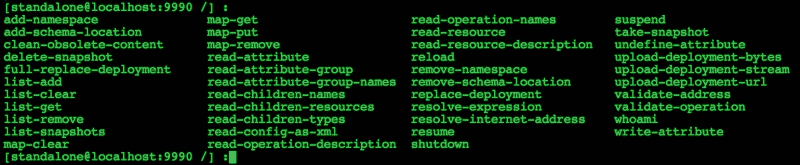

回到我们的服务器状态，我们收到了两个响应：一个表示我们的调用成功，另一个报告结果，**运行**。

# 通过 CLI 部署应用程序

在这个配方中，我们将学习如何使用 CLI 部署应用程序。在这里，我们将仅使用基本选项，但请记住，在部署期间您有多个选项，我们将在专门介绍 CLI 的章节中深入分析。

## 准备工作

在这个配方中，以及接下来的一个配方中，我们都需要一个应用程序来测试我们的配置。对于这个配方，我们需要名为`example`的应用程序，您可以在我的 GitHub 仓库中找到它。如果您跳过了*使用部署文件夹管理应用程序*配方，请参阅它以下载您需要的源代码和项目。

## 如何操作…

1.  当您的 WildFly 实例启动并运行时，打开一个终端并像往常一样连接到 CLI：

    ```java
    $ ./bin/jboss-cli.sh --connect
    [standalone@localhost:9990 /]
    ```

1.  现在我们需要告诉 CLI 按照以下方式部署我们的应用程序：

    ```java
    [standalone@localhost:9990 /] deploy example.war
    [standalone@localhost:9990 /]
    ```

1.  让我们看看`server.log`文件：

    ```java
    23:02:29,511 INFO  [org.jboss.as.repository] (management-handler-thread - 3) WFLYDR0001: Content added at location /home/luigi/WFC/wildfly/standalone/data/content/21/7dd6250d5bc4afcabdffb0b25c99db92239b5a/content
    23:02:29,517 INFO  [org.jboss.as.server.deployment] (MSC service thread 1-6) WFLYSRV0027: Starting deployment of "example.war" (runtime-name: "example.war")
    23:02:29,613 INFO  [org.wildfly.extension.undertow] (MSC service thread 1-3) WFLYUT0021: Registered web context: /example
    23:02:29,641 INFO  [org.jboss.as.server] (management-handler-thread - 3) WFLYSRV0010: Deployed "example.war" (runtime-name : "example.war")
    ```

1.  现在，让我们检查从 CLI 部署的情况：

    ```java
    [standalone@localhost:9990 /] deployment-info --name=example.war
    NAME        RUNTIME-NAME PERSISTENT ENABLED STATUS
    example.war example.war  true       true    OK     
    [standalone@localhost:9990 /]
    ```

## 如何工作…

我强调了一行日志以引起你的注意。正如你所见，WildFly 会自动将其工件保存到其`data/content`文件夹中。在该文件夹中，你会找到许多带有哈希名称的文件夹，其中包含工件。然后工件被重命名为`content`。

如果你尝试使用`unzip`命令查看`content`文件信息，你将发现你的工件结构如下所示：

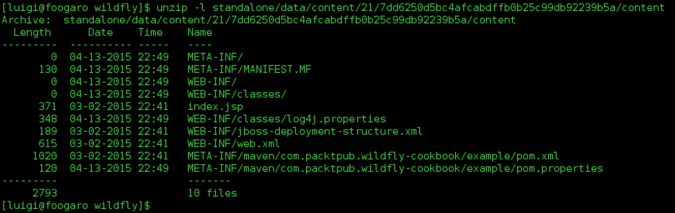

## 更多内容...

你也可以部署一个禁用、状态停止的工件，并在方便的时候启用它，如下所示：

```java
[standalone@localhost:9990 /] deploy example.war --disabled
```

这将仅将工件添加到您运行模式下的 WildFly 的`data/content`文件夹中，以便稍后启用：

```java
[standalone@localhost:9990 /] deploy --name=example.war
```

在`standalone.xml`配置文件内部也有对部署的引用；打开它并向下滚动到末尾。

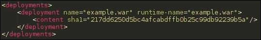

部署后更新的 Standalone.xml

是的，你会找到`name`和`runtime-name`以及哈希值。在*如何工作...*部分，我向你展示了部署实际持久化的位置，在这种情况下，它被存储在`$WILDFLY_HOME/standalone/data/content/`文件夹中。

你注意到了吗？`sha1`值的第一个字符表示第一个文件夹，`sha1`哈希值的其余部分是包含已重命名为`content`的工件的子文件夹。

### 小贴士

获取原始部署文件有时可以救你一命，尤其是在处理生产环境时，最后一刻的工作并没有那么“集成”。请确保备份安全。

现在让我们看看`deployments`文件夹。它是空的。这是因为所有内容都进入了运行时的`data/content`文件夹。尝试停止实例并将`example.war`应用程序复制到`deployments`文件夹。

现在再次启动实例。你得到了什么？类似于以下内容：

```java
23:16:54,708 INFO  [org.jboss.modules] (main) JBoss Modules version 1.4.2.Final
23:16:54,934 INFO  [org.jboss.msc] (main) JBoss MSC version 1.2.4.Final
23:16:55,003 INFO  [org.jboss.as] (MSC service thread 1-6) WFLYSRV0049: WildFly Full 9.0.0.Beta2 (WildFly Core 1.0.0.Beta2) starting
23:16:56,170 INFO  [org.jboss.as.controller.management-deprecated] (ServerService Thread Pool -- 20) WFLYCTL0028: Attribute enabled is deprecated, and it might be removed in future version!
23:16:56,243 ERROR [org.jboss.as.controller.management-operation] (Controller Boot Thread) WFLYCTL0013: Operation ("add") failed - address: ([("deployment" => "example.war")]) - failure description: "WFLYCTL0212: Duplicate resource [(\"deployment\" => \"example.war\")]"
23:16:56,249 FATAL [org.jboss.as.server] (Controller Boot Thread) WFLYSRV0056: Server boot has failed in an unrecoverable manner; exiting. See previous messages for details.
23:16:56,260 INFO  [org.jboss.as.server] (Thread-2) WFLYSRV0220: Server shutdown has been requested.
23:16:56,285 INFO  [org.jboss.as] (MSC service thread 1-3) WFLYSRV0050: WildFly Full 9.0.0.Beta2 (WildFly Core 1.0.0.Beta2) stopped in 16ms
```

这是因为你尝试部署了同一个工件两次，一次使用 CLI，一次使用`deployment`文件夹。有一个名为`deployment-scanner`的监听器，每次你修改`deployment`文件夹的内容时都会被触发。顺便说一句，你可以使用 CLI 解决前面的问题，或者通过将自动生成的 XML 代码移除到`standalone.xml`中，并将工件留在`deployments`文件夹中。

# 通过 CLI 卸载应用程序

在这个菜谱中，我们将学习如何使用 CLI 卸载应用程序。根据`deploy`命令，我们将使用基本可用的选项。我们将在本书的后面深入分析`undeploy`命令。

## 准备工作

这个配方遵循之前的配方，即 *通过 CLI 部署应用程序*。这意味着我们将找到 `example` 应用程序已准备好进行 `undeploy`。如果您跳过了之前的配方，请遵循它提供的说明，或者您可以提供自己要卸载的应用程序。

## 如何操作...

1.  当您的 WildFly 实例运行时，打开终端并像往常一样连接到 CLI：

    ```java
    $ ./bin/jboss-cli.sh --connect
    [standalone@localhost:9990 /]
    ```

1.  现在我们需要告诉 CLI 按以下方式卸载我们的应用程序：

    ```java
    [standalone@localhost:9990 /] undeploy example.war
    [standalone@localhost:9990 /]
    ```

1.  并且 `server.log` 记录以下内容：

    ```java
    23:19:50,912 INFO  [org.wildfly.extension.undertow] (MSC service thread 1-4) WFLYUT0022: Unregistered web context: /example
    23:19:50,961 INFO  [org.hibernate.validator.internal.util.Version] (MSC service thread 1-2) HV000001: Hibernate Validator 5.1.3.Final
    23:19:51,010 INFO  [org.jboss.as.server.deployment] (MSC service thread 1-5) WFLYSRV0028: Stopped deployment example.war (runtime-name: example.war) in 115ms
    23:19:51,058 INFO  [org.jboss.as.repository] (management-handler-thread - 1) WFLYDR0002: Content removed from location /home/luigi/WFC/wildfly/standalone/data/content/21/7dd6250d5bc4afcabdffb0b25c99db92239b5a/content
    23:19:51,059 INFO  [org.jboss.as.server] (management-handler-thread - 1) WFLYSRV0009: Undeployed "example.war" (runtime-name: "example.war")
    ```

## 还有更多...

如果您复制并粘贴了之前的命令，您可能没有注意到 `undeploy` 命令的一个有用功能。

您可以告诉 CLI 首先列出所有部署，这样您就可以使用以下命令选择正确的要卸载的应用程序：

```java
[standalone@localhost:9990 /] undeploy -l
NAME        RUNTIME-NAME ENABLED STATUS
example.war example.war  true    OK     

[standalone@localhost:9990 /]
```

# 通过 CLI 批处理模式执行命令

在这个配方中，我们将学习如何在批处理模式下调用命令。实际上，您可以声明并准备一个要执行的命令列表，并一次性按顺序执行它们。批处理模式使您的操作和配置保持一致性。

## 准备工作

让我们的 WildFly 实例运行起来；从我们下载 GitHub 存储库的文件夹 `WFC/github/wildfly-cookbook`，将 `example.war` 和 `simple.war` 应用程序复制到 `$JBOSS_HOME` 文件夹，并连接到 CLI。

如果您能找到应用程序，您可能需要编译项目。我将向您展示如何为 `simple` 应用程序操作，其他应用程序也是如此。打开终端并按以下步骤操作：

```java
$ cd ~/WFC/github/wildfly-cookbook
$ cd simple
$ mvn -e clean package

$ cp target/simple.war ~/WFC/wildfly/
```

## 如何操作...

我们将按以下顺序执行以下操作：

1.  部署 `example.war`。

1.  部署 `simple.war`。

1.  让我们去 CLI：

    ```java
    $ cd ~/WFC/wildfly
    $ ./bin/jboss-cli.sh --connect
    [standalone@localhost:9990 /] batch
    [standalone@localhost:9990 / #] deploy example.war
    [standalone@localhost:9990 / #] deploy simple.war
    [standalone@localhost:9990 / #] run-batch
    The batch executed successfully
    [standalone@localhost:9990 /]
    ```

1.  并且 `server.log` 记录以下内容：

    ```java
    ...
    07:33:02,191 INFO  [org.jboss.as.repository] (management-handler-thread - 4) JBAS014900: Content added at location /home/lfugaro/wildfly/standalone/data/content/7a/a7c67cb54e0affa9d60cf98230e0c17efd1119/content
    07:33:02,205 INFO  [org.jboss.as.repository] (management-handler-thread - 4) JBAS014900: Content added at location /home/lfugaro/wildfly/standalone/data/content/e0/2abb62b1b29f97f532ef1501910d64af194b21/content
    07:33:02,227 INFO  [org.jboss.as.server.deployment] (MSC service thread 1-2) JBAS015876: Starting deployment of "simple.war" (runtime-name: "simple.war")
    07:33:02,227 INFO  [org.jboss.as.server.deployment] (MSC service thread 1-7) JBAS015876: Starting deployment of "example.war" (runtime-name: "example.war")
    07:33:02,689 INFO  [org.wildfly.extension.undertow] (MSC service thread 1-1) JBAS017534: Registered web context: /simple
    07:33:02,689 INFO  [org.wildfly.extension.undertow] (MSC service thread 1-6) JBAS017534: Registered web context: /example
    07:33:02,746 INFO  [org.jboss.as.server] (management-handler-thread - 4) JBAS018559: Deployed "simple.war" (runtime-name : "simple.war")
    07:33:02,746 INFO  [org.jboss.as.server] (management-handler-thread - 4) JBAS018559: Deployed "example.war" (runtime-name : "example.war")
    ```

# 通过 CLI 重新加载服务器配置

在这个配方中，我们将学习如何在无需完全重启的情况下重新加载服务器配置。通常，有一些更改需要重新加载服务器。大多数时候，您会在服务器启动后或测试期间意识到某个特定设置需要不同的值。因此，您无需停止和启动整个应用程序服务器，只需重新加载配置即可，除非更改涉及 JVM 或启动时需要的设置。

## 准备工作

我们已经看到如何在玩 IP 和端口绑定时重新加载服务器，但再次提一下。

## 如何操作...

命令本身很简单：

```java
$ ./bin/jboss-cli.sh --connect
[standalone@localhost:9990 /] reload
[standalone@localhost:9990 /]
```

## 它是如何工作的...

基本上，`reload` 命令按顺序发出 `stop` 命令，停止所有 WildFly 活动服务，然后发出 `start` 命令，再次启动服务。这应该给您提供重要信息。JVM 保持不变。如果您在发出 `reload` 命令前后在操作系统级别测试活动进程，您将注意到进程 ID 是相同的。

```java
$ ps -efa | grep java | grep -v grep
luigi     4915  4879 80 16:07 pts/3    00:00:11 /home/luigi/WFC/jdk8/bin/java -D[Standalone] -server -Xms64m -Xmx512m -XX:MaxPermSize=256m -Djava.net.preferIPv4Stack=true -Djboss.modules.system.pkgs=org.jboss.byteman -Djava.awt.headless=true -Dorg.jboss.boot.log.file=/home/luigi/WFC/wildfly/standalone/log/server.log -Dlogging.configuration=file:/home/luigi/WFC/wildfly/standalone/configuration/logging.properties -jar /home/luigi/WFC/wildfly/jboss-modules.jar -mp /home/luigi/WFC/wildfly/modules org.jboss.as.standalone -Djboss.home.dir=/home/luigi/WFC/wildfly -Djboss.server.base.dir=/home/luigi/WFC/wildfly/standalone
luigi     5031  5023 36 16:07 pts/2    00:00:01 /home/luigi/WFC/jdk8/bin/java -Djboss.modules.system.pkgs=com.sun.java.swing -Dlogging.configuration=file:/home/luigi/WFC/wildfly/bin/jboss-cli-logging.properties -jar /home/luigi/WFC/wildfly/jboss-modules.jar -mp /home/luigi/WFC/wildfly/modules org.jboss.as.cli --connect
```

最后但同样重要的是，您的 CLI 不会断开连接。

# 通过 CLI 关闭和重新启动实例

在这个食谱中，我们将学习如何通过 CLI 停止 WildFly 实例，或者通过 CLI 重新启动它。重新启动选项与上一个食谱中的 `reload` 命令相反。

## 准备工作

启动你的 WildFly，以便我们可以通过 CLI 直接连接到它，如下所示：

```java
$ cd ~/WFC/wildfly
$ ./bin/standalone.sh
```

## 如何操作…

命令本身很简单：

```java
$ ./bin/jboss-cli.sh --connect
[standalone@localhost:9990 /] shutdown
[disconnected /]
```

## 工作原理…

前面的命令停止了一切并将你从 CLI 中移除。因此，如果你需要重新启动你的 WildFly 实例，你需要再次执行 `standalone.sh` 脚本，以及任何之前定义的参数。

## 还有更多...

或者，如果你真正需要的是完全停止和启动，你可以依靠 `shutdown` 命令的 `--restart=true` 选项。

在使用带有 `restart` 选项的 `shutdown` 命令之前，注意 WildFly 实例的进程 ID (PID)，如下所示：

```java
$ ps -efa | grep java | grep -v grep
luigi     5031  5023  0 16:07 pts/2    00:00:03 /home/luigi/WFC/jdk8/bin/java -Djboss.modules.system.pkgs=com.sun.java.swing -Dlogging.configuration=file:/home/luigi/WFC/wildfly/bin/jboss-cli-logging.properties -jar /home/luigi/WFC/wildfly/jboss-modules.jar -mp /home/luigi/WFC/wildfly/modules org.jboss.as.cli --connect
luigi     5285  5249 99 16:29 pts/3    00:00:09 /home/luigi/WFC/jdk8/bin/java -D[Standalone] -server -Xms64m -Xmx512m -XX:MaxPermSize=256m -Djava.net.preferIPv4Stack=true -Djboss.modules.system.pkgs=org.jboss.byteman -Djava.awt.headless=true -Dorg.jboss.boot.log.file=/home/luigi/WFC/wildfly/standalone/log/server.log -Dlogging.configuration=file:/home/luigi/WFC/wildfly/standalone/configuration/logging.properties -jar /home/luigi/WFC/wildfly/jboss-modules.jar -mp /home/luigi/WFC/wildfly/modules org.jboss.as.standalone -Djboss.home.dir=/home/luigi/WFC/wildfly -Djboss.server.base.dir=/home/luigi/WFC/wildfly/standalone
```

好的，现在回到 CLI，按照以下步骤操作：

```java
[standalone@localhost:9990 /] shutdown --restart=true
[standalone@localhost:9990 /]
```

第一个明显的区别是，你的 CLI 不会断开连接。现在让我们回到终端，列出操作系统级别的可用进程，就像之前做的那样：

```java
$ ps -efa | grep java | grep -v grep
luigi     5421  5413 10 16:29 pts/2    00:00:01 /home/luigi/WFC/jdk8/bin/java -Djboss.modules.system.pkgs=com.sun.java.swing -Dlogging.configuration=file:/home/luigi/WFC/wildfly/bin/jboss-cli-logging.properties -jar /home/luigi/WFC/wildfly/jboss-modules.jar -mp /home/luigi/WFC/wildfly/modules org.jboss.as.cli --connect
luigi     5482  5249 99 16:29 pts/3    00:00:10 /home/luigi/WFC/jdk8/bin/java -D[Standalone] -server -Xms64m -Xmx512m -XX:MaxPermSize=256m -Djava.net.preferIPv4Stack=true -Djboss.modules.system.pkgs=org.jboss.byteman -Djava.awt.headless=true -Dorg.jboss.boot.log.file=/home/luigi/WFC/wildfly/standalone/log/server.log -Dlogging.configuration=file:/home/luigi/WFC/wildfly/standalone/configuration/logging.properties -jar /home/luigi/WFC/wildfly/jboss-modules.jar -mp /home/luigi/WFC/wildfly/modules org.jboss.as.standalone -Djboss.home.dir=/home/luigi/WFC/wildfly -Djboss.server.base.dir=/home/luigi/WFC/wildfly/standalone
```

这可能是与 `reload` 命令最重要的区别。你将获得一个全新的 JVM，操作系统级别的不同进程 ID。前面的命令在 CLI 中完全关闭了当前实例并启动了一个新的实例，如下面的日志条目所示：

```java
...
10:43:31,997 INFO  [org.jboss.as.server] (management-handler-thread - 2) WFLYSRV0211: Suspending server
10:43:32,002 INFO  [org.jboss.as.server] (Thread-2) WFLYSRV0220: Server shutdown has been requested.
10:43:32,016 INFO  [org.wildfly.extension.undertow] (MSC service thread 1-10) WFLYUT0019: Host default-host stopping
10:43:32,017 INFO  [org.jboss.as.connector.subsystems.datasources] (MSC service thread 1-1) WFLYJCA0010: Unbound data source [java:jboss/datasources/ExampleDS]
10:43:32,025 INFO  [org.jboss.as.connector.deployers.jdbc] (MSC service thread 1-11) WFLYJCA0019: Stopped Driver service with driver-name = h2
10:43:32,058 INFO  [org.wildfly.extension.undertow] (MSC service thread 1-1) WFLYUT0008: Undertow HTTP listener default suspending
10:43:32,065 INFO  [org.wildfly.extension.undertow] (MSC service thread 1-1) WFLYUT0007: Undertow HTTP listener default stopped, was bound to /0.0.0.0:8080
10:43:32,066 INFO  [org.wildfly.extension.undertow] (MSC service thread 1-5) WFLYUT0004: Undertow 1.2.0.Beta10 stopping
10:43:32,152 INFO  [org.jboss.as] (MSC service thread 1-2) WFLYSRV0050: WildFly Full 9.0.0.Beta2 (WildFly Core 1.0.0.Beta2) stopped in 130ms
Restarting JBoss...
Java HotSpot(TM) 64-Bit Server VM warning: ignoring option MaxPermSize=256m; support was removed in 8.0
10:43:32,639 INFO  [org.jboss.modules] (main) JBoss Modules version 1.4.2.Final
10:43:32,858 INFO  [org.jboss.msc] (main) JBoss MSC version 1.2.4.Final
10:43:32,936 INFO  [org.jboss.as] (MSC service thread 1-7) WFLYSRV0049: WildFly Full 9.0.0.Beta2 (WildFly Core 1.0.0.Beta2) starting
10:43:34,064 INFO  [org.jboss.as.controller.management-deprecated] (ServerService Thread Pool -- 22) WFLYCTL0028: Attribute enabled is deprecated, and it might be removed in future version!
10:43:34,088 INFO  [org.jboss.as.server] (Controller Boot Thread) WFLYSRV0039: Creating http management service using socket-binding (management-http)
10:43:34,120 INFO  [org.xnio] (MSC service thread 1-2) XNIO version 3.3.0.Final
10:43:34,130 INFO  [org.xnio.nio] (MSC service thread 1-2) XNIO NIO Implementation Version 3.3.0.Final
10:43:34,186 INFO  [org.jboss.as.clustering.infinispan] (ServerService Thread Pool -- 38) WFLYCLINF0001: Activating Infinispan subsystem.
10:43:34,185 INFO  [org.wildfly.extension.io] (ServerService Thread Pool -- 37) WFLYIO001: Worker 'default' has auto-configured to 16 core threads with 128 task threads based on your 8 available processors
10:43:34,193 INFO  [org.jboss.remoting] (MSC service thread 1-2) JBoss Remoting version 4.0.8.Final
10:43:34,220 INFO  [org.jboss.as.naming] (ServerService Thread Pool -- 46) WFLYNAM0001: Activating Naming Subsystem
10:43:34,230 INFO  [org.jboss.as.security] (ServerService Thread Pool -- 53) WFLYSEC0002: Activating Security Subsystem
10:43:34,228 INFO  [org.jboss.as.connector.subsystems.datasources] (ServerService Thread Pool -- 33) WFLYJCA0004: Deploying JDBC-compliant driver class org.h2.Driver (version 1.3)
10:43:34,242 WARN  [org.jboss.as.txn] (ServerService Thread Pool -- 54) WFLYTX0013: Node identifier property is set to the default value. Please make sure it is unique.
10:43:34,242 INFO  [org.jboss.as.security] (MSC service thread 1-10) WFLYSEC0001: Current PicketBox version=4.9.0.Beta2
10:43:34,245 INFO  [org.jboss.as.jsf] (ServerService Thread Pool -- 44) WFLYJSF0007: Activated the following JSF Implementations: [main]
10:43:34,294 INFO  [org.jboss.as.webservices] (ServerService Thread Pool -- 56) WFLYWS0002: Activating WebServices Extension
10:43:34,311 INFO  [org.wildfly.extension.undertow] (ServerService Thread Pool -- 55) WFLYUT0003: Undertow 1.2.0.Beta10 starting
10:43:34,328 INFO  [org.wildfly.extension.undertow] (MSC service thread 1-3) WFLYUT0003: Undertow 1.2.0.Beta10 starting
10:43:34,305 INFO  [org.jboss.as.connector] (MSC service thread 1-7) WFLYJCA0009: Starting JCA Subsystem (IronJacamar 1.2.3.Final)
10:43:34,350 INFO  [org.jboss.as.connector.deployers.jdbc] (MSC service thread 1-9) WFLYJCA0018: Started Driver service with driver-name = h2
10:43:34,421 INFO  [org.jboss.as.naming] (MSC service thread 1-12) WFLYNAM0003: Starting Naming Service
10:43:34,421 INFO  [org.jboss.as.mail.extension] (MSC service thread 1-14) WFLYMAIL0001: Bound mail session [java:jboss/mail/Default]
10:43:34,616 INFO  [org.wildfly.extension.undertow] (ServerService Thread Pool -- 55) WFLYUT0014: Creating file handler for path /home/wildfly/WFC/wildfly/welcome-content
10:43:34,651 INFO  [org.wildfly.extension.undertow] (MSC service thread 1-16) WFLYUT0012: Started server default-server.
10:43:34,670 INFO  [org.wildfly.extension.undertow] (MSC service thread 1-16) WFLYUT0018: Host default-host starting
10:43:34,749 INFO  [org.wildfly.extension.undertow] (MSC service thread 1-11) WFLYUT0006: Undertow HTTP listener default listening on /0.0.0.0:8080
10:43:34,882 INFO  [org.jboss.as.connector.subsystems.datasources] (MSC service thread 1-2) WFLYJCA0001: Bound data source [java:jboss/datasources/ExampleDS]
10:43:34,948 INFO  [org.jboss.as.server.deployment.scanner] (MSC service thread 1-5) WFLYDS0013: Started FileSystemDeploymentService for directory /home/wildfly/WFC/wildfly/standalone/deployments
10:43:35,080 INFO  [org.jboss.ws.common.management] (MSC service thread 1-2) JBWS022052: Starting JBoss Web Services - Stack CXF Server 5.0.0.Beta3
[standalone@localhost:9990 /] 10:43:35,314 INFO  [org.jboss.as] (Controller Boot Thread) WFLYSRV0060: Http management interface listening on http://0.0.0.0:9990/management
10:43:35,320 INFO  [org.jboss.as] (Controller Boot Thread) WFLYSRV0051: Admin console listening on http://0.0.0.0:9990
10:43:35,321 INFO  [org.jboss.as] (Controller Boot Thread) WFLYSRV0025: WildFly Full 9.0.0.Beta2 (WildFly Core 1.0.0.Beta2) started in 2990ms - Started 202 of 379 services (210 services are lazy, passive or on-demand)
```

记住，PID 会改变，所以如果你是按照 PID 监控你的实例，请考虑更新你的监控工具/脚本！

# 通过 CLI 暂停和恢复实例

在这个食谱中，我们将学习如何在不终止活动请求的情况下挂起一个实例。一旦运行中的请求完成，下一个请求将不会被接受。这是 WildFly 9 中的一项新功能。

## 准备工作

为了测试这个食谱，我们需要名为 `grace` 的应用程序，你可以在我的 GitHub 仓库中找到它。如果你跳过了 *使用部署文件夹管理应用程序* 的食谱，请参考它以下载所有所需的源代码和项目。

启动你的 WildFly，以便我们可以通过 CLI 直接连接到它，如下所示：

```java
$ cd ~/WFC/wildfly
$ ./bin/standalone.sh
```

## 如何操作…

1.  首先，部署应用程序 `grace.war`。一旦应用程序被部署，使用浏览器在以下 URL 打开它 `http://127.0.0.1:8080/grace`

    这将访问 `index.jsp` 页面，该页面增加一个计数器然后休眠 10 秒，只是为了模拟一个长时间运行的请求。

1.  在运行时，打开一个终端窗口并像往常一样连接到 CLI。一旦进入，按照以下步骤操作：

    ```java
    $ ./bin/jboss-cli.sh --connect
    [standalone@localhost:9990 /] :suspend
    ```

1.  现在，回到浏览器上，你的请求应该已经完成，你应该会看到一个类似于以下页面的页面：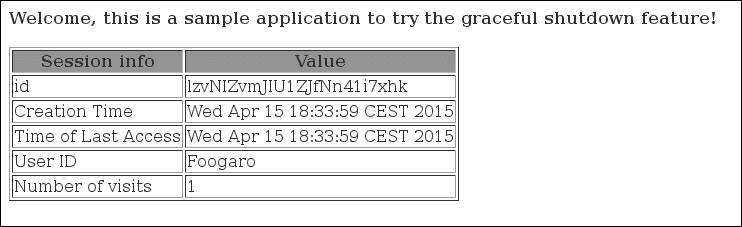

1.  另一方面，要恢复实例，只需调用以下命令：

    ```java
    [standalone@localhost:9990 /] :resume
    ```

## 工作原理…

命令本身很简单。你应该知道下一个用户的请求会发生什么。下一个用户会看到以下页面：

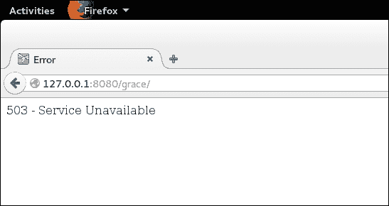

显然，你可以通过一个特殊的页面来处理 HTTP **503** 状态码，警告用户由于系统升级导致的技術问题。

在 WildFly 日志中你应该捕获以下条目：

```java
16:38:05,374 INFO  [org.jboss.as.server] (management-handler-thread - 7) WFLYSRV0211: Suspending server
```

`resume`命令也很简单。需要注意的一点是，用户不会丢失他当前和活跃的会话，这对于用户来说是一个非常好的特性。

在 WildFly 日志中，你应该捕获以下条目：

```java
16:38:25,347 INFO  [org.jboss.as.server] (management-handler-thread - 8) WFLYSRV0212: Resuming server
```

现在，如果你回到应用程序并刷新页面，你应该看到计数器从停止的地方开始增加，如图所示：

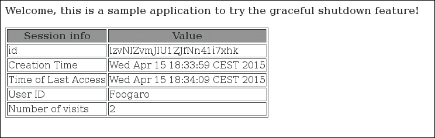

# 通过 CLI 备份配置文件

在这个菜谱中，我们将学习如何通过 CLI 备份我们的配置。本质上，CLI 通过将其复制到`snapshot`目录来备份`standalone.xml`文件。

## 准备工作

启动你的 WildFly，以便我们可以通过 CLI 直接连接到它，如下所示：

```java
$ cd ~/WFC/wildfly
$ ./bin/standalone.sh
```

## 如何操作...

命令本身很简单：

```java
$ ./bin/jboss-cli.sh --connect
[standalone@localhost:9990 /] :take-snapshot  
{
    "outcome" => "success",
    "result" => "/home/luigi/WFC/wildfly/standalone/configuration/standalone_xml_history/snapshot/20150301-165737562standalone.xml"
}
```

就这样！`standalone.xml`文件的备份被复制到`snapshot`文件夹中，文件名以当前日期和时间作为前缀。

### 小贴士

总是备份你的配置，尤其是在生产环境中操作时。
