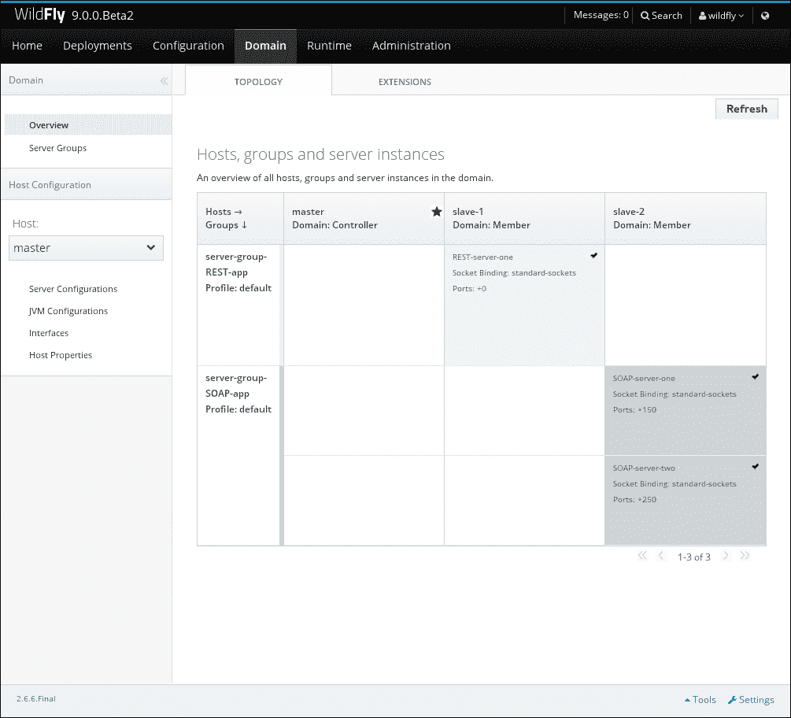

# 第三章。在域模式下运行 WildFly

在本章中，你将学习以下内容：

+   运行域模式

+   将主机控制器连接到域控制器

+   通过 Web 控制台停止和启动服务器组

+   通过 CLI 停止和启动你的服务器组

+   通过 CLI 停止和启动你的服务器

+   通过 Web 控制台将应用程序部署和取消部署到特定的服务器组

+   通过 CLI 将应用程序部署和取消部署到特定的服务器组

+   通过 CLI 检查服务器状态

# 简介

在本章中，你将学习如何管理在域模式下运行的 WildFly。你还将学习如何通过 CLI 和 Web 控制台对其进行配置和管理。我们还将回顾适用于域模式的独立章节中的一些主题。如果你想了解以下主题，可以参考本书的*附录*部分：

+   域模式和服务器组

+   理解`domain.xml`的结构

+   理解`host.xml`的结构

### 注意

在本章中，所有示例和内容都使用第一章中描述的 WildFly 安装，即*欢迎来到 WildFly！*，该链接指向`$WILDFLY_HOME`变量。

# 运行域模式

在本食谱中，我们将学习如何在域模式下运行 WildFly。有几个概念你需要了解——域控制器、主机控制器和服务器组。然而，这些概念都在本书的*附录*部分中解释。

## 准备工作

WildFly 附带预配置的`domain.xml`和`host.xml`文件。定义了两个服务器组：一个名为`main-server-group`，引用了`full`配置文件；另一个名为`other-server-group`，引用了`full-ha`配置文件。


`domain.xml`中的服务器组

然后每个服务器组都通过服务器或主机列表引用到`host.xml`文件中。


在 host.xml 中声明的服务器

如前述 XML 代码片段所示，每个服务器定义都使用属性`group`引用服务器组成员资格。此外，`auto-start`属性定义服务器是否会自动启动，或者是否需要从管理控制台或通过 CLI 手动启动。

## 如何操作…

只需打开你的命令行，然后按照以下方式在域模式下启动 WildFly：

```java
$ cd $WILDFLY_HOME
$ ./bin/domain.sh
...
22:22:53,403 INFO  [org.jboss.modules] (main) JBoss Modules version 1.4.2.Final
22:22:53,525 INFO  [org.jboss.as.process.Host Controller.status] (main) WFLYPC0018: Starting process 'Host Controller'
[Host Controller] Java HotSpot(TM) 64-Bit Server VM warning: ignoring option MaxPermSize=256m; support was removed in 8.0
[Host Controller] 22:22:53,960 INFO  [org.jboss.modules] (main) JBoss Modules version 1.4.2.Final
[Host Controller] 22:22:54,131 INFO  [org.jboss.msc] (main) JBoss MSC version 1.2.4.Final
[Host Controller] 22:22:54,168 INFO  [org.jboss.as] (MSC service thread 1-7) WFLYSRV0049: WildFly Full 9.0.0.Beta2 (WildFly Core 1.0.0.Beta2) starting
...
22:22:56,441 INFO  [org.jboss.as.process.Server:server-one.status] (ProcessController-threads - 3) WFLYPC0018: Starting process 'Server:server-one'
...
[Host Controller] 22:22:58,352 INFO  [org.jboss.as.domain.controller.mgmt] (Remoting "master:MANAGEMENT" task-4) WFLYHC0021: Server [Server:server-one] connected using connection [Channel ID 075c2e34 (inbound) of Remoting connection 2865b4ba to /127.0.0.1:37199]
[Host Controller] 22:22:58,407 INFO  [org.jboss.as.host.controller] (Controller Boot Thread) WFLYHC0023: Starting server server-two
[Host Controller] 22:22:58,444 INFO  [org.jboss.as.host.controller] (server-registration-threads - 1) WFLYHC0020: Registering server server-one
22:22:58,457 INFO  [org.jboss.as.process.Server:server-two.status] (ProcessController-threads - 3) WFLYPC0018: Starting process 'Server:server-two'
...
[Server:server-one] 22:23:04,175 INFO  [org.jboss.as] (Controller Boot Thread) WFLYSRV0025: WildFly Full 9.0.0.Beta2 (WildFly Core 1.0.0.Beta2) started in 7642ms - Started 229 of 405 services (217 services are lazy, passive or on-demand)
...
[Server:server-two] 22:23:07,024 INFO  [org.jboss.as] (Controller Boot Thread) WFLYSRV0025: WildFly Full 9.0.0.Beta2 (WildFly Core 1.0.0.Beta2) started in 8229ms - Started 229 of 405 services (217 services are lazy, passive or on-demand)
```

访问管理控制台，你可以看到**server-one**和**server-two**正在运行，而**server-three**仍然处于停止状态，如下面的图像所示：


## 它是如何工作的…

当你在域模式下启动 WildFly 时，脚本会启动 WildFly，它会查找其默认的配置文件。默认情况下，它会查找`domain.xml`和`host.xml`文件。当 WildFly 找到这两个文件时，它会解析它们，并开始启动配置文件中所需和声明的所有服务。

在操作系统层面，当你以域模式启动 WildFly 时，实际上是在启动一个名为`Process Controller`的进程，它必须启动另一个名为`Host Controller`的进程。`Host Controller`负责管理服务器配置以及启动在`host.xml`文件中声明的 WildFly 实例，即服务器。

根据[`weblogs.java.net/blog/arungupta/archive/2014/05/30/wildfly-managed-domain-raspberry-pi-tech-tip-27`](https://weblogs.java.net/blog/arungupta/archive/2014/05/30/wildfly-managed-domain-raspberry-pi-tech-tip-27)，

> *一个主机控制器实例被配置为充当域控制器。每个主机上的主机控制器，作为远程服务器（无论是物理的还是虚拟的），与域控制器交互，以控制其主机上运行的应用服务器实例的生命周期，并协助域控制器管理它们。*

如果你检查操作系统层面正在运行的进程，你可以看到以下内容：

```java
wildfly   1525  1429  7 08:26 ?        00:00:01 /home/wildfly/WFC/jdk8/bin/java -D[Process Controller] -server -Xms64m -Xmx512m -XX:MaxPermSize=256m -Djava.net.preferIPv4Stack=true -Djboss.modules.system.pkgs=org.jboss.byteman -Djava.awt.headless=true -Dorg.jboss.boot.log.file=/home/wildfly/WFC/wildfly/domain/log/process-controller.log -Dlogging.configuration=file:/home/wildfly/WFC/wildfly/domain/configuration/logging.properties -jar /home/wildfly/WFC/wildfly/jboss-modules.jar -mp /home/wildfly/WFC/wildfly/modules org.jboss.as.process-controller -jboss-home /home/wildfly/WFC/wildfly -jvm /home/wildfly/WFC/jdk8/bin/java -mp /home/wildfly/WFC/wildfly/modules -- -Dorg.jboss.boot.log.file=/home/wildfly/WFC/wildfly/domain/log/host-controller.log -Dlogging.configuration=file:/home/wildfly/WFC/wildfly/domain/configuration/logging.properties -server -Xms64m -Xmx512m -XX:MaxPermSize=256m -Djava.net.preferIPv4Stack=true -Djboss.modules.system.pkgs=org.jboss.byteman -Djava.awt.headless=true -- -default-jvm /home/wildfly/WFC/jdk8/bin/java
wildfly   1542  1525 62 08:26 ?        00:00:10 /home/wildfly/WFC/jdk8/bin/java -D[Host Controller] -Dorg.jboss.boot.log.file=/home/wildfly/WFC/wildfly/domain/log/host-controller.log -Dlogging.configuration=file:/home/wildfly/WFC/wildfly/domain/configuration/logging.properties -server -Xms64m -Xmx512m -XX:MaxPermSize=256m -Djava.net.preferIPv4Stack=true -Djboss.modules.system.pkgs=org.jboss.byteman -Djava.awt.headless=true -jar /home/wildfly/WFC/wildfly/jboss-modules.jar -mp /home/wildfly/WFC/wildfly/modules org.jboss.as.host-controller -mp /home/wildfly/WFC/wildfly/modules --pc-address 127.0.0.1 --pc-port 56310 -default-jvm /home/wildfly/WFC/jdk8/bin/java -Djboss.home.dir=/home/wildfly/WFC/wildfly
wildfly   1611  1525 99 08:26 ?        00:00:22 /home/wildfly/WFC/jdk8/bin/java -D[Server:server-one] -Xms64m -Xmx512m -server -Djava.awt.headless=true -Djava.net.preferIPv4Stack=true -Djboss.home.dir=/home/wildfly/WFC/wildfly -Djboss.modules.system.pkgs=org.jboss.byteman -Djboss.server.log.dir=/home/wildfly/WFC/wildfly/domain/servers/server-one/log -Djboss.server.temp.dir=/home/wildfly/WFC/wildfly/domain/servers/server-one/tmp -Djboss.server.data.dir=/home/wildfly/WFC/wildfly/domain/servers/server-one/data -Dlogging.configuration=file:/home/wildfly/WFC/wildfly/domain/servers/server-one/data/logging.properties -jar /home/wildfly/WFC/wildfly/jboss-modules.jar -mp /home/wildfly/WFC/wildfly/modules org.jboss.as.server
wildfly   1657  1525 99 08:26 ?        00:00:22 /home/wildfly/WFC/jdk8/bin/java -D[Server:server-two] -Xms64m -Xmx512m -server -Djava.awt.headless=true -Djava.net.preferIPv4Stack=true -Djboss.home.dir=/home/wildfly/WFC/wildfly -Djboss.modules.system.pkgs=org.jboss.byteman -Djboss.server.log.dir=/home/wildfly/WFC/wildfly/domain/servers/server-two/log -Djboss.server.temp.dir=/home/wildfly/WFC/wildfly/domain/servers/server-two/tmp -Djboss.server.data.dir=/home/wildfly/WFC/wildfly/domain/servers/server-two/data -Dlogging.configuration=file:/home/wildfly/WFC/wildfly/domain/servers/server-two/data/logging.properties -jar /home/wildfly/WFC/wildfly/jboss-modules.jar -mp /home/wildfly/WFC/wildfly/modules org.jboss.as.server
```

在之前的控制台输出中，我强调了进程 ID 及其 JVM 名称，总结如下：

| 进程 ID | 父进程 ID | JVM 名称 | 描述 |
| --- | --- | --- | --- |
| `1525` | `1429` | `Process Controller` | 这是负责创建主机控制器和启动服务器的主要进程。它还负责在主机控制器崩溃的情况下重新创建主机控制器。其父进程 ID 是启动它的`domain.sh`bash 脚本进程。 |
| `1542` | `1525` | `Host Controller` | 这是管理在`host.xml`文件中定义的所有主机的进程。 |
| `1611` | `1525` | `Server:server-one` | 这是名为`server-one`的主机的 JVM。 |
| `1657` | `1525` | `Server:server-two` | 这是名为`server-two`的主机的 JVM。 |

## 还有更多...

如`Process Controller` JVM 的描述中所述，这是生成主机控制器和名为`server-one`和`server-two`的 WildFly 实例的主要进程。在操作系统层面，这意味着如果 PC 崩溃，所有其子进程也会随之关闭。

相反，如果`Host Controller`崩溃，真实的 WildFly 实例不会受到影响，它们将继续运行并服务于你的客户端。此外，当`Host Controller`崩溃时，`Process Controller`负责重新启动它。让我给你演示一下。

在不同的终端中，终止与`Host Controller` ID 匹配的进程，在这个例子中是`1542`：

```java
$ kill -9 1542
```

在你以域模式启动 WildFly 的终端中，你应该看到以下日志条目：

```java
[Host Controller]
08:30:41,738 INFO  [org.jboss.as.process.Host Controller.status] (reaper for Host Controller) WFLYPC0011: Process 'Host Controller' finished with an exit status of 137
08:30:41,740 INFO  [org.jboss.as.process-controller.server] (reaper for Host Controller) WFLYPC0021: Waiting 1 seconds until trying to restart process Host Controller.
08:30:42,742 INFO  [org.jboss.as.process.Host Controller.status] (reaper for Host Controller) WFLYPC0018: Starting process 'Host Controller'
[Host Controller] Java HotSpot(TM) 64-Bit Server VM warning: ignoring option MaxPermSize=256m; support was removed in 8.0
[Host Controller] 08:30:43,205 INFO  [org.jboss.modules] (main) JBoss Modules version 1.4.2.Final
[Host Controller] 08:30:43,376 INFO  [org.jboss.msc] (main) JBoss MSC version 1.2.4.Final
[Host Controller] 08:30:43,414 INFO  [org.jboss.as] (MSC service thread 1-7) WFLYSRV0049: WildFly Full 9.0.0.Beta2 (WildFly Core 1.0.0.Beta2) starting
[Host Controller] 08:30:44,005 INFO  [org.xnio] (MSC service thread 1-1) XNIO version 3.3.0.Final
[Host Controller] 08:30:44,007 INFO  [org.jboss.as] (Controller Boot Thread) WFLYHC0003: Creating http management service using network interface (management) port (9990) securePort (-1)
[Host Controller] 08:30:44,014 INFO  [org.xnio.nio] (MSC service thread 1-1) XNIO NIO Implementation Version 3.3.0.Final
[Host Controller] 08:30:44,146 INFO  [org.jboss.remoting] (MSC service thread 1-1) JBoss Remoting version 4.0.8.Final
[Host Controller] 08:30:44,178 INFO  [org.jboss.as.remoting] (MSC service thread 1-6) WFLYRMT0001: Listening on 127.0.0.1:9999
[Host Controller] 08:30:45,096 INFO  [org.jboss.as.controller.management-deprecated] (Controller Boot Thread) WFLYCTL0028: Attribute enabled is deprecated, and it might be removed in future version!
[Host Controller] 08:30:45,151 INFO  [org.jboss.as.controller.management-deprecated] (Controller Boot Thread) WFLYCTL0028: Attribute enabled is deprecated, and it might be removed in future version!
[Host Controller] 08:30:45,159 INFO  [org.jboss.as.controller.management-deprecated] (Controller Boot Thread) WFLYCTL0028: Attribute default-stack is deprecated, and it might be removed in future version!
[Host Controller] 08:30:45,167 INFO  [org.jboss.as.controller.management-deprecated] (Controller Boot Thread) WFLYCTL0028: Attribute enabled is deprecated, and it might be removed in future version!
[Host Controller] 08:30:45,181 INFO  [org.jboss.as.controller.management-deprecated] (Controller Boot Thread) WFLYCTL0028: Attribute enabled is deprecated, and it might be removed in future version!
[Host Controller] 08:30:45,185 INFO  [org.jboss.as.controller.management-deprecated] (Controller Boot Thread) WFLYCTL0028: Attribute default-stack is deprecated, and it might be removed in future version!
[Host Controller] 08:30:45,485 INFO  [org.jboss.as.host.controller] (Controller Boot Thread) WFLYHC0018: Reconnecting server server-one
[Host Controller] 08:30:45,486 INFO  [org.jboss.as.host.controller] (Controller Boot Thread) WFLYHC0020: Registering server server-one
[Host Controller] 08:30:45,492 INFO  [org.jboss.as.host.controller] (Controller Boot Thread) WFLYHC0018: Reconnecting server server-two
[Host Controller] 08:30:45,492 INFO  [org.jboss.as.host.controller] (Controller Boot Thread) WFLYHC0020: Registering server server-two
[Host Controller] 08:30:45,507 INFO  [org.jboss.as] (Controller Boot Thread) WFLYSRV0060: Http management interface listening on http://127.0.0.1:9990/management
[Host Controller] 08:30:45,509 INFO  [org.jboss.as] (Controller Boot Thread) WFLYSRV0051: Admin console listening on http://127.0.0.1:9990
[Host Controller] 08:30:45,509 INFO  [org.jboss.as] (Controller Boot Thread) WFLYSRV0025: WildFly Full 9.0.0.Beta2 (WildFly Core 1.0.0.Beta2) (Host Controller) started in 2668ms - Started 50 of 52 services (15 services are lazy, passive or on-demand)
[Host Controller] 08:30:45,982 INFO  [org.jboss.as.domain.controller.mgmt] (Remoting "master:MANAGEMENT" task-7) WFLYHC0021: Server [Server:server-two] connected using connection [Channel ID 3d3f3eed (inbound) of Remoting connection 067bd212 to /127.0.0.1:43342]
[Host Controller] 08:30:45,982 INFO  [org.jboss.as.domain.controller.mgmt] (Remoting "master:MANAGEMENT" task-8) WFLYHC0021: Server [Server:server-one] connected using connection [Channel ID 1448766c (inbound) of Remoting connection 4261cbff to /127.0.0.1:42083]
```

因此，`Process Controller`注意到`Host Controller`崩溃，并启动了一个新的`Host Controller`。正在运行的 WildFly 实例成功重新连接到它们的`Host Controller`。

再次执行命令`ps -efa | grep java`，你将得到与之前类似的过程列表，但`Host Controller`进程将是新的，如下所示：

```java
wildfly   1525  1429  1 08:26 ?        00:00:07 /home/wildfly/WFC/jdk8/bin/java -D[Process Controller] -server -Xms64m -Xmx512m -XX:MaxPermSize=256m -Djava.net.preferIPv4Stack=true -Djboss.modules.system.pkgs=org.jboss.byteman -Djava.awt.headless=true -Dorg.jboss.boot.log.file=/home/wildfly/WFC/wildfly/domain/log/process-controller.log -Dlogging.configuration=file:/home/wildfly/WFC/wildfly/domain/configuration/logging.properties -jar /home/wildfly/WFC/wildfly/jboss-modules.jar -mp /home/wildfly/WFC/wildfly/modules org.jboss.as.process-controller -jboss-home /home/wildfly/WFC/wildfly -jvm /home/wildfly/WFC/jdk8/bin/java -mp /home/wildfly/WFC/wildfly/modules -- -Dorg.jboss.boot.log.file=/home/wildfly/WFC/wildfly/domain/log/host-controller.log -Dlogging.configuration=file:/home/wildfly/WFC/wildfly/domain/configuration/logging.properties -server -Xms64m -Xmx512m -XX:MaxPermSize=256m -Djava.net.preferIPv4Stack=true -Djboss.modules.system.pkgs=org.jboss.byteman -Djava.awt.headless=true -- -default-jvm /home/wildfly/WFC/jdk8/bin/java
wildfly   1611  1525  6 08:26 ?        00:00:29 /home/wildfly/WFC/jdk8/bin/java -D[Server:server-one] -Xms64m -Xmx512m -server -Djava.awt.headless=true -Djava.net.preferIPv4Stack=true -Djboss.home.dir=/home/wildfly/WFC/wildfly -Djboss.modules.system.pkgs=org.jboss.byteman -Djboss.server.log.dir=/home/wildfly/WFC/wildfly/domain/servers/server-one/log -Djboss.server.temp.dir=/home/wildfly/WFC/wildfly/domain/servers/server-one/tmp -Djboss.server.data.dir=/home/wildfly/WFC/wildfly/domain/servers/server-one/data -Dlogging.configuration=file:/home/wildfly/WFC/wildfly/domain/servers/server-one/data/logging.properties -jar /home/wildfly/WFC/wildfly/jboss-modules.jar -mp /home/wildfly/WFC/wildfly/modules org.jboss.as.server
wildfly   1657  1525  6 08:26 ?        00:00:29 /home/wildfly/WFC/jdk8/bin/java -D[Server:server-two] -Xms64m -Xmx512m -server -Djava.awt.headless=true -Djava.net.preferIPv4Stack=true -Djboss.home.dir=/home/wildfly/WFC/wildfly -Djboss.modules.system.pkgs=org.jboss.byteman -Djboss.server.log.dir=/home/wildfly/WFC/wildfly/domain/servers/server-two/log -Djboss.server.temp.dir=/home/wildfly/WFC/wildfly/domain/servers/server-two/tmp -Djboss.server.data.dir=/home/wildfly/WFC/wildfly/domain/servers/server-two/data -Dlogging.configuration=file:/home/wildfly/WFC/wildfly/domain/servers/server-two/data/logging.properties -jar /home/wildfly/WFC/wildfly/jboss-modules.jar -mp /home/wildfly/WFC/wildfly/modules org.jboss.as.server
wildfly   2887  1525  7 08:30 ?        00:00:15 /home/wildfly/WFC/jdk8/bin/java -D[Host Controller] -Dorg.jboss.boot.log.file=/home/wildfly/WFC/wildfly/domain/log/host-controller.log -Dlogging.configuration=file:/home/wildfly/WFC/wildfly/domain/configuration/logging.properties -server -Xms64m -Xmx512m -XX:MaxPermSize=256m -Djava.net.preferIPv4Stack=true -Djboss.modules.system.pkgs=org.jboss.byteman -Djava.awt.headless=true -jar /home/wildfly/WFC/wildfly/jboss-modules.jar -mp /home/wildfly/WFC/wildfly/modules org.jboss.as.host-controller -mp /home/wildfly/WFC/wildfly/modules --pc-address 127.0.0.1 --pc-port 56310 -default-jvm /home/wildfly/WFC/jdk8/bin/java -Djboss.home.dir=/home/wildfly/WFC/wildfly --process-restarted
```

# 连接主机控制器到域控制器

在这个菜谱中，你将学习如何将主机控制器连接到域控制器。我们将把域控制器称为`master`，而将主机控制器称为`slave`。

## 准备就绪

本菜谱的目的是展示如何运行一个域控制器，以及一系列连接到它的其他主机控制器（我们将使用两个主机控制器）。无论域控制器是在同一台机器上还是不同的机器上，连接类型都意味着是“远程”。

对于菜谱，我们将模拟两台机器，为每个将要使用的服务器定义不同的配置文件夹。这对于开发环境来说也是一个好的实践，因为你可以测试一个伪生产场景。然而，由于我们将有一个`Host Controller`进程和一个`Domain Controller`进程同时运行，并且因为它们都负责远程管理，默认的管理接口设置为监听`localhost:9990`，所以我们必须为每个主机控制器分别绑定它们。

在第二章，*以独立模式运行 WildFly*中，我们看到了如何在同一台机器上运行多个 WildFly 实例，但具有不同的 IP 或端口号。这里我们也要做同样的事情。为了简洁，我们将看到如何在不同端口上绑定主机控制器。

最后，连接到域控制器的主机控制器需要进行身份验证。因此，我们需要通过运行`add-user.sh`脚本来创建一个新用户，提供以下截图中的信息：


此用户属于**ManagementRealm**，与第一章中使用的相同，*欢迎来到 WildFly!*创建`wildfly`用户以访问 Web 控制台。

记住最后一行，红色字符，我们稍后将在菜谱中使用。

## 如何做到这一点...

首先，我们需要创建`Domain Controller`和两个`Host Controller`配置文件夹。让我们创建我们的目录结构：

1.  打开你的终端，并按照以下方式输入：

    ```java
    $ cd $WILDFLY_HOME
    $ cp -a domain master
    $ cp -a domain slave-1
    $ cp -a domain slave-2
    $ mv slave-1/configuration/domain.xml slave-1/configuration/domain.xml.unused
    $ mv slave-2/configuration/domain.xml slave-2/configuration/domain.xml.unused
    ```

1.  现在打开`master`目录下的`domain.xml`文件，并将`server-groups`声明替换为以下 XML 代码片段：

    ```java
    <server-groups>
        <server-group name="server-group-REST-app" profile="default">
            <jvm name="default">
                <heap size="64m" max-size="512m"/>
            </jvm>
            <socket-binding-group ref="standard-sockets"/>
        </server-group>
        <server-group name="server-group-SOAP-app" profile="default">
            <jvm name="default">
                <heap size="64m" max-size="512m"/>
            </jvm>
            <socket-binding-group ref="standard-sockets"/>
        </server-group>
    </server-groups>
    ```

1.  在这里，我们正在模拟一个专门针对 RESTful 技术的服务器组，以及一个专门针对 SOAP 技术的服务器组。这只是一个例子。服务器组可能与特定的应用程序或技术（因此有更多应用程序）相匹配；选择取决于你。我的建议是在做出此类决定时尽可能保持一致。

1.  编辑`master`目录下的`host.xml`文件，并删除整个`servers`声明。完成后，按照以下方式运行主服务器：

    ```java
    $ ./bin/domain.sh -Djboss.domain.base.dir=master
    ```

1.  日志应该看起来如下：

    ```java
    08:44:53,589 INFO  [org.jboss.modules] (main) JBoss Modules version 1.4.2.Final
    08:44:53,730 INFO  [org.jboss.as.process.Host Controller.status] (main) WFLYPC0018: Starting process 'Host Controller'
    [Host Controller] Java HotSpot(TM) 64-Bit Server VM warning: ignoring option MaxPermSize=256m; support was removed in 8.0
    [Host Controller] 08:44:54,319 INFO  [org.jboss.modules] (main) JBoss Modules version 1.4.2.Final
    [Host Controller] 08:44:54,503 INFO  [org.jboss.msc] (main) JBoss MSC version 1.2.4.Final
    [Host Controller] 08:44:54,543 INFO  [org.jboss.as] (MSC service thread 1-7) WFLYSRV0049: WildFly Full 9.0.0.Beta2 (WildFly Core 1.0.0.Beta2) starting
    [Host Controller] 08:44:55,145 INFO  [org.xnio] (MSC service thread 1-5) XNIO version 3.3.0.Final
    [Host Controller] 08:44:55,147 INFO  [org.jboss.as] (Controller Boot Thread) WFLYHC0003: Creating http management service using network interface (management) port (9990) securePort (-1)
    [Host Controller] 08:44:55,155 INFO  [org.xnio.nio] (MSC service thread 1-5) XNIO NIO Implementation Version 3.3.0.Final
    [Host Controller] 08:44:55,262 INFO  [org.jboss.remoting] (MSC service thread 1-5) JBoss Remoting version 4.0.8.Final
    [Host Controller] 08:44:55,301 INFO  [org.jboss.as.remoting] (MSC service thread 1-1) WFLYRMT0001: Listening on 127.0.0.1:9999
    [Host Controller] 08:44:56,312 INFO  [org.jboss.as.controller.management-deprecated] (Controller Boot Thread) WFLYCTL0028: Attribute enabled is deprecated, and it might be removed in future version!
    [Host Controller] 08:44:56,381 INFO  [org.jboss.as.controller.management-deprecated] (Controller Boot Thread) WFLYCTL0028: Attribute enabled is deprecated, and it might be removed in future version!
    [Host Controller] 08:44:56,387 INFO  [org.jboss.as.controller.management-deprecated] (Controller Boot Thread) WFLYCTL0028: Attribute default-stack is deprecated, and it might be removed in future version!
    [Host Controller] 08:44:56,400 INFO  [org.jboss.as.controller.management-deprecated] (Controller Boot Thread) WFLYCTL0028: Attribute enabled is deprecated, and it might be removed in future version!
    [Host Controller] 08:44:56,413 INFO  [org.jboss.as.controller.management-deprecated] (Controller Boot Thread) WFLYCTL0028: Attribute enabled is deprecated, and it might be removed in future version!
    [Host Controller] 08:44:56,419 INFO  [org.jboss.as.controller.management-deprecated] (Controller Boot Thread) WFLYCTL0028: Attribute default-stack is deprecated, and it might be removed in future version!
    [Host Controller] 08:44:56,710 INFO  [org.jboss.as] (Controller Boot Thread) WFLYSRV0060: Http management interface listening on http://127.0.0.1:9990/management
    [Host Controller] 08:44:56,710 INFO  [org.jboss.as] (Controller Boot Thread) WFLYSRV0051: Admin console listening on http://127.0.0.1:9990
    [Host Controller] 08:44:56,711 INFO  [org.jboss.as] (Controller Boot Thread) WFLYSRV0025: WildFly Full 9.0.0.Beta2 (WildFly Core 1.0.0.Beta2) (Host Controller) started in 2825ms - Started 50 of 52 services (15 services are lazy, passive or on-demand)
    ```

    完全没有运行的服务器。

    现在是时候配置我们的第一个从节点，`slave-1`。

1.  编辑`slave-1/configuration/host.xml`文件并执行以下操作：

    +   将主机命名为`slave-1`：`<host name="slave-1" >`

    +   在`ManagementRealm`定义中添加`hostcontroller`用户的秘密值：

        ```java
        <server-identities>
            <secret value="aG9zdGNvbnRyb2xsZXIuMjAxNQ=="/>
        </server-identities>
        ```

    +   更改管理接口的端口号：

        ```java
        <management-interfaces>
          <native-interface security-realm="ManagementRealm">
          <socket interface="management" port="${jboss.management.native.port:19999}"/>
            </native-interface>
              <http-interface security-realm="ManagementRealm" http-upgrade-enabled="true">
                <socket interface="management" port="${jboss.management.http.port:19990}"/>
             </http-interface>
        </management-interfaces>
        ```

    +   使用远程`domain-controller`：

        ```java
        <domain-controller>
            <remote host="${jboss.domain.master.address}" port="${jboss.domain.master.port:9999}" security-realm="ManagementRealm" username="hostcontroller"/>
        </domain-controller>
        ```

    +   定义主机：

        ```java
        <servers>
          <server name="REST-server-one" group="server-group-REST-app">
            <jvm name="default">
              <heap size="64m" max-size="256m"/>
            </jvm>
          </server>
        </servers>
        ```

1.  你最终应该得到一个看起来像以下 XML 代码片段的文件：

    ```java
    <?xml version='1.0' encoding='UTF-8'?>
    <host name="slave-1" >
      <extensions>
        <extension module="org.jboss.as.jmx"/>
      </extensions>
      <management>
        <security-realms>
          <security-realm name="ManagementRealm">
            <server-identities>
              <secret value="aG9zdGNvbnRyb2xsZXIuMjAxNQ=="/>
            </server-identities>
            <authentication>
              <local default-user="$local" skip-group-
                loading="true"/>
              <properties path="mgmt-users.properties" relative-
                to="jboss.domain.config.dir"/>
            </authentication>
            <authorization map-groups-to-roles="false">
              <properties path="mgmt-groups.properties" 
              relative-to="jboss.domain.config.dir"/>
            </authorization>
          </security-realm>
          <security-realm name="ApplicationRealm">
            <authentication>
              <local default-user="$local" allowed-users="*" 
              skip-group-loading="true"/>
              <properties path="application-users.properties" relative-to="jboss.domain.config.dir"/>
            </authentication>
            <authorization>
              <properties path="application-roles.properties" relative-to="jboss.domain.config.dir"/>
            </authorization>
          </security-realm>
        </security-realms>
        <audit-log>
          <formatters>
            <json-formatter name="json-formatter"/>
          </formatters>
          <handlers>
            <file-handler name="host-file" formatter="json-formatter" relative-to="jboss.domain.data.dir" path="audit-log.log"/>
            <file-handler name="server-file" formatter="json-formatter" relative-to="jboss.server.data.dir" path="audit-log.log"/>
          </handlers>
          <logger log-boot="true" log-read-only="false" enabled="false">
            <handlers>
              <handler name="host-file"/>
            </handlers>
          </logger>
          <server-logger log-boot="true" log-read-only="false" enabled="false">
            <handlers>
              <handler name="server-file"/>
            </handlers>
          </server-logger>
        </audit-log>
        <management-interfaces>
          <native-interface security-realm="ManagementRealm">
            <socket interface="management" 
            port="${jboss.management.native.port:19999}"/>
          </native-interface>
          <http-interface security-realm="ManagementRealm" http-upgrade-enabled="true">
            <socket interface="management" port="${jboss.management.http.port:19990}"/>
          </http-interface>
        </management-interfaces>
      </management>
      <domain-controller>
        <remote protocol="remote" host="${jboss.domain.master.address}" port="${jboss.domain.master.port:9999}" security-realm="ManagementRealm" username="hostcontroller" />
      </domain-controller>
      <interfaces>
        <interface name="management">
          <inet-address value="${jboss.bind.address.management:127.0.0.1}"/>
        </interface>
        <interface name="public">
          <inet-address value="${jboss.bind.address:127.0.0.1}"/>
        </interface>
        <interface name="unsecure">
          <!-- Used for IIOP sockets in the standard configuration.
            To secure JacORB you need to setup SSL -->
          <inet-address value="${jboss.bind.address.unsecure:127.0.0.1}"/>
        </interface>
      </interfaces>
      <jvms>
        <jvm name="default">
          <heap size="64m" max-size="256m"/>
          <permgen size="256m" max-size="256m"/>
          <jvm-options>
            <option value="-server"/>
          </jvm-options>
        </jvm>
      </jvms>
      <servers>
      <server name="REST-server-one" group="server-group-REST-app">
      <jvm name="default">
      <heap size="64m" max-size="256m"/>
      </jvm>
      </server>
      </servers>
      <profile>
      <subsystem >
      <expose-resolved-model/>
      <expose-expression-model/>
      <remoting-connector/>
      </subsystem>
      </profile>
    </host>
    ```

1.  现在，我们已经准备好运行我们的`slave-1`主机：

    ```java
    $ ./bin/domain.sh -Djboss.domain.base.dir=slave-1 -Djboss.domain.master.address=127.0.0.1
    ```

1.  如果你检查主节点的日志输出，你会注意到`slave-1`已将自己注册到`Domain Controller`：

    ```java
    [Host Controller] 23:45:58,523 INFO  [org.jboss.as.domain] (Host Controller Service Threads - 32) WFLYHC0019: Registered remote slave host "slave-1", JBoss WildFly Full 9.0.0.Beta2 (WildFly 1.0.0.Beta2)
    ```

1.  对第二个从节点重复相同的更改。将主机名设置为`slave-2`并添加以下服务器定义：

    ```java
    <servers>
      <server name="SOAP-server-one" group="server-group-SOAP-app">
        <socket-bindings port-offset="150"/>
      </server>
      <server name="SOAP-server-two" group="server-group-SOAP-app">
        <socket-bindings port-offset="250"/>
      </server>
    </servers>
    ```

1.  此外，设置`jboss.management.native.port`和`jboss.management.http.port`属性的默认值分别为`29999`和`29990`。你应该得到一个看起来像以下 XML 代码片段的文件：

    ```java
    <?xml version='1.0' encoding='UTF-8'?>
    <host name="slave-2" >
      <extensions>
        <extension module="org.jboss.as.jmx"/>
      </extensions>
      <management>
        <security-realms>
          <security-realm name="ManagementRealm">
            <server-identities>
              <secret value="aG9zdGNvbnRyb2xsZXIuMjAxNQ=="/>
            </server-identities>
            <authentication>
              <local default-user="$local" skip-group-loading="true"/>
              <properties path="mgmt-users.properties" relative-to="jboss.domain.config.dir"/>
            </authentication>
            <authorization map-groups-to-roles="false">
              <properties path="mgmt-groups.properties" relative-to="jboss.domain.config.dir"/>
            </authorization>
          </security-realm>
          <security-realm name="ApplicationRealm">
            <authentication>
              <local default-user="$local" allowed-users="*" skip-group-loading="true"/>
              <properties path="application-users.properties" relative-to="jboss.domain.config.dir"/>
            </authentication>
            <authorization>
              <properties path="application-roles.properties" relative-to="jboss.domain.config.dir"/>
            </authorization>
          </security-realm>
        </security-realms>
        <audit-log>
          <formatters>
            <json-formatter name="json-formatter"/>
          </formatters>
          <handlers>
            <file-handler name="host-file" formatter="json-formatter" relative-to="jboss.domain.data.dir" path="audit-log.log"/>
            <file-handler name="server-file" formatter="json-
            formatter" relative-to="jboss.server.data.dir" path="audit-log.log"/>
          </handlers>
          <logger log-boot="true" log-read-only="false" enabled="false">
            <handlers>
              <handler name="host-file"/>
            </handlers>
          </logger>
          <server-logger log-boot="true" log-read-only="false" 
          enabled="false">
            <handlers>
              <handler name="server-file"/>
            </handlers>
          </server-logger>
        </audit-log>
        <management-interfaces>
          <native-interface security-realm="ManagementRealm">
            <socket interface="management" port="${jboss.management.native.port:29999}"/>
          </native-interface>
          <http-interface security-realm="ManagementRealm" http-upgrade-enabled="true">
            <socket interface="management" port="${jboss.management.http.port:29990}"/>
          </http-interface>
        </management-interfaces>
      </management>
      <domain-controller>
        <remote protocol="remote" host="${jboss.domain.master.address}" port="${jboss.domain.master.port:9999}" security-realm="ManagementRealm" username="hostcontroller" />
      </domain-controller>
      <interfaces>
        <interface name="management">
          <inet-address value="${jboss.bind.address.management:127.0.0.1}"/>
        </interface>
        <interface name="public">
          <inet-address value="${jboss.bind.address:127.0.0.1}"/>
        </interface>
        <interface name="unsecure">
          <!-- Used for IIOP sockets in the standard 
          configuration.
            To secure JacORB you need to setup SSL -->
          <inet-address value="${jboss.bind.address.unsecure:127.0.0.1}"/>
        </interface>
      </interfaces>
      <jvms>
        <jvm name="default">
          <heap size="64m" max-size="256m"/>
          <permgen size="256m" max-size="256m"/>
          <jvm-options>
            <option value="-server"/>
          </jvm-options>
        </jvm>
      </jvms>
      <servers>
      <server name="SOAP-server-one" group="server-group-SOAP-app">
      <socket-bindings port-offset="150"/>
      </server>
      <server name="SOAP-server-two" group="server-group-SOAP-app">
      <socket-bindings port-offset="250"/>
      </server>
      </servers>
      <profile>
      <subsystem >
      <expose-resolved-model/>
      <expose-expression-model/>
      <remoting-connector/>
      </subsystem>
      </profile>
    </host>
    ```

1.  现在我们已经准备好运行我们的`slave-2`主机：

    ```java
    $ ./bin/domain.sh -Djboss.domain.base.dir=slave-2 -Djboss.domain.master.address=127.0.0.1
    ```

1.  如果你检查`master`的日志输出，你会注意到`slave-2`已将自己注册到`Domain Controller`：

    ```java
    [Host Controller] 23:51:34,134 INFO  [org.jboss.as.domain] (Host Controller Service Threads - 34) WFLYHC0019: Registered remote slave host "slave-2", JBoss WildFly Full 9.0.0.Beta2 (WildFly 1.0.0.Beta2)
    ```

## 它是如何工作的...

让我们先谈谈主节点，然后再谈谈两个从节点。

### 主节点

在主节点中，你定义运行你的 WildFly 实例所需的全部配置。根据你的需求选择一个配置文件，设置 IP、端口、服务器和组。所有内容都持久化到`domain.xml`文件或你选择的任何文件中。

当你启动`domain.sh`脚本时，默认情况下，进程会查找`domain.xml`文件和`host.xml`文件来读取配置，从`jboss.home.dir`（无论`$WILDFLY_HOME`是什么）开始，附加`domain`和`configuration`，除非你指定了不同的路径。

我们通过添加`jboss.domain.base.dir`属性并设置为`master`来指定不同的路径。因此，WildFly 从`jboss.home.dir`开始附加`master`和`configuration`。根据独立模式，域模式下的 WildFly 允许你在必要时覆盖不同的路径。

以下表格总结了所有属性：

| 属性名称 | 用途 | 默认值 |
| --- | --- | --- |
| `jboss.home.dir` | WildFly 安装的根目录。 | 由`domain.sh`设置为`$JBOSS_HOME` |
| `jboss.domain.base.dir` | 域内容的基目录。 | `jboss.home.dir/domain` |
| `jboss.domain.config.dir` | 基配置目录。 | `jboss.domain.base.dir/configuration` |
| `jboss.domain.data.dir` | 用于持久化数据文件存储的目录。 | `jboss.domain.base.dir/data` |
| `jboss.domain.log.dir` | 包含`host-controller.log`和`process-controller.log`文件的目录 | `jboss.domain.base.dir/log` |
| `jboss.domain.temp.dir` | 用于临时文件存储的目录。 | `jboss.domain.base.dir/tmp` |
| `jboss.domain.deployment.dir` | 用于存储已部署内容的目录。 | `jboss.domain.data.dir/content` |
| `jboss.domain.servers.dir` | 包含托管服务器实例输出的目录。 | `jboss.domain.data.dir/servers` |

### 小贴士

主服务器应该单独运行，没有任何服务器。

### 奴隶

如前一段所述，当你以域模式启动 WildFly 时，默认情况下它会查找`domain.xml`和`host.xml`文件。由于我们正在运行奴隶，我们不希望加载`domain.xml`，因此我们将其移开（实际上我们将其重命名为`domain.xml.unused`）。因此，启动过程只选择`host.xml`文件，其中我们定义了我们的服务器以及它们所属的服务器组。

因此，基本上，在`host.xml`文件中，我们只定义了我们的服务器以及它们应该连接到的域控制器。

此外，在主机`slave-2`上，我们需要指定一个`port-offset`，因为我们已经在本地机器上运行了一个实例。`SOAP-server-one`和`SOAP-server-two`将增加它们的端口绑定到 150 和 250，因此第一个 http-connector 的端口号为`8230`，第二个 http-connector 的端口号为`8330`。同时，我们也必须更改管理接口的端口号。

最后，我们必须通过传递`-Djboss.domain.master.address=127.0.0.1`参数来指定奴隶将连接到的域控制器。

从管理员控制台看到的域概览如下所示：



管理控制台—域概览

# 通过 Web 控制台停止和启动服务器组

在这个食谱中，我们将学习如何使用 Web 控制台停止和启动整个服务器组。由于一个服务器可以属于多个服务器组，你可能想要一次性停止或启动所有服务器，因此停止或启动服务器组。

## 准备工作

为了能够跟随这个食谱，我们需要完成前面的一个。因此，在我们开始之前，我们需要启动主服务器和奴隶服务器`slave-1`和`slave-2`。在三个不同的终端中，导航到`$WILDFLY_HOME`，并运行以下命令：

1.  `$ ./bin/domain.sh -Djboss.domain.base.dir=master`。

1.  `./bin/domain.sh -Djboss.domain.base.dir=slave-1 -Djboss.domain.master.address=127.0.0.1`。

1.  `./bin/domain.sh -Djboss.domain.base.dir=slave-2 -Djboss.domain.master.address=127.0.0.1`。

现在一切都已经启动并运行，让我们继续前进。

## 如何操作…

1.  打开浏览器并将它指向管理员控制台：`http://localhost:9990`。

1.  输入用户名和密码（分别是`wildfly`和`cookbook.2015`）并转到**域**选项卡。你应该会看到一个类似于以下截图的页面：

    管理控制台—域概览

1.  现在，将鼠标悬停在**组**框上时，命令链接将显示如下：

    服务器组：启动、停止和重启

1.  此外，将鼠标悬停在服务器框上时，命令链接将显示如下：

    启动服务器组

1.  现在尝试点击**停止组**命令链接并确认操作！

1.  嘿嘿…很简单吧！页面更新了服务器实例图标，并在消息板上显示**操作成功**：

    停止服务器组

1.  在日志中，您应该看到类似以下条目：

    ```java
    [Host Controller] 09:05:52,656 INFO  [org.jboss.as.host.controller] (Host Controller Service Threads - 9) WFLYHC0024: Stopping server REST-server-one
    [Server:REST-server-one] 09:05:52,692 INFO  [org.jboss.as.server] (ServerService Thread Pool -- 59) WFLYSRV0211: Suspending server
    09:05:52,706 INFO  [org.jboss.as.process.Server:REST-server-one.status] (ProcessController-threads - 4) WFLYPC0019: Stopping process 'Server:REST-server-one'
    [Server:REST-server-one] 09:05:52,714 INFO  [org.jboss.as.server] (Thread-2) WFLYSRV0220: Server shutdown has been requested.
    [Server:REST-server-one] 09:05:52,732 INFO  [org.jboss.as.connector.subsystems.datasources] (MSC service thread 1-13) WFLYJCA0010: Unbound data source [java:jboss/datasources/ExampleDS]
    [Server:REST-server-one] 09:05:52,735 INFO  [org.jboss.as.connector.deployers.jdbc] (MSC service thread 1-9) WFLYJCA0019: Stopped Driver service with driver-name = h2
    [Server:REST-server-one] 09:05:52,736 INFO  [org.wildfly.extension.undertow] (MSC service thread 1-16) WFLYUT0019: Host default-host stopping
    [Server:REST-server-one] 09:05:52,745 INFO  [org.wildfly.extension.undertow] (MSC service thread 1-3) WFLYUT0008: Undertow HTTP listener default suspending
    [Server:REST-server-one] 09:05:52,750 INFO  [org.wildfly.extension.undertow] (MSC service thread 1-3) WFLYUT0007: Undertow HTTP listener default stopped, was bound to /127.0.0.1:8080
    [Server:REST-server-one] 09:05:52,752 INFO  [org.wildfly.extension.undertow] (MSC service thread 1-3) WFLYUT0004: Undertow 1.2.0.Beta10 stopping
    [Host Controller] 09:05:52,783 INFO  [org.jboss.as.host.controller] (Remoting "slave-1:MANAGEMENT" task-11) WFLYHC0027: Unregistering server REST-server-one
    [Server:REST-server-one] 09:05:52,853 INFO  [org.jboss.as] (MSC service thread 1-4) WFLYSRV0050: WildFly Full 9.0.0.Beta2 (WildFly Core 1.0.0.Beta2) stopped in 112ms
    [Server:REST-server-one]
    09:05:52,902 INFO  [org.jboss.as.process.Server:REST-server-one.status] (reaper for Server:REST-server-one) WFLYPC0011: Process 'Server:REST-server-one' finished with an exit status of 0
    [Host Controller] 09:05:52,941 INFO  [org.jboss.as.host.controller] (ProcessControllerConnection-thread - 2) WFLYHC0027: Unregistering server REST-server-one
    ```

1.  让我们重新启动服务器组，通过点击**启动组**命令链接，操作如下：

1.  重新启动后，WildFly 通过提供消息反馈和更新属于服务器组的关联状态图标来确认操作成功，如下所示：

    启动服务器组

1.  `slave-1`的日志条目如下：

    ```java
    [Host Controller] 09:08:46,327 INFO  [org.jboss.as.host.controller] (Host Controller Service Threads - 13) WFLYHC0023: Starting server REST-server-one
    09:08:46,404 INFO  [org.jboss.as.process.Server:REST-server-one.status] (ProcessController-threads - 5) WFLYPC0018: Starting process 'Server:REST-server-one'
    [Server:REST-server-one] 09:08:46,859 INFO  [org.jboss.modules] (main) JBoss Modules version 1.4.2.Final
    [Server:REST-server-one] 09:08:47,135 INFO  [org.jboss.msc] (main) JBoss MSC version 1.2.4.Final
    [Server:REST-server-one] 09:08:47,243 INFO  [org.jboss.as] (MSC service thread 1-8) WFLYSRV0049: WildFly Full 9.0.0.Beta2 (WildFly Core 1.0.0.Beta2) starting
    [Server:REST-server-one] 09:08:47,347 INFO  [org.xnio] (MSC service thread 1-4) XNIO version 3.3.0.Final
    [Server:REST-server-one] 09:08:47,356 INFO  [org.xnio.nio] (MSC service thread 1-4) XNIO NIO Implementation Version 3.3.0.Final
    [Server:REST-server-one] 09:08:47,383 INFO  [org.jboss.remoting] (MSC service thread 1-4) JBoss Remoting version 4.0.8.Final
    [Host Controller] 09:08:48,065 INFO  [org.jboss.as.domain.controller.mgmt] (Remoting "slave-1:MANAGEMENT" task-13) WFLYHC0021: Server [Server:REST-server-one] connected using connection [Channel ID 312ade53 (inbound) of Remoting connection 277898d9 to /127.0.0.1:34603]
    [Host Controller] 09:08:48,103 INFO  [org.jboss.as.host.controller] (server-registration-threads - 1) WFLYHC0020: Registering server REST-server-one
    [Server:REST-server-one] 09:08:48,749 INFO  [org.jboss.as.controller.management-deprecated] (ServerService Thread Pool -- 28) WFLYCTL0028: Attribute enabled is deprecated, and it might be removed in future version!
    [Server:REST-server-one] 09:08:48,845 WARN  [org.jboss.as.txn] (ServerService Thread Pool -- 33) WFLYTX0013: Node identifier property is set to the default value. Please make sure it is unique.
    [Server:REST-server-one] 09:08:48,845 INFO  [org.jboss.as.security] (ServerService Thread Pool -- 35) WFLYSEC0002: Activating Security Subsystem
    [Server:REST-server-one] 09:08:48,846 INFO  [org.jboss.as.webservices] (ServerService Thread Pool -- 19) WFLYWS0002: Activating WebServices Extension
    [Server:REST-server-one] 09:08:48,850 INFO  [org.jboss.as.security] (MSC service thread 1-15) WFLYSEC0001: Current PicketBox version=4.9.0.Beta2
    [Server:REST-server-one] 09:08:49,427 INFO  [org.jboss.as.clustering.infinispan] (ServerService Thread Pool -- 49) WFLYCLINF0001: Activating Infinispan subsystem.
    [Server:REST-server-one] 09:08:49,434 INFO  [org.jboss.as.naming] (ServerService Thread Pool -- 41) WFLYNAM0001: Activating Naming Subsystem
    [Server:REST-server-one] 09:08:49,443 INFO  [org.jboss.as.connector] (MSC service thread 1-13) WFLYJCA0009: Starting JCA Subsystem (IronJacamar 1.2.3.Final)
    [Server:REST-server-one] 09:08:49,464 INFO  [org.jboss.as.jsf] (ServerService Thread Pool -- 43) WFLYJSF0007: Activated the following JSF Implementations: [main]
    [Server:REST-server-one] 09:08:49,498 INFO  [org.wildfly.extension.io] (ServerService Thread Pool -- 50) WFLYIO001: Worker 'default' has auto-configured to 16 core threads with 128 task threads based on your 8 available processors
    [Server:REST-server-one] 09:08:49,537 INFO  [org.wildfly.extension.undertow] (ServerService Thread Pool -- 32) WFLYUT0003: Undertow 1.2.0.Beta10 starting
    [Server:REST-server-one] 09:08:49,537 INFO  [org.wildfly.extension.undertow] (MSC service thread 1-14) WFLYUT0003: Undertow 1.2.0.Beta10 starting
    [Server:REST-server-one] 09:08:49,550 INFO  [org.jboss.as.connector.subsystems.datasources] (ServerService Thread Pool -- 53) WFLYJCA0004: Deploying JDBC-compliant driver class org.h2.Driver (version 1.3)
    [Server:REST-server-one] 09:08:49,566 INFO  [org.jboss.as.connector.deployers.jdbc] (MSC service thread 1-8) WFLYJCA0018: Started Driver service with driver-name = h2
    [Server:REST-server-one] 09:08:49,686 INFO  [org.jboss.as.naming] (MSC service thread 1-15) WFLYNAM0003: Starting Naming Service
    [Server:REST-server-one] 09:08:49,698 INFO  [org.jboss.as.mail.extension] (MSC service thread 1-7) WFLYMAIL0001: Bound mail session [java:jboss/mail/Default]
    [Server:REST-server-one] 09:08:49,777 INFO  [org.wildfly.extension.undertow] (ServerService Thread Pool -- 32) WFLYUT0014: Creating file handler for path /home/wildfly/WFC/wildfly/welcome-content
    [Server:REST-server-one] 09:08:49,916 INFO  [org.wildfly.extension.undertow] (MSC service thread 1-3) WFLYUT0012: Started server default-server.
    [Server:REST-server-one] 09:08:49,933 INFO  [org.wildfly.extension.undertow] (MSC service thread 1-3) WFLYUT0018: Host default-host starting
    [Server:REST-server-one] 09:08:50,029 INFO  [org.wildfly.extension.undertow] (MSC service thread 1-4) WFLYUT0006: Undertow HTTP listener default listening on /127.0.0.1:8080
    [Server:REST-server-one] 09:08:50,170 INFO  [org.jboss.as.connector.subsystems.datasources] (MSC service thread 1-16) WFLYJCA0001: Bound data source [java:jboss/datasources/ExampleDS]
    [Server:REST-server-one] 09:08:50,440 INFO  [org.jboss.ws.common.management] (MSC service thread 1-10) JBWS022052: Starting JBoss Web Services - Stack CXF Server 5.0.0.Beta3
    [Server:REST-server-one] 09:08:50,733 INFO  [org.jboss.as] (Controller Boot Thread) WFLYSRV0025: WildFly Full 9.0.0.Beta2 (WildFly Core 1.0.0.Beta2) started in 4228ms - Started 193 of 370 services (207 services are lazy, passive or on-demand)
    ```

## 更多内容...

在停止和启动单个服务器实例时，相同的操作也适用。

在`host.xml`文件中，您可以定义`auto-start`属性，其默认值为`true`。将其设置为`false`将不会启动服务器，您将需要通过管理控制台或 CLI 手动启动它。

```java
<server name="REST-server-one" group="server-group-REST-app" auto-start="true">
    <jvm name="default">
    <heap size="64m" max-size="256m"/>
</jvm>
</server>
```

关于这一点，让我们尝试 CLI，它更有趣！

# 通过 CLI 停止和启动您的服务器组

在本教程中，我们将学习如何使用 CLI 停止和启动整个服务器组。由于一个服务器可以属于多个服务器组，您可能希望一次性停止或启动所有服务器，从而停止或启动服务器组。

## 准备中

对于这个教程，域控制器和主机控制器都应该处于运行状态。对于它们的配置，请参考本章中的教程*将主机控制器连接到域控制器*。

## 如何操作…

1.  打开您的终端并按照以下步骤操作：

1.  使用`ls`命令，您可以列出您遍历的整个上下文。我们想要做的是“停止”名为`server-group-REST-app`的整个服务器组：

    ```java
    [domain@localhost:9990 /] /server-group=server-group-REST-app:stop-servers()
    {
        "outcome" => "success",
        "result" => undefined,
        "server-groups" => undefined
    }
    [domain@localhost:9990 /]
    ```

1.  现在，让我们再次启动服务器组，通过调用`start-servers`方法：

    ```java
    [domain@localhost:9990 /] /server-group=server-group-REST-app:start-servers()
    {
        "outcome" => "success",
        "result" => undefined,
        "server-groups" => undefined
    }
    [domain@localhost:9990 /]
    ```

## 它是如何工作的…

在 CLI 中，您基本上重新映射了整个配置，因此，如果您查看`domain.xml`或`host.xml`文件，您会发现几乎相同的层次结构。

在我们的教程中，我们想要停止一个服务器组，所以如果您查看`domain.xml`，您可以确定上下文和命令——您可以通过在`:`或`/`旁边的*Tab*键查看可用命令。

# 通过 CLI 停止和启动您的服务器

在本教程中，我们将学习如何使用 CLI 停止和启动属于服务器组的一个单独服务器。因为属于服务器组的服务器可能分布在多个不同的机器上，拥有不同的资源，您可能需要停止单个服务器，而不停止整个服务器组来添加更多资源并重新启动它。幸运的是，WildFly 提供了这样的细粒度来停止服务器。

## 准备中

对于这个菜谱，域控制器和主机控制器都应该处于开启和运行状态。对于它们的配置，请参考本章中的菜谱*将主机控制器连接到域控制器*。

## 如何做…

1.  打开你的终端并按照以下步骤操作：

    ```java
    $ ./bin/jboss-cli.sh --connect

    [domain@localhost:9990 /]
    ```

1.  我们想要做的是“停止”名为`REST-server-one`的服务器，它属于名为`slave-1`的主机控制器。这是通过以下方式完成的：

    ```java
    [domain@localhost:9990 /] /host=slave-1/server-config=REST-server-one:stop()
    {
        "outcome" => "success",
        "result" => "STOPPING"
    }
    [domain@localhost:9990 /]
    ```

    如你所见，服务器处于`STOPPING`状态；这意味着它可能需要一段时间，具体取决于你绑定了多少资源以及/或者部署了多少。

1.  要检查是否完成，尝试以下命令：

    ```java
    [domain@localhost:9990 /] /host=slave-1/server-config=REST-server-one:read-resource(include-runtime=true)
    {
        "outcome" => "success",
        "result" => {
            "auto-start" => true,
            "cpu-affinity" => undefined,
            "group" => "server-group-REST-app",
            "name" => "REST-server-one",
            "priority" => undefined,
            "socket-binding-group" => undefined,
            "socket-binding-port-offset" => 0,
            "status" => "STOPPED",
            "interface" => undefined,
            "jvm" => {"default" => undefined},
            "path" => undefined,
            "system-property" => undefined
        }
    }
    [domain@localhost:9990 /]
    ```

1.  现在，让我们通过调用`start`方法再次启动服务器：

    ```java
    [domain@localhost:9990 /] /host=slave-1/server-config=REST-server-one:start()
    {
        "outcome" => "success",
        "result" => "STARTING"
    }
    [domain@localhost:9990 /]
    ```

## 它是如何工作的…

`stop`命令本身很简单，不需要太多解释。值得提到的是，要能够停止服务器，你首先需要知道它属于哪个主机/从机。你可以这样做，通过导航 WildFly 的结构，如下所示：


一旦你找到了你想要/需要停止的服务器，你可以发出`stop`命令。

## 更多内容…

在处理`stop`和`start`命令时，在`server-group`和`server`上，你可以添加`blocking=true`选项，这基本上会使命令挂起，直到完成。命令如下所示：

```java
[domain@localhost:9990 /] /host=slave-1/server-config=REST-server-one:start(blocking=true)
```

这样我们就能知道服务器何时完成操作。想象一下你正在按顺序执行多个 CLI 命令，而某个命令需要先前的操作完成。如果没有启用阻塞标志，该命令将无法工作。

# 通过 Web 控制台将应用程序部署和取消部署到特定的服务器组

在这个菜谱中，我们将学习如何通过 Web 控制台部署和取消部署应用程序，并将其分配给服务器组。

## 准备工作

对于这个菜谱，域控制器和主机控制器都应该处于开启和运行状态。对于它们的配置，请参考本章中的菜谱*将主机控制器连接到域控制器*。

在这个和接下来的菜谱中，我们需要一个应用程序来测试我们的配置。对于这个菜谱，我们需要名为`example`的应用程序，你可以在我的 GitHub 仓库中找到它。如果你跳过了第二章中的"*使用部署文件夹管理应用程序*菜谱"，*以独立模式运行 WildFly*，请参考它以下载你将需要的所有源代码和项目。

要构建应用程序，请输入以下内容：

```java
$ cd $WILDFLY_HOME/github/wildfly-cookbook
$ cd example
$ mvn -e clean package
```

## 如何做…

1.  打开你的浏览器并将其指向管理控制台：`http://localhost:9990`。

1.  输入用户名和密码（分别是`wildfly`和`cookbook.2015`）并转到**部署**。你应该会看到一个类似于以下截图的页面：

    管理部署窗口

1.  现在要部署应用程序，我们首先需要通过点击**添加**按钮并选择您的软件包来添加它，如图所示：

    部署 example.war 应用程序

1.  现在只需按照向导说明操作。您应该最终将软件包部署，但未分配到**服务器组**，如图所示：

    应用程序已部署但未分配到任何服务器组

    在域控制器的日志中，您应该看到如下所示的日志：

    ```java
    [Host Controller] 17:02:19,737 INFO  [org.jboss.as.repository] (XNIO-1 task-1) WFLYDR0001: Content added at location /home/luigi/WFC/wildfly/master/data/content/21/7dd6250d5bc4afcabdffb0b25c99db92239b5a/content
    ```

1.  但您在**主机控制器**日志侧没有看到任何日志。这是因为我们还没有将应用程序分配到任何服务器组。要将应用程序分配到服务器组，只需点击**分配**按钮并选择服务器组，如图所示：

    将部署分配到服务器组

1.  保存它，域控制器应将部署传播到所选服务器组所属的服务器，如图所示：

    部署分配到服务器组

    您可以通过在主机控制器日志中查找类似以下条目来检查它：

    ```java
    [Server:REST-server-one] 17:09:13,813 INFO  [org.jboss.as.server.deployment] (MSC service thread 1-2) WFLYSRV0027: Starting deployment of "example.war" (runtime-name: "example.war")
    [Server:REST-server-one] 17:09:14,406 INFO  [org.wildfly.extension.undertow] (MSC service thread 1-1) WFLYUT0021: Registered web context: /example
    [Server:REST-server-one] 17:09:14,478 INFO  [org.jboss.as.server] (ServerService Thread Pool -- 59) WFLYSRV0010: Deployed "example.war" (runtime-name : "example.war")
    ```

    在域控制器侧将不再找到更多条目。

1.  如果您需要检查哪些部署属于哪个服务器组，请转到**部署**选项卡，选择**服务器组**选项卡，然后点击相应的**查看**命令链接，如图所示：

    选择服务器组

1.  您应该看到所有成功的部署，如图所示：

    特定服务器组的部署

1.  好的，现在是我们卸载应用程序的时候了。正如 Web 控制台所建议的，从**部署**概览中，您可以通过选择软件包并点击**删除**按钮来删除它（在 GUI 术语中是卸载），如图所示：

    卸载软件包

1.  按照以下方式确认您的操作：

    软件包已卸载

    现在查看日志，您应该找到以下条目（首先是`域控制器`日志，然后是`主机控制器`日志）：

    ```java
    [Server:REST-server-one] 22:17:05,544 INFO  [org.wildfly.extension.undertow] (MSC service thread 1-2) WFLYUT0022: Unregistered web context: /example
    [Server:REST-server-one] 22:17:05,573 INFO  [org.hibernate.validator.internal.util.Version] (MSC service thread 1-4) HV000001: Hibernate Validator 5.1.3.Final
    [Server:REST-server-one] 22:17:05,612 INFO  [org.jboss.as.server.deployment] (MSC service thread 1-4) WFLYSRV0028: Stopped deployment example.war (runtime-name: example.war) in 72ms
    [Server:REST-server-one] 22:17:05,659 INFO  [org.jboss.as.server] (ServerService Thread Pool -- 70) WFLYSRV0009: Undeployed "example.war" (runtime-name: "example.war")
    [Server:REST-server-one] 22:17:05,663 INFO  [org.jboss.as.repository] (ServerService Thread Pool -- 70) WFLYDR0002: Content removed from location /home/luigi/WFC/wildfl/domain/servers/REST-server-one/data/content/8d/b8b9b1cda547c7ec3fb493dbd5940cdb378ec0/content
    [Host Controller] 22:17:05,666 INFO  [org.jboss.as.repository] (XNIO-1 task-8) WFLYDR0002: Content removed from location /home/luigi/WFC/wildfly/domain/data/content/8d/b8b9b1cda547c7ec3fb493dbd5940cdb378ec0/content
    ```

现在让我们在下一个食谱中使用 CLI 回顾所有这些内容以及更多内容。

# 通过 CLI 将应用程序部署和卸载到特定服务器组

在本食谱中，我们将学习如何使用 CLI 部署和卸载应用程序，并将其分配到特定的服务器组。本食谱的操作几乎与上一个食谱中执行的操作相同，但特定于 CLI。

## 准备工作

对于本食谱，域控制器和主机控制器都应该处于运行状态。有关它们的配置，请参阅本章中的食谱*将主机控制器连接到域控制器*。

在本食谱和接下来的食谱中，我们需要一个应用程序来测试我们的配置。对于这个食谱，我们需要名为`example`的应用程序，您可以在我的 GitHub 仓库中找到它。如果您跳过了第二章中关于“使用部署文件夹管理应用程序”的食谱，请参考它以下载您将需要的所有源代码和项目。

要构建应用程序，请按以下方式输入：

```java
$ cd $WILDFLY_HOME/github/wildfly-cookbook
$ cd example
$ mvn -e clean package
```

一旦构建了应用程序，将其复制到`$WILDFLY_HOME`文件夹以方便使用。

## 如何做...

1.  打开您的终端并像往常一样连接到数据中心：

    ```java
    $ ./bin/jboss-cli.sh --connect
    ```

1.  现在只需按*Tab*键即可查看可用的命令：

1.  有一个可用的`deploy`命令，这正是我们所需要的。让我们将我们的工件部署到两个服务器组，`server-group-REST-app`和`server-group-SOAP-app`。

    ```java
    [domain@localhost:9990 /] deploy example.war --server-groups=server-group-SOAP-app,server-group-REST-app
    [domain@localhost:9990 /]
    ```

    ### 注意

    请记住，应用程序的路径相对于用于访问 CLI 的路径是相对的。所以，如果您在您的用户主目录中，`deploy`命令要指定的路径应该是`WFC/github/wildfly-cookbook/example/target/example.war`。

1.  让我们单独检查每个服务器组发生了什么：

    ```java
    [domain@localhost:9990 /] deployment-info --server-group=server-group-REST-app
    NAME        RUNTIME-NAME STATE   
    example.war example.war  enabled
    [domain@localhost:9990 /] deployment-info --server-group=server-group-SOAP-app
    NAME        RUNTIME-NAME STATE   
    example.war example.war  enabled
    [domain@localhost:9990 /]
    ```

    +   如果您不相信 CLI，检查各种日志中发生了什么：

        主日志如下：

        ```java
        [Host Controller] 22:56:08,289 INFO  [org.jboss.as.repository] (management-handler-thread - 2) WFLYDR0001: Content added at location /home/luigi/WFC/wildfly/master/data/content/21/7dd6250d5bc4afcabdffb0b25c99db92239b5a/content
        ```

        从属-1 日志如下：

        ```java
        [Server:REST-server-one] 22:56:08,557 INFO  [org.jboss.as.server.deployment] (MSC service thread 1-7) WFLYSRV0027: Starting deployment of "example.war" (runtime-name: "example.war")
        [Server:REST-server-one] 22:56:08,779 INFO  [org.wildfly.extension.undertow] (MSC service thread 1-2) WFLYUT0021: Registered web context: /example
        [Server:REST-server-one] 22:56:10,121 INFO  [org.jboss.as.server] (ServerService Thread Pool -- 65) WFLYSRV0010: Deployed "example.war" (runtime-name : "example.war")
        ```

        从属-2 日志如下：

        ```java
        [Server:SOAP-server-one] 22:56:08,725 INFO  [org.jboss.as.server.deployment] (MSC service thread 1-6) WFLYSRV0027: Starting deployment of "example.war" (runtime-name: "example.war")
        [Server:SOAP-server-two] 22:56:08,741 INFO  [org.jboss.as.server.deployment] (MSC service thread 1-3) WFLYSRV0027: Starting deployment of "example.war" (runtime-name: "example.war")
        [Server:SOAP-server-one] 22:56:09,906 INFO  [org.wildfly.extension.undertow] (MSC service thread 1-3) WFLYUT0021: Registered web context: /example
        [Server:SOAP-server-two] 22:56:10,004 INFO  [org.wildfly.extension.undertow] (MSC service thread 1-7) WFLYUT0021: Registered web context: /example
        [Server:SOAP-server-one] 22:56:10,121 INFO  [org.jboss.as.server] (ServerService Thread Pool -- 59) WFLYSRV0010: Deployed "example.war" (runtime-name : "example.war")
        [Server:SOAP-server-two] 22:56:10,134 INFO  [org.jboss.as.server] (ServerService Thread Pool -- 59) WFLYSRV0010: Deployed "example.war" (runtime-name : "example.war")
        ```

        如您从日志中看到的那样，我们的工件已部署到所有声明的服务器组。`从属-2`有两个运行实例，每个实例都有自己的工件副本。

1.  现在要取消部署工件，就像做饼一样简单：

    ```java
    [domain@localhost:9990 /] undeploy example.war –server-groups=server-group-REST-app,server-group-SOAP-app
    ```

    +   让我们通过 CLI 检查我们是否已成功取消部署我们的工件：

        ```java
        [domain@localhost:9990 /] deployment-info --server-group=server-group-REST-app
        [domain@localhost:9990 /] deployment-info --server-group=server-group-SOAP-app
        [domain@localhost:9990 /]
        ```

    再次，检查日志以查看发生了什么：

    +   主日志如下：

        ```java
        [Host Controller] 22:59:35,225 INFO  [org.jboss.as.repository] (management-handler-thread - 9) WFLYDR0002: Content removed from location /home/luigi/WFC/wildfly/master/data/content/21/7dd6250d5bc4afcabdffb0b25c99db92239b5a/content
        ```

    +   从属-1 日志如下：

        ```java
        [Server:REST-server-one] 22:59:35,005 INFO  [org.wildfly.extension.undertow] (MSC service thread 1-7) WFLYUT0022: Unregistered web context: /example
        [Server:REST-server-one] 22:59:35,044 INFO  [org.jboss.as.server.deployment] (MSC service thread 1-8) WFLYSRV0028: Stopped deployment example.war (runtime-name: example.war) in 40ms
        [Server:REST-server-one] 22:59:35,201 INFO  [org.jboss.as.repository] (ServerService Thread Pool -- 69) WFLYDR0002: Content removed from location /home/luigi/WFC/wildfly/slave-1/servers/REST-server-one/data/content/21/7dd6250d5bc4afcabdffb0b25c99db92239b5a/content
        [Server:REST-server-one] 22:59:35,201 INFO  [org.jboss.as.server] (ServerService Thread Pool -- 69) WFLYSRV0009: Undeployed "example.war" (runtime-name: "example.war")
        [Host Controller] 22:59:35,221 INFO  [org.jboss.as.repository] (Host Controller Service Threads - 14) WFLYDR0002: Content removed from location /home/luigi/WFC/wildfly/slave-1/data/content/21/7dd6250d5bc4afcabdffb0b25c99db92239b5a/content
        [Host Controller] 22:59:42,048 INFO  [org.jboss.as.repository] (Host Controller Service Threads - 4) WFLYDR0009: Content /home/luigi/WFC/wildfly/slave-1/data/content/8d/b8b9b1cda547c7ec3fb493dbd5940cdb378ec0 is obsolete and will be removed
        [Host Controller] 22:59:42,050 INFO  [org.jboss.as.repository] (Host Controller Service Threads - 4) WFLYDR0002: Content removed from location /home/luigi/WFC/wildfly/slave-1/data/content/8d/b8b9b1cda547c7ec3fb493dbd5940cdb378ec0/content
        [Server:REST-server-one] 22:59:46,550 INFO  [org.jboss.as.repository] (ServerService Thread Pool -- 59) WFLYDR0009: Content /home/luigi/WFC/wildfly/slave-1/servers/REST-server-one/data/content/8d/b8b9b1cda547c7ec3fb493dbd5940cdb378ec0 is obsolete and will be removed
        [Server:REST-server-one] 22:59:46,552 INFO  [org.jboss.as.repository] (ServerService Thread Pool -- 59) WFLYDR0002: Content removed from location /home/luigi/WFC/wildfly/slave-1/servers/REST-server-one/data/content/8d/b8b9b1cda547c7ec3fb493dbd5940cdb378ec0/content
        ```

    +   从属-2 日志如下：

        ```java
        [Server:SOAP-server-two] 22:59:35,004 INFO  [org.wildfly.extension.undertow] (MSC service thread 1-3) WFLYUT0022: Unregistered web context: /example
        [Server:SOAP-server-one] 22:59:35,017 INFO  [org.wildfly.extension.undertow] (MSC service thread 1-2) WFLYUT0022: Unregistered web context: /example
        [Server:SOAP-server-two] 22:59:35,072 INFO  [org.hibernate.validator.internal.util.Version] (MSC service thread 1-3) HV000001: Hibernate Validator 5.1.3.Final
        [Server:SOAP-server-one] 22:59:35,093 INFO  [org.hibernate.validator.internal.util.Version] (MSC service thread 1-5) HV000001: Hibernate Validator 5.1.3.Final
        [Server:SOAP-server-two] 22:59:35,127 INFO  [org.jboss.as.server.deployment] (MSC service thread 1-6) WFLYSRV0028: Stopped deployment example.war (runtime-name: example.war) in 127ms
        [Server:SOAP-server-one] 22:59:35,141 INFO  [org.jboss.as.server.deployment] (MSC service thread 1-8) WFLYSRV0028: Stopped deployment example.war (runtime-name: example.war) in 128ms
        [Server:SOAP-server-two] 22:59:35,203 INFO  [org.jboss.as.repository] (ServerService Thread Pool -- 64) WFLYDR0002: Content removed from location /home/luigi/WFC/wildfly/slave-2/servers/SOAP-server-two/data/content/21/7dd6250d5bc4afcabdffb0b25c99db92239b5a/content
        [Server:SOAP-server-two] 22:59:35,204 INFO  [org.jboss.as.server] (ServerService Thread Pool -- 64) WFLYSRV0009: Undeployed "example.war" (runtime-name: "example.war")
        [Server:SOAP-server-one] 22:59:35,209 INFO  [org.jboss.as.repository] (ServerService Thread Pool -- 63) WFLYDR0002: Content removed from location /home/luigi/WFC/wildfly/slave-2/servers/SOAP-server-one/data/content/21/7dd6250d5bc4afcabdffb0b25c99db92239b5a/content
        [Server:SOAP-server-one] 22:59:35,212 INFO  [org.jboss.as.server] (ServerService Thread Pool -- 63) WFLYSRV0009: Undeployed "example.war" (runtime-name: "example.war")
        [Host Controller] 22:59:35,219 INFO  [org.jboss.as.repository] (Host Controller Service Threads - 15) WFLYDR0002: Content removed from location /home/luigi/WFC/wildfly/slave-2/data/content/21/7dd6250d5bc4afcabdffb0b25c99db92239b5a/content
        [Host Controller] 22:59:49,597 INFO  [org.jboss.as.repository] (Host Controller Service Threads - 7) WFLYDR0009: Content /home/luigi/WFC/wildfly/slave-2/data/content/8d/b8b9b1cda547c7ec3fb493dbd5940cdb378ec0 is obsolete and will be removed
        [Host Controller] 22:59:49,598 INFO  [org.jboss.as.repository] (Host Controller Service Threads - 7) WFLYDR0002: Content removed from location /home/luigi/WFC/wildfly/slave-2/data/content/8d/b8b9b1cda547c7ec3fb493dbd5940cdb378ec0/content
        ```

## 还有更多...

实际上，您可以使用以下指令将工件部署到所有服务器组：

```java
[domain@localhost:9990 /] deploy example.war --all-server-groups
```

取消部署也有快捷方式：

```java
[domain@localhost:9990 /] undeploy example.war --all-relevant-server-groups
```

它基本上从分配给它的所有服务器组中取消部署工件。

# 通过 CLI 检查服务器状态

在这个食谱中，我们将学习如何使用 CLI 检查服务器状态。使用独立模式，不需要进行此类检查，因为您根本无法连接到 CLI。因此，在域模式下，在进行某些操作之前，您可能需要知道某个服务器是否正在运行。

## 准备中

对于这个食谱，域控制器和主机控制器都应该处于开启和运行状态。对于它们的配置，请参阅本章中的食谱“将主机控制器连接到域控制器”。

## 如何做...

打开您的终端并像往常一样连接到域控制器：

```java
$ ./bin/jboss-cli.sh --connect

[domain@localhost:9990 /] /host=slave-1/server-config=REST-server-one:read-resource(include-runtime=true)
{
    "outcome" => "success",
    "result" => {
        "auto-start" => true,
        "cpu-affinity" => undefined,
        "group" => "server-group-REST-app",
        "name" => "REST-server-one",
        "priority" => undefined,
        "socket-binding-group" => undefined,
        "socket-binding-port-offset" => 0,
        "status" => "STARTED",
        "interface" => undefined,
        "jvm" => {"default" => undefined},
        "path" => undefined,
        "system-property" => undefined
    }
}
[domain@localhost:9990 /]
```
