# 第七章. WildFly 负载均衡

在本章中，我们将涵盖以下主题：

+   安装和配置 Apache HTTPD

+   为 Apache 安装和配置 mod_cluster

+   使用自动广告（UDP）平衡 WildFly

+   使用可用均衡器列表（TCP）平衡 WildFly

+   使用 HTTP 连接器而不是 AJP 进行平衡

+   在重启 Apache 时保留 WildFly 工作进程

+   平衡不同应用程序的相同上下文

+   滚动更新

# 简介

在本章中，你将学习如何负载均衡你的 WildFly 实例。负载均衡是将工作负载分配到多个节点的能力，在我们的案例中，是 WildFly 节点。这项技术用于优化资源、最小化响应时间以及最大化应用吞吐量。

要实现负载均衡，我们需要一个组件来作为 WildFly 节点的代理，并将工作负载分配到它们。一种常见的工作负载分配模式是以轮询方式转发客户端请求，以确保每个节点服务的请求数量相同。

那么，一个请求可以生成到节点的实际工作负载是什么？例如，一个长时间运行的请求或涉及繁重任务的请求会使节点比仅处理静态页面请求的其他节点忙碌得多。

这不是一个公平的工作负载分配！我们需要某种东西来更好地校准这个工作负载分配，这取决于节点实际上有多忙。

我们已经有了 Apache HTTP 服务器（也称为 HTTPD），它可以平衡到我们的 WildFly 节点。我们还在 HTTPD 和 WildFly 中有一个名为`mod_cluster`的组件，以获取实际的工作负载分布。

Apache HTTP 服务器的`mod_cluster`组件是一组模块，正如我们将在本章后面看到的那样，而 WildFly 的`mod_cluster`是一个名为`mod_cluster`的子系统。

### 注意

`mod_cluster`组件将前端与后端解耦。基本上，Apache HTTP 服务器没有对 WildFly 节点的任何引用，WildFly 也没有对 HTTPD 均衡器的任何引用——只要使用多播广告。此外，`mod_cluster`支持 AJP、HTTP 和 HTTPS 协议。更多信息可以通过阅读以下 URL 的官方文档获得：[`docs.jboss.org/mod_cluster/1.2.0/html/`](http://docs.jboss.org/mod_cluster/1.2.0/html/).

负载均衡不会影响你在其中运行 WildFly 的操作模式（域或独立）。你可以在运行在域模式和独立模式下的实例之间进行负载均衡。为了我们的目的，我们首先将使用独立模式，然后我们将切换到域模式。

# 安装和配置 Apache HTTPD

在这个菜谱中，你将学习如何安装和配置 Apache HTTPD。我们首先下载软件，然后将其安装到源中。如果你愿意，你可以选择使用包管理器（如 `YUM`）来获取 Apache HTTP Server，但我认为理解和学习如何从源构建它更有趣。

我们将使用 Apache HTTPD 版本 2.2.29，因为 2.2.x 版本是在生产环境中与 `mod_cluster` 一起运行的最常用版本之一。它已经包含了 APR 和 APR-Util 库，以及 PCRE。

## 准备工作

要下载 Apache HTTP Server，请访问 [`httpd.apache.org/download.cgi`](http://httpd.apache.org/download.cgi)。当你第一次访问这个网站时，你可以选择两个稳定版本：2.2 和 2.4。显然，2.4 版本更新，它有一些新功能。它的配置文件语法也有所不同。

另一方面，2.2 版本已经存在很长时间了，它可能更稳定。尽管如此，2.2 包提供了 APR、APR-Util 和 PCRE 包，因此你不需要像 2.4 版本那样单独下载和安装它们。

说了这么多，我们将使用 Apache HTTP Server 版本 2.2.29。此外，我们还需要在您的系统中安装 `openssl-devel`（开发）版本。要安装它：

+   对于 Fedora 21，使用以下命令：

    ```java
    sudo yum-y install gcc openssl openssl-devel wget tar unzip
    ```

+   对于 Fedora 22，使用以下命令：

    ```java
    sudo yum-y install gcc openssl openssl-devel wget tar unzip findutils

    ```

将所有软件下载到 `~/WFC/` 文件夹。

## 如何操作...

1.  下载完成后，打开终端并执行以下命令：

    ```java
    $ cd ~/WFC
    $ sudo tar zxvf httpd-2.2.29.tar.gz
    ```

    现在我们已经解压了所有软件，我们准备配置、编译和构建我们的 Apache HTTPD。

1.  执行以下命令以适用于 Fedora 21/22：

    ```java
    $ cd httpd-2.2.29
    sudo ./configure --prefix=/home/<USER>/WFC/httpd --with-mpm=worker --enable-mods-shared=most --enable-maintainer-mode --with-expat=builtin --enable-ssl --enable-proxy --enable-proxy-http --enable-proxy-ajp --disable-proxy-balancer --with-included-apr
    ```

    在这里，`<USER>` 必须替换为你的用户名。在我的情况下，这是 `luigi`；因此，`--prefix` 指令将是 `--prefix=/home/luigi/WFC/httpd`。所以，让我们开始执行以下命令：

    ```java
    ...
    $ sudo make
    ...
    $ sudo make install
    ...
    Installing configuration files
    mkdir /home/luigi/WFC/httpd/conf
    mkdir /home/luigi/WFC/httpd/conf/extra
    mkdir /home/luigi/WFC/httpd/conf/original
    mkdir /home/luigi/WFC/httpd/conf/original/extra
    Installing HTML documents
    mkdir /home/luigi/WFC/httpd/htdocs
    Installing error documents
    mkdir /home/luigi/WFC/httpd/error
    Installing icons
    mkdir /home/luigi/WFC/httpd/icons
    mkdir /home/luigi/WFC/httpd/logs
    Installing CGIs
    mkdir /home/luigi/WFC/httpd/cgi-bin
    Installing header files
    Installing build system files
    Installing man pages and online manual
    mkdir /home/luigi/WFC/httpd/man
    mkdir /home/luigi/WFC/httpd/man/man1
    mkdir /home/luigi/WFC/httpd/man/man8
    mkdir /home/luigi/WFC/httpd/manual
    ```

1.  好的，现在我们准备启动 Apache。导航到其 `bin` 文件夹并执行它，如下所示：

    ```java
    $ cd ~/WFC/httpd/bin
    $ ./httpd -k start -f ~/WFC/httpd/conf/httpd.conf
    httpd: Could not reliably determine the server's fully qualified domain name, using mylaptop for ServerName
    (13)Permission denied: make_sock: could not bind to address [::]:80
    (13)Permission denied: make_sock: could not bind to address 0.0.0.0:80
    no listening sockets available, shutting down
    Unable to open logs

    ```

1.  哎呀...Apache 监听端口 `80`，这是一个特权端口；我们到了 root。让我们用 `sudo` 再试一次：

    ```java
    $ sudo ./httpd -k start -f /opt/httpd/conf/httpd.conf
    httpd: Could not reliably determine the server's fully qualified domain name, using mylaptop for ServerName

    ```

    ### 注意

    请记住，在生产环境中，出于安全原因，Apache HTTP Server 不应该以 root 用户身份运行。现在，即使我们有一个关于 `ServerName` 指令未设置而发出的警告。让我们现在消除它。

1.  编辑 `/opt/httpd/conf/httpd.conf` 文件，查找以下注释行 `#ServerName www.example.com:80`。将其替换为以下条目：

    ```java
    ServerName balancer-one.com:80
    ```

1.  现在，作为 root 用户，打开并编辑 `/etc/hosts` 文件，并添加以下指令：

    ```java
    127.0.0.1 balancer-one.com
    ```

1.  现在，回到 Apache 的 `bin` 文件夹，再次运行 `httpd` 脚本：

    ```java
    $ sudo ./httpd -k restart -f /opt/httpd/conf/httpd.conf
    ```

1.  警告消失了。让我们通过打开浏览器并将它指向 `http://balancer-one.com` 来测试一切是否正常工作。你应该看到以下页面：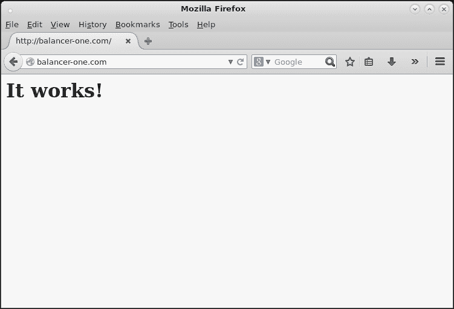

    Apache HTTPD 运行并为其默认页面提供服务

## 参见

在安装 Apache HTTPD 软件时遇到的每个问题都可以通过阅读以下网站上的 Apache 文档来缓解[`httpd.apache.org/docs/2.2/`](http://httpd.apache.org/docs/2.2/)。

# 为 Apache 安装和配置 mod_cluster

在这个食谱中，我们将学习如何在 Apache HTTPD 安装中安装和配置`mod-cluster`。这个食谱需要一个正在运行的 Apache HTTPD，并假设其安装目录是`/opt/httpd`。如果你在环境中没有安装 Apache，请遵循前面食谱中的说明。

## 准备工作

1.  首先，从以下网站下载 mod-cluster 模块[`mod-cluster.jboss.org/downloads/1-2-6-Final-bin`](http://mod-cluster.jboss.org/downloads/1-2-6-Final-bin)。

1.  将所有软件下载到`/opt/httpd/modules`文件夹。

1.  如果你愿意，你可以通过你的操作系统包管理器安装`mod_cluster`，在类似 Fedora 的系统上，如下所示：

    ```java
    sudo yum install mod_cluster
    ```

## 如何操作…

1.  下载完成后，打开终端并执行以下命令：

    ```java
    $ cd /opt/httpd/modules
    $ tar zxvf mod_cluster-1.2.6.Final-linux2-x64-so.tar.gz
    mod_advertise.so
    mod_manager.so
    mod_proxy_cluster.so
    mod_slotmem.so
    ```

    现在我们已经解压了所有软件，我们准备配置`mod_cluster`。为了更好地配置和管理`mod_cluster`，让我们创建一个用于内部通信的私有网络接口，即 Apache 和 WildFly 之间。

1.  打开终端窗口并执行以下命令：

    ```java
    $ sudo ifconfig eth0:1 10.0.0.1 netmask 255.255.255.0
    ```

    ### 注意

    如果你没有遵循前面的食谱，你可能需要编辑`httpd.conf`文件并禁用与`mod_cluster`模块冲突的`proxy-balancer`模块。

1.  编辑`/opt/httpd/conf/httpd.conf`文件，查找以下注释行`LoadModule proxy_balancer_module modules/mod_proxy_balancer.so`。将其替换为以下条目：

    ```java
    #LoadModule proxy_balancer_module modules/mod_proxy_balancer.so
    ```

1.  在终端窗口中，创建一个名为`mod_cluster.conf`的新文件，并将其放置在`opt/httpd/conf/extra`文件夹中，如下所示：

    ```java
    $ touch /opt/httpd/conf/extra/mod_cluster.conf
    $ vim /opt/httpd/conf/extra/mod_cluster.conf
    ```

1.  现在添加以下代码：

    ```java
    LoadModule slotmem_module modules/mod_slotmem.so
    LoadModule manager_module modules/mod_manager.so
    LoadModule proxy_cluster_module modules/mod_proxy_cluster.so
    LoadModule advertise_module modules/mod_advertise.so

    Listen 10.0.0.1:80
    Listen 10.0.0.1:6666

    <VirtualHost 10.0.0.1:80>
      <Location /mcm>
        SetHandler mod_cluster-manager
        Order deny,allow
        Deny from all
        Allow from 10.0.0.1
      </Location>
    </VirtualHost>

    <VirtualHost 10.0.0.1:6666>
      <Directory />
        Order deny,allow
        Deny from all
        Allow from 10.0.0.1
      </Directory>
      ServerAdvertise on http://10.0.0.1:6666
      EnableMCPMReceive
    </VirtualHost>
    ```

1.  现在，让我们再次编辑`httpd.conf`文件，并在末尾添加以下指令。它几乎是自我解释的：

    ```java
    # mod_cluster settings
    Include conf/extra/mod_cluster.conf
    ```

    这将加载前面的文件，其中包含我们所有的`mod_cluster`配置。

1.  让我们使用以下命令启动我们的 Apache：

    ```java
    $ cd /opt/httpd/bin
    $ sudo ./httpd -k start -f /opt/httpd/conf/httpd.conf
    ```

1.  现在将你的浏览器指向以下 URL：

    +   `http://10.0.0.1`

    +   `http://10.0.0.1/mcm`

    你应该看到以下截图所示的页面：

    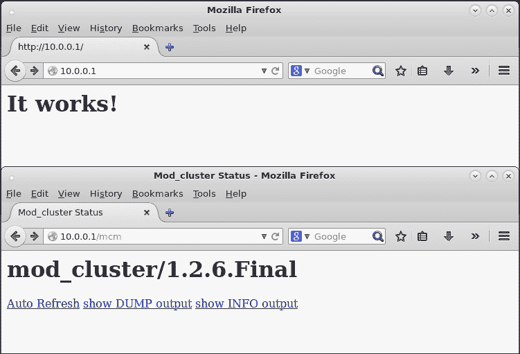

    在私有网络接口上运行的 Apache HTTPD 和 mod_cluster 管理器

## 它是如何工作的…

让我们分析到目前为止我们所做的工作：

+   首先，我们将所有的`mod_cluster`模块复制到 Apache 的`modules`目录中。然后，通过在`mod_cluster.conf`文件中添加`LoadModule`指令来引用它们，以便加载模块。此外，我们通过`Include`指令将`mod_cluster.conf`文件引用到默认的 Apache 配置文件`httpd.conf`中。

    这为我们粘合 Apache 和`mod_cluster`提供了粘合剂。

+   为什么我们创建了一个私有网络接口？这是由于设计和安全原因。设计可能是一个好的实践，但安全是必须的。内部通信应该暴露在私有网络上，而不是公共网络上。尽管如此，在企业环境中，您很可能会有两个网络接口的服务器来完成这个目的。因此，为了模拟企业环境并给您一个好的设计，我们只是创建了一个另一个网络接口。

+   因此，由于前一点中提到的理由，我们将`mod_cluster`管理页面`/mcm`之间的私有接口以及 Apache 和 WildFly 之间的所有通信绑定。本质上，这是在 Apache 上的`mod_cluster`和 WildFly 上的`mod_cluster`组件之间交换消息。

+   这基本上提供了平衡；一个 WildFly `mod_cluster`向`10.0.0.1:6666`多播地址发送信号，“嗨，我在这里”。在另一边，在 Apache 上，`mod_cluster`组件读取消息并通过平衡为新请求启用该 WildFly 节点。

在本章的后面部分，我们需要更改一些前面的设置，添加更多的指令。这里讨论的只是基本的设置，以开始使用。

# 使用自动广告平衡 WildFly – UDP

在这个菜谱中，我们将学习如何平衡以独立模式运行的两个 WildFly 节点。默认的`mod_cluster`设置提供自动广告功能，使用多播地址。此外，在这个菜谱中，我们还将使用集群配置，以提供更好的测试体验。如果您需要更多关于使用 WildFly 进行集群的信息，请阅读第六章，*WildFly 集群*。

本菜谱中使用的整个 WildFly 配置将不会依赖于任何之前的配置。相反，我们假设 Apache HTTPD 的安装和配置基于本章前两个菜谱。

## 准备工作

对于这个菜谱，我们需要一个名为`balancing-test`的应用程序，您可以在我的 GitHub 仓库中找到它。如果您跳过了第二章中的*使用部署文件夹管理应用程序*菜谱，请参阅它以下载您将需要的所有源代码和项目。

要构建应用程序，请执行以下命令：

```java
$ cd ~/WFC/github/wildfly-cookbook
$ cd balancing-test
$ mvn clean package
```

## 如何做到这一点...

让我们从 WildFly 安装目录`$WILDFLY_HOME`中创建两个文件夹，每个文件夹代表一个服务器节点。

1.  打开一个终端并执行以下命令：

    ```java
    $ cd $WILDFLY_HOME
    $ cp -a standalone bl-std-node-1
    $ cp -a standalone bl-std-node-2
    ```

1.  现在，让我们将`balancing-test.war`应用程序复制到我们刚刚创建的每个节点的`deployments`文件夹中。操作如下：

    ```java
    $ cp balancing-test.war bl-std-node-1/deployments/
    $ cp balancing-test.war bl-std-node-2/deployments/
    ```

    现在，让我们为每个节点生成一个虚拟 IP：

    ```java
    $ sudo ifconfig eth0:2 10.0.1.1 netmask 255.255.255.0
    $ sudo ifconfig eth0:3 10.0.1.2 netmask 255.255.255.0
    ```

1.  如果它还没有运行，让我们通过执行以下命令来启动 Apache 及其日志：

    ```java
    $ cd /opt/httpd/bin
    $ sudo ./httpd -k start -f /opt/httpd/conf/httpd.conf
    $ tail -f ../logs/{access,error}_log
    ==> ../logs/access_log <==

    ==> ../logs/error_log <==
    [Sun Oct 12 16:10:29 2014] [notice] SIGHUP received.  Attempting to restart
    [Sun Oct 12 16:10:29 2014] [notice] Digest: generating secret for digest authentication ...
    [ Sun Oct 12 16:10:29 2014] [notice] Digest: done
    [ Sun Oct 12 16:10:29 2014] [warn] httpd version 2.2.29 mismatch detected
    [ Sun Oct 12 16:10:29 2014] [notice] Advertise initialized for process 26675
    [ Sun Oct 12 16:10:29 2014] [notice] Apache/2.2.29 (Unix) mod_ssl/2.2.29 OpenSSL/1.0.1e-fips DAV/2 mod_cluster/1.2.6.Final configured -- resuming normal operations
    ```

1.  好的，现在 Apache 已经启动。让我们通过在新终端窗口中输入以下命令来启动我们的第一个节点：

    ```java
    $ ./bin/standalone.sh -Djboss.server.base.dir=bl-std-node-1 --server-config=standalone-ha.xml -Djboss.bind.address=10.0.1.1 -Djboss.management.http.port=19990 -Djboss.node.name=node-1
    ...
    16:13:58,472 INFO  [org.jboss.as] (Controller Boot Thread) JBAS015874: WildFly 8.1.0.Final "Kenny" started in 6531ms - Started 289 of 400 services (179 services are lazy, passive or on-demand)
    ```

1.  现在，在`node-1`启动后的几秒钟内，你应该在 Apache 日志的`access_log`中看到以下条目：

    ```java
    ==> ../logs/access_log <==
    10.0.0.1 - - [12/Oct/2014:16:14:05 +0200] "INFO / HTTP/1.1" 200 -
    10.0.0.1 - - [12/Oct/2014:16:14:05 +0200] "CONFIG / HTTP/1.1" 200 -
    10.0.0.1 - - [12/Oct/2014:16:14:05 +0200] "ENABLE-APP / HTTP/1.1" 200 -
    10.0.0.1 - - [12/Oct/2014:16:14:05 +0200] "STATUS / HTTP/1.1" 200 46
    10.0.0.1 - - [12/Oct/2014:16:14:15 +0200] "STATUS / HTTP/1.1" 200 46
    ```

    这些是`mod_cluster`日志，表明它们接收到了一个信息消息，一个配置消息，然后它启用了 WildFly `node-1`提供的应用程序。

1.  现在，打开我们在`mod_cluster.conf`文件中定义的`mod_cluster-manager`页面——Apache 端——在以下 URL：

    ```java
    http://10.0.0.1/mcm
    ```

    你应该看到以下页面：

    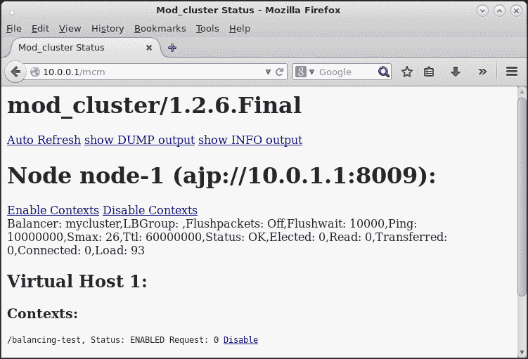

    `mod_cluster`管理页面显示正在运行的节点及其上下文。

1.  让我们在新的终端窗口中启动另一个节点`node-2`，如下所示：

    ```java
    $ ./bin/standalone.sh -Djboss.server.base.dir=bl-std-node-2 --server-config=standalone-ha.xml -Djboss.bind.address=10.0.1.2 -Djboss.management.http.port=29990 -Djboss.node.name=node-2
    ...
    16:13:58,472 INFO  [org.jboss.as] (Controller Boot Thread) JBAS015874: WildFly 8.1.0.Final "Kenny" started in 6531ms - Started 289 of 400 services (179 services are lazy, passive or on-demand)
    ```

    现在，在`node-2`启动后的几秒钟内，你应该在 Apache 日志的`access_log`中看到以下条目：

    ```java
    ...
    10.0.0.1 - - [12/Oct/2014:16:23:45 +0200] "STATUS / HTTP/1.1" 200 46
    10.0.0.1 - - [12/Oct/2014:16:23:55 +0200] "STATUS / HTTP/1.1" 200 46
    10.0.0.1 - - [12/Oct/2014:16:24:05 +0200] "STATUS / HTTP/1.1" 200 46
    10.0.0.1 - - [12/Oct/2014:16:24:15 +0200] "STATUS / HTTP/1.1" 200 46
    10.0.0.1 - - [12/Oct/2014:16:24:21 +0200] "INFO / HTTP/1.1" 200 331
    10.0.0.1 - - [12/Oct/2014:16:24:21 +0200] "CONFIG / HTTP/1.1" 200 -
    10.0.0.1 - - [12/Oct/2014:16:24:21 +0200] "ENABLE-APP / HTTP/1.1" 200 -
    10.0.0.1 - - [12/Oct/2014:16:24:21 +0200] "STATUS / HTTP/1.1" 200 46
    10.0.0.1 - - [12/Oct/2014:16:24:25 +0200] "STATUS / HTTP/1.1" 200 46
    ```

1.  让我们刷新`mcm`页面：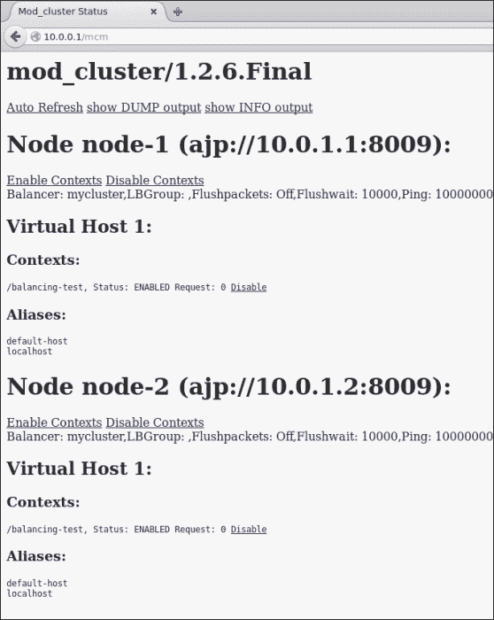

    `mod_cluster`管理页面显示正在运行的节点及其上下文。

    现在一切都已经启动并运行，让我们来玩我们的神奇应用程序。

1.  将你的浏览器指向以下 URL 并刷新页面几次：

    ```java
    http://10.0.0.1/balancing-test
    ```

    你应该看到一个像下面的页面：

    

    Apache 在节点-1 上提供负载均衡测试应用程序

    ### 注意

    在我的情况下，请求落在服务器`node-1`上；你的可能落在`node-2`上。此外，请注意，WildFly 的`mod_cluster`附带一些默认的负载均衡设置，例如：

    +   `sticky-session="true"`：如果会话仍然存活，则将后续相同会话的请求粘附到同一节点

    +   `sticky-session-force="true"`：这强制 Apache 在后续请求无法路由到同一节点时响应错误

    +   `sticky-session-remove="false"`：这表示如果后续请求无法路由到同一节点，Apache 是否应该移除粘附行为。

        因此，在刷新页面时，节点名称永远不会改变。顺便说一下，让我们停止服务节点并再次刷新页面。如果一切按预期工作，你应该会看到一个像以下截图中的页面：

        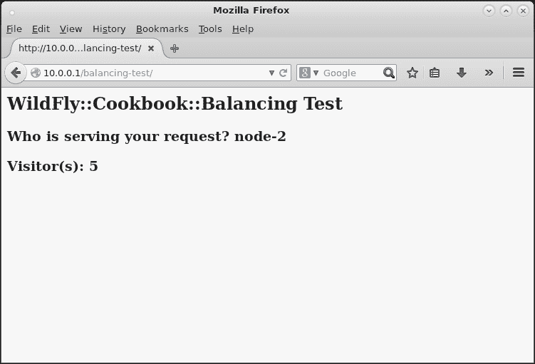

        Apache 在节点-2 上提供负载均衡测试应用程序

是的，我们做到了！

## 它是如何工作的…

如果你注意到了，我们在两个节点上都没有更改任何特定的`mod_cluster`设置。这是因为 WildFly 的`mod_cluster`配置依赖于与 Apache 端相同的默认设置。整个配置位于`mod_cluster`子系统以及 socket-binding-group 中。遵循以下配置：

```java
<subsystem >
    <mod-cluster-config advertise-socket="mod_cluster" advertise="true" connector="ajp">
        <dynamic-load-provider>
            <load-metric type="cpu"/>
        </dynamic-load-provider>
    </mod-cluster-config>
</subsystem>
```

以下代码描述了`mod_cluster`应该如何通知 Apache 中的对应部分有关其工作负载。默认情况下，工作负载是针对 CPU 计算的。

```java
<socket-binding-group name="standard-sockets" default-interface="public" port-offset="${jboss.socket.binding.port-offset:0}">
    <socket-binding name="management-http" interface="management" port="${jboss.management.http.port:9990}"/>
    <socket-binding name="management-https" interface="management" port="${jboss.management.https.port:9993}"/>
    <socket-binding name="ajp" port="${jboss.ajp.port:8009}"/>
    <socket-binding name="http" port="${jboss.http.port:8080}"/>
    <socket-binding name="https" port="${jboss.https.port:8443}"/>
    <socket-binding name="jgroups-mping" port="0" multicast-address="${jboss.default.multicast.address:230.0.0.4}" multicast-port="45700"/>
    <socket-binding name="jgroups-tcp" port="7600"/>
    <socket-binding name="jgroups-tcp-fd" port="57600"/>
    <socket-binding name="jgroups-udp" port="55200" multicast-address="${jboss.default.multicast.address:230.0.0.4}" multicast-port="45688"/>
    <socket-binding name="jgroups-udp-fd" port="54200"/>
    <socket-binding name="modcluster" port="0" multicast-address="224.0.1.105" multicast-port="23364"/>
    <socket-binding name="txn-recovery-environment" port="4712"/>
    <socket-binding name="txn-status-manager" port="4713"/>
    <outbound-socket-binding name="mail-smtp">
        <remote-destination host="localhost" port="25"/>
    </outbound-socket-binding>
</socket-binding-group>
```

以下代码描述了`mod_cluster`如何与 Apache 中的对应部分通信，有关其可用性和工作负载。默认情况下，多播地址设置为`224.0.1.105`。

如果需要更改多播地址，出于任何原因，请记住在 Apache 中更改其对应设置，使用以下指令：

```java
AdvertiseGroup http://MULTICAST_ADDR:PORT
```

### 分解进程

以下图像显示了由`netstat`工具提供的进程列表，你可以检查 IP 和端口绑定：

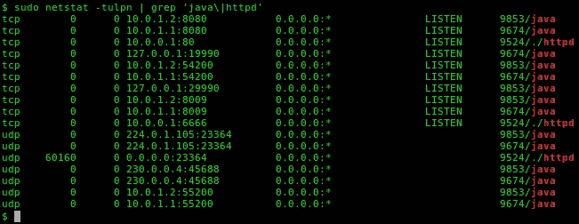

显示进程绑定 IP 和端口的 netstat 工具

当 Apache 启动时，实际上正在执行一个进程——PID`9524`（如`netstat`图所示），该进程监听 IP`10.0.0.1`的端口`80`和`6666`；该进程还监听任何接口（`0.0.0.0`）的端口`23364`。

当 WildFly 节点`node-1`启动时，实际上正在执行一个进程——PID`9674`（如`netstat`图所示），该进程监听多个端口和 IP：

+   端口`8080`，绑定到 IP`10.0.1.1`，由 HTTP 连接器使用

+   端口`19990`，绑定到 IP`127.0.0.1`，由主机控制器用于远程管理

+   端口`8009`，绑定到 IP`10.0.1.1`，由 AJP 连接器使用

+   端口`23364`，绑定到 IP`224.0.1.105`，由`mod_cluster`使用

+   端口`45688`，绑定到 IP`230.0.0.4`，由`jgroups`用于形成集群

当 WildFly 节点`node-2`启动时，实际上正在执行一个进程——PID`9853`（如`netstat`图所示），该进程监听多个端口和 IP：

+   端口`8080`，绑定到 IP`10.0.1.2`，由 HTTP 连接器使用

+   端口`29990`，绑定到 IP`127.0.0.1`，由主机控制器用于远程管理

+   端口`8009`，绑定到 IP`10.0.1.2`，由 AJP 连接器使用

+   端口`23364`，绑定到 IP`224.0.1.105`，由`mod_cluster`使用

+   端口`45688`，绑定到 IP`230.0.0.4`，由`jgroups`用于形成集群

有些绑定目前并不相关，所以我们不会讨论它们。你应该注意的是，WildFly 节点之间有相同的绑定。

+   `224.0.1.105:23364`由两者用于在 Apache 端向`mod_cluster`广播自己。

+   `230.0.0.4:45688`由两者用于创建 UDP 集群，因此具有相同的绑定使它们能够加入同一个集群。

### 分解通信

让我们分析参与负载均衡的所有组件如何相互通信。首先，看看以下这张价值千金的图像：

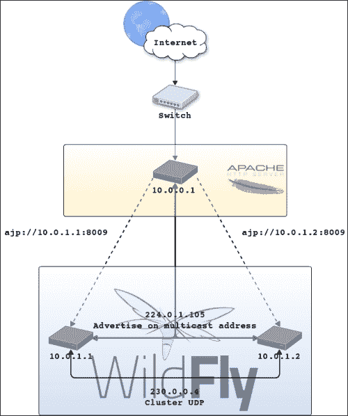

显示使用 UDP 进行平衡和集群通信配置的架构图

跳过客户端/用户请求资源时的步骤，以及当请求击中路由到 Apache 均衡器的交换机时的步骤，让我们集中关注 Apache 和 WildFly 之间通信的事件序列，看看中间发生了什么。

事件序列如下：

+   Apache 监听`224.0.1.105:23364`以平衡工作进程

+   当 WildFly 节点启动时，它们在`224.0.1.105:23364`上广播自己

+   Apache 收到以下消息：

    ```java
    10.0.0.1 - - [12/Oct/2014:16:24:21 +0200] "INFO / HTTP/1.1" 200 331
    10.0.0.1 - - [12/Oct/2014:16:24:21 +0200] "CONFIG / HTTP/1.1" 200 -
    10.0.0.1 - - [12/Oct/2014:16:24:21 +0200] "ENABLE-APP / HTTP/1.1" 200 -
    10.0.0.1 - - [12/Oct/2014:16:24:21 +0200] "STATUS / HTTP/1.1" 200 46
    ```

+   Apache 通过 AJP 协议开始平衡节点，地址为`10.0.1.1/2:8009`，具体取决于通过`STATUS`消息接收到的负载。

+   WildFly 节点接收请求并对其进行处理，然后响应 Apache。

+   同时，`jgroups`在集群成员之间序列化和反序列化 http 会话

+   同时，WildFly 节点向 Apache 发送有关实际工作负载的`STATUS`消息，等等

这基本上就是通过 UDP 平衡 WildFly 集群之外的事情。

您可以轻松地平衡一个非集群环境，这对于无状态服务来说很合适；配置相同，只是您将不得不使用一个“非高可用”配置文件。

## 还有更多…

如前所述，WildFly `mod_cluster`管理工作负载的计算，默认为 CPU。

以下是一些其他类型的负载指标：

| 类型 | 负载指标 |
| --- | --- |
| `cpu` | 返回系统 CPU 负载 |
| `mem` | 返回系统内存使用量 |
| `heap` | 返回堆内存使用量作为最大堆大小的百分比 |
| `sessions` | 给定一个容量，根据活动会话/容量返回百分比 |
| `requests` | 返回每秒请求数量 |
| `send-traffic` | 返回每秒 KB 的出站请求流量 |
| `receive-traffic` | 返回每秒 KB 的入站请求 POST 流量 |
| `busyness` | 返回线程池中忙于处理请求的连接器线程的百分比 |
| `connection-pool` | 返回连接池中正在使用的连接的百分比 |

您可以将负载指标添加到`node-1`的 mod-cluster 子系统，如下所示：

```java
$ ./bin/jboss-cli.sh
You are disconnected at the moment. Type 'connect' to connect to the server or 'help' for the list of supported commands.
[disconnected /] connect 127.0.0.1:19990
[standalone@127.0.0.1:19990 /] /subsystem=modcluster/mod-cluster-config=configuration:add-metric(type=mem, weight=2, capacity=1)
{
    "outcome" => "success",
    "response-headers" => {
        "operation-requires-reload" => true,
        "process-state" => "reload-required"
    }
}
[standalone@127.0.0.1:19990 /] :reload()
{
    "outcome" => "success",
    "result" => undefined
}
[standalone@127.0.0.1:19990 /]
```

这基本上为系统内存使用量添加了一个新的负载指标。如果我们查看`standalone-ha.xml`文件，我们会发现以下内容：

```java
<subsystem >
    <mod-cluster-config advertise-socket="modcluster" advertise="true" connector="ajp">
        <dynamic-load-provider>
            <load-metric type="cpu"/>
            <load-metric type="mem" weight="2" capacity="1"/>
        </dynamic-load-provider>
    </mod-cluster-config>
</subsystem>
```

因此，`mod_cluster`将根据这两个指标向其 Apache 对应方提供一个负载系数。如果您在异构环境中安装了 WildFly，这可能会非常有帮助，比如说一个具有不同资源能力的服务器——一个服务器可能比其他服务器少一些 RAM，或者比其他服务器少一些核心。因此，添加和删除指标让您有自由调整工作负载分配。

## 参见

对于集群配置，请参阅本书第五章第五章。使用 CLI 管理数据源子系统，*使用 CLI 管理数据源子系统*。

# 使用可用均衡器列表平衡 WildFly – TCP

在这个菜谱中，我们将学习如何使用 TCP 平衡平衡两个以独立模式运行的 WildFly 节点。与向多播地址发送信息消息不同，WildFly `mod_cluster`直接将所有内容发送到 Apache。

此外，在这个菜谱中，我们还将使用集群配置，以提供更好的测试感觉。如果你需要有关使用 WildFly 进行集群的更多信息，请参阅第五章，*使用 CLI 管理数据源子系统*。顺便说一下，用于此菜谱的整个 WildFly 配置将不依赖于任何之前的配置。相反，我们假设 Apache HTTPD 安装和配置基于本章的前两个菜谱。

## 准备工作

对于这个菜谱，我们需要一个名为`balancing-test`的应用程序，你可以在我的 GitHub 仓库中找到它。如果你跳过了第二章中关于*使用部署文件夹管理应用程序*的菜谱，请参阅它以下载你需要的所有源代码和项目。

要构建应用程序，请输入以下命令：

```java
$ cd ~/WFC/github/wildfly-cookbook
$ cd balancing-test
$ mvn clean package
```

## 如何做到这一点...

从 WildFly 安装目录`$WILDFLY_HOME`，让我们创建两个文件夹，每个文件夹代表一个服务器节点。

1.  打开终端并执行以下命令：

    ```java
    $ cd $WILDFLY_HOME
    $ cp -a standalone bl-tcp-std-node-1
    $ cp -a standalone bl-tcp-std-node-2
    ```

1.  现在，让我们将`balancing-test.war`应用程序复制到我们刚刚创建的每个节点的`deployments`文件夹中。如下操作：

    ```java
    $ cp balancing-test.war bl-tcp-std-node-1/deployments/
    $ cp balancing-test.war bl-tcp-std-node-2/deployments/
    ```

1.  现在，让我们为每个节点生成一个虚拟 IP：

    ```java
    $ sudo ifconfig eth0:2 10.0.1.1 netmask 255.255.255.0
    $ sudo ifconfig eth0:3 10.0.1.2 netmask 255.255.255.0
    ```

1.  现在，让我们回到 Apache 配置并编辑`mod_cluster.conf`，如下禁用广告：

    ```java
    <VirtualHost 10.0.0.1:6666>
            <Directory />
                    Order deny,allow
                    Deny from all
                    Allow from 10.0.0.1
            </Directory>
            ServerAdvertise off
            EnableMCPMReceive
    </VirtualHost>
    ```

1.  如果它还没有运行，让我们通过执行以下命令启动 Apache 及其日志：

    ```java
    $ cd /opt/httpd/bin
    $ sudo ./httpd -k start -f /opt/httpd/conf/httpd.conf
    $ tail -f ../logs/{access,error}_log
    ==> ../logs/access_log <==

    ==> ../logs/error_log <==
    [Sat Oct 18 23:10:29 2014] [notice] SIGHUP received.  Attempting to restart
    [Sat Oct 18 23:10:29 2014] [notice] Digest: generating secret for digest authentication ...
    [Sat Oct 18 23:10:29 2014] [notice] Digest: done
    [Sat Oct 18 23:10:29 2014] [warn] httpd version 2.2.29 mismatch detected
    [Sat Oct 18 23:10:29 2014] [notice] Advertise initialized for process 26675
    [Sat Oct 18 23:10:29 2014] [notice] Apache/2.2.29 (Unix) mod_ssl/2.2.29 OpenSSL/1.0.1e-fips DAV/2 mod_cluster/1.2.6.Final configured -- resuming normal operations
    ```

1.  现在，我们需要通过向`standalone-ha.xml`文件的`mod_cluster`子系统添加一些属性来告诉 WildFly `mod_cluster`直接与 Apache 通信，如下所示：

    ```java
    <subsystem >
        <mod-cluster-config advertise-socket="modcluster" advertise="false" proxy-list="10.0.0.1:6666" connector="ajp">
            <dynamic-load-provider>
                <load-metric type="cpu"/>
            </dynamic-load-provider>
        </mod-cluster-config>
    </subsystem>
    ```

1.  如前所述代码所强调的，我们正在告诉`mod_cluster`禁用自动广告，并将自身广告到`proxy-list`属性中指定的代理。要指定多个代理，请使用逗号`,`作为分隔符：

    ```java
    proxy-list="10.0.0.1:6666,10.0.0.2:6666"
    ```

1.  现在 Apache 已经启动并运行，并且我们已经配置了我们的节点，让我们在新的终端窗口中通过以下命令启动它：

    ```java
    $ cd $WILDFLY_HOME
    $ ./bin/standalone.sh -Djboss.server.base.dir=bl-tcp-std-node-1 --server-config=standalone-ha.xml -Djboss.bind.address=10.0.1.1 -Djboss.management.http.port=19990 -Djboss.node.name=node-1
    ...
    23:13:58,472 INFO  [org.jboss.as] (Controller Boot Thread) JBAS015874: WildFly 8.1.0.Final "Kenny" started in 6531ms - Started 289 of 400 services (179 services are lazy, passive or on-demand)
    ```

1.  在`node-1`启动后几秒钟，你应该会在 Apache 日志中看到以下条目，`access_log`：

    ```java
    ==> ../logs/access_log <==
    10.0.0.1 - - [18/Oct/2014:23:14:05 +0200] "INFO / HTTP/1.1" 200 -
    10.0.0.1 - - [18/Oct/2014:23:14:05 +0200] "CONFIG / HTTP/1.1" 200 -
    10.0.0.1 - - [18/Oct/2014:23:14:05 +0200] "ENABLE-APP / HTTP/1.1" 200 -
    10.0.0.1 - - [18/Oct/2014:23:14:05 +0200] "STATUS / HTTP/1.1" 200 46
    10.0.0.1 - - [18/Oct/2014:23:14:15 +0200] "STATUS / HTTP/1.1" 200 46
    ```

    这些是`mod_cluster`日志，表明它接收到了一个信息消息，一个配置消息，然后启用了 WildFly `node-1`提供的应用程序。

1.  将 WildFly `mod_cluster`的配置复制到`node-2`，然后在新的终端窗口中启动它，如下所示：

    ```java
    $ ./bin/standalone.sh -Djboss.server.base.dir=bl-tcp-std-node-2 --server-config=standalone-ha.xml -Djboss.bind.address=10.0.1.2 -Djboss.management.http.port=29990 -Djboss.node.name=node-2
    ...
    23:13:58,472 INFO  [org.jboss.as] (Controller Boot Thread) JBAS015874: WildFly 8.1.0.Final "Kenny" started in 6531ms - Started 289 of 400 services (179 services are lazy, passive or on-demand)
    ```

1.  在`node-2`启动后几秒钟，你应该会在 Apache 日志中看到以下条目，`access_log`：

    ```java
    ...
    10.0.0.1 - - [18/Oct/2014:23:23:45 +0200] "STATUS / HTTP/1.1" 200 46
    10.0.0.1 - - [18/Oct/2014:23:23:55 +0200] "STATUS / HTTP/1.1" 200 46
    10.0.0.1 - - [18/Oct/2014:23:24:05 +0200] "STATUS / HTTP/1.1" 200 46
    10.0.0.1 - - [18/Oct/2014:23:24:15 +0200] "STATUS / HTTP/1.1" 200 46
    10.0.0.1 - - [18/Oct/2014:23:24:21 +0200] "INFO / HTTP/1.1" 200 331
    10.0.0.1 - - [18/Oct/2014:23:24:21 +0200] "CONFIG / HTTP/1.1" 200 -
    10.0.0.1 - - [18/Oct/2014:23:24:21 +0200] "ENABLE-APP / HTTP/1.1" 200 -
    10.0.0.1 - - [18/Oct/2014:23:24:21 +0200] "STATUS / HTTP/1.1" 200 46
    10.0.0.1 - - [18/Oct/2014:23:24:25 +0200] "STATUS / HTTP/1.1" 200 46
    ```

1.  现在，打开我们在`mod_cluster.conf`文件中定义的`mod_cluster-manager`页面—Apache 端—以下 URL：

    ```java
    http://10.0.0.1/mcm
    ```

    你应该会看到以下页面：

    

    mod_cluster 管理页面显示正在运行的节点及其上下文—TCP

    现在一切都已经启动并运行，让我们玩一下我们奇妙的应用程序。

1.  将你的浏览器指向以下 URL 并刷新页面几次：

    ```java
    http://10.0.0.1/balancing-test
    ```

    你应该会看到一个像以下截图中的页面：

    

    Apache 在节点-1 上提供 balancing-test 应用程序

1.  在我的情况下，请求落在服务器 `node-1` 上，你的可能落在 `node-2` 上。让我们停止服务节点并刷新页面一次。如果一切如预期工作，你应该会看到一个像以下截图中的页面：

    Apache 在节点-2 上提供 balancing-test 应用程序

我们让它工作得和自动广告平衡时完全一样。

## 它是如何工作的…

在此情况下，与启用自动广告的平衡不同之处在于，`mod_cluster` 直接连接到 Apache 以通信其 `STATUS` 信息，如下面的图像所示：

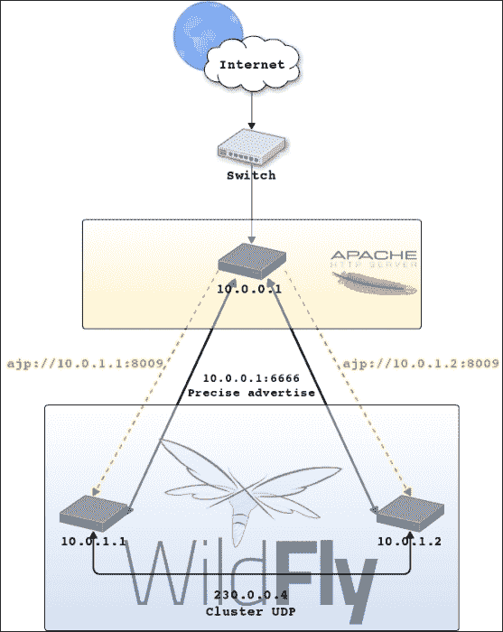

显示使用 TCP 的平衡和集群通信配置的架构图

尽管如此，WildFly 以相同的方式扩展；你可以添加任意多的 WildFly 节点，它们将由 Apache 自动平衡。缺点是如果你添加了另一个 Apache 实例，你需要通过 `mod_cluster` 子系统的 `proxy-list` 属性将其引用添加到 WildFly 的 `mod_cluster` 配置中；这个更改最终需要重新加载服务器。

# 使用 HTTP 连接器而不是 AJP 进行平衡

在这个配方中，我们将学习如何使用 HTTP 连接器而不是二进制协议 AJP 来平衡 WildFly 节点。这个配方的目的是向你展示如何使用不同的连接器，而不是真正平衡 WildFly 提供的服务。因此，我们将只使用一个 WildFly 节点，由 Apache 前端。我们还假设 Apache HTTPD 的安装和配置基于本章的前两个配方。

## 准备工作

对于这个配方，我们需要一个名为 `balancing-test` 的应用程序，你可以在我的 GitHub 仓库中找到它。如果你跳过了 第二章 中关于 *使用部署文件夹管理应用程序* 的配方，请参阅它以下载你将需要的所有源代码和项目。

要构建应用程序，请输入以下命令：

```java
$ cd ~/WFC/github/wildfly-cookbook
$ cd balancing-test
$ mvn clean package
```

## 如何做到这一点...

从 WildFly 安装目录 `$WILDFLY_HOME`，让我们创建一个代表服务器节点的文件夹。

1.  打开一个终端并执行以下命令：

    ```java
    $ cd $WILDFLY_HOME
    $ cp -a standalone bl-http-std-node-1
    ```

1.  现在，让我们将 `balancing-test.war` 应用程序复制到我们刚刚创建的节点的 `deployments` 文件夹中。输入以下命令：

    ```java
    $ cp balancing-test.war bl-http-std-node-1/deployments/
    ```

1.  现在，让我们为节点生成一个虚拟 IP：

    ```java
    $ sudo ifconfig eth0:1 10.0.1.1 netmask 255.255.255.0
    ```

1.  如果它还没有运行，让我们通过执行以下命令来启动 Apache 和其日志：

    ```java
    $ cd /opt/httpd/bin
    $ sudo ./httpd -k start -f /opt/httpd/conf/httpd.conf
    $ tail -f ../logs/{access,error}_log
    ==> ../logs/access_log <==

    ==> ../logs/error_log <==
    [Sun Oct 12 16:10:29 2014] [notice] SIGHUP received.  Attempting to restart
    [Sun Oct 12 16:10:29 2014] [notice] Digest: generating secret for digest authentication ...
    [Sun Oct 12 16:10:29 2014] [notice] Digest: done
    [Sun Oct 12 16:10:29 2014] [warn] httpd version 2.2.29 mismatch detected
    [Sun Oct 12 16:10:29 2014] [notice] Advertise initialized for process 26675
    [Sun Oct 12 16:10:29 2014] [notice] Apache/2.2.29 (Unix) mod_ssl/2.2.29 OpenSSL/1.0.1e-fips DAV/2 mod_cluster/1.2.6.Final configured -- resuming normal operations
    ```

1.  现在是时候配置我们的 WildFly 节点`node-1`了。编辑`bl-http-std-node-1/configuration`文件夹中的`standalone-ha.xml`文件，并按以下方式配置 Undertow 子系统：

    ```java
    <subsystem >
        <buffer-cache name="default"/>
        <server name="default-server">
            <http-listener name="http" socket-binding="http" enabled="true"/>
            <ajp-listener name="ajp" socket-binding="ajp" enabled="false"/>
            <host name="default-host" alias="localhost">
                <location name="/" handler="welcome-content"/>
                <filter-ref name="server-header"/>
                <filter-ref name="x-powered-by-header"/>
            </host>
        </server>
        <servlet-container name="default">
            <jsp-config/>
        </servlet-container>
        <handlers>
            <file name="welcome-content" 
            path="${jboss.home.dir}/welcome-content"/>
        </handlers>
        <filters>
            <response-header name="server-header" header-
            name="Server" header-value="WildFly/8"/>
            <response-header name="x-powered-by-header" header-name="X-Powered-By" header-value="Undertow/1"/>
        </filters>
    </subsystem>
    ```

1.  我们通过添加属性`enabled`并将其设置为`false`来禁用了 AJP 监听器。基于这些更改，我们需要按以下方式更新`mod_cluster`子系统：

    ```java
    <subsystem >
        <mod-cluster-config advertise-socket="modcluster" connector="http">
            <dynamic-load-provider>
                <load-metric type="cpu"/>
            </dynamic-load-provider>
        </mod-cluster-config>
    </subsystem>
    ```

1.  我们将连接器引用从 AJP 更改为 HTTP。现在我们需要更新远程子系统中的连接器引用，该子系统使用其默认名称`default`引用连接器。应用以下更改：

    ```java
    <subsystem >
        <endpoint worker="default"/>
        <http-connector name="http-remoting-connector" connector-ref="default" security-realm="ApplicationRealm"/>
    </subsystem>
    ```

1.  就这样；我们的配置完成了。让我们通过在新终端窗口中输入以下命令来启动我们的节点：

    ```java
    $ ./bin/standalone.sh -Djboss.server.base.dir=bl-http-std-node-1 --server-config=standalone-ha.xml -Djboss.bind.address=10.0.1.1 -Djboss.management.http.port=19990 -Djboss.node.name=node-1
    ...
    18:03:57,734 INFO  [org.jboss.as] (Controller Boot Thread) JBAS015874: WildFly 8.1.0.Final "Kenny" started in 6670ms - Started 287 of 399 services (179 services are lazy, passive or on-demand)
    ```

1.  现在，在`node-1`启动后的几秒钟内，你应该会在 Apache 日志中看到以下条目，即在`access_log`中：

    ```java
    ==> ../logs/access_log <==
    ...
    10.0.0.1 - - [16/Oct/2014:18:04:03 +0200] "INFO / HTTP/1.1" 200 -
    10.0.0.1 - - [16/Oct/2014:18:04:03 +0200] "CONFIG / HTTP/1.1" 200 -
    10.0.0.1 - - [16/Oct/2014:18:04:03 +0200] "ENABLE-APP / HTTP/1.1" 200 -
    10.0.0.1 - - [16/Oct/2014:18:04:03 +0200] "STATUS / HTTP/1.1" 200 46
    10.0.0.1 - - [16/Oct/2014:18:04:13 +0200] "STATUS / HTTP/1.1" 200 46
    ```

    这些是 mod-cluster 日志，表明它接收到了一个信息消息和一个配置消息，然后它启用了 WildFly `node-1`提供的应用程序。

1.  让我们通过打开浏览器并将它指向以下 URL 来测试我们的应用程序：

    ```java
    http://10.0.0.1/balancing-test
    ```

    你应该会看到一个像以下截图一样的页面：

    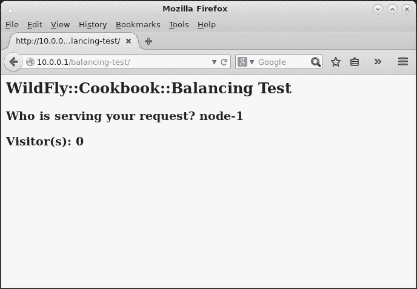

    Apache 在节点 1 上通过 HTTP 连接器提供 balancing-test 应用程序

## 它是如何工作的…

如果你期待在 Apache 端进行更改，那么你错了。WildFly `mod_cluster`连接到 Apache 并说“嗨，我需要平衡。这是我的可达性”。因此，当 Apache 收到有关应用程序、拓扑和通信策略的所有信息时，它开始将请求分发给 WildFly。

这正是我们所做的。我们通过 HTTP 连接器配置了新的通信通道，禁用了 AJP 连接器，就这样！很简单，不是吗？

# 在重启 Apache 时保留 WildFly 工作进程

许多时候，你需要重启 Apache，而你所有的 WildFly 实例都会在几秒钟内不可用。因此，这个讨厌的**404**错误可能是一个问题。在这个菜谱中，我们将学习如何以简单的方式减轻这个问题。我们还假设 Apache HTTPD 的安装和配置基于本章前两个菜谱。

## 准备工作

对于这个菜谱，我们需要一个名为`balancing-test`的应用程序，你可以在我的 GitHub 仓库中找到它。如果你跳过了第二章中关于*使用部署文件夹管理应用程序*的菜谱，请参考它以下载你需要的所有源代码和项目。

要构建应用程序，请输入以下命令：

```java
$ cd ~/WFC/github/wildfly-cookbook
$ cd balancing-test
$ mvn clean package
```

## 如何操作…

从 WildFly 安装目录`$WILDFLY_HOME`开始，让我们创建一个代表服务器节点的文件夹。

1.  打开一个终端并执行以下命令：

    ```java
    $ cd $WILDFLY_HOME
    $ cp -a standalone bl-persist-std-node-1
    ```

1.  现在，让我们将`balancing-test.war`应用程序复制到我们刚刚创建的节点`deployments`文件夹中。输入以下命令：

    ```java
    $ cp balancing-test.war bl-persist-std-node-1/deployments/
    ```

1.  现在，让我们为节点生成一个虚拟 IP：

    ```java
    $ sudo ifconfig eth0:1 10.0.1.1 netmask 255.255.255.0
    ```

1.  如果它尚未运行，让我们通过执行以下命令来启动 Apache 及其日志：

    ```java
    $ cd /opt/httpd/bin
    $ sudo ./httpd -k start -f /opt/httpd/conf/httpd.conf
    $ tail -f ../logs/{access,error}_log
    ==> ../logs/access_log <==

    ==> ../logs/error_log <==
    [Thu Oct 16 18:51:51 2014] [warn] Init: Session Cache is not configured [hint: SSLSessionCache]
    [Thu Oct 16 18:51:51 2014] [warn] httpd version 2.2.29 mismatch detected
    [Thu Oct 16 18:51:51 2014] [notice] Digest: generating secret for digest authentication ...
    [Thu Oct 16 18:51:51 2014] [notice] Digest: done
    [Thu Oct 16 18:51:51 2014] [warn] httpd version 2.2.29 mismatch detected
    [Thu Oct 16 18:51:51 2014] [notice] Advertise initialized for process 15525
    [Thu Oct 16 18:51:51 2014] [notice] Apache/2.2.29 (Unix) mod_ssl/2.2.29 OpenSSL/1.0.1e-fips DAV/2 mod_cluster/1.2.6.Final configured -- resuming normal operations
    ```

1.  让我们在新的终端窗口中输入以下命令来启动我们的节点：

    ```java
    $ ./bin/standalone.sh -Djboss.server.base.dir=bl-persist-std-node-1 --server-config=standalone-ha.xml -Djboss.bind.address=10.0.1.1 -Djboss.management.http.port=19990 -Djboss.node.name=node-1
    ...
    18:55:37,613 INFO  [org.jboss.as] (Controller Boot Thread) JBAS015874: WildFly 8.1.0.Final "Kenny" started in 6723ms - Started 289 of 400 services (179 services are lazy, passive or on-demand)
    ```

    现在，在`node-1`启动后的几秒钟，您应该在 Apache 日志中看到以下条目，即`access_log`：

    ```java
    ==> ../logs/access_log <==
    ...
    10.0.0.1 - - [16/Oct/2014:18:55:43 +0200] "INFO / HTTP/1.1" 200 -
    10.0.0.1 - - [16/Oct/2014:18:55:43 +0200] "CONFIG / HTTP/1.1" 200 -
    10.0.0.1 - - [16/Oct/2014:18:55:43 +0200] "ENABLE-APP / HTTP/1.1" 200 -
    10.0.0.1 - - [16/Oct/2014:18:55:43 +0200] "STATUS / HTTP/1.1" 200 54
    10.0.0.1 - - [16/Oct/2014:18:55:53 +0200] "STATUS / HTTP/1.1" 200 54
    ```

    这些是`mod_cluster`日志，表明它接收到了一条信息消息和一条配置消息，然后启用了由 WildFly 提供的`node-1`应用。

1.  现在，让我们通过执行以下命令来重启 Apache：

    ```java
    $ cd /opt/httpd/bin
    $ ./httpd -k restart -f /opt/httpd/conf/httpd.conf
    ```

    在 Apache 日志中，您应该看到类似以下的内容：

    ```java
    ==> ../logs/error_log <==
    ...
    [Thu Oct 16 18:57:23 2014] [warn] manager_handler STATUS error: MEM: Can't read node

    ==> ../logs/access_log <==
    10.0.0.1 - - [16/Oct/2014:18:57:23 +0200] "STATUS / HTTP/1.1" 500 535

    ```

    在 WildFly 日志中，您应该看到以下日志条目：

    ```java
    18:57:23,879 ERROR [org.jboss.modcluster] (UndertowEventHandlerAdapter - 1) MODCLUSTER000042: Error MEM sending STATUS command to 10.0.0.1/10.0.0.1:6666, configuration will be reset: MEM: Can't read node
    ```

    等待几秒钟，现在您应该看到 WildFly 按照以下方式向 Apache 发送消息：

    ```java
    ==> ../logs/access_log <==
    10.0.0.1 - - [16/Oct/2014:18:57:23 +0200] "STATUS / HTTP/1.1" 500 535
    10.0.0.1 - - [16/Oct/2014:18:57:33 +0200] "INFO / HTTP/1.1" 200 -
    10.0.0.1 - - [16/Oct/2014:18:57:33 +0200] "CONFIG / HTTP/1.1" 200 -
    10.0.0.1 - - [16/Oct/2014:18:57:33 +0200] "ENABLE-APP / HTTP/1.1" 200 -
    10.0.0.1 - - [16/Oct/2014:18:57:33 +0200] "STATUS / HTTP/1.1" 200 46
    10.0.0.1 - - [16/Oct/2014:18:57:43 +0200] "STATUS / HTTP/1.1" 200 46
    ```

    在重启过程中，用户可能会看到您应用的**NOT FOUND**错误页面，如下所示：

    

    Apache 在重启后找不到应用程序上下文

1.  因此，为了减轻这个问题，您可以在 Apache 关闭之前，以某种方式持久化 WildFly 节点信息，然后在启动时再次读取这些信息。

    编辑`/opt/httpd/conf/extra`文件夹中的`mod_cluster.conf`文件，并在虚拟主机声明之外添加以下指令：

    ```java
    ...
    Listen 10.0.0.1:80
    Listen 10.0.0.1:6666

    PersistSlots On

    <VirtualHost 10.0.0.1:80>
    ...
    ```

1.  让我们看看它是否工作。停止 Apache 和 WildFly，然后重启它们。几秒钟后，我们应该有以下条目：

    ```java
    ==> ../logs/error_log <==
    [Thu Oct 16 19:14:39 2014] [warn] Init: Session Cache is not configured [hint: SSLSessionCache]
    [Thu Oct 16 19:14:39 2014] [warn] httpd version 2.2.29 mismatch detected
    [Thu Oct 16 19:14:39 2014] [notice] Digest: generating secret for digest authentication ...
    [Thu Oct 16 19:14:39 2014] [notice] Digest: done
    [Thu Oct 16 19:14:39 2014] [warn] httpd version 2.2.29 mismatch detected
    [Thu Oct 16 19:14:39 2014] [notice] Advertise initialized for process 16529
    [Thu Oct 16 19:14:39 2014] [notice] Apache/2.2.29 (Unix) mod_ssl/2.2.29 OpenSSL/1.0.1e-fips DAV/2 mod_cluster/1.2.6.Final configured -- resuming normal operations

    ==> ../logs/access_log <==
    10.0.0.1 - - [16/Oct/2014:19:15:01 +0200] "INFO / HTTP/1.1" 200 -
    10.0.0.1 - - [16/Oct/2014:19:15:01 +0200] "CONFIG / HTTP/1.1" 200 -
    10.0.0.1 - - [16/Oct/2014:19:15:01 +0200] "ENABLE-APP / HTTP/1.1" 200 -
    10.0.0.1 - - [16/Oct/2014:19:15:01 +0200] "STATUS / HTTP/1.1" 200 55
    ```

1.  现在重启 Apache 并查看其日志：

    ```java
    ==> ../logs/error_log <==
    [Thu Oct 16 19:17:05 2014] [notice] SIGHUP received.  Attempting to restart
    [Thu Oct 16 19:17:05 2014] [notice] Digest: generating secret for digest authentication ...
    [Thu Oct 16 19:17:05 2014] [notice] Digest: done
    [Thu Oct 16 19:17:05 2014] [warn] httpd version 2.2.29 mismatch detected
    [Thu Oct 16 19:17:05 2014] [notice] Advertise initialized for process 16529
    [Thu Oct 16 19:17:05 2014] [notice] Apache/2.2.29 (Unix) mod_ssl/2.2.29 OpenSSL/1.0.1e-fips DAV/2 mod_cluster/1.2.6.Final configured -- resuming normal operations

    ==> ../logs/access_log <==
    10.0.0.1 - - [16/Oct/2014:19:17:11 +0200] "STATUS / HTTP/1.1" 200 46
    10.0.0.1 - - [16/Oct/2014:19:17:21 +0200] "STATUS / HTTP/1.1" 200 46
    ```

看看，不再有来自 WildFly 的`INFO`、`CONFIG`和`ENABLE-APP`消息！WildFly 日志没有捕捉到任何东西，我们的应用启动速度与 Apache 启动速度一样快。

# 平衡不同应用的同一种上下文

一个大型企业环境可能由几个提供大量应用的应用服务器组成。有时，当应用在不同的节点上运行时（在 WildFly 的域模式下，甚至可能是不同的服务器组），它们会有相同的上下文路径，但它们共享同一个均衡器，即 Apache。

在这个菜谱中，我们将学习如何平衡来自不同节点不同应用的同一种应用上下文。

## 准备中

对于这个菜谱，我们需要一个名为`balancing-test`的应用程序，您可以在我的 GitHub 仓库中找到它。如果您跳过了第二章中关于*使用部署文件夹管理应用*的菜谱，请参阅它以下载您需要的所有源代码和项目。

要构建应用，请输入以下命令：

```java
$ cd ~/WFC/github/wildfly-cookbook
$ cd balancing-test
$ mvn clean package
```

## 如何操作…

从 WildFly 安装目录`$WILDFLY_HOME`开始，让我们创建两个文件夹，每个文件夹代表一个服务器节点。

1.  打开终端并执行以下命令：

    ```java
    $ cd $WILDFLY_HOME
    $ cp -a standalone bl-std-node-bar
    $ cp -a standalone bl-std-node-foo
    ```

1.  现在，让我们将`deployments`文件夹中的两个 Web 应用复制到相应的节点。输入以下命令：

    ```java
    $ cp app-bar-with-this-context.war bl-std-node-bar/deployments/
    $ cp app-foo-with-this-context.war bl-std-node-foo/deployments/
    ```

1.  现在，让我们为每个节点生成一个虚拟 IP：

    ```java
    $ sudo ifconfig eth0:1 10.0.1.1 netmask 255.255.255.0
    $ sudo ifconfig eth0:2 10.0.1.2 netmask 255.255.255.0
    ```

1.  现在，让我们回到 Apache 配置并编辑`mod_cluster.conf`。我们需要替换整个配置，如下所示：

    ```java
    LoadModule slotmem_module modules/mod_slotmem.so
    LoadModule manager_module modules/mod_manager.so
    LoadModule proxy_cluster_module modules/mod_proxy_cluster.so
    LoadModule advertise_module modules/mod_advertise.so

    PersistSlots On
    ServerAdvertise Off

    Listen 10.0.0.3:80
    <VirtualHost 10.0.0.3:80>

            ServerName mcm.com

            <Location />
                    SetHandler mod_cluster-manager
                    Order deny,allow
                    Deny from all
                    Allow from all
            </Location>

    </VirtualHost>

    Listen 10.0.0.1:80
    <VirtualHost 10.0.0.1:80>

            ServerName bar.com

            <Directory />
                    Order deny,allow
                    Deny from all
                    Allow from all
            </Directory>

            EnableMCPMReceive On

            CreateBalancers 1
            ProxyPass / balancer://barBalancer/this

    </VirtualHost>

    Listen 10.0.0.2:80
    <VirtualHost 10.0.0.2:80>

            ServerName foo.com

            <Directory />
                    Order deny,allow
                    Deny from all
                    Allow from all
            </Directory>

            EnableMCPMReceive On

            CreateBalancers 1
            ProxyPass / balancer://fooBalancer/this

    </VirtualHost>
    ```

1.  如您所见，我们更改了虚拟主机绑定，因此让我们为它们创建适当的虚拟 IP：

    ```java
    $ sudo ifconfig eth0:3 10.0.0.1 netmask 255.255.255.0
    $ sudo ifconfig eth0:4 10.0.0.2 netmask 255.255.255.0
    $ sudo ifconfig eth0:5 10.0.0.3 netmask 255.255.255.0
    ```

1.  现在，我们需要将`ServerName`指令映射到`/etc/hosts`文件中，如下所示：

    ```java
    10.0.0.3 mcm.com
    10.0.0.1 bar.com
    10.0.0.2 foo.com
    ```

1.  现在，让我们通过在新终端窗口中启动 Apache HTTPD 来检查我们的配置是否正确——至少是 Apache 配置——如下所示：

    ```java
    $ cd /opt/httpd/bin
    $ ./httpd -k restart -f /opt/httpd/conf/httpd.conf
    In the Apache logs, you should see entries similar to the following:
    ==> ../logs/access_log <==

    ==> ../logs/error_log <==
    [Fri Oct 17 00:12:57 2014] [warn] Init: Session Cache is not configured [hint: SSLSessionCache]
    [Fri Oct 17 00:12:57 2014] [warn] httpd version 2.2.29 mismatch detected
    [Fri Oct 17 00:12:57 2014] [notice] Digest: generating secret for digest authentication ...
    [Fri Oct 17 00:12:57 2014] [notice] Digest: done
    [Fri Oct 17 00:12:57 2014] [warn] httpd version 2.2.29 mismatch detected
    [Fri Oct 17 00:12:57 2014] [notice] Advertise initialized for process 23907
    [Fri Oct 17 00:12:57 2014] [notice] Apache/2.2.29 (Unix) mod_ssl/2.2.29 OpenSSL/1.0.1e-fips DAV/2 mod_cluster/1.2.6.Final configured -- resuming normal operations
    ```

1.  打开浏览器并将它指向以下 URL：

    ```java
    http://mcm.com
    ```

    您应该看到以下`mod_cluster-manager`页面：

    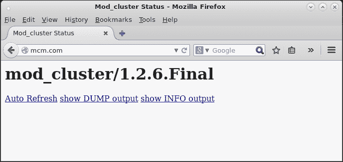

    通过 mcm.com 地址由 Apache 提供的 mod_cluster 管理页面

1.  现在，让我们配置我们的第一个节点，`node-bar`。我们需要调整我们的`mod_cluster`子系统，如下所示：

    ```java
    <subsystem >
        <mod-cluster-config advertise-socket="modcluster" advertise="false" proxy-list="${proxy.list}" connector="ajp" balancer="${balancer.name}">
            <dynamic-load-provider>
                <load-metric type="cpu"/>
            </dynamic-load-provider>
        </mod-cluster-config>
    </subsystem>
    ```

1.  现在，我们可以通过执行以下命令来启动`node-bar`：

    ```java
    $ cd $WILDFLY_HOME
    $ ./bin/standalone.sh -Djboss.server.base.dir=bl-std-node-bar --server-config=standalone-ha.xml -Djboss.bind.address=10.0.1.1 -Djboss.management.http.port=19990 -Djboss.node.name=node-bar -Dbalancer.name=barBalancer -Dproxy.list=10.0.0.1:80 -Djboss.default.multicast.address=230.0.1.4
    ...
    00:24:20,643 INFO  [org.wildfly.extension.undertow] (MSC service thread 1-1) WFLYUT0021: Registered web context: /this
    ...
    ```

    Apache 应该捕获以下日志条目：

    ```java
    10.0.0.1 - - [17/Oct/2014:00:24:16 +0200] "INFO / HTTP/1.1" 200 -
    10.0.0.1 - - [17/Oct/2014:00:24:16 +0200] "CONFIG / HTTP/1.1" 200 -
    10.0.0.1 - - [17/Oct/2014:00:24:16 +0200] "STATUS / HTTP/1.1" 200 48
    10.0.0.1 - - [17/Oct/2014:00:24:20 +0200] "ENABLE-APP / HTTP/1.1" 200 -
    10.0.0.1 - - [17/Oct/2014:00:24:20 +0200] "ENABLE-APP / HTTP/1.1" 200 -
    10.0.0.1 - - [17/Oct/2014:00:24:26 +0200] "STATUS / HTTP/1.1" 200 48
    ```

1.  现在，将我们对`mod_cluster`子系统所做的相同更改应用到`node-foo`上。完成后，按照以下方式启动节点：

    ```java
    $ cd $WILDFLY_HOME
    $ ./bin/standalone.sh -Djboss.server.base.dir=bl-std-node-foo --server-config=standalone-ha.xml -Djboss.bind.address=10.0.1.2 -Djboss.management.http.port=29990 -Djboss.node.name=node-foo -Dbalancer.name=fooBalancer -Dproxy.list=10.0.0.2:80 -Djboss.default.multicast.address=230.0.2.4
    ...
    00:24:39,689 INFO  [org.wildfly.extension.undertow] (MSC service thread 1-5) WFLYUT0021: Registered web context: /this
    ...
    ```

    Apache 应该捕获以下日志条目：

    ```java
    10.0.0.1 - - [17/Oct/2014:00:24:32 +0200] "INFO / HTTP/1.1" 200 325
    10.0.0.1 - - [17/Oct/2014:00:24:32 +0200] "CONFIG / HTTP/1.1" 200 -
    10.0.0.1 - - [17/Oct/2014:00:24:32 +0200] "STATUS / HTTP/1.1" 200 48
    10.0.0.1 - - [17/Oct/2014:00:24:36 +0200] "STATUS / HTTP/1.1" 200 48

    ==> ../logs/error_log <==
    [Fri Oct 17 00:24:39 2014] [warn] ENABLE: context /this is in balancer fooBalancer and barBalancer

    ==> ../logs/access_log <==
    10.0.0.1 - - [17/Oct/2014:00:24:39 +0200] "ENABLE-APP / HTTP/1.1" 200 -

    ==> ../logs/error_log <==
    [Fri Oct 17 00:24:39 2014] [warn] ENABLE: context /this is in balancer fooBalancer and barBalancer

    ==> ../logs/access_log <==
    10.0.0.1 - - [17/Oct/2014:00:24:39 +0200] "ENABLE-APP / HTTP/1.1" 200 -
    10.0.0.1 - - [17/Oct/2014:00:24:42 +0200] "STATUS / HTTP/1.1" 200 48
    10.0.0.1 - - [17/Oct/2014:00:24:46 +0200] "STATUS / HTTP/1.1" 200 48
    ```

    如您所见，Apache 使用两个均衡器警告您关于上下文`/this`，这是可以的；这正是我们想要的。

1.  现在，让我们刷新`mcm.com`网站：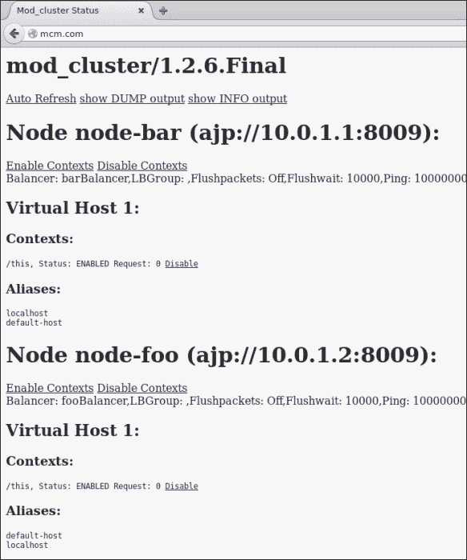

    显示具有相同应用程序上下文路径的节点信息的 mod_cluster 管理页面

1.  现在是时候查看我们的两个网站，`bar.com`和`foo.com`是否被我们的 Apache 配置正确均衡和提供服务了：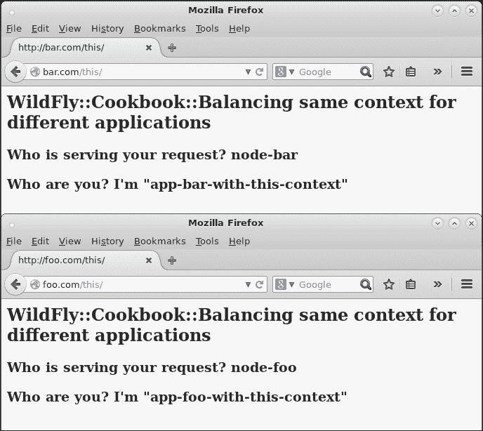

    显示 bar.com 和 foo.com 网站的主页

    为了确保一切正常工作，您应该在`node-bar`日志中找到以下条目：

    ```java
    00:37:42,053 INFO  [stdout] (default task-1) ********************************+
    00:37:42,054 INFO  [stdout] (default task-1) I'm serving your request and I'm "app-bar-with-this-context"
    00:37:42,054 INFO  [stdout] (default task-1) ********************************+
    ```

    对于`node-foo`，您应该找到以下日志条目：

    ```java
    00:37:43,709 INFO  [stdout] (default task-1) ********************************+
    00:37:43,709 INFO  [stdout] (default task-1) I'm serving your request and I'm "app-foo-with-this-context"
    00:37:43,709 INFO  [stdout] (default task-1) ********************************+
    ```

太好了，一切如预期工作！

## 它是如何工作的...

大部分配置都在 Apache 端，并且是关于我们如何配置虚拟主机。我们需要指定一个`mod_cluster`指令，即`CreateBalancers`。它们定义了在包含的虚拟主机中如何创建均衡器，因此您可以控制哪个均衡器处理您的请求（如我们的案例所示）。

此`mod_cluster`指令可以有以下值：

+   `0`：在 Apache HTTPD 中定义的所有虚拟主机中创建均衡器

+   `1`：不创建均衡器（至少需要一个`ProxyPass`/`ProxyPassMatch`来定义均衡器名称）

+   `2`：仅创建名为`myclsuter`的主要均衡器，这是默认设置。

根据前面的定义，对于`bar.com`网站，我们使用了以下定义：

```java
Listen 10.0.0.1:80
<VirtualHost 10.0.0.1:80>
        ServerName bar.com
        <Directory />
                Order deny,allow
                Deny from all
                Allow from all
        </Directory>
        EnableMCPMReceive On
        CreateBalancers 1
        ProxyPass / balancer://barBalancer/this
</VirtualHost>
```

对于`foo.com`网站，我们使用了以下定义：

```java
Listen 10.0.0.2:80
<VirtualHost 10.0.0.2:80>
        ServerName foo.com
        <Directory />
                Order deny,allow
                Deny from all
                Allow from all
        </Directory>
        EnableMCPMReceive On
        CreateBalancers 1
        ProxyPass / balancer://fooBalancer/this
</VirtualHost>
```

因此，我们命令 Apache 使用均衡器`barBalancer`来处理`bar.com`请求，并使用`fooBalancer`来处理`foo.com`请求。在 WildFly 端，我们必须将`mod_cluster`子系统中的均衡器名称与相对节点匹配。

我们通过在`mod_cluster`子系统定义属性`balancer`来实现这一点。该属性被赋值为启动时传递的属性，名为`balancer.name`。以下是我们的配置：

```java
<subsystem >
    <mod-cluster-config advertise-socket="modcluster" advertise="false" proxy-list="${proxy.list}" connector="ajp" balancer="${balancer.name}">
        <dynamic-load-provider>
            <load-metric type="cpu"/>
        </dynamic-load-provider>
    </mod-cluster-config>
</subsystem>
```

我们还需要指定哪个 Apache 正在为我们提供服务，通过使用`proxy-list`属性，该属性以名为`proxy.list`的属性设置，我们在命令行中传递。

## 参见

为了更好地理解 Apache 指令，请查看以下网站的文档：

+   [`docs.jboss.org/mod_cluster/1.2.0/html/native.config.html`](http://docs.jboss.org/mod_cluster/1.2.0/html/native.config.html)

+   [`httpd.apache.org/docs/2.2/mod/mod_proxy.html#proxypass`](http://httpd.apache.org/docs/2.2/mod/mod_proxy.html#proxypass)

# 滚动更新

在这个配方中，您将学习如何使用滚动更新来更新您的应用程序，同时仍然提供服务可用性。为了实现这一点，我们需要从 Apache 到 WildFly 配置很多东西，并编写测试应用程序。我们还假设 Apache HTTPD 的安装和配置基于本章前两个配方。

## 准备工作

对于这个配方，我们需要名为`rolling-test`的应用程序，您可以在我的 GitHub 仓库中找到它。如果您跳过了第二章中关于*使用部署文件夹管理应用程序*的配方，请参阅它以下载您将需要的所有源代码和项目。

要构建应用程序，请按以下步骤操作：

```java
$ cd ~/WFC/github/wildfly-cookbook
$ cd rolling-test
$ mvn -e clean package
```

## 如何操作…

让我们从 WildFly 安装目录`$WILDFLY_HOME`创建四个文件夹，每个文件夹代表一个服务器节点。

1.  打开终端并执行以下命令：

    ```java
    $ cd $WILDFLY_HOME
    $ cp -a standalone bl-rolling-node-1
    $ cp -a standalone bl-rolling-node-2
    $ cp -a standalone bl-rolling-node-3
    $ cp -a standalone bl-rolling-node-4
    ```

1.  现在，让我们将`rolling-test-1.0.war`网络应用程序复制到我们刚刚创建的每个节点的`deployments`文件夹中，如下所示：

    ```java
    $ cp ~/WFC/github/wildfly-cookbook/rolling-test/target/rolling-test-1.0.war bl-rolling-node-1/deployments/
    $ cp ~/WFC/github/wildfly-cookbook/rolling-test/target/rolling-test-1.0.war bl-rolling-node-2/deployments/
    $ cp ~/WFC/github/wildfly-cookbook/rolling-test/target/rolling-test-1.0.war bl-rolling-node-3/deployments/
    $ cp ~/WFC/github/wildfly-cookbook/rolling-test/target/rolling-test-1.0.war bl-rolling-node-4/deployments/
    ```

1.  现在，让我们为每个节点生成一个虚拟 IP：

    ```java
    $ sudo ifconfig eth0:2 10.0.1.1 netmask 255.255.255.0
    $ sudo ifconfig eth0:3 10.0.1.2 netmask 255.255.255.0
    $ sudo ifconfig eth0:4 10.0.1.3 netmask 255.255.255.0
    $ sudo ifconfig eth0:5 10.0.1.4 netmask 255.255.255.0
    ```

1.  编辑每个 WildFly 节点的`standalone-ha.xml`文件，并将`infinispan`子系统的名为`web`的`cache-container` XML 元素替换为以下 XML 代码：

    ```java
    <cache-container name="web" default-cache="repl" module="org.wildfly.clustering.web.infinispan">
      <transport lock-timeout="60000"/>
      <replicated-cache name="repl" mode="SYNC"batching="true">
        <locking isolation="REPEATABLE_READ"/>
      </replicated-cache>
      <distributed-cache name="dist" mode="ASYNC" batching="true" l1-lifespan="0" owners="2">
        <file-store/>
      </distributed-cache>
    </cache-container>
    ```

1.  现在，让我们回到 Apache 配置并编辑`mod_cluster.conf`。我们需要替换整个配置，如下所示：

    ```java
    LoadModule slotmem_module modules/mod_slotmem.so
    LoadModule manager_module modules/mod_manager.so
    LoadModule proxy_cluster_module modules/mod_proxy_cluster.so
    LoadModule advertise_module modules/mod_advertise.so

    Listen 10.0.0.1:80
    <VirtualHost 10.0.0.1:80>
            <Location /mcm>
                    SetHandler mod_cluster-manager
                    Order deny,allow
                    Deny from all
                    Allow from 10.0.0.1
            </Location>
    </VirtualHost>

    Listen 10.0.0.1:6666
    <VirtualHost 10.0.0.1:6666>
            <Directory />
                    Order deny,allow
                    Deny from all
                    Allow from 10.0.0.1
            </Directory>
            ServerAdvertise on http://10.0.0.1:6666
            EnableMCPMReceive
    </VirtualHost>

    Listen 10.0.0.2:80
    <VirtualHost 10.0.0.2:80>
            ServerName rolling.com
            <Directory />
                    Order deny,allow
                    Deny from all
                    Allow from all
            </Directory>
            EnableMCPMReceive On

            RewriteEngine On
            RewriteCond %{REQUEST_URI} !^/(rolling/.*)$
            RewriteRule ^/(.*)$ /rolling/$1 [P,L]

            ProxyPass / balancer://mycluster/rolling stickysession=JSESSIONID|jsessionid nofailover=Off
            ProxyPassReverse /rolling /
            ProxyPassReverseCookieDomain / rolling.com
            ProxyPassReverseCookiePath /rolling /
    </VirtualHost>
    ```

1.  为第二个虚拟主机添加另一个虚拟 IP，如下所示：

    ```java
    $ sudo ifconfig eth0:6 10.0.0.2 netmask 255.255.255.0
    ```

1.  现在，作为 root 用户，编辑`/etc/hosts`文件并添加以下指令：

    ```java
    10.0.0.2 rolling.com
    ```

1.  现在我们已经准备好启动 Apache 和所有四个 WildFly 节点。

    对于 Apache，请按以下步骤操作：

    ```java
    $ sudo ./httpd -k restart -f /opt/httpd/conf/httpd.conf
    $ tail -f ../logs/{access,error}_log
    ==> ../logs/access_log <==

    ==> ../logs/error_log <==
    [Fri Oct 17 15:22:34 2014] [warn] Init: Session Cache is not configured [hint: SSLSessionCache]
    [Fri Oct 17 15:22:34 2014] [warn] httpd version 2.2.29 mismatch detected
    [Fri Oct 17 15:22:34 2014] [notice] Digest: generating secret for digest authentication ...
    [Fri Oct 17 15:22:34 2014] [notice] Digest: done
    [Fri Oct 17 15:22:34 2014] [warn] httpd version 2.2.29 mismatch detected
    [Fri Oct 17 15:22:34 2014] [notice] Advertise initialized for process 26498
    [Fri Oct 17 15:22:34 2014] [notice] Apache/2.2.29 (Unix) mod_ssl/2.2.29 OpenSSL/1.0.1e-fips DAV/2 mod_cluster/1.2.6.Final configured -- resuming normal operations
    ```

1.  对于 WildFly 节点，打开四个不同的终端窗口，并在每个窗口中执行以下操作：

    +   对于`node-1`：

        ```java
        ./bin/standalone.sh -Djboss.server.base.dir=bl-rolling-node-1 --server-config=standalone-ha.xml -Djboss.bind.address=10.0.1.1 -Djboss.management.http.port=19990 -Djboss.node.name=node-1
        ```

    +   对于`node-2`：

        ```java
        ./bin/standalone.sh -Djboss.server.base.dir=bl-rolling-node-2 --server-config=standalone-ha.xml -Djboss.bind.address=10.0.1.2 -Djboss.management.http.port=29990 -Djboss.node.name=node-2
        ```

    +   对于`node-3`：

        ```java
        ./bin/standalone.sh -Djboss.server.base.dir=bl-rolling-node-3 --server-config=standalone-ha.xml -Djboss.bind.address=10.0.1.3 -Djboss.management.http.port=39990 -Djboss.node.name=node-3
        ```

    +   对于`node-4`：

        ```java
        ./bin/standalone.sh -Djboss.server.base.dir=bl-rolling-node-4 --server-config=standalone-ha.xml -Djboss.bind.address=10.0.1.4 -Djboss.management.http.port=49990 -Djboss.node.name=node-4
        ```

1.  打开浏览器并将其指向以下网站，刷新页面几次：

    ```java
    http://rolling.com
    ```

    您应该看到以下内容：

    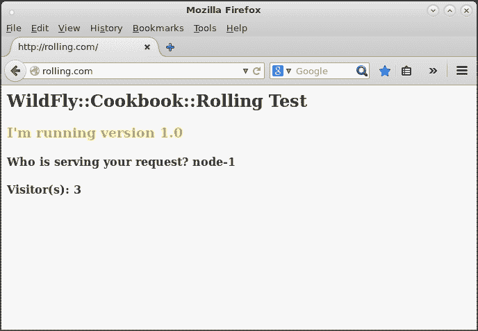

    Apache 通过服务器名`rolling.com`提供滚动应用程序服务

1.  不必花太多时间查看日志，让我们停止`node-1`，或者你所在的任何节点。刷新页面几次：

    由集群中的另一个成员提供的滚动应用程序，节点-2

    好的，它工作了。现在假设我们的超级老板希望用我们伟大应用程序的最新版本进入生产。显然，他希望昨天就完成，显然他不想向客户提供一个**服务不可用**的状态。

    你知道答案：**是的，先生，是的**。

1.  编辑`rolling-test`应用程序的`index.jsp`文件，并通过以下方式替换`<h3>...</h3>` HTML 标签的内容：

    ```java
    <h3 style="color:#ccff00;">I'm running version 1.1</h3>
    ```

1.  现在我们需要增加应用程序版本；我们可以通过编辑`rolling-test`项目的`pom.xml` Maven 文件，并按照以下方式更改其`<version>`标签来完成：

    ```java
    <version>1.1</version>
    ```

1.  现在，我们可以按照以下方式再次构建项目：

    ```java
    $ cd ~/WFC/github/wildfly-cookbook
    $ cd rolling-test
    $ mvn -e clean package
    ```

1.  停止`node-2`并通过以下方式更新应用程序：移除旧包并复制新包到`node-1`和`node-2`：

    ```java
    $ rm -rf /opt/wildfly/bl-rolling-node-1/deployments/rolling-test-1.0.war
    $ rm -rf /opt/wildfly/bl-rolling-node-2/deployments/rolling-test-1.0.war
    $ cp rolling-test-1.1.war /opt/wildfly/bl-rolling-node-1/deployments/
    $ cp rolling-test-1.1.war /opt/wildfly/bl-rolling-node-2/deployments/
    ```

    ### 小贴士

    我们可以这样做，因为我们正在使用独立模式。不过，请记住，在生产环境中禁用热部署，以防万一。

1.  现在，像往常一样重新启动两个节点：

    ```java
    $ ./bin/standalone.sh -Djboss.server.base.dir=bl-rolling-node-1 --server-config=standalone-ha.xml -Djboss.bind.address=10.0.1.1 -Djboss.management.http.port=19990 -Djboss.node.name=node-1
    $ ./bin/standalone.sh -Djboss.server.base.dir=bl-rolling-node-2 --server-config=standalone-ha.xml -Djboss.bind.address=10.0.1.2 -Djboss.management.http.port=29990 -Djboss.node.name=node-2
    ```

1.  返回浏览器并刷新页面；你应该得到我们超级老板希望的新功能，如下所示：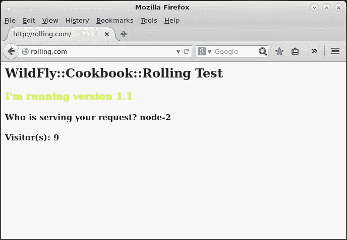

    具有新功能的滚动应用程序

    并且是的，我们没有丢失会话。现在我们需要升级其他两个节点，`node-3`和`node-4`，否则用户可能会通过访问应用程序得到以下页面：

    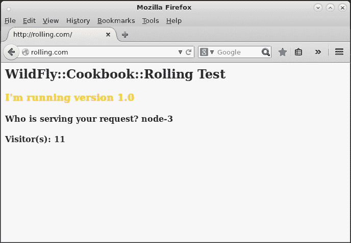

    集群中每个节点都需要更新滚动应用程序

1.  因此，让我们停止`node-3`和`node-4`，移除旧的艺术品，并按照以下方式部署新的：

    ```java
    $ rm -rf /opt/wildfly/bl-rolling-node-3/deployments/rolling-test-1.0.war
    $ rm -rf /opt/wildfly/bl-rolling-node-4/deployments/rolling-test-1.0.war
    $ cp rolling-test-1.1.war /opt/wildfly/bl-rolling-node-3/deployments/
    $ cp rolling-test-1.1.war /opt/wildfly/bl-rolling-node-4/deployments/
    ```

1.  现在，像往常一样重新启动两个节点：

    ```java
    $ ./bin/standalone.sh -Djboss.server.base.dir=bl-rolling-node-3 --server-config=standalone-ha.xml -Djboss.bind.address=10.0.1.3 -Djboss.management.http.port=39990 -Djboss.node.name=node-3
    $ ./bin/standalone.sh -Djboss.server.base.dir=bl-rolling-node-4 --server-config=standalone-ha.xml -Djboss.bind.address=10.0.1.4 -Djboss.management.http.port=49990 -Djboss.node.name=node-4
    ```

1.  现在所有节点都有相同的应用程序，通过逐个停止节点并刷新页面，显然留下一个节点运行，我们应该有一个如下截图所示的场景：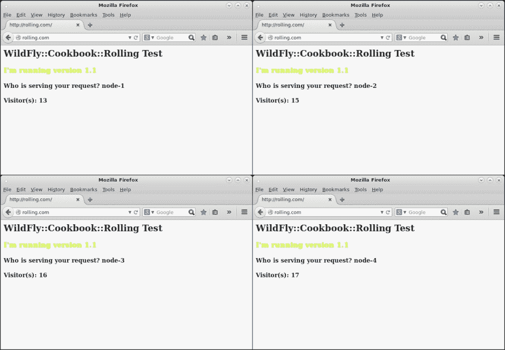

    所有 4 个节点的滚动更新已完成

完美！让我们去老板的办公室告诉他我们已经完成了！

## 它是如何工作的…

嗯，实际上整个配置都在 Apache 端。在 WildFly 中我们没有做太多。正如你所看到的，我们配置了一个复制缓存，仅用于演示目的。复制缓存和分布式缓存之间的区别在于，在第一种情况下，所有信息都复制到所有节点，而在第二种情况下，会话仅复制到选定的节点。那些节点，如果没有其他指定，将随机选择。

从配置中，你可以通过`owners`属性告诉缓存将多少节点用于会话的分布。

+   我们还依赖于`standalone-ha`配置文件，使用其默认值，并启动它，同时为每个节点添加一些自定义绑定。

+   我们创建了一个由四个节点组成的集群。每个节点都有自己的应用程序副本。

+   然后，我们停止了两个节点。停止两个节点允许用户使用我们的应用程序，因为他们的请求会在其他可用的节点上均衡。

    ### 注意

    滚动更新可能更加困难；这完全取决于应用程序的功能和域模型的后向兼容性，这是会话中包含的内容。在我们的例子中，跨集群节点的数据对于应用程序的第一个版本和最后一个版本都是相同的。

## 还有更多...

在域模式下，情况大致相同：

+   首先，你需要逻辑上将集群分成两部分，就像我们在滚动更新期间所做的那样。为此，我们应该配置一个代表集群前半部分的服务器组——让我们称它为`sg-rolling-1`——然后配置另一个服务器组，命名为`sg-rolling-2`，它将代表集群的后半部分。

+   在进行第一次滚动更新时，你会停止第一个服务器组，卸载旧的应用程序，然后部署新的应用程序。一旦部署完成，你可以重新启动服务器组。

+   当所有节点都启动并运行时，你可以为第二个服务器组重复此操作。这就是在域模式下你应该做的。

## 参见

如果你需要更深入地了解 WildFly 的聚类，请参阅第五章，*使用 CLI 管理数据源子系统*。
