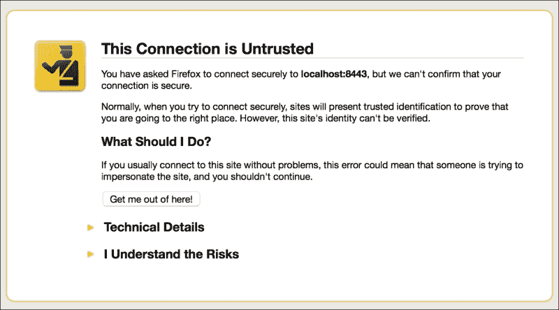
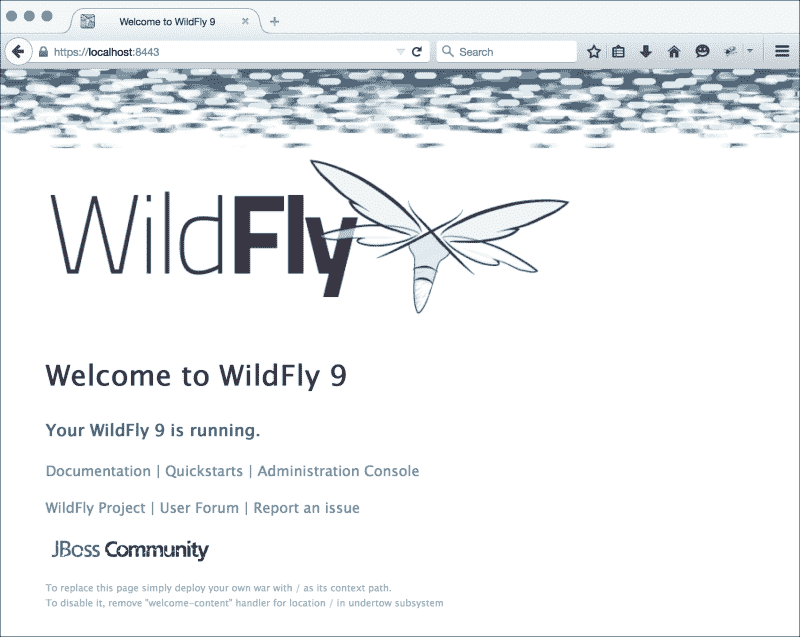
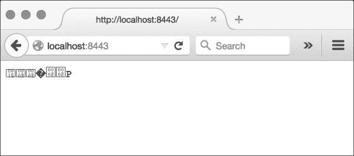
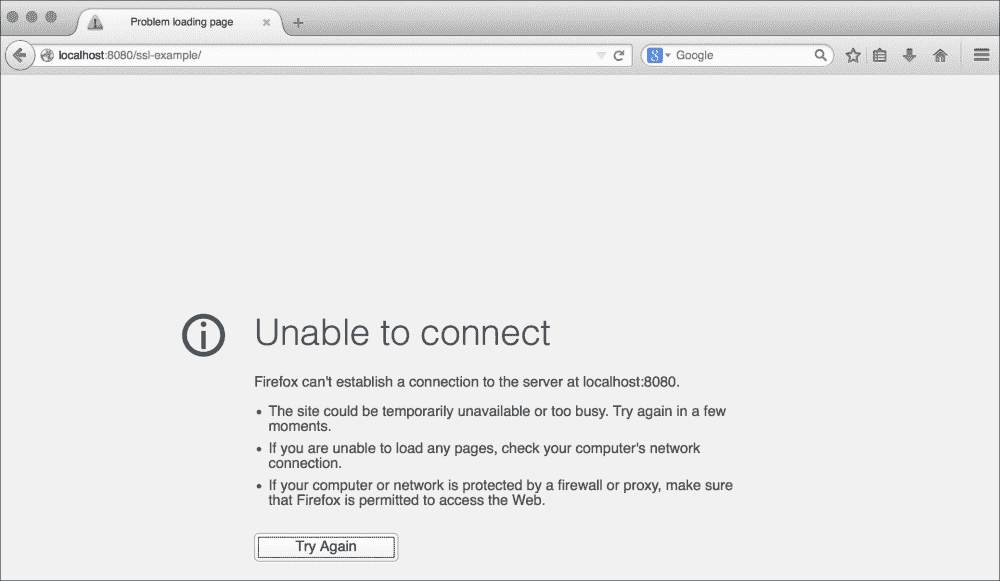
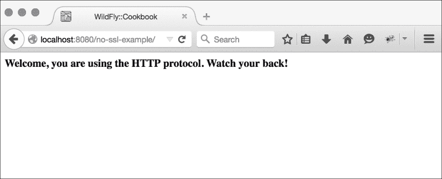
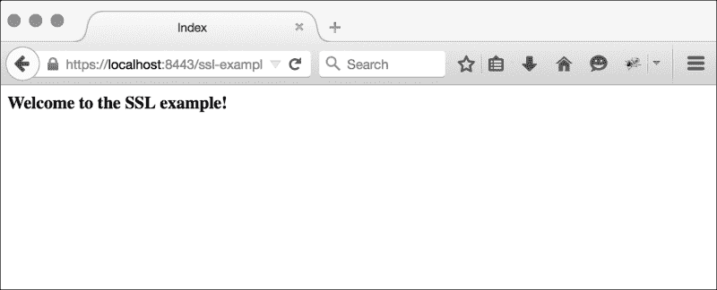
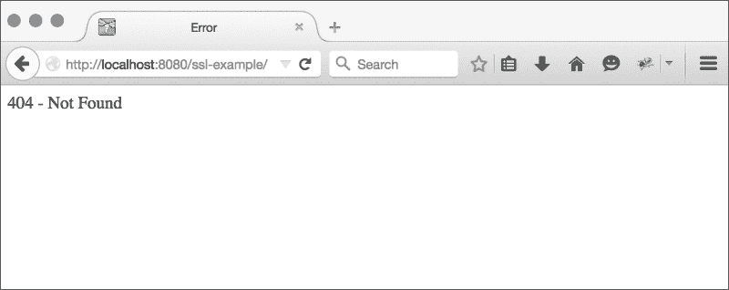
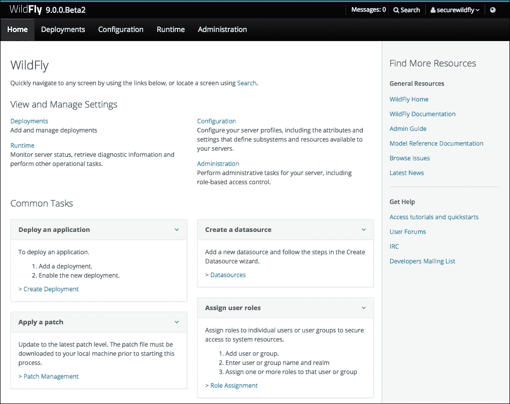

# 第十章。强化 WildFly 通信

在本章中，你将学习以下食谱：

+   使用 HTTPS 保护 WildFly

+   使用 HTTPS 保护特定应用程序

+   使用 HTTPS 保护 WildFly 控制台

+   使用 HTTPS 保护域和主机控制器之间的通信

# 简介

在本章中，你将学习如何从通信通道的角度来保护你的 WildFly 系统，即 HTTPS 协议。如果系统安全是一个关注点，你需要提供这样的功能。顺便说一句，在任何一个层面对系统进行安全保护时，都要关注性能，因为它可能会造成一些开销。

我们将学习如何在 WildFly 系统的不同阶段提供安全性，即：

+   保护你的应用程序通信访问协议

+   保护 WildFly 管理控制台

+   保护域控制器与所有主机控制器之间的通信安全

尽管最后两点对性能的影响不大，因为它们是管理工具，但第一个可能会影响你的性能。顺便说一句，在企业环境中，通常情况下，你的 WildFly 中间件平台位于反向代理（即 Apache HTTPD）之后，进入**非军事区**（**DMZ**）。因此，你应该最终保护反向代理，而不是 Apache 和 WildFly 之间的流量，这只会造成 CPU 开销。如果你的网络基础设施已经在 DMZ 内提供了安全，那么在 Apache 和 WildFly 之间避免使用 HTTPS。

好的，现在我已经与我的良心和解，让我们开始吧！

# 使用 HTTPS 保护 WildFly

在这个食谱中，我们将学习如何使用安全通道为你的应用程序提供服务，这是通过使用 HTTPS 协议来实现的。如果你对隐私有顾虑，这个食谱将展示你如何保护你的数据流量。顺便说一句，保护你的应用程序需要不同的考虑和方面，这些问题应该由开发人员和运维团队解决。

## 准备工作

要开始，让我们首先创建一个`ad-hoc`文件夹来运行我们的 WildFly。在终端窗口中执行以下命令：

```java
$ cd $WILDFLY_HOME
$ cp -a standalone sec-std-node-1
```

现在是时候创建我们的密钥库，它用于加密数据流量。我们将使用一个密码来打开密钥库文件本身，并使用一个密码来加载别名。

1.  打开一个新的终端窗口并输入以下命令：

    ```java
    $ cd $WILDFLY_HOME
    $ cd sec-std-node-1/configuration
    $ keytool -v -genkey -alias wildfly.ssl -keypass alias.2015 -keyalg RSA -keysize 2048 -sigalg SHA1withRSA -keystore wildfly.ssl.keystore -storepass keystore.2015

    What is your first and last name?
      [Unknown]:  WildFly Cookbook
    What is the name of your organizational unit?
      [Unknown]:  Packt Publishing
    What is the name of your organization?
      [Unknown]:  packtpub.com
    What is the name of your City or Locality?
      [Unknown]:  Birmingham
    What is the name of your State or Province?
      [Unknown]:  GB
    What is the two-letter country code for this unit?
      [Unknown]:  UK
    Is CN=WildFly Cookbook, OU=Packt Publishing, O=packtpub.com, L=Birmingham, ST=GB, C=UK correct?
      [no]:  yes

    Generating 2,048 bit RSA key pair and self-signed certificate (SHA1withRSA) with a validity of 90 days
      for: CN=WildFly Cookbook, OU=Packt Publishing, O=packtpub.com, L=Birmingham, ST=GB, C=UK

    [Storing wildfly.ssl.keystore]
    ```

1.  好的，现在我们已经创建了用于加密 HTTP 消息的密钥库。让我们通过执行以下命令来检查其完整性：

    ```java
    $ keytool -list -v -keystore wildfly.ssl.keystore
    Enter keystore password:

    Keystore type: JKS
    Keystore provider: SUN

    Your keystore contains 1 entry

    Alias name: wildfly.ssl
    Creation date: Nov 21, 2014
    Entry type: PrivateKeyEntry
    Certificate chain length: 1
    Certificate[1]:
    Owner: CN=WildFly Cookbook, OU=Packt Publishing, O=packtpub.com, L=Birmingham, ST=GB, C=UK
    Issuer: CN=WildFly Cookbook, OU=Packt Publishing, O=packtpub.com, L=Birmingham, ST=GB, C=UK
    Serial number: 5514d1d1
    Valid from: Fri Nov 21 10:36:31 CET 2014 until: Thu Feb 19 10:36:31 CET 2015
    Certificate fingerprints:
       MD5:  D3:FA:9D:20:6D:79:DF:83:C3:50:B1:AC:23:B2:7D:9F
       SHA1: 89:AB:67:27:23:A4:89:85:06:10:FF:70:C6:6B:05:3D:14:DA:2D:AD
       SHA256: 7C:DD:A7:E3:44:B4:C5:9F:05:EE:87:2D:75:35:C2:3C:90:00:1B:DF:67:89:9B:13:33:F7:58:55:74:89:F7:7C
       Signature algorithm name: SHA1withRSA
       Version: 3

    Extensions:

    #1: ObjectId: 2.5.29.14 Criticality=false
    SubjectKeyIdentifier [
    KeyIdentifier [
    0000: 1A F5 F7 EC D8 88 D9 80   DE 34 E7 A9 00 75 6A 74  .........4...ujt
    0010: E8 60 56 D4                                        .`V.
    ]
    ]

    *******************************************
    *******************************************
    ```

好的，一切正常！！！

我们现在已经准备好配置 WildFly 以通过 HTTPS 公开自身和我们的应用程序。

## 如何做到这一点...

我们现在将对 WildFly 的配置文件进行一些修改，以实现我们的目标。我们将看到两种操作模式：独立模式和域模式。

### 独立模式

1.  首先，像往常一样启动一个 WildFly 实例：

    ```java
    $ cd $WILDFLY_HOME
    $ ./bin/standalone.sh -Djboss.server.base.dir=sec-std-node-1
    ```

1.  在不同的终端窗口中，连接到 WildFly CLI 并运行以下代码：

    ```java
    $ ./bin/jboss-cli.sh --connect
    [standalone@localhost:9990 /] /core-service=management/security-realm=SSLRealm:add()
    {"outcome" => "success"}
    [standalone@localhost:9990 /] /core-service=management/security-realm=SSLRealm/server-identity=ssl:add(keystore-path=wildfly.ssl.keystore, keystore-relative-to=jboss.server.config.dir,keystore-password=keystore.2015, alias=wildfly.ssl, key-password=alias.2015)
    {
        "outcome" => "success",
        "response-headers" => {
            "operation-requires-reload" => true,
            "process-state" => "reload-required"
        }
    }
    [standalone@localhost:9990 /] :reload()
    {
        "outcome" => "success",
        "result" => undefined
    }
    [standalone@localhost:9990 /] /subsystem=undertow/server=default-server/https-listener=https:add(socket-binding=https, security-realm=SSLRealm)
    {"outcome" => "success"}
    [standalone@localhost:9990 /]
    ```

    好的，我们已经完成了配置。

1.  让我们通过打开浏览器并将它指向 `https://localhost:8443/` 来测试一切：

    浏览器警告用户关于自签名证书，因此不受信任

1.  首先，浏览器会警告你关于一个安全问题；只需点击 **添加异常** 按钮，然后，在下一个弹出窗口中，点击 **确认安全异常** 按钮。一旦确认，浏览器将显示我们的 WildFy 实例正在通过 HTTPS 运行，如下所示：

    浏览器通过 HTTPS 显示 WildFly

### 域

1.  首先创建一个 `ad-hoc` 文件夹以在域模式下操作：

    ```java
    $ cd $WILDFLY_HOME
    $ cp -a domain sec-dmn-1
    ```

1.  从本食谱的 *准备就绪* 部分中，看看您如何创建密钥库，或者从 `sec-std-node-1` 文件夹中复制它（如果您遵循了 *独立* 部分的步骤），如下所示：

    ```java
    $ cp sec-std-node-1/configuration/wildfly.ssl.keystore sec-dmn-1/configuration
    ```

1.  现在按照以下方式以域模式启动 WildFly：

    ```java
    $ cd $WILDFLY_HOME
    $ ./bin/domain.sh -Djboss.domain.base.dir=sec-dmn-1
    ```

1.  接下来，在另一个终端窗口中，连接到 WildFly CLI 并执行以下操作：

    ```java
    $ ./bin/jboss-cli.sh --connect
    [domain@localhost:9990 /] /host=master/core-service=management/security-realm=SSLRealm:add()
    {
        "outcome" => "success",
        "result" => undefined,
        "server-groups" => undefined
    }
    [domain@localhost:9990 /] /host=master/core-service=management/security-realm=SSLRealm/server-identity=ssl:add(keystore-path=wildfly.ssl.keystore, keystore-relative-to=jboss.domain.config.dir,keystore-password=keystore.2015, alias=wildfly.ssl, key-password=alias.2015)
    {
        "outcome" => "success",
        "response-headers" => {
            "operation-requires-reload" => true,
            "process-state" => "reload-required"
        },
        "result" => undefined,
        "server-groups" => undefined
    }
    [domain@localhost:9990 /] :reload-servers
    {
        "outcome" => "success",
        "result" => undefined,
        "server-groups" => undefined,
        "response-headers" => {"process-state" => "reload-required"}
    }
    [domain@localhost:9990 /]
    ```

1.  如我们所知，WildFly 默认域配置提供了两个服务器组，一个绑定到 `full` 配置文件，另一个绑定到 `full-ha` 配置文件（这个没有活动服务器），我们可以为 `full` 配置文件启用 HTTPS 协议。在同一个 CLI 控制台中，运行以下代码：

    ```java
    [domain@localhost:9990 /] /profile=full/subsystem=undertow/server=default-server/https-listener=https:add(socket-binding=https, security-realm=SSLRealm)
    {
        "outcome" => "success",
        "result" => undefined,
        "server-groups" => {"main-server-group" => {"host" => {"master" => {
            "server-one" => {"response" => {"outcome" => "success"}},
            "server-two" => {"response" => {"outcome" => "success"}}
        }}}},
        "response-headers" => {"process-state" => "reload-required"}
    }
    [domain@localhost:9990 /]
    ```

    请记住，一旦配置已重新加载，对配置文件的操作将对引用 `full` 配置文件的所有服务器组中的所有服务器传播更改。

    好的，我们已经完成了配置。

1.  让我们通过打开浏览器并将它指向 `https://localhost:8443/` 来测试一切：

    浏览器警告用户关于自签名证书，因此不受信任

1.  首先，浏览器会警告你关于一个安全问题；只需点击 **添加异常** 按钮，然后，在下一个弹出窗口中，点击 **确认安全异常** 按钮。一旦确认，浏览器将显示我们的 WildFy 实例正在通过 HTTPS 运行，如下所示：

    浏览器通过 HTTPS 显示 WildFly

## 它是如何工作的...

在 WildFly 方面，我们在 `management` 部分中声明了一个新的域，命名为 `SSLRealm`。

在新的域中，我们声明了密钥库，其中包含用于 HTTPS 协议加密数据的证书。

最后，对于两种操作模式，我们在 `Undertow` 子系统中添加了 `https-listener`，引用了新创建的域和 `https` 套接字绑定。

这就是 WildFly 通过安全通道（即 HTTPS）提供服务所需的所有内容。

## 还有更多...

如您从配置文件 `standalone.xml` 和 `domain.xml` 中注意到的那样，我们保留了 `http-listener`。事实上，我们的应用程序也通过 HTTP 可用，这是显而易见的，所以以下两个 URL 都会提供我们的 WildFly 欢迎页面以及任何应用程序：

+   `http://localhost:8080`

+   `https://localhost:8443`

如果您看到以下页面，那么是因为您正确地输入了主机名和端口号（即`localhost`和`8443`），但您使用了 HTTP 方案，而不是 HTTPS 方案：



浏览器尝试使用 US-ASCII 编码显示加密数据

然而，如果您只想提供安全通道，请从配置中删除`http-listener`声明，这样您就会得到安全保障。

请记住，禁用`http-listener`需要一点注意，因为它被其他子系统（如`ejb3`和`webservices`）引用（这两个都与`http-remoting-connector`相关，它绑定到`http-listener`）。

这样做，您的应用程序将无法通过 HTTP 访问，如下面的截图所示：



浏览器无法通过 HTTP 访问应用程序

## 参见…

+   要深入了解 keytool 命令，请参阅 Oracle 官方文档，链接为[`docs.oracle.com/javase/8/docs/technotes/tools/unix/keytool.html`](https://docs.oracle.com/javase/8/docs/technotes/tools/unix/keytool.html)。

# 使用 HTTPS 保护特定应用程序

在这个菜谱中，我们将学习如何为特定应用程序使用安全通道。这与您的应用程序如何被访问有关，而不是与如何保护您的数据模型、功能以及应用程序附带的所有功能有关。保护应用程序需要不同的考虑和方面，这些通常需要在开发端解决。

## 准备工作

要开始，让我们首先创建一个`ad-hoc`文件夹来运行我们的 WildFly。在终端窗口中执行以下命令：

```java
$ cd $WILDFLY_HOME
$ cp -a standalone sec-std-node-2
```

现在是时候创建我们的密钥库了，它用于加密特定应用程序的数据流量：

1.  打开一个新的终端窗口，并运行以下代码：

    ```java
    $ cd $WILDFLY_HOME
    $ cd sec-std-node-2/configuration
    $ keytool -v -genkey -alias wildfly.ssl.app -keyalg RSA -keysize 2048 -sigalg SHA1withRSA -keystore wildfly.ssl.app.keystore -storepass keystore.2015 -keypass alias.2015

    What is your first and last name?
      [Unknown]:  WildFly Cookbook
    What is the name of your organizational unit?
      [Unknown]:  Packt Publishing
    What is the name of your organization?
      [Unknown]:  packtpub.com
    What is the name of your City or Locality?
      [Unknown]:  Birmingham
    What is the name of your State or Province?
      [Unknown]:  GB
    What is the two-letter country code for this unit?
      [Unknown]:  UK
    Is CN=WildFly Cookbook, OU=Packt Publishing, O=packtpub.com, L=Birmingham, ST=GB, C=UK correct?
      [no]:  yes

    Generating 2,048 bit RSA key pair and self-signed certificate (SHA1withRSA) with a validity of 90 days
      for: CN=WildFly Cookbook, OU=Packt Publishing, O=packtpub.com, L=Birmingham, ST=GB, C=UK

    [Storing wildfly.ssl.app.keystore]
    ```

1.  好的，现在我们已经创建了用于加密 HTTP 消息的密钥库。让我们通过执行以下命令来检查其完整性：

    ```java
    $ keytool -list -v -keystore wildfly.ssl.app.keystore
    Enter keystore password:

    Keystore type: JKS
    Keystore provider: SUN

    Your keystore contains 1 entry

    Alias name: wildfly.ssl.app
    Creation date: Nov 21, 2014
    Entry type: PrivateKeyEntry
    Certificate chain length: 1
    Certificate[1]:
    Owner: CN=WildFly Cookbook, OU=Packt Publishing, O=packtpub.com, L=Birmingham, ST=GB, C=UK
    Issuer: CN=WildFly Cookbook, OU=Packt Publishing, O=packtpub.com, L=Birmingham, ST=GB, C=UK
    Serial number: 17c96347
    Valid from: Fri Nov 21 16:04:21 CET 2014 until: Thu Feb 19 16:04:21 CET 2015
    Certificate fingerprints:
       MD5:  17:F1:E5:1D:93:4D:FE:AD:43:5A:7A:D6:79:9E:3A:6A
       SHA1: 90:7B:26:B0:07:6D:B2:E3:AD:A1:81:D2:F1:AA:47:C0:8D:0B:6D:43
       SHA256: C9:F3:AC:23:B7:54:45:AC:84:D7:D6:D7:A7:5D:B9:7C:ED:99:95:EC:9C:B9:9C:E0:47:68:30:C0:48:9D:D8:BD
       Signature algorithm name: SHA1withRSA
       Version: 3

    Extensions:

    #1: ObjectId: 2.5.29.14 Criticality=false
    SubjectKeyIdentifier [
    KeyIdentifier [
    0000: 8C 21 34 9C F6 30 39 BD   21 43 CF 34 C4 31 A1 B7  .!4..09.!C.4.1..
    0010: 81 7E E6 D1                                        ....
    ]
    ]

    *******************************************
    *******************************************
    ```

    好的，一切正常！

    我们现在准备好配置 WildFly 以通过 HTTPS 公开我们的特定应用程序。

1.  要测试 HTTPS 配置，我们需要两个名为`ssl-example`和`no-ssl-example`的应用程序，您可以在我的 GitHub 仓库中找到它们。如果您跳过了第二章中的*使用部署文件夹管理应用程序*菜谱，请参阅它以下载您将需要的所有源代码和项目。

1.  要构建应用程序，请执行以下操作：

    ```java
    $ cd ~/WFC/github/wildfly-cookbook
    $ mvn -e clean package -f ssl-example/pom.xml
    $ mvn -e clean package -f no-ssl-example/pom.xml
    ```

1.  完成后，将`no-ssl-example.war`和`ssl-example.war`（位于它们各自的`target`文件夹下）复制到您的本地`$WILDFLY_HOME`文件夹中。

## 如何做到这一点…

现在我们将对 WildFly 的配置文件进行一些修改，以实现我们的目标。我们将看到两种操作模式：独立模式和域模式。

### 独立模式

首先，按照以下方式启动一个 WildFly 实例：

```java
$ cd $WILDFLY_HOME
$ ./bin/standalone.sh -Djboss.server.base.dir=sec-std-node-2
```

在另一个终端窗口中，连接到 WildFly CLI 并执行以下操作：

```java
$ cd $WILDFLY_HOME
$ ./bin/jboss-cli.sh --connect
[standalone@localhost:9990 /] /core-service=management/security-realm=AppSSLRealm:add()
{"outcome" => "success"}
[standalone@localhost:9990 /] /core-service=management/security-realm=AppSSLRealm/server-identity=ssl:add(keystore-path=wildfly.ssl.app.keystore, keystore-relative-to=jboss.server.config.dir,keystore-password=keystore.2015, alias=wildfly.ssl.app, key-password=alias.2015)
{
    "outcome" => "success",
    "response-headers" => {
        "operation-requires-reload" => true,
        "process-state" => "reload-required"
    }
}
[standalone@localhost:9990 /] :reload()
{
    "outcome" => "success",
    "result" => undefined
}
[standalone@localhost:9990 /] /subsystem=undertow/server=secure-server:add()
{
    "outcome" => "success",
    "response-headers" => {
        "operation-requires-reload" => true,
        "process-state" => "reload-required"
    }
}
[standalone@localhost:9990 /] :reload
{
    "outcome" => "success",
    "result" => undefined
}
[standalone@localhost:9990 /] /subsystem=undertow/server=secure-server/https-listener=https:add(socket-binding=https, security-realm=AppSSLRealm)
{"outcome" => "success"}
[standalone@localhost:9990 /] /subsystem=undertow/server=secure-server/host=secure-host:add()
{"outcome" => "success"}
[standalone@localhost:9990 /] /subsystem=undertow/server=secure-server:write-attribute(name=default-host,value=secure-host)
{
    "outcome" => "success",
    "response-headers" => {
        "operation-requires-reload" => true,
        "process-state" => "reload-required"
    }
}
[standalone@localhost:9990 /] :reload
{
    "outcome" => "success",
    "result" => undefined
}
[standalone@localhost:9990 /]
```

好的，我们已经完成了配置。

#### 测试

1.  我们现在需要使用 CLI 部署我们的应用程序，如下所示：

    ```java
    [standalone@localhost:9990 /] deploy no-ssl-example.war
    [standalone@localhost:9990 /] deploy ssl-example.war
    [standalone@localhost:9990 /]
    ```

1.  要测试配置，请打开您的浏览器并将其指向`http://localhost:8080/no-ssl-example`。

1.  您应该会看到一个类似于以下页面：

1.  现在，将浏览器指向`https://localhost:8443/ssl-example`。

1.  在安全警告之后，你应该会看到一个类似于以下页面：

现在如果你尝试将模式、端口和上下文应用程序混合，你会看到`ssl-example`应用程序只能通过 HTTPS 访问，而`no-ssl-example`只能通过 HTTP 访问。

### 域

1.  首先，创建一个`ad-hoc`文件夹以在域模式下操作：

    ```java
    $ cd $WILDFLY_HOME
    $ cp -a domain sec-dmn-2
    ```

1.  从本食谱的*准备就绪*部分，看看您如何创建密钥库，或者从`sec-std-node-2`文件夹中复制它（如果您遵循了*独立*部分的步骤），如下所示：

    ```java
    $ cp sec-std-node-2/configuration/wildfly.ssl.app.keystore sec-dmn-2/configuration
    ```

1.  现在以域模式启动 WildFly，如下所示：

    ```java
    $ cd $WILDFLY_HOME
    $ ./bin/domain.sh -Djboss.domain.base.dir=sec-dmn-2
    ```

1.  接下来，在另一个终端窗口中，连接到 WildFly CLI 并执行以下命令：

    ```java
    [domain@localhost:9990 /] /host=master/core-service=management/security-realm=AppSSLRealm:add()
    {
        "outcome" => "success",
        "result" => undefined,
        "server-groups" => undefined
    }
    [domain@localhost:9990 /] /host=master/core-service=management/security-realm=AppSSLRealm/server-identity=ssl:add(keystore-path=wildfly.ssl.app.keystore,keystore-relative-to=jboss.domain.config.dir,keystore-password=keystore.2015,alias=wildfly.ssl.app,key-password=alias.2015)
    {
        "outcome" => "success",
        "response-headers" => {
            "operation-requires-reload" => true,
            "process-state" => "reload-required"
        },
        "result" => undefined,
        "server-groups" => undefined
    }
    [domain@localhost:9990 /] reload --host=master
    [domain@localhost:9990 /]
    ```

    如我们所知，WildFly 默认域配置提供了两个服务器组，一个绑定到`full`配置文件，另一个绑定到`full-ha`配置文件（这个没有活动服务器），我们可以为`full`配置文件启用 HTTPS 协议。

1.  在相同的 CLI 控制台中，执行以下命令：

    ```java
    [domain@localhost:9990 /] /profile=full/subsystem=undertow/server=secure-server:add()
    {
        "outcome" => "success",
        "result" => undefined,
        "server-groups" => {"main-server-group" => {"host" => {"master" => {
            "server-one" => {"response" => {
                "outcome" => "success",
                "response-headers" => {
                    "operation-requires-reload" => true,
                    "process-state" => "reload-required"
                }
            }},
            "server-two" => {"response" => {
                "outcome" => "success",
                "response-headers" => {
                    "operation-requires-reload" => true,
                    "process-state" => "reload-required"
                }
            }}
        }}}}
    }
    [domain@localhost:9990 /] reload --host=master
    [domain@localhost:9990 /] /profile=full/subsystem=undertow/server=secure-server/https-listener=https:add(socket-binding=https,security-realm=AppSSLRealm)
    {
        "outcome" => "success",
        "result" => undefined,
        "server-groups" => {"main-server-group" => {"host" => {"master" => {
            "server-one" => {"response" => {"outcome" => "success"}},
            "server-two" => {"response" => {"outcome" => "success"}}
        }}}}
    }
    [domain@localhost:9990 /] /profile=full/subsystem=undertow/server=secure-server/host=secure-host:add()
    {
        "outcome" => "success",
        "result" => undefined,
        "server-groups" => {"main-server-group" => {"host" => {"master" => {
            "server-one" => {"response" => {"outcome" => "success"}},
            "server-two" => {"response" => {"outcome" => "success"}}
        }}}}
    }
    [domain@localhost:9990 /] /profile=full/subsystem=undertow/server=secure-server:write-attribute(name=default-host,value=secure-host)
    {
        "outcome" => "success",
        "result" => undefined,
        "server-groups" => {"main-server-group" => {"host" => {"master" => {
            "server-one" => {"response" => {
                "outcome" => "success",
                "response-headers" => {
                    "operation-requires-reload" => true,
                    "process-state" => "reload-required"
                }
            }},
            "server-two" => {"response" => {
                "outcome" => "success",
                "response-headers" => {
                    "operation-requires-reload" => true,
                    "process-state" => "reload-required"
                }
            }}
        }}}}
    }
    [domain@localhost:9990 /] reload --host=master
    [domain@localhost:9990 /]
    ```

请记住，一旦配置已重新加载，对配置文件的操作将影响所有属于引用`full`配置文件的服务器组中的服务器。

好的，我们已经完成了配置。

#### 测试

我们现在需要使用 CLI 部署我们的应用程序，如下所示：

```java
[domain@localhost:9990 /] deploy no-ssl-example.war --server-groups=main-server-group
[domain@localhost:9990 /] deploy ssl-example.war --server-groups=main-server-group
[domain@localhost:9990 /]
```

要测试配置，请打开您的浏览器并将其指向以下 URL：

+   `http://localhost:8080/no-ssl-example`

+   `https://localhost:8443/ssl-example`

您应该遵循与独立模式中描述的相同步骤，以及相同的最终页面。

## 它是如何工作的...

在 WildFly 端，使用 CLI，我们在`management`部分创建了一个新的域，命名为`AppSSLRealm`。在新域中，我们声明了密钥库，其中包含用于 HTTPS 协议加密数据的证书。

在`Undertow`子系统上工作，我们添加了一个名为`secure-server`的服务器。然后我们向其添加了`https-listener`，将监听器绑定到`https`套接字绑定配置和`AppSSLRealm`安全域。

最后，我们定义了一个名为`secure-host`的主机，并将其设置为我们的`secure-server`的默认主机。

等一下！我们是如何将`ssl-example.war`应用程序与在`Undertow`子系统声明的`secure-host`配置匹配的？

匹配发生在应用程序级别。在我们的应用程序`WEB-INF`文件夹中的`jboss-web.xml`中，您需要声明以下内容：

```java
<?xml version="1.0" encoding="UTF-8"?>
<jboss-web>
    <server-instance>secure-server</server-instance>
    <virtual-host>secure-host</virtual-host>
</jboss-web>
```

上述 XML 代码指示 WildFly，该应用程序需要绑定到名为`secure-server`的服务器，以及名为`secure-host`的主机。

这样 WildFly（实际上是 Undertow）将使用该特定主机来提供服务。

让我们同时查看这两个配置，以便更好地理解匹配：

| WildFly – Undertow | 应用程序 |
| --- | --- |

|

```java
<server name="secure-server" default-host="secure-host ">
    <https-listener name="https" socket-binding="https" security-realm="SSLRealm"/>
    <host name="secure-host">
        <filter-ref name="server-header"/>
        <filter-ref name="x-powered-by-header"/>
    </host>
</server>
```

|

```java
<?xml version="1.0" encoding="UTF-8"?>
<jboss-web>
    <server-instance>secure-server</server-instance>
    <virtual-host>secure-host</virtual-host>
</jboss-web>
```

|

在`server`声明中，还有一个名为`default-host`的属性设置为`secure-host`，但它只是用来指示如果有多于一个主机时使用哪个主机。

## 还有更多……

如果你尝试通过浏览器混合我们的配置，你会注意到使用`http-listener`配置找不到`ssl-example`应用程序。对于使用`https-listener`配置的`example`应用程序，情况也是如此。

如果你尝试打开浏览器并将它指向`http://localhost:8080/ssl-example`，你应该会看到一个**404 – Not Found**页面，如下截图所示：



如果你访问`https://localhost:8443/no-ssl-example`，同样适用。

## 参见……

+   要深入了解`keytool`命令，请参阅 Oracle 官方文档[`docs.oracle.com/javase/8/docs/technotes/tools/unix/keytool.html`](https://docs.oracle.com/javase/8/docs/technotes/tools/unix/keytool.html)。

# 使用 HTTPS 保护 WildFly 控制台

在这个菜谱中，我们将学习如何在通信协议级别保护 WildFly 管理控制台。为了实现这种配置，我们需要创建一个证书，该证书将用于加密所有流量。

## 准备工作

要开始，让我们首先创建一个`ad-hoc`文件夹来运行我们的 WildFly。在终端窗口中运行以下命令：

```java
$ cd $WILDFLY_HOME
$ cp -a standalone sec-std-node-mgmt
```

现在是时候创建我们的密钥库，该密钥库用于加密数据传输。

1.  打开一个新的终端窗口并执行以下命令：

    ```java
    $ cd $WILDFLY_HOME
    $ cd sec-std-node-mgmt/configuration
    $ keytool -v -genkey -alias wildfly.management -keyalg RSA -keysize 2048 -sigalg SHA1withRSA -keystore wildfly.management.keystore -storepass keystore.2015 -keypass alias.2015

    What is your first and last name?
      [Unknown]:  WildFly Cookbook
    What is the name of your organizational unit?
      [Unknown]:  Packt Publishing
    What is the name of your organization?
      [Unknown]:  packtpub.com
    What is the name of your City or Locality?
      [Unknown]:  Birmingham
    What is the name of your State or Province?
      [Unknown]:  GB
    What is the two-letter country code for this unit?
      [Unknown]:  UK
    Is CN=WildFly Cookbook, OU=Packt Publishing, O=packtpub.com, L=Birmingham, ST=GB, C=UK correct?
      [no]:  yes

    Generating 2,048 bit RSA key pair and self-signed certificate (SHA1withRSA) with a validity of 90 days
      for: CN=WildFly Cookbook, OU=Packt Publishing, O=packtpub.com, L=Birmingham, ST=GB, C=UK

    [Storing wildfly.management.keystore]
    ```

1.  好的，现在我们已经创建了用于加密 HTTP 消息的密钥库。让我们通过执行以下命令来检查其完整性：

    ```java
    $ keytool -list -v -keystore wildfly.management.keystore
    Enter keystore password:

    Keystore type: JKS
    Keystore provider: SUN

    Your keystore contains 1 entry

    Alias name: wildfly.management
    Creation date: Nov 19, 2014
    Entry type: PrivateKeyEntry
    Certificate chain length: 1
    Certificate[1]:
    Owner: CN=WildFly Cookbook, OU=Packt Publishing, O=packtpub.com, L=Birmingham, ST=GB, C=UK
    Issuer: CN=WildFly Cookbook, OU=Packt Publishing, O=packtpub.com, L=Birmingham, ST=GB, C=UK
    Serial number: 3bdf9d9
    Valid from: Wed Nov 19 15:26:50 CET 2014 until: Tue Feb 17 15:26:50 CET 2015
    Certificate fingerprints:
       MD5:  C6:D1:87:5D:93:FC:C4:55:9D:7E:77:A4:9F:94:C1:68
       SHA1: DF:B4:E6:96:D4:08:2C:58:A9:62:F1:B7:6F:F8:5E:3E:47:43:06:6F
       SHA256: E2:B9:47:D4:22:32:D7:D3:6A:A9:38:FF:E2:1F:FC:4E:A3:1A:5D:53:77:95:1E:5C:8E:A7:26:5E:89:6D:BE:44
       Signature algorithm name: SHA1withRSA
       Version: 3

    Extensions:

    #1: ObjectId: 2.5.29.14 Criticality=false
    SubjectKeyIdentifier [
    KeyIdentifier [
    0000: 42 20 64 A6 07 50 7D 05   16 0F 21 25 78 1A 66 06  B d..P....!%x.f.
    0010: 97 8C B3 F2                                        ....
    ]
    ]

    *******************************************
    *******************************************
    ```

好的，一切正常！

我们现在已准备好配置 WildFly，通过 HTTPS 公开其管理控制台。

## 如何做……

我们现在将对 WildFly 的配置文件进行一些修改，以达到我们的目标。我们将看到两种操作模式：独立模式和域模式。

### 独立模式

首先，由于我们将创建并使用一个新的管理域（命名为`SecureManagementRealm`），我们需要向其中添加一个新的管理用户（命名为`securewildfly`）。

1.  打开一个新的终端窗口并执行以下命令：

    ```java
    $ cd $WILDFLY_HOME
    $ java -cp modules/system/layers/base/org/jboss/sasl/main/jboss-sasl-1.0.5.Final.jar org.jboss.sasl.util.UsernamePasswordHashUtil securewildfly SecureManagementRealm cookbook.2015 >> sec-std-node-mgmt/configuration/secure-mgmt-users.properties
    ```

    ### 小贴士

    确保在运行前面的命令后清除 OS 历史命令，因为密码也会显示。要清除历史记录，在相同终端中调用`history -c`命令。

1.  现在我们可以继续进行有效配置。以下是如何启动 WildFly：

    ```java
    $ cd $WILDFLY_HOME
    $ ./bin/standalone.sh -Djboss.server.base.dir=sec-std-node-mgmt
    ```

1.  现在，在另一个终端窗口中连接到 WildFly CLI 并运行以下命令：

    ```java
    $ cd $WILDFLY_HOME
    $ ./bin/jboss-cli.sh --connect
    [standalone@localhost:9990 /] batch
    [standalone@localhost:9990 / #] /core-service=management/security-realm=SecureManagementRealm:add()
    [standalone@localhost:9990 / #] /core-service=management/security-realm=SecureManagementRealm/authentication=local:add(skip-group-loading=true, default-user="$local")
    [standalone@localhost:9990 / #] /core-service=management/security-realm=SecureManagementRealm/authentication=properties:add(path=secure-mgmt-users.properties, relative-to=jboss.server.config.dir)
    [standalone@localhost:9990 / #] /core-service=management/security-realm=SecureManagementRealm/authorization=properties:add(path=mgmt-groups.properties, relative-to=jboss.server.config.dir)
    [standalone@localhost:9990 / #] /core-service=management/security-realm=SecureManagementRealm:write-attribute(name=map-groups-to-roles,value=false)
    [standalone@localhost:9990 / #] /core-service=management/security-realm=SecureManagementRealm/server-identity=ssl:add(keystore-path=wildfly.management.keystore,keystore-relative-to=jboss.server.config.dir,keystore-password=keystore.2015,alias=wildfly.management, key-password=alias.2015)
    [standalone@localhost:9990 / #] /core-service=management/management-interface=http-interface:write-attribute(name=security-realm,value=SecureManagementRealm)
    [standalone@localhost:9990 / #] /core-service=management/management-interface=http-interface:write-attribute(name=secure-socket-binding,value=management-https)
    [standalone@localhost:9990 / #] :reload()
    [standalone@localhost:9990 / #] run-batch
    The batch executed successfully
    [standalone@localhost:9990 /]
    ```

好的，我们已经完成了配置。

#### 测试

打开您的浏览器，将其指向`https://localhost:9993`：


浏览器警告用户关于不受信任的证书

首先，浏览器会警告您存在安全问题；只需点击**添加异常**按钮，然后在下一个弹出窗口中点击**确认安全异常**按钮。

浏览器将提示您输入凭证以访问`SecureManagementRealm`的 WildFly 管理控制台；只需输入`securewildfly`作为用户名，`cookbook.2015`作为密码。

你现在应该已经进入了 Web 控制台，如下图中所示：



通过 HTTPS 的 WildFly 管理控制台

太好了，我们完成了！

顺便说一句，通过 HTTPS 保护控制台本身可能没问题，但仍然，有凭证的人可以登录并对其进行操作。为了更好地保护您的管理控制台，您应该专注于 WildFly 中可用的**基于角色的访问控制**（**RBAC**）功能，本书稍后讨论，它为您提供了更细粒度的控制，谁可以做什么。

### 域

1.  首先，创建一个`ad-hoc`文件夹以在域模式下操作：

    ```java
    $ cd $WILDFLY_HOME
    $ cp -a domain sec-dmn-mgmt
    ```

1.  从本食谱的`准备就绪`部分，看看您如何创建密钥库，或者从`sec-std-node-mgmt`文件夹中复制它（如果您遵循了`独立`部分的步骤），如下所示：

    ```java
    $ cp sec-std-node-mgmt/configuration/wildfly.management.keystore sec-dmn-mgmt/configuration/
    ```

    接下来，由于我们将创建并使用一个新的管理域（命名为`SecureManagementRealm`），我们需要向其中添加一个新的管理用户（命名为`securewildfly`）。

1.  打开一个新的终端窗口并执行以下命令：

    ```java
    $ cd $WILDFLY_HOME
    $ java -cp modules/system/layers/base/org/jboss/sasl/main/jboss-sasl-1.0.5.Final.jar org.jboss.sasl.util.UsernamePasswordHashUtil securewildfly SecureManagementRealm cookbook.2015 >> sec-dmn-mgmt/configuration/secure-mgmt-users.properties
    ```

    ### 小贴士

    确保在运行上述命令后清除 OS 历史命令，因为密码也会显示出来。要清除历史记录，在同一终端中调用`history -c`命令。

1.  现在按照以下方式以域模式启动 WildFly：

    ```java
    $ cd $WILDFLY_HOME
    $ ./bin/domain.sh -Djboss.domain.base.dir=sec-dmn-mgmt
    ```

1.  接下来，在另一个终端窗口中，连接到 WildFly CLI 并运行以下命令：

    ```java
    $ ./bin/jboss-cli.sh --connect
    [domain@localhost:9990 /] batch
    [domain@localhost:9990 / #] /host=master/core-service=management/security-realm=SecureManagementRealm:add()
    [domain@localhost:9990 / #] /host=master/core-service=management/security-realm=SecureManagementRealm/authentication=local:add(skip-group-loading=true, default-user="$local")
    [domain@localhost:9990 / #] /host=master/core-service=management/security-realm=SecureManagementRealm/authentication=properties:add(path=secure-mgmt-users.properties, relative-to=jboss.domain.config.dir)
    [domain@localhost:9990 / #] /host=master/core-service=management/security-realm=SecureManagementRealm/authorization=properties:add(path=mgmt-groups.properties, relative-to=jboss.domain.config.dir)
    [domain@localhost:9990 / #] /host=master/core-service=management/security-realm=SecureManagementRealm:write-attribute(name=map-groups-to-roles,value=false)
    [domain@localhost:9990 / #] /host=master/core-service=management/security-realm=SecureManagementRealm/server-identity=ssl:add(keystore-path=wildfly.management.keystore,keystore-relative-to=jboss.domain.config.dir,keystore-password=keystore.2015,alias=wildfly.management, key-password=alias.2015)
    [domain@localhost:9990 / #] /host=master/core-service=management/management-interface=http-interface:write-attribute(name=security-realm,value=SecureManagementRealm)
    [domain@localhost:9990 / #] /host=master/core-service=management/management-interface=http-interface:write-attribute(name=secure-port,value="${jboss.management.https.port:9993}")
    [domain@localhost:9990 / #] run-batch
    The batch executed successfully
    process-state: reload-required
    [domain@localhost:9990 /] reload --host=master
    Failed to establish connection in 6058ms: WFLYPRT0053: Could not connect to http-remoting://localhost:9990\. The connection failed: XNIO000816: Redirect encountered establishing connection
    [disconnected /]
    ```

我们被踢出控制台，因为它不再可以通过端口`9990`访问，而是通过默认的端口`9993`。

#### 测试

当您打开浏览器并将指针指向`https://localhost:9993` URL 时，您将看到与独立模式中描述的相同内容：一个关于自签名证书的安全警告，登录弹出窗口，最后是 WildFly 管理控制台。

## 它是如何工作的...

首先，我们通过 CLI 定义了安全域，并将其添加到主机，在本例中是`master`。在新域中，我们声明了 HTTPS 协议所使用的密钥库来加密数据。

接下来，我们将新创建的`SecureManagementRealm`引用到`management-interface`的`http-interface`部分。为此，我们还需要指定`secure-port`，否则我们会将整个管理接口绑定到默认端口`9990`，这会导致我们遇到`ssl_error_rx_record_too_long`浏览器错误。

那就是 WildFly 通过 HTTPS 提供管理控制台所需的所有内容。

## 更多内容...

在这个菜谱中，我们已经创建并使用了一个新的领域来保护管理控制台。尽管如此，我们也可以使用默认的`ManagementRealm`，这是可以的。

使用不同的领域将使我们能够根据需要切换领域。但更重要的是，当你使用`add-user.sh`脚本创建用户时，生成的密码包含用户名、领域名称和密码的字符串，然后使用 MD5 进行哈希处理，并以十六进制值解码。

因此，在您的配置的`*-user.properties`文件中，当您看到`username=SOMETHING`时，您应该这样阅读：

```java
username=HEX(MD5('username':'realm':'password'))
```

## 参见

+   要深入了解`keytool`命令，请参阅 Oracle 官方文档[`docs.oracle.com/javase/8/docs/technotes/tools/unix/keytool.html`](https://docs.oracle.com/javase/8/docs/technotes/tools/unix/keytool.html)。

# 使用 HTTPS 确保域和主机控制器通信安全

在这个菜谱中，我们将学习如何确保域控制器和主机控制器之间的通信安全。为了实现这一点，我们需要为每个控制器创建一个密钥库和证书，包括域。

## 准备工作

要开始，让我们首先创建`ad-hoc`文件夹来运行我们的 WildFly 实例：一个主服务器和两个主机。在终端窗口中执行以下命令：

```java
$ cd $WILDFLY_HOME
$ cp -a domain sec-dmn-master
$ cp -a domain sec-dmn-node-1
$ cp -a domain sec-dmn-node-2
```

我们还应该准备配置文件夹，以便拥有适当的配置文件，使用预安装的文件作为模板并执行以下命令：

```java
$ cd $WILDFLY_HOME
$ mv sec-dmn-master/configuration/host-master.xml sec-dmn-master/configuration/host.xml
$ mv sec-dmn-node-1/configuration/domain.xml sec-dmn-node-1/configuration/domain.xml.unused
$ mv sec-dmn-node-1/configuration/host-slave.xml sec-dmn-node-1/configuration/host.xml
$ mv sec-dmn-node-2/configuration/domain.xml sec-dmn-node-2/configuration/domain.xml.unused
$ mv sec-dmn-node-2/configuration/host-slave.xml sec-dmn-node-2/configuration/host.xml
```

现在我们可以继续创建证书。

## 如何操作…

我们将首先为每个服务器创建密钥库；然后从中提取证书，最后将主机的证书导入到域控制器密钥库中，并将域证书导入到主机的密钥库中。很快就会变得清楚。

1.  打开一个新的终端窗口并运行以下命令：

    ```java
    $ cd $WILDFLY_HOME
    $ keytool -genkeypair -alias sec-dmn-master -keyalg RSA -keysize 1024 -validity 365 -keystore sec-dmn-master.jks -dname "CN=sec-dmn-master,OU=Packt Publishing,O=packtpub.com,L=Birmingham,ST=GB,C=UK" -keypass "cookbook.2015" -storepass "cookbook.2015"
    $ keytool -genkeypair -alias sec-dmn-node-1 -keyalg RSA -keysize 1024 -validity 365 -keystore sec-dmn-node-1.jks -dname "CN=sec-dmn-node-1,OU=Packt Publishing,O=packtpub.com,L=Birmingham,ST=GB,C=UK" -keypass "cookbook.2015" -storepass "cookbook.2015"
    $ keytool -genkeypair -alias sec-dmn-node-2 -keyalg RSA -keysize 1024 -validity 365 -keystore sec-dmn-node-2.jks -dname "CN=sec-dmn-node-2,OU=Packt Publishing,O=packtpub.com,L=Birmingham,ST=GB,C=UK" -keypass "cookbook.2015" -storepass "cookbook.2015"
    ```

1.  现在我们需要将证书从每个密钥库中导出，并存储在文件中。在之前的`keytool`命令相同的终端中，执行以下命令：

    ```java
    $ keytool -exportcert  -keystore sec-dmn-master.jks -alias sec-dmn-master -keypass "cookbook.2015" -storepass "cookbook.2015" -file sec-dmn-master.cer
    $ keytool -exportcert  -keystore sec-dmn-node-1.jks -alias sec-dmn-node-1 -keypass "cookbook.2015" -storepass "cookbook.2015" -file sec-dmn-node-1.cer
    $ keytool -exportcert  -keystore sec-dmn-node-2.jks -alias sec-dmn-node-2 -keypass "cookbook.2015" -storepass "cookbook.2015" -file sec-dmn-node-2.cer
    ```

1.  现在如果您查看`$WILDFLY_HOME`文件夹，您应该看到以下文件：

    +   `sec-dmn-master.cer`

    +   `sec-dmn-master.jks`

    +   `sec-dmn-node-1.cer`

    +   `sec-dmn-node-1.jks`

    +   `sec-dmn-node-2.cer`

    +   `sec-dmn-node-2.jks`

1.  现在我们需要将主机的证书导入到`domain`密钥库中，如下所示：

    ```java
    $ keytool -importcert -keystore sec-dmn-master.jks -storepass "cookbook.2015" -trustcacerts -alias sec-dmn-node-1 -file sec-dmn-node-1.cer
    Owner: CN=sec-dmn-node-1, OU=Packt Publishing, O=packtpub.com, L=Birmingham, ST=GB, C=UK
    Issuer: CN=sec-dmn-node-1, OU=Packt Publishing, O=packtpub.com, L=Birmingham, ST=GB, C=UK
    Serial number: 47cc055
    Valid from: Mon Nov 24 15:48:33 CET 2014 until: Tue Nov 24 15:48:33 CET 2015
    Certificate fingerprints:
       MD5:  BB:31:D0:6F:20:78:FB:07:70:B7:E4:68:DB:EC:2C:83
       SHA1: 83:DE:B0:D5:01:F4:8F:8C:5D:06:5E:6F:78:D1:28:A9:BF:C4:AE:18
       SHA256: B4:4C:BC:D0:C6:EC:5E:11:D0:0E:BB:5F:84:74:D4:8B:9C:EA:13:17:A6:E2:6E:1B:C2:65:DC:16:9B:F0:0D:D4
       Signature algorithm name: SHA256withRSA
       Version: 3

    Extensions:

    #1: ObjectId: 2.5.29.14 Criticality=false
    SubjectKeyIdentifier [
    KeyIdentifier [
    0000: F2 12 C7 78 60 40 26 A3   7D 43 E3 14 0F 76 46 B0  ...x`@&..C...vF.
    0010: 62 A8 52 40                                        b.R@
    ]
    ]

    Trust this certificate? [no]:  yes
    Certificate was added to keystore
    ```

1.  完成后，让我们为其他主机做同样的操作：

    ```java
    $ keytool -importcert -keystore sec-dmn-master.jks -storepass "cookbook.2015" -trustcacerts -alias sec-dmn-node-2 -file sec-dmn-node-2.cer
    Owner: CN=sec-dmn-node-2, OU=Packt Publishing, O=packtpub.com, L=Birmingham, ST=GB, C=UK
    Issuer: CN=sec-dmn-node-2, OU=Packt Publishing, O=packtpub.com, L=Birmingham, ST=GB, C=UK
    Serial number: 4cc64451
    Valid from: Mon Nov 24 15:48:34 CET 2014 until: Tue Nov 24 15:48:34 CET 2015
    Certificate fingerprints:
       MD5:  29:CD:32:78:13:CD:63:7E:16:CE:AE:FC:4A:00:48:7D
       SHA1: 7D:19:1B:C9:B8:61:72:10:C1:9A:80:98:36:6F:8F:D6:B9:87:F9:83
       SHA256: 0A:5E:12:4D:EF:41:BC:AB:4C:7F:56:23:7B:80:E0:00:6C:D0:AC:7C:37:B8:FA:51:ED:2A:70:98:39:67:F7:4B
       Signature algorithm name: SHA256withRSA
       Version: 3

    Extensions:

    #1: ObjectId: 2.5.29.14 Criticality=false
    SubjectKeyIdentifier [
    KeyIdentifier [
    0000: 6E 82 DC 55 F3 91 29 55   25 E7 B5 88 96 F5 1F 42  n..U..)U%......B
    0010: 0A 52 7F 64                                        .R.d
    ]
    ]

    Trust this certificate? [no]:  yes
    Certificate was added to keystore
    ```

1.  现在是主机导入`domain`证书的时候了，如下所示：

    ```java
    $ keytool -importcert -keystore sec-dmn-node-1.jks -storepass "cookbook.2015" -trustcacerts -alias sec-dmn-master -file sec-dmn-master.cer
    Owner: CN=sec-dmn-master, OU=Packt Publishing, O=packtpub.com, L=Birmingham, ST=GB, C=UK
    Issuer: CN=sec-dmn-master, OU=Packt Publishing, O=packtpub.com, L=Birmingham, ST=GB, C=UK
    Serial number: 337c6e75
    Valid from: Mon Nov 24 15:48:33 CET 2014 until: Tue Nov 24 15:48:33 CET 2015
    Certificate fingerprints:
       MD5:  20:B4:7F:FB:E6:E5:6C:A8:29:82:19:2B:F7:56:90:B8
       SHA1: 1F:1D:64:49:F5:B5:A4:CC:B7:CA:4C:15:3C:E6:75:C4:E6:03:09:F7
      SHA256: C0:66:C8:FF:E3:B8:CD:5B:6D:99:61:1D:6B:05:19:
      F0:05:B1:28:D0:4D:96:CB:AC:B4:89:FB:2B:73:01:7D:04
       Signature algorithm name: SHA256withRSA
       Version: 3

    Extensions:

    #1: ObjectId: 2.5.29.14 Criticality=false
    SubjectKeyIdentifier [
    KeyIdentifier [
    0000: 3B 84 5D 1C 5D C1 F6 EF   8C 2B AF C6 80 D7 03 89  ;.].]....+......
    0010: F9 0A 6D CE                                        ..m.
    ]
    ]

    Trust this certificate? [no]:  yes
    Certificate was added to keystore
    ```

1.  完成后，让我们为其他主机做同样的操作：

    ```java
    $ keytool -importcert -keystore sec-dmn-node-2.jks -storepass "cookbook.2015" -trustcacerts -alias sec-dmn-master -file sec-dmn-master.cer
    Owner: CN=sec-dmn-master, OU=Packt Publishing, O=packtpub.com, L=Birmingham, ST=GB, C=UK
    Issuer: CN=sec-dmn-master, OU=Packt Publishing, O=packtpub.com, L=Birmingham, ST=GB, C=UK
    Serial number: 337c6e75
    Valid from: Mon Nov 24 15:48:33 CET 2014 until: Tue Nov 24 15:48:33 CET 2015
    Certificate fingerprints:
       MD5:  20:B4:7F:FB:E6:E5:6C:A8:29:82:19:2B:F7:56:90:B8
       SHA1: 1F:1D:64:49:F5:B5:A4:CC:B7:CA:4C:15:3C:E6:75:C4:E6:03:09:F7
       SHA256: C0:66:C8:FF:E3:B8:CD:5B:6D:99:61:1D:6B:05:19:F0:05:B1:28:D0:4D:96:CB:AC:B4:89:FB:2B:73:01:7D:04
       Signature algorithm name: SHA256withRSA
       Version: 3

    Extensions:

    #1: ObjectId: 2.5.29.14 Criticality=false
    SubjectKeyIdentifier [
    KeyIdentifier [
    0000: 3B 84 5D 1C 5D C1 F6 EF   8C 2B AF C6 80 D7 03 89  ;.].]....+......
    0010: F9 0A 6D CE                                        ..m.
    ]
    ]

    Trust this certificate? [no]:  yes
    Certificate was added to keystore
    ```

1.  好的，我们已经完成了。让我们将每个密钥库复制到其`ad-hoc`配置文件夹中，如下所示：

    ```java
    $ cd $WILDFLY_HOME
    $ cp sec-dmn-master.jks sec-dmn-master/configuration/
    $ cp sec-dmn-node-1.jks sec-dmn-node-1/configuration/
    $ cp sec-dmn-node-2.jks sec-dmn-node-2/configuration/
    ```

1.  现在，我们需要对默认域配置做一些调整。打开`sec-dmn-master/configuration/domain.xml`文件，并将`default`配置文件设置为文件中声明的所有`server-groups`。同时，将`socket-binding-group`引用设置为`standard-sockets`，再次为所有声明的服务器组——我们这样做只是为了避免由于`full`和`full-ha`配置文件导致的复杂配置，这些配置涉及消息传递和集群。

1.  接下来，打开`sec-dmn-node-1/configuration/host.xml`并按照以下方式更改主机名：

    ```java
    <host name="sec-dmn-node-1" >
    ```

1.  确保为每个配置的服务器正确设置端口偏移量属性（默认配置提供了两个名为`server-one`和`server-two`的服务器），如下所示：

    ```java
    server-one - <socket-bindings port-offset="100"/>
    server-two - <socket-bindings port-offset="150"/>
    ```

1.  让我们对另一个主机也做同样的操作。打开`sec-dmn-node-2/configuration/host.xml`并按照以下方式更改主机名：

    ```java
    <host name="sec-dmn-node-2" >
    ```

1.  在这里，也要确保为每个配置的服务器正确设置端口偏移量属性，如下所示：

    ```java
    server-one – <socket-bindings port-offset="200"/>
    server-two - <socket-bindings port-offset="250"/>
    ```

    我们还没有完成。我们需要配置我们的密钥库，我们将使用 CLI，因此所有服务器都必须启动并运行。

1.  让我们在单独的终端窗口中执行以下每个命令来启动它们：

    ```java
    $ ./bin/domain.sh -Djboss.domain.base.dir=sec-dmn-master
    $ ./bin/domain.sh -Djboss.domain.base.dir=sec-dmn-node-1 -Djboss.management.native.port=19999 -Djboss.domain.master.address=127.0.0.1
    $ ./bin/domain.sh -Djboss.domain.base.dir=sec-dmn-node-2 -Djboss.management.native.port=29999 -Djboss.domain.master.address=127.0.0.1
    ```

1.  在这一点上，我们需要将我们的密钥库声明到 WildFly 配置文件中。再次，在另一个终端窗口中，按照以下方式连接到 CLI：

    ```java
    $ cd $WILDFLY_HOME
    $ ./bin/jboss-cli.sh -c
    batch
    /host=master/core-service=management/security-realm=DCHCSecureRealm:add()
    /host=master/core-service=management/security-realm=DCHCSecureRealm/server-identity=ssl:add(alias=sec-dmn-master,keystore-relative-to=jboss.domain.config.dir,keystore-path=sec-dmn-master.jks,keystore-password=cookbook.2015)
    /host=master/core-service=management/security-realm=DCHCSecureRealm/authentication=truststore:add(keystore-relative-to=jboss.domain.config.dir,keystore-path=sec-dmn-master.jks,keystore-password=cookbook.2015)
    /host=master/core-service=management/security-realm=DCHCSecureRealm/authentication=local:add(default-user=\$local)
    /host=master/core-service=management/security-realm=DCHCSecureRealm/authentication=properties:add(relative-to=jboss.domain.config.dir,path=mgmt-users.properties)
    /host=master/core-service=management/management-interface=native-interface:write-attribute(name=security-realm,value=DCHCSecureRealm)
    /host=sec-dmn-node-1/core-service=management/security-realm=DCHCSecureRealm:add()
    /host=sec-dmn-node-1/core-service=management/security-realm=DCHCSecureRealm/server-identity=ssl:add(alias=sec-dmn-node-1,keystore-relative-to=jboss.domain.config.dir,keystore-path=sec-dmn-node-1.jks,keystore-password=cookbook.2015)
    /host=sec-dmn-node-1/core-service=management/security-realm=DCHCSecureRealm/authentication=truststore:add(keystore-relative-to=jboss.domain.config.dir,keystore-path=sec-dmn-node-1.jks,keystore-password=cookbook.2015)
    /host=sec-dmn-node-1/core-service=management/security-realm=DCHCSecureRealm/authentication=local:add(default-user="\$local")
    /host=sec-dmn-node-1/core-service=management/security-realm=DCHCSecureRealm/authentication=properties:add(relative-to=jboss.domain.config.dir,path=mgmt-users.properties)
    /host=sec-dmn-node-1/core-service=management/management-interface=native-interface:write-attribute(name=security-realm,value=DCHCSecureRealm)
    /host=sec-dmn-node-1:write-remote-domain-controller(security-realm=DCHCSecureRealm)
    /host=sec-dmn-node-2/core-service=management/security-realm=DCHCSecureRealm:add()
    /host=sec-dmn-node-2/core-service=management/security-realm=DCHCSecureRealm/server-identity=ssl:add(alias=sec-dmn-node-2,keystore-relative-to=jboss.domain.config.dir,keystore-path=sec-dmn-node-2.jks,keystore-password=cookbook.2015)
    /host=sec-dmn-node-2/core-service=management/security-realm=DCHCSecureRealm/authentication=truststore:add(keystore-relative-to=jboss.domain.config.dir,keystore-path=sec-dmn-node-2.jks,keystore-password=cookbook.2015)
    /host=sec-dmn-node-2/core-service=management/security-realm=DCHCSecureRealm/authentication=local:add(default-user="\$local")
    /host=sec-dmn-node-2/core-service=management/security-realm=DCHCSecureRealm/authentication=properties:add(relative-to=jboss.domain.config.dir,path=mgmt-users.properties)
    /host=sec-dmn-node-2/core-service=management/management-interface=native-interface:write-attribute(name=security-realm,value=DCHCSecureRealm)
    /host=sec-dmn-node-2:write-remote-domain-controller(security-realm=DCHCSecureRealm)
    run-batch
    reload --host=master
    ```

    目前，请不要在意错误；我们还需要再走一步。

1.  停止域控制器以及主机控制器，并按照以下方式启动它们：

    ```java
    $ ./bin/domain.sh -Djboss.domain.base.dir=sec-dmn-master -Djavax.net.ssl.trustStore=$WILDFLY_HOME/sec-dmn-master/configuration/sec-dmn-master.jks
    $ ./bin/domain.sh -Djboss.domain.base.dir=sec-dmn-node-1 -Djboss.management.native.port=19999 -Djboss.domain.master.address=127.0.0.1 -Djavax.net.ssl.trustStore=$WILDFLY_HOME/sec-dmn-node-1/configuration/sec-dmn-node-1.jks
    $ ./bin/domain.sh -Djboss.domain.base.dir=sec-dmn-node-2 -Djboss.management.native.port=29999 -Djboss.domain.master.address=127.0.0.1 -Djavax.net.ssl.trustStore=$WILDFLY_HOME/sec-dmn-node-2/configuration/sec-dmn-node-2.jks
    ```

现在，域控制器正在使用 HTTPS 与主机控制器通信。

## 它是如何工作的...

让我们用言语来解释我们需要做什么以及我们已经做了什么。

我们需要加密域控制器和主机控制器之间的流量。为了实现这一点，我们需要一个证书。因此，由于域和主机控制器之间的通信需要认证，我们还需要在它们之间创建一种可信的通信方式。所有这些机制都可以使用 Java 密钥库实现。

我们首先为域和主机控制器创建密钥库：

```java
$ keytool -genkeypair -alias sec-dmn-master -keyalg RSA -keysize 1024 -validity 365 -keystore sec-dmn-master.jks -dname "CN=sec-dmn-master,OU=Packt Publishing,O=packtpub.com,L=Birmingham,ST=GB,C=UK" -keypass "cookbook.2015" -storepass "cookbook.2015"
$ keytool -genkeypair -alias sec-dmn-node-1 -keyalg RSA -keysize 1024 -validity 365 -keystore sec-dmn-node-1.jks -dname "CN=sec-dmn-node-1,OU=Packt Publishing,O=packtpub.com,L=Birmingham,ST=GB,C=UK" -keypass "cookbook.2015" -storepass "cookbook.2015"
$ keytool -genkeypair -alias sec-dmn-node-2 -keyalg RSA -keysize 1024 -validity 365 -keystore sec-dmn-node-2.jks -dname "CN=sec-dmn-node-2,OU=Packt Publishing,O=packtpub.com,L=Birmingham,ST=GB,C=UK" -keypass "cookbook.2015" -storepass "cookbook.2015"
```

我们然后从每个密钥库中提取一个证书，并将其存储在一个`cer`文件中：

```java
$ keytool -exportcert  -keystore sec-dmn-master.jks -alias sec-dmn-master -keypass "cookbook.2015" -storepass "cookbook.2015" -file sec-dmn-master.cer
$ keytool -exportcert  -keystore sec-dmn-node-1.jks -alias sec-dmn-node-1 -keypass "cookbook.2015" -storepass "cookbook.2015" -file sec-dmn-node-1.cer
$ keytool -exportcert  -keystore sec-dmn-node-2.jks -alias sec-dmn-node-2 -keypass "cookbook.2015" -storepass "cookbook.2015" -file sec-dmn-node-2.cer
```

由于我们需要域控制器远程连接到主机控制器，反之亦然，因此我们需要在密钥库中创建一个链接，从而将主机控制器的证书导入域控制器密钥库：

```java
$ keytool -importcert -keystore sec-dmn-master.jks -storepass "cookbook.2015" -trustcacerts -alias sec-dmn-node-1 -file sec-dmn-node-1.cer
$ keytool -importcert -keystore sec-dmn-master.jks -storepass "cookbook.2015" -trustcacerts -alias sec-dmn-node-2 -file sec-dmn-node-2.cer
```

这样，`sec-dmn-master.jks`密钥库文件将同时作为信任库使用，其中包含主机控制器的证书。实际上，在检查`sec-dmn-master.jks`密钥库时，我们应该在其中找到三个条目：

```java
$ keytool -list -v -keystore sec-dmn-master.jks
Enter keystore password:

Keystore type: JKS
Keystore provider: SUN

Your keystore contains 3 entries

Alias name: sec-dmn-node-2

...

Alias name: sec-dmn-node-1

...

Alias name: sec-dmn-master
...
```

同样的机制也适用于主机控制器，它们只需导入域控制器的证书：

```java
$ keytool -importcert -keystore sec-dmn-node-1.jks -storepass "cookbook.2015" -trustcacerts -alias sec-dmn-master -file sec-dmn-master.cer
$ keytool -importcert -keystore sec-dmn-node-2.jks -storepass "cookbook.2015" -trustcacerts -alias sec-dmn-master -file sec-dmn-master.cer
```

为了简洁，我将不会展示这两个密钥库的检查清单；顺便说一句，你可以按照以下方式发出命令：

```java
keytool -list -v -keystore sec-dmn-node-1.jks
keytool -list -v -keystore sec-dmn-node-2.jks
```

它们都应该包含两个条目。

在所有这些准备工作之后，我们必须启动所有服务器以更新我们的配置。这是因为在我们处于域模式时，我们只能看到正在运行的主机，而不是声明的主机。然后我们运行了 CLI 并在批处理模式下执行了一系列命令。

在 `run-batch` 命令之后，该命令实际上运行了每个命令并提交，然后我们对 `host=master` 运行 `reload` 命令，即域控制器。

当域控制器启动时，它会将其配置推送到所有连接的主机控制器，但在这个情况下，我们的主机控制器由于以下错误出现在 `server.log` 中而断开连接：

+   以下错误是针对 `sec-dmn-master` 的：

    ```java
    [Host Controller] ERROR [org.jboss.remoting.remote.connection] JBREM000200: Remote connection failed: javax.net.ssl.SSLException: Received fatal alert: certificate_unknown
    ```

+   以下错误是针对 `sec-dmn-node-1` 的：

    ```java
    [Host Controller] WARN  [org.jboss.as.host.controller] JBAS010914: Connection to remote host-controller closed.
    [Host Controller] INFO  [org.jboss.as.host.controller] JBAS016584: Trying to reconnect to master host controller.
    [Host Controller] WARN  [org.jboss.as.host.controller] JBAS010900: Could not connect to remote domain controller at remote://127.0.0.1:9999 -- java.net.ConnectException: JBAS012174: Could not connect to remote://127.0.0.1:9999\. The connection failed
    [Host Controller] WARN  [org.jboss.as.host.controller] JBAS016581: No domain controller discovery options remain.
    [Host Controller] INFO  [org.jboss.as.host.controller] JBAS016584: Trying to reconnect to master host controller.
    [Host Controller] WARN  [org.jboss.as.host.controller] JBAS010900: Could not connect to remote domain controller at remote://127.0.0.1:9999 -- java.lang.IllegalStateException: JBAS016509: Unable to connect due to SSL failure.
    ```

+   以下错误是针对 `sec-dmn-node-2` 的：

    ```java
    [Host Controller] WARN  [org.jboss.as.host.controller] JBAS010914: Connection to remote host-controller closed.
    [Host Controller] INFO  [org.jboss.as.host.controller] JBAS016584: Trying to reconnect to master host controller.
    [Host Controller] WARN  [org.jboss.as.host.controller] JBAS010900: Could not connect to remote domain controller at remote://127.0.0.1:9999 -- java.net.ConnectException: JBAS012174: Could not connect to remote://127.0.0.1:9999\. The connection failed
    [Host Controller] WARN  [org.jboss.as.host.controller] JBAS016581: No domain controller discovery options remain.
    [Host Controller] INFO  [org.jboss.as.host.controller] JBAS016584: Trying to reconnect to master host controller.
    [Host Controller] WARN  [org.jboss.as.host.controller] JBAS010900: Could not connect to remote domain controller at remote://127.0.0.1:9999 -- java.lang.IllegalStateException: JBAS016509: Unable to connect due to SSL failure.
    ```

域控制器启用了 SSL 通信，而主机控制器没有传递它们自己的证书，因为默认的 JVM `cacert` 信任存储文件被传递。这就是我们为什么必须停止一切的原因。

当重启域和主机控制器时，我们必须添加 `-Djavax.net.ssl.trustStore` 属性（指定启动控制器的正确密钥库），以便 SSL 握手阶段能够成功，因为在这个时候，每个控制器都会通过其相对密钥库。

按照以下命令启动域和主机控制器：

```java
./bin/domain.sh -Djboss.domain.base.dir=sec-dmn-master -Djavax.net.ssl.trustStore=$WILDFLY_HOME/sec-dmn-master/configuration/sec-dmn-master.jks
./bin/domain.sh -Djboss.domain.base.dir=sec-dmn-node-1 -Djboss.management.native.port=19999 -Djboss.domain.master.address=127.0.0.1 -Djavax.net.ssl.trustStore=$WILDFLY_HOME/sec-dmn-node-1/configuration/sec-dmn-node-1.jks
./bin/domain.sh -Djboss.domain.base.dir=sec-dmn-node-2 -Djboss.management.native.port=29999 -Djboss.domain.master.address=127.0.0.1 -Djavax.net.ssl.trustStore=$WILDFLY_HOME/sec-dmn-node-2/configuration/sec-dmn-node-2.jks
```

## 参见……

+   要深入了解 `keytool` 命令，请参阅 Oracle 官方文档 [`docs.oracle.com/javase/8/docs/technotes/tools/unix/keytool.html`](https://docs.oracle.com/javase/8/docs/technotes/tools/unix/keytool.html)。

+   关于 `SSL` 协议的更多详细信息，请从 [`en.wikipedia.org/wiki/Transport_Layer_Security`](http://en.wikipedia.org/wiki/Transport_Layer_Security) 开始查找。
