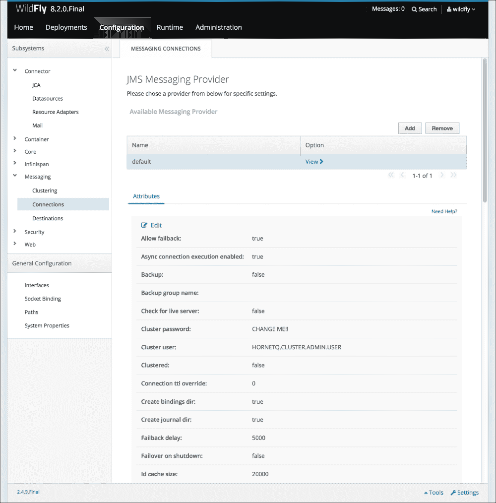
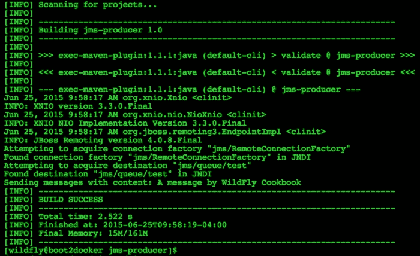
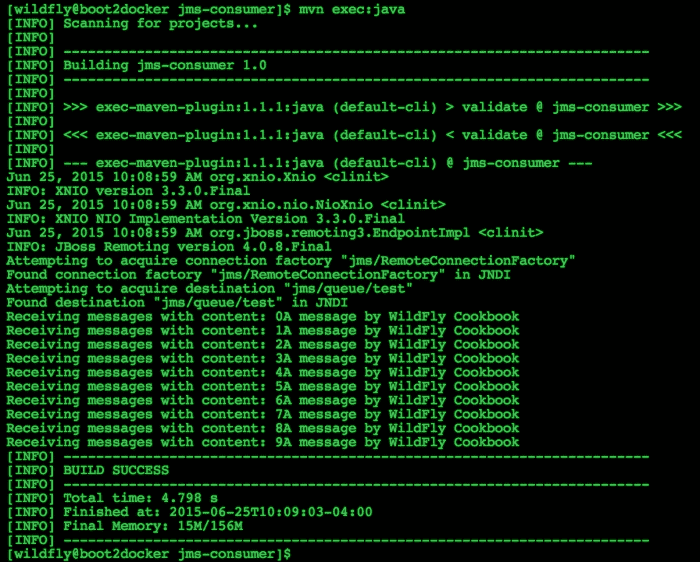
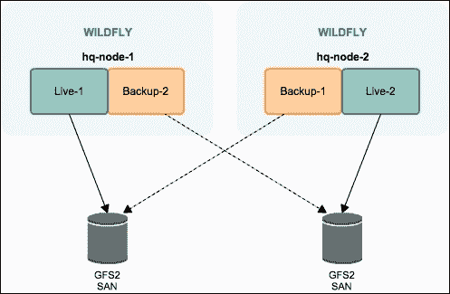
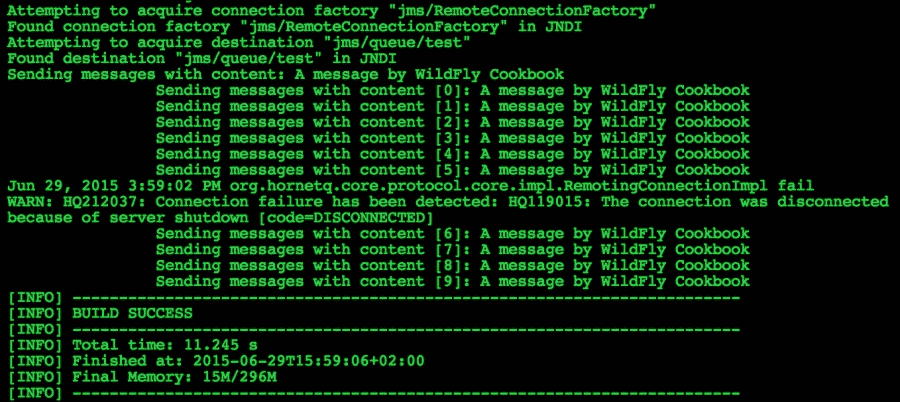
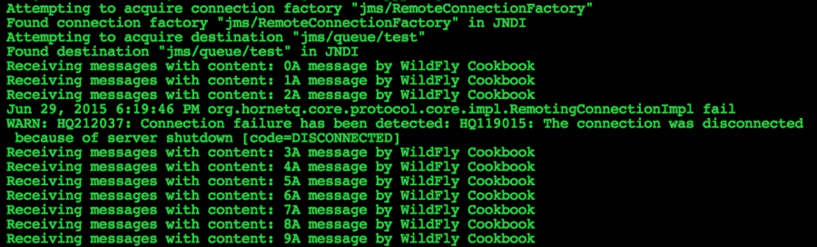
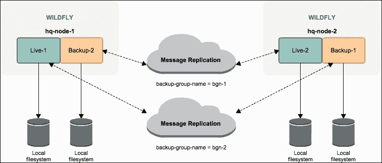

# 第十三章。使用 WildFly 进行消息传递

在本章中，您将学习以下配方：

+   使用 HornetQ 运行消息系统

+   向/从 JMS 队列目的地发送和接收消息

+   使用共享存储进行 HornetQ 集群

+   使用消息复制进行 HornetQ 集群

# 简介

在本章中，您将学习如何配置 WildFly 中的 HornetQ 嵌入，以便为我们的应用程序提供 JMS 功能。由于 WildFly 是 Java EE 7 认证的应用服务器，它实现了 JMS 规范版本 2.0。

HornetQ 是一种 **面向消息的中间件（MOM**），用于在集群和异步系统中交换消息。它可以独立运行（我说的不是 WildFly 独立模式）或嵌入，即在 WildFly 等应用程序服务器内部，通过使用 **Java EE 连接器架构（JCA**）。

因为 HornetQ 使用 JCA 与 WildFly 集成，它还提供了开箱即用的连接池、JTA 事务和容器管理安全支持，这些功能简化了开发者的工作。因此，将您的 EJB 应用程序与 JMS 系统集成不需要额外的工作。

HornetQ 使用两个基本概念，即接受者和连接器。接受者确定 HornetQ 服务器如何接受传入的连接，而连接器确定如何与其他 HornetQ 服务器或 JMS 客户端建立连接。

存在两种类型的接受者和连接器：

+   **invm**：同一 JVM 内部的连接（显然性能更好）

+   **netty**: 与远程 JVM 的连接

每个配置的连接器仅用于到达服务器，如果另一服务器上配置了相同类型的接受者。换句话说，如果我们使用 `invm` 连接器建立连接，另一服务器必须配置了 `invm` 接受者。另一方面，如果我们使用 `netty` 连接器建立连接，另一服务器必须配置了 `netty` 接受者。

HornetQ 使用一个主服务器和一个备份服务器提供高可用性（HA）功能。备份服务器处于空闲模式；只有在主服务器失败时才会工作。

实际上，所有消息都是不断从主服务器复制到备份服务器。这种同步通过两种方式实现：共享存储和消息复制。共享存储本质上意味着主服务器和备份服务器共享相同的文件系统，其中存储消息。另一方面，消息复制通过网络流量工作。然后每个服务器将在其自己的本地文件系统中持久化消息。

### 注意

只有持久消息才会被复制；因此，它们在服务器崩溃后仍然存在。

HornetQ 有自己的持久性，它基于高性能的日志文件系统。HornetQ 使用三种不同的日志：

+   绑定日志

+   JMS 日志

+   消息日志

HornetQ 支持两种不同的共享存储配置：

+   在 SAN 上的 GFS2，使用 AsyncIO 日志类型

+   使用 AsyncIO 或 NIO 日志类型的 NFSv4

    ### 注意

    由于性能问题，NFS 应仅用于开发环境。

如果我们在独立模式下运行，我们可以在 WildFly 配置文件中找到嵌入的 HornetQ 配置，更确切地说是在`standalone-full.xml`和`standalone-full-ha.xml`中。然而，如果我们运行在域模式下，我们可以在 WildFly 提供的配置文件中找到适当的 HornetQ 配置，例如`full`和`full-ha`。`full`配置启用了消息系统，而`full-ha`增加了集群和负载均衡功能。

对于本章，假设您熟悉 JMS 概念，如队列、主题、MDB、死信队列、过期队列、点对点和发布/订阅，因为我们不会深入探讨 JMS 规范细节。如果您想开始学习 HornetQ，我强烈建议您阅读由 Piero Giacomelli 撰写的优秀书籍《HornetQ 消息开发指南》，由 Packt Publishing 出版，该书深入探讨了框架的开发方面和 JMS 规范。

HornetQ 也有替代品，例如 ActiveMQ。要深入了解 ActiveMQ，请参阅官方文档[`activemq.apache.org`](http://activemq.apache.org)。

### 小贴士

构建一个消息系统是一项艰难且复杂的工作；它涉及许多方面（内存、性能、网络、存储、集群等），并且没有一种适合所有情况的配置。每个消息系统都需要进行专门的配置、测试和多次调整，才能投入生产。

# 使用 HornetQ 运行消息系统

在这个食谱中，您将学习如何配置和运行由 HornetQ 提供的 WildFly 消息系统。这是一个热身食谱，只是为了让您做好准备。

## 准备工作

要开始，让我们首先创建一个`adhoc`文件夹来运行我们的 WildFly。在终端窗口中输入以下命令：

```java
$ cd $WILDFLY_HOME
$ cp -a standalone jms-std-node-1
```

现在是时候运行我们的 WildFly 了！！！

## 如何做到这一点...

1.  打开一个终端窗口并执行以下命令：

    ```java
    $ cd $WILDFLY_HOME
    $ ./bin/standalone.sh -Djboss.server.base.dir=jms-std-node-1 --server-config=standalone-full.xml
    ```

1.  现在，如果我们打开 Web 控制台，我们应该也能找到**消息**子系统，如下面的截图所示：

    管理控制台显示消息子系统

好吧，这很简单！让我们尝试本章接下来的更令人兴奋的食谱。

## 它是如何工作的...

首先，您应该已经注意到我们指定了`--server-config`指令，它覆盖了默认的配置文件名，即独立模式下的`standalone.xml`，以及域模式下的`host.xml`。

指定的配置文件名是预先配置了消息系统的那个。如果您还记得这本书前面的食谱，在 WildFly（同样在 JBoss AS 和 JBoss EAP）中，对于不同的配置文件，我们有以下内容：

+   `default`: 应用于通用 Web 应用程序（包括 REST 后端）

+   `full`: 应用于具有 JMS 功能的应用程序

+   `ha`：此配置应用于需要集群和平衡能力的常见 Web 应用程序

+   `full-ha`：此配置应用于需要 JMS、集群和平衡能力的应用程序

因此，`standalone-full.xml`文件为我们提供了运行具有 JMS 功能的应用程序的正确配置。

启动启动脚本后，日志显示各种条目。以以下条目为例：

```java
07:49:49,151 WARN  [org.jboss.as.messaging] (MSC service thread 1-11) WFLYMSG0075: AIO wasn't located on this platform, it will fall back to using pure Java NIO. Your platform is Linux, install LibAIO to enable the AIO journal.
```

它在抱怨使用本地 API 访问文件系统而不是使用 Java NIO API。这是因为，如介绍中提到的，HornetQ 在文件系统上持久化 JMS 消息，所以更高效的 API 是首选。

其他有趣的日志条目如下：

```java
07:49:50,249 INFO  [org.hornetq.core.server] (ServerService Thread Pool -- 68) HQ221043: Adding protocol support CORE
07:49:50,262 INFO  [org.hornetq.core.server] (ServerService Thread Pool -- 68) HQ221043: Adding protocol support AMQP
07:49:50,268 INFO  [org.hornetq.core.server] (ServerService Thread Pool -- 68) HQ221043: Adding protocol support STOMP
07:49:50,535 INFO  [org.hornetq.core.server] (ServerService Thread Pool -- 68) HQ221034: Waiting to obtain live lock
07:49:50,536 INFO  [org.hornetq.core.server] (ServerService Thread Pool -- 68) HQ221035: Live Server Obtained live lock
07:49:50,585 INFO  [org.jboss.messaging] (MSC service thread 1-12) WFLYMSG0016: Registered HTTP upgrade for hornetq-remoting protocol handled by http-acceptor-throughput acceptor
07:49:50,585 INFO  [org.jboss.messaging] (MSC service thread 1-3) WFLYMSG0016: Registered HTTP upgrade for hornetq-remoting protocol handled by http-acceptor acceptor
07:49:50,710 INFO  [org.hornetq.core.server] (ServerService Thread Pool -- 68) HQ221007: Server is now live
07:49:50,711 INFO  [org.hornetq.core.server] (ServerService Thread Pool -- 68) HQ221001: HornetQ Server version 2.4.5.FINAL (Wild Hornet, 124) [48a0b5e3-1b30-11e5-838f-0fbc7481b7aa]
```

前面的条目与 HornetQ 提供的多协议互操作性相关（它不仅仅实现了 JMS 规范）。这意味着服务器（即 HornetQ）现在已准备好生产和消费消息，以及所有相关内容。

最后但同样重要的是，以下条目描述了预先配置的资源：

```java
07:49:50,740 INFO  [org.jboss.as.messaging] (ServerService Thread Pool -- 68) WFLYMSG0002: Bound messaging object to jndi name java:jboss/exported/jms/RemoteConnectionFactory
07:49:50,765 INFO  [org.hornetq.core.server] (ServerService Thread Pool -- 70) HQ221003: trying to deploy queue jms.queue.DLQ
07:49:50,849 INFO  [org.jboss.as.messaging] (ServerService Thread Pool -- 71) WFLYMSG0002: Bound messaging object to jndi name java:/ConnectionFactory
07:49:50,851 INFO  [org.hornetq.core.server] (ServerService Thread Pool -- 69) HQ221003: trying to deploy queue jms.queue.ExpiryQueue
07:49:50,878 INFO  [org.jboss.as.connector.deployment] (MSC service thread 1-7) WFLYJCA0007: Registered connection factory java:/JmsXA
07:49:50,930 INFO  [org.hornetq.ra] (MSC service thread 1-7) HornetQ resource adaptor started
07:49:50,931 INFO  [org.jboss.as.connector.services.resourceadapters.ResourceAdapterActivatorService$ResourceAdapterActivator] (MSC service thread 1-7) IJ020002: Deployed: file://RaActivatorhornetq-ra
07:49:50,937 INFO  [org.jboss.as.connector.deployment] (MSC service thread 1-13) WFLYJCA0002: Bound JCA ConnectionFactory [java:/JmsXA]
07:49:50,938 INFO  [org.jboss.as.messaging] (MSC service thread 1-16) WFLYMSG0002: Bound messaging object to jndi name java:jboss/DefaultJMSConnectionFactory
```

我们有连接工厂，用于连接服务器并从服务器获取会话，以便发送和接收消息。

我们还有两个目的地：`jms.queue.DLQ`和`jms.queue.ExpiryQueue`。

第一个是一个*死信队列*，所有无法成功处理（消费）的消息都会进入其中。当使用**消息驱动 Bean**（**MDB**）消费消息时出现错误，消息将被回滚并直接进入 DLQ。尽管如此，还是有重传策略可以尝试再次发送我们的消息。

所有过期消息都会进入名为`ExpiryQueue`的队列。

### 注意

如果您在 Mac 上运行并使用`full-ha`配置文件，请注意您可能会遇到以下网络问题：

`HQ224033`：广播连接器`configs`失败；无法分配请求的地址

由于`full-ha`配置提供了额外的集群和平衡能力，它为其 HornetQ 服务器提供自动发现，这是通过多播地址实现的。通常，UDP 流量会被丢弃，所以请确保您所在的环境接受 UDP 流量。

例如，在我们的案例中，我们可能正在尝试在家中的食谱，并且 UDP 流量被转发到丢弃此类流量的 ISP。我们需要做的是创建一个本地路由，将 UDP 流量重定向到我们的回环接口，即我们的 localhost，`127.0.0.1` IP 地址。

您可以将多播路由添加到回环接口，如下所示：

`sudo route add 224.0.0.0 127.0.0.1 -netmask 240.0.0.0`

注意，在生产环境中运行时，添加此回环路由将阻止所有多播消息到达其他服务器。

## 参见

+   若要深入了解 HornetQ 服务器原理，请参阅官方文档，链接为[`hornetq.jboss.org`](http://hornetq.jboss.org)。

# 向/从 JMS 队列目标发送和接收消息

在这个菜谱中，我们将学习如何生产和消费 JMS 队列消息。我们将使用两个小应用程序，一个用于生成消息，另一个用于消费消息。

## 准备工作

1.  要开始，让我们首先创建一个 `adhoc` 文件夹来运行我们的 WildFly。在终端窗口中输入以下命令：

    ```java
    $ cd $WILDFLY_HOME
    $ cp -a standalone jms-std-node-2
    ```

1.  在这个菜谱中，我们需要一个应用程序来测试我们的配置。为此菜谱，我们需要名为 `jms-producer` 和 `jms-consumer` 的应用程序，您可以在我的 GitHub 仓库中找到它们。如果您跳过了 第二章 中关于 *使用部署文件夹管理应用程序* 的菜谱，请参阅它以下载您将需要的所有源代码和项目。

1.  要构建应用程序，请输入以下命令：

    ```java
    $ cd $WILDFLY_HOME/github/wildfly-cookbook
    $ cd jms-producer
    $ mvn clean package
    ```

现在是时候运行我们的 WildFly 了！！！

## 如何操作…

首先，我们需要向 `ApplicationRealm` 域添加一个用户，这是远程子系统使用的域，因此也是消息子系统。

1.  打开一个终端窗口并执行以下操作：

    ```java
    $ ./bin/add-user.sh -sc jms-std-node-2/configuration

    What type of user do you wish to add?
     a) Management User (mgmt-users.properties)
     b) Application User (application-users.properties)
    (a): b

    Enter the details of the new user to add.
    Using realm 'ApplicationRealm' as discovered from the existing property files.
    Username : jmsuser
    Password recommendations are listed below. To modify these restrictions edit the add-user.properties configuration file.
     - The password should not be one of the following restricted values {root, admin, administrator}
     - The password should contain at least 8 characters, 1 alphabetic character(s), 1 digit(s), 1 non-alphanumeric symbol(s)
     - The password should be different from the username
    Password : [jmsuser.2015]
    Re-enter Password : [jmsuser.2015]
    What groups do you want this user to belong to? (Please enter a comma separated list, or leave blank for none)[  ]: guest
    About to add user 'jmsuser' for realm 'ApplicationRealm'
    Is this correct yes/no? yes
    Added user 'jmsuser' to file '/opt/wildfly/jms-std-node-2/configuration/application-users.properties'
    Added user 'jmsuser' with groups guest to file '/opt/wildfly/jms-std-node-2/configuration/application-roles.properties'
    Is this new user going to be used for one AS process to connect to another AS process?
    e.g. for a slave host controller connecting to the master or for a Remoting connection for server to server EJB calls.
    yes/no? no
    ```

1.  现在是时候按照以下方式运行我们的 WildFly 了：

    ```java
    $ cd $WILDFLY_HOME
    $ ./bin/standalone.sh -Djboss.server.base.dir=jms-std-node-2 --server-config=standalone-full.xml
    ```

1.  一旦开始，让我们在新终端中连接到 CLI 并创建队列，如下所示：

    ```java
    $ cd $WILDFLY_HOME
    $ ./bin/jboss-cli.sh
    You are disconnected at the moment. Type 'connect' to connect to the server or 'help' for the list of supported commands.
    [disconnected /] connect
    [standalone@localhost:9990 /] jms-queue add --queue-address=WildFlyCookbookQueue --entries=queue/test,java:jboss/exported/jms/queue/test
    [standalone@localhost:9990 /]
    ```

1.  在我们的 `server.log` 中，我们应该找到以下条目：

    ```java
    12:02:52,183 INFO  [org.hornetq.core.server] (ServerService Thread Pool -- 60) HQ221003: trying to deploy queue jms.queue.WildFlyCookbookQueue
    ```

    太棒了，我们成功创建了我们的队列目标！！！

1.  现在是时候运行我们的 `jms-producer` 并向我们的 `WildFlyCookbookQueue` 队列发送消息了。让我们编译并运行它，如下所示：

    ```java
    $ cd $WILDFLY_HOME/github/wildfly-cookbook/jms-producer
    $ mvn clean compile exec:java
    ```

    上述命令的结果如图所示：

    

    我们的生成器发送了包含以下文本的十条文本消息：`WildFly Cookbook 的一条消息`。

1.  因此，如果我们现在连接到 CLI，我们可以计算我们的 `WildFlyCookbookQueue` 目标中的消息数量，如下所示：

    ```java
    $ cd $WILDFLY_HOME
    $ ./bin/jboss-cli.sh
    You are disconnected at the moment. Type 'connect' to connect to the server or 'help' for the list of supported commands.
    [disconnected /] connect
    [standalone@localhost:9990 /] jms-queue count-messages --queue-address=WildFlyCookbookQueue
    10L
    ```

1.  上述 CLI 命令实际上显示了我们所期望的消息数量。让我们通过执行以下命令来尝试我们的消费者：

    ```java
    $ cd $WILDFLY_HOME/github/wildfly-cookbook/jms-consumer
    $ mvn clean compile exec:java
    ```

    上述命令的结果如图所示：

    

太棒了，我们成功消费了存储在队列中的消息！！！

此外，当使用 MDB 消费消息时，如果您的 MDB 出现错误，或者由于任何原因抛出异常，其进程将被回滚；因此，消息将进入死信队列（DLQ）。

## 它是如何工作的…

为了能够理解我们所做的一切以及为什么，我们需要查看默认消息子系统配置。为了本菜谱的目的，我们将分析一个特定的设置，例如 `security-setting`：

```java
<security-settings>
    <security-setting match="#">
        <permission type="send" roles="guest"/>
        <permission type="consume" roles="guest"/>
        <permission type="createNonDurableQueue" roles="guest"/>
        <permission type="deleteNonDurableQueue" roles="guest"/>
    </security-setting>
</security-settings>
```

上面的 XML 代码片段定义了任何（“#”符号是一个通配符，表示任何）目标都需要为特定的权限指定特定的角色，例如发送和消费消息。默认设置指定了“guest”角色，用于从任何队列发送和消费消息。

正因如此，我们需要添加一个用户，使用`add-user`脚本并指定角色`guest`。此外，为什么我们还需要用户呢？

由于我们正在使用`http-remoting://localhost:8080`地址远程连接到目的地，WildFly 使用远程子系统来处理远程连接，其配置如下：

```java
<subsystem >
    <endpoint worker="default"/>
    <http-connector name="http-remoting-connector" connector-ref="default" security-realm="ApplicationRealm"/>
</subsystem>
```

远程子系统引用了`ApplicationRealm`域，这就是为什么我们将`jmsuser`用户添加到该域的原因。

在 Java 代码方面，我们添加了用户的引用如下：

```java
final Properties env = new Properties();
env.put(Context.INITIAL_CONTEXT_FACTORY, INITIAL_CONTEXT_FACTORY);
env.put(Context.PROVIDER_URL, System.getProperty(Context.PROVIDER_URL, PROVIDER_URL));
env.put(Context.SECURITY_PRINCIPAL, System.getProperty("username", DEFAULT_USERNAME));
env.put(Context.SECURITY_CREDENTIALS, System.getProperty("password", DEFAULT_PASSWORD));
context = new InitialContext(env);
```

如果我们没有在 Java 代码中指定用户（实际上省略了`SECURITY_PRINCIPAL`和`SECURITY_CREDENTIALS`属性），或者甚至添加到域中，我们最终会得到以下错误：

```java
Attempting to acquire connection factory "jms/RemoteConnectionFactory"
Found connection factory "jms/RemoteConnectionFactory" in JNDI
Attempting to acquire destination "jms/queue/test"
Found destination "jms/queue/test" in JNDI
javax.jms.JMSSecurityException: HQ119031: Unable to validate user: null
 at org.hornetq.core.protocol.core.impl.ChannelImpl.sendBlocking(ChannelImpl.java:394)
 at org.hornetq.core.client.impl.ClientSessionFactoryImpl.createSessionInternal(ClientSessionFactoryImpl.java:891)
 at org.hornetq.core.client.impl.ClientSessionFactoryImpl.createSessionInternal(ClientSessionFactoryImpl.java:800)
 at org.hornetq.core.client.impl.ClientSessionFactoryImpl.createSession(ClientSessionFactoryImpl.java:337)
 at org.hornetq.jms.client.HornetQConnection.authorize(HornetQConnection.java:719)
 at org.hornetq.jms.client.HornetQConnectionFactory.createConnectionInternal(HornetQConnectionFactory.java:762)
 at org.hornetq.jms.client.HornetQConnectionFactory.createConnection(HornetQConnectionFactory.java:112)
 at org.hornetq.jms.client.HornetQConnectionFactory.createConnection(HornetQConnectionFactory.java:107)
 at com.packtpub.wildflycookbook.JMSProducer.main(JMSProducer.java:59)
 at sun.reflect.NativeMethodAccessorImpl.invoke0(Native Method)
 at sun.reflect.NativeMethodAccessorImpl.invoke(NativeMethodAccessorImpl.java:62)
 at sun.reflect.DelegatingMethodAccessorImpl.invoke(DelegatingMethodAccessorImpl.java:43)
 at java.lang.reflect.Method.invoke(Method.java:483)
 at org.codehaus.mojo.exec.ExecJavaMojo$1.run(ExecJavaMojo.java:283)
 at java.lang.Thread.run(Thread.java:745)
Caused by: HornetQSecurityException[errorType=SECURITY_EXCEPTION message=HQ119031: Unable to validate user: null]
 ... 15 more

```

## 还有更多…

在前面的示例中看到的逻辑也适用于主题。在 CLI 中，我们添加`topic`的命令几乎相同：

```java
[standalone@localhost:9990 /] jms-topic add --topic-address=WildFlyCookbookTopic --entries=topic/test,java:jboss/exported/jms/topic/test
```

## 参见

+   关于 JMS 规范的信息可以在[`jcp.org/aboutJava/communityprocess/final/jsr343/index.html`](https://jcp.org/aboutJava/communityprocess/final/jsr343/index.html)找到。

+   要深入了解 HornetQ 服务器原理，请参阅官方文档[`hornetq.jboss.org`](http://hornetq.jboss.org)

# 使用共享存储进行 HornetQ 集群

在这个菜谱中，你将学习如何通过配置 WildFly 实例来配置 HornetQ 以提供集群功能；一个作为**实时**HornetQ 服务器，另一个作为**备份**HornetQ 服务器。

整体配置可以表示如下图像所示：


共享存储配置

在菜谱中，我们将通过为每个实时和备份服务器对提供相同的`data`目录来使用本地共享存储。这种配置在开发和测试环境中也非常有用，可以轻松模拟高可用性和故障转移功能。

在生产环境中，你应该通过拥有更多对实时和备份服务器，并使用以下图像中所示的正确文件系统来提供高可用性：



高可用性共享存储配置

## 准备工作

要开始，让我们首先创建两个`adhoc`文件夹来运行我们的 WildFly。

1.  在终端窗口中，运行以下命令：

    ```java
    $ cd $WILDFLY_HOME
    $ cp -a standalone hq-live
    $ cp -a standalone hq-backup
    ```

1.  对于这个菜谱，我们需要两个名为`jms-producer`和`jms-consumer`的应用程序，你可以在我的 GitHub 仓库中找到它们。如果你跳过了第二章中关于*使用部署文件夹管理应用程序*的菜谱，*以独立模式运行 WildFly*，请参考它以下载你需要的所有源代码和项目。

1.  要构建应用程序，请执行以下命令：

    ```java
    $ cd $WILDFLY_HOME/github/wildfly-cookbook
    $ cd jms-producer
    $ mvn clean package
    ```

## 如何操作…

首先，我们需要将一个用户添加到`ApplicationRealm`域中，这是远程子系统使用的域，因此也是消息子系统使用的域：

1.  打开一个终端窗口，并输入以下命令：

    ```java
    $ cd $WILDFLY_HOME
    $ ./bin/add-user.sh --silent -a -u jmsuser -p jmsuser.2015 -g guest -sc hq-live/configuration
    $ ./bin/add-user.sh --silent -a -u jmsuser -p jmsuser.2015 -g guest -sc hq-backup/configuration
    ```

1.  现在编辑`hq-live 服务器`的`standalone-full-ha.xml`文件，并将`messaging`子系统替换为以下内容：

    ```java
    <subsystem >
        <hornetq-server>
            <clustered>true</clustered>
            <persistence-enabled>true</persistence-enabled>
            <cluster-user>us3r</cluster-user>
            <cluster-password>p@ssw0rd</cluster-password>
            <backup>false</backup>
            <allow-failback>true</allow-failback>
            <failover-on-shutdown>true</failover-on-shutdown>
            <check-for-live-server>true</check-for-live-server>
            <backup-group-name>backup-group-2</backup-group-name>
            <shared-store>true</shared-store>
            <journal-type>NIO</journal-type>
            <journal-min-files>2</journal-min-files>
            <journal-file-size>102400</journal-file-size>
            <paging-directory path="hq-data/paging" relative-to="user.home"/>
            <bindings-directory path="hq-data/bindings" relative-to="user.home"/>
            <journal-directory path="hq-data/journal" relative-to="user.home"/>
            <large-messages-directory path="hq-data/large-messages" relative-to="user.home"/>
            <connectors>
                <http-connector name="http-connector" socket-binding="http">
                    <param key="http-upgrade-endpoint" value="http-acceptor"/>
                </http-connector>
                <http-connector name="http-connector-throughput" socket-binding="http">
                    <param key="http-upgrade-endpoint" value="http-acceptor-throughput"/>
                    <param key="batch-delay" value="50"/>
                </http-connector>
                <in-vm-connector name="in-vm" server-id="0"/>
            </connectors>
            <acceptors>
                <http-acceptor name="http-acceptor" http-listener="default"/>
                <http-acceptor name="http-acceptor-throughput" http-listener="default">
                    <param key="batch-delay" value="50"/>
                    <param key="direct-deliver" value="false"/>
                </http-acceptor>
                <in-vm-acceptor name="in-vm" server-id="0"/>
            </acceptors>
            <broadcast-groups>
                <broadcast-group name="bg-group1">
                    <socket-binding>messaging-group</socket-binding>
                    <connector-ref>http-connector</connector-ref>
                </broadcast-group>
            </broadcast-groups>
            <discovery-groups>
                <discovery-group name="dg-group1">
                    <socket-binding>messaging-group</socket-binding>
                </discovery-group>
            </discovery-groups>
            <cluster-connections>
                <cluster-connection name="my-cluster">
                    <address>jms</address>
                    <connector-ref>http-connector</connector-ref>
                    <discovery-group-ref discovery-group-name="dg-group1"/>
                </cluster-connection>
            </cluster-connections>
            <security-settings>
                <security-setting match="#">
                    <permission type="send" roles="guest"/>
                    <permission type="consume" roles="guest"/>
                    <permission type="createNonDurableQueue" roles="guest"/>
                    <permission type="deleteNonDurableQueue" roles="guest"/>
                </security-setting>
            </security-settings>
            <address-settings>
                <!--default for catch all-->
                <address-setting match="#">
                    <dead-letter-address>jms.queue.DLQ</dead-letter-address>
                    <expiry-
                    address>jms.queue.ExpiryQueue</expiry-
                    address>
                    <redistribution-delay>1000</redistribution-delay>
                    <max-size-bytes>10485760</max-size-bytes>
                    <page-size-bytes>2097152</page-size-bytes>
                    <message-counter-history-day-limit>10</message-counter-history-day-
                    limit>
                </address-setting>
            </address-settings>
            <jms-connection-factories>
                <connection-factory 
                name="InVmConnectionFactory">
                    <connectors>
                        <connector-ref connector-name="in-vm"/>
                    </connectors>
                    <entries>
                        <entry name="java:/ConnectionFactory"/>
                    </entries>
                </connection-factory>
                <connection-factory 
                name="RemoteConnectionFactory">
                    <connectors>
                        <connector-ref connector-name="http-connector"/>
                    </connectors>
                    <entries>
                        <entry name="java:jboss/exported/jms/RemoteConnectionFactory"/>
                    </entries>
                    <ha>true</ha>
                    <block-on-acknowledge>true</block-on-acknowledge>
                    <retry-interval>500</retry-interval>
                    <retry-interval-multiplier>1.5</retry-interval-multiplier>
                    <max-retry-interval>60000</max-retry-interval>
                    <reconnect-attempts>-1</reconnect-attempts>
                </connection-factory>
                <pooled-connection-factory name="hornetq-ra">
                    <transaction mode="xa"/>
                    <connectors>
                        <connector-ref connector-name="in-vm"/>
                    </connectors>
                    <entries>
                        <entry name="java:/JmsXA"/>
                        <!-- Global JNDI entry used to provide a default JMS Connection factory to EE application -->
                        <entry name="java:jboss/DefaultJMSConnectionFactory"/>
                    </entries>
                    <ha>true</ha>
                    <block-on-acknowledge>true</block-on-acknowledge>
                    <retry-interval>500</retry-interval>
                    <retry-interval-multiplier>1.5</retry-interval-multiplier>
                    <max-retry-interval>60000</max-retry-interval>
                    <reconnect-attempts>1000</reconnect-attempts>
                </pooled-connection-factory>
            </jms-connection-factories>
            <jms-destinations>
                <jms-queue name="ExpiryQueue">
                    <entry name="java:/jms/queue/ExpiryQueue"/>
                </jms-queue>
                <jms-queue name="DLQ">
                    <entry name="java:/jms/queue/DLQ"/>
                </jms-queue>
                <jms-queue name="WildFlyCookbookQueue">
                    <entry name="queue/test"/>
                    <entry name="java:jboss/exported/jms/queue/test"/>
                    <durable>true</durable>
                </jms-queue>
            </jms-destinations>
        </hornetq-server>
    </subsystem>
    ```

1.  现在是时候运行我们的 WildFly `live`实例了，如下所示：

    ```java
    $ cd $WILDFLY_HOME
    $ ./bin/standalone.sh -Djboss.server.base.dir=hq-live --server-config=standalone-full-ha.xml -Djboss.socket.binding.port-offset=100
    ```

1.  在启动`live`服务器时，编辑`hq-backup`服务器的`standalone-full-ha.xml`文件，并将`messaging`子系统替换为以下内容：

    ```java
    <subsystem >
        <hornetq-server>
            <clustered>true</clustered>
            <persistence-enabled>true</persistence-enabled>
            <cluster-user>us3r</cluster-user>
            <cluster-password>p@ssw0rd</cluster-password>
            <backup>true</backup>
            <allow-failback>true</allow-failback>
            <failover-on-shutdown>true</failover-on-shutdown>
            <check-for-live-server>true</check-for-live-server>
            <backup-group-name>backup-group-2</backup-group-name>
            <shared-store>true</shared-store>
            <journal-type>NIO</journal-type>
            <journal-min-files>2</journal-min-files>
            <journal-file-size>102400</journal-file-size>
            <paging-directory path="hq-data/paging" relative-to="user.home"/>
            <bindings-directory path="hq-data/bindings" relative-to="user.home"/>
            <journal-directory path="hq-data/journal" relative-to="user.home"/>
            <large-messages-directory path="hq-data/large-messages" relative-to="user.home"/>
            <connectors>
                <http-connector name="http-connector" socket-binding="http">
                    <param key="http-upgrade-endpoint" value="http-acceptor"/>
                </http-connector>
                <http-connector name="http-connector-throughput" socket-binding="http">
                    <param key="http-upgrade-endpoint" value="http-acceptor-throughput"/>
                    <param key="batch-delay" value="50"/>
                </http-connector>
                <in-vm-connector name="in-vm" server-id="0"/>
            </connectors>
            <acceptors>
                <http-acceptor name="http-acceptor" http-listener="default"/>
                <http-acceptor name="http-acceptor-throughput" http-listener="default">
                    <param key="batch-delay" value="50"/>
                    <param key="direct-deliver" value="false"/>
                </http-acceptor>
                <in-vm-acceptor name="in-vm" server-id="0"/>
            </acceptors>
            <broadcast-groups>
                <broadcast-group name="bg-group1">
                    <socket-binding>messaging-group</socket-binding>
                    <connector-ref>http-connector</connector-ref>
                </broadcast-group>
            </broadcast-groups>
            <discovery-groups>
                <discovery-group name="dg-group1">
                    <socket-binding>messaging-group</socket-
                    binding>
                </discovery-group>
            </discovery-groups>
            <cluster-connections>
                <cluster-connection name="my-cluster">
                    <address>jms</address>
                    <connector-ref>http-connector</connector-ref>
                    <discovery-group-ref discovery-group-name="dg-group1"/>
                </cluster-connection>
            </cluster-connections>
            <security-settings>
                <security-setting match="#">
                    <permission type="send" roles="guest"/>
                    <permission type="consume" roles="guest"/>
                    <permission type="createNonDurableQueue" roles="guest"/>
                    <permission type="deleteNonDurableQueue" roles="guest"/>
                </security-setting>
            </security-settings>
            <address-settings>
                <!--default for catch all-->
                <address-setting match="#">
                    <dead-letter-address>jms.queue.DLQ</dead-letter-address>
                    <expiry-address>jms.queue.ExpiryQueue</expiry-address>
                    <redistribution-delay>1000</redistribution-delay>
                    <max-size-bytes>10485760</max-size-bytes>
                    <page-size-bytes>2097152</page-size-bytes>
                    <message-counter-history-day-limit>10</message-counter-history-day-limit>
                </address-setting>
            </address-settings>
            <jms-connection-factories>
                <connection-factory name="InVmConnectionFactory">
                    <connectors>
                        <connector-ref connector-name="in-vm"/>
                    </connectors>
                    <entries>
                        <entry name="java:/ConnectionFactory"/>
                    </entries>
                </connection-factory>
                <connection-factory name="RemoteConnectionFactory">
                    <connectors>
                        <connector-ref connector-name="http-connector"/>
                    </connectors>
                    <entries>
                        <entry name="java:jboss/exported/jms/RemoteConnectionFactory"/>
                    </entries>
                    <ha>true</ha>
                    <block-on-acknowledge>true</block-on-acknowledge>
                    <retry-interval>500</retry-interval>
                    <retry-interval-multiplier>1.5</retry-interval-multiplier>
                    <max-retry-interval>60000</max-retry-interval>
                    <reconnect-attempts>1000</reconnect-attempts>
                </connection-factory>
                <pooled-connection-factory name="hornetq-ra">
                    <transaction mode="xa"/>
                    <connectors>
                        <connector-ref connector-name="in-vm"/>
                    </connectors>
                    <entries>
                        <entry name="java:/JmsXA"/>
                        <!-- Global JNDI entry used to provide a default JMS Connection factory to EE 
                        application -->
                        <entry name="java:jboss/DefaultJMSConnectionFactory"/>
                    </entries>
                    <ha>true</ha>
                </pooled-connection-factory>
            </jms-connection-factories>
            <jms-destinations>
                <jms-queue name="ExpiryQueue">
                    <entry name="java:/jms/queue/ExpiryQueue"/>
                </jms-queue>
                <jms-queue name="DLQ">
                    <entry name="java:/jms/queue/DLQ"/>
                </jms-queue>
                <jms-queue name="WildFlyCookbookQueue">
                    <entry name="queue/test"/>
                    <entry name="java:jboss/exported/jms/queue/test"/>
                    <durable>true</durable>
                </jms-queue>
            </jms-destinations>
        </hornetq-server>
    </subsystem>
    ```

1.  你现在可以按照以下方式启动 WildFly `backup`实例：

    ```java
    /bin/standalone.sh -Djboss.server.base.dir=hq-backup -c standalone-full-ha.xml -Djboss.socket.binding.port-offset=200
    ```

1.  在实时服务器的日志中，你应该找到以下条目：

    ```java
    ...
    16:48:42,918 INFO  [org.hornetq.core.server] (ServerService Thread Pool -- 68) HQ221034: Waiting to obtain live lock
    16:48:42,918 INFO  [org.hornetq.core.server] (ServerService Thread Pool -- 68) HQ221035: Live Server Obtained live lock
    16:48:43,073 INFO  [org.hornetq.core.server] (ServerService Thread Pool -- 68) HQ221007: Server is now live
    16:48:43,073 INFO  [org.hornetq.core.server] (ServerService Thread Pool -- 68) HQ221001: HornetQ Server version 2.4.5.FINAL (Wild Hornet, 124) [adcd3a5c-1e60-11e5-877d-c36458d7eaba]
    ...
    16:48:43,326 INFO  [org.jboss.as] (Controller Boot Thread) WFLYSRV0060: Http management interface listening on http://127.0.0.1:10090/management
    16:48:43,327 INFO  [org.jboss.as] (Controller Boot Thread) WFLYSRV0051: Admin console listening on http://127.0.0.1:10090
    16:48:43,327 INFO  [org.jboss.as] (Controller Boot Thread) WFLYSRV0025: WildFly Full 9.0.0.Beta2 (WildFly Core 1.0.0.Beta2) started in 3298ms - Started 249 of 481 services (282 services are lazy, passive or on-demand)
    ```

1.  当你在备份服务器的日志中时，你应该找到以下条目：

    ```java
    16:51:21,298 INFO  [org.hornetq.core.server] (HQ119000: Activation for server HornetQServerImpl::serverUUID=adcd3a5c-1e60-11e5-877d-c36458d7eaba) HQ221032: Waiting to become backup node
    16:51:21,301 INFO  [org.hornetq.core.server] (HQ119000: Activation for server HornetQServerImpl::serverUUID=adcd3a5c-1e60-11e5-877d-c36458d7eaba) HQ221033: ** got backup lock
    16:51:21,329 INFO  [org.hornetq.core.server] (HQ119000: Activation for server HornetQServerImpl::serverUUID=adcd3a5c-1e60-11e5-877d-c36458d7eaba) HQ221013: Using NIO Journal
    16:51:21,636 INFO  [org.hornetq.core.server] (HQ119000: Activation for server HornetQServerImpl::serverUUID=adcd3a5c-1e60-11e5-877d-c36458d7eaba) HQ221043: Adding protocol support CORE
    16:51:21,641 INFO  [org.hornetq.core.server] (HQ119000: Activation for server HornetQServerImpl::serverUUID=adcd3a5c-1e60-11e5-877d-c36458d7eaba) HQ221043: Adding protocol support AMQP
    16:51:21,645 INFO  [org.hornetq.core.server] (HQ119000: Activation for server HornetQServerImpl::serverUUID=adcd3a5c-1e60-11e5-877d-c36458d7eaba) HQ221043: Adding protocol support STOMP
    16:51:21,667 INFO  [org.hornetq.core.server] (HQ119000: Activation for server HornetQServerImpl::serverUUID=adcd3a5c-1e60-11e5-877d-c36458d7eaba) HQ221109: HornetQ Backup Server version 2.4.5.FINAL (Wild Hornet, 124) [adcd3a5c-1e60-11e5-877d-c36458d7eaba] started, waiting live to fail before it gets active
    16:51:21,742 INFO  [org.jboss.as] (Controller Boot Thread) WFLYSRV0060: Http management interface listening on http://127.0.0.1:10190/management
    16:51:21,742 INFO  [org.jboss.as] (Controller Boot Thread) WFLYSRV0051: Admin console listening on http://127.0.0.1:10190
    16:51:21,742 INFO  [org.jboss.as] (Controller Boot Thread) WFLYSRV0025: WildFly Full 9.0.0.Beta2 (WildFly Core 1.0.0.Beta2) started in 3001ms - Started 235 of 475 services (281 services are lazy, passive or on-demand)
    16:51:23,288 INFO  [org.hornetq.core.server] (Thread-0 (HornetQ-server-HornetQServerImpl::serverUUID=adcd3a5c-1e60-11e5-877d-c36458d7eaba-640469128)) HQ221031: backup announced
    ```

    实时和备份服务器的日志条目都证实了我们的配置：实时服务器已经获得了数据目录的锁，而备份正在等待获取锁，并已宣布自己为备份。

现在是时候进行一些测试了。

### 测试

为了测试我们的配置，我们首先需要生成一些消息，然后检查消息是否已存储，然后消费它们。在这种情况下，按照以下方式编译`jms-producer`项目：

1.  让我们使用`jms-producer`项目按照以下方式生成一些消息：

    ```java
    $ cd $WILDFLY_HOME/github/wildfly-cookbook
    $ cd jms-producer
    $ mvn clean package
    $ mvn exec:java
    ...
    Attempting to acquire connection factory "jms/RemoteConnectionFactory"
    Found connection factory "jms/RemoteConnectionFactory" in JNDI
    Attempting to acquire destination "jms/queue/test"
    Found destination "jms/queue/test" in JNDI
    Sending messages with content: A message by WildFly Cookbook
        Sending messages with content [0]: A message by WildFly Cookbook
        Sending messages with content [1]: A message by WildFly Cookbook
        Sending messages with content [2]: A message by WildFly 
        Cookbook
        Sending messages with content [3]: A message by WildFly Cookbook
        Sending messages with content [4]: A message by WildFly Cookbook
        Sending messages with content [5]: A message by WildFly Cookbook
        Sending messages with content [6]: A message by WildFly Cookbook
        Sending messages with content [7]: A message by WildFly Cookbook
        Sending messages with content [8]: A message by WildFly Cookbook
        Sending messages with content [9]: A message by WildFly Cookbook
    [INFO] ------------------------------------------------------------------------
    [INFO] BUILD SUCCESS
    [INFO] ------------------------------------------------------------------------
    [INFO] Total time: 11.234 s
    [INFO] Finished at: 2015-06-29T16:03:33+02:00
    [INFO] Final Memory: 15M/298M
    [INFO] ------------------------------------------------------------------------
    ```

1.  现在，如果你检查消息计数，你将在实时服务器上找到十条消息。要检查，请执行以下操作：

    ```java
    [standalone@127.0.0.1:10090 /] jms-queue count-messages --queue-address=WildFlyCookbookQueue
    10L
    [standalone@127.0.0.1:10090 /]
    ```

1.  如果你将前面的命令在备份服务器上执行，你会得到以下错误：

    ```java
    [standalone@127.0.0.1:10190 /] jms-queue count-messages --queue-address=WildFlyCookbookQueue
    WFLYMSG0066: Resource at the address [
        ("subsystem" => "messaging"),
        ("hornetq-server" => "default"),
        ("jms-queue" => "WildFlyCookbookQueue")
    ] can not be managed, the hornetq-server is in backup mode
    [standalone@127.0.0.1:10190 /]
    ```

1.  如果你停止实时服务器，备份服务器应该成为新的实时服务器。你应该在备份服务器上找到以下日志条目：

    ```java
    17:58:09,698 WARN  [org.hornetq.core.client] (Thread-1 (HornetQ-client-global-threads-1744891225)) HQ212037: Connection failure has been detected: HQ119015: The connection was disconnected because of server shutdown [code=DISCONNECTED]
    17:58:09,898 INFO  [org.jboss.messaging] (MSC service thread 1-10) WFLYMSG0016: Registered HTTP upgrade for hornetq-remoting protocol handled by http-acceptor acceptor
    17:58:09,898 INFO  [org.jboss.messaging] (MSC service thread 1-16) WFLYMSG0016: Registered HTTP upgrade for hornetq-remoting protocol handled by http-acceptor-throughput acceptor
    17:58:09,900 INFO  [org.hornetq.core.server] (ServerService Thread Pool -- 72) HQ221003: trying to deploy queue jms.queue.ExpiryQueue
    17:58:09,905 INFO  [org.hornetq.core.server] (ServerService Thread Pool -- 76) HQ221003: trying to deploy queue jms.queue.WildFlyCookbookQueue
    17:58:09,916 INFO  [org.jboss.as.messaging] (ServerService Thread Pool -- 75) WFLYMSG0002: Bound messaging object to jndi name java:jboss/exported/jms/RemoteConnectionFactory
    17:58:09,916 INFO  [org.hornetq.core.server] (ServerService Thread Pool -- 74) HQ221003: trying to deploy queue jms.queue.DLQ
    17:58:09,918 INFO  [org.jboss.as.messaging] (ServerService Thread Pool -- 73) WFLYMSG0002: Bound messaging object to jndi name java:/ConnectionFactory
    17:58:09,918 INFO  [org.hornetq.core.server] (HQ119000: Activation for server HornetQServerImpl::serverUUID=adcd3a5c-1e60-11e5-877d-c36458d7eaba) HQ221010: Backup Server is now live
    17:58:09,956 INFO  [org.jboss.as.connector.deployment] (MSC service thread 1-2) WFLYJCA0007: Registered connection factory java:/JmsXA
    17:58:09,971 INFO  [org.hornetq.ra] (MSC service thread 1-2) HornetQ resource adaptor started
    17:58:09,971 INFO  [org.jboss.as.connector.services.resourceadapters.ResourceAdapterActivatorService$ResourceAdapterActivator] (MSC service thread 1-2) IJ020002: Deployed: file://RaActivatorhornetq-ra
    17:58:09,973 INFO  [org.jboss.as.connector.deployment] (MSC service thread 1-4) WFLYJCA0002: Bound JCA ConnectionFactory [java:/JmsXA]
    17:58:09,973 INFO  [org.jboss.as.messaging] (MSC service thread 1-11) WFLYMSG0002: Bound messaging object to jndi name java:jboss/DefaultJMSConnectionFactory
    ```

1.  如果你再次在旧备份服务器上调用计数消息命令，你会看到它包含了之前产生的所有消息：

    ```java
    [standalone@127.0.0.1:10190 /] jms-queue count-messages --queue-address=WildFlyCookbookQueue
    10L
    [standalone@127.0.0.1:10190 /]
    ```

## 如何工作…

故障转移背后的机制相当简单；因为 HornetQ 基于文件系统进行持久化，它会在数据存储文件夹上创建一个锁。基本上，对于相同的文件夹，第一个到达的服务器拥有锁，因此获胜。第二个服务器会继续尝试获取相同数据目录的锁，直到获得它，这意味着实时服务器已关闭或崩溃。

当备份服务器获得锁时，它会读取数据目录中存储的所有消息；它可用于存储更多消息，并且客户端会消费它们。

如果实时服务器在客户端生成或消费消息时崩溃会发生什么？

由于故障转移和高可用性配置（在`<connection-factory name="RemoteConnectionFactory">`和`<pooled-connection-factory name="hornetq-ra">`中的`<ha>true</ha>`），客户端会自动重新连接到第一个可用的实时服务器。客户端具有实时和备份服务器上的拓扑。

在生成消息时，尝试停止实时服务器。你应该得到以下图像中所示类似的输出：



在发送消息时，客户端重新连接到第一个可用的活动服务器

在消费消息时也适用。以下是一张显示您应该得到的内容的图片：



在消费消息时，客户端重新连接到第一个可用的活动服务器

## 参见

+   如介绍中所述，有很多关于 HornetQ、JMS 和 MOM 的一般性话题可以讨论，但这超出了本书的范围。因此，我建议您阅读 *HornetQ 消息开发人员指南*，作者 Piero Giacomelli，Packt Publishing，它深入探讨了框架的开发方面和 JMS 规范。

+   此外，jboss.org 社区在为我们所有人提供关于 HornetQ 的信息方面做得非常出色，这些信息可以在 [`hornetq.jboss.org`](http://hornetq.jboss.org) 免费获取。

+   最后，但同样重要的是，JMS 规范可在 [`jcp.org/aboutJava/communityprocess/final/jsr343/index.html`](https://jcp.org/aboutJava/communityprocess/final/jsr343/index.html) 获取。

# 使用消息复制来集群 HornetQ

在这个配方中，我们将学习如何配置一个包含活动 HornetQ 服务器和备份 HornetQ 服务器的集群。

根据之前的配方，可以通过使用共享存储（活动服务器和备份服务器共享相同的数据目录）或通过在网络层发生的消息复制来实现 HornetQ 集群环境——可以通过以下设置实现消息复制模式：

```java
<shared-store>false</shared-store>
```

我们最终的配置应提供以下架构：



消息复制配置

## 准备工作

要开始，让我们首先创建一个 `adhoc` 文件夹来运行我们的 WildFly。

1.  在终端窗口中，输入以下命令：

    ```java
    $ cd $WILDFLY_HOME
    $ cp -a standalone hq-node-1
    $ cp -a standalone hq-node-2
    ```

1.  为发送和接收消息的服务器提供应用程序用户，如下所示：

    ```java
    $ cd $WILDFLY_HOME
    $ ./bin/add-user.sh --silent -a -u jmsuser -p jmsuser.2015 -g guest -sc hq-node-1/configuration
    $ ./bin/add-user.sh --silent -a -u jmsuser -p jmsuser.2015 -g guest -sc hq-node-1/configuration
    ```

1.  对于这个配方，我们需要一个名为 `cluster-jms-replication` 的应用程序，您可以在我的 GitHub 仓库中找到它。如果您跳过了 第二章 中关于 *使用部署文件夹管理应用程序* 的配方，请参阅它以下载您将需要的所有源代码和项目。

1.  要构建应用程序，请运行以下命令：

    ```java
    $ cd $WILDFLY_HOME/github/wildfly-cookbook
    $ cd cluster-jms-replication
    $ mvn clean package
    ```

现在是时候配置我们的 HornetQ 服务器在 WildFly 中了！！！

## 如何做到这一点...

为了配置我们的服务器，我们将依赖于我 GitHub 仓库中现有的配置，命名为 `wildfly-cookbook`。在那里您可以找到一个名为 `cluster-jms-replication` 的项目，该项目由审稿人 Kylin Soong 提供。

1.  在您下载仓库的文件夹（`~/WFC/github/wildfly-cookbook`）中，有一个名为 `cluster-jms-replication` 的项目。在项目文件夹内执行以下操作：

    ```java
    $ mvn clean install
    $ cp standalone-full-ha-1.xml $WILDFLY_HOME/node1/configuration/
    $ cp standalone-full-ha-2.xml $WILDFLY_HOME/node2/configuration/
    $ cp queue-jms.xml $WILDFLY_HOME/node1/deployments/
    $ cp queue-jms.xml $WILDFLY_HOME/node2/deployments/
    $ cp target/cluster-demo-jms.jar $WILDFLY_HOME/node1/deployments/
    $ cp target/cluster-demo-jms.jar $WILDFLY_HOME/node2/deployments/
    ```

1.  现在我们已经准备好以下启动我们的服务器：

    ```java
    $ ./bin/standalone.sh -c standalone-full-ha-1.xml -Djboss.server.base.dir=node1
    $ ./bin/standalone.sh -c standalone-full-ha-2.xml -Djboss.server.base.dir=node2 -Djboss.socket.binding.port-offset=100
    ```

1.  服务器启动后，转到 `cluster-jms-replication` 项目文件夹并执行以下命令：

    ```java
    $ mvn exec:java
    ```

1.  这将向 HornetQ 集群发送十条消息。在 `node1` 服务器日志条目中，你应该找到以下内容：

    ```java
    12:07:02,323 INFO  [stdout] (Thread-7 (HornetQ-client-global-threads-1050658442)) 3: WildFly 9 HornetQ Messaging High Available
    12:07:12,334 INFO  [stdout] (Thread-7 (HornetQ-client-global-threads-1050658442)) 5: WildFly 9 HornetQ Messaging High Available
    12:07:22,344 INFO  [stdout] (Thread-7 (HornetQ-client-global-threads-1050658442)) 7: WildFly 9 HornetQ Messaging High Available
    12:07:32,355 INFO  [stdout] (Thread-7 (HornetQ-client-global-threads-1050658442)) 9: WildFly 9 HornetQ Messaging High Available
    ```

    在 `node2` 服务器日志条目中，你应该找到以下内容：

    ```java
    12:06:52,350 INFO  [stdout] (Thread-7 (HornetQ-client-global-threads-589728564)) 2: WildFly 9 HornetQ Messaging High Available
    12:07:02,358 INFO  [stdout] (Thread-7 (HornetQ-client-global-threads-589728564)) 4: WildFly 9 HornetQ Messaging High Available
    12:07:12,363 INFO  [stdout] (Thread-7 (HornetQ-client-global-threads-589728564)) 6: WildFly 9 HornetQ Messaging High Available
    12:07:22,370 INFO  [stdout] (Thread-7 (HornetQ-client-global-threads-589728564)) 8: WildFly 9 HornetQ Messaging High Available
    12:07:32,379 INFO  [stdout] (Thread-7 (HornetQ-client-global-threads-589728564)) 10: WildFly 9 HornetQ Messaging High Available
    ```

1.  现在，我们将通过将前几条消息发送到 `node1` 并停止它来进行故障转移测试（正常关闭或终止都一样）。再次进入 `cluster-jms-replication` 项目文件夹，并执行以下命令：

    ```java
    $ mvn exec:java
    ```

1.  现在，一旦你在服务器 `node1` 上收到前两条消息，就停止它。在过程结束时，你应该得到以下日志条目：

    +   `node1`

        ```java
        12:15:44,592 INFO  [stdout] (Thread-13 (HornetQ-client-global-threads-1050658442)) 1: WildFly 9 HornetQ Messaging High Available
        12:15:54,602 INFO  [stdout] (Thread-13 (HornetQ-client-global-threads-1050658442)) 3: WildFly 9 HornetQ Messaging High Available
        ```

    +   `node2`

        ```java
        12:15:44,599 INFO  [stdout] (Thread-12 (HornetQ-client-global-threads-589728564)) 2: WildFly 9 HornetQ Messaging High Available
        12:15:54,606 INFO  [stdout] (Thread-12 (HornetQ-client-global-threads-589728564)) 4: WildFly 9 HornetQ Messaging High Available
        12:16:04,613 INFO  [stdout] (Thread-12 (HornetQ-client-global-threads-589728564)) 6: WildFly 9 HornetQ Messaging High Available
        ... Errors and Warnings ...
        12:16:14,622 INFO  [stdout] (Thread-12 (HornetQ-client-global-threads-589728564)) 8: WildFly 9 HornetQ Messaging High Available
        12:16:24,629 INFO  [stdout] (Thread-12 (HornetQ-client-global-threads-589728564)) 10: WildFly 9 HornetQ Messaging High Available
        12:16:34,642 INFO  [stdout] (Thread-12 (HornetQ-client-global-threads-589728564)) 5: WildFly 9 HornetQ Messaging High Available
        12:16:44,653 INFO  [stdout] (Thread-12 (HornetQ-client-global-threads-589728564)) 7: WildFly 9 HornetQ Messaging High Available
        12:16:54,663 INFO  [stdout] (Thread-12 (HornetQ-client-global-threads-589728564)) 9: WildFly 9 HornetQ Messaging High Available
        ```

## 它是如何工作的…

有很多事情需要解释。请注意，只有持久消息会被复制到备份服务器。因此，非持久消息不会进行故障转移。在实时配置中，我们添加了以下指令：

```java
<backup>false</backup>
<failover-on-shutdown>true</failover-on-shutdown>
<check-for-live-server>true</check-for-live-server>
```

第一条非常明显；它定义了服务器将是实时服务器。`failover-on-shutdown` 表示即使在正常服务器关闭的情况下，服务器也会切换到备份服务器，就像我们在测试中所做的那样。

`check-for-live-server` 指令与备份服务器配置中的 `allow-failback` 一起使用：

```java
<backup>true</backup>
<failover-on-shutdown>true</failover-on-shutdown>
<allow-failback>true</allow-failback>
```

基本上，当实时服务器恢复运行时，它会通过联系其他备份服务器并对其当前实时服务器发出关闭指令来检查是否发生了故障转移。

## 参见

+   如介绍中所述，有很多关于 HornetQ、JMS 和 MOM 的一般性话题可以讨论，但这些都超出了本书的范围。因此，我建议你阅读《HornetQ 消息开发人员指南》一书，作者 Piero Giacomelli，出版社 Packt Publishing，该书深入探讨了框架的开发方面和 JMS 规范。

+   此外，jboss.org 社区为我们所有人提供了关于 HornetQ 的信息，这些信息可在 [`hornetq.jboss.org`](http://hornetq.jboss.org) 免费获取。

+   最后但同样重要的是，JMS 规范可在 [`jcp.org/aboutJava/communityprocess/final/jsr343/index.html`](https://jcp.org/aboutJava/communityprocess/final/jsr343/index.html) 获取。
