# 第十四章：使用 OpenShift 将 WildFly 迁移到云端

在本章中，你将学习以下食谱：

+   注册 OpenShift Online

+   为我们的第一次部署安装 WildFly 卡式盒

+   通过 SSH 控制你的 WildFly 服务器

+   将你的代码部署到 OpenShift Online

# 简介

在本章中，你将了解 OpenShift 是什么，以及如何通过将你的应用程序直接部署到云上的互联网来利用它。

首先，OpenShift 是一个**平台即服务**，代表著名的缩写**PaaS**。OpenShift 是 Red Hat 的 PaaS，你可以找到三个不同版本的它：

+   **OpenShift Origin**：这是一个 OpenShift 的免费开源版本。你可以在 GitHub 上找到其代码流，网址为[`github.com/openshift/origin`](https://github.com/openshift/origin)。

+   **OpenShift Online**：OpenShift Online (OSO) 是本章我们将使用的版本。目前你只需要知道它是一个免费的 PaaS，你可以在其中根据你喜欢的环境部署你的应用程序。我们将在本章后面讨论它。OpenShift Online 可在[`www.openshift.com`](https://www.openshift.com)免费使用。

+   **OpenShift Enterprise**：OpenShift Enterprise (OSE) 是 Red Hat 在企业级别提供支持的版本。

如同书中《OpenShift 入门》所述，*O'Reilly*：

> *OSE 是为那些想要稳定性和开箱即用的生产就绪安装的客户设计的。由于稳定性至关重要，Origin 或 Online 中的一些功能可能不会在 Enterprise 版本中存在一两个版本。*

无论如何，OpenShift 到底是什么？OpenShift 有很多东西，但根据我的经验，我认为“自助配置”这个词更适合它。开发人员和/或系统管理员可以访问系统，并即时为自己配置环境。资源、运行时、网络：所有你需要的东西都在一键之遥。

OpenShift 还能为你做另一件事，那就是自动扩展。如果你在 OpenShift 上部署应用程序并标记“自动扩展”选项，每当你的网站流量增加时，你的基础设施就会扩展；为了处理越来越多的请求，会添加更多的“节点”。然而，“自动”地，当你的应用程序流量减少时，OpenShift 会回收额外的资源。

在 OpenShift 中，你需要了解三个主要概念：

+   **齿轮**：你可以将其视为一个提供你所需资源的服务器，例如 RAM、CPU 和磁盘空间。在 OpenShift Online 中，你可以找到三种类型的齿轮：小型、中型和大型。它们都有 1GB 的磁盘空间。小型齿轮有 512MB 的 RAM，中型齿轮有 1GB 的 RAM，大型齿轮有 2GB 的 RAM。

    ### 小贴士

    OpenShift Online 免费提供三个小型齿轮。如果你想购买更多或想获取不同类型的齿轮，你需要购买它们。

+   **卡式**：把它想象成一个插件。卡式是你的服务或应用程序的主机。例如，如果你有一个 Java 网络应用程序，你的卡式可能是 WildFly、JBoss AS 或 Tomcat。卡式有两种类型：

    +   **独立**：这就像 WildFly、JBoss AS 和 Vert.x；基本上是应用程序运行在上的应用服务器

    +   **嵌入式**：这是一个功能卡，例如数据库卡

+   **应用**：无需过多转身，你的应用程序是在 OpenShift 上运行的。OpenShift 为传入流量暴露了三个端口：22 号端口上的 SSH，80 号端口上的 HTTP，以及 443 号端口上的 HTTPS。

这基本上是你需要了解的基本知识，以便与 OpenShift Online 一起工作。一个加分项是对 Git（一种分布式版本控制软件）的基础有所了解，但我们需要在需要时再讨论。

让我们开始！

# 注册 OpenShift Online

在这个菜谱中，你将学习如何注册免费的 OpenShift Online 账户。这是一个热身菜谱，将使我们能够熟悉整体基础设施。

## 准备就绪

由于我们将在网上操作，你接下来 10 分钟只需要有互联网连接。

## 如何操作…

1.  打开你选择的浏览器，将其指向[`www.openshift.com`](http://www.openshift.com)。

1.  一旦到达那里，点击左边的**在线**框（如图所示）：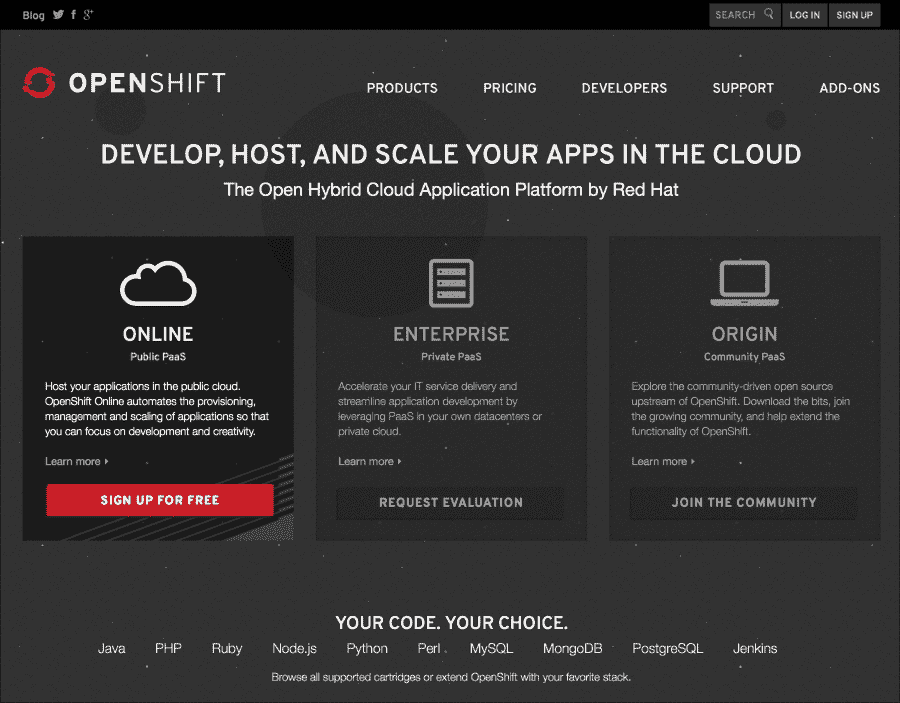

    OpenShift 主页

1.  下一步是填写注册表单，提供有效的、可工作的电子邮件 ID 并选择一个密码，如下面的截图所示：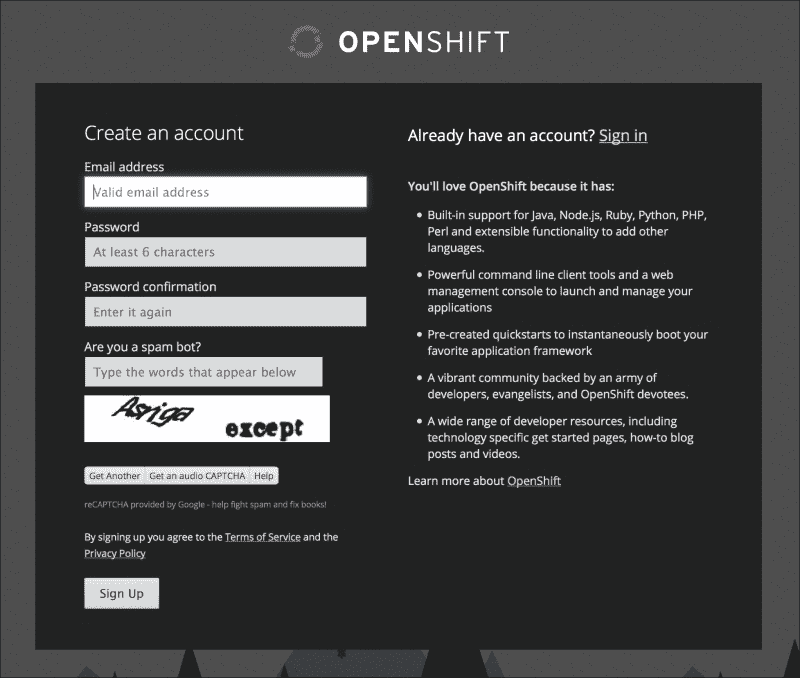

    OpenShift Online 注册表单

1.  完成后，点击**注册**按钮并等待确认邮件，如下面的消息所警告的：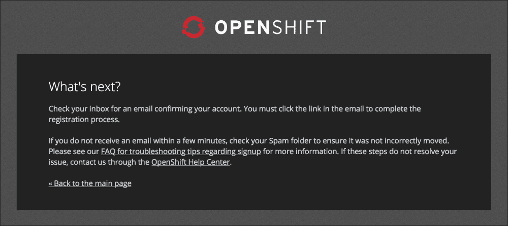

    确认邮件的消息警告

1.  你可能需要等待几分钟，甚至检查一下**垃圾邮件**文件夹。邮件应该看起来像下面的截图：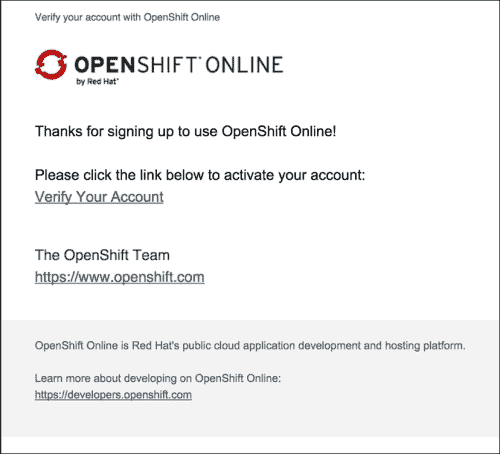

    OpenShift Online 发送的电子邮件

1.  点击标有**验证您的账户**的链接以激活您的账户。

1.  你将被提示接受**OpenShift 服务协议**和**Red Hat 门户使用条款**，如下面的图片所示：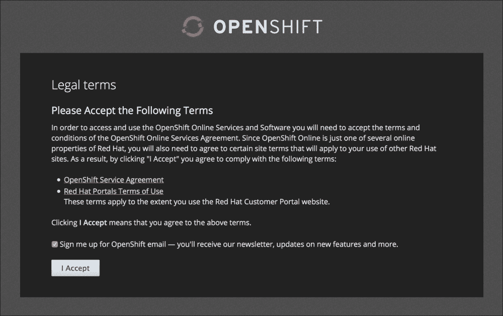

    OpenShift 服务协议和 Red Hat 门户使用条款接受表

1.  如果你愿意，你也可以勾选**注册 OpenShift 电子邮件**并点击**我接受**按钮。

太好了，你现在可以部署到云端并向世界提供你的应用程序了！

## 如何工作…

这个过程非常直接且快捷。再次值得提一下的是你获得的账户类型。

一旦你登录到 OpenShift Online 账户，屏幕右上角你可以找到带有向下箭头的用户名。如果你点击它，你会看到一个菜单；点击第一个标有**我的账户**的项目。

它应该为你提供一个如下所示的页面：

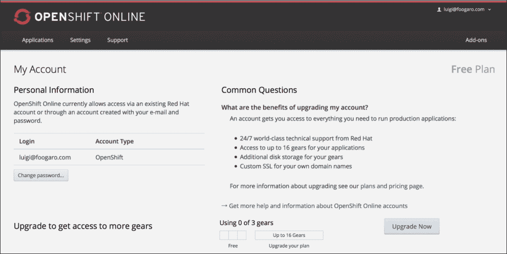

OpenShift Online “我的账户”页面

在该页面上有四件事情需要注意：

+   在左侧是你的登录电子邮件和账户类型；总是检查一下为好。

+   屏幕右上角有一个灰色粗体标签，指定了**免费计划**。

+   在页面底部中央是信息，目前你正在使用三台（**3**）中的零台（**0**）齿轮，并且它们是免费的。同样，在同一位置，还有一个提示，你可以拥有最多 **16 Gears**，不能再多了！这是你在选择 OpenShift Online 和 OpenShift Enterprise（这是一个完全可定制的版本）时应该考虑的事情。

+   最后，但同样重要的是，是**立即升级**按钮，它为你提供了升级到**青铜**或**银色**计划所需的所有信息。

## 参考以下内容

+   关于 OpenShift Online 提供的所有服务和其工作原理，请参阅[`www.openshift.com/walkthrough/how-it-works`](https://www.openshift.com/walkthrough/how-it-works)上的文档。

+   如果你正在寻找从开发者的角度来看的文档，你可以访问 [`developers.openshift.com`](https://developers.openshift.com)。

# 为我们的第一次部署安装 WildFly 卡包

在这个菜谱中，你将学习如何使用你的 OpenShift Online 账户配置 WildFly 卡包。如果你还没有账户，请参阅本章的第一个菜谱。

## 准备工作

由于我们大部分时间都会在线操作，你需要有一个互联网连接。另一方面，我们本地只需要一个要部署的 Web 应用程序。

1.  因此，请从我的 GitHub 账户下载名为 `wildfly-cookbook-oso` 的整个仓库，网址为 [`github.com/foogaro/wildfly-cookbook-oso.git`](https://github.com/foogaro/wildfly-cookbook-oso.git)。

1.  你可以 `git-clone` 项目或仅将其作为 ZIP 存档下载。无论哪种方式，将源放置在我们的 `~/WFC/github` 路径下。在那里你可以找到一个名为 `openshift-welcome` 的项目。要编译项目，请执行以下命令：

    ```java
    $ cd ~/WFC/github/wildfly-cookbook-oso
    $ cd openshift-welcome
    $ mvn clean package
    ```

1.  在由 Maven 生成的 `target` 文件夹中，你应该找到准备部署的 `openshift-welcome.war` 工件。

现在让我们真正开始吧！

## 如何操作…

1.  首先，登录到你的 OSO 账户 [`openshift.redhat.com/app/console`](https://openshift.redhat.com/app/console)。

1.  使用注册时选择的电子邮件和密码，如下面的图像所示：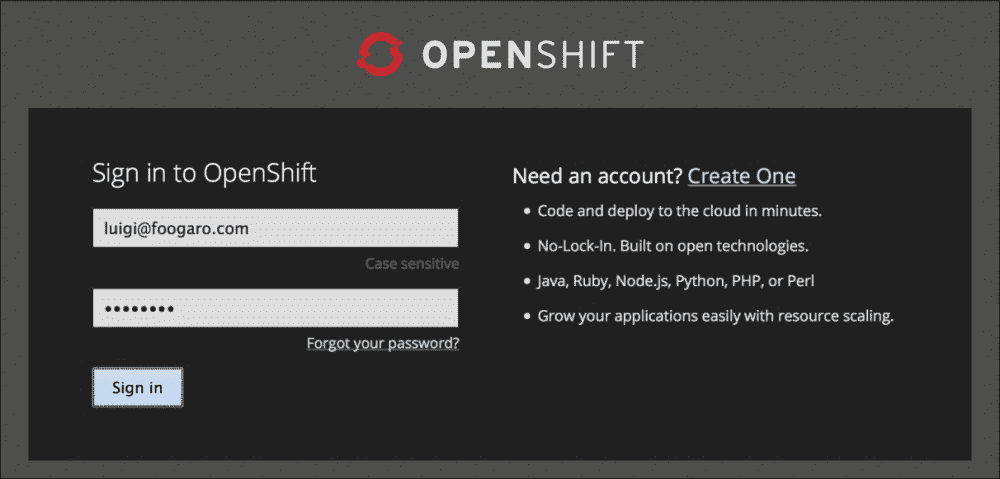

    OpenShift Online 登录表单

1.  一旦进入，首先要做的是创建一个应用程序，如下面的截图所示：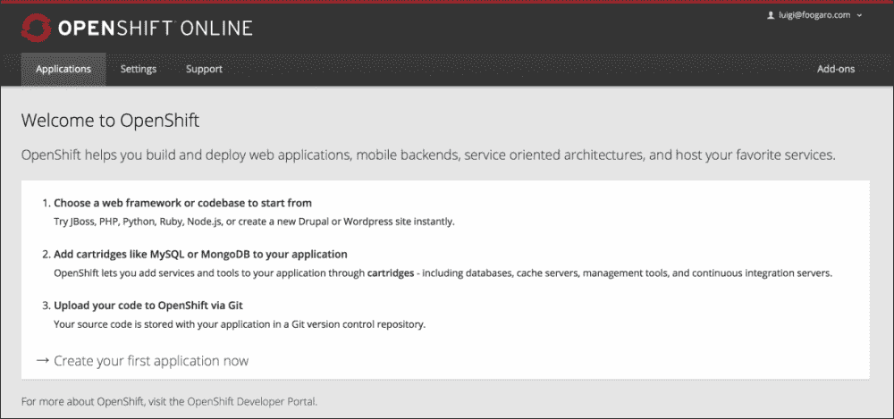

    OpenShift Online 欢迎页面

1.  点击**立即创建第一个应用程序**链接。在下一页，选择 WildFly 卡包，如下面的图像所示：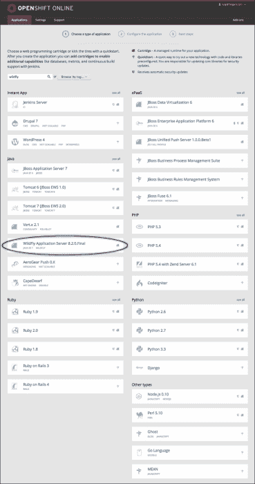

    OpenShift Online 最常用卡包列表

    ### 注意

    在编写本书时，WildFly 最新可用的稳定卡式版本是 8.2.0.Final。显然，这是我们提供应用程序的应用服务器。

1.  接下来，我们需要配置我们的命名空间，所有我们的应用程序都将属于该命名空间，并配置应用程序名称；这两个配置项共同构成了**公共 URL**，如下图中所示：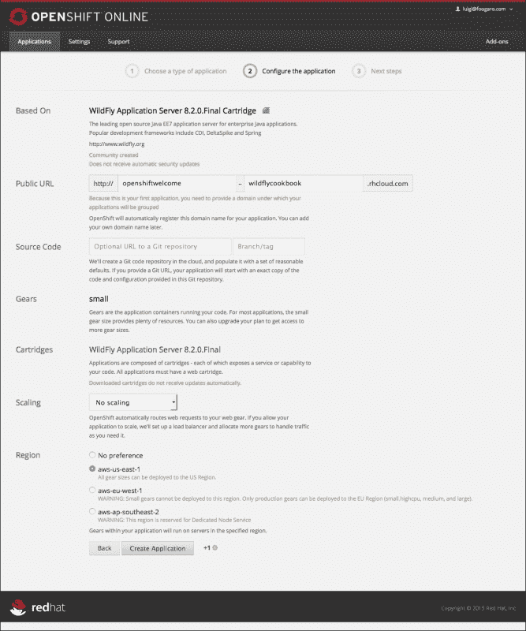

    OpenShift Online—应用程序设置表单

1.  在前面的表单中，您需要更改的是域名，它位于连字符符号（**-**）的右侧；我选择了`wildflycookbook`。域名必须在**rhcloud.com**的 OpenShift Online 中是唯一的。因此，请选择您自己的域名，所有您的应用程序名称都将属于该域名。

1.  对于这次第一次尝试，请保持所有默认设置不变，并点击**创建应用程序**按钮。完成所有必要的步骤可能需要几分钟时间——对我来说是 4 分钟。

1.  然后您将被询问是否要更改代码：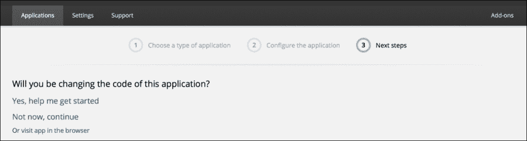

1.  目前，我们只需跳过此步骤，并点击标签为**现在不，继续**的链接——我们将在本章的后面看到具有特定食谱的另一个选项。

1.  下一页将是我们的总结页面，它将给我们提供所有管理 WildFly 实例的信息，例如部署我们的应用程序。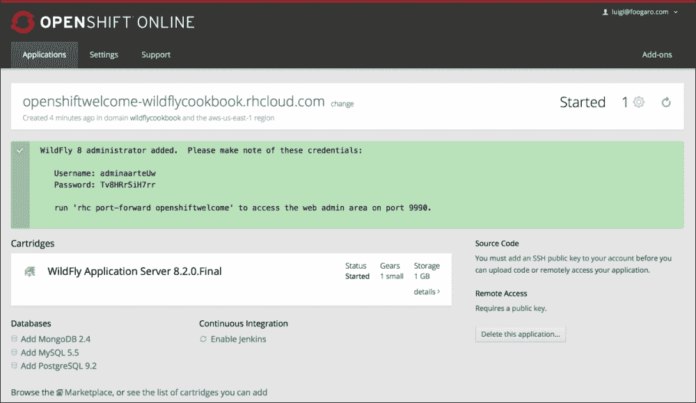

1.  在前面的截图中的绿色框中，描述了管理员用户的**用户名**和**密码**——基本上，这是一个绑定到`ManagementRealm`并具有管理员权限的用户。顺便说一句，为了访问 Web 控制台，我们需要使用一个名为 RHC 的工具，它可以为我们转发所有请求到我们新 OpenShift Online 环境中的管理控制台的 9990 端口。

    还有一件事要做，那就是安装名为 RHC 的客户端工具，它将为我们提供一个命令行界面，以便从我们的 PC 上本地管理 OSO。

1.  打开一个终端窗口并运行以下命令：

    ```java
    $ sudo yum -y install rubygems git
    $ sudo gem install rhc
    ```

1.  现在所有软件都已安装，我们需要设置 RHC 工具，如下所示：

    ```java
    $ rhc setup
    OpenShift Client Tools (RHC) Setup Wizard

    This wizard will help you upload your SSH keys, set your application namespace, and check that other programs like Git are properly installed.

    If you have your own OpenShift server, you can specify it now. Just hit enter to use the server for OpenShift Online: openshift.redhat.com.
    Enter the server hostname: |openshift.redhat.com|

    You can add more servers later using 'rhc server'.

    Login to openshift.redhat.com: luigi@foogaro.com
    Password: ********

    OpenShift can create and store a token on disk which allows to you to access the server without using your password. The key is stored in your home directory and should be kept secret.  You can delete the key at
    any time by running 'rhc logout'.
    Generate a token now? (yes|no) yes
    Generating an authorization token for this client ... lasts about 1 month

    Saving configuration to /home/luigi/.openshift/express.conf ... done

    No SSH keys were found. We will generate a pair of keys for you.

        Created: /home/luigi/.ssh/id_rsa.pub

    Your public SSH key must be uploaded to the OpenShift server to access code.  Upload now? (yes|no) yes

    Since you do not have any keys associated with your OpenShift account, your new key will be uploaded as the 'default' key.

    Uploading key 'default' ... done

    Checking for git ... found git version 2.1.0

    Checking common problems .. done

    Checking for a domain ... wildflycookbook

    Checking for applications ... found 1

      openshiftwelcome http://openshiftwelcome-wildflycookbook.rhcloud.com/

      You are using 1 of 3 total gears
      The following gear sizes are available to you: small

    Your client tools are now configured.
    ```

    如您所见，输出符合我的配置。您的也应该类似。

    好的，让我们回到我们之前的地方。我们准备部署我们的应用程序，但我们需要访问管理控制台。

1.  现在我们可以通过首先提供以下 RHC 命令来完成它：

    ```java
    $ rhc port-forward openshiftwelcome
    Checking available ports ... done
    Forwarding ports ...

    To connect to a service running on OpenShift, use the Local address

    Service Local               OpenShift
    ------- -------------- ---- ----------------
    java    127.0.0.1:3528  =>  127.7.222.1:3528
    java    127.0.0.1:8080  =>  127.7.222.1:8080
    java    127.0.0.1:9990  =>  127.7.222.1:9990

    Press CTRL-C to terminate port forwarding
    ```

    如最后一行所述，请保持此过程运行。

1.  现在，让我们打开浏览器并将它指向 OpenShift Online 管理控制台，即`http://127.0.0.1:9990`。

1.  当需要时，在绿色框中插入我们在创建第一个应用程序时提供的凭据。

    您现在应该看到以下页面：

    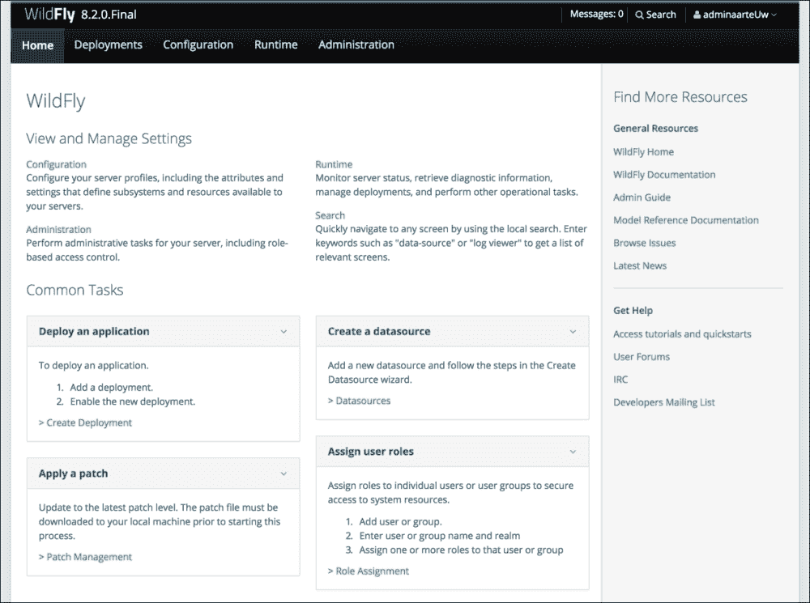

    OpenShift Online 上的 WildFly 管理控制台

1.  我们可以通过点击**部署**标签来部署我们的应用程序：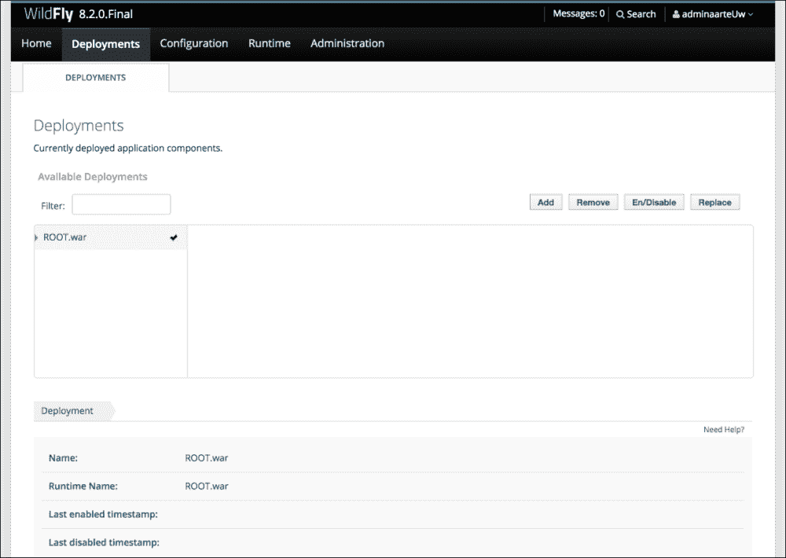

    部署管理

1.  点击**添加**按钮，选择我们之前使用 maven 命令编译的`openshift-welcome.war`工件。一旦我们选择了它，按照以下方式启用并确认：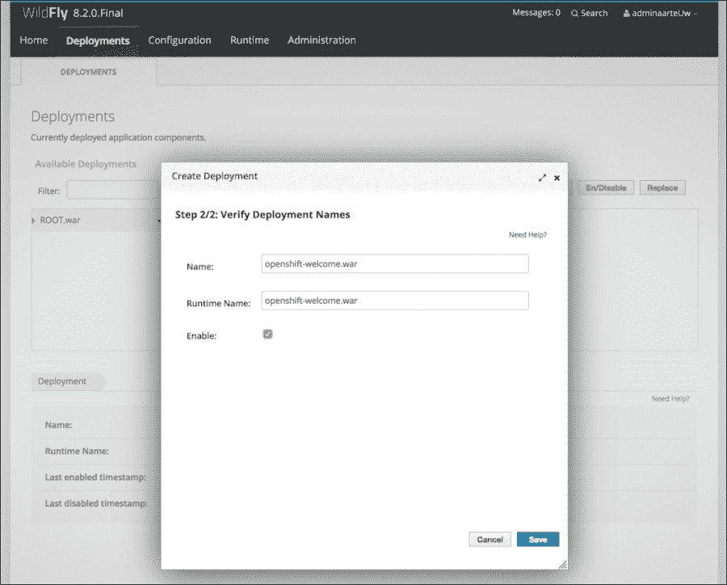

    部署`openshift-welcome.war`应用程序

1.  一旦我们成功部署了应用程序，让我们通过在[`openshiftwelcome-wildflycookbook.rhcloud.com`](http://openshiftwelcome-wildflycookbook.rhcloud.com)打开它来尝试它。

    这是我们首次在 OpenShift Online 上运行的 WildFly 应用：

    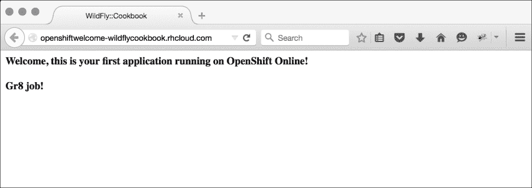

    OpenShift-welcome 应用程序启动并运行

该页面设计得尽可能全面；我还使用了粗体字体风格！

## 如何工作…

好吧，这里由 OpenShift Online 完成了艰难的工作。我们本质上所做的唯一一件事是安装 Ruby 编程语言环境，以便能够安装和运行 RHC 工具，这是用于管理 OpenShift Online 环境的客户端工具。

让我们回顾一下在云中部署我们的第一个应用程序期间我们所做的工作。

首先，我们选择了卡式盒。正如我们所见，有许多卡式盒可供我们的齿轮使用：WildFly、JBoss AS、Tomcat、Drupal、WordPress、Node.js 和**MongoDB Express Angular Node**（**MEAN**）。有很多，你可以在 OpenShift Online 网站上找到它们，网址为[`openshift.redhat.com/app/console/application_types`](https://openshift.redhat.com/app/console/application_types)。

一旦我们选择了 WildFly 卡式盒，平台会要求我们提供用于发布应用程序的**公共 URL**，如下图所示：


发布应用程序的公共 URL

URL，除了后缀**.rhcloud.com**之外，是由应用程序名称和命名空间组成的。最后一个基本上是你的域名，所有应用程序都驻留在那里。记住，它必须是唯一的！在我的情况下，我选择了命名空间`wildflycookbook`。

实际上，下次你创建应用程序时，你将只被要求提供应用程序名称，如下所示：


定义要用于公共 URL 的应用程序名称

仍然停留在同一页面上，我们还可以选择另一个选项——扩展，如下图所示：


OpenShift Online 中的扩展选项

这个选项将使我们能够自动扩展应用程序。简而言之，如介绍中已提到的，当传入流量增加时，OpenShift 将创建额外的 WildFly 齿轮（只要它们在你的计划中可用）和一个均衡器齿轮，以实现水平扩展。

下一个选项将是**区域**，即服务器将运行您的齿轮的位置：美国、欧洲或亚洲。

任何大小的所有齿轮都可以在**美国**运行；只有生产齿轮可以部署到**欧洲**地区（small.highcpu、medium 和 large）。**亚洲**地区保留用于专用节点服务。

因此，在免费计划下，我们只能选择**美国**地区，这没问题。

如你所猜测的地区名称（`aws-us-east-1`）所示，OpenShift 依赖于 Amazon AWS 来创建服务器。由于 Amazon 的“只为你使用的付费”政策，每当你的网站流量减少时，OpenShift 就会收回额外的资源。

除了配置设置之外，我还通过`WEB-INF/jboss-web.xml` JBoss 特定描述符文件将一个设置放入了应用程序中，它看起来像这样：

```java
<jboss-web>
    <context-root>/</context-root>
</jboss-web>
```

上述配置将应用程序的上下文根设置为`/`，因此我们可以通过只提供 URL [`openshiftwelcome-wildflycookbook.rhcloud.com`](http://openshiftwelcome-wildflycookbook.rhcloud.com) 来访问它，而不需要任何额外的上下文路径。

## 还有更多…

这个菜谱有点长，你可能已经以不同的方式完成了它。如果是这样，你可能遇到过这种情况：

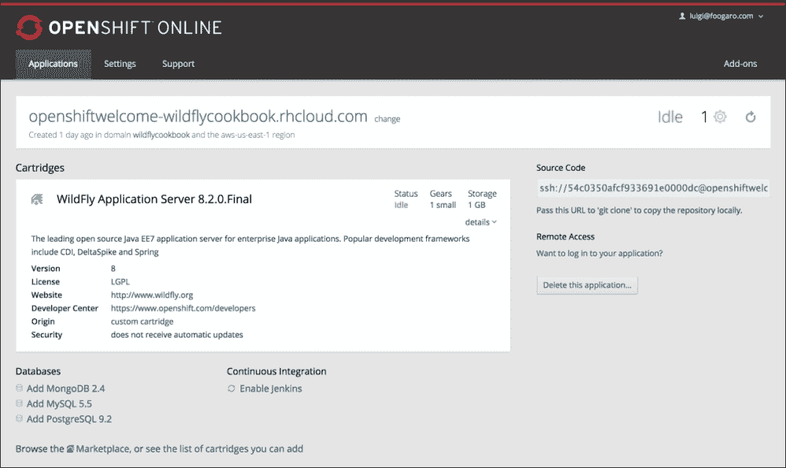

空闲状态中的应用程序

这基本上意味着你的 WildFly 实例已经停止。你的应用程序将不会收到流量，甚至 WildFly 管理控制台的访问也将无法工作：

```java
$ rhc port-forward openshiftwelcome
Checking available ports ... none
There are no available ports to forward for this application. Your application may be stopped or idled.
```

前进唯一的方法是重新启动应用程序。

### 小贴士

请记住，在 48 小时的不活跃状态或完全没有流量后，OpenShift Online 会将你的应用程序恢复到空闲状态。为了防止你的应用程序进入空闲状态，你可以设置一个类型的 cron 作业，每天对你的网站进行一次简单的 HTTP GET 请求。

## 参见

+   关于 OpenShift Online 提供的服务及其工作原理，请参阅[`www.openshift.com/walkthrough/how-it-works`](https://www.openshift.com/walkthrough/how-it-works)文档。

+   如果你正在寻找从开发者的角度的文档，请访问[`developers.openshift.com`](https://developers.openshift.com)。

# 通过 SSH 控制你的 WildFly 服务器

在这个菜谱中，你将学习如何访问运行 WildFly 的服务器。访问服务器会让你感到一种安心，因为我想，这是我们通常工作的方式。在那里，你可以看到 WildFly 进程、其日志、其目录结构等等。

## 准备工作

在你能够有效地完成这个菜谱之前，你应该有一个活跃的 OpenShift Online 账户以及一个应用程序。如果你需要，你可以按照第一个菜谱进行注册过程，并按照本章的*为首次部署安装 WildFly 卡顿*菜谱创建你的第一个应用程序。

在这个菜谱中，我将使用在创建应用程序 `openshiftwelcome` 时生成的环境；你的可能不同，但概念上应该是相同的。

## 如何做…

1.  首先，让我们登录到你的 OSO 账户，在[`openshift.redhat.com/app/console`](https://openshift.redhat.com/app/console)。

1.  然后输入你在注册过程中选择的用户名和密码。

1.  登录后，选择你创建的应用程序，或者根据第二个菜谱创建一个新的应用程序。我将选择我的`openshiftwelcome`应用程序。

    以下是我的申请详情：

    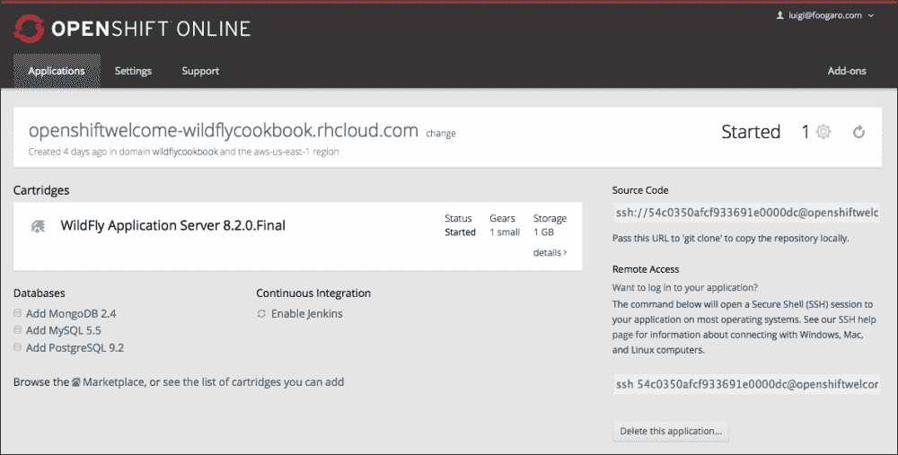

    申请详情

    在前面的屏幕截图中，右侧有两个名为**源代码**和**远程访问**的部分。

1.  在**远程访问**部分，点击**想要登录到你的应用程序？**标签。它描述了如何登录到托管你的应用程序的服务器，显然还包括它的卡式盒。

1.  打开一个终端窗口，复制粘贴页面提供的`ssh`命令。我的如下所示：

    ```java
    $ ssh 54c0350afcf933691e0000dc@openshiftwelcome-wildflycookbook.rhcloud.com

        *********************************************************************

        You are accessing a service that is for use only by authorized users.
        If you do not have authorization, discontinue use at once.
        Any use of the services is subject to the applicable terms of the
        agreement which can be found at:
        https://www.openshift.com/legal

        *********************************************************************

        Welcome to OpenShift shell

        This shell will assist you in managing OpenShift applications.

        !!! IMPORTANT !!! IMPORTANT !!! IMPORTANT !!!
        Shell access is quite powerful and it is possible for you to
        accidentally damage your application.  Proceed with care!
        If worse comes to worst, destroy your application with "rhc app delete"
        and recreate it
        !!! IMPORTANT !!! IMPORTANT !!! IMPORTANT !!!

        Type "help" for more info.

    [openshiftwelcome-wildflycookbook.rhcloud.com 54c0350afcf933691e0000dc]\>
    ```

    到那里后，你可以查看 WildFly 日志并查看你想要查看的一切。

    ### 注意

    小心，如果你删除了不应该删除的东西，你需要重新创建你的应用程序。

让我们看看 WildFly 的日志。

1.  执行以下操作：

    ```java
    [openshiftwelcome-wildflycookbook.rhcloud.com 54c0350afcf933691e0000dc]\> tail -f wildfly/standalone/log/server.log
    2015-01-23 11:17:20,864 INFO  [org.jboss.as.server] (XNIO-1 task-4) JBAS018559: Deployed "openshift-welcome.war" (runtime-name : "openshift-welcome.war")
    2015-01-23 11:20:21,227 INFO  [org.wildfly.extension.undertow] (MSC service thread 1-2) JBAS017535: Unregistered web context: /openshift-welcome
    2015-01-23 11:20:21,379 INFO  [org.hibernate.validator.internal.util.Version] (MSC service thread 1-1) HV000001: Hibernate Validator 5.1.3.Final
    2015-01-23 11:20:21,590 INFO  [org.jboss.as.server.deployment] (MSC service thread 1-2) JBAS015877: Stopped deployment openshift-welcome.war (runtime-name: openshift-welcome.war) in 386ms
    2015-01-23 11:20:21,676 INFO  [org.jboss.as.server] (XNIO-1 task-9) JBAS018558: Undeployed "openshift-welcome.war" (runtime-name: "openshift-welcome.war")
    2015-01-23 11:20:21,677 INFO  [org.jboss.as.repository] (XNIO-1 task-9) JBAS014901: Content removed from location /var/lib/openshift/54c0350afcf933691e0000dc/wildfly/standalone/data/content/6a/2481425c24beff9c840891145f6ea0ae5d1058/content
    2015-01-23 11:20:34,820 INFO  [org.jboss.as.repository] (XNIO-1 task-4) JBAS014900: Content added at location /var/lib/openshift/54c0350afcf933691e0000dc/wildfly/standalone/data/content/1b/65c52cbd69dc9f2fd0dbab59f1fb82c3c05038/content
    2015-01-23 11:20:35,195 INFO  [org.jboss.as.server.deployment] (MSC service thread 1-2) JBAS015876: Starting deployment of "openshift-welcome.war" (runtime-name: "openshift-welcome.war")
    2015-01-23 11:20:35,305 INFO  [org.wildfly.extension.undertow] (MSC service thread 1-2) JBAS017534: Registered web context: /
    2015-01-23 11:20:35,418 INFO  [org.jboss.as.server] (XNIO-1 task-8) JBAS018559: Deployed "openshift-welcome.war" (runtime-name : "openshift-welcome.war")
    ```

1.  显然，你不仅限于查看日志；你可以查看过程，如下所示：

    ```java
    [openshiftwelcome-wildflycookbook.rhcloud.com 54c0350afcf933691e0000dc]\> ps -efa | grep java | grep -v grep
    4028      94579  94303  0 Jan23 ?        00:08:07 /var/lib/openshift/54c0350afcf933691e0000dc/wildfly/usr/lib/jvm/jdk1.8.0_05/bin/java -D[Standalone] -server -Xmx256m -XX:MaxPermSize=102m -XX:+AggressiveOpts -Dorg.apache.tomcat.util.LOW_MEMORY=true -DOPENSHIFT_APP_UUID=54c0350afcf933691e0000dc -Dorg.jboss.resolver.warning=true -Djava.net.preferIPv4Stack=true -Dfile.encoding=UTF-8 -Djboss.node.name=openshiftwelcome-wildflycookbook.rhcloud.com -Djgroups.bind_addr= -Dorg.apache.coyote.http11.Http11Protocol.COMPRESSION=on -Dorg.jboss.boot.log.file=/var/lib/openshift/54c0350afcf933691e0000dc/wildfly//standalone/log/server.log -Dlogging.configuration=file:/var/lib/openshift/54c0350afcf933691e0000dc/wildfly//standalone/configuration/logging.properties -jar /var/lib/openshift/54c0350afcf933691e0000dc/wildfly//jboss-modules.jar -mp /var/lib/openshift/54c0350afcf933691e0000dc/app-root/runtime/repo//.openshift/config/modules:/var/lib/openshift/54c0350afcf933691e0000dc/wildfly//modules org.jboss.as.standalone -Djboss.home.dir=/var/lib/openshift/54c0350afcf933691e0000dc/wildfly/ -Djboss.server.base.dir=/var/lib/openshift/54c0350afcf933691e0000dc/wildfly//standalone -b 127.7.222.1 -bmanagement=127.7.222.1
    ```

1.  或者，你可以通过执行`htop`命令来查看服务器资源：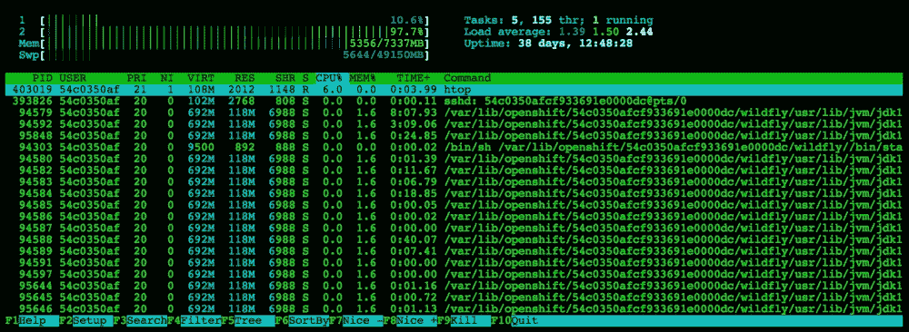

请记住，只要你的用户（标识应用程序的哈希值；我的为`54c0350afcf933691e0000dc`）有权限，你就可以查看和控制一切。

## 它是如何工作的…

每次你创建一个应用程序时，实际上你是在创建一个环境，以及一个允许你的应用程序运行的卡式盒。OpenShift Online 为你创建一切，并为整个过程分配一个哈希值。这个哈希值将成为你登录服务器的用户名，它也标识了你的应用程序。OpenShift 创建事物的其余过程超出了本书的范围。

如果你想了解更多关于内部工作原理的信息，我建议你从这本书开始：*Learning OpenShift*，*Grant Shipley*，*Packt Publishing*。

## 相关内容

+   请务必参考官方文档，在这种情况下，可以在[`docs.openshift.org/`](https://docs.openshift.org/)找到。

# 将你的代码部署到 OpenShift Online

在这个菜谱中，你将学习如何在源代码更新时重新部署应用程序。OpenShift Online 会自动为你完成这项工作，每次将提交应用到你的代码时，都会触发编译和部署。

## 准备工作

1.  首先，我们需要一个 GitHub 上的项目，我们可以用它来进行测试。因此，我在我的 GitHub 仓库中创建了一个名为`openshiftcoding-wildflycookbook`的项目，可在[`github.com/foogaro/openshiftcoding-wildflycookbook`](https://github.com/foogaro/openshiftcoding-wildflycookbook)找到。

1.  如果您在 GitHub 上没有账户，这可能是一个注册账户的好理由。迟早您都会需要它。为了快速开始，请访问 GitHub 网站[`github.com`](https://github.com)并注册。注册过程完成后，您将准备好创建一个仓库，该仓库将托管您应用程序的源代码。如果您没有应用程序，您可以借用我的。

1.  不管怎样，这次您不需要下载或`git-clone`我的 GitHub 仓库到本地，因为它将被用于为下一个 OpenShift 应用程序提供数据。但我们需要安装`git`客户端工具。如果您使用的是类似 Red Hat 的操作系统，请运行以下命令：

    ```java
    $ sudo yum -y install git
    ```

1.  完成后，您可以通过以下命令检查是否已成功安装所有内容：

    ```java
    $ git version
    git version 2.1.0
    ```

好的，现在我们准备开始了！

## 如何操作…

1.  首先，您需要访问以下地址的 OpenShift Online 账户[`openshift.redhat.com/app/console`](https://openshift.redhat.com/app/console)。

1.  使用注册时选择的电子邮件和密码，如下面的截图所示：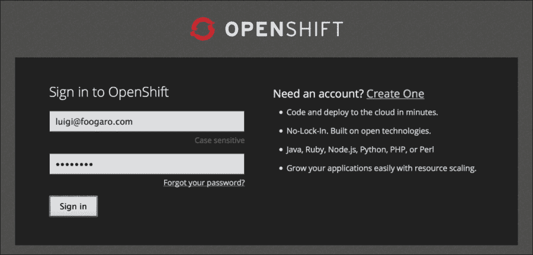

    OpenShift Online 登录表单

    ### 小贴士

    如果您还没有 OpenShift Online 账户，请遵循本章第一道菜谱中描述的注册过程。

1.  登录后，在主页上，点击**添加应用程序…**按钮创建一个新的应用程序：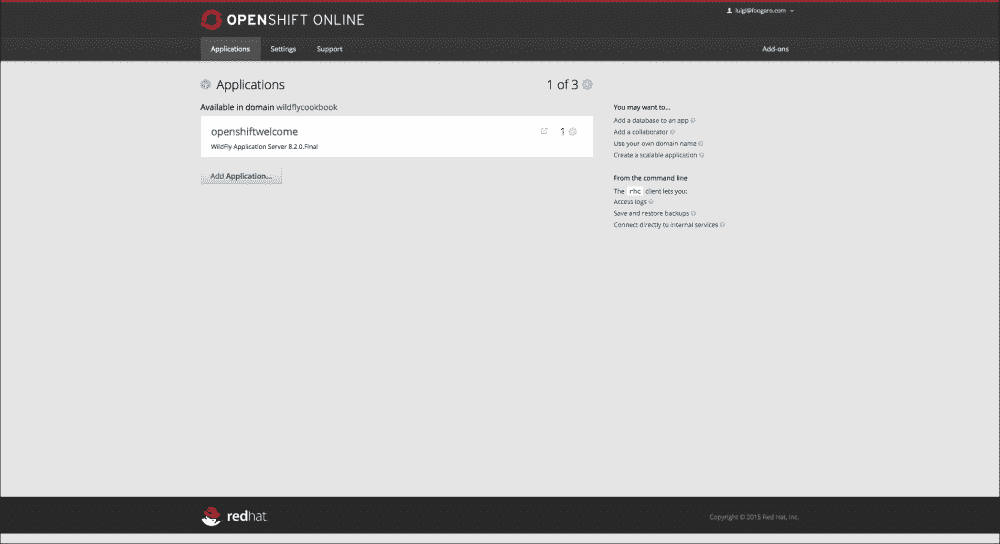

    添加新应用程序的 OpenShift Online 初始控制台

1.  接下来，我们需要选择 WildFly 卡顿。由于有数十种卡顿，我们可以通过提供标准筛选器来搜索它，如下面的截图所示：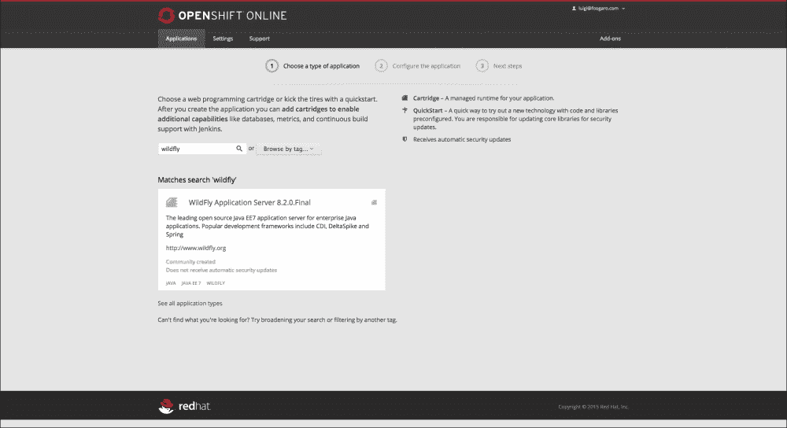

    通过筛选选择 WildFly 卡顿

1.  之后，选择卡顿并填写以下详细信息的表单：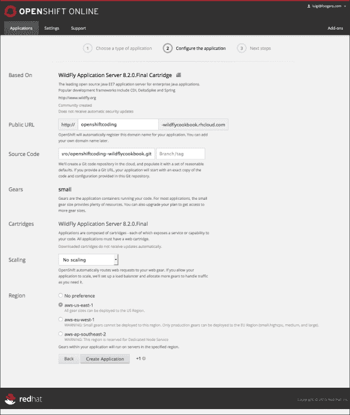

    设置应用程序详情

    在我的情况下，我把我应用程序命名为`openshiftcoding`。这次我指定了我的 GitHub 仓库，其中包含我的应用程序，即[`github.com/foogaro/openshiftcoding-wildflycookbook.git`](https://github.com/foogaro/openshiftcoding-wildflycookbook.git)。您需要指定您的。

1.  通过保留其他默认值并点击**创建应用程序**按钮完成表单。完成可能需要几分钟。

1.  一旦过程完成，您应该会看到一个像下面的页面：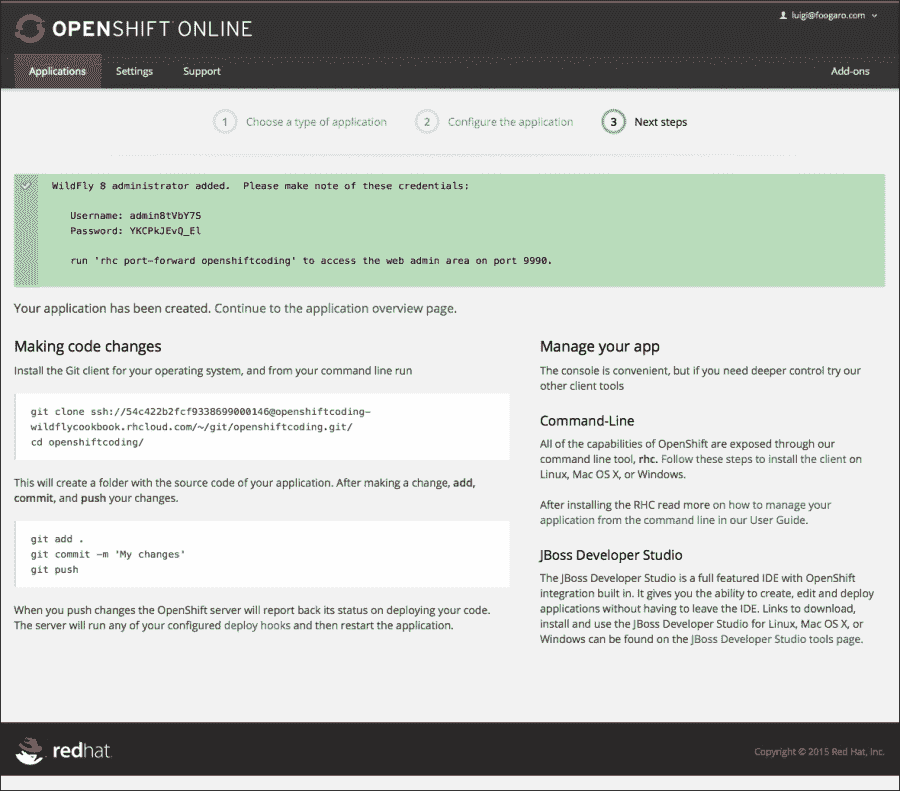

    新创建的应用程序概览

如前图所示，有一个标记为**制作代码更改**的部分，它描述了我们需要做什么来修改我们应用程序的源代码，并在我们修改代码时自动更新。

因此，打开一个终端窗口并输入`git clone`命令，指定你的 OpenShift Online 应用程序仓库——它不是 GitHub 上的那个，但会被克隆到 OpenShift 为你创建的服务器上。

这些是我现在输入的命令：

```java
$ cd ~/WFC/github
$ mkdir git-openshift
$ cd git-openshift
$ git clone ssh://54c422b2fcf9338699000146@openshiftcoding-wildflycookbook.rhcloud.com/~/git/openshiftcoding.git/
Cloning into 'openshiftcoding'...
Warning: Permanently added the RSA host key for IP address '54.234.243.133' to the list of known hosts.
remote: Counting objects: 24, done.
remote: Compressing objects: 100% (18/18), done.
remote: Total 24 (delta 4), reused 24 (delta 4)
Receiving objects: 100% (24/24), done.
Resolving deltas: 100% (4/4), done.
Checking connectivity... done.
```

我们现在可以更改源代码，提交它，并查看 OpenShift 直接编译和部署我们的应用程序到我们的 WildFly 实例。为了看到这一切，我们需要查看日志。

1.  打开一个终端窗口并输入以下命令：

    ```java
    $ ssh 54c422b2fcf9338699000146@openshiftcoding-wildflycookbook.rhcloud.com

        *********************************************************************

        You are accessing a service that is for use only by authorized users.
        If you do not have authorization, discontinue use at once.
        Any use of the services is subject to the applicable terms of the
        agreement which can be found at:
        https://www.openshift.com/legal

        *********************************************************************

        Welcome to OpenShift shell

        This shell will assist you in managing OpenShift applications.

        !!! IMPORTANT !!! IMPORTANT !!! IMPORTANT !!!
        Shell access is quite powerful and it is possible for you to
        accidentally damage your application.  Proceed with care!
        If worse comes to worst, destroy your application with "rhc app delete"
        and recreate it
        !!! IMPORTANT !!! IMPORTANT !!! IMPORTANT !!!

        Type "help" for more info.

    [openshiftcoding-wildflycookbook.rhcloud.com 54c422b2fcf9338699000146]\> tail -f wildfly/standalone/log/server.log
    2015-01-24 17:56:23,264 INFO  [org.jboss.as.connector.deployment] (MSC service thread 1-5) JBAS010406: Registered connection factory java:/JmsXA
    2015-01-24 17:56:23,337 INFO  [org.hornetq.ra] (MSC service thread 1-5) HornetQ resource adaptor started
    2015-01-24 17:56:23,338 INFO  [org.jboss.as.connector.services.resourceadapters.ResourceAdapterActivatorService$ResourceAdapterActivator] (MSC service thread 1-5) IJ020002: Deployed: file://RaActivatorhornetq-ra
    2015-01-24 17:56:23,355 INFO  [org.jboss.as.messaging] (MSC service thread 1-7) JBAS011601: Bound messaging object to jndi name java:jboss/DefaultJMSConnectionFactory
    2015-01-24 17:56:23,355 INFO  [org.jboss.as.connector.deployment] (MSC service thread 1-5) JBAS010401: Bound JCA ConnectionFactory [java:/JmsXA]
    2015-01-24 17:56:23,835 INFO  [org.wildfly.extension.undertow] (MSC service thread 1-4) JBAS017534: Registered web context: /
    2015-01-24 17:56:24,069 INFO  [org.jboss.as.server] (ServerService Thread Pool -- 32) JBAS018559: Deployed "openshift-coding.war" (runtime-name : "openshift-coding.war")
    2015-01-24 17:56:24,199 INFO  [org.jboss.as] (Controller Boot Thread) JBAS015961: Http management interface listening on http://127.7.132.129:9990/management
    2015-01-24 17:56:24,201 INFO  [org.jboss.as] (Controller Boot Thread) JBAS015951: Admin console listening on http://127.7.132.129:9990
    2015-01-24 17:56:24,201 INFO  [org.jboss.as] (Controller Boot Thread) JBAS015874: WildFly 8.2.0.Final "Tweek" started in 10428ms - Started 294 of 425 services (178 services are lazy, passive or on-demand)
    ```

1.  如您从前面强调的日志中看到的，我们的应用程序已经在那里；实际上，如果我们打开创建应用程序时指定的公共 URL，我们可以看到它正在工作，如下所示：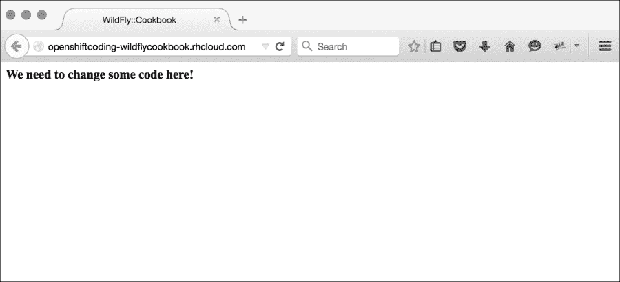

    应用程序需要更新

    好的，让我们更新源代码。在我的情况下，我只有一个 JSP，其代码如下：

    ```java
    <!DOCTYPE html PUBLIC
    "-//W3C//DTD XHTML 1.1 Transitional//EN"
    "http://www.w3.org/TR/xhtml1/DTD/xhtml1-transitional.dtd">

    <html  xml:lang="en" lang="en">
    <head>
        <title>WildFly::Cookbook</title>
    </head>
    <body>
    <b>We need to change some code here!</b>
    </body>
    </html>
    ```

1.  让我们在文本中添加一些颜色，如下所示：

    ```java
    <b style="color:red;">We need to change some code here!</b>
    ```

1.  现在，我们可以从第一个终端窗口（我们从 OpenShift 克隆 Git 仓库的地方）更新我们的代码到 Git 仓库，如下所示：

    ```java
    $ cd ~/WFC/github/git-openshift/openshiftcoding
    $ git status
    On branch master
    Your branch is up-to-date with 'origin/master'.
    Changes not staged for commit:
      (use "git add <file>..." to update what will be committed)
      (use "git checkout -- <file>..." to discard changes in working directory)
      modified:   src/main/webapp/index.jsp

    no changes added to commit (use "git add" and/or "git commit -a")
    $ git add .
    $ git commit -m "Added red color to the text"
    [master c89467c] Added red color to the text
     1 file changed, 1 insertion(+), 1 deletion(-)
    ```

1.  现在，我们需要推送一切。在这样做之前，让我们获取另一个带有可见 WildFly 日志的终端。现在我们可以进行魔法操作…

    ```java
    $ git push
    warning: push.default is unset; its implicit value has changed in
    Git 2.0 from 'matching' to 'simple'. To squelch this message
    and maintain the traditional behavior, use:

      git config --global push.default matching

    To squelch this message and adopt the new behavior now, use:

      git config --global push.default simple

    When push.default is set to 'matching', git will push local branches
    to the remote branches that already exist with the same name.

    Since Git 2.0, Git defaults to the more conservative 'simple'
    behavior, which only pushes the current branch to the corresponding
    remote branch that 'git pull' uses to update the current branch.

    See 'git help config' and search for 'push.default' for further information.
    (the 'simple' mode was introduced in Git 1.7.11\. Use the similar mode
    'current' instead of 'simple' if you sometimes use older versions of Git)

    Counting objects: 6, done.
    Delta compression using up to 8 threads.
    Compressing objects: 100% (5/5), done.
    Writing objects: 100% (6/6), 517 bytes | 0 bytes/s, done.
    Total 6 (delta 2), reused 0 (delta 0)
    remote: Stopping wildfly cart
    remote: Sending SIGTERM to wildfly:455867 ...
    remote: Building git ref 'master', commit c89467c
    remote: Found pom.xml... attempting to build with 'mvn -e clean package -Popenshift -DskipTests'
    remote: Apache Maven 3.0.4 (r1232336; 2012-12-18 14:36:37-0500)
    remote: Maven home: /usr/share/java/apache-maven-3.0.4
    remote: Java version: 1.8.0_05, vendor: Oracle Corporation
    remote: Java home: /var/lib/openshift/54c422b2fcf9338699000146/wildfly/usr/lib/jvm/jdk1.8.0_05/jre
    remote: Default locale: en_US, platform encoding: ANSI_X3.4-1968
    remote: OS name: "linux", version: "2.6.32-504.3.3.el6.x86_64", arch: "i386", family: "unix"
    remote: [INFO] Scanning for projects...
    remote: [INFO]
    remote: [INFO] ------------------------------------------------------------------------
    remote: [INFO] Building openshift-coding 1.0
    remote: [INFO] ------------------------------------------------------------------------
    remote: [INFO]
    remote: [INFO] --- maven-clean-plugin:2.4.1:clean (default-clean) @ openshift-coding ---
    remote: [INFO]
    remote: [INFO] --- maven-resources-plugin:2.5:resources (default-resources) @ openshift-coding ---
    remote: [debug] execute contextualize
    remote: [INFO] Using 'UTF-8' encoding to copy filtered resources.
    remote: [INFO] Copying 1 resource
    remote: [INFO]
    remote: [INFO] --- maven-compiler-plugin:2.3.2:compile (default-compile) @ openshift-coding ---
    remote: [INFO] No sources to compile
    remote: [INFO]
    remote: [INFO] --- maven-resources-plugin:2.5:testResources (default-testResources) @ openshift-coding ---
    remote: [debug] execute contextualize
    remote: [INFO] Using 'UTF-8' encoding to copy filtered resources.
    remote: [INFO] skip non existing resourceDirectory /var/lib/openshift/54c422b2fcf9338699000146/app-root/runtime/repo/src/test/resources
    remote: [INFO]
    remote: [INFO] --- maven-compiler-plugin:2.3.2:testCompile (default-testCompile) @ openshift-coding ---
    remote: [INFO] No sources to compile
    remote: [INFO]
    remote: [INFO] --- maven-surefire-plugin:2.10:test (default-test) @ openshift-coding ---
    remote: [INFO] Tests are skipped.
    remote: [INFO]
    remote: [INFO] --- maven-war-plugin:2.4:war (default-war) @ openshift-coding ---
    remote: [INFO] Packaging webapp
    remote: [INFO] Assembling webapp [openshift-coding] in [/var/lib/openshift/54c422b2fcf9338699000146/app-root/runtime/repo/target/openshift-coding]
    remote: [INFO] Processing war project
    remote: [INFO] Copying webapp resources [/var/lib/openshift/54c422b2fcf9338699000146/app-root/runtime/repo/src/main/webapp]
    remote: [INFO] Webapp assembled in [79 msecs]
    remote: [INFO] Building war: /var/lib/openshift/54c422b2fcf9338699000146/app-root/runtime/repo/deployments/openshift-coding.war
    remote: [INFO] ------------------------------------------------------------------------
    remote: [INFO] BUILD SUCCESS
    remote: [INFO] ------------------------------------------------------------------------
    remote: [INFO] Total time: 5.855s
    remote: [INFO] Finished at: Sat Jan 24 18:19:48 EST 2015
    remote: [INFO] Final Memory: 7M/79M
    remote: [INFO] ------------------------------------------------------------------------
    remote: Preparing build for deployment
    remote: Deployment id is 9aac8674
    remote: Activating deployment
    remote: Deploying WildFly
    remote: Starting wildfly cart
    remote: Found 127.7.132.129:8080 listening port
    remote: Found 127.7.132.129:9990 listening port
    remote: /var/lib/openshift/54c422b2fcf9338699000146/wildfly/standalone/deployments /var/lib/openshift/54c422b2fcf9338699000146/wildfly
    remote: /var/lib/openshift/54c422b2fcf9338699000146/wildfly
    remote: CLIENT_MESSAGE: Artifacts deployed: ./openshift-coding.war
    remote: -------------------------
    remote: Git Post-Receive Result: success
    remote: Activation status: success
    remote: Deployment completed with status: success
    To ssh://54c422b2fcf9338699000146@openshiftcoding-wildflycookbook.rhcloud.com/~/git/openshiftcoding.git/
       f2eba48..c89467c  master -> master
    ```

    如果你熟悉`git`，你会知道这次推送比预期的要长一些，但它做了很多事情：

    +   停止了我们的 WildFly

    +   它更新了代码

    +   它执行了 maven 编译，将我们的应用程序打包为`war`

    +   它将我们的新应用程序复制到了 WildFly 的`deployments`文件夹

    +   启动了 WildFly

1.  如果你已经查看了 WildFly 日志，你应该已经注意到了以下条目：

    ```java
    ...
    2015-01-24 18:19:36,758 INFO  [org.jboss.as] (MSC service thread 1-1) JBAS015950: WildFly 8.2.0.Final "Tweek" stopped in 1273ms
    ...
    2015-01-24 18:20:13,374 INFO  [org.wildfly.extension.undertow] (MSC service thread 1-5) JBAS017534: Registered web context: /
    2015-01-24 18:20:13,673 INFO  [org.jboss.as.server] (ServerService Thread Pool -- 32) JBAS018559: Deployed "openshift-coding.war" (runtime-name : "openshift-coding.war")
    2015-01-24 18:20:13,871 INFO  [org.jboss.as] (Controller Boot Thread) JBAS015961: Http management interface listening on http://127.7.132.129:9990/management
    2015-01-24 18:20:13,879 INFO  [org.jboss.as] (Controller Boot Thread) JBAS015951: Admin console listening on http://127.7.132.129:9990
    2015-01-24 18:20:13,879 INFO  [org.jboss.as] (Controller Boot Thread) JBAS015874: WildFly 8.2.0.Final "Tweek" started in 23656ms - Started 294 of 425 services (178 services are lazy, passive or on-demand)
    ```

1.  让我们看看一切是否正常工作。打开浏览器并访问[`openshiftcoding-wildflycookbook.rhcloud.com`](http://openshiftcoding-wildflycookbook.rhcloud.com)。

    你应该看到如下页面：

    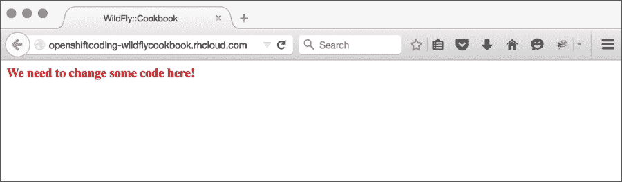

    应用程序通过 git push 更新

太好了，它成功了！

## 它是如何工作的…

OpenShift Online 在幕后隐藏并做了很多事情，使我们的生活更加轻松，容易得多。我们实际上在开发方面所做的只是很小的一部分。

为了让 OpenShift Online 轻松编译、打包和部署我们的应用程序，我们需要指导它如何编译源代码、如何打包它以及部署到何处。我们可以通过 maven 项目文件`pom.xml`给出这些指令。

以下是在`openshiftcoding-wildflycookbook`项目中的完整`pom.xml`文件（也可在[`github.com/foogaro/openshiftcoding-wildflycookbook/blob/master/pom.xml`](https://github.com/foogaro/openshiftcoding-wildflycookbook/blob/master/pom.xml)找到）：

```java
<project  
         xsi:schemaLocation="http://maven.apache.org/POM/4.0.0 http://maven.apache.org/maven-v4_0_0.xsd">
    <modelVersion>4.0.0</modelVersion>
    <groupId>com.packtpub.wildfly-cookbook</groupId>
    <artifactId>openshift-coding</artifactId>
    <packaging>war</packaging>
    <version>1.0</version>
    <name>openshift-coding</name>

    <properties>
        <project.build.sourceEncoding>UTF-8</project.build.sourceEncoding>
    </properties>

    <profiles>
        <profile>
            <id>openshift</id>
            <build>
                <finalName>${project.name}</finalName>
                <plugins>
                    <plugin>
                        <groupId>org.apache.maven.plugins</groupId>
                        <artifactId>maven-war-plugin</artifactId>
                        <version>2.4</version>
                        <configuration>
                            <failOnMissingWebXml>false</failOnMissingWebXml>
                            <outputDirectory>deployments</outputDirectory>
                            <warName>${project.name}</warName>
                        </configuration>
                    </plugin>
                </plugins>
            </build>
        </profile>
    </profiles>

</project>
```

这里的关键是名为`openshift`的配置文件。默认情况下，OSO 使用 Maven 编译源代码，并要求使用`openshift`配置文件。它找到的配置文件将与其设置一起使用；否则，代码将被编译和打包，但 OSO 将不知道部署到何处。

我提供的`openshift`配置文件，定义了（使用`build`标签）在 Maven 构建阶段要使用的设置。特别是，我使用了标准的`maven-war-plugin`并将`outputDirectory`设置为`deployments`，这是 WildFly 使用的目录。

## 参见

从开发者的角度来看，我建议您参考以下网站上的官方文档：

+   [`docs.openshift.com`](https://docs.openshift.com)

+   [`developers.openshift.com/en/managing-modifying-applications.html`](https://developers.openshift.com/en/managing-modifying-applications.html)
