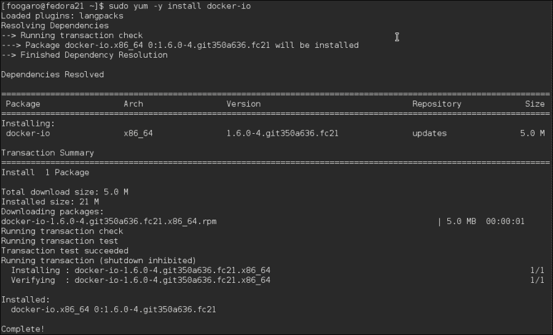
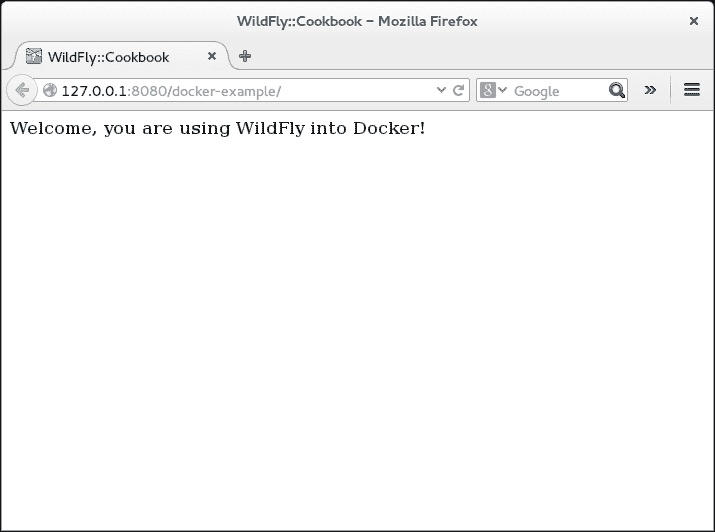
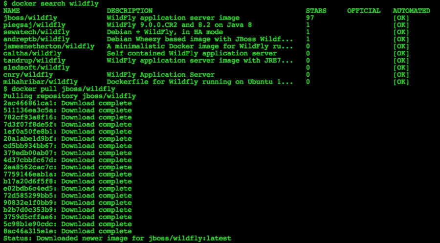
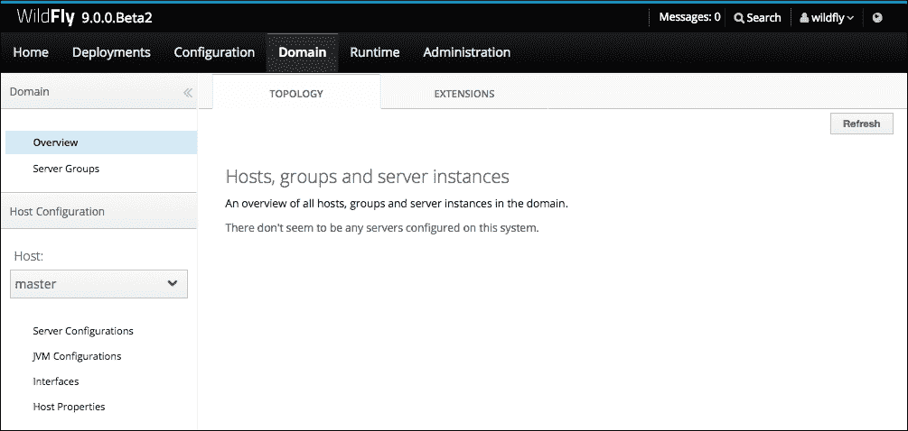
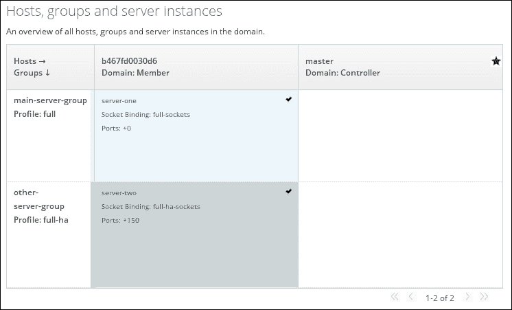
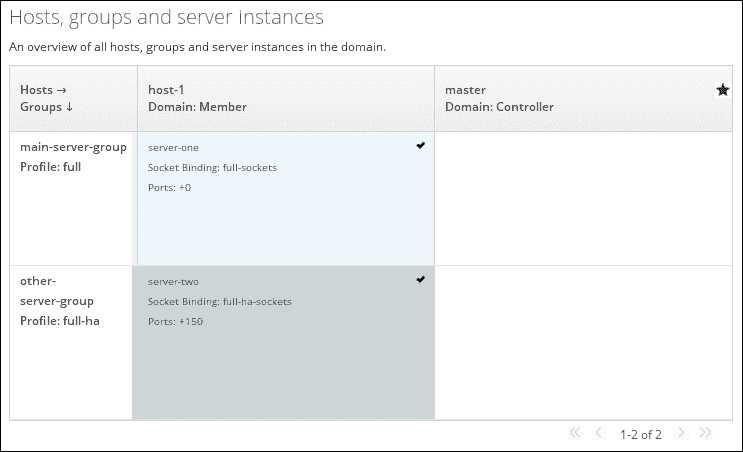

# 第十五章 使用 Docker 与 WildFly

在本章中，您将学习以下食谱：

+   设置 Docker 环境

+   在 Docker 中运行 WildFly

+   在 Docker 外记录 WildFly

+   在 Docker 中使用不同的 Docker 容器以域模式运行 WildFly

# 简介

在本章中，我们将开始学习 Docker 的基础知识，以及您如何通过部署应用程序及其环境来利用它。

Docker 是一个开源平台，用于开发、运输和运行应用程序。Docker 的基本思想是消除当您将应用程序（实际上整个运行环境）从环境到环境进行推广时出现的问题；也就是说，从开发到测试，到预生产，到质量，直到生产。涉及到的变量如此之多，即使你尽力而为，在传统的软件生命周期中也可能出现问题。

使用 Docker，您可以在每个阶段复制您的整个环境。单词“复制”可能不足以很好地解释这个概念；“重新提交”可能更好。

Docker 由以下组成：

+   **镜像**：Docker 镜像就像一个模板。假设您有一个包含 Fedora、Java 8、WildFly 和已安装应用程序的镜像。镜像可以通过名为`Dockerfile`的描述文件下载或构建。从镜像中，您可以运行容器。

+   **仓库**：这些是存储镜像的地方。可以有私有和公共仓库，例如 Docker Hub ([`hub.docker.com`](http://hub.docker.com)).

+   **容器**：它们实际上是 Docker 的运行组件。基本上，它是一个 Docker 镜像的运行实例。容器可以被启动、停止、删除等。每个容器都与运行它的主机以及其他容器隔离。

顺便问一下，我们如何通过 Docker 在各个阶段推广我们的应用程序时避免出现任何坏惊喜的结果？将 Docker 视为创建可插拔层堆栈的工具。第一层是操作系统层，然后是您的环境层（可能是您的特定 Java 运行时版本），然后是您的应用程序层——您可以根据需要/想要拥有尽可能多的层。

一旦您的堆栈全部填满，您得到的就是您的 Docker 镜像，它已准备好提交到仓库。之后，您抓取您的镜像并在生产硬件上安装该精确镜像。然后您得到的是当一切运行顺利时的东西——希望您能理解这个意思。

为了更好地理解 Docker 是什么，我强烈建议您阅读以下 URLs 上的默认文档和用户指南：

+   [`docs.docker.com/introduction/understanding-docker`](http://docs.docker.com/introduction/understanding-docker)

+   [`docs.docker.com/userguide`](http://docs.docker.com/userguide)

在本章中，我们将主要使用适用于不同操作系统的 Docker 客户端，这是与 Docker 守护进程交互的工具。有如此多的设置和功能可以讨论，以至于需要另一本书来详述。因此，我将专注于安装客户端工具，并解释我们将在我们的食谱中使用的命令和参数，即在一些基本的 WildFly 场景中。

# 设置 Docker 环境

在这个食谱中，你将学习如何安装 Docker 并熟悉基本命令。你将看到如何基于 Fedora 创建和构建镜像，以及如何运行它。

## 准备工作

为了下载和安装 Docker 及其依赖项，我们需要访问互联网。

## 如何做…

1.  要在 Fedora 上安装 Docker，请执行以下命令：

    ```java
    $ sudo yum -y remove docker
    $ sudo yum -y install docker-io
    ```

    安装应该看起来像以下截图：

    

1.  好的，现在 Docker 已经安装好了，让我们来运行它：

    ```java
    $ sudo systemctl start docker
    ```

1.  如果你想在启动时启动 Docker，请使用以下命令：

    ```java
    $ sudo systemctl enable docker
    Created symlink from /etc/systemd/system/multi-user.target.wants/docker.service to /usr/lib/systemd/system/docker.service.
    ```

1.  此外，确保你的用户属于`docker`组，通过执行以下命令：

    ```java
    $ groups
    luigi wheel docker
    ```

1.  如果`docker`组未列出，请使用以下命令添加：

    ```java
    $ sudo usermod -a -G docker luigi
    ```

    显然，将用户`luigi`替换为你自己的用户名。

1.  通过以下命令检查 Docker 的版本：

    ```java
    $ docker version
    Client version: 1.6.0
    Client API version: 1.18
    Go version (client): go1.4.2
    Git commit (client): 350a636/1.6.0
    OS/Arch (client): linux/amd64
    Server version: 1.6.0
    Server API version: 1.18
    Go version (server): go1.4.2
    Git commit (server): 350a636/1.6.0
    ```

    太好了，我们现在准备好将任何东西 docker 化！

1.  要这样做，首先我们需要检查是否有任何可用的镜像，如下所示：

    ```java
    $ docker images
    REPOSITORY          TAG                 IMAGE ID            CREATED             VIRTUAL SIZE
    ```

1.  由于没有可用的镜像，我们需要通过以下命令查找它：

    ```java
    $ docker search fedora
    NAME                         DESCRIPTION                                     STARS     OFFICIAL   AUTOMATED
    fedora                       Official Fedora 21 base image and semi-off...   128       [OK]       
    fedora/apache                                                                28        [OK]
    fedora/couchdb                                                               25        [OK]
    fedora/mariadb                                                               22        [OK]
    fedora/memcached                                                             19        [OK]
    fedora/earthquake                                                            17        [OK]
    fedora/ssh                                                                   16        [OK]
    ...
    ```

1.  我们想要的 Docker 镜像是官方的 Fedora 21。我们可以按照以下方式下载它：

    ```java
    $ docker pull fedora:21
    fedora:latest: The image you are pulling has been verified

    511136ea3c5a: Pull complete
    00a0c78eeb6d: Pull complete
    834629358fe2: Downloading [>                  ] 2.681 MB/250 MB 3m20s
    ```

1.  当所有拉取完成时，我们得到以下输出：

    ```java
    $ docker pull fedora:21
    fedora:latest: The image you are pulling has been verified

    511136ea3c5a: Pull complete
    00a0c78eeb6d: Pull complete
    834629358fe2: Pull complete
    Status: Downloaded newer image for fedora:latest
    ```

1.  我们现在可以使用我们的第一个 Fedora Docker 镜像，通过执行以下命令：

    ```java
    $ docker run -it --rm fedora /bin/bash
    bash-4.3# ls -la
    total 60
    drwxr-xr-x.  18 root root 4096 Jan 29 09:52 .
    drwxr-xr-x.  18 root root 4096 Jan 29 09:52 ..
    -rwxr-xr-x.   1 root root    0 Jan 29 09:52 .dockerenv
    -rwxr-xr-x.   1 root root    0 Jan 29 09:52 .dockerinit
    lrwxrwxrwx.   1 root root    7 Aug 16 09:24 bin -> usr/bin
    dr-xr-xr-x.   3 root root 4096 Dec  3 00:56 boot
    drwxr-xr-x.   5 root root  380 Jan 29 09:52 dev
    drwxr-xr-x.  47 root root 4096 Jan 29 09:52 etc
    drwxr-xr-x.   2 root root 4096 Aug 16 09:24 home
    lrwxrwxrwx.   1 root root    7 Aug 16 09:24 lib -> usr/lib
    lrwxrwxrwx.   1 root root    9 Aug 16 09:24 lib64 -> usr/lib64
    drwx------.   2 root root 4096 Dec  3 00:56 lost+found
    drwxr-xr-x.   2 root root 4096 Aug 16 09:24 media
    drwxr-xr-x.   2 root root 4096 Aug 16 09:24 mnt
    drwxr-xr-x.   2 root root 4096 Aug 16 09:24 opt
    dr-xr-xr-x. 233 root root    0 Jan 29 09:52 proc
    dr-xr-x---.   2 root root 4096 Dec  3 00:58 root
    drwxr-xr-x.   2 root root 4096 Dec  3 00:56 run
    lrwxrwxrwx.   1 root root    8 Aug 16 09:24 sbin -> usr/sbin
    drwxr-xr-x.   2 root root 4096 Aug 16 09:24 srv
    dr-xr-xr-x.  13 root root    0 Jan 19 06:57 sys
    drwxrwxrwt.   7 root root 4096 Dec  3 00:58 tmp
    drwxr-xr-x.  12 root root 4096 Dec  3 00:56 usr
    drwxr-xr-x.  18 root root 4096 Dec  3 00:56 var
    bash-4.3# env
    HOSTNAME=141b250d4361
    TERM=xterm
    PATH=/usr/local/sbin:/usr/local/bin:/usr/sbin:/usr/bin:/sbin:/bin
    PWD=/
    SHLVL=1
    HOME=/root
    _=/usr/bin/env
    bash-4.3#
    ```

## 如何工作…

使用 Fedora 启动容器需要多长时间？毫秒？在传统的虚拟化环境中启动一个 Fedora 虚拟机需要多长时间？数十秒？整体安装又是如何？使用 Docker，一切都会变得极其快速。

### 注意

我们最终安装了 Docker 工具并下载了最新的 Fedora 镜像（在撰写本书时为版本 21）。我们可以将其用作我们下一个食谱，即*在 Docker 中运行 WildFly*的基础。

当你第一次安装 Docker 时，没有可用的镜像，你需要从 Docker 注册库中获取它们。默认注册库是线上的 Docker Hub，在那里你也可以免费注册并拥有自己的空间来分享你的 Docker 镜像。

在你能够拉取（即下载）Docker 镜像之前，你需要至少知道它的名称。通过执行`docker search IMAGE_NAME`命令，你实际上是在过滤所有存储在 DockerHub 中且名称或描述中包含指定过滤器的镜像。

一旦你拉取了所选的镜像，你可以使用它来运行容器，如下命令所示：

```java
$ docker run -i -t fedora /bin/bash
bash-4.3#
```

在前面的命令中，我们正在使用 Docker 客户端工具与 Docker 守护进程通信，该守护进程在我们的系统中是活跃并监听的。

具体来说，我们指示 Docker 基于`fedora`镜像`run`一个容器，并最终在其中执行`/bin/bash`命令。

我们还指定了以下标志：

+   `-i`：启用 STDIN

+   `-t`：分配一个伪终端，即终端

# 在 Docker 中运行 WildFly

在本食谱中，您将学习如何通过创建一个`Dockerfile`来在 Docker 容器中运行 WildFly，该文件描述了镜像应该如何构建。为了完成这个食谱，您需要有一个工作的 Docker 安装，以及一个 Fedora 21 镜像；如果您还没有安装这些，请遵循本章的第一个食谱。

## 准备中

在本食谱中，您将需要一个互联网连接来直接从容器中下载 WildFly。此外，我们还需要一个 Java 网络应用程序来测试我们的 WildFly 安装。如果您愿意，可以使用我 GitHub 账户中的一个项目，网址为[`github.com/foogaro/wildfly-cookbook.git`](https://github.com/foogaro/wildfly-cookbook.git)。

您可以`git-clone`仓库或仅将其作为 ZIP 存档下载：

1.  将源放置在`~/WFC/github`。

1.  在那里，您将找到一个名为`docker-example`的项目。要编译该项目，请运行以下命令：

    ```java
    $ cd ~/WFC/github
    $ cd wildfly-cookbook
    $ cd docker-example
    $ mvn clean package
    ```

    在 Maven 生成的`target`文件夹中，您应该找到准备部署的`docker-example.war`工件。

1.  接下来，创建一个文件夹，我们将放置所有将创建的 Docker 文件，如下所示：

    ```java
    $ cd ~/WFC && mkdir -p docker/wildfly
    ```

让我们开始使用 Docker 吧！

## 如何做到这一点…

我们需要做的第一件事是在`~/WFC/docker/wildfly`文件夹中创建`Dockerfile`文件。

1.  打开一个文本编辑器，创建一个名为`Dockerfile`的文件。现在复制并粘贴以下代码：

    ```java
    FROM fedora:latest

    MAINTAINER Luigi Fugaro l.fugaro@gmail.com

    RUN yum -y install java-1.8.0-openjdk

    RUN yum -y install tar net-tools

    RUN cd /opt && curl http://download.jboss.org/wildfly/9.0.0.Beta2/wildfly-9.0.0.Beta2.tar.gz | tar zx

    RUN ln -s /opt/wildfly-9.0.0.Beta2 /opt/wildfly

    RUN groupadd -r cookbook -g 12345 && useradd -u 54321 -r -g cookbook -d /opt/wildfly -s /sbin/nologin -c "WildFly user" wildfly

    RUN /opt/wildfly/bin/add-user.sh wildfly cookbook.2015 --silent

    RUN chown -R wildfly:cookbook /opt/wildfly/*

    EXPOSE 8080 9990

    USER wildfly

    CMD ["/opt/wildfly/bin/standalone.sh", "-b", "0.0.0.0", "-bmanagement", "0.0.0.0"]
    ```

    将其保存在之前提到的文件夹中。

1.  现在，有了`Dockerfile`，我们可以构建一个针对 WildFly 的特定镜像，并将其命名为`foogaro/wildfly`，如下所示：

    ```java
    $ cd ~/WFC/docker/wildfly
    $ docker build -t foogaro/wildfly .
    Sending build context to Docker daemon 5.12 kB
    Sending build context to Docker daemon
    Step 0 : FROM fedora:latest
     ---> 834629358fe2
    Step 1 : MAINTAINER Luigi Fugaro l.fugaro@gmail.com
     ---> Running in 29c6d2ecbe12
     ---> 54af5e1a15b6
    Removing intermediate container 29c6d2ecbe12
    Step 2 : RUN yum -y install java-1.8.0-openjdk
     ---> Running in 7d73ef1137ea
    Resolving Dependencies
    --> Running transaction check
    ---> Package java-1.8.0-openjdk.x86_64 1:1.8.0.31-3.b13.fc21 will be installed
    ...
    Complete!
    Step 3 : RUN yum -y install tar net-tools
     ---> Running in 6a147261f3a7
    Resolving Dependencies
    --> Running transaction check
    ---> Package net-tools.x86_64 0:2.0-0.31.20141124git.fc21 will be installed
    ---> Package tar.x86_64 2:1.27.1-7.fc21 will be installed
    ...
    Complete!
    Step 4 : RUN cd /opt && curl http://download.jboss.org/wildfly/9.0.0.Beta2/wildfly-9.0.0.Beta2.tar.gz | tar zx
     ---> Running in 90738a7cb6c0
      % Total    % Received % Xferd  Average Speed   Time    Time     Time  Current
                                     Dload  Upload   Total   Spent    Left  Speed
    100  112M  100  112M    0     0   771k      0  0:02:29  0:02:29 --:--:--  778k
     ---> 5e1138497058
    Removing intermediate container 90738a7cb6c0
    Step 5 : RUN ln -s /opt/wildfly-9.0.0.Beta2 /opt/wildfly
     ---> Running in 34d760c4ba59
     ---> 5c9b207bd2aa
    Removing intermediate container 34d760c4ba59
    Step 6 : RUN /opt/wildfly/bin/add-user.sh wildfly cookbook.2015 --silent
     ---> Using cache
     ---> 4cf96ff92355
    Step 7 : EXPOSE 8080 9990
     ---> Running in 51703bccf71e
     ---> 7fbb535ab85a
    Removing intermediate container 51703bccf71e
    Step 8 : CMD /opt/wildfly/bin/standalone.sh -b 0.0.0.0 -bmanagement 0.0.0.0
     ---> Running in e8537f97615a
     ---> 56d5fea9c4ff
    Removing intermediate container e8537f97615a
    Successfully built 56d5fea9c4ff
    ```

1.  太好了！我们已经成功创建了第一个名为`foogaro/wildfly`的 Docker 镜像。现在尝试执行以下命令：

    ```java
    $ docker images
    REPOSITORY      TAG     IMAGE ID        CREATED         VIRTUAL SIZE
    foogaro/wildfly latest  56d5fea9c4ff    3 minutes ago   745.8 MB
    fedora          latest  834629358fe2    4 weeks ago     250.2 MB
    ```

    如您所见，除了其他镜像之外，我们还有刚刚创建的镜像。

1.  现在，让我们按照以下方式运行 WildFly：

    ```java
    $ docker run -it -p 8080:8080 -p 9990:9990 --rm foogaro/wildfly
    ```

    您应该得到以下输出：

    ```java
    ==============================================================

      JBoss Bootstrap Environment

      JBOSS_HOME: /opt/wildfly

      JAVA: java

      JAVA_OPTS:  -server -Xms64m -Xmx512m -XX:MaxPermSize=256m -Djava.net.preferIPv4Stack=true -Djboss.modules.system.pkgs=org.jboss.byteman -Djava.awt.headless=true

    ==============================================================

    OpenJDK 64-Bit Server VM warning: ignoring option MaxPermSize=256m; support was removed in 8.0
    19:24:17,226 INFO  [org.jboss.modules] (main) JBoss Modules version 1.3.3.Final
    19:24:17,448 INFO  [org.jboss.msc] (main) JBoss MSC version 1.2.2.Final
    19:24:17,514 INFO  [org.jboss.as] (MSC service thread 1-5) JBAS015899: WildFly 8.2.0.Final "Tweek" starting
    19:24:18,673 INFO  [org.jboss.as.server] (Controller Boot Thread) JBAS015888: Creating http management service using socket-binding (management-http)
    19:24:18,694 INFO  [org.xnio] (MSC service thread 1-5) XNIO version 3.3.0.Final
    19:24:18,726 INFO  [org.xnio.nio] (MSC service thread 1-5) XNIO NIO Implementation Version 3.3.0.Final
    19:24:18,752 INFO  [org.jboss.as.clustering.infinispan] (ServerService Thread Pool -- 32) JBAS010280: Activating Infinispan subsystem.
    19:24:18,768 INFO  [org.wildfly.extension.io] (ServerService Thread Pool -- 31) WFLYIO001: Worker 'default' has auto-configured to 8 core threads with 64 task threads based on your 4 available processors
    19:24:18,788 INFO  [org.jboss.as.naming] (ServerService Thread Pool -- 40) JBAS011800: Activating Naming Subsystem
    19:24:18,818 INFO  [org.jboss.as.connector.subsystems.datasources] (ServerService Thread Pool -- 27) JBAS010403: Deploying JDBC-compliant driver class org.h2.Driver (version 1.3)
    19:24:18,840 INFO  [org.jboss.as.jsf] (ServerService Thread Pool -- 38) JBAS012615: Activated the following JSF Implementations: [main]
    19:24:18,848 WARN  [org.jboss.as.txn] (ServerService Thread Pool -- 46) JBAS010153: Node identifier property is set to the default value. Please make sure it is unique.
    19:24:18,865 INFO  [org.jboss.as.security] (ServerService Thread Pool -- 45) JBAS013171: Activating Security Subsystem
    19:24:18,871 INFO  [org.jboss.as.connector.logging] (MSC service thread 1-8) JBAS010408: Starting JCA Subsystem (IronJacamar 1.1.9.Final)
    19:24:18,914 INFO  [org.jboss.as.connector.deployers.jdbc] (MSC service thread 1-8) JBAS010417: Started Driver service with driver-name = h2
    19:24:18,916 INFO  [org.jboss.as.security] (MSC service thread 1-3) JBAS013170: Current PicketBox version=4.0.21.Final
    19:24:18,927 INFO  [org.jboss.as.webservices] (ServerService Thread Pool -- 48) JBAS015537: Activating WebServices Extension
    19:24:19,017 INFO  [org.wildfly.extension.undertow] (MSC service thread 1-7) JBAS017502: Undertow 1.1.0.Final starting
    19:24:19,023 INFO  [org.jboss.as.mail.extension] (MSC service thread 1-2) JBAS015400: Bound mail session [java:jboss/mail/Default]
    19:24:19,027 INFO  [org.wildfly.extension.undertow] (ServerService Thread Pool -- 47) JBAS017502: Undertow 1.1.0.Final starting
    19:24:19,034 INFO  [org.jboss.remoting] (MSC service thread 1-5) JBoss Remoting version 4.0.6.Final
    19:24:19,050 INFO  [org.jboss.as.naming] (MSC service thread 1-4) JBAS011802: Starting Naming Service
    19:24:19,155 INFO  [org.wildfly.extension.undertow] (ServerService Thread Pool -- 47) JBAS017527: Creating file handler for path /opt/wildfly/welcome-content
    19:24:19,183 INFO  [org.wildfly.extension.undertow] (MSC service thread 1-7) JBAS017525: Started server default-server.
    19:24:19,217 INFO  [org.wildfly.extension.undertow] (MSC service thread 1-1) JBAS017531: Host default-host starting
    19:24:19,473 INFO  [org.wildfly.extension.undertow] (MSC service thread 1-3) JBAS017519: Undertow HTTP listener default listening on /0.0.0.0:8080
    19:24:19,622 INFO  [org.jboss.as.server.deployment.scanner] (MSC service thread 1-3) JBAS015012: Started FileSystemDeploymentService for directory /opt/wildfly/standalone/deployments
    19:24:19,730 INFO  [org.jboss.as.connector.subsystems.datasources] (MSC service thread 1-6) JBAS010400: Bound data source [java:jboss/datasources/ExampleDS]
    19:24:19,887 INFO  [org.jboss.ws.common.management] (MSC service thread 1-1) JBWS022052: Starting JBoss Web Services - Stack CXF Server 4.3.2.Final
    19:24:20,033 INFO  [org.jboss.as] (Controller Boot Thread) JBAS015961: Http management interface listening on http://0.0.0.0:9990/management
    19:24:20,033 INFO  [org.jboss.as] (Controller Boot Thread) JBAS015951: Admin console listening on http://0.0.0.0:9990
    19:24:20,034 INFO  [org.jboss.as] (Controller Boot Thread) JBAS015874: WildFly 8.2.0.Final "Tweek" started in 3113ms - Started 184 of 234 services (82 services are lazy, passive or on-demand)
    ```

1.  现在，尝试打开您的浏览器，并将其指向`http://127.0.0.1:9990/`。

1.  浏览器应提示您输入 WildFly `ManagementRealm`的用户名和密码；只需输入以下凭据：

    +   **用户名**：`wildfly`

    +   **密码**：`cookbook.2015`

        上述凭据是用于构建镜像的`Dockerfile`文件中指定的凭据。

好了；您现在就在您的 docker 化 WildFly 实例中了！

现在，我们有相当多的选项来部署我们的`docker-example`应用程序。我们可以转到 WildFly 管理控制台的`部署`页面，添加我们的工件，上传它，并启用它。或者，我们可以将应用程序与 Docker 本身一起打包，这将更好，您很快就会了解到：

1.  从*准备就绪*部分，您应该在路径中安装我的 GitHub `wildfly-cookbook`仓库，我将其命名为`CODE_PATH`。从那里，您应该在`docker-example`文件夹中创建另一个`Dockerfile`。在`Dockerfile`中填写以下代码：

    ```java
    FROM foogaro/wildfly:latest

    MAINTAINER Luigi Fugaro l.fugaro@gmail.com

    COPY target/docker-example.war /opt/wildfly/standalone/deployments/

    EXPOSE 8080 9990

    CMD ["/opt/wildfly/bin/standalone.sh", "-b", "0.0.0.0", "-bmanagement", "0.0.0.0"]
    ```

1.  再次，通过执行以下命令从它创建一个 Docker 镜像：

    ```java
    $ docker build -t foogaro/wildfly-docker-example .
    Sending build context to Docker daemon 33.28 kB
    Sending build context to Docker daemon
    Step 0 : FROM foogaro/wildfly:latest
     ---> 56d5fea9c4ff
    Step 1 : MAINTAINER Luigi Fugaro l.fugaro@gmail.com
     ---> Using cache
     ---> ab0e63c8c1a9
    Step 2 : COPY target/docker-example.war /opt/wildfly/standalone/deployments/
     ---> 3b46d10fde74
    Removing intermediate container 919ef5d6bc45
    Step 3 : EXPOSE 8080 9990
     ---> Running in 7a33da460750
     ---> b741119c54bb
    Removing intermediate container 7a33da460750
    Step 4 : CMD /opt/wildfly/bin/standalone.sh -b 0.0.0.0 -bmanagement 0.0.0.0
     ---> Running in 71e0fff696e4
     ---> 0668770878ab
    Removing intermediate container 71e0fff696e4
    Successfully built 0668770878ab
    ```

1.  太好了！我们已经成功创建了前面的 Docker 镜像，其中包含 WildFly 以及我们的`docker-example`应用程序。我们还可以看到它作为 Docker 镜像被列出，如下所示：

    ```java
    $ docker images
    REPOSITORY                     TAG     IMAGE ID      CREATED             VIRTUAL SIZE
    foogaro/wildfly-docker-example latest  0668770878ab  7 seconds ago       745.8 MB
    foogaro/wildfly                latest  56d5fea9c4ff  34 minutes ago      745.8 MB
    fedora                         latest  834629358fe2  4 weeks ago         250.2 MB
    ```

1.  现在我们只需要在一个容器中运行这个镜像并测试我们的应用程序，如下所示：

    ```java
    $ docker run -i -t -p 8080:8080 -p 9990:9990 --rm foogaro/wildfly-docker-example
    ```

    您应该得到以下输出：

    ```java
    ==============================================================

      JBoss Bootstrap Environment

      JBOSS_HOME: /opt/wildfly

      JAVA: java

      JAVA_OPTS:  -server -Xms64m -Xmx512m -XX:MaxPermSize=256m -Djava.net.preferIPv4Stack=true -Djboss.modules.system.pkgs=org.jboss.byteman -Djava.awt.headless=true

    ==============================================================

    OpenJDK 64-Bit Server VM warning: ignoring option MaxPermSize=256m; support was removed in 8.0
    19:52:10,808 INFO  [org.jboss.modules] (main) JBoss Modules version 1.3.3.Final
    19:52:11,037 INFO  [org.jboss.msc] (main) JBoss MSC version 1.2.2.Final
    19:52:11,109 INFO  [org.jboss.as] (MSC service thread 1-6) JBAS015899: WildFly 8.2.0.Final "Tweek" starting
    19:52:12,288 INFO  [org.jboss.as.server] (Controller Boot Thread) JBAS015888: Creating http management service using socket-binding (management-http)
    19:52:12,308 INFO  [org.xnio] (MSC service thread 1-1) XNIO version 3.3.0.Final
    19:52:12,320 INFO  [org.xnio.nio] (MSC service thread 1-1) XNIO NIO Implementation Version 3.3.0.Final
    19:52:12,379 INFO  [org.jboss.remoting] (MSC service thread 1-1) JBoss Remoting version 4.0.6.Final
    19:52:12,388 INFO  [org.wildfly.extension.io] (ServerService Thread Pool -- 31) WFLYIO001: Worker 'default' has auto-configured to 8 core threads with 64 task threads based on your 4 available processors
    19:52:12,424 INFO  [org.jboss.as.clustering.infinispan] (ServerService Thread Pool -- 32) JBAS010280: Activating Infinispan subsystem.
    19:52:12,453 INFO  [org.jboss.as.jsf] (ServerService Thread Pool -- 38) JBAS012615: Activated the following JSF Implementations: [main]
    19:52:12,465 INFO  [org.jboss.as.naming] (ServerService Thread Pool -- 40) JBAS011800: Activating Naming Subsystem
    19:52:12,467 INFO  [org.jboss.as.security] (ServerService Thread Pool -- 45) JBAS013171: Activating Security Subsystem
    19:52:12,478 WARN  [org.jboss.as.txn] (ServerService Thread Pool -- 46) JBAS010153: Node identifier property is set to the default value. Please make sure it is unique.
    19:52:12,494 INFO  [org.jboss.as.security] (MSC service thread 1-1) JBAS013170: Current PicketBox version=4.0.21.Final
    19:52:12,518 INFO  [org.jboss.as.connector.logging] (MSC service thread 1-4) JBAS010408: Starting JCA Subsystem (IronJacamar 1.1.9.Final)
    19:52:12,537 INFO  [org.jboss.as.webservices] (ServerService Thread Pool -- 48) JBAS015537: Activating WebServices Extension
    19:52:12,552 INFO  [org.jboss.as.connector.subsystems.datasources] (ServerService Thread Pool -- 27) JBAS010403: Deploying JDBC-compliant driver class org.h2.Driver (version 1.3)
    19:52:12,573 INFO  [org.jboss.as.connector.deployers.jdbc] (MSC service thread 1-4) JBAS010417: Started Driver service with driver-name = h2
    19:52:12,617 INFO  [org.wildfly.extension.undertow] (MSC service thread 1-7) JBAS017502: Undertow 1.1.0.Final starting
    19:52:12,618 INFO  [org.wildfly.extension.undertow] (ServerService Thread Pool -- 47) JBAS017502: Undertow 1.1.0.Final starting
    19:52:12,687 INFO  [org.jboss.as.naming] (MSC service thread 1-1) JBAS011802: Starting Naming Service
    19:52:12,689 INFO  [org.jboss.as.mail.extension] (MSC service thread 1-2) JBAS015400: Bound mail session [java:jboss/mail/Default]
    19:52:12,814 INFO  [org.wildfly.extension.undertow] (ServerService Thread Pool -- 47) JBAS017527: Creating file handler for path /opt/wildfly/welcome-content
    19:52:12,835 INFO  [org.wildfly.extension.undertow] (MSC service thread 1-5) JBAS017525: Started server default-server.
    19:52:12,997 INFO  [org.wildfly.extension.undertow] (MSC service thread 1-4) JBAS017531: Host default-host starting
    19:52:13,060 INFO  [org.wildfly.extension.undertow] (MSC service thread 1-5) JBAS017519: Undertow HTTP listener default listening on /0.0.0.0:8080
    19:52:13,348 INFO  [org.jboss.as.server.deployment.scanner] (MSC service thread 1-8) JBAS015012: Started FileSystemDeploymentService for directory /opt/wildfly/standalone/deployments
    19:52:13,356 INFO  [org.jboss.as.server.deployment] (MSC service thread 1-1) JBAS015876: Starting deployment of "docker-example.war" (runtime-name: "docker-example.war")
    19:52:13,413 INFO  [org.jboss.as.connector.subsystems.datasources] (MSC service thread 1-8) JBAS010400: Bound data source [java:jboss/datasources/ExampleDS]
    19:52:13,616 INFO  [org.jboss.ws.common.management] (MSC service thread 1-2) JBWS022052: Starting JBoss Web Services - Stack CXF Server 4.3.2.Final
    19:52:14,008 INFO  [org.wildfly.extension.undertow] (MSC service thread 1-4) JBAS017534: Registered web context: /docker-example
    19:52:14,082 INFO  [org.jboss.as.server] (ServerService Thread Pool -- 28) JBAS018559: Deployed "docker-example.war" (runtime-name : "docker-example.war")
    19:52:14,157 INFO  [org.jboss.as] (Controller Boot Thread) JBAS015961: Http management interface listening on http://0.0.0.0:9990/management
    19:52:14,157 INFO  [org.jboss.as] (Controller Boot Thread) JBAS015951: Admin console listening on http://0.0.0.0:9990
    19:52:14,158 INFO  [org.jboss.as] (Controller Boot Thread) JBAS015874: WildFly 8.2.0.Final "Tweek" started in 3640ms - Started 249 of 304 services (92 services are lazy, passive or on-demand)
    ```

1.  通过阅读最后几条日志条目，我们可以看到我们的`docker-example`应用程序已经被部署。要查看应用程序的实际运行情况，请打开浏览器并将它指向`http://127.0.0.1:8080/docker-example`。

1.  您应该看到以下页面：

    docker-example 应用程序在 Docker 容器中运行

太好了，我们刚刚在运行 WildFly 容器的 Docker 容器中部署并运行了我们的第一个应用程序！

## 它是如何工作的…

除了 Docker 工具本身及其附带的所有内容外，还有一些相关的事情需要讨论。

当在`docker run`命令中运行 WildFly 容器时，我们使用了一个新的标志`-p`，后面跟着一些可疑的数字。标志`-p`用于将容器暴露的端口映射到本地端口；也就是说，主机的端口：

```java
$ docker run -i -t -p 8080:8080 -p 9990:9990 --rm foogaro/wildfly
```

在这种情况下，我们将端口`8080`和`9990`映射到与主机相同的端口。这就是为什么我们可以通过本地地址访问 WildFly 管理控制台。在访问`docker-example`应用程序时也发生了同样的事情。

在前面的命令中还有一个用于的标志：`--rm`。

`--rm`标志指示 Docker 守护进程在容器停止时将其从容器历史记录列表中删除。要查看所有容器，包括非运行中的容器，您可以给出以下命令：

```java
$ docker ps -a
CONTAINER ID        IMAGE         COMMAND              CREATED       STATUS                    PORTS               NAMES
2f8fd2fbd0a0        ab0e63c8c1a9  "/bin/sh -c '#(nop)  38 hours ago                                                        hungry_brown         
794901deea3c        1816b615e0ce  "/bin/sh -c 'cd /opt 39 hours ago  Exited (2) 39 hours ago                         drunk_pike           
3fdc9d5c1680        1816b615e0ce  "/bin/sh -c 'cd /opt 39 hours ago  Exited (2) 39 hours ago                         adoring_mcclintock   
5035b7e0a76c        5200fb462c18  "/bin/sh -c 'cd /opt 39 hours ago  Exited (127) 39 hours ago                       prickly_hawking      
981dd5f92e24        5200fb462c18  "/bin/sh -c 'cd /opt 39 hours ago  Exited (127) 39 hours ago                       elegant_hawking      
```

如您所见，过了一会儿，列表可能会变得非常长。最终，您可以手动删除不再需要的旧容器，通过以下命令执行：

```java
$ docker rm 981dd5f92e24
981dd5f92e24
```

再次列出所有容器，ID 为`981dd5f92e24`的容器应该已经消失，如下所示：

```java
$ docker ps -a
CONTAINER ID        IMAGE         COMMAND              CREATED       STATUS                    PORTS               NAMES
2f8fd2fbd0a0        ab0e63c8c1a9  "/bin/sh -c '#(nop)  38 hours ago                                                        hungry_brown         
794901deea3c        1816b615e0ce  "/bin/sh -c 'cd /opt 39 hours ago  Exited (2) 39 hours ago                         drunk_pike           
3fdc9d5c1680        1816b615e0ce  "/bin/sh -c 'cd /opt 39 hours ago  Exited (2) 39 hours ago                         adoring_mcclintock   
5035b7e0a76c        5200fb462c18  "/bin/sh -c 'cd /opt 39 hours ago  Exited (127) 39 hours ago                       prickly_hawking      
```

因此，如果我们尝试在没有`--rm`标志的情况下运行我们的`foogaro/wildfly`容器，当我们停止容器时，它应该出现在容器历史记录列表中。

还有另一件事情需要讨论，那就是我们创建的第二个 Dockerfile，它是用来创建`foogaro/wildfly-docker-example`镜像的。

文件中的结构和使用的命令相当简单：

+   **FROM**：它用于声明基础或起始镜像。

+   **MAINTAINER**：它用于声明 Dockerfile 的所有者；即镜像。

+   **RUN**：它用于在容器内部运行命令。

+   **EXPOSE**：它用于从容器中公开一组端口。

+   **CMD**：通常用作启动容器时运行服务/命令的最终指令。这个指令基本上是一个参数数组，其中要执行的命令本身也是一个参数。

### 注意

你可以使用更多指令，它们都在 Docker 网站上详细解释和提供，请访问[`docs.docker.com/reference/builder`](https://docs.docker.com/reference/builder)。

请记住，Dockerfile 中的每条指令都是顺序执行且是原子的。每条指令都会启动自己的临时容器，执行它必须完成的任务，完成后提交其工作，然后销毁其临时容器。下一条指令将执行同样的操作，依此类推。

这是一个很棒的功能，因为如果在构建镜像时出现问题，一旦错误被修复，你不需要重新启动；之前的错误指令被缓存，因此你可以快速测试并再次运行你的构建。

## 参考信息

请记住，如今，DockerHub 注册表中有很多官方镜像，例如官方的 WildFly Docker 镜像。为了获取并在此镜像上工作，你可以简单地从存储库中搜索并拉取它，如下面的图像所示：



# 在 Docker 外记录 WildFly 日志

当处理应用程序服务器以及因此网页应用程序时，我们通常真的需要查看日志。正如我们在前面的菜谱中看到的那样，我们已经在一个容器中运行了 WildFly，并且由于终端标志被启用（在执行`docker run`命令时使用`-t`），我们自动查看了日志。

如果没有启用终端标志，我们就需要访问容器（使用`docker attach CONTAINER_ID`或`docker logs CONTAINER_ID`命令）。这不是查看日志最舒适的方式，我们希望将日志存储在本地，在我们的主机上，并将它们分组。

在这个菜谱中，你将学习如何将你的应用程序日志存储在容器外部，并存储在主机上。

## 准备工作

为了能够跟随这个菜谱，你需要遵循前面的一个菜谱，它是关于在 Docker 中运行 WildFly 的。

## 如何操作…

首先，我们需要在主机上创建一个目录来存储我们的日志，并启用容器可写权限以访问该目录：

1.  打开一个终端窗口并执行以下命令：

    ```java
    $ mkdir -p /opt/docker/wildfly/logs
    $ groupadd -r cookbook -g 12345
    $ useradd -u 54321 -r -g cookbook -s /sbin/nologin -c "WildFly user" wildfly
    $ chcon -t svirt_sandbox_file_t /opt/docker/wildfly/logs
    ```

1.  现在，在另一个终端窗口中，使用我们的`foogaro/wildfly` Docker 镜像运行一个容器，如下所示：

    ```java
    $ docker run -d -v /opt/docker/wildfly/logs:/opt/wildfly/standalone/log -p 8080:8080 -p 9990:9990 --rm foogaro/wildfly
    ```

1.  在创建`/opt/docker/wildfly/logs`文件夹的终端中，按照以下方式列出文件夹的内容：

    ```java
    $ cd /opt/docker/wildfly/logs
    $ ls -la
    total 32
    drwxr-xr-x. 2 wildfly cookbook  4096 Feb  5 17:32 .
    drwxr-xr-x. 4 wildfly cookbook  4096 Feb  5 12:43 ..
    -rw-r--r--. 1 wildfly cookbook 10261 Feb  5 17:36 server.log
    ```

太好了，我们的`server.log`文件就在那里！！！

显然，这并不是处理日志的最佳方式；你应该考虑与`syslog`、`rsyslog`、`logstash`和其他具有更强大和更高性能特性的工具集成。

### 注意

以这个食谱为例来处理容器外的文件夹。然而，在开发环境中，人们可能希望将日志存储在他们的个人电脑上。

## 它是如何工作的…

首先，我们需要创建一个目录来存储 WildFly 日志，然后添加我们在构建`foogaro/wildfly`Docker 镜像时使用的相同用户和组。实际上，在`Dockerfile`中有以下指令：

```java
RUN groupadd -r cookbook -g 12345 && useradd -u 54321 -r -g cookbook -d /opt/wildfly -s /sbin/nologin -c "WildFly user" wildfly
```

上述代码在容器环境中添加了一个组和用户，并使用固定的组 ID 和用户 ID 创建它们。因此，为了允许容器对主机有读写权限，我们需要使用与目录相同的用户和组。

一切配置完成后，我们使用带有`-v`标志的`docker run`命令启动，该标志是关于使用`from:to`模式挂载卷。也就是说，主机`from`（在指定路径上）的所有内容都将出现在容器环境中的指定路径`to`。此外，在指定文件夹中进行的每次更新都将持久保存在主机文件夹中。

# 在 Docker 中使用不同的 Docker 容器在域模式下运行 WildFly

在这个食谱中，您将学习如何使用容器在域模式下运行 WildFly。我们将使用一个容器作为域控制器，另外两个容器，每个作为服务器组的服务器。

## 准备工作

为了正确地跟随和理解本食谱中讨论的主题，我们需要了解 WildFly 域模式是什么，以及其原则。您还可以参考第三章，*使用 XAML 进行操作*，该章节是关于在域模式下运行 WildFly。

此外，您需要遵循本章的前两个食谱，即拥有一个工作的 Docker 安装和一个可用的 WildFly 镜像。

然而，为了简化我们的食谱，我们将依赖于 WildFly 的默认配置文件：`domain.xml`、`host-master.xml`和`host-slave.xml`。

## 如何操作...

1.  首先，我们需要基于`foogaro/wildfly`镜像创建一个新的`Dockerfile`，它将包含运行 WildFly 在域模式下所需的全部配置。以下是整个文件：

    ```java
    FROM foogaro/wildfly

    MAINTAINER Luigi Fugaro l.fugaro@gmail.com

    RUN sed -i '/secret value/d' /opt/wildfly/domain/configuration/host-slave.xml
    RUN sed -i '/<server-identities>/a <secret value="Y29va2Jvb2suMjAxNQ==" \/>' /opt/wildfly/domain/configuration/host-slave.xml
    RUN sed -i 's/remote host/remote username="wildfly" host/' /opt/wildfly/domain/configuration/host-slave.xml
    RUN sed -i 's/jboss.domain.master.address/env.DOMAIN_CONTROLLER_PORT_9999_TCP_ADDR/' /opt/wildfly/domain/configuration/host-slave.xml
    RUN sed -i 's/jboss.domain.master.port/env.DOMAIN_CONTROLLER_PORT_9999_TCP_PORT/' /opt/wildfly/domain/configuration/host-slave.xml

    EXPOSE 8080 9990 9999

    USER wildfly

    ENTRYPOINT ["/opt/wildfly/bin/domain.sh"]

    CMD ["--host-config", "host-master.xml", "-b", "0.0.0.0", "-bmanagement", "0.0.0.0"]
    ```

1.  要构建镜像，请使用以下命令：

    ```java
    $ docker build -t foogaro/wildfly-domain .
    ```

1.  一旦构建过程完成，我们就可以在容器中运行`foogaro/wildfly-domain`镜像。我们将首先运行的是没有任何操作服务器的域控制器，如下所示：

    ```java
    $ docker run -i -t -p 9990:9990 -p 9999:9999 --name=DC --rm foogaro/wildfly-domain
    ...
    [Host Controller] 10:05:17,590 INFO  [org.jboss.as] (Controller Boot Thread) WFLYSRV0025: WildFly Full 9.0.0.Beta2 (WildFly Core 1.0.0.Beta2) (Host Controller) started in 2830ms - Started 50 of 50 services (13 services are lazy, passive or on-demand)
    ```

1.  现在，您可以从主机访问管理控制台，地址为`http://localhost:9990/`。

1.  如以下图像所示，在**域** | **拓扑**部分，没有正在运行的服务器：

    在 Docker 容器中运行域模式下的 WildFly

    让我们运行另一个容器，使用由`host-slave.xml`文件提供的 WildFly 默认配置。

1.  打开一个新的终端窗口并执行以下命令：

    ```java
    $ docker run -i -t -p 8080:8080 --link=DC:DOMAIN_CONTROLLER --name=HC-1 --rm foogaro/wildfly-domain --host-config host-slave.xml -b 0.0.0.0 -bmanagement 0.0.0.0
    ```

1.  一旦容器成功启动 WildFly，刷新我们之前加载的 Admin Console 中的拓扑概述部分，你现在应该会看到两个正在运行的服务器，如下面的图像所示：

    显示两个在不同 Docker 容器上运行的 WildFly 域模式拓扑

## 它是如何工作的…

在这个菜谱中，我们看到了一些新的 `Dockerfile` 指令，例如 `ENTRYPOINT`。这个指令几乎和 `CMD` 一样；它用于运行服务。`ENTRYPOINT` 指令使用 `CMD` 指令来持有命令参数。实际上，你可以使用选项指定这两个指令，以覆盖命令行中的 `CMD` 指令，这正是我们在运行主机控制器时所做的。

我们使用 `sed` 命令修改了 `host-slave.xml` 文件；关于此命令的更多信息超出了本书的范围。

正如你应该已经知道的，域控制器和主机控制器之间的通信需要验证。因此，我插入了 `ManagementRealm` 中 `wildfly` 用户的哈希密码——第一个和第二个 `sed`。第三个 `sed` 基本上指示主机控制器使用 `wildfly` 用户验证域控制器。

### 小贴士

记住，如果你没有在 `remote` XML 元素中指定 `username` 属性，将使用主机名 `<host name="slave">` 代替。

最后两个 `sed` 命令指示使用哪个地址和端口连接到域控制器。由于我们不知道容器会有哪个 IP 地址，我们可以依赖 Docker 的环境变量，它在启动时会自动设置。这个特定的映射是由于在启动第二个容器时使用的 `--link` 标志。

```java
$ docker run -i -t -p 8080:8080 --link=DC:DOMAIN_CONTROLLER --name=HC-1 --rm foogaro/wildfly-domain --host-config host-slave.xml -b 0.0.0.0 -bmanagement 0.0.0.0
```

在第一个容器中，我们使用 `--name` 标志给它一个有意义的名称，比如 `DC`。然后我们使用相同的名称与 `--link` 标志将这个容器与第二个容器绑定，并将其映射到 `DOMAIN_CONTROLLER` 别名。

## 更多内容…

当运行容器时，你可以指定它将拥有的主机名。在我们的例子中，我们可以运行从属节点，如下所示：

```java
$ docker run -i -t -p 8080:8080 -h host-1 --link=DC:DOMAIN_CONTROLLER --name=HC-1 --rm foogaro/wildfly-domain --host-config host-slave.xml -b 0.0.0.0 -bmanagement 0.0.0.0
```

在拓扑概述中，我们会看到以下页面：



在 Docker 容器中运行的有意义的名称主机-1

这是一个很实用的功能，可以避免尝试记住哪个哈希属于哪个主机。

总之，在这个菜谱中用于配置和运行域模式的相同机制也可以用来运行 WildFly 集群。

## 参见

+   更多关于链接 Docker 容器的信息可以在 [`docs.docker.com/userguide/dockerlinks/`](https://docs.docker.com/userguide/dockerlinks/) 找到。
