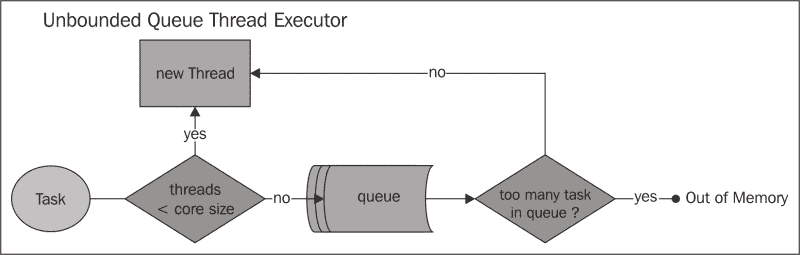

# 第二章 配置 WildFly 核心子系统

第一章为我们提供了开始使用 WildFly 8 的基础。现在是时候深入 WildFly 的配置，看看如何管理应用服务器的独立实例了。你会发现整个服务器都在一个文件中进行配置。

配置文件由一系列子系统组成，包括应用服务器核心服务和标准 Java EE 服务。由于一个章节中不可能讨论所有子系统，因此它们被分散在几个章节中。到本章结束时，你应该能够理解和配置以下内容：

+   服务器配置文件 `standalone.xml`

+   应用服务器的线程池

+   应用服务器的日志子系统

# 配置我们的应用服务器

默认配置文件命名为 `standalone.xml`，用于独立服务器，以及 `domain.xml` 用于应用服务器域。应用服务器域可以被视为一种专门的服务器配置，它还包括域和主机控制器设置。我们将在 第五章 中讨论应用服务器域，*配置 WildFly 域*。然而，就核心服务配置而言，这里所涵盖的内容也适用于域配置。配置文件（`standalone.xml` 和 `domain.xml`）是非静态文件，这意味着运行时更改会被持久化到它们中，例如，添加一个新的组件，如 JMS 目标，或部署应用程序。

你可以定义你需要的任意数量的配置文件。WildFly 8.1.0 版本提供了 `standalone.xml`（Web 配置文件）的一些变体，例如 `standalone-full.xml`（完整配置文件）和 `standalone-ha.xml`（具有高可用性的 Web 配置文件）。你还可以在 `JBOSS_HOME/docs/examples/configs` 中找到一些示例配置文件。如果你想使用不同的配置文件启动服务器，可以使用以下参数启动服务器：

```java
./standalone.sh --server-config standalone-full-ha.xml

```

### 注意

`standalone.xml` 文件位于 `JBOSS_HOME/standalone/configuration` 文件夹中。此配置文件为 XML 格式，并由 `JBOSS_HOME/docs/schema` 文件夹中找到的一组 `.xsd` 文件进行验证。

如果你想检查单个 `.xsd` 文件，可以在你的服务器发行版的 `JBOSS_HOME/docs/schema` 文件夹中找到它们。你可以通过简单地检查这些文件或将它们导入到你的 Eclipse 环境中来了解所有可用的服务器参数。一旦它们位于你的项目中，右键单击你的文件，然后导航到 **生成** | **XML 文件**。

应用服务器的配置遵循一个树状结构，其中根元素包含服务器定义，如下面的图所示：


在以下章节中，我们将详细展示服务器配置的重要部分。这将有助于理解应用程序服务器中每个单个组件的作用，尽管建议您不要手动更改配置文件。

手动更改配置文件可能导致未经检查的数据修改。这可能会破坏文件的格式，防止 WildFly 启动。如果您确实需要手动更新文件，您应该考虑首先创建备份副本。

### 注意

更改服务器配置的最佳实践是使用**命令行界面**（**CLI**）或 Web 管理控制台，这些在第七章 *使用管理接口* 中进行了描述。

## 扩展

应用程序服务器包含一系列用于扩展应用程序服务器核心的模块。WildFly 的核心非常轻量级，这些扩展提供了您期望从应用程序服务器中获得的大部分功能。就像常规静态模块一样，它们存储在`JBOSS_HOME/modules`文件夹中。在部署任何应用程序之前，`standalone.xml`或`domain.xml`文件中定义的每个扩展都会被 WildFly 类加载器拾取。以下代码显示了服务器配置的摘录：

```java
<extensions>
    <extension module="org.jboss.as.clustering.infinispan"/>
    <extension module="org.jboss.as.connector"/>
    <extension module="org.jboss.as.deployment-scanner"/>
    <extension module="org.jboss.as.ee"/>
    <extension module="org.jboss.as.ejb3"/>
  ...
</extensions>
```

## 路径

可以使用`paths`元素定义文件系统路径的逻辑名称。然后可以通过其逻辑名称引用这些路径，而无需在配置文件中每次都输入完整路径。默认情况下，`path`条目不包括在配置中。如果您想包括它，您将必须手动添加完整的配置。以下示例定义了一个相对于 WildFly 服务器日志的路径，逻辑名称为`log.dir`。对于独立服务器，此目录转换为`JBOSS_HOME/standalone/log/mylogdir`：

```java
<paths>

    <path name="log.dir" path="mylogdir" relative-to="jboss.server.log.dir"/>
</paths>
```

要在其他配置文件部分引用此路径，只需使用逻辑名称作为路径即可。以下示例显示了用于存储日志、旋转文件处理器的路径：

```java
<periodic-rotating-file-handler name="FILE" autoflush="true">
  <file relative-to="log.dir" path="myserver.log"/>
</periodic-rotating-file-handler>
```

### 注意

请注意，属性`relative-to`不是必需的。如果您在路径配置中不包括它，则假定路径是绝对路径。

WildFly 提供了一套系统路径，您可以在不手动配置的情况下使用。以下表格概述了预配置的路径。前五个路径不能被覆盖，但其余路径可以使用前面代码片段中显示的路径元素进行覆盖。

| 路径 | 含义 |
| --- | --- |
| `jboss.home` | WildFly 分发的根目录 |
| `user.home` | 用户的家目录 |
| `user.dir` | 用户当前的工作目录 |
| `java.home` | Java 安装目录 |
| `jboss.server.base.dir` | 单个服务器实例的根目录 |
| `jboss.server.data.dir` | 服务器将用于持久数据文件存储的目录 |
| `jboss.server.log.dir` | 服务器将用于日志文件存储的目录 |
| `jboss.server.tmp.dir` | 服务器将用于临时文件存储的目录 |
| `jboss.domain.servers.dir` | 主控制器将在其中为单个服务器实例创建工作区的目录 |

## 管理接口

管理接口在`management`元素内进行配置。此配置由 CLI、管理控制台和 JMX 使用。本机 CLI 接口和 Web 控制台都在管理端口 9990 上运行。以下示例取自默认服务器配置，并突出了用于管理接口的端口号：

```java
<socket-binding-group name="standard-sockets" default-interface="public">
 <socket-binding name="management-http" interface="management" port="9990"/>
    <socket-binding name="management-https" interface="management" port="9993"/>
</socket-binding-group>
```

在以下代码片段中，我们展示了前面的`socket-binding`配置被`standalone.xml`文件的`management-interfaces`部分引用：

```java
<management-interfaces>
     <http-interface security-realm="ManagementRealm" http-upgrade-enabled="true">
 <socket-binding http="management-http"/>
    </http-interface>
</management-interfaces>
```

管理接口在第七章*使用管理接口*中进行了详细讨论，该章节提供了对应用服务器管理工具的详细覆盖。

## 配置文件和子系统

配置文件可以被视为子系统集合，而每个子系统又包含通过扩展添加到应用服务器的功能子集（请参阅*扩展*部分）。例如，Web 子系统包含容器使用的连接器集合的定义，消息子系统定义了 AS 消息提供者使用的 JMS 配置和模块等。

独立文件和域配置文件之间的重要区别在于其中包含的配置文件数量。当使用独立配置时，有一个包含一组子系统配置的单个配置文件。另一方面，域配置可以提供多个配置文件。

## 接口

接口定义了网络接口/IP 地址或主机名可以绑定的逻辑名称。

默认情况下，独立应用服务器定义了两个可用的网络接口，即`management`接口和`public`接口：

```java
    <interfaces>
        <interface name="management">
            <inet-address value="${jboss.bind.address.management:127.0.0.1}"/>
        </interface>
        <interface name="public">
            <inet-address value="${jboss.bind.address:127.0.0.1}"/>
        </interface>
    </interfaces>
```

`public`网络接口旨在用于应用服务器核心服务：

```java
<socket-binding-group name="standard-sockets" default-interface="public">
  ...
</socket-binding-group>
```

`管理`网络接口由 AS 管理接口引用，如*管理接口*部分所示。

默认情况下，两个网络接口都解析到回环地址`127.0.0.1`。这意味着应用服务器公共服务和管理工作站只能从本地机器访问。通过更改`inet-address`值，可以将网络接口绑定到另一个 IP 地址。以下示例显示了服务器正在监听 IP 地址`192.168.1.1`：

```java
<interface name="public">
 <inet-address value="192.168.1.1"/>
</interface>
```

如果您想将网络接口绑定到所有可用的 IP 地址集，可以使用`<any-address />`元素，如下所示：

```java
<interface name="public">
 <any-address />
</interface>
```

网络接口的另一个有用变体是**网络接口卡**（**nic**）元素，它从网络卡名称收集地址信息：

```java
<interface name="public">
 <nic name="eth0" />
</interface>
```

### 注意

**通过 CLI 绑定管理接口**

你也可以使用`-b`开关绑定你的公共接口，后跟一个有效的主机/IP 地址。这将导致服务器监听提供的主机/IP 地址。例如，要将所有公共接口绑定到所有 IPv4 地址，你将使用`$JBOSS_HOME/bin/standalone.sh -b=0.0.0.0`。

## socket-binding 组

一个 socket-binding 组定义了一个套接字的逻辑名称。每个 socket-binding 名称可以在配置文件的其它部分被引用。在本节中，你可以配置将监听传入连接的网络端口。每个 socket-binding 组通过`default-interface`属性引用一个网络接口。看看以下代码片段：

```java
<socket-binding-group name="standard-sockets" default-interface="public">
        <socket-binding name="management-http" interface="management" port="9990"/>
        <socket-binding name="management-https" interface="management" port="9993"/>
        <socket-binding name="ajp" port="8009"/>
        <socket-binding name="http" port="8080"/>
        <socket-binding name="https" port="8443"/>
<socket-binding name="jacorb" interface="unsecure" port="3528"/>
        <socket-binding name="jacorb-ssl" interface="unsecure" port="3529"/>
        <socket-binding name="txn-recovery-environment" port="4712"/>
        <socket-binding name="txn-status-manager" port="4713"/>
</socket-binding-group>
```

为了更改绑定服务的端口号，你可以更改其服务的`port`属性，但更好的方法是使用管理接口之一。这将提供受影响更改的即时结果。在以下示例中，我们将使用 CLI 更改`http`连接器的默认端口号：

```java
[standalone@localhost:9990 /] /socket-binding-group=standard-sockets/socket-binding=http:write-attribute(name="port", value="8090")
{
  "outcome" => "success",
  "response-headers" => {
    "operation-requires-reload" => true,
    "process-state" => "reload-required"
  }
}
```

你可能已经注意到在上面的响应中需要重新加载。这可以通过执行以下命令来实现：

```java
[standalone@localhost:9990 /] :reload

```

## 系统属性

本节包含一组系统级属性，可以作为启动过程的一部分添加到应用服务器中。默认情况下，`system-properties`条目被排除在配置之外。如果你想使用此功能，你需要添加完整的配置。以下配置片段将名为 example 的属性设置为`true`：

```java
<system-properties>
    <property name="myboolean" value="true"/>
</system-properties>
```

该属性可以在应用服务器上使用以下代码检索：

```java
String s = System.getProperty("myboolean");
```

## 部署

配置文件的最后一部分包含所有已在应用服务器上注册的已部署应用程序。每次部署或卸载新应用程序时，本节都会更新以反映新的应用程序堆栈。

## 配置核心子系统

现在你已经掌握了 WildFly 配置文件的基本概念，我们将更详细地探讨单个服务。

在以下图中，你可以找到一个粗略的 WildFly 8 核心子系统表示（为了简单起见，我们只包括本书涵盖的子系统）：


作为配置应用服务器的一个初步体验，我们将探索前图中加粗显示的区域。这些包括以下核心应用服务器子系统：

+   线程池子系统

+   JBoss 日志子系统

让我们直接进入第一个子系统，线程池。

## 配置线程池子系统

线程池解决两个不同的问题。首先，由于减少了每个任务的调用开销，它们通常在执行大量异步任务时提供改进的性能。其次，它们提供了一种限制和管理资源（包括线程）的方法，这些资源在执行一系列任务时被消耗。

在 JBoss 服务器在 JBoss AS 7 之前的版本中，线程池配置集中在一个文件或部署描述符中。在 WildFly 中，任何使用线程池的子系统都管理自己的线程配置。

通过适当配置线程池部分，您可以调整使用该类型池以交付新任务的具体区域。应用程序服务器线程池配置可以包括以下元素：

+   线程工厂配置

+   限制队列线程配置

+   阻塞限制队列线程配置

+   无界队列线程配置

+   无阻塞队列线程池配置

+   无阻塞队列线程池配置

+   调度线程配置

### 注意

重要提示：在 WildFly 9 中，线程子系统可能会被标记为弃用，但在 WildFly 8 中，此配置完全有效。

让我们详细看看每个单独的元素。

### 配置线程工厂

**线程** **工厂**（实现`java.util.concurrent.ThreadFactory`）是一个按需创建新线程的对象。使用线程工厂可以消除对新线程调用的硬编码，使应用程序能够使用特殊的线程子类、优先级等。

默认情况下，线程工厂不包括在服务器配置中，因为它依赖于您很少需要修改的默认值。尽管如此，我们将为可能需要完全控制线程配置的资深用户提供一个简单的配置示例。

以下是一个自定义线程工厂配置的示例：

```java
<thread-factory name="MyThreadFactory" thread-name-pattern="My Thread %t" group-name="dummy" />
```

以下是在定义线程工厂时可以使用的可能属性：

+   `name`属性是创建的线程工厂的名称

+   可选的`priority`属性可以用来指定创建的线程的优先级

+   可选的`group-name`属性指定为该线程工厂创建的线程组的名称

+   `thread-name-pattern`是用于创建线程名称的模板。以下模式可以使用：

| 模式 | 输出 |
| --- | --- |
| `%%` | 输出百分号 |
| `%g` | 输出每个工厂的线程序列号 |
| `%f` | 输出全局线程序列号 |
| `%i` | 输出线程 ID |
| `%G` | 输出线程组名称 |

### 限制队列线程池

有限队列线程池是应用服务器中最常用的池类型。它通过定义线程池大小的约束来帮助防止资源耗尽。它也是最难使用的。其固有的复杂性源于它维护一个固定长度的队列和两个池大小：一个**核心**大小和一个**最大**大小。

如果每次提交新任务时，正在运行的线程数少于核心大小，则创建一个新线程。否则，如果有空间在队列中，任务将被排队。

如果这些选项都不可行，执行器需要评估它是否还可以创建一个新线程。如果正在运行的线程数少于最大大小，则创建一个新线程。否则，如果指定了指定的`hand-off`执行器，则任务将被分配给该执行器。如果没有指定`hand-off`执行器，则任务将被丢弃。

以下图表总结了整个过程，展示了所有部件是如何结合在一起的：


以下是从配置文件中摘取的有限队列线程池的示例配置：

```java
<bounded-queue-thread-pool name="jca-short-running">
  <core-threads count="10"/>
  <queue-length count="10"/>
  <max-threads count="10"/>
  <keepalive-time time="10" unit="seconds"/>
</bounded-queue-thread-pool>
```

### 小贴士

**下载示例代码**

您可以从您在[`www.packtpub.com`](http://www.packtpub.com)的账户下载您购买的所有 Packt 书籍的示例代码文件。如果您在其他地方购买了这本书，您可以访问[`www.packtpub.com/support`](http://www.packtpub.com/support)并注册，以便将文件直接通过电子邮件发送给您。

以下表格简要描述了每个属性/元素：

| 属性/元素 | 描述 |
| --- | --- |
| `name` | 指定创建的执行器的 bean 名称 |
| `allow-core-timeout` | 指定核心线程是否超时；如果为`false`，则只有超过核心大小的线程会超时 |
| `core-threads` | 指定核心线程池大小，它小于最大池大小 |
| `max-threads` | 指定最大线程池大小 |
| `queue-length` | 指定执行器队列长度 |
| `keepalive-time` | 指定超出核心池大小的线程在空闲时应该保持运行的时间 |
| `thread-factory` | 指定用于创建工作线程的特定线程工厂的 bean 名称 |
| `handoff-executor` | 指定在任务无法接受时委托任务给执行器的执行器 |

### 注意

**性能重点**

**队列大小**和**池大小**值是性能权衡的结果，需要在两者之间找到合适的平衡。当使用小池子和大队列时，可以最小化 CPU 使用率、操作系统资源和上下文切换开销。然而，它可能会产生人为的低吞吐量。如果任务强烈依赖于 I/O（因此经常阻塞），系统可能能够为比您允许的更多线程分配时间。使用小队列通常需要更大的池大小，这会使 CPU 更忙碌，但可能会遇到不可接受的调度开销，这也会降低吞吐量。

### 阻塞有界队列线程池

阻塞有界队列线程池的配置与有界队列线程池非常相似；它的工作流程略有不同。区别在于，而不是尝试将任务转交给指定的转交执行器，调用者会阻塞，直到队列中有空间可用。

该线程池的流程图如下所示：


下面是一个阻塞有界队列线程池的示例配置：

```java
<blocking-bounded-queue-thread-pool name="jca-short-running">
    <core-threads count="10"/>
    <queue-length count="10"/>
    <max-threads count="10"/>
    <keepalive-time time="10" unit="seconds"/>
</bounded-queue-thread-pool>
```

请参阅以下表格，了解有界队列线程池的每个属性/元素的描述。以下表格显示了阻塞有界队列线程池可用的属性/元素：

| 属性/元素 | 描述 |
| --- | --- |
| `name` | 指定创建的执行器的 bean 名称 |
| `allow-core-timeout` | 指定核心线程是否可能超时；如果为`false`，则只有超过核心大小的线程会超时 |
| `core-threads` | 指定核心线程池的大小，它小于最大池大小 |
| `max-threads` | 指定最大线程池大小 |
| `queue-length` | 指定执行器队列长度 |
| `keepalive-time` | 指定超出核心池大小的线程在空闲时应保持运行的时间 |
| `thread-factory` | 指定用于创建工作线程的特定线程工厂的 bean 名称 |

### 无界队列线程池

无界队列线程池执行器比有界线程池采用更简单但更冒险的方法；也就是说，它总是接受新的任务。

实际上，无界线程池有一个核心大小和一个无上限的队列。当提交任务时，如果正在运行的线程数小于核心大小，则创建一个新线程。否则，任务将被放置在队列中。如果允许提交太多任务给这种类型的执行器，可能会发生内存不足的情况。请查看以下流程图：



由于其固有的风险，无界线程池默认情况下不包括在服务器配置中。这里我们提供一个示例，只有一个建议：孩子们，在家不要尝试这个！

```java
<unbounded-queue-thread-pool name="unbounded-threads">
  <max-threads count="10" />
  <keepalive-time time="10" unit="seconds"/>
</unbounded-queue-thread-pool>
```

如果你想了解更多关于每个线程池元素/属性的含义，可以参考有界线程池表格。

无界队列线程池可用的属性/元素如下表所示：

| 属性/元素 | 描述 |
| --- | --- |
| `name` | 指定创建的执行器的 bean 名称 |
| `max-threads` | 指定线程池的最大大小 |
| `keepalive-time` | 指定超出核心池大小的线程在空闲时应该保持运行的时间 |
| `thread-factory` | 指定用于创建工作线程的特定线程工厂的 bean 名称 |

### 无界队列线程池

如其名所示，无队列线程池是一个没有队列的线程池执行器。基本上，这个执行器绕过了有界线程执行器的逻辑，因为它不尝试将任务存储在队列中。

因此，当提交任务时，如果正在运行的线程数少于最大大小，则创建一个新线程。否则，如果指定了指定的`hand-off`执行器，则任务将被分配给该执行器。如果没有指定任何指定的`hand-off`，则任务将被丢弃。请看以下流程图：


无队列执行器默认情况下也不包含在配置文件中。然而，我们在这里提供一个示例配置：

```java
<queueless-thread-pool name="queueless-thread-pool" blocking="true">
  <max-threads count="10"/>
  <keepalive-time time="10" unit="seconds"/>
</queueless-thread-pool>
```

### 无阻塞无队列线程池

无阻塞无队列线程池的配置与无队列线程池类似。与无阻塞队列线程池类似，区别在于它不是尝试将任务传递给指定的 hand-off 执行器，而是调用者会阻塞，直到队列中有空间可用。

请看以下图示：


虽然它不包括在默认配置文件中，但这里有一个示例：

```java
<blocking-queueless-thread-pool name="queueless-thread-pool">
    <max-threads count="10" />
    <keepalive-time time="10" unit="seconds"/>
</blocking-queueless-thread-pool>
```

无界队列线程池可用的属性/元素有`name`、`max-threads`、`keepalive-time`和`thread-factory`。

### 调度线程池

服务器端调度线程池用于需要定期运行或延迟执行的活动。它内部映射到`java.util.concurrent.ScheduledThreadPoolExecutor`实例。请看以下图示：


此类型的执行器使用`scheduled-thread-pool`执行器元素进行配置，如下所示：

```java
<scheduled-thread-pool name="remoting">
  <max-threads count="10"/>
  <keepalive-time time="10" unit="seconds"/>
</scheduled-thread-pool>
```

调度线程池被`remoting`框架和 HornetQ 子系统使用，后者使用有界 JCA 线程执行器和调度池进行延迟交付。

# 配置应用程序服务器日志

每个应用程序都需要跟踪日志语句。目前，Java 应用程序有几种日志库的实现，其中最流行的是：

+   **Log4j**：它是一个来自 Apache 的灵活的开源日志库。Log4j 在开源社区中广泛使用，并且在 JBoss AS 的早期版本中是默认的日志实现。

+   **Java SE 日志库（JUL）**：它作为 Java SE 平台标准库的一部分提供了日志类和接口。

Log4j 和 JUL 有非常相似的 API。它们在概念上只有细微的差别，但基本上做的是同样的事情，除了 Log4j，它有更多的功能。你可能需要也可能不需要这些功能。

JBoss 日志框架基于 JUL，围绕三个主要概念构建：**记录器**、**处理器**和**格式化器**。这些概念允许开发者根据消息的类型和优先级进行日志记录，并控制消息最终到达的位置以及它们的显示方式。

以下图表显示了使用 JUL 框架的日志周期。应用程序在日志对象上执行日志调用。这些日志对象分配 `LogRecord` 对象，并将它们传递给处理对象以进行发布。日志和处理对象都可能使用格式化器来安排日志布局，并使用过滤器来决定它们是否对特定的日志记录感兴趣。

看一下以下图表：


## 选择你的日志实现

WildFly/JBoss 应用程序服务器通过其版本，使用了不同的框架来处理应用程序服务器日志。在 JBoss AS 5 及更早版本中，log4j 是应用程序服务器使用的默认日志 API。

自从 JBoss AS 6 开始，日志提供程序切换到了 JBoss 自有的实现，该实现基于 JDK 1.4 日志系统。然而，它为默认 JDK 实现中的许多缺陷提供了几个修复和解决方案。

例如，JDK 中提供的 `java.util.logging` 默认实现没有按 Web 应用程序进行日志记录，因为配置是按虚拟机进行的。

因此，WildFly 用自己的实现替换了默认的 JUL 日志管理器实现，以解决这些问题。以下图表说明了构成 WildFly 8 日志子系统的模块：


在层次结构的顶部，有 `org.jboss.logmanager` 模块，这是管理 JBoss 日志子系统的顶级库。在 `jboss` `logmanager` 之下，你可以找到具体的实现，例如 `org.jboss.logging` 和 `org.jboss.log4j.logmanager` 模块。默认情况下，应用程序服务器使用前者模块（`org.jboss.logging`），该模块通过 `org.jboss.as.logging` 实现，以管理应用程序服务器内的日志。但是，如果你想切换到 `log4j` 实现，你需要 `org.jboss.log4j.logmanager` 模块（在本章的最后部分，我们将包括如何在应用程序中使用 `log4j` 的示例）。

### 注意

WildFly 不限于 JBoss 日志或 log4j。你可以使用任何日志库，包括 slf4j 或 commons logging。

### 配置日志子系统

日志子系统自带一组日志处理器。处理器对象从记录器接收日志消息并将其导出。例如，它可能将它们写入控制台或文件，发送到网络日志服务，或将它们转发到操作系统日志。默认情况下，定义了以下处理器：

+   `console-handler`

+   `periodic-rotating-file-handler`

+   `size-rotating-file-handler`

+   `async-handler`

+   `syslog-handler`

+   `custom-handler`

## `console-handler`

`console-handler` 定义了一个处理器，它简单地将日志消息写入控制台，如下所示：

```java
<console-handler name="CONSOLE" autoflush="true">
  <level name="INFO"/>
  <formatter>
    <pattern-formatter pattern="%d{HH:mm:ss,SSS} %-5p [%c] (%t) %s%E%n"/>
  </formatter>
</console-handler>
```

可选的 `autoflush` 属性确定是否自动刷新缓冲日志。此选项的默认值为 `true`。

`level` 元素定义了与处理器关联的最低日志级别，这意味着任何具有此日志级别和更高值的都将被记录。日志级别的完整范围，从最低到最高，为：`OFF`、`FINEST`、`FINER`、`FINE`、`CONFIG`、`INFO`、`WARNING`、`SEVERE` 和 `ALL`。

`formatter` 元素为格式化 `LogRecords` 提供支持。日志格式化继承了 `log4j` 布局模式的相同模式字符串，而 `log4j` 又受到了亲爱的旧 C 语言 `printf` 函数的启发。请参阅 [`logging.apache.org/log4j/1.2/apidocs/org/apache/log4j/PatternLayout.html`](http://logging.apache.org/log4j/1.2/apidocs/org/apache/log4j/PatternLayout.html) 的 log4j 文档。

在这里，我们只是提到 `%d{HH:mm:ss,SSS}` 使用括号中包含的转换输出日志事件的日期

+   字符串 `%-5p` 输出日志事件的优先级

+   字符串 `[%c]` 用于输出日志事件的类别

+   字符串 `(%t)` 输出生成日志事件的线程

+   字符串 `%s` 输出日志消息

+   最后，字符串 `%n` 输出平台相关的行分隔符字符或字符

## `periodic-rotating-file-handler`

`periodic-rotating-file-handler` 定义了一个处理器，该处理器将写入文件，并在从给定后缀字符串派生的周期后旋转日志，该后缀字符串应格式为 `java.text.SimpleDateFormat` 所理解。

下面是它的定义：

```java
<periodic-rotating-file-handler name="FILE" autoflush="true">
  <level name="INFO"/>
  <formatter>
    <pattern-formatter pattern="%d{HH:mm:ss,SSS} %-5p [%c] (%t) %s%E%n"/>
  </formatter>
  <file relative-to="jboss.server.log.dir" path="server.log"/>
  <suffix value=".yyyy-MM-dd"/>
  <append value="true"/>
</periodic-rotating-file-handler>
```

此处理器引入了包含路径的文件元素，这是实际的文件名及其 `relative-to` 位置。在我们的例子中，相对位置对应于 `jboss.server.log.dir` 应用服务器参数。

### 注意

使用默认的后缀配置，日志在中午 12 点滚动。通过更改 `SimpleDateFormat` 的值，你还可以更改日志滚动的周期，例如，后缀 `yyyy-MM-dd-HH` 将每小时滚动日志。

## `size-rotating-file-handler`

`size-rotating-file-handler` 定义了一个处理器，该处理器将日志写入文件，当文件大小超过某个点时进行日志轮转。它还保留一定数量的备份。

标准配置中没有定义大小处理器。然而，我们可以从 `JBOSS_HOME/docs/schema/jboss-as-logging_2_0.xsd` 文件中找到其基本配置。请查看以下代码：

```java
<size-rotating-file-handler name="FILESIZE" autoflush="true" >
  <rotate-size value="500k" />
  <level name="INFO"/>
  <formatter>
    <pattern-formatter pattern="%d{HH:mm:ss,SSS} %-5p [%c] (%t) %s%E%n"/>
  </formatter>
  <file relative-to="jboss.server.log.dir" path="server.log"/>
</size-rotating-file-handler>
```

## 异步处理器

`async-handler` 是一个复合处理器，它附加到其他处理器上以产生异步日志事件。在幕后，此处理器使用一个有界队列来存储事件。每次发出日志时，异步处理器将日志追加到队列中并立即返回。以下是对 `FILE` 追加器的异步日志示例：

```java
<async-handler name="ASYNC">
  <level name="INFO" />
  <queue-length>1024</queue-length>
  <overflow-action>block</overflow-action>
  <sub-handlers>
    <handler-ref name="FILE" />
  </sub-handlers>
</async-handler>
```

在此处理器中，我们还指定了事件发送到的队列大小，以及当 `async` 队列溢出时要采取的操作。您可以选择 `block`，这将导致调用线程被阻塞，或者选择 `discard`，这将导致消息被丢弃。

### 注意

**我应该何时使用异步处理器？**

异步处理器为大量 I/O 绑定的应用程序提供了显著的性能优势。相反，CPU 绑定应用程序可能不会从异步日志中受益，因为它会给 CPU 带来额外的压力。

## syslog 处理器

可以使用 `syslog-handler` 将日志写入远程日志服务器。这允许多个应用程序将它们的日志消息发送到同一个服务器，在那里它们可以一起解析。支持 RFC3164 和 RFC5424 格式。以下是一个 `syslog-handler` 的示例：

```java
<syslog-handler name="SYSLOG" enabled="true">
    <level name="INFO" />
    <port value="514" />
    <server-address value="192.168.0.56" />
    <formatter>
        <syslog-format syslog-type="RFC5424" />
    </formatter>
</syslog-handler>
```

## 自定义处理器

到目前为止，我们只看到了一些基本的日志处理器，这些处理器通常包含在您的服务器配置中。如果您需要更高级的日志管理方法，您可以定义一个自定义日志处理器。为了添加自定义处理器，您需要定义一个扩展 `java.util.logging.Handler` 接口的类，并重写其抽象方法。例如，以下名为 `JdbcLogger` 的类用于将日志写入数据库（完整代码可在 [`community.jboss.org/wiki/CustomLogHandlersOn701`](http://community.jboss.org/wiki/CustomLogHandlersOn701) 找到）。

### 注意

注意，尽管这篇文章是为 JBoss AS 7 编写的，但它对 WildFly 8 仍然有效。

请查看以下代码片段：

```java
public class JdbcLogger extends Handler{
  @Override
  public void publish(LogRecord record){
    try{
      insertRecord(record);
    }
    catch (SQLException e)  {
      e.printStackTrace();
    }
  }
  @Override
  public void flush() {     . . . .    }
  @Override
  public void close() {     . . . .    }
}
```

一旦编译，此类需要打包到一个存档（例如，`logger.jar`）中，并在应用程序服务器中作为模块安装。我们将模块命名为 `com.JDBCLogger`，它需要在 `modules` 文件夹下具有以下结构：


标签 **Path to be created** 显示了我们将在其中放置 `logger.jar` 存档及其配置文件（`module.xml`）的目录结构，如下所示：

```java
<module  name="com.JDBCLogger">
    <resources>
        <resource-root path="logger.jar"/>
    </resources>
    <dependencies>
        <module name="javax.api"/>
        <module name="org.jboss.logging"/>
        <module name="com.mysql"/>
    </dependencies>
</module>
```

注意，此模块依赖于另一个模块`com.mysql`。在下一章中，我们将展示如何在安装适当的模块后连接到数据库。

我们几乎完成了。现在，将处理程序插入到包含其属性（包括数据库连接字符串和用于将日志插入数据库的语句）的日志子系统：

```java
<custom-handler name="DB" class="com.sample.JdbcLogger" module="com.JDBCLogger">
    <level name="INFO"/>
    <formatter>
        <pattern-formatter pattern="%d{HH:mm:ss,SSS} %-5p [%c] (%t) %s%E%n"/>
    </formatter>
    <properties>
        <property name="driverClassName" value="com.mysql.jdbc.Driver"/>
        <property name="jdbcUrl" value="jdbc:mysql://localhost:3306/mydb"/>
        <property name="username" value="root"/>
        <property name="password" value="admin"/>
        <property name="insertStatement" value="INSERT INTO into log_table VALUES (?, $TIMESTAMP, $LEVEL, $MDC[ip], $MDC[user], $MESSAGE, hardcoded)"/>
    </properties>
</custom-handler>
<root-logger>
    <level name="INFO"/>
    <handlers>
        <handler name="CONSOLE"/>
        <handler name="FILE"/>
        <handler name="DB"/>
    </handlers>
</root-logger>
```

新的`handler`，命名为`DB`，被添加到`root-logger`中，以收集所有优先级为`INFO`或更高的日志语句。在测试日志记录器之前，不要忘记在您的 MySQL 数据库上创建所需的表，如下所示：

```java
CREATE TABLE log_table(
  id INT(11) NOT NULL AUTO_INCREMENT,
  `timestamp` VARCHAR(255) DEFAULT NULL,
  level VARCHAR(255) DEFAULT NULL,
  mdc_ip VARCHAR(255) DEFAULT NULL,
  mdc_user VARCHAR(255) DEFAULT NULL,
  message VARCHAR(1500) DEFAULT NULL,
  hardcoded VARCHAR(255) DEFAULT NULL,
  PRIMARY KEY (id)
)
ENGINE = INNODBAUTO_INCREMENT = 1
```

如果您已仔细遵循所有必需的步骤，您将注意到`log_table`包含自服务器启动以来触发的日志事件。查看以下屏幕截图：


### 配置日志记录器

日志记录器对象用于记录特定系统或应用程序组件的消息。日志记录器通常使用分层点分隔的命名空间命名。日志记录器名称可以是任意字符串，但通常应基于记录组件的包名或类名。例如，日志记录器指示日志系统为`com.sample`包生成日志语句，如果它们的日志级别为`WARN`或更高：

```java
<logger category="com.sample">
  <level name="WARN"/>
</logger>
```

在层次结构的顶部，有`root-logger`。关于`root-logger`有两个重要事项需要注意：

+   它始终存在

+   它不能通过名称检索

在默认服务器配置中，`root-logger`定义了两个与`CONSOLE`和`FILE`处理器连接的处理程序：

```java
<root-logger>
    <level name="INFO"/>
    <handlers>
        <handler name="CONSOLE"/>
        <handler name="FILE"/>
    </handlers>
</root-logger>
```

### 每个部署的日志记录

WildFly 具有配置每个部署日志记录的能力。默认情况下，这是启用的。这意味着如果您将日志配置文件添加到您的部署中，其配置将用于该部署的日志记录。有效的日志配置文件如下：

+   `logging.properties`

+   `jboss-logging.properties`

+   `log4j.properties`

+   `log4j.xml`

+   `jboss-log4j.xml`

如果您将应用程序打包到 EAR 中，您的日志配置文件应放入`META-INF`目录。如果您将应用程序打包到 JAR 或 WAR 中，则可以将其放置在`META-INF`目录或`WEB-INF`目录中。

如果您想禁用每个部署的日志记录，您需要将`use-deployment-logging-config`的值设置为`false`。查看以下代码片段：

```java
<subsystem >
 <use-deployment-logging-config value="false"/>
     <console-handler name="CONSOLE">
         <level name="INFO"/>
         <formatter>
             <named-formatter name="COLOR-PATTERN"/>
         </formatter>
    </console-handler>
    ...
</subsystem>
```

### 注意

在 WildFly 8 中，系统属性`org.jboss.as.logging.per-deployment`已被弃用。您应使用`use-deployment-logging-config`代替。

### 绕过容器日志

由于某些原因，您可能希望完全绕过容器日志记录。为此，将`add-logging-api-dependencies`属性添加到您的日志配置中，并将其值设置为`false`。这将禁用隐式服务器日志依赖项的添加，如下面的代码所示：

```java
<subsystem >
 <add-logging-api-dependenciesuse-deployment-logging-config value="false"/>
    <console-handler name="CONSOLE">
        <level name="INFO"/>
        <formatter>
            <named-formatter name="COLOR-PATTERN"/>
        </formatter>
    </console-handler>
    ...
</subsystem>
```

要仅针对每个应用程序绕过日志记录，您需要使用 `jboss-deployment-structure.xml` 文件来排除日志子系统。我们将在第六章“应用程序结构和部署”中详细介绍 `jboss-deployment-structure.xml` 文件。

# 摘要

在本章中，我们介绍了应用程序服务器配置的基础知识，现在它由一个包含所有已安装服务配置的单个单体文件组成。

尽管这个主要配置文件将是您了解 WildFly 基础设施的主要参考点，但我们必须强调通过其中一个管理接口修改它的重要性。

我们已经详细检查了线程池配置中的每个部分。我们还看到线程池依赖于 Java 标准版线程执行器 API 来定义一系列池，并且这些池被应用程序服务器的核心服务所使用。

接下来，我们讨论了建立在 Java Util Logging 框架之上的 JBoss 日志框架，它解决了 JUL 的某些已知缺点。我们描述了如何在您的应用程序中配置每个应用程序的日志记录。

在下一章中，我们将查看一些核心企业服务配置，例如数据源和消息子系统。这些服务是许多企业应用程序的骨架。
