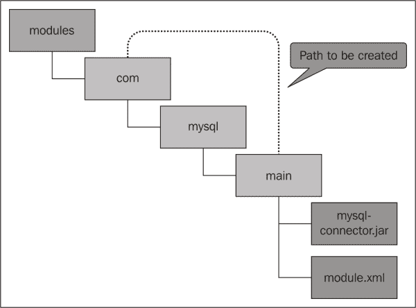
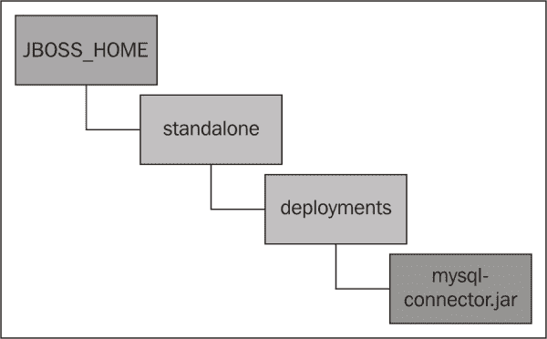
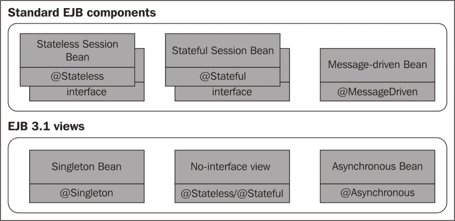
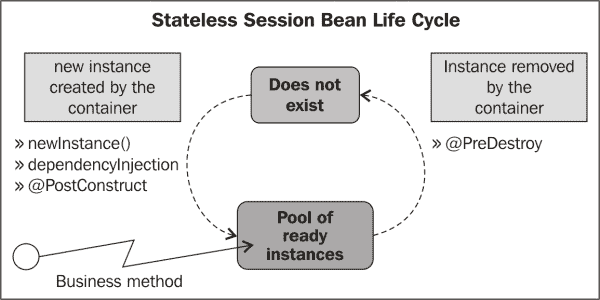
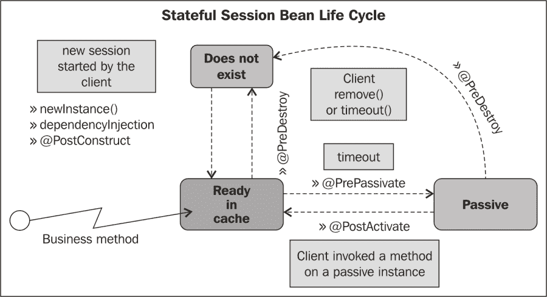
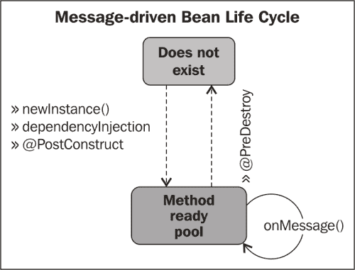
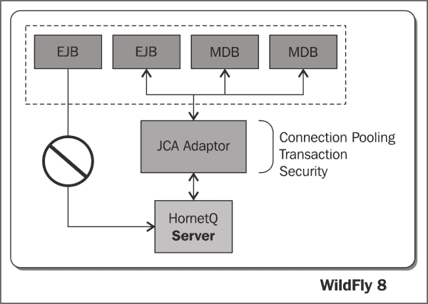
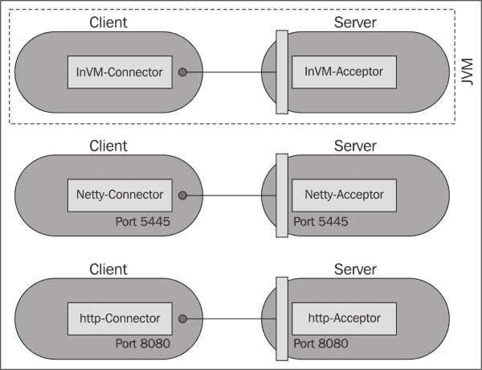

# 第三章。配置企业服务

本章介绍了与应用服务器一起提供的 Java 企业服务的配置。许多服务都在它们自己的子系统内进行配置。根据您的应用程序是否需要这些服务，可以添加或删除这些子系统。以下是我们将按顺序查看的最常见子系统：

+   连接到数据库

+   配置企业 JavaBeans 容器

+   配置消息服务

+   配置事务服务

+   配置并发

# 连接到数据库

为了使您的应用程序能够连接到数据库，您需要通过添加数据源来配置您的服务器。在服务器启动时，每个数据源都会预先填充一个数据库连接池。应用程序通过执行 `JNDI` 查找并调用 `getConnection()` 来从池中获取数据库连接。请查看以下代码：

```java
Connection result = null;
try {
    Context initialContext = new InitialContext();
    DataSource datasource = (DataSource)initialContext.lookup("java:/MySqlDS");
    result = datasource.getConnection();
} catch (Exception ex) {
    log("Cannot get connection: " + ex);}
```

在连接被使用后，您应尽快调用 `connection.close()`。这会释放连接，并允许它返回到连接池——以便其他应用程序或进程使用。

在 JBoss AS 7 之前发布的版本需要将数据源配置文件（`ds.xml`）与应用程序一起部署。自从 JBoss AS 7 发布以来，由于应用程序服务器的模块化特性，这种方法已不再是强制性的。

默认情况下，应用程序服务器附带 H2 开源数据库引擎（[`www.h2database.com`](http://www.h2database.com)），由于其小巧的体积和基于浏览器的控制台，非常适合测试目的。

然而，现实世界中的应用程序需要一个行业标准数据库，例如 Oracle 数据库或 MySQL。在下一节中，我们将向您展示如何为 MySQL 数据库配置数据源。

任何数据库配置都需要两个步骤的过程，如下所示：

+   安装 JDBC 驱动程序

+   将数据源添加到您的配置中

让我们详细查看每个部分。

## 安装 JDBC 驱动程序

在 WildFly 的模块化服务器架构中，您有几种方式来安装您的 JDBC 驱动程序。您可以将其作为模块或作为部署单元安装。

第一种也是推荐的方法是将驱动程序作为模块安装。在 *将驱动程序作为部署单元安装* 部分中，我们将探讨一种更快的安装驱动程序的方法。然而，它确实存在各种限制，我们将在稍后讨论。

### 提示

请参阅本章的源代码以获取完整的模块示例。

安装新模块的第一步是在模块文件夹下创建目录结构。模块的实际路径为 `JBOSS_HOME/modules/<module>/main`。

`main` 文件夹是所有关键模块组件安装的地方，即驱动程序和 `module.xml` 文件。因此，接下来，我们需要添加以下单元：

+   `JBOSS_HOME/modules/com/mysql/main/mysql-connector-java-5.1.30-bin.jar`

+   `JBOSS_HOME/modules/com/mysql/main/module.xml`

在本例中使用的 MySQL JDBC 驱动程序，也称为 Connector/J，可以从 MySQL 网站免费下载（[`dev.mysql.com/downloads/connector/j/`](http://dev.mysql.com/downloads/connector/j/)）。在撰写本文时，最新版本是 5.1.30。

最后要做的事情是创建`module.xml`文件。这个文件包含实际的模块定义。确保模块名称（`com.mysql`）与在您的数据源中定义的`module`属性相匹配非常重要。

您还必须声明 JDBC 驱动程序资源的路径，最后添加模块依赖项，如下面的代码所示：

```java
<module  name="com.mysql"> <resources>
        <resource-root path="mysql-connector-java-5.1.30-bin.jar"/>
    </resources>
    <dependencies>
        <module name="javax.api"/>
        <module name="javax.transaction.api"/>
    </dependencies>
</module>
```

下面是一个显示这个新模块最终目录结构的图：



### 注意

您会注意到`modules`文件夹中已经存在目录结构。所有系统库都存放在`system/layers/base`目录中。您的自定义模块应直接放置在`modules`文件夹中，而不是与系统模块一起。

## 添加本地数据源

一旦安装了 JDBC 驱动程序，您需要在应用程序服务器的配置文件中配置数据源。在 WildFly 中，您可以配置两种类型的数据源，**本地**数据源和**xa 数据源**，它们可以通过配置文件中的元素名称来区分。

### 注意

使用`java.sql.Driver`，本地数据源不支持两阶段提交。另一方面，xa 数据源支持使用`javax.sql.XADataSource`进行两阶段提交。

通过在服务器配置文件中添加数据源定义或使用管理接口，可以完成添加数据源定义。管理接口是推荐的方法，因为它们会为您准确更新配置，这意味着您不需要担心语法是否正确。

在本章中，我们将通过直接修改服务器配置文件来添加数据源。虽然这不是推荐的方法，但它将使您熟悉文件的语法和布局。在第七章“使用管理接口”中，我们将向您展示如何使用管理工具添加数据源。

下面是一个可以复制到`standalone.xml`配置文件中的数据源配置示例：

```java
<datasources>
  <datasource jndi-name="java:/MySqlDS" pool-name="MySqlDS_Pool" enabled="true" jta="true" use-java-context="true" use-ccm="true">
    <connection-url>
      jdbc:mysql://localhost:3306/MyDB
    </connection-url>
    <driver>mysql</driver>
    <pool />
    <security>
      <user-name>jboss</user-name>
      <password>jboss</password>
    </security>
    <statement/>
    <timeout>
      <idle-timeout-minutes>0</idle-timeout-minutes>
      <query-timeout>600</query-timeout>
    </timeout>
  </datasource>
  <drivers>
    <driver name="mysql" module="com.mysql"/>
  </drivers>
</datasources>
```

如您所见，配置文件使用与早期`-*.ds.xml`文件相同的 XML 架构定义，因此从先前的版本迁移到 WildFly 不会很困难。

### 注意

在 WildFly 中，将数据源绑定到`java:/`或`java:jboss/` JNDI 命名空间是强制性的。

让我们来看看这个文件的各种元素：

+   `connection-url`：此元素用于定义连接到数据库的路径。

+   `driver`：此元素用于定义 JDBC 驱动程序类。

+   `pool`: 此元素用于定义 JDBC 连接池属性。在这种情况下，我们将保留默认值。|

+   `security`: 此元素用于配置连接凭据。|

+   `statement`: 此元素仅作为语句缓存选项的占位符添加。|

+   `timeout`: 此元素是可选的，包含一组其他元素，例如 `query-timeout`，它是对查询超时的静态配置，即查询在超时前允许的最大秒数。还包括的 `idle-timeout-minutes` 元素表示在关闭之前连接可能空闲的最大时间；将其设置为 `0` 禁用它，默认为 `15` 分钟。|

### 配置连接池|

数据源配置的一个关键方面是 `pool` 元素。您可以在不修改任何现有 WildFly 配置的情况下使用连接池，因为在不修改的情况下，WildFly 将选择使用默认设置。如果您想自定义池配置，例如，更改池大小或更改要池化的连接类型，您需要学习如何修改配置文件。|

这里是一个池配置的示例，可以添加到您的数据源配置中：|

```java
<pool>
    <min-pool-size>5</min-pool-size>
    <max-pool-size>10</max-pool-size>
    <prefill>true</prefill>
    <use-strict-min>true</use-strict-min>
    <flush-strategy>FailingConnectionOnly</flush-strategy>
</pool>
```

实际上，`pool` 配置中包含的属性是从早期版本借用的，所以我们在这里包括它们供您参考：|

| 属性 | 含义 |
| --- | --- |
| `initial-pool-size` | 这意味着池应该持有的初始连接数（默认为 `0`（零））。 |
| `min-pool-size` | 这是池中的最小连接数（默认为 `0`（零））。 |
| `max-pool-size` | 这是池中的最大连接数（默认为 `20`）。 |
| `prefill` | 这尝试将连接池预填充到最小连接数。 |
| `use-strict-min` | 这确定是否应该关闭低于 `min-pool-size` 的空闲连接。 |
| `allow-multiple-users` | 这确定是否可以通过 `getConnection` 方法让多个用户访问数据源。在 WildFly 中，这略有变化。在 WildFly 中，需要 `<allow-multiple-users>true</allow-multiple-users>` 这一行。在 JBoss AS 7 中，使用了 `<allow-multiple-users/>` 空元素。 |
| `capacity` | 这指定了池的容量策略——要么是 `incrementer` 要么是 `decrementer`。 |
| `connection-listener` | 在这里，您可以指定 `org.jboss.jca.adapters.jdbc.spi.listener.ConnectionListener`，它允许您监听连接回调，例如激活和钝化。 |
| `flush-strategy` | 这指定了在发生错误时如何刷新池（默认为 `FailingConnectionsOnly`）。 |

### 配置语句缓存|

对于连接池中的每个连接，WildFly 服务器能够创建一个语句缓存。当使用预处理语句或可调用语句时，WildFly 将缓存该语句以便重用。为了激活语句缓存，您必须在 `prepared-statement-cache-size` 元素中指定一个大于 `0` 的值。请看以下代码：

```java
<statement>
    <track-statements>true</track-statements>
    <prepared-statement-cache-size>10</prepared-statement-cache-size>
    <share-prepared-statements/>
</statement>
```

注意，我们还将 `track-statements` 设置为 `true`。这将启用 `statements` 和 `ResultSets` 的自动关闭。如果您想使用预处理语句缓存并且/或者不想防止游标泄漏，这是很重要的。

最后一个元素 `share-prepared-statements` 只能在启用预处理语句缓存时使用。此属性确定同一事务中的两个请求是否应该返回相同的语句（默认为 `false`）。

### 添加 xa 数据源

添加 `xa-datasource` 需要对数据源配置进行一些修改。`xa-datasource` 在其自己的元素中配置，即在数据源内部。您还需要在 `driver` 元素中指定 `xa-datasource` 类。

在以下代码中，我们将为我们的 MySQL JDBC 驱动程序添加配置，该配置将用于设置 `xa-datasource`：

```java
<datasources>
  <xa-datasource jndi-name="java:/XAMySqlDS" pool-name="MySqlDS_Pool" enabled="true" use-java-context="true" use-ccm="true">
    <xa-datasource-property name="URL">
      jdbc:mysql://localhost:3306/MyDB
    </xa-datasource-property>
    <xa-datasource-property name="User">jboss
    </xa-datasource-property>
    <xa-datasource-property name="Password">jboss
    </xa-datasource-property>
    <driver>mysql-xa</driver>
  </xa-datasource>
  <drivers>
    <driver name="mysql-xa" module="com.mysql">
      <xa-datasource-class>
        com.mysql.jdbc.jdbc2.optional.MysqlXADataSource
      </xa-datasource-class>
    </driver>
  </drivers>
</datasources>
```

### 小贴士

**数据源与 xa 数据源**

在单个事务跨越多个数据源的情况下，例如，如果方法消耗 **Java 消息服务**（**JMS**）并更新 **Java 持久化 API**（**JPA**）实体时，您应该使用 xa 数据源。

## 将驱动程序作为部署单元安装

在 WildFly 应用程序服务器中，每个库都是一个模块。因此，只需将 JDBC 驱动程序部署到应用程序服务器即可触发其安装。

### 注意

如果 JDBC 驱动程序由多个 JAR 文件组成，您将无法将其作为部署单元安装。在这种情况下，您必须将驱动程序作为核心模块安装。

因此，要将数据库驱动程序作为部署单元安装，只需将 `mysql-connector-java-5.1.30-bin.jar` 驱动程序复制到您的安装目录中的 `JBOSS_HOME/standalone/deployments` 文件夹，如下图中所示：



部署您的 JDBC 驱动程序后，您仍然需要将其添加到服务器配置文件中。最简单的方法是将以下数据源定义粘贴到配置文件中，如下所示：

```java
<datasource jndi-name="java:/MySqlDS" pool-name="MySqlDS_Pool"  
  enabled="true" jta="true" use-java-context="true" use-ccm="true">
  <connection-url>
    jdbc:mysql://localhost:3306/MyDB
  </connection-url>
  <driver>mysql-connector-java-5.1.130-bin.jar</driver>
  <pool />
  <security>
    <user-name>jboss</user-name>
    <password>jboss</password>
  </security>
</datasource>
```

或者，您可以使用 **命令行界面**（**CLI**）或网络管理控制台来实现相同的结果，如后续第七章使用管理接口中所述，*使用管理接口*。

### 小贴士

**关于域部署呢？**

在本章中，我们讨论的是独立服务器的配置。服务也可以在域服务器中进行配置。然而，域服务器没有指定用于部署的文件夹。相反，使用管理接口将资源注入域。第五章，*配置 WildFly 域*，将详细介绍使用域服务器部署模块的所有步骤。

### 选择正确的驱动程序部署策略

在这一点上，您可能会想知道部署 JDBC 驱动程序的最佳实践。将驱动程序作为部署单元安装是一个方便的快捷方式；然而，它可能会限制其使用。首先，它需要一个 JDBC 4 兼容的驱动程序。

部署不兼容 JDBC 4 的驱动程序是可能的，但需要简单的修补程序。为此，创建一个包含 `java.sql.Driver` 文件的 `META-INF/services` 结构。文件的内容将是驱动程序名称。例如，假设您需要修补 MySQL 驱动程序——内容将是 `com.mysql.jdbc.Driver`。

一旦创建了结构，您可以使用任何压缩工具或 `.jar` 命令打包您的 JDBC 驱动程序，`jar -uf <your-jdbc-driver.jar> META-INF/services/java.sql.Driver`。

### 注意

尽管令人好奇，尽管不是所有驱动程序都被应用程序服务器识别为 JDBC 4 兼容，但最新的 JDBC 驱动程序都符合 JDBC 4 规范。以下表格描述了一些最常用的驱动程序及其 JDBC 兼容性：

| 数据库 | 驱动程序 | JDBC 4 兼容 | 包含 java.sql.Driver |
| --- | --- | --- | --- |
| MySQL | `mysql-connector-java-5.1.30-bin.jar` | 是，尽管 WildFly 并未将其识别为兼容 | 是 |
| PostgreSQL | `postgresql-9.3-1101.jdbc4.jar` | 是，尽管 WildFly 并未将其识别为兼容 | 是 |
| Oracle | `ojdbc6.jar`/`ojdbc5.jar` | 是 | 是 |
| Oracle | `ojdbc4.jar` | 否 | 否 |

如您所见，列表中一个最显著的例外是较旧的 Oracle `ojdbc4.jar`，它不符合 JDBC 4 规范，并且不包含 `META-INF/services/java.sql.Driver` 中的驱动程序信息。

驱动程序部署的第二个问题与 xa-datasources 的特定情况相关。将驱动程序作为部署安装意味着应用程序服务器本身无法推断出驱动程序中使用的 `xa-datasource` 类的信息。由于这些信息不包含在 `META-INF/services` 中，您被迫为要创建的每个 xa-datasource 指定 `xa-datasource` 类的信息。

当您将驱动程序作为模块安装时，`xa-datasource` 类信息可以共享给所有已安装的数据源。

```java
<driver name="mysql-xa" module="com.mysql">
  <xa-datasource-class>
    com.mysql.jdbc.jdbc2.optional.MysqlXADataSource
  </xa-datasource-class>
</driver>
```

因此，如果您对这些问题的限制不是太严格，将驱动程序作为部署安装是一个方便的快捷方式，可以在您的开发环境中使用。对于生产环境，建议您将驱动程序作为静态模块安装。

## 以编程方式配置数据源

安装您的驱动程序后，您可能希望限制服务器文件中的应用程序配置量。这可以通过程序化配置数据源来完成。此选项不需要修改您的配置文件，这意味着更高的应用程序可移植性。通过使用`@DataSourceDefinition`注解，可以配置数据源程序化，如下所示：

```java
@DataSourceDefinition(name = "java:/OracleDS",
  className = " oracle.jdbc.OracleDriver",
  portNumber = 1521,
  serverName = "192.168.1.1",
  databaseName = "OracleSID",
  user = "scott",
  password = "tiger",
  properties = {"createDatabase=create"})
@Singleton
public class DataSourceEJB {
  @Resource(lookup = "java:/OracleDS")
  private DataSource ds;
}
```

在这个例子中，我们为 Oracle 数据库定义了一个数据源。重要的是要注意，当程序化配置数据源时，您实际上会绕过 JCA，它代理客户端和连接池之间的请求。

这种方法的明显优势在于，您可以在不重新配置其数据源的情况下，将应用程序从一个应用服务器移动到另一个应用服务器。另一方面，通过在配置文件中修改数据源，您将能够充分利用应用服务器的全部好处，其中许多对于企业应用程序是必需的。

# 配置企业 JavaBeans 容器

**企业** **JavaBeans** (**EJB**) 容器是 Java 企业架构的基本组成部分。EJB 容器提供用于托管和管理容器中部署的 EJB 组件的环境。容器负责提供一组标准服务，包括缓存、并发、持久性、安全性、事务管理和锁定服务。

容器还为主机组件提供分布式访问和查找功能，并且它拦截所有对主机组件的方法调用，以强制执行声明性安全和事务上下文。请看以下图示：



如此图中所示，您将能够在 WildFly 中部署完整的 EJB 组件集：

+   **无状态会话 Bean (SLSB)**：SLSBs 是实例没有对话状态的对象。这意味着当它们不服务客户端时，所有 Bean 实例都是等效的。

+   **有状态会话 Bean (SFSB)**：SFSBs 支持与紧密耦合的客户端进行对话服务。有状态会话 Bean 为特定客户端完成一项任务。它在客户端会话期间维护状态。会话完成后，状态不会保留。

+   **消息驱动 Bean (MDB)**：MDBs 是一种能够异步处理任何 JMS 生产者发送的消息的企业 Bean。

+   **单例 EJB**：这本质上与无状态会话 Bean 类似；然而，它使用单个实例来服务客户端请求。因此，您保证在调用之间使用相同的实例。单例可以使用一组具有更丰富生命周期和更严格锁定策略的事件来控制对实例的并发访问。在下一章，关于 Web 应用程序的部分，我们将展示一个使用单例 EJB 来保存一些缓存数据的 Java EE 7 应用程序。

+   **无接口 EJB**：这只是标准会话 Bean 的另一种视图，除了本地客户端不需要一个单独的接口，也就是说，Bean 类的所有公共方法都会自动暴露给调用者。接口仅在 EJB 3.x 中使用，如果您有多个实现。

+   **异步 EJB**：这些能够像消息驱动 Bean（MDB）一样异步处理客户端请求，除了它们提供了一个类型化的接口，并采用更复杂的方法来处理客户端请求，这些请求由以下组成：

    +   由客户端调用的 `fire-and-forget` 异步 void 方法

    +   `retrieve-result-later` 异步方法具有 `Future<?>` 返回类型

### 注意

不保持会话状态的 EJB 组件（SLSB 和 MDB）可以配置为发出定时通知。有关更多信息，请参阅 *配置定时服务* 部分。

## 配置 EJB 组件

现在我们已经简要概述了 EJB 的基本类型，接下来我们将探讨应用服务器配置的具体细节。这包括以下组件：

+   SLSB 配置

+   SFSB 配置

+   MDB 配置

+   定时服务配置

让我们详细看看它们。

### 配置无状态会话 Bean

EJB 在 `ejb3.2.0` 子系统中进行配置。默认情况下，WildFly 启动时不存在无状态会话 Bean 实例。随着单个 Bean 的调用，EJB 容器初始化新的 SLSB 实例。

这些实例随后将被保存在一个池中，该池将用于服务未来的 EJB 方法调用。EJB 在客户端方法调用期间保持活动状态。方法调用完成后，EJB 实例将返回到池中。因为 EJB 容器在每次方法调用后将无状态会话 Bean 从客户端解绑，所以客户端使用的实际 Bean 类实例可能在不同调用之间不同。请看以下图表：



如果一个 EJB 类的所有实例都是活动的，并且池的最大池大小已经达到，那么请求 EJB 类的新客户端将会被阻塞，直到一个活动的 EJB 完成一个方法调用。根据您如何配置您的无状态池，如果在最大时间内无法从池中获取实例，则可能会触发获取超时。

您可以通过主要配置文件或编程方式配置会话池。让我们看看这两种方法，从主要配置文件开始。

为了配置您的池，您可以操作两个参数：池的最大大小（`max-pool-size`）和实例获取超时（`instance-acquisition-timeout`）。让我们看看一个例子：

```java
<subsystem >
 <session-bean>
  <stateless>
   <bean-instance-pool-ref pool-name="slsb-strict-max-pool"/>
  </stateless>
  ...
 </session-bean>
  ...
 <pools>
  <bean-instance-pools>
   <strict-max-pool name="slsb-strict-max-pool" max-pool-size="25" instance-acquisition-timeout="5" instance-acquisition-timeout-unit="MINUTES"/>
  </bean-instance-pools>
 </pools>
  ...
</subsystem>
```

在这个例子中，我们已将 SLSB 池配置为具有 `25` 个元素的*严格*上限。严格的池最大值是唯一可用的池实例实现；它允许固定数量的并发请求同时运行。如果有更多请求正在运行，并且超过了池的严格最大大小，这些请求将阻塞，直到有实例可用。在池配置中，我们还设置了 `instance-acquisition-timeout` 值为 `5` 分钟，如果您的请求大小超过池大小，该值将发挥作用。

您可以配置任意数量的池。EJB 容器使用的池由 `bean-instance-pool-ref` 元素上的 `pool-name` 属性指示。例如，这里我们添加了一个额外的池配置，`largepool`，并将其设置为 EJB 容器的池实现。看看以下代码：

```java
<subsystem >
  <session-bean>
    <stateless>
      <bean-instance-pool-ref pool-name="large-pool"/>
    </stateless>
  </session-bean>
  <pools>
    <bean-instance-pools>
      <strict-max-pool name="large-pool" max-pool-size="100" 
instance-acquisition-timeout="5" 
instance-acquisition-timeout-unit="MINUTES"/>
    <strict-max-pool name="slsb-strict-max-pool" max-pool-size="25" instance-acquisition-timeout="5" instance-acquisition-timeout-unit="MINUTES"/>
    </bean-instance-pools>
  </pools>
</subsystem>
```

#### 使用 CLI 配置无状态池大小

我们已经详细说明了通过主要配置文件配置 SLSB 池大小的步骤。然而，建议的最佳实践是使用 CLI 来更改服务器模型。

这是您如何将名为 `large-pool` 的新池添加到您的 EJB 3 子系统中的方法：

```java
/subsystem=ejb3/strict-max-bean-instance-pool=large-pool:add(max-pool-size=100)

```

现在，您可以将此池设置为默认池，供 EJB 容器使用，如下所示：

```java
/subsystem=ejb3:write-attribute(name=default-slsb-instance-pool, value=large-pool)

```

最后，您可以通过操作 `max-pool-size` 属性来随时更改池大小属性，如下所示：

```java
/subsystem=ejb3/strict-max-bean-instance-pool=large-pool:write-attribute(name="max-pool-size",value=50)

```

### 配置有状态的会话豆

SFSBs 绑定到特定的客户端。应用程序服务器使用缓存将活动 EJB 实例存储在内存中，以便它们可以快速检索以供未来的客户端请求使用。缓存包含客户端当前正在使用的 EJBs 以及最近使用过的实例。看看以下图解：



在内存中保留 EJBs 是一项昂贵的操作，因此您应该尽快通过钝化或删除它们来将它们移出内存。

**钝化**是一种过程，通过该过程 EJB 容器确保空闲的 SFSB 实例通过将它们的状态保存到磁盘来从缓存中释放。

相反，从缓存中删除豆是一个可以由 EJB 容器程序触发的过程。要程序化地删除 EJB，请将 `@javax.ejb.Remove` 注解添加到您的函数中。当调用此方法时，EJB 将被删除。看看以下代码：

```java
@Remove
public void remove() {}
```

以下示例显示了 `ejb3:2.0` 子系统的部分内容，它显示了 SFSB 的配置以及其缓存和钝化存储配置。请看以下代码：

```java
<subsystem >
  <session-bean>
 <stateful default-access-timeout="5000" cache-ref="distributable" passivation-disabled-cache-ref="simple"/>
  </session-bean>
  ...
  <caches>
 <cache name="simple"/>
 <cache name="distributable" passivation-store-ref="infinispan" aliases="passivating clustered"/>
  </caches>
  <passivation-stores>
 <passivation-store name="infinispan" cache-container="ejb" max-size="10000"/>
  </passivation-stores>
  ...
</subsystem>
```

如您所见，有状态的豆元素引用了一个缓存定义（命名为 `distributable`），该定义反过来连接到一个钝化存储（命名为 `infinispan`）。请注意可选的 `max-size` 属性，它限制了缓存中可以包含的 SFSB 数量。您还可以看到集群缓存使用 infinispan 的 `passivation-store`（有关 infinispan 缓存的更多信息，请参阅第八章，*集群*，Chapter 8）。

### 小贴士

在 WildFly 中，`file-passivation-store` 和 `cluster-passivation-store` 元素已被弃用，以支持 `passivation-store`。这两个弃用元素将在未来的版本中完全删除。

### 配置消息驱动的豆（Beans）

**消息驱动的** **豆**（**MDBs**）是无状态的、服务器端、事务感知的组件，用于处理异步 JMS 消息。

MDB 最重要的一点是它们可以并发地消费和处理消息。

这种能力在传统 JMS 客户端中提供了显著的优势，因为传统 JMS 客户端必须自定义构建以在多线程环境中管理资源、事务和安全。

与会话豆有明确的生命周期一样，MDB 也有。MDB 实例的生命周期基本上与无状态豆相同。MDB 有两种状态：**不存在**和**方法就绪池**。请看以下图示：



当接收到消息时，EJB 容器会检查池中是否有任何可用的 MDB 实例。如果有一个豆可用，WildFly 会使用该实例。在 MDB 实例的 `onMessage()` 方法返回后，请求完成，并将实例放回池中。这导致最佳响应时间，因为请求是在不等待创建新实例的情况下得到服务的。

如果没有可用的豆实例，容器会通过比较 MDB 的 `MaxSize` 属性与池大小来检查池中是否有更多 MDB 的空间。

如果 `MaxSize` 仍未达到，则会初始化一个新的 MDB。创建序列，如前图所示，与无状态豆相同。另一方面，如果无法创建新实例，则请求将被阻塞，直到一个活动的 MDB 完成。如果在 `instance-acquisition-timeout` 定义的时时间内无法从池中获取实例，则会抛出异常。

MDB 池的配置与 SLSB 的配置完全相同，所以我们在这里只包括它，不做进一步解释：

```java
<subsystem >
  <mdb>
    <resource-adapter-ref resource-adapter-name="hornetq-ra"/>
    <bean-instance-pool-ref pool-name="mdb-strict-max-pool"/>
  </mdb>
  <pools>
    <bean-instance-pools>
      <strict-max-pool name="mdb-strict-max-pool" max-pool-size="20" instance-acquisition-timeout="5" instance-acquisition-timeout-unit="MINUTES"/>
    </bean-instance-pools>
  </pools>
</subsystem>
```

### 注意

要了解更多关于各种企业 Bean 的信息，你可以参考 Java EE 7 教程，链接为[`docs.oracle.com/javaee/7/tutorial/doc/ejb-intro002.htm`](http://docs.oracle.com/javaee/7/tutorial/doc/ejb-intro002.htm)。

### 配置定时器服务

EJB 3 定时器服务提供了一种方法，允许方法在特定时间或时间间隔被调用。如果你的应用程序业务流程需要周期性通知，这将非常有用。

EJB 定时器服务可以在任何类型的 EJB 3 中使用，除了有状态的会话 Bean。使用定时器服务就像在方法上标注 `@javax.ejb.Timeout` 注解一样简单。当时间间隔到期时，容器将触发该方法。

以下示例展示了如何实现一个非常简单的定时器，它将通过调用 `scheduleTimer(long milliseconds)` 方法来启动。请看以下代码：

```java
import java.time.LocalDate;
import java.time.temporal.ChronoUnit;
import javax.annotation.Resource;
import javax.ejb.*;

@LocalBean
@Stateless
public class TimerSampleBean {

    @Resource
    private SessionContext ctx;

    public void scheduleTimer(long milliseconds) {
        LocalDate date = LocalDate.now().plus(milliseconds, ChronoUnit.MILLIS);
        ctx.getTimerService().createTimer(date.toEpochDay(), "Hello World");
    }

    @Timeout
    public void timeoutHandler(Timer timer) {
        System.out.println("* Received Timer event: " + timer.getInfo());
        timer.cancel();
    }
}
```

在配置方面，你可以在文件系统或数据库中存储计划执行的作业。要在文件系统中保存它们，你需要从`file-data-store`属性（在这个例子中称为`file-store`）引用`default-data-store`属性。定时器服务保留的线程数量可以通过`thread-pool-name`属性进行配置，该属性需要引用一个`thread-pool`元素。请看以下代码：

```java
<subsystem >
    <timer-service default-data-store="file-store" thread-pool-name="default">
        <data-stores>
            <file-data-store name="file-store" path="timer-service-data" relative-to="jboss.server.data.dir"/>
        </data-stores>
    </timer-service>
    <thread-pools>
        <thread-pool name="default">
            <max-threads count="10"/>
            <keepalive-time time="100" unit="milliseconds"/>
        </thread-pool>
    </thread-pools>
</subsystem>
```

## 配置消息系统

消息导向中间件一直是应用服务器的一个基本组成部分。消息系统允许你将异构系统松散耦合在一起，同时通常提供可靠性、事务以及许多其他功能。

消息系统不是 Java EE Web 配置的一部分，因此你不会在`standalone.xml`文件中找到消息子系统的配置。然而，消息子系统包含在名为`standalone-full.xml`的配置文件中。

### 注意

消息系统通常支持两种主要的异步消息风格：**队列**（点对点消息）和**主题**（发布/订阅消息）。

在点对点模型中，发送者将消息发布到特定的队列，接收者从队列中读取消息。在这里，发送者知道消息的目的地，并将消息直接发布到接收者的队列中。

发布/订阅模型支持将消息发布到特定的消息主题。订阅者可以注册对特定消息主题接收消息的兴趣。在这个模型中，发布者和订阅者都不知道对方的存在。

以下表格显示了两种不同模型的特点：

| 点对点消息 | 发布/订阅 |
| --- | --- |
| 只有一个消费者获取消息。 | 多个消费者（或没有）将接收消息。 |
| 生产者不需要在消费者消费消息时运行，消费者也不需要在消息发送时运行。 | 发布者必须为客户端创建一个消息主题，以便订阅。订阅者必须持续活跃以接收消息，除非他已经建立了持久订阅。在这种情况下，当订阅者未连接时发布的消息将在他重新连接时重新分发。 |
| 每条成功处理的消息都会被消费者确认。 |

JBoss AS 在其各个版本中使用了不同的 JMS 实现。自 6.0 版本发布以来，默认的 JMS 提供者是 HornetQ ([`www.jboss.org/hornetq`](http://www.jboss.org/hornetq))，它提供了一个多协议、可嵌入、高性能、集群的异步消息系统。

在其核心，HornetQ 被设计成一套**纯****旧****Java****对象**（**POJOs**）。它只有一个 JAR 依赖项，即 Netty 库，该库利用 Java **非阻塞** **输入/输出**（**NIO**）API 来构建高性能网络应用程序。

### 注意

由于其易于适应的架构，HornetQ 可以嵌入到您的项目中，也可以在任何依赖注入框架中实例化，例如 Spring 或 Google Guice。

在本书中，我们将介绍 HornetQ 作为模块嵌入到 WildFly 子系统中的场景。以下图表显示了 HornetQ 服务器在整个系统中的位置：



如您所见，HornetQ 集成的一个关键部分是处理应用程序服务器和 HornetQ 服务器之间通信的**JCA****适配器**。

### 提示

**为什么你不能简单地将你的资源连接到 HornetQ 服务器？**

这在理论上是可能的；然而，它违反了 Java EE 规范，并将导致丢失应用程序服务器 JCA 层提供的功能，例如连接池和自动事务注册。当使用消息传递时，例如在 EJB 内部，这些功能是可取的。有关 JCA 线程池配置的描述，请参阅第二章中的*“有界队列线程池”*部分，*“配置核心 WildFly 子系统”*。

### 配置传输

配置 JMS 消息的传输是消息系统调优的关键部分。默认情况下，HornetQ 使用 Netty 作为其高性能、低级别的网络库。Netty 是一个 NIO 客户端-服务器框架，它使得快速轻松地开发网络应用程序成为可能，例如**协议****服务器**和**客户端**。它极大地简化并简化了网络编程，例如 TCP 和 UDP 套接字服务器。

HornetQ 传输中最重要的概念之一是接受者和连接器的定义。

**接受者**定义了 HornetQ 服务器接受的连接类型。另一方面，**连接器**定义了如何连接到 HornetQ 服务器。连接器由 HornetQ 客户端使用。

HornetQ 定义了三种类型的接受者和连接器：

+   **inVM**：当 HornetQ 客户端和服务器都在同一虚拟机中运行时，可以使用此类型（inVM 代表虚拟机内部）

+   **Netty**：此类型定义了通过 TCP 进行远程连接的方式（使用 Netty 项目处理 I/O）

+   **http**：这是 WildFly 的默认配置，它定义了通过 HTTP 将远程连接到 HornetQ 的方式（它使用 Undertow 将 HTTP 协议升级到 HornetQ 协议）

为了进行通信，HornetQ 客户端必须使用与服务器接受者兼容的连接器。兼容的客户端-服务器通信要求使用以下图中显示的相同类型的接受者/连接器进行：



我们可以看到，无法将 InVM 客户端连接器连接到 Netty 服务器接受者。另一方面，如果它们配置在相同的主机和端口上运行，则可以将 HTTP 客户端连接器连接到 HTTP 服务器接受者。

WildFly 8 自带一个预配置的接受者/连接器对，它是 WildFly 消息子系统的组成部分，如下面的代码所示：

```java
<connectors>
    <http-connector name="http-connector" socket-binding="http">
        <param key="http-upgrade-endpoint" value="http-acceptor"/>
    </http-connector>
    <http-connector name="http-connector-throughput" socket-binding="http">
        <param key="http-upgrade-endpoint" value="http-acceptor-throughput"/>
        <param key="batch-delay" value="50"/>
    </http-connector>
    <in-vm-connector name="in-vm" server-id="0"/>
</connectors>
<acceptors>
    <http-acceptor name="http-acceptor" http-listener="default"/>
    <http-acceptor name="http-acceptor-throughput" http-listener="default">
        <param key="batch-delay" value="50"/>
        <param key="direct-deliver" value="false"/>
    </http-acceptor>
    <in-vm-acceptor name="in-vm" server-id="0"/>
</acceptors>
```

如您所见，除了`in-vm`接受者/连接器对之外，每个部分都定义了两种类型的接受者/连接器，其中一种依赖于默认配置`http-connector`，另一种（`http-acceptor-throughput`）是针对更高的消息吞吐量而专门设计的。

当您对可以添加到接受者/连接器部分的参数有更完整的了解时，您可以进一步调整 HTTP 传输。以下是一个所有参数及其含义的完整列表：

| 参数 | 描述 |
| --- | --- |
| `use-nio` | 如果此值为`true`，则将使用 Java 非阻塞 I/O。如果设置为`false`，则将使用旧的阻塞 Java I/O。默认值为`true`。 |
| `host` | 此属性指定要连接到的主机名或 IP 地址（在配置连接器时）或要监听的主机名（在配置接受者时）。此属性的默认值是`localhost`。可以通过逗号分隔来指定多个主机或 IP 地址。 |
| `port` | 此属性指定要连接到的端口（在配置连接器时）或要监听的端口（在配置接受者时）。此属性的默认值是`5445`。 |
| `tcp-no-delay` | 如果此值为`true`，则将禁用 Nagle 算法。此属性的默认值是`true`。 |
| `tcp-send-buffer-size` | 此参数确定 TCP 发送缓冲区的大小（以字节为单位）。此属性的默认值是`32768`字节。 |
| `tcp-receive-buffer-size` | 此参数决定了 TCP 接收缓冲区的大小，单位为字节。此属性的默认值是 `32768` 字节。 |
| `batch-delay` | 此参数允许你配置 HornetQ，以便在发送传输之前将消息批量写入，最多延迟 batch-delay 毫秒。这可以增加非常小的消息的整体吞吐量。此属性的默认值是 `0` 毫秒。 |
| `direct-deliver` | 此参数允许你配置消息投递是否使用携带消息的同一线程完成。将此设置为 `true`（默认值）会以牺牲消息吞吐量为代价减少线程上下文切换的延迟。如果你的目标是更高的吞吐量，请将此参数设置为 `false`。 |
| `nio-remoting-threads` | 当使用 NIO 时，HornetQ 默认将使用等于处理传入数据包所需核心处理器数量的三倍的线程数。如果你想覆盖此值，你可以通过指定此参数来设置线程数。此参数的默认值是 `-1`，表示使用从 `Runtime.getRuntime().availableProcessors() * 3` 计算得出的值。 |
| `http-client-idle-time` | 这决定了客户端在发送一个空的 HTTP 请求以保持连接活跃之前可以空闲多长时间。 |
| `http-client-idle-scan-period` | 这决定了我们多久可以扫描一次空闲客户端，单位为毫秒。 |
| `http-response-time` | 这决定了服务器在发送一个空的 HTTP 响应以保持连接活跃之前可以等待多长时间。 |
| `http-server-scan-period` | 这决定了我们多久可以扫描一次需要响应的客户端，单位为毫秒。 |
| `http-requires-session-id` | 如果设置为 `true`，客户端在第一次调用后将会等待以接收一个会话 ID。 |

在 HornetQ 用户中，一个常见的混淆来源是，如果服务器负责接受连接和投递消息，为什么连接器会被包含在服务器配置中。这主要有两个原因：

+   有时服务器在连接到另一个服务器时会充当客户端本身，例如，当一个服务器桥接到另一个服务器或服务器参与集群时。在这些情况下，服务器需要知道如何连接到其他服务器。这是由连接器定义的。

+   如果你正在使用 JMS 以及服务器端的 JMS 服务来实例化 JMS `ConnectionFactory` 实例并将它们绑定到 JNDI，那么在创建 `HornetQConnectionFactory` 时，它需要知道该连接工厂将连接到哪个服务器。

### 配置连接工厂

客户端使用 JMS `ConnectionFactory` 对象来连接到服务器。`connection-factory` 实例的定义包含在默认服务器配置中。请查看以下代码：

```java
<connection-factory name="InVmConnectionFactory">
    <connectors>
        <connector-ref connector-name="in-vm"/>
    </connectors>
    <entries>
        <entry name="java:/ConnectionFactory"/>
    </entries>
</connection-factory>
<connection-factory name="RemoteConnectionFactory">
    <connectors>
        <connector-ref connector-name="http-connector"/>
    </connectors>
    <entries>
        <entry name="java:jboss/exported/jms/RemoteConnectionFactory"/>
    </entries>
</connection-factory>
```

你可以找到两个连接工厂定义，具体如下：

+   `InVmConnectionFactory`：此连接工厂绑定到 `java:/ConnectionFactory`，并在服务器和客户端在同一个 JVM（因此在同一 WildFly 服务器）中运行时使用。

+   `RemoteConnectionFactory`：正如其名所示，当 JMS 连接由远程服务器提供时可以使用此连接工厂。默认情况下，它使用 `http-connector` 并绑定到 JNDI 名称，`java:jboss/exported/jms/RemoteConnectionFactory`。

### 配置 JMS 目的地

除了在 JMS 子系统中的连接工厂定义之外，您还可以找到 JMS 目的地（队列和主题），它们是服务器分发的一部分。请看以下代码：

```java
<jms-destinations>
    <jms-queue name="ExpiryQueue">
        <entry name="java:/jms/queue/ExpiryQueue"/>
    </jms-queue>
    <jms-queue name="DLQ">
        <entry name="java:/jms/queue/DLQ"/>
    </jms-queue>
</jms-destinations>
```

队列的 `name` 属性定义了队列的名称。在 JMS 级别，队列的实际名称遵循命名约定，因此将是 `jms.queue.ExpiryQueue`。

`entry` 元素配置用于将队列绑定到 JNDI 的名称。这是一个强制性的元素，队列可以包含多个此类元素以将同一队列绑定到不同的名称。

例如，以下是配置 `MessageDrivenBean` 组件以从 `ExpiryQueue` 消费消息的方法：

```java
@MessageDriven(name = "MessageMDBSample", activationConfig = {
  @ActivationConfigProperty(propertyName = "destinationType", propertyValue = "javax.jms.Queue"),
  @ActivationConfigProperty(propertyName = "destination", propertyValue = "java:/jms/queue/ExpiryQueue"),
  @ActivationConfigProperty(propertyName = "acknowledgeMode", propertyValue = "Auto-acknowledge") })

public class SampleMDBean implements MessageListener {
  @Resource
  private MessageDrivenContext context;
}
```

### 小贴士

**为什么知道实际的目的地名称是有用的？**

显然，了解服务器的目的地名称（例如，`jms.queue.ExpiryQueue`）似乎并不重要。我们更关心目的地绑定的 JNDI 条目。然而，如果要在多个目的地之间定义一些属性，实际的目的地名称就非常重要了。有关更多信息，请参阅下一节，*使用地址自定义目的地*。

队列和主题定义可以包含一些非强制性的元素，例如 `selector` 和 `durable`：

```java
<jms-queue name="selectorQueue">
     <entry name="/queue/selectorQueue"/>
     <selector>name='john'</selector>
     <durable>true</durable>
</jms-queue>
```

`selector` 元素定义了预定义队列将具有的 JMS 消息选择器。只有与选择器匹配的消息才会被添加到队列中。这是一个可选元素，省略时默认值为 `null`。

`durable` 元素指定队列是否将被持久化。这同样是可选的，如果省略则默认为 `true`。

### 使用地址自定义目的地

如果您想为 JMS 目的地提供一些自定义设置，可以使用 `address-setting` 块，该块可以应用于单个目的地和一组目的地。默认配置将一组最小属性应用于所有目的地。请看以下代码：

```java
<address-settings>
  <!--default for catch all-->
  <address-setting match="#">
    <dead-letter-address>jms.queue.DLQ</dead-letter-address>
    <expiry-address>jms.queue.ExpiryQueue</expiry-address>
    <redelivery-delay>0</redelivery-delay>
    <max-size-bytes>10485760</max-size-bytes>
    <message-counter-history-day-limit>10</message-counter-history-day-limit>
    <address-full-policy>BLOCK</address-full-policy>
  </address-setting>
</address-settings>
```

这里是关于地址设置的简要描述。

地址设置的 `match` 属性定义了目的地的过滤器。当使用通配符 `#` 时，属性将适用于所有目的地。例如：

```java
<address-setting match="jms.queue.#">
```

在这里，这些设置将应用于 `destination` 部分中定义的所有队列：

```java
<address-setting match="jms.queue.ExpiryQueue ">
```

这些设置将应用于名为 `jms.queue.ExpiryQueue` 的队列。

目的地属性的简短描述如下：

| 属性 | 描述 |
| --- | --- |
| `dead-letter-address` | 这指定了无法投递的消息的目的地。 |
| `expiry-address` | 这定义了将过期消息发送到何处。 |
| `expiry-delay` | 这定义了使用默认过期时间的消息的过期时间。 |
| `redelivery-delay` | 这定义了在尝试重新投递取消的消息之前应等待多长时间。 |
| `max-size-bytes` | 这指定了在进入`page`模式之前消息的最大字节数。 |
| `page-size-bytes` | 这指定了分页系统中每个页面文件的大小。 |
| `max-delivery-attempts` | 这定义了在将取消的消息发送到`dead-letter-address`之前，可以重新投递消息的次数。 |
| `message-counter-history-day-limit` | 这指定了消息计数器历史记录将保留多少天。 |
| `address-full-policy` | 当达到目的地最大大小时使用此选项。当设置为`PAGE`时，进一步的消息将被分页到磁盘。如果值为`DROP`，进一步的消息将被静默丢弃。当使用`BLOCK`时，客户端消息生产者在尝试发送进一步的消息时将被阻塞。 |

### HornetQ 持久化配置

我们需要讨论的最后一个 HornetQ 主题是消息持久化。HornetQ 拥有自己的优化持久化引擎，当您了解其各种组件的所有信息时，可以进一步配置。

### 注意

HornetQ 高数据持久化的秘密在于将数据附加到日志文件，而不是使用昂贵的随机访问操作，这需要更高的磁盘头移动程度。

日志文件在运行时预先创建并填充了填充字符。通过预先创建文件，当其中一个被填满时，日志可以立即使用下一个文件继续，而无需暂停创建它。

以下是为消息子系统设置的默认日志值。尽管这些值在`standalone-full.xml`文件中没有明确设置，但它们的缺失会导致使用这些默认值。

```java
<journal-file-size>102400</journal-file-size>
<journal-min-files>2</journal-min-files>
<journal-type>NIO</journal-type>
<persistence-enabled>true</persistence-enabled>
```

默认的`journal-file-size`（以字节为单位）是`100` KB。日志将维护的最小文件数由属性`journal-min-files`指示，该属性表示至少将维护两个文件。

属性`journal-type`指示用于数据持久化的输入/输出库的类型。有效的值是`NIO`或`ASYNCIO`。

选择`NIO`将设置 Java NIO 日志。选择`AIO`将设置 Linux 异步 I/O 日志。如果您选择`AIO`但未运行 Linux 或未安装`libaio`，则 HornetQ 将检测到这一点并自动回退到使用`NIO`。

当`persistence-enabled`属性设置为`false`时，将禁用消息持久化。这意味着不会持久化绑定数据、消息数据、大消息数据、重复 ID 缓存或分页数据。禁用数据持久化将给您的应用程序带来显著的性能提升；然而，其另一面是您的数据消息不可避免地会失去可靠性。

为了完整性，我们包括一些额外的属性，如果您想自定义消息/分页和日志存储目录，可以包含这些属性。请查看以下代码：

```java
<bindings-directory relative-to="jboss.server.data.dir" path="hornetq/bindings" />

<large-messages-directory relative-to="jboss.server.data.dir" path="hornetq/largemessages" />

<paging-directory relative-to="jboss.server.data.dir" path="hornetq/paging" />

<journal-directory relative-to="jboss.server.data.dir" path="hornetq/journal" />
```

为了获得最佳性能，我们建议将日志存储在其自己的物理卷上，以最小化磁盘头移动。如果日志位于与其他进程共享的卷上，这些进程可能正在写入其他文件（例如，绑定日志、数据库或事务协调器），那么磁盘头在写入这些文件时可能会在这些文件之间快速移动，从而大幅降低性能。

## 配置事务服务

事务可以被定义为必须作为一个单元执行的一组操作，可能包括持久化数据对象、发送消息等。

当事务中的操作跨越数据库或其他位于单独计算机或进程上的资源执行时，这被称为分布式事务。此类企业级事务需要在涉及的资源之间进行特殊协调，并且可能非常难以可靠地编程。这就是**Java 事务 API**（**JTA**）发挥作用的地方，它提供了资源可以实现的接口，并且它们可以绑定以参与分布式事务。

EJB 容器是一个支持 JTA 的事务管理器，因此可以参与涉及其他 EJB 容器以及第三方 JTA 资源（如许多数据库管理系统）的分布式事务。

在 WildFly 8 中，事务在其自己的子系统中进行配置。事务子系统主要由以下四个元素组成：

+   核心环境

+   恢复环境

+   协调器环境

+   对象存储

核心环境包括`TransactionManager`接口，该接口允许应用程序服务器代表被管理的资源控制事务边界。请查看以下图示：


事务协调器反过来管理参与事务的事务对象和资源的通信。

JBossTS 的恢复子系统确保事务的结果一致地应用于受事务影响的所有资源，即使任何应用程序进程或托管它们的机器崩溃或失去网络连接。

在事务服务中，JBoss 事务服务使用对象存储来持久记录事务的结果以进行故障恢复。事实上，恢复管理器扫描对象存储和其他信息位置，寻找需要或可能需要恢复的事务和资源。

核心和恢复环境可以通过更改它们的套接字绑定属性进行自定义，这些属性在`socket-binding-group`配置部分中引用。

您可能会发现定义自定义属性在协调器环境部分更有用，这可能包括默认超时和日志统计信息。以下是一个示例自定义事务配置：

```java
<subsystem >
  <core-environment>
    <process-id>
      <uuid/>
    </process-id>
  </core-environment>
  <recovery-environment socket-binding="txn-recovery-environment" status-socket-binding="txn-status-manager"/>
 <coordinator-environment default-timeout="300" statistics-enabled="true" />
</subsystem>
```

`default-timeout`的值指定了用于新事务的默认事务超时，该值以秒为整数指定。

### 提示

**事务超时如何影响您的** **应用程序**？

事务超时定义了所有 JTA 事务注册的超时时间，从而严重影响了您的应用程序行为。一个典型的 JTA 事务可能由您的 EJB 或 JMS 会话启动。因此，如果这些事务的持续时间超过指定的超时设置，事务服务将自动回滚事务。

`statistics-enabled`的值决定了事务服务是否应该收集统计信息。默认情况下不收集此信息。

### 提示

在 WildFly 中，`enable-statistics`属性已被弃用，以`statistics-enabled`属性取而代之。如果您从 JBoss AS 7 迁移，则弃用的属性仍然有效，但可能在未来的版本中删除。

# 配置并发

并发实用工具是 WildFly 8 的新功能。作为 Java EE 7 的一部分，我们的目标是简化企业应用程序中的多线程任务。在 Java EE 7 之前，没有安全的方法在应用程序中以编程方式创建新线程。

使用新的并发实用工具，您的新线程现在可以保证访问其他企业服务，例如事务和安全。

主要并发组件包括：

+   `ContextService`

+   `ManagedThreadFactory`

+   `ManagedExecutorService`

+   `ManagedScheduledExecutorService`

## 配置上下文服务

上下文服务用于从现有对象创建上下文代理，并在 WildFly 的`ee`模块中进行配置。以下是在 WildFly 中的默认配置：

```java
<subsystem >
    ....
    <concurrent>
        <context-services>
            <context-service name="default" jndi-name="java:jboss/ee/concurrency/context/default" use-transaction-setup-provider="true"/>
        </context-services>
        ....
    </concurrent>
</subsystem>
```

`name`属性是您的上下文服务名称，而`use-transaction-setup-provider`属性表示上下文代理是否应该挂起和恢复活动事务。

## 配置托管线程工厂

`ManagedThreadFactory`组件用于创建由容器管理的线程。默认配置如下：

```java
<concurrent>
    ...
    <managed-thread-factories>
        <managed-thread-factory name="default" jndi-name="java:jboss/ee/concurrency/factory/default" context-service="default"/>
    </managed-thread-factories>
    ...
</concurrent>
```

要在 Java 代码中使用默认的线程工厂，只需使用`@Resource`注解，而不为`lookup`属性提供值，如下所示：

```java
@Stateless
public class ReportBean {
    @Resource
    private Managed ;
    public void runReports() {
        MyTask myTask = new MyTask();
        Future<Report> future = executorService.submit(myTask);
    }
}
```

## 配置托管执行器服务

此类用于在您的企业应用程序中执行第二个线程的任务。您应该始终优先使用此服务，而不是 Java SE 库中找到的执行器服务。以下是在 WildFly 中的配置示例：

```java
<concurrent>
    ...
    <managed-executor-services>
       <managed-executor-service name="default" jndi-name="java:jboss/ee/concurrency/executor/default"  context-service="default" hung-task-threshold="60000" core-threads="5" max-threads="25" keepalive-time="5000"/>
                </managed-executor-services>
    ...
</concurrent>
```

以下是在 WildFly 中配置您的`managed-executor-service`可以使用的完整属性列表：

| `context-service` | 这定义了要使用哪个上下文服务。 |
| --- | --- |
| `core-threads` | 这定义了执行器线程池中的线程数，包括空闲线程。 |
| `hung-task-threshold` | 这指定了在将线程视为无响应之前，线程可以运行多长时间（以毫秒为单位）。 |
| `jndi-name` | 这指定了此资源的 JNDI 名称。 |
| `keepalive-time` | 这指定了当线程数大于核心线程大小时，线程可以保持空闲的时间长度。 |
| `long-running-tasks` | 这用于检查线程是短运行线程还是长运行线程。 |
| `max-threads` | 这指定了执行器池中允许的最大线程数。 |
| `name` | 这指定了资源的名称。 |
| `queue-length` | 这指定了可以存储在输入队列中的任务数。零表示无限。 |
| `reject-policy` | 这定义了如何处理失败的任务。`ABORT`值将导致抛出异常；`RETRY_ABORT`，这将导致重试，如果重试失败则终止。 |
| `thread-factory` | 这指定了线程工厂的名称。如果没有提供，则使用默认的线程工厂。 |

## 配置托管调度执行器服务

这与`ManagedExecutorService`相同，但它具有额外的功能，允许您在特定时间安排线程启动。以下是一个配置示例：

```java
<concurrent>
    ...
    <managed-scheduled-executor-services>
       <managed-scheduled-executor-service name="default" jndi-name="java:jboss/ee/concurrency/scheduler/default" context-service="default" hung-task-threshold="60000" core-threads="2" keepalive-time="3000"/>
                </managed-scheduled-executor-services>
    ...
</concurrent>
```

以下是可以用于配置您的`managed-scheduled-executor-service`的属性列表。请参阅`managed-executor-service`部分前面的表格，以了解每个属性的详细信息。

+   `context-service`

+   `core-threads`

+   `hung-task-threshold`

+   `jndi-name`

+   `keepalive-time`

+   `long-running-tasks`

+   `name`

+   `reject-policy`

+   `thread-factory`

# 摘要

在本章中，我们继续分析应用服务器配置，通过查看 Java 的企业服务。

我们首先学习了如何配置数据源，这可以用于将数据库连接添加到您的应用程序中。在 WildFly 8 中安装数据源需要两个简单的步骤：安装 JDBC 驱动程序并将数据源添加到服务器配置中。

我们接着看了企业 JavaBeans 子系统，它允许您配置和调整您的 EJB 容器。我们研究了基本的 EJB 组件配置（SLSB、SFSB 和 MDB），然后研究了可以用来为您的应用程序提供基于时间的服务的 EJB 定时器服务配置。

接着，我们描述了面向消息的中间件的配置，它允许您将异构系统松散耦合在一起，同时通常提供可靠性、事务以及各种其他功能。

然后我们转向事务子系统配置，它可以用来收集事务日志并定义所有 JTA 事务的超时时间。

最后，我们通过查看如何使用`ee`子系统在 WildFly 中配置并发性来完成我们的旅程。

在下一章中，我们将讨论 Web 容器配置，提供一个完整的示例，该示例使用各种企业技术，并关注应用程序的结构和打包。
