# 第五章 配置 WildFly 域

现在我们已经了解了服务器的核心配置，我们可以继续到域配置。塑造服务器域是管理员想要高效协调一组应用服务器时的关键任务。在本章中，我们将描述创建和配置 WildFly 实例域所需的所有步骤。

如我们很快就会看到的，子系统配置在独立和域配置之间没有变化。要处理域，我们还需要了解域控制器和主机控制器配置。这些负责处理和协调多个服务器上应用程序的生命周期。

因此，在本章中，我们将涵盖以下主题：

+   WildFly 域简介

+   如何配置域组件

+   选择域和独立服务器之间的标准

+   介绍 WildFly 域模式

# 介绍 WildFly 域

域模式的概念可能觉得有点难以理解。这是因为，在 Java EE 范式下，人们习惯于处理服务器而不是域。

基本上，域是由一个服务器管理的 WildFly 服务器集合。管理域的服务器被称为域控制器。这个组属于一个管理单元——它是管理单元。重要的是要理解，域的概念不会干扰由管理服务器提供的功能。例如，您可能设置了一个运行在集群中的应用服务器节点域，提供负载均衡和高可用性。然而，您也可以通过一组独立的应用服务器实现相同的结果。

这两种场景的不同之处在于，在域模式下运行时，您可以从单个集中单元中高效地管理您的服务器集合。另一方面，管理一组独立实例通常需要复杂的多服务器管理能力，这些能力复杂得多，容易出错，且耗时更长。

从进程的角度来看，域由四个元素组成：

+   **域控制器**：域控制器是您域的管理控制点。在域模式下运行的 AS 实例最多有一个进程实例作为域控制器。域控制器持有中央配置，该配置由属于域的节点实例共享。

+   **主机控制器**：这是一个负责协调服务器进程的生命周期以及部署的分配（从域控制器到服务器实例），与域控制器一起。

+   **进程控制器**：这是一个非常轻量级的进程，其主要功能是生成服务器和主机控制器进程，并管理它们的输入/输出流。这也允许主机控制器在不影响相关服务器的情况下进行修补和重启。

+   **应用程序** **服务器** **节点**：这些是映射到应用程序服务器实例的常规 Java 进程。每个服务器节点反过来属于一个域组。当讨论域配置文件时，将详细解释域组。

为了理解如何配置这些组件，我们首先将查看基本域配置。此配置与应用程序服务器默认分发一起提供。

# 理解默认域配置

默认情况下，域配置（`domain.xml`）包括以下元素的基本配置：

+   一个启动其他 JVM 进程的进程控制器

+   一个充当域控制器的主机控制器

+   三个服务器节点，前两个属于主服务器组，第三个（不活跃）属于其他服务器组

### 注意

服务器组是一组配置相同且作为一个整体管理的服务器。

下面的图像加强了这些概念：

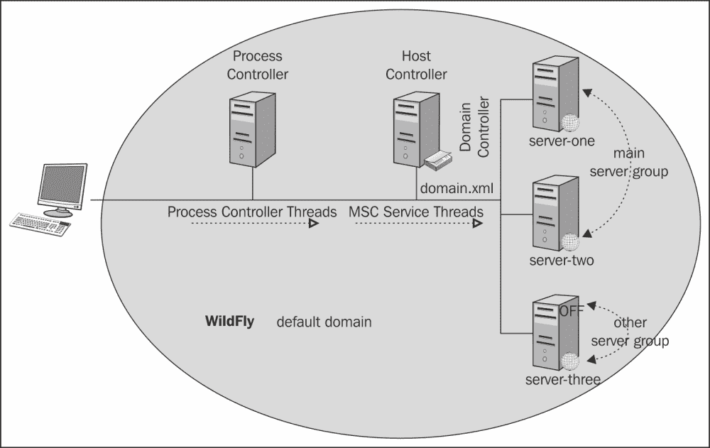

您可以使用`VisualVM`实用程序从 JVM 的角度查看您域的低级细节。您可以从以下截图看到生成了四个 JVM 进程。首先启动的是进程控制器，然后它依次启动主机控制器进程和两个服务器节点。

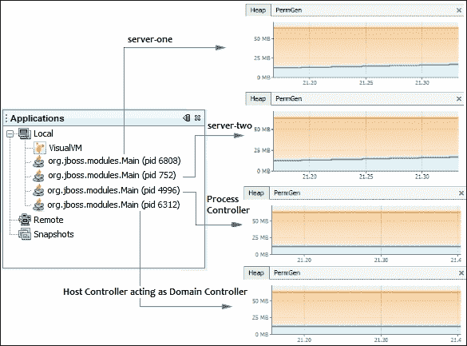

### 注意

**VisualVM**是一个包含在默认 Java SE 分发的 Java 虚拟机监控工具。您可以在`JAVA_HOME/bin`文件夹中找到它。在 Windows 上，只需启动`jvisualvm.exe`，在 Linux 上则启动`jvisualvm`。

从前面的截图可以注意到的重点是，在基本域设置中，主机控制器也充当域控制器，也就是说，主机控制器持有域的集中配置。这意味着主机控制器和域控制器共享同一个 JVM 进程。

在完成对应用程序服务器域的基本介绍后，我们将现在涵盖有关其配置的所有细节。

# 启动和停止域

启动 WildFly 域只需运行`JBOSS_HOME\bin\domain.sh`脚本（在 Windows 上为`JBOSS_HOME\bin\domain.bat`）。几秒钟内，您的域将启动并运行。请查看以下截图：

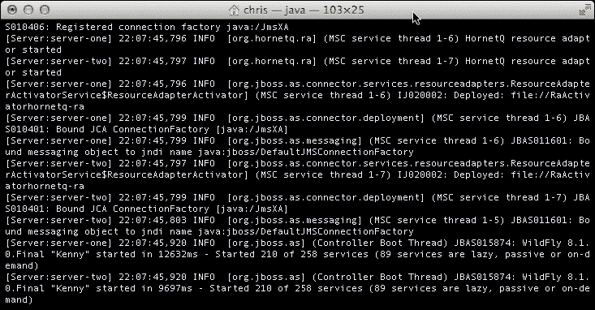

为了停止应用程序服务器域，您可以在启动域的同一窗口中使用*Ctrl* + *C*快捷键，或者您可以使用命令行客户端并向主机控制器发出`shutdown`命令。

Unix/Linux 用户可以执行以下命令：

```java
./jboss-cli.sh --connect command=/host=master:shutdown

```

Windows 用户可以执行以下命令：

```java
jboss-cli.bat --connect command=/host=master:shutdown

```

### 注意

默认主机名是`master`，它在`host.xml`文件中定义，该文件位于`JBOSS_HOME\domain\configuration`文件夹中。我们将在下一节中了解更多关于它的信息。

一旦域启动，`JBOSS_HOME\domain\log`目录内将创建几个日志文件。主机控制器活动被写入`host-controller.log`文件，而进程控制器日志被写入`process-controller.log`文件。

# 配置域

设置 WildFly 域的主要优势之一是能够从单个集中点控制和管理服务器配置和部署。主要域配置由以下两个文件组成，这些文件位于`JBOSS_HOME\domain\configuration`文件夹中，如下所示：

+   `domain.xml`：此文件描述了你的域服务器的功能，并定义了域中的服务器组。虽然此文件可以在每个主机上找到，但只有位于域控制器上的`domain.xml`文件被使用。

+   `host.xml`：此文件存在于安装域的每个主机上，并指定了特定于在主机上运行的服务器的元素。

## 覆盖默认配置文件

可以使用除了在标准安装中提供的默认文件之外的配置文件。你可以通过在 shell 命令中添加以下参数来使用自己的自定义配置文件：

```java
./domain.sh --domain-config=custom_domain.xml
./domain.sh –host-config=custom_host.xml

```

Windows 用户使用相同的参数，但显然使用`domain.bat`文件。

注意，如果你没有提供任何自定义配置文件的路径，它将被假定为相对于`jboss.server.config.dir`目录的相对路径。否则，你需要提供文件的绝对路径。

## 配置 domain.xml 文件

`domain.xml`文件包含了域中所有服务器共享的域子系统配置。文件内容遵循独立文件的结构，但有一个明显且重要的区别——域中可以定义多个配置文件。默认情况下，定义了四个配置文件：一个默认配置文件、一个完整配置文件、一个 ha 配置文件，最后是一个全 ha 配置文件，后两个用于集群域。然而，你也可以定义自己的自定义配置文件，例如消息配置文件，如下面的图像所示：

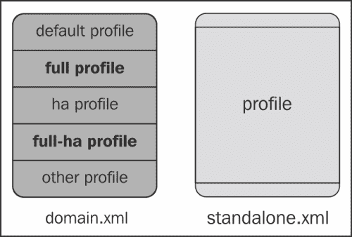

### 提示

从一个配置文件切换到另一个配置文件是推荐的方式来扩展或缩小你域中运行的服务器的功能。

每个 WildFly 域可以进一步拆分为服务器组，每个组绑定到不同的配置文件。服务器组的概念可以看作是域管理作为一个单一单元的一组服务器。实际上，您可以使用服务器组进行节点细粒度配置；例如，每个服务器组能够定义自己的设置，如定制的 JVM 设置、套接字绑定接口和部署的应用程序。以下图解说明了可以应用于服务器组内服务器的一些常见属性：

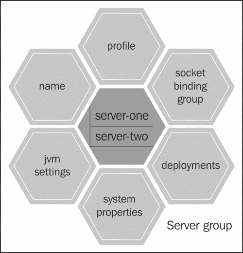

例如，以下是一个更完整的与`default`配置文件绑定的服务器组定义。此服务器组定义了一个名为`sample.war`的 Web 应用程序，该应用程序可供组内的所有服务器使用。它还定义了一个定制的 JVM 配置和一些系统属性（在启动时加载），并将其服务绑定到`standard-sockets`定义，如下所示：

```java
<server-group name="custom-server-group" profile="default">
  <deployments>
    <deployment name="sample.war_v1" runtime-name="sample.war" /> 
  </deployments>
  <jvm name="default">
    <heap size="512m" max-size="1g"/>
  </jvm>
  <socket-binding-group ref="standard-sockets"/>
  <system-properties>
    <property name="foo" value="bar" boot-time="true"/>
    <property name="key" value="value" boot-time="true"/>
  </system-properties>
</server-group>
```

## 配置 host.xml 文件

另一个域配置文件名为`host.xml`，位于`JBOSS_HOME\domain\configuration`文件夹中。此文件基本上定义并配置了作为域一部分运行在主机上的服务器节点。这里使用的“主机”一词表示物理或虚拟主机。在每一个主机中，都包含域中服务器的一部分。每个主机可以有零个或多个服务器实例。以下图解说明了这些细节：

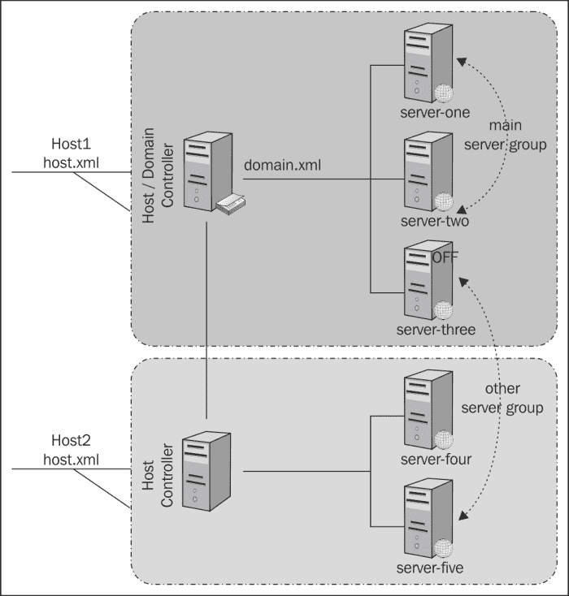

如您所见，一个域可以包含多个主机（**host1**、**host2**）以及多个组（**主服务器组**、**其他服务器组**）。然而，虽然**服务器组**是服务器节点（可以位于任何位置）的逻辑关联，但**主机**指的是位于同一物理或虚拟机器上的节点集合。在提供了我们对主机的定义之后，我们现在来看看主机配置文件，它允许您配置以下一组核心域元素：

+   用于控制域的管理接口

+   域控制器定义

+   绑定服务的网络接口

+   定义好的 JVM 的配置

+   域的一部分服务器

在下一节中，我们将详细查看`host.xml`文件的每个元素，并学习如何适当地配置它。

## 配置管理接口

管理接口包括用于管理域的本地**命令行****接口**（**CLI**）和`http`接口的定义。以下示例取自`host.xml`文件：

```java
<management-interfaces>
    <native-interface security-realm="ManagementRealm">
        <socket interface="management" port="9999"/>
    </native-interface>
    <http-interface security-realm="ManagementRealm" http-upgrade-enabled="true">
        <socket interface="management" port="9990"/>
    </http-interface>
</management-interfaces>
```

使用默认配置，两个服务都绑定到`management`网络接口。CLI 和管理接口监听端口`9990`。如果您出于某种原因想要恢复到 JBoss AS 7 设置并在端口`9999`上运行，则`native`接口配置应保持不变。

## 配置网络接口

我们刚刚提到了`网络接口`。正如其名称所暗示的，一个**网络接口**指的是一个网络地址或一组网络地址。默认情况下，服务器包含三个网络接口定义，即**管理**、**公共**和**不安全**，所有这些都被绑定到回环地址（`127.0.0.1`）。

通过更改网络接口的`inet-address`值，您可以配置应用程序服务器的监听地址。例如，如果我们想将`管理`接口绑定到回环地址（`127.0.0.1`），并将`公共`接口绑定到地址`192.168.1.1`，您可以使用以下配置：

```java
<interfaces>
 <interface name="management">
        <inet-address value="127.0.0.1"/>
    </interface>
 <interface name="public">
        <inet-address value="192.168.1.1"/>
    </interface>
</interfaces>
```

您也可以通过运行以下命令通过命令行更新这些属性：

```java
[standalone@localhost:9990 /] /interface=management:write-attribute(name=inet-address,value=127.0.0.1)
[standalone@localhost:9990 /] /interface=public:write-attribute(name=inet-address,value=192.168.1.1)

```

实际上，这意味着`管理`接口（`http`管理控制台和 CLI）将被绑定到回环地址，而与应用程序相关的服务（绑定到`公共`接口）将被绑定到 IP 地址`192.168.1.1`。以下配置来自`domain.xml`文件。在这里，您可以看到它是如何使用之前定义的`公共`接口的：

```java
<socket-binding-group name="standard-sockets" default-interface="public">
  <socket-binding name="http" port="8080"/>
  <socket-binding name="https" port="8443"/>
  ...
</socket-binding-group>
```

## 配置域控制器

默认情况下，域控制器位于您启动域的同一台机器上。请看以下命令：

```java
<domain-controller>
  <local/>
</domain-controller>
```

您可以按照以下方式配置您的宿主以使用位于远程宿主上的域控制器：

```java
<domain-controller>
  <remote host="192.168.100.1" port="9999" security-realm="ManagementRealm"/>
</domain-controller>
```

### 注意

如果管理接口绑定到`localhost`，则此操作不会生效。请确保您正确更新了管理接口。

在远程宿主机上配置域控制器意味着将不会使用本地配置（`domain.xml`），并且该宿主机上的所有服务器节点都将使用集中化的远程配置。您需要授权才能访问域控制器。我们将在本章末尾的域示例中详细介绍这一点。

## 配置 JVM

域配置的一个关键方面是为给定主机定义 JVM 参数。JVM 的元素在`host.xml`文件中定义。在这里，您可以定义 JVM 设置并将它们与一个名称关联：

```java
<jvms> 
    <permgen size="256m" max-size="256m"/> 
    <jvm-options> 
      <option value="-server"/> 
    </jvm-options> 
</jvms>
```

### 小贴士

目前，没有可用的元素来配置 Java 8 Metaspace 属性。要配置这些属性，您需要将它们作为`option`元素添加。要设置初始大小，使用`-XX:MetaspaceSize=256m`，要设置最大大小，使用`-XX:MaxMetaspaceSize=256m`。

然后，您可以通过在`server-group`配置中引用`jvm`名称属性，将此 JVM 定义用作服务器组配置的一部分。请注意，`server-group`中的任何 JVM 定义都会覆盖`jvms`定义中的定义。例如，`main-server-group`（`domain.xml`）服务器组使用所有服务器节点的`default` JVM，但重新定义了`heap max-size`和`size`值。请看以下代码：

```java
<server-group name="main-server-group" profile="full">
  <jvm name="default">
    <heap size="64m" max-size="512m"/>
  </jvm>
  <socket-binding-group ref="full-sockets"/>
</server-group>
```

定义好的 JVM 也可以关联到单个服务器，从而覆盖服务器组定义。例如，在这里，`server-one`（在 `host.xml` 中定义）继承了 `default` JVM 配置，但随后覆盖了最小（512 MB）和最大堆大小（1 GB）：

```java
<server name="server-one" group="main-server-group" auto-start="true">
  <jvm name="default">
    <heap size="512m" max-size="1G"/>
  </jvm>
</server>
```

### 向服务器定义添加 JVM 选项

如果你想进一步专业化你的 JVM 配置，例如，通过向虚拟机添加非标准选项，你可以使用 `jvm-options` 元素（`host.xml`）。在这个例子中，我们将并发、低延迟垃圾收集器添加到 `default` JVM 选项中：

```java
<jvms>
    <jvm name="default">
        <heap size="64m" max-size="128m"/>
        <jvm-options>
            <jvm-option value="-XX:+UseConcMarkSweepGC"/>
        </jvm-options>
    </jvm>
</jvms>
```

### 元素之间的优先级顺序

在上一节中，我们向您展示了如何在不同的配置文件（`host.xml` 和 `domain.xml`）中使用 `default` JVM 定义。事实上，JVM 定义是配置在文件之间重叠的典型例子，这意味着 JVM 可以在任何以下级别进行配置：

+   **主机级别**：此配置将应用于 `host.xml` 中定义的所有服务器

+   **服务器组级别**：此配置适用于组中所有服务器

+   **服务器级别**：此配置仅用于单个主机

到目前为止，一切顺利。然而，如果我们定义了多个级别具有相同名称的元素，会发生什么？应用程序服务器通过允许最具体的元素覆盖其父配置来解决此问题。换句话说，如果你在主机级别定义了一个通用的 JVM，它将被服务器组级别的相同 JVM 覆盖。看看以下代码：

```java
<!-- host.xml -->
<jvms>
  <jvm name="default">
    <heap size="64m" max-size="256m"/>
  </jvm>
</jvms>

<!—- domain.xml -->

<!—- Here the "default" jvm will be overridden by the server group jvm definition -->

<server-group name="other-server-group" profile="default">
  <jvm name="default">
    <heap size="64m" max-size="512m"/>
  </jvm>
  <socket-binding-group ref="standard-sockets"/>
</server-group>
```

如果你也在服务器级别定义它，那么这就是该服务器的最终选择。看看以下代码：

```java
<!- Here, the server definition overrides any other host/group definition -->
<server name="server-one" group="main-server-group">
  <jvm name="default">
    <heap size="256m" max-size="768m"/>
  </jvm>
</server>
```

以下图描述了可以在不同配置级别定义（和可能覆盖）的元素：

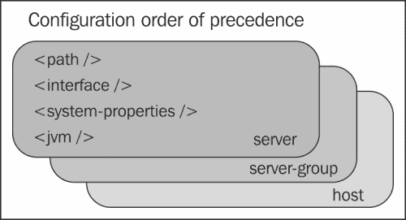

如您所见，此列表还包括一些元素，如 `<path>` 元素、`<interface>` 元素和 `<system-properties>` 元素，我们已在 第二章 中讨论过，*配置 WildFly 核心子系统*。

### 配置服务器节点

主机配置的最后元素包括构成域的服务器节点列表。配置服务器至少需要服务器的名称和服务器所属的组。看看以下代码：

```java
<!-- host.xml configuration file -->
<servers>
  <server name="server-one" group="main-server-group" />
</servers>
```

这个服务器定义在很大程度上依赖于应用程序服务器节点的默认属性。然而，你可以通过添加特定的路径、套接字绑定接口、系统属性和 JVM 来高度自定义你的服务器。看看以下代码：

```java
<server auto-start="true" name="sample" group="sample-group" >
  <paths>
    <path name="example" path="example" relative-to="jboss.server.log.dir"/>
  </paths>
  <socket-bindings port-offset="259" socket-binding-group="standard-sockets" />
  <system-properties>
    <property boot-time="true" name="envVar" value="12345"/>
  </system-properties>
  <jvm name="default">
    <heap size="256m" max-size="512m"/>
  </jvm>
</server>
```

如果你想了解服务器节点配置的所有适用属性，我们建议你查看位于服务器发行版`JBOSS_HOME/docs/schema`文件夹中的`jboss-as-config_2_1.xsd`模式，在 Eclipse 中，你可以右键单击模式文件，然后点击**生成** | **XML 文件**。

## 应用域配置

对于刚开始接触域概念的新用户来说，一个常见的误解是认为域几乎等同于节点集群，因此它可以用来实现重要功能，如负载均衡和高可用性。

重要的是要理解，域与你的应用程序提供的功能无关——域的设计是基于服务器管理的概念。因此，你可以用它来管理集群应用程序和非集群应用程序。

为了更好地理解这一点，让我们举一个例子。假设你的服务器拓扑由多个服务器组成，并且你已经定义了一个将被应用程序使用的数据源。因此，无论你是否使用集群，你都需要在你的所有独立服务器配置中配置你的数据源（这意味着在每个`standalone.xml`文件中添加数据源的定义）。在这种情况下，使用域的优势是显而易见的：数据源定义仅包含在域控制器中，它提供了一个中心点，用户可以通过它保持配置的一致性。它还有将配置更改协调一致地部署到服务器的优势。域的另一个重要方面是能够提供比集群更细粒度的配置。例如，你可以定义服务器组，每个组都有自己的自定义配置。为了使用集群配置实现相同的功能，你必须管理每台机器的独立配置，并适应你的需求。

然而，域和集群并不是相互排斥的场景，它们通常是更大图景的一部分。例如，使用域可以在需要管理多个 AS 实例的启动和停止的高级配置中进一步提高集群的效率。同时，集群提供了典型的负载均衡和高可用性功能，这些功能并未集成到域管理中。

另一方面，也存在一些情况，使用域可能并不那么有用。例如，可能你的系统管理员已经购买或开发了他们自己的复杂的多服务器管理工具，这些工具可以做到与域配置所能做到的大同小异。在这种情况下，可能并不希望替换已经配置好的内容。

另一个不需要域的经典例子是开发阶段，在这个阶段，你从域名安装中得不到任何好处。相反，它可能给你的架构增加不必要的额外复杂性。

此外，在某些情况下，独立模式是唯一可用的选择。例如，如果你在嵌入式模式下运行应用程序服务器，那么选择域名是不兼容的。例如，在使用 Arquillian 项目时，你可以使用嵌入式容器测试你的企业项目，该容器由 Arquillian 使用独立配置管理。

总结一下，由于在运行域名模式或独立模式时，单个服务器配置不会发生变化，因此你可以在独立模式下轻松开发你的应用程序，然后在准备部署生产应用程序时切换到域名模式。

# 创建我们自己的域名配置

我们现在将提供一个详细的域名配置示例。在这个例子中，我们包括两个独立的主机控制器配置，每个配置都有一个包含三个节点的列表。你需要两个独立的 WildFly 8 安装，这些安装可以在两台不同的机器上执行，也可以在同一台机器上执行。当在同一台机器上运行时，为你的机器分配一个虚拟 IP 地址是实用的，这样你就不需要在域名中遇到任何端口冲突。

下图显示了我们的域名项目：

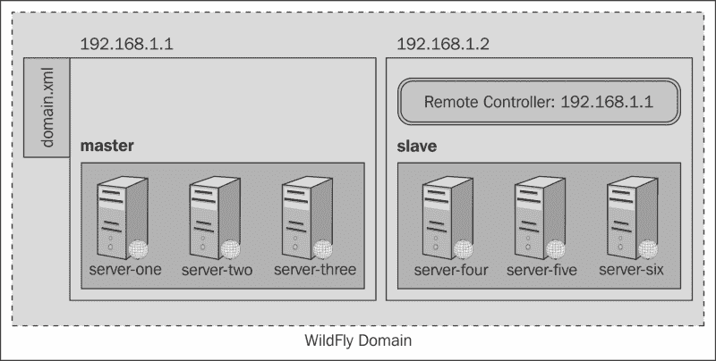

我们需要做的第一件事是将网络接口绑定到一个有效的 `inet` 地址，无论是公共接口还是管理接口。因此，假设第一个域名安装（master）将绑定到 `inet` 地址 `192.168.1.1`，打开 `host.xml` 文件并相应地更改它，如下所示：

```java
<interfaces>
    <interface name="management">
        <inet-address value="192.168.1.1"/>
    </interface>
    <interface name="public">
        <inet-address value="192.168.1.1"/>
    </interface>
</interfaces>
```

在第二个域名安装（slave）中，将 `host.xml` 中的 `inet` 地址更改为 `192.168.1.2`，如下所示：

```java
<interfaces>
    <interface name="management">
 <inet-address value="192.168.1.2"/>
    </interface>
    <interface name="public">
 <inet-address value="192.168.1.2"/>
    </interface>
</interfaces>
```

下一步是为每个安装定义一个独特的主机名。因此，对于第一个 `host.xml` 文件，使用以下代码：

```java
<host name="master"/>
```

对于第二个文件，只需使用以下方法：

```java
<host name="slave"/>
```

接下来，最重要的步骤是选择域控制器所在的位置。正如我们之前在图像中所示，域控制器将位于第一个安装（master）中，因此，在 `host.xml` 文件中，你应该包含以下默认内容：

```java
<domain-controller>
 <local/>
</domain-controller>
```

现在，看看另一个安装（slave），指向运行在主机 `192.168.1.1`（master）上的域控制器，如下所示：

```java
<domain-controller>
 <remote host="192.168.1.1" port="9999"/>
</domain-controller>
```

从属服务器连接到域控制器需要认证，因此接下来我们将向包含主域的安装中添加一个用户。为此，你需要在你的 WildFly 安装 `bin` 目录中运行 `add-user` 脚本，如下所示：

```java
JBOSS_HOME/bin/add-user.sh
```

执行以下步骤：

1.  当被问及 **你希望添加哪种类型的用户？** 时，输入 `a`（管理用户）。

1.  当被要求输入用户名时，输入 `slave`。

1.  当被要求输入密码时，输入 `password`。

1.  当被问及**您希望此用户属于哪些组？**时，请留空。

1.  接下来，您将被询问这是否正确。键入`yes`。

1.  最后，也是最重要的，您将被询问是否希望此新用户用于一个 AS 进程连接到另一个 AS 进程。您需要再次键入`yes`。这将导致打印出 XML，我们将将其用于从属配置：

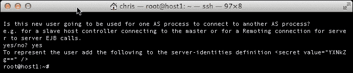

最后，在从属服务器上，我们需要在`host.xml`文件中的`server-identities`元素内添加`secret value`（打印到控制台），如下所示：

```java
<security-realm name="ManagementRealm">
    <server-identities>
        <secret value="YXNkZg==" />
    </server-identities>
    ...
</security-realm>
```

域配置现在已完成。让我们使用`domain.bat/domain.sh`脚本启动包含域控制器（主控制器）的安装，然后启动第二个安装（从属）。

如果一切配置正确，你将看到从属主机已注册在域控制器（主控制器）上，如下所示：

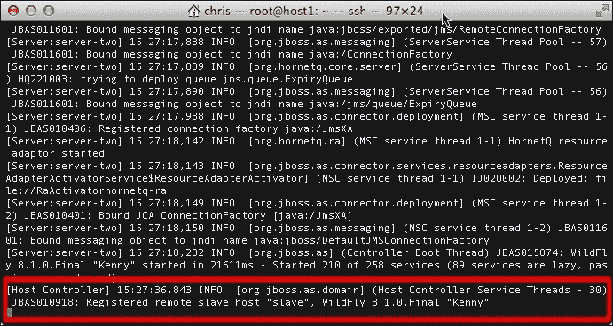

现在，让我们从管理控制台查看域。管理接口将在下一章详细讨论，但我们需要简要地看看它们，以便展示我们的域示例。

### 提示

默认情况下，您需要创建一个管理用户才能登录到管理控制台。目前，您可以使用为从属服务器创建的用户名和密码，但在生产环境中，您很可能会创建不同的管理用户。

如果您将浏览器指向主服务器的管理界面（`http://192.168.1.1:9990`），您将无法访问从属服务器的管理界面。

从管理控制台的主页，有几个选项可以查看您的域配置。目前，我们感兴趣的是查看构成域的主机控制器。因此，在上面的菜单栏中，选择**域**菜单。从这里，您可以从左侧的组合框中选择您感兴趣的主机。

如您所见，您可以根据主机分组找到所有服务器，如下所示：

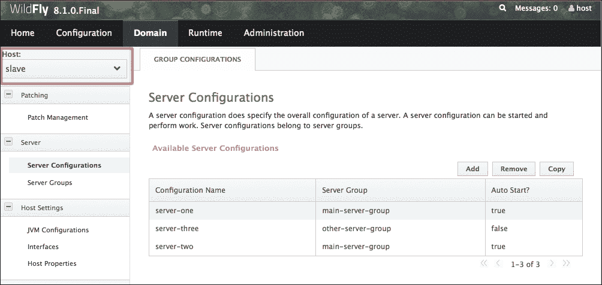

现在，从菜单中选择**运行时**。从这里，您可以查看每个服务器的状态，按服务器组分组，并启动/停止每个节点。例如，根据默认配置，每个分布包含三个节点：启动时激活两个，第三个按需启动。将鼠标悬停在每个节点上，将出现选项，允许您启动/停止单个节点。您还可以启动/停止整个服务器组。此外，请注意，有一个选项可以更改当前正在查看的主机，如下面的屏幕截图所示：

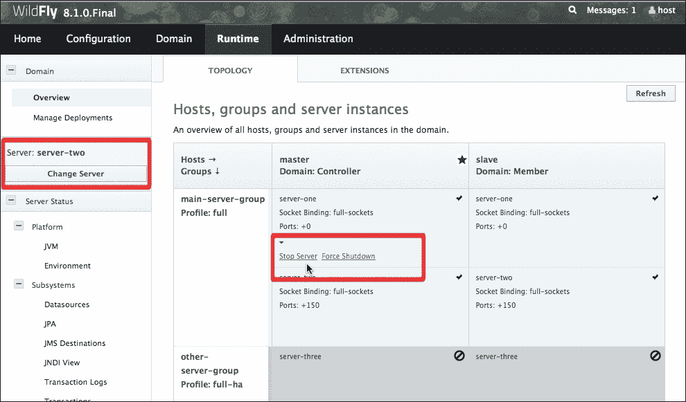

现在应该很清楚，每个主机都有自己的节点列表，所有这些节点都是域的一部分。同时，请记住，每个主机都依赖于`domain.xml`文件中`profiles`部分定义的配置，该配置包含您域使用的域配置文件。如前所述，域相对于单个安装的一个最明显的优势是能够集中管理服务的配置以及部署的资源。

在 Web 控制台中，您还可以部署应用程序或安装模块，如 JDBC 驱动程序。在下一章中，我们将深入讨论如何将模块部署和安装到域中。域模式与独立模式的主要区别在于，一旦数据源被添加到域控制器（`master`），其定义就成为默认配置文件的一部分，并且连接到域的每个主机都会继承其配置。

看看下面的截图：

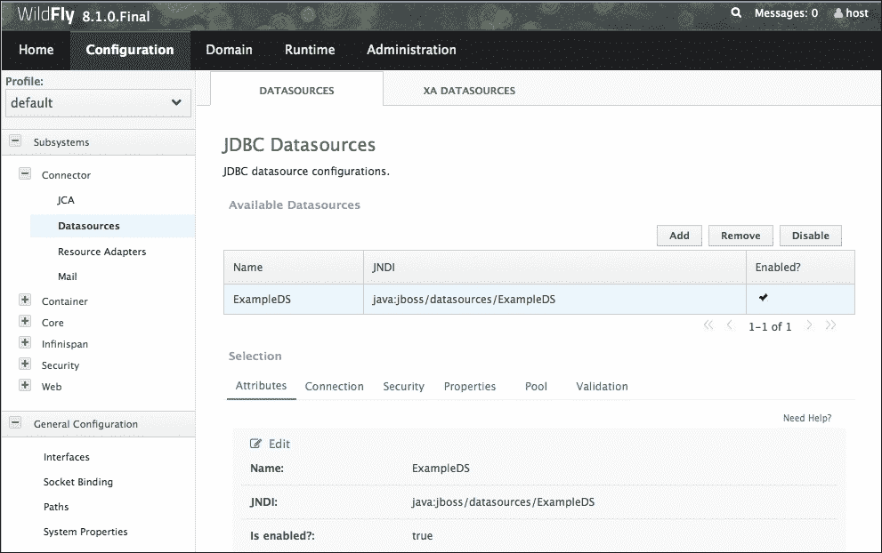

## 在运行时更改域配置

到目前为止，我们在启动域之前修改了配置文件，但在域运行时也可以动态更改配置。由于这些更改是通过管理控制台完成的，因此无需重新启动服务器即可生效。例如，您可能需要动态创建一个新的服务器组，并将其与一些服务器和应用程序关联。可能您的某个生产应用程序存在需要修复的问题。您可以在开发环境中尝试重现该问题，但结果可能并不总是准确，因为开发和生产通常使用不同的数据库和类版本。

因此，您可以快速解决问题的方法之一是创建一个新的服务器组，将其与一个或多个服务器关联，然后在上面部署和测试应用程序。

这可以通过管理员控制台（或 CLI）在几分钟内完成。执行以下步骤：

1.  打开您的浏览器，导航到管理员控制台。然后，在顶部选择**域**菜单选项。从那里，在左侧列中选择**服务器组**选项卡。此界面允许您通过点击**添加**按钮来添加服务器组，如下面的截图所示：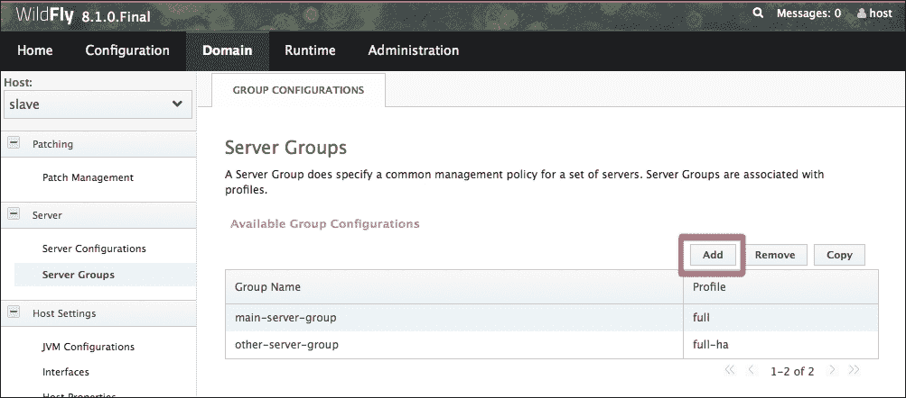

1.  然后，为您的组选择一个有意义的名称，例如`staging-server-group`，并选择一个**配置文件**和**套接字绑定**配置，新的组将基于此配置，如下面的截图所示：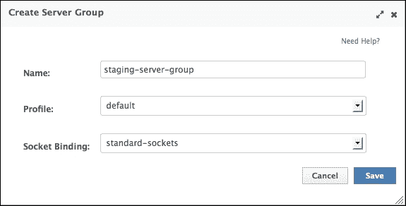

1.  现在，是时候将一个或多个服务器与新的组关联起来。在左侧点击**服务器配置**菜单，然后点击**添加**按钮。看看下面的截图：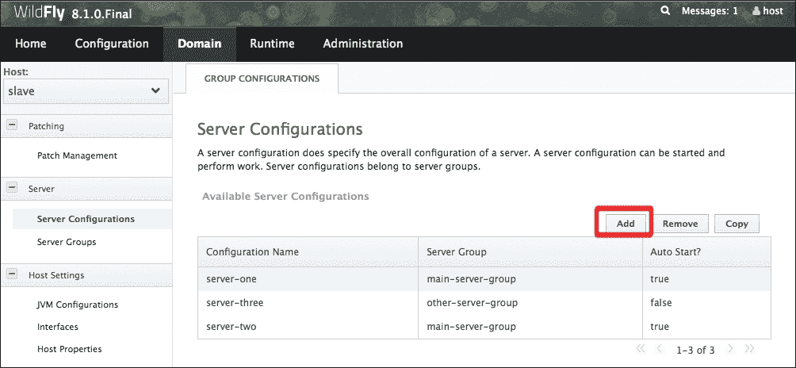

1.  这将弹出一个对话框，要求您输入新的服务器名称和相关的服务器组。在这个例子中，我们将称之为`testServer`。然后，将其与具有`750`（在实际中，每个服务都绑定到默认端口号（+ `750`））端口号偏移的`staging-server-group`关联。请查看以下屏幕截图：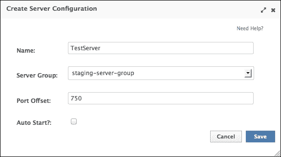

一旦您已设置一个新的服务器组并将一个或多个服务器分配给它，您就可以将应用程序部署到服务器组。应用程序的部署可以从**运行时**页面进行。在左侧单击**管理部署**，它会显示是否已部署了应用程序。请查看以下屏幕截图：

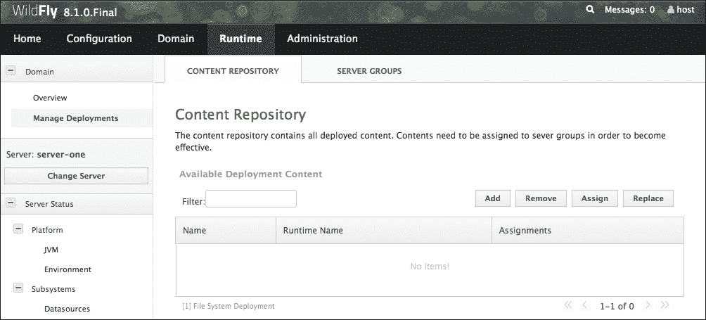

从这里，您可以向您的组添加和删除部署，我们将在下一章介绍。

# 摘要

在本章中，我们介绍了 WildFly 域的设置和配置。通过配置服务器域，您可以从单个集中点管理您的服务器，这在您需要管理大量服务器节点时是非常理想的。

每个域由四个主要元素组成：域控制器、主机控制器、进程控制器和服务器。

域控制器负责处理域配置，而主机控制器协调服务器进程的生命周期和部署的分配。进程控制器处理域服务器进程并管理它们的 I/O 流。

每个域由一个或多个服务器组组成，这允许对域进行精细配置。每个服务器组可以定义自己的 JVM 属性、套接字绑定接口和系统属性，这些属性在启动时加载。您还可以将应用程序部署到域内的每个节点。

服务器组在`domain.xml`配置文件中定义，包括为域启用的企业服务。

服务器组的组成包含在`host.xml`文件中。此文件还包含域控制器的位置、默认 JVMs 以及`network`和`management`接口。

我们将在下一章详细介绍应用程序部署，即*应用程序结构和部署*。
